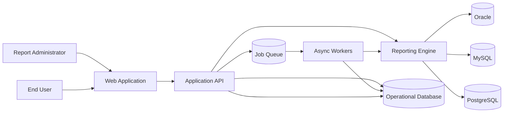
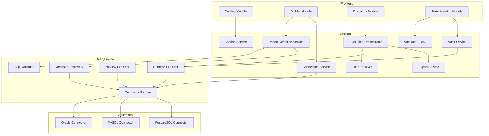

# Recommended Architecture

## Overview

The solution is composed of:

- `Web Frontend`: experience for administrators and end users.
- `Spring Boot Application API`: authentication, catalog, report definition, and orchestration.
- `Reporting Engine`: SQL validation, column discovery, preview, and execution.
- `Workers`: exports, heavy executions, and asynchronous tasks.
- `Operational Database`: metadata, catalog, auditing, and logical queues.
- `Multi-DB Connectors`: adapters for Oracle, MySQL, and PostgreSQL.

## Confirmed Operating Context

- Internal operational reporting platform for domains such as sales and transfers.
- Initial `on-premise` deployment.
- Target capacity of up to `500` concurrent users.
- Low initial cost, prioritizing operational simplicity and efficient infrastructure usage.
- Local authentication in the first version, with preparation for future `AD` integration.

## Context Diagram

## Component Diagram

## Internal Modules

### 1. Identity and Access

- Supports local users in the first version.
- Leaves a decoupled authentication interface ready for later `LDAP/AD` integration.
- Resolves roles: `platform_admin`, `report_admin`, `report_user`, `auditor`.
- Applies permissions by connection, folder/category, and report.

### 2. Catalog Service

- Lists published reports.
- Manages categories, tags, and ownership.
- Exposes the metadata needed for the execution UX.

### 3. Report Definition Service

- Creates and versions reports.
- Maintains base SQL, parameters, columns, and output policies.
- Orchestrates validation and preview.

### 4. Query Engine

- Validates SQL against safe rules.
- Discovers columns and types.
- Executes bounded previews.
- Executes parameterized queries for end-user consumption.

### 5. Execution Orchestrator

- Resolves user filters.
- Validates permissions and limits.
- Decides between synchronous and asynchronous execution.
- Stores full traceability for every run.

### 6. Export Service

- Generates CSV/XLSX files through background jobs.
- Publishes statuses: `pending`, `running`, `completed`, `failed`, `expired`.

### 7. Connection Service

- Manages connections and secrets.
- Abstracts driver and dialect differences.
- Performs health checks.

## Key Principles

- `Controlled SQL`: only `SELECT` and `WITH`, no DDL/DML.
- `Typed parameters`: filters are translated into parameters, not string concatenations.
- `Logical isolation`: the SQL engine depends on interfaces and connectors.
- `Observability`: every execution gets a `correlation_id`.
- `Selective scaling`: stateless API and horizontally scalable workers.
- `Cloud-ready`: externalized configuration, portable packaging, and services decoupled from proprietary infrastructure.

## Stack Recommendation

The architecture works with several stacks, but based on the confirmed decisions the recommendation is to use `Java` and, within that ecosystem, prioritize `Spring Boot` for the first version.

| Stack | Pros | Considerations |
| --- | --- | --- |
| Java + Spring Boot + Quartz/Queue | Excellent enterprise support, mature JDBC ecosystem, strong Oracle support | More verbose |
| Java + Quarkus + Scheduler/Queue | Faster startup and lower footprint | Less common across traditional enterprise ecosystems |

### Recommended Stack

| Layer | Recommended Technology | Reason |
| --- | --- | --- |
| Backend API | Spring Boot 3.x | Mature ecosystem, security, scheduling, and observability |
| Metadata persistence | PostgreSQL | Low cost, robustness, and portability |
| Security | Spring Security | Solid base for local auth and future `LDAP/AD` integration |
| Jobs | Spring Scheduler + persistent queue or Quartz | Low cost and sufficient for the first version |
| UI | Lightweight web SPA | Still open based on team preference |
| Observability | Micrometer + Prometheus/Grafana | Standard and portable stack |

If minimum footprint or aggressive startup times become a higher priority later, `Quarkus` remains a valid option, but the current recommendation is **Spring Boot** because it reduces implementation risk and aligns better with the required enterprise connectivity profile.
