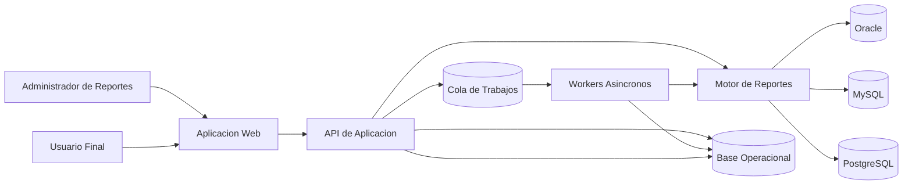
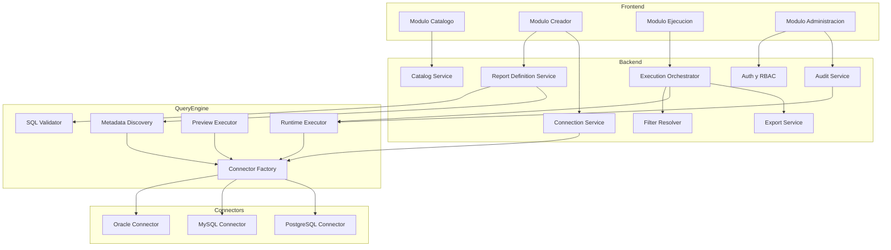

# Arquitectura Recomendada

## Vista general

La solucion se compone de:

- `Frontend Web`: experiencia para administradores y usuarios finales.
- `API de Aplicacion Spring Boot`: autenticacion, catalogo, definicion de reportes y orquestacion.
- `Motor de Reportes`: validacion SQL, discovery de columnas, preview y ejecucion.
- `Workers`: exportaciones, ejecuciones pesadas y tareas asincronas.
- `Base Operacional`: metadata, catalogo, auditoria y colas lógicas.
- `Conectores Multi-DB`: adaptadores para Oracle, MySQL y PostgreSQL.

## Contexto operativo confirmado

- Plataforma interna de reporting operativo para dominios como ventas y traslados.
- Despliegue inicial `on-premise`.
- Capacidad objetivo de hasta `500` usuarios concurrentes.
- Costo inicial bajo, priorizando simplicidad operacional y uso eficiente de infraestructura.
- Autenticacion local en la primera version, con preparacion para integracion futura a `AD`.

## Diagrama de contexto

## Diagrama de componentes

## Modulos internos

### 1. Identity and Access

- Soporta usuarios locales en la primera version.
- Deja una interfaz de autenticacion desacoplada para integrar `LDAP/AD` posteriormente.
- Resuelve roles: `platform_admin`, `report_admin`, `report_user`, `auditor`.
- Aplica permisos por conexion, carpeta/categoria y reporte.

### 2. Catalog Service

- Lista reportes publicados.
- Gestiona categorias, etiquetas y ownership.
- Expone metadata necesaria para UX de ejecucion.

### 3. Report Definition Service

- Crea y versiona reportes.
- Mantiene SQL base, parametros, columnas y politicas de salida.
- Orquesta validacion y preview.

### 4. Query Engine

- Valida el SQL contra reglas seguras.
- Descubre columnas y tipos.
- Ejecuta preview acotado.
- Ejecuta consultas parametrizadas para uso final.

### 5. Execution Orchestrator

- Resuelve filtros del usuario.
- Valida permisos y limites.
- Decide ejecucion sincrona o asincrona.
- Guarda trazabilidad completa de cada corrida.

### 6. Export Service

- Genera CSV/XLSX via background jobs.
- Publica estados: `pending`, `running`, `completed`, `failed`, `expired`.

### 7. Connection Service

- Administra conexiones y secretos.
- Abstrae diferencias de drivers y dialectos.
- Realiza health checks.

## Principios clave

- `SQL controlado`: solo `SELECT` y `WITH`, sin DDL/DML.
- `Parametros tipados`: los filtros se traducen a parametros, no concatenaciones.
- `Aislamiento logico`: el motor SQL depende de interfaces y conectores.
- `Observabilidad`: cada ejecucion tiene `correlation_id`.
- `Escalado selectivo`: API stateless y workers horizontales.
- `Cloud-ready`: configuracion externa, empaquetado portable y servicios desacoplados de infraestructura propietaria.

## Recomendacion de stack

La arquitectura funciona con varios stacks, pero con las decisiones ya confirmadas se recomienda usar `Java` y, dentro de esa familia, priorizar `Spring Boot` para la primera version.

| Stack | Pros | Consideraciones |
|---|---|---|
| Java + Spring Boot + Quartz/Queue | Excelente soporte enterprise, JDBC maduro, Oracle fuerte | Mayor verbosidad |
| Java + Quarkus + Scheduler/Queue | Mejor arranque y menor footprint | Menor familiaridad general del ecosistema enterprise tradicional |

### Stack recomendado

| Capa | Tecnologia recomendada | Motivo |
|---|---|---|
| Backend API | Spring Boot 3.x | Ecosistema maduro, seguridad, scheduling y observabilidad |
| Persistencia metadata | PostgreSQL | Bajo costo, robustez y portabilidad |
| Seguridad | Spring Security | Base solida para auth local y futura integracion `LDAP/AD` |
| Jobs | Spring Scheduler + cola persistente o Quartz | Bajo costo y suficiente para primera version |
| UI | Web SPA ligera | Se mantiene abierta segun preferencia del equipo |
| Observabilidad | Micrometer + Prometheus/Grafana | Stack standard y portable |

Si mas adelante se prioriza footprint minimo o tiempos de arranque agresivos, `Quarkus` sigue siendo una opcion valida, pero la recomendacion actual es **Spring Boot** por menor riesgo de implementacion y mejor alineacion con la conectividad enterprise requerida.
