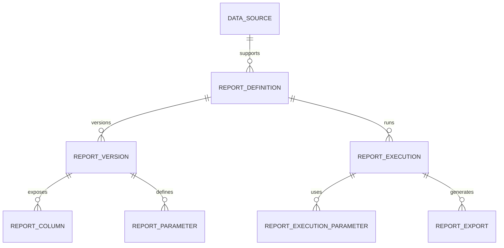

# Data Model and Multi-DB Strategy

## Main Entities

### `data_source`

Represents a registered connection.

- `id`
- `name`
- `db_type` (`oracle`, `mysql`, `postgresql`)
- `host`
- `port`
- `database_or_service`
- `username`
- `secret_ref`
- `ssl_mode`
- `status`
- `created_by`
- `created_at`

### `report_definition`

Defines the functional report.

- `id`
- `name`
- `description`
- `category_id`
- `data_source_id`
- `owner_team`
- `status` (`draft`, `published`, `archived`)
- `current_version_id`
- `created_by`
- `created_at`

### `report_version`

Immutable version of the report's technical content.

- `id`
- `report_definition_id`
- `version_number`
- `sql_text`
- `sql_hash`
- `validation_status`
- `preview_status`
- `max_rows`
- `timeout_seconds`
- `execution_mode` (`sync`, `async`, `auto`)
- `created_by`
- `created_at`

### `report_column`

Output metadata.

- `id`
- `report_version_id`
- `source_name`
- `label`
- `data_type`
- `display_type`
- `display_format`
- `ordinal`
- `is_visible`
- `is_sortable`
- `is_filterable_candidate`

### `report_parameter`

Defines filters that the end user can use.

- `id`
- `report_version_id`
- `name`
- `label`
- `parameter_type`
- `operator_type`
- `required`
- `default_value`
- `allows_multiple`
- `source_column`
- `validation_rule`

### `report_execution`

Execution instance.

- `id`
- `report_definition_id`
- `report_version_id`
- `requested_by`
- `requested_at`
- `status`
- `execution_mode`
- `row_count`
- `duration_ms`
- `error_code`
- `error_message_sanitized`
- `correlation_id`

### `report_execution_parameter`

- `execution_id`
- `parameter_name`
- `parameter_value_masked`

### `report_export`

- `id`
- `execution_id`
- `format`
- `storage_path`
- `status`
- `expires_at`

### `audit_event`

- `id`
- `actor`
- `action`
- `entity_type`
- `entity_id`
- `payload_json`
- `created_at`

## Conceptual Relationship



## Multi-DB Abstraction Strategy

## Core Contracts

```text
interface DbConnector {
  testConnection(connection): HealthCheckResult
  discoverColumns(connection, sql, params): List<ColumnMetadata>
  executePreview(connection, sql, params, limit): QueryResult
  executeQuery(connection, sql, params, pagination, timeout): QueryResult
  translateDialectFeatures(sql): SqlPlan
}
```

```text
interface QueryValidator {
  validateReadOnly(sql): ValidationResult
  extractNamedParameters(sql): List<SqlParameter>
  rejectDangerousPatterns(sql): ValidationResult
}
```

## Layer Responsibilities

- `QueryValidator` is engine-agnostic for general rules.
- `DbConnector` encapsulates driver, pagination, quoting, and metadata differences.
- The domain never knows driver-specific details.

## Engine Differences to Consider

| Topic | Oracle | MySQL | PostgreSQL |
| --- | --- | --- | --- |
| Driver | JDBC Thin / ODP.NET | MySQL Connector | PG JDBC / Npgsql |
| Pagination | `OFFSET/FETCH` or wrapping depending on version | `LIMIT/OFFSET` | `LIMIT/OFFSET` |
| Metadata | May require consistent aliases | Straightforward | Straightforward |
| Dates | Types and zones must be validated | Watch timezone behavior | Good timezone support |
| Catalog | `service name` or SID | database/schema | database/schema |

## Supported SQL Rules

- Allowed: `SELECT`, `WITH`, subqueries, joins, aggregations, and read-only functions.
- Restricted: `INSERT`, `UPDATE`, `DELETE`, `MERGE`, `ALTER`, `DROP`, `TRUNCATE`, `CALL`, `EXEC`.
- Restricted: multiple statements separated by `;`.
- Restricted: suspicious comments that try to bypass the parser.
- Restricted: unapproved hints or functions if they compromise performance.

## Filter Strategy

The recommendation is to define filters through named parameters inside the SQL, for example:

```sql
SELECT
  c.customer_id,
  c.customer_name,
  o.total_amount,
  o.order_date
FROM orders o
JOIN customers c ON c.customer_id = o.customer_id
WHERE (:customer_id IS NULL OR c.customer_id = :customer_id)
  AND (:date_from IS NULL OR o.order_date >= :date_from)
  AND (:date_to IS NULL OR o.order_date < :date_to)
```

The builder detects `:customer_id`, `:date_from`, and `:date_to`, then allows configuration of:

- data type,
- visible label,
- required flag,
- operator,
- default value,
- UI controls.

## Preview and Discovery

### Suggested Flow

1. The administrator selects a data source.
2. They enter SQL.
3. The system validates basic syntax and security rules.
4. Named parameters are extracted.
5. `discoverColumns` is executed.
6. Preview runs with `LIMIT N`.
7. The user adjusts labels, formats, and filters.

## Final Recommendation

Operational metadata must live in the system's own database, not in source databases. The multi-DB strategy should be implemented with a `Connector Factory` and dedicated connectors per engine, while preserving a single contract for discovery, preview, and execution.
