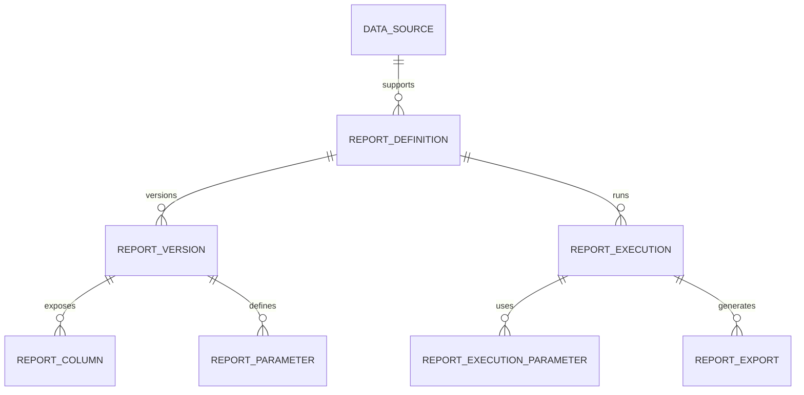

# Modelo de Datos y Estrategia Multi-DB

## Entidades principales

### `data_source`

Representa una conexion registrada.

- `id`
- `name`
- `db_type` (`oracle`, `mysql`, `postgresql`)
- `host`
- `port`
- `database_or_service`
- `username`
- `secret_ref`
- `ssl_mode`
- `status`
- `created_by`
- `created_at`

### `report_definition`

Define el reporte funcional.

- `id`
- `name`
- `description`
- `category_id`
- `data_source_id`
- `owner_team`
- `status` (`draft`, `published`, `archived`)
- `current_version_id`
- `created_by`
- `created_at`

### `report_version`

Version inmutable del contenido tecnico del reporte.

- `id`
- `report_definition_id`
- `version_number`
- `sql_text`
- `sql_hash`
- `validation_status`
- `preview_status`
- `max_rows`
- `timeout_seconds`
- `execution_mode` (`sync`, `async`, `auto`)
- `created_by`
- `created_at`

### `report_column`

Metadata de salida.

- `id`
- `report_version_id`
- `source_name`
- `label`
- `data_type`
- `display_type`
- `display_format`
- `ordinal`
- `is_visible`
- `is_sortable`
- `is_filterable_candidate`

### `report_parameter`

Define filtros usables por el usuario final.

- `id`
- `report_version_id`
- `name`
- `label`
- `parameter_type`
- `operator_type`
- `required`
- `default_value`
- `allows_multiple`
- `source_column`
- `validation_rule`

### `report_execution`

Instancia de ejecucion.

- `id`
- `report_definition_id`
- `report_version_id`
- `requested_by`
- `requested_at`
- `status`
- `execution_mode`
- `row_count`
- `duration_ms`
- `error_code`
- `error_message_sanitized`
- `correlation_id`

### `report_execution_parameter`

- `execution_id`
- `parameter_name`
- `parameter_value_masked`

### `report_export`

- `id`
- `execution_id`
- `format`
- `storage_path`
- `status`
- `expires_at`

### `audit_event`

- `id`
- `actor`
- `action`
- `entity_type`
- `entity_id`
- `payload_json`
- `created_at`

## Relacion conceptual



## Estrategia de abstraccion multi-DB

## Contratos principales

```text
interface DbConnector {
  testConnection(connection): HealthCheckResult
  discoverColumns(connection, sql, params): List<ColumnMetadata>
  executePreview(connection, sql, params, limit): QueryResult
  executeQuery(connection, sql, params, pagination, timeout): QueryResult
  translateDialectFeatures(sql): SqlPlan
}
```

```text
interface QueryValidator {
  validateReadOnly(sql): ValidationResult
  extractNamedParameters(sql): List<SqlParameter>
  rejectDangerousPatterns(sql): ValidationResult
}
```

## Responsabilidades por capa

- El `QueryValidator` es agnostico del motor en reglas generales.
- El `DbConnector` encapsula diferencias de driver, paginacion, quoting y metadata.
- El dominio nunca conoce detalles del driver.

## Diferencias por motor a contemplar

| Tema | Oracle | MySQL | PostgreSQL |
|---|---|---|---|
| Driver | JDBC Thin / ODP.NET | MySQL Connector | PG JDBC / Npgsql |
| Paginacion | `OFFSET/FETCH` o envoltura segun version | `LIMIT/OFFSET` | `LIMIT/OFFSET` |
| Metadata | Puede requerir alias consistentes | Sencilla | Sencilla |
| Fechas | Tipos y zonas a validar | Cuidado con timezone | Buen soporte timezone |
| Catalogo | `service name` o SID | database/schema | database/schema |

## Reglas de SQL soportado

- Permitido: `SELECT`, `WITH`, subqueries, joins, agregaciones y funciones de lectura.
- Restringido: `INSERT`, `UPDATE`, `DELETE`, `MERGE`, `ALTER`, `DROP`, `TRUNCATE`, `CALL`, `EXEC`.
- Restringido: multiples sentencias separadas por `;`.
- Restringido: comentarios sospechosos que intenten evadir el parser.
- Restringido: hints o funciones no aprobadas si comprometen performance.

## Estrategia de filtros

Se recomienda que los filtros se definan mediante parametros nombrados dentro del SQL, por ejemplo:

```sql
SELECT
  c.customer_id,
  c.customer_name,
  o.total_amount,
  o.order_date
FROM orders o
JOIN customers c ON c.customer_id = o.customer_id
WHERE (:customer_id IS NULL OR c.customer_id = :customer_id)
  AND (:date_from IS NULL OR o.order_date >= :date_from)
  AND (:date_to IS NULL OR o.order_date < :date_to)
```

El creador detecta `:customer_id`, `:date_from`, `:date_to` y permite asociar:

- tipo de dato,
- etiqueta visible,
- obligatoriedad,
- operador,
- valor por defecto,
- controles UI.

## Preview y discovery

### Flujo sugerido

1. El usuario administrador selecciona origen de datos.
2. Ingresa SQL.
3. El sistema valida sintaxis basica y reglas de seguridad.
4. Se extraen parametros nombrados.
5. Se ejecuta `discoverColumns`.
6. Se ejecuta preview con `LIMIT N`.
7. El usuario ajusta etiquetas, formatos y filtros.

## Recomendacion Final

La metadata operacional debe vivir en una base propia del sistema y no en las bases fuente. La estrategia multi-DB debe implementarse con una `Connector Factory` y conectores dedicados por motor, manteniendo un contrato unico para discovery, preview y ejecucion.
