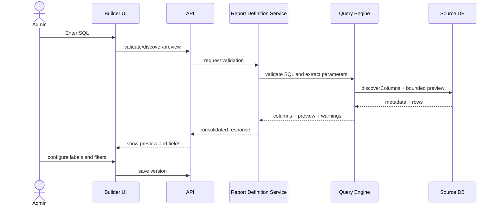
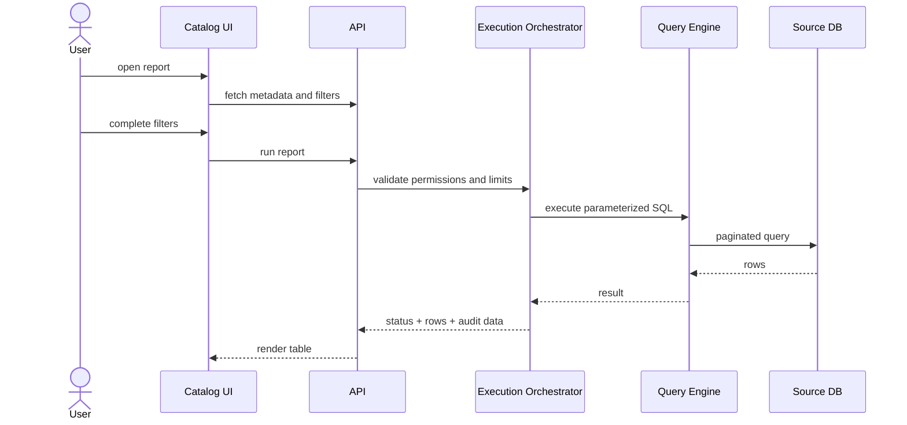
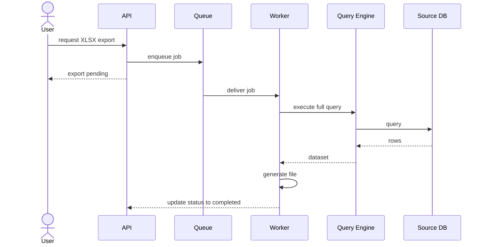

# API and Flows

## API Principles

- REST API for business operations.
- Paginated responses for listings and results.
- Idempotency for testing operations where applicable.
- API versioning through `/api/v1`.
- Authorization through scopes and domain permissions.

## Main Endpoints

### Connections

- `POST /api/v1/data-sources`
- `POST /api/v1/data-sources/{id}/test`
- `GET /api/v1/data-sources`
- `PATCH /api/v1/data-sources/{id}`
- `POST /api/v1/data-sources/{id}/disable`

### Reports

- `POST /api/v1/reports`
- `GET /api/v1/reports`
- `GET /api/v1/reports/{id}`
- `PATCH /api/v1/reports/{id}`
- `POST /api/v1/reports/{id}/versions`
- `POST /api/v1/reports/{id}/publish`
- `POST /api/v1/reports/{id}/archive`

### Builder

- `POST /api/v1/report-builder/validate`
- `POST /api/v1/report-builder/discover-columns`
- `POST /api/v1/report-builder/preview`

### Execution

- `GET /api/v1/catalog/reports`
- `POST /api/v1/report-executions`
- `GET /api/v1/report-executions/{id}`
- `GET /api/v1/report-executions/{id}/rows`
- `POST /api/v1/report-executions/{id}/exports`
- `GET /api/v1/report-exports/{id}`

### Auditing and Operations

- `GET /api/v1/audit/events`
- `GET /api/v1/operations/executions`
- `GET /api/v1/operations/metrics`

## Example Payloads

### Create Report

```json
{
  "name": "Sales by customer",
  "description": "Operational sales report",
  "categoryId": "sales",
  "dataSourceId": "ds_pg_001"
}
```

### Validate SQL

```json
{
  "dataSourceId": "ds_pg_001",
  "sql": "SELECT c.customer_id, c.customer_name FROM customers c WHERE (:customer_id IS NULL OR c.customer_id = :customer_id)"
}
```

### Column Response

```json
{
  "valid": true,
  "parameters": [
    {
      "name": "customer_id",
      "inferredType": "string"
    }
  ],
  "columns": [
    {
      "sourceName": "customer_id",
      "label": "customer_id",
      "dataType": "varchar"
    },
    {
      "sourceName": "customer_name",
      "label": "customer_name",
      "dataType": "varchar"
    }
  ],
  "warnings": []
}
```

### Run Report

```json
{
  "reportId": "rpt_ventas_cliente",
  "parameters": {
    "customer_id": "C-1002",
    "date_from": "2026-01-01",
    "date_to": "2026-02-01"
  },
  "page": 1,
  "pageSize": 100
}
```

## Flow 1: Report Creation



## Flow 2: End-User Execution



## Flow 3: Asynchronous Export



## API Business Rules

- A report cannot be published without a successful preview.
- A report in `draft` state cannot be executed.
- Required parameters must be validated before reaching the engine.
- Technical errors must be translated into functional error codes.
- Exports must expire and be cleaned up automatically.

## Final Recommendation

API contracts should remain simple and domain-oriented. Sensitive SQL validation and multi-DB connectivity logic must not leak into the frontend; the frontend should consume only metadata and results.
