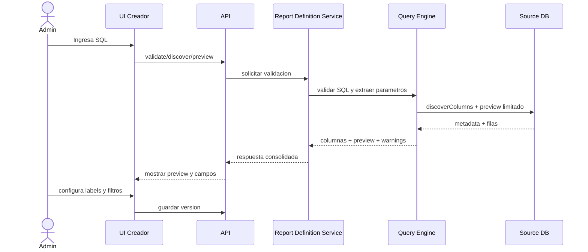
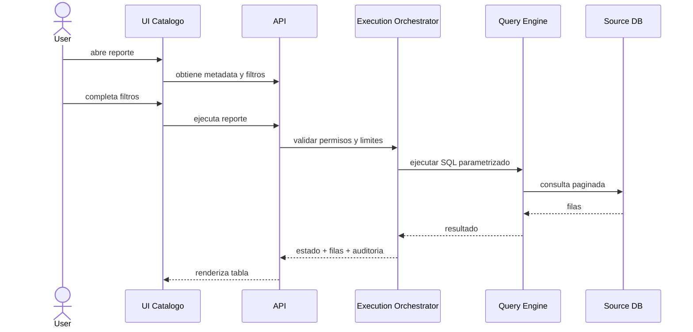
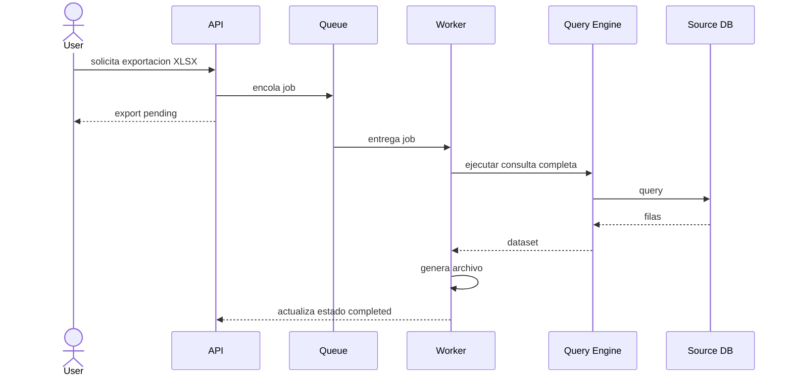

# API y Flujos

## Principios API

- API REST para operaciones de negocio.
- Respuestas paginadas para listados y resultados.
- Idempotencia para operaciones de prueba donde aplique.
- Versionado de API via `/api/v1`.
- Autorizacion por scopes y permisos de dominio.

## Endpoints principales

### Conexiones

- `POST /api/v1/data-sources`
- `POST /api/v1/data-sources/{id}/test`
- `GET /api/v1/data-sources`
- `PATCH /api/v1/data-sources/{id}`
- `POST /api/v1/data-sources/{id}/disable`

### Reportes

- `POST /api/v1/reports`
- `GET /api/v1/reports`
- `GET /api/v1/reports/{id}`
- `PATCH /api/v1/reports/{id}`
- `POST /api/v1/reports/{id}/versions`
- `POST /api/v1/reports/{id}/publish`
- `POST /api/v1/reports/{id}/archive`

### Creador

- `POST /api/v1/report-builder/validate`
- `POST /api/v1/report-builder/discover-columns`
- `POST /api/v1/report-builder/preview`

### Ejecucion

- `GET /api/v1/catalog/reports`
- `POST /api/v1/report-executions`
- `GET /api/v1/report-executions/{id}`
- `GET /api/v1/report-executions/{id}/rows`
- `POST /api/v1/report-executions/{id}/exports`
- `GET /api/v1/report-exports/{id}`

### Auditoria y operacion

- `GET /api/v1/audit/events`
- `GET /api/v1/operations/executions`
- `GET /api/v1/operations/metrics`

## Payloads de ejemplo

### Crear reporte

```json
{
  "name": "Ventas por cliente",
  "description": "Reporte operativo de ventas",
  "categoryId": "sales",
  "dataSourceId": "ds_pg_001"
}
```

### Validar SQL

```json
{
  "dataSourceId": "ds_pg_001",
  "sql": "SELECT c.customer_id, c.customer_name FROM customers c WHERE (:customer_id IS NULL OR c.customer_id = :customer_id)"
}
```

### Respuesta de columnas

```json
{
  "valid": true,
  "parameters": [
    {
      "name": "customer_id",
      "inferredType": "string"
    }
  ],
  "columns": [
    {
      "sourceName": "customer_id",
      "label": "customer_id",
      "dataType": "varchar"
    },
    {
      "sourceName": "customer_name",
      "label": "customer_name",
      "dataType": "varchar"
    }
  ],
  "warnings": []
}
```

### Ejecutar reporte

```json
{
  "reportId": "rpt_ventas_cliente",
  "parameters": {
    "customer_id": "C-1002",
    "date_from": "2026-01-01",
    "date_to": "2026-02-01"
  },
  "page": 1,
  "pageSize": 100
}
```

## Flujo 1: Creacion de reporte



## Flujo 2: Ejecucion por usuario final



## Flujo 3: Exportacion asincrona



## Reglas de negocio API

- No se puede publicar un reporte sin preview exitoso.
- No se puede ejecutar un reporte en estado `draft`.
- Los parametros requeridos deben validarse antes de llegar al motor.
- Los errores tecnicos se traducen a codigos funcionales.
- Las exportaciones deben expirar y limpiarse automaticamente.

## Recomendacion Final

Los contratos API deben mantenerse simples y orientados al dominio. La logica sensible de validacion SQL y conexion multi-DB no debe filtrarse al frontend; el frontend solo consume metadata y resultados.
