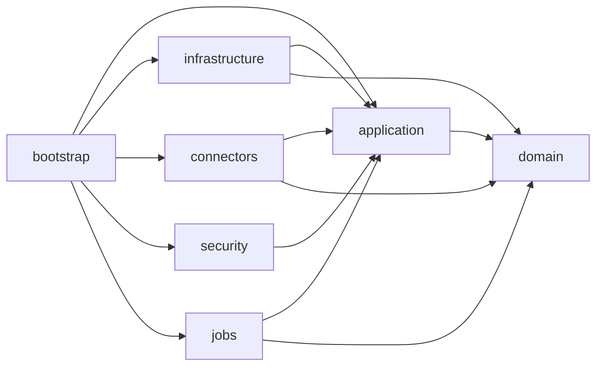

# Initial Project Structure

## Objective

Define a technical baseline aligned with the backlog and the recommended architecture, using `Java + Spring Boot` with a maintainable multi-module structure prepared to grow.

## Recommended Structure

```text
HileReports/
├── settings.gradle
├── build.gradle
├── gradle.properties
├── reporting-bootstrap/
├── reporting-domain/
├── reporting-application/
├── reporting-infrastructure/
├── reporting-connectors/
├── reporting-security/
├── reporting-jobs/
└── docs/
```

## Responsibility by Module

### `reporting-bootstrap`

- `Spring Boot` entry point
- General configuration
- Module assembly
- REST controllers

### `reporting-domain`

- Business entities and value objects
- Pure domain rules
- Enums and core models

### `reporting-application`

- Use cases
- Input and output ports
- Contracts for security, connectors, and persistence
- Domain orchestration

### `reporting-infrastructure`

- `JPA` persistence
- `Flyway` migrations
- Repository implementations
- Cross-cutting technical adapters

### `reporting-connectors`

- Oracle, MySQL, and PostgreSQL connectors
- `ConnectorFactory`
- Dialect abstraction and discovery

### `reporting-security`

- `Spring Security`
- Local authentication
- Extension point for `LDAP/AD`
- Authorization filters and components

### `reporting-jobs`

- Export jobs
- Temporary file cleanup
- Scheduling and asynchronous tasks

## Module Dependencies



## Suggested Package Structure

### `reporting-domain`

```text
dev.kreaker.hile.domain
├── datasource
├── report
├── execution
├── security
└── shared
```

### `reporting-application`

```text
dev.kreaker.hile.application
├── port
│   ├── in
│   └── out
├── service
├── dto
└── config
```

### `reporting-bootstrap`

```text
dev.kreaker.hile.bootstrap
├── api
│   ├── datasource
│   ├── report
│   ├── execution
│   └── auth
└── config
```

## Recommended Build

- `Gradle` multi-module
- `Java 21`
- `Spring Boot 3.x`
- `JUnit 5`
- `Flyway`
- `Spring Data JPA`
- `Spring Security`
- `Actuator`

## Implementation Order by Module

1. `reporting-domain`
2. `reporting-application`
3. `reporting-security`
4. `reporting-infrastructure`
5. `reporting-connectors`
6. `reporting-bootstrap`
7. `reporting-jobs`

## Code Guidelines

- The domain does not depend on Spring.
- Use cases do not know `JPA`, `JDBC`, or concrete drivers.
- Controllers only orchestrate requests/responses.
- Connectors do not contain publication or permission business rules.
- Security is integrated through ports and adapters, not embedded in the domain.

## Final Recommendation

The initial structure should reflect from the first commit the separation between domain, application, infrastructure, and connectivity. That reduces early coupling and allows the backlog to be implemented through functional slices without reworking the project foundation.
