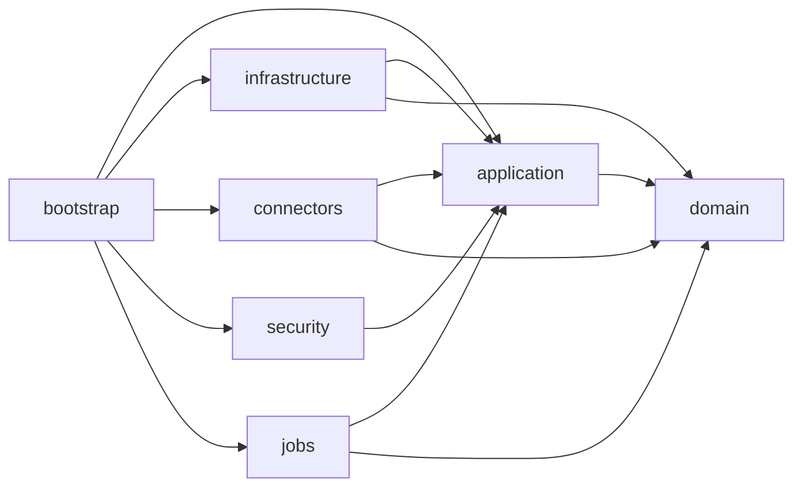

# Estructura Inicial del Proyecto

## Objetivo

Definir una base tecnica alineada al backlog y a la arquitectura recomendada, usando `Java + Spring Boot` con una estructura multi-modulo mantenible y preparada para crecer.

## Estructura recomendada

```text
HileReports/
├── settings.gradle
├── build.gradle
├── gradle.properties
├── reporting-bootstrap/
├── reporting-domain/
├── reporting-application/
├── reporting-infrastructure/
├── reporting-connectors/
├── reporting-security/
├── reporting-jobs/
└── docs/
```

## Responsabilidad por modulo

### `reporting-bootstrap`

- Punto de entrada `Spring Boot`
- Configuracion general
- Ensamblado de modulos
- Controllers REST

### `reporting-domain`

- Entidades y value objects de negocio
- Reglas puras de dominio
- Enums y modelos centrales

### `reporting-application`

- Casos de uso
- Puertos de entrada y salida
- Contratos para seguridad, conectores y persistencia
- Orquestacion del dominio

### `reporting-infrastructure`

- Persistencia `JPA`
- Migraciones `Flyway`
- Implementaciones de repositorios
- Adaptadores tecnicos transversales

### `reporting-connectors`

- Conectores Oracle, MySQL y PostgreSQL
- `ConnectorFactory`
- Abstraccion dialectal y discovery

### `reporting-security`

- `Spring Security`
- Autenticacion local
- Punto de extension para `LDAP/AD`
- Filtros y componentes de autorizacion

### `reporting-jobs`

- Jobs de exportacion
- Limpieza de temporales
- Scheduling y tareas asincronas

## Dependencias entre modulos



## Estructura de paquetes sugerida

### `reporting-domain`

```text
dev.kreaker.hile.domain
├── datasource
├── report
├── execution
├── security
└── shared
```

### `reporting-application`

```text
dev.kreaker.hile.application
├── port
│   ├── in
│   └── out
├── service
├── dto
└── config
```

### `reporting-bootstrap`

```text
dev.kreaker.hile.bootstrap
├── api
│   ├── datasource
│   ├── report
│   ├── execution
│   └── auth
└── config
```

## Build recomendado

- `Gradle` multi-modulo
- `Java 21`
- `Spring Boot 3.x`
- `JUnit 5`
- `Flyway`
- `Spring Data JPA`
- `Spring Security`
- `Actuator`

## Orden de implementacion por modulo

1. `reporting-domain`
2. `reporting-application`
3. `reporting-security`
4. `reporting-infrastructure`
5. `reporting-connectors`
6. `reporting-bootstrap`
7. `reporting-jobs`

## Lineamientos de codigo

- El dominio no depende de Spring.
- Los casos de uso no conocen `JPA`, `JDBC` ni drivers concretos.
- Los controllers solo orquestan requests/responses.
- Los conectores no contienen reglas de negocio de publicacion o permisos.
- La seguridad se integra por puertos y adaptadores, no incrustada en el dominio.

## Recomendacion Final

La estructura inicial debe reflejar desde el primer commit la separacion entre dominio, aplicacion, infraestructura y conectividad. Eso reduce acoplamiento temprano y hace que el backlog pueda implementarse por slices funcionales sin rehacer la base del proyecto.
