This file is a merged representation of a subset of the codebase, containing files not matching ignore patterns, combined into a single document by Repomix.

# File Summary

## Purpose
This file contains a packed representation of a subset of the repository's contents that is considered the most important context.
It is designed to be easily consumable by AI systems for analysis, code review,
or other automated processes.

## File Format
The content is organized as follows:
1. This summary section
2. Repository information
3. Directory structure
4. Repository files (if enabled)
5. Multiple file entries, each consisting of:
  a. A header with the file path (## File: path/to/file)
  b. The full contents of the file in a code block

## Usage Guidelines
- This file should be treated as read-only. Any changes should be made to the
  original repository files, not this packed version.
- When processing this file, use the file path to distinguish
  between different files in the repository.
- Be aware that this file may contain sensitive information. Handle it with
  the same level of security as you would the original repository.

## Notes
- Some files may have been excluded based on .gitignore rules and Repomix's configuration
- Binary files are not included in this packed representation. Please refer to the Repository Structure section for a complete list of file paths, including binary files
- Files matching these patterns are excluded: graphify-out
- Files matching patterns in .gitignore are excluded
- Files matching default ignore patterns are excluded
- Files are sorted by Git change count (files with more changes are at the bottom)

# Directory Structure
``````
[HileReports]/
  .claude/
    .headroom_wrap_marker.json
    .headroom_wrap_owners.json
    .headroom_wrap_settings.lock
  .github/
    workflows/
      ci.yml
  docs/
    architecture/
      adr/
        ADR-001-modular-monolith_es.md
        ADR-001-modular-monolith.md
        ADR-002-secure-sql-execution_es.md
        ADR-002-secure-sql-execution.md
        ADR-003-multidb-connectivity_es.md
        ADR-003-multidb-connectivity.md
        ADR-004-java-spring-boot-stack_es.md
        ADR-004-java-spring-boot-stack.md
        ADR-005-local-autenticacion-and-ad-evolution_es.md
        ADR-005-local-autenticacion-and-ad-evolution.md
      00-vision-and-requirements_es.md
      00-vision-and-requirements.md
      01-architectural-options_es.md
      01-architectural-options.md
      02-recommended-architecture_es.md
      02-recommended-architecture.md
      03-data-models-and-multidb_es.md
      03-data-models-and-multidb.md
      04-api-and-workflows_es.md
      04-api-and-workflows.md
      05-security-operations-and-nfr_es.md
      05-security-operations-and-nfr.md
      06-implementation-plan_es.md
      06-implementation-plan.md
      07-detailed-implementation-plan_es.md
      07-detailed-implementation-plan.md
      08-backlog-implementation_es.md
      08-backlog-implementation.md
      09-initial-project-structure_es.md
      09-initial-project-structure.md
      10-implementation-memory_es.md
      10-implementation-memory.md
      README_es.md
      README.md
  gradle/
    wrapper/
      gradle-wrapper.jar
      gradle-wrapper.properties
  load-tests/
    k6/
      hile-reports-load.js
  reporting-application/
    src/
      main/
        java/
          dev/
            kreaker/
              hile/
                application/
                  dto/
                    AsyncExportTask.java
                    AuditEventView.java
                    AuthenticateUserCommand.java
                    AuthenticationResult.java
                    CatalogReportView.java
                    CategoryView.java
                    ChangePasswordCommand.java
                    ColumnMetadata.java
                    CreateCategoryCommand.java
                    CreateDataSourceCommand.java
                    CreateReportDefinitionCommand.java
                    CreateTagCommand.java
                    CreateUserCommand.java
                    DataSourceView.java
                    ExecuteReportCommand.java
                    ExecutionResultView.java
                    ExecutionView.java
                    ExportJobCreationResult.java
                    ExportJobView.java
                    PageResult.java
                    PreviewResult.java
                    ReportColumnView.java
                    ReportDefinitionView.java
                    ReportParameterView.java
                    RequestExportCommand.java
                    TagView.java
                    UpdateDataSourceCommand.java
                    UpdateReportCommand.java
                    UserView.java
                    ValidationResult.java
                  exception/
                    AccessDeniedException.java
                    DataSourceNotFoundException.java
                    InvalidCredentialsException.java
                  port/
                    in/
                      AuthenticateUserUseCase.java
                      CategoryUseCase.java
                      CreateReportDefinitionUseCase.java
                      DataSourceUseCase.java
                      ExecuteReportUseCase.java
                      ExportJobUseCase.java
                      TagUseCase.java
                      UserManagementUseCase.java
                    out/
                      AuditEventPort.java
                      AuthenticationProviderPort.java
                      CategoryRepositoryPort.java
                      DataSourceAccessPort.java
                      DataSourceRepositoryPort.java
                      DbConnectorPort.java
                      MetricsPort.java
                      PasswordEncryptionPort.java
                      PasswordHasherPort.java
                      QueryValidatorPort.java
                      ReportColumnRepositoryPort.java
                      ReportDefinitionRepository.java
                      ReportExecutionRepository.java
                      ReportExportRepository.java
                      ReportParameterRepositoryPort.java
                      TagRepositoryPort.java
                      UserRepositoryPort.java
                  service/
                    AuthenticationApplicationService.java
                    CategoryApplicationService.java
                    DataSourceApplicationService.java
                    ExecuteReportApplicationService.java
                    ExportJobApplicationService.java
                    NamedParamBinder.java
                    ReportDefinitionApplicationService.java
                    TagApplicationService.java
                    UserManagementApplicationService.java
      test/
        java/
          dev/
            kreaker/
              hile/
                application/
                  service/
                    AuthenticationApplicationServiceTest.java
                    DataSourceApplicationServiceTest.java
    build.gradle
  reporting-bootstrap/
    src/
      main/
        java/
          dev/
            kreaker/
              hile/
                bootstrap/
                  api/
                    audit/
                      AuditController.java
                    auth/
                      AuthController.java
                      LoginRequest.java
                      LoginResponse.java
                    catalog/
                      CatalogController.java
                    category/
                      CategoryController.java
                      CategoryRequest.java
                    datasource/
                      AccessGrantRequest.java
                      CreateDataSourceRequest.java
                      DataSourceController.java
                      SqlQueryRequest.java
                      UpdateDataSourceRequest.java
                    execution/
                      ExecutionController.java
                    export/
                      ExportController.java
                      ExportRequest.java
                    report/
                      ColumnConfigRequest.java
                      ExecuteReportController.java
                      ExecuteReportRequest.java
                      ParameterConfigRequest.java
                      ReportController.java
                      ReportRequest.java
                      UpdateReportRequest.java
                    tag/
                      SetReportTagsRequest.java
                      TagController.java
                      TagRequest.java
                    user/
                      ChangePasswordRequest.java
                      CreateUserRequest.java
                      UpdateUserRequest.java
                      UserController.java
                    ApiErrorResponse.java
                    ArchitectureController.java
                    GlobalExceptionHandler.java
                    PageResponse.java
                  config/
                    ApplicationWiringConfig.java
                    AsyncConfig.java
                    ConnectorConfig.java
                    CorsConfig.java
                    JpaConfig.java
                    OpenApiConfig.java
                    SecurityConfig.java
                  export/
                    AsyncExportService.java
                  observability/
                    CorrelationIdFilter.java
                    MicrometerMetricsAdapter.java
                  scheduler/
                    ExportCleanupScheduler.java
                  security/
                    JwtAuthenticationFilter.java
                    RateLimitFilter.java
                    ReportSecurityGuard.java
                    SecurityDataInitializer.java
                  HileReportsApplication.java
        resources/
          application-dev.yml
          application-local.yml
          application-prod.yml
          application-qa.yml
          application.yml
          logback-spring.xml
      test/
        java/
          dev/
            kreaker/
              hile/
                bootstrap/
                  api/
                    auth/
                      AuthControllerTest.java
    build.gradle
  reporting-connectors/
    src/
      main/
        java/
          dev/
            kreaker/
              hile/
                connectors/
                  BaseStubConnector.java
                  ConnectorFactory.java
                  MySqlConnectorAdapter.java
                  OracleConnectorAdapter.java
                  PostgreSqlConnectorAdapter.java
    build.gradle
  reporting-domain/
    src/
      main/
        java/
          dev/
            kreaker/
              hile/
                domain/
                  category/
                    Category.java
                  datasource/
                    DataSource.java
                    DataSourceStatus.java
                    DataSourceType.java
                  export/
                    ReportExport.java
                  report/
                    ReportColumn.java
                    ReportDefinition.java
                    ReportExecution.java
                    ReportParameter.java
                    ReportStatus.java
                  security/
                    AppUser.java
                    AuthenticatedUser.java
                    UserCredentials.java
                  tag/
                    Tag.java
    build.gradle
  reporting-frontend/
    src/
      api/
        client.ts
        types.ts
      auth/
        AuthContext.tsx
      components/
        AdminLayout.tsx
        Layout.tsx
        ProtectedRoute.tsx
      pages/
        admin/
          AuditPage.tsx
          CategoriesPage.tsx
          DatasourcesPage.tsx
          ReportEditPage.tsx
          ReportsAdminPage.tsx
          TagsPage.tsx
          UsersPage.tsx
        CatalogPage.tsx
        LoginPage.tsx
        ReportPage.tsx
      App.tsx
      index.css
      main.tsx
    .gitignore
    index.html
    package.json
    postcss.config.js
    tailwind.config.js
    tsconfig.json
    tsconfig.node.json
    vite.config.ts
  reporting-infrastructure/
    src/
      main/
        java/
          dev/
            kreaker/
              hile/
                infrastructure/
                  config/
                    InfrastructureModuleMarker.java
                  persistence/
                    entity/
                      AppRoleEntity.java
                      AppUserEntity.java
                      AuditableEntity.java
                      AuditEventEntity.java
                      CategoryEntity.java
                      DataSourceAccessEntity.java
                      DataSourceAccessId.java
                      DataSourceEntity.java
                      ReportColumnEntity.java
                      ReportDefinitionEntity.java
                      ReportExecutionEntity.java
                      ReportExecutionParameterEntity.java
                      ReportExportEntity.java
                      ReportParameterEntity.java
                      ReportTagEntity.java
                      ReportVersionEntity.java
                      TagEntity.java
                    jpa/
                      AppRoleJpaRepository.java
                      AppUserJpaRepository.java
                      AuditEventJpaRepository.java
                      CategoryJpaRepository.java
                      DataSourceAccessJpaRepository.java
                      DataSourceJpaRepository.java
                      ReportColumnJpaRepository.java
                      ReportDefinitionJpaRepository.java
                      ReportExecutionJpaRepository.java
                      ReportExecutionParameterJpaRepository.java
                      ReportExportJpaRepository.java
                      ReportParameterJpaRepository.java
                      ReportTagJpaRepository.java
                      ReportVersionJpaRepository.java
                      TagJpaRepository.java
                    AuditEventRepositoryAdapter.java
                    CategoryRepositoryAdapter.java
                    DataSourceAccessAdapter.java
                    DataSourceRepositoryAdapter.java
                    ReportColumnRepositoryAdapter.java
                    ReportDefinitionRepositoryAdapter.java
                    ReportExecutionRepositoryAdapter.java
                    ReportExportRepositoryAdapter.java
                    ReportParameterRepositoryAdapter.java
                    TagRepositoryAdapter.java
                    UserRepositoryAdapter.java
                  sql/
                    SimpleReadOnlyQueryValidator.java
        resources/
          db/
            migration/
              V1__create_operational_metadata_schema.sql
              V2__create_security_schema.sql
              V3__add_updated_audit_fields.sql
              V4__add_tag_tables.sql
              V5__add_datasource_access.sql
      test/
        java/
          dev/
            kreaker/
              hile/
                infrastructure/
                  sql/
                    SimpleReadOnlyQueryValidatorDialectTest.java
                    SimpleReadOnlyQueryValidatorTest.java
    build.gradle
  reporting-jobs/
    src/
      main/
        java/
          dev/
            kreaker/
              hile/
                jobs/
                  ExportCleanupJob.java
    build.gradle
  reporting-security/
    src/
      main/
        java/
          dev/
            kreaker/
              hile/
                security/
                  AdAuthenticationProviderStub.java
                  AesGcmEncryptor.java
                  JwtTokenProvider.java
                  LocalAuthenticationProviderAdapter.java
                  TokenProviderPort.java
      test/
        java/
          dev/
            kreaker/
              hile/
                security/
                  JwtTokenProviderTest.java
    build.gradle
  .dockerignore
  .editorconfig
  .gitignore
  .sdkmanrc
  AGENT_HANDOFF.md
  build.gradle
  CLAUDE.md
  compose.yaml
  Dockerfile
  env.example
  FORMATTING.md
  gradle.properties
  gradlew
  gradlew.bat
  Info.txt
  README_es.md
  README.md
  repomix-hilereports.md
  settings.gradle

[.claude]/
  .headroom_wrap_marker.json
  .headroom_wrap_owners.json
  .headroom_wrap_settings.lock

[gradle]/
  wrapper/
    gradle-wrapper.jar
    gradle-wrapper.properties

[load-tests]/
  k6/
    hile-reports-load.js
``````

# Files

## File: HileReports/.claude/.headroom_wrap_marker.json
``````json
{"pid": 2906, "start_src": null, "start_time": null, "port": 8787, "key": "ANTHROPIC_BASE_URL", "previous": null}
``````

## File: HileReports/.claude/.headroom_wrap_owners.json
``````json
{
  "ANTHROPIC_BASE_URL": {
    "original": null,
    "holders": [
      {
        "pid": 2906,
        "start_src": null,
        "start_time": null,
        "port": 8787,
        "inherited": false
      }
    ]
  },
  "ENABLE_TOOL_SEARCH": {
    "original": null,
    "holders": [
      {
        "pid": 2906,
        "start_src": null,
        "start_time": null,
        "port": null,
        "inherited": false
      }
    ]
  }
}
``````

## File: HileReports/.claude/.headroom_wrap_settings.lock
``````

``````

## File: HileReports/.github/workflows/ci.yml
``````yaml
name: CI

on:
  push:
    branches: [main]
  pull_request:
    branches: [main]

jobs:
  build:
    runs-on: ubuntu-latest

    steps:
      - uses: actions/checkout@v4

      - name: Set up Java 21
        uses: actions/setup-java@v4
        with:
          java-version: "21"
          distribution: temurin

      - name: Setup Gradle
        uses: gradle/actions/setup-gradle@v3

      - name: Check formatting
        run: ./gradlew spotlessCheck

      - name: Run tests
        run: ./gradlew test

      - name: Upload test reports on failure
        if: failure()
        uses: actions/upload-artifact@v4
        with:
          name: test-reports
          path: "**/build/reports/tests/"
          retention-days: 7
``````

## File: HileReports/docs/architecture/adr/ADR-001-modular-monolith_es.md
``````markdown
# ADR-001: Monolito Modular como Arquitectura Base

## Estado

Aprobacion propuesta

## Contexto

Se requiere entregar un reporteador universal con creador, preview, catalogo de ejecucion, conectividad multi-DB y controles de seguridad sobre SQL. El alcance inicial no justifica la complejidad operativa de microservicios.

## Decision

Adoptar un **monolito modular** con fronteras internas claras, API stateless y workers asincronos para tareas pesadas.

## Consecuencias

### Positivas

- Entrega mas rapida.
- Menor costo operativo.
- Mayor simplicidad para evolucion del dominio.

### Negativas

- Menor aislamiento de fallos.
- Requiere disciplina para evitar acoplamiento entre modulos.

## Seguimiento

- Revisar esta decision si el equipo supera varios squads o si la carga de ejecucion/exportacion exige aislamiento independiente.
``````

## File: HileReports/docs/architecture/adr/ADR-001-modular-monolith.md
``````markdown
# ADR-001: Modular Monolith as the Base Architecture

## Status

Proposed approval

## Context

A universal reporting platform is required with a builder, preview, execution catalog, multi-DB connectivity, and security controls over SQL. The initial scope does not justify the operational complexity of microservices.

## Decision

Adopt a **modular monolith** with clear internal boundaries, a stateless API, and asynchronous workers for heavy tasks.

## Consequences

### Positive

- Faster delivery.
- Lower operational cost.
- Greater simplicity for domain evolution.

### Negative

- Lower fault isolation.
- Requires discipline to avoid coupling between modules.

## Follow-Up

- Revisit this decision if the team grows beyond several squads or if execution/export load requires independent isolation.
``````

## File: HileReports/docs/architecture/adr/ADR-002-secure-sql-execution_es.md
``````markdown
# ADR-002: Validacion y Ejecucion Segura de SQL

## Estado

Aprobacion propuesta

## Contexto

El sistema permitira definir reportes desde SQL ingresado por administradores. Esto introduce riesgo de seguridad, impacto de performance y potencial afectacion a bases fuente.

## Decision

Permitir exclusivamente consultas de lectura (`SELECT` y `WITH`), con validacion previa, extraccion de parametros nombrados, bloqueo de sentencias multiples y ejecucion con limites de filas/timeout.

## Consecuencias

### Positivas

- Reduce riesgo de modificacion accidental o maliciosa.
- Hace viable exponer un creador controlado.
- Facilita observabilidad y gobierno.

### Negativas

- Algunas consultas complejas no seran soportadas inicialmente.
- Requiere invertir en parser/validador y pruebas.

## Seguimiento

- Definir catalogo de patrones permitidos y bloqueados.
- Medir falsos positivos del validador durante UAT.
``````

## File: HileReports/docs/architecture/adr/ADR-002-secure-sql-execution.md
``````markdown
# ADR-002: Validation and Safe SQL Execution

## Status

Proposed approval

## Context

The system will allow administrators to define reports from user-provided SQL. This introduces security risk, performance impact, and potential effects on source databases.

## Decision

Allow read-only queries exclusively (`SELECT` and `WITH`), with prior validation, named parameter extraction, blocking of multiple statements, and execution with row/timeout limits.

## Consequences

### Positive

- Reduces the risk of accidental or malicious modification.
- Makes it feasible to expose a controlled builder.
- Improves observability and governance.

### Negative

- Some complex queries will not be supported initially.
- Requires investment in parser/validator work and testing.

## Follow-Up

- Define the catalog of allowed and blocked patterns.
- Measure validator false positives during UAT.
``````

## File: HileReports/docs/architecture/adr/ADR-003-multidb-connectivity_es.md
``````markdown
# ADR-003: Abstraccion de Conectividad Multi-DB con Conectores

## Estado

Aprobacion propuesta

## Contexto

El producto debe consultar Oracle, MySQL y PostgreSQL, y potencialmente otros motores en el futuro. Las diferencias de drivers, dialectos y metadata no deben contaminar la capa de dominio.

## Decision

Implementar una `Connector Factory` con conectores dedicados por motor. Cada conector cumplira un contrato comun para test de conexion, discovery de columnas, preview y ejecucion.

## Consecuencias

### Positivas

- Aisla diferencias dialectales.
- Permite agregar nuevos motores con bajo impacto.
- Facilita pruebas por contrato.

### Negativas

- Requiere mantener adaptadores y matrices de compatibilidad.
- Algunas capacidades avanzadas de un motor no se expondran de inmediato.

## Seguimiento

- Publicar guia de implementacion de nuevos conectores.
- Mantener suite de contract tests por motor.
``````

## File: HileReports/docs/architecture/adr/ADR-003-multidb-connectivity.md
``````markdown
# ADR-003: Multi-DB Connectivity Abstraction with Connectors

## Status

Proposed approval

## Context

The product must query Oracle, MySQL, and PostgreSQL, and potentially other engines in the future. Differences in drivers, dialects, and metadata must not leak into the domain layer.

## Decision

Implement a `ConnectorFactory` with dedicated connectors per engine. Each connector will fulfill a shared contract for connection testing, column discovery, preview, and execution.

## Consequences

### Positive

- Isolates dialect differences.
- Allows new engines to be added with low impact.
- Facilitates contract testing.

### Negative

- Requires maintaining adapters and compatibility matrices.
- Some advanced engine capabilities will not be exposed immediately.

## Follow-Up

- Publish an implementation guide for new connectors.
- Maintain a suite of contract tests per engine.
``````

## File: HileReports/docs/architecture/adr/ADR-004-java-spring-boot-stack_es.md
``````markdown
# ADR-004: Java con Spring Boot como Stack Base

## Estado

Aprobacion propuesta

## Contexto

El sistema debe soportar Oracle, MySQL y PostgreSQL, operar inicialmente `on-premise`, mantener bajo costo y ofrecer una ruta clara a evolucion futura. El stack favorito del equipo es `Java`, con preferencia entre `Spring` y `Quarkus`.

## Decision

Adoptar **Java + Spring Boot** como stack base de la primera version.

## Consecuencias

### Positivas

- Excelente madurez en conectividad enterprise.
- Integracion natural con `Spring Security`, observabilidad y scheduling.
- Menor riesgo de implementacion para un producto con varias preocupaciones transversales.
- Facil soporte para empaquetado portable y despliegue `on-premise`.

### Negativas

- Mayor consumo y verbosidad que otras alternativas.
- Tiempos de arranque mayores frente a `Quarkus`.

## Seguimiento

- Revisar `Quarkus` si el footprint o los tiempos de arranque se vuelven prioritarios en una fase futura.
``````

## File: HileReports/docs/architecture/adr/ADR-004-java-spring-boot-stack.md
``````markdown
# ADR-004: Java with Spring Boot as the Base Stack

## Status

Proposed approval

## Context

The system must support Oracle, MySQL, and PostgreSQL, operate initially `on-premise`, keep cost low, and provide a clear path for future evolution. The team's preferred stack is `Java`, with a choice between `Spring` and `Quarkus`.

## Decision

Adopt **Java + Spring Boot** as the base stack for the first version.

## Consequences

### Positive

- Excellent maturity for enterprise connectivity.
- Natural integration with `Spring Security`, observability, and scheduling.
- Lower implementation risk for a product with several cross-cutting concerns.
- Easy support for portable packaging and `on-premise` deployment.

### Negative

- Higher resource usage and verbosity than some alternatives.
- Slower startup times compared with `Quarkus`.

## Follow-Up

- Revisit `Quarkus` if footprint or startup times become a priority in a future phase.
``````

## File: HileReports/docs/architecture/adr/ADR-005-local-autenticacion-and-ad-evolution_es.md
``````markdown
# ADR-005: Autenticacion Local Inicial con Evolucion a Active Directory

## Estado

Aprobacion propuesta

## Contexto

La primera version debe salir con bajo costo y dependencias controladas, pero el objetivo a mediano plazo es integrarse con el usuario de red corporativo.

## Decision

Implementar autenticacion local en la primera version, encapsulada detras de un puerto de autenticacion, dejando preparada la integracion futura con `LDAP/Active Directory`.

## Consecuencias

### Positivas

- Reduce dependencias externas para el MVP.
- Permite avanzar aunque la integracion corporativa no este lista.
- Evita acoplar la seguridad de dominio a un proveedor especifico desde el inicio.

### Negativas

- Se debera migrar o federar usuarios en una fase posterior.
- El equipo debera mantener temporalmente administracion local de usuarios.

## Seguimiento

- Diseñar desde el inicio los identificadores de usuario y roles para facilitar transicion a `AD`.
- Agregar pruebas de integracion con `LDAP/AD` en la fase posterior.
``````

## File: HileReports/docs/architecture/adr/ADR-005-local-autenticacion-and-ad-evolution.md
``````markdown
# ADR-005: Initial Local Authentication with Evolution to Active Directory

## Status

Proposed approval

## Context

The first version must ship with low cost and controlled dependencies, but the medium-term goal is integration with the corporate network identity.

## Decision

Implement local authentication in the first version, encapsulated behind an authentication port, leaving future integration with `LDAP/Active Directory` prepared.

## Consequences

### Positive

- Reduces external dependencies for the MVP.
- Allows progress even if corporate integration is not ready.
- Avoids coupling domain security to a specific provider from the start.

### Negative

- Users will need to be migrated or federated in a later phase.
- The team will temporarily maintain local user administration.

## Follow-Up

- Design user identifiers and roles from the start to ease the transition to `AD`.
- Add integration tests with `LDAP/AD` in the later phase.
``````

## File: HileReports/docs/architecture/00-vision-and-requirements_es.md
``````markdown
# Vision y Requerimientos

## Problema

Las organizaciones suelen tener informacion distribuida en multiples motores de base de datos y requieren construir reportes operativos sin depender de desarrollos puntuales para cada necesidad. En este caso el foco es una plataforma interna para mostrar informacion especifica de negocio, como ventas, traslados y otros procesos operativos dentro de las plataformas de la empresa. Se busca una plataforma unica donde:

- un administrador defina un reporte a partir de una consulta SQL,
- el sistema descubra columnas y permita previsualizar el resultado,
- se publiquen filtros parametrizados para el usuario final,
- y el usuario solo vea un catalogo de reportes disponibles para ejecutar.

## Objetivos del producto

- Unificar la creacion y ejecucion de reportes SQL sobre Oracle, MySQL y PostgreSQL.
- Separar la experiencia de creacion de la experiencia de consumo.
- Proteger las bases fuente mediante validacion, control de acceso y limites operativos.
- Resolver necesidades operativas internas con bajo costo de implementacion y operacion.
- Permitir evolucionar a nuevos motores sin rediseñar el producto.
- Habilitar auditoria, trazabilidad y gobierno de reportes.

## Actores

- `Administrador de reportes`: crea, prueba, versiona y publica reportes.
- `Usuario final`: ejecuta reportes publicados con filtros permitidos.
- `Auditor/Soporte`: revisa ejecuciones, errores, tiempos y uso.
- `Administrador de plataforma`: gestiona conexiones, seguridad y politicas.

## Requerimientos funcionales

### RF-01 Gestion de conexiones

- Registrar conexiones a Oracle, MySQL y PostgreSQL.
- Almacenar credenciales cifradas.
- Probar conectividad y metadata basica.
- Asociar permisos de uso por equipo, area o rol.

### RF-02 Creador de reportes

- Crear un reporte con nombre, descripcion, categoria y origen de datos.
- Ingresar una consulta SQL.
- Validar que la consulta sea solo de lectura.
- Obtener columnas derivadas del SQL.
- Mostrar preview con limite de filas configurable.
- Permitir mapear metadatos de columnas: etiqueta, tipo UI, formato, visible, orden.
- Definir filtros a partir de parametros seguros del reporte.
- Publicar, despublicar y versionar reportes.

### RF-03 Catalogo y ejecucion

- Listar reportes publicados visibles para el usuario.
- Buscar por nombre, categoria y etiquetas.
- Solicitar filtros configurados para el reporte.
- Ejecutar el reporte con paginacion.
- Exportar resultados a CSV y XLSX.
- Guardar historial de ejecuciones.

### RF-04 Gobierno y auditoria

- Registrar quien creo, modifico, publico y ejecuto cada reporte.
- Registrar SQL versionado y cambios de definicion.
- Mostrar errores de ejecucion sin exponer detalles sensibles.
- Permitir desactivar reportes o conexiones comprometidas.

### RF-05 Administracion operativa

- Configurar timeouts, maximo de filas preview y limites de exportacion.
- Configurar ventanas de mantenimiento y restricciones por horario.
- Visualizar metricas de uso y fallos.

## Requerimientos no funcionales

### RNF-01 Seguridad

- Solo consultas de lectura.
- Cifrado de secretos en reposo.
- TLS hacia servicios y, cuando sea posible, hacia bases fuente.
- RBAC por modulo, reporte y conexion.
- Autenticacion inicial con usuarios locales gestionados por la aplicacion.
- Diseño compatible con integracion futura a `Active Directory`.
- Auditoria completa de cambios y ejecuciones.
- Sanitizacion de errores para no exponer esquemas, secretos ni SQL sensible.

### RNF-02 Rendimiento

- Preview en menos de 5 segundos para consultas medianas sobre datasets acotados.
- Paginacion server-side para resultados interactivos.
- Exportaciones pesadas via procesos asincronos.
- Limites configurables por consulta y por usuario.

### RNF-03 Escalabilidad

- Escalado horizontal del API y de workers.
- Posibilidad de agregar nuevos conectores sin modificar el dominio principal.
- Soporte inicial para hasta 500 usuarios concurrentes y crecimiento posterior sin rediseño mayor.

### RNF-04 Mantenibilidad

- Separacion clara entre dominio, conectores, seguridad y UI.
- Contratos API estables.
- ADRs y trazabilidad de decisiones.
- Cobertura automatizada en validacion SQL, filtros y conectores.

### RNF-05 Disponibilidad y soporte

- Reintentos controlados en fallos transitorios.
- Trazas correlacionadas por ejecucion.
- Tablero de observabilidad con metricas de latencia y error rate.

### RNF-06 Despliegue y portabilidad

- Despliegue inicial `on-premise`.
- Empaquetado y configuracion listos para migracion futura a nube.
- Dependencias de infraestructura minimizadas para reducir costo inicial.
- Preferencia por componentes open source o ya estandarizados en la empresa.

## Alcance de la primera version

- Motores: Oracle, MySQL, PostgreSQL.
- Tipos de reporte: tabular.
- Filtros: texto, numerico, fecha, lista, rango, booleano.
- Exportaciones: CSV y XLSX.
- Ejecucion interactiva y ejecucion asincrona para exportaciones grandes.
- Autenticacion local con administracion interna de usuarios y roles.

## Fuera de alcance inicial

- ETL o replicacion de datos.
- Reportes visuales complejos tipo dashboard.
- SQL de escritura o procedimientos almacenados con efectos laterales.
- Multi-tenant externo con aislamiento regulatorio estricto.
- Designer WYSIWYG de layout avanzado.

## Criterios de aceptacion de arquitectura

- Agregar un nuevo motor debe requerir crear un conector sin reescribir el dominio.
- Ningun usuario final puede editar SQL libremente al ejecutar un reporte.
- Todo reporte publicado debe tener preview validado y metadatos de columnas consistentes.
- Toda ejecucion debe quedar auditada con usuario, tiempo, filtros y resultado.
- El sistema debe sostener una carga objetivo de hasta 500 usuarios concurrentes con degradacion controlada.
``````

## File: HileReports/docs/architecture/00-vision-and-requirements.md
``````markdown
# Vision and Requirements

## Problem

Organizations usually keep information distributed across multiple database engines and need to build operational reports without depending on one-off development work for every request. In this case, the focus is an internal platform for exposing specific business information, such as sales, transfers, and other operational processes across the company's systems. The goal is a single platform where:

- an administrator defines a report from a SQL query,
- the system discovers columns and lets users preview the result,
- parameterized filters are published for end users,
- and the user only sees a catalog of available reports to run.

## Product Goals

- Unify SQL report creation and execution across Oracle, MySQL, and PostgreSQL.
- Separate the creation experience from the consumption experience.
- Protect source databases through validation, access control, and operational limits.
- Solve internal operational needs with low implementation and operating cost.
- Allow the platform to evolve toward new engines without redesigning the product.
- Enable report auditing, traceability, and governance.

## Actors

- `Report administrator`: creates, tests, versions, and publishes reports.
- `End user`: runs published reports with allowed filters.
- `Auditor/Support`: reviews executions, errors, timings, and usage.
- `Platform administrator`: manages connections, security, and policies.

## Functional Requirements

### FR-01 Connection Management

- Register Oracle, MySQL, and PostgreSQL connections.
- Store encrypted credentials.
- Test connectivity and basic metadata.
- Associate usage permissions by team, area, or role.

### FR-02 Report Builder

- Create a report with name, description, category, and data source.
- Enter a SQL query.
- Validate that the query is read-only.
- Obtain columns derived from the SQL.
- Show a preview with a configurable row limit.
- Map column metadata such as label, UI type, format, visibility, and order.
- Define filters from safe report parameters.
- Publish, unpublish, and version reports.

### FR-03 Catalog and Execution

- List published reports visible to the user.
- Search by name, category, and tags.
- Request the filters configured for the report.
- Execute the report with pagination.
- Export results to CSV and XLSX.
- Save execution history.

### FR-04 Governance and Auditing

- Record who created, modified, published, and executed each report.
- Record versioned SQL and definition changes.
- Show execution errors without exposing sensitive details.
- Allow compromised reports or connections to be disabled.

### FR-05 Operational Administration

- Configure timeouts, maximum preview rows, and export limits.
- Configure maintenance windows and time-based restrictions.
- Visualize usage and failure metrics.

## Non-Functional Requirements

### NFR-01 Security

- Read-only queries only.
- Encryption of secrets at rest.
- TLS toward services and, when possible, toward source databases.
- RBAC by module, report, and connection.
- Initial authentication with local users managed by the application.
- Design compatible with future `Active Directory` integration.
- Full auditing of changes and executions.
- Error sanitization so schemas, secrets, and sensitive SQL are never exposed.

### NFR-02 Performance

- Preview in less than 5 seconds for medium-sized queries over bounded datasets.
- Server-side pagination for interactive results.
- Heavy exports handled through asynchronous processes.
- Configurable limits per query and per user.

### NFR-03 Scalability

- Horizontal scaling of the API and workers.
- Ability to add new connectors without modifying the core domain.
- Initial support for up to 500 concurrent users, with later growth without major redesign.

### NFR-04 Maintainability

- Clear separation among domain, connectors, security, and UI.
- Stable API contracts.
- ADRs and decision traceability.
- Automated coverage for SQL validation, filters, and connectors.

### NFR-05 Availability and Support

- Controlled retries for transient failures.
- Correlated traces per execution.
- Observability dashboard with latency and error-rate metrics.

### NFR-06 Deployment and Portability

- Initial `on-premise` deployment.
- Packaging and configuration ready for future cloud migration.
- Minimized infrastructure dependencies to reduce initial cost.
- Preference for open source components or technologies already standardized in the company.

## First Version Scope

- Engines: Oracle, MySQL, PostgreSQL.
- Report types: tabular.
- Filters: text, numeric, date, list, range, boolean.
- Exports: CSV and XLSX.
- Interactive execution and asynchronous execution for large exports.
- Local authentication with internal user and role management.

## Out of Initial Scope

- ETL or data replication.
- Complex visual dashboard-style reports.
- Write SQL or stored procedures with side effects.
- External multi-tenant support with strict regulatory isolation.
- Advanced WYSIWYG layout designer.

## Architecture Acceptance Criteria

- Adding a new engine must require creating a connector without rewriting the domain.
- No end user can freely edit SQL when running a report.
- Every published report must have a validated preview and consistent column metadata.
- Every execution must be audited with user, time, filters, and outcome.
- The system must sustain a target load of up to 500 concurrent users with controlled degradation.
``````

## File: HileReports/docs/architecture/01-architectural-options_es.md
``````markdown
# Opciones Arquitectonicas

## Contexto de decision

El sistema necesita:

- soportar multiples motores de base de datos,
- ejecutar SQL de lectura con seguridad,
- ofrecer un creador con preview,
- y escalar razonablemente sin complejidad innecesaria.

## Opcion 1: Monolito modular con workers

Aplicacion unica con modulos internos bien delimitados: autenticacion, catalogo, diseno de reportes, ejecucion, conectores, auditoria y exportaciones. Los trabajos pesados se derivan a workers asincronos.

### Pros

- Menor complejidad operativa y de despliegue.
- Time-to-market mas rapido.
- Transacciones y consistencia sencillas en metadata.
- Facil de gobernar para un equipo pequeno o mediano.
- Permite evolucionar por modulos hacia servicios independientes.

### Contras

- Menor aislamiento de fallos que una arquitectura de microservicios.
- Crecimiento del codigo requiere disciplina arquitectonica.
- Escalado fino por componente es mas limitado.

### Cuando elegirla

- Equipos de 4 a 12 developers.
- Necesidad de salir rapido con riesgo controlado.
- Dominio aun en evolucion.

## Opcion 2: Microservicios por capacidad

Servicios separados para catalogo, creador de reportes, ejecucion, conectividad y exportaciones; integrados via API y eventos.

### Pros

- Escalado independiente por capacidad.
- Aislamiento de fallos mejorado.
- Equipos grandes pueden trabajar con mayor autonomia.
- Facil separar cargas intensivas de ejecucion y exportacion.

### Contras

- Complejidad operacional mucho mayor.
- Requiere DevOps, observabilidad y gobierno maduros.
- Mayor costo de desarrollo inicial.
- La consistencia de metadata y versionado es mas compleja.

### Cuando elegirla

- Alta escala desde el dia uno.
- Multiples equipos y ownership claro por dominio.
- Exigencias fuertes de aislamiento y resiliencia.

## Opcion 3: Backend monolitico con motor de consulta desacoplado

La UI y la gestion de metadata viven en una aplicacion central, mientras que la validacion y ejecucion SQL se encapsulan en un motor separado con API propia.

### Pros

- Buen equilibrio entre simplicidad y aislamiento del componente mas sensible.
- Permite evolucionar el motor hacia servicio especializado.
- Facil reforzar controles de seguridad en el motor.

### Contras

- Incrementa la complejidad frente al monolito puro.
- Duplica parte de las preocupaciones operativas.
- Puede ser prematuro si el volumen inicial es moderado.

### Cuando elegirla

- Riesgo alto percibido en el subsistema de ejecucion SQL.
- Necesidad de aislar redes o credenciales tecnicas.

## Comparativa

| Criterio | Opcion 1 | Opcion 2 | Opcion 3 |
|---|---|---|---|
| Velocidad de entrega | Alta | Media-Baja | Media |
| Complejidad operativa | Baja | Alta | Media |
| Escalado independiente | Medio | Alto | Alto en motor |
| Costo inicial | Bajo | Alto | Medio |
| Seguridad del motor SQL | Media-Alta | Alta | Alta |
| Mantenibilidad inicial | Alta | Media | Media-Alta |
| Ajuste a alcance actual | Muy alto | Bajo-Medio | Alto |

## Recomendacion Final

Se recomienda la **Opcion 1: monolito modular con workers asincronos**, con una frontera interna fuerte alrededor del motor de validacion y ejecucion SQL. Esta arquitectura es la mejor relacion entre simplicidad, seguridad, costo y mantenibilidad para una primera version empresarial con soporte multi-DB.

La recomendacion incorpora dos principios para no quedar bloqueados:

- Definir interfaces explicitas para `QueryValidator`, `QueryExecutor`, `DbConnector` y `ReportPublisher`.
- Mantener el subsistema de ejecucion desacoplado logicamente para extraerlo mas adelante si la carga, el riesgo o la estructura del equipo lo justifican.
``````

## File: HileReports/docs/architecture/01-architectural-options.md
``````markdown
# Architectural Options

## Decision Context

The system needs to:

- support multiple database engines,
- execute read-only SQL safely,
- provide a builder with preview capabilities,
- and scale reasonably without unnecessary complexity.

## Option 1: Modular Monolith with Workers

A single application with clearly bounded internal modules: authentication, catalog, report design, execution, connectors, auditing, and exports. Heavy workloads are delegated to asynchronous workers.

### Option 1 Pros

- Lower operational and deployment complexity.
- Faster time to market.
- Simpler transactions and metadata consistency.
- Easier to govern for a small or medium-sized team.
- Can evolve module by module into independent services.

### Option 1 Cons

- Less fault isolation than a microservices architecture.
- Codebase growth requires architectural discipline.
- Fine-grained per-component scaling is more limited.

### When to Choose Option 1

- Teams of 4 to 12 developers.
- Need to ship quickly with controlled risk.
- Domain still evolving.

## Option 2: Microservices by Capability

Separate services for catalog, report builder, execution, connectivity, and exports, integrated through APIs and events.

### Option 2 Pros

- Independent scaling by capability.
- Better fault isolation.
- Large teams can work with greater autonomy.
- Easier to isolate execution and export-heavy workloads.

### Option 2 Cons

- Much higher operational complexity.
- Requires mature DevOps, observability, and governance.
- Higher initial development cost.
- Metadata consistency and versioning become more complex.

### When to Choose Option 2

- High scale from day one.
- Multiple teams with clear domain ownership.
- Strong isolation and resilience requirements.

## Option 3: Monolithic Backend with a Decoupled Query Engine

The UI and metadata management live in a central application, while SQL validation and execution are encapsulated in a separate engine with its own API.

### Option 3 Pros

- Good balance between simplicity and isolation of the most sensitive component.
- Allows the engine to evolve into a specialized service later.
- Makes it easier to reinforce security controls in the engine.

### Option 3 Cons

- Increases complexity compared to a pure monolith.
- Duplicates part of the operational concerns.
- Can be premature if the initial volume is moderate.

### When to Choose Option 3

- High perceived risk in the SQL execution subsystem.
- Need to isolate networks or technical credentials.

## Comparison

| Criterion | Option 1 | Option 2 | Option 3 |
| --- | --- | --- | --- |
| Delivery speed | High | Medium-Low | Medium |
| Operational complexity | Low | High | Medium |
| Independent scaling | Medium | High | High in the engine |
| Initial cost | Low | High | Medium |
| SQL engine security | Medium-High | High | High |
| Initial maintainability | High | Medium | Medium-High |
| Fit for current scope | Very high | Low-Medium | High |

## Final Recommendation

The recommended choice is **Option 1: modular monolith with asynchronous workers**, with a strong internal boundary around the SQL validation and execution engine. This architecture offers the best balance of simplicity, security, cost, and maintainability for a first enterprise release with multi-DB support.

The recommendation includes two principles to avoid future lock-in:

- Define explicit interfaces for `QueryValidator`, `QueryExecutor`, `DbConnector`, and `ReportPublisher`.
- Keep the execution subsystem logically decoupled so it can be extracted later if load, risk, or team structure justifies it.
``````

## File: HileReports/docs/architecture/02-recommended-architecture_es.md
``````markdown
# Arquitectura Recomendada

## Vista general

La solucion se compone de:

- `Frontend Web`: experiencia para administradores y usuarios finales.
- `API de Aplicacion Spring Boot`: autenticacion, catalogo, definicion de reportes y orquestacion.
- `Motor de Reportes`: validacion SQL, discovery de columnas, preview y ejecucion.
- `Workers`: exportaciones, ejecuciones pesadas y tareas asincronas.
- `Base Operacional`: metadata, catalogo, auditoria y colas lógicas.
- `Conectores Multi-DB`: adaptadores para Oracle, MySQL y PostgreSQL.

## Contexto operativo confirmado

- Plataforma interna de reporting operativo para dominios como ventas y traslados.
- Despliegue inicial `on-premise`.
- Capacidad objetivo de hasta `500` usuarios concurrentes.
- Costo inicial bajo, priorizando simplicidad operacional y uso eficiente de infraestructura.
- Autenticacion local en la primera version, con preparacion para integracion futura a `AD`.

## Diagrama de contexto

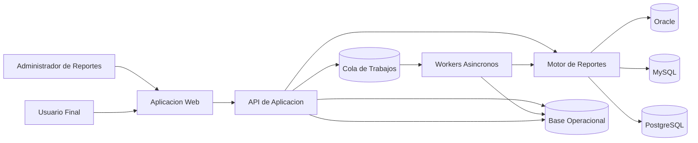

## Diagrama de componentes

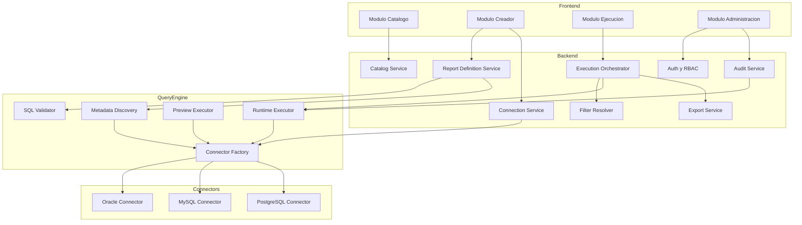

## Modulos internos

### 1. Identity and Access

- Soporta usuarios locales en la primera version.
- Deja una interfaz de autenticacion desacoplada para integrar `LDAP/AD` posteriormente.
- Resuelve roles: `platform_admin`, `report_admin`, `report_user`, `auditor`.
- Aplica permisos por conexion, carpeta/categoria y reporte.

### 2. Catalog Service

- Lista reportes publicados.
- Gestiona categorias, etiquetas y ownership.
- Expone metadata necesaria para UX de ejecucion.

### 3. Report Definition Service

- Crea y versiona reportes.
- Mantiene SQL base, parametros, columnas y politicas de salida.
- Orquesta validacion y preview.

### 4. Query Engine

- Valida el SQL contra reglas seguras.
- Descubre columnas y tipos.
- Ejecuta preview acotado.
- Ejecuta consultas parametrizadas para uso final.

### 5. Execution Orchestrator

- Resuelve filtros del usuario.
- Valida permisos y limites.
- Decide ejecucion sincrona o asincrona.
- Guarda trazabilidad completa de cada corrida.

### 6. Export Service

- Genera CSV/XLSX via background jobs.
- Publica estados: `pending`, `running`, `completed`, `failed`, `expired`.

### 7. Connection Service

- Administra conexiones y secretos.
- Abstrae diferencias de drivers y dialectos.
- Realiza health checks.

## Principios clave

- `SQL controlado`: solo `SELECT` y `WITH`, sin DDL/DML.
- `Parametros tipados`: los filtros se traducen a parametros, no concatenaciones.
- `Aislamiento logico`: el motor SQL depende de interfaces y conectores.
- `Observabilidad`: cada ejecucion tiene `correlation_id`.
- `Escalado selectivo`: API stateless y workers horizontales.
- `Cloud-ready`: configuracion externa, empaquetado portable y servicios desacoplados de infraestructura propietaria.

## Recomendacion de stack

La arquitectura funciona con varios stacks, pero con las decisiones ya confirmadas se recomienda usar `Java` y, dentro de esa familia, priorizar `Spring Boot` para la primera version.

| Stack | Pros | Consideraciones |
|---|---|---|
| Java + Spring Boot + Quartz/Queue | Excelente soporte enterprise, JDBC maduro, Oracle fuerte | Mayor verbosidad |
| Java + Quarkus + Scheduler/Queue | Mejor arranque y menor footprint | Menor familiaridad general del ecosistema enterprise tradicional |

### Stack recomendado

| Capa | Tecnologia recomendada | Motivo |
|---|---|---|
| Backend API | Spring Boot 3.x | Ecosistema maduro, seguridad, scheduling y observabilidad |
| Persistencia metadata | PostgreSQL | Bajo costo, robustez y portabilidad |
| Seguridad | Spring Security | Base solida para auth local y futura integracion `LDAP/AD` |
| Jobs | Spring Scheduler + cola persistente o Quartz | Bajo costo y suficiente para primera version |
| UI | Web SPA ligera | Se mantiene abierta segun preferencia del equipo |
| Observabilidad | Micrometer + Prometheus/Grafana | Stack standard y portable |

Si mas adelante se prioriza footprint minimo o tiempos de arranque agresivos, `Quarkus` sigue siendo una opcion valida, pero la recomendacion actual es **Spring Boot** por menor riesgo de implementacion y mejor alineacion con la conectividad enterprise requerida.
``````

## File: HileReports/docs/architecture/02-recommended-architecture.md
``````markdown
# Recommended Architecture

## Overview

The solution is composed of:

- `Web Frontend`: experience for administrators and end users.
- `Spring Boot Application API`: authentication, catalog, report definition, and orchestration.
- `Reporting Engine`: SQL validation, column discovery, preview, and execution.
- `Workers`: exports, heavy executions, and asynchronous tasks.
- `Operational Database`: metadata, catalog, auditing, and logical queues.
- `Multi-DB Connectors`: adapters for Oracle, MySQL, and PostgreSQL.

## Confirmed Operating Context

- Internal operational reporting platform for domains such as sales and transfers.
- Initial `on-premise` deployment.
- Target capacity of up to `500` concurrent users.
- Low initial cost, prioritizing operational simplicity and efficient infrastructure usage.
- Local authentication in the first version, with preparation for future `AD` integration.

## Context Diagram

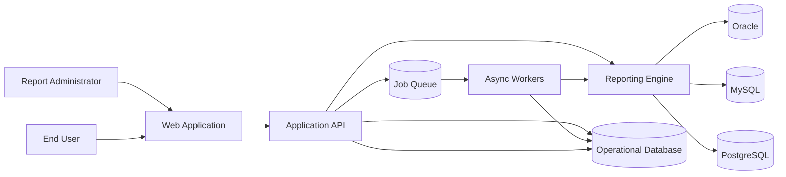

## Component Diagram

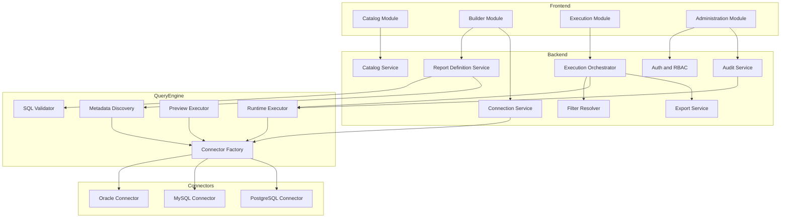

## Internal Modules

### 1. Identity and Access

- Supports local users in the first version.
- Leaves a decoupled authentication interface ready for later `LDAP/AD` integration.
- Resolves roles: `platform_admin`, `report_admin`, `report_user`, `auditor`.
- Applies permissions by connection, folder/category, and report.

### 2. Catalog Service

- Lists published reports.
- Manages categories, tags, and ownership.
- Exposes the metadata needed for the execution UX.

### 3. Report Definition Service

- Creates and versions reports.
- Maintains base SQL, parameters, columns, and output policies.
- Orchestrates validation and preview.

### 4. Query Engine

- Validates SQL against safe rules.
- Discovers columns and types.
- Executes bounded previews.
- Executes parameterized queries for end-user consumption.

### 5. Execution Orchestrator

- Resolves user filters.
- Validates permissions and limits.
- Decides between synchronous and asynchronous execution.
- Stores full traceability for every run.

### 6. Export Service

- Generates CSV/XLSX files through background jobs.
- Publishes statuses: `pending`, `running`, `completed`, `failed`, `expired`.

### 7. Connection Service

- Manages connections and secrets.
- Abstracts driver and dialect differences.
- Performs health checks.

## Key Principles

- `Controlled SQL`: only `SELECT` and `WITH`, no DDL/DML.
- `Typed parameters`: filters are translated into parameters, not string concatenations.
- `Logical isolation`: the SQL engine depends on interfaces and connectors.
- `Observability`: every execution gets a `correlation_id`.
- `Selective scaling`: stateless API and horizontally scalable workers.
- `Cloud-ready`: externalized configuration, portable packaging, and services decoupled from proprietary infrastructure.

## Stack Recommendation

The architecture works with several stacks, but based on the confirmed decisions the recommendation is to use `Java` and, within that ecosystem, prioritize `Spring Boot` for the first version.

| Stack | Pros | Considerations |
| --- | --- | --- |
| Java + Spring Boot + Quartz/Queue | Excellent enterprise support, mature JDBC ecosystem, strong Oracle support | More verbose |
| Java + Quarkus + Scheduler/Queue | Faster startup and lower footprint | Less common across traditional enterprise ecosystems |

### Recommended Stack

| Layer | Recommended Technology | Reason |
| --- | --- | --- |
| Backend API | Spring Boot 3.x | Mature ecosystem, security, scheduling, and observability |
| Metadata persistence | PostgreSQL | Low cost, robustness, and portability |
| Security | Spring Security | Solid base for local auth and future `LDAP/AD` integration |
| Jobs | Spring Scheduler + persistent queue or Quartz | Low cost and sufficient for the first version |
| UI | Lightweight web SPA | Still open based on team preference |
| Observability | Micrometer + Prometheus/Grafana | Standard and portable stack |

If minimum footprint or aggressive startup times become a higher priority later, `Quarkus` remains a valid option, but the current recommendation is **Spring Boot** because it reduces implementation risk and aligns better with the required enterprise connectivity profile.
``````

## File: HileReports/docs/architecture/03-data-models-and-multidb_es.md
``````markdown
# Modelo de Datos y Estrategia Multi-DB

## Entidades principales

### `data_source`

Representa una conexion registrada.

- `id`
- `name`
- `db_type` (`oracle`, `mysql`, `postgresql`)
- `host`
- `port`
- `database_or_service`
- `username`
- `secret_ref`
- `ssl_mode`
- `status`
- `created_by`
- `created_at`

### `report_definition`

Define el reporte funcional.

- `id`
- `name`
- `description`
- `category_id`
- `data_source_id`
- `owner_team`
- `status` (`draft`, `published`, `archived`)
- `current_version_id`
- `created_by`
- `created_at`

### `report_version`

Version inmutable del contenido tecnico del reporte.

- `id`
- `report_definition_id`
- `version_number`
- `sql_text`
- `sql_hash`
- `validation_status`
- `preview_status`
- `max_rows`
- `timeout_seconds`
- `execution_mode` (`sync`, `async`, `auto`)
- `created_by`
- `created_at`

### `report_column`

Metadata de salida.

- `id`
- `report_version_id`
- `source_name`
- `label`
- `data_type`
- `display_type`
- `display_format`
- `ordinal`
- `is_visible`
- `is_sortable`
- `is_filterable_candidate`

### `report_parameter`

Define filtros usables por el usuario final.

- `id`
- `report_version_id`
- `name`
- `label`
- `parameter_type`
- `operator_type`
- `required`
- `default_value`
- `allows_multiple`
- `source_column`
- `validation_rule`

### `report_execution`

Instancia de ejecucion.

- `id`
- `report_definition_id`
- `report_version_id`
- `requested_by`
- `requested_at`
- `status`
- `execution_mode`
- `row_count`
- `duration_ms`
- `error_code`
- `error_message_sanitized`
- `correlation_id`

### `report_execution_parameter`

- `execution_id`
- `parameter_name`
- `parameter_value_masked`

### `report_export`

- `id`
- `execution_id`
- `format`
- `storage_path`
- `status`
- `expires_at`

### `audit_event`

- `id`
- `actor`
- `action`
- `entity_type`
- `entity_id`
- `payload_json`
- `created_at`

## Relacion conceptual

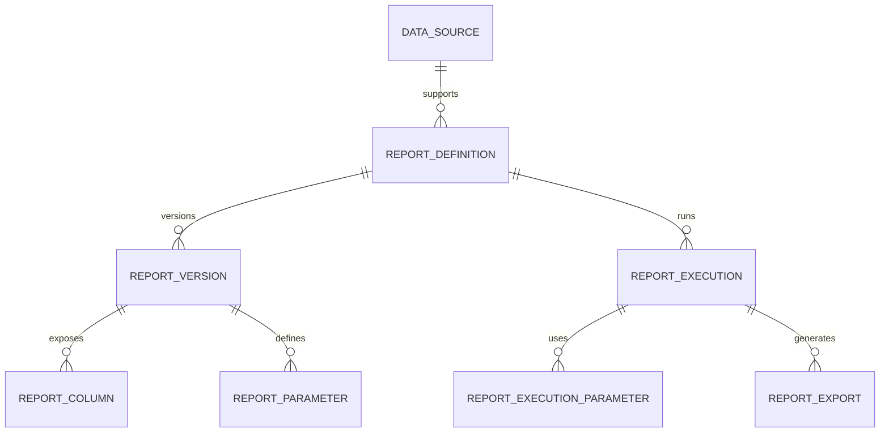

## Estrategia de abstraccion multi-DB

## Contratos principales

```text
interface DbConnector {
  testConnection(connection): HealthCheckResult
  discoverColumns(connection, sql, params): List<ColumnMetadata>
  executePreview(connection, sql, params, limit): QueryResult
  executeQuery(connection, sql, params, pagination, timeout): QueryResult
  translateDialectFeatures(sql): SqlPlan
}
```

```text
interface QueryValidator {
  validateReadOnly(sql): ValidationResult
  extractNamedParameters(sql): List<SqlParameter>
  rejectDangerousPatterns(sql): ValidationResult
}
```

## Responsabilidades por capa

- El `QueryValidator` es agnostico del motor en reglas generales.
- El `DbConnector` encapsula diferencias de driver, paginacion, quoting y metadata.
- El dominio nunca conoce detalles del driver.

## Diferencias por motor a contemplar

| Tema | Oracle | MySQL | PostgreSQL |
|---|---|---|---|
| Driver | JDBC Thin / ODP.NET | MySQL Connector | PG JDBC / Npgsql |
| Paginacion | `OFFSET/FETCH` o envoltura segun version | `LIMIT/OFFSET` | `LIMIT/OFFSET` |
| Metadata | Puede requerir alias consistentes | Sencilla | Sencilla |
| Fechas | Tipos y zonas a validar | Cuidado con timezone | Buen soporte timezone |
| Catalogo | `service name` o SID | database/schema | database/schema |

## Reglas de SQL soportado

- Permitido: `SELECT`, `WITH`, subqueries, joins, agregaciones y funciones de lectura.
- Restringido: `INSERT`, `UPDATE`, `DELETE`, `MERGE`, `ALTER`, `DROP`, `TRUNCATE`, `CALL`, `EXEC`.
- Restringido: multiples sentencias separadas por `;`.
- Restringido: comentarios sospechosos que intenten evadir el parser.
- Restringido: hints o funciones no aprobadas si comprometen performance.

## Estrategia de filtros

Se recomienda que los filtros se definan mediante parametros nombrados dentro del SQL, por ejemplo:

```sql
SELECT
  c.customer_id,
  c.customer_name,
  o.total_amount,
  o.order_date
FROM orders o
JOIN customers c ON c.customer_id = o.customer_id
WHERE (:customer_id IS NULL OR c.customer_id = :customer_id)
  AND (:date_from IS NULL OR o.order_date >= :date_from)
  AND (:date_to IS NULL OR o.order_date < :date_to)
```

El creador detecta `:customer_id`, `:date_from`, `:date_to` y permite asociar:

- tipo de dato,
- etiqueta visible,
- obligatoriedad,
- operador,
- valor por defecto,
- controles UI.

## Preview y discovery

### Flujo sugerido

1. El usuario administrador selecciona origen de datos.
2. Ingresa SQL.
3. El sistema valida sintaxis basica y reglas de seguridad.
4. Se extraen parametros nombrados.
5. Se ejecuta `discoverColumns`.
6. Se ejecuta preview con `LIMIT N`.
7. El usuario ajusta etiquetas, formatos y filtros.

## Recomendacion Final

La metadata operacional debe vivir en una base propia del sistema y no en las bases fuente. La estrategia multi-DB debe implementarse con una `Connector Factory` y conectores dedicados por motor, manteniendo un contrato unico para discovery, preview y ejecucion.
``````

## File: HileReports/docs/architecture/03-data-models-and-multidb.md
``````markdown
# Data Model and Multi-DB Strategy

## Main Entities

### `data_source`

Represents a registered connection.

- `id`
- `name`
- `db_type` (`oracle`, `mysql`, `postgresql`)
- `host`
- `port`
- `database_or_service`
- `username`
- `secret_ref`
- `ssl_mode`
- `status`
- `created_by`
- `created_at`

### `report_definition`

Defines the functional report.

- `id`
- `name`
- `description`
- `category_id`
- `data_source_id`
- `owner_team`
- `status` (`draft`, `published`, `archived`)
- `current_version_id`
- `created_by`
- `created_at`

### `report_version`

Immutable version of the report's technical content.

- `id`
- `report_definition_id`
- `version_number`
- `sql_text`
- `sql_hash`
- `validation_status`
- `preview_status`
- `max_rows`
- `timeout_seconds`
- `execution_mode` (`sync`, `async`, `auto`)
- `created_by`
- `created_at`

### `report_column`

Output metadata.

- `id`
- `report_version_id`
- `source_name`
- `label`
- `data_type`
- `display_type`
- `display_format`
- `ordinal`
- `is_visible`
- `is_sortable`
- `is_filterable_candidate`

### `report_parameter`

Defines filters that the end user can use.

- `id`
- `report_version_id`
- `name`
- `label`
- `parameter_type`
- `operator_type`
- `required`
- `default_value`
- `allows_multiple`
- `source_column`
- `validation_rule`

### `report_execution`

Execution instance.

- `id`
- `report_definition_id`
- `report_version_id`
- `requested_by`
- `requested_at`
- `status`
- `execution_mode`
- `row_count`
- `duration_ms`
- `error_code`
- `error_message_sanitized`
- `correlation_id`

### `report_execution_parameter`

- `execution_id`
- `parameter_name`
- `parameter_value_masked`

### `report_export`

- `id`
- `execution_id`
- `format`
- `storage_path`
- `status`
- `expires_at`

### `audit_event`

- `id`
- `actor`
- `action`
- `entity_type`
- `entity_id`
- `payload_json`
- `created_at`

## Conceptual Relationship


## Multi-DB Abstraction Strategy

## Core Contracts

```text
interface DbConnector {
  testConnection(connection): HealthCheckResult
  discoverColumns(connection, sql, params): List<ColumnMetadata>
  executePreview(connection, sql, params, limit): QueryResult
  executeQuery(connection, sql, params, pagination, timeout): QueryResult
  translateDialectFeatures(sql): SqlPlan
}
```

```text
interface QueryValidator {
  validateReadOnly(sql): ValidationResult
  extractNamedParameters(sql): List<SqlParameter>
  rejectDangerousPatterns(sql): ValidationResult
}
```

## Layer Responsibilities

- `QueryValidator` is engine-agnostic for general rules.
- `DbConnector` encapsulates driver, pagination, quoting, and metadata differences.
- The domain never knows driver-specific details.

## Engine Differences to Consider

| Topic | Oracle | MySQL | PostgreSQL |
| --- | --- | --- | --- |
| Driver | JDBC Thin / ODP.NET | MySQL Connector | PG JDBC / Npgsql |
| Pagination | `OFFSET/FETCH` or wrapping depending on version | `LIMIT/OFFSET` | `LIMIT/OFFSET` |
| Metadata | May require consistent aliases | Straightforward | Straightforward |
| Dates | Types and zones must be validated | Watch timezone behavior | Good timezone support |
| Catalog | `service name` or SID | database/schema | database/schema |

## Supported SQL Rules

- Allowed: `SELECT`, `WITH`, subqueries, joins, aggregations, and read-only functions.
- Restricted: `INSERT`, `UPDATE`, `DELETE`, `MERGE`, `ALTER`, `DROP`, `TRUNCATE`, `CALL`, `EXEC`.
- Restricted: multiple statements separated by `;`.
- Restricted: suspicious comments that try to bypass the parser.
- Restricted: unapproved hints or functions if they compromise performance.

## Filter Strategy

The recommendation is to define filters through named parameters inside the SQL, for example:

```sql
SELECT
  c.customer_id,
  c.customer_name,
  o.total_amount,
  o.order_date
FROM orders o
JOIN customers c ON c.customer_id = o.customer_id
WHERE (:customer_id IS NULL OR c.customer_id = :customer_id)
  AND (:date_from IS NULL OR o.order_date >= :date_from)
  AND (:date_to IS NULL OR o.order_date < :date_to)
```

The builder detects `:customer_id`, `:date_from`, and `:date_to`, then allows configuration of:

- data type,
- visible label,
- required flag,
- operator,
- default value,
- UI controls.

## Preview and Discovery

### Suggested Flow

1. The administrator selects a data source.
2. They enter SQL.
3. The system validates basic syntax and security rules.
4. Named parameters are extracted.
5. `discoverColumns` is executed.
6. Preview runs with `LIMIT N`.
7. The user adjusts labels, formats, and filters.

## Final Recommendation

Operational metadata must live in the system's own database, not in source databases. The multi-DB strategy should be implemented with a `Connector Factory` and dedicated connectors per engine, while preserving a single contract for discovery, preview, and execution.
``````

## File: HileReports/docs/architecture/04-api-and-workflows_es.md
``````markdown
# API y Flujos

## Principios API

- API REST para operaciones de negocio.
- Respuestas paginadas para listados y resultados.
- Idempotencia para operaciones de prueba donde aplique.
- Versionado de API via `/api/v1`.
- Autorizacion por scopes y permisos de dominio.

## Endpoints principales

### Conexiones

- `POST /api/v1/data-sources`
- `POST /api/v1/data-sources/{id}/test`
- `GET /api/v1/data-sources`
- `PATCH /api/v1/data-sources/{id}`
- `POST /api/v1/data-sources/{id}/disable`

### Reportes

- `POST /api/v1/reports`
- `GET /api/v1/reports`
- `GET /api/v1/reports/{id}`
- `PATCH /api/v1/reports/{id}`
- `POST /api/v1/reports/{id}/versions`
- `POST /api/v1/reports/{id}/publish`
- `POST /api/v1/reports/{id}/archive`

### Creador

- `POST /api/v1/report-builder/validate`
- `POST /api/v1/report-builder/discover-columns`
- `POST /api/v1/report-builder/preview`

### Ejecucion

- `GET /api/v1/catalog/reports`
- `POST /api/v1/report-executions`
- `GET /api/v1/report-executions/{id}`
- `GET /api/v1/report-executions/{id}/rows`
- `POST /api/v1/report-executions/{id}/exports`
- `GET /api/v1/report-exports/{id}`

### Auditoria y operacion

- `GET /api/v1/audit/events`
- `GET /api/v1/operations/executions`
- `GET /api/v1/operations/metrics`

## Payloads de ejemplo

### Crear reporte

```json
{
  "name": "Ventas por cliente",
  "description": "Reporte operativo de ventas",
  "categoryId": "sales",
  "dataSourceId": "ds_pg_001"
}
```

### Validar SQL

```json
{
  "dataSourceId": "ds_pg_001",
  "sql": "SELECT c.customer_id, c.customer_name FROM customers c WHERE (:customer_id IS NULL OR c.customer_id = :customer_id)"
}
```

### Respuesta de columnas

```json
{
  "valid": true,
  "parameters": [
    {
      "name": "customer_id",
      "inferredType": "string"
    }
  ],
  "columns": [
    {
      "sourceName": "customer_id",
      "label": "customer_id",
      "dataType": "varchar"
    },
    {
      "sourceName": "customer_name",
      "label": "customer_name",
      "dataType": "varchar"
    }
  ],
  "warnings": []
}
```

### Ejecutar reporte

```json
{
  "reportId": "rpt_ventas_cliente",
  "parameters": {
    "customer_id": "C-1002",
    "date_from": "2026-01-01",
    "date_to": "2026-02-01"
  },
  "page": 1,
  "pageSize": 100
}
```

## Flujo 1: Creacion de reporte

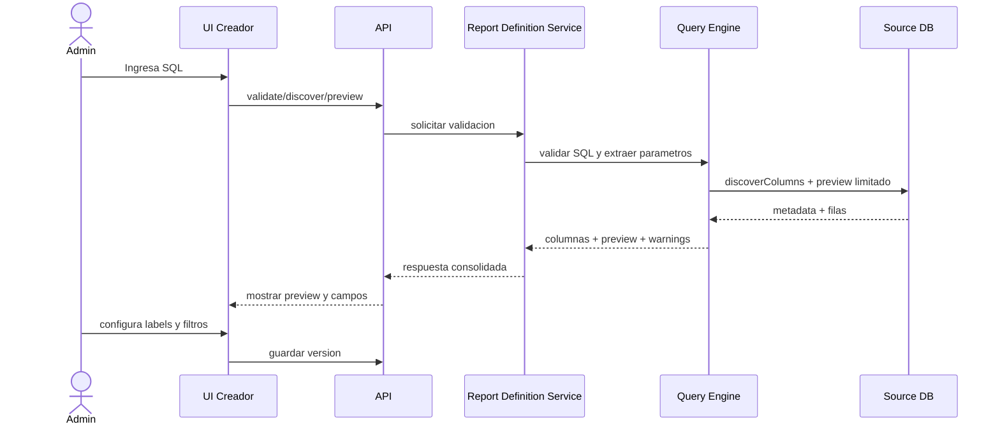

## Flujo 2: Ejecucion por usuario final

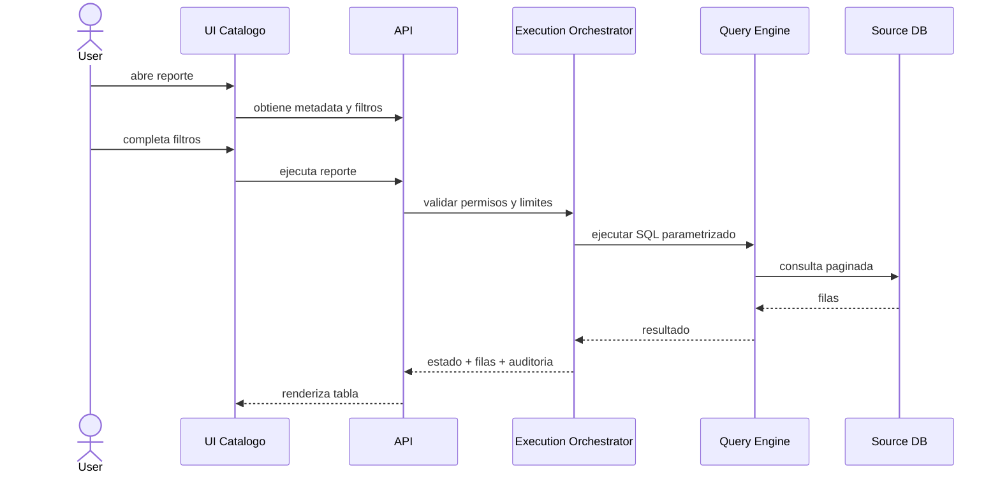

## Flujo 3: Exportacion asincrona

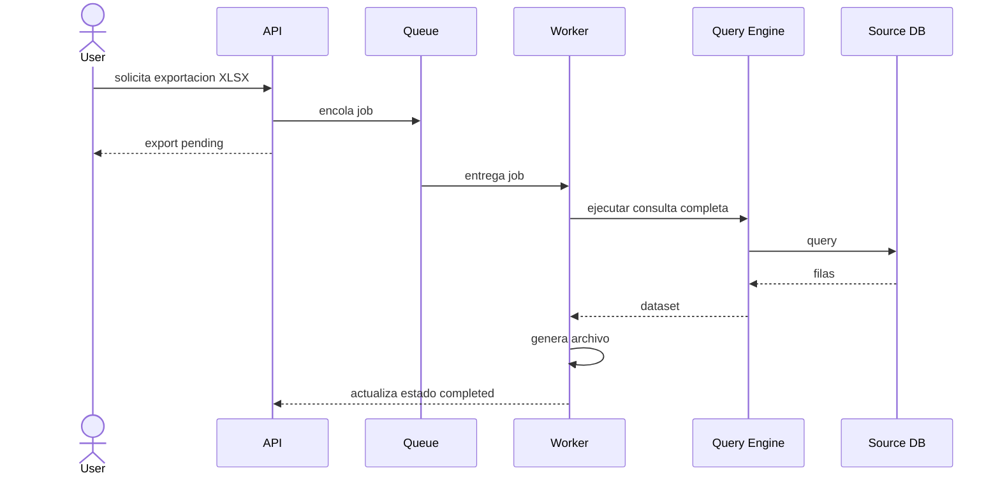

## Reglas de negocio API

- No se puede publicar un reporte sin preview exitoso.
- No se puede ejecutar un reporte en estado `draft`.
- Los parametros requeridos deben validarse antes de llegar al motor.
- Los errores tecnicos se traducen a codigos funcionales.
- Las exportaciones deben expirar y limpiarse automaticamente.

## Recomendacion Final

Los contratos API deben mantenerse simples y orientados al dominio. La logica sensible de validacion SQL y conexion multi-DB no debe filtrarse al frontend; el frontend solo consume metadata y resultados.
``````

## File: HileReports/docs/architecture/04-api-and-workflows.md
``````markdown
# API and Flows

## API Principles

- REST API for business operations.
- Paginated responses for listings and results.
- Idempotency for testing operations where applicable.
- API versioning through `/api/v1`.
- Authorization through scopes and domain permissions.

## Main Endpoints

### Connections

- `POST /api/v1/data-sources`
- `POST /api/v1/data-sources/{id}/test`
- `GET /api/v1/data-sources`
- `PATCH /api/v1/data-sources/{id}`
- `POST /api/v1/data-sources/{id}/disable`

### Reports

- `POST /api/v1/reports`
- `GET /api/v1/reports`
- `GET /api/v1/reports/{id}`
- `PATCH /api/v1/reports/{id}`
- `POST /api/v1/reports/{id}/versions`
- `POST /api/v1/reports/{id}/publish`
- `POST /api/v1/reports/{id}/archive`

### Builder

- `POST /api/v1/report-builder/validate`
- `POST /api/v1/report-builder/discover-columns`
- `POST /api/v1/report-builder/preview`

### Execution

- `GET /api/v1/catalog/reports`
- `POST /api/v1/report-executions`
- `GET /api/v1/report-executions/{id}`
- `GET /api/v1/report-executions/{id}/rows`
- `POST /api/v1/report-executions/{id}/exports`
- `GET /api/v1/report-exports/{id}`

### Auditing and Operations

- `GET /api/v1/audit/events`
- `GET /api/v1/operations/executions`
- `GET /api/v1/operations/metrics`

## Example Payloads

### Create Report

```json
{
  "name": "Sales by customer",
  "description": "Operational sales report",
  "categoryId": "sales",
  "dataSourceId": "ds_pg_001"
}
```

### Validate SQL

```json
{
  "dataSourceId": "ds_pg_001",
  "sql": "SELECT c.customer_id, c.customer_name FROM customers c WHERE (:customer_id IS NULL OR c.customer_id = :customer_id)"
}
```

### Column Response

```json
{
  "valid": true,
  "parameters": [
    {
      "name": "customer_id",
      "inferredType": "string"
    }
  ],
  "columns": [
    {
      "sourceName": "customer_id",
      "label": "customer_id",
      "dataType": "varchar"
    },
    {
      "sourceName": "customer_name",
      "label": "customer_name",
      "dataType": "varchar"
    }
  ],
  "warnings": []
}
```

### Run Report

```json
{
  "reportId": "rpt_ventas_cliente",
  "parameters": {
    "customer_id": "C-1002",
    "date_from": "2026-01-01",
    "date_to": "2026-02-01"
  },
  "page": 1,
  "pageSize": 100
}
```

## Flow 1: Report Creation

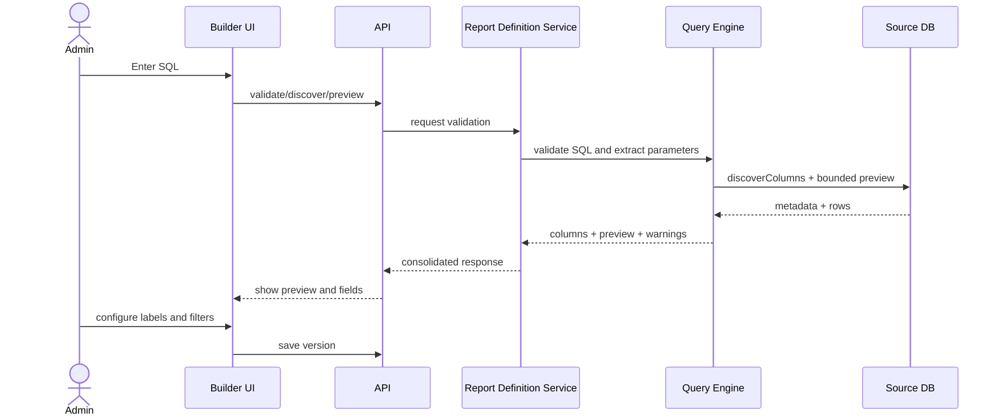

## Flow 2: End-User Execution

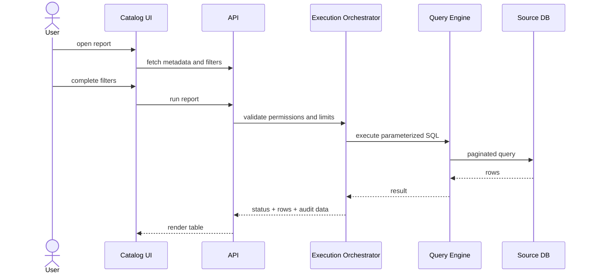

## Flow 3: Asynchronous Export

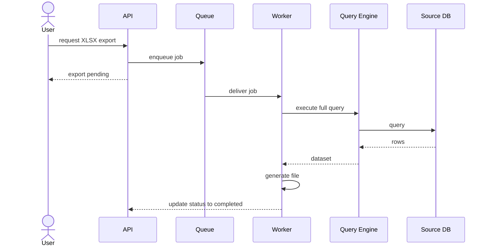

## API Business Rules

- A report cannot be published without a successful preview.
- A report in `draft` state cannot be executed.
- Required parameters must be validated before reaching the engine.
- Technical errors must be translated into functional error codes.
- Exports must expire and be cleaned up automatically.

## Final Recommendation

API contracts should remain simple and domain-oriented. Sensitive SQL validation and multi-DB connectivity logic must not leak into the frontend; the frontend should consume only metadata and results.
``````

## File: HileReports/docs/architecture/05-security-operations-and-nfr_es.md
``````markdown
# Seguridad, Operacion y NFR

## Seguridad

### Identidad y acceso

- Implementar autenticacion local en la primera version.
- Diseñar un `AuthenticationProvider` intercambiable para integrar `LDAP/AD` en una fase posterior.
- Aplicar RBAC por rol y ACL por reporte/conexion.
- Separar permisos de crear, publicar, ejecutar y auditar.

### Manejo de secretos

- Guardar credenciales de bases fuente en un secret manager o con cifrado fuerte.
- Nunca persistir passwords en texto plano.
- Rotacion de secretos soportada sin republicar reportes.

### Seguridad del SQL

- Parser o validador para permitir solo lectura.
- Bloqueo de sentencias multiples.
- Uso obligatorio de parametros tipados.
- Lista de funciones o patrones bloqueados si afectan seguridad o performance.
- Timeout por consulta y maximo de filas por contexto.

### Seguridad de datos

- Enmascarar parametros sensibles en auditoria.
- No almacenar datasets completos salvo exportaciones temporales.
- Expirar archivos exportados.
- Minimizar logs con datos personales o financieros.

## Rendimiento

### Estrategias

- Preview limitado, por ejemplo 50 o 100 filas.
- Paginacion server-side obligatoria.
- Cache de metadata de columnas y definicion de reportes.
- Pool de conexiones por motor y por datasource.
- Circuit breakers o throttling para fuentes lentas.

### Presupuestos iniciales

| Escenario | Objetivo |
|---|---|
| Listado de reportes | < 1 s |
| Preview de creador | < 5 s |
| Ejecucion interactiva paginada | < 8 s objetivo p95 |
| Concurrencia objetivo | hasta 500 usuarios concurrentes |
| Exportacion grande | asincrona |

## Disponibilidad y resiliencia

- API stateless desplegable en varias instancias `on-premise`.
- Workers escalables horizontalmente.
- Reintentos solo en fallos transitorios idempotentes.
- Desactivar un datasource sin afectar todo el sistema.
- Cola durable para exportaciones.
- Configuracion externa para migracion posterior a nube sin cambios mayores de codigo.

## Observabilidad

### Logs

- Cada request y ejecucion debe tener `correlation_id`.
- Registrar datasource, reporte, duracion, resultado y tipo de error.

### Metricas

- Tiempo de validacion SQL.
- Tiempo de preview.
- Tiempo de ejecucion por motor.
- Cantidad de ejecuciones por reporte.
- Tasa de fallos por datasource.
- Exportaciones pendientes y duracion promedio.

### Trazas

- Trazar end-to-end desde UI/API hasta Query Engine y worker.

## Costos

- Empezar con monolito modular evita costos altos de plataforma.
- Los mayores costos estaran en conectividad enterprise, observabilidad y exportaciones pesadas.
- Para mantener presupuesto bajo, evitar dependencias comerciales no esenciales en la primera fase.
- Si se requiere alta concurrencia de exportaciones, aislar workers reduce costo por nodo principal.

## Mantenibilidad

- Hexagonal o puertos/adaptadores en el backend.
- Modulos aislados por bounded context.
- Pruebas automatizadas en validacion y conectores.
- Feature flags para motores o capacidades nuevas.

## Riesgos y mitigaciones

| Riesgo | Impacto | Mitigacion |
|---|---|---|
| SQL inseguro o costoso | Alto | Parser, allowlist, timeout, limites, review de publicacion |
| Diferencias dialectales | Medio-Alto | Conectores por motor y pruebas de compatibilidad |
| Exceso de carga en DB origen | Alto | Preview limitado, paginacion, ventanas horarias, rate limit |
| Credenciales comprometidas | Alto | Secret manager, rotacion, auditoria y minimizacion de acceso |
| Exportaciones enormes | Medio | Jobs asincronos, cuotas y expiracion |

## Estrategia de testing

- Unit tests para validacion SQL y extraccion de parametros.
- Contract tests por `DbConnector`.
- Integration tests contra contenedores de MySQL/PostgreSQL.
- Integration tests controlados para Oracle segun licenciamiento y ambiente.
- E2E tests para creador, preview y ejecucion de reportes.

## Recomendacion Final

La primera version debe invertir temprano en seguridad del SQL, autenticacion local robusta, observabilidad y pruebas de conectores. Son las areas con mayor riesgo tecnico y operativo para una plataforma interna `on-premise` con objetivo de hasta `500` usuarios concurrentes.
``````

## File: HileReports/docs/architecture/05-security-operations-and-nfr.md
``````markdown
# Security, Operations, and NFRs

## Security

### Identity and Access

- Implement local authentication in the first version.
- Design a replaceable `AuthenticationProvider` to integrate `LDAP/AD` in a later phase.
- Apply RBAC by role and ACL by report/connection.
- Separate permissions to create, publish, execute, and audit.

### Secret Handling

- Store source database credentials in a secret manager or with strong encryption.
- Never persist passwords in plain text.
- Support secret rotation without republishing reports.

### SQL Security

- Parser or validator to allow read-only queries only.
- Block multiple statements.
- Mandatory use of typed parameters.
- Maintain a list of blocked functions or patterns if they affect security or performance.
- Timeout per query and maximum row count by context.

### Data Security

- Mask sensitive parameters in audit logs.
- Do not store complete datasets except for temporary exports.
- Expire exported files.
- Minimize logs containing personal or financial data.

## Performance

### Strategies

- Limited preview, for example 50 or 100 rows.
- Mandatory server-side pagination.
- Cache column metadata and report definitions.
- Connection pools by engine and by datasource.
- Circuit breakers or throttling for slow sources.

### Initial Budgets

| Scenario | Target |
|---|---|
| Report listing | < 1 s |
| Builder preview | < 5 s |
| Interactive paginated execution | < 8 s target p95 |
| Target concurrency | up to 500 concurrent users |
| Large export | asynchronous |

## Availability and Resilience

- Stateless API deployable in multiple `on-premise` instances.
- Horizontally scalable workers.
- Retries only for idempotent transient failures.
- Disable one datasource without affecting the entire system.
- Durable queue for exports.
- Externalized configuration to enable later cloud migration without major code changes.

## Observability

### Logs

- Every request and execution must have a `correlation_id`.
- Record datasource, report, duration, result, and error type.

### Metrics

- SQL validation time.
- Preview time.
- Execution time by engine.
- Number of executions per report.
- Failure rate by datasource.
- Pending exports and average duration.

### Traces

- Trace end-to-end from UI/API to the Query Engine and worker.

## Costs

- Starting with a modular monolith avoids high platform costs.
- The largest costs will be in enterprise connectivity, observability, and heavy exports.
- To keep the budget low, avoid non-essential commercial dependencies in the first phase.
- If high export concurrency is required, isolating workers reduces cost on the main node.

## Maintainability

- Hexagonal or ports-and-adapters architecture in the backend.
- Isolated modules by bounded context.
- Automated tests for validation and connectors.
- Feature flags for new engines or capabilities.

## Risks and Mitigations

| Risk | Impact | Mitigation |
|---|---|---|
| Unsafe or expensive SQL | High | Parser, allowlist, timeout, limits, publication review |
| Dialect differences | Medium-High | Connectors by engine and compatibility testing |
| Excess load on source DB | High | Limited preview, pagination, time windows, rate limit |
| Compromised credentials | High | Secret manager, rotation, auditing, and least privilege |
| Huge exports | Medium | Async jobs, quotas, and expiration |

## Testing Strategy

- Unit tests for SQL validation and parameter extraction.
- Contract tests per `DbConnector`.
- Integration tests against MySQL/PostgreSQL containers.
- Controlled integration tests for Oracle depending on licensing and environment.
- E2E tests for builder, preview, and report execution.

## Final Recommendation

The first version should invest early in SQL security, robust local authentication, observability, and connector testing. These are the areas with the highest technical and operational risk for an internal `on-premise` platform targeting up to `500` concurrent users.
``````

## File: HileReports/docs/architecture/06-implementation-plan_es.md
``````markdown
# Plan de Implementacion

## Fase 0: Definicion

- Confirmar `Spring Boot` como stack base.
- Confirmar despliegue inicial `on-premise` y lineamientos `cloud-ready`.
- Confirmar autenticacion local para MVP y estrategia posterior de integracion `AD`.
- Validar politicas de seguridad y compliance.

## Fase 1: Plataforma base

- Crear estructura modular del backend.
- Implementar autenticacion, autorizacion y auditoria base.
- Implementar metadata store.
- Crear modulo de conexiones y secretos.

## Fase 2: Motor SQL

- Implementar `QueryValidator`.
- Implementar `Connector Factory`.
- Implementar conectores para PostgreSQL y MySQL.
- Implementar conector Oracle.
- Implementar discovery de columnas y preview.

## Fase 3: Creador de reportes

- UI para crear reporte y seleccionar datasource.
- Editor SQL con validacion y preview.
- Configuracion de columnas y filtros.
- Versionado y publicacion.

## Fase 4: Catalogo y ejecucion

- Listado de reportes publicados.
- Formulario dinamico de filtros.
- Ejecucion paginada.
- Historial de ejecuciones.

## Fase 5: Exportaciones y operaciones

- Cola de trabajos y workers.
- Exportaciones CSV/XLSX.
- Monitoreo, metricas y alertas.
- Limpieza automatica de archivos temporales.

## Entregables sugeridos por sprint

| Sprint | Entregable |
|---|---|
| 1 | Estructura Spring Boot, auth local, metadata store |
| 2 | Data sources, cifrado de secretos y test de conexion |
| 3 | Validator y conectores PostgreSQL/MySQL |
| 4 | Conector Oracle, preview y discovery |
| 5 | Creador de reportes, versionado y publicacion |
| 6 | Catalogo, filtros, ejecucion y auditoria |
| 7 | Exportaciones, observabilidad y tuning para 500 concurrentes |
| 8 | Hardening, UAT y preparacion de despliegue on-premise |

## Equipo sugerido

- 1 Tech Lead / Architect.
- 2 o 3 Backend developers Java.
- 1 Frontend developer.
- 1 QA automation o SDET compartido.
- 1 DevOps parcial si el entorno aun no existe.

## Definition of Done tecnica

- Feature con pruebas automatizadas relevantes.
- Logs y metricas agregadas.
- Seguridad revisada en manejo de secretos y SQL.
- Documentacion tecnica y runbooks actualizados.

## Recomendacion Final

Implementar por fases verticales y no por capas aisladas. El primer camino de valor debe cubrir de extremo a extremo: registrar conexion, crear reporte simple, hacer preview y ejecutarlo en catalogo, ya sobre la base definitiva de `Java + Spring Boot`.
``````

## File: HileReports/docs/architecture/06-implementation-plan.md
``````markdown
# Implementation Plan

## Phase 0: Definition

- Confirm `Spring Boot` as the base stack.
- Confirm initial `on-premise` deployment and `cloud-ready` guidelines.
- Confirm local authentication for the MVP and a later `AD` integration strategy.
- Validate security and compliance policies.

## Phase 1: Foundation Platform

- Create the modular backend structure.
- Implement base authentication, authorization, and auditing.
- Implement the metadata store.
- Create the connections and secrets module.

## Phase 2: SQL Engine

- Implement `QueryValidator`.
- Implement `Connector Factory`.
- Implement connectors for PostgreSQL and MySQL.
- Implement the Oracle connector.
- Implement column discovery and preview.

## Phase 3: Report Builder

- UI to create reports and select a datasource.
- SQL editor with validation and preview.
- Column and filter configuration.
- Versioning and publication.

## Phase 4: Catalog and Execution

- Published report listing.
- Dynamic filter form.
- Paginated execution.
- Execution history.

## Phase 5: Exports and Operations

- Job queue and workers.
- CSV/XLSX exports.
- Monitoring, metrics, and alerts.
- Automated cleanup of temporary files.

## Suggested Sprint Deliverables

| Sprint | Deliverable |
|---|---|
| 1 | Spring Boot structure, local auth, metadata store |
| 2 | Data sources, secret encryption, and connection test |
| 3 | Validator and PostgreSQL/MySQL connectors |
| 4 | Oracle connector, preview, and discovery |
| 5 | Report builder, versioning, and publication |
| 6 | Catalog, filters, execution, and auditing |
| 7 | Exports, observability, and tuning for 500 concurrent users |
| 8 | Hardening, UAT, and `on-premise` deployment readiness |

## Suggested Team

- 1 Tech Lead / Architect.
- 2 or 3 Java backend developers.
- 1 Frontend developer.
- 1 QA automation engineer or shared SDET.
- 1 part-time DevOps engineer if the environment does not yet exist.

## Technical Definition of Done

- Feature with relevant automated tests.
- Logs and metrics added.
- Security reviewed for secrets handling and SQL.
- Technical documentation and runbooks updated.

## Final Recommendation

Implement by vertical phases rather than isolated layers. The first value path should cover end-to-end: register connection, create a simple report, preview it, and execute it in the catalog, all on the final `Java + Spring Boot` foundation.
``````

## File: HileReports/docs/architecture/07-detailed-implementation-plan_es.md
``````markdown
# Plan Minucioso de Implementacion

## Objetivo del plan

Definir una secuencia detallada de trabajo para implementar el reporteador universal con `Java + Spring Boot`, despliegue inicial `on-premise`, autenticacion local, soporte multi-DB y capacidad objetivo de hasta `500` usuarios concurrentes.

## Supuestos de ejecucion

- Equipo base: `1` Tech Lead, `2-3` backend Java, `1` frontend, `1` QA compartido, `1` DevOps parcial.
- Sprint sugerido: `2 semanas`.
- Estrategia de entrega: vertical slices funcionales.
- Base operacional del sistema: `PostgreSQL`.

## Orden maestro de implementacion

1. Fundacion tecnica.
2. Seguridad base y usuarios locales.
3. Metadata store y catalogos.
4. Data sources y conectividad segura.
5. Motor de validacion SQL.
6. Discovery y preview.
7. Creador de reportes.
8. Catalogo y ejecucion.
9. Exportaciones y jobs.
10. Observabilidad, performance y hardening.

## Epic 1: Fundacion tecnica

### Objetivo

Dejar la base del proyecto, arquitectura interna, convenciones y pipeline.

### Tareas backend

- Crear repositorio y estructura modular:
  - `app-api`
  - `app-domain`
  - `app-infrastructure`
  - `app-connectors`
  - `app-jobs`
- Configurar `Spring Boot 3.x`, `Java 21` o la version LTS aprobada.
- Configurar manejo de perfiles `local`, `dev`, `qa`, `prod`.
- Integrar `Flyway` para migraciones.
- Configurar `SpringDoc/OpenAPI`.
- Configurar manejo unificado de errores.
- Configurar logging estructurado.
- Definir convenciones de paquetes y puertos/adaptadores.

### Tareas frontend

- Crear base del frontend.
- Definir layout base: login, catalogo, builder, administracion.
- Configurar cliente HTTP, manejo de errores y guardas de ruta.

### Tareas DevOps

- Crear pipeline CI:
  - build
  - test
  - analisis estatico
  - empaquetado
- Definir artefacto de despliegue `jar` o contenedor.
- Preparar templates de variables por ambiente.

### Criterios de salida

- Proyecto compila.
- Pipeline ejecuta build y tests.
- Se publica documentacion OpenAPI base.

## Epic 2: Seguridad base y usuarios locales

### Objetivo

Habilitar autenticacion inicial con usuarios locales y dejar preparada la evolucion a `AD`.

### Tareas backend

- Implementar entidades `user`, `role`, `permission`, `user_role`.
- Implementar login con `Spring Security`.
- Implementar password hashing con `bcrypt` o algoritmo equivalente fuerte.
- Implementar refresh tokens o sesiones controladas.
- Definir permisos:
  - `USER_MANAGE`
  - `DATASOURCE_MANAGE`
  - `REPORT_DESIGN`
  - `REPORT_PUBLISH`
  - `REPORT_EXECUTE`
  - `AUDIT_VIEW`
- Crear interfaz `AuthenticationProviderPort`.
- Implementar proveedor `LocalAuthenticationProvider`.
- Diseñar stub o contrato para `AdAuthenticationProvider`.
- Implementar auditoria de login, logout y cambios de usuario.

### Tareas frontend

- Pantalla de login.
- Gestion de usuarios locales.
- Pantalla de roles y asignacion.

### Criterios de salida

- Usuarios locales pueden autenticarse.
- RBAC funcional por endpoint y por modulo.
- El dominio no depende directamente de `AD`.

## Epic 3: Metadata store y catalogos base

### Objetivo

Persistir definiciones de reportes, categorias y auditoria.

### Tareas backend

- Crear migraciones iniciales para:
  - `category`
  - `data_source`
  - `report_definition`
  - `report_version`
  - `report_column`
  - `report_parameter`
  - `report_execution`
  - `report_execution_parameter`
  - `report_export`
  - `audit_event`
- Implementar repositorios y servicios de dominio.
- Crear endpoints CRUD para categorias.
- Implementar auditoria generica de entidades.

### Criterios de salida

- Metadata persistida con versionado basico.
- Auditoria de cambios disponible.

## Epic 4: Data sources y conectividad segura

### Objetivo

Registrar y probar conexiones a Oracle, MySQL y PostgreSQL.

### Tareas backend

- Implementar cifrado de secretos en aplicacion o integracion con secret store disponible.
- Crear `DataSourceService`.
- Crear `ConnectorFactory`.
- Implementar `testConnection`.
- Definir politicas de pooling por motor.
- Registrar metadata tecnica del datasource.
- Implementar habilitar/deshabilitar datasource.

### Tareas de conectores

- Implementar `PostgreSqlConnector`.
- Implementar `MySqlConnector`.
- Implementar `OracleConnector`.
- Unificar mapeo de tipos y errores.

### Criterios de salida

- Se pueden registrar y probar los tres motores.
- Los secretos no se almacenan en texto plano.

## Epic 5: Motor de validacion SQL

### Objetivo

Garantizar que el SQL ingresado sea seguro y utilizable por el sistema.

### Tareas backend

- Implementar `QueryValidator`.
- Bloquear DDL/DML y sentencias multiples.
- Implementar extraccion de parametros nombrados.
- Validar comentarios sospechosos y patrones prohibidos.
- Agregar timeout y limites por consulta.
- Definir codigos de error funcionales.

### Tareas QA

- Crear suite de casos validos e invalidos.
- Crear casos por motor cuando existan diferencias dialectales.

### Criterios de salida

- El motor rechaza SQL inseguro.
- Los parametros se descubren correctamente.

## Epic 6: Discovery de columnas y preview

### Objetivo

Descubrir columnas y mostrar preview controlado desde el builder.

### Tareas backend

- Implementar `discoverColumns`.
- Implementar `executePreview`.
- Definir limite de preview configurable.
- Estandarizar tipos de columnas a tipos de UI.
- Persistir metadata de columnas detectadas.

### Tareas frontend

- Mostrar grid de preview.
- Mostrar lista de columnas descubiertas.
- Mostrar warnings y errores amigables.

### Criterios de salida

- El administrador puede validar visualmente columnas y datos de muestra.

## Epic 7: Creador de reportes

### Objetivo

Permitir crear, editar, versionar y publicar reportes.

### Tareas backend

- Crear `ReportDefinitionService`.
- Implementar guardar borrador.
- Implementar crear nueva version.
- Implementar publicar/despublicar.
- Validar que solo se publique si el preview fue exitoso.
- Permitir metadatos de columnas:
  - label
  - orden
  - visible
  - formato
- Permitir configuracion de parametros:
  - tipo
  - requerido
  - valor por defecto
  - multi-valor

### Tareas frontend

- Editor de metadata general del reporte.
- Editor SQL.
- Panel de preview.
- Configuracion de columnas.
- Configuracion de filtros.
- Flujo de publicacion.

### Criterios de salida

- Existe builder funcional de punta a punta.

## Epic 8: Catalogo y ejecucion de reportes

### Objetivo

Exponer reportes publicados para usuarios finales.

### Tareas backend

- Implementar listado filtrable de reportes.
- Implementar resolucion de filtros configurados.
- Implementar ejecucion paginada.
- Persistir `report_execution`.
- Aplicar ACL por reporte y datasource.
- Sanitizar errores de base de datos.

### Tareas frontend

- Pantalla de catalogo.
- Busqueda por nombre y categoria.
- Formulario dinamico de filtros.
- Grilla de resultados paginada.
- Historial de ejecuciones.

### Criterios de salida

- Un usuario puede buscar, abrir y ejecutar reportes publicados.

## Epic 9: Exportaciones y jobs

### Objetivo

Permitir exportaciones sin bloquear la experiencia interactiva.

### Tareas backend

- Implementar `ExportService`.
- Implementar scheduler o cola persistente.
- Generar CSV.
- Generar XLSX.
- Persistir estado de exportacion.
- Expirar y limpiar archivos temporales.

### Tareas frontend

- Solicitar exportacion.
- Visualizar estado del job.
- Descargar archivo terminado.

### Criterios de salida

- Exportaciones medianas y grandes se procesan asincronamente.

## Epic 10: Observabilidad, performance y hardening

### Objetivo

Preparar la plataforma para operacion real `on-premise` y carga objetivo.

### Tareas backend

- Instrumentar metricas con `Micrometer`.
- Publicar endpoint para `Prometheus`.
- Agregar health checks.
- Ajustar pools de conexiones.
- Ajustar timeouts y limites.
- Optimizar queries de metadata.
- Implementar rate limiting o quotas si aplica.

### Tareas QA/Performance

- Pruebas de carga orientadas a `500` concurrentes.
- Medicion de `p95` para endpoints criticos.
- UAT funcional con reportes reales.

### Tareas DevOps

- Runbook de despliegue `on-premise`.
- Runbook de backup y recuperacion.
- Plantillas de configuracion para futura nube.

### Criterios de salida

- La plataforma pasa pruebas de carga y operacion basica.

## Dependencias clave

| Bloque | Depende de |
|---|---|
| Seguridad local | Fundacion tecnica |
| Metadata store | Fundacion tecnica |
| Data sources | Seguridad local, metadata store |
| Validador SQL | Data sources basicos |
| Preview | Validador SQL, conectores |
| Builder | Preview, metadata store |
| Catalogo y ejecucion | Builder, seguridad |
| Exportaciones | Ejecucion |
| Hardening | Todas las anteriores |

## Backlog priorizado del MVP

### MVP-1 Fundacional

- Login local.
- Roles basicos.
- CRUD de datasource.
- Test de conexion.
- Soporte PostgreSQL y MySQL.

### MVP-2 Core de reportes

- Validacion SQL.
- Discovery de columnas.
- Preview.
- Builder.
- Publicacion de reportes.

### MVP-3 Consumo

- Catalogo.
- Filtros dinamicos.
- Ejecucion paginada.
- Auditoria.

### MVP-4 Operacion

- Oracle connector.
- Exportaciones.
- Observabilidad.
- Performance tuning.

## Riesgos de planificacion

| Riesgo | Impacto | Accion preventiva |
|---|---|---|
| Oracle retrasa por drivers o ambiente | Alto | Atacar compatibilidad en sprint temprano |
| SQL validator subestima casos complejos | Alto | Diseñar bateria de casos desde el inicio |
| Frontend builder crece demasiado | Medio | Entregar builder incremental y no WYSIWYG |
| Carga de 500 concurrentes afecta DB fuente | Alto | Limites, paginacion, export async, quotas |

## Definition of Ready para historias

- Criterio funcional claro.
- Contrato API definido o borrador validado.
- Regla de seguridad identificada.
- Datos de prueba disponibles.
- Criterio de aceptacion medible.

## Definition of Done para historias

- Codigo implementado y revisado.
- Tests relevantes aprobados.
- Logs y metricas agregados si aplica.
- Documentacion actualizada.
- Sin vulnerabilidades o errores criticos abiertos.

## Recomendacion Final

La implementacion debe comenzar por el camino vertical mas corto que valide el producto: `login local -> datasource PostgreSQL/MySQL -> SQL seguro -> preview -> builder -> catalogo -> ejecucion`. `Oracle`, exportaciones avanzadas y tuning para `500` concurrentes deben trabajarse muy temprano, pero sin bloquear la validacion inicial del flujo principal.
``````

## File: HileReports/docs/architecture/07-detailed-implementation-plan.md
``````markdown
# Detailed Implementation Plan

## Plan Objective

Define a detailed work sequence to implement the universal reporting platform with `Java + Spring Boot`, initial `on-premise` deployment, local authentication, multi-DB support, and a target capacity of up to `500` concurrent users.

## Execution Assumptions

- Core team: `1` Tech Lead, `2-3` Java backend developers, `1` frontend developer, `1` shared QA engineer, `1` part-time DevOps engineer.
- Suggested sprint length: `2 weeks`.
- Delivery strategy: functional vertical slices.
- System operational database: `PostgreSQL`.

## Master Implementation Order

1. Technical foundation.
2. Core security and local users.
3. Metadata store and catalogs.
4. Data sources and secure connectivity.
5. SQL validation engine.
6. Column discovery and preview.
7. Report builder.
8. Catalog and execution.
9. Exports and jobs.
10. Observability, performance, and hardening.

## Epic 1: Technical Foundation

### Objective

Establish the project base, internal architecture, conventions, and pipeline.

### Backend Tasks

- Create repository and modular structure:
  - `app-api`
  - `app-domain`
  - `app-infrastructure`
  - `app-connectors`
  - `app-jobs`
- Configure `Spring Boot 3.x`, `Java 21`, or the approved LTS version.
- Configure `local`, `dev`, `qa`, and `prod` profiles.
- Integrate `Flyway` for migrations.
- Configure `SpringDoc/OpenAPI`.
- Configure unified error handling.
- Configure structured logging.
- Define package conventions and ports/adapters.

### Frontend Tasks

- Create the frontend base.
- Define the base layout: login, catalog, builder, administration.
- Configure the HTTP client, error handling, and route guards.

### DevOps Tasks

- Create a CI pipeline:
  - build
  - test
  - static analysis
  - packaging
- Define the deployment artifact as `jar` or container.
- Prepare environment variable templates per environment.

### Exit Criteria

- The project compiles.
- The pipeline runs build and tests.
- Base OpenAPI documentation is published.

## Epic 2: Core Security and Local Users

### Objective

Enable initial authentication with local users and leave the path prepared for evolution to `AD`.

### Backend Tasks

- Implement `user`, `role`, `permission`, and `user_role` entities.
- Implement login with `Spring Security`.
- Implement password hashing with `bcrypt` or an equivalent strong algorithm.
- Implement refresh tokens or controlled sessions.
- Define permissions:
  - `USER_MANAGE`
  - `DATASOURCE_MANAGE`
  - `REPORT_DESIGN`
  - `REPORT_PUBLISH`
  - `REPORT_EXECUTE`
  - `AUDIT_VIEW`
- Create the `AuthenticationProviderPort` interface.
- Implement the `LocalAuthenticationProvider` provider.
- Design a stub or contract for `AdAuthenticationProvider`.
- Implement auditing for login, logout, and user changes.

### Frontend Tasks

- Login screen.
- Local user management.
- Roles and assignment screen.

### Exit Criteria

- Local users can authenticate.
- RBAC works by endpoint and module.
- The domain does not depend directly on `AD`.

## Epic 3: Metadata Store and Base Catalogs

### Objective

Persist report definitions, categories, and auditing.

### Backend Tasks

- Create initial migrations for:
  - `category`
  - `data_source`
  - `report_definition`
  - `report_version`
  - `report_column`
  - `report_parameter`
  - `report_execution`
  - `report_execution_parameter`
  - `report_export`
  - `audit_event`
- Implement repositories and domain services.
- Create CRUD endpoints for categories.
- Implement generic entity auditing.

### Exit Criteria

- Metadata is persisted with basic versioning.
- Change auditing is available.

## Epic 4: Data Sources and Secure Connectivity

### Objective

Register and test connections to Oracle, MySQL, and PostgreSQL.

### Backend Tasks

- Implement secret encryption in the application or integration with the available secret store.
- Create `DataSourceService`.
- Create `ConnectorFactory`.
- Implement `testConnection`.
- Define pooling policies by engine.
- Register datasource technical metadata.
- Implement datasource enable/disable.

### Connector Tasks

- Implement `PostgreSqlConnector`.
- Implement `MySqlConnector`.
- Implement `OracleConnector`.
- Standardize type and error mapping.

### Exit Criteria

- All three engines can be registered and tested.
- Secrets are not stored in plain text.

## Epic 5: SQL Validation Engine

### Objective

Ensure that the input SQL is safe and usable by the system.

### Backend Tasks

- Implement `QueryValidator`.
- Block DDL/DML and multiple statements.
- Implement named parameter extraction.
- Validate suspicious comments and forbidden patterns.
- Add timeout and per-query limits.
- Define functional error codes.

### QA Tasks

- Create a suite of valid and invalid cases.
- Create cases per engine when dialect differences exist.

### Exit Criteria

- The engine rejects unsafe SQL.
- Parameters are discovered correctly.

## Epic 6: Column Discovery and Preview

### Objective

Discover columns and show a controlled preview from the builder.

### Backend Tasks

- Implement `discoverColumns`.
- Implement `executePreview`.
- Define a configurable preview limit.
- Standardize column types into UI types.
- Persist detected column metadata.

### Frontend Tasks

- Show preview grid.
- Show the list of discovered columns.
- Show user-friendly warnings and errors.

### Exit Criteria

- The administrator can visually validate columns and sample data.

## Epic 7: Report Builder

### Objective

Allow creating, editing, versioning, and publishing reports.

### Backend Tasks

- Create `ReportDefinitionService`.
- Implement save draft.
- Implement create new version.
- Implement publish/unpublish.
- Validate that publication is allowed only if preview succeeded.
- Allow column metadata:
  - label
  - order
  - visible
  - format
- Allow parameter configuration:
  - type
  - required
  - default value
  - multi-value

### Frontend Tasks

- Report general metadata editor.
- SQL editor.
- Preview panel.
- Column configuration.
- Filter configuration.
- Publication flow.

### Exit Criteria

- A functional end-to-end builder exists.

## Epic 8: Catalog and Report Execution

### Objective

Expose published reports for end users.

### Backend Tasks

- Implement a filterable report listing.
- Implement configured filter resolution.
- Implement paginated execution.
- Persist `report_execution`.
- Apply ACL by report and datasource.
- Sanitize database errors.

### Frontend Tasks

- Catalog screen.
- Search by name and category.
- Dynamic filter form.
- Paginated results grid.
- Execution history.

### Exit Criteria

- A user can search, open, and execute published reports.

## Epic 9: Exports and Jobs

### Objective

Allow exports without blocking the interactive experience.

### Backend Tasks

- Implement `ExportService`.
- Implement a scheduler or persistent queue.
- Generate CSV.
- Generate XLSX.
- Persist export status.
- Expire and clean temporary files.

### Frontend Tasks

- Request export.
- Visualize job status.
- Download completed file.

### Exit Criteria

- Medium and large exports are processed asynchronously.

## Epic 10: Observability, Performance, and Hardening

### Objective

Prepare the platform for real `on-premise` operation and target load.

### Backend Tasks

- Instrument metrics with `Micrometer`.
- Publish an endpoint for `Prometheus`.
- Add health checks.
- Tune connection pools.
- Tune timeouts and limits.
- Optimize metadata queries.
- Implement rate limiting or quotas if applicable.

### QA/Performance Tasks

- Load tests targeting `500` concurrent users.
- `p95` measurement for critical endpoints.
- Functional UAT with real reports.

### DevOps Tasks

- `on-premise` deployment runbook.
- Backup and recovery runbook.
- Configuration templates for future cloud adoption.

### Exit Criteria

- The platform passes load and basic operational tests.

## Key Dependencies

| Block | Depends on |
|---|---|
| Local security | Technical foundation |
| Metadata store | Technical foundation |
| Data sources | Local security, metadata store |
| SQL validator | Basic data sources |
| Preview | SQL validator, connectors |
| Builder | Preview, metadata store |
| Catalog and execution | Builder, security |
| Exports | Execution |
| Hardening | All previous items |

## Prioritized MVP Backlog

### MVP-1 Foundational

- Local login.
- Basic roles.
- Datasource CRUD.
- Connection test.
- PostgreSQL and MySQL support.

### MVP-2 Reporting Core

- SQL validation.
- Column discovery.
- Preview.
- Builder.
- Report publication.

### MVP-3 Consumption

- Catalog.
- Dynamic filters.
- Paginated execution.
- Auditing.

### MVP-4 Operations

- Oracle connector.
- Exports.
- Observability.
- Performance tuning.

## Planning Risks

| Risk | Impact | Preventive Action |
|---|---|---|
| Oracle delays due to drivers or environment | High | Tackle compatibility in an early sprint |
| SQL validator underestimates complex cases | High | Design the case suite from the start |
| Frontend builder grows too much | Medium | Deliver an incremental, non-WYSIWYG builder |
| Load of 500 concurrent users affects source DB | High | Limits, pagination, async exports, quotas |

## Definition of Ready for Stories

- Clear functional criterion.
- Defined API contract or validated draft.
- Identified security rule.
- Test data available.
- Measurable acceptance criterion.

## Definition of Done for Stories

- Code implemented and reviewed.
- Relevant tests approved.
- Logs and metrics added if applicable.
- Documentation updated.
- No critical vulnerabilities or errors open.

## Final Recommendation

Implementation should start with the shortest vertical path that validates the product: `local login -> PostgreSQL/MySQL datasource -> secure SQL -> preview -> builder -> catalog -> execution`. `Oracle`, advanced exports, and tuning for `500` concurrent users should be addressed very early, but without blocking initial validation of the main flow.
``````

## File: HileReports/docs/architecture/08-backlog-implementation_es.md
``````markdown
# Backlog de Implementacion

## Objetivo

Traducir la arquitectura y el plan minucioso a un backlog operativo listo para gestionarse en `Jira`, `Azure DevOps` o una herramienta equivalente.

## Convenciones sugeridas

- `EP`: epica
- `FEAT`: feature
- `US`: user story
- `TASK`: tarea tecnica
- `SPIKE`: investigacion acotada
- Prioridades: `P1`, `P2`, `P3`

## Vista de releases

| Release | Objetivo |
|---|---|
| `R1 - MVP Base` | Seguridad local, data sources, SQL seguro, preview y builder basico |
| `R2 - Consumo` | Catalogo, ejecucion, auditoria y exportaciones |
| `R3 - Hardening` | Oracle robusto, performance, observabilidad y preparacion operativa |
| `R4 - Evolucion` | Integracion `AD`, mejoras UX y ampliacion funcional |

## EP-01 Fundacion Tecnica

### FEAT-01.1 Repositorio y build multi-modulo

| ID | Tipo | Descripcion | Prioridad | Dependencias |
|---|---|---|---|---|
| `US-01.1.1` | User Story | Como developer quiero una estructura multi-modulo para separar dominio, aplicacion e infraestructura | P1 | - |
| `TASK-01.1.1-a` | Tarea | Crear `settings.gradle`, `build.gradle` raiz y modulos base | P1 | - |
| `TASK-01.1.1-b` | Tarea | Configurar versionado de Java y BOM de Spring Boot | P1 | `TASK-01.1.1-a` |
| `TASK-01.1.1-c` | Tarea | Configurar plugins de build y test | P1 | `TASK-01.1.1-a` |

### FEAT-01.2 Entornos y configuracion

| ID | Tipo | Descripcion | Prioridad | Dependencias |
|---|---|---|---|---|
| `US-01.2.1` | User Story | Como operador quiero perfiles por ambiente para desplegar sin cambiar codigo | P1 | `US-01.1.1` |
| `TASK-01.2.1-a` | Tarea | Crear `application.yml` base y perfiles `local`, `dev`, `qa`, `prod` | P1 | `US-01.1.1` |
| `TASK-01.2.1-b` | Tarea | Externalizar variables sensibles | P1 | `TASK-01.2.1-a` |

### FEAT-01.3 Calidad y pipeline

| ID | Tipo | Descripcion | Prioridad | Dependencias |
|---|---|---|---|---|
| `US-01.3.1` | User Story | Como equipo quiero pipeline CI para validar build y tests en cada cambio | P1 | `US-01.1.1` |
| `TASK-01.3.1-a` | Tarea | Definir pipeline de build, test y analisis estatico | P1 | `US-01.1.1` |
| `TASK-01.3.1-b` | Tarea | Publicar artefacto ejecutable | P2 | `TASK-01.3.1-a` |

## EP-02 Seguridad y Usuarios Locales

### FEAT-02.1 Login local

| ID | Tipo | Descripcion | Prioridad | Dependencias |
|---|---|---|---|---|
| `US-02.1.1` | User Story | Como usuario quiero iniciar sesion con credenciales locales para acceder a la plataforma | P1 | `EP-01` |
| `TASK-02.1.1-a` | Tarea | Crear entidades de usuario, rol y permiso | P1 | `EP-01` |
| `TASK-02.1.1-b` | Tarea | Configurar `Spring Security` y password hashing | P1 | `TASK-02.1.1-a` |
| `TASK-02.1.1-c` | Tarea | Implementar endpoint de autenticacion | P1 | `TASK-02.1.1-b` |

### FEAT-02.2 Autorizacion RBAC

| ID | Tipo | Descripcion | Prioridad | Dependencias |
|---|---|---|---|---|
| `US-02.2.1` | User Story | Como administrador quiero controlar permisos por modulo para proteger funcionalidades sensibles | P1 | `US-02.1.1` |
| `TASK-02.2.1-a` | Tarea | Definir matriz de permisos inicial | P1 | `US-02.1.1` |
| `TASK-02.2.1-b` | Tarea | Aplicar autorizacion por endpoint | P1 | `TASK-02.2.1-a` |
| `TASK-02.2.1-c` | Tarea | Aplicar permisos por reporte y datasource | P2 | `TASK-02.2.1-b` |

### FEAT-02.3 Evolucion a AD

| ID | Tipo | Descripcion | Prioridad | Dependencias |
|---|---|---|---|---|
| `SPIKE-02.3.1` | Spike | Evaluar estrategia `LDAP/AD` para fase posterior | P3 | `US-02.1.1` |
| `TASK-02.3.1-a` | Tarea | Diseñar puerto de autenticacion desacoplado | P1 | `US-02.1.1` |

## EP-03 Metadata Store y Catalogos

### FEAT-03.1 Modelo operacional

| ID | Tipo | Descripcion | Prioridad | Dependencias |
|---|---|---|---|---|
| `US-03.1.1` | User Story | Como sistema quiero persistir reportes, versiones y auditoria para soportar gobierno | P1 | `EP-01` |
| `TASK-03.1.1-a` | Tarea | Crear migraciones iniciales con `Flyway` | P1 | `EP-01` |
| `TASK-03.1.1-b` | Tarea | Implementar repositorios y servicios base | P1 | `TASK-03.1.1-a` |
| `TASK-03.1.1-c` | Tarea | Registrar auditoria de entidades | P2 | `TASK-03.1.1-b` |

### FEAT-03.2 Categorias y clasificacion

| ID | Tipo | Descripcion | Prioridad | Dependencias |
|---|---|---|---|---|
| `US-03.2.1` | User Story | Como administrador quiero organizar reportes por categorias y etiquetas | P2 | `US-03.1.1` |
| `TASK-03.2.1-a` | Tarea | CRUD de categorias | P2 | `US-03.1.1` |
| `TASK-03.2.1-b` | Tarea | Modelo de etiquetas y ownership | P3 | `US-03.1.1` |

## EP-04 Data Sources y Conectividad

### FEAT-04.1 Gestion de data sources

| ID | Tipo | Descripcion | Prioridad | Dependencias |
|---|---|---|---|---|
| `US-04.1.1` | User Story | Como administrador quiero registrar conexiones Oracle, MySQL y PostgreSQL para usarlas en reportes | P1 | `EP-02`, `EP-03` |
| `TASK-04.1.1-a` | Tarea | Implementar CRUD de `data_source` | P1 | `EP-03` |
| `TASK-04.1.1-b` | Tarea | Implementar cifrado de secretos | P1 | `TASK-04.1.1-a` |
| `TASK-04.1.1-c` | Tarea | Implementar `testConnection` | P1 | `TASK-04.1.1-a` |

### FEAT-04.2 Conectores multi-DB

| ID | Tipo | Descripcion | Prioridad | Dependencias |
|---|---|---|---|---|
| `US-04.2.1` | User Story | Como sistema quiero abstraer los motores para ejecutar reportes sin acoplar el dominio al dialecto | P1 | `US-04.1.1` |
| `TASK-04.2.1-a` | Tarea | Implementar `PostgreSqlConnector` | P1 | `US-04.1.1` |
| `TASK-04.2.1-b` | Tarea | Implementar `MySqlConnector` | P1 | `US-04.1.1` |
| `TASK-04.2.1-c` | Tarea | Implementar `OracleConnector` | P2 | `US-04.1.1` |
| `TASK-04.2.1-d` | Tarea | Implementar `ConnectorFactory` | P1 | `TASK-04.2.1-a`, `TASK-04.2.1-b` |

## EP-05 SQL Seguro

### FEAT-05.1 Validacion y parser

| ID | Tipo | Descripcion | Prioridad | Dependencias |
|---|---|---|---|---|
| `US-05.1.1` | User Story | Como administrador quiero validar que mi SQL sea solo lectura antes de guardar un reporte | P1 | `EP-04` |
| `TASK-05.1.1-a` | Tarea | Implementar `QueryValidator` | P1 | `EP-04` |
| `TASK-05.1.1-b` | Tarea | Bloquear DDL, DML y sentencias multiples | P1 | `TASK-05.1.1-a` |
| `TASK-05.1.1-c` | Tarea | Detectar patrones y comentarios peligrosos | P1 | `TASK-05.1.1-a` |
| `TASK-05.1.1-d` | Tarea | Extraer parametros nombrados | P1 | `TASK-05.1.1-a` |

### FEAT-05.2 Testing del validador

| ID | Tipo | Descripcion | Prioridad | Dependencias |
|---|---|---|---|---|
| `US-05.2.1` | User Story | Como equipo quiero pruebas automatizadas del validador para prevenir regresiones | P1 | `US-05.1.1` |
| `TASK-05.2.1-a` | Tarea | Crear matriz de casos validos e invalidos | P1 | `US-05.1.1` |
| `TASK-05.2.1-b` | Tarea | Agregar pruebas por dialecto si aplica | P2 | `TASK-05.2.1-a` |

## EP-06 Preview y Discovery

### FEAT-06.1 Descubrimiento de columnas

| ID | Tipo | Descripcion | Prioridad | Dependencias |
|---|---|---|---|---|
| `US-06.1.1` | User Story | Como administrador quiero descubrir columnas automaticamente a partir del SQL para configurar el reporte | P1 | `EP-05` |
| `TASK-06.1.1-a` | Tarea | Implementar `discoverColumns` | P1 | `EP-05` |
| `TASK-06.1.1-b` | Tarea | Estandarizar tipos de salida | P1 | `TASK-06.1.1-a` |

### FEAT-06.2 Preview controlado

| ID | Tipo | Descripcion | Prioridad | Dependencias |
|---|---|---|---|---|
| `US-06.2.1` | User Story | Como administrador quiero ver un preview limitado del resultado antes de publicar el reporte | P1 | `US-06.1.1` |
| `TASK-06.2.1-a` | Tarea | Implementar `executePreview` con limites | P1 | `US-06.1.1` |
| `TASK-06.2.1-b` | Tarea | Exponer endpoint de preview | P1 | `TASK-06.2.1-a` |

## EP-07 Builder de Reportes

### FEAT-07.1 Definicion y versionado

| ID | Tipo | Descripcion | Prioridad | Dependencias |
|---|---|---|---|---|
| `US-07.1.1` | User Story | Como administrador quiero crear y versionar reportes para mantener control de cambios | P1 | `EP-06` |
| `TASK-07.1.1-a` | Tarea | Implementar `ReportDefinitionService` | P1 | `EP-06` |
| `TASK-07.1.1-b` | Tarea | Guardar borrador y nueva version | P1 | `TASK-07.1.1-a` |
| `TASK-07.1.1-c` | Tarea | Publicar y despublicar reportes | P1 | `TASK-07.1.1-b` |

### FEAT-07.2 Configuracion de columnas y filtros

| ID | Tipo | Descripcion | Prioridad | Dependencias |
|---|---|---|---|---|
| `US-07.2.1` | User Story | Como administrador quiero definir etiquetas, visibilidad y filtros para controlar la experiencia final | P1 | `US-07.1.1` |
| `TASK-07.2.1-a` | Tarea | Configurar columnas visibles, orden y formato | P1 | `US-07.1.1` |
| `TASK-07.2.1-b` | Tarea | Configurar parametros, default y obligatoriedad | P1 | `US-07.1.1` |
| `TASK-07.2.1-c` | Tarea | Validar que solo se publique con preview exitoso | P1 | `US-07.1.1` |

## EP-08 Catalogo y Ejecucion

### FEAT-08.1 Catalogo para usuario final

| ID | Tipo | Descripcion | Prioridad | Dependencias |
|---|---|---|---|---|
| `US-08.1.1` | User Story | Como usuario final quiero ver un catalogo de reportes publicados para ejecutar solo los autorizados | P1 | `EP-07`, `EP-02` |
| `TASK-08.1.1-a` | Tarea | Implementar listado filtrable | P1 | `EP-07` |
| `TASK-08.1.1-b` | Tarea | Aplicar permisos por reporte | P1 | `US-08.1.1` |

### FEAT-08.2 Ejecucion paginada

| ID | Tipo | Descripcion | Prioridad | Dependencias |
|---|---|---|---|---|
| `US-08.2.1` | User Story | Como usuario final quiero ejecutar reportes con filtros para obtener informacion relevante | P1 | `US-08.1.1` |
| `TASK-08.2.1-a` | Tarea | Resolver filtros dinamicos | P1 | `US-08.1.1` |
| `TASK-08.2.1-b` | Tarea | Ejecutar query paginada | P1 | `TASK-08.2.1-a` |
| `TASK-08.2.1-c` | Tarea | Persistir historial de ejecuciones | P1 | `TASK-08.2.1-b` |

## EP-09 Exportaciones

### FEAT-09.1 Jobs asincronos

| ID | Tipo | Descripcion | Prioridad | Dependencias |
|---|---|---|---|---|
| `US-09.1.1` | User Story | Como usuario final quiero exportar resultados sin bloquear la interfaz | P2 | `EP-08` |
| `TASK-09.1.1-a` | Tarea | Implementar cola persistente o scheduler de jobs | P2 | `EP-08` |
| `TASK-09.1.1-b` | Tarea | Persistir estado del job | P2 | `TASK-09.1.1-a` |

### FEAT-09.2 Formatos de exportacion

| ID | Tipo | Descripcion | Prioridad | Dependencias |
|---|---|---|---|---|
| `US-09.2.1` | User Story | Como usuario final quiero exportar en CSV y XLSX para consumir informacion fuera de la plataforma | P2 | `US-09.1.1` |
| `TASK-09.2.1-a` | Tarea | Generar CSV | P2 | `US-09.1.1` |
| `TASK-09.2.1-b` | Tarea | Generar XLSX | P2 | `US-09.1.1` |
| `TASK-09.2.1-c` | Tarea | Expirar y limpiar archivos | P2 | `TASK-09.2.1-a`, `TASK-09.2.1-b` |

## EP-10 Observabilidad y Hardening

### FEAT-10.1 Observabilidad

| ID | Tipo | Descripcion | Prioridad | Dependencias |
|---|---|---|---|---|
| `US-10.1.1` | User Story | Como operador quiero metricas y health checks para monitorear la plataforma | P2 | `EP-08` |
| `TASK-10.1.1-a` | Tarea | Integrar `Micrometer` y `Actuator` | P2 | `EP-08` |
| `TASK-10.1.1-b` | Tarea | Publicar metricas para `Prometheus` | P2 | `TASK-10.1.1-a` |
| `TASK-10.1.1-c` | Tarea | Agregar correlation id y logging estructurado | P2 | `EP-01` |

### FEAT-10.2 Performance y capacidad

| ID | Tipo | Descripcion | Prioridad | Dependencias |
|---|---|---|---|---|
| `US-10.2.1` | User Story | Como negocio quiero soportar hasta 500 usuarios concurrentes con degradacion controlada | P2 | `EP-08`, `EP-09` |
| `TASK-10.2.1-a` | Tarea | Ejecutar pruebas de carga | P2 | `EP-08` |
| `TASK-10.2.1-b` | Tarea | Ajustar pools, timeouts y limites | P2 | `TASK-10.2.1-a` |
| `TASK-10.2.1-c` | Tarea | Definir cuotas o rate limiting si aplica | P3 | `TASK-10.2.1-b` |

## Priorizacion sugerida por sprint

| Sprint | Objetivo | Items principales |
|---|---|---|
| `Sprint 1` | Fundacion | `EP-01`, base de `EP-02` |
| `Sprint 2` | Seguridad y metadata | cierre de `EP-02`, base de `EP-03` |
| `Sprint 3` | Data sources | `EP-04` PostgreSQL/MySQL |
| `Sprint 4` | SQL seguro | `EP-05` |
| `Sprint 5` | Preview | `EP-06` |
| `Sprint 6` | Builder | `EP-07` |
| `Sprint 7` | Catalogo y ejecucion | `EP-08` |
| `Sprint 8` | Exportaciones y hardening inicial | `EP-09`, inicio de `EP-10` |
| `Sprint 9` | Oracle robusto y performance | cierre de `EP-04` Oracle y `EP-10` |

## Historias criticas del MVP

- `US-02.1.1`: login local.
- `US-04.1.1`: registro de data sources.
- `US-04.2.1`: conectores PostgreSQL/MySQL.
- `US-05.1.1`: validacion SQL segura.
- `US-06.2.1`: preview controlado.
- `US-07.1.1`: versionado y publicacion.
- `US-08.2.1`: ejecucion con filtros.

## Recomendacion Final

Este backlog debe usarse como fuente de planeacion del equipo. La mejor practica es crear primero las epicas y features en la herramienta de gestion, luego cargar las user stories criticas del MVP y finalmente derivar las tareas tecnicas por sprint, sin sobrecargar el tablero con tareas de fases muy lejanas.
``````

## File: HileReports/docs/architecture/08-backlog-implementation.md
``````markdown
# Implementation Backlog

## Objective

Translate the architecture and the detailed plan into an operational backlog ready to be managed in `Jira`, `Azure DevOps`, or an equivalent tool.

## Suggested Conventions

- `EP`: epic
- `FEAT`: feature
- `US`: user story
- `TASK`: technical task
- `SPIKE`: time-boxed investigation
- Priorities: `P1`, `P2`, `P3`

## Release View

| Release | Objective |
| --- | --- |
| `R1 - Base MVP` | Local security, data sources, secure SQL, preview, and basic builder |
| `R2 - Consumption` | Catalog, execution, auditing, and exports |
| `R3 - Hardening` | Robust Oracle support, performance, observability, and operational readiness |
| `R4 - Evolution` | `AD` integration, UX improvements, and functional expansion |

## EP-01 Technical Foundation

### FEAT-01.1 Repository and Multi-Module Build

| ID | Type | Description | Priority | Dependencies |
| --- | --- | --- | --- | --- |
| `US-01.1.1` | User Story | As a developer, I want a multi-module structure to separate domain, application, and infrastructure | P1 | - |
| `TASK-01.1.1-a` | Task | Create root `settings.gradle`, `build.gradle`, and base modules | P1 | - |
| `TASK-01.1.1-b` | Task | Configure Java versioning and Spring Boot BOM | P1 | `TASK-01.1.1-a` |
| `TASK-01.1.1-c` | Task | Configure build and test plugins | P1 | `TASK-01.1.1-a` |

### FEAT-01.2 Environments and Configuration

| ID | Type | Description | Priority | Dependencies |
| --- | --- | --- | --- | --- |
| `US-01.2.1` | User Story | As an operator, I want environment profiles so I can deploy without changing code | P1 | `US-01.1.1` |
| `TASK-01.2.1-a` | Task | Create base `application.yml` and `local`, `dev`, `qa`, `prod` profiles | P1 | `US-01.1.1` |
| `TASK-01.2.1-b` | Task | Externalize sensitive variables | P1 | `TASK-01.2.1-a` |

### FEAT-01.3 Quality and Pipeline

| ID | Type | Description | Priority | Dependencies |
| --- | --- | --- | --- | --- |
| `US-01.3.1` | User Story | As a team, we want a CI pipeline to validate build and tests on every change | P1 | `US-01.1.1` |
| `TASK-01.3.1-a` | Task | Define a build, test, and static analysis pipeline | P1 | `US-01.1.1` |
| `TASK-01.3.1-b` | Task | Publish an executable artifact | P2 | `TASK-01.3.1-a` |

## EP-02 Security and Local Users

### FEAT-02.1 Local Login

| ID | Type | Description | Priority | Dependencies |
| --- | --- | --- | --- | --- |
| `US-02.1.1` | User Story | As a user, I want to sign in with local credentials to access the platform | P1 | `EP-01` |
| `TASK-02.1.1-a` | Task | Create user, role, and permission entities | P1 | `EP-01` |
| `TASK-02.1.1-b` | Task | Configure `Spring Security` and password hashing | P1 | `TASK-02.1.1-a` |
| `TASK-02.1.1-c` | Task | Implement the authentication endpoint | P1 | `TASK-02.1.1-b` |

### FEAT-02.2 RBAC Authorization

| ID | Type | Description | Priority | Dependencies |
| --- | --- | --- | --- | --- |
| `US-02.2.1` | User Story | As an administrator, I want to control permissions by module to protect sensitive functionality | P1 | `US-02.1.1` |
| `TASK-02.2.1-a` | Task | Define the initial permissions matrix | P1 | `US-02.1.1` |
| `TASK-02.2.1-b` | Task | Apply authorization by endpoint | P1 | `TASK-02.2.1-a` |
| `TASK-02.2.1-c` | Task | Apply permissions by report and datasource | P2 | `TASK-02.2.1-b` |

### FEAT-02.3 Evolution to AD

| ID | Type | Description | Priority | Dependencies |
| --- | --- | --- | --- | --- |
| `SPIKE-02.3.1` | Spike | Evaluate the `LDAP/AD` strategy for a later phase | P3 | `US-02.1.1` |
| `TASK-02.3.1-a` | Task | Design a decoupled authentication port | P1 | `US-02.1.1` |

## EP-03 Metadata Store and Catalogs

### FEAT-03.1 Operational Model

| ID | Type | Description | Priority | Dependencies |
| --- | --- | --- | --- | --- |
| `US-03.1.1` | User Story | As a system, I want to persist reports, versions, and auditing to support governance | P1 | `EP-01` |
| `TASK-03.1.1-a` | Task | Create initial migrations with `Flyway` | P1 | `EP-01` |
| `TASK-03.1.1-b` | Task | Implement repositories and base services | P1 | `TASK-03.1.1-a` |
| `TASK-03.1.1-c` | Task | Record entity auditing | P2 | `TASK-03.1.1-b` |

### FEAT-03.2 Categories and Classification

| ID | Type | Description | Priority | Dependencies |
| --- | --- | --- | --- | --- |
| `US-03.2.1` | User Story | As an administrator, I want to organize reports by categories and tags | P2 | `US-03.1.1` |
| `TASK-03.2.1-a` | Task | Category CRUD | P2 | `US-03.1.1` |
| `TASK-03.2.1-b` | Task | Tag and ownership model | P3 | `US-03.1.1` |

## EP-04 Data Sources and Connectivity

### FEAT-04.1 Datasource Management

| ID | Type | Description | Priority | Dependencies |
| --- | --- | --- | --- | --- |
| `US-04.1.1` | User Story | As an administrator, I want to register Oracle, MySQL, and PostgreSQL connections so I can use them in reports | P1 | `EP-02`, `EP-03` |
| `TASK-04.1.1-a` | Task | Implement `data_source` CRUD | P1 | `EP-03` |
| `TASK-04.1.1-b` | Task | Implement secret encryption | P1 | `TASK-04.1.1-a` |
| `TASK-04.1.1-c` | Task | Implement `testConnection` | P1 | `TASK-04.1.1-a` |

### FEAT-04.2 Multi-DB Connectors

| ID | Type | Description | Priority | Dependencies |
| --- | --- | --- | --- | --- |
| `US-04.2.1` | User Story | As a system, I want to abstract engines so reports can run without coupling the domain to a dialect | P1 | `US-04.1.1` |
| `TASK-04.2.1-a` | Task | Implement `PostgreSqlConnector` | P1 | `US-04.1.1` |
| `TASK-04.2.1-b` | Task | Implement `MySqlConnector` | P1 | `US-04.1.1` |
| `TASK-04.2.1-c` | Task | Implement `OracleConnector` | P2 | `US-04.1.1` |
| `TASK-04.2.1-d` | Task | Implement `ConnectorFactory` | P1 | `TASK-04.2.1-a`, `TASK-04.2.1-b` |

## EP-05 Secure SQL

### FEAT-05.1 Validation and Parser

| ID | Type | Description | Priority | Dependencies |
| --- | --- | --- | --- | --- |
| `US-05.1.1` | User Story | As an administrator, I want my SQL to be validated as read-only before saving a report | P1 | `EP-04` |
| `TASK-05.1.1-a` | Task | Implement `QueryValidator` | P1 | `EP-04` |
| `TASK-05.1.1-b` | Task | Block DDL, DML, and multiple statements | P1 | `TASK-05.1.1-a` |
| `TASK-05.1.1-c` | Task | Detect dangerous patterns and comments | P1 | `TASK-05.1.1-a` |
| `TASK-05.1.1-d` | Task | Extract named parameters | P1 | `TASK-05.1.1-a` |

### FEAT-05.2 Validator Testing

| ID | Type | Description | Priority | Dependencies |
| --- | --- | --- | --- | --- |
| `US-05.2.1` | User Story | As a team, we want automated validator tests to prevent regressions | P1 | `US-05.1.1` |
| `TASK-05.2.1-a` | Task | Create a matrix of valid and invalid cases | P1 | `US-05.1.1` |
| `TASK-05.2.1-b` | Task | Add tests by dialect if applicable | P2 | `TASK-05.2.1-a` |

## EP-06 Preview and Discovery

### FEAT-06.1 Column Discovery

| ID | Type | Description | Priority | Dependencies |
| --- | --- | --- | --- | --- |
| `US-06.1.1` | User Story | As an administrator, I want to discover columns automatically from SQL to configure the report | P1 | `EP-05` |
| `TASK-06.1.1-a` | Task | Implement `discoverColumns` | P1 | `EP-05` |
| `TASK-06.1.1-b` | Task | Standardize output types | P1 | `TASK-06.1.1-a` |

### FEAT-06.2 Controlled Preview

| ID | Type | Description | Priority | Dependencies |
| --- | --- | --- | --- | --- |
| `US-06.2.1` | User Story | As an administrator, I want to see a limited result preview before publishing the report | P1 | `US-06.1.1` |
| `TASK-06.2.1-a` | Task | Implement `executePreview` with limits | P1 | `US-06.1.1` |
| `TASK-06.2.1-b` | Task | Expose the preview endpoint | P1 | `TASK-06.2.1-a` |

## EP-07 Report Builder

### FEAT-07.1 Definition and Versioning

| ID | Type | Description | Priority | Dependencies |
| --- | --- | --- | --- | --- |
| `US-07.1.1` | User Story | As an administrator, I want to create and version reports to maintain change control | P1 | `EP-06` |
| `TASK-07.1.1-a` | Task | Implement `ReportDefinitionService` | P1 | `EP-06` |
| `TASK-07.1.1-b` | Task | Save draft and create new version | P1 | `TASK-07.1.1-a` |
| `TASK-07.1.1-c` | Task | Publish and unpublish reports | P1 | `TASK-07.1.1-b` |

### FEAT-07.2 Column and Filter Configuration

| ID | Type | Description | Priority | Dependencies |
| --- | --- | --- | --- | --- |
| `US-07.2.1` | User Story | As an administrator, I want to define labels, visibility, and filters to control the final experience | P1 | `US-07.1.1` |
| `TASK-07.2.1-a` | Task | Configure visible columns, order, and format | P1 | `US-07.1.1` |
| `TASK-07.2.1-b` | Task | Configure parameters, defaults, and required flags | P1 | `US-07.1.1` |
| `TASK-07.2.1-c` | Task | Validate that publication only happens after a successful preview | P1 | `US-07.1.1` |

## EP-08 Catalog and Execution

### FEAT-08.1 End-User Catalog

| ID | Type | Description | Priority | Dependencies |
| --- | --- | --- | --- | --- |
| `US-08.1.1` | User Story | As an end user, I want to see a catalog of published reports so I can run only authorized ones | P1 | `EP-07`, `EP-02` |
| `TASK-08.1.1-a` | Task | Implement a filterable listing | P1 | `EP-07` |
| `TASK-08.1.1-b` | Task | Apply permissions by report | P1 | `US-08.1.1` |

### FEAT-08.2 Paginated Execution

| ID | Type | Description | Priority | Dependencies |
| --- | --- | --- | --- | --- |
| `US-08.2.1` | User Story | As an end user, I want to execute reports with filters to get relevant information | P1 | `US-08.1.1` |
| `TASK-08.2.1-a` | Task | Resolve dynamic filters | P1 | `US-08.1.1` |
| `TASK-08.2.1-b` | Task | Execute paginated query | P1 | `TASK-08.2.1-a` |
| `TASK-08.2.1-c` | Task | Persist execution history | P1 | `TASK-08.2.1-b` |

## EP-09 Exports

### FEAT-09.1 Asynchronous Jobs

| ID | Type | Description | Priority | Dependencies |
| --- | --- | --- | --- | --- |
| `US-09.1.1` | User Story | As an end user, I want to export results without blocking the interface | P2 | `EP-08` |
| `TASK-09.1.1-a` | Task | Implement a persistent queue or job scheduler | P2 | `EP-08` |
| `TASK-09.1.1-b` | Task | Persist job status | P2 | `TASK-09.1.1-a` |

### FEAT-09.2 Export Formats

| ID | Type | Description | Priority | Dependencies |
| --- | --- | --- | --- | --- |
| `US-09.2.1` | User Story | As an end user, I want CSV and XLSX exports so I can consume data outside the platform | P2 | `US-09.1.1` |
| `TASK-09.2.1-a` | Task | Generate CSV | P2 | `US-09.1.1` |
| `TASK-09.2.1-b` | Task | Generate XLSX | P2 | `US-09.1.1` |
| `TASK-09.2.1-c` | Task | Expire and clean files | P2 | `TASK-09.2.1-a`, `TASK-09.2.1-b` |

## EP-10 Observability and Hardening

### FEAT-10.1 Observability

| ID | Type | Description | Priority | Dependencies |
| --- | --- | --- | --- | --- |
| `US-10.1.1` | User Story | As an operator, I want metrics and health checks to monitor the platform | P2 | `EP-08` |
| `TASK-10.1.1-a` | Task | Integrate `Micrometer` and `Actuator` | P2 | `EP-08` |
| `TASK-10.1.1-b` | Task | Publish metrics for `Prometheus` | P2 | `TASK-10.1.1-a` |
| `TASK-10.1.1-c` | Task | Add correlation id and structured logging | P2 | `EP-01` |

### FEAT-10.2 Performance and Capacity

| ID | Type | Description | Priority | Dependencies |
| --- | --- | --- | --- | --- |
| `US-10.2.1` | User Story | As a business stakeholder, I want to support up to 500 concurrent users with controlled degradation | P2 | `EP-08`, `EP-09` |
| `TASK-10.2.1-a` | Task | Run load tests | P2 | `EP-08` |
| `TASK-10.2.1-b` | Task | Tune pools, timeouts, and limits | P2 | `TASK-10.2.1-a` |
| `TASK-10.2.1-c` | Task | Define quotas or rate limiting if applicable | P3 | `TASK-10.2.1-b` |

## Suggested Sprint Prioritization

| Sprint | Objective | Main Items |
| --- | --- | --- |
| `Sprint 1` | Foundation | `EP-01`, base of `EP-02` |
| `Sprint 2` | Security and metadata | close `EP-02`, base of `EP-03` |
| `Sprint 3` | Data sources | `EP-04` PostgreSQL/MySQL |
| `Sprint 4` | Secure SQL | `EP-05` |
| `Sprint 5` | Preview | `EP-06` |
| `Sprint 6` | Builder | `EP-07` |
| `Sprint 7` | Catalog and execution | `EP-08` |
| `Sprint 8` | Exports and initial hardening | `EP-09`, start of `EP-10` |
| `Sprint 9` | Robust Oracle and performance | close Oracle in `EP-04` and `EP-10` |

## Critical MVP Stories

- `US-02.1.1`: local login.
- `US-04.1.1`: datasource registration.
- `US-04.2.1`: PostgreSQL/MySQL connectors.
- `US-05.1.1`: secure SQL validation.
- `US-06.2.1`: controlled preview.
- `US-07.1.1`: versioning and publication.
- `US-08.2.1`: execution with filters.

## Final Recommendation

This backlog should be used as the team's planning source. The best practice is to create the epics and features first in the management tool, then load the critical MVP user stories, and finally derive the technical tasks by sprint without overloading the board with items from very distant phases.
``````

## File: HileReports/docs/architecture/09-initial-project-structure_es.md
``````markdown
# Estructura Inicial del Proyecto

## Objetivo

Definir una base tecnica alineada al backlog y a la arquitectura recomendada, usando `Java + Spring Boot` con una estructura multi-modulo mantenible y preparada para crecer.

## Estructura recomendada

```text
HileReports/
├── settings.gradle
├── build.gradle
├── gradle.properties
├── reporting-bootstrap/
├── reporting-domain/
├── reporting-application/
├── reporting-infrastructure/
├── reporting-connectors/
├── reporting-security/
├── reporting-jobs/
└── docs/
```

## Responsabilidad por modulo

### `reporting-bootstrap`

- Punto de entrada `Spring Boot`
- Configuracion general
- Ensamblado de modulos
- Controllers REST

### `reporting-domain`

- Entidades y value objects de negocio
- Reglas puras de dominio
- Enums y modelos centrales

### `reporting-application`

- Casos de uso
- Puertos de entrada y salida
- Contratos para seguridad, conectores y persistencia
- Orquestacion del dominio

### `reporting-infrastructure`

- Persistencia `JPA`
- Migraciones `Flyway`
- Implementaciones de repositorios
- Adaptadores tecnicos transversales

### `reporting-connectors`

- Conectores Oracle, MySQL y PostgreSQL
- `ConnectorFactory`
- Abstraccion dialectal y discovery

### `reporting-security`

- `Spring Security`
- Autenticacion local
- Punto de extension para `LDAP/AD`
- Filtros y componentes de autorizacion

### `reporting-jobs`

- Jobs de exportacion
- Limpieza de temporales
- Scheduling y tareas asincronas

## Dependencias entre modulos

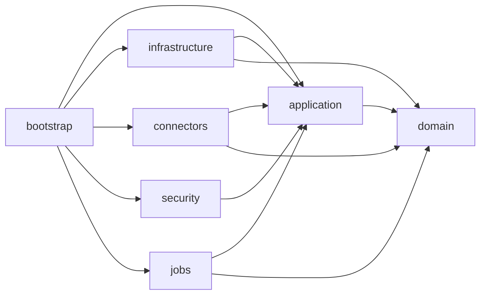

## Estructura de paquetes sugerida

### `reporting-domain`

```text
dev.kreaker.hile.domain
├── datasource
├── report
├── execution
├── security
└── shared
```

### `reporting-application`

```text
dev.kreaker.hile.application
├── port
│   ├── in
│   └── out
├── service
├── dto
└── config
```

### `reporting-bootstrap`

```text
dev.kreaker.hile.bootstrap
├── api
│   ├── datasource
│   ├── report
│   ├── execution
│   └── auth
└── config
```

## Build recomendado

- `Gradle` multi-modulo
- `Java 21`
- `Spring Boot 3.x`
- `JUnit 5`
- `Flyway`
- `Spring Data JPA`
- `Spring Security`
- `Actuator`

## Orden de implementacion por modulo

1. `reporting-domain`
2. `reporting-application`
3. `reporting-security`
4. `reporting-infrastructure`
5. `reporting-connectors`
6. `reporting-bootstrap`
7. `reporting-jobs`

## Lineamientos de codigo

- El dominio no depende de Spring.
- Los casos de uso no conocen `JPA`, `JDBC` ni drivers concretos.
- Los controllers solo orquestan requests/responses.
- Los conectores no contienen reglas de negocio de publicacion o permisos.
- La seguridad se integra por puertos y adaptadores, no incrustada en el dominio.

## Recomendacion Final

La estructura inicial debe reflejar desde el primer commit la separacion entre dominio, aplicacion, infraestructura y conectividad. Eso reduce acoplamiento temprano y hace que el backlog pueda implementarse por slices funcionales sin rehacer la base del proyecto.
``````

## File: HileReports/docs/architecture/09-initial-project-structure.md
``````markdown
# Initial Project Structure

## Objective

Define a technical baseline aligned with the backlog and the recommended architecture, using `Java + Spring Boot` with a maintainable multi-module structure prepared to grow.

## Recommended Structure

```text
HileReports/
├── settings.gradle
├── build.gradle
├── gradle.properties
├── reporting-bootstrap/
├── reporting-domain/
├── reporting-application/
├── reporting-infrastructure/
├── reporting-connectors/
├── reporting-security/
├── reporting-jobs/
└── docs/
```

## Responsibility by Module

### `reporting-bootstrap`

- `Spring Boot` entry point
- General configuration
- Module assembly
- REST controllers

### `reporting-domain`

- Business entities and value objects
- Pure domain rules
- Enums and core models

### `reporting-application`

- Use cases
- Input and output ports
- Contracts for security, connectors, and persistence
- Domain orchestration

### `reporting-infrastructure`

- `JPA` persistence
- `Flyway` migrations
- Repository implementations
- Cross-cutting technical adapters

### `reporting-connectors`

- Oracle, MySQL, and PostgreSQL connectors
- `ConnectorFactory`
- Dialect abstraction and discovery

### `reporting-security`

- `Spring Security`
- Local authentication
- Extension point for `LDAP/AD`
- Authorization filters and components

### `reporting-jobs`

- Export jobs
- Temporary file cleanup
- Scheduling and asynchronous tasks

## Module Dependencies


## Suggested Package Structure

### `reporting-domain`

```text
dev.kreaker.hile.domain
├── datasource
├── report
├── execution
├── security
└── shared
```

### `reporting-application`

```text
dev.kreaker.hile.application
├── port
│   ├── in
│   └── out
├── service
├── dto
└── config
```

### `reporting-bootstrap`

```text
dev.kreaker.hile.bootstrap
├── api
│   ├── datasource
│   ├── report
│   ├── execution
│   └── auth
└── config
```

## Recommended Build

- `Gradle` multi-module
- `Java 21`
- `Spring Boot 3.x`
- `JUnit 5`
- `Flyway`
- `Spring Data JPA`
- `Spring Security`
- `Actuator`

## Implementation Order by Module

1. `reporting-domain`
2. `reporting-application`
3. `reporting-security`
4. `reporting-infrastructure`
5. `reporting-connectors`
6. `reporting-bootstrap`
7. `reporting-jobs`

## Code Guidelines

- The domain does not depend on Spring.
- Use cases do not know `JPA`, `JDBC`, or concrete drivers.
- Controllers only orchestrate requests/responses.
- Connectors do not contain publication or permission business rules.
- Security is integrated through ports and adapters, not embedded in the domain.

## Final Recommendation

The initial structure should reflect from the first commit the separation between domain, application, infrastructure, and connectivity. That reduces early coupling and allows the backlog to be implemented through functional slices without reworking the project foundation.
``````

## File: HileReports/docs/architecture/10-implementation-memory_es.md
``````markdown
# Memoria de Implementacion

## Proposito

Este documento le da a un agente de IA o a un nuevo desarrollador una fotografia verificada del estado actual de la implementacion sin necesidad de leer todo el repositorio. Complementa la arquitectura objetivo y el backlog con el estado real del codigo.

## Ultima Verificacion

- Fecha: `2026-07-04`
- Estado del repositorio: arbol con slice minimo de autenticacion HTTP local agregado sobre la base tecnica existente
- Estado del build: `./gradlew test` pasa
- Alcance de la verificacion: arbol fuente, modulos Gradle, bootstrap Spring Boot, pruebas y alineacion contra backlog

## Resumen Ejecutivo

El repositorio hoy es una **linea base compilable**, no un MVP funcional completo.

Ya existe:

- Estructura multi-modulo `Gradle` alineada con el monolito modular.
- Convenciones compartidas para `Java 21`, `Spring Boot 3.3.2` y formato con `Spotless`.
- Modulos minimos de dominio, aplicacion, infraestructura, conectores, seguridad, jobs y bootstrap.
- Configuracion Spring Boot por ambiente con perfiles `local`, `dev`, `qa` y `prod`.
- Variables de base operativa externalizadas mediante environment variables.
- Integracion de `Flyway` con una migracion inicial de metadata operativa en PostgreSQL.
- Un `compose.yaml` local para la base PostgreSQL operativa usada por la propia aplicacion.
- Un validador simple de SQL de solo lectura con una suite pequena de pruebas.
- Abstracciones de conectores y adapters stub para PostgreSQL, MySQL y Oracle.
- Un puerto de autenticacion desacoplado con adapter local y stub para `AD`.
- Un caso de uso de autenticacion cableado a `POST /api/v1/auth/login` con validacion minima y pruebas.

Todavia no existe:

- Repositorios reales sobre PostgreSQL ni entidades `JPA`.
- CRUD de datasource.
- Preview real contra bases de datos.
- Publicacion de reportes, catalogo, ejecucion, auditoria ni exportaciones.
- Modulo frontend.

## Implementacion Verificada por Modulo

### `reporting-domain`

Implementado:

- `ReportDefinition`
- `ReportStatus`
- `DataSourceType`
- `AuthenticatedUser`

Evaluacion actual:

- El dominio todavia es minimo y solo cubre los primeros conceptos de reporte y seguridad.
- No existen entidades ni value objects para usuarios, roles, permisos, categorias, metadata de datasource, ejecuciones, exportaciones ni auditoria.

### `reporting-application`

Implementado:

- `CreateReportDefinitionCommand`
- `ValidationResult`
- `ColumnMetadata`
- `CreateReportDefinitionUseCase`
- Puertos de salida:
  - `AuthenticationProviderPort`
  - `DbConnectorPort`
  - `QueryValidatorPort`
  - `ReportDefinitionRepository`
- `ReportDefinitionApplicationService`

Evaluacion actual:

- El unico caso de uso implementado es `createDraft`.
- `createDraft` valida el SQL a traves del puerto validador y persiste un borrador por medio del puerto repositorio.
- No hay casos de uso para login, gestion de datasources, orquestacion de preview, publish/unpublish, catalogo, ejecucion, auditoria ni exportaciones.

### `reporting-infrastructure`

Implementado:

- `SimpleReadOnlyQueryValidator`
- `InMemoryReportDefinitionRepository`
- Migracion inicial `Flyway` para metadata operativa
- Pruebas del validador

Evaluacion actual:

- El validador es intencionalmente simple. Permite `SELECT` y `WITH`, bloquea varios tokens DDL/DML y punto y coma, y extrae parametros nombrados con regex.
- El repositorio implementado sigue siendo solo en memoria.
- `Flyway` ahora provee un esquema inicial en PostgreSQL para categorias, datasources, metadata de reportes, ejecuciones, exportaciones y eventos de auditoria.
- Todavia no hay entidades `JPA`, ni repositorios reales sobre PostgreSQL, ni infraestructura de auditoria mas alla de la base migrada.

### `reporting-connectors`

Implementado:

- `ConnectorFactory`
- `PostgreSqlConnectorAdapter`
- `MySqlConnectorAdapter`
- `OracleConnectorAdapter`
- `BaseStubConnector`

Evaluacion actual:

- Todos los adapters de conectores son stubs.
- `testConnection` solo valida que `jdbcUrl` no venga vacio.
- `discoverColumns` devuelve metadata de ejemplo.
- `executePreview` devuelve una fila falsa de ejemplo.
- No existe conectividad JDBC real, pooling, manejo de dialectos, limites ni mapeo de errores.

### `reporting-security`

Implementado:

- `LocalAuthenticationProviderAdapter`
- `AdAuthenticationProviderStub`
- Password hashing con `BCrypt`

Evaluacion actual:

- La autenticacion esta desacoplada detras de un puerto, que es una buena base para soporte futuro de `AD`.
- El auth local hoy usa un mapa hardcodeado en memoria con `BCrypt`.
- Ya existe un login HTTP minimo sobre el provider local.
- Todavia no existe repositorio de usuarios, modelo de roles o permisos, ni manejo de token/sesion.

### `reporting-jobs`

Implementado:

- `ExportCleanupJob`

Evaluacion actual:

- Es solo un placeholder.
- No hay scheduler, cola de exportaciones, ciclo de vida de archivos ni estado persistido de jobs.

### `reporting-bootstrap`

Implementado:

- `HileReportsApplication`
- `ArchitectureController`
- `AuthController`
- `application.yml` base
- Configuracion por perfil para `local`, `dev`, `qa` y `prod`
- Configuracion JDBC y `Flyway` para la base operativa PostgreSQL
- Definicion local Docker Compose para la instancia PostgreSQL operativa
- Configuracion minima de `Spring Security`
- Wiring de beans para autenticacion local

Evaluacion actual:

- Existen `POST /api/v1/auth/login` y `GET /api/v1/architecture/modules`.
- La configuracion se externaliza por variables de entorno, con defaults razonables para el perfil local.
- La aplicacion ya puede arrancar contra una base operativa PostgreSQL y ejecutar migraciones `Flyway` al inicio.
- El login queda expuesto sin sesion persistente ni token, por lo que sirve como slice tecnico inicial y no como autenticacion final de produccion.
- Todavia no existen beans para preview, datasource CRUD ni conectores reales expuestos por API.

## Alineacion con el Backlog

Leyenda:

- `Done`: implementado con codigo utilizable en el repo
- `Partial`: existe como base, stub o slice incompleto
- `Not started`: no se encontro en el codigo

| Item del backlog | Estado | Notas |
| --- | --- | --- |
| `TASK-01.1.1-a` Crear build raiz y modulos | Done | La estructura multi-modulo `Gradle` existe |
| `TASK-01.1.1-b` Version Java y BOM Spring Boot | Done | Configurados `Java 21` y BOM Boot |
| `TASK-01.1.1-c` Plugins de build y test | Done | Existen convenciones compartidas y tests |
| `TASK-01.2.1-a` Config base y perfiles | Done | Existen config base y perfiles `local`, `dev`, `qa` y `prod` |
| `TASK-01.2.1-b` Externalizar variables sensibles | Done | La configuracion del datasource operativo se externaliza con variables de entorno |
| `TASK-01.3.1-a` Pipeline CI | Not started | No se encontraron archivos de pipeline |
| `TASK-01.3.1-b` Publicar artefacto ejecutable | Partial | La app Boot compila localmente, no hay flujo CI/release |
| `TASK-02.1.1-a` Entidades user, role, permission | Not started | Solo existe el record `AuthenticatedUser` |
| `TASK-02.1.1-b` Spring Security y hashing | Partial | Se usa `BCrypt` y ya existe config web minima de `Spring Security`, pero sin sesiones, JWT ni repositorio real de usuarios |
| `TASK-02.1.1-c` Endpoint de autenticacion | Partial | Existe `POST /api/v1/auth/login`, pero solo valida credenciales locales en memoria |
| `TASK-02.2.1-a` Matriz inicial de permisos | Not started | No hay modelo de permisos |
| `TASK-02.2.1-b` Autorizacion por endpoint | Partial | Existe proteccion basica del API; solo el login y algunos endpoints de actuator quedan publicos |
| `TASK-02.2.1-c` Permisos por reporte y datasource | Not started | No existe ACL |
| `TASK-02.3.1-a` Puerto de autenticacion desacoplado | Done | Existen puerto y adapters local/AD |
| `TASK-03.1.1-a` Migraciones Flyway | Done | `Flyway` esta configurado y existe una migracion inicial de metadata operativa |
| `TASK-03.1.1-b` Repositorios y servicios base | Partial | Solo hay repo en memoria y un servicio de aplicacion |
| `TASK-03.1.1-c` Auditoria de entidades | Not started | No hay modelo ni infraestructura de auditoria |
| `TASK-03.2.1-a` CRUD de categorias | Not started | No hay modulo ni endpoint de categorias |
| `TASK-03.2.1-b` Modelo de tags y ownership | Not started | No hay implementacion |
| `TASK-04.1.1-a` CRUD de `data_source` | Not started | No hay servicio ni API de datasource |
| `TASK-04.1.1-b` Encriptacion de secretos | Not started | No hay logica de cifrado ni storage seguro |
| `TASK-04.1.1-c` `testConnection` | Partial | Existe como stub en el contrato de conectores |
| `TASK-04.2.1-a` `PostgreSqlConnector` | Partial | Solo stub |
| `TASK-04.2.1-b` `MySqlConnector` | Partial | Solo stub |
| `TASK-04.2.1-c` `OracleConnector` | Partial | Solo stub |
| `TASK-04.2.1-d` `ConnectorFactory` | Partial | Existe la factory, pero no esta cableada a adapters reales ni API |
| `TASK-05.1.1-a` `QueryValidator` | Partial | Existe una implementacion simple |
| `TASK-05.1.1-b` Bloquear DDL, DML y multiples statements | Partial | Hay bloqueo basico por tokens |
| `TASK-05.1.1-c` Detectar patrones peligrosos y comentarios | Not started | No se encontro analisis de comentarios/patrones |
| `TASK-05.1.1-d` Extraer parametros nombrados | Done | Extraccion implementada con regex |
| `TASK-05.2.1-a` Matriz de casos validos e invalidos | Partial | Solo hay unas pocas pruebas |
| `TASK-05.2.1-b` Tests por dialecto | Not started | No hay pruebas por motor |
| `TASK-06.1.1-a` `discoverColumns` | Partial | Solo implementacion stub |
| `TASK-06.1.1-b` Estandarizar tipos de salida | Partial | Existe `ColumnMetadata`, los tipos son strings de ejemplo |
| `TASK-06.2.1-a` `executePreview` con limites | Partial | Solo implementacion stub |
| `TASK-06.2.1-b` Endpoint de preview | Not started | No existe controlador |
| `TASK-07.1.1-a` `ReportDefinitionService` | Partial | Solo creacion de borrador |
| `TASK-07.1.1-b` Guardar draft y crear nueva version | Partial | Existe guardado draft, no versionado |
| `TASK-07.1.1-c` Publicar y despublicar reportes | Not started | No existe flujo de publicacion |
| `TASK-07.2.1-a` Configurar columnas | Not started | No hay configuracion persistida |
| `TASK-07.2.1-b` Configurar parametros | Not started | No hay configuracion persistida |
| `TASK-07.2.1-c` Publicar solo con preview exitoso | Not started | No existe workflow de publicacion |
| `EP-08` Catalogo y ejecucion | Not started | No hay catalogo ni flujo de ejecucion |
| `EP-09` Exportaciones | Not started | Solo job placeholder |
| `EP-10` Observabilidad y hardening | Partial | Solo existe exposicion basica de actuator |

## Slice Vertical Disponible Hoy

El repositorio ya soporta este flujo estrecho a nivel de codigo:

1. Crear un `CreateReportDefinitionCommand`.
2. Validar el SQL como read-only con `SimpleReadOnlyQueryValidator`.
3. Persistir un draft de `ReportDefinition` en `InMemoryReportDefinitionRepository`.
4. Autenticar credenciales locales por `POST /api/v1/auth/login`.

Limitacion importante:

- El flujo de draft de reportes sigue sin exponerse por REST.
- El login HTTP no crea sesion persistente ni entrega token reutilizable.

## Huecos Mayores Antes de Tener el Camino MVP

La arquitectura recomienda este camino minimo de valor:

`login local -> datasource PostgreSQL/MySQL -> SQL seguro -> preview -> builder -> catalogo -> ejecucion`

Hoy los bloqueadores principales son:

1. No hay registro real de datasources ni manejo de secretos.
2. No hay ejecucion real de conectores contra bases.
3. No hay modelo persistente de usuarios, roles y permisos.
4. No hay base de persistencia de metadata aplicada a repositorios reales.
5. No hay API de preview.
6. No hay publicacion de reportes ni catalogo.

## Siguiente Slice Recomendado

El siguiente corte mas pragmatico es:

1. Completar auth local mas alla del slice tecnico:
   - modelo `user/role/permission`
   - persistencia de usuarios
   - sesion controlada o JWT
2. Implementar CRUD de datasource con storage cifrado de secretos.
3. Reemplazar los stubs de PostgreSQL/MySQL por adapters JDBC reales.
4. Exponer endpoints de validacion, discovery de columnas y preview.
5. Despues expandir versionado y publicacion del builder.

## Comandos Usados para Verificar

```powershell
git status --short
./gradlew test
rg --files .
rg -n "@RestController|SecurityFilterChain|@Entity|Flyway" .
```

## Protocolo de Actualizacion para Agentes Futuros

Cuando cambie la implementacion, actualiza este archivo en el mismo PR y manten vigentes estas secciones:

1. `Ultima Verificacion`
2. `Implementacion Verificada por Modulo`
3. `Alineacion con el Backlog`
4. `Siguiente Slice Recomendado`

Reglas:

- Marca un item como `Done` solo cuando el camino de codigo este implementado y sea utilizable, no solo scaffolded.
- Marca un item como `Partial` cuando exista solo como stub, placeholder, adapter en memoria o codigo interno no expuesto.
- Prefiere enlazar cambios con IDs del backlog.
- Siempre vuelve a correr al menos `./gradlew test` antes de actualizar la fotografia.
``````

## File: HileReports/docs/architecture/10-implementation-memory.md
``````markdown
# Implementation Memory

## Purpose

This document gives an AI agent or a new developer a verified snapshot of the current implementation state without needing to read the entire repository. It complements the target architecture and backlog documents with the real status of the codebase.

## Last Verified Snapshot

- Date: `2026-07-06`
- Repository status: R1–R3 backlog 100% done. Full-stack MVP operational. Frontend complete: consumption path (login/catalog/execute/export/history) + admin panel (datasources+ACL, users, categories, tags, reports builder, audit log). Only deferred: AD auth (TASK-02.3.1-b).
- Build status: `./gradlew test` passes
- Scope of verification: source tree, Gradle modules, Spring Boot bootstrap, tests, and backlog alignment

## Executive Summary

The repository is a **complete R1–R3 MVP** — all planned backlog items done.

What is already in place:

- Multi-module `Gradle` structure aligned with the modular monolith design.
- Shared build conventions for `Java 21`, `Spring Boot 3.3.2`, and formatting via `Spotless`.
- Minimal domain, application, infrastructure, connectors, security, jobs, and bootstrap modules.
- Environment-aware Spring Boot configuration with `local`, `dev`, `qa`, and `prod` profiles.
- Externalized operational database settings through environment variables.
- `Flyway` integration with two migrations: operational metadata schema (V1) and security schema (V2).
- A local `compose.yaml` for the operational PostgreSQL database used by the application itself.
- A simple read-only SQL validator with a small test suite.
- Connector abstractions and engine-specific stub adapters for PostgreSQL, MySQL, and Oracle.
- A decoupled authentication port backed by persistent users loaded from PostgreSQL via JPA.
- JWT-based stateless authentication: `POST /api/v1/auth/login` returns a signed JWT token.
- `JwtAuthenticationFilter` protects all non-public endpoints via `Authorization: Bearer <token>`.
- `SecurityDataInitializer` creates the default admin user on first boot.
- `app_role`, `app_permission`, `user_role`, `role_permission` tables seeded with permissions and three initial roles.
- RBAC URL rules: `/api/v1/datasources/**` requires `ROLE_PLATFORM_ADMIN`.
- Datasource CRUD: create, list, get, delete, test-connection endpoints under `/api/v1/datasources`.
- AES-256-GCM password encryption; encrypted values stored as `enc:v1:<iv>:<ciphertext>` in `secret_ref`.
- `ConnectorFactory` wired to stub adapters for PostgreSQL, MySQL, and Oracle.
- `DataSourceApplicationService` builds JDBC URL, decrypts secret, calls connector for test/discover/preview.
- `POST /api/v1/datasources/{id}/discover` — discovers columns from SQL text against real DB.
- `POST /api/v1/datasources/{id}/preview` — executes SQL against real DB, returns columns + rows (capped by `hile.reports.preview.max-rows`).
- Report builder: `POST /api/v1/reports`, `GET /api/v1/reports`, `GET /api/v1/reports/{id}`.
- `POST /api/v1/reports/{id}/preview` — runs report SQL against its datasource, updates `report_version.preview_status=VALID|INVALID`.
- `POST /api/v1/reports/{id}/publish` — transitions DRAFT → PUBLISHED; rejects if `preview_status != VALID`.
- `POST /api/v1/reports/{id}/unpublish` — transitions PUBLISHED → DRAFT.
- `PUT /api/v1/reports/{id}/columns` — replace-all column config in `report_column` for current version.
- `GET /api/v1/reports/{id}/columns` — list configured columns (ordered by ordinal).
- `PUT /api/v1/reports/{id}/parameters` — replace-all parameter config in `report_parameter`.
- `GET /api/v1/reports/{id}/parameters` — list configured parameters.
- `ReportColumnEntity`, `ReportParameterEntity` JPA entities added.
- `InMemoryReportDefinitionRepository` removed; replaced by `ReportDefinitionRepositoryAdapter` (JPA).
- Pagination on all list endpoints: `GET /api/v1/categories`, `/api/v1/datasources`, `/api/v1/reports`, `/api/v1/users`, `/api/v1/exports`, `/api/v1/executions` all support `?page=0&size=20`. Returns `PageResponse<T>` with `content, page, size, total, totalPages`.
- `PUT /api/v1/categories/{id}` — partial update (name, description); name uniqueness enforced via `existsByNameAndIdNot`.
- `PUT /api/v1/datasources/{id}` — partial update; password re-encrypted before storage; audit event `DATASOURCE_UPDATED`.
- `GET /api/v1/reports?page=0&size=20&name=&status=&categoryId=` — optional null-safe filters via JPQL `:param IS NULL OR field = :param` pattern.
- `GET /api/v1/reports/{id}/executions?page=0&size=20` — execution history for a specific report, authenticated.
- `GET /api/v1/executions?page=0&size=20` — caller's own execution history (filtered by `requestedBy = principal`).
- `GET /api/v1/executions/{id}` — single execution detail, authenticated.
- `PUT /api/v1/users/{id}` — partial update: email and/or role (`PLATFORM_ADMIN` only). Single-role model: replaces entire role set. Audit event `USER_UPDATED`.
- `POST /api/v1/users/{id}/enable` — re-enable a previously disabled user (`PLATFORM_ADMIN` only). Audit event `USER_ENABLED`.
- `GET /api/v1/catalog` — returns PUBLISHED reports only; optional `?name=` case-insensitive substring filter; ordered by `created_at DESC`.
- `ReportSecurityGuard` — `@Component("reportSecurity")` that checks report ownership or `ROLE_PLATFORM_ADMIN`. Used via `@PreAuthorize("@reportSecurity.isOwnerOrAdmin(#id, authentication)")` on publish/unpublish/preview/columns/parameters endpoints.
- `POST /api/v1/reports/{id}/execute` — executes a PUBLISHED report with optional parameter map and pagination (`page`, `pageSize`). Named params (`:paramName`) in SQL text substituted with typed values from `report_parameter` metadata. Appends `LIMIT ? OFFSET ?` for pagination (PostgreSQL/MySQL). Persists `report_execution` + `report_execution_parameter` rows with COMPLETED or FAILED status, duration, and row count. Returns `ExecutionResultView` with `executionId`, `correlationId`, `columns`, `rows`, `rowCount`, `durationMs`, `page`, `pageSize`.
- `ReportDefinition` domain record gained `currentVersionId UUID` field (used internally by execution layer).
- Category CRUD: `POST /api/v1/categories` (`PLATFORM_ADMIN`), `GET /api/v1/categories`, `GET /api/v1/categories/{id}`, `DELETE /api/v1/categories/{id}` (`PLATFORM_ADMIN`). Name uniqueness enforced. `category_id` optional FK on `report_definition` — passed in `POST /api/v1/reports` body.
- Async CSV/XLSX export: `POST /api/v1/reports/{id}/export` (202 Accepted, format CSV|XLSX, optional params + pageSize). Creates `report_execution` (RUNNING/ASYNC) + `report_export` (PENDING) synchronously; hands off to `@Async("exportTaskExecutor")`. `GET /api/v1/exports/{id}` polls status. `GET /api/v1/exports/{id}/download` streams file when COMPLETED, 409 if running, 404 if missing.
- `ExportCleanupScheduler` (`@Scheduled`, default 1h): deletes expired export files and DB records.
- `AsyncConfig`: `@EnableAsync @EnableScheduling`; `exportTaskExecutor` pool (core=2, max=5, queue=50).
- CSV via `commons-csv:1.11.0`; XLSX via `poi-ooxml:5.3.0`.
- Export storage path, expiry hours, and cleanup intervals configurable via env vars.

- Structured observability (TASK-10.1.1-c): `JwtAuthenticationFilter` sets `correlationId` (from `X-Correlation-ID` request header or generated UUID) and `username` in MDC on every request; echoes `X-Correlation-ID` in response; clears MDC in finally. `AsyncConfig.exportTaskExecutor` copies MDC to async export threads via `TaskDecorator`. Log pattern includes `%X{correlationId:-}` and `%X{username:-}`.

- Per-datasource ACL (TASK-02.2.1-c): `datasource_access` table (V5 migration, composite PK `datasource_id + user_id`). `DataSourceAccessPort` (outbound port) with `grant`, `revoke`, `listUserIds`, `isAuthorized(UUID, String)`. `DataSourceAccessAdapter` checks PLATFORM_ADMIN role first, then falls back to explicit grant lookup. Access check in `ExecuteReportApplicationService.execute()` and `ExportJobApplicationService.requestExport()` — throws `IllegalStateException` if unauthorized. Admin endpoints: `POST/DELETE/GET /api/v1/datasources/{id}/access` (PLATFORM_ADMIN only, covered by existing catch-all).

- Frontend integration preparation: CORS enabled via `CorsConfig.java` — `APP_CORS_ALLOWED_ORIGINS` env var (default `http://localhost:3000,http://localhost:4200`), exposes `X-Correlation-ID` and `Location` headers. `AccessDeniedException` (application layer) maps to 403 in `GlobalExceptionHandler`. `ApiErrorResponse` gained `timestamp` field (ISO-8601). `SecurityConfig` wires CORS via `Customizer.withDefaults()`.

- Frontend module `reporting-frontend/` — Vite + React 18 + TypeScript + Tailwind CSS + React Query + React Router v6. `tsc && vite build` passes clean (96 modules).
  - **Consumption** (`/login`, `/catalog`, `/reports/:id`): login, published-report grid, parameterized execution + paginated results, Export CSV/XLSX with async polling + authorized blob download, collapsible execution history (paginated).
  - **Admin** (`/admin/*`, PLATFORM_ADMIN role guard decoded from JWT): Datasources (CRUD + test connection + ACL grant/revoke modal), Users (create/edit email+role/enable/disable), Categories (CRUD), Tags (CRUD, slug auto-derived by server), Reports list + tabbed builder (info · SQL+discover+preview rows · columns config · parameters CRUD · tags assignment · publish/unpublish), Audit log (actor/action text filters, paginated, color-coded action badges).
  - API client uses relative URLs; Vite dev server proxies `/api → localhost:8080`. JWT stored in localStorage, decoded for username + roles. `AdminRoute` component enforces `PLATFORM_ADMIN` role on `/admin/*`.

What is not in place yet:

- AD/LDAP authentication (`TASK-02.3.1-b`) — deferred; port and stub exist, production adapter requires live LDAP/AD environment.

## Verified Implementation by Module

### `reporting-domain`

Implemented:

- `ReportDefinition`
- `ReportStatus`
- `DataSourceType`
- `AuthenticatedUser`

Current assessment:

- The domain is still minimal and only covers the first report and security concepts.
- There are no entities or value objects for users, roles, permissions, categories, datasource metadata, executions, exports, or auditing.

### `reporting-application`

Implemented:

- `CreateReportDefinitionCommand`
- `ValidationResult`
- `ColumnMetadata`
- `CreateReportDefinitionUseCase`
- Outbound ports:
  - `AuthenticationProviderPort`
  - `DbConnectorPort`
  - `QueryValidatorPort`
  - `ReportDefinitionRepository`
- `ReportDefinitionApplicationService`

Current assessment:

- Full report lifecycle use cases: createDraft, findById, findAll, runPreview, publish, unpublish, upsertColumns, getColumns, upsertParameters, getParameters, getCatalog.
- `ExecuteReportUseCase` with named-param binding, pagination, and execution history persistence.
- `ExportJobUseCase` / `ExportJobApplicationService`: create export job, poll status, get file path.
- `CategoryUseCase` / `CategoryApplicationService`: category CRUD with name uniqueness.
- `NamedParamBinder`: package-private utility shared by execute and export services.
- `TagUseCase` / `TagApplicationService`: tag CRUD (create with slug derivation + uniqueness, findAll, delete) and report-tag association (`setReportTags` with tag existence validation, `getReportTags`).

### `reporting-infrastructure`

Implemented:

- `SimpleReadOnlyQueryValidator`
- `InMemoryReportDefinitionRepository`
- `Flyway` V1 migration for operational metadata schema
- `Flyway` V2 migration for security schema (`app_user`, `app_role`, `app_permission`, `user_role`, `role_permission`) with seeded permissions and roles
- `AppUserEntity`, `AppRoleEntity` JPA entities
- `AppUserJpaRepository`, `AppRoleJpaRepository` Spring Data repositories
- `UserRepositoryAdapter` implementing `UserRepositoryPort`
- Validator tests

Current assessment:

- The validator is intentionally simple. It allows `SELECT` and `WITH`, blocks several DDL/DML tokens and semicolons, and extracts named parameters with regex.
- JPA adapters exist for datasource, report definition+version, report columns, report parameters, report executions, and tags.
- User persistence fully backed by PostgreSQL and JPA.
- JPA entities for categories (`CategoryEntity`), exports (`ReportExportEntity`), and tags (`TagEntity`, `ReportTagEntity`).
- Flyway migrations: V3 (category, report_execution, report_execution_parameter, report_export); V4 (`tag` + `report_tag` with composite PK and cascade-delete FKs).

### `reporting-connectors`

Implemented:

- `ConnectorFactory`
- `PostgreSqlConnectorAdapter` — real JDBC via `DriverManager`
- `MySqlConnectorAdapter` — real JDBC via `DriverManager`
- `OracleConnectorAdapter` — still a stub (no Oracle JDBC driver added)
- Shared `BaseStubConnector` (used by Oracle only now)

Current assessment:

- PostgreSQL and MySQL connectors use `DriverManager.getConnection` for `testConnection`, `discoverColumns` (executes with `maxRows=1`, reads `ResultSetMetaData`), `executePreview` (executes with `setMaxRows(limit)`), and `executeWithParams` (named-param SQL + LIMIT/OFFSET appended for pagination).
- `DbConnectorPort` now includes `executeWithParams(jdbcUrl, username, rawPassword, sql, paramValues, pageSize, offset) → PreviewResult`.
- JDBC drivers added as `runtimeOnly` in `reporting-connectors/build.gradle`: `org.postgresql:postgresql`, `com.mysql:mysql-connector-j`.

### `reporting-security`

Implemented:

- `LocalAuthenticationProviderAdapter` — loads users from DB via `UserRepositoryPort`
- `AdAuthenticationProviderStub`
- `BCrypt` password hashing
- `JwtTokenProvider` / `TokenProviderPort` — generates and validates HS256 JWTs
- JWT secret and expiration externalized through `APP_JWT_SECRET` and `APP_JWT_EXPIRATION_MS`

Current assessment:

- Authentication is decoupled behind a port, which is good groundwork for later `AD` support.
- Local auth reads users from PostgreSQL via JPA. In-memory hardcoded credentials are removed.
- JWT tokens carry username and roles. Expiration defaults to 24 hours.
- No role-based endpoint protection yet (RBAC wiring is the next step).

### `reporting-jobs`

Implemented:

- `ExportCleanupJob`

Current assessment:

- This is a placeholder only.
- There is no scheduler, no export queue, no file lifecycle, and no persisted job state.

### `reporting-bootstrap`

Implemented:

- `HileReportsApplication`
- `ArchitectureController`
- `AuthController` — returns JWT token on successful login
- Base `application.yml`
- Profile-specific configuration for `local`, `dev`, `qa`, and `prod`
- JPA, `Flyway`, and JDBC runtime configuration for the operational PostgreSQL database
- Local Docker Compose definition for the operational PostgreSQL instance
- `SecurityConfig` with JWT filter and stateless session
- `JwtAuthenticationFilter` — validates `Authorization: Bearer <token>` on every request
- `SecurityDataInitializer` — creates default admin user on first boot
- `JpaConfig` — registers JPA repository scan for `dev.kreaker.hile` package tree
- Bean wiring for local authentication with `UserRepositoryPort`

Current assessment:

- `POST /api/v1/auth/login` returns `{ username, roles, token, expiresInMs, authenticationMode }`.
- All non-public endpoints require a valid JWT.
- Default admin credentials: `admin` / `admin123` — change immediately in any non-local environment.
- JWT secret must be overridden via `APP_JWT_SECRET` (min 32 bytes) in non-local environments.
- There are still no beans wiring preview, datasource CRUD, or real connectors into usable APIs.

## Backlog Alignment

Status legend:

- `Done`: implemented with usable code in the repo
- `Partial`: present as baseline, stub, or incomplete slice
- `Not started`: not found in code

| Backlog Item | Status | Notes |
| --- | --- | --- |
| `TASK-01.1.1-a` Create root build and modules | Done | Multi-module `Gradle` structure exists |
| `TASK-01.1.1-b` Java version and Spring Boot BOM | Done | `Java 21` and Boot BOM configured |
| `TASK-01.1.1-c` Build and test plugins | Done | Shared Gradle conventions and tests configured |
| `TASK-01.2.1-a` Base config and profiles | Done | Base config plus `local`, `dev`, `qa`, and `prod` profiles exist |
| `TASK-01.2.1-b` Externalize sensitive variables | Done | Operational datasource settings are externalized through environment variables |
| `TASK-01.3.1-a` CI pipeline | Done | `.github/workflows/ci.yml` — push+PR to main; Java 21 temurin; `spotlessCheck test`; test report artifact on failure |
| `TASK-01.3.1-b` Publish executable artifact | Done | `publish` job in CI; multi-stage Dockerfile (temurin:21-jdk-alpine builder + jre-alpine runtime); pushes to ghcr.io on main push (short SHA + latest tags) |
| `TASK-02.1.1-a` User, role, permission entities | Done | `AppUserEntity`, `AppRoleEntity`, `AppPermissionEntity` (SQL) + V2 migration with seeded roles and permissions |
| `TASK-02.1.1-b` Spring Security and hashing | Done | `BCrypt`, `Spring Security` stateless config, JWT filter, persistent user repository |
| `TASK-02.1.1-c` Authentication endpoint | Done | `POST /api/v1/auth/login` returns signed JWT with roles |
| `TASK-02.2.1-a` Initial permission matrix | Done | Permission rows seeded in DB; role↔permission matrix in `role_permission` table |
| `TASK-02.2.1-b` Authorization by endpoint | Done | URL-based RBAC in `SecurityConfig`; datasource endpoints require `PLATFORM_ADMIN` |
| `TASK-02.2.1-c` Permissions by report and datasource | Done | Execute/export gated to REPORT_EXECUTE roles (PLATFORM_ADMIN, REPORT_DESIGNER, REPORT_VIEWER); design ops (/reports/**) restricted to REPORT_DESIGNER+; catalog + exports same gate; `canExecute(auth)` on `ReportSecurityGuard` |
| `TASK-02.3.1-a` Decoupled authentication port | Done | Port and local/AD adapters exist |
| `TASK-03.1.1-a` Flyway migrations | Done | V1 operational metadata + V2 security schema both configured and applied |
| `TASK-03.1.1-b` Repositories and base services | Done | Full JPA adapters for all entities; InMemoryReportDefinitionRepository removed |
| `TASK-03.1.1-c` Entity auditing | Done | `AuditableEntity` @MappedSuperclass (@LastModifiedDate updatedAt, @LastModifiedBy updatedBy); `ReportDefinitionEntity` + `ReportVersionEntity` extend it; `@EnableJpaAuditing` + `AuditorAware` from SecurityContextHolder in `JpaConfig`; V3 migration adds nullable `updated_at`/`updated_by` columns |
| `TASK-03.2.1-a` Category CRUD | Done | `CategoryEntity`, `CategoryRepositoryAdapter`, `CategoryApplicationService`, `CategoryController`; name uniqueness; `categoryId` FK on report |
| `TASK-03.2.1-b` Tag and ownership model | Done | `Tag` domain record; `TagUseCase`/`TagApplicationService`; `TagEntity`+`ReportTagEntity` (composite PK, cascade delete); `TagController` (`POST/GET/DELETE /api/v1/tags`); `PUT /api/v1/reports/{id}/tags` + `GET /api/v1/reports/{id}/tags` in `ReportController`; V4 Flyway migration; slug auto-derived from name |
| `TASK-04.1.1-a` `data_source` CRUD | Done | `DataSourceController` with create/list/get/delete endpoints wired to `DataSourceApplicationService` |
| `TASK-04.1.1-b` Secret encryption | Done | `AesGcmEncryptor` (AES-256-GCM); encrypted in `secret_ref`; decrypted only for connection test |
| `TASK-04.1.1-c` `testConnection` | Done | `POST /api/v1/datasources/{id}/test` decrypts secret and delegates to connector stub |
| `TASK-04.2.1-a` `PostgreSqlConnector` | Done | Real JDBC testConnection, discoverColumns, executePreview |
| `TASK-04.2.1-b` `MySqlConnector` | Done | Real JDBC testConnection, discoverColumns, executePreview |
| `TASK-04.2.1-c` `OracleConnector` | Done | Real JDBC via `ojdbc11:21.11.0.0` (Maven Central); `testConnection`, `discoverColumns` (setMaxRows(1)), `executePreview` (setMaxRows(limit)), `executeWithParams` (Oracle 12c+ `OFFSET ? ROWS FETCH NEXT ? ROWS ONLY`); added `runtimeOnly` to `reporting-connectors/build.gradle` |
| `TASK-04.2.1-d` `ConnectorFactory` | Done | Factory wired to real adapters; discover/preview exposed via REST |
| `TASK-05.1.1-a` `QueryValidator` | Done | `SimpleReadOnlyQueryValidator` with comment stripping + dangerous pattern blocking |
| `TASK-05.1.1-b` Block DDL, DML, multiple statements | Done | Blocks insert/update/delete/drop/alter/truncate/semicolon after comment stripping |
| `TASK-05.1.1-c` Detect dangerous patterns and comments | Done | Comment stripping (`--` + `/* */`) before validation; 15 dangerous patterns blocked (sleep, benchmark, waitfor, load_file, into outfile/dumpfile, information_schema, pg_catalog, pg_read_file, pg_ls_dir, xp_cmdshell, exec, execute); 26 tests |
| `TASK-05.1.1-d` Extract named parameters | Done | Regex-based extraction implemented |
| `TASK-05.2.1-a` Matrix of valid and invalid cases | Done | 26 tests: accept/reject, comment stripping, 15 dangerous patterns, named param extraction edge cases |
| `TASK-05.2.1-b` Tests by dialect | Done | `SimpleReadOnlyQueryValidatorDialectTest`: 30 tests across PG accept (ILIKE, NULLS LAST, FETCH NEXT, AT TIME ZONE, recursive CTE, JSON operators, `::` cast, ARRAY ANY, qualified schema) + PG reject (pg_sleep — gap fixed, pg_read_file, pg_ls_dir, pg_catalog) + MySQL accept (backtick identifiers, LIMIT/OFFSET, IF, IFNULL, DATE_FORMAT, GROUP_CONCAT, USE INDEX) + MySQL reject (sleep, benchmark, load_file, into outfile) + param-extraction edge cases (:: cast, backtick, recursive CTE). Validator updated: added `pg_sleep(` to DANGEROUS_PATTERNS; `extractNamedParameters` now replaces `::` before regex to prevent spurious params from PG cast syntax. |
| `TASK-06.1.1-a` `discoverColumns` | Done | Real JDBC via `ResultSetMetaData` for PG/MySQL |
| `TASK-06.1.1-b` Standardize output types | Done | `ColumnMetadata(sourceName, label, dataType)` with driver-native type name |
| `TASK-06.2.1-a` `executePreview` with limits | Done | Real JDBC with `setMaxRows(limit)` for PG/MySQL |
| `TASK-06.2.1-b` Preview endpoint | Done | `POST /api/v1/datasources/{id}/preview` + discover endpoint |
| `TASK-07.1.1-a` `ReportDefinitionService` | Done | Create, findById, findAll wired to JPA |
| `TASK-07.1.1-b` Save draft and create new version | Done | Adapter saves report_definition + report_version atomically |
| `TASK-07.1.1-c` Publish and unpublish reports | Done | `POST /{id}/publish` (gates on VALID preview), `POST /{id}/unpublish` (PUBLISHED → DRAFT) |
| `TASK-07.2.1-a` Configure columns | Done | `PUT /api/v1/reports/{id}/columns` — replaces all columns for current version in `report_column` |
| `TASK-07.2.1-b` Configure parameters | Done | `PUT /api/v1/reports/{id}/parameters` — replaces all params in `report_parameter` |
| `TASK-07.2.1-c` Publish only after successful preview | Done | `POST /{id}/preview` updates `report_version.preview_status=VALID`; publish rejects if not VALID |
| `TASK-03.2.1-a` Category CRUD | Done | `CategoryEntity`, `CategoryRepositoryAdapter`, `CategoryApplicationService`, `CategoryController`; name uniqueness checked; `categoryId` FK wired into report create |
| `TASK-08.2.1-a` Resolve dynamic filters | Done | Named param substitution `:name`→`?` with type coercion from `report_parameter.parameter_type` |
| `TASK-08.2.1-b` Execute paginated query | Done | `LIMIT ? OFFSET ?` appended; `DbConnectorPort.executeWithParams` in PG/MySQL adapters |
| `TASK-08.2.1-c` Persist execution history | Done | `report_execution` + `report_execution_parameter` via JPA; COMPLETED/FAILED status + duration |
| `EP-08` Catalog and execution | Done | Catalog listing, ownership ACL, and parameterized execution all done |
| `TASK-09.1.1-a` Request export job | Done | `POST /api/v1/reports/{id}/export` → 202; persists execution+export; fires async |
| `TASK-09.2.1-a` CSV generation | Done | `AsyncExportService` uses `commons-csv:1.11.0` |
| `TASK-09.2.1-b` XLSX generation | Done | `AsyncExportService` uses `poi-ooxml:5.3.0` |
| `TASK-09.2.1-c` Export cleanup job | Done | `ExportCleanupScheduler` `@Scheduled` deletes expired files + DB records |
| `EP-09` Exports | Done | Full async export pipeline + cleanup |
| `TASK-10.1.1-a` Micrometer + Actuator | Done | `MicrometerMetricsAdapter`; execution + export counters/timers/summaries; `/actuator/prometheus` exposed |
| `TASK-10.1.1-b` Prometheus metrics | Done | `micrometer-registry-prometheus` added; endpoint public |
| `TASK-10.1.1-c` Correlation ID + structured logging | Done | `CorrelationIdFilter`; MDC `correlationId`; `X-Correlation-ID` header; MDC propagated to async threads via TaskDecorator |
| `EP-10` Observability and hardening | Done | Observability done; `GlobalExceptionHandler` provides consistent error responses |
| `TASK-10.2.1-a` Load tests | Done | k6 scaffold at `load-tests/k6/hile-reports-load.js`; smoke (1 VU/30s), load (50 VU/5m ramp), stress (200 VU/9m) scenarios; thresholds: p95<2s http, p95<5s execute, error rate<1%; shared setup authenticates + discovers first published report |
| `TASK-10.2.1-b` Tune pools/timeouts | Done | HikariCP: idle-timeout (10m), max-lifetime (30m), keepalive (1m), validation-timeout (5s), leak-detection configurable; Tomcat threads: max=200/400 (default/prod); async export pool externalized (`hile.reports.export.async.*`, overridable via env); prod profile overrides (pool-max=30, threads=400, export-pool=10) |
| `TASK-10.2.1-c` Rate limiting | Done | `RateLimitFilter` (IP-based, CAS sliding-window, no external deps) on `/execute` + `/export` endpoints; 30 req/min default (prod: 60); disabled via `APP_RATE_LIMIT_ENABLED=false`; returns 429 JSON; note: not distributed — use API gateway for multi-instance |

## Working Vertical Slice Already Available

The current repository already supports this narrow internal flow at code level:

1. Create a `CreateReportDefinitionCommand`.
2. Validate SQL as read-only through `SimpleReadOnlyQueryValidator`.
3. Persist a `ReportDefinition` draft into `InMemoryReportDefinitionRepository`.
4. Authenticate local credentials through `POST /api/v1/auth/login`.

Important limitation:

- The report draft flow is still not exposed as a REST API.
- The HTTP login flow does not create a persistent session or return a reusable token.

## Major Gaps Before the MVP Path Works End to End

The architecture recommends the shortest value path:

`local login -> PostgreSQL/MySQL datasource -> secure SQL -> preview -> builder -> catalog -> execution`

Today the main blockers are:

1. No real datasource registration and no secret handling.
2. No real connector execution against databases.
3. No persistent user, role, or permission model.
4. No application metadata persistence wired into real repositories yet.
5. No preview API.
6. No report publication or catalog.

## Recommended Next Implementation Slice

1. **AD authentication** (`TASK-02.3.1-b`): deferred — requires live AD/LDAP environment for testing.

All R1–R3 backlog items are Done. R4 evolution items (AD auth, UX improvements, functional expansion) are the only remaining planned work.

## Optional Frontend Improvements (backend already implemented, no UI yet)

These are not in the official backlog. Backend endpoints exist and work; only the frontend UI is missing.

| Priority | Feature | Backend endpoint | Notes |
|---|---|---|---|
| 1 | Catalog search bar | `GET /api/v1/catalog?name=` | Endpoint accepts `name` filter; CatalogPage does not expose an input |
| 2 | User profile + own password change | `GET /api/v1/users/me`, `PUT /api/v1/users/me/password` | Any authenticated user; no profile page or password form in frontend |
| 3 | CI pipeline verification | `.github/workflows/ci.yml` | Pipeline exists; verify it runs green end-to-end on GitHub Actions after the port/out gitignore fix |
| 4 | Export history page | `GET /api/v1/exports?page=0&size=20` | Lists caller's own exports; no dedicated page (per-report export status is visible in ReportPage) |

## OpenAPI / Swagger UI — Done

`springdoc-openapi-starter-webmvc-ui:2.6.0` added to `reporting-bootstrap`. `OpenApiConfig` bean configures API info (title, version, contact) and a global `bearerAuth` JWT security scheme so every endpoint shows the Authorize button. `SecurityConfig` whitelists `/swagger-ui/**`, `/swagger-ui.html`, `/v3/api-docs/**` as public. `springdoc.*` config in `application.yml` sets paths, alpha sorting, and request duration display. Swagger UI available at `http://localhost:8080/swagger-ui.html`; JSON spec at `http://localhost:8080/v3/api-docs`.

## Report Delete + User Self-Profile — Done

`DELETE /api/v1/reports/{id}` (owner or PLATFORM_ADMIN): only DRAFT reports; rejected if report has any execution history (preserves audit trail). Cascade delete order: columns → parameters per version, tags, versions, definition (nulls circular FK first). New port methods: `hasExecutions(UUID)`, `deleteDraft(UUID)` on `ReportDefinitionRepository`; `deleteDraft(UUID)` on `CreateReportDefinitionUseCase`; implemented in `ReportDefinitionApplicationService` and `ReportDefinitionRepositoryAdapter`. New JPA methods: `existsByReportDefinitionId` on `ReportExecutionJpaRepository`, `deleteByReportDefinitionId` on `ReportVersionJpaRepository`. Emits `REPORT_DELETED` audit event.

`GET /api/v1/users/me` and `PUT /api/v1/users/me/password`: any authenticated user can view their own profile or change their own password. New port method `findUserByUsername(String)` on `UserRepositoryPort`; `findByUsername(String)` and `changeOwnPassword(String, String)` on `UserManagementUseCase`; implemented in service and adapter. SecurityConfig: `/api/v1/users/me` routes placed before PLATFORM_ADMIN catch-all. No admin role required.

## Report Update Endpoint — Done

`PUT /api/v1/reports/{id}` (owner or PLATFORM_ADMIN). Accepts partial update: any of name, description, categoryId, dataSourceId, ownerTeam, sqlText — null fields are ignored (patch semantics). SQL change resets `report_version.preview_status` to PENDING. Only DRAFT reports can be updated; PUBLISHED reports rejected with 500. Validates new SQL through `QueryValidatorPort`. Emits `REPORT_UPDATED` audit event. `UpdateReportCommand` DTO in application; `updateDraft()` added to `CreateReportDefinitionUseCase`, `ReportDefinitionRepository`, `ReportDefinitionApplicationService`, `ReportDefinitionRepositoryAdapter`. Entity setters added to `ReportDefinitionEntity` and `ReportVersionEntity`.

## Execution History Endpoints — Done

`GET /api/v1/reports/{id}/executions?page=0&size=20` (authenticated): lists executions for a specific report, ordered by `requestedAt DESC`. `GET /api/v1/executions?page=0&size=20` (authenticated): lists caller's own executions across all reports, filtered by `requestedBy`. New `ExecutionView` DTO (lighter than `ExecutionResultView` — no columns/rows data). New port methods: `ReportExecutionRepository.findByReportId(UUID, int, int)` and `findByRequestedBy(String, int, int)`. New use case methods: `ExecuteReportUseCase.listByReport(UUID, String, int, int)` and `listMine(String, int, int)`. New `ExecutionController` at `/api/v1/executions`. `ExecuteReportController` updated with GET `/{id}/executions`. SecurityConfig: execution history routes added as `authenticated()` before REPORT_DESIGNER catch-all. `/api/v1/executions/**` added to REPORT_EXECUTE role group.

## Pagination, Update Endpoints, Export List, Report Filters — Done

All list endpoints now return `PageResponse<T>` (`content`, `page`, `size`, `total`, `totalPages`) with `?page=0&size=20` query params (default 20 items/page). `PageResult<T>` is the framework-free application-layer record; Spring `Page<>` + `Pageable` only at JPA layer. Existing `findAll()` kept for backward-compat in tests; `findAllPaged()` added as parallel methods.

`PUT /api/v1/categories/{id}` (`PLATFORM_ADMIN`): partial update (null = no-op); name uniqueness enforced via `existsByNameAndIdNot`. `PUT /api/v1/datasources/{id}` (`PLATFORM_ADMIN`): partial update; raw password encrypted before storing. Both new ports methods: `CategoryRepositoryPort.update(UUID, String, String)` and `DataSourceRepositoryPort.update(UpdateDataSourceCommand)`. Application service encrypts password before passing encrypted value via command's `password` field to adapter.

`GET /api/v1/exports?page=0&size=20` (authenticated): lists caller's exports via JPQL subquery join on `report_execution.requested_by` (no `requestedBy` column on `report_export` table). Paged. New port method `ReportExportRepository.findByRequestedBy(String, int, int)`.

`GET /api/v1/reports?page=0&size=20&name=&status=&categoryId=` (authenticated): optional filters; JPQL with `:param IS NULL OR ...` pattern handles null = "no filter" at DB level. `ReportDefinitionJpaRepository.findAllFiltered` with `Page` return.

`GET /api/v1/audit-events` fixed: added `page` param (was broken after `AuditEventPort.findEvents` signature changed to include `page`).

## Audit Event Logging — Done

`AuditEventPort` (outbound port in `reporting-application`) with `record()` and `findEvents()`. `AuditEventRepositoryAdapter` (`@Repository` in `reporting-infrastructure`) implements both write (try/catch, swallowed on failure) and read with actor/action filters. `AuditEventEntity` maps `audit_event` table; `AuditEventJpaRepository` provides filtered Pageable queries. `AuditController` exposes `GET /api/v1/audit-events?actor=&action=&limit=100` (PLATFORM_ADMIN). Instrumented: `AuthController` (USER_LOGIN), `ReportController` (REPORT_CREATED, REPORT_PUBLISHED, REPORT_UNPUBLISHED), `ExecuteReportController` (REPORT_EXECUTED), `DataSourceController` (DATASOURCE_CREATED, DATASOURCE_DELETED), `UserController` (USER_CREATED, USER_DISABLED).

## Commands Used to Verify the Snapshot

```powershell
git status --short
./gradlew test
rg --files .
rg -n "@RestController|SecurityFilterChain|@Entity|Flyway" .
```

## Update Protocol for Future Agents

When implementation changes, update this file in the same PR and keep these sections current:

1. `Last Verified Snapshot`
2. `Verified Implementation by Module`
3. `Backlog Alignment`
4. `Recommended Next Implementation Slice`

Rules:

- Mark an item as `Done` only when the code path is implemented and usable, not just scaffolded.
- Mark an item as `Partial` when it exists only as a stub, placeholder, in-memory adapter, or non-exposed internal code path.
- Prefer linking changes to backlog IDs.
- Always rerun at least `./gradlew test` before updating the snapshot.
``````

## File: HileReports/docs/architecture/README_es.md
``````markdown
# Reporteador Universal

Este paquete documental define la arquitectura objetivo para un sistema de reporteo universal capaz de ejecutar reportes basados en SQL sobre multiples motores de base de datos, comenzando con Oracle, MySQL y PostgreSQL.

## Objetivo

Permitir que usuarios administradores creen reportes a partir de una consulta SQL, obtengan un preview de columnas y datos, definan filtros parametrizables y publiquen reportes listos para ejecucion por usuarios finales.

## Contenido

- `00-vision-y-requerimientos.md`: contexto, objetivos, actores y requerimientos.
- `01-opciones-arquitectonicas.md`: alternativas evaluadas y recomendacion.
- `02-arquitectura-recomendada.md`: arquitectura objetivo, componentes y diagramas.
- `03-modelo-datos-y-multidb.md`: modelo de dominio, metadata y estrategia multi-DB.
- `04-api-y-flujos.md`: contratos API y flujos funcionales.
- `05-seguridad-operacion-y-nfr.md`: seguridad, rendimiento, observabilidad y operacion.
- `06-plan-implementacion.md`: roadmap sugerido por fases.
- `07-plan-minucioso-implementacion.md`: backlog detallado por epicas, tareas, dependencias y entregables.
- `10-implementation-memory.md`: fotografia verificada de implementacion, avance y pendientes.
- `adr/ADR-001-monolito-modular.md`: decision de arquitectura base.
- `adr/ADR-002-ejecucion-sql-segura.md`: decision sobre validacion y ejecucion de SQL.
- `adr/ADR-003-conectividad-multidb.md`: decision sobre conectores y abstraccion de motores.
- `adr/ADR-004-stack-java-spring-boot.md`: decision de stack base de implementacion.
- `adr/ADR-005-autenticacion-local-y-evolucion-ad.md`: decision de autenticacion por etapas.

## Supuestos iniciales

- El sistema sera una aplicacion web empresarial interna.
- El foco de negocio inicial es reporting operativo interno para informacion especifica como ventas, traslados y procesos similares.
- El stack objetivo sera `Java` con preferencia por `Spring Boot`.
- La plataforma se desplegara inicialmente `on-premise`, preparada para una futura migracion a nube.
- La autenticacion de la primera version sera con usuarios locales, dejando una ruta de evolucion hacia `Active Directory`.
- La plataforma debe soportar hasta `500` usuarios concurrentes como objetivo de capacidad inicial.
- La primera version soportara solo consultas `SELECT` y variantes `WITH`.
- Los reportes podran ejecutarse bajo permisos controlados por el sistema y por credenciales tecnicas registradas.
- El preview tendra limite de filas configurable para evitar cargas costosas.
- La primera release no incluye diseñador pixel-perfect; el foco es tabular con exportacion.
- Los filtros del usuario final se basan en parametros declarados en el reporte y no en edicion libre del SQL.

## Decisiones confirmadas

1. El sistema sera una plataforma interna para informacion operativa especifica de las plataformas de la empresa.
2. El stack preferido es `Java`, priorizando `Spring Boot` sobre `Quarkus` para la primera version.
3. La capacidad objetivo es de hasta `500` usuarios concurrentes.
4. El despliegue inicial sera `on-premise`, con presupuesto bajo y una arquitectura preparada para evolucionar a la nube.
5. La autenticacion inicial sera local; la integracion con `AD` queda planificada para una fase posterior.

## Recomendacion ejecutiva

Se recomienda implementar una arquitectura de **monolito modular** en `Java + Spring Boot`, con capas bien separadas, motor de ejecucion asincrono y abstraccion por conectores de base de datos. Esta opcion minimiza costo inicial, facilita gobierno y seguridad del SQL, soporta el objetivo de `500` concurrentes y mantiene una ruta limpia hacia una futura separacion en servicios o migracion a nube si el volumen o la organizacion lo requieren.
``````

## File: HileReports/docs/architecture/README.md
``````markdown
# Universal Reporting Platform

This documentation package defines the target architecture for a universal reporting system capable of executing SQL-based reports across multiple database engines, starting with Oracle, MySQL, and PostgreSQL.

## Goal

Enable administrator users to create reports from SQL queries, preview columns and data, define parameterized filters, and publish reports that are ready for execution by end users.

## Contents

- `00-vision-y-requerimientos.md`: context, goals, actors, and requirements.
- `01-opciones-arquitectonicas.md`: evaluated alternatives and recommendation.
- `02-arquitectura-recomendada.md`: target architecture, components, and diagrams.
- `03-modelo-datos-y-multidb.md`: domain model, metadata, and multi-DB strategy.
- `04-api-y-flujos.md`: API contracts and functional flows.
- `05-seguridad-operacion-y-nfr.md`: security, performance, observability, and operations.
- `06-plan-implementacion.md`: suggested phased roadmap.
- `07-plan-minucioso-implementacion.md`: detailed backlog by epics, tasks, dependencies, and deliverables.
- `10-implementation-memory.md`: verified implementation snapshot, progress, and pending work.
- `adr/ADR-001-monolito-modular.md`: baseline architecture decision.
- `adr/ADR-002-ejecucion-sql-segura.md`: decision on SQL validation and execution.
- `adr/ADR-003-conectividad-multidb.md`: decision on connectors and engine abstraction.
- `adr/ADR-004-stack-java-spring-boot.md`: baseline implementation stack decision.
- `adr/ADR-005-autenticacion-local-y-evolucion-ad.md`: staged authentication decision.

## Language Layout

- English remains in the original filenames for backwards compatibility.
- Spanish copies are preserved with the `_es.md` suffix.

## Initial Assumptions

- The system will be an internal enterprise web application.
- The initial business focus is internal operational reporting for specific information such as sales, transfers, and similar processes.
- The target stack will be `Java` with a preference for `Spring Boot`.
- The platform will be deployed `on-premise` first, while remaining ready for a future cloud migration.
- The first version will use local users, leaving a clear evolution path toward `Active Directory`.
- The platform must support up to `500` concurrent users as the initial capacity target.
- The first version will support only `SELECT` queries and `WITH` variants.
- Reports will run under permissions controlled by the system and by registered technical credentials.
- Preview will have a configurable row limit to avoid expensive workloads.
- The first release does not include a pixel-perfect designer; the focus is tabular reporting with export capabilities.
- End-user filters are based on report-declared parameters, not on free-form SQL editing.

## Confirmed Decisions

1. The system will be an internal platform for specific operational information across the company's business platforms.
2. The preferred stack is `Java`, prioritizing `Spring Boot` over `Quarkus` for the first release.
3. The target capacity is up to `500` concurrent users.
4. The initial deployment will be `on-premise`, with a low-budget approach and an architecture prepared to evolve to the cloud.
5. Initial authentication will be local, while `AD` integration is planned for a later phase.

## Executive Recommendation

The recommended approach is a **modular monolith** in `Java + Spring Boot`, with clearly separated layers, an asynchronous execution engine, and database connector abstractions. This option minimizes initial cost, improves SQL governance and security, supports the `500`-concurrent-user target, and preserves a clean path toward future service extraction or cloud migration if scale or organizational needs require it.
``````

## File: HileReports/gradle/wrapper/gradle-wrapper.properties
``````
distributionBase=GRADLE_USER_HOME
distributionPath=wrapper/dists
distributionUrl=https\://services.gradle.org/distributions/gradle-8.14.5-bin.zip
networkTimeout=10000
validateDistributionUrl=true
zipStoreBase=GRADLE_USER_HOME
zipStorePath=wrapper/dists
``````

## File: HileReports/load-tests/k6/hile-reports-load.js
``````javascript
/**
 * HileReports load test suite — k6
 *
 * Usage:
 *   BASE_URL=http://localhost:8080 \
 *   TEST_USER=admin \
 *   TEST_PASS=admin123 \
 *   k6 run --scenario smoke hile-reports-load.js
 *
 * Scenarios: smoke | load | stress
 * Install k6: https://k6.io/docs/get-started/installation/
 */

import http from "k6/http";
import { check, sleep } from "k6";
import { Rate, Trend } from "k6/metrics";

// ---------------------------------------------------------------------------
// Config
// ---------------------------------------------------------------------------
const BASE_URL = __ENV.BASE_URL || "http://localhost:8080";
const TEST_USER = __ENV.TEST_USER || "admin";
const TEST_PASS = __ENV.TEST_PASS || "admin123";

const errorRate = new Rate("errors");
const executionDuration = new Trend("report_execution_duration", true);
const catalogDuration = new Trend("catalog_duration", true);

// ---------------------------------------------------------------------------
// Scenarios
// ---------------------------------------------------------------------------
export const options = {
  scenarios: {
    smoke: {
      executor: "constant-vus",
      vus: 1,
      duration: "30s",
      tags: { scenario: "smoke" },
    },
    load: {
      executor: "ramping-vus",
      startVUs: 0,
      stages: [
        { duration: "1m", target: 50 },
        { duration: "3m", target: 50 },
        { duration: "1m", target: 0 },
      ],
      tags: { scenario: "load" },
    },
    stress: {
      executor: "ramping-vus",
      startVUs: 0,
      stages: [
        { duration: "2m", target: 100 },
        { duration: "5m", target: 200 },
        { duration: "2m", target: 0 },
      ],
      tags: { scenario: "stress" },
    },
  },
  thresholds: {
    http_req_failed: ["rate<0.01"],
    http_req_duration: ["p(95)<2000"],
    report_execution_duration: ["p(95)<5000"],
    catalog_duration: ["p(95)<500"],
    errors: ["rate<0.05"],
  },
};

// ---------------------------------------------------------------------------
// Setup — runs once per test run, returns shared data
// ---------------------------------------------------------------------------
export function setup() {
  const loginRes = http.post(
    `${BASE_URL}/api/v1/auth/login`,
    JSON.stringify({ username: TEST_USER, password: TEST_PASS }),
    { headers: { "Content-Type": "application/json" } }
  );

  check(loginRes, { "login 200": (r) => r.status === 200 });

  const token = loginRes.json("token");
  if (!token) {
    throw new Error(`Login failed: ${loginRes.body}`);
  }

  // Discover a published report ID to use in execute tests
  const catalogRes = http.get(`${BASE_URL}/api/v1/catalog`, {
    headers: { Authorization: `Bearer ${token}` },
  });

  let reportId = null;
  if (catalogRes.status === 200) {
    const reports = catalogRes.json();
    if (reports && reports.length > 0) {
      reportId = reports[0].id;
    }
  }

  return { token, reportId };
}

// ---------------------------------------------------------------------------
// Default function — main VU loop
// ---------------------------------------------------------------------------
export default function (data) {
  const headers = {
    Authorization: `Bearer ${data.token}`,
    "Content-Type": "application/json",
  };

  // 1. Health check
  const health = http.get(`${BASE_URL}/actuator/health`);
  check(health, { "health 200": (r) => r.status === 200 });
  errorRate.add(health.status !== 200);

  sleep(0.5);

  // 2. Catalog browse
  const start = Date.now();
  const catalog = http.get(`${BASE_URL}/api/v1/catalog`, { headers });
  check(catalog, { "catalog 200": (r) => r.status === 200 });
  catalogDuration.add(Date.now() - start);
  errorRate.add(catalog.status !== 200);

  sleep(0.5);

  // 3. Report list
  const reports = http.get(`${BASE_URL}/api/v1/reports`, { headers });
  check(reports, { "reports 200": (r) => r.status === 200 });
  errorRate.add(reports.status !== 200);

  sleep(0.5);

  // 4. Report execution (only if a published report is available)
  if (data.reportId) {
    const execStart = Date.now();
    const exec = http.post(
      `${BASE_URL}/api/v1/reports/${data.reportId}/execute`,
      JSON.stringify({ parameters: {}, page: 1, pageSize: 10 }),
      { headers }
    );
    check(exec, { "execute 200": (r) => r.status === 200 });
    executionDuration.add(Date.now() - execStart);
    errorRate.add(exec.status !== 200);
  }

  sleep(1);
}
``````

## File: HileReports/reporting-application/src/main/java/dev/kreaker/hile/application/dto/AsyncExportTask.java
``````java
package dev.kreaker.hile.application.dto;

import java.util.List;
import java.util.UUID;

public record AsyncExportTask(
    UUID exportId,
    UUID executionId,
    UUID reportDefinitionId,
    UUID reportVersionId,
    UUID dataSourceId,
    String boundSql,
    List<Object> paramValues,
    int pageSize,
    String format,
    String storagePath) {}
``````

## File: HileReports/reporting-application/src/main/java/dev/kreaker/hile/application/dto/AuditEventView.java
``````java
package dev.kreaker.hile.application.dto;

import java.time.OffsetDateTime;
import java.util.UUID;

public record AuditEventView(
    UUID id,
    String actor,
    String action,
    String entityType,
    UUID entityId,
    String payloadJson,
    OffsetDateTime createdAt) {}
``````

## File: HileReports/reporting-application/src/main/java/dev/kreaker/hile/application/dto/AuthenticateUserCommand.java
``````java
package dev.kreaker.hile.application.dto;

public record AuthenticateUserCommand(String username, String password) {}
``````

## File: HileReports/reporting-application/src/main/java/dev/kreaker/hile/application/dto/AuthenticationResult.java
``````java
package dev.kreaker.hile.application.dto;

import java.util.Set;

public record AuthenticationResult(String username, Set<String> roles) {}
``````

## File: HileReports/reporting-application/src/main/java/dev/kreaker/hile/application/dto/CatalogReportView.java
``````java
package dev.kreaker.hile.application.dto;

import java.time.OffsetDateTime;
import java.util.UUID;

public record CatalogReportView(
    UUID id,
    String name,
    String description,
    UUID dataSourceId,
    String ownerTeam,
    String createdBy,
    OffsetDateTime createdAt) {}
``````

## File: HileReports/reporting-application/src/main/java/dev/kreaker/hile/application/dto/CategoryView.java
``````java
package dev.kreaker.hile.application.dto;

import java.time.OffsetDateTime;
import java.util.UUID;

public record CategoryView(
    UUID id, String name, String description, String createdBy, OffsetDateTime createdAt) {}
``````

## File: HileReports/reporting-application/src/main/java/dev/kreaker/hile/application/dto/ChangePasswordCommand.java
``````java
package dev.kreaker.hile.application.dto;

import java.util.UUID;

public record ChangePasswordCommand(UUID userId, String newPassword) {}
``````

## File: HileReports/reporting-application/src/main/java/dev/kreaker/hile/application/dto/ColumnMetadata.java
``````java
package dev.kreaker.hile.application.dto;

public record ColumnMetadata(String sourceName, String label, String dataType) {}
``````

## File: HileReports/reporting-application/src/main/java/dev/kreaker/hile/application/dto/CreateCategoryCommand.java
``````java
package dev.kreaker.hile.application.dto;

public record CreateCategoryCommand(String name, String description, String createdBy) {}
``````

## File: HileReports/reporting-application/src/main/java/dev/kreaker/hile/application/dto/CreateDataSourceCommand.java
``````java
package dev.kreaker.hile.application.dto;

import dev.kreaker.hile.domain.datasource.DataSourceType;

public record CreateDataSourceCommand(
    String name,
    DataSourceType dbType,
    String host,
    int port,
    String databaseOrService,
    String username,
    String rawPassword,
    String sslMode,
    String createdBy) {}
``````

## File: HileReports/reporting-application/src/main/java/dev/kreaker/hile/application/dto/CreateReportDefinitionCommand.java
``````java
package dev.kreaker.hile.application.dto;

import java.util.UUID;

public record CreateReportDefinitionCommand(
    String name,
    String description,
    UUID categoryId,
    UUID dataSourceId,
    String ownerTeam,
    String sqlText,
    String createdBy) {}
``````

## File: HileReports/reporting-application/src/main/java/dev/kreaker/hile/application/dto/CreateTagCommand.java
``````java
package dev.kreaker.hile.application.dto;

public record CreateTagCommand(String name) {}
``````

## File: HileReports/reporting-application/src/main/java/dev/kreaker/hile/application/dto/CreateUserCommand.java
``````java
package dev.kreaker.hile.application.dto;

public record CreateUserCommand(String username, String password, String email, String role) {}
``````

## File: HileReports/reporting-application/src/main/java/dev/kreaker/hile/application/dto/DataSourceView.java
``````java
package dev.kreaker.hile.application.dto;

import dev.kreaker.hile.domain.datasource.DataSourceStatus;
import dev.kreaker.hile.domain.datasource.DataSourceType;
import java.time.OffsetDateTime;
import java.util.UUID;

public record DataSourceView(
    UUID id,
    String name,
    DataSourceType dbType,
    String host,
    int port,
    String databaseOrService,
    String username,
    String sslMode,
    DataSourceStatus status,
    String createdBy,
    OffsetDateTime createdAt) {}
``````

## File: HileReports/reporting-application/src/main/java/dev/kreaker/hile/application/dto/ExecuteReportCommand.java
``````java
package dev.kreaker.hile.application.dto;

import java.util.Map;
import java.util.UUID;

public record ExecuteReportCommand(
    UUID reportId, Map<String, String> parameterValues, int page, int pageSize) {}
``````

## File: HileReports/reporting-application/src/main/java/dev/kreaker/hile/application/dto/ExecutionResultView.java
``````java
package dev.kreaker.hile.application.dto;

import java.util.List;
import java.util.UUID;

public record ExecutionResultView(
    UUID executionId,
    String correlationId,
    List<ColumnMetadata> columns,
    List<List<Object>> rows,
    long rowCount,
    long durationMs,
    int page,
    int pageSize) {}
``````

## File: HileReports/reporting-application/src/main/java/dev/kreaker/hile/application/dto/ExecutionView.java
``````java
package dev.kreaker.hile.application.dto;

import java.time.OffsetDateTime;
import java.util.UUID;

public record ExecutionView(
    UUID id,
    UUID reportDefinitionId,
    String requestedBy,
    OffsetDateTime requestedAt,
    String status,
    String executionMode,
    Long rowCount,
    Long durationMs,
    String errorCode,
    String correlationId) {}
``````

## File: HileReports/reporting-application/src/main/java/dev/kreaker/hile/application/dto/ExportJobCreationResult.java
``````java
package dev.kreaker.hile.application.dto;

public record ExportJobCreationResult(ExportJobView view, AsyncExportTask task) {}
``````

## File: HileReports/reporting-application/src/main/java/dev/kreaker/hile/application/dto/ExportJobView.java
``````java
package dev.kreaker.hile.application.dto;

import java.time.OffsetDateTime;
import java.util.UUID;

public record ExportJobView(
    UUID id, UUID executionId, String format, String status, OffsetDateTime expiresAt) {}
``````

## File: HileReports/reporting-application/src/main/java/dev/kreaker/hile/application/dto/PageResult.java
``````java
package dev.kreaker.hile.application.dto;

import java.util.List;

public record PageResult<T>(List<T> content, int page, int size, long total) {

  public int totalPages() {
    return size == 0 ? 0 : (int) Math.ceil((double) total / size);
  }
}
``````

## File: HileReports/reporting-application/src/main/java/dev/kreaker/hile/application/dto/PreviewResult.java
``````java
package dev.kreaker.hile.application.dto;

import java.util.List;

public record PreviewResult(List<ColumnMetadata> columns, List<List<Object>> rows) {}
``````

## File: HileReports/reporting-application/src/main/java/dev/kreaker/hile/application/dto/ReportColumnView.java
``````java
package dev.kreaker.hile.application.dto;

import java.util.UUID;

public record ReportColumnView(
    UUID id,
    String sourceName,
    String label,
    String dataType,
    String displayType,
    String displayFormat,
    int ordinal,
    boolean visible,
    boolean sortable,
    boolean filterableCandidate) {}
``````

## File: HileReports/reporting-application/src/main/java/dev/kreaker/hile/application/dto/ReportDefinitionView.java
``````java
package dev.kreaker.hile.application.dto;

import dev.kreaker.hile.domain.report.ReportStatus;
import java.time.OffsetDateTime;
import java.util.UUID;

public record ReportDefinitionView(
    UUID id,
    String name,
    String description,
    UUID categoryId,
    UUID dataSourceId,
    String ownerTeam,
    ReportStatus status,
    String sqlText,
    String previewStatus,
    String createdBy,
    OffsetDateTime createdAt) {}
``````

## File: HileReports/reporting-application/src/main/java/dev/kreaker/hile/application/dto/ReportParameterView.java
``````java
package dev.kreaker.hile.application.dto;

import java.util.UUID;

public record ReportParameterView(
    UUID id,
    String name,
    String label,
    String parameterType,
    String operatorType,
    boolean required,
    String defaultValue,
    boolean allowsMultiple,
    String sourceColumn,
    String validationRule) {}
``````

## File: HileReports/reporting-application/src/main/java/dev/kreaker/hile/application/dto/RequestExportCommand.java
``````java
package dev.kreaker.hile.application.dto;

import java.util.Map;
import java.util.UUID;

public record RequestExportCommand(
    UUID reportId, String format, Map<String, String> parameterValues, int pageSize) {}
``````

## File: HileReports/reporting-application/src/main/java/dev/kreaker/hile/application/dto/TagView.java
``````java
package dev.kreaker.hile.application.dto;

import java.util.UUID;

public record TagView(UUID id, String name, String slug) {}
``````

## File: HileReports/reporting-application/src/main/java/dev/kreaker/hile/application/dto/UpdateDataSourceCommand.java
``````java
package dev.kreaker.hile.application.dto;

import java.util.UUID;

public record UpdateDataSourceCommand(
    UUID id,
    String name,
    String host,
    Integer port,
    String databaseOrService,
    String username,
    String password,
    String sslMode) {}
``````

## File: HileReports/reporting-application/src/main/java/dev/kreaker/hile/application/dto/UpdateReportCommand.java
``````java
package dev.kreaker.hile.application.dto;

import java.util.UUID;

public record UpdateReportCommand(
    UUID id,
    String name,
    String description,
    UUID categoryId,
    UUID dataSourceId,
    String ownerTeam,
    String sqlText) {}
``````

## File: HileReports/reporting-application/src/main/java/dev/kreaker/hile/application/dto/UserView.java
``````java
package dev.kreaker.hile.application.dto;

import java.util.Set;
import java.util.UUID;

public record UserView(
    UUID id, String username, String email, Set<String> roles, boolean enabled) {}
``````

## File: HileReports/reporting-application/src/main/java/dev/kreaker/hile/application/dto/ValidationResult.java
``````java
package dev.kreaker.hile.application.dto;

import java.util.List;

public record ValidationResult(boolean valid, List<String> messages) {
  public static ValidationResult ok() {
    return new ValidationResult(true, List.of());
  }

  public static ValidationResult failure(String message) {
    return new ValidationResult(false, List.of(message));
  }
}
``````

## File: HileReports/reporting-application/src/main/java/dev/kreaker/hile/application/exception/AccessDeniedException.java
``````java
package dev.kreaker.hile.application.exception;

public class AccessDeniedException extends RuntimeException {

  public AccessDeniedException(String message) {
    super(message);
  }
}
``````

## File: HileReports/reporting-application/src/main/java/dev/kreaker/hile/application/exception/DataSourceNotFoundException.java
``````java
package dev.kreaker.hile.application.exception;

import java.util.UUID;

public class DataSourceNotFoundException extends RuntimeException {

  public DataSourceNotFoundException(UUID id) {
    super("DataSource not found: " + id);
  }
}
``````

## File: HileReports/reporting-application/src/main/java/dev/kreaker/hile/application/exception/InvalidCredentialsException.java
``````java
package dev.kreaker.hile.application.exception;

public class InvalidCredentialsException extends RuntimeException {

  public InvalidCredentialsException(String message) {
    super(message);
  }
}
``````

## File: HileReports/reporting-application/src/main/java/dev/kreaker/hile/application/port/in/AuthenticateUserUseCase.java
``````java
package dev.kreaker.hile.application.port.in;

import dev.kreaker.hile.application.dto.AuthenticateUserCommand;
import dev.kreaker.hile.application.dto.AuthenticationResult;

public interface AuthenticateUserUseCase {

  AuthenticationResult authenticate(AuthenticateUserCommand command);
}
``````

## File: HileReports/reporting-application/src/main/java/dev/kreaker/hile/application/port/in/CategoryUseCase.java
``````java
package dev.kreaker.hile.application.port.in;

import dev.kreaker.hile.application.dto.CategoryView;
import dev.kreaker.hile.application.dto.CreateCategoryCommand;
import dev.kreaker.hile.application.dto.PageResult;
import java.util.List;
import java.util.UUID;

public interface CategoryUseCase {

  CategoryView create(CreateCategoryCommand command);

  List<CategoryView> findAll();

  PageResult<CategoryView> findAllPaged(int page, int size);

  CategoryView findById(UUID id);

  CategoryView update(UUID id, String name, String description);

  void delete(UUID id);
}
``````

## File: HileReports/reporting-application/src/main/java/dev/kreaker/hile/application/port/in/CreateReportDefinitionUseCase.java
``````java
package dev.kreaker.hile.application.port.in;

import dev.kreaker.hile.application.dto.CatalogReportView;
import dev.kreaker.hile.application.dto.CreateReportDefinitionCommand;
import dev.kreaker.hile.application.dto.PageResult;
import dev.kreaker.hile.application.dto.PreviewResult;
import dev.kreaker.hile.application.dto.ReportColumnView;
import dev.kreaker.hile.application.dto.ReportDefinitionView;
import dev.kreaker.hile.application.dto.ReportParameterView;
import dev.kreaker.hile.application.dto.UpdateReportCommand;
import dev.kreaker.hile.domain.report.ReportColumn;
import dev.kreaker.hile.domain.report.ReportParameter;
import java.util.List;
import java.util.Optional;
import java.util.UUID;

public interface CreateReportDefinitionUseCase {

  ReportDefinitionView createDraft(CreateReportDefinitionCommand command);

  ReportDefinitionView updateDraft(UpdateReportCommand command);

  Optional<ReportDefinitionView> findById(UUID id);

  List<ReportDefinitionView> findAll();

  PreviewResult runPreview(UUID reportId);

  ReportDefinitionView publish(UUID reportId);

  ReportDefinitionView unpublish(UUID reportId);

  List<ReportColumnView> upsertColumns(UUID reportId, List<ReportColumn> columns);

  List<ReportColumnView> getColumns(UUID reportId);

  List<ReportParameterView> upsertParameters(UUID reportId, List<ReportParameter> parameters);

  List<ReportParameterView> getParameters(UUID reportId);

  List<CatalogReportView> getCatalog(String nameFilter);

  PageResult<ReportDefinitionView> findAllPaged(
      int page, int size, String name, String status, UUID categoryId);

  void deleteDraft(UUID id);
}
``````

## File: HileReports/reporting-application/src/main/java/dev/kreaker/hile/application/port/in/DataSourceUseCase.java
``````java
package dev.kreaker.hile.application.port.in;

import dev.kreaker.hile.application.dto.ColumnMetadata;
import dev.kreaker.hile.application.dto.CreateDataSourceCommand;
import dev.kreaker.hile.application.dto.DataSourceView;
import dev.kreaker.hile.application.dto.PageResult;
import dev.kreaker.hile.application.dto.PreviewResult;
import dev.kreaker.hile.application.dto.UpdateDataSourceCommand;
import dev.kreaker.hile.application.dto.UserView;
import dev.kreaker.hile.application.dto.ValidationResult;
import java.util.List;
import java.util.UUID;

public interface DataSourceUseCase {

  DataSourceView create(CreateDataSourceCommand command);

  DataSourceView findById(UUID id);

  List<DataSourceView> findAll();

  PageResult<DataSourceView> findAllPaged(int page, int size);

  DataSourceView update(UpdateDataSourceCommand command);

  void delete(UUID id);

  ValidationResult testConnection(UUID id);

  List<ColumnMetadata> discoverColumns(UUID dataSourceId, String sqlText);

  PreviewResult executePreview(UUID dataSourceId, String sqlText, int maxRows);

  PreviewResult executeWithParams(
      UUID dataSourceId, String sqlText, List<Object> paramValues, int pageSize, int offset);

  void grantAccess(UUID datasourceId, UUID userId);

  void revokeAccess(UUID datasourceId, UUID userId);

  List<UserView> listGrantedUsers(UUID datasourceId);
}
``````

## File: HileReports/reporting-application/src/main/java/dev/kreaker/hile/application/port/in/ExecuteReportUseCase.java
``````java
package dev.kreaker.hile.application.port.in;

import dev.kreaker.hile.application.dto.ExecuteReportCommand;
import dev.kreaker.hile.application.dto.ExecutionResultView;
import dev.kreaker.hile.application.dto.ExecutionView;
import dev.kreaker.hile.application.dto.PageResult;
import java.util.UUID;

public interface ExecuteReportUseCase {

  ExecutionResultView execute(ExecuteReportCommand command, String requestedBy);

  ExecutionView getExecution(UUID executionId);

  PageResult<ExecutionView> listByReport(UUID reportId, String requestedBy, int page, int size);

  PageResult<ExecutionView> listMine(String requestedBy, int page, int size);
}
``````

## File: HileReports/reporting-application/src/main/java/dev/kreaker/hile/application/port/in/ExportJobUseCase.java
``````java
package dev.kreaker.hile.application.port.in;

import dev.kreaker.hile.application.dto.ExportJobCreationResult;
import dev.kreaker.hile.application.dto.ExportJobView;
import dev.kreaker.hile.application.dto.PageResult;
import dev.kreaker.hile.application.dto.RequestExportCommand;
import java.util.UUID;

public interface ExportJobUseCase {

  ExportJobCreationResult requestExport(RequestExportCommand command, String requestedBy);

  ExportJobView getExport(UUID exportId);

  String getExportFilePath(UUID exportId);

  PageResult<ExportJobView> listExports(String requestedBy, int page, int size);
}
``````

## File: HileReports/reporting-application/src/main/java/dev/kreaker/hile/application/port/in/TagUseCase.java
``````java
package dev.kreaker.hile.application.port.in;

import dev.kreaker.hile.application.dto.CreateTagCommand;
import dev.kreaker.hile.application.dto.TagView;
import java.util.List;
import java.util.UUID;

public interface TagUseCase {

  TagView create(CreateTagCommand command);

  List<TagView> findAll();

  void delete(UUID id);

  List<TagView> getReportTags(UUID reportId);

  void setReportTags(UUID reportId, List<UUID> tagIds);
}
``````

## File: HileReports/reporting-application/src/main/java/dev/kreaker/hile/application/port/in/UserManagementUseCase.java
``````java
package dev.kreaker.hile.application.port.in;

import dev.kreaker.hile.application.dto.ChangePasswordCommand;
import dev.kreaker.hile.application.dto.CreateUserCommand;
import dev.kreaker.hile.application.dto.PageResult;
import dev.kreaker.hile.application.dto.UserView;
import java.util.List;
import java.util.UUID;

public interface UserManagementUseCase {

  UserView create(CreateUserCommand command);

  List<UserView> findAll();

  PageResult<UserView> findAllPaged(int page, int size);

  UserView findById(UUID id);

  UserView findByUsername(String username);

  void disable(UUID id);

  void enable(UUID id);

  UserView update(UUID id, String email, String role);

  void changePassword(ChangePasswordCommand command);

  void changeOwnPassword(String username, String newPassword);
}
``````

## File: HileReports/reporting-application/src/main/java/dev/kreaker/hile/application/port/out/AuditEventPort.java
``````java
package dev.kreaker.hile.application.port.out;

import dev.kreaker.hile.application.dto.AuditEventView;
import java.util.List;
import java.util.UUID;

public interface AuditEventPort {

  void record(String actor, String action, String entityType, UUID entityId, String payloadJson);

  default void record(String actor, String action, String entityType, UUID entityId) {
    record(actor, action, entityType, entityId, null);
  }

  List<AuditEventView> findEvents(String actor, String action, int page, int limit);

  AuditEventPort NOOP =
      new AuditEventPort() {
        @Override
        public void record(
            String actor, String action, String entityType, UUID entityId, String payloadJson) {}

        @Override
        public List<AuditEventView> findEvents(String actor, String action, int page, int limit) {
          return List.of();
        }
      };
}
``````

## File: HileReports/reporting-application/src/main/java/dev/kreaker/hile/application/port/out/AuthenticationProviderPort.java
``````java
package dev.kreaker.hile.application.port.out;

import dev.kreaker.hile.domain.security.AuthenticatedUser;

public interface AuthenticationProviderPort {

  AuthenticatedUser authenticate(String username, String rawPassword);
}
``````

## File: HileReports/reporting-application/src/main/java/dev/kreaker/hile/application/port/out/CategoryRepositoryPort.java
``````java
package dev.kreaker.hile.application.port.out;

import dev.kreaker.hile.application.dto.PageResult;
import dev.kreaker.hile.domain.category.Category;
import java.util.List;
import java.util.Optional;
import java.util.UUID;

public interface CategoryRepositoryPort {

  Category save(Category category);

  Optional<Category> findById(UUID id);

  List<Category> findAll();

  PageResult<Category> findAllPaged(int page, int size);

  void deleteById(UUID id);

  boolean existsById(UUID id);

  boolean existsByName(String name);

  boolean existsByNameAndIdNot(String name, UUID excludeId);

  Category update(UUID id, String name, String description);
}
``````

## File: HileReports/reporting-application/src/main/java/dev/kreaker/hile/application/port/out/DataSourceAccessPort.java
``````java
package dev.kreaker.hile.application.port.out;

import java.util.List;
import java.util.UUID;

public interface DataSourceAccessPort {

  void grant(UUID datasourceId, UUID userId);

  void revoke(UUID datasourceId, UUID userId);

  List<UUID> listUserIds(UUID datasourceId);

  boolean isAuthorized(UUID datasourceId, String username);
}
``````

## File: HileReports/reporting-application/src/main/java/dev/kreaker/hile/application/port/out/DataSourceRepositoryPort.java
``````java
package dev.kreaker.hile.application.port.out;

import dev.kreaker.hile.application.dto.PageResult;
import dev.kreaker.hile.application.dto.UpdateDataSourceCommand;
import dev.kreaker.hile.domain.datasource.DataSource;
import java.util.List;
import java.util.Optional;
import java.util.UUID;

public interface DataSourceRepositoryPort {

  DataSource save(DataSource dataSource);

  Optional<DataSource> findById(UUID id);

  List<DataSource> findAll();

  PageResult<DataSource> findAllPaged(int page, int size);

  void deleteById(UUID id);

  boolean existsById(UUID id);

  DataSource update(UpdateDataSourceCommand command);
}
``````

## File: HileReports/reporting-application/src/main/java/dev/kreaker/hile/application/port/out/DbConnectorPort.java
``````java
package dev.kreaker.hile.application.port.out;

import dev.kreaker.hile.application.dto.ColumnMetadata;
import dev.kreaker.hile.application.dto.PreviewResult;
import dev.kreaker.hile.application.dto.ValidationResult;
import dev.kreaker.hile.domain.datasource.DataSourceType;
import java.util.List;

public interface DbConnectorPort {

  boolean supports(DataSourceType dataSourceType);

  ValidationResult testConnection(String jdbcUrl, String username, String rawPassword);

  List<ColumnMetadata> discoverColumns(
      String jdbcUrl, String username, String rawPassword, String sqlText);

  List<List<Object>> executePreview(
      String jdbcUrl, String username, String rawPassword, String sqlText, int limit);

  PreviewResult executeWithParams(
      String jdbcUrl,
      String username,
      String rawPassword,
      String sqlText,
      List<Object> paramValues,
      int pageSize,
      int offset);
}
``````

## File: HileReports/reporting-application/src/main/java/dev/kreaker/hile/application/port/out/MetricsPort.java
``````java
package dev.kreaker.hile.application.port.out;

public interface MetricsPort {

  void recordExecution(String status, long durationMs, long rowCount);

  void recordExport(String format, String status, long durationMs);

  MetricsPort NOOP =
      new MetricsPort() {
        public void recordExecution(String status, long durationMs, long rowCount) {}

        public void recordExport(String format, String status, long durationMs) {}
      };
}
``````

## File: HileReports/reporting-application/src/main/java/dev/kreaker/hile/application/port/out/PasswordEncryptionPort.java
``````java
package dev.kreaker.hile.application.port.out;

public interface PasswordEncryptionPort {

  String encrypt(String plaintext);

  String decrypt(String encoded);
}
``````

## File: HileReports/reporting-application/src/main/java/dev/kreaker/hile/application/port/out/PasswordHasherPort.java
``````java
package dev.kreaker.hile.application.port.out;

public interface PasswordHasherPort {

  String hash(String rawPassword);
}
``````

## File: HileReports/reporting-application/src/main/java/dev/kreaker/hile/application/port/out/QueryValidatorPort.java
``````java
package dev.kreaker.hile.application.port.out;

import dev.kreaker.hile.application.dto.ValidationResult;
import java.util.List;

public interface QueryValidatorPort {

  ValidationResult validateReadOnly(String sqlText);

  List<String> extractNamedParameters(String sqlText);
}
``````

## File: HileReports/reporting-application/src/main/java/dev/kreaker/hile/application/port/out/ReportColumnRepositoryPort.java
``````java
package dev.kreaker.hile.application.port.out;

import dev.kreaker.hile.domain.report.ReportColumn;
import java.util.List;
import java.util.UUID;

public interface ReportColumnRepositoryPort {

  List<ReportColumn> upsert(UUID reportId, List<ReportColumn> columns);

  List<ReportColumn> findByReportId(UUID reportId);
}
``````

## File: HileReports/reporting-application/src/main/java/dev/kreaker/hile/application/port/out/ReportDefinitionRepository.java
``````java
package dev.kreaker.hile.application.port.out;

import dev.kreaker.hile.application.dto.PageResult;
import dev.kreaker.hile.application.dto.UpdateReportCommand;
import dev.kreaker.hile.domain.report.ReportDefinition;
import dev.kreaker.hile.domain.report.ReportStatus;
import java.util.List;
import java.util.Optional;
import java.util.UUID;

public interface ReportDefinitionRepository {

  ReportDefinition save(ReportDefinition reportDefinition, int maxRows, int timeoutSeconds);

  ReportDefinition updateDraft(UpdateReportCommand command);

  PageResult<ReportDefinition> findAllPaged(
      int page, int size, String name, String status, UUID categoryId);

  Optional<ReportDefinition> findById(UUID id);

  List<ReportDefinition> findAll();

  List<ReportDefinition> findByStatus(ReportStatus status);

  ReportDefinition updateStatus(UUID id, ReportStatus newStatus);

  ReportDefinition updatePreviewStatus(UUID id, String previewStatus);

  boolean hasExecutions(UUID id);

  void deleteDraft(UUID id);
}
``````

## File: HileReports/reporting-application/src/main/java/dev/kreaker/hile/application/port/out/ReportExecutionRepository.java
``````java
package dev.kreaker.hile.application.port.out;

import dev.kreaker.hile.application.dto.PageResult;
import dev.kreaker.hile.domain.report.ReportExecution;
import java.util.Map;
import java.util.Optional;
import java.util.UUID;

public interface ReportExecutionRepository {

  ReportExecution save(ReportExecution execution, Map<String, String> paramValues);

  Optional<ReportExecution> findById(UUID id);

  void updateStatus(UUID executionId, String status, Long rowCount, Long durationMs);

  PageResult<ReportExecution> findByReportId(UUID reportDefinitionId, int page, int size);

  PageResult<ReportExecution> findByRequestedBy(String requestedBy, int page, int size);
}
``````

## File: HileReports/reporting-application/src/main/java/dev/kreaker/hile/application/port/out/ReportExportRepository.java
``````java
package dev.kreaker.hile.application.port.out;

import dev.kreaker.hile.application.dto.PageResult;
import dev.kreaker.hile.domain.export.ReportExport;
import java.time.OffsetDateTime;
import java.util.List;
import java.util.Optional;
import java.util.UUID;

public interface ReportExportRepository {

  ReportExport save(ReportExport export);

  Optional<ReportExport> findById(UUID id);

  void updateStatus(UUID id, String status);

  void updateStatusAndPath(UUID id, String status, String storagePath);

  List<ReportExport> findExpiredBefore(OffsetDateTime cutoff);

  void deleteById(UUID id);

  PageResult<ReportExport> findByRequestedBy(String requestedBy, int page, int size);
}
``````

## File: HileReports/reporting-application/src/main/java/dev/kreaker/hile/application/port/out/ReportParameterRepositoryPort.java
``````java
package dev.kreaker.hile.application.port.out;

import dev.kreaker.hile.domain.report.ReportParameter;
import java.util.List;
import java.util.UUID;

public interface ReportParameterRepositoryPort {

  List<ReportParameter> upsert(UUID reportId, List<ReportParameter> parameters);

  List<ReportParameter> findByReportId(UUID reportId);
}
``````

## File: HileReports/reporting-application/src/main/java/dev/kreaker/hile/application/port/out/TagRepositoryPort.java
``````java
package dev.kreaker.hile.application.port.out;

import dev.kreaker.hile.domain.tag.Tag;
import java.util.List;
import java.util.Optional;
import java.util.UUID;

public interface TagRepositoryPort {

  Tag save(Tag tag);

  Optional<Tag> findById(UUID id);

  List<Tag> findAll();

  void deleteById(UUID id);

  boolean existsById(UUID id);

  boolean existsByName(String name);

  boolean existsBySlug(String slug);

  List<Tag> findAllByIds(List<UUID> ids);

  List<Tag> findByReportId(UUID reportId);

  void setReportTags(UUID reportId, List<UUID> tagIds);
}
``````

## File: HileReports/reporting-application/src/main/java/dev/kreaker/hile/application/port/out/UserRepositoryPort.java
``````java
package dev.kreaker.hile.application.port.out;

import dev.kreaker.hile.application.dto.PageResult;
import dev.kreaker.hile.domain.security.AppUser;
import dev.kreaker.hile.domain.security.UserCredentials;
import java.util.List;
import java.util.Optional;
import java.util.UUID;

public interface UserRepositoryPort {

  Optional<UserCredentials> findByUsername(String username);

  Optional<AppUser> findUserByUsername(String username);

  boolean existsByUsername(String username);

  void save(String username, String passwordHash, String roleName);

  AppUser createUser(String username, String passwordHash, String email, String roleName);

  List<AppUser> findAllUsers();

  PageResult<AppUser> findAllUsersPaged(int page, int size);

  Optional<AppUser> findUserById(UUID id);

  void disableUser(UUID id);

  void enableUser(UUID id);

  void changeUserPassword(UUID id, String passwordHash);

  AppUser updateUser(UUID id, String email, String roleName);
}
``````

## File: HileReports/reporting-application/src/main/java/dev/kreaker/hile/application/service/AuthenticationApplicationService.java
``````java
package dev.kreaker.hile.application.service;

import dev.kreaker.hile.application.dto.AuthenticateUserCommand;
import dev.kreaker.hile.application.dto.AuthenticationResult;
import dev.kreaker.hile.application.exception.InvalidCredentialsException;
import dev.kreaker.hile.application.port.in.AuthenticateUserUseCase;
import dev.kreaker.hile.application.port.out.AuthenticationProviderPort;
import dev.kreaker.hile.domain.security.AuthenticatedUser;
import java.util.Set;

public class AuthenticationApplicationService implements AuthenticateUserUseCase {

  private final AuthenticationProviderPort authenticationProviderPort;

  public AuthenticationApplicationService(AuthenticationProviderPort authenticationProviderPort) {
    this.authenticationProviderPort = authenticationProviderPort;
  }

  @Override
  public AuthenticationResult authenticate(AuthenticateUserCommand command) {
    if (command.username() == null || command.username().isBlank()) {
      throw new InvalidCredentialsException("El usuario es obligatorio.");
    }
    if (command.password() == null || command.password().isBlank()) {
      throw new InvalidCredentialsException("La contrasena es obligatoria.");
    }

    AuthenticatedUser authenticatedUser =
        authenticationProviderPort.authenticate(command.username(), command.password());
    return new AuthenticationResult(
        authenticatedUser.username(), Set.copyOf(authenticatedUser.roles()));
  }
}
``````

## File: HileReports/reporting-application/src/main/java/dev/kreaker/hile/application/service/CategoryApplicationService.java
``````java
package dev.kreaker.hile.application.service;

import dev.kreaker.hile.application.dto.CategoryView;
import dev.kreaker.hile.application.dto.CreateCategoryCommand;
import dev.kreaker.hile.application.dto.PageResult;
import dev.kreaker.hile.application.port.in.CategoryUseCase;
import dev.kreaker.hile.application.port.out.CategoryRepositoryPort;
import dev.kreaker.hile.domain.category.Category;
import java.time.OffsetDateTime;
import java.util.List;
import java.util.UUID;

public class CategoryApplicationService implements CategoryUseCase {

  private final CategoryRepositoryPort repository;

  public CategoryApplicationService(CategoryRepositoryPort repository) {
    this.repository = repository;
  }

  @Override
  public CategoryView create(CreateCategoryCommand command) {
    if (repository.existsByName(command.name())) {
      throw new IllegalArgumentException("Category name already exists: " + command.name());
    }
    Category category =
        new Category(
            UUID.randomUUID(),
            command.name(),
            command.description(),
            command.createdBy(),
            OffsetDateTime.now());
    return toView(repository.save(category));
  }

  @Override
  public List<CategoryView> findAll() {
    return repository.findAll().stream().map(this::toView).toList();
  }

  @Override
  public PageResult<CategoryView> findAllPaged(int page, int size) {
    PageResult<Category> result = repository.findAllPaged(page, size);
    List<CategoryView> content = result.content().stream().map(this::toView).toList();
    return new PageResult<>(content, page, size, result.total());
  }

  @Override
  public CategoryView findById(UUID id) {
    return repository
        .findById(id)
        .map(this::toView)
        .orElseThrow(() -> new IllegalArgumentException("Category not found: " + id));
  }

  @Override
  public CategoryView update(UUID id, String name, String description) {
    if (!repository.existsById(id)) {
      throw new IllegalArgumentException("Category not found: " + id);
    }
    if (name != null && repository.existsByNameAndIdNot(name, id)) {
      throw new IllegalArgumentException("Category name already exists: " + name);
    }
    return toView(repository.update(id, name, description));
  }

  @Override
  public void delete(UUID id) {
    if (!repository.existsById(id)) {
      throw new IllegalArgumentException("Category not found: " + id);
    }
    repository.deleteById(id);
  }

  private CategoryView toView(Category c) {
    return new CategoryView(c.id(), c.name(), c.description(), c.createdBy(), c.createdAt());
  }
}
``````

## File: HileReports/reporting-application/src/main/java/dev/kreaker/hile/application/service/DataSourceApplicationService.java
``````java
package dev.kreaker.hile.application.service;

import dev.kreaker.hile.application.dto.ColumnMetadata;
import dev.kreaker.hile.application.dto.CreateDataSourceCommand;
import dev.kreaker.hile.application.dto.DataSourceView;
import dev.kreaker.hile.application.dto.PageResult;
import dev.kreaker.hile.application.dto.PreviewResult;
import dev.kreaker.hile.application.dto.UpdateDataSourceCommand;
import dev.kreaker.hile.application.dto.UserView;
import dev.kreaker.hile.application.dto.ValidationResult;
import dev.kreaker.hile.application.exception.DataSourceNotFoundException;
import dev.kreaker.hile.application.port.in.DataSourceUseCase;
import dev.kreaker.hile.application.port.out.DataSourceAccessPort;
import dev.kreaker.hile.application.port.out.DataSourceRepositoryPort;
import dev.kreaker.hile.application.port.out.DbConnectorPort;
import dev.kreaker.hile.application.port.out.PasswordEncryptionPort;
import dev.kreaker.hile.application.port.out.UserRepositoryPort;
import dev.kreaker.hile.domain.datasource.DataSource;
import dev.kreaker.hile.domain.datasource.DataSourceStatus;
import dev.kreaker.hile.domain.datasource.DataSourceType;
import java.time.OffsetDateTime;
import java.util.List;
import java.util.Map;
import java.util.UUID;
import java.util.function.Function;
import java.util.stream.Collectors;

public class DataSourceApplicationService implements DataSourceUseCase {

  private final DataSourceRepositoryPort repository;
  private final PasswordEncryptionPort encryption;
  private final Map<DataSourceType, DbConnectorPort> connectors;
  private final DataSourceAccessPort accessPort;
  private final UserRepositoryPort userRepository;

  public DataSourceApplicationService(
      DataSourceRepositoryPort repository,
      PasswordEncryptionPort encryption,
      List<DbConnectorPort> connectorList,
      DataSourceAccessPort accessPort,
      UserRepositoryPort userRepository) {
    this.repository = repository;
    this.encryption = encryption;
    this.connectors =
        connectorList.stream()
            .collect(
                Collectors.toMap(
                    c ->
                        List.of(DataSourceType.values()).stream()
                            .filter(c::supports)
                            .findFirst()
                            .orElseThrow(),
                    Function.identity()));
    this.accessPort = accessPort;
    this.userRepository = userRepository;
  }

  @Override
  public DataSourceView create(CreateDataSourceCommand command) {
    String secretRef = encryption.encrypt(command.rawPassword());
    DataSource ds =
        new DataSource(
            UUID.randomUUID(),
            command.name(),
            command.dbType(),
            command.host(),
            command.port(),
            command.databaseOrService(),
            command.username(),
            secretRef,
            command.sslMode(),
            DataSourceStatus.ACTIVE,
            command.createdBy(),
            OffsetDateTime.now());
    return toView(repository.save(ds));
  }

  @Override
  public DataSourceView findById(UUID id) {
    return repository
        .findById(id)
        .map(this::toView)
        .orElseThrow(() -> new DataSourceNotFoundException(id));
  }

  @Override
  public List<DataSourceView> findAll() {
    return repository.findAll().stream().map(this::toView).toList();
  }

  @Override
  public PageResult<DataSourceView> findAllPaged(int page, int size) {
    PageResult<DataSource> result = repository.findAllPaged(page, size);
    List<DataSourceView> content = result.content().stream().map(this::toView).toList();
    return new PageResult<>(content, page, size, result.total());
  }

  @Override
  public DataSourceView update(UpdateDataSourceCommand command) {
    if (!repository.existsById(command.id())) {
      throw new DataSourceNotFoundException(command.id());
    }
    String encryptedSecret =
        command.password() != null ? encryption.encrypt(command.password()) : null;
    UpdateDataSourceCommand cmd =
        new UpdateDataSourceCommand(
            command.id(),
            command.name(),
            command.host(),
            command.port(),
            command.databaseOrService(),
            command.username(),
            encryptedSecret,
            command.sslMode());
    return toView(repository.update(cmd));
  }

  @Override
  public void delete(UUID id) {
    if (!repository.existsById(id)) {
      throw new DataSourceNotFoundException(id);
    }
    repository.deleteById(id);
  }

  @Override
  public ValidationResult testConnection(UUID id) {
    DataSource ds = repository.findById(id).orElseThrow(() -> new DataSourceNotFoundException(id));
    String rawPassword = encryption.decrypt(ds.secretRef());
    String jdbcUrl = buildJdbcUrl(ds.dbType(), ds.host(), ds.port(), ds.databaseOrService());
    DbConnectorPort connector = connectors.get(ds.dbType());
    if (connector == null) {
      return ValidationResult.failure("No connector available for type: " + ds.dbType());
    }
    return connector.testConnection(jdbcUrl, ds.username(), rawPassword);
  }

  @Override
  public List<ColumnMetadata> discoverColumns(UUID dataSourceId, String sqlText) {
    DataSource ds =
        repository
            .findById(dataSourceId)
            .orElseThrow(() -> new DataSourceNotFoundException(dataSourceId));
    String rawPassword = encryption.decrypt(ds.secretRef());
    String jdbcUrl = buildJdbcUrl(ds.dbType(), ds.host(), ds.port(), ds.databaseOrService());
    DbConnectorPort connector = connectors.get(ds.dbType());
    if (connector == null) {
      throw new IllegalStateException("No connector available for type: " + ds.dbType());
    }
    return connector.discoverColumns(
        jdbcUrl, ds.username(), rawPassword, withoutNamedParams(sqlText));
  }

  @Override
  public PreviewResult executePreview(UUID dataSourceId, String sqlText, int maxRows) {
    DataSource ds =
        repository
            .findById(dataSourceId)
            .orElseThrow(() -> new DataSourceNotFoundException(dataSourceId));
    String rawPassword = encryption.decrypt(ds.secretRef());
    String jdbcUrl = buildJdbcUrl(ds.dbType(), ds.host(), ds.port(), ds.databaseOrService());
    DbConnectorPort connector = connectors.get(ds.dbType());
    if (connector == null) {
      throw new IllegalStateException("No connector available for type: " + ds.dbType());
    }
    String resolvedSql = withoutNamedParams(sqlText);
    List<ColumnMetadata> columns =
        connector.discoverColumns(jdbcUrl, ds.username(), rawPassword, resolvedSql);
    List<List<Object>> rows =
        connector.executePreview(jdbcUrl, ds.username(), rawPassword, resolvedSql, maxRows);
    return new PreviewResult(columns, rows);
  }

  /**
   * Design-time discover/preview run before parameter values are known. Named placeholders
   * (":name") aren't valid JDBC syntax on their own, so swap them for literal NULL — enough to
   * resolve result-set metadata and a best-effort data sample.
   */
  private static String withoutNamedParams(String sqlText) {
    return NamedParamBinder.PATTERN.matcher(sqlText).replaceAll("NULL");
  }

  @Override
  public PreviewResult executeWithParams(
      UUID dataSourceId, String sqlText, List<Object> paramValues, int pageSize, int offset) {
    DataSource ds =
        repository
            .findById(dataSourceId)
            .orElseThrow(() -> new DataSourceNotFoundException(dataSourceId));
    String rawPassword = encryption.decrypt(ds.secretRef());
    String jdbcUrl = buildJdbcUrl(ds.dbType(), ds.host(), ds.port(), ds.databaseOrService());
    DbConnectorPort connector = connectors.get(ds.dbType());
    if (connector == null) {
      throw new IllegalStateException("No connector available for type: " + ds.dbType());
    }
    return connector.executeWithParams(
        jdbcUrl, ds.username(), rawPassword, sqlText, paramValues, pageSize, offset);
  }

  @Override
  public void grantAccess(UUID datasourceId, UUID userId) {
    if (!repository.existsById(datasourceId)) {
      throw new DataSourceNotFoundException(datasourceId);
    }
    accessPort.grant(datasourceId, userId);
  }

  @Override
  public void revokeAccess(UUID datasourceId, UUID userId) {
    accessPort.revoke(datasourceId, userId);
  }

  @Override
  public List<UserView> listGrantedUsers(UUID datasourceId) {
    return accessPort.listUserIds(datasourceId).stream()
        .flatMap(uid -> userRepository.findUserById(uid).stream())
        .map(u -> new UserView(u.id(), u.username(), u.email(), u.roles(), u.enabled()))
        .toList();
  }

  private DataSourceView toView(DataSource ds) {
    return new DataSourceView(
        ds.id(),
        ds.name(),
        ds.dbType(),
        ds.host(),
        ds.port(),
        ds.databaseOrService(),
        ds.username(),
        ds.sslMode(),
        ds.status(),
        ds.createdBy(),
        ds.createdAt());
  }

  private String buildJdbcUrl(DataSourceType type, String host, int port, String db) {
    return switch (type) {
      case POSTGRESQL -> "jdbc:postgresql://%s:%d/%s".formatted(host, port, db);
      case MYSQL -> "jdbc:mysql://%s:%d/%s".formatted(host, port, db);
      case ORACLE -> "jdbc:oracle:thin:@%s:%d:%s".formatted(host, port, db);
    };
  }
}
``````

## File: HileReports/reporting-application/src/main/java/dev/kreaker/hile/application/service/ExecuteReportApplicationService.java
``````java
package dev.kreaker.hile.application.service;

import dev.kreaker.hile.application.dto.ExecuteReportCommand;
import dev.kreaker.hile.application.dto.ExecutionResultView;
import dev.kreaker.hile.application.dto.ExecutionView;
import dev.kreaker.hile.application.dto.PageResult;
import dev.kreaker.hile.application.dto.PreviewResult;
import dev.kreaker.hile.application.exception.AccessDeniedException;
import dev.kreaker.hile.application.port.in.DataSourceUseCase;
import dev.kreaker.hile.application.port.in.ExecuteReportUseCase;
import dev.kreaker.hile.application.port.out.DataSourceAccessPort;
import dev.kreaker.hile.application.port.out.MetricsPort;
import dev.kreaker.hile.application.port.out.ReportDefinitionRepository;
import dev.kreaker.hile.application.port.out.ReportExecutionRepository;
import dev.kreaker.hile.application.port.out.ReportParameterRepositoryPort;
import dev.kreaker.hile.domain.report.ReportDefinition;
import dev.kreaker.hile.domain.report.ReportExecution;
import dev.kreaker.hile.domain.report.ReportParameter;
import dev.kreaker.hile.domain.report.ReportStatus;
import java.time.OffsetDateTime;
import java.util.List;
import java.util.Map;
import java.util.UUID;

public class ExecuteReportApplicationService implements ExecuteReportUseCase {

  private final ReportDefinitionRepository reportRepository;
  private final ReportParameterRepositoryPort parameterRepository;
  private final DataSourceUseCase dataSourceUseCase;
  private final ReportExecutionRepository executionRepository;
  private final MetricsPort metrics;
  private final DataSourceAccessPort dataSourceAccessPort;

  public ExecuteReportApplicationService(
      ReportDefinitionRepository reportRepository,
      ReportParameterRepositoryPort parameterRepository,
      DataSourceUseCase dataSourceUseCase,
      ReportExecutionRepository executionRepository,
      MetricsPort metrics,
      DataSourceAccessPort dataSourceAccessPort) {
    this.reportRepository = reportRepository;
    this.parameterRepository = parameterRepository;
    this.dataSourceUseCase = dataSourceUseCase;
    this.executionRepository = executionRepository;
    this.metrics = metrics;
    this.dataSourceAccessPort = dataSourceAccessPort;
  }

  @Override
  public ExecutionResultView execute(ExecuteReportCommand command, String requestedBy) {
    ReportDefinition def =
        reportRepository
            .findById(command.reportId())
            .orElseThrow(
                () -> new IllegalArgumentException("Report not found: " + command.reportId()));

    if (!dataSourceAccessPort.isAuthorized(def.dataSourceId(), requestedBy)) {
      throw new AccessDeniedException(
          "User does not have access to the datasource for this report.");
    }

    if (def.status() != ReportStatus.PUBLISHED) {
      throw new IllegalStateException("Only PUBLISHED reports can be executed.");
    }
    if (def.sqlText() == null) {
      throw new IllegalStateException("Report has no SQL text.");
    }
    if (def.currentVersionId() == null) {
      throw new IllegalStateException("Report has no current version.");
    }

    List<ReportParameter> paramDefs = parameterRepository.findByReportId(command.reportId());
    Map<String, String> paramValues =
        command.parameterValues() != null ? command.parameterValues() : Map.of();

    NamedParamBinder.validateRequired(paramDefs, paramValues);
    NamedParamBinder.BoundSql bound = NamedParamBinder.bind(def.sqlText(), paramDefs, paramValues);

    int pageSize = command.pageSize() > 0 ? command.pageSize() : 100;
    int offset = command.page() * pageSize;
    String correlationId = UUID.randomUUID().toString();
    UUID executionId = UUID.randomUUID();
    long startMs = System.currentTimeMillis();

    try {
      PreviewResult result =
          dataSourceUseCase.executeWithParams(
              def.dataSourceId(), bound.sql(), bound.values(), pageSize, offset);

      long durationMs = System.currentTimeMillis() - startMs;
      long rowCount = result.rows().size();

      ReportExecution execution =
          new ReportExecution(
              executionId,
              def.id(),
              def.currentVersionId(),
              requestedBy,
              OffsetDateTime.now(),
              "COMPLETED",
              "SYNC",
              rowCount,
              durationMs,
              null,
              null,
              correlationId);
      executionRepository.save(execution, paramValues);
      metrics.recordExecution("COMPLETED", durationMs, rowCount);

      return new ExecutionResultView(
          executionId,
          correlationId,
          result.columns(),
          result.rows(),
          rowCount,
          durationMs,
          command.page(),
          pageSize);

    } catch (Exception e) {
      long durationMs = System.currentTimeMillis() - startMs;
      ReportExecution failed =
          new ReportExecution(
              executionId,
              def.id(),
              def.currentVersionId(),
              requestedBy,
              OffsetDateTime.now(),
              "FAILED",
              "SYNC",
              null,
              durationMs,
              "EXECUTION_ERROR",
              sanitize(e.getMessage()),
              correlationId);
      executionRepository.save(failed, Map.of());
      metrics.recordExecution("FAILED", durationMs, -1);
      throw e;
    }
  }

  @Override
  public ExecutionView getExecution(UUID executionId) {
    ReportExecution execution =
        executionRepository
            .findById(executionId)
            .orElseThrow(() -> new IllegalArgumentException("Execution not found: " + executionId));
    return toView(execution);
  }

  @Override
  public PageResult<ExecutionView> listByReport(
      UUID reportId, String requestedBy, int page, int size) {
    reportRepository
        .findById(reportId)
        .orElseThrow(() -> new IllegalArgumentException("Report not found: " + reportId));
    PageResult<ReportExecution> result = executionRepository.findByReportId(reportId, page, size);
    List<ExecutionView> content = result.content().stream().map(this::toView).toList();
    return new PageResult<>(content, page, size, result.total());
  }

  @Override
  public PageResult<ExecutionView> listMine(String requestedBy, int page, int size) {
    PageResult<ReportExecution> result =
        executionRepository.findByRequestedBy(requestedBy, page, size);
    List<ExecutionView> content = result.content().stream().map(this::toView).toList();
    return new PageResult<>(content, page, size, result.total());
  }

  private ExecutionView toView(ReportExecution e) {
    return new ExecutionView(
        e.id(),
        e.reportDefinitionId(),
        e.requestedBy(),
        e.requestedAt(),
        e.status(),
        e.executionMode(),
        e.rowCount(),
        e.durationMs(),
        e.errorCode(),
        e.correlationId());
  }

  private String sanitize(String message) {
    if (message == null) return null;
    return message.length() > 500 ? message.substring(0, 500) : message;
  }
}
``````

## File: HileReports/reporting-application/src/main/java/dev/kreaker/hile/application/service/ExportJobApplicationService.java
``````java
package dev.kreaker.hile.application.service;

import dev.kreaker.hile.application.dto.AsyncExportTask;
import dev.kreaker.hile.application.dto.ExportJobCreationResult;
import dev.kreaker.hile.application.dto.ExportJobView;
import dev.kreaker.hile.application.dto.PageResult;
import dev.kreaker.hile.application.dto.RequestExportCommand;
import dev.kreaker.hile.application.exception.AccessDeniedException;
import dev.kreaker.hile.application.port.in.ExportJobUseCase;
import dev.kreaker.hile.application.port.out.DataSourceAccessPort;
import dev.kreaker.hile.application.port.out.ReportDefinitionRepository;
import dev.kreaker.hile.application.port.out.ReportExecutionRepository;
import dev.kreaker.hile.application.port.out.ReportExportRepository;
import dev.kreaker.hile.application.port.out.ReportParameterRepositoryPort;
import dev.kreaker.hile.domain.export.ReportExport;
import dev.kreaker.hile.domain.report.ReportDefinition;
import dev.kreaker.hile.domain.report.ReportExecution;
import dev.kreaker.hile.domain.report.ReportParameter;
import dev.kreaker.hile.domain.report.ReportStatus;
import java.time.OffsetDateTime;
import java.util.List;
import java.util.Map;
import java.util.UUID;

public class ExportJobApplicationService implements ExportJobUseCase {

  private final ReportDefinitionRepository reportRepository;
  private final ReportParameterRepositoryPort parameterRepository;
  private final ReportExecutionRepository executionRepository;
  private final ReportExportRepository exportRepository;
  private final DataSourceAccessPort dataSourceAccessPort;
  private final String storageBasePath;
  private final int expiryHours;

  public ExportJobApplicationService(
      ReportDefinitionRepository reportRepository,
      ReportParameterRepositoryPort parameterRepository,
      ReportExecutionRepository executionRepository,
      ReportExportRepository exportRepository,
      DataSourceAccessPort dataSourceAccessPort,
      String storageBasePath,
      int expiryHours) {
    this.reportRepository = reportRepository;
    this.parameterRepository = parameterRepository;
    this.executionRepository = executionRepository;
    this.exportRepository = exportRepository;
    this.dataSourceAccessPort = dataSourceAccessPort;
    this.storageBasePath = storageBasePath;
    this.expiryHours = expiryHours;
  }

  @Override
  public ExportJobCreationResult requestExport(RequestExportCommand command, String requestedBy) {
    ReportDefinition def =
        reportRepository
            .findById(command.reportId())
            .orElseThrow(
                () -> new IllegalArgumentException("Report not found: " + command.reportId()));

    if (!dataSourceAccessPort.isAuthorized(def.dataSourceId(), requestedBy)) {
      throw new AccessDeniedException(
          "User does not have access to the datasource for this report.");
    }

    if (def.status() != ReportStatus.PUBLISHED) {
      throw new IllegalStateException("Only PUBLISHED reports can be exported.");
    }
    if (def.currentVersionId() == null) {
      throw new IllegalStateException("Report has no current version.");
    }

    List<ReportParameter> paramDefs = parameterRepository.findByReportId(command.reportId());
    Map<String, String> paramValues =
        command.parameterValues() != null ? command.parameterValues() : Map.of();

    NamedParamBinder.validateRequired(paramDefs, paramValues);
    NamedParamBinder.BoundSql bound = NamedParamBinder.bind(def.sqlText(), paramDefs, paramValues);

    UUID executionId = UUID.randomUUID();
    UUID exportId = UUID.randomUUID();
    String correlationId = UUID.randomUUID().toString();
    OffsetDateTime now = OffsetDateTime.now();
    OffsetDateTime expiresAt = now.plusHours(expiryHours);

    String format = command.format().toUpperCase();
    String storagePath = storageBasePath + "/" + exportId + "." + format.toLowerCase();
    int pageSize = command.pageSize() > 0 ? command.pageSize() : 5000;

    ReportExecution execution =
        new ReportExecution(
            executionId,
            def.id(),
            def.currentVersionId(),
            requestedBy,
            now,
            "RUNNING",
            "ASYNC",
            null,
            null,
            null,
            null,
            correlationId);
    executionRepository.save(execution, paramValues);

    ReportExport export =
        new ReportExport(exportId, executionId, format, storagePath, "PENDING", expiresAt);
    exportRepository.save(export);

    AsyncExportTask task =
        new AsyncExportTask(
            exportId,
            executionId,
            def.id(),
            def.currentVersionId(),
            def.dataSourceId(),
            bound.sql(),
            bound.values(),
            pageSize,
            format,
            storagePath);

    ExportJobView view = new ExportJobView(exportId, executionId, format, "PENDING", expiresAt);
    return new ExportJobCreationResult(view, task);
  }

  @Override
  public ExportJobView getExport(UUID exportId) {
    ReportExport export =
        exportRepository
            .findById(exportId)
            .orElseThrow(() -> new IllegalArgumentException("Export not found: " + exportId));
    return toView(export);
  }

  @Override
  public String getExportFilePath(UUID exportId) {
    ReportExport export =
        exportRepository
            .findById(exportId)
            .orElseThrow(() -> new IllegalArgumentException("Export not found: " + exportId));
    if (!"COMPLETED".equals(export.status())) {
      throw new IllegalStateException("Export not completed. Status: " + export.status());
    }
    return export.storagePath();
  }

  @Override
  public PageResult<ExportJobView> listExports(String requestedBy, int page, int size) {
    PageResult<ReportExport> result = exportRepository.findByRequestedBy(requestedBy, page, size);
    List<ExportJobView> content = result.content().stream().map(this::toView).toList();
    return new PageResult<>(content, page, size, result.total());
  }

  private ExportJobView toView(ReportExport e) {
    return new ExportJobView(e.id(), e.executionId(), e.format(), e.status(), e.expiresAt());
  }
}
``````

## File: HileReports/reporting-application/src/main/java/dev/kreaker/hile/application/service/NamedParamBinder.java
``````java
package dev.kreaker.hile.application.service;

import dev.kreaker.hile.domain.report.ReportParameter;
import java.util.ArrayList;
import java.util.Collections;
import java.util.List;
import java.util.Map;
import java.util.regex.Matcher;
import java.util.regex.Pattern;
import java.util.stream.Collectors;

final class NamedParamBinder {

  static final Pattern PATTERN = Pattern.compile(":([a-zA-Z_][a-zA-Z0-9_]*)");

  private NamedParamBinder() {}

  static void validateRequired(List<ReportParameter> defs, Map<String, String> values) {
    for (ReportParameter p : defs) {
      if (p.required()) {
        String val = values.get(p.name());
        boolean blank = val == null || val.isBlank();
        boolean hasDefault = p.defaultValue() != null && !p.defaultValue().isBlank();
        if (blank && !hasDefault) {
          throw new IllegalArgumentException("Required parameter missing: " + p.name());
        }
      }
    }
  }

  static BoundSql bind(String sqlText, List<ReportParameter> defs, Map<String, String> values) {
    Map<String, ReportParameter> defMap =
        defs.stream().collect(Collectors.toMap(ReportParameter::name, p -> p));
    List<Object> orderedValues = new ArrayList<>();
    StringBuffer sb = new StringBuffer();
    Matcher m = PATTERN.matcher(sqlText);
    while (m.find()) {
      String name = m.group(1);
      orderedValues.add(convertValue(defMap.get(name), values.get(name)));
      m.appendReplacement(sb, "?");
    }
    m.appendTail(sb);
    return new BoundSql(sb.toString(), Collections.unmodifiableList(orderedValues));
  }

  static Object convertValue(ReportParameter def, String raw) {
    if (raw == null) {
      raw = def != null ? def.defaultValue() : null;
    }
    if (raw == null) return null;
    if (def == null) return raw;
    return switch (def.parameterType().toUpperCase()) {
      case "NUMBER" -> {
        try {
          yield Long.parseLong(raw);
        } catch (NumberFormatException e) {
          yield Double.parseDouble(raw);
        }
      }
      case "INTEGER" -> Long.parseLong(raw);
      case "DATE" -> java.sql.Date.valueOf(raw);
      case "TIMESTAMP" -> java.sql.Timestamp.valueOf(raw);
      case "BOOLEAN" -> Boolean.parseBoolean(raw);
      default -> raw;
    };
  }

  record BoundSql(String sql, List<Object> values) {}
}
``````

## File: HileReports/reporting-application/src/main/java/dev/kreaker/hile/application/service/ReportDefinitionApplicationService.java
``````java
package dev.kreaker.hile.application.service;

import dev.kreaker.hile.application.dto.CatalogReportView;
import dev.kreaker.hile.application.dto.CreateReportDefinitionCommand;
import dev.kreaker.hile.application.dto.PageResult;
import dev.kreaker.hile.application.dto.PreviewResult;
import dev.kreaker.hile.application.dto.ReportColumnView;
import dev.kreaker.hile.application.dto.ReportDefinitionView;
import dev.kreaker.hile.application.dto.ReportParameterView;
import dev.kreaker.hile.application.dto.UpdateReportCommand;
import dev.kreaker.hile.application.port.in.CreateReportDefinitionUseCase;
import dev.kreaker.hile.application.port.in.DataSourceUseCase;
import dev.kreaker.hile.application.port.out.QueryValidatorPort;
import dev.kreaker.hile.application.port.out.ReportColumnRepositoryPort;
import dev.kreaker.hile.application.port.out.ReportDefinitionRepository;
import dev.kreaker.hile.application.port.out.ReportParameterRepositoryPort;
import dev.kreaker.hile.domain.report.ReportColumn;
import dev.kreaker.hile.domain.report.ReportDefinition;
import dev.kreaker.hile.domain.report.ReportParameter;
import dev.kreaker.hile.domain.report.ReportStatus;
import java.time.OffsetDateTime;
import java.util.List;
import java.util.Optional;
import java.util.UUID;

public class ReportDefinitionApplicationService implements CreateReportDefinitionUseCase {

  private final ReportDefinitionRepository repository;
  private final QueryValidatorPort queryValidator;
  private final DataSourceUseCase dataSourceUseCase;
  private final ReportColumnRepositoryPort columnRepository;
  private final ReportParameterRepositoryPort parameterRepository;
  private final int defaultMaxRows;
  private final int defaultTimeoutSeconds;

  public ReportDefinitionApplicationService(
      ReportDefinitionRepository repository,
      QueryValidatorPort queryValidator,
      DataSourceUseCase dataSourceUseCase,
      ReportColumnRepositoryPort columnRepository,
      ReportParameterRepositoryPort parameterRepository,
      int defaultMaxRows,
      int defaultTimeoutSeconds) {
    this.repository = repository;
    this.queryValidator = queryValidator;
    this.dataSourceUseCase = dataSourceUseCase;
    this.columnRepository = columnRepository;
    this.parameterRepository = parameterRepository;
    this.defaultMaxRows = defaultMaxRows;
    this.defaultTimeoutSeconds = defaultTimeoutSeconds;
  }

  @Override
  public ReportDefinitionView createDraft(CreateReportDefinitionCommand command) {
    var validation = queryValidator.validateReadOnly(command.sqlText());
    if (!validation.valid()) {
      throw new IllegalArgumentException(String.join(", ", validation.messages()));
    }
    ReportDefinition draft =
        new ReportDefinition(
            UUID.randomUUID(),
            command.name(),
            command.description(),
            command.categoryId(),
            command.dataSourceId(),
            command.ownerTeam(),
            ReportStatus.DRAFT,
            command.sqlText(),
            "PENDING",
            null,
            command.createdBy(),
            OffsetDateTime.now());
    return toView(repository.save(draft, defaultMaxRows, defaultTimeoutSeconds));
  }

  @Override
  public ReportDefinitionView updateDraft(UpdateReportCommand command) {
    ReportDefinition current =
        repository
            .findById(command.id())
            .orElseThrow(() -> new IllegalArgumentException("Report not found: " + command.id()));
    if (current.status() != ReportStatus.DRAFT) {
      throw new IllegalStateException("Only DRAFT reports can be updated.");
    }
    if (command.sqlText() != null) {
      var validation = queryValidator.validateReadOnly(command.sqlText());
      if (!validation.valid()) {
        throw new IllegalArgumentException(String.join(", ", validation.messages()));
      }
    }
    return toView(repository.updateDraft(command));
  }

  @Override
  public Optional<ReportDefinitionView> findById(UUID id) {
    return repository.findById(id).map(this::toView);
  }

  @Override
  public List<ReportDefinitionView> findAll() {
    return repository.findAll().stream().map(this::toView).toList();
  }

  @Override
  public PageResult<ReportDefinitionView> findAllPaged(
      int page, int size, String name, String status, UUID categoryId) {
    PageResult<ReportDefinition> result =
        repository.findAllPaged(page, size, name, status, categoryId);
    List<ReportDefinitionView> content = result.content().stream().map(this::toView).toList();
    return new PageResult<>(content, page, size, result.total());
  }

  @Override
  public PreviewResult runPreview(UUID reportId) {
    ReportDefinition def = repository.findById(reportId).orElseThrow(() -> notFound(reportId));
    if (def.sqlText() == null) {
      throw new IllegalStateException("Report has no SQL in its current version.");
    }
    try {
      PreviewResult result =
          dataSourceUseCase.executePreview(def.dataSourceId(), def.sqlText(), defaultMaxRows);
      repository.updatePreviewStatus(reportId, "VALID");
      return result;
    } catch (Exception e) {
      repository.updatePreviewStatus(reportId, "INVALID");
      throw e;
    }
  }

  @Override
  public ReportDefinitionView publish(UUID reportId) {
    ReportDefinition def = repository.findById(reportId).orElseThrow(() -> notFound(reportId));
    if (def.status() != ReportStatus.DRAFT) {
      throw new IllegalStateException("Only DRAFT reports can be published.");
    }
    if (!"VALID".equals(def.previewStatus())) {
      throw new IllegalStateException(
          "Report must have a successful preview before publishing. Run POST /api/v1/reports/"
              + reportId
              + "/preview first.");
    }
    return toView(repository.updateStatus(reportId, ReportStatus.PUBLISHED));
  }

  @Override
  public ReportDefinitionView unpublish(UUID reportId) {
    ReportDefinition def = repository.findById(reportId).orElseThrow(() -> notFound(reportId));
    if (def.status() != ReportStatus.PUBLISHED) {
      throw new IllegalStateException("Only PUBLISHED reports can be unpublished.");
    }
    return toView(repository.updateStatus(reportId, ReportStatus.DRAFT));
  }

  @Override
  public List<ReportColumnView> upsertColumns(UUID reportId, List<ReportColumn> columns) {
    repository.findById(reportId).orElseThrow(() -> notFound(reportId));
    return columnRepository.upsert(reportId, columns).stream().map(this::toColumnView).toList();
  }

  @Override
  public List<ReportColumnView> getColumns(UUID reportId) {
    return columnRepository.findByReportId(reportId).stream().map(this::toColumnView).toList();
  }

  @Override
  public List<ReportParameterView> upsertParameters(UUID reportId, List<ReportParameter> params) {
    repository.findById(reportId).orElseThrow(() -> notFound(reportId));
    return parameterRepository.upsert(reportId, params).stream()
        .map(this::toParameterView)
        .toList();
  }

  @Override
  public List<ReportParameterView> getParameters(UUID reportId) {
    return parameterRepository.findByReportId(reportId).stream()
        .map(this::toParameterView)
        .toList();
  }

  @Override
  public void deleteDraft(UUID id) {
    ReportDefinition def = repository.findById(id).orElseThrow(() -> notFound(id));
    if (def.status() != ReportStatus.DRAFT) {
      throw new IllegalStateException("Only DRAFT reports can be deleted.");
    }
    if (repository.hasExecutions(id)) {
      throw new IllegalStateException(
          "Report has execution history and cannot be deleted. Unpublish it instead.");
    }
    repository.deleteDraft(id);
  }

  private ReportDefinitionView toView(ReportDefinition r) {
    return new ReportDefinitionView(
        r.id(),
        r.name(),
        r.description(),
        r.categoryId(),
        r.dataSourceId(),
        r.ownerTeam(),
        r.status(),
        r.sqlText(),
        r.previewStatus(),
        r.createdBy(),
        r.createdAt());
  }

  private ReportColumnView toColumnView(ReportColumn c) {
    return new ReportColumnView(
        c.id(),
        c.sourceName(),
        c.label(),
        c.dataType(),
        c.displayType(),
        c.displayFormat(),
        c.ordinal(),
        c.visible(),
        c.sortable(),
        c.filterableCandidate());
  }

  private ReportParameterView toParameterView(ReportParameter p) {
    return new ReportParameterView(
        p.id(),
        p.name(),
        p.label(),
        p.parameterType(),
        p.operatorType(),
        p.required(),
        p.defaultValue(),
        p.allowsMultiple(),
        p.sourceColumn(),
        p.validationRule());
  }

  @Override
  public List<CatalogReportView> getCatalog(String nameFilter) {
    return repository.findByStatus(ReportStatus.PUBLISHED).stream()
        .filter(
            r ->
                nameFilter == null
                    || nameFilter.isBlank()
                    || r.name().toLowerCase().contains(nameFilter.toLowerCase()))
        .map(this::toCatalogView)
        .toList();
  }

  private CatalogReportView toCatalogView(ReportDefinition r) {
    return new CatalogReportView(
        r.id(),
        r.name(),
        r.description(),
        r.dataSourceId(),
        r.ownerTeam(),
        r.createdBy(),
        r.createdAt());
  }

  private IllegalArgumentException notFound(UUID id) {
    return new IllegalArgumentException("Report not found: " + id);
  }
}
``````

## File: HileReports/reporting-application/src/main/java/dev/kreaker/hile/application/service/TagApplicationService.java
``````java
package dev.kreaker.hile.application.service;

import dev.kreaker.hile.application.dto.CreateTagCommand;
import dev.kreaker.hile.application.dto.TagView;
import dev.kreaker.hile.application.port.in.TagUseCase;
import dev.kreaker.hile.application.port.out.TagRepositoryPort;
import dev.kreaker.hile.domain.tag.Tag;
import java.util.List;
import java.util.Set;
import java.util.UUID;
import java.util.stream.Collectors;

public class TagApplicationService implements TagUseCase {

  private final TagRepositoryPort repository;

  public TagApplicationService(TagRepositoryPort repository) {
    this.repository = repository;
  }

  @Override
  public TagView create(CreateTagCommand command) {
    String name = command.name().strip();
    if (repository.existsByName(name)) {
      throw new IllegalStateException("Tag already exists: " + name);
    }
    String slug = toSlug(name);
    if (repository.existsBySlug(slug)) {
      throw new IllegalStateException("Tag slug conflict: " + slug);
    }
    return toView(repository.save(new Tag(UUID.randomUUID(), name, slug)));
  }

  @Override
  public List<TagView> findAll() {
    return repository.findAll().stream().map(this::toView).toList();
  }

  @Override
  public void delete(UUID id) {
    if (!repository.existsById(id)) {
      throw new IllegalArgumentException("Tag not found: " + id);
    }
    repository.deleteById(id);
  }

  @Override
  public List<TagView> getReportTags(UUID reportId) {
    return repository.findByReportId(reportId).stream().map(this::toView).toList();
  }

  @Override
  public void setReportTags(UUID reportId, List<UUID> tagIds) {
    if (tagIds == null || tagIds.isEmpty()) {
      repository.setReportTags(reportId, List.of());
      return;
    }
    Set<UUID> unique = Set.copyOf(tagIds);
    List<Tag> found = repository.findAllByIds(List.copyOf(unique));
    if (found.size() != unique.size()) {
      Set<UUID> foundIds = found.stream().map(Tag::id).collect(Collectors.toSet());
      Set<UUID> missing =
          unique.stream().filter(id -> !foundIds.contains(id)).collect(Collectors.toSet());
      throw new IllegalArgumentException("Tags not found: " + missing);
    }
    repository.setReportTags(reportId, List.copyOf(unique));
  }

  private TagView toView(Tag t) {
    return new TagView(t.id(), t.name(), t.slug());
  }

  private static String toSlug(String name) {
    return name.toLowerCase().replaceAll("[^a-z0-9\\s-]", "").trim().replaceAll("[\\s-]+", "-");
  }
}
``````

## File: HileReports/reporting-application/src/main/java/dev/kreaker/hile/application/service/UserManagementApplicationService.java
``````java
package dev.kreaker.hile.application.service;

import dev.kreaker.hile.application.dto.ChangePasswordCommand;
import dev.kreaker.hile.application.dto.CreateUserCommand;
import dev.kreaker.hile.application.dto.PageResult;
import dev.kreaker.hile.application.dto.UserView;
import dev.kreaker.hile.application.port.in.UserManagementUseCase;
import dev.kreaker.hile.application.port.out.PasswordHasherPort;
import dev.kreaker.hile.application.port.out.UserRepositoryPort;
import dev.kreaker.hile.domain.security.AppUser;
import java.util.List;
import java.util.UUID;

public class UserManagementApplicationService implements UserManagementUseCase {

  private final UserRepositoryPort repository;
  private final PasswordHasherPort passwordHasher;

  public UserManagementApplicationService(
      UserRepositoryPort repository, PasswordHasherPort passwordHasher) {
    this.repository = repository;
    this.passwordHasher = passwordHasher;
  }

  @Override
  public UserView create(CreateUserCommand command) {
    if (repository.existsByUsername(command.username())) {
      throw new IllegalStateException("Username already exists: " + command.username());
    }
    String hash = passwordHasher.hash(command.password());
    return toView(repository.createUser(command.username(), hash, command.email(), command.role()));
  }

  @Override
  public List<UserView> findAll() {
    return repository.findAllUsers().stream().map(this::toView).toList();
  }

  @Override
  public PageResult<UserView> findAllPaged(int page, int size) {
    PageResult<AppUser> result = repository.findAllUsersPaged(page, size);
    List<UserView> content = result.content().stream().map(this::toView).toList();
    return new PageResult<>(content, page, size, result.total());
  }

  @Override
  public UserView findById(UUID id) {
    return repository
        .findUserById(id)
        .map(this::toView)
        .orElseThrow(() -> new IllegalArgumentException("User not found: " + id));
  }

  @Override
  public UserView findByUsername(String username) {
    return repository
        .findUserByUsername(username)
        .map(this::toView)
        .orElseThrow(() -> new IllegalArgumentException("User not found: " + username));
  }

  @Override
  public void changeOwnPassword(String username, String newPassword) {
    AppUser user =
        repository
            .findUserByUsername(username)
            .orElseThrow(() -> new IllegalArgumentException("User not found: " + username));
    repository.changeUserPassword(user.id(), passwordHasher.hash(newPassword));
  }

  @Override
  public void disable(UUID id) {
    if (repository.findUserById(id).isEmpty()) {
      throw new IllegalArgumentException("User not found: " + id);
    }
    repository.disableUser(id);
  }

  @Override
  public void enable(UUID id) {
    if (repository.findUserById(id).isEmpty()) {
      throw new IllegalArgumentException("User not found: " + id);
    }
    repository.enableUser(id);
  }

  @Override
  public UserView update(UUID id, String email, String role) {
    if (repository.findUserById(id).isEmpty()) {
      throw new IllegalArgumentException("User not found: " + id);
    }
    return toView(repository.updateUser(id, email, role));
  }

  @Override
  public void changePassword(ChangePasswordCommand command) {
    if (repository.findUserById(command.userId()).isEmpty()) {
      throw new IllegalArgumentException("User not found: " + command.userId());
    }
    repository.changeUserPassword(command.userId(), passwordHasher.hash(command.newPassword()));
  }

  private UserView toView(AppUser u) {
    return new UserView(u.id(), u.username(), u.email(), u.roles(), u.enabled());
  }
}
``````

## File: HileReports/reporting-application/src/test/java/dev/kreaker/hile/application/service/AuthenticationApplicationServiceTest.java
``````java
package dev.kreaker.hile.application.service;

import static org.junit.jupiter.api.Assertions.assertEquals;
import static org.junit.jupiter.api.Assertions.assertThrows;

import dev.kreaker.hile.application.dto.AuthenticateUserCommand;
import dev.kreaker.hile.application.exception.InvalidCredentialsException;
import dev.kreaker.hile.application.port.out.AuthenticationProviderPort;
import dev.kreaker.hile.domain.security.AuthenticatedUser;
import java.util.Set;
import org.junit.jupiter.api.Test;

class AuthenticationApplicationServiceTest {

  @Test
  void shouldAuthenticateUsingConfiguredProvider() {
    AuthenticationProviderPort authenticationProviderPort =
        (username, password) -> new AuthenticatedUser(username, Set.of("platform_admin"));
    AuthenticationApplicationService service =
        new AuthenticationApplicationService(authenticationProviderPort);

    var result = service.authenticate(new AuthenticateUserCommand("admin", "admin123"));

    assertEquals("admin", result.username());
    assertEquals(Set.of("platform_admin"), result.roles());
  }

  @Test
  void shouldRejectBlankUsername() {
    AuthenticationProviderPort authenticationProviderPort =
        (username, password) -> new AuthenticatedUser(username, Set.of("platform_admin"));
    AuthenticationApplicationService service =
        new AuthenticationApplicationService(authenticationProviderPort);

    assertThrows(
        InvalidCredentialsException.class,
        () -> service.authenticate(new AuthenticateUserCommand(" ", "admin123")));
  }
}
``````

## File: HileReports/reporting-application/src/test/java/dev/kreaker/hile/application/service/DataSourceApplicationServiceTest.java
``````java
package dev.kreaker.hile.application.service;

import static org.assertj.core.api.Assertions.assertThat;
import static org.assertj.core.api.Assertions.assertThatThrownBy;
import static org.mockito.ArgumentMatchers.any;
import static org.mockito.BDDMockito.given;
import static org.mockito.Mockito.verify;

import dev.kreaker.hile.application.dto.CreateDataSourceCommand;
import dev.kreaker.hile.application.dto.DataSourceView;
import dev.kreaker.hile.application.dto.ValidationResult;
import dev.kreaker.hile.application.exception.DataSourceNotFoundException;
import dev.kreaker.hile.application.port.out.DataSourceAccessPort;
import dev.kreaker.hile.application.port.out.DataSourceRepositoryPort;
import dev.kreaker.hile.application.port.out.DbConnectorPort;
import dev.kreaker.hile.application.port.out.PasswordEncryptionPort;
import dev.kreaker.hile.application.port.out.UserRepositoryPort;
import dev.kreaker.hile.domain.datasource.DataSource;
import dev.kreaker.hile.domain.datasource.DataSourceStatus;
import dev.kreaker.hile.domain.datasource.DataSourceType;
import java.time.OffsetDateTime;
import java.util.List;
import java.util.Optional;
import java.util.UUID;
import org.junit.jupiter.api.BeforeEach;
import org.junit.jupiter.api.Test;
import org.junit.jupiter.api.extension.ExtendWith;
import org.mockito.Mock;
import org.mockito.junit.jupiter.MockitoExtension;

@ExtendWith(MockitoExtension.class)
class DataSourceApplicationServiceTest {

  @Mock private DataSourceRepositoryPort repository;
  @Mock private PasswordEncryptionPort encryption;
  @Mock private DbConnectorPort pgConnector;
  @Mock private DataSourceAccessPort accessPort;
  @Mock private UserRepositoryPort userRepository;

  private DataSourceApplicationService service;

  @BeforeEach
  void setUp() {
    given(pgConnector.supports(DataSourceType.POSTGRESQL)).willReturn(true);
    given(pgConnector.supports(DataSourceType.MYSQL)).willReturn(false);
    given(pgConnector.supports(DataSourceType.ORACLE)).willReturn(false);
    service =
        new DataSourceApplicationService(
            repository, encryption, List.of(pgConnector), accessPort, userRepository);
  }

  @Test
  void shouldCreateDataSourceWithEncryptedPassword() {
    given(encryption.encrypt("secret123")).willReturn("enc:v1:abc:def");
    given(repository.save(any())).willAnswer(inv -> inv.getArgument(0));

    CreateDataSourceCommand command =
        new CreateDataSourceCommand(
            "prod-db",
            DataSourceType.POSTGRESQL,
            "localhost",
            5432,
            "mydb",
            "admin",
            "secret123",
            null,
            "user1");

    DataSourceView view = service.create(command);

    assertThat(view.name()).isEqualTo("prod-db");
    assertThat(view.dbType()).isEqualTo(DataSourceType.POSTGRESQL);
    assertThat(view.username()).isEqualTo("admin");
    assertThat(view.status()).isEqualTo(DataSourceStatus.ACTIVE);
    verify(encryption).encrypt("secret123");
  }

  @Test
  void shouldThrowWhenDataSourceNotFound() {
    UUID id = UUID.randomUUID();
    given(repository.findById(id)).willReturn(Optional.empty());

    assertThatThrownBy(() -> service.findById(id)).isInstanceOf(DataSourceNotFoundException.class);
  }

  @Test
  void shouldTestConnectionSuccessfully() {
    UUID id = UUID.randomUUID();
    DataSource ds =
        new DataSource(
            id,
            "prod-db",
            DataSourceType.POSTGRESQL,
            "localhost",
            5432,
            "mydb",
            "admin",
            "enc:v1:abc:def",
            null,
            DataSourceStatus.ACTIVE,
            "user1",
            OffsetDateTime.now());

    given(repository.findById(id)).willReturn(Optional.of(ds));
    given(encryption.decrypt("enc:v1:abc:def")).willReturn("secret123");
    given(pgConnector.testConnection("jdbc:postgresql://localhost:5432/mydb", "admin", "secret123"))
        .willReturn(ValidationResult.ok());

    ValidationResult result = service.testConnection(id);

    assertThat(result.valid()).isTrue();
  }
}
``````

## File: HileReports/reporting-application/build.gradle
``````
description = 'reporting-application'

dependencies {
  api project(':reporting-domain')

  testImplementation 'org.springframework.boot:spring-boot-starter-test'
  testRuntimeOnly 'org.junit.platform:junit-platform-launcher'
}
``````

## File: HileReports/reporting-bootstrap/src/main/java/dev/kreaker/hile/bootstrap/api/audit/AuditController.java
``````java
package dev.kreaker.hile.bootstrap.api.audit;

import dev.kreaker.hile.application.dto.AuditEventView;
import dev.kreaker.hile.application.port.out.AuditEventPort;
import java.util.List;
import org.springframework.http.ResponseEntity;
import org.springframework.web.bind.annotation.GetMapping;
import org.springframework.web.bind.annotation.RequestMapping;
import org.springframework.web.bind.annotation.RequestParam;
import org.springframework.web.bind.annotation.RestController;

@RestController
@RequestMapping("/api/v1/audit-events")
public class AuditController {

  private final AuditEventPort auditEventPort;

  public AuditController(AuditEventPort auditEventPort) {
    this.auditEventPort = auditEventPort;
  }

  @GetMapping
  public ResponseEntity<List<AuditEventView>> findEvents(
      @RequestParam(required = false) String actor,
      @RequestParam(required = false) String action,
      @RequestParam(defaultValue = "0") int page,
      @RequestParam(defaultValue = "100") int limit) {
    return ResponseEntity.ok(auditEventPort.findEvents(actor, action, page, Math.min(limit, 1000)));
  }
}
``````

## File: HileReports/reporting-bootstrap/src/main/java/dev/kreaker/hile/bootstrap/api/auth/AuthController.java
``````java
package dev.kreaker.hile.bootstrap.api.auth;

import dev.kreaker.hile.application.dto.AuthenticateUserCommand;
import dev.kreaker.hile.application.dto.AuthenticationResult;
import dev.kreaker.hile.application.port.in.AuthenticateUserUseCase;
import dev.kreaker.hile.application.port.out.AuditEventPort;
import dev.kreaker.hile.security.TokenProviderPort;
import jakarta.validation.Valid;
import org.springframework.beans.factory.annotation.Value;
import org.springframework.http.ResponseEntity;
import org.springframework.web.bind.annotation.PostMapping;
import org.springframework.web.bind.annotation.RequestBody;
import org.springframework.web.bind.annotation.RequestMapping;
import org.springframework.web.bind.annotation.RestController;

@RestController
@RequestMapping("/api/v1/auth")
public class AuthController {

  private final AuthenticateUserUseCase authenticateUserUseCase;
  private final TokenProviderPort jwtTokenProvider;
  private final AuditEventPort auditEventPort;
  private final String authenticationMode;

  public AuthController(
      AuthenticateUserUseCase authenticateUserUseCase,
      TokenProviderPort jwtTokenProvider,
      AuditEventPort auditEventPort,
      @Value("${hile.reports.security.mode:local}") String authenticationMode) {
    this.authenticateUserUseCase = authenticateUserUseCase;
    this.jwtTokenProvider = jwtTokenProvider;
    this.auditEventPort = auditEventPort;
    this.authenticationMode = authenticationMode;
  }

  @PostMapping("/login")
  public ResponseEntity<LoginResponse> login(@Valid @RequestBody LoginRequest request) {
    AuthenticationResult result =
        authenticateUserUseCase.authenticate(
            new AuthenticateUserCommand(request.username(), request.password()));

    String token = jwtTokenProvider.generateToken(result.username(), result.roles());

    auditEventPort.record(result.username(), "USER_LOGIN", "USER", null);

    return ResponseEntity.ok(
        new LoginResponse(
            result.username(),
            result.roles(),
            token,
            jwtTokenProvider.expirationMs(),
            authenticationMode));
  }
}
``````

## File: HileReports/reporting-bootstrap/src/main/java/dev/kreaker/hile/bootstrap/api/auth/LoginRequest.java
``````java
package dev.kreaker.hile.bootstrap.api.auth;

import jakarta.validation.constraints.NotBlank;

public record LoginRequest(
    @NotBlank(message = "El usuario es obligatorio.") String username,
    @NotBlank(message = "La contrasena es obligatoria.") String password) {}
``````

## File: HileReports/reporting-bootstrap/src/main/java/dev/kreaker/hile/bootstrap/api/auth/LoginResponse.java
``````java
package dev.kreaker.hile.bootstrap.api.auth;

import java.util.Set;

public record LoginResponse(
    String username,
    Set<String> roles,
    String token,
    long expiresInMs,
    String authenticationMode) {}
``````

## File: HileReports/reporting-bootstrap/src/main/java/dev/kreaker/hile/bootstrap/api/catalog/CatalogController.java
``````java
package dev.kreaker.hile.bootstrap.api.catalog;

import dev.kreaker.hile.application.dto.CatalogReportView;
import dev.kreaker.hile.application.port.in.CreateReportDefinitionUseCase;
import java.util.List;
import org.springframework.http.ResponseEntity;
import org.springframework.web.bind.annotation.GetMapping;
import org.springframework.web.bind.annotation.RequestMapping;
import org.springframework.web.bind.annotation.RequestParam;
import org.springframework.web.bind.annotation.RestController;

@RestController
@RequestMapping("/api/v1/catalog")
public class CatalogController {

  private final CreateReportDefinitionUseCase reportUseCase;

  public CatalogController(CreateReportDefinitionUseCase reportUseCase) {
    this.reportUseCase = reportUseCase;
  }

  @GetMapping
  public ResponseEntity<List<CatalogReportView>> getCatalog(
      @RequestParam(required = false) String name) {
    return ResponseEntity.ok(reportUseCase.getCatalog(name));
  }
}
``````

## File: HileReports/reporting-bootstrap/src/main/java/dev/kreaker/hile/bootstrap/api/category/CategoryController.java
``````java
package dev.kreaker.hile.bootstrap.api.category;

import dev.kreaker.hile.application.dto.CategoryView;
import dev.kreaker.hile.application.dto.CreateCategoryCommand;
import dev.kreaker.hile.application.port.in.CategoryUseCase;
import dev.kreaker.hile.bootstrap.api.PageResponse;
import jakarta.validation.Valid;
import java.net.URI;
import java.security.Principal;
import java.util.UUID;
import org.springframework.http.ResponseEntity;
import org.springframework.web.bind.annotation.DeleteMapping;
import org.springframework.web.bind.annotation.GetMapping;
import org.springframework.web.bind.annotation.PathVariable;
import org.springframework.web.bind.annotation.PostMapping;
import org.springframework.web.bind.annotation.PutMapping;
import org.springframework.web.bind.annotation.RequestBody;
import org.springframework.web.bind.annotation.RequestMapping;
import org.springframework.web.bind.annotation.RequestParam;
import org.springframework.web.bind.annotation.RestController;

@RestController
@RequestMapping("/api/v1/categories")
public class CategoryController {

  private final CategoryUseCase categoryUseCase;

  public CategoryController(CategoryUseCase categoryUseCase) {
    this.categoryUseCase = categoryUseCase;
  }

  @PostMapping
  public ResponseEntity<CategoryView> create(
      @Valid @RequestBody CategoryRequest request, Principal principal) {
    CategoryView view =
        categoryUseCase.create(
            new CreateCategoryCommand(request.name(), request.description(), principal.getName()));
    return ResponseEntity.created(URI.create("/api/v1/categories/" + view.id())).body(view);
  }

  @GetMapping
  public ResponseEntity<PageResponse<CategoryView>> findAll(
      @RequestParam(defaultValue = "0") int page, @RequestParam(defaultValue = "20") int size) {
    return ResponseEntity.ok(PageResponse.from(categoryUseCase.findAllPaged(page, size)));
  }

  @GetMapping("/{id}")
  public ResponseEntity<CategoryView> findById(@PathVariable UUID id) {
    return ResponseEntity.ok(categoryUseCase.findById(id));
  }

  @PutMapping("/{id}")
  public ResponseEntity<CategoryView> update(
      @PathVariable UUID id, @RequestBody CategoryRequest request) {
    return ResponseEntity.ok(categoryUseCase.update(id, request.name(), request.description()));
  }

  @DeleteMapping("/{id}")
  public ResponseEntity<Void> delete(@PathVariable UUID id) {
    categoryUseCase.delete(id);
    return ResponseEntity.noContent().build();
  }
}
``````

## File: HileReports/reporting-bootstrap/src/main/java/dev/kreaker/hile/bootstrap/api/category/CategoryRequest.java
``````java
package dev.kreaker.hile.bootstrap.api.category;

import jakarta.validation.constraints.NotBlank;

public record CategoryRequest(@NotBlank String name, String description) {}
``````

## File: HileReports/reporting-bootstrap/src/main/java/dev/kreaker/hile/bootstrap/api/datasource/AccessGrantRequest.java
``````java
package dev.kreaker.hile.bootstrap.api.datasource;

import java.util.UUID;

public record AccessGrantRequest(UUID userId) {}
``````

## File: HileReports/reporting-bootstrap/src/main/java/dev/kreaker/hile/bootstrap/api/datasource/CreateDataSourceRequest.java
``````java
package dev.kreaker.hile.bootstrap.api.datasource;

import dev.kreaker.hile.domain.datasource.DataSourceType;
import jakarta.validation.constraints.Max;
import jakarta.validation.constraints.Min;
import jakarta.validation.constraints.NotBlank;
import jakarta.validation.constraints.NotNull;

public record CreateDataSourceRequest(
    @NotBlank String name,
    @NotNull DataSourceType dbType,
    @NotBlank String host,
    @Min(1) @Max(65535) int port,
    @NotBlank String databaseOrService,
    @NotBlank String username,
    @NotBlank String password,
    String sslMode) {}
``````

## File: HileReports/reporting-bootstrap/src/main/java/dev/kreaker/hile/bootstrap/api/datasource/DataSourceController.java
``````java
package dev.kreaker.hile.bootstrap.api.datasource;

import dev.kreaker.hile.application.dto.ColumnMetadata;
import dev.kreaker.hile.application.dto.CreateDataSourceCommand;
import dev.kreaker.hile.application.dto.DataSourceView;
import dev.kreaker.hile.application.dto.PreviewResult;
import dev.kreaker.hile.application.dto.UpdateDataSourceCommand;
import dev.kreaker.hile.application.dto.UserView;
import dev.kreaker.hile.application.dto.ValidationResult;
import dev.kreaker.hile.application.port.in.DataSourceUseCase;
import dev.kreaker.hile.application.port.out.AuditEventPort;
import dev.kreaker.hile.bootstrap.api.PageResponse;
import jakarta.validation.Valid;
import java.net.URI;
import java.security.Principal;
import java.util.List;
import java.util.UUID;
import org.springframework.beans.factory.annotation.Value;
import org.springframework.http.ResponseEntity;
import org.springframework.web.bind.annotation.DeleteMapping;
import org.springframework.web.bind.annotation.GetMapping;
import org.springframework.web.bind.annotation.PathVariable;
import org.springframework.web.bind.annotation.PostMapping;
import org.springframework.web.bind.annotation.PutMapping;
import org.springframework.web.bind.annotation.RequestBody;
import org.springframework.web.bind.annotation.RequestMapping;
import org.springframework.web.bind.annotation.RequestParam;
import org.springframework.web.bind.annotation.RestController;

@RestController
@RequestMapping("/api/v1/datasources")
public class DataSourceController {

  private final DataSourceUseCase dataSourceUseCase;
  private final AuditEventPort auditEventPort;
  private final int previewMaxRows;

  public DataSourceController(
      DataSourceUseCase dataSourceUseCase,
      AuditEventPort auditEventPort,
      @Value("${hile.reports.preview.max-rows:100}") int previewMaxRows) {
    this.dataSourceUseCase = dataSourceUseCase;
    this.auditEventPort = auditEventPort;
    this.previewMaxRows = previewMaxRows;
  }

  @PostMapping
  public ResponseEntity<DataSourceView> create(
      @Valid @RequestBody CreateDataSourceRequest request, Principal principal) {
    DataSourceView view =
        dataSourceUseCase.create(
            new CreateDataSourceCommand(
                request.name(),
                request.dbType(),
                request.host(),
                request.port(),
                request.databaseOrService(),
                request.username(),
                request.password(),
                request.sslMode(),
                principal.getName()));
    auditEventPort.record(principal.getName(), "DATASOURCE_CREATED", "DATASOURCE", view.id());
    return ResponseEntity.created(URI.create("/api/v1/datasources/" + view.id())).body(view);
  }

  @GetMapping
  public ResponseEntity<PageResponse<DataSourceView>> findAll(
      @RequestParam(defaultValue = "0") int page, @RequestParam(defaultValue = "20") int size) {
    return ResponseEntity.ok(PageResponse.from(dataSourceUseCase.findAllPaged(page, size)));
  }

  @GetMapping("/{id}")
  public ResponseEntity<DataSourceView> findById(@PathVariable UUID id) {
    return ResponseEntity.ok(dataSourceUseCase.findById(id));
  }

  @PutMapping("/{id}")
  public ResponseEntity<DataSourceView> update(
      @PathVariable UUID id, @RequestBody UpdateDataSourceRequest request, Principal principal) {
    DataSourceView view =
        dataSourceUseCase.update(
            new UpdateDataSourceCommand(
                id,
                request.name(),
                request.host(),
                request.port(),
                request.databaseOrService(),
                request.username(),
                request.password(),
                request.sslMode()));
    auditEventPort.record(principal.getName(), "DATASOURCE_UPDATED", "DATASOURCE", id);
    return ResponseEntity.ok(view);
  }

  @DeleteMapping("/{id}")
  public ResponseEntity<Void> delete(@PathVariable UUID id, Principal principal) {
    dataSourceUseCase.delete(id);
    auditEventPort.record(principal.getName(), "DATASOURCE_DELETED", "DATASOURCE", id);
    return ResponseEntity.noContent().build();
  }

  @PostMapping("/{id}/test")
  public ResponseEntity<ValidationResult> testConnection(@PathVariable UUID id) {
    return ResponseEntity.ok(dataSourceUseCase.testConnection(id));
  }

  @PostMapping("/{id}/discover")
  public ResponseEntity<List<ColumnMetadata>> discoverColumns(
      @PathVariable UUID id, @Valid @RequestBody SqlQueryRequest request) {
    return ResponseEntity.ok(dataSourceUseCase.discoverColumns(id, request.sqlText()));
  }

  @PostMapping("/{id}/preview")
  public ResponseEntity<PreviewResult> executePreview(
      @PathVariable UUID id, @Valid @RequestBody SqlQueryRequest request) {
    return ResponseEntity.ok(
        dataSourceUseCase.executePreview(id, request.sqlText(), previewMaxRows));
  }

  @PostMapping("/{id}/access")
  public ResponseEntity<Void> grantAccess(
      @PathVariable UUID id, @RequestBody AccessGrantRequest request, Principal principal) {
    dataSourceUseCase.grantAccess(id, request.userId());
    auditEventPort.record(principal.getName(), "DATASOURCE_ACCESS_GRANTED", "DATASOURCE", id);
    return ResponseEntity.noContent().build();
  }

  @DeleteMapping("/{id}/access/{userId}")
  public ResponseEntity<Void> revokeAccess(
      @PathVariable UUID id, @PathVariable UUID userId, Principal principal) {
    dataSourceUseCase.revokeAccess(id, userId);
    auditEventPort.record(principal.getName(), "DATASOURCE_ACCESS_REVOKED", "DATASOURCE", id);
    return ResponseEntity.noContent().build();
  }

  @GetMapping("/{id}/access")
  public ResponseEntity<List<UserView>> listAccess(@PathVariable UUID id) {
    return ResponseEntity.ok(dataSourceUseCase.listGrantedUsers(id));
  }
}
``````

## File: HileReports/reporting-bootstrap/src/main/java/dev/kreaker/hile/bootstrap/api/datasource/SqlQueryRequest.java
``````java
package dev.kreaker.hile.bootstrap.api.datasource;

import jakarta.validation.constraints.NotBlank;

public record SqlQueryRequest(@NotBlank String sqlText) {}
``````

## File: HileReports/reporting-bootstrap/src/main/java/dev/kreaker/hile/bootstrap/api/datasource/UpdateDataSourceRequest.java
``````java
package dev.kreaker.hile.bootstrap.api.datasource;

public record UpdateDataSourceRequest(
    String name,
    String host,
    Integer port,
    String databaseOrService,
    String username,
    String password,
    String sslMode) {}
``````

## File: HileReports/reporting-bootstrap/src/main/java/dev/kreaker/hile/bootstrap/api/execution/ExecutionController.java
``````java
package dev.kreaker.hile.bootstrap.api.execution;

import dev.kreaker.hile.application.dto.ExecutionView;
import dev.kreaker.hile.application.port.in.ExecuteReportUseCase;
import dev.kreaker.hile.bootstrap.api.PageResponse;
import java.security.Principal;
import java.util.UUID;
import org.springframework.http.ResponseEntity;
import org.springframework.web.bind.annotation.GetMapping;
import org.springframework.web.bind.annotation.PathVariable;
import org.springframework.web.bind.annotation.RequestMapping;
import org.springframework.web.bind.annotation.RequestParam;
import org.springframework.web.bind.annotation.RestController;

@RestController
@RequestMapping("/api/v1/executions")
public class ExecutionController {

  private final ExecuteReportUseCase executeUseCase;

  public ExecutionController(ExecuteReportUseCase executeUseCase) {
    this.executeUseCase = executeUseCase;
  }

  @GetMapping
  public ResponseEntity<PageResponse<ExecutionView>> listMine(
      @RequestParam(defaultValue = "0") int page,
      @RequestParam(defaultValue = "20") int size,
      Principal principal) {
    return ResponseEntity.ok(
        PageResponse.from(executeUseCase.listMine(principal.getName(), page, size)));
  }

  @GetMapping("/{id}")
  public ResponseEntity<ExecutionView> getById(@PathVariable UUID id) {
    return ResponseEntity.ok(executeUseCase.getExecution(id));
  }
}
``````

## File: HileReports/reporting-bootstrap/src/main/java/dev/kreaker/hile/bootstrap/api/export/ExportController.java
``````java
package dev.kreaker.hile.bootstrap.api.export;

import dev.kreaker.hile.application.dto.ExportJobCreationResult;
import dev.kreaker.hile.application.dto.ExportJobView;
import dev.kreaker.hile.application.dto.RequestExportCommand;
import dev.kreaker.hile.application.port.in.ExportJobUseCase;
import dev.kreaker.hile.bootstrap.api.PageResponse;
import dev.kreaker.hile.bootstrap.export.AsyncExportService;
import jakarta.validation.Valid;
import java.net.URI;
import java.nio.file.Files;
import java.nio.file.Path;
import java.security.Principal;
import java.util.UUID;
import org.springframework.core.io.FileSystemResource;
import org.springframework.core.io.Resource;
import org.springframework.http.HttpHeaders;
import org.springframework.http.HttpStatus;
import org.springframework.http.MediaType;
import org.springframework.http.ResponseEntity;
import org.springframework.web.bind.annotation.GetMapping;
import org.springframework.web.bind.annotation.PathVariable;
import org.springframework.web.bind.annotation.PostMapping;
import org.springframework.web.bind.annotation.RequestBody;
import org.springframework.web.bind.annotation.RequestParam;
import org.springframework.web.bind.annotation.RestController;

@RestController
public class ExportController {

  private final ExportJobUseCase exportUseCase;
  private final AsyncExportService asyncExportService;

  public ExportController(ExportJobUseCase exportUseCase, AsyncExportService asyncExportService) {
    this.exportUseCase = exportUseCase;
    this.asyncExportService = asyncExportService;
  }

  @PostMapping("/api/v1/reports/{id}/export")
  public ResponseEntity<ExportJobView> requestExport(
      @PathVariable UUID id, @Valid @RequestBody ExportRequest request, Principal principal) {
    ExportJobCreationResult result =
        exportUseCase.requestExport(
            new RequestExportCommand(
                id, request.format(), request.parameters(), request.pageSize()),
            principal.getName());
    asyncExportService.processAsync(result.task());
    return ResponseEntity.accepted()
        .location(URI.create("/api/v1/exports/" + result.view().id()))
        .body(result.view());
  }

  @GetMapping("/api/v1/exports")
  public ResponseEntity<PageResponse<ExportJobView>> listExports(
      @RequestParam(defaultValue = "0") int page,
      @RequestParam(defaultValue = "20") int size,
      Principal principal) {
    return ResponseEntity.ok(
        PageResponse.from(exportUseCase.listExports(principal.getName(), page, size)));
  }

  @GetMapping("/api/v1/exports/{exportId}")
  public ResponseEntity<ExportJobView> getExport(@PathVariable UUID exportId) {
    return ResponseEntity.ok(exportUseCase.getExport(exportId));
  }

  @GetMapping("/api/v1/exports/{exportId}/download")
  public ResponseEntity<Resource> download(@PathVariable UUID exportId) {
    String filePath;
    try {
      filePath = exportUseCase.getExportFilePath(exportId);
    } catch (IllegalStateException e) {
      return ResponseEntity.status(HttpStatus.CONFLICT).build();
    } catch (IllegalArgumentException e) {
      return ResponseEntity.notFound().build();
    }

    Path path = Path.of(filePath);
    if (!Files.exists(path)) {
      return ResponseEntity.notFound().build();
    }

    String filename = path.getFileName().toString();
    String ext = filename.substring(filename.lastIndexOf('.') + 1).toLowerCase();
    MediaType contentType =
        "csv".equals(ext)
            ? MediaType.parseMediaType("text/csv")
            : MediaType.parseMediaType(
                "application/vnd.openxmlformats-officedocument.spreadsheetml.sheet");

    return ResponseEntity.ok()
        .contentType(contentType)
        .header(HttpHeaders.CONTENT_DISPOSITION, "attachment; filename=\"" + filename + "\"")
        .body(new FileSystemResource(path));
  }
}
``````

## File: HileReports/reporting-bootstrap/src/main/java/dev/kreaker/hile/bootstrap/api/export/ExportRequest.java
``````java
package dev.kreaker.hile.bootstrap.api.export;

import jakarta.validation.constraints.Max;
import jakarta.validation.constraints.Min;
import jakarta.validation.constraints.NotBlank;
import jakarta.validation.constraints.Pattern;
import java.util.Map;

public record ExportRequest(
    @NotBlank @Pattern(regexp = "CSV|XLSX", message = "format must be CSV or XLSX") String format,
    Map<String, String> parameters,
    @Min(1) @Max(100000) int pageSize) {

  public ExportRequest {
    if (parameters == null) parameters = Map.of();
    if (pageSize <= 0) pageSize = 5000;
  }
}
``````

## File: HileReports/reporting-bootstrap/src/main/java/dev/kreaker/hile/bootstrap/api/report/ColumnConfigRequest.java
``````java
package dev.kreaker.hile.bootstrap.api.report;

import jakarta.validation.constraints.Min;
import jakarta.validation.constraints.NotBlank;

public record ColumnConfigRequest(
    @NotBlank String sourceName,
    @NotBlank String dataType,
    @NotBlank String label,
    String displayType,
    String displayFormat,
    @Min(0) int ordinal,
    boolean visible,
    boolean sortable,
    boolean filterableCandidate) {}
``````

## File: HileReports/reporting-bootstrap/src/main/java/dev/kreaker/hile/bootstrap/api/report/ExecuteReportController.java
``````java
package dev.kreaker.hile.bootstrap.api.report;

import dev.kreaker.hile.application.dto.ExecuteReportCommand;
import dev.kreaker.hile.application.dto.ExecutionResultView;
import dev.kreaker.hile.application.dto.ExecutionView;
import dev.kreaker.hile.application.port.in.ExecuteReportUseCase;
import dev.kreaker.hile.application.port.out.AuditEventPort;
import dev.kreaker.hile.bootstrap.api.PageResponse;
import jakarta.validation.Valid;
import java.security.Principal;
import java.util.UUID;
import org.springframework.http.ResponseEntity;
import org.springframework.web.bind.annotation.GetMapping;
import org.springframework.web.bind.annotation.PathVariable;
import org.springframework.web.bind.annotation.PostMapping;
import org.springframework.web.bind.annotation.RequestBody;
import org.springframework.web.bind.annotation.RequestMapping;
import org.springframework.web.bind.annotation.RequestParam;
import org.springframework.web.bind.annotation.RestController;

@RestController
@RequestMapping("/api/v1/reports")
public class ExecuteReportController {

  private final ExecuteReportUseCase executeUseCase;
  private final AuditEventPort auditEventPort;

  public ExecuteReportController(
      ExecuteReportUseCase executeUseCase, AuditEventPort auditEventPort) {
    this.executeUseCase = executeUseCase;
    this.auditEventPort = auditEventPort;
  }

  @PostMapping("/{id}/execute")
  public ResponseEntity<ExecutionResultView> execute(
      @PathVariable UUID id,
      @Valid @RequestBody ExecuteReportRequest request,
      Principal principal) {
    ExecutionResultView result =
        executeUseCase.execute(
            new ExecuteReportCommand(id, request.parameters(), request.page(), request.pageSize()),
            principal.getName());
    auditEventPort.record(principal.getName(), "REPORT_EXECUTED", "REPORT", id);
    return ResponseEntity.ok(result);
  }

  @GetMapping("/{id}/executions")
  public ResponseEntity<PageResponse<ExecutionView>> listExecutions(
      @PathVariable UUID id,
      @RequestParam(defaultValue = "0") int page,
      @RequestParam(defaultValue = "20") int size,
      Principal principal) {
    return ResponseEntity.ok(
        PageResponse.from(executeUseCase.listByReport(id, principal.getName(), page, size)));
  }
}
``````

## File: HileReports/reporting-bootstrap/src/main/java/dev/kreaker/hile/bootstrap/api/report/ExecuteReportRequest.java
``````java
package dev.kreaker.hile.bootstrap.api.report;

import jakarta.validation.constraints.Max;
import jakarta.validation.constraints.Min;
import java.util.Map;

public record ExecuteReportRequest(
    Map<String, String> parameters, @Min(0) int page, @Min(1) @Max(1000) int pageSize) {

  public ExecuteReportRequest {
    if (parameters == null) parameters = Map.of();
    if (pageSize <= 0) pageSize = 100;
  }
}
``````

## File: HileReports/reporting-bootstrap/src/main/java/dev/kreaker/hile/bootstrap/api/report/ParameterConfigRequest.java
``````java
package dev.kreaker.hile.bootstrap.api.report;

import jakarta.validation.constraints.NotBlank;

public record ParameterConfigRequest(
    @NotBlank String name,
    @NotBlank String label,
    @NotBlank String parameterType,
    @NotBlank String operatorType,
    boolean required,
    String defaultValue,
    boolean allowsMultiple,
    String sourceColumn,
    String validationRule) {}
``````

## File: HileReports/reporting-bootstrap/src/main/java/dev/kreaker/hile/bootstrap/api/report/ReportController.java
``````java
package dev.kreaker.hile.bootstrap.api.report;

import dev.kreaker.hile.application.dto.CreateReportDefinitionCommand;
import dev.kreaker.hile.application.dto.PreviewResult;
import dev.kreaker.hile.application.dto.ReportColumnView;
import dev.kreaker.hile.application.dto.ReportDefinitionView;
import dev.kreaker.hile.application.dto.ReportParameterView;
import dev.kreaker.hile.application.dto.TagView;
import dev.kreaker.hile.application.dto.UpdateReportCommand;
import dev.kreaker.hile.application.port.in.CreateReportDefinitionUseCase;
import dev.kreaker.hile.application.port.in.TagUseCase;
import dev.kreaker.hile.application.port.out.AuditEventPort;
import dev.kreaker.hile.bootstrap.api.PageResponse;
import dev.kreaker.hile.bootstrap.api.tag.SetReportTagsRequest;
import dev.kreaker.hile.domain.report.ReportColumn;
import dev.kreaker.hile.domain.report.ReportParameter;
import jakarta.validation.Valid;
import java.net.URI;
import java.security.Principal;
import java.util.List;
import java.util.UUID;
import org.springframework.http.ResponseEntity;
import org.springframework.security.access.prepost.PreAuthorize;
import org.springframework.util.StringUtils;
import org.springframework.web.bind.annotation.DeleteMapping;
import org.springframework.web.bind.annotation.GetMapping;
import org.springframework.web.bind.annotation.PathVariable;
import org.springframework.web.bind.annotation.PostMapping;
import org.springframework.web.bind.annotation.PutMapping;
import org.springframework.web.bind.annotation.RequestBody;
import org.springframework.web.bind.annotation.RequestMapping;
import org.springframework.web.bind.annotation.RequestParam;
import org.springframework.web.bind.annotation.RestController;

@RestController
@RequestMapping("/api/v1/reports")
public class ReportController {

  private final CreateReportDefinitionUseCase reportUseCase;
  private final TagUseCase tagUseCase;
  private final AuditEventPort auditEventPort;

  public ReportController(
      CreateReportDefinitionUseCase reportUseCase,
      TagUseCase tagUseCase,
      AuditEventPort auditEventPort) {
    this.reportUseCase = reportUseCase;
    this.tagUseCase = tagUseCase;
    this.auditEventPort = auditEventPort;
  }

  @PostMapping
  public ResponseEntity<ReportDefinitionView> createDraft(
      @Valid @RequestBody ReportRequest request, Principal principal) {
    ReportDefinitionView view =
        reportUseCase.createDraft(
            new CreateReportDefinitionCommand(
                request.name(),
                request.description(),
                request.categoryId(),
                request.dataSourceId(),
                request.ownerTeam(),
                request.sqlText(),
                principal.getName()));
    auditEventPort.record(principal.getName(), "REPORT_CREATED", "REPORT", view.id());
    return ResponseEntity.created(URI.create("/api/v1/reports/" + view.id())).body(view);
  }

  @GetMapping
  public ResponseEntity<PageResponse<ReportDefinitionView>> findAll(
      @RequestParam(defaultValue = "0") int page,
      @RequestParam(defaultValue = "20") int size,
      @RequestParam(required = false) String name,
      @RequestParam(required = false) String status,
      @RequestParam(required = false) UUID categoryId) {
    // Blank query params (e.g. "?status=") arrive as "", not null; the repository's
    // "IS NULL" filter checks would otherwise treat "" as an active filter and match nothing.
    String normalizedName = StringUtils.hasText(name) ? name : null;
    String normalizedStatus = StringUtils.hasText(status) ? status : null;
    return ResponseEntity.ok(
        PageResponse.from(
            reportUseCase.findAllPaged(page, size, normalizedName, normalizedStatus, categoryId)));
  }

  @GetMapping("/{id}")
  public ResponseEntity<ReportDefinitionView> findById(@PathVariable UUID id) {
    return reportUseCase
        .findById(id)
        .map(ResponseEntity::ok)
        .orElse(ResponseEntity.notFound().build());
  }

  @PutMapping("/{id}")
  @PreAuthorize("@reportSecurity.isOwnerOrAdmin(#id, authentication)")
  public ResponseEntity<ReportDefinitionView> update(
      @PathVariable UUID id, @RequestBody UpdateReportRequest request, Principal principal) {
    ReportDefinitionView view =
        reportUseCase.updateDraft(
            new UpdateReportCommand(
                id,
                request.name(),
                request.description(),
                request.categoryId(),
                request.dataSourceId(),
                request.ownerTeam(),
                request.sqlText()));
    auditEventPort.record(principal.getName(), "REPORT_UPDATED", "REPORT", id);
    return ResponseEntity.ok(view);
  }

  @DeleteMapping("/{id}")
  @PreAuthorize("@reportSecurity.isOwnerOrAdmin(#id, authentication)")
  public ResponseEntity<Void> delete(@PathVariable UUID id, Principal principal) {
    reportUseCase.deleteDraft(id);
    auditEventPort.record(principal.getName(), "REPORT_DELETED", "REPORT", id);
    return ResponseEntity.noContent().build();
  }

  @PostMapping("/{id}/preview")
  @PreAuthorize("@reportSecurity.isOwnerOrAdmin(#id, authentication)")
  public ResponseEntity<PreviewResult> runPreview(@PathVariable UUID id) {
    return ResponseEntity.ok(reportUseCase.runPreview(id));
  }

  @PostMapping("/{id}/publish")
  @PreAuthorize("@reportSecurity.isOwnerOrAdmin(#id, authentication)")
  public ResponseEntity<ReportDefinitionView> publish(@PathVariable UUID id, Principal principal) {
    ReportDefinitionView view = reportUseCase.publish(id);
    auditEventPort.record(principal.getName(), "REPORT_PUBLISHED", "REPORT", id);
    return ResponseEntity.ok(view);
  }

  @PostMapping("/{id}/unpublish")
  @PreAuthorize("@reportSecurity.isOwnerOrAdmin(#id, authentication)")
  public ResponseEntity<ReportDefinitionView> unpublish(
      @PathVariable UUID id, Principal principal) {
    ReportDefinitionView view = reportUseCase.unpublish(id);
    auditEventPort.record(principal.getName(), "REPORT_UNPUBLISHED", "REPORT", id);
    return ResponseEntity.ok(view);
  }

  @PutMapping("/{id}/columns")
  @PreAuthorize("@reportSecurity.isOwnerOrAdmin(#id, authentication)")
  public ResponseEntity<List<ReportColumnView>> upsertColumns(
      @PathVariable UUID id, @Valid @RequestBody List<ColumnConfigRequest> request) {
    List<ReportColumn> columns =
        request.stream()
            .map(
                r ->
                    new ReportColumn(
                        null,
                        null,
                        r.sourceName(),
                        r.label(),
                        r.dataType(),
                        r.displayType(),
                        r.displayFormat(),
                        r.ordinal(),
                        r.visible(),
                        r.sortable(),
                        r.filterableCandidate()))
            .toList();
    return ResponseEntity.ok(reportUseCase.upsertColumns(id, columns));
  }

  @GetMapping("/{id}/columns")
  public ResponseEntity<List<ReportColumnView>> getColumns(@PathVariable UUID id) {
    return ResponseEntity.ok(reportUseCase.getColumns(id));
  }

  @PutMapping("/{id}/parameters")
  @PreAuthorize("@reportSecurity.isOwnerOrAdmin(#id, authentication)")
  public ResponseEntity<List<ReportParameterView>> upsertParameters(
      @PathVariable UUID id, @Valid @RequestBody List<ParameterConfigRequest> request) {
    List<ReportParameter> params =
        request.stream()
            .map(
                r ->
                    new ReportParameter(
                        null,
                        null,
                        r.name(),
                        r.label(),
                        r.parameterType(),
                        r.operatorType(),
                        r.required(),
                        r.defaultValue(),
                        r.allowsMultiple(),
                        r.sourceColumn(),
                        r.validationRule()))
            .toList();
    return ResponseEntity.ok(reportUseCase.upsertParameters(id, params));
  }

  @GetMapping("/{id}/parameters")
  public ResponseEntity<List<ReportParameterView>> getParameters(@PathVariable UUID id) {
    return ResponseEntity.ok(reportUseCase.getParameters(id));
  }

  @PutMapping("/{id}/tags")
  @PreAuthorize("@reportSecurity.isOwnerOrAdmin(#id, authentication)")
  public ResponseEntity<List<TagView>> setTags(
      @PathVariable UUID id, @Valid @RequestBody SetReportTagsRequest request) {
    tagUseCase.setReportTags(id, request.tagIds());
    return ResponseEntity.ok(tagUseCase.getReportTags(id));
  }

  @GetMapping("/{id}/tags")
  public ResponseEntity<List<TagView>> getTags(@PathVariable UUID id) {
    return ResponseEntity.ok(tagUseCase.getReportTags(id));
  }
}
``````

## File: HileReports/reporting-bootstrap/src/main/java/dev/kreaker/hile/bootstrap/api/report/ReportRequest.java
``````java
package dev.kreaker.hile.bootstrap.api.report;

import jakarta.validation.constraints.NotBlank;
import jakarta.validation.constraints.NotNull;
import java.util.UUID;

public record ReportRequest(
    @NotBlank String name,
    String description,
    UUID categoryId,
    @NotNull UUID dataSourceId,
    String ownerTeam,
    @NotBlank String sqlText) {}
``````

## File: HileReports/reporting-bootstrap/src/main/java/dev/kreaker/hile/bootstrap/api/report/UpdateReportRequest.java
``````java
package dev.kreaker.hile.bootstrap.api.report;

import java.util.UUID;

public record UpdateReportRequest(
    String name,
    String description,
    UUID categoryId,
    UUID dataSourceId,
    String ownerTeam,
    String sqlText) {}
``````

## File: HileReports/reporting-bootstrap/src/main/java/dev/kreaker/hile/bootstrap/api/tag/SetReportTagsRequest.java
``````java
package dev.kreaker.hile.bootstrap.api.tag;

import jakarta.validation.constraints.NotNull;
import java.util.List;
import java.util.UUID;

public record SetReportTagsRequest(@NotNull List<UUID> tagIds) {}
``````

## File: HileReports/reporting-bootstrap/src/main/java/dev/kreaker/hile/bootstrap/api/tag/TagController.java
``````java
package dev.kreaker.hile.bootstrap.api.tag;

import dev.kreaker.hile.application.dto.CreateTagCommand;
import dev.kreaker.hile.application.dto.TagView;
import dev.kreaker.hile.application.port.in.TagUseCase;
import jakarta.validation.Valid;
import java.net.URI;
import java.util.List;
import java.util.UUID;
import org.springframework.http.ResponseEntity;
import org.springframework.web.bind.annotation.DeleteMapping;
import org.springframework.web.bind.annotation.GetMapping;
import org.springframework.web.bind.annotation.PathVariable;
import org.springframework.web.bind.annotation.PostMapping;
import org.springframework.web.bind.annotation.RequestBody;
import org.springframework.web.bind.annotation.RequestMapping;
import org.springframework.web.bind.annotation.RestController;

@RestController
@RequestMapping("/api/v1/tags")
public class TagController {

  private final TagUseCase tagUseCase;

  public TagController(TagUseCase tagUseCase) {
    this.tagUseCase = tagUseCase;
  }

  @PostMapping
  public ResponseEntity<TagView> create(@Valid @RequestBody TagRequest request) {
    TagView view = tagUseCase.create(new CreateTagCommand(request.name()));
    return ResponseEntity.created(URI.create("/api/v1/tags/" + view.id())).body(view);
  }

  @GetMapping
  public ResponseEntity<List<TagView>> findAll() {
    return ResponseEntity.ok(tagUseCase.findAll());
  }

  @DeleteMapping("/{id}")
  public ResponseEntity<Void> delete(@PathVariable UUID id) {
    tagUseCase.delete(id);
    return ResponseEntity.noContent().build();
  }
}
``````

## File: HileReports/reporting-bootstrap/src/main/java/dev/kreaker/hile/bootstrap/api/tag/TagRequest.java
``````java
package dev.kreaker.hile.bootstrap.api.tag;

import jakarta.validation.constraints.NotBlank;
import jakarta.validation.constraints.Size;

public record TagRequest(@NotBlank @Size(max = 100) String name) {}
``````

## File: HileReports/reporting-bootstrap/src/main/java/dev/kreaker/hile/bootstrap/api/user/ChangePasswordRequest.java
``````java
package dev.kreaker.hile.bootstrap.api.user;

import jakarta.validation.constraints.NotBlank;
import jakarta.validation.constraints.Size;

public record ChangePasswordRequest(@NotBlank @Size(min = 8, max = 100) String newPassword) {}
``````

## File: HileReports/reporting-bootstrap/src/main/java/dev/kreaker/hile/bootstrap/api/user/CreateUserRequest.java
``````java
package dev.kreaker.hile.bootstrap.api.user;

import jakarta.validation.constraints.NotBlank;
import jakarta.validation.constraints.Pattern;
import jakarta.validation.constraints.Size;

public record CreateUserRequest(
    @NotBlank @Size(min = 3, max = 50) String username,
    @NotBlank @Size(min = 8, max = 100) String password,
    String email,
    @NotBlank
        @Pattern(
            regexp = "PLATFORM_ADMIN|REPORT_DESIGNER|REPORT_VIEWER",
            message = "must be PLATFORM_ADMIN, REPORT_DESIGNER, or REPORT_VIEWER")
        String role) {}
``````

## File: HileReports/reporting-bootstrap/src/main/java/dev/kreaker/hile/bootstrap/api/user/UpdateUserRequest.java
``````java
package dev.kreaker.hile.bootstrap.api.user;

public record UpdateUserRequest(String email, String role) {}
``````

## File: HileReports/reporting-bootstrap/src/main/java/dev/kreaker/hile/bootstrap/api/user/UserController.java
``````java
package dev.kreaker.hile.bootstrap.api.user;

import dev.kreaker.hile.application.dto.ChangePasswordCommand;
import dev.kreaker.hile.application.dto.CreateUserCommand;
import dev.kreaker.hile.application.dto.UserView;
import dev.kreaker.hile.application.port.in.UserManagementUseCase;
import dev.kreaker.hile.application.port.out.AuditEventPort;
import dev.kreaker.hile.bootstrap.api.PageResponse;
import jakarta.validation.Valid;
import java.net.URI;
import java.security.Principal;
import java.util.UUID;
import org.springframework.http.ResponseEntity;
import org.springframework.web.bind.annotation.DeleteMapping;
import org.springframework.web.bind.annotation.GetMapping;
import org.springframework.web.bind.annotation.PathVariable;
import org.springframework.web.bind.annotation.PostMapping;
import org.springframework.web.bind.annotation.PutMapping;
import org.springframework.web.bind.annotation.RequestBody;
import org.springframework.web.bind.annotation.RequestMapping;
import org.springframework.web.bind.annotation.RequestParam;
import org.springframework.web.bind.annotation.RestController;

@RestController
@RequestMapping("/api/v1/users")
public class UserController {

  private final UserManagementUseCase userManagement;
  private final AuditEventPort auditEventPort;

  public UserController(UserManagementUseCase userManagement, AuditEventPort auditEventPort) {
    this.userManagement = userManagement;
    this.auditEventPort = auditEventPort;
  }

  @PostMapping
  public ResponseEntity<UserView> create(
      @Valid @RequestBody CreateUserRequest request, Principal principal) {
    UserView view =
        userManagement.create(
            new CreateUserCommand(
                request.username(), request.password(), request.email(), request.role()));
    auditEventPort.record(principal.getName(), "USER_CREATED", "USER", view.id());
    return ResponseEntity.created(URI.create("/api/v1/users/" + view.id())).body(view);
  }

  @GetMapping
  public ResponseEntity<PageResponse<UserView>> findAll(
      @RequestParam(defaultValue = "0") int page, @RequestParam(defaultValue = "20") int size) {
    return ResponseEntity.ok(PageResponse.from(userManagement.findAllPaged(page, size)));
  }

  @GetMapping("/{id}")
  public ResponseEntity<UserView> findById(@PathVariable UUID id) {
    return ResponseEntity.ok(userManagement.findById(id));
  }

  @PutMapping("/{id}")
  public ResponseEntity<UserView> update(
      @PathVariable UUID id, @RequestBody UpdateUserRequest request, Principal principal) {
    UserView view = userManagement.update(id, request.email(), request.role());
    auditEventPort.record(principal.getName(), "USER_UPDATED", "USER", id);
    return ResponseEntity.ok(view);
  }

  @DeleteMapping("/{id}")
  public ResponseEntity<Void> disable(@PathVariable UUID id, Principal principal) {
    userManagement.disable(id);
    auditEventPort.record(principal.getName(), "USER_DISABLED", "USER", id);
    return ResponseEntity.noContent().build();
  }

  @PostMapping("/{id}/enable")
  public ResponseEntity<Void> enable(@PathVariable UUID id, Principal principal) {
    userManagement.enable(id);
    auditEventPort.record(principal.getName(), "USER_ENABLED", "USER", id);
    return ResponseEntity.noContent().build();
  }

  @PutMapping("/{id}/password")
  public ResponseEntity<Void> changePassword(
      @PathVariable UUID id, @Valid @RequestBody ChangePasswordRequest request) {
    userManagement.changePassword(new ChangePasswordCommand(id, request.newPassword()));
    return ResponseEntity.noContent().build();
  }

  @GetMapping("/me")
  public ResponseEntity<UserView> me(Principal principal) {
    return ResponseEntity.ok(userManagement.findByUsername(principal.getName()));
  }

  @PutMapping("/me/password")
  public ResponseEntity<Void> changeOwnPassword(
      @Valid @RequestBody ChangePasswordRequest request, Principal principal) {
    userManagement.changeOwnPassword(principal.getName(), request.newPassword());
    return ResponseEntity.noContent().build();
  }
}
``````

## File: HileReports/reporting-bootstrap/src/main/java/dev/kreaker/hile/bootstrap/api/ApiErrorResponse.java
``````java
package dev.kreaker.hile.bootstrap.api;

import java.time.OffsetDateTime;

public record ApiErrorResponse(String code, String message, String timestamp) {

  static ApiErrorResponse of(String code, String message) {
    return new ApiErrorResponse(code, message, OffsetDateTime.now().toString());
  }
}
``````

## File: HileReports/reporting-bootstrap/src/main/java/dev/kreaker/hile/bootstrap/api/ArchitectureController.java
``````java
package dev.kreaker.hile.bootstrap.api;

import java.util.List;
import java.util.Map;
import org.springframework.web.bind.annotation.GetMapping;
import org.springframework.web.bind.annotation.RequestMapping;
import org.springframework.web.bind.annotation.RestController;

@RestController
@RequestMapping("/api/v1/architecture")
public class ArchitectureController {

  @GetMapping("/modules")
  public Map<String, Object> modules() {
    return Map.of(
        "application",
        "Hile Reports",
        "modules",
        List.of(
            "reporting-domain",
            "reporting-application",
            "reporting-infrastructure",
            "reporting-connectors",
            "reporting-security",
            "reporting-jobs",
            "reporting-bootstrap"));
  }
}
``````

## File: HileReports/reporting-bootstrap/src/main/java/dev/kreaker/hile/bootstrap/api/GlobalExceptionHandler.java
``````java
package dev.kreaker.hile.bootstrap.api;

import dev.kreaker.hile.application.exception.AccessDeniedException;
import dev.kreaker.hile.application.exception.DataSourceNotFoundException;
import dev.kreaker.hile.application.exception.InvalidCredentialsException;
import java.util.stream.Collectors;
import org.springframework.http.HttpStatus;
import org.springframework.http.ResponseEntity;
import org.springframework.web.bind.MethodArgumentNotValidException;
import org.springframework.web.bind.annotation.ExceptionHandler;
import org.springframework.web.bind.annotation.ResponseStatus;
import org.springframework.web.bind.annotation.RestControllerAdvice;

@RestControllerAdvice
public class GlobalExceptionHandler {

  @ExceptionHandler(InvalidCredentialsException.class)
  ResponseEntity<ApiErrorResponse> handleInvalidCredentials(InvalidCredentialsException ex) {
    return ResponseEntity.status(HttpStatus.UNAUTHORIZED)
        .body(ApiErrorResponse.of("AUTH_INVALID_CREDENTIALS", ex.getMessage()));
  }

  @ExceptionHandler(AccessDeniedException.class)
  @ResponseStatus(HttpStatus.FORBIDDEN)
  ApiErrorResponse handleAccessDenied(AccessDeniedException ex) {
    return ApiErrorResponse.of("ACCESS_DENIED", ex.getMessage());
  }

  @ExceptionHandler(DataSourceNotFoundException.class)
  @ResponseStatus(HttpStatus.NOT_FOUND)
  ApiErrorResponse handleDataSourceNotFound(DataSourceNotFoundException ex) {
    return ApiErrorResponse.of("DATASOURCE_NOT_FOUND", ex.getMessage());
  }

  @ExceptionHandler(IllegalArgumentException.class)
  @ResponseStatus(HttpStatus.NOT_FOUND)
  ApiErrorResponse handleNotFound(IllegalArgumentException ex) {
    return ApiErrorResponse.of("NOT_FOUND", ex.getMessage());
  }

  @ExceptionHandler(IllegalStateException.class)
  @ResponseStatus(HttpStatus.CONFLICT)
  ApiErrorResponse handleConflict(IllegalStateException ex) {
    return ApiErrorResponse.of("CONFLICT", ex.getMessage());
  }

  @ExceptionHandler(MethodArgumentNotValidException.class)
  @ResponseStatus(HttpStatus.BAD_REQUEST)
  ApiErrorResponse handleValidation(MethodArgumentNotValidException ex) {
    String message =
        ex.getBindingResult().getFieldErrors().stream()
            .map(fe -> fe.getField() + ": " + fe.getDefaultMessage())
            .collect(Collectors.joining("; "));
    return ApiErrorResponse.of(
        "VALIDATION_ERROR", message.isEmpty() ? "Validation failed" : message);
  }

  @ExceptionHandler(Exception.class)
  @ResponseStatus(HttpStatus.INTERNAL_SERVER_ERROR)
  ApiErrorResponse handleUnexpected(Exception ex) {
    return ApiErrorResponse.of("INTERNAL_ERROR", "An unexpected error occurred");
  }
}
``````

## File: HileReports/reporting-bootstrap/src/main/java/dev/kreaker/hile/bootstrap/api/PageResponse.java
``````java
package dev.kreaker.hile.bootstrap.api;

import dev.kreaker.hile.application.dto.PageResult;
import java.util.List;

public record PageResponse<T>(List<T> content, int page, int size, long total, int totalPages) {

  public static <T> PageResponse<T> from(PageResult<T> result) {
    return new PageResponse<>(
        result.content(), result.page(), result.size(), result.total(), result.totalPages());
  }
}
``````

## File: HileReports/reporting-bootstrap/src/main/java/dev/kreaker/hile/bootstrap/config/ApplicationWiringConfig.java
``````java
package dev.kreaker.hile.bootstrap.config;

import dev.kreaker.hile.application.port.in.AuthenticateUserUseCase;
import dev.kreaker.hile.application.port.in.CategoryUseCase;
import dev.kreaker.hile.application.port.in.CreateReportDefinitionUseCase;
import dev.kreaker.hile.application.port.in.DataSourceUseCase;
import dev.kreaker.hile.application.port.in.ExecuteReportUseCase;
import dev.kreaker.hile.application.port.in.ExportJobUseCase;
import dev.kreaker.hile.application.port.in.TagUseCase;
import dev.kreaker.hile.application.port.in.UserManagementUseCase;
import dev.kreaker.hile.application.port.out.AuthenticationProviderPort;
import dev.kreaker.hile.application.port.out.CategoryRepositoryPort;
import dev.kreaker.hile.application.port.out.DataSourceAccessPort;
import dev.kreaker.hile.application.port.out.DataSourceRepositoryPort;
import dev.kreaker.hile.application.port.out.DbConnectorPort;
import dev.kreaker.hile.application.port.out.MetricsPort;
import dev.kreaker.hile.application.port.out.PasswordEncryptionPort;
import dev.kreaker.hile.application.port.out.PasswordHasherPort;
import dev.kreaker.hile.application.port.out.QueryValidatorPort;
import dev.kreaker.hile.application.port.out.ReportColumnRepositoryPort;
import dev.kreaker.hile.application.port.out.ReportDefinitionRepository;
import dev.kreaker.hile.application.port.out.ReportExecutionRepository;
import dev.kreaker.hile.application.port.out.ReportExportRepository;
import dev.kreaker.hile.application.port.out.ReportParameterRepositoryPort;
import dev.kreaker.hile.application.port.out.TagRepositoryPort;
import dev.kreaker.hile.application.port.out.UserRepositoryPort;
import dev.kreaker.hile.application.service.AuthenticationApplicationService;
import dev.kreaker.hile.application.service.CategoryApplicationService;
import dev.kreaker.hile.application.service.DataSourceApplicationService;
import dev.kreaker.hile.application.service.ExecuteReportApplicationService;
import dev.kreaker.hile.application.service.ExportJobApplicationService;
import dev.kreaker.hile.application.service.ReportDefinitionApplicationService;
import dev.kreaker.hile.application.service.TagApplicationService;
import dev.kreaker.hile.application.service.UserManagementApplicationService;
import dev.kreaker.hile.infrastructure.sql.SimpleReadOnlyQueryValidator;
import dev.kreaker.hile.security.AdAuthenticationProviderStub;
import dev.kreaker.hile.security.LocalAuthenticationProviderAdapter;
import java.util.List;
import org.springframework.beans.factory.annotation.Value;
import org.springframework.context.annotation.Bean;
import org.springframework.context.annotation.Configuration;
import org.springframework.security.crypto.bcrypt.BCryptPasswordEncoder;
import org.springframework.security.crypto.password.PasswordEncoder;

@Configuration
public class ApplicationWiringConfig {

  @Bean
  PasswordEncoder passwordEncoder() {
    return new BCryptPasswordEncoder();
  }

  @Bean
  QueryValidatorPort queryValidatorPort() {
    return new SimpleReadOnlyQueryValidator();
  }

  @Bean
  PasswordHasherPort passwordHasherPort(PasswordEncoder passwordEncoder) {
    return passwordEncoder::encode;
  }

  @Bean
  UserManagementUseCase userManagementUseCase(
      UserRepositoryPort userRepositoryPort, PasswordHasherPort passwordHasherPort) {
    return new UserManagementApplicationService(userRepositoryPort, passwordHasherPort);
  }

  @Bean
  AuthenticationProviderPort authenticationProviderPort(
      @Value("${hile.reports.security.mode:local}") String securityMode,
      UserRepositoryPort userRepositoryPort) {
    if ("ad".equalsIgnoreCase(securityMode)) {
      return new AdAuthenticationProviderStub();
    }
    return new LocalAuthenticationProviderAdapter(userRepositoryPort);
  }

  @Bean
  AuthenticateUserUseCase authenticateUserUseCase(
      AuthenticationProviderPort authenticationProviderPort) {
    return new AuthenticationApplicationService(authenticationProviderPort);
  }

  @Bean
  DataSourceUseCase dataSourceUseCase(
      DataSourceRepositoryPort dataSourceRepositoryPort,
      PasswordEncryptionPort passwordEncryptionPort,
      List<DbConnectorPort> connectors,
      DataSourceAccessPort dataSourceAccessPort,
      UserRepositoryPort userRepositoryPort) {
    return new DataSourceApplicationService(
        dataSourceRepositoryPort,
        passwordEncryptionPort,
        connectors,
        dataSourceAccessPort,
        userRepositoryPort);
  }

  @Bean
  CreateReportDefinitionUseCase createReportDefinitionUseCase(
      ReportDefinitionRepository reportDefinitionRepository,
      QueryValidatorPort queryValidatorPort,
      DataSourceUseCase dataSourceUseCase,
      ReportColumnRepositoryPort reportColumnRepositoryPort,
      ReportParameterRepositoryPort reportParameterRepositoryPort,
      @Value("${hile.reports.preview.max-rows:100}") int maxRows,
      @Value("${hile.reports.execution.default-timeout-seconds:30}") int timeoutSeconds) {
    return new ReportDefinitionApplicationService(
        reportDefinitionRepository,
        queryValidatorPort,
        dataSourceUseCase,
        reportColumnRepositoryPort,
        reportParameterRepositoryPort,
        maxRows,
        timeoutSeconds);
  }

  @Bean
  CategoryUseCase categoryUseCase(CategoryRepositoryPort categoryRepositoryPort) {
    return new CategoryApplicationService(categoryRepositoryPort);
  }

  @Bean
  ExportJobUseCase exportJobUseCase(
      ReportDefinitionRepository reportDefinitionRepository,
      ReportParameterRepositoryPort reportParameterRepositoryPort,
      ReportExecutionRepository reportExecutionRepository,
      ReportExportRepository reportExportRepository,
      DataSourceAccessPort dataSourceAccessPort,
      @Value("${hile.reports.export.storage-path:/tmp/hile-exports}") String storageBasePath,
      @Value("${hile.reports.export.expiry-hours:24}") int expiryHours) {
    return new ExportJobApplicationService(
        reportDefinitionRepository,
        reportParameterRepositoryPort,
        reportExecutionRepository,
        reportExportRepository,
        dataSourceAccessPort,
        storageBasePath,
        expiryHours);
  }

  @Bean
  TagUseCase tagUseCase(TagRepositoryPort tagRepositoryPort) {
    return new TagApplicationService(tagRepositoryPort);
  }

  @Bean
  ExecuteReportUseCase executeReportUseCase(
      ReportDefinitionRepository reportDefinitionRepository,
      ReportParameterRepositoryPort reportParameterRepositoryPort,
      DataSourceUseCase dataSourceUseCase,
      ReportExecutionRepository reportExecutionRepository,
      MetricsPort metricsPort,
      DataSourceAccessPort dataSourceAccessPort) {
    return new ExecuteReportApplicationService(
        reportDefinitionRepository,
        reportParameterRepositoryPort,
        dataSourceUseCase,
        reportExecutionRepository,
        metricsPort,
        dataSourceAccessPort);
  }
}
``````

## File: HileReports/reporting-bootstrap/src/main/java/dev/kreaker/hile/bootstrap/config/AsyncConfig.java
``````java
package dev.kreaker.hile.bootstrap.config;

import java.util.Map;
import org.slf4j.MDC;
import org.springframework.beans.factory.annotation.Value;
import org.springframework.context.annotation.Bean;
import org.springframework.context.annotation.Configuration;
import org.springframework.core.task.TaskExecutor;
import org.springframework.scheduling.annotation.EnableAsync;
import org.springframework.scheduling.annotation.EnableScheduling;
import org.springframework.scheduling.concurrent.ThreadPoolTaskExecutor;

@Configuration
@EnableAsync
@EnableScheduling
public class AsyncConfig {

  @Value("${hile.reports.export.async.core-pool-size:2}")
  private int corePoolSize;

  @Value("${hile.reports.export.async.max-pool-size:5}")
  private int maxPoolSize;

  @Value("${hile.reports.export.async.queue-capacity:50}")
  private int queueCapacity;

  @Bean("exportTaskExecutor")
  TaskExecutor exportTaskExecutor() {
    ThreadPoolTaskExecutor executor = new ThreadPoolTaskExecutor();
    executor.setCorePoolSize(corePoolSize);
    executor.setMaxPoolSize(maxPoolSize);
    executor.setQueueCapacity(queueCapacity);
    executor.setThreadNamePrefix("export-");
    executor.setTaskDecorator(
        runnable -> {
          Map<String, String> mdcContext = MDC.getCopyOfContextMap();
          return () -> {
            try {
              if (mdcContext != null) MDC.setContextMap(mdcContext);
              runnable.run();
            } finally {
              MDC.clear();
            }
          };
        });
    executor.initialize();
    return executor;
  }
}
``````

## File: HileReports/reporting-bootstrap/src/main/java/dev/kreaker/hile/bootstrap/config/ConnectorConfig.java
``````java
package dev.kreaker.hile.bootstrap.config;

import dev.kreaker.hile.application.port.out.DbConnectorPort;
import dev.kreaker.hile.connectors.ConnectorFactory;
import dev.kreaker.hile.connectors.MySqlConnectorAdapter;
import dev.kreaker.hile.connectors.OracleConnectorAdapter;
import dev.kreaker.hile.connectors.PostgreSqlConnectorAdapter;
import java.util.List;
import org.springframework.context.annotation.Bean;
import org.springframework.context.annotation.Configuration;

@Configuration
public class ConnectorConfig {

  @Bean
  DbConnectorPort postgreSqlConnector() {
    return new PostgreSqlConnectorAdapter();
  }

  @Bean
  DbConnectorPort mySqlConnector() {
    return new MySqlConnectorAdapter();
  }

  @Bean
  DbConnectorPort oracleConnector() {
    return new OracleConnectorAdapter();
  }

  @Bean
  ConnectorFactory connectorFactory(List<DbConnectorPort> connectors) {
    return new ConnectorFactory(connectors);
  }
}
``````

## File: HileReports/reporting-bootstrap/src/main/java/dev/kreaker/hile/bootstrap/config/CorsConfig.java
``````java
package dev.kreaker.hile.bootstrap.config;

import java.util.Arrays;
import java.util.List;
import org.springframework.beans.factory.annotation.Value;
import org.springframework.context.annotation.Bean;
import org.springframework.context.annotation.Configuration;
import org.springframework.web.cors.CorsConfiguration;
import org.springframework.web.cors.CorsConfigurationSource;
import org.springframework.web.cors.UrlBasedCorsConfigurationSource;

@Configuration
public class CorsConfig {

  @Value("${hile.reports.cors.allowed-origins:http://localhost:3000,http://localhost:4200}")
  private String allowedOrigins;

  @Bean
  CorsConfigurationSource corsConfigurationSource() {
    CorsConfiguration config = new CorsConfiguration();
    config.setAllowedOriginPatterns(Arrays.asList(allowedOrigins.split(",")));
    config.setAllowedMethods(List.of("GET", "POST", "PUT", "DELETE", "OPTIONS", "PATCH"));
    config.setAllowedHeaders(List.of("*"));
    config.setExposedHeaders(List.of("X-Correlation-ID", "Location"));
    config.setAllowCredentials(true);
    config.setMaxAge(3600L);

    UrlBasedCorsConfigurationSource source = new UrlBasedCorsConfigurationSource();
    source.registerCorsConfiguration("/api/**", config);
    return source;
  }
}
``````

## File: HileReports/reporting-bootstrap/src/main/java/dev/kreaker/hile/bootstrap/config/JpaConfig.java
``````java
package dev.kreaker.hile.bootstrap.config;

import java.time.OffsetDateTime;
import java.util.Optional;
import org.springframework.context.annotation.Bean;
import org.springframework.context.annotation.Configuration;
import org.springframework.data.auditing.DateTimeProvider;
import org.springframework.data.domain.AuditorAware;
import org.springframework.data.jpa.repository.config.EnableJpaAuditing;
import org.springframework.data.jpa.repository.config.EnableJpaRepositories;
import org.springframework.security.core.Authentication;
import org.springframework.security.core.context.SecurityContextHolder;

@Configuration
@EnableJpaRepositories(basePackages = "dev.kreaker.hile")
@EnableJpaAuditing(auditorAwareRef = "auditorProvider", dateTimeProviderRef = "dateTimeProvider")
public class JpaConfig {

  @Bean
  AuditorAware<String> auditorProvider() {
    return () -> {
      Authentication auth = SecurityContextHolder.getContext().getAuthentication();
      if (auth == null || !auth.isAuthenticated() || "anonymousUser".equals(auth.getPrincipal())) {
        return Optional.empty();
      }
      return Optional.of(auth.getName());
    };
  }

  @Bean
  DateTimeProvider dateTimeProvider() {
    // Default Spring Data auditing provider only produces LocalDateTime, which cannot
    // auto-convert to the OffsetDateTime fields on AuditableEntity (no zone info to attach).
    return () -> Optional.of(OffsetDateTime.now());
  }
}
``````

## File: HileReports/reporting-bootstrap/src/main/java/dev/kreaker/hile/bootstrap/config/OpenApiConfig.java
``````java
package dev.kreaker.hile.bootstrap.config;

import io.swagger.v3.oas.models.Components;
import io.swagger.v3.oas.models.OpenAPI;
import io.swagger.v3.oas.models.info.Contact;
import io.swagger.v3.oas.models.info.Info;
import io.swagger.v3.oas.models.security.SecurityRequirement;
import io.swagger.v3.oas.models.security.SecurityScheme;
import org.springframework.context.annotation.Bean;
import org.springframework.context.annotation.Configuration;

@Configuration
public class OpenApiConfig {

  private static final String BEARER_SCHEME = "bearerAuth";

  @Bean
  OpenAPI hileReportsOpenApi() {
    return new OpenAPI()
        .info(
            new Info()
                .title("HileReports API")
                .description(
                    "Reporting platform API — datasource management, report design, "
                        + "parameterized execution, async export, audit log.")
                .version("v1")
                .contact(new Contact().name("Kreaker Dev").email("alejandro@kreaker.dev")))
        .addSecurityItem(new SecurityRequirement().addList(BEARER_SCHEME))
        .components(
            new Components()
                .addSecuritySchemes(
                    BEARER_SCHEME,
                    new SecurityScheme()
                        .name(BEARER_SCHEME)
                        .type(SecurityScheme.Type.HTTP)
                        .scheme("bearer")
                        .bearerFormat("JWT")));
  }
}
``````

## File: HileReports/reporting-bootstrap/src/main/java/dev/kreaker/hile/bootstrap/config/SecurityConfig.java
``````java
package dev.kreaker.hile.bootstrap.config;

import static org.springframework.http.HttpMethod.DELETE;
import static org.springframework.http.HttpMethod.GET;
import static org.springframework.http.HttpMethod.POST;
import static org.springframework.http.HttpMethod.PUT;
import static org.springframework.http.HttpStatus.UNAUTHORIZED;
import static org.springframework.security.config.Customizer.withDefaults;

import dev.kreaker.hile.bootstrap.security.JwtAuthenticationFilter;
import org.springframework.context.annotation.Bean;
import org.springframework.context.annotation.Configuration;
import org.springframework.security.config.annotation.method.configuration.EnableMethodSecurity;
import org.springframework.security.config.annotation.web.builders.HttpSecurity;
import org.springframework.security.config.annotation.web.configurers.AbstractHttpConfigurer;
import org.springframework.security.config.http.SessionCreationPolicy;
import org.springframework.security.web.SecurityFilterChain;
import org.springframework.security.web.authentication.HttpStatusEntryPoint;
import org.springframework.security.web.authentication.UsernamePasswordAuthenticationFilter;

@Configuration
@EnableMethodSecurity
public class SecurityConfig {

  private final JwtAuthenticationFilter jwtAuthenticationFilter;

  public SecurityConfig(JwtAuthenticationFilter jwtAuthenticationFilter) {
    this.jwtAuthenticationFilter = jwtAuthenticationFilter;
  }

  @Bean
  SecurityFilterChain securityFilterChain(HttpSecurity http) throws Exception {
    http.cors(withDefaults())
        .csrf(AbstractHttpConfigurer::disable)
        .httpBasic(AbstractHttpConfigurer::disable)
        .formLogin(AbstractHttpConfigurer::disable)
        .sessionManagement(sm -> sm.sessionCreationPolicy(SessionCreationPolicy.STATELESS))
        .exceptionHandling(
            eh -> eh.authenticationEntryPoint(new HttpStatusEntryPoint(UNAUTHORIZED)))
        .authorizeHttpRequests(
            authorize ->
                authorize
                    // Public
                    .requestMatchers(
                        "/api/v1/auth/login",
                        "/actuator/health",
                        "/actuator/info",
                        "/actuator/prometheus",
                        "/swagger-ui/**",
                        "/swagger-ui.html",
                        "/v3/api-docs/**")
                    .permitAll()
                    // Datasource management — PLATFORM_ADMIN only
                    .requestMatchers("/api/v1/datasources/**")
                    .hasRole("PLATFORM_ADMIN")
                    // Category management — PLATFORM_ADMIN only for mutations
                    .requestMatchers(POST, "/api/v1/categories")
                    .hasRole("PLATFORM_ADMIN")
                    .requestMatchers(DELETE, "/api/v1/categories/**")
                    .hasRole("PLATFORM_ADMIN")
                    .requestMatchers(PUT, "/api/v1/categories/**")
                    .hasRole("PLATFORM_ADMIN")
                    .requestMatchers("/api/v1/categories/**")
                    .authenticated()
                    // Report creation — PLATFORM_ADMIN or REPORT_DESIGNER
                    .requestMatchers(POST, "/api/v1/reports")
                    .hasAnyRole("PLATFORM_ADMIN", "REPORT_DESIGNER")
                    // Report list and single read — authenticated
                    .requestMatchers(GET, "/api/v1/reports", "/api/v1/reports/*")
                    .authenticated()
                    // Report execution and export — REPORT_EXECUTE permission
                    // (PLATFORM_ADMIN, REPORT_DESIGNER, REPORT_VIEWER)
                    .requestMatchers(POST, "/api/v1/reports/*/execute", "/api/v1/reports/*/export")
                    .hasAnyRole("PLATFORM_ADMIN", "REPORT_DESIGNER", "REPORT_VIEWER")
                    // Execution history — authenticated
                    .requestMatchers(GET, "/api/v1/reports/*/executions", "/api/v1/executions")
                    .authenticated()
                    // All other report operations (design) — PLATFORM_ADMIN or REPORT_DESIGNER
                    .requestMatchers("/api/v1/reports/**")
                    .hasAnyRole("PLATFORM_ADMIN", "REPORT_DESIGNER")
                    // Catalog, exports, and executions — REPORT_EXECUTE permission
                    .requestMatchers(
                        "/api/v1/catalog/**", "/api/v1/exports/**", "/api/v1/executions/**")
                    .hasAnyRole("PLATFORM_ADMIN", "REPORT_DESIGNER", "REPORT_VIEWER")
                    // Tag management — mutations are PLATFORM_ADMIN; reads authenticated
                    .requestMatchers(POST, "/api/v1/tags")
                    .hasRole("PLATFORM_ADMIN")
                    .requestMatchers(DELETE, "/api/v1/tags/**")
                    .hasRole("PLATFORM_ADMIN")
                    .requestMatchers(GET, "/api/v1/tags")
                    .authenticated()
                    // User self-profile — any authenticated user
                    .requestMatchers(GET, "/api/v1/users/me")
                    .authenticated()
                    .requestMatchers(PUT, "/api/v1/users/me/password")
                    .authenticated()
                    // User management — PLATFORM_ADMIN only
                    .requestMatchers(PUT, "/api/v1/users/*/password")
                    .hasRole("PLATFORM_ADMIN")
                    .requestMatchers(PUT, "/api/v1/users/*")
                    .hasRole("PLATFORM_ADMIN")
                    .requestMatchers(POST, "/api/v1/users/*/enable")
                    .hasRole("PLATFORM_ADMIN")
                    .requestMatchers("/api/v1/users/**")
                    .hasRole("PLATFORM_ADMIN")
                    // Audit log — PLATFORM_ADMIN only
                    .requestMatchers("/api/v1/audit-events/**")
                    .hasRole("PLATFORM_ADMIN")
                    .anyRequest()
                    .authenticated())
        .addFilterBefore(jwtAuthenticationFilter, UsernamePasswordAuthenticationFilter.class);

    return http.build();
  }
}
``````

## File: HileReports/reporting-bootstrap/src/main/java/dev/kreaker/hile/bootstrap/export/AsyncExportService.java
``````java
package dev.kreaker.hile.bootstrap.export;

import dev.kreaker.hile.application.dto.AsyncExportTask;
import dev.kreaker.hile.application.dto.PreviewResult;
import dev.kreaker.hile.application.port.in.DataSourceUseCase;
import dev.kreaker.hile.application.port.out.MetricsPort;
import dev.kreaker.hile.application.port.out.ReportExecutionRepository;
import dev.kreaker.hile.application.port.out.ReportExportRepository;
import java.io.ByteArrayOutputStream;
import java.io.IOException;
import java.io.StringWriter;
import java.nio.charset.StandardCharsets;
import java.nio.file.Files;
import java.nio.file.Path;
import java.util.List;
import org.apache.commons.csv.CSVFormat;
import org.apache.commons.csv.CSVPrinter;
import org.apache.poi.ss.usermodel.Row;
import org.apache.poi.ss.usermodel.Sheet;
import org.apache.poi.ss.usermodel.Workbook;
import org.apache.poi.xssf.usermodel.XSSFWorkbook;
import org.springframework.scheduling.annotation.Async;
import org.springframework.stereotype.Service;

@Service
public class AsyncExportService {

  private final DataSourceUseCase dataSourceUseCase;
  private final ReportExportRepository exportRepository;
  private final ReportExecutionRepository executionRepository;
  private final MetricsPort metrics;

  public AsyncExportService(
      DataSourceUseCase dataSourceUseCase,
      ReportExportRepository exportRepository,
      ReportExecutionRepository executionRepository,
      MetricsPort metrics) {
    this.dataSourceUseCase = dataSourceUseCase;
    this.exportRepository = exportRepository;
    this.executionRepository = executionRepository;
    this.metrics = metrics;
  }

  @Async("exportTaskExecutor")
  public void processAsync(AsyncExportTask task) {
    long startMs = System.currentTimeMillis();
    try {
      PreviewResult result =
          dataSourceUseCase.executeWithParams(
              task.dataSourceId(), task.boundSql(), task.paramValues(), task.pageSize(), 0);

      byte[] fileBytes =
          switch (task.format()) {
            case "CSV" -> generateCsv(result);
            case "XLSX" -> generateXlsx(result);
            default -> throw new IllegalArgumentException("Unsupported format: " + task.format());
          };

      Path filePath = Path.of(task.storagePath());
      Files.createDirectories(filePath.getParent());
      Files.write(filePath, fileBytes);

      long duration = System.currentTimeMillis() - startMs;
      exportRepository.updateStatusAndPath(task.exportId(), "COMPLETED", task.storagePath());
      executionRepository.updateStatus(
          task.executionId(), "COMPLETED", (long) result.rows().size(), duration);
      metrics.recordExport(task.format(), "COMPLETED", duration);

    } catch (Exception e) {
      long duration = System.currentTimeMillis() - startMs;
      exportRepository.updateStatus(task.exportId(), "FAILED");
      executionRepository.updateStatus(task.executionId(), "FAILED", null, duration);
      metrics.recordExport(task.format(), "FAILED", duration);
    }
  }

  private byte[] generateCsv(PreviewResult result) throws IOException {
    String[] headers =
        result.columns().stream()
            .map(dev.kreaker.hile.application.dto.ColumnMetadata::label)
            .toArray(String[]::new);
    StringWriter sw = new StringWriter();
    try (CSVPrinter printer =
        new CSVPrinter(sw, CSVFormat.DEFAULT.builder().setHeader(headers).build())) {
      for (List<Object> row : result.rows()) {
        printer.printRecord(row);
      }
    }
    return sw.toString().getBytes(StandardCharsets.UTF_8);
  }

  private byte[] generateXlsx(PreviewResult result) throws IOException {
    try (Workbook workbook = new XSSFWorkbook()) {
      Sheet sheet = workbook.createSheet("Report");

      Row header = sheet.createRow(0);
      for (int i = 0; i < result.columns().size(); i++) {
        header.createCell(i).setCellValue(result.columns().get(i).label());
      }

      List<List<Object>> rows = result.rows();
      for (int r = 0; r < rows.size(); r++) {
        Row row = sheet.createRow(r + 1);
        List<Object> rowData = rows.get(r);
        for (int c = 0; c < rowData.size(); c++) {
          Object val = rowData.get(c);
          if (val != null) {
            row.createCell(c).setCellValue(val.toString());
          }
        }
      }

      try (ByteArrayOutputStream bos = new ByteArrayOutputStream()) {
        workbook.write(bos);
        return bos.toByteArray();
      }
    }
  }
}
``````

## File: HileReports/reporting-bootstrap/src/main/java/dev/kreaker/hile/bootstrap/observability/CorrelationIdFilter.java
``````java
package dev.kreaker.hile.bootstrap.observability;

import jakarta.servlet.FilterChain;
import jakarta.servlet.ServletException;
import jakarta.servlet.http.HttpServletRequest;
import jakarta.servlet.http.HttpServletResponse;
import java.io.IOException;
import java.util.UUID;
import org.slf4j.MDC;
import org.springframework.core.Ordered;
import org.springframework.core.annotation.Order;
import org.springframework.stereotype.Component;
import org.springframework.web.filter.OncePerRequestFilter;

@Component
@Order(Ordered.HIGHEST_PRECEDENCE)
public class CorrelationIdFilter extends OncePerRequestFilter {

  public static final String HEADER = "X-Correlation-ID";
  public static final String MDC_KEY = "correlationId";

  @Override
  protected void doFilterInternal(
      HttpServletRequest request, HttpServletResponse response, FilterChain chain)
      throws ServletException, IOException {
    String correlationId = request.getHeader(HEADER);
    if (correlationId == null || correlationId.isBlank()) {
      correlationId = UUID.randomUUID().toString();
    }
    MDC.put(MDC_KEY, correlationId);
    response.setHeader(HEADER, correlationId);
    try {
      chain.doFilter(request, response);
    } finally {
      MDC.remove(MDC_KEY);
    }
  }
}
``````

## File: HileReports/reporting-bootstrap/src/main/java/dev/kreaker/hile/bootstrap/observability/MicrometerMetricsAdapter.java
``````java
package dev.kreaker.hile.bootstrap.observability;

import dev.kreaker.hile.application.port.out.MetricsPort;
import io.micrometer.core.instrument.Counter;
import io.micrometer.core.instrument.MeterRegistry;
import io.micrometer.core.instrument.Timer;
import java.util.concurrent.TimeUnit;
import org.springframework.stereotype.Component;

@Component
public class MicrometerMetricsAdapter implements MetricsPort {

  private final MeterRegistry meterRegistry;

  public MicrometerMetricsAdapter(MeterRegistry meterRegistry) {
    this.meterRegistry = meterRegistry;
  }

  @Override
  public void recordExecution(String status, long durationMs, long rowCount) {
    Counter.builder("hile.reports.execution.total")
        .tag("status", status)
        .register(meterRegistry)
        .increment();
    Timer.builder("hile.reports.execution.duration")
        .tag("status", status)
        .register(meterRegistry)
        .record(durationMs, TimeUnit.MILLISECONDS);
    if (rowCount >= 0) {
      meterRegistry.summary("hile.reports.execution.rows", "status", status).record(rowCount);
    }
  }

  @Override
  public void recordExport(String format, String status, long durationMs) {
    Counter.builder("hile.reports.export.total")
        .tag("format", format)
        .tag("status", status)
        .register(meterRegistry)
        .increment();
    Timer.builder("hile.reports.export.duration")
        .tag("format", format)
        .tag("status", status)
        .register(meterRegistry)
        .record(durationMs, TimeUnit.MILLISECONDS);
  }
}
``````

## File: HileReports/reporting-bootstrap/src/main/java/dev/kreaker/hile/bootstrap/scheduler/ExportCleanupScheduler.java
``````java
package dev.kreaker.hile.bootstrap.scheduler;

import dev.kreaker.hile.application.port.out.ReportExportRepository;
import dev.kreaker.hile.domain.export.ReportExport;
import java.io.IOException;
import java.nio.file.Files;
import java.nio.file.Path;
import java.time.OffsetDateTime;
import java.util.List;
import org.slf4j.Logger;
import org.slf4j.LoggerFactory;
import org.springframework.scheduling.annotation.Scheduled;
import org.springframework.stereotype.Component;

@Component
public class ExportCleanupScheduler {

  private static final Logger log = LoggerFactory.getLogger(ExportCleanupScheduler.class);

  private final ReportExportRepository exportRepository;

  public ExportCleanupScheduler(ReportExportRepository exportRepository) {
    this.exportRepository = exportRepository;
  }

  @Scheduled(
      fixedDelayString = "${hile.reports.export.cleanup-interval-ms:3600000}",
      initialDelayString = "${hile.reports.export.cleanup-initial-delay-ms:60000}")
  public void cleanupExpiredExports() {
    List<ReportExport> expired = exportRepository.findExpiredBefore(OffsetDateTime.now());
    for (ReportExport export : expired) {
      if (export.storagePath() != null && !export.storagePath().isBlank()) {
        try {
          Files.deleteIfExists(Path.of(export.storagePath()));
        } catch (IOException e) {
          log.warn("Failed to delete export file {}: {}", export.storagePath(), e.getMessage());
        }
      }
      exportRepository.deleteById(export.id());
    }
    if (!expired.isEmpty()) {
      log.info("Cleaned up {} expired exports.", expired.size());
    }
  }
}
``````

## File: HileReports/reporting-bootstrap/src/main/java/dev/kreaker/hile/bootstrap/security/JwtAuthenticationFilter.java
``````java
package dev.kreaker.hile.bootstrap.security;

import dev.kreaker.hile.security.TokenProviderPort;
import jakarta.servlet.FilterChain;
import jakarta.servlet.ServletException;
import jakarta.servlet.http.HttpServletRequest;
import jakarta.servlet.http.HttpServletResponse;
import java.io.IOException;
import java.util.List;
import java.util.UUID;
import org.slf4j.MDC;
import org.springframework.security.authentication.UsernamePasswordAuthenticationToken;
import org.springframework.security.core.authority.SimpleGrantedAuthority;
import org.springframework.security.core.context.SecurityContextHolder;
import org.springframework.stereotype.Component;
import org.springframework.web.filter.OncePerRequestFilter;

@Component
public class JwtAuthenticationFilter extends OncePerRequestFilter {

  private static final String CORRELATION_ID_HEADER = "X-Correlation-ID";

  private final TokenProviderPort jwtTokenProvider;

  public JwtAuthenticationFilter(TokenProviderPort jwtTokenProvider) {
    this.jwtTokenProvider = jwtTokenProvider;
  }

  @Override
  protected void doFilterInternal(
      HttpServletRequest request, HttpServletResponse response, FilterChain filterChain)
      throws ServletException, IOException {
    String correlationId = request.getHeader(CORRELATION_ID_HEADER);
    if (correlationId == null || correlationId.isBlank()) {
      correlationId = UUID.randomUUID().toString();
    }
    MDC.put("correlationId", correlationId);
    response.setHeader(CORRELATION_ID_HEADER, correlationId);

    try {
      String token = extractBearerToken(request);
      if (token != null && jwtTokenProvider.isValid(token)) {
        String username = jwtTokenProvider.extractUsername(token);
        List<SimpleGrantedAuthority> authorities =
            jwtTokenProvider.extractRoles(token).stream()
                .map(role -> new SimpleGrantedAuthority("ROLE_" + role))
                .toList();
        UsernamePasswordAuthenticationToken auth =
            new UsernamePasswordAuthenticationToken(username, null, authorities);
        SecurityContextHolder.getContext().setAuthentication(auth);
        MDC.put("username", username);
      }
      filterChain.doFilter(request, response);
    } finally {
      MDC.clear();
    }
  }

  private String extractBearerToken(HttpServletRequest request) {
    String header = request.getHeader("Authorization");
    if (header != null && header.startsWith("Bearer ")) {
      return header.substring(7);
    }
    return null;
  }
}
``````

## File: HileReports/reporting-bootstrap/src/main/java/dev/kreaker/hile/bootstrap/security/RateLimitFilter.java
``````java
package dev.kreaker.hile.bootstrap.security;

import jakarta.servlet.FilterChain;
import jakarta.servlet.ServletException;
import jakarta.servlet.http.HttpServletRequest;
import jakarta.servlet.http.HttpServletResponse;
import java.io.IOException;
import java.util.concurrent.ConcurrentHashMap;
import java.util.concurrent.atomic.AtomicLong;
import org.springframework.beans.factory.annotation.Value;
import org.springframework.core.annotation.Order;
import org.springframework.stereotype.Component;
import org.springframework.web.filter.OncePerRequestFilter;

/**
 * IP-based sliding-window rate limiter for expensive endpoints (execute, export). Uses a single
 * AtomicLong per IP packing the current minute window (high 32 bits) and the request count (low 32
 * bits) to enable lock-free CAS updates.
 *
 * <p>Not distributed — for multi-instance deployments, replace with a Redis-backed counter.
 */
@Component
@Order(100)
public class RateLimitFilter extends OncePerRequestFilter {

  private final int limitRpm;
  private final boolean enabled;
  private final ConcurrentHashMap<String, AtomicLong> counters = new ConcurrentHashMap<>();

  public RateLimitFilter(
      @Value("${hile.reports.rate-limit.execute-rpm:30}") int limitRpm,
      @Value("${hile.reports.rate-limit.enabled:true}") boolean enabled) {
    this.limitRpm = limitRpm;
    this.enabled = enabled;
  }

  @Override
  protected boolean shouldNotFilter(HttpServletRequest request) {
    if (!enabled) return true;
    String uri = request.getRequestURI();
    return !(uri.endsWith("/execute") || uri.endsWith("/export"));
  }

  @Override
  protected void doFilterInternal(
      HttpServletRequest request, HttpServletResponse response, FilterChain chain)
      throws ServletException, IOException {
    String ip = resolveClientIp(request);
    if (!tryConsume(ip)) {
      response.setStatus(429);
      response.setContentType("application/json;charset=UTF-8");
      response
          .getWriter()
          .write("{\"code\":\"RATE_LIMIT_EXCEEDED\",\"message\":\"Too many requests\"}");
      return;
    }
    chain.doFilter(request, response);
  }

  private boolean tryConsume(String ip) {
    long currentMinute = System.currentTimeMillis() / 60_000L;
    AtomicLong slot = counters.computeIfAbsent(ip, k -> new AtomicLong(0L));
    while (true) {
      long packed = slot.get();
      long window = packed >>> 32;
      long count = packed & 0xFFFFFFFFL;
      if (window != currentMinute) {
        long reset = (currentMinute << 32) | 1L;
        if (slot.compareAndSet(packed, reset)) return true;
      } else if (count < limitRpm) {
        if (slot.compareAndSet(packed, packed + 1L)) return true;
      } else {
        return false;
      }
    }
  }

  private static String resolveClientIp(HttpServletRequest request) {
    String xff = request.getHeader("X-Forwarded-For");
    if (xff != null && !xff.isBlank()) {
      return xff.split(",")[0].strip();
    }
    return request.getRemoteAddr();
  }
}
``````

## File: HileReports/reporting-bootstrap/src/main/java/dev/kreaker/hile/bootstrap/security/ReportSecurityGuard.java
``````java
package dev.kreaker.hile.bootstrap.security;

import dev.kreaker.hile.application.port.in.CreateReportDefinitionUseCase;
import java.util.Set;
import java.util.UUID;
import org.springframework.security.core.Authentication;
import org.springframework.stereotype.Component;

@Component("reportSecurity")
public class ReportSecurityGuard {

  private static final Set<String> EXECUTE_ROLES =
      Set.of("ROLE_PLATFORM_ADMIN", "ROLE_REPORT_DESIGNER", "ROLE_REPORT_VIEWER");

  private final CreateReportDefinitionUseCase reportUseCase;

  public ReportSecurityGuard(CreateReportDefinitionUseCase reportUseCase) {
    this.reportUseCase = reportUseCase;
  }

  public boolean isOwnerOrAdmin(UUID reportId, Authentication auth) {
    if (auth == null) return false;
    boolean isAdmin =
        auth.getAuthorities().stream()
            .anyMatch(a -> "ROLE_PLATFORM_ADMIN".equals(a.getAuthority()));
    if (isAdmin) return true;
    return reportUseCase
        .findById(reportId)
        .map(r -> auth.getName().equals(r.createdBy()))
        .orElse(false);
  }

  public boolean canExecute(Authentication auth) {
    if (auth == null) return false;
    return auth.getAuthorities().stream().anyMatch(a -> EXECUTE_ROLES.contains(a.getAuthority()));
  }
}
``````

## File: HileReports/reporting-bootstrap/src/main/java/dev/kreaker/hile/bootstrap/security/SecurityDataInitializer.java
``````java
package dev.kreaker.hile.bootstrap.security;

import dev.kreaker.hile.application.port.out.UserRepositoryPort;
import org.slf4j.Logger;
import org.slf4j.LoggerFactory;
import org.springframework.boot.ApplicationArguments;
import org.springframework.boot.ApplicationRunner;
import org.springframework.security.crypto.password.PasswordEncoder;
import org.springframework.stereotype.Component;

@Component
public class SecurityDataInitializer implements ApplicationRunner {

  private static final Logger log = LoggerFactory.getLogger(SecurityDataInitializer.class);

  private final UserRepositoryPort userRepositoryPort;
  private final PasswordEncoder passwordEncoder;

  public SecurityDataInitializer(
      UserRepositoryPort userRepositoryPort, PasswordEncoder passwordEncoder) {
    this.userRepositoryPort = userRepositoryPort;
    this.passwordEncoder = passwordEncoder;
  }

  @Override
  public void run(ApplicationArguments args) {
    if (!userRepositoryPort.existsByUsername("admin")) {
      userRepositoryPort.save("admin", passwordEncoder.encode("admin123"), "PLATFORM_ADMIN");
      log.info("Default admin user created. Change the password immediately.");
    }
  }
}
``````

## File: HileReports/reporting-bootstrap/src/main/java/dev/kreaker/hile/bootstrap/HileReportsApplication.java
``````java
package dev.kreaker.hile.bootstrap;

import org.springframework.boot.SpringApplication;
import org.springframework.boot.autoconfigure.SpringBootApplication;
import org.springframework.boot.autoconfigure.domain.EntityScan;

@SpringBootApplication(scanBasePackages = "dev.kreaker.hile")
@EntityScan(basePackages = "dev.kreaker.hile")
public class HileReportsApplication {

  public static void main(String[] args) {
    SpringApplication.run(HileReportsApplication.class, args);
  }
}
``````

## File: HileReports/reporting-bootstrap/src/main/resources/application-dev.yml
``````yaml
spring:
  config:
    activate:
      on-profile: dev
  datasource:
    url: ${APP_DB_URL}
    username: ${APP_DB_USERNAME}
    password: ${APP_DB_PASSWORD}
    driver-class-name: org.postgresql.Driver
``````

## File: HileReports/reporting-bootstrap/src/main/resources/application-local.yml
``````yaml
spring:
  config:
    activate:
      on-profile: local
  datasource:
    url: ${APP_DB_URL:jdbc:postgresql://localhost:5432/hile_reports}
    username: ${APP_DB_USERNAME:postgres}
    password: ${APP_DB_PASSWORD:postgres}
    driver-class-name: org.postgresql.Driver
``````

## File: HileReports/reporting-bootstrap/src/main/resources/application-prod.yml
``````yaml
spring:
  config:
    activate:
      on-profile: prod
  datasource:
    url: ${APP_DB_URL}
    username: ${APP_DB_USERNAME}
    password: ${APP_DB_PASSWORD}
    driver-class-name: org.postgresql.Driver
    hikari:
      maximum-pool-size: ${APP_DB_POOL_MAX_SIZE:30}
      minimum-idle: ${APP_DB_POOL_MIN_IDLE:5}
      leak-detection-threshold: ${APP_DB_POOL_LEAK_DETECTION_MS:60000}

server:
  tomcat:
    threads:
      max: ${APP_SERVER_THREADS_MAX:400}
      min-spare: ${APP_SERVER_THREADS_MIN_SPARE:20}

hile:
  reports:
    export:
      async:
        core-pool-size: ${APP_EXPORT_POOL_CORE:4}
        max-pool-size: ${APP_EXPORT_POOL_MAX:10}
        queue-capacity: ${APP_EXPORT_POOL_QUEUE:200}
    rate-limit:
      execute-rpm: ${APP_RATE_LIMIT_EXECUTE_RPM:60}
``````

## File: HileReports/reporting-bootstrap/src/main/resources/application-qa.yml
``````yaml
spring:
  config:
    activate:
      on-profile: qa
  datasource:
    url: ${APP_DB_URL}
    username: ${APP_DB_USERNAME}
    password: ${APP_DB_PASSWORD}
    driver-class-name: org.postgresql.Driver
``````

## File: HileReports/reporting-bootstrap/src/main/resources/application.yml
``````yaml
spring:
  application:
    name: hile-reports
  profiles:
    default: local
  datasource:
    hikari:
      pool-name: hile-reports-pool
      auto-commit: false
      maximum-pool-size: ${APP_DB_POOL_MAX_SIZE:10}
      minimum-idle: ${APP_DB_POOL_MIN_IDLE:2}
      connection-timeout: ${APP_DB_CONNECTION_TIMEOUT_MS:30000}
      idle-timeout: ${APP_DB_POOL_IDLE_TIMEOUT_MS:600000}
      max-lifetime: ${APP_DB_POOL_MAX_LIFETIME_MS:1800000}
      keepalive-time: ${APP_DB_POOL_KEEPALIVE_MS:60000}
      validation-timeout: ${APP_DB_POOL_VALIDATION_TIMEOUT_MS:5000}
      leak-detection-threshold: ${APP_DB_POOL_LEAK_DETECTION_MS:0}
  flyway:
    enabled: true
    locations: classpath:db/migration
    default-schema: ${APP_DB_SCHEMA:hile_reports}
    schemas:
      - ${APP_DB_SCHEMA:hile_reports}
  jpa:
    hibernate:
      ddl-auto: validate
    properties:
      hibernate:
        default_schema: ${APP_DB_SCHEMA:hile_reports}

server:
  port: ${APP_SERVER_PORT:8080}
  tomcat:
    threads:
      max: ${APP_SERVER_THREADS_MAX:200}
      min-spare: ${APP_SERVER_THREADS_MIN_SPARE:10}
    connection-timeout: ${APP_SERVER_CONNECTION_TIMEOUT_MS:20000}

management:
  endpoint:
    health:
      show-details: when_authorized
    prometheus:
      enabled: true
  endpoints:
    web:
      exposure:
        include: health,info,metrics,prometheus

# Niveles y patron reales viven en logback-spring.xml (APP_LOG_LEVEL_HILE, APP_LOG_PATH, APP_LOG_CONSOLE_INTERACTIVE)

hile:
  reports:
    security:
      mode: ${APP_SECURITY_MODE:local}
      jwt:
        secret: ${APP_JWT_SECRET:hile-reports-dev-jwt-secret-key-change-in-prod-min-64-chars!!}
        expiration-ms: ${APP_JWT_EXPIRATION_MS:86400000}
      encryption:
        secret: ${APP_ENCRYPTION_SECRET:hile-reports-dev-encryption-secret-change-in-production!!}
    preview:
      max-rows: ${APP_PREVIEW_MAX_ROWS:100}
    execution:
      default-timeout-seconds: ${APP_EXECUTION_TIMEOUT_SECONDS:30}
    export:
      storage-path: ${APP_EXPORT_STORAGE_PATH:/tmp/hile-exports}
      expiry-hours: ${APP_EXPORT_EXPIRY_HOURS:24}
      cleanup-interval-ms: ${APP_EXPORT_CLEANUP_INTERVAL_MS:3600000}
      cleanup-initial-delay-ms: ${APP_EXPORT_CLEANUP_INITIAL_DELAY_MS:60000}
      async:
        core-pool-size: ${APP_EXPORT_POOL_CORE:2}
        max-pool-size: ${APP_EXPORT_POOL_MAX:5}
        queue-capacity: ${APP_EXPORT_POOL_QUEUE:50}
    rate-limit:
      execute-rpm: ${APP_RATE_LIMIT_EXECUTE_RPM:30}
      enabled: ${APP_RATE_LIMIT_ENABLED:true}
    cors:
      allowed-origins: ${APP_CORS_ALLOWED_ORIGINS:http://localhost:3000,http://localhost:4200}

springdoc:
  api-docs:
    path: /v3/api-docs
    enabled: true
  swagger-ui:
    path: /swagger-ui.html
    operations-sorter: alpha
    tags-sorter: alpha
    display-request-duration: true
``````

## File: HileReports/reporting-bootstrap/src/main/resources/logback-spring.xml
``````xml
<?xml version="1.0" encoding="UTF-8"?>
<configuration>
  <include resource="org/springframework/boot/logging/logback/defaults.xml" />

  <property name="LOG_PATH" value="${APP_LOG_PATH:-logs}" />
  <property name="LOG_PATTERN"
    value="%d{yyyy-MM-dd HH:mm:ss.SSS} [%thread] %-5level [%X{correlationId:-}] [%X{username:-}] %logger{36} - %msg%n" />

  <!-- Consola: solo si hay TTY interactivo, muestra WARN+ -->
  <appender name="CONSOLE" class="ch.qos.logback.core.ConsoleAppender">
    <filter class="ch.qos.logback.classic.filter.ThresholdFilter">
      <level>WARN</level>
    </filter>
    <encoder>
      <pattern>${LOG_PATTERN}</pattern>
    </encoder>
  </appender>

  <!-- app.log: INFO+ con rotacion diaria -->
  <appender name="APP_FILE" class="ch.qos.logback.core.rolling.RollingFileAppender">
    <file>${LOG_PATH}/app.log</file>
    <filter class="ch.qos.logback.classic.filter.ThresholdFilter">
      <level>INFO</level>
    </filter>
    <rollingPolicy class="ch.qos.logback.core.rolling.SizeAndTimeBasedRollingPolicy">
      <fileNamePattern>${LOG_PATH}/app.%d{yyyy-MM-dd}.%i.log.gz</fileNamePattern>
      <maxFileSize>50MB</maxFileSize>
      <maxHistory>30</maxHistory>
      <totalSizeCap>2GB</totalSizeCap>
    </rollingPolicy>
    <encoder>
      <pattern>${LOG_PATTERN}</pattern>
    </encoder>
  </appender>

  <!-- debug.log: TODO nivel DEBUG+, archivo separado -->
  <appender name="DEBUG_FILE" class="ch.qos.logback.core.rolling.RollingFileAppender">
    <file>${LOG_PATH}/debug.log</file>
    <filter class="ch.qos.logback.classic.filter.ThresholdFilter">
      <level>DEBUG</level>
    </filter>
    <rollingPolicy class="ch.qos.logback.core.rolling.SizeAndTimeBasedRollingPolicy">
      <fileNamePattern>${LOG_PATH}/debug.%d{yyyy-MM-dd}.%i.log.gz</fileNamePattern>
      <maxFileSize>50MB</maxFileSize>
      <maxHistory>7</maxHistory>
      <totalSizeCap>2GB</totalSizeCap>
    </rollingPolicy>
    <encoder>
      <pattern>${LOG_PATTERN}</pattern>
    </encoder>
  </appender>

  <root level="DEBUG">
    <appender-ref ref="APP_FILE" />
    <appender-ref ref="DEBUG_FILE" />
    <if condition='isDefined("APP_LOG_CONSOLE_INTERACTIVE")'>
      <then>
        <appender-ref ref="CONSOLE" />
      </then>
    </if>
  </root>

  <logger name="dev.kreaker.hile" level="${APP_LOG_LEVEL_HILE:-DEBUG}" />
</configuration>
``````

## File: HileReports/reporting-bootstrap/src/test/java/dev/kreaker/hile/bootstrap/api/auth/AuthControllerTest.java
``````java
package dev.kreaker.hile.bootstrap.api.auth;

import static org.mockito.ArgumentMatchers.any;
import static org.mockito.ArgumentMatchers.anySet;
import static org.mockito.ArgumentMatchers.anyString;
import static org.mockito.BDDMockito.given;
import static org.springframework.test.web.servlet.request.MockMvcRequestBuilders.get;
import static org.springframework.test.web.servlet.request.MockMvcRequestBuilders.post;
import static org.springframework.test.web.servlet.result.MockMvcResultMatchers.jsonPath;
import static org.springframework.test.web.servlet.result.MockMvcResultMatchers.status;

import dev.kreaker.hile.application.dto.AuthenticationResult;
import dev.kreaker.hile.application.exception.InvalidCredentialsException;
import dev.kreaker.hile.application.port.in.AuthenticateUserUseCase;
import dev.kreaker.hile.application.port.out.AuditEventPort;
import dev.kreaker.hile.bootstrap.api.ArchitectureController;
import dev.kreaker.hile.bootstrap.api.GlobalExceptionHandler;
import dev.kreaker.hile.bootstrap.config.SecurityConfig;
import dev.kreaker.hile.security.TokenProviderPort;
import java.util.Set;
import org.junit.jupiter.api.Test;
import org.springframework.beans.factory.annotation.Autowired;
import org.springframework.boot.test.autoconfigure.web.servlet.WebMvcTest;
import org.springframework.boot.test.mock.mockito.MockBean;
import org.springframework.context.annotation.Import;
import org.springframework.http.MediaType;
import org.springframework.test.web.servlet.MockMvc;

@WebMvcTest(controllers = {AuthController.class, ArchitectureController.class})
@Import({SecurityConfig.class, GlobalExceptionHandler.class})
class AuthControllerTest {

  @Autowired private MockMvc mockMvc;

  @MockBean private AuthenticateUserUseCase authenticateUserUseCase;
  @MockBean private TokenProviderPort jwtTokenProvider;
  @MockBean private AuditEventPort auditEventPort;

  @Test
  void shouldAuthenticateWithValidCredentials() throws Exception {
    given(authenticateUserUseCase.authenticate(any()))
        .willReturn(new AuthenticationResult("admin", Set.of("platform_admin")));
    given(jwtTokenProvider.generateToken(anyString(), anySet())).willReturn("test.jwt.token");
    given(jwtTokenProvider.expirationMs()).willReturn(86400000L);

    mockMvc
        .perform(
            post("/api/v1/auth/login")
                .contentType(MediaType.APPLICATION_JSON)
                .content(
                    """
                    {
                      "username": "admin",
                      "password": "admin123"
                    }
                    """))
        .andExpect(status().isOk())
        .andExpect(jsonPath("$.username").value("admin"))
        .andExpect(jsonPath("$.roles[0]").value("platform_admin"))
        .andExpect(jsonPath("$.token").value("test.jwt.token"))
        .andExpect(jsonPath("$.expiresInMs").value(86400000))
        .andExpect(jsonPath("$.authenticationMode").value("local"));
  }

  @Test
  void shouldReturnUnauthorizedForInvalidCredentials() throws Exception {
    given(authenticateUserUseCase.authenticate(any()))
        .willThrow(new InvalidCredentialsException("Credenciales invalidas."));

    mockMvc
        .perform(
            post("/api/v1/auth/login")
                .contentType(MediaType.APPLICATION_JSON)
                .content(
                    """
                    {
                      "username": "admin",
                      "password": "wrong"
                    }
                    """))
        .andExpect(status().isUnauthorized())
        .andExpect(jsonPath("$.code").value("AUTH_INVALID_CREDENTIALS"));
  }

  @Test
  void shouldProtectOtherEndpointsWhenRequestIsAnonymous() throws Exception {
    mockMvc.perform(get("/api/v1/architecture/modules")).andExpect(status().isUnauthorized());
  }
}
``````

## File: HileReports/reporting-bootstrap/build.gradle
``````
plugins {
  id 'org.springframework.boot'
}

description = 'reporting-bootstrap'

dependencies {
  implementation project(':reporting-application')
  implementation project(':reporting-domain')
  implementation project(':reporting-infrastructure')
  implementation project(':reporting-connectors')
  implementation project(':reporting-security')
  implementation project(':reporting-jobs')

  implementation 'org.springframework.boot:spring-boot-starter-web'
  implementation 'org.springframework.boot:spring-boot-starter-data-jpa'
  implementation 'org.springframework.boot:spring-boot-starter-actuator'
  runtimeOnly 'io.micrometer:micrometer-registry-prometheus'
  implementation 'org.springframework.boot:spring-boot-starter-security'
  implementation 'org.springframework.boot:spring-boot-starter-validation'
  implementation 'org.springdoc:springdoc-openapi-starter-webmvc-ui:2.6.0'
  implementation 'org.flywaydb:flyway-core'
  implementation 'org.apache.commons:commons-csv:1.11.0'
  implementation 'org.apache.poi:poi-ooxml:5.3.0'

  runtimeOnly 'org.flywaydb:flyway-database-postgresql'
  runtimeOnly 'org.postgresql:postgresql'
  runtimeOnly 'org.codehaus.janino:janino'

  testImplementation 'org.springframework.boot:spring-boot-starter-test'
  testImplementation 'org.springframework.security:spring-security-test'
}
``````

## File: HileReports/reporting-connectors/src/main/java/dev/kreaker/hile/connectors/BaseStubConnector.java
``````java
package dev.kreaker.hile.connectors;

import dev.kreaker.hile.application.dto.ColumnMetadata;
import dev.kreaker.hile.application.dto.PreviewResult;
import dev.kreaker.hile.application.dto.ValidationResult;
import dev.kreaker.hile.application.port.out.DbConnectorPort;
import dev.kreaker.hile.domain.datasource.DataSourceType;
import java.util.List;

abstract class BaseStubConnector implements DbConnectorPort {

  @Override
  public ValidationResult testConnection(String jdbcUrl, String username, String rawPassword) {
    if (jdbcUrl == null || jdbcUrl.isBlank()) {
      return ValidationResult.failure("jdbcUrl is required.");
    }
    return ValidationResult.ok();
  }

  @Override
  public List<ColumnMetadata> discoverColumns(
      String jdbcUrl, String username, String rawPassword, String sqlText) {
    return List.of(new ColumnMetadata("sample_column", "sample_column", "string"));
  }

  @Override
  public List<List<Object>> executePreview(
      String jdbcUrl, String username, String rawPassword, String sqlText, int limit) {
    return List.of(List.of(supportsTypeName(), "preview"));
  }

  @Override
  public PreviewResult executeWithParams(
      String jdbcUrl,
      String username,
      String rawPassword,
      String sqlText,
      List<Object> paramValues,
      int pageSize,
      int offset) {
    return new PreviewResult(
        List.of(new ColumnMetadata("sample_column", "sample_column", "string")),
        List.of(List.of(supportsTypeName(), "result")));
  }

  protected abstract String supportsTypeName();

  @Override
  public abstract boolean supports(DataSourceType dataSourceType);
}
``````

## File: HileReports/reporting-connectors/src/main/java/dev/kreaker/hile/connectors/ConnectorFactory.java
``````java
package dev.kreaker.hile.connectors;

import dev.kreaker.hile.application.port.out.DbConnectorPort;
import dev.kreaker.hile.domain.datasource.DataSourceType;
import java.util.List;

public class ConnectorFactory {

  private final List<DbConnectorPort> connectors;

  public ConnectorFactory(List<DbConnectorPort> connectors) {
    this.connectors = connectors;
  }

  public DbConnectorPort forType(DataSourceType dataSourceType) {
    return connectors.stream()
        .filter(connector -> connector.supports(dataSourceType))
        .findFirst()
        .orElseThrow(
            () -> new IllegalArgumentException("No existe conector para " + dataSourceType));
  }
}
``````

## File: HileReports/reporting-connectors/src/main/java/dev/kreaker/hile/connectors/MySqlConnectorAdapter.java
``````java
package dev.kreaker.hile.connectors;

import dev.kreaker.hile.application.dto.ColumnMetadata;
import dev.kreaker.hile.application.dto.PreviewResult;
import dev.kreaker.hile.application.dto.ValidationResult;
import dev.kreaker.hile.application.port.out.DbConnectorPort;
import dev.kreaker.hile.domain.datasource.DataSourceType;
import java.sql.Connection;
import java.sql.DriverManager;
import java.sql.PreparedStatement;
import java.sql.ResultSet;
import java.sql.ResultSetMetaData;
import java.sql.SQLException;
import java.util.ArrayList;
import java.util.List;

public class MySqlConnectorAdapter implements DbConnectorPort {

  @Override
  public boolean supports(DataSourceType dataSourceType) {
    return dataSourceType == DataSourceType.MYSQL;
  }

  @Override
  public ValidationResult testConnection(String jdbcUrl, String username, String rawPassword) {
    try (Connection conn = DriverManager.getConnection(jdbcUrl, username, rawPassword)) {
      conn.isValid(5);
      return ValidationResult.ok();
    } catch (SQLException e) {
      return ValidationResult.failure("Connection failed: " + e.getMessage());
    }
  }

  @Override
  public List<ColumnMetadata> discoverColumns(
      String jdbcUrl, String username, String rawPassword, String sqlText) {
    try (Connection conn = DriverManager.getConnection(jdbcUrl, username, rawPassword);
        PreparedStatement ps = conn.prepareStatement(sqlText)) {
      ps.setMaxRows(1);
      try (ResultSet rs = ps.executeQuery()) {
        return extractColumnMetadata(rs.getMetaData());
      }
    } catch (SQLException e) {
      throw new RuntimeException("Column discovery failed: " + e.getMessage(), e);
    }
  }

  @Override
  public List<List<Object>> executePreview(
      String jdbcUrl, String username, String rawPassword, String sqlText, int limit) {
    try (Connection conn = DriverManager.getConnection(jdbcUrl, username, rawPassword);
        PreparedStatement ps = conn.prepareStatement(sqlText)) {
      ps.setMaxRows(limit);
      try (ResultSet rs = ps.executeQuery()) {
        int cols = rs.getMetaData().getColumnCount();
        List<List<Object>> rows = new ArrayList<>();
        while (rs.next()) {
          List<Object> row = new ArrayList<>(cols);
          for (int i = 1; i <= cols; i++) {
            row.add(rs.getObject(i));
          }
          rows.add(row);
        }
        return rows;
      }
    } catch (SQLException e) {
      throw new RuntimeException("Preview execution failed: " + e.getMessage(), e);
    }
  }

  @Override
  public PreviewResult executeWithParams(
      String jdbcUrl,
      String username,
      String rawPassword,
      String sqlText,
      List<Object> paramValues,
      int pageSize,
      int offset) {
    String pagedSql = sqlText + " LIMIT ? OFFSET ?";
    try (Connection conn = DriverManager.getConnection(jdbcUrl, username, rawPassword);
        PreparedStatement ps = conn.prepareStatement(pagedSql)) {
      int idx = 1;
      for (Object val : paramValues) {
        ps.setObject(idx++, val);
      }
      ps.setInt(idx++, pageSize);
      ps.setInt(idx, offset);
      try (ResultSet rs = ps.executeQuery()) {
        List<ColumnMetadata> columns = extractColumnMetadata(rs.getMetaData());
        int cols = columns.size();
        List<List<Object>> rows = new ArrayList<>();
        while (rs.next()) {
          List<Object> row = new ArrayList<>(cols);
          for (int i = 1; i <= cols; i++) {
            row.add(rs.getObject(i));
          }
          rows.add(row);
        }
        return new PreviewResult(columns, rows);
      }
    } catch (SQLException e) {
      throw new RuntimeException("Query execution failed: " + e.getMessage(), e);
    }
  }

  private List<ColumnMetadata> extractColumnMetadata(ResultSetMetaData meta) throws SQLException {
    int cols = meta.getColumnCount();
    List<ColumnMetadata> result = new ArrayList<>(cols);
    for (int i = 1; i <= cols; i++) {
      result.add(
          new ColumnMetadata(
              meta.getColumnName(i),
              meta.getColumnLabel(i),
              meta.getColumnTypeName(i).toLowerCase()));
    }
    return result;
  }
}
``````

## File: HileReports/reporting-connectors/src/main/java/dev/kreaker/hile/connectors/OracleConnectorAdapter.java
``````java
package dev.kreaker.hile.connectors;

import dev.kreaker.hile.application.dto.ColumnMetadata;
import dev.kreaker.hile.application.dto.PreviewResult;
import dev.kreaker.hile.application.dto.ValidationResult;
import dev.kreaker.hile.application.port.out.DbConnectorPort;
import dev.kreaker.hile.domain.datasource.DataSourceType;
import java.sql.Connection;
import java.sql.DriverManager;
import java.sql.PreparedStatement;
import java.sql.ResultSet;
import java.sql.ResultSetMetaData;
import java.sql.SQLException;
import java.util.ArrayList;
import java.util.List;

public class OracleConnectorAdapter implements DbConnectorPort {

  @Override
  public boolean supports(DataSourceType dataSourceType) {
    return dataSourceType == DataSourceType.ORACLE;
  }

  @Override
  public ValidationResult testConnection(String jdbcUrl, String username, String rawPassword) {
    try (Connection conn = DriverManager.getConnection(jdbcUrl, username, rawPassword)) {
      conn.isValid(5);
      return ValidationResult.ok();
    } catch (SQLException e) {
      return ValidationResult.failure("Connection failed: " + e.getMessage());
    }
  }

  @Override
  public List<ColumnMetadata> discoverColumns(
      String jdbcUrl, String username, String rawPassword, String sqlText) {
    try (Connection conn = DriverManager.getConnection(jdbcUrl, username, rawPassword);
        PreparedStatement ps = conn.prepareStatement(sqlText)) {
      ps.setMaxRows(1);
      try (ResultSet rs = ps.executeQuery()) {
        return extractColumnMetadata(rs.getMetaData());
      }
    } catch (SQLException e) {
      throw new RuntimeException("Column discovery failed: " + e.getMessage(), e);
    }
  }

  @Override
  public List<List<Object>> executePreview(
      String jdbcUrl, String username, String rawPassword, String sqlText, int limit) {
    try (Connection conn = DriverManager.getConnection(jdbcUrl, username, rawPassword);
        PreparedStatement ps = conn.prepareStatement(sqlText)) {
      ps.setMaxRows(limit);
      try (ResultSet rs = ps.executeQuery()) {
        int cols = rs.getMetaData().getColumnCount();
        List<List<Object>> rows = new ArrayList<>();
        while (rs.next()) {
          List<Object> row = new ArrayList<>(cols);
          for (int i = 1; i <= cols; i++) row.add(rs.getObject(i));
          rows.add(row);
        }
        return rows;
      }
    } catch (SQLException e) {
      throw new RuntimeException("Preview execution failed: " + e.getMessage(), e);
    }
  }

  /**
   * Oracle 12c+ row-limiting syntax: OFFSET ? ROWS FETCH NEXT ? ROWS ONLY. Bind order: user params
   * first, then offset, then pageSize.
   */
  @Override
  public PreviewResult executeWithParams(
      String jdbcUrl,
      String username,
      String rawPassword,
      String sqlText,
      List<Object> paramValues,
      int pageSize,
      int offset) {
    String pagedSql = sqlText + " OFFSET ? ROWS FETCH NEXT ? ROWS ONLY";
    try (Connection conn = DriverManager.getConnection(jdbcUrl, username, rawPassword);
        PreparedStatement ps = conn.prepareStatement(pagedSql)) {
      int idx = 1;
      for (Object val : paramValues) ps.setObject(idx++, val);
      ps.setInt(idx++, offset);
      ps.setInt(idx, pageSize);
      try (ResultSet rs = ps.executeQuery()) {
        List<ColumnMetadata> columns = extractColumnMetadata(rs.getMetaData());
        int cols = columns.size();
        List<List<Object>> rows = new ArrayList<>();
        while (rs.next()) {
          List<Object> row = new ArrayList<>(cols);
          for (int i = 1; i <= cols; i++) row.add(rs.getObject(i));
          rows.add(row);
        }
        return new PreviewResult(columns, rows);
      }
    } catch (SQLException e) {
      throw new RuntimeException("Query execution failed: " + e.getMessage(), e);
    }
  }

  private List<ColumnMetadata> extractColumnMetadata(ResultSetMetaData meta) throws SQLException {
    int cols = meta.getColumnCount();
    List<ColumnMetadata> result = new ArrayList<>(cols);
    for (int i = 1; i <= cols; i++) {
      result.add(
          new ColumnMetadata(
              meta.getColumnName(i),
              meta.getColumnLabel(i),
              meta.getColumnTypeName(i).toLowerCase()));
    }
    return result;
  }
}
``````

## File: HileReports/reporting-connectors/src/main/java/dev/kreaker/hile/connectors/PostgreSqlConnectorAdapter.java
``````java
package dev.kreaker.hile.connectors;

import dev.kreaker.hile.application.dto.ColumnMetadata;
import dev.kreaker.hile.application.dto.PreviewResult;
import dev.kreaker.hile.application.dto.ValidationResult;
import dev.kreaker.hile.application.port.out.DbConnectorPort;
import dev.kreaker.hile.domain.datasource.DataSourceType;
import java.sql.Connection;
import java.sql.DriverManager;
import java.sql.PreparedStatement;
import java.sql.ResultSet;
import java.sql.ResultSetMetaData;
import java.sql.SQLException;
import java.util.ArrayList;
import java.util.List;

public class PostgreSqlConnectorAdapter implements DbConnectorPort {

  @Override
  public boolean supports(DataSourceType dataSourceType) {
    return dataSourceType == DataSourceType.POSTGRESQL;
  }

  @Override
  public ValidationResult testConnection(String jdbcUrl, String username, String rawPassword) {
    try (Connection conn = DriverManager.getConnection(jdbcUrl, username, rawPassword)) {
      conn.isValid(5);
      return ValidationResult.ok();
    } catch (SQLException e) {
      return ValidationResult.failure("Connection failed: " + e.getMessage());
    }
  }

  @Override
  public List<ColumnMetadata> discoverColumns(
      String jdbcUrl, String username, String rawPassword, String sqlText) {
    try (Connection conn = DriverManager.getConnection(jdbcUrl, username, rawPassword);
        PreparedStatement ps = conn.prepareStatement(sqlText)) {
      ps.setMaxRows(1);
      try (ResultSet rs = ps.executeQuery()) {
        return extractColumnMetadata(rs.getMetaData());
      }
    } catch (SQLException e) {
      throw new RuntimeException("Column discovery failed: " + e.getMessage(), e);
    }
  }

  @Override
  public List<List<Object>> executePreview(
      String jdbcUrl, String username, String rawPassword, String sqlText, int limit) {
    try (Connection conn = DriverManager.getConnection(jdbcUrl, username, rawPassword);
        PreparedStatement ps = conn.prepareStatement(sqlText)) {
      ps.setMaxRows(limit);
      try (ResultSet rs = ps.executeQuery()) {
        int cols = rs.getMetaData().getColumnCount();
        List<List<Object>> rows = new ArrayList<>();
        while (rs.next()) {
          List<Object> row = new ArrayList<>(cols);
          for (int i = 1; i <= cols; i++) {
            row.add(rs.getObject(i));
          }
          rows.add(row);
        }
        return rows;
      }
    } catch (SQLException e) {
      throw new RuntimeException("Preview execution failed: " + e.getMessage(), e);
    }
  }

  @Override
  public PreviewResult executeWithParams(
      String jdbcUrl,
      String username,
      String rawPassword,
      String sqlText,
      List<Object> paramValues,
      int pageSize,
      int offset) {
    String pagedSql = sqlText + " LIMIT ? OFFSET ?";
    try (Connection conn = DriverManager.getConnection(jdbcUrl, username, rawPassword);
        PreparedStatement ps = conn.prepareStatement(pagedSql)) {
      int idx = 1;
      for (Object val : paramValues) {
        ps.setObject(idx++, val);
      }
      ps.setInt(idx++, pageSize);
      ps.setInt(idx, offset);
      try (ResultSet rs = ps.executeQuery()) {
        List<ColumnMetadata> columns = extractColumnMetadata(rs.getMetaData());
        int cols = columns.size();
        List<List<Object>> rows = new ArrayList<>();
        while (rs.next()) {
          List<Object> row = new ArrayList<>(cols);
          for (int i = 1; i <= cols; i++) {
            row.add(rs.getObject(i));
          }
          rows.add(row);
        }
        return new PreviewResult(columns, rows);
      }
    } catch (SQLException e) {
      throw new RuntimeException("Query execution failed: " + e.getMessage(), e);
    }
  }

  private List<ColumnMetadata> extractColumnMetadata(ResultSetMetaData meta) throws SQLException {
    int cols = meta.getColumnCount();
    List<ColumnMetadata> result = new ArrayList<>(cols);
    for (int i = 1; i <= cols; i++) {
      result.add(
          new ColumnMetadata(
              meta.getColumnName(i),
              meta.getColumnLabel(i),
              meta.getColumnTypeName(i).toLowerCase()));
    }
    return result;
  }
}
``````

## File: HileReports/reporting-connectors/build.gradle
``````
description = 'reporting-connectors'

dependencies {
  implementation project(':reporting-application')
  implementation project(':reporting-domain')
  runtimeOnly 'org.postgresql:postgresql'
  runtimeOnly 'com.mysql:mysql-connector-j'
  runtimeOnly 'com.oracle.database.jdbc:ojdbc11:21.11.0.0'
}
``````

## File: HileReports/reporting-domain/src/main/java/dev/kreaker/hile/domain/category/Category.java
``````java
package dev.kreaker.hile.domain.category;

import java.time.OffsetDateTime;
import java.util.UUID;

public record Category(
    UUID id, String name, String description, String createdBy, OffsetDateTime createdAt) {}
``````

## File: HileReports/reporting-domain/src/main/java/dev/kreaker/hile/domain/datasource/DataSource.java
``````java
package dev.kreaker.hile.domain.datasource;

import java.time.OffsetDateTime;
import java.util.UUID;

public record DataSource(
    UUID id,
    String name,
    DataSourceType dbType,
    String host,
    int port,
    String databaseOrService,
    String username,
    String secretRef,
    String sslMode,
    DataSourceStatus status,
    String createdBy,
    OffsetDateTime createdAt) {}
``````

## File: HileReports/reporting-domain/src/main/java/dev/kreaker/hile/domain/datasource/DataSourceStatus.java
``````java
package dev.kreaker.hile.domain.datasource;

public enum DataSourceStatus {
  ACTIVE,
  INACTIVE
}
``````

## File: HileReports/reporting-domain/src/main/java/dev/kreaker/hile/domain/datasource/DataSourceType.java
``````java
package dev.kreaker.hile.domain.datasource;

public enum DataSourceType {
  ORACLE,
  MYSQL,
  POSTGRESQL
}
``````

## File: HileReports/reporting-domain/src/main/java/dev/kreaker/hile/domain/export/ReportExport.java
``````java
package dev.kreaker.hile.domain.export;

import java.time.OffsetDateTime;
import java.util.UUID;

public record ReportExport(
    UUID id,
    UUID executionId,
    String format,
    String storagePath,
    String status,
    OffsetDateTime expiresAt) {}
``````

## File: HileReports/reporting-domain/src/main/java/dev/kreaker/hile/domain/report/ReportColumn.java
``````java
package dev.kreaker.hile.domain.report;

import java.util.UUID;

public record ReportColumn(
    UUID id,
    UUID reportVersionId,
    String sourceName,
    String label,
    String dataType,
    String displayType,
    String displayFormat,
    int ordinal,
    boolean visible,
    boolean sortable,
    boolean filterableCandidate) {}
``````

## File: HileReports/reporting-domain/src/main/java/dev/kreaker/hile/domain/report/ReportDefinition.java
``````java
package dev.kreaker.hile.domain.report;

import java.time.OffsetDateTime;
import java.util.UUID;

public record ReportDefinition(
    UUID id,
    String name,
    String description,
    UUID categoryId,
    UUID dataSourceId,
    String ownerTeam,
    ReportStatus status,
    String sqlText,
    String previewStatus,
    UUID currentVersionId,
    String createdBy,
    OffsetDateTime createdAt) {}
``````

## File: HileReports/reporting-domain/src/main/java/dev/kreaker/hile/domain/report/ReportExecution.java
``````java
package dev.kreaker.hile.domain.report;

import java.time.OffsetDateTime;
import java.util.UUID;

public record ReportExecution(
    UUID id,
    UUID reportDefinitionId,
    UUID reportVersionId,
    String requestedBy,
    OffsetDateTime requestedAt,
    String status,
    String executionMode,
    Long rowCount,
    Long durationMs,
    String errorCode,
    String errorMessageSanitized,
    String correlationId) {}
``````

## File: HileReports/reporting-domain/src/main/java/dev/kreaker/hile/domain/report/ReportParameter.java
``````java
package dev.kreaker.hile.domain.report;

import java.util.UUID;

public record ReportParameter(
    UUID id,
    UUID reportVersionId,
    String name,
    String label,
    String parameterType,
    String operatorType,
    boolean required,
    String defaultValue,
    boolean allowsMultiple,
    String sourceColumn,
    String validationRule) {}
``````

## File: HileReports/reporting-domain/src/main/java/dev/kreaker/hile/domain/report/ReportStatus.java
``````java
package dev.kreaker.hile.domain.report;

public enum ReportStatus {
  DRAFT,
  PUBLISHED,
  ARCHIVED
}
``````

## File: HileReports/reporting-domain/src/main/java/dev/kreaker/hile/domain/security/AppUser.java
``````java
package dev.kreaker.hile.domain.security;

import java.util.Set;
import java.util.UUID;

public record AppUser(UUID id, String username, String email, Set<String> roles, boolean enabled) {}
``````

## File: HileReports/reporting-domain/src/main/java/dev/kreaker/hile/domain/security/AuthenticatedUser.java
``````java
package dev.kreaker.hile.domain.security;

import java.util.Set;

public record AuthenticatedUser(String username, Set<String> roles) {}
``````

## File: HileReports/reporting-domain/src/main/java/dev/kreaker/hile/domain/security/UserCredentials.java
``````java
package dev.kreaker.hile.domain.security;

import java.util.Set;

public record UserCredentials(String username, String passwordHash, Set<String> roles) {}
``````

## File: HileReports/reporting-domain/src/main/java/dev/kreaker/hile/domain/tag/Tag.java
``````java
package dev.kreaker.hile.domain.tag;

import java.util.UUID;

public record Tag(UUID id, String name, String slug) {}
``````

## File: HileReports/reporting-domain/build.gradle
``````
description = 'reporting-domain'
``````

## File: HileReports/reporting-frontend/src/api/client.ts
``````typescript
import type { ApiError } from './types';

const BASE_URL = '';

export class ApiException extends Error {
  constructor(
    public readonly status: number,
    public readonly code: string,
    message: string,
  ) {
    super(message);
    this.name = 'ApiException';
  }
}

async function request<T>(path: string, init?: RequestInit): Promise<T> {
  const token = localStorage.getItem('jwt_token');
  const headers: Record<string, string> = {
    'Content-Type': 'application/json',
    ...(token ? { Authorization: `Bearer ${token}` } : {}),
    ...(init?.headers as Record<string, string> | undefined),
  };

  const response = await fetch(`${BASE_URL}${path}`, { ...init, headers });

  if (!response.ok) {
    const body = (await response.json().catch(() => ({}))) as Partial<ApiError>;
    throw new ApiException(
      response.status,
      body.code ?? 'UNKNOWN',
      body.message ?? response.statusText,
    );
  }

  if (response.status === 204) return undefined as T;
  return response.json() as Promise<T>;
}

export const api = {
  get: <T>(path: string) => request<T>(path),
  post: <T>(path: string, body?: unknown) =>
    request<T>(path, {
      method: 'POST',
      body: body !== undefined ? JSON.stringify(body) : undefined,
    }),
  put: <T>(path: string, body?: unknown) =>
    request<T>(path, {
      method: 'PUT',
      body: body !== undefined ? JSON.stringify(body) : undefined,
    }),
  delete: <T = void>(path: string) => request<T>(path, { method: 'DELETE' }),
};
``````

## File: HileReports/reporting-frontend/src/api/types.ts
``````typescript
export interface LoginRequest {
  username: string;
  password: string;
}

export interface LoginResponse {
  token: string;
}

export interface ApiError {
  code: string;
  message: string;
  timestamp: string;
}

export interface PageResponse<T> {
  content: T[];
  page: number;
  size: number;
  total: number;
  totalPages: number;
}

export interface ReportDefinitionView {
  id: string;
  name: string;
  description: string | null;
  status: 'DRAFT' | 'PUBLISHED';
  dataSourceId: string;
  categoryId: string | null;
  sqlText: string | null;
  createdBy: string;
  createdAt: string;
}

export interface ReportParameter {
  id: string;
  reportDefinitionId: string;
  name: string;
  label: string;
  type: string;
  required: boolean;
  defaultValue: string | null;
  position: number;
}

export interface ColumnMetadata {
  sourceName: string;
  label: string;
  dataType: string;
}

export interface ExecutionResultView {
  executionId: string;
  correlationId: string;
  columns: ColumnMetadata[];
  rows: unknown[][];
  rowCount: number;
  durationMs: number;
  page: number;
  pageSize: number;
}

// Admin types

export interface DataSourceView {
  id: string;
  name: string;
  dbType: 'POSTGRESQL' | 'MYSQL' | 'ORACLE';
  host: string;
  port: number;
  databaseOrService: string;
  username: string;
  sslMode: string | null;
  status: string;
  createdBy: string;
  createdAt: string;
}

export interface CategoryView {
  id: string;
  name: string;
  description: string | null;
}

export interface ReportColumnView {
  sourceName: string;
  dataType: string;
  label: string;
  displayType: string | null;
  displayFormat: string | null;
  ordinal: number;
  visible: boolean;
  sortable: boolean;
  filterableCandidate: boolean;
}

export interface ReportParameterView {
  name: string;
  label: string;
  parameterType: string;
  operatorType: string;
  required: boolean;
  defaultValue: string | null;
  allowsMultiple: boolean;
  sourceColumn: string | null;
  validationRule: string | null;
  position: number;
}

export interface ValidationResult {
  valid: boolean;
  message: string | null;
}

export interface UserView {
  id: string;
  username: string;
  email: string | null;
  roles: string[];
  enabled: boolean;
}

export interface ExecutionView {
  id: string;
  reportDefinitionId: string;
  requestedBy: string;
  requestedAt: string;
  status: 'RUNNING' | 'COMPLETED' | 'FAILED' | string;
  executionMode: string;
  rowCount: number | null;
  durationMs: number | null;
  errorCode: string | null;
  correlationId: string | null;
}

export interface AuditEventView {
  id: string;
  actor: string;
  action: string;
  entityType: string;
  entityId: string | null;
  payloadJson: string | null;
  createdAt: string;
}

export interface TagView {
  id: string;
  name: string;
  slug: string;
}

export interface PreviewResult {
  columns: ColumnMetadata[];
  rows: unknown[][];
}

export interface ExportJobView {
  id: string;
  executionId: string;
  format: 'CSV' | 'XLSX';
  status: 'PENDING' | 'RUNNING' | 'COMPLETED' | 'FAILED' | 'EXPIRED';
  expiresAt: string;
}
``````

## File: HileReports/reporting-frontend/src/auth/AuthContext.tsx
``````typescript
import React, { createContext, useCallback, useContext, useMemo, useState } from 'react';
import { api } from '../api/client';
import type { LoginRequest, LoginResponse } from '../api/types';

interface AuthContextValue {
  token: string | null;
  username: string | null;
  roles: string[];
  login: (req: LoginRequest) => Promise<void>;
  logout: () => void;
}

const AuthContext = createContext<AuthContextValue | null>(null);

interface JwtPayload {
  sub?: string;
  roles?: string[];
}

function decodePayload(token: string): JwtPayload {
  try {
    return JSON.parse(atob(token.split('.')[1])) as JwtPayload;
  } catch {
    return {};
  }
}

function decodeUsername(token: string): string | null {
  return decodePayload(token).sub ?? null;
}

function decodeRoles(token: string): string[] {
  return decodePayload(token).roles ?? [];
}

export function AuthProvider({ children }: { children: React.ReactNode }) {
  const [token, setToken] = useState<string | null>(() => localStorage.getItem('jwt_token'));
  const [username, setUsername] = useState<string | null>(() => {
    const t = localStorage.getItem('jwt_token');
    return t ? decodeUsername(t) : null;
  });
  const [roles, setRoles] = useState<string[]>(() => {
    const t = localStorage.getItem('jwt_token');
    return t ? decodeRoles(t) : [];
  });

  const login = useCallback(async (req: LoginRequest) => {
    const res = await api.post<LoginResponse>('/api/v1/auth/login', req);
    localStorage.setItem('jwt_token', res.token);
    setToken(res.token);
    setUsername(decodeUsername(res.token));
    setRoles(decodeRoles(res.token));
  }, []);

  const logout = useCallback(() => {
    localStorage.removeItem('jwt_token');
    setToken(null);
    setUsername(null);
    setRoles([]);
  }, []);

  const value = useMemo(
    () => ({ token, username, roles, login, logout }),
    [token, username, roles, login, logout],
  );

  return <AuthContext.Provider value={value}>{children}</AuthContext.Provider>;
}

export function useAuth(): AuthContextValue {
  const ctx = useContext(AuthContext);
  if (!ctx) throw new Error('useAuth must be used within AuthProvider');
  return ctx;
}
``````

## File: HileReports/reporting-frontend/src/components/AdminLayout.tsx
``````typescript
import { NavLink, Outlet, useNavigate } from 'react-router-dom';
import { useAuth } from '../auth/AuthContext';

const navItems = [
  { to: '/admin/reports', label: 'Reports', adminOnly: false },
  { to: '/admin/datasources', label: 'Datasources', adminOnly: true },
  { to: '/admin/users', label: 'Users', adminOnly: true },
  { to: '/admin/categories', label: 'Categories', adminOnly: true },
  { to: '/admin/tags', label: 'Tags', adminOnly: true },
  { to: '/admin/audit', label: 'Audit log', adminOnly: true },
];

export function AdminLayout() {
  const { username, roles, logout } = useAuth();
  const navigate = useNavigate();
  const isAdmin = roles.includes('PLATFORM_ADMIN');
  const visibleItems = navItems.filter(item => !item.adminOnly || isAdmin);

  function handleLogout() {
    logout();
    void navigate('/login');
  }

  return (
    <div className="min-h-screen flex bg-gray-50">
      <aside className="w-56 bg-white border-r border-gray-200 flex flex-col">
        <div className="px-5 py-4 border-b border-gray-200">
          <NavLink to="/catalog" className="text-base font-semibold text-indigo-600">
            HileReports
          </NavLink>
          <p className="text-xs text-gray-400 mt-0.5">{isAdmin ? 'Admin' : 'Report Designer'}</p>
        </div>
        <nav className="flex-1 px-3 py-4 space-y-1">
          {visibleItems.map(item => (
            <NavLink
              key={item.to}
              to={item.to}
              className={({ isActive }) =>
                `block px-3 py-2 rounded-lg text-sm font-medium transition-colors ${
                  isActive
                    ? 'bg-indigo-50 text-indigo-700'
                    : 'text-gray-600 hover:bg-gray-100 hover:text-gray-900'
                }`
              }
            >
              {item.label}
            </NavLink>
          ))}
        </nav>
        <div className="px-5 py-4 border-t border-gray-200">
          <NavLink
            to="/catalog"
            className="block text-sm text-indigo-600 hover:underline mb-3"
          >
            ← Catalog
          </NavLink>
          <p className="text-sm text-gray-600 mb-2">{username}</p>
          <button
            onClick={handleLogout}
            className="text-sm text-gray-400 hover:text-gray-700 transition-colors"
          >
            Sign out
          </button>
        </div>
      </aside>
      <main className="flex-1 px-8 py-8 overflow-y-auto">
        <Outlet />
      </main>
    </div>
  );
}
``````

## File: HileReports/reporting-frontend/src/components/Layout.tsx
``````typescript
import { Link, Outlet, useNavigate } from 'react-router-dom';
import { useAuth } from '../auth/AuthContext';

export function Layout() {
  const { username, roles, logout } = useAuth();
  const navigate = useNavigate();
  const canManageReports = roles.includes('PLATFORM_ADMIN') || roles.includes('REPORT_DESIGNER');

  function handleLogout() {
    logout();
    void navigate('/login');
  }

  return (
    <div className="min-h-screen bg-gray-50">
      <nav className="bg-white border-b border-gray-200 px-6 py-3 flex items-center justify-between">
        <Link to="/catalog" className="text-lg font-semibold text-indigo-600">
          HileReports
        </Link>
        <div className="flex items-center gap-4">
          {canManageReports && (
            <Link to="/admin/reports" className="text-sm text-indigo-600 hover:underline">
              Manage reports
            </Link>
          )}
          <span className="text-sm text-gray-600">{username}</span>
          <button
            onClick={handleLogout}
            className="text-sm text-gray-500 hover:text-gray-800 transition-colors"
          >
            Sign out
          </button>
        </div>
      </nav>
      <main className="max-w-7xl mx-auto px-6 py-8">
        <Outlet />
      </main>
    </div>
  );
}
``````

## File: HileReports/reporting-frontend/src/components/ProtectedRoute.tsx
``````typescript
import { Navigate } from 'react-router-dom';
import { useAuth } from '../auth/AuthContext';

export function ProtectedRoute({ children }: { children: React.ReactNode }) {
  const { token } = useAuth();
  if (!token) return <Navigate to="/login" replace />;
  return <>{children}</>;
}
``````

## File: HileReports/reporting-frontend/src/pages/admin/AuditPage.tsx
``````typescript
import { useState } from 'react';
import { useQuery } from '@tanstack/react-query';
import { api } from '../../api/client';
import type { AuditEventView } from '../../api/types';

const STATUS_COLORS: Record<string, string> = {
  REPORT_EXECUTED: 'bg-blue-100 text-blue-700',
  REPORT_PUBLISHED: 'bg-green-100 text-green-700',
  REPORT_UNPUBLISHED: 'bg-yellow-100 text-yellow-700',
  REPORT_CREATED: 'bg-indigo-100 text-indigo-700',
  REPORT_UPDATED: 'bg-indigo-100 text-indigo-700',
  REPORT_DELETED: 'bg-red-100 text-red-700',
  USER_LOGIN: 'bg-gray-100 text-gray-600',
  USER_CREATED: 'bg-indigo-100 text-indigo-700',
  USER_UPDATED: 'bg-indigo-100 text-indigo-700',
  USER_DISABLED: 'bg-orange-100 text-orange-700',
  USER_ENABLED: 'bg-green-100 text-green-700',
  DATASOURCE_CREATED: 'bg-purple-100 text-purple-700',
  DATASOURCE_UPDATED: 'bg-purple-100 text-purple-700',
  DATASOURCE_DELETED: 'bg-red-100 text-red-700',
};

export function AuditPage() {
  const [actor, setActor] = useState('');
  const [action, setAction] = useState('');
  const [page, setPage] = useState(0);
  const limit = 50;

  const { data: events = [], isLoading } = useQuery({
    queryKey: ['audit-events', actor, action, page],
    queryFn: () => {
      const params = new URLSearchParams();
      if (actor.trim()) params.set('actor', actor.trim());
      if (action.trim()) params.set('action', action.trim());
      params.set('page', String(page));
      params.set('limit', String(limit));
      return api.get<AuditEventView[]>(`/api/v1/audit-events?${params.toString()}`);
    },
  });

  function handleFilter(e: React.FormEvent) {
    e.preventDefault();
    setPage(0);
  }

  return (
    <div>
      <h1 className="text-2xl font-bold text-gray-900 mb-6">Audit events</h1>

      <form onSubmit={handleFilter} className="flex flex-wrap gap-3 mb-6">
        <input
          value={actor}
          onChange={e => setActor(e.target.value)}
          placeholder="Actor (username)"
          className="border border-gray-300 rounded-lg px-3 py-2 text-sm focus:outline-none focus:ring-2 focus:ring-indigo-500 w-48"
        />
        <input
          value={action}
          onChange={e => setAction(e.target.value)}
          placeholder="Action (e.g. REPORT_PUBLISHED)"
          className="border border-gray-300 rounded-lg px-3 py-2 text-sm focus:outline-none focus:ring-2 focus:ring-indigo-500 w-56"
        />
        <button type="submit"
          className="px-4 py-2 bg-indigo-600 text-white rounded-lg text-sm font-medium hover:bg-indigo-700">
          Filter
        </button>
        {(actor || action) && (
          <button type="button" onClick={() => { setActor(''); setAction(''); setPage(0); }}
            className="px-4 py-2 border border-gray-300 rounded-lg text-sm hover:bg-gray-50">
            Clear
          </button>
        )}
      </form>

      <div className="bg-white border border-gray-200 rounded-xl overflow-hidden">
        <table className="min-w-full text-sm">
          <thead>
            <tr className="border-b border-gray-200 bg-gray-50">
              {['When', 'Actor', 'Action', 'Entity', 'Entity ID'].map(h => (
                <th key={h} className="px-4 py-3 text-left text-xs font-semibold text-gray-600 uppercase tracking-wide">
                  {h}
                </th>
              ))}
            </tr>
          </thead>
          <tbody>
            {isLoading && (
              <tr><td colSpan={5} className="px-4 py-8 text-center text-gray-400">Loading…</td></tr>
            )}
            {!isLoading && events.map(e => (
              <tr key={e.id} className="border-b border-gray-100 hover:bg-gray-50">
                <td className="px-4 py-3 text-gray-400 whitespace-nowrap">
                  {new Date(e.createdAt).toLocaleString()}
                </td>
                <td className="px-4 py-3 font-medium text-gray-800">{e.actor}</td>
                <td className="px-4 py-3">
                  <span className={`inline-flex px-2 py-0.5 rounded-full text-xs font-medium ${STATUS_COLORS[e.action] ?? 'bg-gray-100 text-gray-600'}`}>
                    {e.action}
                  </span>
                </td>
                <td className="px-4 py-3 text-gray-500">{e.entityType}</td>
                <td className="px-4 py-3 text-gray-400 font-mono text-xs">{e.entityId ?? '—'}</td>
              </tr>
            ))}
            {!isLoading && events.length === 0 && (
              <tr><td colSpan={5} className="px-4 py-8 text-center text-gray-400">No events found.</td></tr>
            )}
          </tbody>
        </table>
      </div>

      <div className="flex gap-2 mt-4">
        <button disabled={page === 0} onClick={() => setPage(p => p - 1)}
          className="px-3 py-1 text-sm border border-gray-300 rounded-lg disabled:opacity-40">Previous</button>
        <span className="text-sm text-gray-500 self-center">Page {page + 1}</span>
        <button disabled={events.length < limit} onClick={() => setPage(p => p + 1)}
          className="px-3 py-1 text-sm border border-gray-300 rounded-lg disabled:opacity-40">Next</button>
      </div>
    </div>
  );
}
``````

## File: HileReports/reporting-frontend/src/pages/admin/CategoriesPage.tsx
``````typescript
import { useState } from 'react';
import { useQuery, useQueryClient } from '@tanstack/react-query';
import { api, ApiException } from '../../api/client';
import type { CategoryView, PageResponse } from '../../api/types';

interface FormState {
  name: string;
  description: string;
}

export function CategoriesPage() {
  const qc = useQueryClient();
  const [page, setPage] = useState(0);
  const [modal, setModal] = useState<null | 'create' | CategoryView>(null);
  const [form, setForm] = useState<FormState>({ name: '', description: '' });
  const [saving, setSaving] = useState(false);
  const [error, setError] = useState<string | null>(null);

  const { data } = useQuery({
    queryKey: ['admin-categories', page],
    queryFn: () => api.get<PageResponse<CategoryView>>(`/api/v1/categories?page=${page}&size=20`),
  });

  function openCreate() {
    setForm({ name: '', description: '' });
    setError(null);
    setModal('create');
  }

  function openEdit(cat: CategoryView) {
    setForm({ name: cat.name, description: cat.description ?? '' });
    setError(null);
    setModal(cat);
  }

  async function handleSave(e: React.FormEvent) {
    e.preventDefault();
    setSaving(true);
    setError(null);
    const body = { name: form.name, description: form.description || null };
    try {
      if (modal === 'create') {
        await api.post('/api/v1/categories', body);
      } else {
        await api.put(`/api/v1/categories/${(modal as CategoryView).id}`, body);
      }
      await qc.invalidateQueries({ queryKey: ['admin-categories'] });
      setModal(null);
    } catch (err) {
      setError(err instanceof ApiException ? err.message : 'Save failed');
    } finally {
      setSaving(false);
    }
  }

  async function handleDelete(id: string) {
    if (!confirm('Delete this category?')) return;
    try {
      await api.delete(`/api/v1/categories/${id}`);
      await qc.invalidateQueries({ queryKey: ['admin-categories'] });
    } catch (err) {
      alert(err instanceof ApiException ? err.message : 'Delete failed');
    }
  }

  const items = data?.content ?? [];

  return (
    <div>
      <div className="flex items-center justify-between mb-6">
        <h1 className="text-2xl font-bold text-gray-900">Categories</h1>
        <button
          onClick={openCreate}
          className="bg-indigo-600 text-white px-4 py-2 rounded-lg text-sm font-medium hover:bg-indigo-700 transition-colors"
        >
          + New category
        </button>
      </div>

      <div className="bg-white border border-gray-200 rounded-xl overflow-hidden">
        <table className="min-w-full text-sm">
          <thead>
            <tr className="border-b border-gray-200 bg-gray-50">
              {['Name', 'Description', 'Actions'].map(h => (
                <th key={h} className="px-4 py-3 text-left text-xs font-semibold text-gray-600 uppercase tracking-wide">
                  {h}
                </th>
              ))}
            </tr>
          </thead>
          <tbody>
            {items.map(cat => (
              <tr key={cat.id} className="border-b border-gray-100 hover:bg-gray-50">
                <td className="px-4 py-3 font-medium text-gray-900">{cat.name}</td>
                <td className="px-4 py-3 text-gray-500">{cat.description ?? '—'}</td>
                <td className="px-4 py-3">
                  <div className="flex gap-3">
                    <button onClick={() => openEdit(cat)} className="text-indigo-600 hover:underline">Edit</button>
                    <button onClick={() => void handleDelete(cat.id)} className="text-red-500 hover:underline">Delete</button>
                  </div>
                </td>
              </tr>
            ))}
            {!items.length && (
              <tr><td colSpan={3} className="px-4 py-8 text-center text-gray-400">No categories.</td></tr>
            )}
          </tbody>
        </table>
      </div>

      {data && data.totalPages > 1 && (
        <div className="flex gap-2 mt-4">
          <button disabled={page === 0} onClick={() => setPage(p => p - 1)}
            className="px-3 py-1 text-sm border border-gray-300 rounded-lg disabled:opacity-40">Previous</button>
          <span className="text-sm text-gray-500 self-center">Page {page + 1} of {data.totalPages}</span>
          <button disabled={page >= data.totalPages - 1} onClick={() => setPage(p => p + 1)}
            className="px-3 py-1 text-sm border border-gray-300 rounded-lg disabled:opacity-40">Next</button>
        </div>
      )}

      {modal != null && (
        <div className="fixed inset-0 bg-black/40 flex items-center justify-center z-50">
          <div className="bg-white rounded-2xl shadow-xl w-full max-w-md p-6">
            <h2 className="text-lg font-bold text-gray-900 mb-4">
              {modal === 'create' ? 'New category' : `Edit ${(modal as CategoryView).name}`}
            </h2>
            <form onSubmit={handleSave} className="space-y-3">
              <div>
                <label className="block text-xs font-medium text-gray-600 mb-1">Name</label>
                <input required value={form.name}
                  onChange={e => setForm(prev => ({ ...prev, name: e.target.value }))}
                  className="w-full border border-gray-300 rounded-lg px-3 py-2 text-sm focus:outline-none focus:ring-2 focus:ring-indigo-500" />
              </div>
              <div>
                <label className="block text-xs font-medium text-gray-600 mb-1">Description</label>
                <textarea rows={3} value={form.description}
                  onChange={e => setForm(prev => ({ ...prev, description: e.target.value }))}
                  className="w-full border border-gray-300 rounded-lg px-3 py-2 text-sm focus:outline-none focus:ring-2 focus:ring-indigo-500" />
              </div>
              {error != null && <p className="text-sm text-red-600">{error}</p>}
              <div className="flex justify-end gap-3 pt-2">
                <button type="button" onClick={() => setModal(null)}
                  className="px-4 py-2 text-sm border border-gray-300 rounded-lg hover:bg-gray-50">Cancel</button>
                <button type="submit" disabled={saving}
                  className="px-4 py-2 text-sm bg-indigo-600 text-white rounded-lg hover:bg-indigo-700 disabled:opacity-50">
                  {saving ? 'Saving…' : 'Save'}
                </button>
              </div>
            </form>
          </div>
        </div>
      )}
    </div>
  );
}
``````

## File: HileReports/reporting-frontend/src/pages/admin/DatasourcesPage.tsx
``````typescript
import { useState } from 'react';
import { useQuery, useQueryClient } from '@tanstack/react-query';
import { api, ApiException } from '../../api/client';
import type { DataSourceView, PageResponse, UserView, ValidationResult } from '../../api/types';

const DB_TYPES = ['POSTGRESQL', 'MYSQL', 'ORACLE'] as const;

interface FormState {
  name: string;
  dbType: string;
  host: string;
  port: string;
  databaseOrService: string;
  username: string;
  password: string;
  sslMode: string;
}

const emptyForm: FormState = {
  name: '',
  dbType: 'POSTGRESQL',
  host: '',
  port: '5432',
  databaseOrService: '',
  username: '',
  password: '',
  sslMode: '',
};

function formFromDs(ds: DataSourceView): FormState {
  return {
    name: ds.name,
    dbType: ds.dbType,
    host: ds.host,
    port: String(ds.port),
    databaseOrService: ds.databaseOrService,
    username: ds.username,
    password: '',
    sslMode: ds.sslMode ?? '',
  };
}

export function DatasourcesPage() {
  const qc = useQueryClient();
  const [page, setPage] = useState(0);
  const [modal, setModal] = useState<null | 'create' | DataSourceView>(null);
  const [form, setForm] = useState<FormState>(emptyForm);
  const [saving, setSaving] = useState(false);
  const [error, setError] = useState<string | null>(null);
  const [testResult, setTestResult] = useState<Record<string, ValidationResult>>({});
  const [accessTarget, setAccessTarget] = useState<DataSourceView | null>(null);
  const [grantUserId, setGrantUserId] = useState('');

  const { data } = useQuery({
    queryKey: ['admin-datasources', page],
    queryFn: () => api.get<PageResponse<DataSourceView>>(`/api/v1/datasources?page=${page}&size=20`),
  });

  const { data: grantedUsers = [], refetch: refetchGranted } = useQuery({
    queryKey: ['ds-access', accessTarget?.id],
    queryFn: () => api.get<UserView[]>(`/api/v1/datasources/${accessTarget!.id}/access`),
    enabled: accessTarget != null,
  });

  const { data: allUsersPage } = useQuery({
    queryKey: ['admin-users-all'],
    queryFn: () => api.get<PageResponse<UserView>>('/api/v1/users?page=0&size=200'),
    enabled: accessTarget != null,
  });

  function openCreate() {
    setForm(emptyForm);
    setError(null);
    setModal('create');
  }

  function openEdit(ds: DataSourceView) {
    setForm(formFromDs(ds));
    setError(null);
    setModal(ds);
  }

  function setField(k: keyof FormState, v: string) {
    setForm(prev => ({ ...prev, [k]: v }));
  }

  async function handleSave(e: React.FormEvent) {
    e.preventDefault();
    setSaving(true);
    setError(null);
    const body = {
      name: form.name,
      dbType: form.dbType,
      host: form.host,
      port: parseInt(form.port, 10),
      databaseOrService: form.databaseOrService,
      username: form.username,
      password: form.password || undefined,
      sslMode: form.sslMode || undefined,
    };
    try {
      if (modal === 'create') {
        await api.post('/api/v1/datasources', body);
      } else {
        await api.put(`/api/v1/datasources/${(modal as DataSourceView).id}`, body);
      }
      await qc.invalidateQueries({ queryKey: ['admin-datasources'] });
      setModal(null);
    } catch (err) {
      setError(err instanceof ApiException ? err.message : 'Save failed');
    } finally {
      setSaving(false);
    }
  }

  async function handleDelete(id: string) {
    if (!confirm('Delete this datasource?')) return;
    try {
      await api.delete(`/api/v1/datasources/${id}`);
      await qc.invalidateQueries({ queryKey: ['admin-datasources'] });
    } catch (err) {
      alert(err instanceof ApiException ? err.message : 'Delete failed');
    }
  }

  async function handleTest(id: string) {
    try {
      const result = await api.post<ValidationResult>(`/api/v1/datasources/${id}/test`);
      setTestResult(prev => ({ ...prev, [id]: result }));
    } catch (err) {
      setTestResult(prev => ({
        ...prev,
        [id]: { valid: false, message: err instanceof ApiException ? err.message : 'Test failed' },
      }));
    }
  }

  async function handleGrant() {
    if (!accessTarget || !grantUserId) return;
    try {
      await api.post(`/api/v1/datasources/${accessTarget.id}/access`, { userId: grantUserId });
      setGrantUserId('');
      await refetchGranted();
    } catch (err) {
      alert(err instanceof ApiException ? err.message : 'Grant failed');
    }
  }

  async function handleRevoke(userId: string) {
    if (!accessTarget) return;
    try {
      await api.delete(`/api/v1/datasources/${accessTarget.id}/access/${userId}`);
      await refetchGranted();
    } catch (err) {
      alert(err instanceof ApiException ? err.message : 'Revoke failed');
    }
  }

  const items = data?.content ?? [];

  return (
    <div>
      <div className="flex items-center justify-between mb-6">
        <h1 className="text-2xl font-bold text-gray-900">Datasources</h1>
        <button
          onClick={openCreate}
          className="bg-indigo-600 text-white px-4 py-2 rounded-lg text-sm font-medium hover:bg-indigo-700 transition-colors"
        >
          + New datasource
        </button>
      </div>

      <div className="bg-white border border-gray-200 rounded-xl overflow-hidden">
        <table className="min-w-full text-sm">
          <thead>
            <tr className="border-b border-gray-200 bg-gray-50">
              {['Name', 'Type', 'Host', 'Database', 'Status', 'Actions'].map(h => (
                <th key={h} className="px-4 py-3 text-left text-xs font-semibold text-gray-600 uppercase tracking-wide">
                  {h}
                </th>
              ))}
            </tr>
          </thead>
          <tbody>
            {items.map(ds => (
              <tr key={ds.id} className="border-b border-gray-100 hover:bg-gray-50">
                <td className="px-4 py-3 font-medium text-gray-900">{ds.name}</td>
                <td className="px-4 py-3 text-gray-500">{ds.dbType}</td>
                <td className="px-4 py-3 text-gray-500">{ds.host}:{ds.port}</td>
                <td className="px-4 py-3 text-gray-500">{ds.databaseOrService}</td>
                <td className="px-4 py-3">
                  {testResult[ds.id] != null ? (
                    <span className={testResult[ds.id].valid ? 'text-green-600' : 'text-red-600'}>
                      {testResult[ds.id].valid ? '✓ OK' : `✗ ${testResult[ds.id].message ?? 'Failed'}`}
                    </span>
                  ) : (
                    <span className="text-gray-400">{ds.status}</span>
                  )}
                </td>
                <td className="px-4 py-3">
                  <div className="flex gap-3">
                    <button onClick={() => void handleTest(ds.id)} className="text-blue-600 hover:underline">
                      Test
                    </button>
                    <button onClick={() => openEdit(ds)} className="text-indigo-600 hover:underline">
                      Edit
                    </button>
                    <button onClick={() => { setGrantUserId(''); setAccessTarget(ds); }} className="text-purple-600 hover:underline">
                      Access
                    </button>
                    <button onClick={() => void handleDelete(ds.id)} className="text-red-500 hover:underline">
                      Delete
                    </button>
                  </div>
                </td>
              </tr>
            ))}
            {!items.length && (
              <tr>
                <td colSpan={6} className="px-4 py-8 text-center text-gray-400">
                  No datasources configured.
                </td>
              </tr>
            )}
          </tbody>
        </table>
      </div>

      {data && data.totalPages > 1 && (
        <div className="flex gap-2 mt-4">
          <button disabled={page === 0} onClick={() => setPage(p => p - 1)}
            className="px-3 py-1 text-sm border border-gray-300 rounded-lg disabled:opacity-40">
            Previous
          </button>
          <span className="text-sm text-gray-500 self-center">Page {page + 1} of {data.totalPages}</span>
          <button disabled={page >= data.totalPages - 1} onClick={() => setPage(p => p + 1)}
            className="px-3 py-1 text-sm border border-gray-300 rounded-lg disabled:opacity-40">
            Next
          </button>
        </div>
      )}

      {modal != null && (
        <div className="fixed inset-0 bg-black/40 flex items-center justify-center z-50">
          <div className="bg-white rounded-2xl shadow-xl w-full max-w-lg p-6">
            <h2 className="text-lg font-bold text-gray-900 mb-4">
              {modal === 'create' ? 'New datasource' : `Edit ${(modal as DataSourceView).name}`}
            </h2>
            <form onSubmit={handleSave} className="space-y-3">
              <div className="grid grid-cols-2 gap-3">
                <div className="col-span-2">
                  <label className="block text-xs font-medium text-gray-600 mb-1">Name</label>
                  <input required value={form.name} onChange={e => setField('name', e.target.value)}
                    className="w-full border border-gray-300 rounded-lg px-3 py-2 text-sm focus:outline-none focus:ring-2 focus:ring-indigo-500" />
                </div>
                <div>
                  <label className="block text-xs font-medium text-gray-600 mb-1">Type</label>
                  <select value={form.dbType} onChange={e => setField('dbType', e.target.value)}
                    className="w-full border border-gray-300 rounded-lg px-3 py-2 text-sm focus:outline-none focus:ring-2 focus:ring-indigo-500">
                    {DB_TYPES.map(t => <option key={t}>{t}</option>)}
                  </select>
                </div>
                <div>
                  <label className="block text-xs font-medium text-gray-600 mb-1">Port</label>
                  <input required type="number" value={form.port} onChange={e => setField('port', e.target.value)}
                    className="w-full border border-gray-300 rounded-lg px-3 py-2 text-sm focus:outline-none focus:ring-2 focus:ring-indigo-500" />
                </div>
                <div>
                  <label className="block text-xs font-medium text-gray-600 mb-1">Host</label>
                  <input required value={form.host} onChange={e => setField('host', e.target.value)}
                    className="w-full border border-gray-300 rounded-lg px-3 py-2 text-sm focus:outline-none focus:ring-2 focus:ring-indigo-500" />
                </div>
                <div>
                  <label className="block text-xs font-medium text-gray-600 mb-1">Database / Service</label>
                  <input required value={form.databaseOrService} onChange={e => setField('databaseOrService', e.target.value)}
                    className="w-full border border-gray-300 rounded-lg px-3 py-2 text-sm focus:outline-none focus:ring-2 focus:ring-indigo-500" />
                </div>
                <div>
                  <label className="block text-xs font-medium text-gray-600 mb-1">Username</label>
                  <input required value={form.username} onChange={e => setField('username', e.target.value)}
                    className="w-full border border-gray-300 rounded-lg px-3 py-2 text-sm focus:outline-none focus:ring-2 focus:ring-indigo-500" />
                </div>
                <div>
                  <label className="block text-xs font-medium text-gray-600 mb-1">
                    Password {modal !== 'create' && <span className="text-gray-400">(leave blank to keep)</span>}
                  </label>
                  <input type="password" value={form.password} onChange={e => setField('password', e.target.value)}
                    required={modal === 'create'}
                    className="w-full border border-gray-300 rounded-lg px-3 py-2 text-sm focus:outline-none focus:ring-2 focus:ring-indigo-500" />
                </div>
              </div>
              {error != null && <p className="text-sm text-red-600">{error}</p>}
              <div className="flex justify-end gap-3 pt-2">
                <button type="button" onClick={() => setModal(null)}
                  className="px-4 py-2 text-sm border border-gray-300 rounded-lg hover:bg-gray-50">
                  Cancel
                </button>
                <button type="submit" disabled={saving}
                  className="px-4 py-2 text-sm bg-indigo-600 text-white rounded-lg hover:bg-indigo-700 disabled:opacity-50">
                  {saving ? 'Saving…' : 'Save'}
                </button>
              </div>
            </form>
          </div>
        </div>
      )}

      {accessTarget != null && (
        <div className="fixed inset-0 bg-black/40 flex items-center justify-center z-50">
          <div className="bg-white rounded-2xl shadow-xl w-full max-w-md p-6">
            <h2 className="text-lg font-bold text-gray-900 mb-1">Access — {accessTarget.name}</h2>
            <p className="text-xs text-gray-400 mb-4">PLATFORM_ADMIN always has access. Grant additional users below.</p>

            <div className="mb-4 space-y-2">
              {grantedUsers.length === 0 && (
                <p className="text-sm text-gray-400">No explicit grants.</p>
              )}
              {grantedUsers.map(u => (
                <div key={u.id} className="flex items-center justify-between py-1.5 px-3 bg-gray-50 rounded-lg">
                  <div>
                    <span className="text-sm font-medium text-gray-800">{u.username}</span>
                    {u.email != null && <span className="text-xs text-gray-400 ml-2">{u.email}</span>}
                  </div>
                  <button
                    onClick={() => void handleRevoke(u.id)}
                    className="text-xs text-red-500 hover:underline"
                  >
                    Revoke
                  </button>
                </div>
              ))}
            </div>

            <div className="flex gap-2 mb-4">
              <select
                value={grantUserId}
                onChange={e => setGrantUserId(e.target.value)}
                className="flex-1 border border-gray-300 rounded-lg px-3 py-2 text-sm focus:outline-none focus:ring-2 focus:ring-indigo-500"
              >
                <option value="">— select user to grant —</option>
                {(allUsersPage?.content ?? [])
                  .filter(u => !grantedUsers.some(g => g.id === u.id))
                  .map(u => (
                    <option key={u.id} value={u.id}>{u.username}</option>
                  ))}
              </select>
              <button
                onClick={() => void handleGrant()}
                disabled={!grantUserId}
                className="px-4 py-2 bg-indigo-600 text-white rounded-lg text-sm font-medium hover:bg-indigo-700 disabled:opacity-40"
              >
                Grant
              </button>
            </div>

            <div className="flex justify-end">
              <button
                onClick={() => setAccessTarget(null)}
                className="px-4 py-2 text-sm border border-gray-300 rounded-lg hover:bg-gray-50"
              >
                Close
              </button>
            </div>
          </div>
        </div>
      )}
    </div>
  );
}
``````

## File: HileReports/reporting-frontend/src/pages/admin/ReportEditPage.tsx
``````typescript
import { useEffect, useState } from 'react';
import { useNavigate, useParams } from 'react-router-dom';
import { useQuery, useQueryClient } from '@tanstack/react-query';
import { api, ApiException } from '../../api/client';
import type {
  CategoryView,
  ColumnMetadata,
  DataSourceView,
  PageResponse,
  PreviewResult,
  ReportColumnView,
  ReportDefinitionView,
  ReportParameterView,
  TagView,
} from '../../api/types';

type Tab = 'info' | 'sql' | 'columns' | 'parameters' | 'tags';

interface InfoForm {
  name: string;
  description: string;
  categoryId: string;
  dataSourceId: string;
  ownerTeam: string;
  sqlText: string;
}

const EMPTY_INFO: InfoForm = {
  name: '',
  description: '',
  categoryId: '',
  dataSourceId: '',
  ownerTeam: '',
  sqlText: '',
};

const PARAM_TYPES = ['TEXT', 'NUMBER', 'DATE', 'BOOLEAN', 'LIST'] as const;
const OPERATOR_TYPES = ['EQ', 'LIKE', 'IN', 'BETWEEN', 'GT', 'LT', 'GTE', 'LTE'] as const;

export function ReportEditPage() {
  const { id } = useParams<{ id: string }>();
  const isNew = id === 'new';
  const navigate = useNavigate();
  const qc = useQueryClient();

  const [tab, setTab] = useState<Tab>('info');
  const [info, setInfo] = useState<InfoForm>(EMPTY_INFO);
  const [saving, setSaving] = useState(false);
  const [error, setError] = useState<string | null>(null);
  const [successMsg, setSuccessMsg] = useState<string | null>(null);
  const [discoverResult, setDiscoverResult] = useState<ColumnMetadata[]>([]);
  const [discovering, setDiscovering] = useState(false);
  const [previewResult, setPreviewResult] = useState<PreviewResult | null>(null);
  const [previewing, setPreviewing] = useState(false);
  const [columns, setColumns] = useState<ReportColumnView[]>([]);
  const [params, setParams] = useState<ReportParameterView[]>([]);
  const [selectedTagIds, setSelectedTagIds] = useState<Set<string>>(new Set());
  const [savingTags, setSavingTags] = useState(false);

  const { data: report } = useQuery({
    queryKey: ['admin-report', id],
    queryFn: () => api.get<ReportDefinitionView>(`/api/v1/reports/${id}`),
    enabled: !isNew,
  });

  const { data: datasourcesPage } = useQuery({
    queryKey: ['admin-datasources-list'],
    queryFn: () => api.get<PageResponse<DataSourceView>>('/api/v1/datasources?page=0&size=100'),
  });

  const { data: categoriesPage } = useQuery({
    queryKey: ['admin-categories-list'],
    queryFn: () => api.get<PageResponse<CategoryView>>('/api/v1/categories?page=0&size=100'),
  });

  useQuery({
    queryKey: ['admin-report-columns', id],
    queryFn: async () => {
      const data = await api.get<ReportColumnView[]>(`/api/v1/reports/${id}/columns`);
      setColumns(data);
      return data;
    },
    enabled: !isNew,
  });

  useQuery({
    queryKey: ['admin-report-params', id],
    queryFn: async () => {
      const data = await api.get<ReportParameterView[]>(`/api/v1/reports/${id}/parameters`);
      setParams(data);
      return data;
    },
    enabled: !isNew,
  });

  const { data: allTags = [] } = useQuery({
    queryKey: ['admin-tags'],
    queryFn: () => api.get<TagView[]>('/api/v1/tags'),
  });

  useQuery({
    queryKey: ['admin-report-tags', id],
    queryFn: async () => {
      const data = await api.get<TagView[]>(`/api/v1/reports/${id}/tags`);
      setSelectedTagIds(new Set(data.map(t => t.id)));
      return data;
    },
    enabled: !isNew,
  });

  useEffect(() => {
    if (report) {
      setInfo({
        name: report.name,
        description: report.description ?? '',
        categoryId: report.categoryId ?? '',
        dataSourceId: report.dataSourceId,
        ownerTeam: '',
        sqlText: report.sqlText ?? '',
      });
    }
  }, [report]);

  const datasources = datasourcesPage?.content ?? [];
  const categories = categoriesPage?.content ?? [];

  async function handleInfoSave(e: React.FormEvent) {
    e.preventDefault();
    setSaving(true);
    setError(null);
    setSuccessMsg(null);
    const body = {
      name: info.name,
      description: info.description || null,
      categoryId: info.categoryId || null,
      dataSourceId: info.dataSourceId,
      ownerTeam: info.ownerTeam || null,
      sqlText: info.sqlText || null,
    };
    try {
      if (isNew) {
        const created = await api.post<ReportDefinitionView>('/api/v1/reports', body);
        await qc.invalidateQueries({ queryKey: ['admin-reports'] });
        void navigate(`/admin/reports/${created.id}`);
      } else {
        await api.put(`/api/v1/reports/${id}`, body);
        await qc.invalidateQueries({ queryKey: ['admin-report', id] });
        await qc.invalidateQueries({ queryKey: ['admin-reports'] });
        setSuccessMsg('Saved');
      }
    } catch (err) {
      setError(err instanceof ApiException ? err.message : 'Save failed');
    } finally {
      setSaving(false);
    }
  }

  async function handleSqlSave(e: React.FormEvent) {
    e.preventDefault();
    setSaving(true);
    setError(null);
    setSuccessMsg(null);
    try {
      await api.put(`/api/v1/reports/${id}`, { sqlText: info.sqlText });
      setSuccessMsg('SQL saved');
    } catch (err) {
      setError(err instanceof ApiException ? err.message : 'Save failed');
    } finally {
      setSaving(false);
    }
  }

  async function handleSaveAndPreview() {
    if (!id) return;
    setPreviewing(true);
    setError(null);
    setSuccessMsg(null);
    setPreviewResult(null);
    try {
      await api.put(`/api/v1/reports/${id}`, { sqlText: info.sqlText });
      const result = await api.post<PreviewResult>(`/api/v1/reports/${id}/preview`);
      setPreviewResult(result);
      setSuccessMsg('Preview OK — report is ready to publish');
      await qc.invalidateQueries({ queryKey: ['admin-report', id] });
    } catch (err) {
      setError(err instanceof ApiException ? err.message : 'Preview failed');
    } finally {
      setPreviewing(false);
    }
  }

  async function handleDiscover() {
    if (!info.dataSourceId || !info.sqlText) return;
    setDiscovering(true);
    setError(null);
    try {
      const result = await api.post<ColumnMetadata[]>(
        `/api/v1/datasources/${info.dataSourceId}/discover`,
        { sqlText: info.sqlText },
      );
      setDiscoverResult(result);
      if (columns.length === 0) {
        const mapped: ReportColumnView[] = result.map((col, i) => ({
          sourceName: col.sourceName,
          dataType: col.dataType,
          label: col.label ?? col.sourceName,
          displayType: null,
          displayFormat: null,
          ordinal: i,
          visible: true,
          sortable: true,
          filterableCandidate: false,
        }));
        setColumns(mapped);
      }
    } catch (err) {
      setError(err instanceof ApiException ? err.message : 'Discover failed');
    } finally {
      setDiscovering(false);
    }
  }

  async function handleColumnsSave() {
    setSaving(true);
    setError(null);
    setSuccessMsg(null);
    try {
      await api.put(`/api/v1/reports/${id}/columns`, columns);
      await qc.invalidateQueries({ queryKey: ['admin-report-columns', id] });
      setSuccessMsg('Columns saved');
    } catch (err) {
      setError(err instanceof ApiException ? err.message : 'Save failed');
    } finally {
      setSaving(false);
    }
  }

  async function handleParamsSave() {
    setSaving(true);
    setError(null);
    setSuccessMsg(null);
    try {
      await api.put(`/api/v1/reports/${id}/parameters`, params);
      await qc.invalidateQueries({ queryKey: ['admin-report-params', id] });
      setSuccessMsg('Parameters saved');
    } catch (err) {
      setError(err instanceof ApiException ? err.message : 'Save failed');
    } finally {
      setSaving(false);
    }
  }

  async function handleTagsSave() {
    setSavingTags(true);
    setError(null);
    setSuccessMsg(null);
    try {
      await api.put(`/api/v1/reports/${id}/tags`, { tagIds: [...selectedTagIds] });
      await qc.invalidateQueries({ queryKey: ['admin-report-tags', id] });
      setSuccessMsg('Tags saved');
    } catch (err) {
      setError(err instanceof ApiException ? err.message : 'Save failed');
    } finally {
      setSavingTags(false);
    }
  }

  async function handlePublish() {
    try {
      await api.post(`/api/v1/reports/${id}/publish`);
      await qc.invalidateQueries({ queryKey: ['admin-report', id] });
      await qc.invalidateQueries({ queryKey: ['admin-reports'] });
      setSuccessMsg('Published');
    } catch (err) {
      setError(err instanceof ApiException ? err.message : 'Publish failed');
    }
  }

  async function handleUnpublish() {
    try {
      await api.post(`/api/v1/reports/${id}/unpublish`);
      await qc.invalidateQueries({ queryKey: ['admin-report', id] });
      await qc.invalidateQueries({ queryKey: ['admin-reports'] });
      setSuccessMsg('Unpublished');
    } catch (err) {
      setError(err instanceof ApiException ? err.message : 'Unpublish failed');
    }
  }

  function updateColumn(i: number, patch: Partial<ReportColumnView>) {
    setColumns(prev => prev.map((c, idx) => idx === i ? { ...c, ...patch } : c));
  }

  function addParam() {
    setParams(prev => [
      ...prev,
      {
        name: '',
        label: '',
        parameterType: 'TEXT',
        operatorType: 'EQ',
        required: false,
        defaultValue: null,
        allowsMultiple: false,
        sourceColumn: null,
        validationRule: null,
        position: prev.length,
      },
    ]);
  }

  function updateParam(i: number, patch: Partial<ReportParameterView>) {
    setParams(prev => prev.map((p, idx) => idx === i ? { ...p, ...patch } : p));
  }

  function removeParam(i: number) {
    setParams(prev => prev.filter((_, idx) => idx !== i));
  }

  const TABS: { key: Tab; label: string }[] = [
    { key: 'info', label: 'Info' },
    { key: 'sql', label: 'SQL' },
    { key: 'columns', label: 'Columns' },
    { key: 'parameters', label: 'Parameters' },
    { key: 'tags', label: 'Tags' },
  ];

  return (
    <div>
      <div className="flex items-center justify-between mb-6">
        <h1 className="text-2xl font-bold text-gray-900">{isNew ? 'New report' : report?.name ?? '…'}</h1>
        {!isNew && report && (
          <div className="flex gap-2">
            {report.status === 'DRAFT' ? (
              <button onClick={() => void handlePublish()}
                className="bg-green-600 text-white px-4 py-2 rounded-lg text-sm font-medium hover:bg-green-700">
                Publish
              </button>
            ) : (
              <button onClick={() => void handleUnpublish()}
                className="bg-orange-500 text-white px-4 py-2 rounded-lg text-sm font-medium hover:bg-orange-600">
                Unpublish
              </button>
            )}
          </div>
        )}
      </div>

      {error != null && <div className="mb-4 p-3 bg-red-50 border border-red-200 rounded-lg text-sm text-red-700">{error}</div>}
      {successMsg != null && <div className="mb-4 p-3 bg-green-50 border border-green-200 rounded-lg text-sm text-green-700">{successMsg}</div>}

      {!isNew && (
        <div className="flex border-b border-gray-200 mb-6">
          {TABS.map(t => (
            <button key={t.key} onClick={() => { setError(null); setSuccessMsg(null); setTab(t.key); }}
              className={`px-5 py-2 text-sm font-medium border-b-2 -mb-px transition-colors ${
                tab === t.key ? 'border-indigo-600 text-indigo-600' : 'border-transparent text-gray-500 hover:text-gray-700'
              }`}>
              {t.label}
            </button>
          ))}
        </div>
      )}

      {(isNew || tab === 'info') && (
        <form onSubmit={handleInfoSave} className="space-y-4 max-w-2xl">
          <div className="grid grid-cols-2 gap-4">
            <div className="col-span-2">
              <label className="block text-xs font-medium text-gray-600 mb-1">Name</label>
              <input required value={info.name}
                onChange={e => setInfo(prev => ({ ...prev, name: e.target.value }))}
                className="w-full border border-gray-300 rounded-lg px-3 py-2 text-sm focus:outline-none focus:ring-2 focus:ring-indigo-500" />
            </div>
            <div className="col-span-2">
              <label className="block text-xs font-medium text-gray-600 mb-1">Description</label>
              <textarea rows={2} value={info.description}
                onChange={e => setInfo(prev => ({ ...prev, description: e.target.value }))}
                className="w-full border border-gray-300 rounded-lg px-3 py-2 text-sm focus:outline-none focus:ring-2 focus:ring-indigo-500" />
            </div>
            <div>
              <label className="block text-xs font-medium text-gray-600 mb-1">Datasource</label>
              <select required={isNew} value={info.dataSourceId}
                onChange={e => setInfo(prev => ({ ...prev, dataSourceId: e.target.value }))}
                className="w-full border border-gray-300 rounded-lg px-3 py-2 text-sm focus:outline-none focus:ring-2 focus:ring-indigo-500">
                <option value="">— select —</option>
                {datasources.map(ds => <option key={ds.id} value={ds.id}>{ds.name}</option>)}
              </select>
            </div>
            <div>
              <label className="block text-xs font-medium text-gray-600 mb-1">Category</label>
              <select value={info.categoryId}
                onChange={e => setInfo(prev => ({ ...prev, categoryId: e.target.value }))}
                className="w-full border border-gray-300 rounded-lg px-3 py-2 text-sm focus:outline-none focus:ring-2 focus:ring-indigo-500">
                <option value="">— none —</option>
                {categories.map(c => <option key={c.id} value={c.id}>{c.name}</option>)}
              </select>
            </div>
            <div>
              <label className="block text-xs font-medium text-gray-600 mb-1">Owner team</label>
              <input value={info.ownerTeam}
                onChange={e => setInfo(prev => ({ ...prev, ownerTeam: e.target.value }))}
                className="w-full border border-gray-300 rounded-lg px-3 py-2 text-sm focus:outline-none focus:ring-2 focus:ring-indigo-500" />
            </div>
            {isNew && (
              <div className="col-span-2">
                <label className="block text-xs font-medium text-gray-600 mb-1">SQL</label>
                <textarea rows={6} required value={info.sqlText}
                  onChange={e => setInfo(prev => ({ ...prev, sqlText: e.target.value }))}
                  className="w-full border border-gray-300 rounded-lg px-3 py-2 text-sm font-mono focus:outline-none focus:ring-2 focus:ring-indigo-500" />
              </div>
            )}
          </div>
          <div className="flex justify-end">
            <button type="submit" disabled={saving}
              className="px-5 py-2 bg-indigo-600 text-white rounded-lg text-sm font-medium hover:bg-indigo-700 disabled:opacity-50">
              {saving ? 'Saving…' : isNew ? 'Create report' : 'Save info'}
            </button>
          </div>
        </form>
      )}

      {!isNew && tab === 'sql' && (
        <div className="space-y-4 max-w-3xl">
          <form onSubmit={handleSqlSave} className="space-y-4">
            <textarea rows={12} value={info.sqlText}
              onChange={e => { setInfo(prev => ({ ...prev, sqlText: e.target.value })); setPreviewResult(null); }}
              className="w-full border border-gray-300 rounded-lg px-3 py-2 text-sm font-mono focus:outline-none focus:ring-2 focus:ring-indigo-500"
              placeholder="SELECT ..." />
            <div className="flex flex-wrap items-center gap-3">
              <button type="button" onClick={() => void handleDiscover()} disabled={discovering || !info.dataSourceId}
                className="px-4 py-2 border border-gray-300 rounded-lg text-sm hover:bg-gray-50 disabled:opacity-40">
                {discovering ? 'Discovering…' : 'Discover columns'}
              </button>
              {discoverResult.length > 0 && (
                <span className="text-sm text-green-600">{discoverResult.length} columns found</span>
              )}
              <button type="button" onClick={() => void handleSaveAndPreview()} disabled={previewing || !info.sqlText}
                className="px-4 py-2 border border-indigo-300 text-indigo-600 rounded-lg text-sm hover:bg-indigo-50 disabled:opacity-40">
                {previewing ? 'Running preview…' : 'Save & Preview'}
              </button>
              <button type="submit" disabled={saving}
                className="ml-auto px-5 py-2 bg-indigo-600 text-white rounded-lg text-sm font-medium hover:bg-indigo-700 disabled:opacity-50">
                {saving ? 'Saving…' : 'Save SQL'}
              </button>
            </div>
          </form>

          {previewResult != null && (
            <div>
              <p className="text-sm text-gray-500 mb-2">{previewResult.rows.length} row(s) — preview capped by server limit</p>
              <div className="overflow-x-auto bg-white border border-gray-200 rounded-xl">
                <table className="min-w-full text-sm">
                  <thead>
                    <tr className="border-b border-gray-200 bg-gray-50">
                      {previewResult.columns.map(col => (
                        <th key={col.sourceName} className="px-4 py-2 text-left text-xs font-semibold text-gray-600 uppercase tracking-wide">
                          {col.label ?? col.sourceName}
                        </th>
                      ))}
                    </tr>
                  </thead>
                  <tbody>
                    {previewResult.rows.map((row, ri) => (
                      <tr key={ri} className="border-b border-gray-100 hover:bg-gray-50">
                        {(row as unknown[]).map((cell, ci) => (
                          <td key={ci} className="px-4 py-2 text-gray-700 text-xs">
                            {cell == null ? <span className="text-gray-400">—</span> : String(cell)}
                          </td>
                        ))}
                      </tr>
                    ))}
                    {previewResult.rows.length === 0 && (
                      <tr><td colSpan={previewResult.columns.length} className="px-4 py-6 text-center text-gray-400">Query returned no rows</td></tr>
                    )}
                  </tbody>
                </table>
              </div>
            </div>
          )}
        </div>
      )}

      {!isNew && tab === 'columns' && (
        <div className="space-y-4">
          <div className="bg-white border border-gray-200 rounded-xl overflow-hidden">
            <table className="min-w-full text-sm">
              <thead>
                <tr className="border-b border-gray-200 bg-gray-50">
                  {['Source', 'Type', 'Label', 'Ord', 'Visible', 'Sortable', 'Filterable'].map(h => (
                    <th key={h} className="px-3 py-2 text-left text-xs font-semibold text-gray-600 uppercase tracking-wide">{h}</th>
                  ))}
                </tr>
              </thead>
              <tbody>
                {columns.map((col, i) => (
                  <tr key={i} className="border-b border-gray-100">
                    <td className="px-3 py-2 text-gray-500">{col.sourceName}</td>
                    <td className="px-3 py-2 text-gray-400">{col.dataType}</td>
                    <td className="px-3 py-2">
                      <input value={col.label} onChange={e => updateColumn(i, { label: e.target.value })}
                        className="w-full border border-gray-300 rounded px-2 py-1 text-xs focus:outline-none focus:ring-1 focus:ring-indigo-500" />
                    </td>
                    <td className="px-3 py-2">
                      <input type="number" value={col.ordinal} onChange={e => updateColumn(i, { ordinal: parseInt(e.target.value, 10) })}
                        className="w-16 border border-gray-300 rounded px-2 py-1 text-xs focus:outline-none focus:ring-1 focus:ring-indigo-500" />
                    </td>
                    {(['visible', 'sortable', 'filterableCandidate'] as const).map(flag => (
                      <td key={flag} className="px-3 py-2 text-center">
                        <input type="checkbox" checked={col[flag]}
                          onChange={e => updateColumn(i, { [flag]: e.target.checked })}
                          className="rounded text-indigo-600" />
                      </td>
                    ))}
                  </tr>
                ))}
                {!columns.length && (
                  <tr><td colSpan={7} className="px-4 py-6 text-center text-gray-400">No columns. Run Discover on the SQL tab first.</td></tr>
                )}
              </tbody>
            </table>
          </div>
          <div className="flex justify-end">
            <button onClick={() => void handleColumnsSave()} disabled={saving}
              className="px-5 py-2 bg-indigo-600 text-white rounded-lg text-sm font-medium hover:bg-indigo-700 disabled:opacity-50">
              {saving ? 'Saving…' : 'Save columns'}
            </button>
          </div>
        </div>
      )}

      {!isNew && tab === 'parameters' && (
        <div className="space-y-4">
          {params.map((p, i) => (
            <div key={i} className="bg-white border border-gray-200 rounded-xl p-4 grid grid-cols-3 gap-3">
              {(['name', 'label'] as const).map(field => (
                <div key={field}>
                  <label className="block text-xs font-medium text-gray-600 mb-1 capitalize">{field}</label>
                  <input value={p[field]} onChange={e => updateParam(i, { [field]: e.target.value })}
                    className="w-full border border-gray-300 rounded-lg px-2 py-1.5 text-sm focus:outline-none focus:ring-2 focus:ring-indigo-500" />
                </div>
              ))}
              <div>
                <label className="block text-xs font-medium text-gray-600 mb-1">Type</label>
                <select value={p.parameterType} onChange={e => updateParam(i, { parameterType: e.target.value })}
                  className="w-full border border-gray-300 rounded-lg px-2 py-1.5 text-sm focus:outline-none focus:ring-2 focus:ring-indigo-500">
                  {PARAM_TYPES.map(t => <option key={t}>{t}</option>)}
                </select>
              </div>
              <div>
                <label className="block text-xs font-medium text-gray-600 mb-1">Operator</label>
                <select value={p.operatorType} onChange={e => updateParam(i, { operatorType: e.target.value })}
                  className="w-full border border-gray-300 rounded-lg px-2 py-1.5 text-sm focus:outline-none focus:ring-2 focus:ring-indigo-500">
                  {OPERATOR_TYPES.map(t => <option key={t}>{t}</option>)}
                </select>
              </div>
              <div>
                <label className="block text-xs font-medium text-gray-600 mb-1">Default value</label>
                <input value={p.defaultValue ?? ''} onChange={e => updateParam(i, { defaultValue: e.target.value || null })}
                  className="w-full border border-gray-300 rounded-lg px-2 py-1.5 text-sm focus:outline-none focus:ring-2 focus:ring-indigo-500" />
              </div>
              <div>
                <label className="block text-xs font-medium text-gray-600 mb-1">Source column</label>
                <input value={p.sourceColumn ?? ''} onChange={e => updateParam(i, { sourceColumn: e.target.value || null })}
                  className="w-full border border-gray-300 rounded-lg px-2 py-1.5 text-sm focus:outline-none focus:ring-2 focus:ring-indigo-500" />
              </div>
              <div className="flex items-end gap-4">
                <label className="flex items-center gap-1.5 text-sm text-gray-600">
                  <input type="checkbox" checked={p.required} onChange={e => updateParam(i, { required: e.target.checked })}
                    className="rounded text-indigo-600" />
                  Required
                </label>
                <label className="flex items-center gap-1.5 text-sm text-gray-600">
                  <input type="checkbox" checked={p.allowsMultiple} onChange={e => updateParam(i, { allowsMultiple: e.target.checked })}
                    className="rounded text-indigo-600" />
                  Multi
                </label>
                <button onClick={() => removeParam(i)} className="ml-auto text-red-500 text-sm hover:underline">Remove</button>
              </div>
            </div>
          ))}
          <div className="flex gap-3 justify-between">
            <button onClick={addParam}
              className="px-4 py-2 border border-dashed border-gray-400 rounded-lg text-sm text-gray-500 hover:border-indigo-400 hover:text-indigo-600">
              + Add parameter
            </button>
            <button onClick={() => void handleParamsSave()} disabled={saving}
              className="px-5 py-2 bg-indigo-600 text-white rounded-lg text-sm font-medium hover:bg-indigo-700 disabled:opacity-50">
              {saving ? 'Saving…' : 'Save parameters'}
            </button>
          </div>
        </div>
      )}

      {!isNew && tab === 'tags' && (
        <div className="space-y-4 max-w-2xl">
          {allTags.length === 0 && (
            <p className="text-sm text-gray-400">No tags defined yet. Create them in the Tags section.</p>
          )}
          <div className="flex flex-wrap gap-2">
            {allTags.map(tag => {
              const selected = selectedTagIds.has(tag.id);
              return (
                <button
                  key={tag.id}
                  type="button"
                  onClick={() =>
                    setSelectedTagIds(prev => {
                      const next = new Set(prev);
                      if (next.has(tag.id)) next.delete(tag.id);
                      else next.add(tag.id);
                      return next;
                    })
                  }
                  className={`px-3 py-1.5 rounded-full text-sm font-medium border transition-colors ${
                    selected
                      ? 'bg-indigo-600 border-indigo-600 text-white'
                      : 'bg-white border-gray-300 text-gray-600 hover:border-indigo-400'
                  }`}
                >
                  {tag.name}
                </button>
              );
            })}
          </div>
          <div className="flex justify-end">
            <button
              onClick={() => void handleTagsSave()}
              disabled={savingTags}
              className="px-5 py-2 bg-indigo-600 text-white rounded-lg text-sm font-medium hover:bg-indigo-700 disabled:opacity-50"
            >
              {savingTags ? 'Saving…' : 'Save tags'}
            </button>
          </div>
        </div>
      )}
    </div>
  );
}
``````

## File: HileReports/reporting-frontend/src/pages/admin/ReportsAdminPage.tsx
``````typescript
import { useState } from 'react';
import { useQuery } from '@tanstack/react-query';
import { Link } from 'react-router-dom';
import { api } from '../../api/client';
import type { PageResponse, ReportDefinitionView } from '../../api/types';

const STATUS_COLORS: Record<string, string> = {
  DRAFT: 'bg-yellow-100 text-yellow-700',
  PUBLISHED: 'bg-green-100 text-green-700',
};

export function ReportsAdminPage() {
  const [page, setPage] = useState(0);

  const { data } = useQuery({
    queryKey: ['admin-reports', page],
    queryFn: () =>
      api.get<PageResponse<ReportDefinitionView>>(
        `/api/v1/reports?page=${page}&size=20&name=&status=&categoryId=`,
      ),
  });

  const items = data?.content ?? [];

  return (
    <div>
      <div className="flex items-center justify-between mb-6">
        <h1 className="text-2xl font-bold text-gray-900">Reports</h1>
        <Link
          to="/admin/reports/new"
          className="bg-indigo-600 text-white px-4 py-2 rounded-lg text-sm font-medium hover:bg-indigo-700 transition-colors"
        >
          + New report
        </Link>
      </div>

      <div className="bg-white border border-gray-200 rounded-xl overflow-hidden">
        <table className="min-w-full text-sm">
          <thead>
            <tr className="border-b border-gray-200 bg-gray-50">
              {['Name', 'Status', 'Created by', 'Created at', 'Actions'].map(h => (
                <th key={h} className="px-4 py-3 text-left text-xs font-semibold text-gray-600 uppercase tracking-wide">
                  {h}
                </th>
              ))}
            </tr>
          </thead>
          <tbody>
            {items.map(r => (
              <tr key={r.id} className="border-b border-gray-100 hover:bg-gray-50">
                <td className="px-4 py-3 font-medium text-gray-900">{r.name}</td>
                <td className="px-4 py-3">
                  <span className={`inline-flex px-2 py-0.5 rounded-full text-xs font-medium ${STATUS_COLORS[r.status] ?? 'bg-gray-100 text-gray-600'}`}>
                    {r.status}
                  </span>
                </td>
                <td className="px-4 py-3 text-gray-500">{r.createdBy}</td>
                <td className="px-4 py-3 text-gray-400">{new Date(r.createdAt).toLocaleDateString()}</td>
                <td className="px-4 py-3">
                  <Link to={`/admin/reports/${r.id}`} className="text-indigo-600 hover:underline">
                    Edit
                  </Link>
                </td>
              </tr>
            ))}
            {!items.length && (
              <tr><td colSpan={5} className="px-4 py-8 text-center text-gray-400">No reports.</td></tr>
            )}
          </tbody>
        </table>
      </div>

      {data && data.totalPages > 1 && (
        <div className="flex gap-2 mt-4">
          <button disabled={page === 0} onClick={() => setPage(p => p - 1)}
            className="px-3 py-1 text-sm border border-gray-300 rounded-lg disabled:opacity-40">Previous</button>
          <span className="text-sm text-gray-500 self-center">Page {page + 1} of {data.totalPages}</span>
          <button disabled={page >= data.totalPages - 1} onClick={() => setPage(p => p + 1)}
            className="px-3 py-1 text-sm border border-gray-300 rounded-lg disabled:opacity-40">Next</button>
        </div>
      )}
    </div>
  );
}
``````

## File: HileReports/reporting-frontend/src/pages/admin/TagsPage.tsx
``````typescript
import { useState } from 'react';
import { useQuery, useQueryClient } from '@tanstack/react-query';
import { api, ApiException } from '../../api/client';
import type { TagView } from '../../api/types';

export function TagsPage() {
  const qc = useQueryClient();
  const [name, setName] = useState('');
  const [saving, setSaving] = useState(false);
  const [error, setError] = useState<string | null>(null);

  const { data: tags = [] } = useQuery({
    queryKey: ['admin-tags'],
    queryFn: () => api.get<TagView[]>('/api/v1/tags'),
  });

  async function handleCreate(e: React.FormEvent) {
    e.preventDefault();
    if (!name.trim()) return;
    setSaving(true);
    setError(null);
    try {
      await api.post('/api/v1/tags', { name: name.trim() });
      await qc.invalidateQueries({ queryKey: ['admin-tags'] });
      setName('');
    } catch (err) {
      setError(err instanceof ApiException ? err.message : 'Create failed');
    } finally {
      setSaving(false);
    }
  }

  async function handleDelete(id: string) {
    if (!confirm('Delete this tag?')) return;
    try {
      await api.delete(`/api/v1/tags/${id}`);
      await qc.invalidateQueries({ queryKey: ['admin-tags'] });
    } catch (err) {
      alert(err instanceof ApiException ? err.message : 'Delete failed');
    }
  }

  return (
    <div>
      <h1 className="text-2xl font-bold text-gray-900 mb-6">Tags</h1>

      <form onSubmit={handleCreate} className="flex gap-3 mb-6 max-w-md">
        <input
          value={name}
          onChange={e => setName(e.target.value)}
          placeholder="Tag name"
          required
          className="flex-1 border border-gray-300 rounded-lg px-3 py-2 text-sm focus:outline-none focus:ring-2 focus:ring-indigo-500"
        />
        <button
          type="submit"
          disabled={saving}
          className="bg-indigo-600 text-white px-4 py-2 rounded-lg text-sm font-medium hover:bg-indigo-700 disabled:opacity-50"
        >
          {saving ? 'Creating…' : 'Create'}
        </button>
      </form>
      {error != null && <p className="text-sm text-red-600 mb-4">{error}</p>}

      <div className="flex flex-wrap gap-2">
        {tags.map(tag => (
          <div
            key={tag.id}
            className="flex items-center gap-2 px-3 py-1.5 bg-white border border-gray-200 rounded-full text-sm"
          >
            <span className="text-gray-800 font-medium">{tag.name}</span>
            <span className="text-gray-400 text-xs">#{tag.slug}</span>
            <button
              onClick={() => void handleDelete(tag.id)}
              className="text-gray-400 hover:text-red-500 transition-colors ml-1 leading-none"
              title="Delete"
            >
              ×
            </button>
          </div>
        ))}
        {tags.length === 0 && <p className="text-sm text-gray-400">No tags yet.</p>}
      </div>
    </div>
  );
}
``````

## File: HileReports/reporting-frontend/src/pages/admin/UsersPage.tsx
``````typescript
import { useState } from 'react';
import { useQuery, useQueryClient } from '@tanstack/react-query';
import { api, ApiException } from '../../api/client';
import type { PageResponse, UserView } from '../../api/types';

const ROLES = ['PLATFORM_ADMIN', 'REPORT_DESIGNER', 'REPORT_VIEWER'] as const;

interface CreateForm {
  username: string;
  email: string;
  password: string;
  role: string;
}

interface EditForm {
  email: string;
  role: string;
}

export function UsersPage() {
  const qc = useQueryClient();
  const [page, setPage] = useState(0);
  const [createModal, setCreateModal] = useState(false);
  const [editTarget, setEditTarget] = useState<UserView | null>(null);
  const [createForm, setCreateForm] = useState<CreateForm>({ username: '', email: '', password: '', role: 'REPORT_VIEWER' });
  const [editForm, setEditForm] = useState<EditForm>({ email: '', role: '' });
  const [saving, setSaving] = useState(false);
  const [error, setError] = useState<string | null>(null);

  const { data } = useQuery({
    queryKey: ['admin-users', page],
    queryFn: () => api.get<PageResponse<UserView>>(`/api/v1/users?page=${page}&size=20`),
  });

  async function handleCreate(e: React.FormEvent) {
    e.preventDefault();
    setSaving(true);
    setError(null);
    try {
      await api.post('/api/v1/users', createForm);
      await qc.invalidateQueries({ queryKey: ['admin-users'] });
      setCreateModal(false);
      setCreateForm({ username: '', email: '', password: '', role: 'REPORT_VIEWER' });
    } catch (err) {
      setError(err instanceof ApiException ? err.message : 'Create failed');
    } finally {
      setSaving(false);
    }
  }

  async function handleEdit(e: React.FormEvent) {
    e.preventDefault();
    if (!editTarget) return;
    setSaving(true);
    setError(null);
    try {
      await api.put(`/api/v1/users/${editTarget.id}`, editForm);
      await qc.invalidateQueries({ queryKey: ['admin-users'] });
      setEditTarget(null);
    } catch (err) {
      setError(err instanceof ApiException ? err.message : 'Update failed');
    } finally {
      setSaving(false);
    }
  }

  async function toggleEnabled(user: UserView) {
    try {
      if (user.enabled) {
        await api.delete(`/api/v1/users/${user.id}`);
      } else {
        await api.post(`/api/v1/users/${user.id}/enable`);
      }
      await qc.invalidateQueries({ queryKey: ['admin-users'] });
    } catch (err) {
      alert(err instanceof ApiException ? err.message : 'Action failed');
    }
  }

  const items = data?.content ?? [];

  return (
    <div>
      <div className="flex items-center justify-between mb-6">
        <h1 className="text-2xl font-bold text-gray-900">Users</h1>
        <button
          onClick={() => { setError(null); setCreateModal(true); }}
          className="bg-indigo-600 text-white px-4 py-2 rounded-lg text-sm font-medium hover:bg-indigo-700 transition-colors"
        >
          + New user
        </button>
      </div>

      <div className="bg-white border border-gray-200 rounded-xl overflow-hidden">
        <table className="min-w-full text-sm">
          <thead>
            <tr className="border-b border-gray-200 bg-gray-50">
              {['Username', 'Email', 'Role', 'Status', 'Actions'].map(h => (
                <th key={h} className="px-4 py-3 text-left text-xs font-semibold text-gray-600 uppercase tracking-wide">
                  {h}
                </th>
              ))}
            </tr>
          </thead>
          <tbody>
            {items.map(user => (
              <tr key={user.id} className="border-b border-gray-100 hover:bg-gray-50">
                <td className="px-4 py-3 font-medium text-gray-900">{user.username}</td>
                <td className="px-4 py-3 text-gray-500">{user.email ?? '—'}</td>
                <td className="px-4 py-3 text-gray-500">{[...user.roles].join(', ')}</td>
                <td className="px-4 py-3">
                  <span className={`inline-flex px-2 py-0.5 rounded-full text-xs font-medium ${user.enabled ? 'bg-green-100 text-green-700' : 'bg-gray-100 text-gray-500'}`}>
                    {user.enabled ? 'Active' : 'Disabled'}
                  </span>
                </td>
                <td className="px-4 py-3">
                  <div className="flex gap-3">
                    <button
                      onClick={() => { setEditForm({ email: user.email ?? '', role: [...user.roles][0] ?? '' }); setError(null); setEditTarget(user); }}
                      className="text-indigo-600 hover:underline"
                    >
                      Edit
                    </button>
                    <button
                      onClick={() => void toggleEnabled(user)}
                      className={user.enabled ? 'text-orange-500 hover:underline' : 'text-green-600 hover:underline'}
                    >
                      {user.enabled ? 'Disable' : 'Enable'}
                    </button>
                  </div>
                </td>
              </tr>
            ))}
            {!items.length && (
              <tr><td colSpan={5} className="px-4 py-8 text-center text-gray-400">No users found.</td></tr>
            )}
          </tbody>
        </table>
      </div>

      {data && data.totalPages > 1 && (
        <div className="flex gap-2 mt-4">
          <button disabled={page === 0} onClick={() => setPage(p => p - 1)}
            className="px-3 py-1 text-sm border border-gray-300 rounded-lg disabled:opacity-40">Previous</button>
          <span className="text-sm text-gray-500 self-center">Page {page + 1} of {data.totalPages}</span>
          <button disabled={page >= data.totalPages - 1} onClick={() => setPage(p => p + 1)}
            className="px-3 py-1 text-sm border border-gray-300 rounded-lg disabled:opacity-40">Next</button>
        </div>
      )}

      {createModal && (
        <div className="fixed inset-0 bg-black/40 flex items-center justify-center z-50">
          <div className="bg-white rounded-2xl shadow-xl w-full max-w-md p-6">
            <h2 className="text-lg font-bold text-gray-900 mb-4">New user</h2>
            <form onSubmit={handleCreate} className="space-y-3">
              {(['username', 'email', 'password'] as const).map(field => (
                <div key={field}>
                  <label className="block text-xs font-medium text-gray-600 mb-1 capitalize">{field}</label>
                  <input
                    type={field === 'password' ? 'password' : 'text'}
                    required={field !== 'email'}
                    value={createForm[field]}
                    onChange={e => setCreateForm(prev => ({ ...prev, [field]: e.target.value }))}
                    className="w-full border border-gray-300 rounded-lg px-3 py-2 text-sm focus:outline-none focus:ring-2 focus:ring-indigo-500"
                  />
                </div>
              ))}
              <div>
                <label className="block text-xs font-medium text-gray-600 mb-1">Role</label>
                <select value={createForm.role} onChange={e => setCreateForm(prev => ({ ...prev, role: e.target.value }))}
                  className="w-full border border-gray-300 rounded-lg px-3 py-2 text-sm focus:outline-none focus:ring-2 focus:ring-indigo-500">
                  {ROLES.map(r => <option key={r}>{r}</option>)}
                </select>
              </div>
              {error != null && <p className="text-sm text-red-600">{error}</p>}
              <div className="flex justify-end gap-3 pt-2">
                <button type="button" onClick={() => setCreateModal(false)}
                  className="px-4 py-2 text-sm border border-gray-300 rounded-lg hover:bg-gray-50">Cancel</button>
                <button type="submit" disabled={saving}
                  className="px-4 py-2 text-sm bg-indigo-600 text-white rounded-lg hover:bg-indigo-700 disabled:opacity-50">
                  {saving ? 'Creating…' : 'Create'}
                </button>
              </div>
            </form>
          </div>
        </div>
      )}

      {editTarget != null && (
        <div className="fixed inset-0 bg-black/40 flex items-center justify-center z-50">
          <div className="bg-white rounded-2xl shadow-xl w-full max-w-md p-6">
            <h2 className="text-lg font-bold text-gray-900 mb-4">Edit {editTarget.username}</h2>
            <form onSubmit={handleEdit} className="space-y-3">
              <div>
                <label className="block text-xs font-medium text-gray-600 mb-1">Email</label>
                <input type="email" value={editForm.email}
                  onChange={e => setEditForm(prev => ({ ...prev, email: e.target.value }))}
                  className="w-full border border-gray-300 rounded-lg px-3 py-2 text-sm focus:outline-none focus:ring-2 focus:ring-indigo-500" />
              </div>
              <div>
                <label className="block text-xs font-medium text-gray-600 mb-1">Role</label>
                <select value={editForm.role}
                  onChange={e => setEditForm(prev => ({ ...prev, role: e.target.value }))}
                  className="w-full border border-gray-300 rounded-lg px-3 py-2 text-sm focus:outline-none focus:ring-2 focus:ring-indigo-500">
                  {ROLES.map(r => <option key={r}>{r}</option>)}
                </select>
              </div>
              {error != null && <p className="text-sm text-red-600">{error}</p>}
              <div className="flex justify-end gap-3 pt-2">
                <button type="button" onClick={() => setEditTarget(null)}
                  className="px-4 py-2 text-sm border border-gray-300 rounded-lg hover:bg-gray-50">Cancel</button>
                <button type="submit" disabled={saving}
                  className="px-4 py-2 text-sm bg-indigo-600 text-white rounded-lg hover:bg-indigo-700 disabled:opacity-50">
                  {saving ? 'Saving…' : 'Save'}
                </button>
              </div>
            </form>
          </div>
        </div>
      )}
    </div>
  );
}
``````

## File: HileReports/reporting-frontend/src/pages/CatalogPage.tsx
``````typescript
import { useQuery } from '@tanstack/react-query';
import { Link } from 'react-router-dom';
import { api } from '../api/client';
import type { ReportDefinitionView } from '../api/types';

export function CatalogPage() {
  const {
    data: reports,
    isLoading,
    error,
  } = useQuery({
    queryKey: ['catalog'],
    queryFn: () => api.get<ReportDefinitionView[]>('/api/v1/catalog'),
  });

  if (isLoading) return <p className="text-gray-500">Loading reports…</p>;
  if (error != null) return <p className="text-red-600">Failed to load catalog.</p>;

  return (
    <div>
      <h1 className="text-2xl font-bold text-gray-900 mb-6">Report Catalog</h1>
      {!reports?.length ? (
        <p className="text-gray-500">No published reports available.</p>
      ) : (
        <div className="grid grid-cols-1 md:grid-cols-2 lg:grid-cols-3 gap-4">
          {reports.map(report => (
            <Link
              key={report.id}
              to={`/reports/${report.id}`}
              className="bg-white border border-gray-200 rounded-xl p-5 hover:shadow-md hover:border-indigo-300 transition-all"
            >
              <h2 className="text-base font-semibold text-gray-900 mb-1">{report.name}</h2>
              {report.description != null && (
                <p className="text-sm text-gray-500 line-clamp-2">{report.description}</p>
              )}
              <p className="text-xs text-gray-400 mt-3">by {report.createdBy}</p>
            </Link>
          ))}
        </div>
      )}
    </div>
  );
}
``````

## File: HileReports/reporting-frontend/src/pages/LoginPage.tsx
``````typescript
import { useState } from 'react';
import { useNavigate } from 'react-router-dom';
import { ApiException } from '../api/client';
import { useAuth } from '../auth/AuthContext';

export function LoginPage() {
  const { login } = useAuth();
  const navigate = useNavigate();
  const [username, setUsername] = useState('');
  const [password, setPassword] = useState('');
  const [error, setError] = useState<string | null>(null);
  const [loading, setLoading] = useState(false);

  async function handleSubmit(e: React.FormEvent) {
    e.preventDefault();
    setError(null);
    setLoading(true);
    try {
      await login({ username, password });
      void navigate('/catalog');
    } catch (err) {
      setError(err instanceof ApiException ? err.message : 'Login failed');
    } finally {
      setLoading(false);
    }
  }

  return (
    <div className="min-h-screen flex items-center justify-center bg-gray-100">
      <div className="bg-white rounded-2xl shadow-sm p-8 w-full max-w-sm">
        <h1 className="text-2xl font-bold text-gray-900 mb-6">Sign in</h1>
        <form onSubmit={handleSubmit} className="space-y-4">
          <div>
            <label className="block text-sm font-medium text-gray-700 mb-1">Username</label>
            <input
              type="text"
              value={username}
              onChange={e => setUsername(e.target.value)}
              required
              autoFocus
              className="w-full border border-gray-300 rounded-lg px-3 py-2 text-sm focus:outline-none focus:ring-2 focus:ring-indigo-500"
            />
          </div>
          <div>
            <label className="block text-sm font-medium text-gray-700 mb-1">Password</label>
            <input
              type="password"
              value={password}
              onChange={e => setPassword(e.target.value)}
              required
              className="w-full border border-gray-300 rounded-lg px-3 py-2 text-sm focus:outline-none focus:ring-2 focus:ring-indigo-500"
            />
          </div>
          {error != null && <p className="text-sm text-red-600">{error}</p>}
          <button
            type="submit"
            disabled={loading}
            className="w-full bg-indigo-600 text-white rounded-lg px-4 py-2 text-sm font-medium hover:bg-indigo-700 disabled:opacity-50 transition-colors"
          >
            {loading ? 'Signing in…' : 'Sign in'}
          </button>
        </form>
      </div>
    </div>
  );
}
``````

## File: HileReports/reporting-frontend/src/pages/ReportPage.tsx
``````typescript
import { useEffect, useState } from 'react';
import { Link, useParams } from 'react-router-dom';
import { useQuery } from '@tanstack/react-query';
import { api, ApiException } from '../api/client';
import type {
  ExecutionResultView,
  ExecutionView,
  ExportJobView,
  PageResponse,
  ReportDefinitionView,
  ReportParameter,
} from '../api/types';

const TERMINAL = new Set(['COMPLETED', 'FAILED', 'EXPIRED']);

async function downloadExport(exportId: string, format: string) {
  const token = localStorage.getItem('jwt_token');
  const res = await fetch(`/api/v1/exports/${exportId}/download`, {
    headers: { Authorization: `Bearer ${token ?? ''}` },
  });
  if (!res.ok) throw new Error(`Download failed: ${res.status}`);
  const blob = await res.blob();
  const url = URL.createObjectURL(blob);
  const a = document.createElement('a');
  a.href = url;
  a.download = `export.${format.toLowerCase()}`;
  document.body.appendChild(a);
  a.click();
  a.remove();
  URL.revokeObjectURL(url);
}

export function ReportPage() {
  const { id } = useParams<{ id: string }>();
  const [paramValues, setParamValues] = useState<Record<string, string>>({});
  const [page, setPage] = useState(0);
  const [result, setResult] = useState<ExecutionResultView | null>(null);
  const [executing, setExecuting] = useState(false);
  const [execError, setExecError] = useState<string | null>(null);

  const [exportJobId, setExportJobId] = useState<string | null>(null);
  const [exporting, setExporting] = useState(false);
  const [exportError, setExportError] = useState<string | null>(null);
  const [downloading, setDownloading] = useState(false);
  const [showHistory, setShowHistory] = useState(false);
  const [historyPage, setHistoryPage] = useState(0);

  const { data: report, isLoading: loadingReport } = useQuery({
    queryKey: ['report', id],
    queryFn: () => api.get<ReportDefinitionView>(`/api/v1/reports/${id}`),
    enabled: id != null,
  });

  const { data: params } = useQuery({
    queryKey: ['report-params', id],
    queryFn: () => api.get<ReportParameter[]>(`/api/v1/reports/${id}/parameters`),
    enabled: id != null,
  });

  useEffect(() => {
    if (!params) return;
    setParamValues(prev => {
      const next = { ...prev };
      for (const p of params) {
        if (next[p.name] === undefined && p.defaultValue != null) {
          next[p.name] = p.defaultValue;
        }
      }
      return next;
    });
  }, [params]);

  const { data: historyData } = useQuery({
    queryKey: ['report-history', id, historyPage],
    queryFn: () =>
      api.get<PageResponse<ExecutionView>>(
        `/api/v1/reports/${id}/executions?page=${historyPage}&size=10`,
      ),
    enabled: showHistory && id != null,
  });

  const { data: exportJob } = useQuery({
    queryKey: ['export-job', exportJobId],
    queryFn: () => api.get<ExportJobView>(`/api/v1/exports/${exportJobId}`),
    enabled: exportJobId != null,
    refetchInterval: (query) => {
      const status = query.state.data?.status;
      return status == null || !TERMINAL.has(status) ? 2000 : false;
    },
  });

  async function runReport(targetPage: number) {
    if (id == null) return;
    setExecError(null);
    setExecuting(true);
    try {
      const res = await api.post<ExecutionResultView>(`/api/v1/reports/${id}/execute`, {
        parameters: paramValues,
        page: targetPage,
        pageSize: 50,
      });
      setResult(res);
      setPage(targetPage);
    } catch (err) {
      setExecError(err instanceof ApiException ? err.message : 'Execution failed');
    } finally {
      setExecuting(false);
    }
  }

  async function requestExport(format: 'CSV' | 'XLSX') {
    if (id == null) return;
    setExporting(true);
    setExportError(null);
    setExportJobId(null);
    try {
      const job = await api.post<ExportJobView>(`/api/v1/reports/${id}/export`, {
        format,
        parameters: paramValues,
        pageSize: 10000,
      });
      setExportJobId(job.id);
    } catch (err) {
      setExportError(err instanceof ApiException ? err.message : 'Export request failed');
    } finally {
      setExporting(false);
    }
  }

  async function handleDownload() {
    if (exportJob == null) return;
    setDownloading(true);
    try {
      await downloadExport(exportJob.id, exportJob.format);
    } catch (err) {
      setExportError(err instanceof Error ? err.message : 'Download failed');
    } finally {
      setDownloading(false);
    }
  }

  function handleSubmit(e: React.FormEvent) {
    e.preventDefault();
    void runReport(0);
  }

  if (loadingReport) return <p className="text-gray-500">Loading…</p>;
  if (report == null) return <p className="text-red-600">Report not found.</p>;

  const hasMorePages = result != null && result.rows.length >= 50;
  const exportReady = exportJob?.status === 'COMPLETED';
  const exportFailed = exportJob?.status === 'FAILED' || exportJob?.status === 'EXPIRED';
  const exportRunning = exportJobId != null && !TERMINAL.has(exportJob?.status ?? '');

  return (
    <div>
      <div className="mb-6">
        <Link to="/catalog" className="text-sm text-indigo-600 hover:underline">
          ← Catalog
        </Link>
        <h1 className="text-2xl font-bold text-gray-900 mt-2">{report.name}</h1>
        {report.description != null && (
          <p className="text-gray-500 mt-1">{report.description}</p>
        )}
      </div>

      <form
        onSubmit={handleSubmit}
        className="bg-white border border-gray-200 rounded-xl p-5 mb-6"
      >
        {params != null && params.length > 0 && (
          <div className="grid grid-cols-1 sm:grid-cols-2 lg:grid-cols-3 gap-4 mb-4">
            {params.map(p => (
              <div key={p.id}>
                <label className="block text-sm font-medium text-gray-700 mb-1">
                  {p.label}
                  {p.required && <span className="text-red-500 ml-1">*</span>}
                </label>
                <input
                  type="text"
                  value={paramValues[p.name] ?? p.defaultValue ?? ''}
                  onChange={e =>
                    setParamValues(prev => ({ ...prev, [p.name]: e.target.value }))
                  }
                  required={p.required}
                  placeholder={p.defaultValue ?? undefined}
                  className="w-full border border-gray-300 rounded-lg px-3 py-2 text-sm focus:outline-none focus:ring-2 focus:ring-indigo-500"
                />
              </div>
            ))}
          </div>
        )}

        <div className="flex flex-wrap items-center gap-3">
          <button
            type="submit"
            disabled={executing}
            className="bg-indigo-600 text-white rounded-lg px-5 py-2 text-sm font-medium hover:bg-indigo-700 disabled:opacity-50 transition-colors"
          >
            {executing ? 'Running…' : 'Run report'}
          </button>

          <div className="flex items-center gap-2">
            <button
              type="button"
              disabled={exporting || exportRunning}
              onClick={() => void requestExport('CSV')}
              className="border border-gray-300 rounded-lg px-4 py-2 text-sm font-medium text-gray-700 hover:bg-gray-50 disabled:opacity-40 transition-colors"
            >
              Export CSV
            </button>
            <button
              type="button"
              disabled={exporting || exportRunning}
              onClick={() => void requestExport('XLSX')}
              className="border border-gray-300 rounded-lg px-4 py-2 text-sm font-medium text-gray-700 hover:bg-gray-50 disabled:opacity-40 transition-colors"
            >
              Export XLSX
            </button>
          </div>

          {exportRunning && (
            <span className="text-sm text-gray-500 animate-pulse">Generating export…</span>
          )}
          {exportReady && (
            <button
              type="button"
              onClick={() => void handleDownload()}
              disabled={downloading}
              className="bg-green-600 text-white rounded-lg px-4 py-2 text-sm font-medium hover:bg-green-700 disabled:opacity-50 transition-colors"
            >
              {downloading ? 'Downloading…' : `Download ${exportJob?.format ?? ''}`}
            </button>
          )}
          {exportFailed && (
            <span className="text-sm text-red-600">Export failed or expired</span>
          )}
          {exportError != null && (
            <span className="text-sm text-red-600">{exportError}</span>
          )}
        </div>
      </form>

      {execError != null && <p className="text-red-600 mb-4">{execError}</p>}

      {result != null && (
        <div>
          <p className="text-sm text-gray-500 mb-2">
            {result.rowCount} row{result.rowCount !== 1 ? 's' : ''} · {result.durationMs}ms
          </p>
          <div className="overflow-x-auto bg-white border border-gray-200 rounded-xl">
            <table className="min-w-full text-sm">
              <thead>
                <tr className="border-b border-gray-200 bg-gray-50">
                  {result.columns.map(col => (
                    <th
                      key={col.sourceName}
                      className="px-4 py-3 text-left text-xs font-semibold text-gray-600 uppercase tracking-wide"
                    >
                      {col.label}
                    </th>
                  ))}
                </tr>
              </thead>
              <tbody>
                {result.rows.map((row, ri) => (
                  <tr key={ri} className="border-b border-gray-100 hover:bg-gray-50">
                    {(row as unknown[]).map((cell, ci) => (
                      <td key={ci} className="px-4 py-3 text-gray-700">
                        {cell == null ? (
                          <span className="text-gray-400">—</span>
                        ) : (
                          String(cell)
                        )}
                      </td>
                    ))}
                  </tr>
                ))}
              </tbody>
            </table>
          </div>
          <div className="flex items-center gap-2 mt-4">
            <button
              disabled={page === 0 || executing}
              onClick={() => void runReport(page - 1)}
              className="px-3 py-1 text-sm border border-gray-300 rounded-lg disabled:opacity-40 hover:bg-gray-50"
            >
              Previous
            </button>
            <span className="text-sm text-gray-500">Page {page + 1}</span>
            <button
              disabled={!hasMorePages || executing}
              onClick={() => void runReport(page + 1)}
              className="px-3 py-1 text-sm border border-gray-300 rounded-lg disabled:opacity-40 hover:bg-gray-50"
            >
              Next
            </button>
          </div>
        </div>
      )}

      <div className="mt-8">
        <button
          onClick={() => { setShowHistory(h => !h); setHistoryPage(0); }}
          className="text-sm text-gray-500 hover:text-gray-800 underline"
        >
          {showHistory ? 'Hide execution history' : 'Show execution history'}
        </button>

        {showHistory && (
          <div className="mt-3">
            <div className="bg-white border border-gray-200 rounded-xl overflow-hidden">
              <table className="min-w-full text-sm">
                <thead>
                  <tr className="border-b border-gray-200 bg-gray-50">
                    {['When', 'By', 'Status', 'Rows', 'Duration'].map(h => (
                      <th key={h} className="px-4 py-2 text-left text-xs font-semibold text-gray-600 uppercase tracking-wide">{h}</th>
                    ))}
                  </tr>
                </thead>
                <tbody>
                  {(historyData?.content ?? []).map(ex => (
                    <tr key={ex.id} className="border-b border-gray-100 hover:bg-gray-50">
                      <td className="px-4 py-2 text-gray-400 whitespace-nowrap">{new Date(ex.requestedAt).toLocaleString()}</td>
                      <td className="px-4 py-2 text-gray-600">{ex.requestedBy}</td>
                      <td className="px-4 py-2">
                        <span className={`inline-flex px-2 py-0.5 rounded-full text-xs font-medium ${ex.status === 'COMPLETED' ? 'bg-green-100 text-green-700' : ex.status === 'FAILED' ? 'bg-red-100 text-red-700' : 'bg-gray-100 text-gray-600'}`}>
                          {ex.status}
                        </span>
                      </td>
                      <td className="px-4 py-2 text-gray-500">{ex.rowCount ?? '—'}</td>
                      <td className="px-4 py-2 text-gray-500">{ex.durationMs != null ? `${ex.durationMs}ms` : '—'}</td>
                    </tr>
                  ))}
                  {(historyData?.content ?? []).length === 0 && (
                    <tr><td colSpan={5} className="px-4 py-6 text-center text-gray-400">No executions yet.</td></tr>
                  )}
                </tbody>
              </table>
            </div>
            {historyData && historyData.totalPages > 1 && (
              <div className="flex gap-2 mt-3">
                <button disabled={historyPage === 0} onClick={() => setHistoryPage(p => p - 1)}
                  className="px-3 py-1 text-sm border border-gray-300 rounded-lg disabled:opacity-40">Previous</button>
                <span className="text-sm text-gray-500 self-center">Page {historyPage + 1} of {historyData.totalPages}</span>
                <button disabled={historyPage >= historyData.totalPages - 1} onClick={() => setHistoryPage(p => p + 1)}
                  className="px-3 py-1 text-sm border border-gray-300 rounded-lg disabled:opacity-40">Next</button>
              </div>
            )}
          </div>
        )}
      </div>
    </div>
  );
}
``````

## File: HileReports/reporting-frontend/src/App.tsx
``````typescript
import { BrowserRouter, Navigate, Route, Routes } from 'react-router-dom';
import { AuthProvider, useAuth } from './auth/AuthContext';
import { AdminLayout } from './components/AdminLayout';
import { Layout } from './components/Layout';
import { ProtectedRoute } from './components/ProtectedRoute';
import { CatalogPage } from './pages/CatalogPage';
import { LoginPage } from './pages/LoginPage';
import { ReportPage } from './pages/ReportPage';
import { CategoriesPage } from './pages/admin/CategoriesPage';
import { DatasourcesPage } from './pages/admin/DatasourcesPage';
import { ReportEditPage } from './pages/admin/ReportEditPage';
import { ReportsAdminPage } from './pages/admin/ReportsAdminPage';
import { AuditPage } from './pages/admin/AuditPage';
import { TagsPage } from './pages/admin/TagsPage';
import { UsersPage } from './pages/admin/UsersPage';

// Reports workspace: PLATFORM_ADMIN and REPORT_DESIGNER both build/manage reports there.
function StaffRoute({ children }: { children: React.ReactNode }) {
  const { token, roles } = useAuth();
  if (!token) return <Navigate to="/login" replace />;
  if (!roles.includes('PLATFORM_ADMIN') && !roles.includes('REPORT_DESIGNER')) {
    return <Navigate to="/catalog" replace />;
  }
  return <>{children}</>;
}

// Datasources, users, categories, tags, audit — PLATFORM_ADMIN only (matches backend SecurityConfig).
function AdminOnlyRoute({ children }: { children: React.ReactNode }) {
  const { roles } = useAuth();
  if (!roles.includes('PLATFORM_ADMIN')) return <Navigate to="/admin/reports" replace />;
  return <>{children}</>;
}

export default function App() {
  return (
    <AuthProvider>
      <BrowserRouter>
        <Routes>
          <Route path="/login" element={<LoginPage />} />
          <Route
            element={
              <ProtectedRoute>
                <Layout />
              </ProtectedRoute>
            }
          >
            <Route path="/catalog" element={<CatalogPage />} />
            <Route path="/reports/:id" element={<ReportPage />} />
            <Route path="/" element={<Navigate to="/catalog" replace />} />
          </Route>
          <Route
            path="/admin"
            element={
              <StaffRoute>
                <AdminLayout />
              </StaffRoute>
            }
          >
            <Route index element={<Navigate to="/admin/reports" replace />} />
            <Route path="reports" element={<ReportsAdminPage />} />
            <Route path="reports/:id" element={<ReportEditPage />} />
            <Route
              path="datasources"
              element={
                <AdminOnlyRoute>
                  <DatasourcesPage />
                </AdminOnlyRoute>
              }
            />
            <Route
              path="users"
              element={
                <AdminOnlyRoute>
                  <UsersPage />
                </AdminOnlyRoute>
              }
            />
            <Route
              path="categories"
              element={
                <AdminOnlyRoute>
                  <CategoriesPage />
                </AdminOnlyRoute>
              }
            />
            <Route
              path="tags"
              element={
                <AdminOnlyRoute>
                  <TagsPage />
                </AdminOnlyRoute>
              }
            />
            <Route
              path="audit"
              element={
                <AdminOnlyRoute>
                  <AuditPage />
                </AdminOnlyRoute>
              }
            />
          </Route>
          <Route path="*" element={<Navigate to="/catalog" replace />} />
        </Routes>
      </BrowserRouter>
    </AuthProvider>
  );
}
``````

## File: HileReports/reporting-frontend/src/index.css
``````css
@tailwind base;
@tailwind components;
@tailwind utilities;
``````

## File: HileReports/reporting-frontend/src/main.tsx
``````typescript
import React from 'react';
import ReactDOM from 'react-dom/client';
import { QueryClient, QueryClientProvider } from '@tanstack/react-query';
import App from './App';
import './index.css';

const queryClient = new QueryClient({
  defaultOptions: {
    queries: { retry: 1, staleTime: 30_000 },
  },
});

ReactDOM.createRoot(document.getElementById('root')!).render(
  <React.StrictMode>
    <QueryClientProvider client={queryClient}>
      <App />
    </QueryClientProvider>
  </React.StrictMode>,
);
``````

## File: HileReports/reporting-frontend/.gitignore
``````
node_modules/
dist/
``````

## File: HileReports/reporting-frontend/index.html
``````html
<!doctype html>
<html lang="en">
  <head>
    <meta charset="UTF-8" />
    <meta name="viewport" content="width=device-width, initial-scale=1.0" />
    <title>HileReports</title>
  </head>
  <body>
    <div id="root"></div>
    <script type="module" src="/src/main.tsx"></script>
  </body>
</html>
``````

## File: HileReports/reporting-frontend/package.json
``````json
{
  "name": "reporting-frontend",
  "version": "0.1.0",
  "private": true,
  "type": "module",
  "scripts": {
    "dev": "vite",
    "build": "tsc && vite build",
    "preview": "vite preview"
  },
  "dependencies": {
    "@tanstack/react-query": "^5.59.0",
    "react": "^18.3.1",
    "react-dom": "^18.3.1",
    "react-router-dom": "^6.26.0"
  },
  "devDependencies": {
    "@types/react": "^18.3.12",
    "@types/react-dom": "^18.3.1",
    "@vitejs/plugin-react": "^4.3.3",
    "autoprefixer": "^10.4.20",
    "postcss": "^8.4.47",
    "tailwindcss": "^3.4.14",
    "typescript": "^5.6.3",
    "vite": "^5.4.11"
  }
}
``````

## File: HileReports/reporting-frontend/postcss.config.js
``````javascript
export default {
  plugins: {
    tailwindcss: {},
    autoprefixer: {},
  },
};
``````

## File: HileReports/reporting-frontend/tailwind.config.js
``````javascript
/** @type {import('tailwindcss').Config} */
export default {
  content: ['./index.html', './src/**/*.{js,ts,jsx,tsx}'],
  theme: {
    extend: {},
  },
  plugins: [],
};
``````

## File: HileReports/reporting-frontend/tsconfig.json
``````json
{
  "compilerOptions": {
    "target": "ES2020",
    "useDefineForClassFields": true,
    "lib": ["ES2020", "DOM", "DOM.Iterable"],
    "module": "ESNext",
    "skipLibCheck": true,
    "moduleResolution": "bundler",
    "allowImportingTsExtensions": true,
    "resolveJsonModule": true,
    "isolatedModules": true,
    "noEmit": true,
    "jsx": "react-jsx",
    "strict": true,
    "noUnusedLocals": true,
    "noUnusedParameters": true,
    "noFallthroughCasesInSwitch": true
  },
  "include": ["src"],
  "references": [{ "path": "./tsconfig.node.json" }]
}
``````

## File: HileReports/reporting-frontend/tsconfig.node.json
``````json
{
  "compilerOptions": {
    "composite": true,
    "skipLibCheck": true,
    "module": "ESNext",
    "moduleResolution": "bundler",
    "allowSyntheticDefaultImports": true
  },
  "include": ["vite.config.ts"]
}
``````

## File: HileReports/reporting-frontend/vite.config.ts
``````typescript
import { defineConfig } from 'vite';
import react from '@vitejs/plugin-react';

export default defineConfig({
  plugins: [react()],
  server: {
    port: 3000,
    proxy: {
      '/api': {
        target: 'http://localhost:8080',
        changeOrigin: true,
      },
    },
  },
});
``````

## File: HileReports/reporting-infrastructure/src/main/java/dev/kreaker/hile/infrastructure/config/InfrastructureModuleMarker.java
``````java
package dev.kreaker.hile.infrastructure.config;

public final class InfrastructureModuleMarker {

  private InfrastructureModuleMarker() {}
}
``````

## File: HileReports/reporting-infrastructure/src/main/java/dev/kreaker/hile/infrastructure/persistence/entity/AppRoleEntity.java
``````java
package dev.kreaker.hile.infrastructure.persistence.entity;

import jakarta.persistence.Column;
import jakarta.persistence.Entity;
import jakarta.persistence.Id;
import jakarta.persistence.Table;
import java.util.UUID;

@Entity
@Table(name = "app_role")
public class AppRoleEntity {

  @Id
  @Column(columnDefinition = "uuid")
  private UUID id;

  @Column(nullable = false, unique = true)
  private String name;

  protected AppRoleEntity() {}

  public AppRoleEntity(UUID id, String name) {
    this.id = id;
    this.name = name;
  }

  public UUID getId() {
    return id;
  }

  public String getName() {
    return name;
  }
}
``````

## File: HileReports/reporting-infrastructure/src/main/java/dev/kreaker/hile/infrastructure/persistence/entity/AppUserEntity.java
``````java
package dev.kreaker.hile.infrastructure.persistence.entity;

import jakarta.persistence.Column;
import jakarta.persistence.Entity;
import jakarta.persistence.FetchType;
import jakarta.persistence.Id;
import jakarta.persistence.JoinColumn;
import jakarta.persistence.JoinTable;
import jakarta.persistence.ManyToMany;
import jakarta.persistence.Table;
import java.time.OffsetDateTime;
import java.util.HashSet;
import java.util.Set;
import java.util.UUID;

@Entity
@Table(name = "app_user")
public class AppUserEntity {

  @Id
  @Column(columnDefinition = "uuid")
  private UUID id;

  @Column(nullable = false, unique = true)
  private String username;

  @Column(name = "password_hash", nullable = false)
  private String passwordHash;

  @Column private String email;

  @Column(nullable = false)
  private boolean enabled = true;

  @Column(name = "created_at", nullable = false)
  private OffsetDateTime createdAt;

  @Column(name = "updated_at", nullable = false)
  private OffsetDateTime updatedAt;

  @ManyToMany(fetch = FetchType.EAGER)
  @JoinTable(
      name = "user_role",
      joinColumns = @JoinColumn(name = "user_id"),
      inverseJoinColumns = @JoinColumn(name = "role_id"))
  private Set<AppRoleEntity> roles = new HashSet<>();

  protected AppUserEntity() {}

  public AppUserEntity(
      UUID id,
      String username,
      String passwordHash,
      String email,
      OffsetDateTime createdAt,
      OffsetDateTime updatedAt) {
    this.id = id;
    this.username = username;
    this.passwordHash = passwordHash;
    this.email = email;
    this.createdAt = createdAt;
    this.updatedAt = updatedAt;
  }

  public UUID getId() {
    return id;
  }

  public String getUsername() {
    return username;
  }

  public String getPasswordHash() {
    return passwordHash;
  }

  public String getEmail() {
    return email;
  }

  public boolean isEnabled() {
    return enabled;
  }

  public OffsetDateTime getCreatedAt() {
    return createdAt;
  }

  public OffsetDateTime getUpdatedAt() {
    return updatedAt;
  }

  public Set<AppRoleEntity> getRoles() {
    return roles;
  }

  public void disable() {
    this.enabled = false;
    this.updatedAt = OffsetDateTime.now();
  }

  public void enable() {
    this.enabled = true;
    this.updatedAt = OffsetDateTime.now();
  }

  public void changePasswordHash(String newHash) {
    this.passwordHash = newHash;
    this.updatedAt = OffsetDateTime.now();
  }

  public void setEmail(String email) {
    this.email = email;
    this.updatedAt = OffsetDateTime.now();
  }
}
``````

## File: HileReports/reporting-infrastructure/src/main/java/dev/kreaker/hile/infrastructure/persistence/entity/AuditableEntity.java
``````java
package dev.kreaker.hile.infrastructure.persistence.entity;

import jakarta.persistence.Column;
import jakarta.persistence.EntityListeners;
import jakarta.persistence.MappedSuperclass;
import java.time.OffsetDateTime;
import org.springframework.data.annotation.LastModifiedBy;
import org.springframework.data.annotation.LastModifiedDate;
import org.springframework.data.jpa.domain.support.AuditingEntityListener;

@MappedSuperclass
@EntityListeners(AuditingEntityListener.class)
public abstract class AuditableEntity {

  @LastModifiedDate
  @Column(name = "updated_at")
  private OffsetDateTime updatedAt;

  @LastModifiedBy
  @Column(name = "updated_by", length = 100)
  private String updatedBy;

  public OffsetDateTime getUpdatedAt() {
    return updatedAt;
  }

  public String getUpdatedBy() {
    return updatedBy;
  }
}
``````

## File: HileReports/reporting-infrastructure/src/main/java/dev/kreaker/hile/infrastructure/persistence/entity/AuditEventEntity.java
``````java
package dev.kreaker.hile.infrastructure.persistence.entity;

import jakarta.persistence.Column;
import jakarta.persistence.Entity;
import jakarta.persistence.Id;
import jakarta.persistence.Table;
import java.time.OffsetDateTime;
import java.util.UUID;
import org.hibernate.annotations.JdbcTypeCode;
import org.hibernate.type.SqlTypes;

@Entity
@Table(name = "audit_event")
public class AuditEventEntity {

  @Id
  @Column(columnDefinition = "uuid")
  private UUID id;

  @Column(nullable = false, length = 100)
  private String actor;

  @Column(name = "action", nullable = false, length = 100)
  private String action;

  @Column(name = "entity_type", nullable = false, length = 100)
  private String entityType;

  @Column(name = "entity_id", columnDefinition = "uuid")
  private UUID entityId;

  @JdbcTypeCode(SqlTypes.JSON)
  @Column(name = "payload_json", columnDefinition = "jsonb")
  private String payloadJson;

  @Column(name = "created_at", nullable = false)
  private OffsetDateTime createdAt;

  protected AuditEventEntity() {}

  public AuditEventEntity(
      UUID id,
      String actor,
      String action,
      String entityType,
      UUID entityId,
      String payloadJson,
      OffsetDateTime createdAt) {
    this.id = id;
    this.actor = actor;
    this.action = action;
    this.entityType = entityType;
    this.entityId = entityId;
    this.payloadJson = payloadJson;
    this.createdAt = createdAt;
  }

  public UUID getId() {
    return id;
  }

  public String getActor() {
    return actor;
  }

  public String getAction() {
    return action;
  }

  public String getEntityType() {
    return entityType;
  }

  public UUID getEntityId() {
    return entityId;
  }

  public String getPayloadJson() {
    return payloadJson;
  }

  public OffsetDateTime getCreatedAt() {
    return createdAt;
  }
}
``````

## File: HileReports/reporting-infrastructure/src/main/java/dev/kreaker/hile/infrastructure/persistence/entity/CategoryEntity.java
``````java
package dev.kreaker.hile.infrastructure.persistence.entity;

import jakarta.persistence.Column;
import jakarta.persistence.Entity;
import jakarta.persistence.Id;
import jakarta.persistence.Table;
import java.time.OffsetDateTime;
import java.util.UUID;

@Entity
@Table(name = "category")
public class CategoryEntity {

  @Id
  @Column(columnDefinition = "uuid")
  private UUID id;

  @Column(nullable = false, unique = true)
  private String name;

  @Column(columnDefinition = "text")
  private String description;

  @Column(name = "created_by", nullable = false)
  private String createdBy;

  @Column(name = "created_at", nullable = false)
  private OffsetDateTime createdAt;

  protected CategoryEntity() {}

  public CategoryEntity(
      UUID id, String name, String description, String createdBy, OffsetDateTime createdAt) {
    this.id = id;
    this.name = name;
    this.description = description;
    this.createdBy = createdBy;
    this.createdAt = createdAt;
  }

  public UUID getId() {
    return id;
  }

  public String getName() {
    return name;
  }

  public String getDescription() {
    return description;
  }

  public String getCreatedBy() {
    return createdBy;
  }

  public OffsetDateTime getCreatedAt() {
    return createdAt;
  }

  public void setName(String name) {
    this.name = name;
  }

  public void setDescription(String description) {
    this.description = description;
  }
}
``````

## File: HileReports/reporting-infrastructure/src/main/java/dev/kreaker/hile/infrastructure/persistence/entity/DataSourceAccessEntity.java
``````java
package dev.kreaker.hile.infrastructure.persistence.entity;

import jakarta.persistence.Column;
import jakarta.persistence.EmbeddedId;
import jakarta.persistence.Entity;
import jakarta.persistence.Table;
import java.time.OffsetDateTime;

@Entity
@Table(name = "datasource_access")
public class DataSourceAccessEntity {

  @EmbeddedId private DataSourceAccessId id;

  @Column(name = "granted_at", nullable = false)
  private OffsetDateTime grantedAt;

  protected DataSourceAccessEntity() {}

  public DataSourceAccessEntity(DataSourceAccessId id, OffsetDateTime grantedAt) {
    this.id = id;
    this.grantedAt = grantedAt;
  }

  public DataSourceAccessId getId() {
    return id;
  }

  public OffsetDateTime getGrantedAt() {
    return grantedAt;
  }
}
``````

## File: HileReports/reporting-infrastructure/src/main/java/dev/kreaker/hile/infrastructure/persistence/entity/DataSourceAccessId.java
``````java
package dev.kreaker.hile.infrastructure.persistence.entity;

import jakarta.persistence.Column;
import jakarta.persistence.Embeddable;
import java.io.Serializable;
import java.util.Objects;
import java.util.UUID;

@Embeddable
public class DataSourceAccessId implements Serializable {

  @Column(name = "datasource_id", columnDefinition = "uuid")
  private UUID datasourceId;

  @Column(name = "user_id", columnDefinition = "uuid")
  private UUID userId;

  protected DataSourceAccessId() {}

  public DataSourceAccessId(UUID datasourceId, UUID userId) {
    this.datasourceId = datasourceId;
    this.userId = userId;
  }

  public UUID getDatasourceId() {
    return datasourceId;
  }

  public UUID getUserId() {
    return userId;
  }

  @Override
  public boolean equals(Object o) {
    if (this == o) return true;
    if (!(o instanceof DataSourceAccessId that)) return false;
    return Objects.equals(datasourceId, that.datasourceId) && Objects.equals(userId, that.userId);
  }

  @Override
  public int hashCode() {
    return Objects.hash(datasourceId, userId);
  }
}
``````

## File: HileReports/reporting-infrastructure/src/main/java/dev/kreaker/hile/infrastructure/persistence/entity/DataSourceEntity.java
``````java
package dev.kreaker.hile.infrastructure.persistence.entity;

import dev.kreaker.hile.domain.datasource.DataSourceStatus;
import dev.kreaker.hile.domain.datasource.DataSourceType;
import jakarta.persistence.Column;
import jakarta.persistence.Entity;
import jakarta.persistence.EnumType;
import jakarta.persistence.Enumerated;
import jakarta.persistence.Id;
import jakarta.persistence.Table;
import java.time.OffsetDateTime;
import java.util.UUID;

@Entity
@Table(name = "data_source")
public class DataSourceEntity {

  @Id
  @Column(columnDefinition = "uuid")
  private UUID id;

  @Column(nullable = false)
  private String name;

  @Column(name = "db_type", nullable = false)
  @Enumerated(EnumType.STRING)
  private DataSourceType dbType;

  @Column(nullable = false)
  private String host;

  @Column(nullable = false)
  private Integer port;

  @Column(name = "database_or_service", nullable = false)
  private String databaseOrService;

  @Column(nullable = false)
  private String username;

  @Column(name = "secret_ref", nullable = false)
  private String secretRef;

  @Column(name = "ssl_mode")
  private String sslMode;

  @Column(nullable = false)
  @Enumerated(EnumType.STRING)
  private DataSourceStatus status;

  @Column(name = "created_by", nullable = false)
  private String createdBy;

  @Column(name = "created_at", nullable = false)
  private OffsetDateTime createdAt;

  protected DataSourceEntity() {}

  public DataSourceEntity(
      UUID id,
      String name,
      DataSourceType dbType,
      String host,
      Integer port,
      String databaseOrService,
      String username,
      String secretRef,
      String sslMode,
      DataSourceStatus status,
      String createdBy,
      OffsetDateTime createdAt) {
    this.id = id;
    this.name = name;
    this.dbType = dbType;
    this.host = host;
    this.port = port;
    this.databaseOrService = databaseOrService;
    this.username = username;
    this.secretRef = secretRef;
    this.sslMode = sslMode;
    this.status = status;
    this.createdBy = createdBy;
    this.createdAt = createdAt;
  }

  public UUID getId() {
    return id;
  }

  public String getName() {
    return name;
  }

  public DataSourceType getDbType() {
    return dbType;
  }

  public String getHost() {
    return host;
  }

  public Integer getPort() {
    return port;
  }

  public String getDatabaseOrService() {
    return databaseOrService;
  }

  public String getUsername() {
    return username;
  }

  public String getSecretRef() {
    return secretRef;
  }

  public String getSslMode() {
    return sslMode;
  }

  public DataSourceStatus getStatus() {
    return status;
  }

  public String getCreatedBy() {
    return createdBy;
  }

  public OffsetDateTime getCreatedAt() {
    return createdAt;
  }

  public void setName(String name) {
    this.name = name;
  }

  public void setHost(String host) {
    this.host = host;
  }

  public void setPort(Integer port) {
    this.port = port;
  }

  public void setDatabaseOrService(String databaseOrService) {
    this.databaseOrService = databaseOrService;
  }

  public void setUsername(String username) {
    this.username = username;
  }

  public void setSecretRef(String secretRef) {
    this.secretRef = secretRef;
  }

  public void setSslMode(String sslMode) {
    this.sslMode = sslMode;
  }
}
``````

## File: HileReports/reporting-infrastructure/src/main/java/dev/kreaker/hile/infrastructure/persistence/entity/ReportColumnEntity.java
``````java
package dev.kreaker.hile.infrastructure.persistence.entity;

import jakarta.persistence.Column;
import jakarta.persistence.Entity;
import jakarta.persistence.Id;
import jakarta.persistence.Table;
import java.util.UUID;

@Entity
@Table(name = "report_column")
public class ReportColumnEntity {

  @Id
  @Column(columnDefinition = "uuid")
  private UUID id;

  @Column(name = "report_version_id", nullable = false, columnDefinition = "uuid")
  private UUID reportVersionId;

  @Column(name = "source_name", nullable = false)
  private String sourceName;

  @Column(nullable = false)
  private String label;

  @Column(name = "data_type", nullable = false)
  private String dataType;

  @Column(name = "display_type")
  private String displayType;

  @Column(name = "display_format")
  private String displayFormat;

  @Column(nullable = false)
  private int ordinal;

  @Column(name = "is_visible", nullable = false)
  private boolean visible;

  @Column(name = "is_sortable", nullable = false)
  private boolean sortable;

  @Column(name = "is_filterable_candidate", nullable = false)
  private boolean filterableCandidate;

  protected ReportColumnEntity() {}

  public ReportColumnEntity(
      UUID id,
      UUID reportVersionId,
      String sourceName,
      String label,
      String dataType,
      String displayType,
      String displayFormat,
      int ordinal,
      boolean visible,
      boolean sortable,
      boolean filterableCandidate) {
    this.id = id;
    this.reportVersionId = reportVersionId;
    this.sourceName = sourceName;
    this.label = label;
    this.dataType = dataType;
    this.displayType = displayType;
    this.displayFormat = displayFormat;
    this.ordinal = ordinal;
    this.visible = visible;
    this.sortable = sortable;
    this.filterableCandidate = filterableCandidate;
  }

  public UUID getId() {
    return id;
  }

  public UUID getReportVersionId() {
    return reportVersionId;
  }

  public String getSourceName() {
    return sourceName;
  }

  public String getLabel() {
    return label;
  }

  public String getDataType() {
    return dataType;
  }

  public String getDisplayType() {
    return displayType;
  }

  public String getDisplayFormat() {
    return displayFormat;
  }

  public int getOrdinal() {
    return ordinal;
  }

  public boolean isVisible() {
    return visible;
  }

  public boolean isSortable() {
    return sortable;
  }

  public boolean isFilterableCandidate() {
    return filterableCandidate;
  }
}
``````

## File: HileReports/reporting-infrastructure/src/main/java/dev/kreaker/hile/infrastructure/persistence/entity/ReportDefinitionEntity.java
``````java
package dev.kreaker.hile.infrastructure.persistence.entity;

import jakarta.persistence.Column;
import jakarta.persistence.Entity;
import jakarta.persistence.Id;
import jakarta.persistence.Table;
import java.time.OffsetDateTime;
import java.util.UUID;

@Entity
@Table(name = "report_definition")
public class ReportDefinitionEntity extends AuditableEntity {

  @Id
  @Column(columnDefinition = "uuid")
  private UUID id;

  @Column(nullable = false)
  private String name;

  @Column private String description;

  @Column(name = "category_id", columnDefinition = "uuid")
  private UUID categoryId;

  @Column(name = "data_source_id", nullable = false, columnDefinition = "uuid")
  private UUID dataSourceId;

  @Column(name = "owner_team")
  private String ownerTeam;

  @Column(nullable = false)
  private String status;

  @Column(name = "current_version_id", columnDefinition = "uuid")
  private UUID currentVersionId;

  @Column(name = "created_by", nullable = false)
  private String createdBy;

  @Column(name = "created_at", nullable = false)
  private OffsetDateTime createdAt;

  protected ReportDefinitionEntity() {}

  public ReportDefinitionEntity(
      UUID id,
      String name,
      String description,
      UUID categoryId,
      UUID dataSourceId,
      String ownerTeam,
      String status,
      String createdBy,
      OffsetDateTime createdAt) {
    this.id = id;
    this.name = name;
    this.description = description;
    this.categoryId = categoryId;
    this.dataSourceId = dataSourceId;
    this.ownerTeam = ownerTeam;
    this.status = status;
    this.createdBy = createdBy;
    this.createdAt = createdAt;
  }

  public UUID getId() {
    return id;
  }

  public String getName() {
    return name;
  }

  public String getDescription() {
    return description;
  }

  public UUID getCategoryId() {
    return categoryId;
  }

  public UUID getDataSourceId() {
    return dataSourceId;
  }

  public String getOwnerTeam() {
    return ownerTeam;
  }

  public String getStatus() {
    return status;
  }

  public void setName(String name) {
    this.name = name;
  }

  public void setDescription(String description) {
    this.description = description;
  }

  public void setCategoryId(UUID categoryId) {
    this.categoryId = categoryId;
  }

  public void setDataSourceId(UUID dataSourceId) {
    this.dataSourceId = dataSourceId;
  }

  public void setOwnerTeam(String ownerTeam) {
    this.ownerTeam = ownerTeam;
  }

  public void setStatus(String status) {
    this.status = status;
  }

  public UUID getCurrentVersionId() {
    return currentVersionId;
  }

  public void setCurrentVersionId(UUID currentVersionId) {
    this.currentVersionId = currentVersionId;
  }

  public String getCreatedBy() {
    return createdBy;
  }

  public OffsetDateTime getCreatedAt() {
    return createdAt;
  }
}
``````

## File: HileReports/reporting-infrastructure/src/main/java/dev/kreaker/hile/infrastructure/persistence/entity/ReportExecutionEntity.java
``````java
package dev.kreaker.hile.infrastructure.persistence.entity;

import jakarta.persistence.Column;
import jakarta.persistence.Entity;
import jakarta.persistence.Id;
import jakarta.persistence.Table;
import java.time.OffsetDateTime;
import java.util.UUID;

@Entity
@Table(name = "report_execution")
public class ReportExecutionEntity {

  @Id
  @Column(columnDefinition = "uuid")
  private UUID id;

  @Column(name = "report_definition_id", nullable = false, columnDefinition = "uuid")
  private UUID reportDefinitionId;

  @Column(name = "report_version_id", nullable = false, columnDefinition = "uuid")
  private UUID reportVersionId;

  @Column(name = "requested_by", nullable = false)
  private String requestedBy;

  @Column(name = "requested_at", nullable = false)
  private OffsetDateTime requestedAt;

  @Column(nullable = false)
  private String status;

  @Column(name = "execution_mode", nullable = false)
  private String executionMode;

  @Column(name = "row_count")
  private Long rowCount;

  @Column(name = "duration_ms")
  private Long durationMs;

  @Column(name = "error_code")
  private String errorCode;

  @Column(name = "error_message_sanitized", columnDefinition = "text")
  private String errorMessageSanitized;

  @Column(name = "correlation_id", nullable = false)
  private String correlationId;

  protected ReportExecutionEntity() {}

  public ReportExecutionEntity(
      UUID id,
      UUID reportDefinitionId,
      UUID reportVersionId,
      String requestedBy,
      OffsetDateTime requestedAt,
      String status,
      String executionMode,
      Long rowCount,
      Long durationMs,
      String errorCode,
      String errorMessageSanitized,
      String correlationId) {
    this.id = id;
    this.reportDefinitionId = reportDefinitionId;
    this.reportVersionId = reportVersionId;
    this.requestedBy = requestedBy;
    this.requestedAt = requestedAt;
    this.status = status;
    this.executionMode = executionMode;
    this.rowCount = rowCount;
    this.durationMs = durationMs;
    this.errorCode = errorCode;
    this.errorMessageSanitized = errorMessageSanitized;
    this.correlationId = correlationId;
  }

  public UUID getId() {
    return id;
  }

  public UUID getReportDefinitionId() {
    return reportDefinitionId;
  }

  public UUID getReportVersionId() {
    return reportVersionId;
  }

  public String getRequestedBy() {
    return requestedBy;
  }

  public OffsetDateTime getRequestedAt() {
    return requestedAt;
  }

  public String getStatus() {
    return status;
  }

  public String getExecutionMode() {
    return executionMode;
  }

  public Long getRowCount() {
    return rowCount;
  }

  public Long getDurationMs() {
    return durationMs;
  }

  public String getErrorCode() {
    return errorCode;
  }

  public String getErrorMessageSanitized() {
    return errorMessageSanitized;
  }

  public String getCorrelationId() {
    return correlationId;
  }
}
``````

## File: HileReports/reporting-infrastructure/src/main/java/dev/kreaker/hile/infrastructure/persistence/entity/ReportExecutionParameterEntity.java
``````java
package dev.kreaker.hile.infrastructure.persistence.entity;

import jakarta.persistence.Column;
import jakarta.persistence.Embeddable;
import jakarta.persistence.EmbeddedId;
import jakarta.persistence.Entity;
import jakarta.persistence.Table;
import java.io.Serializable;
import java.util.Objects;
import java.util.UUID;

@Entity
@Table(name = "report_execution_parameter")
public class ReportExecutionParameterEntity {

  @EmbeddedId private Id id;

  @Column(name = "parameter_value_masked", columnDefinition = "text")
  private String parameterValueMasked;

  protected ReportExecutionParameterEntity() {}

  public ReportExecutionParameterEntity(Id id, String parameterValueMasked) {
    this.id = id;
    this.parameterValueMasked = parameterValueMasked;
  }

  public Id getId() {
    return id;
  }

  public String getParameterValueMasked() {
    return parameterValueMasked;
  }

  @Embeddable
  public static class Id implements Serializable {

    @Column(name = "execution_id", columnDefinition = "uuid")
    private UUID executionId;

    @Column(name = "parameter_name")
    private String parameterName;

    protected Id() {}

    public Id(UUID executionId, String parameterName) {
      this.executionId = executionId;
      this.parameterName = parameterName;
    }

    public UUID getExecutionId() {
      return executionId;
    }

    public String getParameterName() {
      return parameterName;
    }

    @Override
    public boolean equals(Object o) {
      if (this == o) return true;
      if (!(o instanceof Id other)) return false;
      return Objects.equals(executionId, other.executionId)
          && Objects.equals(parameterName, other.parameterName);
    }

    @Override
    public int hashCode() {
      return Objects.hash(executionId, parameterName);
    }
  }
}
``````

## File: HileReports/reporting-infrastructure/src/main/java/dev/kreaker/hile/infrastructure/persistence/entity/ReportExportEntity.java
``````java
package dev.kreaker.hile.infrastructure.persistence.entity;

import jakarta.persistence.Column;
import jakarta.persistence.Entity;
import jakarta.persistence.Id;
import jakarta.persistence.Table;
import java.time.OffsetDateTime;
import java.util.UUID;

@Entity
@Table(name = "report_export")
public class ReportExportEntity {

  @Id
  @Column(columnDefinition = "uuid")
  private UUID id;

  @Column(name = "execution_id", nullable = false, columnDefinition = "uuid")
  private UUID executionId;

  @Column(nullable = false)
  private String format;

  @Column(name = "storage_path", nullable = false, columnDefinition = "text")
  private String storagePath;

  @Column(nullable = false)
  private String status;

  @Column(name = "expires_at")
  private OffsetDateTime expiresAt;

  protected ReportExportEntity() {}

  public ReportExportEntity(
      UUID id,
      UUID executionId,
      String format,
      String storagePath,
      String status,
      OffsetDateTime expiresAt) {
    this.id = id;
    this.executionId = executionId;
    this.format = format;
    this.storagePath = storagePath;
    this.status = status;
    this.expiresAt = expiresAt;
  }

  public UUID getId() {
    return id;
  }

  public UUID getExecutionId() {
    return executionId;
  }

  public String getFormat() {
    return format;
  }

  public String getStoragePath() {
    return storagePath;
  }

  public String getStatus() {
    return status;
  }

  public OffsetDateTime getExpiresAt() {
    return expiresAt;
  }
}
``````

## File: HileReports/reporting-infrastructure/src/main/java/dev/kreaker/hile/infrastructure/persistence/entity/ReportParameterEntity.java
``````java
package dev.kreaker.hile.infrastructure.persistence.entity;

import jakarta.persistence.Column;
import jakarta.persistence.Entity;
import jakarta.persistence.Id;
import jakarta.persistence.Table;
import java.util.UUID;

@Entity
@Table(name = "report_parameter")
public class ReportParameterEntity {

  @Id
  @Column(columnDefinition = "uuid")
  private UUID id;

  @Column(name = "report_version_id", nullable = false, columnDefinition = "uuid")
  private UUID reportVersionId;

  @Column(nullable = false)
  private String name;

  @Column(nullable = false)
  private String label;

  @Column(name = "parameter_type", nullable = false)
  private String parameterType;

  @Column(name = "operator_type", nullable = false)
  private String operatorType;

  @Column(nullable = false)
  private boolean required;

  @Column(name = "default_value", columnDefinition = "text")
  private String defaultValue;

  @Column(name = "allows_multiple", nullable = false)
  private boolean allowsMultiple;

  @Column(name = "source_column")
  private String sourceColumn;

  @Column(name = "validation_rule", columnDefinition = "text")
  private String validationRule;

  protected ReportParameterEntity() {}

  public ReportParameterEntity(
      UUID id,
      UUID reportVersionId,
      String name,
      String label,
      String parameterType,
      String operatorType,
      boolean required,
      String defaultValue,
      boolean allowsMultiple,
      String sourceColumn,
      String validationRule) {
    this.id = id;
    this.reportVersionId = reportVersionId;
    this.name = name;
    this.label = label;
    this.parameterType = parameterType;
    this.operatorType = operatorType;
    this.required = required;
    this.defaultValue = defaultValue;
    this.allowsMultiple = allowsMultiple;
    this.sourceColumn = sourceColumn;
    this.validationRule = validationRule;
  }

  public UUID getId() {
    return id;
  }

  public UUID getReportVersionId() {
    return reportVersionId;
  }

  public String getName() {
    return name;
  }

  public String getLabel() {
    return label;
  }

  public String getParameterType() {
    return parameterType;
  }

  public String getOperatorType() {
    return operatorType;
  }

  public boolean isRequired() {
    return required;
  }

  public String getDefaultValue() {
    return defaultValue;
  }

  public boolean isAllowsMultiple() {
    return allowsMultiple;
  }

  public String getSourceColumn() {
    return sourceColumn;
  }

  public String getValidationRule() {
    return validationRule;
  }
}
``````

## File: HileReports/reporting-infrastructure/src/main/java/dev/kreaker/hile/infrastructure/persistence/entity/ReportTagEntity.java
``````java
package dev.kreaker.hile.infrastructure.persistence.entity;

import jakarta.persistence.Column;
import jakarta.persistence.Embeddable;
import jakarta.persistence.EmbeddedId;
import jakarta.persistence.Entity;
import jakarta.persistence.Table;
import java.io.Serializable;
import java.util.Objects;
import java.util.UUID;

@Entity
@Table(name = "report_tag")
public class ReportTagEntity {

  @EmbeddedId private Id id;

  protected ReportTagEntity() {}

  public ReportTagEntity(Id id) {
    this.id = id;
  }

  public Id getId() {
    return id;
  }

  @Embeddable
  public static class Id implements Serializable {

    @Column(name = "report_definition_id", columnDefinition = "uuid")
    private UUID reportDefinitionId;

    @Column(name = "tag_id", columnDefinition = "uuid")
    private UUID tagId;

    protected Id() {}

    public Id(UUID reportDefinitionId, UUID tagId) {
      this.reportDefinitionId = reportDefinitionId;
      this.tagId = tagId;
    }

    public UUID getReportDefinitionId() {
      return reportDefinitionId;
    }

    public UUID getTagId() {
      return tagId;
    }

    @Override
    public boolean equals(Object o) {
      if (this == o) return true;
      if (!(o instanceof Id other)) return false;
      return Objects.equals(reportDefinitionId, other.reportDefinitionId)
          && Objects.equals(tagId, other.tagId);
    }

    @Override
    public int hashCode() {
      return Objects.hash(reportDefinitionId, tagId);
    }
  }
}
``````

## File: HileReports/reporting-infrastructure/src/main/java/dev/kreaker/hile/infrastructure/persistence/entity/ReportVersionEntity.java
``````java
package dev.kreaker.hile.infrastructure.persistence.entity;

import jakarta.persistence.Column;
import jakarta.persistence.Entity;
import jakarta.persistence.Id;
import jakarta.persistence.Table;
import java.time.OffsetDateTime;
import java.util.UUID;

@Entity
@Table(name = "report_version")
public class ReportVersionEntity extends AuditableEntity {

  @Id
  @Column(columnDefinition = "uuid")
  private UUID id;

  @Column(name = "report_definition_id", nullable = false, columnDefinition = "uuid")
  private UUID reportDefinitionId;

  @Column(name = "version_number", nullable = false)
  private int versionNumber;

  @Column(name = "sql_text", nullable = false, columnDefinition = "text")
  private String sqlText;

  @Column(name = "sql_hash", nullable = false)
  private String sqlHash;

  @Column(name = "validation_status", nullable = false)
  private String validationStatus;

  @Column(name = "preview_status", nullable = false)
  private String previewStatus;

  @Column(name = "max_rows", nullable = false)
  private int maxRows;

  @Column(name = "timeout_seconds", nullable = false)
  private int timeoutSeconds;

  @Column(name = "execution_mode", nullable = false)
  private String executionMode;

  @Column(name = "created_by", nullable = false)
  private String createdBy;

  @Column(name = "created_at", nullable = false)
  private OffsetDateTime createdAt;

  protected ReportVersionEntity() {}

  public ReportVersionEntity(
      UUID id,
      UUID reportDefinitionId,
      int versionNumber,
      String sqlText,
      String sqlHash,
      String validationStatus,
      String previewStatus,
      int maxRows,
      int timeoutSeconds,
      String executionMode,
      String createdBy,
      OffsetDateTime createdAt) {
    this.id = id;
    this.reportDefinitionId = reportDefinitionId;
    this.versionNumber = versionNumber;
    this.sqlText = sqlText;
    this.sqlHash = sqlHash;
    this.validationStatus = validationStatus;
    this.previewStatus = previewStatus;
    this.maxRows = maxRows;
    this.timeoutSeconds = timeoutSeconds;
    this.executionMode = executionMode;
    this.createdBy = createdBy;
    this.createdAt = createdAt;
  }

  public UUID getId() {
    return id;
  }

  public UUID getReportDefinitionId() {
    return reportDefinitionId;
  }

  public int getVersionNumber() {
    return versionNumber;
  }

  public String getSqlText() {
    return sqlText;
  }

  public String getSqlHash() {
    return sqlHash;
  }

  public String getValidationStatus() {
    return validationStatus;
  }

  public String getPreviewStatus() {
    return previewStatus;
  }

  public void setPreviewStatus(String previewStatus) {
    this.previewStatus = previewStatus;
  }

  public void setSqlText(String sqlText) {
    this.sqlText = sqlText;
  }

  public int getMaxRows() {
    return maxRows;
  }

  public int getTimeoutSeconds() {
    return timeoutSeconds;
  }

  public String getExecutionMode() {
    return executionMode;
  }

  public String getCreatedBy() {
    return createdBy;
  }

  public OffsetDateTime getCreatedAt() {
    return createdAt;
  }
}
``````

## File: HileReports/reporting-infrastructure/src/main/java/dev/kreaker/hile/infrastructure/persistence/entity/TagEntity.java
``````java
package dev.kreaker.hile.infrastructure.persistence.entity;

import jakarta.persistence.Column;
import jakarta.persistence.Entity;
import jakarta.persistence.Id;
import jakarta.persistence.Table;
import java.util.UUID;

@Entity
@Table(name = "tag")
public class TagEntity {

  @Id
  @Column(columnDefinition = "uuid")
  private UUID id;

  @Column(nullable = false, unique = true, length = 100)
  private String name;

  @Column(nullable = false, unique = true, length = 100)
  private String slug;

  protected TagEntity() {}

  public TagEntity(UUID id, String name, String slug) {
    this.id = id;
    this.name = name;
    this.slug = slug;
  }

  public UUID getId() {
    return id;
  }

  public String getName() {
    return name;
  }

  public String getSlug() {
    return slug;
  }
}
``````

## File: HileReports/reporting-infrastructure/src/main/java/dev/kreaker/hile/infrastructure/persistence/jpa/AppRoleJpaRepository.java
``````java
package dev.kreaker.hile.infrastructure.persistence.jpa;

import dev.kreaker.hile.infrastructure.persistence.entity.AppRoleEntity;
import java.util.Optional;
import java.util.UUID;
import org.springframework.data.jpa.repository.JpaRepository;

public interface AppRoleJpaRepository extends JpaRepository<AppRoleEntity, UUID> {

  Optional<AppRoleEntity> findByName(String name);
}
``````

## File: HileReports/reporting-infrastructure/src/main/java/dev/kreaker/hile/infrastructure/persistence/jpa/AppUserJpaRepository.java
``````java
package dev.kreaker.hile.infrastructure.persistence.jpa;

import dev.kreaker.hile.infrastructure.persistence.entity.AppUserEntity;
import java.util.Optional;
import java.util.UUID;
import org.springframework.data.jpa.repository.JpaRepository;

public interface AppUserJpaRepository extends JpaRepository<AppUserEntity, UUID> {

  Optional<AppUserEntity> findByUsername(String username);

  boolean existsByUsername(String username);
}
``````

## File: HileReports/reporting-infrastructure/src/main/java/dev/kreaker/hile/infrastructure/persistence/jpa/AuditEventJpaRepository.java
``````java
package dev.kreaker.hile.infrastructure.persistence.jpa;

import dev.kreaker.hile.infrastructure.persistence.entity.AuditEventEntity;
import java.util.UUID;
import org.springframework.data.domain.Page;
import org.springframework.data.domain.Pageable;
import org.springframework.data.jpa.repository.JpaRepository;

public interface AuditEventJpaRepository extends JpaRepository<AuditEventEntity, UUID> {

  Page<AuditEventEntity> findByOrderByCreatedAtDesc(Pageable pageable);

  Page<AuditEventEntity> findByActorOrderByCreatedAtDesc(String actor, Pageable pageable);

  Page<AuditEventEntity> findByActionOrderByCreatedAtDesc(String action, Pageable pageable);

  Page<AuditEventEntity> findByActorAndActionOrderByCreatedAtDesc(
      String actor, String action, Pageable pageable);
}
``````

## File: HileReports/reporting-infrastructure/src/main/java/dev/kreaker/hile/infrastructure/persistence/jpa/CategoryJpaRepository.java
``````java
package dev.kreaker.hile.infrastructure.persistence.jpa;

import dev.kreaker.hile.infrastructure.persistence.entity.CategoryEntity;
import java.util.UUID;
import org.springframework.data.jpa.repository.JpaRepository;

public interface CategoryJpaRepository extends JpaRepository<CategoryEntity, UUID> {

  boolean existsByName(String name);

  boolean existsByNameAndIdNot(String name, UUID id);
}
``````

## File: HileReports/reporting-infrastructure/src/main/java/dev/kreaker/hile/infrastructure/persistence/jpa/DataSourceAccessJpaRepository.java
``````java
package dev.kreaker.hile.infrastructure.persistence.jpa;

import dev.kreaker.hile.infrastructure.persistence.entity.DataSourceAccessEntity;
import dev.kreaker.hile.infrastructure.persistence.entity.DataSourceAccessId;
import java.util.List;
import java.util.UUID;
import org.springframework.data.jpa.repository.JpaRepository;

public interface DataSourceAccessJpaRepository
    extends JpaRepository<DataSourceAccessEntity, DataSourceAccessId> {

  List<DataSourceAccessEntity> findByIdDatasourceId(UUID datasourceId);
}
``````

## File: HileReports/reporting-infrastructure/src/main/java/dev/kreaker/hile/infrastructure/persistence/jpa/DataSourceJpaRepository.java
``````java
package dev.kreaker.hile.infrastructure.persistence.jpa;

import dev.kreaker.hile.infrastructure.persistence.entity.DataSourceEntity;
import java.util.UUID;
import org.springframework.data.jpa.repository.JpaRepository;

public interface DataSourceJpaRepository extends JpaRepository<DataSourceEntity, UUID> {}
``````

## File: HileReports/reporting-infrastructure/src/main/java/dev/kreaker/hile/infrastructure/persistence/jpa/ReportColumnJpaRepository.java
``````java
package dev.kreaker.hile.infrastructure.persistence.jpa;

import dev.kreaker.hile.infrastructure.persistence.entity.ReportColumnEntity;
import java.util.List;
import java.util.UUID;
import org.springframework.data.jpa.repository.JpaRepository;

public interface ReportColumnJpaRepository extends JpaRepository<ReportColumnEntity, UUID> {

  List<ReportColumnEntity> findByReportVersionIdOrderByOrdinalAsc(UUID reportVersionId);

  void deleteByReportVersionId(UUID reportVersionId);
}
``````

## File: HileReports/reporting-infrastructure/src/main/java/dev/kreaker/hile/infrastructure/persistence/jpa/ReportDefinitionJpaRepository.java
``````java
package dev.kreaker.hile.infrastructure.persistence.jpa;

import dev.kreaker.hile.infrastructure.persistence.entity.ReportDefinitionEntity;
import java.util.List;
import java.util.UUID;
import org.springframework.data.domain.Page;
import org.springframework.data.domain.Pageable;
import org.springframework.data.jpa.repository.JpaRepository;
import org.springframework.data.jpa.repository.Query;
import org.springframework.data.repository.query.Param;

public interface ReportDefinitionJpaRepository extends JpaRepository<ReportDefinitionEntity, UUID> {

  List<ReportDefinitionEntity> findByStatusOrderByCreatedAtDesc(String status);

  @Query(
      "SELECT r FROM ReportDefinitionEntity r WHERE "
          // CAST(:name AS string) forces the bind param to text; without it, Postgres can't
          // infer a type for a null param inside CONCAT/|| and defaults to bytea, breaking LOWER().
          + "(:name IS NULL OR LOWER(r.name) LIKE LOWER(CONCAT('%', CAST(:name AS string), '%'))) AND "
          + "(:status IS NULL OR r.status = :status) AND "
          + "(:categoryId IS NULL OR r.categoryId = :categoryId) "
          + "ORDER BY r.createdAt DESC")
  Page<ReportDefinitionEntity> findAllFiltered(
      @Param("name") String name,
      @Param("status") String status,
      @Param("categoryId") UUID categoryId,
      Pageable pageable);
}
``````

## File: HileReports/reporting-infrastructure/src/main/java/dev/kreaker/hile/infrastructure/persistence/jpa/ReportExecutionJpaRepository.java
``````java
package dev.kreaker.hile.infrastructure.persistence.jpa;

import dev.kreaker.hile.infrastructure.persistence.entity.ReportExecutionEntity;
import java.util.UUID;
import org.springframework.data.domain.Page;
import org.springframework.data.domain.Pageable;
import org.springframework.data.jpa.repository.JpaRepository;
import org.springframework.data.jpa.repository.Modifying;
import org.springframework.data.jpa.repository.Query;
import org.springframework.data.repository.query.Param;
import org.springframework.transaction.annotation.Transactional;

public interface ReportExecutionJpaRepository extends JpaRepository<ReportExecutionEntity, UUID> {

  boolean existsByReportDefinitionId(UUID reportDefinitionId);

  Page<ReportExecutionEntity> findByReportDefinitionIdOrderByRequestedAtDesc(
      UUID reportDefinitionId, Pageable pageable);

  Page<ReportExecutionEntity> findByRequestedByOrderByRequestedAtDesc(
      String requestedBy, Pageable pageable);

  @Modifying
  @Transactional
  @Query(
      "UPDATE ReportExecutionEntity e SET e.status = :status, e.rowCount = :rowCount,"
          + " e.durationMs = :durationMs WHERE e.id = :id")
  void updateStatus(
      @Param("id") UUID id,
      @Param("status") String status,
      @Param("rowCount") Long rowCount,
      @Param("durationMs") Long durationMs);
}
``````

## File: HileReports/reporting-infrastructure/src/main/java/dev/kreaker/hile/infrastructure/persistence/jpa/ReportExecutionParameterJpaRepository.java
``````java
package dev.kreaker.hile.infrastructure.persistence.jpa;

import dev.kreaker.hile.infrastructure.persistence.entity.ReportExecutionParameterEntity;
import org.springframework.data.jpa.repository.JpaRepository;

public interface ReportExecutionParameterJpaRepository
    extends JpaRepository<ReportExecutionParameterEntity, ReportExecutionParameterEntity.Id> {}
``````

## File: HileReports/reporting-infrastructure/src/main/java/dev/kreaker/hile/infrastructure/persistence/jpa/ReportExportJpaRepository.java
``````java
package dev.kreaker.hile.infrastructure.persistence.jpa;

import dev.kreaker.hile.infrastructure.persistence.entity.ReportExportEntity;
import java.time.OffsetDateTime;
import java.util.List;
import java.util.UUID;
import org.springframework.data.domain.Page;
import org.springframework.data.domain.Pageable;
import org.springframework.data.jpa.repository.JpaRepository;
import org.springframework.data.jpa.repository.Modifying;
import org.springframework.data.jpa.repository.Query;
import org.springframework.data.repository.query.Param;
import org.springframework.transaction.annotation.Transactional;

public interface ReportExportJpaRepository extends JpaRepository<ReportExportEntity, UUID> {

  List<ReportExportEntity> findByExpiresAtBefore(OffsetDateTime cutoff);

  @Query(
      "SELECT e FROM ReportExportEntity e WHERE e.executionId IN "
          + "(SELECT ex.id FROM ReportExecutionEntity ex WHERE ex.requestedBy = :requestedBy) "
          + "ORDER BY e.id DESC")
  Page<ReportExportEntity> findByRequestedBy(
      @Param("requestedBy") String requestedBy, Pageable pageable);

  @Modifying
  @Transactional
  @Query(
      "UPDATE ReportExportEntity e SET e.status = :status, e.storagePath = :storagePath"
          + " WHERE e.id = :id")
  void updateStatusAndPath(
      @Param("id") UUID id,
      @Param("status") String status,
      @Param("storagePath") String storagePath);

  @Modifying
  @Transactional
  @Query("UPDATE ReportExportEntity e SET e.status = :status WHERE e.id = :id")
  void updateStatus(@Param("id") UUID id, @Param("status") String status);
}
``````

## File: HileReports/reporting-infrastructure/src/main/java/dev/kreaker/hile/infrastructure/persistence/jpa/ReportParameterJpaRepository.java
``````java
package dev.kreaker.hile.infrastructure.persistence.jpa;

import dev.kreaker.hile.infrastructure.persistence.entity.ReportParameterEntity;
import java.util.List;
import java.util.UUID;
import org.springframework.data.jpa.repository.JpaRepository;

public interface ReportParameterJpaRepository extends JpaRepository<ReportParameterEntity, UUID> {

  List<ReportParameterEntity> findByReportVersionId(UUID reportVersionId);

  void deleteByReportVersionId(UUID reportVersionId);
}
``````

## File: HileReports/reporting-infrastructure/src/main/java/dev/kreaker/hile/infrastructure/persistence/jpa/ReportTagJpaRepository.java
``````java
package dev.kreaker.hile.infrastructure.persistence.jpa;

import dev.kreaker.hile.infrastructure.persistence.entity.ReportTagEntity;
import java.util.UUID;
import org.springframework.data.jpa.repository.JpaRepository;

public interface ReportTagJpaRepository extends JpaRepository<ReportTagEntity, ReportTagEntity.Id> {

  void deleteByIdReportDefinitionId(UUID reportDefinitionId);
}
``````

## File: HileReports/reporting-infrastructure/src/main/java/dev/kreaker/hile/infrastructure/persistence/jpa/ReportVersionJpaRepository.java
``````java
package dev.kreaker.hile.infrastructure.persistence.jpa;

import dev.kreaker.hile.infrastructure.persistence.entity.ReportVersionEntity;
import java.util.List;
import java.util.UUID;
import org.springframework.data.jpa.repository.JpaRepository;

public interface ReportVersionJpaRepository extends JpaRepository<ReportVersionEntity, UUID> {

  List<ReportVersionEntity> findByReportDefinitionIdOrderByVersionNumberAsc(
      UUID reportDefinitionId);

  void deleteByReportDefinitionId(UUID reportDefinitionId);
}
``````

## File: HileReports/reporting-infrastructure/src/main/java/dev/kreaker/hile/infrastructure/persistence/jpa/TagJpaRepository.java
``````java
package dev.kreaker.hile.infrastructure.persistence.jpa;

import dev.kreaker.hile.infrastructure.persistence.entity.TagEntity;
import java.util.List;
import java.util.UUID;
import org.springframework.data.jpa.repository.JpaRepository;
import org.springframework.data.jpa.repository.Query;
import org.springframework.data.repository.query.Param;

public interface TagJpaRepository extends JpaRepository<TagEntity, UUID> {

  boolean existsByName(String name);

  boolean existsBySlug(String slug);

  List<TagEntity> findByIdIn(List<UUID> ids);

  @Query(
      "SELECT t FROM TagEntity t WHERE t.id IN "
          + "(SELECT rt.id.tagId FROM ReportTagEntity rt WHERE rt.id.reportDefinitionId = :reportId)")
  List<TagEntity> findByReportDefinitionId(@Param("reportId") UUID reportId);
}
``````

## File: HileReports/reporting-infrastructure/src/main/java/dev/kreaker/hile/infrastructure/persistence/AuditEventRepositoryAdapter.java
``````java
package dev.kreaker.hile.infrastructure.persistence;

import dev.kreaker.hile.application.dto.AuditEventView;
import dev.kreaker.hile.application.port.out.AuditEventPort;
import dev.kreaker.hile.infrastructure.persistence.entity.AuditEventEntity;
import dev.kreaker.hile.infrastructure.persistence.jpa.AuditEventJpaRepository;
import java.time.OffsetDateTime;
import java.util.List;
import java.util.UUID;
import org.slf4j.Logger;
import org.slf4j.LoggerFactory;
import org.springframework.data.domain.PageRequest;
import org.springframework.stereotype.Repository;

@Repository
public class AuditEventRepositoryAdapter implements AuditEventPort {

  private static final Logger log = LoggerFactory.getLogger(AuditEventRepositoryAdapter.class);

  private final AuditEventJpaRepository jpa;

  public AuditEventRepositoryAdapter(AuditEventJpaRepository jpa) {
    this.jpa = jpa;
  }

  @Override
  public void record(
      String actor, String action, String entityType, UUID entityId, String payloadJson) {
    try {
      jpa.save(
          new AuditEventEntity(
              UUID.randomUUID(),
              actor,
              action,
              entityType,
              entityId,
              payloadJson,
              OffsetDateTime.now()));
    } catch (Exception e) {
      log.warn("Audit record failed: actor={} action={} entity={}", actor, action, entityType, e);
    }
  }

  @Override
  public List<AuditEventView> findEvents(String actor, String action, int page, int limit) {
    PageRequest pageable = PageRequest.of(page, limit);
    if (actor != null && action != null) {
      return jpa.findByActorAndActionOrderByCreatedAtDesc(actor, action, pageable).stream()
          .map(this::toView)
          .toList();
    } else if (actor != null) {
      return jpa.findByActorOrderByCreatedAtDesc(actor, pageable).stream()
          .map(this::toView)
          .toList();
    } else if (action != null) {
      return jpa.findByActionOrderByCreatedAtDesc(action, pageable).stream()
          .map(this::toView)
          .toList();
    } else {
      return jpa.findByOrderByCreatedAtDesc(pageable).stream().map(this::toView).toList();
    }
  }

  private AuditEventView toView(AuditEventEntity e) {
    return new AuditEventView(
        e.getId(),
        e.getActor(),
        e.getAction(),
        e.getEntityType(),
        e.getEntityId(),
        e.getPayloadJson(),
        e.getCreatedAt());
  }
}
``````

## File: HileReports/reporting-infrastructure/src/main/java/dev/kreaker/hile/infrastructure/persistence/CategoryRepositoryAdapter.java
``````java
package dev.kreaker.hile.infrastructure.persistence;

import dev.kreaker.hile.application.dto.PageResult;
import dev.kreaker.hile.application.port.out.CategoryRepositoryPort;
import dev.kreaker.hile.domain.category.Category;
import dev.kreaker.hile.infrastructure.persistence.entity.CategoryEntity;
import dev.kreaker.hile.infrastructure.persistence.jpa.CategoryJpaRepository;
import java.util.List;
import java.util.Optional;
import java.util.UUID;
import org.springframework.data.domain.Page;
import org.springframework.data.domain.PageRequest;
import org.springframework.stereotype.Repository;

@Repository
public class CategoryRepositoryAdapter implements CategoryRepositoryPort {

  private final CategoryJpaRepository repo;

  public CategoryRepositoryAdapter(CategoryJpaRepository repo) {
    this.repo = repo;
  }

  @Override
  public Category save(Category category) {
    return toDomain(
        repo.save(
            new CategoryEntity(
                category.id(),
                category.name(),
                category.description(),
                category.createdBy(),
                category.createdAt())));
  }

  @Override
  public Optional<Category> findById(UUID id) {
    return repo.findById(id).map(this::toDomain);
  }

  @Override
  public List<Category> findAll() {
    return repo.findAll().stream().map(this::toDomain).toList();
  }

  @Override
  public PageResult<Category> findAllPaged(int page, int size) {
    Page<CategoryEntity> result = repo.findAll(PageRequest.of(page, size));
    List<Category> content = result.getContent().stream().map(this::toDomain).toList();
    return new PageResult<>(content, page, size, result.getTotalElements());
  }

  @Override
  public void deleteById(UUID id) {
    repo.deleteById(id);
  }

  @Override
  public boolean existsById(UUID id) {
    return repo.existsById(id);
  }

  @Override
  public boolean existsByName(String name) {
    return repo.existsByName(name);
  }

  @Override
  public boolean existsByNameAndIdNot(String name, UUID excludeId) {
    return repo.existsByNameAndIdNot(name, excludeId);
  }

  @Override
  public Category update(UUID id, String name, String description) {
    CategoryEntity entity =
        repo.findById(id)
            .orElseThrow(() -> new IllegalArgumentException("Category not found: " + id));
    if (name != null) entity.setName(name);
    if (description != null) entity.setDescription(description);
    return toDomain(repo.save(entity));
  }

  private Category toDomain(CategoryEntity e) {
    return new Category(
        e.getId(), e.getName(), e.getDescription(), e.getCreatedBy(), e.getCreatedAt());
  }
}
``````

## File: HileReports/reporting-infrastructure/src/main/java/dev/kreaker/hile/infrastructure/persistence/DataSourceAccessAdapter.java
``````java
package dev.kreaker.hile.infrastructure.persistence;

import dev.kreaker.hile.application.port.out.DataSourceAccessPort;
import dev.kreaker.hile.infrastructure.persistence.entity.DataSourceAccessEntity;
import dev.kreaker.hile.infrastructure.persistence.entity.DataSourceAccessId;
import dev.kreaker.hile.infrastructure.persistence.jpa.AppUserJpaRepository;
import dev.kreaker.hile.infrastructure.persistence.jpa.DataSourceAccessJpaRepository;
import java.time.OffsetDateTime;
import java.util.List;
import java.util.UUID;
import org.springframework.stereotype.Component;

@Component
public class DataSourceAccessAdapter implements DataSourceAccessPort {

  private final DataSourceAccessJpaRepository repo;
  private final AppUserJpaRepository userRepo;

  public DataSourceAccessAdapter(
      DataSourceAccessJpaRepository repo, AppUserJpaRepository userRepo) {
    this.repo = repo;
    this.userRepo = userRepo;
  }

  @Override
  public void grant(UUID datasourceId, UUID userId) {
    DataSourceAccessId id = new DataSourceAccessId(datasourceId, userId);
    if (!repo.existsById(id)) {
      repo.save(new DataSourceAccessEntity(id, OffsetDateTime.now()));
    }
  }

  @Override
  public void revoke(UUID datasourceId, UUID userId) {
    repo.deleteById(new DataSourceAccessId(datasourceId, userId));
  }

  @Override
  public List<UUID> listUserIds(UUID datasourceId) {
    return repo.findByIdDatasourceId(datasourceId).stream()
        .map(e -> e.getId().getUserId())
        .toList();
  }

  @Override
  public boolean isAuthorized(UUID datasourceId, String username) {
    return userRepo
        .findByUsername(username)
        .map(
            user -> {
              boolean isAdmin =
                  user.getRoles().stream().anyMatch(r -> "PLATFORM_ADMIN".equals(r.getName()));
              if (isAdmin) return true;
              return repo.existsById(new DataSourceAccessId(datasourceId, user.getId()));
            })
        .orElse(false);
  }
}
``````

## File: HileReports/reporting-infrastructure/src/main/java/dev/kreaker/hile/infrastructure/persistence/DataSourceRepositoryAdapter.java
``````java
package dev.kreaker.hile.infrastructure.persistence;

import dev.kreaker.hile.application.dto.PageResult;
import dev.kreaker.hile.application.dto.UpdateDataSourceCommand;
import dev.kreaker.hile.application.port.out.DataSourceRepositoryPort;
import dev.kreaker.hile.domain.datasource.DataSource;
import dev.kreaker.hile.infrastructure.persistence.entity.DataSourceEntity;
import dev.kreaker.hile.infrastructure.persistence.jpa.DataSourceJpaRepository;
import java.util.List;
import java.util.Optional;
import java.util.UUID;
import org.springframework.data.domain.Page;
import org.springframework.data.domain.PageRequest;
import org.springframework.stereotype.Repository;

@Repository
public class DataSourceRepositoryAdapter implements DataSourceRepositoryPort {

  private final DataSourceJpaRepository jpaRepository;

  public DataSourceRepositoryAdapter(DataSourceJpaRepository jpaRepository) {
    this.jpaRepository = jpaRepository;
  }

  @Override
  public DataSource save(DataSource ds) {
    DataSourceEntity entity =
        new DataSourceEntity(
            ds.id(),
            ds.name(),
            ds.dbType(),
            ds.host(),
            ds.port(),
            ds.databaseOrService(),
            ds.username(),
            ds.secretRef(),
            ds.sslMode(),
            ds.status(),
            ds.createdBy(),
            ds.createdAt());
    return toDomain(jpaRepository.save(entity));
  }

  @Override
  public Optional<DataSource> findById(UUID id) {
    return jpaRepository.findById(id).map(this::toDomain);
  }

  @Override
  public List<DataSource> findAll() {
    return jpaRepository.findAll().stream().map(this::toDomain).toList();
  }

  @Override
  public PageResult<DataSource> findAllPaged(int page, int size) {
    Page<DataSourceEntity> result = jpaRepository.findAll(PageRequest.of(page, size));
    List<DataSource> content = result.getContent().stream().map(this::toDomain).toList();
    return new PageResult<>(content, page, size, result.getTotalElements());
  }

  @Override
  public void deleteById(UUID id) {
    jpaRepository.deleteById(id);
  }

  @Override
  public boolean existsById(UUID id) {
    return jpaRepository.existsById(id);
  }

  @Override
  public DataSource update(UpdateDataSourceCommand command) {
    DataSourceEntity entity =
        jpaRepository
            .findById(command.id())
            .orElseThrow(
                () -> new IllegalArgumentException("DataSource not found: " + command.id()));
    if (command.name() != null) entity.setName(command.name());
    if (command.host() != null) entity.setHost(command.host());
    if (command.port() != null) entity.setPort(command.port());
    if (command.databaseOrService() != null)
      entity.setDatabaseOrService(command.databaseOrService());
    if (command.username() != null) entity.setUsername(command.username());
    if (command.password() != null) entity.setSecretRef(command.password());
    if (command.sslMode() != null) entity.setSslMode(command.sslMode());
    return toDomain(jpaRepository.save(entity));
  }

  private DataSource toDomain(DataSourceEntity e) {
    return new DataSource(
        e.getId(),
        e.getName(),
        e.getDbType(),
        e.getHost(),
        e.getPort(),
        e.getDatabaseOrService(),
        e.getUsername(),
        e.getSecretRef(),
        e.getSslMode(),
        e.getStatus(),
        e.getCreatedBy(),
        e.getCreatedAt());
  }
}
``````

## File: HileReports/reporting-infrastructure/src/main/java/dev/kreaker/hile/infrastructure/persistence/ReportColumnRepositoryAdapter.java
``````java
package dev.kreaker.hile.infrastructure.persistence;

import dev.kreaker.hile.application.port.out.ReportColumnRepositoryPort;
import dev.kreaker.hile.domain.report.ReportColumn;
import dev.kreaker.hile.infrastructure.persistence.entity.ReportColumnEntity;
import dev.kreaker.hile.infrastructure.persistence.entity.ReportDefinitionEntity;
import dev.kreaker.hile.infrastructure.persistence.jpa.ReportColumnJpaRepository;
import dev.kreaker.hile.infrastructure.persistence.jpa.ReportDefinitionJpaRepository;
import java.util.List;
import java.util.UUID;
import org.springframework.stereotype.Repository;
import org.springframework.transaction.annotation.Transactional;

@Repository
public class ReportColumnRepositoryAdapter implements ReportColumnRepositoryPort {

  private final ReportColumnJpaRepository columnRepo;
  private final ReportDefinitionJpaRepository defRepo;

  public ReportColumnRepositoryAdapter(
      ReportColumnJpaRepository columnRepo, ReportDefinitionJpaRepository defRepo) {
    this.columnRepo = columnRepo;
    this.defRepo = defRepo;
  }

  @Override
  @Transactional
  public List<ReportColumn> upsert(UUID reportId, List<ReportColumn> columns) {
    UUID versionId = currentVersionId(reportId);
    columnRepo.deleteByReportVersionId(versionId);
    columnRepo.flush();
    List<ReportColumnEntity> entities = columns.stream().map(c -> toEntity(c, versionId)).toList();
    columnRepo.saveAll(entities);
    return entities.stream().map(this::toDomain).toList();
  }

  @Override
  public List<ReportColumn> findByReportId(UUID reportId) {
    UUID versionId = currentVersionId(reportId);
    return columnRepo.findByReportVersionIdOrderByOrdinalAsc(versionId).stream()
        .map(this::toDomain)
        .toList();
  }

  private UUID currentVersionId(UUID reportId) {
    ReportDefinitionEntity def =
        defRepo
            .findById(reportId)
            .orElseThrow(() -> new IllegalArgumentException("Report not found: " + reportId));
    if (def.getCurrentVersionId() == null) {
      throw new IllegalStateException("Report has no current version: " + reportId);
    }
    return def.getCurrentVersionId();
  }

  private ReportColumnEntity toEntity(ReportColumn c, UUID versionId) {
    return new ReportColumnEntity(
        c.id() != null ? c.id() : UUID.randomUUID(),
        versionId,
        c.sourceName(),
        c.label(),
        c.dataType(),
        c.displayType(),
        c.displayFormat(),
        c.ordinal(),
        c.visible(),
        c.sortable(),
        c.filterableCandidate());
  }

  private ReportColumn toDomain(ReportColumnEntity e) {
    return new ReportColumn(
        e.getId(),
        e.getReportVersionId(),
        e.getSourceName(),
        e.getLabel(),
        e.getDataType(),
        e.getDisplayType(),
        e.getDisplayFormat(),
        e.getOrdinal(),
        e.isVisible(),
        e.isSortable(),
        e.isFilterableCandidate());
  }
}
``````

## File: HileReports/reporting-infrastructure/src/main/java/dev/kreaker/hile/infrastructure/persistence/ReportDefinitionRepositoryAdapter.java
``````java
package dev.kreaker.hile.infrastructure.persistence;

import dev.kreaker.hile.application.dto.PageResult;
import dev.kreaker.hile.application.dto.UpdateReportCommand;
import dev.kreaker.hile.application.port.out.ReportDefinitionRepository;
import dev.kreaker.hile.domain.report.ReportDefinition;
import dev.kreaker.hile.domain.report.ReportStatus;
import dev.kreaker.hile.infrastructure.persistence.entity.ReportDefinitionEntity;
import dev.kreaker.hile.infrastructure.persistence.entity.ReportVersionEntity;
import dev.kreaker.hile.infrastructure.persistence.jpa.ReportColumnJpaRepository;
import dev.kreaker.hile.infrastructure.persistence.jpa.ReportDefinitionJpaRepository;
import dev.kreaker.hile.infrastructure.persistence.jpa.ReportExecutionJpaRepository;
import dev.kreaker.hile.infrastructure.persistence.jpa.ReportParameterJpaRepository;
import dev.kreaker.hile.infrastructure.persistence.jpa.ReportTagJpaRepository;
import dev.kreaker.hile.infrastructure.persistence.jpa.ReportVersionJpaRepository;
import java.nio.charset.StandardCharsets;
import java.security.MessageDigest;
import java.security.NoSuchAlgorithmException;
import java.time.OffsetDateTime;
import java.util.HexFormat;
import java.util.List;
import java.util.Optional;
import java.util.UUID;
import org.springframework.data.domain.Page;
import org.springframework.data.domain.PageRequest;
import org.springframework.stereotype.Repository;
import org.springframework.transaction.annotation.Transactional;

@Repository
public class ReportDefinitionRepositoryAdapter implements ReportDefinitionRepository {

  private final ReportDefinitionJpaRepository defRepo;
  private final ReportVersionJpaRepository versionRepo;
  private final ReportColumnJpaRepository columnRepo;
  private final ReportParameterJpaRepository parameterRepo;
  private final ReportTagJpaRepository tagRepo;
  private final ReportExecutionJpaRepository executionRepo;

  public ReportDefinitionRepositoryAdapter(
      ReportDefinitionJpaRepository defRepo,
      ReportVersionJpaRepository versionRepo,
      ReportColumnJpaRepository columnRepo,
      ReportParameterJpaRepository parameterRepo,
      ReportTagJpaRepository tagRepo,
      ReportExecutionJpaRepository executionRepo) {
    this.defRepo = defRepo;
    this.versionRepo = versionRepo;
    this.columnRepo = columnRepo;
    this.parameterRepo = parameterRepo;
    this.tagRepo = tagRepo;
    this.executionRepo = executionRepo;
  }

  @Override
  @Transactional
  public ReportDefinition save(ReportDefinition def, int maxRows, int timeoutSeconds) {
    ReportDefinitionEntity entity =
        new ReportDefinitionEntity(
            def.id(),
            def.name(),
            def.description(),
            def.categoryId(),
            def.dataSourceId(),
            def.ownerTeam(),
            def.status().name(),
            def.createdBy(),
            def.createdAt());
    defRepo.save(entity);
    defRepo.flush();

    ReportVersionEntity version =
        new ReportVersionEntity(
            UUID.randomUUID(),
            def.id(),
            1,
            def.sqlText(),
            sha256(def.sqlText()),
            "VALIDATED",
            "PENDING",
            maxRows,
            timeoutSeconds,
            "SYNC",
            def.createdBy(),
            OffsetDateTime.now());
    versionRepo.save(version);
    versionRepo.flush();

    entity.setCurrentVersionId(version.getId());
    defRepo.save(entity);

    return toDomain(entity, def.sqlText(), "PENDING");
  }

  @Override
  public Optional<ReportDefinition> findById(UUID id) {
    return defRepo
        .findById(id)
        .map(
            e -> {
              VersionInfo info = latestVersionInfo(e.getId());
              return toDomain(e, info.sqlText(), info.previewStatus());
            });
  }

  @Override
  public List<ReportDefinition> findAll() {
    return defRepo.findAll().stream().map(e -> toDomain(e, null, null)).toList();
  }

  @Override
  public List<ReportDefinition> findByStatus(ReportStatus status) {
    return defRepo.findByStatusOrderByCreatedAtDesc(status.name()).stream()
        .map(e -> toDomain(e, null, null))
        .toList();
  }

  @Override
  @Transactional
  public ReportDefinition updateDraft(UpdateReportCommand command) {
    ReportDefinitionEntity entity =
        defRepo
            .findById(command.id())
            .orElseThrow(() -> new IllegalArgumentException("Report not found: " + command.id()));
    if (command.name() != null) entity.setName(command.name());
    if (command.description() != null) entity.setDescription(command.description());
    if (command.categoryId() != null) entity.setCategoryId(command.categoryId());
    if (command.dataSourceId() != null) entity.setDataSourceId(command.dataSourceId());
    if (command.ownerTeam() != null) entity.setOwnerTeam(command.ownerTeam());
    defRepo.save(entity);

    VersionInfo info = latestVersionInfo(command.id());
    if (command.sqlText() != null && entity.getCurrentVersionId() != null) {
      versionRepo
          .findById(entity.getCurrentVersionId())
          .ifPresent(
              v -> {
                v.setSqlText(command.sqlText());
                v.setPreviewStatus("PENDING");
                versionRepo.save(v);
              });
      return toDomain(entity, command.sqlText(), "PENDING");
    }
    return toDomain(entity, info.sqlText(), info.previewStatus());
  }

  @Override
  @Transactional
  public ReportDefinition updateStatus(UUID id, ReportStatus newStatus) {
    ReportDefinitionEntity entity =
        defRepo
            .findById(id)
            .orElseThrow(() -> new IllegalArgumentException("Report not found: " + id));
    entity.setStatus(newStatus.name());
    defRepo.save(entity);
    VersionInfo info = latestVersionInfo(id);
    return toDomain(entity, info.sqlText(), info.previewStatus());
  }

  @Override
  @Transactional
  public ReportDefinition updatePreviewStatus(UUID id, String previewStatus) {
    ReportDefinitionEntity entity =
        defRepo
            .findById(id)
            .orElseThrow(() -> new IllegalArgumentException("Report not found: " + id));
    UUID versionId = entity.getCurrentVersionId();
    if (versionId != null) {
      versionRepo
          .findById(versionId)
          .ifPresent(
              v -> {
                v.setPreviewStatus(previewStatus);
                versionRepo.save(v);
              });
    }
    VersionInfo info = latestVersionInfo(id);
    return toDomain(entity, info.sqlText(), info.previewStatus());
  }

  @Override
  public PageResult<ReportDefinition> findAllPaged(
      int page, int size, String name, String status, UUID categoryId) {
    Page<ReportDefinitionEntity> result =
        defRepo.findAllFiltered(name, status, categoryId, PageRequest.of(page, size));
    List<ReportDefinition> content =
        result.getContent().stream().map(e -> toDomain(e, null, null)).toList();
    return new PageResult<>(content, page, size, result.getTotalElements());
  }

  @Override
  public boolean hasExecutions(UUID id) {
    return executionRepo.existsByReportDefinitionId(id);
  }

  @Override
  @Transactional
  public void deleteDraft(UUID id) {
    ReportDefinitionEntity entity =
        defRepo
            .findById(id)
            .orElseThrow(() -> new IllegalArgumentException("Report not found: " + id));
    List<ReportVersionEntity> versions =
        versionRepo.findByReportDefinitionIdOrderByVersionNumberAsc(id);
    for (ReportVersionEntity v : versions) {
      columnRepo.deleteByReportVersionId(v.getId());
      parameterRepo.deleteByReportVersionId(v.getId());
    }
    tagRepo.deleteByIdReportDefinitionId(id);
    entity.setCurrentVersionId(null);
    defRepo.save(entity);
    defRepo.flush();
    versionRepo.deleteByReportDefinitionId(id);
    defRepo.delete(entity);
  }

  private VersionInfo latestVersionInfo(UUID defId) {
    List<ReportVersionEntity> versions =
        versionRepo.findByReportDefinitionIdOrderByVersionNumberAsc(defId);
    if (versions.isEmpty()) return new VersionInfo(null, null);
    ReportVersionEntity latest = versions.get(versions.size() - 1);
    return new VersionInfo(latest.getSqlText(), latest.getPreviewStatus());
  }

  private ReportDefinition toDomain(
      ReportDefinitionEntity e, String sqlText, String previewStatus) {
    return new ReportDefinition(
        e.getId(),
        e.getName(),
        e.getDescription(),
        e.getCategoryId(),
        e.getDataSourceId(),
        e.getOwnerTeam(),
        ReportStatus.valueOf(e.getStatus()),
        sqlText,
        previewStatus,
        e.getCurrentVersionId(),
        e.getCreatedBy(),
        e.getCreatedAt());
  }

  private static String sha256(String text) {
    try {
      byte[] hash =
          MessageDigest.getInstance("SHA-256").digest(text.getBytes(StandardCharsets.UTF_8));
      return HexFormat.of().formatHex(hash);
    } catch (NoSuchAlgorithmException e) {
      throw new RuntimeException(e);
    }
  }

  private record VersionInfo(String sqlText, String previewStatus) {}
}
``````

## File: HileReports/reporting-infrastructure/src/main/java/dev/kreaker/hile/infrastructure/persistence/ReportExecutionRepositoryAdapter.java
``````java
package dev.kreaker.hile.infrastructure.persistence;

import dev.kreaker.hile.application.dto.PageResult;
import dev.kreaker.hile.application.port.out.ReportExecutionRepository;
import dev.kreaker.hile.domain.report.ReportExecution;
import dev.kreaker.hile.infrastructure.persistence.entity.ReportExecutionEntity;
import dev.kreaker.hile.infrastructure.persistence.entity.ReportExecutionParameterEntity;
import dev.kreaker.hile.infrastructure.persistence.jpa.ReportExecutionJpaRepository;
import dev.kreaker.hile.infrastructure.persistence.jpa.ReportExecutionParameterJpaRepository;
import java.util.List;
import java.util.Map;
import java.util.Optional;
import java.util.UUID;
import org.springframework.data.domain.Page;
import org.springframework.data.domain.PageRequest;
import org.springframework.stereotype.Repository;
import org.springframework.transaction.annotation.Transactional;

@Repository
public class ReportExecutionRepositoryAdapter implements ReportExecutionRepository {

  private final ReportExecutionJpaRepository executionRepo;
  private final ReportExecutionParameterJpaRepository paramRepo;

  public ReportExecutionRepositoryAdapter(
      ReportExecutionJpaRepository executionRepo, ReportExecutionParameterJpaRepository paramRepo) {
    this.executionRepo = executionRepo;
    this.paramRepo = paramRepo;
  }

  @Override
  @Transactional
  public ReportExecution save(ReportExecution execution, Map<String, String> paramValues) {
    ReportExecutionEntity entity =
        new ReportExecutionEntity(
            execution.id(),
            execution.reportDefinitionId(),
            execution.reportVersionId(),
            execution.requestedBy(),
            execution.requestedAt(),
            execution.status(),
            execution.executionMode(),
            execution.rowCount(),
            execution.durationMs(),
            execution.errorCode(),
            execution.errorMessageSanitized(),
            execution.correlationId());
    executionRepo.save(entity);

    if (paramValues != null) {
      paramValues.forEach(
          (name, value) -> {
            ReportExecutionParameterEntity.Id key =
                new ReportExecutionParameterEntity.Id(execution.id(), name);
            paramRepo.save(new ReportExecutionParameterEntity(key, value));
          });
    }
    return execution;
  }

  @Override
  public Optional<ReportExecution> findById(UUID id) {
    return executionRepo.findById(id).map(this::toDomain);
  }

  @Override
  public void updateStatus(UUID executionId, String status, Long rowCount, Long durationMs) {
    executionRepo.updateStatus(executionId, status, rowCount, durationMs);
  }

  @Override
  public PageResult<ReportExecution> findByReportId(UUID reportDefinitionId, int page, int size) {
    Page<ReportExecutionEntity> result =
        executionRepo.findByReportDefinitionIdOrderByRequestedAtDesc(
            reportDefinitionId, PageRequest.of(page, size));
    List<ReportExecution> content = result.getContent().stream().map(this::toDomain).toList();
    return new PageResult<>(content, page, size, result.getTotalElements());
  }

  @Override
  public PageResult<ReportExecution> findByRequestedBy(String requestedBy, int page, int size) {
    Page<ReportExecutionEntity> result =
        executionRepo.findByRequestedByOrderByRequestedAtDesc(
            requestedBy, PageRequest.of(page, size));
    List<ReportExecution> content = result.getContent().stream().map(this::toDomain).toList();
    return new PageResult<>(content, page, size, result.getTotalElements());
  }

  private ReportExecution toDomain(ReportExecutionEntity e) {
    return new ReportExecution(
        e.getId(),
        e.getReportDefinitionId(),
        e.getReportVersionId(),
        e.getRequestedBy(),
        e.getRequestedAt(),
        e.getStatus(),
        e.getExecutionMode(),
        e.getRowCount(),
        e.getDurationMs(),
        e.getErrorCode(),
        e.getErrorMessageSanitized(),
        e.getCorrelationId());
  }
}
``````

## File: HileReports/reporting-infrastructure/src/main/java/dev/kreaker/hile/infrastructure/persistence/ReportExportRepositoryAdapter.java
``````java
package dev.kreaker.hile.infrastructure.persistence;

import dev.kreaker.hile.application.dto.PageResult;
import dev.kreaker.hile.application.port.out.ReportExportRepository;
import dev.kreaker.hile.domain.export.ReportExport;
import dev.kreaker.hile.infrastructure.persistence.entity.ReportExportEntity;
import dev.kreaker.hile.infrastructure.persistence.jpa.ReportExportJpaRepository;
import java.time.OffsetDateTime;
import java.util.List;
import java.util.Optional;
import java.util.UUID;
import org.springframework.data.domain.Page;
import org.springframework.data.domain.PageRequest;
import org.springframework.stereotype.Repository;

@Repository
public class ReportExportRepositoryAdapter implements ReportExportRepository {

  private final ReportExportJpaRepository repo;

  public ReportExportRepositoryAdapter(ReportExportJpaRepository repo) {
    this.repo = repo;
  }

  @Override
  public ReportExport save(ReportExport export) {
    return toDomain(
        repo.save(
            new ReportExportEntity(
                export.id(),
                export.executionId(),
                export.format(),
                export.storagePath(),
                export.status(),
                export.expiresAt())));
  }

  @Override
  public Optional<ReportExport> findById(UUID id) {
    return repo.findById(id).map(this::toDomain);
  }

  @Override
  public void updateStatus(UUID id, String status) {
    repo.updateStatus(id, status);
  }

  @Override
  public void updateStatusAndPath(UUID id, String status, String storagePath) {
    repo.updateStatusAndPath(id, status, storagePath);
  }

  @Override
  public List<ReportExport> findExpiredBefore(OffsetDateTime cutoff) {
    return repo.findByExpiresAtBefore(cutoff).stream().map(this::toDomain).toList();
  }

  @Override
  public void deleteById(UUID id) {
    repo.deleteById(id);
  }

  @Override
  public PageResult<ReportExport> findByRequestedBy(String requestedBy, int page, int size) {
    Page<ReportExportEntity> result =
        repo.findByRequestedBy(requestedBy, PageRequest.of(page, size));
    List<ReportExport> content = result.getContent().stream().map(this::toDomain).toList();
    return new PageResult<>(content, page, size, result.getTotalElements());
  }

  private ReportExport toDomain(ReportExportEntity e) {
    return new ReportExport(
        e.getId(),
        e.getExecutionId(),
        e.getFormat(),
        e.getStoragePath(),
        e.getStatus(),
        e.getExpiresAt());
  }
}
``````

## File: HileReports/reporting-infrastructure/src/main/java/dev/kreaker/hile/infrastructure/persistence/ReportParameterRepositoryAdapter.java
``````java
package dev.kreaker.hile.infrastructure.persistence;

import dev.kreaker.hile.application.port.out.ReportParameterRepositoryPort;
import dev.kreaker.hile.domain.report.ReportParameter;
import dev.kreaker.hile.infrastructure.persistence.entity.ReportDefinitionEntity;
import dev.kreaker.hile.infrastructure.persistence.entity.ReportParameterEntity;
import dev.kreaker.hile.infrastructure.persistence.jpa.ReportDefinitionJpaRepository;
import dev.kreaker.hile.infrastructure.persistence.jpa.ReportParameterJpaRepository;
import java.util.List;
import java.util.UUID;
import org.springframework.stereotype.Repository;
import org.springframework.transaction.annotation.Transactional;

@Repository
public class ReportParameterRepositoryAdapter implements ReportParameterRepositoryPort {

  private final ReportParameterJpaRepository paramRepo;
  private final ReportDefinitionJpaRepository defRepo;

  public ReportParameterRepositoryAdapter(
      ReportParameterJpaRepository paramRepo, ReportDefinitionJpaRepository defRepo) {
    this.paramRepo = paramRepo;
    this.defRepo = defRepo;
  }

  @Override
  @Transactional
  public List<ReportParameter> upsert(UUID reportId, List<ReportParameter> parameters) {
    UUID versionId = currentVersionId(reportId);
    paramRepo.deleteByReportVersionId(versionId);
    paramRepo.flush();
    List<ReportParameterEntity> entities =
        parameters.stream().map(p -> toEntity(p, versionId)).toList();
    paramRepo.saveAll(entities);
    return entities.stream().map(this::toDomain).toList();
  }

  @Override
  public List<ReportParameter> findByReportId(UUID reportId) {
    UUID versionId = currentVersionId(reportId);
    return paramRepo.findByReportVersionId(versionId).stream().map(this::toDomain).toList();
  }

  private UUID currentVersionId(UUID reportId) {
    ReportDefinitionEntity def =
        defRepo
            .findById(reportId)
            .orElseThrow(() -> new IllegalArgumentException("Report not found: " + reportId));
    if (def.getCurrentVersionId() == null) {
      throw new IllegalStateException("Report has no current version: " + reportId);
    }
    return def.getCurrentVersionId();
  }

  private ReportParameterEntity toEntity(ReportParameter p, UUID versionId) {
    return new ReportParameterEntity(
        p.id() != null ? p.id() : UUID.randomUUID(),
        versionId,
        p.name(),
        p.label(),
        p.parameterType(),
        p.operatorType(),
        p.required(),
        p.defaultValue(),
        p.allowsMultiple(),
        p.sourceColumn(),
        p.validationRule());
  }

  private ReportParameter toDomain(ReportParameterEntity e) {
    return new ReportParameter(
        e.getId(),
        e.getReportVersionId(),
        e.getName(),
        e.getLabel(),
        e.getParameterType(),
        e.getOperatorType(),
        e.isRequired(),
        e.getDefaultValue(),
        e.isAllowsMultiple(),
        e.getSourceColumn(),
        e.getValidationRule());
  }
}
``````

## File: HileReports/reporting-infrastructure/src/main/java/dev/kreaker/hile/infrastructure/persistence/TagRepositoryAdapter.java
``````java
package dev.kreaker.hile.infrastructure.persistence;

import dev.kreaker.hile.application.port.out.TagRepositoryPort;
import dev.kreaker.hile.domain.tag.Tag;
import dev.kreaker.hile.infrastructure.persistence.entity.ReportTagEntity;
import dev.kreaker.hile.infrastructure.persistence.entity.TagEntity;
import dev.kreaker.hile.infrastructure.persistence.jpa.ReportTagJpaRepository;
import dev.kreaker.hile.infrastructure.persistence.jpa.TagJpaRepository;
import java.util.List;
import java.util.Optional;
import java.util.UUID;
import org.springframework.stereotype.Repository;
import org.springframework.transaction.annotation.Transactional;

@Repository
public class TagRepositoryAdapter implements TagRepositoryPort {

  private final TagJpaRepository tagRepo;
  private final ReportTagJpaRepository reportTagRepo;

  public TagRepositoryAdapter(TagJpaRepository tagRepo, ReportTagJpaRepository reportTagRepo) {
    this.tagRepo = tagRepo;
    this.reportTagRepo = reportTagRepo;
  }

  @Override
  public Tag save(Tag tag) {
    return toDomain(tagRepo.save(new TagEntity(tag.id(), tag.name(), tag.slug())));
  }

  @Override
  public Optional<Tag> findById(UUID id) {
    return tagRepo.findById(id).map(this::toDomain);
  }

  @Override
  public List<Tag> findAll() {
    return tagRepo.findAll().stream().map(this::toDomain).toList();
  }

  @Override
  public void deleteById(UUID id) {
    tagRepo.deleteById(id);
  }

  @Override
  public boolean existsById(UUID id) {
    return tagRepo.existsById(id);
  }

  @Override
  public boolean existsByName(String name) {
    return tagRepo.existsByName(name);
  }

  @Override
  public boolean existsBySlug(String slug) {
    return tagRepo.existsBySlug(slug);
  }

  @Override
  public List<Tag> findAllByIds(List<UUID> ids) {
    return tagRepo.findByIdIn(ids).stream().map(this::toDomain).toList();
  }

  @Override
  public List<Tag> findByReportId(UUID reportId) {
    return tagRepo.findByReportDefinitionId(reportId).stream().map(this::toDomain).toList();
  }

  @Override
  @Transactional
  public void setReportTags(UUID reportId, List<UUID> tagIds) {
    reportTagRepo.deleteByIdReportDefinitionId(reportId);
    tagIds.forEach(
        tagId -> reportTagRepo.save(new ReportTagEntity(new ReportTagEntity.Id(reportId, tagId))));
  }

  private Tag toDomain(TagEntity e) {
    return new Tag(e.getId(), e.getName(), e.getSlug());
  }
}
``````

## File: HileReports/reporting-infrastructure/src/main/java/dev/kreaker/hile/infrastructure/persistence/UserRepositoryAdapter.java
``````java
package dev.kreaker.hile.infrastructure.persistence;

import dev.kreaker.hile.application.dto.PageResult;
import dev.kreaker.hile.application.port.out.UserRepositoryPort;
import dev.kreaker.hile.domain.security.AppUser;
import dev.kreaker.hile.domain.security.UserCredentials;
import dev.kreaker.hile.infrastructure.persistence.entity.AppRoleEntity;
import dev.kreaker.hile.infrastructure.persistence.entity.AppUserEntity;
import dev.kreaker.hile.infrastructure.persistence.jpa.AppRoleJpaRepository;
import dev.kreaker.hile.infrastructure.persistence.jpa.AppUserJpaRepository;
import java.time.OffsetDateTime;
import java.util.List;
import java.util.Optional;
import java.util.Set;
import java.util.UUID;
import java.util.stream.Collectors;
import org.springframework.data.domain.Page;
import org.springframework.data.domain.PageRequest;
import org.springframework.stereotype.Repository;

@Repository
public class UserRepositoryAdapter implements UserRepositoryPort {

  private final AppUserJpaRepository userJpaRepository;
  private final AppRoleJpaRepository roleJpaRepository;

  public UserRepositoryAdapter(
      AppUserJpaRepository userJpaRepository, AppRoleJpaRepository roleJpaRepository) {
    this.userJpaRepository = userJpaRepository;
    this.roleJpaRepository = roleJpaRepository;
  }

  @Override
  public Optional<AppUser> findUserByUsername(String username) {
    return userJpaRepository.findByUsername(username).map(this::toDomain);
  }

  @Override
  public Optional<UserCredentials> findByUsername(String username) {
    return userJpaRepository
        .findByUsername(username)
        .filter(AppUserEntity::isEnabled)
        .map(
            entity -> {
              Set<String> roles =
                  entity.getRoles().stream()
                      .map(AppRoleEntity::getName)
                      .collect(Collectors.toSet());
              return new UserCredentials(entity.getUsername(), entity.getPasswordHash(), roles);
            });
  }

  @Override
  public boolean existsByUsername(String username) {
    return userJpaRepository.existsByUsername(username);
  }

  @Override
  public void save(String username, String passwordHash, String roleName) {
    AppRoleEntity role = requireRole(roleName);
    OffsetDateTime now = OffsetDateTime.now();
    AppUserEntity user =
        new AppUserEntity(UUID.randomUUID(), username, passwordHash, null, now, now);
    user.getRoles().add(role);
    userJpaRepository.save(user);
  }

  @Override
  public AppUser createUser(String username, String passwordHash, String email, String roleName) {
    AppRoleEntity role = requireRole(roleName);
    OffsetDateTime now = OffsetDateTime.now();
    AppUserEntity user =
        new AppUserEntity(UUID.randomUUID(), username, passwordHash, email, now, now);
    user.getRoles().add(role);
    return toDomain(userJpaRepository.save(user));
  }

  @Override
  public List<AppUser> findAllUsers() {
    return userJpaRepository.findAll().stream().map(this::toDomain).toList();
  }

  @Override
  public PageResult<AppUser> findAllUsersPaged(int page, int size) {
    Page<AppUserEntity> result = userJpaRepository.findAll(PageRequest.of(page, size));
    List<AppUser> content = result.getContent().stream().map(this::toDomain).toList();
    return new PageResult<>(content, page, size, result.getTotalElements());
  }

  @Override
  public Optional<AppUser> findUserById(UUID id) {
    return userJpaRepository.findById(id).map(this::toDomain);
  }

  @Override
  public void disableUser(UUID id) {
    userJpaRepository
        .findById(id)
        .ifPresent(
            u -> {
              u.disable();
              userJpaRepository.save(u);
            });
  }

  @Override
  public void enableUser(UUID id) {
    userJpaRepository
        .findById(id)
        .ifPresent(
            u -> {
              u.enable();
              userJpaRepository.save(u);
            });
  }

  @Override
  public void changeUserPassword(UUID id, String passwordHash) {
    userJpaRepository
        .findById(id)
        .ifPresent(
            u -> {
              u.changePasswordHash(passwordHash);
              userJpaRepository.save(u);
            });
  }

  @Override
  public AppUser updateUser(UUID id, String email, String roleName) {
    AppUserEntity user =
        userJpaRepository
            .findById(id)
            .orElseThrow(() -> new IllegalArgumentException("User not found: " + id));
    if (email != null) user.setEmail(email);
    if (roleName != null) {
      AppRoleEntity role = requireRole(roleName);
      user.getRoles().clear();
      user.getRoles().add(role);
    }
    return toDomain(userJpaRepository.save(user));
  }

  private AppRoleEntity requireRole(String roleName) {
    return roleJpaRepository
        .findByName(roleName)
        .orElseThrow(() -> new IllegalArgumentException("Role not found: " + roleName));
  }

  private AppUser toDomain(AppUserEntity e) {
    Set<String> roles =
        e.getRoles().stream().map(AppRoleEntity::getName).collect(Collectors.toSet());
    return new AppUser(e.getId(), e.getUsername(), e.getEmail(), roles, e.isEnabled());
  }
}
``````

## File: HileReports/reporting-infrastructure/src/main/resources/db/migration/V1__create_operational_metadata_schema.sql
``````sql
CREATE TABLE data_source (
  id UUID PRIMARY KEY,
  name VARCHAR(150) NOT NULL,
  db_type VARCHAR(20) NOT NULL,
  host VARCHAR(255) NOT NULL,
  port INTEGER NOT NULL,
  database_or_service VARCHAR(255) NOT NULL,
  username VARCHAR(255) NOT NULL,
  secret_ref VARCHAR(255) NOT NULL,
  ssl_mode VARCHAR(50),
  status VARCHAR(20) NOT NULL,
  created_by VARCHAR(100) NOT NULL,
  created_at TIMESTAMPTZ NOT NULL DEFAULT CURRENT_TIMESTAMP,
  CONSTRAINT uq_data_source_name UNIQUE (name),
  CONSTRAINT chk_data_source_db_type CHECK (db_type IN ('ORACLE', 'MYSQL', 'POSTGRESQL'))
);

CREATE TABLE category (
  id UUID PRIMARY KEY,
  name VARCHAR(120) NOT NULL,
  description TEXT,
  created_by VARCHAR(100) NOT NULL,
  created_at TIMESTAMPTZ NOT NULL DEFAULT CURRENT_TIMESTAMP,
  CONSTRAINT uq_category_name UNIQUE (name)
);

CREATE TABLE report_definition (
  id UUID PRIMARY KEY,
  name VARCHAR(200) NOT NULL,
  description TEXT,
  category_id UUID,
  data_source_id UUID NOT NULL,
  owner_team VARCHAR(120),
  status VARCHAR(20) NOT NULL,
  current_version_id UUID,
  created_by VARCHAR(100) NOT NULL,
  created_at TIMESTAMPTZ NOT NULL DEFAULT CURRENT_TIMESTAMP,
  CONSTRAINT fk_report_definition_category
      FOREIGN KEY (category_id) REFERENCES category (id),
  CONSTRAINT fk_report_definition_data_source
      FOREIGN KEY (data_source_id) REFERENCES data_source (id),
  CONSTRAINT chk_report_definition_status CHECK (status IN ('DRAFT', 'PUBLISHED', 'ARCHIVED'))
);

CREATE TABLE report_version (
  id UUID PRIMARY KEY,
  report_definition_id UUID NOT NULL,
  version_number INTEGER NOT NULL,
  sql_text TEXT NOT NULL,
  sql_hash VARCHAR(128) NOT NULL,
  validation_status VARCHAR(30) NOT NULL,
  preview_status VARCHAR(30) NOT NULL,
  max_rows INTEGER NOT NULL,
  timeout_seconds INTEGER NOT NULL,
  execution_mode VARCHAR(20) NOT NULL,
  created_by VARCHAR(100) NOT NULL,
  created_at TIMESTAMPTZ NOT NULL DEFAULT CURRENT_TIMESTAMP,
  CONSTRAINT fk_report_version_report_definition
      FOREIGN KEY (report_definition_id) REFERENCES report_definition (id),
  CONSTRAINT uq_report_version_number UNIQUE (report_definition_id, version_number),
  CONSTRAINT chk_report_version_execution_mode CHECK (execution_mode IN ('SYNC', 'ASYNC', 'AUTO'))
);

ALTER TABLE report_definition
  ADD CONSTRAINT fk_report_definition_current_version
  FOREIGN KEY (current_version_id) REFERENCES report_version (id);

CREATE TABLE report_column (
  id UUID PRIMARY KEY,
  report_version_id UUID NOT NULL,
  source_name VARCHAR(255) NOT NULL,
  label VARCHAR(255) NOT NULL,
  data_type VARCHAR(100) NOT NULL,
  display_type VARCHAR(100),
  display_format VARCHAR(100),
  ordinal INTEGER NOT NULL,
  is_visible BOOLEAN NOT NULL DEFAULT TRUE,
  is_sortable BOOLEAN NOT NULL DEFAULT FALSE,
  is_filterable_candidate BOOLEAN NOT NULL DEFAULT FALSE,
  CONSTRAINT fk_report_column_report_version
      FOREIGN KEY (report_version_id) REFERENCES report_version (id),
  CONSTRAINT uq_report_column_source UNIQUE (report_version_id, source_name),
  CONSTRAINT uq_report_column_ordinal UNIQUE (report_version_id, ordinal)
);

CREATE TABLE report_parameter (
  id UUID PRIMARY KEY,
  report_version_id UUID NOT NULL,
  name VARCHAR(255) NOT NULL,
  label VARCHAR(255) NOT NULL,
  parameter_type VARCHAR(100) NOT NULL,
  operator_type VARCHAR(100) NOT NULL,
  required BOOLEAN NOT NULL DEFAULT FALSE,
  default_value TEXT,
  allows_multiple BOOLEAN NOT NULL DEFAULT FALSE,
  source_column VARCHAR(255),
  validation_rule TEXT,
  CONSTRAINT fk_report_parameter_report_version
      FOREIGN KEY (report_version_id) REFERENCES report_version (id),
  CONSTRAINT uq_report_parameter_name UNIQUE (report_version_id, name)
);

CREATE TABLE report_execution (
  id UUID PRIMARY KEY,
  report_definition_id UUID NOT NULL,
  report_version_id UUID NOT NULL,
  requested_by VARCHAR(100) NOT NULL,
  requested_at TIMESTAMPTZ NOT NULL DEFAULT CURRENT_TIMESTAMP,
  status VARCHAR(30) NOT NULL,
  execution_mode VARCHAR(20) NOT NULL,
  row_count BIGINT,
  duration_ms BIGINT,
  error_code VARCHAR(100),
  error_message_sanitized TEXT,
  correlation_id VARCHAR(100) NOT NULL,
  CONSTRAINT fk_report_execution_report_definition
      FOREIGN KEY (report_definition_id) REFERENCES report_definition (id),
  CONSTRAINT fk_report_execution_report_version
      FOREIGN KEY (report_version_id) REFERENCES report_version (id),
  CONSTRAINT chk_report_execution_mode CHECK (execution_mode IN ('SYNC', 'ASYNC', 'AUTO'))
);

CREATE TABLE report_execution_parameter (
  execution_id UUID NOT NULL,
  parameter_name VARCHAR(255) NOT NULL,
  parameter_value_masked TEXT,
  PRIMARY KEY (execution_id, parameter_name),
  CONSTRAINT fk_report_execution_parameter_execution
      FOREIGN KEY (execution_id) REFERENCES report_execution (id)
);

CREATE TABLE report_export (
  id UUID PRIMARY KEY,
  execution_id UUID NOT NULL,
  format VARCHAR(20) NOT NULL,
  storage_path TEXT NOT NULL,
  status VARCHAR(30) NOT NULL,
  expires_at TIMESTAMPTZ,
  CONSTRAINT fk_report_export_execution
      FOREIGN KEY (execution_id) REFERENCES report_execution (id),
  CONSTRAINT chk_report_export_format CHECK (format IN ('CSV', 'XLSX'))
);

CREATE TABLE audit_event (
  id UUID PRIMARY KEY,
  actor VARCHAR(100) NOT NULL,
  action VARCHAR(100) NOT NULL,
  entity_type VARCHAR(100) NOT NULL,
  entity_id UUID,
  payload_json JSONB,
  created_at TIMESTAMPTZ NOT NULL DEFAULT CURRENT_TIMESTAMP
);

CREATE INDEX idx_report_definition_status ON report_definition (status);
CREATE INDEX idx_report_version_definition ON report_version (report_definition_id);
CREATE INDEX idx_report_execution_requested_at ON report_execution (requested_at);
CREATE INDEX idx_report_execution_correlation_id ON report_execution (correlation_id);
CREATE INDEX idx_audit_event_created_at ON audit_event (created_at);
``````

## File: HileReports/reporting-infrastructure/src/main/resources/db/migration/V2__create_security_schema.sql
``````sql
CREATE TABLE app_role (
  id UUID PRIMARY KEY,
  name VARCHAR(100) NOT NULL,
  description VARCHAR(255),
  CONSTRAINT uq_app_role_name UNIQUE (name)
);

CREATE TABLE app_permission (
  id UUID PRIMARY KEY,
  name VARCHAR(100) NOT NULL,
  description VARCHAR(255),
  CONSTRAINT uq_app_permission_name UNIQUE (name)
);

CREATE TABLE app_user (
  id UUID PRIMARY KEY,
  username VARCHAR(100) NOT NULL,
  password_hash VARCHAR(255) NOT NULL,
  email VARCHAR(255),
  enabled BOOLEAN NOT NULL DEFAULT TRUE,
  created_at TIMESTAMPTZ NOT NULL DEFAULT CURRENT_TIMESTAMP,
  updated_at TIMESTAMPTZ NOT NULL DEFAULT CURRENT_TIMESTAMP,
  CONSTRAINT uq_app_user_username UNIQUE (username)
);

CREATE TABLE user_role (
  user_id UUID NOT NULL,
  role_id UUID NOT NULL,
  PRIMARY KEY (user_id, role_id),
  CONSTRAINT fk_user_role_user FOREIGN KEY (user_id) REFERENCES app_user (id),
  CONSTRAINT fk_user_role_role FOREIGN KEY (role_id) REFERENCES app_role (id)
);

CREATE TABLE role_permission (
  role_id UUID NOT NULL,
  permission_id UUID NOT NULL,
  PRIMARY KEY (role_id, permission_id),
  CONSTRAINT fk_role_permission_role FOREIGN KEY (role_id) REFERENCES app_role (id),
  CONSTRAINT fk_role_permission_perm FOREIGN KEY (permission_id) REFERENCES app_permission (id)
);

INSERT INTO app_permission (id, name, description) VALUES
  ('00000000-0000-0000-0000-000000000001', 'USER_MANAGE', 'Manage platform users'),
  ('00000000-0000-0000-0000-000000000002', 'DATASOURCE_MANAGE', 'Manage data sources'),
  ('00000000-0000-0000-0000-000000000003', 'REPORT_DESIGN', 'Create and edit reports'),
  ('00000000-0000-0000-0000-000000000004', 'REPORT_PUBLISH', 'Publish and unpublish reports'),
  ('00000000-0000-0000-0000-000000000005', 'REPORT_EXECUTE', 'Execute published reports'),
  ('00000000-0000-0000-0000-000000000006', 'AUDIT_VIEW', 'View audit events');

INSERT INTO app_role (id, name, description) VALUES
  ('00000000-0000-0000-0001-000000000001', 'PLATFORM_ADMIN', 'Full platform access'),
  ('00000000-0000-0000-0001-000000000002', 'REPORT_DESIGNER', 'Design and publish reports'),
  ('00000000-0000-0000-0001-000000000003', 'REPORT_VIEWER', 'Execute published reports');

INSERT INTO role_permission (role_id, permission_id) VALUES
  ('00000000-0000-0000-0001-000000000001', '00000000-0000-0000-0000-000000000001'),
  ('00000000-0000-0000-0001-000000000001', '00000000-0000-0000-0000-000000000002'),
  ('00000000-0000-0000-0001-000000000001', '00000000-0000-0000-0000-000000000003'),
  ('00000000-0000-0000-0001-000000000001', '00000000-0000-0000-0000-000000000004'),
  ('00000000-0000-0000-0001-000000000001', '00000000-0000-0000-0000-000000000005'),
  ('00000000-0000-0000-0001-000000000001', '00000000-0000-0000-0000-000000000006'),
  ('00000000-0000-0000-0001-000000000002', '00000000-0000-0000-0000-000000000003'),
  ('00000000-0000-0000-0001-000000000002', '00000000-0000-0000-0000-000000000004'),
  ('00000000-0000-0000-0001-000000000002', '00000000-0000-0000-0000-000000000005'),
  ('00000000-0000-0000-0001-000000000003', '00000000-0000-0000-0000-000000000005');
``````

## File: HileReports/reporting-infrastructure/src/main/resources/db/migration/V3__add_updated_audit_fields.sql
``````sql
ALTER TABLE report_definition
  ADD COLUMN updated_at TIMESTAMPTZ,
  ADD COLUMN updated_by VARCHAR(100);

ALTER TABLE report_version
  ADD COLUMN updated_at TIMESTAMPTZ,
  ADD COLUMN updated_by VARCHAR(100);
``````

## File: HileReports/reporting-infrastructure/src/main/resources/db/migration/V4__add_tag_tables.sql
``````sql
CREATE TABLE tag (
  id UUID PRIMARY KEY,
  name VARCHAR(100) NOT NULL,
  slug VARCHAR(100) NOT NULL,
  CONSTRAINT uq_tag_name UNIQUE (name),
  CONSTRAINT uq_tag_slug UNIQUE (slug)
);

CREATE TABLE report_tag (
  report_definition_id UUID NOT NULL,
  tag_id UUID NOT NULL,
  PRIMARY KEY (report_definition_id, tag_id),
  CONSTRAINT fk_report_tag_report
      FOREIGN KEY (report_definition_id) REFERENCES report_definition (id) ON DELETE CASCADE,
  CONSTRAINT fk_report_tag_tag
      FOREIGN KEY (tag_id) REFERENCES tag (id) ON DELETE CASCADE
);

CREATE INDEX idx_report_tag_tag ON report_tag (tag_id);
``````

## File: HileReports/reporting-infrastructure/src/main/resources/db/migration/V5__add_datasource_access.sql
``````sql
CREATE TABLE datasource_access (
  datasource_id UUID NOT NULL,
  user_id UUID NOT NULL,
  granted_at TIMESTAMPTZ NOT NULL DEFAULT NOW(),
  CONSTRAINT pk_datasource_access PRIMARY KEY (datasource_id, user_id),
  CONSTRAINT fk_dsa_datasource FOREIGN KEY (datasource_id) REFERENCES data_source (id) ON DELETE CASCADE,
  CONSTRAINT fk_dsa_user FOREIGN KEY (user_id) REFERENCES app_user (id) ON DELETE CASCADE
);
``````

## File: HileReports/reporting-infrastructure/src/test/java/dev/kreaker/hile/infrastructure/sql/SimpleReadOnlyQueryValidatorDialectTest.java
``````java
package dev.kreaker.hile.infrastructure.sql;

import static org.junit.jupiter.api.Assertions.assertEquals;
import static org.junit.jupiter.api.Assertions.assertFalse;
import static org.junit.jupiter.api.Assertions.assertTrue;

import java.util.List;
import org.junit.jupiter.api.Nested;
import org.junit.jupiter.api.Test;

/**
 * Dialect-specific cases for {@link SimpleReadOnlyQueryValidator}. Covers PostgreSQL and MySQL SQL
 * surface that may appear in user-authored report queries.
 */
class SimpleReadOnlyQueryValidatorDialectTest {

  private final SimpleReadOnlyQueryValidator validator = new SimpleReadOnlyQueryValidator();

  // -------------------------------------------------------------------------
  // PostgreSQL — acceptance
  // -------------------------------------------------------------------------

  @Nested
  class PostgreSqlAccept {

    @Test
    void castOperatorDoubleColon() {
      assertTrue(
          validator
              .validateReadOnly("SELECT id::TEXT, amount::NUMERIC FROM orders WHERE year = :year")
              .valid());
    }

    @Test
    void ilikeOperator() {
      assertTrue(
          validator.validateReadOnly("SELECT * FROM products WHERE name ILIKE :pattern").valid());
    }

    @Test
    void nullsLastOrdering() {
      assertTrue(
          validator.validateReadOnly("SELECT * FROM tasks ORDER BY due_date NULLS LAST").valid());
    }

    @Test
    void fetchNextPagination() {
      assertTrue(
          validator
              .validateReadOnly(
                  "SELECT * FROM orders ORDER BY created_at OFFSET 0 ROWS FETCH NEXT 20 ROWS ONLY")
              .valid());
    }

    @Test
    void atTimeZone() {
      assertTrue(
          validator
              .validateReadOnly("SELECT * FROM events WHERE ts AT TIME ZONE 'UTC' > :cutoff")
              .valid());
    }

    @Test
    void recursiveCte() {
      assertTrue(
          validator
              .validateReadOnly(
                  """
                  WITH RECURSIVE subordinates(id, name, manager_id) AS (
                    SELECT id, name, manager_id FROM employees WHERE id = :rootId
                    UNION ALL
                    SELECT e.id, e.name, e.manager_id
                    FROM employees e JOIN subordinates s ON e.manager_id = s.id
                  )
                  SELECT * FROM subordinates
                  """)
              .valid());
    }

    @Test
    void jsonArrowOperator() {
      assertTrue(
          validator
              .validateReadOnly(
                  "SELECT data->>'name' AS name, data->'address'->>'city' AS city"
                      + " FROM documents WHERE user_id = :uid")
              .valid());
    }

    @Test
    void qualifiedSchemaName() {
      assertTrue(
          validator
              .validateReadOnly("SELECT * FROM reporting.orders WHERE status = :status")
              .valid());
    }

    @Test
    void coalesceWithCast() {
      assertTrue(
          validator
              .validateReadOnly(
                  "SELECT COALESCE(manager_name::TEXT, 'N/A') AS manager FROM employees"
                      + " WHERE dept_id = :deptId")
              .valid());
    }

    @Test
    void arrayAnyWithParam() {
      assertTrue(
          validator
              .validateReadOnly("SELECT * FROM reports WHERE category_id = ANY(:ids)")
              .valid());
    }
  }

  // -------------------------------------------------------------------------
  // PostgreSQL — rejection
  // -------------------------------------------------------------------------

  @Nested
  class PostgreSqlReject {

    @Test
    void pgSleepBlocked() {
      assertFalse(validator.validateReadOnly("SELECT pg_sleep(5)").valid());
    }

    @Test
    void pgSleepInSubqueryBlocked() {
      assertFalse(
          validator
              .validateReadOnly("SELECT * FROM t WHERE 1 = (SELECT 1 FROM pg_sleep(2))")
              .valid());
    }

    @Test
    void pgReadFileBlocked() {
      assertFalse(validator.validateReadOnly("SELECT pg_read_file('/etc/passwd')").valid());
    }

    @Test
    void pgLsDirBlocked() {
      assertFalse(validator.validateReadOnly("SELECT * FROM pg_ls_dir('/var')").valid());
    }

    @Test
    void pgCatalogBlocked() {
      assertFalse(validator.validateReadOnly("SELECT * FROM pg_catalog.pg_class").valid());
    }
  }

  // -------------------------------------------------------------------------
  // MySQL — acceptance
  // -------------------------------------------------------------------------

  @Nested
  class MySqlAccept {

    @Test
    void backtickQuotedIdentifiers() {
      assertTrue(
          validator.validateReadOnly("SELECT * FROM `orders` WHERE `user_id` = :uid").valid());
    }

    @Test
    void limitOffsetPagination() {
      assertTrue(
          validator
              .validateReadOnly(
                  "SELECT * FROM sales ORDER BY created_at LIMIT :pageSize OFFSET :offset")
              .valid());
    }

    @Test
    void ifFunction() {
      assertTrue(
          validator
              .validateReadOnly(
                  "SELECT IF(status = 'active', 1, 0) AS is_active FROM users WHERE dept_id = :deptId")
              .valid());
    }

    @Test
    void ifnullFunction() {
      assertTrue(
          validator
              .validateReadOnly(
                  "SELECT IFNULL(manager_name, 'N/A') AS manager FROM employees WHERE id = :id")
              .valid());
    }

    @Test
    void dateFormatFunction() {
      assertTrue(
          validator
              .validateReadOnly(
                  "SELECT DATE_FORMAT(created_at, '%Y-%m') AS month, SUM(total) FROM orders"
                      + " WHERE year = :year GROUP BY month")
              .valid());
    }

    @Test
    void groupConcatFunction() {
      assertTrue(
          validator
              .validateReadOnly(
                  "SELECT dept_id, GROUP_CONCAT(name ORDER BY name SEPARATOR ', ') AS members"
                      + " FROM employees WHERE active = :active GROUP BY dept_id")
              .valid());
    }

    @Test
    void useIndexHint() {
      assertTrue(
          validator
              .validateReadOnly(
                  "SELECT * FROM orders USE INDEX (idx_status) WHERE status = :status")
              .valid());
    }
  }

  // -------------------------------------------------------------------------
  // MySQL — rejection
  // -------------------------------------------------------------------------

  @Nested
  class MySqlReject {

    @Test
    void sleepBlocked() {
      assertFalse(validator.validateReadOnly("SELECT SLEEP(5)").valid());
    }

    @Test
    void benchmarkBlocked() {
      assertFalse(validator.validateReadOnly("SELECT BENCHMARK(1000000, MD5(1))").valid());
    }

    @Test
    void loadFileBlocked() {
      assertFalse(validator.validateReadOnly("SELECT LOAD_FILE('/etc/passwd')").valid());
    }

    @Test
    void intoOutfileBlocked() {
      assertFalse(
          validator.validateReadOnly("SELECT * FROM t INTO OUTFILE '/tmp/data.csv'").valid());
    }
  }

  // -------------------------------------------------------------------------
  // Named-parameter extraction — dialect edge cases
  // -------------------------------------------------------------------------

  @Nested
  class ParameterExtractionDialect {

    @Test
    void pgCastSyntaxDoesNotYieldSpuriousParams() {
      // "id::TEXT" must not extract "TEXT" as a named parameter
      List<String> params =
          validator.extractNamedParameters("SELECT id::TEXT, amount::NUMERIC FROM orders");
      assertEquals(0, params.size());
    }

    @Test
    void pgCastMixedWithRealParams() {
      List<String> params =
          validator.extractNamedParameters(
              "SELECT id::TEXT FROM orders WHERE status = :status AND year = :year");
      assertEquals(2, params.size());
      assertTrue(params.contains("status"));
      assertTrue(params.contains("year"));
    }

    @Test
    void mysqlBacktickWithParam() {
      List<String> params =
          validator.extractNamedParameters(
              "SELECT * FROM `orders` WHERE `user_id` = :uid AND `status` = :status");
      assertEquals(2, params.size());
      assertTrue(params.contains("uid"));
      assertTrue(params.contains("status"));
    }

    @Test
    void pgRecursiveCteParamsExtracted() {
      List<String> params =
          validator.extractNamedParameters(
              "WITH RECURSIVE sub AS (SELECT * FROM t WHERE id = :rootId) SELECT * FROM sub"
                  + " WHERE depth < :maxDepth");
      assertEquals(2, params.size());
      assertTrue(params.contains("rootId"));
      assertTrue(params.contains("maxDepth"));
    }
  }
}
``````

## File: HileReports/reporting-infrastructure/src/test/java/dev/kreaker/hile/infrastructure/sql/SimpleReadOnlyQueryValidatorTest.java
``````java
package dev.kreaker.hile.infrastructure.sql;

import static org.junit.jupiter.api.Assertions.assertEquals;
import static org.junit.jupiter.api.Assertions.assertFalse;
import static org.junit.jupiter.api.Assertions.assertTrue;

import java.util.List;
import org.junit.jupiter.api.Test;

class SimpleReadOnlyQueryValidatorTest {

  private final SimpleReadOnlyQueryValidator validator = new SimpleReadOnlyQueryValidator();

  // --- Basic acceptance ---

  @Test
  void shouldAcceptSelectStatement() {
    assertTrue(validator.validateReadOnly("SELECT * FROM sales").valid());
  }

  @Test
  void shouldAcceptWithCteStatement() {
    assertTrue(validator.validateReadOnly("WITH cte AS (SELECT 1 AS n) SELECT n FROM cte").valid());
  }

  @Test
  void shouldAcceptSelectWithNamedParams() {
    assertTrue(
        validator
            .validateReadOnly("SELECT * FROM orders WHERE id = :id AND status = :status")
            .valid());
  }

  // --- DML / DDL blocking ---

  @Test
  void shouldRejectDeleteStatement() {
    assertFalse(validator.validateReadOnly("DELETE FROM sales").valid());
  }

  @Test
  void shouldRejectInsertStatement() {
    assertFalse(validator.validateReadOnly("INSERT INTO sales VALUES (1)").valid());
  }

  @Test
  void shouldRejectUpdateStatement() {
    assertFalse(validator.validateReadOnly("UPDATE sales SET x = 1").valid());
  }

  @Test
  void shouldRejectDropStatement() {
    assertFalse(validator.validateReadOnly("DROP TABLE sales").valid());
  }

  @Test
  void shouldRejectSemicolon() {
    assertFalse(validator.validateReadOnly("SELECT 1; SELECT 2").valid());
  }

  @Test
  void shouldRejectQueryNotStartingWithSelectOrWith() {
    assertFalse(validator.validateReadOnly("SHOW TABLES").valid());
  }

  // --- Comment stripping: comments must not affect valid SQL ---

  @Test
  void shouldAcceptSelectWithLineComment() {
    assertTrue(validator.validateReadOnly("SELECT * FROM sales -- filter active only").valid());
  }

  @Test
  void shouldAcceptSelectWithBlockComment() {
    assertTrue(validator.validateReadOnly("SELECT /* all rows */ * FROM sales").valid());
  }

  @Test
  void shouldAcceptSelectWithMultilineBlockComment() {
    assertTrue(
        validator
            .validateReadOnly(
                """
                SELECT
                  /* report: monthly sales
                     author: team */
                  month, total
                FROM sales_summary
                """)
            .valid());
  }

  // --- Comment stripping: hidden commands must be stripped and then NOT trigger false positives
  // ---

  @Test
  void shouldNotBlockForbiddenTokenInsideBlockComment() {
    // "DELETE" is inside a comment — after stripping it disappears; remaining SQL is valid
    assertTrue(validator.validateReadOnly("SELECT /* DELETE FROM users */ * FROM sales").valid());
  }

  @Test
  void shouldNotBlockForbiddenTokenInsideLineComment() {
    assertTrue(
        validator.validateReadOnly("SELECT * FROM sales -- DROP TABLE not executed").valid());
  }

  // --- Stacked query hiding via comments ---

  @Test
  void shouldNotPanicOnSemicolonInsideBlockComment() {
    // Semicolon is inside a comment; after stripping the remaining SQL has no semicolon
    assertTrue(validator.validateReadOnly("SELECT * FROM t /* ; DROP TABLE t */").valid());
  }

  // --- Dangerous pattern blocking ---

  @Test
  void shouldBlockSleepFunction() {
    assertFalse(validator.validateReadOnly("SELECT SLEEP(5)").valid());
  }

  @Test
  void shouldBlockBenchmarkFunction() {
    assertFalse(validator.validateReadOnly("SELECT BENCHMARK(1000000, MD5(1))").valid());
  }

  @Test
  void shouldBlockWaitfor() {
    assertFalse(validator.validateReadOnly("SELECT 1; WAITFOR DELAY '0:0:5'").valid());
  }

  @Test
  void shouldBlockLoadFile() {
    assertFalse(validator.validateReadOnly("SELECT LOAD_FILE('/etc/passwd')").valid());
  }

  @Test
  void shouldBlockIntoOutfile() {
    assertFalse(validator.validateReadOnly("SELECT * FROM t INTO OUTFILE '/tmp/data.csv'").valid());
  }

  @Test
  void shouldBlockIntoDumpfile() {
    assertFalse(validator.validateReadOnly("SELECT * FROM t INTO DUMPFILE '/tmp/data'").valid());
  }

  @Test
  void shouldBlockInformationSchemaAccess() {
    assertFalse(validator.validateReadOnly("SELECT * FROM information_schema.tables").valid());
  }

  @Test
  void shouldBlockPgCatalogAccess() {
    assertFalse(validator.validateReadOnly("SELECT * FROM pg_catalog.pg_tables").valid());
  }

  @Test
  void shouldBlockPgReadFile() {
    assertFalse(validator.validateReadOnly("SELECT pg_read_file('/etc/passwd')").valid());
  }

  @Test
  void shouldBlockPgLsDir() {
    assertFalse(validator.validateReadOnly("SELECT pg_ls_dir('/tmp')").valid());
  }

  @Test
  void shouldBlockXpCmdshell() {
    assertFalse(validator.validateReadOnly("EXEC xp_cmdshell 'whoami'").valid());
  }

  @Test
  void shouldBlockExecuteKeyword() {
    assertFalse(validator.validateReadOnly("SELECT 1; EXECUTE 'DROP TABLE users'").valid());
  }

  // --- Dangerous pattern hidden in comment must not bypass after stripping ---

  @Test
  void shouldBlockSleepHiddenInLineCommentIfItRemains() {
    // SLEEP is not in a comment here — it's in the actual SQL
    assertFalse(validator.validateReadOnly("SELECT SLEEP(1) -- looks safe").valid());
  }

  @Test
  void shouldNotBlockSleepWhenFullyInsideComment() {
    // SLEEP is entirely inside the comment; after stripping it's gone
    assertTrue(validator.validateReadOnly("SELECT 1 /* SLEEP(999) injected */").valid());
  }

  // --- Named parameter extraction ---

  @Test
  void shouldExtractNamedParameters() {
    List<String> params =
        validator.extractNamedParameters(
            """
            SELECT *
            FROM sales
            WHERE customer_id = :customerId
              AND order_date >= :dateFrom
            """);
    assertEquals(2, params.size());
    assertTrue(params.contains("customerId"));
    assertTrue(params.contains("dateFrom"));
  }

  @Test
  void shouldNotExtractNamedParametersFromLineComments() {
    List<String> params =
        validator.extractNamedParameters("SELECT * FROM t WHERE id = :id -- :commentParam ignored");
    assertEquals(1, params.size());
    assertEquals("id", params.get(0));
  }

  @Test
  void shouldNotExtractNamedParametersFromBlockComments() {
    List<String> params =
        validator.extractNamedParameters("SELECT * FROM t WHERE id = :id /* :blockParam */");
    assertEquals(1, params.size());
    assertEquals("id", params.get(0));
  }

  @Test
  void shouldDeduplicateNamedParameters() {
    List<String> params =
        validator.extractNamedParameters("SELECT * FROM t WHERE a = :x OR b = :x OR c = :y");
    assertEquals(2, params.size());
  }

  @Test
  void shouldReturnEmptyListForNullSql() {
    assertEquals(0, validator.extractNamedParameters(null).size());
  }
}
``````

## File: HileReports/reporting-infrastructure/build.gradle
``````
description = 'reporting-infrastructure'

dependencies {
  implementation project(':reporting-application')
  implementation project(':reporting-domain')

  implementation 'org.springframework.boot:spring-boot-starter-data-jpa'

  testImplementation 'org.springframework.boot:spring-boot-starter-test'
  testRuntimeOnly 'org.junit.platform:junit-platform-launcher'
}
``````

## File: HileReports/reporting-jobs/src/main/java/dev/kreaker/hile/jobs/ExportCleanupJob.java
``````java
package dev.kreaker.hile.jobs;

import java.time.Instant;

public class ExportCleanupJob {

  public Instant nextPlannedExecution() {
    return Instant.now().plusSeconds(3600);
  }
}
``````

## File: HileReports/reporting-jobs/build.gradle
``````
description = 'reporting-jobs'

dependencies {
  implementation project(':reporting-application')
  implementation project(':reporting-domain')
}
``````

## File: HileReports/reporting-security/src/main/java/dev/kreaker/hile/security/AdAuthenticationProviderStub.java
``````java
package dev.kreaker.hile.security;

import dev.kreaker.hile.application.port.out.AuthenticationProviderPort;
import dev.kreaker.hile.domain.security.AuthenticatedUser;

public class AdAuthenticationProviderStub implements AuthenticationProviderPort {

  @Override
  public AuthenticatedUser authenticate(String username, String rawPassword) {
    throw new UnsupportedOperationException(
        "La integracion con Active Directory se implementara en una fase posterior.");
  }
}
``````

## File: HileReports/reporting-security/src/main/java/dev/kreaker/hile/security/AesGcmEncryptor.java
``````java
package dev.kreaker.hile.security;

import dev.kreaker.hile.application.port.out.PasswordEncryptionPort;
import java.nio.charset.StandardCharsets;
import java.security.MessageDigest;
import java.security.NoSuchAlgorithmException;
import java.security.SecureRandom;
import java.util.Base64;
import javax.crypto.Cipher;
import javax.crypto.spec.GCMParameterSpec;
import javax.crypto.spec.SecretKeySpec;
import org.springframework.beans.factory.annotation.Value;
import org.springframework.stereotype.Component;

@Component
public class AesGcmEncryptor implements PasswordEncryptionPort {

  private static final String PREFIX = "enc:v1:";
  private static final int IV_BYTES = 12;
  private static final int TAG_BITS = 128;

  private final byte[] keyBytes;

  public AesGcmEncryptor(@Value("${hile.reports.security.encryption.secret}") String secret) {
    try {
      this.keyBytes =
          MessageDigest.getInstance("SHA-256").digest(secret.getBytes(StandardCharsets.UTF_8));
    } catch (NoSuchAlgorithmException e) {
      throw new IllegalStateException("SHA-256 not available", e);
    }
  }

  @Override
  public String encrypt(String plaintext) {
    try {
      byte[] iv = new byte[IV_BYTES];
      new SecureRandom().nextBytes(iv);
      Cipher cipher = Cipher.getInstance("AES/GCM/NoPadding");
      cipher.init(
          Cipher.ENCRYPT_MODE,
          new SecretKeySpec(keyBytes, "AES"),
          new GCMParameterSpec(TAG_BITS, iv));
      byte[] ciphertext = cipher.doFinal(plaintext.getBytes(StandardCharsets.UTF_8));
      Base64.Encoder enc = Base64.getEncoder();
      return PREFIX + enc.encodeToString(iv) + ":" + enc.encodeToString(ciphertext);
    } catch (Exception e) {
      throw new IllegalStateException("Encryption failed", e);
    }
  }

  @Override
  public String decrypt(String encoded) {
    if (!encoded.startsWith(PREFIX)) {
      throw new IllegalArgumentException("Unrecognized secret format");
    }
    try {
      String[] parts = encoded.substring(PREFIX.length()).split(":");
      byte[] iv = Base64.getDecoder().decode(parts[0]);
      byte[] ciphertext = Base64.getDecoder().decode(parts[1]);
      Cipher cipher = Cipher.getInstance("AES/GCM/NoPadding");
      cipher.init(
          Cipher.DECRYPT_MODE,
          new SecretKeySpec(keyBytes, "AES"),
          new GCMParameterSpec(TAG_BITS, iv));
      return new String(cipher.doFinal(ciphertext), StandardCharsets.UTF_8);
    } catch (Exception e) {
      throw new IllegalStateException("Decryption failed", e);
    }
  }
}
``````

## File: HileReports/reporting-security/src/main/java/dev/kreaker/hile/security/JwtTokenProvider.java
``````java
package dev.kreaker.hile.security;

import io.jsonwebtoken.Claims;
import io.jsonwebtoken.JwtException;
import io.jsonwebtoken.Jwts;
import io.jsonwebtoken.security.Keys;
import java.nio.charset.StandardCharsets;
import java.util.Date;
import java.util.List;
import java.util.Set;
import javax.crypto.SecretKey;
import org.springframework.beans.factory.annotation.Value;
import org.springframework.stereotype.Component;

@Component
public class JwtTokenProvider implements TokenProviderPort {

  private final SecretKey key;
  private final long expirationMs;

  public JwtTokenProvider(
      @Value("${hile.reports.security.jwt.secret}") String secret,
      @Value("${hile.reports.security.jwt.expiration-ms:86400000}") long expirationMs) {
    this.key = Keys.hmacShaKeyFor(secret.getBytes(StandardCharsets.UTF_8));
    this.expirationMs = expirationMs;
  }

  public String generateToken(String username, Set<String> roles) {
    Date now = new Date();
    return Jwts.builder()
        .subject(username)
        .claim("roles", roles)
        .issuedAt(now)
        .expiration(new Date(now.getTime() + expirationMs))
        .signWith(key)
        .compact();
  }

  public long expirationMs() {
    return expirationMs;
  }

  public boolean isValid(String token) {
    try {
      parseClaims(token);
      return true;
    } catch (JwtException | IllegalArgumentException e) {
      return false;
    }
  }

  public String extractUsername(String token) {
    return parseClaims(token).getSubject();
  }

  @SuppressWarnings("unchecked")
  public Set<String> extractRoles(String token) {
    List<String> roles = (List<String>) parseClaims(token).get("roles");
    return roles == null ? Set.of() : Set.copyOf(roles);
  }

  private Claims parseClaims(String token) {
    return Jwts.parser().verifyWith(key).build().parseSignedClaims(token).getPayload();
  }
}
``````

## File: HileReports/reporting-security/src/main/java/dev/kreaker/hile/security/LocalAuthenticationProviderAdapter.java
``````java
package dev.kreaker.hile.security;

import dev.kreaker.hile.application.exception.InvalidCredentialsException;
import dev.kreaker.hile.application.port.out.AuthenticationProviderPort;
import dev.kreaker.hile.application.port.out.UserRepositoryPort;
import dev.kreaker.hile.domain.security.AuthenticatedUser;
import dev.kreaker.hile.domain.security.UserCredentials;
import org.springframework.security.crypto.bcrypt.BCryptPasswordEncoder;
import org.springframework.security.crypto.password.PasswordEncoder;

public class LocalAuthenticationProviderAdapter implements AuthenticationProviderPort {

  private final UserRepositoryPort userRepositoryPort;
  private final PasswordEncoder passwordEncoder = new BCryptPasswordEncoder();

  public LocalAuthenticationProviderAdapter(UserRepositoryPort userRepositoryPort) {
    this.userRepositoryPort = userRepositoryPort;
  }

  @Override
  public AuthenticatedUser authenticate(String username, String rawPassword) {
    UserCredentials credentials =
        userRepositoryPort
            .findByUsername(username)
            .orElseThrow(() -> new InvalidCredentialsException("Credenciales invalidas."));

    if (!passwordEncoder.matches(rawPassword, credentials.passwordHash())) {
      throw new InvalidCredentialsException("Credenciales invalidas.");
    }

    return new AuthenticatedUser(username, credentials.roles());
  }
}
``````

## File: HileReports/reporting-security/src/main/java/dev/kreaker/hile/security/TokenProviderPort.java
``````java
package dev.kreaker.hile.security;

import java.util.Set;

public interface TokenProviderPort {

  String generateToken(String username, Set<String> roles);

  long expirationMs();

  boolean isValid(String token);

  String extractUsername(String token);

  Set<String> extractRoles(String token);
}
``````

## File: HileReports/reporting-security/src/test/java/dev/kreaker/hile/security/JwtTokenProviderTest.java
``````java
package dev.kreaker.hile.security;

import static org.assertj.core.api.Assertions.assertThat;

import java.util.Set;
import org.junit.jupiter.api.BeforeEach;
import org.junit.jupiter.api.Test;

class JwtTokenProviderTest {

  private static final String SECRET =
      "test-jwt-secret-key-for-unit-tests-min-64-chars-padding-here!!";
  private static final long EXPIRATION_MS = 3600000L;

  private JwtTokenProvider provider;

  @BeforeEach
  void setUp() {
    provider = new JwtTokenProvider(SECRET, EXPIRATION_MS);
  }

  @Test
  void shouldGenerateAndValidateToken() {
    String token = provider.generateToken("alice", Set.of("REPORT_VIEWER"));

    assertThat(provider.isValid(token)).isTrue();
  }

  @Test
  void shouldExtractUsernameFromToken() {
    String token = provider.generateToken("alice", Set.of("REPORT_VIEWER"));

    assertThat(provider.extractUsername(token)).isEqualTo("alice");
  }

  @Test
  void shouldExtractRolesFromToken() {
    Set<String> roles = Set.of("PLATFORM_ADMIN", "REPORT_DESIGNER");
    String token = provider.generateToken("bob", roles);

    assertThat(provider.extractRoles(token)).containsExactlyInAnyOrderElementsOf(roles);
  }

  @Test
  void shouldRejectTamperedToken() {
    String token = provider.generateToken("alice", Set.of("REPORT_VIEWER"));
    String tampered = token.substring(0, token.length() - 5) + "XXXXX";

    assertThat(provider.isValid(tampered)).isFalse();
  }

  @Test
  void shouldRejectEmptyToken() {
    assertThat(provider.isValid("")).isFalse();
    assertThat(provider.isValid(null)).isFalse();
  }

  @Test
  void shouldReturnExpirationMs() {
    assertThat(provider.expirationMs()).isEqualTo(EXPIRATION_MS);
  }
}
``````

## File: HileReports/reporting-security/build.gradle
``````
description = 'reporting-security'

dependencies {
  implementation project(':reporting-application')
  implementation 'org.springframework.security:spring-security-crypto'
  implementation 'org.springframework.boot:spring-boot-starter'

  implementation 'io.jsonwebtoken:jjwt-api:0.12.6'
  runtimeOnly 'io.jsonwebtoken:jjwt-impl:0.12.6'
  runtimeOnly 'io.jsonwebtoken:jjwt-jackson:0.12.6'

  testImplementation 'org.springframework.boot:spring-boot-starter-test'
  testRuntimeOnly 'org.junit.platform:junit-platform-launcher'
}
``````

## File: HileReports/.dockerignore
``````
.git
.gradle
.github
**/build/
**/.idea/
**/*.iml
**/.DS_Store
docs
AGENT_HANDOFF.md
compose.yaml
``````

## File: HileReports/.editorconfig
``````
# .editorconfig
root = true

[*]
charset = utf-8
end_of_line = lf
indent_size = 2
indent_style = space
insert_final_newline = true
trim_trailing_whitespace = true

[*.{java,kts}]
indent_size = 3
indent_style = space

[*.{properties,yaml,yml,toml}]
indent_size = 2
indent_style = space
``````

## File: HileReports/.gitignore
``````
### dotenv ###
.env

### Eclipse ###
.metadata
bin/
tmp/
*.tmp
*.bak
*.swp
*~.nib
local.properties
.settings/
.loadpath
.recommenders

# External tool builders
.externalToolBuilders/

# Locally stored "Eclipse launch configurations"
*.launch

# PyDev specific (Python IDE for Eclipse)
*.pydevproject

# CDT-specific (C/C++ Development Tooling)
.cproject

# CDT- autotools
.autotools

# Java annotation processor (APT)
.factorypath

# PDT-specific (PHP Development Tools)
.buildpath

# sbteclipse plugin
.target

# Tern plugin
.tern-project

# TeXlipse plugin
.texlipse

# STS (Spring Tool Suite)
.springBeans

# Code Recommenders
.recommenders/

# Annotation Processing
.apt_generated/
.apt_generated_test/

# Scala IDE specific (Scala & Java development for Eclipse)
.cache-main
.scala_dependencies
.worksheet

# Uncomment this line if you wish to ignore the project description file.
# Typically, this file would be tracked if it contains build/dependency configurations:
#.project

### Eclipse Patch ###
# Spring Boot Tooling
.sts4-cache/

### Git ###
# Created by git for backups. To disable backups in Git:
# $ git config --global mergetool.keepBackup false
*.orig

# Created by git when using merge tools for conflicts
*.BACKUP.*
*.BASE.*
*.LOCAL.*
*.REMOTE.*
*_BACKUP_*.txt
*_BASE_*.txt
*_LOCAL_*.txt
*_REMOTE_*.txt

### Intellij+all ###
# Covers JetBrains IDEs: IntelliJ, RubyMine, PhpStorm, AppCode, PyCharm, CLion, Android Studio, WebStorm and Rider
# Reference: https://intellij-support.jetbrains.com/hc/en-us/articles/206544839

# User-specific stuff
.idea/**/workspace.xml
.idea/**/tasks.xml
.idea/**/usage.statistics.xml
.idea/**/dictionaries
.idea/**/shelf

# AWS User-specific
.idea/**/aws.xml

# Generated files
.idea/**/contentModel.xml

# Sensitive or high-churn files
.idea/**/dataSources/
.idea/**/dataSources.ids
.idea/**/dataSources.local.xml
.idea/**/sqlDataSources.xml
.idea/**/dynamic.xml
.idea/**/uiDesigner.xml
.idea/**/dbnavigator.xml

# Gradle
.idea/**/gradle.xml
.idea/**/libraries

# Gradle and Maven with auto-import
# When using Gradle or Maven with auto-import, you should exclude module files,
# since they will be recreated, and may cause churn.  Uncomment if using
# auto-import.
# .idea/artifacts
# .idea/compiler.xml
# .idea/jarRepositories.xml
# .idea/modules.xml
# .idea/*.iml
# .idea/modules
# *.iml
# *.ipr

# CMake
cmake-build-*/

# Mongo Explorer plugin
.idea/**/mongoSettings.xml

# File-based project format
*.iws

# IntelliJ
out/
# Keep hexagonal port/out source directories (the out/ rule above would exclude them)
!**/port/out/
!**/port/out/**

# mpeltonen/sbt-idea plugin
.idea_modules/

# JIRA plugin
atlassian-ide-plugin.xml

# Cursive Clojure plugin
.idea/replstate.xml

# SonarLint plugin
.idea/sonarlint/

# Crashlytics plugin (for Android Studio and IntelliJ)
com_crashlytics_export_strings.xml
crashlytics.properties
crashlytics-build.properties
fabric.properties

# Editor-based Rest Client
.idea/httpRequests

# Android studio 3.1+ serialized cache file
.idea/caches/build_file_checksums.ser

### Intellij+all Patch ###
# Ignore everything but code style settings and run configurations
# that are supposed to be shared within teams.

.idea/*

!.idea/codeStyles
!.idea/runConfigurations

### Java ###
# Compiled class file
*.class

# Log file
*.log

# BlueJ files
*.ctxt

# Mobile Tools for Java (J2ME)
.mtj.tmp/

# Package Files #
*.jar
*.war
*.nar
*.ear
*.zip
*.tar.gz
*.rar

# virtual machine crash logs, see http://www.java.com/en/download/help/error_hotspot.xml
hs_err_pid*
replay_pid*

### JetBrains+all ###
# Covers JetBrains IDEs: IntelliJ, RubyMine, PhpStorm, AppCode, PyCharm, CLion, Android Studio, WebStorm and Rider
# Reference: https://intellij-support.jetbrains.com/hc/en-us/articles/206544839

# User-specific stuff

# AWS User-specific

# Generated files

# Sensitive or high-churn files

# Gradle

# Gradle and Maven with auto-import
# When using Gradle or Maven with auto-import, you should exclude module files,
# since they will be recreated, and may cause churn.  Uncomment if using
# auto-import.
# .idea/artifacts
# .idea/compiler.xml
# .idea/jarRepositories.xml
# .idea/modules.xml
# .idea/*.iml
# .idea/modules
# *.iml
# *.ipr

# CMake

# Mongo Explorer plugin

# File-based project format

# IntelliJ

# mpeltonen/sbt-idea plugin

# JIRA plugin

# Cursive Clojure plugin

# SonarLint plugin

# Crashlytics plugin (for Android Studio and IntelliJ)

# Editor-based Rest Client

# Android studio 3.1+ serialized cache file

### JetBrains+all Patch ###
# Ignore everything but code style settings and run configurations
# that are supposed to be shared within teams.


### Linux ###
*~

# temporary files which can be created if a process still has a handle open of a deleted file
.fuse_hidden*

# KDE directory preferences
.directory

# Linux trash folder which might appear on any partition or disk
.Trash-*

# .nfs files are created when an open file is removed but is still being accessed
.nfs*

### macOS ###
# General
.DS_Store
.AppleDouble
.LSOverride

# Icon must end with two \r
Icon


# Thumbnails
._*

# Files that might appear in the root of a volume
.DocumentRevisions-V100
.fseventsd
.Spotlight-V100
.TemporaryItems
.Trashes
.VolumeIcon.icns
.com.apple.timemachine.donotpresent

# Directories potentially created on remote AFP share
.AppleDB
.AppleDesktop
Network Trash Folder
Temporary Items
.apdisk

### macOS Patch ###
# iCloud generated files
*.icloud

### Maven ###
target/
pom.xml.tag
pom.xml.releaseBackup
pom.xml.versionsBackup
pom.xml.next
release.properties
dependency-reduced-pom.xml
buildNumber.properties
.mvn/timing.properties
# https://github.com/takari/maven-wrapper#usage-without-binary-jar
.mvn/wrapper/maven-wrapper.jar

# Eclipse m2e generated files
# Eclipse Core
.project
# JDT-specific (Eclipse Java Development Tools)
.classpath

### NetBeans ###
**/nbproject/private/
**/nbproject/Makefile-*.mk
**/nbproject/Package-*.bash
build/
nbbuild/
dist/
nbdist/
.nb-gradle/

### Patch ###
*.rej

### SublimeText ###
# Cache files for Sublime Text
*.tmlanguage.cache
*.tmPreferences.cache
*.stTheme.cache

# Workspace files are user-specific
*.sublime-workspace

# Project files should be checked into the repository, unless a significant
# proportion of contributors will probably not be using Sublime Text
# *.sublime-project

# SFTP configuration file
sftp-config.json
sftp-config-alt*.json

# Package control specific files
Package Control.last-run
Package Control.ca-list
Package Control.ca-bundle
Package Control.system-ca-bundle
Package Control.cache/
Package Control.ca-certs/
Package Control.merged-ca-bundle
Package Control.user-ca-bundle
oscrypto-ca-bundle.crt
bh_unicode_properties.cache

# Sublime-github package stores a github token in this file
# https://packagecontrol.io/packages/sublime-github
GitHub.sublime-settings

### VisualStudioCode ###
.vscode/

# Local History for Visual Studio Code
.history/

# Built Visual Studio Code Extensions
*.vsix

### VisualStudioCode Patch ###
# Ignore all local history of files
.history
.ionide

### Windows ###
# Windows thumbnail cache files
Thumbs.db
Thumbs.db:encryptable
ehthumbs.db
ehthumbs_vista.db

# Dump file
*.stackdump

# Folder config file
[Dd]esktop.ini

# Recycle Bin used on file shares
$RECYCLE.BIN/

# Windows Installer files
*.cab
*.msi
*.msix
*.msm
*.msp

# Windows shortcuts
*.lnk

### Gradle ###
.gradle
**/build/
!src/**/build/

# Ignore Gradle GUI config
gradle-app.setting

# Avoid ignoring Gradle wrapper jar file (.jar files are usually ignored)
!gradle-wrapper.jar

# Avoid ignore Gradle wrappper properties
!gradle-wrapper.properties

# Cache of project
.gradletasknamecache

# Eclipse Gradle plugin generated files
# Eclipse Core
# JDT-specific (Eclipse Java Development Tools)

### Gradle Patch ###
# Java heap dump
*.hprof

# App logs
/logs/
reporting-bootstrap/logs/

# tokensave MCP local code-graph cache
.tokensave/

# Graphify output
graphify-out/

.claude/settings.json

.serena/
``````

## File: HileReports/.sdkmanrc
``````
# Enable auto-env through the sdkman_auto_env config
# Add key=value pairs of SDKs to use below
java=21-zulu
gradle=8.14.5
``````

## File: HileReports/AGENT_HANDOFF.md
``````markdown
# AGENT_HANDOFF

## Read This First

This repository is a `Java 21` + `Spring Boot 3.3.2` modular monolith for a multi-DB reporting platform.

Current reality:

- The repo is a **compilable baseline**, not a working MVP yet.
- Source of truth for target scope: `docs/architecture/07-detailed-implementation-plan.md`
- Source of truth for verified implementation status: `docs/architecture/10-implementation-memory.md`
- Main backlog reference: `docs/architecture/08-backlog-implementation.md`

Before making changes:

1. Read `docs/architecture/10-implementation-memory.md`.
2. Confirm the task against the backlog IDs in `docs/architecture/08-backlog-implementation.md`.
3. Prefer continuing the next vertical slice instead of expanding unrelated scaffolding.

## Current State

Implemented baseline:

- Multi-module `Gradle` build
- Modules:
  - `reporting-domain`
  - `reporting-application`
  - `reporting-infrastructure`
  - `reporting-connectors`
  - `reporting-security`
  - `reporting-jobs`
  - `reporting-bootstrap`
- Minimal domain/application contracts
- Simple read-only SQL validator with tests
- Stub DB connectors for PostgreSQL, MySQL, and Oracle
- Decoupled auth port with local adapter and `AD` stub
- Spring Boot bootstrap with one architecture endpoint
- Minimal local HTTP auth slice with `Spring Security` and `POST /api/v1/auth/login`

Not implemented yet:

- Persistent auth model with users, roles, and permissions
- Session or token-based authentication
- `Flyway` migrations
- `JPA` persistence
- Datasource CRUD
- Real connector execution
- Report publication/versioning workflow
- Catalog, execution, auditing, exports

## Fast Repository Map

- `reporting-domain`: core records/enums
- `reporting-application`: use cases, DTOs, ports
- `reporting-infrastructure`: validator and in-memory repository
- `reporting-connectors`: connector factory and stub adapters
- `reporting-security`: local auth adapter and future AD stub
- `reporting-jobs`: placeholder export cleanup job
- `reporting-bootstrap`: Spring Boot app and REST controllers

## Verified Working Flow

These narrow flows are implemented:

1. Build a `CreateReportDefinitionCommand`
2. Validate SQL with `SimpleReadOnlyQueryValidator`
3. Save a draft `ReportDefinition` through `InMemoryReportDefinitionRepository`
4. Authenticate local credentials through `POST /api/v1/auth/login`

The report draft flow is still not exposed as a complete REST feature, and the auth slice still has no reusable session or token.

## Recommended Next Slice

Follow this order unless the user explicitly redirects:

1. Add real environment configuration and persistence base
   - profiles `local/dev/qa/prod`
   - PostgreSQL operational database
   - `Flyway`
2. Complete local auth beyond the initial HTTP slice
   - user/role/permission model
   - persistent users
   - session or JWT
3. Implement datasource CRUD with encrypted secret storage
4. Replace PostgreSQL/MySQL connector stubs with real JDBC adapters
5. Expose validation, discovery, and preview endpoints

## Rules for Future Changes

- Treat `docs/architecture/10-implementation-memory.md` as the detailed status document.
- Update that memory file in the same PR when implementation status changes.
- Mark backlog items as done only when they are actually usable, not when they are only scaffolded.
- Do not assume a stub adapter means the feature exists.
- Run at least:

```powershell
./gradlew test
```

## Useful Commands

```powershell
./gradlew test
./gradlew bootRun --project-dir reporting-bootstrap
rg --files .
rg -n "@RestController|SecurityFilterChain|@Entity|Flyway" .
```
``````

## File: HileReports/build.gradle
``````
plugins {
  id 'org.springframework.boot' version '3.3.2' apply false
  id 'io.spring.dependency-management' version '1.1.6' apply false
  id 'com.diffplug.spotless' version '6.25.0'
}

group = 'dev.kreaker.hile'
version = '0.0.3'

allprojects {
  repositories {
    mavenCentral()
  }
}

subprojects {
  apply plugin: 'java-library'
  apply plugin: 'io.spring.dependency-management'

  java {
    sourceCompatibility = JavaVersion.VERSION_21
    targetCompatibility = JavaVersion.VERSION_21
  }

  dependencyManagement {
    imports {
      mavenBom "org.springframework.boot:spring-boot-dependencies:3.3.2"
    }
  }

  tasks.withType(JavaCompile).configureEach {
    options.release = 21
  }

  tasks.withType(Test).configureEach {
    useJUnitPlatform()
  }
}

spotless {
  lineEndings = 'UNIX'
  encoding = 'UTF-8'

  java {
    target 'reporting-*/src/*/java/**/*.java'
    targetExclude '**/build/**'
    googleJavaFormat('1.35.0')
    removeUnusedImports()
    trimTrailingWhitespace()
    endWithNewline()
  }

  format 'gradleScripts', {
    target '*.gradle', '**/*.gradle'
    targetExclude '**/build/**', '.gradle/**'
    indentWithSpaces(2)
    trimTrailingWhitespace()
    endWithNewline()
  }

  format 'propertiesFiles', {
    target '*.properties', '**/*.properties'
    targetExclude '**/build/**', '.gradle/**', 'gradle/wrapper/**'
    indentWithSpaces(2)
    trimTrailingWhitespace()
    endWithNewline()
  }

  format 'yamlFiles', {
    target '**/*.yml', '**/*.yaml'
    targetExclude '**/build/**', '.gradle/**'
    indentWithSpaces(2)
    trimTrailingWhitespace()
    endWithNewline()
  }

  format 'tomlFiles', {
    target '**/*.toml'
    targetExclude '**/build/**', '.gradle/**'
    indentWithSpaces(2)
    trimTrailingWhitespace()
    endWithNewline()
  }
}
``````

## File: HileReports/CLAUDE.md
``````markdown
# CLAUDE.md

This file provides guidance to Claude Code (claude.ai/code) when working with code in this repository.

## Project Status

R1–R3 backlog complete. Full-stack MVP: backend + frontend consumption + admin panel all operational. Only deferred item: AD authentication (TASK-02.3.1-b). Before making changes:

1. Read `docs/architecture/10-implementation-memory.md` for verified implementation state.
2. Confirm the task against backlog IDs in `docs/architecture/08-backlog-implementation.md`.
3. Update `docs/architecture/10-implementation-memory.md` in the same PR when implementation status changes.

Mark backlog items `Done` only when code path is implemented and usable — not just scaffolded.

## Commands

```bash
# Build and test
./gradlew test

# Run the application (requires PostgreSQL via Docker Compose)
docker compose up -d
./gradlew bootRun --project-dir reporting-bootstrap

# Formatting — always apply before committing
./gradlew spotlessApply

# Verify formatting + tests (CI gate)
./gradlew spotlessCheck test

# Single module test
./gradlew :reporting-infrastructure:test

# Find key annotations
rg -n "@RestController|SecurityFilterChain|@Entity|Flyway" .
```

## Architecture

Modular monolith. Dependency direction: `bootstrap → application → domain`. Infrastructure and connectors implement application ports.

| Module | Role |
|---|---|
| `reporting-domain` | Core records, enums — no Spring, no framework deps |
| `reporting-application` | Use cases, DTOs, outbound ports — no Spring |
| `reporting-infrastructure` | Port implementations: JPA adapters for datasource, report, columns, params; Flyway migrations |
| `reporting-connectors` | Real JDBC adapters: PostgreSQL, MySQL; Oracle stub; `ConnectorFactory` |
| `reporting-security` | `LocalAuthenticationProviderAdapter`, `AdAuthenticationProviderStub` |
| `reporting-jobs` | Placeholder export cleanup job |
| `reporting-bootstrap` | Spring Boot app, REST controllers, wiring, `application.yml` configs |

## Configuration

Default profile: `local`. All profiles: `local`, `dev`, `qa`, `prod`.

Environment variables for the operational PostgreSQL database:

| Variable | Default |
|---|---|
| `APP_DB_URL` | `jdbc:postgresql://localhost:5432/hile_reports` |
| `APP_DB_USERNAME` | `postgres` |
| `APP_DB_PASSWORD` | `postgres` |
| `APP_SERVER_PORT` | `8080` |
| `APP_SECURITY_MODE` | `local` |
| `APP_CORS_ALLOWED_ORIGINS` | `http://localhost:3000,http://localhost:4200` |

Start local PostgreSQL: `docker compose up -d`. Flyway runs automatically on boot.

## Formatting

Java: `google-java-format`, 2-space indent. `Spotless` enforces all files (Java, Gradle, YAML, TOML, Properties). Run `./gradlew spotlessApply` before committing — Spotless wins over IDE formatters.

## Active Endpoints

| Method | Path | Role required |
|---|---|---|
| `POST` | `/api/v1/auth/login` | public |
| `GET` | `/api/v1/architecture/modules` | authenticated |
| `POST` | `/api/v1/categories` | `PLATFORM_ADMIN` |
| `GET` | `/api/v1/categories?page=0&size=20` | authenticated |
| `GET` | `/api/v1/categories/{id}` | authenticated |
| `PUT` | `/api/v1/categories/{id}` | `PLATFORM_ADMIN` |
| `DELETE` | `/api/v1/categories/{id}` | `PLATFORM_ADMIN` |
| `POST` | `/api/v1/datasources` | `PLATFORM_ADMIN` |
| `GET` | `/api/v1/datasources?page=0&size=20` | `PLATFORM_ADMIN` |
| `GET` | `/api/v1/datasources/{id}` | `PLATFORM_ADMIN` |
| `PUT` | `/api/v1/datasources/{id}` | `PLATFORM_ADMIN` |
| `DELETE` | `/api/v1/datasources/{id}` | `PLATFORM_ADMIN` |
| `POST` | `/api/v1/datasources/{id}/test` | `PLATFORM_ADMIN` |
| `POST` | `/api/v1/datasources/{id}/discover` | `PLATFORM_ADMIN` |
| `POST` | `/api/v1/datasources/{id}/preview` | `PLATFORM_ADMIN` |
| `POST` | `/api/v1/reports` | `PLATFORM_ADMIN` or `REPORT_DESIGNER` |
| `GET` | `/api/v1/reports?page=0&size=20&name=&status=&categoryId=` | authenticated |
| `GET` | `/api/v1/reports/{id}` | authenticated |
| `PUT` | `/api/v1/reports/{id}` | owner or `PLATFORM_ADMIN` |
| `DELETE` | `/api/v1/reports/{id}` | owner or `PLATFORM_ADMIN` (DRAFT only, no execution history) |
| `POST` | `/api/v1/reports/{id}/preview` | authenticated |
| `POST` | `/api/v1/reports/{id}/publish` | authenticated |
| `POST` | `/api/v1/reports/{id}/unpublish` | authenticated |
| `PUT` | `/api/v1/reports/{id}/columns` | authenticated |
| `GET` | `/api/v1/reports/{id}/columns` | authenticated |
| `PUT` | `/api/v1/reports/{id}/parameters` | authenticated |
| `GET` | `/api/v1/reports/{id}/parameters` | authenticated |
| `GET` | `/api/v1/catalog` | authenticated |
| `POST` | `/api/v1/reports/{id}/execute` | authenticated |
| `GET` | `/api/v1/reports/{id}/executions?page=0&size=20` | authenticated |
| `POST` | `/api/v1/reports/{id}/export` | authenticated |
| `GET` | `/api/v1/executions?page=0&size=20` | authenticated |
| `GET` | `/api/v1/exports?page=0&size=20` | authenticated |
| `GET` | `/api/v1/exports/{id}` | authenticated |
| `GET` | `/api/v1/exports/{id}/download` | authenticated |
| `POST` | `/api/v1/tags` | `PLATFORM_ADMIN` |
| `GET` | `/api/v1/tags` | authenticated |
| `DELETE` | `/api/v1/tags/{id}` | `PLATFORM_ADMIN` |
| `PUT` | `/api/v1/reports/{id}/tags` | owner or `PLATFORM_ADMIN` |
| `GET` | `/api/v1/reports/{id}/tags` | authenticated |
| `POST` | `/api/v1/users` | `PLATFORM_ADMIN` |
| `GET` | `/api/v1/users?page=0&size=20` | `PLATFORM_ADMIN` |
| `GET` | `/api/v1/users/{id}` | `PLATFORM_ADMIN` |
| `PUT` | `/api/v1/users/{id}` | `PLATFORM_ADMIN` |
| `DELETE` | `/api/v1/users/{id}` | `PLATFORM_ADMIN` (soft-disable) |
| `POST` | `/api/v1/users/{id}/enable` | `PLATFORM_ADMIN` |
| `PUT` | `/api/v1/users/{id}/password` | `PLATFORM_ADMIN` |
| `GET` | `/api/v1/users/me` | authenticated |
| `PUT` | `/api/v1/users/me/password` | authenticated |
| `GET` | `/api/v1/executions/{id}` | authenticated |
| `POST` | `/api/v1/datasources/{id}/access` | `PLATFORM_ADMIN` |
| `DELETE` | `/api/v1/datasources/{id}/access/{userId}` | `PLATFORM_ADMIN` |
| `GET` | `/api/v1/datasources/{id}/access` | `PLATFORM_ADMIN` |
| `GET` | `/api/v1/audit-events?actor=&action=&page=0&limit=100` | `PLATFORM_ADMIN` |

## Security Notes

- Default admin: `admin` / `admin123` — override immediately in non-local environments
- `APP_JWT_SECRET`: min 32 bytes (default dev key insecure)
- `APP_ENCRYPTION_SECRET`: AES-256-GCM key source (default dev key insecure)
- `APP_DB_SCHEMA`: defaults to `hile_reports` (used by Flyway and Hibernate)

## Frontend (`reporting-frontend/`)

```bash
# Install and run dev server (proxies /api → localhost:8080)
cd reporting-frontend && npm install && npm run dev

# Production build
npm run build
```

Stack: Vite + React 18 + TypeScript + Tailwind CSS + React Query + React Router v6.

**Consumption** (`/login`, `/catalog`, `/reports/:id`): login, published-report grid, parameterized execution with paginated results, CSV/XLSX export with polling + download, collapsible execution history.

**Admin** (`/admin/*`, PLATFORM_ADMIN only): Datasources (CRUD + test + ACL grant/revoke), Users (create/edit/enable/disable), Categories (CRUD), Tags (CRUD), Reports list + tabbed report builder (info · SQL+discover+preview · columns · parameters · tags · publish/unpublish), Audit log (filterable).

## Next Implementation Slice (in order)

1. AD authentication (`TASK-02.3.1-b`) — deferred until live LDAP/AD is available for testing

## Optional Frontend Improvements (backend ready, no UI)

| Priority | Feature | Endpoint |
|---|---|---|
| 1 | Catalog search bar | `GET /api/v1/catalog?name=` |
| 2 | User profile + own password change | `GET /api/v1/users/me`, `PUT /api/v1/users/me/password` |
| 3 | Verify CI pipeline green on GitHub Actions | `.github/workflows/ci.yml` |
| 4 | Export history page | `GET /api/v1/exports?page=0&size=20` |

## graphify

This project has a graphify knowledge graph at graphify-out/.

Rules:
- Before answering architecture or codebase questions, read graphify-out/GRAPH_REPORT.md for god nodes and community structure
- If graphify-out/wiki/index.md exists, navigate it instead of reading raw files
- For cross-module "how does X relate to Y" questions, prefer `graphify query "<question>"`, `graphify path "<A>" "<B>"`, or `graphify explain "<concept>"` over grep — these traverse the graph's EXTRACTED + INFERRED edges instead of scanning files
- After modifying code files in this session, run `graphify update .` to keep the graph current (AST-only, no API cost)
``````

## File: HileReports/compose.yaml
``````yaml
name: hile-reports

services:
  hile-reports-database:
    image: postgres:17-alpine
    container_name: hile-reports-db
    restart: unless-stopped
    environment:
      POSTGRES_DB: ${APP_DB_NAME:-hile_reports}
      POSTGRES_USER: ${APP_DB_USERNAME:-postgres}
      POSTGRES_PASSWORD: ${APP_DB_PASSWORD:-postgres}
    ports:
      - "${APP_DB_PORT:-5432}:5432"
    volumes:
      - hile-reports-data:/var/lib/postgresql/data
    healthcheck:
      test:
        [
          "CMD-SHELL",
          "pg_isready -U ${APP_DB_USERNAME:-postgres} -d ${APP_DB_NAME:-hile_reports}",
        ]
      interval: 10s
      timeout: 5s
      retries: 10
      start_period: 10s

volumes:
  hile-reports-data:
``````

## File: HileReports/Dockerfile
``````dockerfile
FROM eclipse-temurin:21-jdk-alpine AS builder
WORKDIR /workspace
COPY . .
RUN chmod +x gradlew && ./gradlew :reporting-bootstrap:bootJar --no-daemon -q

FROM eclipse-temurin:21-jre-alpine
WORKDIR /app
COPY --from=builder /workspace/reporting-bootstrap/build/libs/*.jar app.jar
EXPOSE 8080
ENTRYPOINT ["java", \
  "-XX:+UseContainerSupport", \
  "-XX:MaxRAMPercentage=75.0", \
  "-jar", "app.jar"]
``````

## File: HileReports/env.example
``````
APP_DB_NAME=hile_reports
APP_DB_PORT=5432
APP_DB_USERNAME=postgres
APP_DB_PASSWORD=postgres
APP_DB_SCHEMA=hile_reports
APP_DB_URL=jdbc:postgresql://localhost:5432/hile_reports
``````

## File: HileReports/FORMATTING.md
``````markdown
# Formatting Rules

## Goal

This project uses a simple, standardized formatting policy to keep the codebase consistent, predictable, and easy to maintain across the team.

## Source of Truth

- `Spotless` is the formatter enforcement tool.
- `.editorconfig` defines editor defaults.
- `Google Java Style` is the base style for Java formatting.

## Rules

### Java

- Formatter: `google-java-format`
- Base indentation: `2` spaces
- Unused imports are removed automatically
- Files end with a newline
- Trailing whitespace is removed

### Gradle

- Indentation: `2` spaces
- Trailing whitespace is removed
- Files end with a newline

### Properties

- Indentation: `2` spaces when indentation is used
- Trailing whitespace is removed
- Files end with a newline

### YAML / YML

- Indentation: `2` spaces
- Trailing whitespace is removed
- Files end with a newline

### TOML

- Indentation: `2` spaces
- Trailing whitespace is removed
- Files end with a newline

## Commands

### Apply formatting

```bash
./gradlew spotlessApply
```

### Verify formatting

```bash
./gradlew spotlessCheck
```

### Verify formatting and tests

```bash
./gradlew spotlessCheck test
```

## Team Agreement

- Do not use custom indentation styles in this repository.
- Prefer the formatter over manual alignment.
- If an IDE formatter conflicts with `Spotless`, `Spotless` wins.

## Recommendation

Run `spotlessApply` before committing changes and let CI enforce `spotlessCheck`.
``````

## File: HileReports/gradle.properties
``````
org.gradle.jvmargs=-Xmx2g -Dfile.encoding=UTF-8
``````

## File: HileReports/gradlew
``````
#!/bin/sh

#
# Copyright © 2015-2021 the original authors.
#
# Licensed under the Apache License, Version 2.0 (the "License");
# you may not use this file except in compliance with the License.
# You may obtain a copy of the License at
#
#      https://www.apache.org/licenses/LICENSE-2.0
#
# Unless required by applicable law or agreed to in writing, software
# distributed under the License is distributed on an "AS IS" BASIS,
# WITHOUT WARRANTIES OR CONDITIONS OF ANY KIND, either express or implied.
# See the License for the specific language governing permissions and
# limitations under the License.
#
# SPDX-License-Identifier: Apache-2.0
#

##############################################################################
#
#   Gradle start up script for POSIX generated by Gradle.
#
#   Important for running:
#
#   (1) You need a POSIX-compliant shell to run this script. If your /bin/sh is
#       noncompliant, but you have some other compliant shell such as ksh or
#       bash, then to run this script, type that shell name before the whole
#       command line, like:
#
#           ksh Gradle
#
#       Busybox and similar reduced shells will NOT work, because this script
#       requires all of these POSIX shell features:
#         * functions;
#         * expansions «$var», «${var}», «${var:-default}», «${var+SET}»,
#           «${var#prefix}», «${var%suffix}», and «$( cmd )»;
#         * compound commands having a testable exit status, especially «case»;
#         * various built-in commands including «command», «set», and «ulimit».
#
#   Important for patching:
#
#   (2) This script targets any POSIX shell, so it avoids extensions provided
#       by Bash, Ksh, etc; in particular arrays are avoided.
#
#       The "traditional" practice of packing multiple parameters into a
#       space-separated string is a well documented source of bugs and security
#       problems, so this is (mostly) avoided, by progressively accumulating
#       options in "$@", and eventually passing that to Java.
#
#       Where the inherited environment variables (DEFAULT_JVM_OPTS, JAVA_OPTS,
#       and GRADLE_OPTS) rely on word-splitting, this is performed explicitly;
#       see the in-line comments for details.
#
#       There are tweaks for specific operating systems such as AIX, CygWin,
#       Darwin, MinGW, and NonStop.
#
#   (3) This script is generated from the Groovy template
#       https://github.com/gradle/gradle/blob/HEAD/platforms/jvm/plugins-application/src/main/resources/org/gradle/api/internal/plugins/unixStartScript.txt
#       within the Gradle project.
#
#       You can find Gradle at https://github.com/gradle/gradle/.
#
##############################################################################

# Attempt to set APP_HOME

# Resolve links: $0 may be a link
app_path=$0

# Need this for daisy-chained symlinks.
while
    APP_HOME=${app_path%"${app_path##*/}"}  # leaves a trailing /; empty if no leading path
    [ -h "$app_path" ]
do
    ls=$( ls -ld "$app_path" )
    link=${ls#*' -> '}
    case $link in             #(
      /*)   app_path=$link ;; #(
      *)    app_path=$APP_HOME$link ;;
    esac
done

# This is normally unused
# shellcheck disable=SC2034
APP_BASE_NAME=${0##*/}
# Discard cd standard output in case $CDPATH is set (https://github.com/gradle/gradle/issues/25036)
APP_HOME=$( cd -P "${APP_HOME:-./}" > /dev/null && printf '%s\n' "$PWD" ) || exit

# Use the maximum available, or set MAX_FD != -1 to use that value.
MAX_FD=maximum

warn () {
    echo "$*"
} >&2

die () {
    echo
    echo "$*"
    echo
    exit 1
} >&2

# OS specific support (must be 'true' or 'false').
cygwin=false
msys=false
darwin=false
nonstop=false
case "$( uname )" in                #(
  CYGWIN* )         cygwin=true  ;; #(
  Darwin* )         darwin=true  ;; #(
  MSYS* | MINGW* )  msys=true    ;; #(
  NONSTOP* )        nonstop=true ;;
esac

CLASSPATH="\\\"\\\""


# Determine the Java command to use to start the JVM.
if [ -n "$JAVA_HOME" ] ; then
    if [ -x "$JAVA_HOME/jre/sh/java" ] ; then
        # IBM's JDK on AIX uses strange locations for the executables
        JAVACMD=$JAVA_HOME/jre/sh/java
    else
        JAVACMD=$JAVA_HOME/bin/java
    fi
    if [ ! -x "$JAVACMD" ] ; then
        die "ERROR: JAVA_HOME is set to an invalid directory: $JAVA_HOME

Please set the JAVA_HOME variable in your environment to match the
location of your Java installation."
    fi
else
    JAVACMD=java
    if ! command -v java >/dev/null 2>&1
    then
        die "ERROR: JAVA_HOME is not set and no 'java' command could be found in your PATH.

Please set the JAVA_HOME variable in your environment to match the
location of your Java installation."
    fi
fi

# Increase the maximum file descriptors if we can.
if ! "$cygwin" && ! "$darwin" && ! "$nonstop" ; then
    case $MAX_FD in #(
      max*)
        # In POSIX sh, ulimit -H is undefined. That's why the result is checked to see if it worked.
        # shellcheck disable=SC2039,SC3045
        MAX_FD=$( ulimit -H -n ) ||
            warn "Could not query maximum file descriptor limit"
    esac
    case $MAX_FD in  #(
      '' | soft) :;; #(
      *)
        # In POSIX sh, ulimit -n is undefined. That's why the result is checked to see if it worked.
        # shellcheck disable=SC2039,SC3045
        ulimit -n "$MAX_FD" ||
            warn "Could not set maximum file descriptor limit to $MAX_FD"
    esac
fi

# Collect all arguments for the java command, stacking in reverse order:
#   * args from the command line
#   * the main class name
#   * -classpath
#   * -D...appname settings
#   * --module-path (only if needed)
#   * DEFAULT_JVM_OPTS, JAVA_OPTS, and GRADLE_OPTS environment variables.

# For Cygwin or MSYS, switch paths to Windows format before running java
if "$cygwin" || "$msys" ; then
    APP_HOME=$( cygpath --path --mixed "$APP_HOME" )
    CLASSPATH=$( cygpath --path --mixed "$CLASSPATH" )

    JAVACMD=$( cygpath --unix "$JAVACMD" )

    # Now convert the arguments - kludge to limit ourselves to /bin/sh
    for arg do
        if
            case $arg in                                #(
              -*)   false ;;                            # don't mess with options #(
              /?*)  t=${arg#/} t=/${t%%/*}              # looks like a POSIX filepath
                    [ -e "$t" ] ;;                      #(
              *)    false ;;
            esac
        then
            arg=$( cygpath --path --ignore --mixed "$arg" )
        fi
        # Roll the args list around exactly as many times as the number of
        # args, so each arg winds up back in the position where it started, but
        # possibly modified.
        #
        # NB: a `for` loop captures its iteration list before it begins, so
        # changing the positional parameters here affects neither the number of
        # iterations, nor the values presented in `arg`.
        shift                   # remove old arg
        set -- "$@" "$arg"      # push replacement arg
    done
fi


# Add default JVM options here. You can also use JAVA_OPTS and GRADLE_OPTS to pass JVM options to this script.
DEFAULT_JVM_OPTS='"-Xmx64m" "-Xms64m"'

# Collect all arguments for the java command:
#   * DEFAULT_JVM_OPTS, JAVA_OPTS, and optsEnvironmentVar are not allowed to contain shell fragments,
#     and any embedded shellness will be escaped.
#   * For example: A user cannot expect ${Hostname} to be expanded, as it is an environment variable and will be
#     treated as '${Hostname}' itself on the command line.

set -- \
        "-Dorg.gradle.appname=$APP_BASE_NAME" \
        -classpath "$CLASSPATH" \
        -jar "$APP_HOME/gradle/wrapper/gradle-wrapper.jar" \
        "$@"

# Stop when "xargs" is not available.
if ! command -v xargs >/dev/null 2>&1
then
    die "xargs is not available"
fi

# Use "xargs" to parse quoted args.
#
# With -n1 it outputs one arg per line, with the quotes and backslashes removed.
#
# In Bash we could simply go:
#
#   readarray ARGS < <( xargs -n1 <<<"$var" ) &&
#   set -- "${ARGS[@]}" "$@"
#
# but POSIX shell has neither arrays nor command substitution, so instead we
# post-process each arg (as a line of input to sed) to backslash-escape any
# character that might be a shell metacharacter, then use eval to reverse
# that process (while maintaining the separation between arguments), and wrap
# the whole thing up as a single "set" statement.
#
# This will of course break if any of these variables contains a newline or
# an unmatched quote.
#

eval "set -- $(
        printf '%s\n' "$DEFAULT_JVM_OPTS $JAVA_OPTS $GRADLE_OPTS" |
        xargs -n1 |
        sed ' s~[^-[:alnum:]+,./:=@_]~\\&~g; ' |
        tr '\n' ' '
    )" '"$@"'

exec "$JAVACMD" "$@"
``````

## File: HileReports/gradlew.bat
``````batch
@rem
@rem Copyright 2015 the original author or authors.
@rem
@rem Licensed under the Apache License, Version 2.0 (the "License");
@rem you may not use this file except in compliance with the License.
@rem You may obtain a copy of the License at
@rem
@rem      https://www.apache.org/licenses/LICENSE-2.0
@rem
@rem Unless required by applicable law or agreed to in writing, software
@rem distributed under the License is distributed on an "AS IS" BASIS,
@rem WITHOUT WARRANTIES OR CONDITIONS OF ANY KIND, either express or implied.
@rem See the License for the specific language governing permissions and
@rem limitations under the License.
@rem
@rem SPDX-License-Identifier: Apache-2.0
@rem

@if "%DEBUG%"=="" @echo off
@rem ##########################################################################
@rem
@rem  Gradle startup script for Windows
@rem
@rem ##########################################################################

@rem Set local scope for the variables with windows NT shell
if "%OS%"=="Windows_NT" setlocal

set DIRNAME=%~dp0
if "%DIRNAME%"=="" set DIRNAME=.
@rem This is normally unused
set APP_BASE_NAME=%~n0
set APP_HOME=%DIRNAME%

@rem Resolve any "." and ".." in APP_HOME to make it shorter.
for %%i in ("%APP_HOME%") do set APP_HOME=%%~fi

@rem Add default JVM options here. You can also use JAVA_OPTS and GRADLE_OPTS to pass JVM options to this script.
set DEFAULT_JVM_OPTS="-Xmx64m" "-Xms64m"

@rem Find java.exe
if defined JAVA_HOME goto findJavaFromJavaHome

set JAVA_EXE=java.exe
%JAVA_EXE% -version >NUL 2>&1
if %ERRORLEVEL% equ 0 goto execute

echo. 1>&2
echo ERROR: JAVA_HOME is not set and no 'java' command could be found in your PATH. 1>&2
echo. 1>&2
echo Please set the JAVA_HOME variable in your environment to match the 1>&2
echo location of your Java installation. 1>&2

goto fail

:findJavaFromJavaHome
set JAVA_HOME=%JAVA_HOME:"=%
set JAVA_EXE=%JAVA_HOME%/bin/java.exe

if exist "%JAVA_EXE%" goto execute

echo. 1>&2
echo ERROR: JAVA_HOME is set to an invalid directory: %JAVA_HOME% 1>&2
echo. 1>&2
echo Please set the JAVA_HOME variable in your environment to match the 1>&2
echo location of your Java installation. 1>&2

goto fail

:execute
@rem Setup the command line

set CLASSPATH=


@rem Execute Gradle
"%JAVA_EXE%" %DEFAULT_JVM_OPTS% %JAVA_OPTS% %GRADLE_OPTS% "-Dorg.gradle.appname=%APP_BASE_NAME%" -classpath "%CLASSPATH%" -jar "%APP_HOME%\gradle\wrapper\gradle-wrapper.jar" %*

:end
@rem End local scope for the variables with windows NT shell
if %ERRORLEVEL% equ 0 goto mainEnd

:fail
rem Set variable GRADLE_EXIT_CONSOLE if you need the _script_ return code instead of
rem the _cmd.exe /c_ return code!
set EXIT_CODE=%ERRORLEVEL%
if %EXIT_CODE% equ 0 set EXIT_CODE=1
if not ""=="%GRADLE_EXIT_CONSOLE%" exit %EXIT_CODE%
exit /b %EXIT_CODE%

:mainEnd
if "%OS%"=="Windows_NT" endlocal

:omega
``````

## File: HileReports/Info.txt
``````
podman run -d --name mysql-test -p 3306:3306 -v mysql-data:/var/lib/mysql:Z \
-e MYSQL_ROOT_PASSWORD='Tonterias00' \
-e MYSQL_DATABASE='tempo_db' \
-e MYSQL_USER='tempo_user' \
-e MYSQL_PASSWORD='Tonterias00' \
docker.io/library/mysql:latest

pkill -f 'HileReportsApplication|gradlew.*bootRun' 2>/dev/null
set -a; source .env; set +a
./gradlew bootRun --project-dir reporting-bootstrap

Confirmed. Full picture:

"Marcar columna como filtrable" (Columns tab, filterableCandidate) hace nada en ejecución — es correcto, no es bug. Ese flag es solo metadata, ningún código lo consume en tiempo de ejecución. Está desconectado del motor de queries.

El mecanismo real que sí filtra/parametriza ya existe: la pestaña Parameters. Así funciona:

1. SQL debe traer el placeholder nombrado literal, ej: SELECT * FROM users WHERE status = :status AND created_at >= :fromDate
2. Pestaña Parameters (tab separado de Columns): agregas un ReportParameter con name que coincida (status), label, parameterType (STRING/NUMBER/DATE/...), required, defaultValue, sourceColumn opcional (solo referencia informativa), validationRule.
3. NamedParamBinder (reporting-application/.../NamedParamBinder.java:29) hace regex sobre el SQL, reemplaza cada :nombre por ? y bindea el valor convertido según parameterType — es un JDBC prepared statement real, no concatenación, así que no hay riesgo de inyección.
4. En consumo (ReportPage.tsx), el GET /reports/{id}/parameters renderiza inputs y los manda como parameterValues en el execute.

Importante — operatorType (EQ, LIKE, etc.) es solo cosmético hoy. Se guarda pero NamedParamBinder lo ignora totalmente — no arma LIKE '%:x%' ni > automáticamente. El operador real lo tienes que escribir tú a mano en el SQL (LIKE :param, > :param, etc.). Si quieres que el dropdown operatorType sí controle cómo se arma el WHERE, es una feature nueva, no bug — te la puedo implementar (ej: operatorType=LIKE → auto-envolver el valor en %...% antes de bindear, BETWEEN → dos placeholders, etc.).

Qué hacer ahora para lo que pides:
1. Ve a la pestaña SQL del reporte, agrega :nombreParametro en el WHERE de la columna que quieres filtrar.
2. Ve a pestaña Parameters, crea el parámetro con ese mismo name, tipo correcto, márcalo required si aplica.
3. Guarda, vuelve a hacer preview/publish.
4. En catalog, el input aparecerá y sí filtrará de verdad.

¿Quieres que:
- (a) deje el flag filterableCandidate como está (decorativo, para futuro uso en catalog UI tipo "sugerir estas columnas al crear parámetros"), o
- (b) implemente que operatorType sí controle la construcción del WHERE automáticamente (feature real, no trivial — toca NamedParamBinder y quizás requiere que el SQL ya no contenga el operador manual sino solo referencia a columna)?
``````

## File: HileReports/README_es.md
``````markdown
# Hile Reports

Plataforma universal de reportes multi-DB. MVP full-stack: backend Java modular + frontend React de administración y consumo.

## Prerequisitos

| Herramienta | Versión mínima |
|---|---|
| Java | 21 |
| Docker + Docker Compose | cualquier versión reciente |
| Node.js | 18+ |
| npm | 9+ |

## Arquitectura

Monolito modular. Dirección de dependencias: `bootstrap → application → domain`.

| Módulo | Rol |
|---|---|
| `reporting-domain` | Registros y enums del dominio — sin Spring, sin dependencias de framework |
| `reporting-application` | Casos de uso, DTOs, puertos de salida — sin Spring |
| `reporting-infrastructure` | Adaptadores JPA, migraciones Flyway |
| `reporting-connectors` | Adaptadores JDBC reales: PostgreSQL, MySQL, Oracle |
| `reporting-security` | Proveedor de autenticación local, JWT, stub AD |
| `reporting-jobs` | Scheduler de limpieza de exportaciones async |
| `reporting-bootstrap` | App Spring Boot, controladores REST, cableado |

## Ejecutar el stack completo

### Paso 1 — Iniciar PostgreSQL

```bash
# Desde la raíz del proyecto (donde está compose.yaml)
docker compose up -d

# Verificar que está healthy
docker compose ps
```

Credenciales por defecto: host `localhost:5432`, base de datos `hile_reports`, usuario `postgres`, contraseña `postgres`.

### Paso 2 — Iniciar el backend

```bash
# Desde la raíz del proyecto
./gradlew bootRun --project-dir reporting-bootstrap
```

Flyway corre automáticamente al arrancar — aplica todas las migraciones (V1–V5) y crea el usuario admin por defecto.

Verificar que el backend está levantado:

```bash
curl http://localhost:8080/actuator/health
# {"status":"UP"}
```

Para probar el login, usar Swagger UI en `http://localhost:8080/swagger-ui.html` → `POST /api/v1/auth/login` con body `{"username":"admin","password":"admin123"}`.

### Paso 3 — Iniciar el frontend

En una terminal separada:

```bash
cd reporting-frontend
npm install        # solo la primera vez
npm run dev
```

Frontend disponible en `http://localhost:3000`. Todas las peticiones `/api/*` se redirigen automáticamente a `http://localhost:8080`.

### Inicio rápido (tres terminales)

```bash
# Terminal 1
docker compose up -d

# Terminal 2 (esperar DB healthy)
./gradlew bootRun --project-dir reporting-bootstrap

# Terminal 3 (esperar backend listo)
cd reporting-frontend && npm install && npm run dev
```

## Credenciales por defecto

```
usuario: admin
contraseña: admin123
```

**Cambiar inmediatamente en cualquier entorno non-local.**

## URLs

| URL | Descripción |
|---|---|
| `http://localhost:3000` | Frontend React |
| `http://localhost:3000/catalog` | Catálogo de reportes publicados |
| `http://localhost:3000/admin` | Panel de administración (solo PLATFORM_ADMIN) |
| `http://localhost:8080/swagger-ui.html` | Swagger UI — todos los endpoints REST |
| `http://localhost:8080/v3/api-docs` | Especificación OpenAPI JSON |
| `http://localhost:8080/actuator/health` | Health check |
| `http://localhost:8080/actuator/prometheus` | Métricas Prometheus |

## Variables de entorno

| Variable | Por defecto | Notas |
|---|---|---|
| `APP_DB_URL` | `jdbc:postgresql://localhost:5432/hile_reports` | |
| `APP_DB_USERNAME` | `postgres` | |
| `APP_DB_PASSWORD` | `postgres` | |
| `APP_SERVER_PORT` | `8080` | |
| `APP_SECURITY_MODE` | `local` | |
| `APP_CORS_ALLOWED_ORIGINS` | `http://localhost:3000,http://localhost:4200` | |
| `APP_JWT_SECRET` | dev key | **Mín. 32 bytes — cambiar en producción** |
| `APP_ENCRYPTION_SECRET` | dev key | **Fuente AES-256-GCM — cambiar en producción** |
| `APP_DB_SCHEMA` | `hile_reports` | Usado por Flyway e Hibernate |

## Comandos backend

```bash
# Compilar todos los módulos
./gradlew build -x test

# Ejecutar todos los tests
./gradlew test

# Ejecutar tests de un módulo específico
./gradlew :reporting-infrastructure:test

# Aplicar formato de código (obligatorio antes de commitear)
./gradlew spotlessApply

# Verificar formato + tests (gate de CI)
./gradlew spotlessCheck test
```

## Comandos frontend

```bash
cd reporting-frontend

# Servidor de desarrollo (puerto 3000, proxy /api → localhost:8080)
npm run dev

# Build de producción
npm run build

# Solo verificación de tipos TypeScript
npx tsc --noEmit
```

## Documentación

- `docs/architecture/10-implementation-memory.md` — estado verificado de implementación, alineación con backlog
- `docs/architecture/08-backlog-implementation.md` — backlog completo de funcionalidades
- `CLAUDE.md` — guía para agentes IA y referencia de endpoints activos
``````

## File: HileReports/README.md
``````markdown
# Hile Reports

Universal multi-DB reporting platform. Full-stack MVP: modular Java backend + React admin/consumption frontend.

## Prerequisites

| Tool | Minimum version |
|---|---|
| Java | 21 |
| Docker + Docker Compose | any recent version |
| Node.js | 18+ |
| npm | 9+ |

## Architecture

Modular monolith. Dependency direction: `bootstrap → application → domain`.

| Module | Role |
|---|---|
| `reporting-domain` | Core records and enums — no Spring, no framework deps |
| `reporting-application` | Use cases, DTOs, outbound ports — no Spring |
| `reporting-infrastructure` | JPA adapters, Flyway migrations |
| `reporting-connectors` | Real JDBC adapters: PostgreSQL, MySQL, Oracle |
| `reporting-security` | Local auth provider, JWT, AD stub |
| `reporting-jobs` | Async export cleanup scheduler |
| `reporting-bootstrap` | Spring Boot app, REST controllers, wiring |

## Running the full stack

### Step 1 — Start PostgreSQL

```bash
# From project root (where compose.yaml lives)
docker compose up -d

# Verify healthy
docker compose ps
```

Default credentials: host `localhost:5432`, database `hile_reports`, user `postgres`, password `postgres`.

### Step 2 — Start the backend

```bash
# From project root
./gradlew bootRun --project-dir reporting-bootstrap
```

Flyway runs automatically on boot — applies all migrations (V1–V5) and seeds the default admin user.

Verify the backend is up:

```bash
curl http://localhost:8080/actuator/health
# {"status":"UP"}
```

To test login, use Swagger UI at `http://localhost:8080/swagger-ui.html` → `POST /api/v1/auth/login` with body `{"username":"admin","password":"admin123"}`.

### Step 3 — Start the frontend

In a separate terminal:

```bash
cd reporting-frontend
npm install        # first time only
npm run dev
```

Frontend available at `http://localhost:3000`. All `/api/*` requests are proxied to `http://localhost:8080`.

### Quick start (three terminals)

```bash
# Terminal 1
docker compose up -d

# Terminal 2 (wait for DB healthy)
./gradlew bootRun --project-dir reporting-bootstrap

# Terminal 3 (wait for backend ready)
cd reporting-frontend && npm install && npm run dev
```

## Default credentials

```
username: admin
password: admin123
```

**Change immediately in any non-local environment.**

## URLs

| URL | Description |
|---|---|
| `http://localhost:3000` | React frontend |
| `http://localhost:3000/catalog` | Published reports catalog |
| `http://localhost:3000/admin` | Admin panel (PLATFORM_ADMIN only) |
| `http://localhost:8080/swagger-ui.html` | Swagger UI — all REST endpoints |
| `http://localhost:8080/v3/api-docs` | OpenAPI JSON spec |
| `http://localhost:8080/actuator/health` | Health check |
| `http://localhost:8080/actuator/prometheus` | Prometheus metrics |

## Environment variables

| Variable | Default | Notes |
|---|---|---|
| `APP_DB_URL` | `jdbc:postgresql://localhost:5432/hile_reports` | |
| `APP_DB_USERNAME` | `postgres` | |
| `APP_DB_PASSWORD` | `postgres` | |
| `APP_SERVER_PORT` | `8080` | |
| `APP_SECURITY_MODE` | `local` | |
| `APP_CORS_ALLOWED_ORIGINS` | `http://localhost:3000,http://localhost:4200` | |
| `APP_JWT_SECRET` | dev key | **Min 32 bytes — change in production** |
| `APP_ENCRYPTION_SECRET` | dev key | **AES-256-GCM source — change in production** |
| `APP_DB_SCHEMA` | `hile_reports` | Used by Flyway and Hibernate |

## Backend commands

```bash
# Build all modules
./gradlew build -x test

# Run all tests
./gradlew test

# Run tests for a single module
./gradlew :reporting-infrastructure:test

# Apply code formatting (required before committing)
./gradlew spotlessApply

# Verify formatting + tests (CI gate)
./gradlew spotlessCheck test
```

## Frontend commands

```bash
cd reporting-frontend

# Development server (port 3000, proxies /api to localhost:8080)
npm run dev

# Production build
npm run build

# Type check only
npx tsc --noEmit
```

## Documentation

- `docs/architecture/10-implementation-memory.md` — verified implementation state, backlog alignment
- `docs/architecture/08-backlog-implementation.md` — full feature backlog
- `CLAUDE.md` — AI agent guidance and active endpoint reference
``````

## File: HileReports/repomix-hilereports.md
``````markdown
This file is a merged representation of a subset of the codebase, containing files not matching ignore patterns, combined into a single document by Repomix.

# File Summary

## Purpose
This file contains a packed representation of a subset of the repository's contents that is considered the most important context.
It is designed to be easily consumable by AI systems for analysis, code review,
or other automated processes.

## File Format
The content is organized as follows:
1. This summary section
2. Repository information
3. Directory structure
4. Repository files (if enabled)
5. Multiple file entries, each consisting of:
  a. A header with the file path (## File: path/to/file)
  b. The full contents of the file in a code block

## Usage Guidelines
- This file should be treated as read-only. Any changes should be made to the
  original repository files, not this packed version.
- When processing this file, use the file path to distinguish
  between different files in the repository.
- Be aware that this file may contain sensitive information. Handle it with
  the same level of security as you would the original repository.

## Notes
- Some files may have been excluded based on .gitignore rules and Repomix's configuration
- Binary files are not included in this packed representation. Please refer to the Repository Structure section for a complete list of file paths, including binary files
- Files matching these patterns are excluded: graphify-out
- Files matching patterns in .gitignore are excluded
- Files matching default ignore patterns are excluded
- Files are sorted by Git change count (files with more changes are at the bottom)

# Directory Structure
`````
[HileReports]/
  .claude/
    .headroom_wrap_marker.json
    .headroom_wrap_owners.json
    .headroom_wrap_settings.lock
  .github/
    workflows/
      ci.yml
  .quarkus/
    cli/
      plugins/
        quarkus-cli-catalog.json
  docs/
    architecture/
      adr/
        ADR-001-modular-monolith_es.md
        ADR-001-modular-monolith.md
        ADR-002-secure-sql-execution_es.md
        ADR-002-secure-sql-execution.md
        ADR-003-multidb-connectivity_es.md
        ADR-003-multidb-connectivity.md
        ADR-004-java-spring-boot-stack_es.md
        ADR-004-java-spring-boot-stack.md
        ADR-005-local-autenticacion-and-ad-evolution_es.md
        ADR-005-local-autenticacion-and-ad-evolution.md
      00-vision-and-requirements_es.md
      00-vision-and-requirements.md
      01-architectural-options_es.md
      01-architectural-options.md
      02-recommended-architecture_es.md
      02-recommended-architecture.md
      03-data-models-and-multidb_es.md
      03-data-models-and-multidb.md
      04-api-and-workflows_es.md
      04-api-and-workflows.md
      05-security-operations-and-nfr_es.md
      05-security-operations-and-nfr.md
      06-implementation-plan_es.md
      06-implementation-plan.md
      07-detailed-implementation-plan_es.md
      07-detailed-implementation-plan.md
      08-backlog-implementation_es.md
      08-backlog-implementation.md
      09-initial-project-structure_es.md
      09-initial-project-structure.md
      10-implementation-memory_es.md
      10-implementation-memory.md
      README_es.md
      README.md
  gradle/
    wrapper/
      gradle-wrapper.jar
      gradle-wrapper.properties
  load-tests/
    k6/
      hile-reports-load.js
  reporting-application/
    src/
      main/
        java/
          dev/
            kreaker/
              hile/
                application/
                  dto/
                    AsyncExportTask.java
                    AuditEventView.java
                    AuthenticateUserCommand.java
                    AuthenticationResult.java
                    CatalogReportView.java
                    CategoryView.java
                    ChangePasswordCommand.java
                    ColumnMetadata.java
                    CreateCategoryCommand.java
                    CreateDataSourceCommand.java
                    CreateReportDefinitionCommand.java
                    CreateTagCommand.java
                    CreateUserCommand.java
                    DataSourceView.java
                    ExecuteReportCommand.java
                    ExecutionResultView.java
                    ExecutionView.java
                    ExportJobCreationResult.java
                    ExportJobView.java
                    PageResult.java
                    PreviewResult.java
                    ReportColumnView.java
                    ReportDefinitionView.java
                    ReportParameterView.java
                    RequestExportCommand.java
                    TagView.java
                    UpdateDataSourceCommand.java
                    UpdateReportCommand.java
                    UserView.java
                    ValidationResult.java
                  exception/
                    AccessDeniedException.java
                    DataSourceNotFoundException.java
                    InvalidCredentialsException.java
                  port/
                    in/
                      AuthenticateUserUseCase.java
                      CategoryUseCase.java
                      CreateReportDefinitionUseCase.java
                      DataSourceUseCase.java
                      ExecuteReportUseCase.java
                      ExportJobUseCase.java
                      TagUseCase.java
                      UserManagementUseCase.java
                    out/
                      AuditEventPort.java
                      AuthenticationProviderPort.java
                      CategoryRepositoryPort.java
                      DataSourceAccessPort.java
                      DataSourceRepositoryPort.java
                      DbConnectorPort.java
                      MetricsPort.java
                      PasswordEncryptionPort.java
                      PasswordHasherPort.java
                      QueryValidatorPort.java
                      ReportColumnRepositoryPort.java
                      ReportDefinitionRepository.java
                      ReportExecutionRepository.java
                      ReportExportRepository.java
                      ReportParameterRepositoryPort.java
                      TagRepositoryPort.java
                      UserRepositoryPort.java
                  service/
                    AuthenticationApplicationService.java
                    CategoryApplicationService.java
                    DataSourceApplicationService.java
                    ExecuteReportApplicationService.java
                    ExportJobApplicationService.java
                    NamedParamBinder.java
                    ReportDefinitionApplicationService.java
                    TagApplicationService.java
                    UserManagementApplicationService.java
      test/
        java/
          dev/
            kreaker/
              hile/
                application/
                  service/
                    AuthenticationApplicationServiceTest.java
                    DataSourceApplicationServiceTest.java
    build.gradle
  reporting-bootstrap/
    src/
      main/
        java/
          dev/
            kreaker/
              hile/
                bootstrap/
                  api/
                    audit/
                      AuditController.java
                    auth/
                      AuthController.java
                      LoginRequest.java
                      LoginResponse.java
                    catalog/
                      CatalogController.java
                    category/
                      CategoryController.java
                      CategoryRequest.java
                    datasource/
                      AccessGrantRequest.java
                      CreateDataSourceRequest.java
                      DataSourceController.java
                      SqlQueryRequest.java
                      UpdateDataSourceRequest.java
                    execution/
                      ExecutionController.java
                    export/
                      ExportController.java
                      ExportRequest.java
                    report/
                      ColumnConfigRequest.java
                      ExecuteReportController.java
                      ExecuteReportRequest.java
                      ParameterConfigRequest.java
                      ReportController.java
                      ReportRequest.java
                      UpdateReportRequest.java
                    tag/
                      SetReportTagsRequest.java
                      TagController.java
                      TagRequest.java
                    user/
                      ChangePasswordRequest.java
                      CreateUserRequest.java
                      UpdateUserRequest.java
                      UserController.java
                    ApiErrorResponse.java
                    ArchitectureController.java
                    GlobalExceptionHandler.java
                    PageResponse.java
                  config/
                    ApplicationWiringConfig.java
                    AsyncConfig.java
                    ConnectorConfig.java
                    CorsConfig.java
                    JpaConfig.java
                    OpenApiConfig.java
                    SecurityConfig.java
                  export/
                    AsyncExportService.java
                  observability/
                    CorrelationIdFilter.java
                    MicrometerMetricsAdapter.java
                  scheduler/
                    ExportCleanupScheduler.java
                  security/
                    JwtAuthenticationFilter.java
                    RateLimitFilter.java
                    ReportSecurityGuard.java
                    SecurityDataInitializer.java
                  HileReportsApplication.java
        resources/
          application-dev.yml
          application-local.yml
          application-prod.yml
          application-qa.yml
          application.yml
          logback-spring.xml
      test/
        java/
          dev/
            kreaker/
              hile/
                bootstrap/
                  api/
                    auth/
                      AuthControllerTest.java
    build.gradle
  reporting-connectors/
    src/
      main/
        java/
          dev/
            kreaker/
              hile/
                connectors/
                  BaseStubConnector.java
                  ConnectorFactory.java
                  MySqlConnectorAdapter.java
                  OracleConnectorAdapter.java
                  PostgreSqlConnectorAdapter.java
    build.gradle
  reporting-domain/
    src/
      main/
        java/
          dev/
            kreaker/
              hile/
                domain/
                  category/
                    Category.java
                  datasource/
                    DataSource.java
                    DataSourceStatus.java
                    DataSourceType.java
                  export/
                    ReportExport.java
                  report/
                    ReportColumn.java
                    ReportDefinition.java
                    ReportExecution.java
                    ReportParameter.java
                    ReportStatus.java
                  security/
                    AppUser.java
                    AuthenticatedUser.java
                    UserCredentials.java
                  tag/
                    Tag.java
    build.gradle
  reporting-frontend/
    src/
      api/
        client.ts
        types.ts
      auth/
        AuthContext.tsx
      components/
        AdminLayout.tsx
        Layout.tsx
        ProtectedRoute.tsx
      pages/
        admin/
          AuditPage.tsx
          CategoriesPage.tsx
          DatasourcesPage.tsx
          ReportEditPage.tsx
          ReportsAdminPage.tsx
          TagsPage.tsx
          UsersPage.tsx
        CatalogPage.tsx
        LoginPage.tsx
        ReportPage.tsx
      App.tsx
      index.css
      main.tsx
    .gitignore
    index.html
    package.json
    postcss.config.js
    tailwind.config.js
    tsconfig.json
    tsconfig.node.json
    vite.config.ts
  reporting-infrastructure/
    src/
      main/
        java/
          dev/
            kreaker/
              hile/
                infrastructure/
                  config/
                    InfrastructureModuleMarker.java
                  persistence/
                    entity/
                      AppRoleEntity.java
                      AppUserEntity.java
                      AuditableEntity.java
                      AuditEventEntity.java
                      CategoryEntity.java
                      DataSourceAccessEntity.java
                      DataSourceAccessId.java
                      DataSourceEntity.java
                      ReportColumnEntity.java
                      ReportDefinitionEntity.java
                      ReportExecutionEntity.java
                      ReportExecutionParameterEntity.java
                      ReportExportEntity.java
                      ReportParameterEntity.java
                      ReportTagEntity.java
                      ReportVersionEntity.java
                      TagEntity.java
                    jpa/
                      AppRoleJpaRepository.java
                      AppUserJpaRepository.java
                      AuditEventJpaRepository.java
                      CategoryJpaRepository.java
                      DataSourceAccessJpaRepository.java
                      DataSourceJpaRepository.java
                      ReportColumnJpaRepository.java
                      ReportDefinitionJpaRepository.java
                      ReportExecutionJpaRepository.java
                      ReportExecutionParameterJpaRepository.java
                      ReportExportJpaRepository.java
                      ReportParameterJpaRepository.java
                      ReportTagJpaRepository.java
                      ReportVersionJpaRepository.java
                      TagJpaRepository.java
                    AuditEventRepositoryAdapter.java
                    CategoryRepositoryAdapter.java
                    DataSourceAccessAdapter.java
                    DataSourceRepositoryAdapter.java
                    ReportColumnRepositoryAdapter.java
                    ReportDefinitionRepositoryAdapter.java
                    ReportExecutionRepositoryAdapter.java
                    ReportExportRepositoryAdapter.java
                    ReportParameterRepositoryAdapter.java
                    TagRepositoryAdapter.java
                    UserRepositoryAdapter.java
                  sql/
                    SimpleReadOnlyQueryValidator.java
        resources/
          db/
            migration/
              V1__create_operational_metadata_schema.sql
              V2__create_security_schema.sql
              V3__add_updated_audit_fields.sql
              V4__add_tag_tables.sql
              V5__add_datasource_access.sql
      test/
        java/
          dev/
            kreaker/
              hile/
                infrastructure/
                  sql/
                    SimpleReadOnlyQueryValidatorDialectTest.java
                    SimpleReadOnlyQueryValidatorTest.java
    build.gradle
  reporting-jobs/
    src/
      main/
        java/
          dev/
            kreaker/
              hile/
                jobs/
                  ExportCleanupJob.java
    build.gradle
  reporting-security/
    src/
      main/
        java/
          dev/
            kreaker/
              hile/
                security/
                  AdAuthenticationProviderStub.java
                  AesGcmEncryptor.java
                  JwtTokenProvider.java
                  LocalAuthenticationProviderAdapter.java
                  TokenProviderPort.java
      test/
        java/
          dev/
            kreaker/
              hile/
                security/
                  JwtTokenProviderTest.java
    build.gradle
  .dockerignore
  .editorconfig
  .gitignore
  .sdkmanrc
  AGENT_HANDOFF.md
  build.gradle
  CLAUDE.md
  compose.yaml
  Dockerfile
  env.example
  FORMATTING.md
  gradle.properties
  gradlew
  gradlew.bat
  Info.txt
  README_es.md
  README.md
  repomix-hilereports.md
  settings.gradle

[.claude]/
  .headroom_wrap_marker.json
  .headroom_wrap_owners.json
  .headroom_wrap_settings.lock

[gradle]/
  wrapper/
    gradle-wrapper.jar
    gradle-wrapper.properties

[load-tests]/
  k6/
    hile-reports-load.js
`````

# Files

## File: HileReports/.claude/.headroom_wrap_marker.json
`````json
{"pid": 2906, "start_src": null, "start_time": null, "port": 8787, "key": "ANTHROPIC_BASE_URL", "previous": null}
`````

## File: HileReports/.claude/.headroom_wrap_owners.json
`````json
{
  "ANTHROPIC_BASE_URL": {
    "original": null,
    "holders": [
      {
        "pid": 2906,
        "start_src": null,
        "start_time": null,
        "port": 8787,
        "inherited": false
      }
    ]
  },
  "ENABLE_TOOL_SEARCH": {
    "original": null,
    "holders": [
      {
        "pid": 2906,
        "start_src": null,
        "start_time": null,
        "port": null,
        "inherited": false
      }
    ]
  }
}
`````

## File: HileReports/.claude/.headroom_wrap_settings.lock
`````

`````

## File: HileReports/.github/workflows/ci.yml
`````yaml
name: CI

on:
  push:
    branches: [main]
  pull_request:
    branches: [main]

jobs:
  build:
    runs-on: ubuntu-latest

    steps:
      - uses: actions/checkout@v4

      - name: Set up Java 21
        uses: actions/setup-java@v4
        with:
          java-version: "21"
          distribution: temurin

      - name: Setup Gradle
        uses: gradle/actions/setup-gradle@v3

      - name: Check formatting
        run: ./gradlew spotlessCheck

      - name: Run tests
        run: ./gradlew test

      - name: Upload test reports on failure
        if: failure()
        uses: actions/upload-artifact@v4
        with:
          name: test-reports
          path: "**/build/reports/tests/"
          retention-days: 7
`````

## File: HileReports/.quarkus/cli/plugins/quarkus-cli-catalog.json
`````json
{
  "version" : "v1",
  "lastUpdate" : "10/09/2026 14:10:27",
  "plugins" : { }
}
`````

## File: HileReports/docs/architecture/adr/ADR-001-modular-monolith_es.md
`````markdown
# ADR-001: Monolito Modular como Arquitectura Base

## Estado

Aprobacion propuesta

## Contexto

Se requiere entregar un reporteador universal con creador, preview, catalogo de ejecucion, conectividad multi-DB y controles de seguridad sobre SQL. El alcance inicial no justifica la complejidad operativa de microservicios.

## Decision

Adoptar un **monolito modular** con fronteras internas claras, API stateless y workers asincronos para tareas pesadas.

## Consecuencias

### Positivas

- Entrega mas rapida.
- Menor costo operativo.
- Mayor simplicidad para evolucion del dominio.

### Negativas

- Menor aislamiento de fallos.
- Requiere disciplina para evitar acoplamiento entre modulos.

## Seguimiento

- Revisar esta decision si el equipo supera varios squads o si la carga de ejecucion/exportacion exige aislamiento independiente.
`````

## File: HileReports/docs/architecture/adr/ADR-001-modular-monolith.md
`````markdown
# ADR-001: Modular Monolith as the Base Architecture

## Status

Proposed approval

## Context

A universal reporting platform is required with a builder, preview, execution catalog, multi-DB connectivity, and security controls over SQL. The initial scope does not justify the operational complexity of microservices.

## Decision

Adopt a **modular monolith** with clear internal boundaries, a stateless API, and asynchronous workers for heavy tasks.

## Consequences

### Positive

- Faster delivery.
- Lower operational cost.
- Greater simplicity for domain evolution.

### Negative

- Lower fault isolation.
- Requires discipline to avoid coupling between modules.

## Follow-Up

- Revisit this decision if the team grows beyond several squads or if execution/export load requires independent isolation.
`````

## File: HileReports/docs/architecture/adr/ADR-002-secure-sql-execution_es.md
`````markdown
# ADR-002: Validacion y Ejecucion Segura de SQL

## Estado

Aprobacion propuesta

## Contexto

El sistema permitira definir reportes desde SQL ingresado por administradores. Esto introduce riesgo de seguridad, impacto de performance y potencial afectacion a bases fuente.

## Decision

Permitir exclusivamente consultas de lectura (`SELECT` y `WITH`), con validacion previa, extraccion de parametros nombrados, bloqueo de sentencias multiples y ejecucion con limites de filas/timeout.

## Consecuencias

### Positivas

- Reduce riesgo de modificacion accidental o maliciosa.
- Hace viable exponer un creador controlado.
- Facilita observabilidad y gobierno.

### Negativas

- Algunas consultas complejas no seran soportadas inicialmente.
- Requiere invertir en parser/validador y pruebas.

## Seguimiento

- Definir catalogo de patrones permitidos y bloqueados.
- Medir falsos positivos del validador durante UAT.
`````

## File: HileReports/docs/architecture/adr/ADR-002-secure-sql-execution.md
`````markdown
# ADR-002: Validation and Safe SQL Execution

## Status

Proposed approval

## Context

The system will allow administrators to define reports from user-provided SQL. This introduces security risk, performance impact, and potential effects on source databases.

## Decision

Allow read-only queries exclusively (`SELECT` and `WITH`), with prior validation, named parameter extraction, blocking of multiple statements, and execution with row/timeout limits.

## Consequences

### Positive

- Reduces the risk of accidental or malicious modification.
- Makes it feasible to expose a controlled builder.
- Improves observability and governance.

### Negative

- Some complex queries will not be supported initially.
- Requires investment in parser/validator work and testing.

## Follow-Up

- Define the catalog of allowed and blocked patterns.
- Measure validator false positives during UAT.
`````

## File: HileReports/docs/architecture/adr/ADR-003-multidb-connectivity_es.md
`````markdown
# ADR-003: Abstraccion de Conectividad Multi-DB con Conectores

## Estado

Aprobacion propuesta

## Contexto

El producto debe consultar Oracle, MySQL y PostgreSQL, y potencialmente otros motores en el futuro. Las diferencias de drivers, dialectos y metadata no deben contaminar la capa de dominio.

## Decision

Implementar una `Connector Factory` con conectores dedicados por motor. Cada conector cumplira un contrato comun para test de conexion, discovery de columnas, preview y ejecucion.

## Consecuencias

### Positivas

- Aisla diferencias dialectales.
- Permite agregar nuevos motores con bajo impacto.
- Facilita pruebas por contrato.

### Negativas

- Requiere mantener adaptadores y matrices de compatibilidad.
- Algunas capacidades avanzadas de un motor no se expondran de inmediato.

## Seguimiento

- Publicar guia de implementacion de nuevos conectores.
- Mantener suite de contract tests por motor.
`````

## File: HileReports/docs/architecture/adr/ADR-003-multidb-connectivity.md
`````markdown
# ADR-003: Multi-DB Connectivity Abstraction with Connectors

## Status

Proposed approval

## Context

The product must query Oracle, MySQL, and PostgreSQL, and potentially other engines in the future. Differences in drivers, dialects, and metadata must not leak into the domain layer.

## Decision

Implement a `ConnectorFactory` with dedicated connectors per engine. Each connector will fulfill a shared contract for connection testing, column discovery, preview, and execution.

## Consequences

### Positive

- Isolates dialect differences.
- Allows new engines to be added with low impact.
- Facilitates contract testing.

### Negative

- Requires maintaining adapters and compatibility matrices.
- Some advanced engine capabilities will not be exposed immediately.

## Follow-Up

- Publish an implementation guide for new connectors.
- Maintain a suite of contract tests per engine.
`````

## File: HileReports/docs/architecture/adr/ADR-004-java-spring-boot-stack_es.md
`````markdown
# ADR-004: Java con Spring Boot como Stack Base

## Estado

Aprobacion propuesta

## Contexto

El sistema debe soportar Oracle, MySQL y PostgreSQL, operar inicialmente `on-premise`, mantener bajo costo y ofrecer una ruta clara a evolucion futura. El stack favorito del equipo es `Java`, con preferencia entre `Spring` y `Quarkus`.

## Decision

Adoptar **Java + Spring Boot** como stack base de la primera version.

## Consecuencias

### Positivas

- Excelente madurez en conectividad enterprise.
- Integracion natural con `Spring Security`, observabilidad y scheduling.
- Menor riesgo de implementacion para un producto con varias preocupaciones transversales.
- Facil soporte para empaquetado portable y despliegue `on-premise`.

### Negativas

- Mayor consumo y verbosidad que otras alternativas.
- Tiempos de arranque mayores frente a `Quarkus`.

## Seguimiento

- Revisar `Quarkus` si el footprint o los tiempos de arranque se vuelven prioritarios en una fase futura.
`````

## File: HileReports/docs/architecture/adr/ADR-004-java-spring-boot-stack.md
`````markdown
# ADR-004: Java with Spring Boot as the Base Stack

## Status

Proposed approval

## Context

The system must support Oracle, MySQL, and PostgreSQL, operate initially `on-premise`, keep cost low, and provide a clear path for future evolution. The team's preferred stack is `Java`, with a choice between `Spring` and `Quarkus`.

## Decision

Adopt **Java + Spring Boot** as the base stack for the first version.

## Consequences

### Positive

- Excellent maturity for enterprise connectivity.
- Natural integration with `Spring Security`, observability, and scheduling.
- Lower implementation risk for a product with several cross-cutting concerns.
- Easy support for portable packaging and `on-premise` deployment.

### Negative

- Higher resource usage and verbosity than some alternatives.
- Slower startup times compared with `Quarkus`.

## Follow-Up

- Revisit `Quarkus` if footprint or startup times become a priority in a future phase.
`````

## File: HileReports/docs/architecture/adr/ADR-005-local-autenticacion-and-ad-evolution_es.md
`````markdown
# ADR-005: Autenticacion Local Inicial con Evolucion a Active Directory

## Estado

Aprobacion propuesta

## Contexto

La primera version debe salir con bajo costo y dependencias controladas, pero el objetivo a mediano plazo es integrarse con el usuario de red corporativo.

## Decision

Implementar autenticacion local en la primera version, encapsulada detras de un puerto de autenticacion, dejando preparada la integracion futura con `LDAP/Active Directory`.

## Consecuencias

### Positivas

- Reduce dependencias externas para el MVP.
- Permite avanzar aunque la integracion corporativa no este lista.
- Evita acoplar la seguridad de dominio a un proveedor especifico desde el inicio.

### Negativas

- Se debera migrar o federar usuarios en una fase posterior.
- El equipo debera mantener temporalmente administracion local de usuarios.

## Seguimiento

- Diseñar desde el inicio los identificadores de usuario y roles para facilitar transicion a `AD`.
- Agregar pruebas de integracion con `LDAP/AD` en la fase posterior.
`````

## File: HileReports/docs/architecture/adr/ADR-005-local-autenticacion-and-ad-evolution.md
`````markdown
# ADR-005: Initial Local Authentication with Evolution to Active Directory

## Status

Proposed approval

## Context

The first version must ship with low cost and controlled dependencies, but the medium-term goal is integration with the corporate network identity.

## Decision

Implement local authentication in the first version, encapsulated behind an authentication port, leaving future integration with `LDAP/Active Directory` prepared.

## Consequences

### Positive

- Reduces external dependencies for the MVP.
- Allows progress even if corporate integration is not ready.
- Avoids coupling domain security to a specific provider from the start.

### Negative

- Users will need to be migrated or federated in a later phase.
- The team will temporarily maintain local user administration.

## Follow-Up

- Design user identifiers and roles from the start to ease the transition to `AD`.
- Add integration tests with `LDAP/AD` in the later phase.
`````

## File: HileReports/docs/architecture/00-vision-and-requirements_es.md
`````markdown
# Vision y Requerimientos

## Problema

Las organizaciones suelen tener informacion distribuida en multiples motores de base de datos y requieren construir reportes operativos sin depender de desarrollos puntuales para cada necesidad. En este caso el foco es una plataforma interna para mostrar informacion especifica de negocio, como ventas, traslados y otros procesos operativos dentro de las plataformas de la empresa. Se busca una plataforma unica donde:

- un administrador defina un reporte a partir de una consulta SQL,
- el sistema descubra columnas y permita previsualizar el resultado,
- se publiquen filtros parametrizados para el usuario final,
- y el usuario solo vea un catalogo de reportes disponibles para ejecutar.

## Objetivos del producto

- Unificar la creacion y ejecucion de reportes SQL sobre Oracle, MySQL y PostgreSQL.
- Separar la experiencia de creacion de la experiencia de consumo.
- Proteger las bases fuente mediante validacion, control de acceso y limites operativos.
- Resolver necesidades operativas internas con bajo costo de implementacion y operacion.
- Permitir evolucionar a nuevos motores sin rediseñar el producto.
- Habilitar auditoria, trazabilidad y gobierno de reportes.

## Actores

- `Administrador de reportes`: crea, prueba, versiona y publica reportes.
- `Usuario final`: ejecuta reportes publicados con filtros permitidos.
- `Auditor/Soporte`: revisa ejecuciones, errores, tiempos y uso.
- `Administrador de plataforma`: gestiona conexiones, seguridad y politicas.

## Requerimientos funcionales

### RF-01 Gestion de conexiones

- Registrar conexiones a Oracle, MySQL y PostgreSQL.
- Almacenar credenciales cifradas.
- Probar conectividad y metadata basica.
- Asociar permisos de uso por equipo, area o rol.

### RF-02 Creador de reportes

- Crear un reporte con nombre, descripcion, categoria y origen de datos.
- Ingresar una consulta SQL.
- Validar que la consulta sea solo de lectura.
- Obtener columnas derivadas del SQL.
- Mostrar preview con limite de filas configurable.
- Permitir mapear metadatos de columnas: etiqueta, tipo UI, formato, visible, orden.
- Definir filtros a partir de parametros seguros del reporte.
- Publicar, despublicar y versionar reportes.

### RF-03 Catalogo y ejecucion

- Listar reportes publicados visibles para el usuario.
- Buscar por nombre, categoria y etiquetas.
- Solicitar filtros configurados para el reporte.
- Ejecutar el reporte con paginacion.
- Exportar resultados a CSV y XLSX.
- Guardar historial de ejecuciones.

### RF-04 Gobierno y auditoria

- Registrar quien creo, modifico, publico y ejecuto cada reporte.
- Registrar SQL versionado y cambios de definicion.
- Mostrar errores de ejecucion sin exponer detalles sensibles.
- Permitir desactivar reportes o conexiones comprometidas.

### RF-05 Administracion operativa

- Configurar timeouts, maximo de filas preview y limites de exportacion.
- Configurar ventanas de mantenimiento y restricciones por horario.
- Visualizar metricas de uso y fallos.

## Requerimientos no funcionales

### RNF-01 Seguridad

- Solo consultas de lectura.
- Cifrado de secretos en reposo.
- TLS hacia servicios y, cuando sea posible, hacia bases fuente.
- RBAC por modulo, reporte y conexion.
- Autenticacion inicial con usuarios locales gestionados por la aplicacion.
- Diseño compatible con integracion futura a `Active Directory`.
- Auditoria completa de cambios y ejecuciones.
- Sanitizacion de errores para no exponer esquemas, secretos ni SQL sensible.

### RNF-02 Rendimiento

- Preview en menos de 5 segundos para consultas medianas sobre datasets acotados.
- Paginacion server-side para resultados interactivos.
- Exportaciones pesadas via procesos asincronos.
- Limites configurables por consulta y por usuario.

### RNF-03 Escalabilidad

- Escalado horizontal del API y de workers.
- Posibilidad de agregar nuevos conectores sin modificar el dominio principal.
- Soporte inicial para hasta 500 usuarios concurrentes y crecimiento posterior sin rediseño mayor.

### RNF-04 Mantenibilidad

- Separacion clara entre dominio, conectores, seguridad y UI.
- Contratos API estables.
- ADRs y trazabilidad de decisiones.
- Cobertura automatizada en validacion SQL, filtros y conectores.

### RNF-05 Disponibilidad y soporte

- Reintentos controlados en fallos transitorios.
- Trazas correlacionadas por ejecucion.
- Tablero de observabilidad con metricas de latencia y error rate.

### RNF-06 Despliegue y portabilidad

- Despliegue inicial `on-premise`.
- Empaquetado y configuracion listos para migracion futura a nube.
- Dependencias de infraestructura minimizadas para reducir costo inicial.
- Preferencia por componentes open source o ya estandarizados en la empresa.

## Alcance de la primera version

- Motores: Oracle, MySQL, PostgreSQL.
- Tipos de reporte: tabular.
- Filtros: texto, numerico, fecha, lista, rango, booleano.
- Exportaciones: CSV y XLSX.
- Ejecucion interactiva y ejecucion asincrona para exportaciones grandes.
- Autenticacion local con administracion interna de usuarios y roles.

## Fuera de alcance inicial

- ETL o replicacion de datos.
- Reportes visuales complejos tipo dashboard.
- SQL de escritura o procedimientos almacenados con efectos laterales.
- Multi-tenant externo con aislamiento regulatorio estricto.
- Designer WYSIWYG de layout avanzado.

## Criterios de aceptacion de arquitectura

- Agregar un nuevo motor debe requerir crear un conector sin reescribir el dominio.
- Ningun usuario final puede editar SQL libremente al ejecutar un reporte.
- Todo reporte publicado debe tener preview validado y metadatos de columnas consistentes.
- Toda ejecucion debe quedar auditada con usuario, tiempo, filtros y resultado.
- El sistema debe sostener una carga objetivo de hasta 500 usuarios concurrentes con degradacion controlada.
`````

## File: HileReports/docs/architecture/00-vision-and-requirements.md
`````markdown
# Vision and Requirements

## Problem

Organizations usually keep information distributed across multiple database engines and need to build operational reports without depending on one-off development work for every request. In this case, the focus is an internal platform for exposing specific business information, such as sales, transfers, and other operational processes across the company's systems. The goal is a single platform where:

- an administrator defines a report from a SQL query,
- the system discovers columns and lets users preview the result,
- parameterized filters are published for end users,
- and the user only sees a catalog of available reports to run.

## Product Goals

- Unify SQL report creation and execution across Oracle, MySQL, and PostgreSQL.
- Separate the creation experience from the consumption experience.
- Protect source databases through validation, access control, and operational limits.
- Solve internal operational needs with low implementation and operating cost.
- Allow the platform to evolve toward new engines without redesigning the product.
- Enable report auditing, traceability, and governance.

## Actors

- `Report administrator`: creates, tests, versions, and publishes reports.
- `End user`: runs published reports with allowed filters.
- `Auditor/Support`: reviews executions, errors, timings, and usage.
- `Platform administrator`: manages connections, security, and policies.

## Functional Requirements

### FR-01 Connection Management

- Register Oracle, MySQL, and PostgreSQL connections.
- Store encrypted credentials.
- Test connectivity and basic metadata.
- Associate usage permissions by team, area, or role.

### FR-02 Report Builder

- Create a report with name, description, category, and data source.
- Enter a SQL query.
- Validate that the query is read-only.
- Obtain columns derived from the SQL.
- Show a preview with a configurable row limit.
- Map column metadata such as label, UI type, format, visibility, and order.
- Define filters from safe report parameters.
- Publish, unpublish, and version reports.

### FR-03 Catalog and Execution

- List published reports visible to the user.
- Search by name, category, and tags.
- Request the filters configured for the report.
- Execute the report with pagination.
- Export results to CSV and XLSX.
- Save execution history.

### FR-04 Governance and Auditing

- Record who created, modified, published, and executed each report.
- Record versioned SQL and definition changes.
- Show execution errors without exposing sensitive details.
- Allow compromised reports or connections to be disabled.

### FR-05 Operational Administration

- Configure timeouts, maximum preview rows, and export limits.
- Configure maintenance windows and time-based restrictions.
- Visualize usage and failure metrics.

## Non-Functional Requirements

### NFR-01 Security

- Read-only queries only.
- Encryption of secrets at rest.
- TLS toward services and, when possible, toward source databases.
- RBAC by module, report, and connection.
- Initial authentication with local users managed by the application.
- Design compatible with future `Active Directory` integration.
- Full auditing of changes and executions.
- Error sanitization so schemas, secrets, and sensitive SQL are never exposed.

### NFR-02 Performance

- Preview in less than 5 seconds for medium-sized queries over bounded datasets.
- Server-side pagination for interactive results.
- Heavy exports handled through asynchronous processes.
- Configurable limits per query and per user.

### NFR-03 Scalability

- Horizontal scaling of the API and workers.
- Ability to add new connectors without modifying the core domain.
- Initial support for up to 500 concurrent users, with later growth without major redesign.

### NFR-04 Maintainability

- Clear separation among domain, connectors, security, and UI.
- Stable API contracts.
- ADRs and decision traceability.
- Automated coverage for SQL validation, filters, and connectors.

### NFR-05 Availability and Support

- Controlled retries for transient failures.
- Correlated traces per execution.
- Observability dashboard with latency and error-rate metrics.

### NFR-06 Deployment and Portability

- Initial `on-premise` deployment.
- Packaging and configuration ready for future cloud migration.
- Minimized infrastructure dependencies to reduce initial cost.
- Preference for open source components or technologies already standardized in the company.

## First Version Scope

- Engines: Oracle, MySQL, PostgreSQL.
- Report types: tabular.
- Filters: text, numeric, date, list, range, boolean.
- Exports: CSV and XLSX.
- Interactive execution and asynchronous execution for large exports.
- Local authentication with internal user and role management.

## Out of Initial Scope

- ETL or data replication.
- Complex visual dashboard-style reports.
- Write SQL or stored procedures with side effects.
- External multi-tenant support with strict regulatory isolation.
- Advanced WYSIWYG layout designer.

## Architecture Acceptance Criteria

- Adding a new engine must require creating a connector without rewriting the domain.
- No end user can freely edit SQL when running a report.
- Every published report must have a validated preview and consistent column metadata.
- Every execution must be audited with user, time, filters, and outcome.
- The system must sustain a target load of up to 500 concurrent users with controlled degradation.
`````

## File: HileReports/docs/architecture/01-architectural-options_es.md
`````markdown
# Opciones Arquitectonicas

## Contexto de decision

El sistema necesita:

- soportar multiples motores de base de datos,
- ejecutar SQL de lectura con seguridad,
- ofrecer un creador con preview,
- y escalar razonablemente sin complejidad innecesaria.

## Opcion 1: Monolito modular con workers

Aplicacion unica con modulos internos bien delimitados: autenticacion, catalogo, diseno de reportes, ejecucion, conectores, auditoria y exportaciones. Los trabajos pesados se derivan a workers asincronos.

### Pros

- Menor complejidad operativa y de despliegue.
- Time-to-market mas rapido.
- Transacciones y consistencia sencillas en metadata.
- Facil de gobernar para un equipo pequeno o mediano.
- Permite evolucionar por modulos hacia servicios independientes.

### Contras

- Menor aislamiento de fallos que una arquitectura de microservicios.
- Crecimiento del codigo requiere disciplina arquitectonica.
- Escalado fino por componente es mas limitado.

### Cuando elegirla

- Equipos de 4 a 12 developers.
- Necesidad de salir rapido con riesgo controlado.
- Dominio aun en evolucion.

## Opcion 2: Microservicios por capacidad

Servicios separados para catalogo, creador de reportes, ejecucion, conectividad y exportaciones; integrados via API y eventos.

### Pros

- Escalado independiente por capacidad.
- Aislamiento de fallos mejorado.
- Equipos grandes pueden trabajar con mayor autonomia.
- Facil separar cargas intensivas de ejecucion y exportacion.

### Contras

- Complejidad operacional mucho mayor.
- Requiere DevOps, observabilidad y gobierno maduros.
- Mayor costo de desarrollo inicial.
- La consistencia de metadata y versionado es mas compleja.

### Cuando elegirla

- Alta escala desde el dia uno.
- Multiples equipos y ownership claro por dominio.
- Exigencias fuertes de aislamiento y resiliencia.

## Opcion 3: Backend monolitico con motor de consulta desacoplado

La UI y la gestion de metadata viven en una aplicacion central, mientras que la validacion y ejecucion SQL se encapsulan en un motor separado con API propia.

### Pros

- Buen equilibrio entre simplicidad y aislamiento del componente mas sensible.
- Permite evolucionar el motor hacia servicio especializado.
- Facil reforzar controles de seguridad en el motor.

### Contras

- Incrementa la complejidad frente al monolito puro.
- Duplica parte de las preocupaciones operativas.
- Puede ser prematuro si el volumen inicial es moderado.

### Cuando elegirla

- Riesgo alto percibido en el subsistema de ejecucion SQL.
- Necesidad de aislar redes o credenciales tecnicas.

## Comparativa

| Criterio | Opcion 1 | Opcion 2 | Opcion 3 |
|---|---|---|---|
| Velocidad de entrega | Alta | Media-Baja | Media |
| Complejidad operativa | Baja | Alta | Media |
| Escalado independiente | Medio | Alto | Alto en motor |
| Costo inicial | Bajo | Alto | Medio |
| Seguridad del motor SQL | Media-Alta | Alta | Alta |
| Mantenibilidad inicial | Alta | Media | Media-Alta |
| Ajuste a alcance actual | Muy alto | Bajo-Medio | Alto |

## Recomendacion Final

Se recomienda la **Opcion 1: monolito modular con workers asincronos**, con una frontera interna fuerte alrededor del motor de validacion y ejecucion SQL. Esta arquitectura es la mejor relacion entre simplicidad, seguridad, costo y mantenibilidad para una primera version empresarial con soporte multi-DB.

La recomendacion incorpora dos principios para no quedar bloqueados:

- Definir interfaces explicitas para `QueryValidator`, `QueryExecutor`, `DbConnector` y `ReportPublisher`.
- Mantener el subsistema de ejecucion desacoplado logicamente para extraerlo mas adelante si la carga, el riesgo o la estructura del equipo lo justifican.
`````

## File: HileReports/docs/architecture/01-architectural-options.md
`````markdown
# Architectural Options

## Decision Context

The system needs to:

- support multiple database engines,
- execute read-only SQL safely,
- provide a builder with preview capabilities,
- and scale reasonably without unnecessary complexity.

## Option 1: Modular Monolith with Workers

A single application with clearly bounded internal modules: authentication, catalog, report design, execution, connectors, auditing, and exports. Heavy workloads are delegated to asynchronous workers.

### Option 1 Pros

- Lower operational and deployment complexity.
- Faster time to market.
- Simpler transactions and metadata consistency.
- Easier to govern for a small or medium-sized team.
- Can evolve module by module into independent services.

### Option 1 Cons

- Less fault isolation than a microservices architecture.
- Codebase growth requires architectural discipline.
- Fine-grained per-component scaling is more limited.

### When to Choose Option 1

- Teams of 4 to 12 developers.
- Need to ship quickly with controlled risk.
- Domain still evolving.

## Option 2: Microservices by Capability

Separate services for catalog, report builder, execution, connectivity, and exports, integrated through APIs and events.

### Option 2 Pros

- Independent scaling by capability.
- Better fault isolation.
- Large teams can work with greater autonomy.
- Easier to isolate execution and export-heavy workloads.

### Option 2 Cons

- Much higher operational complexity.
- Requires mature DevOps, observability, and governance.
- Higher initial development cost.
- Metadata consistency and versioning become more complex.

### When to Choose Option 2

- High scale from day one.
- Multiple teams with clear domain ownership.
- Strong isolation and resilience requirements.

## Option 3: Monolithic Backend with a Decoupled Query Engine

The UI and metadata management live in a central application, while SQL validation and execution are encapsulated in a separate engine with its own API.

### Option 3 Pros

- Good balance between simplicity and isolation of the most sensitive component.
- Allows the engine to evolve into a specialized service later.
- Makes it easier to reinforce security controls in the engine.

### Option 3 Cons

- Increases complexity compared to a pure monolith.
- Duplicates part of the operational concerns.
- Can be premature if the initial volume is moderate.

### When to Choose Option 3

- High perceived risk in the SQL execution subsystem.
- Need to isolate networks or technical credentials.

## Comparison

| Criterion | Option 1 | Option 2 | Option 3 |
| --- | --- | --- | --- |
| Delivery speed | High | Medium-Low | Medium |
| Operational complexity | Low | High | Medium |
| Independent scaling | Medium | High | High in the engine |
| Initial cost | Low | High | Medium |
| SQL engine security | Medium-High | High | High |
| Initial maintainability | High | Medium | Medium-High |
| Fit for current scope | Very high | Low-Medium | High |

## Final Recommendation

The recommended choice is **Option 1: modular monolith with asynchronous workers**, with a strong internal boundary around the SQL validation and execution engine. This architecture offers the best balance of simplicity, security, cost, and maintainability for a first enterprise release with multi-DB support.

The recommendation includes two principles to avoid future lock-in:

- Define explicit interfaces for `QueryValidator`, `QueryExecutor`, `DbConnector`, and `ReportPublisher`.
- Keep the execution subsystem logically decoupled so it can be extracted later if load, risk, or team structure justifies it.
`````

## File: HileReports/docs/architecture/02-recommended-architecture_es.md
`````markdown
# Arquitectura Recomendada

## Vista general

La solucion se compone de:

- `Frontend Web`: experiencia para administradores y usuarios finales.
- `API de Aplicacion Spring Boot`: autenticacion, catalogo, definicion de reportes y orquestacion.
- `Motor de Reportes`: validacion SQL, discovery de columnas, preview y ejecucion.
- `Workers`: exportaciones, ejecuciones pesadas y tareas asincronas.
- `Base Operacional`: metadata, catalogo, auditoria y colas lógicas.
- `Conectores Multi-DB`: adaptadores para Oracle, MySQL y PostgreSQL.

## Contexto operativo confirmado

- Plataforma interna de reporting operativo para dominios como ventas y traslados.
- Despliegue inicial `on-premise`.
- Capacidad objetivo de hasta `500` usuarios concurrentes.
- Costo inicial bajo, priorizando simplicidad operacional y uso eficiente de infraestructura.
- Autenticacion local en la primera version, con preparacion para integracion futura a `AD`.

## Diagrama de contexto


## Diagrama de componentes


## Modulos internos

### 1. Identity and Access

- Soporta usuarios locales en la primera version.
- Deja una interfaz de autenticacion desacoplada para integrar `LDAP/AD` posteriormente.
- Resuelve roles: `platform_admin`, `report_admin`, `report_user`, `auditor`.
- Aplica permisos por conexion, carpeta/categoria y reporte.

### 2. Catalog Service

- Lista reportes publicados.
- Gestiona categorias, etiquetas y ownership.
- Expone metadata necesaria para UX de ejecucion.

### 3. Report Definition Service

- Crea y versiona reportes.
- Mantiene SQL base, parametros, columnas y politicas de salida.
- Orquesta validacion y preview.

### 4. Query Engine

- Valida el SQL contra reglas seguras.
- Descubre columnas y tipos.
- Ejecuta preview acotado.
- Ejecuta consultas parametrizadas para uso final.

### 5. Execution Orchestrator

- Resuelve filtros del usuario.
- Valida permisos y limites.
- Decide ejecucion sincrona o asincrona.
- Guarda trazabilidad completa de cada corrida.

### 6. Export Service

- Genera CSV/XLSX via background jobs.
- Publica estados: `pending`, `running`, `completed`, `failed`, `expired`.

### 7. Connection Service

- Administra conexiones y secretos.
- Abstrae diferencias de drivers y dialectos.
- Realiza health checks.

## Principios clave

- `SQL controlado`: solo `SELECT` y `WITH`, sin DDL/DML.
- `Parametros tipados`: los filtros se traducen a parametros, no concatenaciones.
- `Aislamiento logico`: el motor SQL depende de interfaces y conectores.
- `Observabilidad`: cada ejecucion tiene `correlation_id`.
- `Escalado selectivo`: API stateless y workers horizontales.
- `Cloud-ready`: configuracion externa, empaquetado portable y servicios desacoplados de infraestructura propietaria.

## Recomendacion de stack

La arquitectura funciona con varios stacks, pero con las decisiones ya confirmadas se recomienda usar `Java` y, dentro de esa familia, priorizar `Spring Boot` para la primera version.

| Stack | Pros | Consideraciones |
|---|---|---|
| Java + Spring Boot + Quartz/Queue | Excelente soporte enterprise, JDBC maduro, Oracle fuerte | Mayor verbosidad |
| Java + Quarkus + Scheduler/Queue | Mejor arranque y menor footprint | Menor familiaridad general del ecosistema enterprise tradicional |

### Stack recomendado

| Capa | Tecnologia recomendada | Motivo |
|---|---|---|
| Backend API | Spring Boot 3.x | Ecosistema maduro, seguridad, scheduling y observabilidad |
| Persistencia metadata | PostgreSQL | Bajo costo, robustez y portabilidad |
| Seguridad | Spring Security | Base solida para auth local y futura integracion `LDAP/AD` |
| Jobs | Spring Scheduler + cola persistente o Quartz | Bajo costo y suficiente para primera version |
| UI | Web SPA ligera | Se mantiene abierta segun preferencia del equipo |
| Observabilidad | Micrometer + Prometheus/Grafana | Stack standard y portable |

Si mas adelante se prioriza footprint minimo o tiempos de arranque agresivos, `Quarkus` sigue siendo una opcion valida, pero la recomendacion actual es **Spring Boot** por menor riesgo de implementacion y mejor alineacion con la conectividad enterprise requerida.
`````

## File: HileReports/docs/architecture/02-recommended-architecture.md
`````markdown
# Recommended Architecture

## Overview

The solution is composed of:

- `Web Frontend`: experience for administrators and end users.
- `Spring Boot Application API`: authentication, catalog, report definition, and orchestration.
- `Reporting Engine`: SQL validation, column discovery, preview, and execution.
- `Workers`: exports, heavy executions, and asynchronous tasks.
- `Operational Database`: metadata, catalog, auditing, and logical queues.
- `Multi-DB Connectors`: adapters for Oracle, MySQL, and PostgreSQL.

## Confirmed Operating Context

- Internal operational reporting platform for domains such as sales and transfers.
- Initial `on-premise` deployment.
- Target capacity of up to `500` concurrent users.
- Low initial cost, prioritizing operational simplicity and efficient infrastructure usage.
- Local authentication in the first version, with preparation for future `AD` integration.

## Context Diagram


## Component Diagram


## Internal Modules

### 1. Identity and Access

- Supports local users in the first version.
- Leaves a decoupled authentication interface ready for later `LDAP/AD` integration.
- Resolves roles: `platform_admin`, `report_admin`, `report_user`, `auditor`.
- Applies permissions by connection, folder/category, and report.

### 2. Catalog Service

- Lists published reports.
- Manages categories, tags, and ownership.
- Exposes the metadata needed for the execution UX.

### 3. Report Definition Service

- Creates and versions reports.
- Maintains base SQL, parameters, columns, and output policies.
- Orchestrates validation and preview.

### 4. Query Engine

- Validates SQL against safe rules.
- Discovers columns and types.
- Executes bounded previews.
- Executes parameterized queries for end-user consumption.

### 5. Execution Orchestrator

- Resolves user filters.
- Validates permissions and limits.
- Decides between synchronous and asynchronous execution.
- Stores full traceability for every run.

### 6. Export Service

- Generates CSV/XLSX files through background jobs.
- Publishes statuses: `pending`, `running`, `completed`, `failed`, `expired`.

### 7. Connection Service

- Manages connections and secrets.
- Abstracts driver and dialect differences.
- Performs health checks.

## Key Principles

- `Controlled SQL`: only `SELECT` and `WITH`, no DDL/DML.
- `Typed parameters`: filters are translated into parameters, not string concatenations.
- `Logical isolation`: the SQL engine depends on interfaces and connectors.
- `Observability`: every execution gets a `correlation_id`.
- `Selective scaling`: stateless API and horizontally scalable workers.
- `Cloud-ready`: externalized configuration, portable packaging, and services decoupled from proprietary infrastructure.

## Stack Recommendation

The architecture works with several stacks, but based on the confirmed decisions the recommendation is to use `Java` and, within that ecosystem, prioritize `Spring Boot` for the first version.

| Stack | Pros | Considerations |
| --- | --- | --- |
| Java + Spring Boot + Quartz/Queue | Excellent enterprise support, mature JDBC ecosystem, strong Oracle support | More verbose |
| Java + Quarkus + Scheduler/Queue | Faster startup and lower footprint | Less common across traditional enterprise ecosystems |

### Recommended Stack

| Layer | Recommended Technology | Reason |
| --- | --- | --- |
| Backend API | Spring Boot 3.x | Mature ecosystem, security, scheduling, and observability |
| Metadata persistence | PostgreSQL | Low cost, robustness, and portability |
| Security | Spring Security | Solid base for local auth and future `LDAP/AD` integration |
| Jobs | Spring Scheduler + persistent queue or Quartz | Low cost and sufficient for the first version |
| UI | Lightweight web SPA | Still open based on team preference |
| Observability | Micrometer + Prometheus/Grafana | Standard and portable stack |

If minimum footprint or aggressive startup times become a higher priority later, `Quarkus` remains a valid option, but the current recommendation is **Spring Boot** because it reduces implementation risk and aligns better with the required enterprise connectivity profile.
`````

## File: HileReports/docs/architecture/03-data-models-and-multidb_es.md
`````markdown
# Modelo de Datos y Estrategia Multi-DB

## Entidades principales

### `data_source`

Representa una conexion registrada.

- `id`
- `name`
- `db_type` (`oracle`, `mysql`, `postgresql`)
- `host`
- `port`
- `database_or_service`
- `username`
- `secret_ref`
- `ssl_mode`
- `status`
- `created_by`
- `created_at`

### `report_definition`

Define el reporte funcional.

- `id`
- `name`
- `description`
- `category_id`
- `data_source_id`
- `owner_team`
- `status` (`draft`, `published`, `archived`)
- `current_version_id`
- `created_by`
- `created_at`

### `report_version`

Version inmutable del contenido tecnico del reporte.

- `id`
- `report_definition_id`
- `version_number`
- `sql_text`
- `sql_hash`
- `validation_status`
- `preview_status`
- `max_rows`
- `timeout_seconds`
- `execution_mode` (`sync`, `async`, `auto`)
- `created_by`
- `created_at`

### `report_column`

Metadata de salida.

- `id`
- `report_version_id`
- `source_name`
- `label`
- `data_type`
- `display_type`
- `display_format`
- `ordinal`
- `is_visible`
- `is_sortable`
- `is_filterable_candidate`

### `report_parameter`

Define filtros usables por el usuario final.

- `id`
- `report_version_id`
- `name`
- `label`
- `parameter_type`
- `operator_type`
- `required`
- `default_value`
- `allows_multiple`
- `source_column`
- `validation_rule`

### `report_execution`

Instancia de ejecucion.

- `id`
- `report_definition_id`
- `report_version_id`
- `requested_by`
- `requested_at`
- `status`
- `execution_mode`
- `row_count`
- `duration_ms`
- `error_code`
- `error_message_sanitized`
- `correlation_id`

### `report_execution_parameter`

- `execution_id`
- `parameter_name`
- `parameter_value_masked`

### `report_export`

- `id`
- `execution_id`
- `format`
- `storage_path`
- `status`
- `expires_at`

### `audit_event`

- `id`
- `actor`
- `action`
- `entity_type`
- `entity_id`
- `payload_json`
- `created_at`

## Relacion conceptual


## Estrategia de abstraccion multi-DB

## Contratos principales

```text
interface DbConnector {
  testConnection(connection): HealthCheckResult
  discoverColumns(connection, sql, params): List<ColumnMetadata>
  executePreview(connection, sql, params, limit): QueryResult
  executeQuery(connection, sql, params, pagination, timeout): QueryResult
  translateDialectFeatures(sql): SqlPlan
}
```

```text
interface QueryValidator {
  validateReadOnly(sql): ValidationResult
  extractNamedParameters(sql): List<SqlParameter>
  rejectDangerousPatterns(sql): ValidationResult
}
```

## Responsabilidades por capa

- El `QueryValidator` es agnostico del motor en reglas generales.
- El `DbConnector` encapsula diferencias de driver, paginacion, quoting y metadata.
- El dominio nunca conoce detalles del driver.

## Diferencias por motor a contemplar

| Tema | Oracle | MySQL | PostgreSQL |
|---|---|---|---|
| Driver | JDBC Thin / ODP.NET | MySQL Connector | PG JDBC / Npgsql |
| Paginacion | `OFFSET/FETCH` o envoltura segun version | `LIMIT/OFFSET` | `LIMIT/OFFSET` |
| Metadata | Puede requerir alias consistentes | Sencilla | Sencilla |
| Fechas | Tipos y zonas a validar | Cuidado con timezone | Buen soporte timezone |
| Catalogo | `service name` o SID | database/schema | database/schema |

## Reglas de SQL soportado

- Permitido: `SELECT`, `WITH`, subqueries, joins, agregaciones y funciones de lectura.
- Restringido: `INSERT`, `UPDATE`, `DELETE`, `MERGE`, `ALTER`, `DROP`, `TRUNCATE`, `CALL`, `EXEC`.
- Restringido: multiples sentencias separadas por `;`.
- Restringido: comentarios sospechosos que intenten evadir el parser.
- Restringido: hints o funciones no aprobadas si comprometen performance.

## Estrategia de filtros

Se recomienda que los filtros se definan mediante parametros nombrados dentro del SQL, por ejemplo:

```sql
SELECT
  c.customer_id,
  c.customer_name,
  o.total_amount,
  o.order_date
FROM orders o
JOIN customers c ON c.customer_id = o.customer_id
WHERE (:customer_id IS NULL OR c.customer_id = :customer_id)
  AND (:date_from IS NULL OR o.order_date >= :date_from)
  AND (:date_to IS NULL OR o.order_date < :date_to)
```

El creador detecta `:customer_id`, `:date_from`, `:date_to` y permite asociar:

- tipo de dato,
- etiqueta visible,
- obligatoriedad,
- operador,
- valor por defecto,
- controles UI.

## Preview y discovery

### Flujo sugerido

1. El usuario administrador selecciona origen de datos.
2. Ingresa SQL.
3. El sistema valida sintaxis basica y reglas de seguridad.
4. Se extraen parametros nombrados.
5. Se ejecuta `discoverColumns`.
6. Se ejecuta preview con `LIMIT N`.
7. El usuario ajusta etiquetas, formatos y filtros.

## Recomendacion Final

La metadata operacional debe vivir en una base propia del sistema y no en las bases fuente. La estrategia multi-DB debe implementarse con una `Connector Factory` y conectores dedicados por motor, manteniendo un contrato unico para discovery, preview y ejecucion.
`````

## File: HileReports/docs/architecture/03-data-models-and-multidb.md
`````markdown
# Data Model and Multi-DB Strategy

## Main Entities

### `data_source`

Represents a registered connection.

- `id`
- `name`
- `db_type` (`oracle`, `mysql`, `postgresql`)
- `host`
- `port`
- `database_or_service`
- `username`
- `secret_ref`
- `ssl_mode`
- `status`
- `created_by`
- `created_at`

### `report_definition`

Defines the functional report.

- `id`
- `name`
- `description`
- `category_id`
- `data_source_id`
- `owner_team`
- `status` (`draft`, `published`, `archived`)
- `current_version_id`
- `created_by`
- `created_at`

### `report_version`

Immutable version of the report's technical content.

- `id`
- `report_definition_id`
- `version_number`
- `sql_text`
- `sql_hash`
- `validation_status`
- `preview_status`
- `max_rows`
- `timeout_seconds`
- `execution_mode` (`sync`, `async`, `auto`)
- `created_by`
- `created_at`

### `report_column`

Output metadata.

- `id`
- `report_version_id`
- `source_name`
- `label`
- `data_type`
- `display_type`
- `display_format`
- `ordinal`
- `is_visible`
- `is_sortable`
- `is_filterable_candidate`

### `report_parameter`

Defines filters that the end user can use.

- `id`
- `report_version_id`
- `name`
- `label`
- `parameter_type`
- `operator_type`
- `required`
- `default_value`
- `allows_multiple`
- `source_column`
- `validation_rule`

### `report_execution`

Execution instance.

- `id`
- `report_definition_id`
- `report_version_id`
- `requested_by`
- `requested_at`
- `status`
- `execution_mode`
- `row_count`
- `duration_ms`
- `error_code`
- `error_message_sanitized`
- `correlation_id`

### `report_execution_parameter`

- `execution_id`
- `parameter_name`
- `parameter_value_masked`

### `report_export`

- `id`
- `execution_id`
- `format`
- `storage_path`
- `status`
- `expires_at`

### `audit_event`

- `id`
- `actor`
- `action`
- `entity_type`
- `entity_id`
- `payload_json`
- `created_at`

## Conceptual Relationship


## Multi-DB Abstraction Strategy

## Core Contracts

```text
interface DbConnector {
  testConnection(connection): HealthCheckResult
  discoverColumns(connection, sql, params): List<ColumnMetadata>
  executePreview(connection, sql, params, limit): QueryResult
  executeQuery(connection, sql, params, pagination, timeout): QueryResult
  translateDialectFeatures(sql): SqlPlan
}
```

```text
interface QueryValidator {
  validateReadOnly(sql): ValidationResult
  extractNamedParameters(sql): List<SqlParameter>
  rejectDangerousPatterns(sql): ValidationResult
}
```

## Layer Responsibilities

- `QueryValidator` is engine-agnostic for general rules.
- `DbConnector` encapsulates driver, pagination, quoting, and metadata differences.
- The domain never knows driver-specific details.

## Engine Differences to Consider

| Topic | Oracle | MySQL | PostgreSQL |
| --- | --- | --- | --- |
| Driver | JDBC Thin / ODP.NET | MySQL Connector | PG JDBC / Npgsql |
| Pagination | `OFFSET/FETCH` or wrapping depending on version | `LIMIT/OFFSET` | `LIMIT/OFFSET` |
| Metadata | May require consistent aliases | Straightforward | Straightforward |
| Dates | Types and zones must be validated | Watch timezone behavior | Good timezone support |
| Catalog | `service name` or SID | database/schema | database/schema |

## Supported SQL Rules

- Allowed: `SELECT`, `WITH`, subqueries, joins, aggregations, and read-only functions.
- Restricted: `INSERT`, `UPDATE`, `DELETE`, `MERGE`, `ALTER`, `DROP`, `TRUNCATE`, `CALL`, `EXEC`.
- Restricted: multiple statements separated by `;`.
- Restricted: suspicious comments that try to bypass the parser.
- Restricted: unapproved hints or functions if they compromise performance.

## Filter Strategy

The recommendation is to define filters through named parameters inside the SQL, for example:

```sql
SELECT
  c.customer_id,
  c.customer_name,
  o.total_amount,
  o.order_date
FROM orders o
JOIN customers c ON c.customer_id = o.customer_id
WHERE (:customer_id IS NULL OR c.customer_id = :customer_id)
  AND (:date_from IS NULL OR o.order_date >= :date_from)
  AND (:date_to IS NULL OR o.order_date < :date_to)
```

The builder detects `:customer_id`, `:date_from`, and `:date_to`, then allows configuration of:

- data type,
- visible label,
- required flag,
- operator,
- default value,
- UI controls.

## Preview and Discovery

### Suggested Flow

1. The administrator selects a data source.
2. They enter SQL.
3. The system validates basic syntax and security rules.
4. Named parameters are extracted.
5. `discoverColumns` is executed.
6. Preview runs with `LIMIT N`.
7. The user adjusts labels, formats, and filters.

## Final Recommendation

Operational metadata must live in the system's own database, not in source databases. The multi-DB strategy should be implemented with a `Connector Factory` and dedicated connectors per engine, while preserving a single contract for discovery, preview, and execution.
`````

## File: HileReports/docs/architecture/04-api-and-workflows_es.md
`````markdown
# API y Flujos

## Principios API

- API REST para operaciones de negocio.
- Respuestas paginadas para listados y resultados.
- Idempotencia para operaciones de prueba donde aplique.
- Versionado de API via `/api/v1`.
- Autorizacion por scopes y permisos de dominio.

## Endpoints principales

### Conexiones

- `POST /api/v1/data-sources`
- `POST /api/v1/data-sources/{id}/test`
- `GET /api/v1/data-sources`
- `PATCH /api/v1/data-sources/{id}`
- `POST /api/v1/data-sources/{id}/disable`

### Reportes

- `POST /api/v1/reports`
- `GET /api/v1/reports`
- `GET /api/v1/reports/{id}`
- `PATCH /api/v1/reports/{id}`
- `POST /api/v1/reports/{id}/versions`
- `POST /api/v1/reports/{id}/publish`
- `POST /api/v1/reports/{id}/archive`

### Creador

- `POST /api/v1/report-builder/validate`
- `POST /api/v1/report-builder/discover-columns`
- `POST /api/v1/report-builder/preview`

### Ejecucion

- `GET /api/v1/catalog/reports`
- `POST /api/v1/report-executions`
- `GET /api/v1/report-executions/{id}`
- `GET /api/v1/report-executions/{id}/rows`
- `POST /api/v1/report-executions/{id}/exports`
- `GET /api/v1/report-exports/{id}`

### Auditoria y operacion

- `GET /api/v1/audit/events`
- `GET /api/v1/operations/executions`
- `GET /api/v1/operations/metrics`

## Payloads de ejemplo

### Crear reporte

```json
{
  "name": "Ventas por cliente",
  "description": "Reporte operativo de ventas",
  "categoryId": "sales",
  "dataSourceId": "ds_pg_001"
}
```

### Validar SQL

```json
{
  "dataSourceId": "ds_pg_001",
  "sql": "SELECT c.customer_id, c.customer_name FROM customers c WHERE (:customer_id IS NULL OR c.customer_id = :customer_id)"
}
```

### Respuesta de columnas

```json
{
  "valid": true,
  "parameters": [
    {
      "name": "customer_id",
      "inferredType": "string"
    }
  ],
  "columns": [
    {
      "sourceName": "customer_id",
      "label": "customer_id",
      "dataType": "varchar"
    },
    {
      "sourceName": "customer_name",
      "label": "customer_name",
      "dataType": "varchar"
    }
  ],
  "warnings": []
}
```

### Ejecutar reporte

```json
{
  "reportId": "rpt_ventas_cliente",
  "parameters": {
    "customer_id": "C-1002",
    "date_from": "2026-01-01",
    "date_to": "2026-02-01"
  },
  "page": 1,
  "pageSize": 100
}
```

## Flujo 1: Creacion de reporte

```mermaid
sequenceDiagram
    actor Admin
    participant UI as UI Creador
    participant API as API
    participant RD as Report Definition Service
    participant QE as Query Engine
    participant DB as Source DB

    Admin->>UI: Ingresa SQL
    UI->>API: validate/discover/preview
    API->>RD: solicitar validacion
    RD->>QE: validar SQL y extraer parametros
    QE->>DB: discoverColumns + preview limitado
    DB-->>QE: metadata + filas
    QE-->>RD: columnas + preview + warnings
    RD-->>API: respuesta consolidada
    API-->>UI: mostrar preview y campos
    Admin->>UI: configura labels y filtros
    UI->>API: guardar version
```

## Flujo 2: Ejecucion por usuario final

```mermaid
sequenceDiagram
    actor User
    participant UI as UI Catalogo
    participant API as API
    participant EO as Execution Orchestrator
    participant QE as Query Engine
    participant DB as Source DB

    User->>UI: abre reporte
    UI->>API: obtiene metadata y filtros
    User->>UI: completa filtros
    UI->>API: ejecuta reporte
    API->>EO: validar permisos y limites
    EO->>QE: ejecutar SQL parametrizado
    QE->>DB: consulta paginada
    DB-->>QE: filas
    QE-->>EO: resultado
    EO-->>API: estado + filas + auditoria
    API-->>UI: renderiza tabla
```

## Flujo 3: Exportacion asincrona

```mermaid
sequenceDiagram
    actor User
    participant API as API
    participant Q as Queue
    participant W as Worker
    participant QE as Query Engine
    participant DB as Source DB

    User->>API: solicita exportacion XLSX
    API->>Q: encola job
    API-->>User: export pending
    Q->>W: entrega job
    W->>QE: ejecutar consulta completa
    QE->>DB: query
    DB-->>QE: filas
    QE-->>W: dataset
    W->>W: genera archivo
    W-->>API: actualiza estado completed
```

## Reglas de negocio API

- No se puede publicar un reporte sin preview exitoso.
- No se puede ejecutar un reporte en estado `draft`.
- Los parametros requeridos deben validarse antes de llegar al motor.
- Los errores tecnicos se traducen a codigos funcionales.
- Las exportaciones deben expirar y limpiarse automaticamente.

## Recomendacion Final

Los contratos API deben mantenerse simples y orientados al dominio. La logica sensible de validacion SQL y conexion multi-DB no debe filtrarse al frontend; el frontend solo consume metadata y resultados.
`````

## File: HileReports/docs/architecture/04-api-and-workflows.md
`````markdown
# API and Flows

## API Principles

- REST API for business operations.
- Paginated responses for listings and results.
- Idempotency for testing operations where applicable.
- API versioning through `/api/v1`.
- Authorization through scopes and domain permissions.

## Main Endpoints

### Connections

- `POST /api/v1/data-sources`
- `POST /api/v1/data-sources/{id}/test`
- `GET /api/v1/data-sources`
- `PATCH /api/v1/data-sources/{id}`
- `POST /api/v1/data-sources/{id}/disable`

### Reports

- `POST /api/v1/reports`
- `GET /api/v1/reports`
- `GET /api/v1/reports/{id}`
- `PATCH /api/v1/reports/{id}`
- `POST /api/v1/reports/{id}/versions`
- `POST /api/v1/reports/{id}/publish`
- `POST /api/v1/reports/{id}/archive`

### Builder

- `POST /api/v1/report-builder/validate`
- `POST /api/v1/report-builder/discover-columns`
- `POST /api/v1/report-builder/preview`

### Execution

- `GET /api/v1/catalog/reports`
- `POST /api/v1/report-executions`
- `GET /api/v1/report-executions/{id}`
- `GET /api/v1/report-executions/{id}/rows`
- `POST /api/v1/report-executions/{id}/exports`
- `GET /api/v1/report-exports/{id}`

### Auditing and Operations

- `GET /api/v1/audit/events`
- `GET /api/v1/operations/executions`
- `GET /api/v1/operations/metrics`

## Example Payloads

### Create Report

```json
{
  "name": "Sales by customer",
  "description": "Operational sales report",
  "categoryId": "sales",
  "dataSourceId": "ds_pg_001"
}
```

### Validate SQL

```json
{
  "dataSourceId": "ds_pg_001",
  "sql": "SELECT c.customer_id, c.customer_name FROM customers c WHERE (:customer_id IS NULL OR c.customer_id = :customer_id)"
}
```

### Column Response

```json
{
  "valid": true,
  "parameters": [
    {
      "name": "customer_id",
      "inferredType": "string"
    }
  ],
  "columns": [
    {
      "sourceName": "customer_id",
      "label": "customer_id",
      "dataType": "varchar"
    },
    {
      "sourceName": "customer_name",
      "label": "customer_name",
      "dataType": "varchar"
    }
  ],
  "warnings": []
}
```

### Run Report

```json
{
  "reportId": "rpt_ventas_cliente",
  "parameters": {
    "customer_id": "C-1002",
    "date_from": "2026-01-01",
    "date_to": "2026-02-01"
  },
  "page": 1,
  "pageSize": 100
}
```

## Flow 1: Report Creation

```mermaid
sequenceDiagram
    actor Admin
    participant UI as Builder UI
    participant API as API
    participant RD as Report Definition Service
    participant QE as Query Engine
    participant DB as Source DB

    Admin->>UI: Enter SQL
    UI->>API: validate/discover/preview
    API->>RD: request validation
    RD->>QE: validate SQL and extract parameters
    QE->>DB: discoverColumns + bounded preview
    DB-->>QE: metadata + rows
    QE-->>RD: columns + preview + warnings
    RD-->>API: consolidated response
    API-->>UI: show preview and fields
    Admin->>UI: configure labels and filters
    UI->>API: save version
```

## Flow 2: End-User Execution

```mermaid
sequenceDiagram
    actor User
    participant UI as Catalog UI
    participant API as API
    participant EO as Execution Orchestrator
    participant QE as Query Engine
    participant DB as Source DB

    User->>UI: open report
    UI->>API: fetch metadata and filters
    User->>UI: complete filters
    UI->>API: run report
    API->>EO: validate permissions and limits
    EO->>QE: execute parameterized SQL
    QE->>DB: paginated query
    DB-->>QE: rows
    QE-->>EO: result
    EO-->>API: status + rows + audit data
    API-->>UI: render table
```

## Flow 3: Asynchronous Export

```mermaid
sequenceDiagram
    actor User
    participant API as API
    participant Q as Queue
    participant W as Worker
    participant QE as Query Engine
    participant DB as Source DB

    User->>API: request XLSX export
    API->>Q: enqueue job
    API-->>User: export pending
    Q->>W: deliver job
    W->>QE: execute full query
    QE->>DB: query
    DB-->>QE: rows
    QE-->>W: dataset
    W->>W: generate file
    W-->>API: update status to completed
```

## API Business Rules

- A report cannot be published without a successful preview.
- A report in `draft` state cannot be executed.
- Required parameters must be validated before reaching the engine.
- Technical errors must be translated into functional error codes.
- Exports must expire and be cleaned up automatically.

## Final Recommendation

API contracts should remain simple and domain-oriented. Sensitive SQL validation and multi-DB connectivity logic must not leak into the frontend; the frontend should consume only metadata and results.
`````

## File: HileReports/docs/architecture/05-security-operations-and-nfr_es.md
`````markdown
# Seguridad, Operacion y NFR

## Seguridad

### Identidad y acceso

- Implementar autenticacion local en la primera version.
- Diseñar un `AuthenticationProvider` intercambiable para integrar `LDAP/AD` en una fase posterior.
- Aplicar RBAC por rol y ACL por reporte/conexion.
- Separar permisos de crear, publicar, ejecutar y auditar.

### Manejo de secretos

- Guardar credenciales de bases fuente en un secret manager o con cifrado fuerte.
- Nunca persistir passwords en texto plano.
- Rotacion de secretos soportada sin republicar reportes.

### Seguridad del SQL

- Parser o validador para permitir solo lectura.
- Bloqueo de sentencias multiples.
- Uso obligatorio de parametros tipados.
- Lista de funciones o patrones bloqueados si afectan seguridad o performance.
- Timeout por consulta y maximo de filas por contexto.

### Seguridad de datos

- Enmascarar parametros sensibles en auditoria.
- No almacenar datasets completos salvo exportaciones temporales.
- Expirar archivos exportados.
- Minimizar logs con datos personales o financieros.

## Rendimiento

### Estrategias

- Preview limitado, por ejemplo 50 o 100 filas.
- Paginacion server-side obligatoria.
- Cache de metadata de columnas y definicion de reportes.
- Pool de conexiones por motor y por datasource.
- Circuit breakers o throttling para fuentes lentas.

### Presupuestos iniciales

| Escenario | Objetivo |
|---|---|
| Listado de reportes | < 1 s |
| Preview de creador | < 5 s |
| Ejecucion interactiva paginada | < 8 s objetivo p95 |
| Concurrencia objetivo | hasta 500 usuarios concurrentes |
| Exportacion grande | asincrona |

## Disponibilidad y resiliencia

- API stateless desplegable en varias instancias `on-premise`.
- Workers escalables horizontalmente.
- Reintentos solo en fallos transitorios idempotentes.
- Desactivar un datasource sin afectar todo el sistema.
- Cola durable para exportaciones.
- Configuracion externa para migracion posterior a nube sin cambios mayores de codigo.

## Observabilidad

### Logs

- Cada request y ejecucion debe tener `correlation_id`.
- Registrar datasource, reporte, duracion, resultado y tipo de error.

### Metricas

- Tiempo de validacion SQL.
- Tiempo de preview.
- Tiempo de ejecucion por motor.
- Cantidad de ejecuciones por reporte.
- Tasa de fallos por datasource.
- Exportaciones pendientes y duracion promedio.

### Trazas

- Trazar end-to-end desde UI/API hasta Query Engine y worker.

## Costos

- Empezar con monolito modular evita costos altos de plataforma.
- Los mayores costos estaran en conectividad enterprise, observabilidad y exportaciones pesadas.
- Para mantener presupuesto bajo, evitar dependencias comerciales no esenciales en la primera fase.
- Si se requiere alta concurrencia de exportaciones, aislar workers reduce costo por nodo principal.

## Mantenibilidad

- Hexagonal o puertos/adaptadores en el backend.
- Modulos aislados por bounded context.
- Pruebas automatizadas en validacion y conectores.
- Feature flags para motores o capacidades nuevas.

## Riesgos y mitigaciones

| Riesgo | Impacto | Mitigacion |
|---|---|---|
| SQL inseguro o costoso | Alto | Parser, allowlist, timeout, limites, review de publicacion |
| Diferencias dialectales | Medio-Alto | Conectores por motor y pruebas de compatibilidad |
| Exceso de carga en DB origen | Alto | Preview limitado, paginacion, ventanas horarias, rate limit |
| Credenciales comprometidas | Alto | Secret manager, rotacion, auditoria y minimizacion de acceso |
| Exportaciones enormes | Medio | Jobs asincronos, cuotas y expiracion |

## Estrategia de testing

- Unit tests para validacion SQL y extraccion de parametros.
- Contract tests por `DbConnector`.
- Integration tests contra contenedores de MySQL/PostgreSQL.
- Integration tests controlados para Oracle segun licenciamiento y ambiente.
- E2E tests para creador, preview y ejecucion de reportes.

## Recomendacion Final

La primera version debe invertir temprano en seguridad del SQL, autenticacion local robusta, observabilidad y pruebas de conectores. Son las areas con mayor riesgo tecnico y operativo para una plataforma interna `on-premise` con objetivo de hasta `500` usuarios concurrentes.
`````

## File: HileReports/docs/architecture/05-security-operations-and-nfr.md
`````markdown
# Security, Operations, and NFRs

## Security

### Identity and Access

- Implement local authentication in the first version.
- Design a replaceable `AuthenticationProvider` to integrate `LDAP/AD` in a later phase.
- Apply RBAC by role and ACL by report/connection.
- Separate permissions to create, publish, execute, and audit.

### Secret Handling

- Store source database credentials in a secret manager or with strong encryption.
- Never persist passwords in plain text.
- Support secret rotation without republishing reports.

### SQL Security

- Parser or validator to allow read-only queries only.
- Block multiple statements.
- Mandatory use of typed parameters.
- Maintain a list of blocked functions or patterns if they affect security or performance.
- Timeout per query and maximum row count by context.

### Data Security

- Mask sensitive parameters in audit logs.
- Do not store complete datasets except for temporary exports.
- Expire exported files.
- Minimize logs containing personal or financial data.

## Performance

### Strategies

- Limited preview, for example 50 or 100 rows.
- Mandatory server-side pagination.
- Cache column metadata and report definitions.
- Connection pools by engine and by datasource.
- Circuit breakers or throttling for slow sources.

### Initial Budgets

| Scenario | Target |
|---|---|
| Report listing | < 1 s |
| Builder preview | < 5 s |
| Interactive paginated execution | < 8 s target p95 |
| Target concurrency | up to 500 concurrent users |
| Large export | asynchronous |

## Availability and Resilience

- Stateless API deployable in multiple `on-premise` instances.
- Horizontally scalable workers.
- Retries only for idempotent transient failures.
- Disable one datasource without affecting the entire system.
- Durable queue for exports.
- Externalized configuration to enable later cloud migration without major code changes.

## Observability

### Logs

- Every request and execution must have a `correlation_id`.
- Record datasource, report, duration, result, and error type.

### Metrics

- SQL validation time.
- Preview time.
- Execution time by engine.
- Number of executions per report.
- Failure rate by datasource.
- Pending exports and average duration.

### Traces

- Trace end-to-end from UI/API to the Query Engine and worker.

## Costs

- Starting with a modular monolith avoids high platform costs.
- The largest costs will be in enterprise connectivity, observability, and heavy exports.
- To keep the budget low, avoid non-essential commercial dependencies in the first phase.
- If high export concurrency is required, isolating workers reduces cost on the main node.

## Maintainability

- Hexagonal or ports-and-adapters architecture in the backend.
- Isolated modules by bounded context.
- Automated tests for validation and connectors.
- Feature flags for new engines or capabilities.

## Risks and Mitigations

| Risk | Impact | Mitigation |
|---|---|---|
| Unsafe or expensive SQL | High | Parser, allowlist, timeout, limits, publication review |
| Dialect differences | Medium-High | Connectors by engine and compatibility testing |
| Excess load on source DB | High | Limited preview, pagination, time windows, rate limit |
| Compromised credentials | High | Secret manager, rotation, auditing, and least privilege |
| Huge exports | Medium | Async jobs, quotas, and expiration |

## Testing Strategy

- Unit tests for SQL validation and parameter extraction.
- Contract tests per `DbConnector`.
- Integration tests against MySQL/PostgreSQL containers.
- Controlled integration tests for Oracle depending on licensing and environment.
- E2E tests for builder, preview, and report execution.

## Final Recommendation

The first version should invest early in SQL security, robust local authentication, observability, and connector testing. These are the areas with the highest technical and operational risk for an internal `on-premise` platform targeting up to `500` concurrent users.
`````

## File: HileReports/docs/architecture/06-implementation-plan_es.md
`````markdown
# Plan de Implementacion

## Fase 0: Definicion

- Confirmar `Spring Boot` como stack base.
- Confirmar despliegue inicial `on-premise` y lineamientos `cloud-ready`.
- Confirmar autenticacion local para MVP y estrategia posterior de integracion `AD`.
- Validar politicas de seguridad y compliance.

## Fase 1: Plataforma base

- Crear estructura modular del backend.
- Implementar autenticacion, autorizacion y auditoria base.
- Implementar metadata store.
- Crear modulo de conexiones y secretos.

## Fase 2: Motor SQL

- Implementar `QueryValidator`.
- Implementar `Connector Factory`.
- Implementar conectores para PostgreSQL y MySQL.
- Implementar conector Oracle.
- Implementar discovery de columnas y preview.

## Fase 3: Creador de reportes

- UI para crear reporte y seleccionar datasource.
- Editor SQL con validacion y preview.
- Configuracion de columnas y filtros.
- Versionado y publicacion.

## Fase 4: Catalogo y ejecucion

- Listado de reportes publicados.
- Formulario dinamico de filtros.
- Ejecucion paginada.
- Historial de ejecuciones.

## Fase 5: Exportaciones y operaciones

- Cola de trabajos y workers.
- Exportaciones CSV/XLSX.
- Monitoreo, metricas y alertas.
- Limpieza automatica de archivos temporales.

## Entregables sugeridos por sprint

| Sprint | Entregable |
|---|---|
| 1 | Estructura Spring Boot, auth local, metadata store |
| 2 | Data sources, cifrado de secretos y test de conexion |
| 3 | Validator y conectores PostgreSQL/MySQL |
| 4 | Conector Oracle, preview y discovery |
| 5 | Creador de reportes, versionado y publicacion |
| 6 | Catalogo, filtros, ejecucion y auditoria |
| 7 | Exportaciones, observabilidad y tuning para 500 concurrentes |
| 8 | Hardening, UAT y preparacion de despliegue on-premise |

## Equipo sugerido

- 1 Tech Lead / Architect.
- 2 o 3 Backend developers Java.
- 1 Frontend developer.
- 1 QA automation o SDET compartido.
- 1 DevOps parcial si el entorno aun no existe.

## Definition of Done tecnica

- Feature con pruebas automatizadas relevantes.
- Logs y metricas agregadas.
- Seguridad revisada en manejo de secretos y SQL.
- Documentacion tecnica y runbooks actualizados.

## Recomendacion Final

Implementar por fases verticales y no por capas aisladas. El primer camino de valor debe cubrir de extremo a extremo: registrar conexion, crear reporte simple, hacer preview y ejecutarlo en catalogo, ya sobre la base definitiva de `Java + Spring Boot`.
`````

## File: HileReports/docs/architecture/06-implementation-plan.md
`````markdown
# Implementation Plan

## Phase 0: Definition

- Confirm `Spring Boot` as the base stack.
- Confirm initial `on-premise` deployment and `cloud-ready` guidelines.
- Confirm local authentication for the MVP and a later `AD` integration strategy.
- Validate security and compliance policies.

## Phase 1: Foundation Platform

- Create the modular backend structure.
- Implement base authentication, authorization, and auditing.
- Implement the metadata store.
- Create the connections and secrets module.

## Phase 2: SQL Engine

- Implement `QueryValidator`.
- Implement `Connector Factory`.
- Implement connectors for PostgreSQL and MySQL.
- Implement the Oracle connector.
- Implement column discovery and preview.

## Phase 3: Report Builder

- UI to create reports and select a datasource.
- SQL editor with validation and preview.
- Column and filter configuration.
- Versioning and publication.

## Phase 4: Catalog and Execution

- Published report listing.
- Dynamic filter form.
- Paginated execution.
- Execution history.

## Phase 5: Exports and Operations

- Job queue and workers.
- CSV/XLSX exports.
- Monitoring, metrics, and alerts.
- Automated cleanup of temporary files.

## Suggested Sprint Deliverables

| Sprint | Deliverable |
|---|---|
| 1 | Spring Boot structure, local auth, metadata store |
| 2 | Data sources, secret encryption, and connection test |
| 3 | Validator and PostgreSQL/MySQL connectors |
| 4 | Oracle connector, preview, and discovery |
| 5 | Report builder, versioning, and publication |
| 6 | Catalog, filters, execution, and auditing |
| 7 | Exports, observability, and tuning for 500 concurrent users |
| 8 | Hardening, UAT, and `on-premise` deployment readiness |

## Suggested Team

- 1 Tech Lead / Architect.
- 2 or 3 Java backend developers.
- 1 Frontend developer.
- 1 QA automation engineer or shared SDET.
- 1 part-time DevOps engineer if the environment does not yet exist.

## Technical Definition of Done

- Feature with relevant automated tests.
- Logs and metrics added.
- Security reviewed for secrets handling and SQL.
- Technical documentation and runbooks updated.

## Final Recommendation

Implement by vertical phases rather than isolated layers. The first value path should cover end-to-end: register connection, create a simple report, preview it, and execute it in the catalog, all on the final `Java + Spring Boot` foundation.
`````

## File: HileReports/docs/architecture/07-detailed-implementation-plan_es.md
`````markdown
# Plan Minucioso de Implementacion

## Objetivo del plan

Definir una secuencia detallada de trabajo para implementar el reporteador universal con `Java + Spring Boot`, despliegue inicial `on-premise`, autenticacion local, soporte multi-DB y capacidad objetivo de hasta `500` usuarios concurrentes.

## Supuestos de ejecucion

- Equipo base: `1` Tech Lead, `2-3` backend Java, `1` frontend, `1` QA compartido, `1` DevOps parcial.
- Sprint sugerido: `2 semanas`.
- Estrategia de entrega: vertical slices funcionales.
- Base operacional del sistema: `PostgreSQL`.

## Orden maestro de implementacion

1. Fundacion tecnica.
2. Seguridad base y usuarios locales.
3. Metadata store y catalogos.
4. Data sources y conectividad segura.
5. Motor de validacion SQL.
6. Discovery y preview.
7. Creador de reportes.
8. Catalogo y ejecucion.
9. Exportaciones y jobs.
10. Observabilidad, performance y hardening.

## Epic 1: Fundacion tecnica

### Objetivo

Dejar la base del proyecto, arquitectura interna, convenciones y pipeline.

### Tareas backend

- Crear repositorio y estructura modular:
  - `app-api`
  - `app-domain`
  - `app-infrastructure`
  - `app-connectors`
  - `app-jobs`
- Configurar `Spring Boot 3.x`, `Java 21` o la version LTS aprobada.
- Configurar manejo de perfiles `local`, `dev`, `qa`, `prod`.
- Integrar `Flyway` para migraciones.
- Configurar `SpringDoc/OpenAPI`.
- Configurar manejo unificado de errores.
- Configurar logging estructurado.
- Definir convenciones de paquetes y puertos/adaptadores.

### Tareas frontend

- Crear base del frontend.
- Definir layout base: login, catalogo, builder, administracion.
- Configurar cliente HTTP, manejo de errores y guardas de ruta.

### Tareas DevOps

- Crear pipeline CI:
  - build
  - test
  - analisis estatico
  - empaquetado
- Definir artefacto de despliegue `jar` o contenedor.
- Preparar templates de variables por ambiente.

### Criterios de salida

- Proyecto compila.
- Pipeline ejecuta build y tests.
- Se publica documentacion OpenAPI base.

## Epic 2: Seguridad base y usuarios locales

### Objetivo

Habilitar autenticacion inicial con usuarios locales y dejar preparada la evolucion a `AD`.

### Tareas backend

- Implementar entidades `user`, `role`, `permission`, `user_role`.
- Implementar login con `Spring Security`.
- Implementar password hashing con `bcrypt` o algoritmo equivalente fuerte.
- Implementar refresh tokens o sesiones controladas.
- Definir permisos:
  - `USER_MANAGE`
  - `DATASOURCE_MANAGE`
  - `REPORT_DESIGN`
  - `REPORT_PUBLISH`
  - `REPORT_EXECUTE`
  - `AUDIT_VIEW`
- Crear interfaz `AuthenticationProviderPort`.
- Implementar proveedor `LocalAuthenticationProvider`.
- Diseñar stub o contrato para `AdAuthenticationProvider`.
- Implementar auditoria de login, logout y cambios de usuario.

### Tareas frontend

- Pantalla de login.
- Gestion de usuarios locales.
- Pantalla de roles y asignacion.

### Criterios de salida

- Usuarios locales pueden autenticarse.
- RBAC funcional por endpoint y por modulo.
- El dominio no depende directamente de `AD`.

## Epic 3: Metadata store y catalogos base

### Objetivo

Persistir definiciones de reportes, categorias y auditoria.

### Tareas backend

- Crear migraciones iniciales para:
  - `category`
  - `data_source`
  - `report_definition`
  - `report_version`
  - `report_column`
  - `report_parameter`
  - `report_execution`
  - `report_execution_parameter`
  - `report_export`
  - `audit_event`
- Implementar repositorios y servicios de dominio.
- Crear endpoints CRUD para categorias.
- Implementar auditoria generica de entidades.

### Criterios de salida

- Metadata persistida con versionado basico.
- Auditoria de cambios disponible.

## Epic 4: Data sources y conectividad segura

### Objetivo

Registrar y probar conexiones a Oracle, MySQL y PostgreSQL.

### Tareas backend

- Implementar cifrado de secretos en aplicacion o integracion con secret store disponible.
- Crear `DataSourceService`.
- Crear `ConnectorFactory`.
- Implementar `testConnection`.
- Definir politicas de pooling por motor.
- Registrar metadata tecnica del datasource.
- Implementar habilitar/deshabilitar datasource.

### Tareas de conectores

- Implementar `PostgreSqlConnector`.
- Implementar `MySqlConnector`.
- Implementar `OracleConnector`.
- Unificar mapeo de tipos y errores.

### Criterios de salida

- Se pueden registrar y probar los tres motores.
- Los secretos no se almacenan en texto plano.

## Epic 5: Motor de validacion SQL

### Objetivo

Garantizar que el SQL ingresado sea seguro y utilizable por el sistema.

### Tareas backend

- Implementar `QueryValidator`.
- Bloquear DDL/DML y sentencias multiples.
- Implementar extraccion de parametros nombrados.
- Validar comentarios sospechosos y patrones prohibidos.
- Agregar timeout y limites por consulta.
- Definir codigos de error funcionales.

### Tareas QA

- Crear suite de casos validos e invalidos.
- Crear casos por motor cuando existan diferencias dialectales.

### Criterios de salida

- El motor rechaza SQL inseguro.
- Los parametros se descubren correctamente.

## Epic 6: Discovery de columnas y preview

### Objetivo

Descubrir columnas y mostrar preview controlado desde el builder.

### Tareas backend

- Implementar `discoverColumns`.
- Implementar `executePreview`.
- Definir limite de preview configurable.
- Estandarizar tipos de columnas a tipos de UI.
- Persistir metadata de columnas detectadas.

### Tareas frontend

- Mostrar grid de preview.
- Mostrar lista de columnas descubiertas.
- Mostrar warnings y errores amigables.

### Criterios de salida

- El administrador puede validar visualmente columnas y datos de muestra.

## Epic 7: Creador de reportes

### Objetivo

Permitir crear, editar, versionar y publicar reportes.

### Tareas backend

- Crear `ReportDefinitionService`.
- Implementar guardar borrador.
- Implementar crear nueva version.
- Implementar publicar/despublicar.
- Validar que solo se publique si el preview fue exitoso.
- Permitir metadatos de columnas:
  - label
  - orden
  - visible
  - formato
- Permitir configuracion de parametros:
  - tipo
  - requerido
  - valor por defecto
  - multi-valor

### Tareas frontend

- Editor de metadata general del reporte.
- Editor SQL.
- Panel de preview.
- Configuracion de columnas.
- Configuracion de filtros.
- Flujo de publicacion.

### Criterios de salida

- Existe builder funcional de punta a punta.

## Epic 8: Catalogo y ejecucion de reportes

### Objetivo

Exponer reportes publicados para usuarios finales.

### Tareas backend

- Implementar listado filtrable de reportes.
- Implementar resolucion de filtros configurados.
- Implementar ejecucion paginada.
- Persistir `report_execution`.
- Aplicar ACL por reporte y datasource.
- Sanitizar errores de base de datos.

### Tareas frontend

- Pantalla de catalogo.
- Busqueda por nombre y categoria.
- Formulario dinamico de filtros.
- Grilla de resultados paginada.
- Historial de ejecuciones.

### Criterios de salida

- Un usuario puede buscar, abrir y ejecutar reportes publicados.

## Epic 9: Exportaciones y jobs

### Objetivo

Permitir exportaciones sin bloquear la experiencia interactiva.

### Tareas backend

- Implementar `ExportService`.
- Implementar scheduler o cola persistente.
- Generar CSV.
- Generar XLSX.
- Persistir estado de exportacion.
- Expirar y limpiar archivos temporales.

### Tareas frontend

- Solicitar exportacion.
- Visualizar estado del job.
- Descargar archivo terminado.

### Criterios de salida

- Exportaciones medianas y grandes se procesan asincronamente.

## Epic 10: Observabilidad, performance y hardening

### Objetivo

Preparar la plataforma para operacion real `on-premise` y carga objetivo.

### Tareas backend

- Instrumentar metricas con `Micrometer`.
- Publicar endpoint para `Prometheus`.
- Agregar health checks.
- Ajustar pools de conexiones.
- Ajustar timeouts y limites.
- Optimizar queries de metadata.
- Implementar rate limiting o quotas si aplica.

### Tareas QA/Performance

- Pruebas de carga orientadas a `500` concurrentes.
- Medicion de `p95` para endpoints criticos.
- UAT funcional con reportes reales.

### Tareas DevOps

- Runbook de despliegue `on-premise`.
- Runbook de backup y recuperacion.
- Plantillas de configuracion para futura nube.

### Criterios de salida

- La plataforma pasa pruebas de carga y operacion basica.

## Dependencias clave

| Bloque | Depende de |
|---|---|
| Seguridad local | Fundacion tecnica |
| Metadata store | Fundacion tecnica |
| Data sources | Seguridad local, metadata store |
| Validador SQL | Data sources basicos |
| Preview | Validador SQL, conectores |
| Builder | Preview, metadata store |
| Catalogo y ejecucion | Builder, seguridad |
| Exportaciones | Ejecucion |
| Hardening | Todas las anteriores |

## Backlog priorizado del MVP

### MVP-1 Fundacional

- Login local.
- Roles basicos.
- CRUD de datasource.
- Test de conexion.
- Soporte PostgreSQL y MySQL.

### MVP-2 Core de reportes

- Validacion SQL.
- Discovery de columnas.
- Preview.
- Builder.
- Publicacion de reportes.

### MVP-3 Consumo

- Catalogo.
- Filtros dinamicos.
- Ejecucion paginada.
- Auditoria.

### MVP-4 Operacion

- Oracle connector.
- Exportaciones.
- Observabilidad.
- Performance tuning.

## Riesgos de planificacion

| Riesgo | Impacto | Accion preventiva |
|---|---|---|
| Oracle retrasa por drivers o ambiente | Alto | Atacar compatibilidad en sprint temprano |
| SQL validator subestima casos complejos | Alto | Diseñar bateria de casos desde el inicio |
| Frontend builder crece demasiado | Medio | Entregar builder incremental y no WYSIWYG |
| Carga de 500 concurrentes afecta DB fuente | Alto | Limites, paginacion, export async, quotas |

## Definition of Ready para historias

- Criterio funcional claro.
- Contrato API definido o borrador validado.
- Regla de seguridad identificada.
- Datos de prueba disponibles.
- Criterio de aceptacion medible.

## Definition of Done para historias

- Codigo implementado y revisado.
- Tests relevantes aprobados.
- Logs y metricas agregados si aplica.
- Documentacion actualizada.
- Sin vulnerabilidades o errores criticos abiertos.

## Recomendacion Final

La implementacion debe comenzar por el camino vertical mas corto que valide el producto: `login local -> datasource PostgreSQL/MySQL -> SQL seguro -> preview -> builder -> catalogo -> ejecucion`. `Oracle`, exportaciones avanzadas y tuning para `500` concurrentes deben trabajarse muy temprano, pero sin bloquear la validacion inicial del flujo principal.
`````

## File: HileReports/docs/architecture/07-detailed-implementation-plan.md
`````markdown
# Detailed Implementation Plan

## Plan Objective

Define a detailed work sequence to implement the universal reporting platform with `Java + Spring Boot`, initial `on-premise` deployment, local authentication, multi-DB support, and a target capacity of up to `500` concurrent users.

## Execution Assumptions

- Core team: `1` Tech Lead, `2-3` Java backend developers, `1` frontend developer, `1` shared QA engineer, `1` part-time DevOps engineer.
- Suggested sprint length: `2 weeks`.
- Delivery strategy: functional vertical slices.
- System operational database: `PostgreSQL`.

## Master Implementation Order

1. Technical foundation.
2. Core security and local users.
3. Metadata store and catalogs.
4. Data sources and secure connectivity.
5. SQL validation engine.
6. Column discovery and preview.
7. Report builder.
8. Catalog and execution.
9. Exports and jobs.
10. Observability, performance, and hardening.

## Epic 1: Technical Foundation

### Objective

Establish the project base, internal architecture, conventions, and pipeline.

### Backend Tasks

- Create repository and modular structure:
  - `app-api`
  - `app-domain`
  - `app-infrastructure`
  - `app-connectors`
  - `app-jobs`
- Configure `Spring Boot 3.x`, `Java 21`, or the approved LTS version.
- Configure `local`, `dev`, `qa`, and `prod` profiles.
- Integrate `Flyway` for migrations.
- Configure `SpringDoc/OpenAPI`.
- Configure unified error handling.
- Configure structured logging.
- Define package conventions and ports/adapters.

### Frontend Tasks

- Create the frontend base.
- Define the base layout: login, catalog, builder, administration.
- Configure the HTTP client, error handling, and route guards.

### DevOps Tasks

- Create a CI pipeline:
  - build
  - test
  - static analysis
  - packaging
- Define the deployment artifact as `jar` or container.
- Prepare environment variable templates per environment.

### Exit Criteria

- The project compiles.
- The pipeline runs build and tests.
- Base OpenAPI documentation is published.

## Epic 2: Core Security and Local Users

### Objective

Enable initial authentication with local users and leave the path prepared for evolution to `AD`.

### Backend Tasks

- Implement `user`, `role`, `permission`, and `user_role` entities.
- Implement login with `Spring Security`.
- Implement password hashing with `bcrypt` or an equivalent strong algorithm.
- Implement refresh tokens or controlled sessions.
- Define permissions:
  - `USER_MANAGE`
  - `DATASOURCE_MANAGE`
  - `REPORT_DESIGN`
  - `REPORT_PUBLISH`
  - `REPORT_EXECUTE`
  - `AUDIT_VIEW`
- Create the `AuthenticationProviderPort` interface.
- Implement the `LocalAuthenticationProvider` provider.
- Design a stub or contract for `AdAuthenticationProvider`.
- Implement auditing for login, logout, and user changes.

### Frontend Tasks

- Login screen.
- Local user management.
- Roles and assignment screen.

### Exit Criteria

- Local users can authenticate.
- RBAC works by endpoint and module.
- The domain does not depend directly on `AD`.

## Epic 3: Metadata Store and Base Catalogs

### Objective

Persist report definitions, categories, and auditing.

### Backend Tasks

- Create initial migrations for:
  - `category`
  - `data_source`
  - `report_definition`
  - `report_version`
  - `report_column`
  - `report_parameter`
  - `report_execution`
  - `report_execution_parameter`
  - `report_export`
  - `audit_event`
- Implement repositories and domain services.
- Create CRUD endpoints for categories.
- Implement generic entity auditing.

### Exit Criteria

- Metadata is persisted with basic versioning.
- Change auditing is available.

## Epic 4: Data Sources and Secure Connectivity

### Objective

Register and test connections to Oracle, MySQL, and PostgreSQL.

### Backend Tasks

- Implement secret encryption in the application or integration with the available secret store.
- Create `DataSourceService`.
- Create `ConnectorFactory`.
- Implement `testConnection`.
- Define pooling policies by engine.
- Register datasource technical metadata.
- Implement datasource enable/disable.

### Connector Tasks

- Implement `PostgreSqlConnector`.
- Implement `MySqlConnector`.
- Implement `OracleConnector`.
- Standardize type and error mapping.

### Exit Criteria

- All three engines can be registered and tested.
- Secrets are not stored in plain text.

## Epic 5: SQL Validation Engine

### Objective

Ensure that the input SQL is safe and usable by the system.

### Backend Tasks

- Implement `QueryValidator`.
- Block DDL/DML and multiple statements.
- Implement named parameter extraction.
- Validate suspicious comments and forbidden patterns.
- Add timeout and per-query limits.
- Define functional error codes.

### QA Tasks

- Create a suite of valid and invalid cases.
- Create cases per engine when dialect differences exist.

### Exit Criteria

- The engine rejects unsafe SQL.
- Parameters are discovered correctly.

## Epic 6: Column Discovery and Preview

### Objective

Discover columns and show a controlled preview from the builder.

### Backend Tasks

- Implement `discoverColumns`.
- Implement `executePreview`.
- Define a configurable preview limit.
- Standardize column types into UI types.
- Persist detected column metadata.

### Frontend Tasks

- Show preview grid.
- Show the list of discovered columns.
- Show user-friendly warnings and errors.

### Exit Criteria

- The administrator can visually validate columns and sample data.

## Epic 7: Report Builder

### Objective

Allow creating, editing, versioning, and publishing reports.

### Backend Tasks

- Create `ReportDefinitionService`.
- Implement save draft.
- Implement create new version.
- Implement publish/unpublish.
- Validate that publication is allowed only if preview succeeded.
- Allow column metadata:
  - label
  - order
  - visible
  - format
- Allow parameter configuration:
  - type
  - required
  - default value
  - multi-value

### Frontend Tasks

- Report general metadata editor.
- SQL editor.
- Preview panel.
- Column configuration.
- Filter configuration.
- Publication flow.

### Exit Criteria

- A functional end-to-end builder exists.

## Epic 8: Catalog and Report Execution

### Objective

Expose published reports for end users.

### Backend Tasks

- Implement a filterable report listing.
- Implement configured filter resolution.
- Implement paginated execution.
- Persist `report_execution`.
- Apply ACL by report and datasource.
- Sanitize database errors.

### Frontend Tasks

- Catalog screen.
- Search by name and category.
- Dynamic filter form.
- Paginated results grid.
- Execution history.

### Exit Criteria

- A user can search, open, and execute published reports.

## Epic 9: Exports and Jobs

### Objective

Allow exports without blocking the interactive experience.

### Backend Tasks

- Implement `ExportService`.
- Implement a scheduler or persistent queue.
- Generate CSV.
- Generate XLSX.
- Persist export status.
- Expire and clean temporary files.

### Frontend Tasks

- Request export.
- Visualize job status.
- Download completed file.

### Exit Criteria

- Medium and large exports are processed asynchronously.

## Epic 10: Observability, Performance, and Hardening

### Objective

Prepare the platform for real `on-premise` operation and target load.

### Backend Tasks

- Instrument metrics with `Micrometer`.
- Publish an endpoint for `Prometheus`.
- Add health checks.
- Tune connection pools.
- Tune timeouts and limits.
- Optimize metadata queries.
- Implement rate limiting or quotas if applicable.

### QA/Performance Tasks

- Load tests targeting `500` concurrent users.
- `p95` measurement for critical endpoints.
- Functional UAT with real reports.

### DevOps Tasks

- `on-premise` deployment runbook.
- Backup and recovery runbook.
- Configuration templates for future cloud adoption.

### Exit Criteria

- The platform passes load and basic operational tests.

## Key Dependencies

| Block | Depends on |
|---|---|
| Local security | Technical foundation |
| Metadata store | Technical foundation |
| Data sources | Local security, metadata store |
| SQL validator | Basic data sources |
| Preview | SQL validator, connectors |
| Builder | Preview, metadata store |
| Catalog and execution | Builder, security |
| Exports | Execution |
| Hardening | All previous items |

## Prioritized MVP Backlog

### MVP-1 Foundational

- Local login.
- Basic roles.
- Datasource CRUD.
- Connection test.
- PostgreSQL and MySQL support.

### MVP-2 Reporting Core

- SQL validation.
- Column discovery.
- Preview.
- Builder.
- Report publication.

### MVP-3 Consumption

- Catalog.
- Dynamic filters.
- Paginated execution.
- Auditing.

### MVP-4 Operations

- Oracle connector.
- Exports.
- Observability.
- Performance tuning.

## Planning Risks

| Risk | Impact | Preventive Action |
|---|---|---|
| Oracle delays due to drivers or environment | High | Tackle compatibility in an early sprint |
| SQL validator underestimates complex cases | High | Design the case suite from the start |
| Frontend builder grows too much | Medium | Deliver an incremental, non-WYSIWYG builder |
| Load of 500 concurrent users affects source DB | High | Limits, pagination, async exports, quotas |

## Definition of Ready for Stories

- Clear functional criterion.
- Defined API contract or validated draft.
- Identified security rule.
- Test data available.
- Measurable acceptance criterion.

## Definition of Done for Stories

- Code implemented and reviewed.
- Relevant tests approved.
- Logs and metrics added if applicable.
- Documentation updated.
- No critical vulnerabilities or errors open.

## Final Recommendation

Implementation should start with the shortest vertical path that validates the product: `local login -> PostgreSQL/MySQL datasource -> secure SQL -> preview -> builder -> catalog -> execution`. `Oracle`, advanced exports, and tuning for `500` concurrent users should be addressed very early, but without blocking initial validation of the main flow.
`````

## File: HileReports/docs/architecture/08-backlog-implementation_es.md
`````markdown
# Backlog de Implementacion

## Objetivo

Traducir la arquitectura y el plan minucioso a un backlog operativo listo para gestionarse en `Jira`, `Azure DevOps` o una herramienta equivalente.

## Convenciones sugeridas

- `EP`: epica
- `FEAT`: feature
- `US`: user story
- `TASK`: tarea tecnica
- `SPIKE`: investigacion acotada
- Prioridades: `P1`, `P2`, `P3`

## Vista de releases

| Release | Objetivo |
|---|---|
| `R1 - MVP Base` | Seguridad local, data sources, SQL seguro, preview y builder basico |
| `R2 - Consumo` | Catalogo, ejecucion, auditoria y exportaciones |
| `R3 - Hardening` | Oracle robusto, performance, observabilidad y preparacion operativa |
| `R4 - Evolucion` | Integracion `AD`, mejoras UX y ampliacion funcional |

## EP-01 Fundacion Tecnica

### FEAT-01.1 Repositorio y build multi-modulo

| ID | Tipo | Descripcion | Prioridad | Dependencias |
|---|---|---|---|---|
| `US-01.1.1` | User Story | Como developer quiero una estructura multi-modulo para separar dominio, aplicacion e infraestructura | P1 | - |
| `TASK-01.1.1-a` | Tarea | Crear `settings.gradle`, `build.gradle` raiz y modulos base | P1 | - |
| `TASK-01.1.1-b` | Tarea | Configurar versionado de Java y BOM de Spring Boot | P1 | `TASK-01.1.1-a` |
| `TASK-01.1.1-c` | Tarea | Configurar plugins de build y test | P1 | `TASK-01.1.1-a` |

### FEAT-01.2 Entornos y configuracion

| ID | Tipo | Descripcion | Prioridad | Dependencias |
|---|---|---|---|---|
| `US-01.2.1` | User Story | Como operador quiero perfiles por ambiente para desplegar sin cambiar codigo | P1 | `US-01.1.1` |
| `TASK-01.2.1-a` | Tarea | Crear `application.yml` base y perfiles `local`, `dev`, `qa`, `prod` | P1 | `US-01.1.1` |
| `TASK-01.2.1-b` | Tarea | Externalizar variables sensibles | P1 | `TASK-01.2.1-a` |

### FEAT-01.3 Calidad y pipeline

| ID | Tipo | Descripcion | Prioridad | Dependencias |
|---|---|---|---|---|
| `US-01.3.1` | User Story | Como equipo quiero pipeline CI para validar build y tests en cada cambio | P1 | `US-01.1.1` |
| `TASK-01.3.1-a` | Tarea | Definir pipeline de build, test y analisis estatico | P1 | `US-01.1.1` |
| `TASK-01.3.1-b` | Tarea | Publicar artefacto ejecutable | P2 | `TASK-01.3.1-a` |

## EP-02 Seguridad y Usuarios Locales

### FEAT-02.1 Login local

| ID | Tipo | Descripcion | Prioridad | Dependencias |
|---|---|---|---|---|
| `US-02.1.1` | User Story | Como usuario quiero iniciar sesion con credenciales locales para acceder a la plataforma | P1 | `EP-01` |
| `TASK-02.1.1-a` | Tarea | Crear entidades de usuario, rol y permiso | P1 | `EP-01` |
| `TASK-02.1.1-b` | Tarea | Configurar `Spring Security` y password hashing | P1 | `TASK-02.1.1-a` |
| `TASK-02.1.1-c` | Tarea | Implementar endpoint de autenticacion | P1 | `TASK-02.1.1-b` |

### FEAT-02.2 Autorizacion RBAC

| ID | Tipo | Descripcion | Prioridad | Dependencias |
|---|---|---|---|---|
| `US-02.2.1` | User Story | Como administrador quiero controlar permisos por modulo para proteger funcionalidades sensibles | P1 | `US-02.1.1` |
| `TASK-02.2.1-a` | Tarea | Definir matriz de permisos inicial | P1 | `US-02.1.1` |
| `TASK-02.2.1-b` | Tarea | Aplicar autorizacion por endpoint | P1 | `TASK-02.2.1-a` |
| `TASK-02.2.1-c` | Tarea | Aplicar permisos por reporte y datasource | P2 | `TASK-02.2.1-b` |

### FEAT-02.3 Evolucion a AD

| ID | Tipo | Descripcion | Prioridad | Dependencias |
|---|---|---|---|---|
| `SPIKE-02.3.1` | Spike | Evaluar estrategia `LDAP/AD` para fase posterior | P3 | `US-02.1.1` |
| `TASK-02.3.1-a` | Tarea | Diseñar puerto de autenticacion desacoplado | P1 | `US-02.1.1` |

## EP-03 Metadata Store y Catalogos

### FEAT-03.1 Modelo operacional

| ID | Tipo | Descripcion | Prioridad | Dependencias |
|---|---|---|---|---|
| `US-03.1.1` | User Story | Como sistema quiero persistir reportes, versiones y auditoria para soportar gobierno | P1 | `EP-01` |
| `TASK-03.1.1-a` | Tarea | Crear migraciones iniciales con `Flyway` | P1 | `EP-01` |
| `TASK-03.1.1-b` | Tarea | Implementar repositorios y servicios base | P1 | `TASK-03.1.1-a` |
| `TASK-03.1.1-c` | Tarea | Registrar auditoria de entidades | P2 | `TASK-03.1.1-b` |

### FEAT-03.2 Categorias y clasificacion

| ID | Tipo | Descripcion | Prioridad | Dependencias |
|---|---|---|---|---|
| `US-03.2.1` | User Story | Como administrador quiero organizar reportes por categorias y etiquetas | P2 | `US-03.1.1` |
| `TASK-03.2.1-a` | Tarea | CRUD de categorias | P2 | `US-03.1.1` |
| `TASK-03.2.1-b` | Tarea | Modelo de etiquetas y ownership | P3 | `US-03.1.1` |

## EP-04 Data Sources y Conectividad

### FEAT-04.1 Gestion de data sources

| ID | Tipo | Descripcion | Prioridad | Dependencias |
|---|---|---|---|---|
| `US-04.1.1` | User Story | Como administrador quiero registrar conexiones Oracle, MySQL y PostgreSQL para usarlas en reportes | P1 | `EP-02`, `EP-03` |
| `TASK-04.1.1-a` | Tarea | Implementar CRUD de `data_source` | P1 | `EP-03` |
| `TASK-04.1.1-b` | Tarea | Implementar cifrado de secretos | P1 | `TASK-04.1.1-a` |
| `TASK-04.1.1-c` | Tarea | Implementar `testConnection` | P1 | `TASK-04.1.1-a` |

### FEAT-04.2 Conectores multi-DB

| ID | Tipo | Descripcion | Prioridad | Dependencias |
|---|---|---|---|---|
| `US-04.2.1` | User Story | Como sistema quiero abstraer los motores para ejecutar reportes sin acoplar el dominio al dialecto | P1 | `US-04.1.1` |
| `TASK-04.2.1-a` | Tarea | Implementar `PostgreSqlConnector` | P1 | `US-04.1.1` |
| `TASK-04.2.1-b` | Tarea | Implementar `MySqlConnector` | P1 | `US-04.1.1` |
| `TASK-04.2.1-c` | Tarea | Implementar `OracleConnector` | P2 | `US-04.1.1` |
| `TASK-04.2.1-d` | Tarea | Implementar `ConnectorFactory` | P1 | `TASK-04.2.1-a`, `TASK-04.2.1-b` |

## EP-05 SQL Seguro

### FEAT-05.1 Validacion y parser

| ID | Tipo | Descripcion | Prioridad | Dependencias |
|---|---|---|---|---|
| `US-05.1.1` | User Story | Como administrador quiero validar que mi SQL sea solo lectura antes de guardar un reporte | P1 | `EP-04` |
| `TASK-05.1.1-a` | Tarea | Implementar `QueryValidator` | P1 | `EP-04` |
| `TASK-05.1.1-b` | Tarea | Bloquear DDL, DML y sentencias multiples | P1 | `TASK-05.1.1-a` |
| `TASK-05.1.1-c` | Tarea | Detectar patrones y comentarios peligrosos | P1 | `TASK-05.1.1-a` |
| `TASK-05.1.1-d` | Tarea | Extraer parametros nombrados | P1 | `TASK-05.1.1-a` |

### FEAT-05.2 Testing del validador

| ID | Tipo | Descripcion | Prioridad | Dependencias |
|---|---|---|---|---|
| `US-05.2.1` | User Story | Como equipo quiero pruebas automatizadas del validador para prevenir regresiones | P1 | `US-05.1.1` |
| `TASK-05.2.1-a` | Tarea | Crear matriz de casos validos e invalidos | P1 | `US-05.1.1` |
| `TASK-05.2.1-b` | Tarea | Agregar pruebas por dialecto si aplica | P2 | `TASK-05.2.1-a` |

## EP-06 Preview y Discovery

### FEAT-06.1 Descubrimiento de columnas

| ID | Tipo | Descripcion | Prioridad | Dependencias |
|---|---|---|---|---|
| `US-06.1.1` | User Story | Como administrador quiero descubrir columnas automaticamente a partir del SQL para configurar el reporte | P1 | `EP-05` |
| `TASK-06.1.1-a` | Tarea | Implementar `discoverColumns` | P1 | `EP-05` |
| `TASK-06.1.1-b` | Tarea | Estandarizar tipos de salida | P1 | `TASK-06.1.1-a` |

### FEAT-06.2 Preview controlado

| ID | Tipo | Descripcion | Prioridad | Dependencias |
|---|---|---|---|---|
| `US-06.2.1` | User Story | Como administrador quiero ver un preview limitado del resultado antes de publicar el reporte | P1 | `US-06.1.1` |
| `TASK-06.2.1-a` | Tarea | Implementar `executePreview` con limites | P1 | `US-06.1.1` |
| `TASK-06.2.1-b` | Tarea | Exponer endpoint de preview | P1 | `TASK-06.2.1-a` |

## EP-07 Builder de Reportes

### FEAT-07.1 Definicion y versionado

| ID | Tipo | Descripcion | Prioridad | Dependencias |
|---|---|---|---|---|
| `US-07.1.1` | User Story | Como administrador quiero crear y versionar reportes para mantener control de cambios | P1 | `EP-06` |
| `TASK-07.1.1-a` | Tarea | Implementar `ReportDefinitionService` | P1 | `EP-06` |
| `TASK-07.1.1-b` | Tarea | Guardar borrador y nueva version | P1 | `TASK-07.1.1-a` |
| `TASK-07.1.1-c` | Tarea | Publicar y despublicar reportes | P1 | `TASK-07.1.1-b` |

### FEAT-07.2 Configuracion de columnas y filtros

| ID | Tipo | Descripcion | Prioridad | Dependencias |
|---|---|---|---|---|
| `US-07.2.1` | User Story | Como administrador quiero definir etiquetas, visibilidad y filtros para controlar la experiencia final | P1 | `US-07.1.1` |
| `TASK-07.2.1-a` | Tarea | Configurar columnas visibles, orden y formato | P1 | `US-07.1.1` |
| `TASK-07.2.1-b` | Tarea | Configurar parametros, default y obligatoriedad | P1 | `US-07.1.1` |
| `TASK-07.2.1-c` | Tarea | Validar que solo se publique con preview exitoso | P1 | `US-07.1.1` |

## EP-08 Catalogo y Ejecucion

### FEAT-08.1 Catalogo para usuario final

| ID | Tipo | Descripcion | Prioridad | Dependencias |
|---|---|---|---|---|
| `US-08.1.1` | User Story | Como usuario final quiero ver un catalogo de reportes publicados para ejecutar solo los autorizados | P1 | `EP-07`, `EP-02` |
| `TASK-08.1.1-a` | Tarea | Implementar listado filtrable | P1 | `EP-07` |
| `TASK-08.1.1-b` | Tarea | Aplicar permisos por reporte | P1 | `US-08.1.1` |

### FEAT-08.2 Ejecucion paginada

| ID | Tipo | Descripcion | Prioridad | Dependencias |
|---|---|---|---|---|
| `US-08.2.1` | User Story | Como usuario final quiero ejecutar reportes con filtros para obtener informacion relevante | P1 | `US-08.1.1` |
| `TASK-08.2.1-a` | Tarea | Resolver filtros dinamicos | P1 | `US-08.1.1` |
| `TASK-08.2.1-b` | Tarea | Ejecutar query paginada | P1 | `TASK-08.2.1-a` |
| `TASK-08.2.1-c` | Tarea | Persistir historial de ejecuciones | P1 | `TASK-08.2.1-b` |

## EP-09 Exportaciones

### FEAT-09.1 Jobs asincronos

| ID | Tipo | Descripcion | Prioridad | Dependencias |
|---|---|---|---|---|
| `US-09.1.1` | User Story | Como usuario final quiero exportar resultados sin bloquear la interfaz | P2 | `EP-08` |
| `TASK-09.1.1-a` | Tarea | Implementar cola persistente o scheduler de jobs | P2 | `EP-08` |
| `TASK-09.1.1-b` | Tarea | Persistir estado del job | P2 | `TASK-09.1.1-a` |

### FEAT-09.2 Formatos de exportacion

| ID | Tipo | Descripcion | Prioridad | Dependencias |
|---|---|---|---|---|
| `US-09.2.1` | User Story | Como usuario final quiero exportar en CSV y XLSX para consumir informacion fuera de la plataforma | P2 | `US-09.1.1` |
| `TASK-09.2.1-a` | Tarea | Generar CSV | P2 | `US-09.1.1` |
| `TASK-09.2.1-b` | Tarea | Generar XLSX | P2 | `US-09.1.1` |
| `TASK-09.2.1-c` | Tarea | Expirar y limpiar archivos | P2 | `TASK-09.2.1-a`, `TASK-09.2.1-b` |

## EP-10 Observabilidad y Hardening

### FEAT-10.1 Observabilidad

| ID | Tipo | Descripcion | Prioridad | Dependencias |
|---|---|---|---|---|
| `US-10.1.1` | User Story | Como operador quiero metricas y health checks para monitorear la plataforma | P2 | `EP-08` |
| `TASK-10.1.1-a` | Tarea | Integrar `Micrometer` y `Actuator` | P2 | `EP-08` |
| `TASK-10.1.1-b` | Tarea | Publicar metricas para `Prometheus` | P2 | `TASK-10.1.1-a` |
| `TASK-10.1.1-c` | Tarea | Agregar correlation id y logging estructurado | P2 | `EP-01` |

### FEAT-10.2 Performance y capacidad

| ID | Tipo | Descripcion | Prioridad | Dependencias |
|---|---|---|---|---|
| `US-10.2.1` | User Story | Como negocio quiero soportar hasta 500 usuarios concurrentes con degradacion controlada | P2 | `EP-08`, `EP-09` |
| `TASK-10.2.1-a` | Tarea | Ejecutar pruebas de carga | P2 | `EP-08` |
| `TASK-10.2.1-b` | Tarea | Ajustar pools, timeouts y limites | P2 | `TASK-10.2.1-a` |
| `TASK-10.2.1-c` | Tarea | Definir cuotas o rate limiting si aplica | P3 | `TASK-10.2.1-b` |

## Priorizacion sugerida por sprint

| Sprint | Objetivo | Items principales |
|---|---|---|
| `Sprint 1` | Fundacion | `EP-01`, base de `EP-02` |
| `Sprint 2` | Seguridad y metadata | cierre de `EP-02`, base de `EP-03` |
| `Sprint 3` | Data sources | `EP-04` PostgreSQL/MySQL |
| `Sprint 4` | SQL seguro | `EP-05` |
| `Sprint 5` | Preview | `EP-06` |
| `Sprint 6` | Builder | `EP-07` |
| `Sprint 7` | Catalogo y ejecucion | `EP-08` |
| `Sprint 8` | Exportaciones y hardening inicial | `EP-09`, inicio de `EP-10` |
| `Sprint 9` | Oracle robusto y performance | cierre de `EP-04` Oracle y `EP-10` |

## Historias criticas del MVP

- `US-02.1.1`: login local.
- `US-04.1.1`: registro de data sources.
- `US-04.2.1`: conectores PostgreSQL/MySQL.
- `US-05.1.1`: validacion SQL segura.
- `US-06.2.1`: preview controlado.
- `US-07.1.1`: versionado y publicacion.
- `US-08.2.1`: ejecucion con filtros.

## Recomendacion Final

Este backlog debe usarse como fuente de planeacion del equipo. La mejor practica es crear primero las epicas y features en la herramienta de gestion, luego cargar las user stories criticas del MVP y finalmente derivar las tareas tecnicas por sprint, sin sobrecargar el tablero con tareas de fases muy lejanas.
`````

## File: HileReports/docs/architecture/08-backlog-implementation.md
`````markdown
# Implementation Backlog

## Objective

Translate the architecture and the detailed plan into an operational backlog ready to be managed in `Jira`, `Azure DevOps`, or an equivalent tool.

## Suggested Conventions

- `EP`: epic
- `FEAT`: feature
- `US`: user story
- `TASK`: technical task
- `SPIKE`: time-boxed investigation
- Priorities: `P1`, `P2`, `P3`

## Release View

| Release | Objective |
| --- | --- |
| `R1 - Base MVP` | Local security, data sources, secure SQL, preview, and basic builder |
| `R2 - Consumption` | Catalog, execution, auditing, and exports |
| `R3 - Hardening` | Robust Oracle support, performance, observability, and operational readiness |
| `R4 - Evolution` | `AD` integration, UX improvements, and functional expansion |

## EP-01 Technical Foundation

### FEAT-01.1 Repository and Multi-Module Build

| ID | Type | Description | Priority | Dependencies |
| --- | --- | --- | --- | --- |
| `US-01.1.1` | User Story | As a developer, I want a multi-module structure to separate domain, application, and infrastructure | P1 | - |
| `TASK-01.1.1-a` | Task | Create root `settings.gradle`, `build.gradle`, and base modules | P1 | - |
| `TASK-01.1.1-b` | Task | Configure Java versioning and Spring Boot BOM | P1 | `TASK-01.1.1-a` |
| `TASK-01.1.1-c` | Task | Configure build and test plugins | P1 | `TASK-01.1.1-a` |

### FEAT-01.2 Environments and Configuration

| ID | Type | Description | Priority | Dependencies |
| --- | --- | --- | --- | --- |
| `US-01.2.1` | User Story | As an operator, I want environment profiles so I can deploy without changing code | P1 | `US-01.1.1` |
| `TASK-01.2.1-a` | Task | Create base `application.yml` and `local`, `dev`, `qa`, `prod` profiles | P1 | `US-01.1.1` |
| `TASK-01.2.1-b` | Task | Externalize sensitive variables | P1 | `TASK-01.2.1-a` |

### FEAT-01.3 Quality and Pipeline

| ID | Type | Description | Priority | Dependencies |
| --- | --- | --- | --- | --- |
| `US-01.3.1` | User Story | As a team, we want a CI pipeline to validate build and tests on every change | P1 | `US-01.1.1` |
| `TASK-01.3.1-a` | Task | Define a build, test, and static analysis pipeline | P1 | `US-01.1.1` |
| `TASK-01.3.1-b` | Task | Publish an executable artifact | P2 | `TASK-01.3.1-a` |

## EP-02 Security and Local Users

### FEAT-02.1 Local Login

| ID | Type | Description | Priority | Dependencies |
| --- | --- | --- | --- | --- |
| `US-02.1.1` | User Story | As a user, I want to sign in with local credentials to access the platform | P1 | `EP-01` |
| `TASK-02.1.1-a` | Task | Create user, role, and permission entities | P1 | `EP-01` |
| `TASK-02.1.1-b` | Task | Configure `Spring Security` and password hashing | P1 | `TASK-02.1.1-a` |
| `TASK-02.1.1-c` | Task | Implement the authentication endpoint | P1 | `TASK-02.1.1-b` |

### FEAT-02.2 RBAC Authorization

| ID | Type | Description | Priority | Dependencies |
| --- | --- | --- | --- | --- |
| `US-02.2.1` | User Story | As an administrator, I want to control permissions by module to protect sensitive functionality | P1 | `US-02.1.1` |
| `TASK-02.2.1-a` | Task | Define the initial permissions matrix | P1 | `US-02.1.1` |
| `TASK-02.2.1-b` | Task | Apply authorization by endpoint | P1 | `TASK-02.2.1-a` |
| `TASK-02.2.1-c` | Task | Apply permissions by report and datasource | P2 | `TASK-02.2.1-b` |

### FEAT-02.3 Evolution to AD

| ID | Type | Description | Priority | Dependencies |
| --- | --- | --- | --- | --- |
| `SPIKE-02.3.1` | Spike | Evaluate the `LDAP/AD` strategy for a later phase | P3 | `US-02.1.1` |
| `TASK-02.3.1-a` | Task | Design a decoupled authentication port | P1 | `US-02.1.1` |

## EP-03 Metadata Store and Catalogs

### FEAT-03.1 Operational Model

| ID | Type | Description | Priority | Dependencies |
| --- | --- | --- | --- | --- |
| `US-03.1.1` | User Story | As a system, I want to persist reports, versions, and auditing to support governance | P1 | `EP-01` |
| `TASK-03.1.1-a` | Task | Create initial migrations with `Flyway` | P1 | `EP-01` |
| `TASK-03.1.1-b` | Task | Implement repositories and base services | P1 | `TASK-03.1.1-a` |
| `TASK-03.1.1-c` | Task | Record entity auditing | P2 | `TASK-03.1.1-b` |

### FEAT-03.2 Categories and Classification

| ID | Type | Description | Priority | Dependencies |
| --- | --- | --- | --- | --- |
| `US-03.2.1` | User Story | As an administrator, I want to organize reports by categories and tags | P2 | `US-03.1.1` |
| `TASK-03.2.1-a` | Task | Category CRUD | P2 | `US-03.1.1` |
| `TASK-03.2.1-b` | Task | Tag and ownership model | P3 | `US-03.1.1` |

## EP-04 Data Sources and Connectivity

### FEAT-04.1 Datasource Management

| ID | Type | Description | Priority | Dependencies |
| --- | --- | --- | --- | --- |
| `US-04.1.1` | User Story | As an administrator, I want to register Oracle, MySQL, and PostgreSQL connections so I can use them in reports | P1 | `EP-02`, `EP-03` |
| `TASK-04.1.1-a` | Task | Implement `data_source` CRUD | P1 | `EP-03` |
| `TASK-04.1.1-b` | Task | Implement secret encryption | P1 | `TASK-04.1.1-a` |
| `TASK-04.1.1-c` | Task | Implement `testConnection` | P1 | `TASK-04.1.1-a` |

### FEAT-04.2 Multi-DB Connectors

| ID | Type | Description | Priority | Dependencies |
| --- | --- | --- | --- | --- |
| `US-04.2.1` | User Story | As a system, I want to abstract engines so reports can run without coupling the domain to a dialect | P1 | `US-04.1.1` |
| `TASK-04.2.1-a` | Task | Implement `PostgreSqlConnector` | P1 | `US-04.1.1` |
| `TASK-04.2.1-b` | Task | Implement `MySqlConnector` | P1 | `US-04.1.1` |
| `TASK-04.2.1-c` | Task | Implement `OracleConnector` | P2 | `US-04.1.1` |
| `TASK-04.2.1-d` | Task | Implement `ConnectorFactory` | P1 | `TASK-04.2.1-a`, `TASK-04.2.1-b` |

## EP-05 Secure SQL

### FEAT-05.1 Validation and Parser

| ID | Type | Description | Priority | Dependencies |
| --- | --- | --- | --- | --- |
| `US-05.1.1` | User Story | As an administrator, I want my SQL to be validated as read-only before saving a report | P1 | `EP-04` |
| `TASK-05.1.1-a` | Task | Implement `QueryValidator` | P1 | `EP-04` |
| `TASK-05.1.1-b` | Task | Block DDL, DML, and multiple statements | P1 | `TASK-05.1.1-a` |
| `TASK-05.1.1-c` | Task | Detect dangerous patterns and comments | P1 | `TASK-05.1.1-a` |
| `TASK-05.1.1-d` | Task | Extract named parameters | P1 | `TASK-05.1.1-a` |

### FEAT-05.2 Validator Testing

| ID | Type | Description | Priority | Dependencies |
| --- | --- | --- | --- | --- |
| `US-05.2.1` | User Story | As a team, we want automated validator tests to prevent regressions | P1 | `US-05.1.1` |
| `TASK-05.2.1-a` | Task | Create a matrix of valid and invalid cases | P1 | `US-05.1.1` |
| `TASK-05.2.1-b` | Task | Add tests by dialect if applicable | P2 | `TASK-05.2.1-a` |

## EP-06 Preview and Discovery

### FEAT-06.1 Column Discovery

| ID | Type | Description | Priority | Dependencies |
| --- | --- | --- | --- | --- |
| `US-06.1.1` | User Story | As an administrator, I want to discover columns automatically from SQL to configure the report | P1 | `EP-05` |
| `TASK-06.1.1-a` | Task | Implement `discoverColumns` | P1 | `EP-05` |
| `TASK-06.1.1-b` | Task | Standardize output types | P1 | `TASK-06.1.1-a` |

### FEAT-06.2 Controlled Preview

| ID | Type | Description | Priority | Dependencies |
| --- | --- | --- | --- | --- |
| `US-06.2.1` | User Story | As an administrator, I want to see a limited result preview before publishing the report | P1 | `US-06.1.1` |
| `TASK-06.2.1-a` | Task | Implement `executePreview` with limits | P1 | `US-06.1.1` |
| `TASK-06.2.1-b` | Task | Expose the preview endpoint | P1 | `TASK-06.2.1-a` |

## EP-07 Report Builder

### FEAT-07.1 Definition and Versioning

| ID | Type | Description | Priority | Dependencies |
| --- | --- | --- | --- | --- |
| `US-07.1.1` | User Story | As an administrator, I want to create and version reports to maintain change control | P1 | `EP-06` |
| `TASK-07.1.1-a` | Task | Implement `ReportDefinitionService` | P1 | `EP-06` |
| `TASK-07.1.1-b` | Task | Save draft and create new version | P1 | `TASK-07.1.1-a` |
| `TASK-07.1.1-c` | Task | Publish and unpublish reports | P1 | `TASK-07.1.1-b` |

### FEAT-07.2 Column and Filter Configuration

| ID | Type | Description | Priority | Dependencies |
| --- | --- | --- | --- | --- |
| `US-07.2.1` | User Story | As an administrator, I want to define labels, visibility, and filters to control the final experience | P1 | `US-07.1.1` |
| `TASK-07.2.1-a` | Task | Configure visible columns, order, and format | P1 | `US-07.1.1` |
| `TASK-07.2.1-b` | Task | Configure parameters, defaults, and required flags | P1 | `US-07.1.1` |
| `TASK-07.2.1-c` | Task | Validate that publication only happens after a successful preview | P1 | `US-07.1.1` |

## EP-08 Catalog and Execution

### FEAT-08.1 End-User Catalog

| ID | Type | Description | Priority | Dependencies |
| --- | --- | --- | --- | --- |
| `US-08.1.1` | User Story | As an end user, I want to see a catalog of published reports so I can run only authorized ones | P1 | `EP-07`, `EP-02` |
| `TASK-08.1.1-a` | Task | Implement a filterable listing | P1 | `EP-07` |
| `TASK-08.1.1-b` | Task | Apply permissions by report | P1 | `US-08.1.1` |

### FEAT-08.2 Paginated Execution

| ID | Type | Description | Priority | Dependencies |
| --- | --- | --- | --- | --- |
| `US-08.2.1` | User Story | As an end user, I want to execute reports with filters to get relevant information | P1 | `US-08.1.1` |
| `TASK-08.2.1-a` | Task | Resolve dynamic filters | P1 | `US-08.1.1` |
| `TASK-08.2.1-b` | Task | Execute paginated query | P1 | `TASK-08.2.1-a` |
| `TASK-08.2.1-c` | Task | Persist execution history | P1 | `TASK-08.2.1-b` |

## EP-09 Exports

### FEAT-09.1 Asynchronous Jobs

| ID | Type | Description | Priority | Dependencies |
| --- | --- | --- | --- | --- |
| `US-09.1.1` | User Story | As an end user, I want to export results without blocking the interface | P2 | `EP-08` |
| `TASK-09.1.1-a` | Task | Implement a persistent queue or job scheduler | P2 | `EP-08` |
| `TASK-09.1.1-b` | Task | Persist job status | P2 | `TASK-09.1.1-a` |

### FEAT-09.2 Export Formats

| ID | Type | Description | Priority | Dependencies |
| --- | --- | --- | --- | --- |
| `US-09.2.1` | User Story | As an end user, I want CSV and XLSX exports so I can consume data outside the platform | P2 | `US-09.1.1` |
| `TASK-09.2.1-a` | Task | Generate CSV | P2 | `US-09.1.1` |
| `TASK-09.2.1-b` | Task | Generate XLSX | P2 | `US-09.1.1` |
| `TASK-09.2.1-c` | Task | Expire and clean files | P2 | `TASK-09.2.1-a`, `TASK-09.2.1-b` |

## EP-10 Observability and Hardening

### FEAT-10.1 Observability

| ID | Type | Description | Priority | Dependencies |
| --- | --- | --- | --- | --- |
| `US-10.1.1` | User Story | As an operator, I want metrics and health checks to monitor the platform | P2 | `EP-08` |
| `TASK-10.1.1-a` | Task | Integrate `Micrometer` and `Actuator` | P2 | `EP-08` |
| `TASK-10.1.1-b` | Task | Publish metrics for `Prometheus` | P2 | `TASK-10.1.1-a` |
| `TASK-10.1.1-c` | Task | Add correlation id and structured logging | P2 | `EP-01` |

### FEAT-10.2 Performance and Capacity

| ID | Type | Description | Priority | Dependencies |
| --- | --- | --- | --- | --- |
| `US-10.2.1` | User Story | As a business stakeholder, I want to support up to 500 concurrent users with controlled degradation | P2 | `EP-08`, `EP-09` |
| `TASK-10.2.1-a` | Task | Run load tests | P2 | `EP-08` |
| `TASK-10.2.1-b` | Task | Tune pools, timeouts, and limits | P2 | `TASK-10.2.1-a` |
| `TASK-10.2.1-c` | Task | Define quotas or rate limiting if applicable | P3 | `TASK-10.2.1-b` |

## Suggested Sprint Prioritization

| Sprint | Objective | Main Items |
| --- | --- | --- |
| `Sprint 1` | Foundation | `EP-01`, base of `EP-02` |
| `Sprint 2` | Security and metadata | close `EP-02`, base of `EP-03` |
| `Sprint 3` | Data sources | `EP-04` PostgreSQL/MySQL |
| `Sprint 4` | Secure SQL | `EP-05` |
| `Sprint 5` | Preview | `EP-06` |
| `Sprint 6` | Builder | `EP-07` |
| `Sprint 7` | Catalog and execution | `EP-08` |
| `Sprint 8` | Exports and initial hardening | `EP-09`, start of `EP-10` |
| `Sprint 9` | Robust Oracle and performance | close Oracle in `EP-04` and `EP-10` |

## Critical MVP Stories

- `US-02.1.1`: local login.
- `US-04.1.1`: datasource registration.
- `US-04.2.1`: PostgreSQL/MySQL connectors.
- `US-05.1.1`: secure SQL validation.
- `US-06.2.1`: controlled preview.
- `US-07.1.1`: versioning and publication.
- `US-08.2.1`: execution with filters.

## Final Recommendation

This backlog should be used as the team's planning source. The best practice is to create the epics and features first in the management tool, then load the critical MVP user stories, and finally derive the technical tasks by sprint without overloading the board with items from very distant phases.
`````

## File: HileReports/docs/architecture/09-initial-project-structure_es.md
`````markdown
# Estructura Inicial del Proyecto

## Objetivo

Definir una base tecnica alineada al backlog y a la arquitectura recomendada, usando `Java + Spring Boot` con una estructura multi-modulo mantenible y preparada para crecer.

## Estructura recomendada

```text
HileReports/
├── settings.gradle
├── build.gradle
├── gradle.properties
├── reporting-bootstrap/
├── reporting-domain/
├── reporting-application/
├── reporting-infrastructure/
├── reporting-connectors/
├── reporting-security/
├── reporting-jobs/
└── docs/
```

## Responsabilidad por modulo

### `reporting-bootstrap`

- Punto de entrada `Spring Boot`
- Configuracion general
- Ensamblado de modulos
- Controllers REST

### `reporting-domain`

- Entidades y value objects de negocio
- Reglas puras de dominio
- Enums y modelos centrales

### `reporting-application`

- Casos de uso
- Puertos de entrada y salida
- Contratos para seguridad, conectores y persistencia
- Orquestacion del dominio

### `reporting-infrastructure`

- Persistencia `JPA`
- Migraciones `Flyway`
- Implementaciones de repositorios
- Adaptadores tecnicos transversales

### `reporting-connectors`

- Conectores Oracle, MySQL y PostgreSQL
- `ConnectorFactory`
- Abstraccion dialectal y discovery

### `reporting-security`

- `Spring Security`
- Autenticacion local
- Punto de extension para `LDAP/AD`
- Filtros y componentes de autorizacion

### `reporting-jobs`

- Jobs de exportacion
- Limpieza de temporales
- Scheduling y tareas asincronas

## Dependencias entre modulos

```mermaid
flowchart LR
    bootstrap --> application
    bootstrap --> infrastructure
    bootstrap --> connectors
    bootstrap --> security
    bootstrap --> jobs
    application --> domain
    infrastructure --> application
    infrastructure --> domain
    connectors --> application
    connectors --> domain
    security --> application
    jobs --> application
    jobs --> domain
```

## Estructura de paquetes sugerida

### `reporting-domain`

```text
dev.kreaker.hile.domain
├── datasource
├── report
├── execution
├── security
└── shared
```

### `reporting-application`

```text
dev.kreaker.hile.application
├── port
│   ├── in
│   └── out
├── service
├── dto
└── config
```

### `reporting-bootstrap`

```text
dev.kreaker.hile.bootstrap
├── api
│   ├── datasource
│   ├── report
│   ├── execution
│   └── auth
└── config
```

## Build recomendado

- `Gradle` multi-modulo
- `Java 21`
- `Spring Boot 3.x`
- `JUnit 5`
- `Flyway`
- `Spring Data JPA`
- `Spring Security`
- `Actuator`

## Orden de implementacion por modulo

1. `reporting-domain`
2. `reporting-application`
3. `reporting-security`
4. `reporting-infrastructure`
5. `reporting-connectors`
6. `reporting-bootstrap`
7. `reporting-jobs`

## Lineamientos de codigo

- El dominio no depende de Spring.
- Los casos de uso no conocen `JPA`, `JDBC` ni drivers concretos.
- Los controllers solo orquestan requests/responses.
- Los conectores no contienen reglas de negocio de publicacion o permisos.
- La seguridad se integra por puertos y adaptadores, no incrustada en el dominio.

## Recomendacion Final

La estructura inicial debe reflejar desde el primer commit la separacion entre dominio, aplicacion, infraestructura y conectividad. Eso reduce acoplamiento temprano y hace que el backlog pueda implementarse por slices funcionales sin rehacer la base del proyecto.
`````

## File: HileReports/docs/architecture/09-initial-project-structure.md
`````markdown
# Initial Project Structure

## Objective

Define a technical baseline aligned with the backlog and the recommended architecture, using `Java + Spring Boot` with a maintainable multi-module structure prepared to grow.

## Recommended Structure

```text
HileReports/
├── settings.gradle
├── build.gradle
├── gradle.properties
├── reporting-bootstrap/
├── reporting-domain/
├── reporting-application/
├── reporting-infrastructure/
├── reporting-connectors/
├── reporting-security/
├── reporting-jobs/
└── docs/
```

## Responsibility by Module

### `reporting-bootstrap`

- `Spring Boot` entry point
- General configuration
- Module assembly
- REST controllers

### `reporting-domain`

- Business entities and value objects
- Pure domain rules
- Enums and core models

### `reporting-application`

- Use cases
- Input and output ports
- Contracts for security, connectors, and persistence
- Domain orchestration

### `reporting-infrastructure`

- `JPA` persistence
- `Flyway` migrations
- Repository implementations
- Cross-cutting technical adapters

### `reporting-connectors`

- Oracle, MySQL, and PostgreSQL connectors
- `ConnectorFactory`
- Dialect abstraction and discovery

### `reporting-security`

- `Spring Security`
- Local authentication
- Extension point for `LDAP/AD`
- Authorization filters and components

### `reporting-jobs`

- Export jobs
- Temporary file cleanup
- Scheduling and asynchronous tasks

## Module Dependencies

```mermaid
flowchart LR
    bootstrap --> application
    bootstrap --> infrastructure
    bootstrap --> connectors
    bootstrap --> security
    bootstrap --> jobs
    application --> domain
    infrastructure --> application
    infrastructure --> domain
    connectors --> application
    connectors --> domain
    security --> application
    jobs --> application
    jobs --> domain
```

## Suggested Package Structure

### `reporting-domain`

```text
dev.kreaker.hile.domain
├── datasource
├── report
├── execution
├── security
└── shared
```

### `reporting-application`

```text
dev.kreaker.hile.application
├── port
│   ├── in
│   └── out
├── service
├── dto
└── config
```

### `reporting-bootstrap`

```text
dev.kreaker.hile.bootstrap
├── api
│   ├── datasource
│   ├── report
│   ├── execution
│   └── auth
└── config
```

## Recommended Build

- `Gradle` multi-module
- `Java 21`
- `Spring Boot 3.x`
- `JUnit 5`
- `Flyway`
- `Spring Data JPA`
- `Spring Security`
- `Actuator`

## Implementation Order by Module

1. `reporting-domain`
2. `reporting-application`
3. `reporting-security`
4. `reporting-infrastructure`
5. `reporting-connectors`
6. `reporting-bootstrap`
7. `reporting-jobs`

## Code Guidelines

- The domain does not depend on Spring.
- Use cases do not know `JPA`, `JDBC`, or concrete drivers.
- Controllers only orchestrate requests/responses.
- Connectors do not contain publication or permission business rules.
- Security is integrated through ports and adapters, not embedded in the domain.

## Final Recommendation

The initial structure should reflect from the first commit the separation between domain, application, infrastructure, and connectivity. That reduces early coupling and allows the backlog to be implemented through functional slices without reworking the project foundation.
`````

## File: HileReports/docs/architecture/10-implementation-memory_es.md
`````markdown
# Memoria de Implementacion

## Proposito

Este documento le da a un agente de IA o a un nuevo desarrollador una fotografia verificada del estado actual de la implementacion sin necesidad de leer todo el repositorio. Complementa la arquitectura objetivo y el backlog con el estado real del codigo.

## Ultima Verificacion

- Fecha: `2026-07-04`
- Estado del repositorio: arbol con slice minimo de autenticacion HTTP local agregado sobre la base tecnica existente
- Estado del build: `./gradlew test` pasa
- Alcance de la verificacion: arbol fuente, modulos Gradle, bootstrap Spring Boot, pruebas y alineacion contra backlog

## Resumen Ejecutivo

El repositorio hoy es una **linea base compilable**, no un MVP funcional completo.

Ya existe:

- Estructura multi-modulo `Gradle` alineada con el monolito modular.
- Convenciones compartidas para `Java 21`, `Spring Boot 3.3.2` y formato con `Spotless`.
- Modulos minimos de dominio, aplicacion, infraestructura, conectores, seguridad, jobs y bootstrap.
- Configuracion Spring Boot por ambiente con perfiles `local`, `dev`, `qa` y `prod`.
- Variables de base operativa externalizadas mediante environment variables.
- Integracion de `Flyway` con una migracion inicial de metadata operativa en PostgreSQL.
- Un `compose.yaml` local para la base PostgreSQL operativa usada por la propia aplicacion.
- Un validador simple de SQL de solo lectura con una suite pequena de pruebas.
- Abstracciones de conectores y adapters stub para PostgreSQL, MySQL y Oracle.
- Un puerto de autenticacion desacoplado con adapter local y stub para `AD`.
- Un caso de uso de autenticacion cableado a `POST /api/v1/auth/login` con validacion minima y pruebas.

Todavia no existe:

- Repositorios reales sobre PostgreSQL ni entidades `JPA`.
- CRUD de datasource.
- Preview real contra bases de datos.
- Publicacion de reportes, catalogo, ejecucion, auditoria ni exportaciones.
- Modulo frontend.

## Implementacion Verificada por Modulo

### `reporting-domain`

Implementado:

- `ReportDefinition`
- `ReportStatus`
- `DataSourceType`
- `AuthenticatedUser`

Evaluacion actual:

- El dominio todavia es minimo y solo cubre los primeros conceptos de reporte y seguridad.
- No existen entidades ni value objects para usuarios, roles, permisos, categorias, metadata de datasource, ejecuciones, exportaciones ni auditoria.

### `reporting-application`

Implementado:

- `CreateReportDefinitionCommand`
- `ValidationResult`
- `ColumnMetadata`
- `CreateReportDefinitionUseCase`
- Puertos de salida:
  - `AuthenticationProviderPort`
  - `DbConnectorPort`
  - `QueryValidatorPort`
  - `ReportDefinitionRepository`
- `ReportDefinitionApplicationService`

Evaluacion actual:

- El unico caso de uso implementado es `createDraft`.
- `createDraft` valida el SQL a traves del puerto validador y persiste un borrador por medio del puerto repositorio.
- No hay casos de uso para login, gestion de datasources, orquestacion de preview, publish/unpublish, catalogo, ejecucion, auditoria ni exportaciones.

### `reporting-infrastructure`

Implementado:

- `SimpleReadOnlyQueryValidator`
- `InMemoryReportDefinitionRepository`
- Migracion inicial `Flyway` para metadata operativa
- Pruebas del validador

Evaluacion actual:

- El validador es intencionalmente simple. Permite `SELECT` y `WITH`, bloquea varios tokens DDL/DML y punto y coma, y extrae parametros nombrados con regex.
- El repositorio implementado sigue siendo solo en memoria.
- `Flyway` ahora provee un esquema inicial en PostgreSQL para categorias, datasources, metadata de reportes, ejecuciones, exportaciones y eventos de auditoria.
- Todavia no hay entidades `JPA`, ni repositorios reales sobre PostgreSQL, ni infraestructura de auditoria mas alla de la base migrada.

### `reporting-connectors`

Implementado:

- `ConnectorFactory`
- `PostgreSqlConnectorAdapter`
- `MySqlConnectorAdapter`
- `OracleConnectorAdapter`
- `BaseStubConnector`

Evaluacion actual:

- Todos los adapters de conectores son stubs.
- `testConnection` solo valida que `jdbcUrl` no venga vacio.
- `discoverColumns` devuelve metadata de ejemplo.
- `executePreview` devuelve una fila falsa de ejemplo.
- No existe conectividad JDBC real, pooling, manejo de dialectos, limites ni mapeo de errores.

### `reporting-security`

Implementado:

- `LocalAuthenticationProviderAdapter`
- `AdAuthenticationProviderStub`
- Password hashing con `BCrypt`

Evaluacion actual:

- La autenticacion esta desacoplada detras de un puerto, que es una buena base para soporte futuro de `AD`.
- El auth local hoy usa un mapa hardcodeado en memoria con `BCrypt`.
- Ya existe un login HTTP minimo sobre el provider local.
- Todavia no existe repositorio de usuarios, modelo de roles o permisos, ni manejo de token/sesion.

### `reporting-jobs`

Implementado:

- `ExportCleanupJob`

Evaluacion actual:

- Es solo un placeholder.
- No hay scheduler, cola de exportaciones, ciclo de vida de archivos ni estado persistido de jobs.

### `reporting-bootstrap`

Implementado:

- `HileReportsApplication`
- `ArchitectureController`
- `AuthController`
- `application.yml` base
- Configuracion por perfil para `local`, `dev`, `qa` y `prod`
- Configuracion JDBC y `Flyway` para la base operativa PostgreSQL
- Definicion local Docker Compose para la instancia PostgreSQL operativa
- Configuracion minima de `Spring Security`
- Wiring de beans para autenticacion local

Evaluacion actual:

- Existen `POST /api/v1/auth/login` y `GET /api/v1/architecture/modules`.
- La configuracion se externaliza por variables de entorno, con defaults razonables para el perfil local.
- La aplicacion ya puede arrancar contra una base operativa PostgreSQL y ejecutar migraciones `Flyway` al inicio.
- El login queda expuesto sin sesion persistente ni token, por lo que sirve como slice tecnico inicial y no como autenticacion final de produccion.
- Todavia no existen beans para preview, datasource CRUD ni conectores reales expuestos por API.

## Alineacion con el Backlog

Leyenda:

- `Done`: implementado con codigo utilizable en el repo
- `Partial`: existe como base, stub o slice incompleto
- `Not started`: no se encontro en el codigo

| Item del backlog | Estado | Notas |
| --- | --- | --- |
| `TASK-01.1.1-a` Crear build raiz y modulos | Done | La estructura multi-modulo `Gradle` existe |
| `TASK-01.1.1-b` Version Java y BOM Spring Boot | Done | Configurados `Java 21` y BOM Boot |
| `TASK-01.1.1-c` Plugins de build y test | Done | Existen convenciones compartidas y tests |
| `TASK-01.2.1-a` Config base y perfiles | Done | Existen config base y perfiles `local`, `dev`, `qa` y `prod` |
| `TASK-01.2.1-b` Externalizar variables sensibles | Done | La configuracion del datasource operativo se externaliza con variables de entorno |
| `TASK-01.3.1-a` Pipeline CI | Not started | No se encontraron archivos de pipeline |
| `TASK-01.3.1-b` Publicar artefacto ejecutable | Partial | La app Boot compila localmente, no hay flujo CI/release |
| `TASK-02.1.1-a` Entidades user, role, permission | Not started | Solo existe el record `AuthenticatedUser` |
| `TASK-02.1.1-b` Spring Security y hashing | Partial | Se usa `BCrypt` y ya existe config web minima de `Spring Security`, pero sin sesiones, JWT ni repositorio real de usuarios |
| `TASK-02.1.1-c` Endpoint de autenticacion | Partial | Existe `POST /api/v1/auth/login`, pero solo valida credenciales locales en memoria |
| `TASK-02.2.1-a` Matriz inicial de permisos | Not started | No hay modelo de permisos |
| `TASK-02.2.1-b` Autorizacion por endpoint | Partial | Existe proteccion basica del API; solo el login y algunos endpoints de actuator quedan publicos |
| `TASK-02.2.1-c` Permisos por reporte y datasource | Not started | No existe ACL |
| `TASK-02.3.1-a` Puerto de autenticacion desacoplado | Done | Existen puerto y adapters local/AD |
| `TASK-03.1.1-a` Migraciones Flyway | Done | `Flyway` esta configurado y existe una migracion inicial de metadata operativa |
| `TASK-03.1.1-b` Repositorios y servicios base | Partial | Solo hay repo en memoria y un servicio de aplicacion |
| `TASK-03.1.1-c` Auditoria de entidades | Not started | No hay modelo ni infraestructura de auditoria |
| `TASK-03.2.1-a` CRUD de categorias | Not started | No hay modulo ni endpoint de categorias |
| `TASK-03.2.1-b` Modelo de tags y ownership | Not started | No hay implementacion |
| `TASK-04.1.1-a` CRUD de `data_source` | Not started | No hay servicio ni API de datasource |
| `TASK-04.1.1-b` Encriptacion de secretos | Not started | No hay logica de cifrado ni storage seguro |
| `TASK-04.1.1-c` `testConnection` | Partial | Existe como stub en el contrato de conectores |
| `TASK-04.2.1-a` `PostgreSqlConnector` | Partial | Solo stub |
| `TASK-04.2.1-b` `MySqlConnector` | Partial | Solo stub |
| `TASK-04.2.1-c` `OracleConnector` | Partial | Solo stub |
| `TASK-04.2.1-d` `ConnectorFactory` | Partial | Existe la factory, pero no esta cableada a adapters reales ni API |
| `TASK-05.1.1-a` `QueryValidator` | Partial | Existe una implementacion simple |
| `TASK-05.1.1-b` Bloquear DDL, DML y multiples statements | Partial | Hay bloqueo basico por tokens |
| `TASK-05.1.1-c` Detectar patrones peligrosos y comentarios | Not started | No se encontro analisis de comentarios/patrones |
| `TASK-05.1.1-d` Extraer parametros nombrados | Done | Extraccion implementada con regex |
| `TASK-05.2.1-a` Matriz de casos validos e invalidos | Partial | Solo hay unas pocas pruebas |
| `TASK-05.2.1-b` Tests por dialecto | Not started | No hay pruebas por motor |
| `TASK-06.1.1-a` `discoverColumns` | Partial | Solo implementacion stub |
| `TASK-06.1.1-b` Estandarizar tipos de salida | Partial | Existe `ColumnMetadata`, los tipos son strings de ejemplo |
| `TASK-06.2.1-a` `executePreview` con limites | Partial | Solo implementacion stub |
| `TASK-06.2.1-b` Endpoint de preview | Not started | No existe controlador |
| `TASK-07.1.1-a` `ReportDefinitionService` | Partial | Solo creacion de borrador |
| `TASK-07.1.1-b` Guardar draft y crear nueva version | Partial | Existe guardado draft, no versionado |
| `TASK-07.1.1-c` Publicar y despublicar reportes | Not started | No existe flujo de publicacion |
| `TASK-07.2.1-a` Configurar columnas | Not started | No hay configuracion persistida |
| `TASK-07.2.1-b` Configurar parametros | Not started | No hay configuracion persistida |
| `TASK-07.2.1-c` Publicar solo con preview exitoso | Not started | No existe workflow de publicacion |
| `EP-08` Catalogo y ejecucion | Not started | No hay catalogo ni flujo de ejecucion |
| `EP-09` Exportaciones | Not started | Solo job placeholder |
| `EP-10` Observabilidad y hardening | Partial | Solo existe exposicion basica de actuator |

## Slice Vertical Disponible Hoy

El repositorio ya soporta este flujo estrecho a nivel de codigo:

1. Crear un `CreateReportDefinitionCommand`.
2. Validar el SQL como read-only con `SimpleReadOnlyQueryValidator`.
3. Persistir un draft de `ReportDefinition` en `InMemoryReportDefinitionRepository`.
4. Autenticar credenciales locales por `POST /api/v1/auth/login`.

Limitacion importante:

- El flujo de draft de reportes sigue sin exponerse por REST.
- El login HTTP no crea sesion persistente ni entrega token reutilizable.

## Huecos Mayores Antes de Tener el Camino MVP

La arquitectura recomienda este camino minimo de valor:

`login local -> datasource PostgreSQL/MySQL -> SQL seguro -> preview -> builder -> catalogo -> ejecucion`

Hoy los bloqueadores principales son:

1. No hay registro real de datasources ni manejo de secretos.
2. No hay ejecucion real de conectores contra bases.
3. No hay modelo persistente de usuarios, roles y permisos.
4. No hay base de persistencia de metadata aplicada a repositorios reales.
5. No hay API de preview.
6. No hay publicacion de reportes ni catalogo.

## Siguiente Slice Recomendado

El siguiente corte mas pragmatico es:

1. Completar auth local mas alla del slice tecnico:
   - modelo `user/role/permission`
   - persistencia de usuarios
   - sesion controlada o JWT
2. Implementar CRUD de datasource con storage cifrado de secretos.
3. Reemplazar los stubs de PostgreSQL/MySQL por adapters JDBC reales.
4. Exponer endpoints de validacion, discovery de columnas y preview.
5. Despues expandir versionado y publicacion del builder.

## Comandos Usados para Verificar

```powershell
git status --short
./gradlew test
rg --files .
rg -n "@RestController|SecurityFilterChain|@Entity|Flyway" .
```

## Protocolo de Actualizacion para Agentes Futuros

Cuando cambie la implementacion, actualiza este archivo en el mismo PR y manten vigentes estas secciones:

1. `Ultima Verificacion`
2. `Implementacion Verificada por Modulo`
3. `Alineacion con el Backlog`
4. `Siguiente Slice Recomendado`

Reglas:

- Marca un item como `Done` solo cuando el camino de codigo este implementado y sea utilizable, no solo scaffolded.
- Marca un item como `Partial` cuando exista solo como stub, placeholder, adapter en memoria o codigo interno no expuesto.
- Prefiere enlazar cambios con IDs del backlog.
- Siempre vuelve a correr al menos `./gradlew test` antes de actualizar la fotografia.
`````

## File: HileReports/docs/architecture/10-implementation-memory.md
`````markdown
# Implementation Memory

## Purpose

This document gives an AI agent or a new developer a verified snapshot of the current implementation state without needing to read the entire repository. It complements the target architecture and backlog documents with the real status of the codebase.

## Last Verified Snapshot

- Date: `2026-07-06`
- Repository status: R1–R3 backlog 100% done. Full-stack MVP operational. Frontend complete: consumption path (login/catalog/execute/export/history) + admin panel (datasources+ACL, users, categories, tags, reports builder, audit log). Only deferred: AD auth (TASK-02.3.1-b).
- Build status: `./gradlew test` passes
- Scope of verification: source tree, Gradle modules, Spring Boot bootstrap, tests, and backlog alignment

## Executive Summary

The repository is a **complete R1–R3 MVP** — all planned backlog items done.

What is already in place:

- Multi-module `Gradle` structure aligned with the modular monolith design.
- Shared build conventions for `Java 21`, `Spring Boot 3.3.2`, and formatting via `Spotless`.
- Minimal domain, application, infrastructure, connectors, security, jobs, and bootstrap modules.
- Environment-aware Spring Boot configuration with `local`, `dev`, `qa`, and `prod` profiles.
- Externalized operational database settings through environment variables.
- `Flyway` integration with two migrations: operational metadata schema (V1) and security schema (V2).
- A local `compose.yaml` for the operational PostgreSQL database used by the application itself.
- A simple read-only SQL validator with a small test suite.
- Connector abstractions and engine-specific stub adapters for PostgreSQL, MySQL, and Oracle.
- A decoupled authentication port backed by persistent users loaded from PostgreSQL via JPA.
- JWT-based stateless authentication: `POST /api/v1/auth/login` returns a signed JWT token.
- `JwtAuthenticationFilter` protects all non-public endpoints via `Authorization: Bearer <token>`.
- `SecurityDataInitializer` creates the default admin user on first boot.
- `app_role`, `app_permission`, `user_role`, `role_permission` tables seeded with permissions and three initial roles.
- RBAC URL rules: `/api/v1/datasources/**` requires `ROLE_PLATFORM_ADMIN`.
- Datasource CRUD: create, list, get, delete, test-connection endpoints under `/api/v1/datasources`.
- AES-256-GCM password encryption; encrypted values stored as `enc:v1:<iv>:<ciphertext>` in `secret_ref`.
- `ConnectorFactory` wired to stub adapters for PostgreSQL, MySQL, and Oracle.
- `DataSourceApplicationService` builds JDBC URL, decrypts secret, calls connector for test/discover/preview.
- `POST /api/v1/datasources/{id}/discover` — discovers columns from SQL text against real DB.
- `POST /api/v1/datasources/{id}/preview` — executes SQL against real DB, returns columns + rows (capped by `hile.reports.preview.max-rows`).
- Report builder: `POST /api/v1/reports`, `GET /api/v1/reports`, `GET /api/v1/reports/{id}`.
- `POST /api/v1/reports/{id}/preview` — runs report SQL against its datasource, updates `report_version.preview_status=VALID|INVALID`.
- `POST /api/v1/reports/{id}/publish` — transitions DRAFT → PUBLISHED; rejects if `preview_status != VALID`.
- `POST /api/v1/reports/{id}/unpublish` — transitions PUBLISHED → DRAFT.
- `PUT /api/v1/reports/{id}/columns` — replace-all column config in `report_column` for current version.
- `GET /api/v1/reports/{id}/columns` — list configured columns (ordered by ordinal).
- `PUT /api/v1/reports/{id}/parameters` — replace-all parameter config in `report_parameter`.
- `GET /api/v1/reports/{id}/parameters` — list configured parameters.
- `ReportColumnEntity`, `ReportParameterEntity` JPA entities added.
- `InMemoryReportDefinitionRepository` removed; replaced by `ReportDefinitionRepositoryAdapter` (JPA).
- Pagination on all list endpoints: `GET /api/v1/categories`, `/api/v1/datasources`, `/api/v1/reports`, `/api/v1/users`, `/api/v1/exports`, `/api/v1/executions` all support `?page=0&size=20`. Returns `PageResponse<T>` with `content, page, size, total, totalPages`.
- `PUT /api/v1/categories/{id}` — partial update (name, description); name uniqueness enforced via `existsByNameAndIdNot`.
- `PUT /api/v1/datasources/{id}` — partial update; password re-encrypted before storage; audit event `DATASOURCE_UPDATED`.
- `GET /api/v1/reports?page=0&size=20&name=&status=&categoryId=` — optional null-safe filters via JPQL `:param IS NULL OR field = :param` pattern.
- `GET /api/v1/reports/{id}/executions?page=0&size=20` — execution history for a specific report, authenticated.
- `GET /api/v1/executions?page=0&size=20` — caller's own execution history (filtered by `requestedBy = principal`).
- `GET /api/v1/executions/{id}` — single execution detail, authenticated.
- `PUT /api/v1/users/{id}` — partial update: email and/or role (`PLATFORM_ADMIN` only). Single-role model: replaces entire role set. Audit event `USER_UPDATED`.
- `POST /api/v1/users/{id}/enable` — re-enable a previously disabled user (`PLATFORM_ADMIN` only). Audit event `USER_ENABLED`.
- `GET /api/v1/catalog` — returns PUBLISHED reports only; optional `?name=` case-insensitive substring filter; ordered by `created_at DESC`.
- `ReportSecurityGuard` — `@Component("reportSecurity")` that checks report ownership or `ROLE_PLATFORM_ADMIN`. Used via `@PreAuthorize("@reportSecurity.isOwnerOrAdmin(#id, authentication)")` on publish/unpublish/preview/columns/parameters endpoints.
- `POST /api/v1/reports/{id}/execute` — executes a PUBLISHED report with optional parameter map and pagination (`page`, `pageSize`). Named params (`:paramName`) in SQL text substituted with typed values from `report_parameter` metadata. Appends `LIMIT ? OFFSET ?` for pagination (PostgreSQL/MySQL). Persists `report_execution` + `report_execution_parameter` rows with COMPLETED or FAILED status, duration, and row count. Returns `ExecutionResultView` with `executionId`, `correlationId`, `columns`, `rows`, `rowCount`, `durationMs`, `page`, `pageSize`.
- `ReportDefinition` domain record gained `currentVersionId UUID` field (used internally by execution layer).
- Category CRUD: `POST /api/v1/categories` (`PLATFORM_ADMIN`), `GET /api/v1/categories`, `GET /api/v1/categories/{id}`, `DELETE /api/v1/categories/{id}` (`PLATFORM_ADMIN`). Name uniqueness enforced. `category_id` optional FK on `report_definition` — passed in `POST /api/v1/reports` body.
- Async CSV/XLSX export: `POST /api/v1/reports/{id}/export` (202 Accepted, format CSV|XLSX, optional params + pageSize). Creates `report_execution` (RUNNING/ASYNC) + `report_export` (PENDING) synchronously; hands off to `@Async("exportTaskExecutor")`. `GET /api/v1/exports/{id}` polls status. `GET /api/v1/exports/{id}/download` streams file when COMPLETED, 409 if running, 404 if missing.
- `ExportCleanupScheduler` (`@Scheduled`, default 1h): deletes expired export files and DB records.
- `AsyncConfig`: `@EnableAsync @EnableScheduling`; `exportTaskExecutor` pool (core=2, max=5, queue=50).
- CSV via `commons-csv:1.11.0`; XLSX via `poi-ooxml:5.3.0`.
- Export storage path, expiry hours, and cleanup intervals configurable via env vars.

- Structured observability (TASK-10.1.1-c): `JwtAuthenticationFilter` sets `correlationId` (from `X-Correlation-ID` request header or generated UUID) and `username` in MDC on every request; echoes `X-Correlation-ID` in response; clears MDC in finally. `AsyncConfig.exportTaskExecutor` copies MDC to async export threads via `TaskDecorator`. Log pattern includes `%X{correlationId:-}` and `%X{username:-}`.

- Per-datasource ACL (TASK-02.2.1-c): `datasource_access` table (V5 migration, composite PK `datasource_id + user_id`). `DataSourceAccessPort` (outbound port) with `grant`, `revoke`, `listUserIds`, `isAuthorized(UUID, String)`. `DataSourceAccessAdapter` checks PLATFORM_ADMIN role first, then falls back to explicit grant lookup. Access check in `ExecuteReportApplicationService.execute()` and `ExportJobApplicationService.requestExport()` — throws `IllegalStateException` if unauthorized. Admin endpoints: `POST/DELETE/GET /api/v1/datasources/{id}/access` (PLATFORM_ADMIN only, covered by existing catch-all).

- Frontend integration preparation: CORS enabled via `CorsConfig.java` — `APP_CORS_ALLOWED_ORIGINS` env var (default `http://localhost:3000,http://localhost:4200`), exposes `X-Correlation-ID` and `Location` headers. `AccessDeniedException` (application layer) maps to 403 in `GlobalExceptionHandler`. `ApiErrorResponse` gained `timestamp` field (ISO-8601). `SecurityConfig` wires CORS via `Customizer.withDefaults()`.

- Frontend module `reporting-frontend/` — Vite + React 18 + TypeScript + Tailwind CSS + React Query + React Router v6. `tsc && vite build` passes clean (96 modules).
  - **Consumption** (`/login`, `/catalog`, `/reports/:id`): login, published-report grid, parameterized execution + paginated results, Export CSV/XLSX with async polling + authorized blob download, collapsible execution history (paginated).
  - **Admin** (`/admin/*`, PLATFORM_ADMIN role guard decoded from JWT): Datasources (CRUD + test connection + ACL grant/revoke modal), Users (create/edit email+role/enable/disable), Categories (CRUD), Tags (CRUD, slug auto-derived by server), Reports list + tabbed builder (info · SQL+discover+preview rows · columns config · parameters CRUD · tags assignment · publish/unpublish), Audit log (actor/action text filters, paginated, color-coded action badges).
  - API client uses relative URLs; Vite dev server proxies `/api → localhost:8080`. JWT stored in localStorage, decoded for username + roles. `AdminRoute` component enforces `PLATFORM_ADMIN` role on `/admin/*`.

What is not in place yet:

- AD/LDAP authentication (`TASK-02.3.1-b`) — deferred; port and stub exist, production adapter requires live LDAP/AD environment.

## Verified Implementation by Module

### `reporting-domain`

Implemented:

- `ReportDefinition`
- `ReportStatus`
- `DataSourceType`
- `AuthenticatedUser`

Current assessment:

- The domain is still minimal and only covers the first report and security concepts.
- There are no entities or value objects for users, roles, permissions, categories, datasource metadata, executions, exports, or auditing.

### `reporting-application`

Implemented:

- `CreateReportDefinitionCommand`
- `ValidationResult`
- `ColumnMetadata`
- `CreateReportDefinitionUseCase`
- Outbound ports:
  - `AuthenticationProviderPort`
  - `DbConnectorPort`
  - `QueryValidatorPort`
  - `ReportDefinitionRepository`
- `ReportDefinitionApplicationService`

Current assessment:

- Full report lifecycle use cases: createDraft, findById, findAll, runPreview, publish, unpublish, upsertColumns, getColumns, upsertParameters, getParameters, getCatalog.
- `ExecuteReportUseCase` with named-param binding, pagination, and execution history persistence.
- `ExportJobUseCase` / `ExportJobApplicationService`: create export job, poll status, get file path.
- `CategoryUseCase` / `CategoryApplicationService`: category CRUD with name uniqueness.
- `NamedParamBinder`: package-private utility shared by execute and export services.
- `TagUseCase` / `TagApplicationService`: tag CRUD (create with slug derivation + uniqueness, findAll, delete) and report-tag association (`setReportTags` with tag existence validation, `getReportTags`).

### `reporting-infrastructure`

Implemented:

- `SimpleReadOnlyQueryValidator`
- `InMemoryReportDefinitionRepository`
- `Flyway` V1 migration for operational metadata schema
- `Flyway` V2 migration for security schema (`app_user`, `app_role`, `app_permission`, `user_role`, `role_permission`) with seeded permissions and roles
- `AppUserEntity`, `AppRoleEntity` JPA entities
- `AppUserJpaRepository`, `AppRoleJpaRepository` Spring Data repositories
- `UserRepositoryAdapter` implementing `UserRepositoryPort`
- Validator tests

Current assessment:

- The validator is intentionally simple. It allows `SELECT` and `WITH`, blocks several DDL/DML tokens and semicolons, and extracts named parameters with regex.
- JPA adapters exist for datasource, report definition+version, report columns, report parameters, report executions, and tags.
- User persistence fully backed by PostgreSQL and JPA.
- JPA entities for categories (`CategoryEntity`), exports (`ReportExportEntity`), and tags (`TagEntity`, `ReportTagEntity`).
- Flyway migrations: V3 (category, report_execution, report_execution_parameter, report_export); V4 (`tag` + `report_tag` with composite PK and cascade-delete FKs).

### `reporting-connectors`

Implemented:

- `ConnectorFactory`
- `PostgreSqlConnectorAdapter` — real JDBC via `DriverManager`
- `MySqlConnectorAdapter` — real JDBC via `DriverManager`
- `OracleConnectorAdapter` — still a stub (no Oracle JDBC driver added)
- Shared `BaseStubConnector` (used by Oracle only now)

Current assessment:

- PostgreSQL and MySQL connectors use `DriverManager.getConnection` for `testConnection`, `discoverColumns` (executes with `maxRows=1`, reads `ResultSetMetaData`), `executePreview` (executes with `setMaxRows(limit)`), and `executeWithParams` (named-param SQL + LIMIT/OFFSET appended for pagination).
- `DbConnectorPort` now includes `executeWithParams(jdbcUrl, username, rawPassword, sql, paramValues, pageSize, offset) → PreviewResult`.
- JDBC drivers added as `runtimeOnly` in `reporting-connectors/build.gradle`: `org.postgresql:postgresql`, `com.mysql:mysql-connector-j`.

### `reporting-security`

Implemented:

- `LocalAuthenticationProviderAdapter` — loads users from DB via `UserRepositoryPort`
- `AdAuthenticationProviderStub`
- `BCrypt` password hashing
- `JwtTokenProvider` / `TokenProviderPort` — generates and validates HS256 JWTs
- JWT secret and expiration externalized through `APP_JWT_SECRET` and `APP_JWT_EXPIRATION_MS`

Current assessment:

- Authentication is decoupled behind a port, which is good groundwork for later `AD` support.
- Local auth reads users from PostgreSQL via JPA. In-memory hardcoded credentials are removed.
- JWT tokens carry username and roles. Expiration defaults to 24 hours.
- No role-based endpoint protection yet (RBAC wiring is the next step).

### `reporting-jobs`

Implemented:

- `ExportCleanupJob`

Current assessment:

- This is a placeholder only.
- There is no scheduler, no export queue, no file lifecycle, and no persisted job state.

### `reporting-bootstrap`

Implemented:

- `HileReportsApplication`
- `ArchitectureController`
- `AuthController` — returns JWT token on successful login
- Base `application.yml`
- Profile-specific configuration for `local`, `dev`, `qa`, and `prod`
- JPA, `Flyway`, and JDBC runtime configuration for the operational PostgreSQL database
- Local Docker Compose definition for the operational PostgreSQL instance
- `SecurityConfig` with JWT filter and stateless session
- `JwtAuthenticationFilter` — validates `Authorization: Bearer <token>` on every request
- `SecurityDataInitializer` — creates default admin user on first boot
- `JpaConfig` — registers JPA repository scan for `dev.kreaker.hile` package tree
- Bean wiring for local authentication with `UserRepositoryPort`

Current assessment:

- `POST /api/v1/auth/login` returns `{ username, roles, token, expiresInMs, authenticationMode }`.
- All non-public endpoints require a valid JWT.
- Default admin credentials: `admin` / `admin123` — change immediately in any non-local environment.
- JWT secret must be overridden via `APP_JWT_SECRET` (min 32 bytes) in non-local environments.
- There are still no beans wiring preview, datasource CRUD, or real connectors into usable APIs.

## Backlog Alignment

Status legend:

- `Done`: implemented with usable code in the repo
- `Partial`: present as baseline, stub, or incomplete slice
- `Not started`: not found in code

| Backlog Item | Status | Notes |
| --- | --- | --- |
| `TASK-01.1.1-a` Create root build and modules | Done | Multi-module `Gradle` structure exists |
| `TASK-01.1.1-b` Java version and Spring Boot BOM | Done | `Java 21` and Boot BOM configured |
| `TASK-01.1.1-c` Build and test plugins | Done | Shared Gradle conventions and tests configured |
| `TASK-01.2.1-a` Base config and profiles | Done | Base config plus `local`, `dev`, `qa`, and `prod` profiles exist |
| `TASK-01.2.1-b` Externalize sensitive variables | Done | Operational datasource settings are externalized through environment variables |
| `TASK-01.3.1-a` CI pipeline | Done | `.github/workflows/ci.yml` — push+PR to main; Java 21 temurin; `spotlessCheck test`; test report artifact on failure |
| `TASK-01.3.1-b` Publish executable artifact | Done | `publish` job in CI; multi-stage Dockerfile (temurin:21-jdk-alpine builder + jre-alpine runtime); pushes to ghcr.io on main push (short SHA + latest tags) |
| `TASK-02.1.1-a` User, role, permission entities | Done | `AppUserEntity`, `AppRoleEntity`, `AppPermissionEntity` (SQL) + V2 migration with seeded roles and permissions |
| `TASK-02.1.1-b` Spring Security and hashing | Done | `BCrypt`, `Spring Security` stateless config, JWT filter, persistent user repository |
| `TASK-02.1.1-c` Authentication endpoint | Done | `POST /api/v1/auth/login` returns signed JWT with roles |
| `TASK-02.2.1-a` Initial permission matrix | Done | Permission rows seeded in DB; role↔permission matrix in `role_permission` table |
| `TASK-02.2.1-b` Authorization by endpoint | Done | URL-based RBAC in `SecurityConfig`; datasource endpoints require `PLATFORM_ADMIN` |
| `TASK-02.2.1-c` Permissions by report and datasource | Done | Execute/export gated to REPORT_EXECUTE roles (PLATFORM_ADMIN, REPORT_DESIGNER, REPORT_VIEWER); design ops (/reports/**) restricted to REPORT_DESIGNER+; catalog + exports same gate; `canExecute(auth)` on `ReportSecurityGuard` |
| `TASK-02.3.1-a` Decoupled authentication port | Done | Port and local/AD adapters exist |
| `TASK-03.1.1-a` Flyway migrations | Done | V1 operational metadata + V2 security schema both configured and applied |
| `TASK-03.1.1-b` Repositories and base services | Done | Full JPA adapters for all entities; InMemoryReportDefinitionRepository removed |
| `TASK-03.1.1-c` Entity auditing | Done | `AuditableEntity` @MappedSuperclass (@LastModifiedDate updatedAt, @LastModifiedBy updatedBy); `ReportDefinitionEntity` + `ReportVersionEntity` extend it; `@EnableJpaAuditing` + `AuditorAware` from SecurityContextHolder in `JpaConfig`; V3 migration adds nullable `updated_at`/`updated_by` columns |
| `TASK-03.2.1-a` Category CRUD | Done | `CategoryEntity`, `CategoryRepositoryAdapter`, `CategoryApplicationService`, `CategoryController`; name uniqueness; `categoryId` FK on report |
| `TASK-03.2.1-b` Tag and ownership model | Done | `Tag` domain record; `TagUseCase`/`TagApplicationService`; `TagEntity`+`ReportTagEntity` (composite PK, cascade delete); `TagController` (`POST/GET/DELETE /api/v1/tags`); `PUT /api/v1/reports/{id}/tags` + `GET /api/v1/reports/{id}/tags` in `ReportController`; V4 Flyway migration; slug auto-derived from name |
| `TASK-04.1.1-a` `data_source` CRUD | Done | `DataSourceController` with create/list/get/delete endpoints wired to `DataSourceApplicationService` |
| `TASK-04.1.1-b` Secret encryption | Done | `AesGcmEncryptor` (AES-256-GCM); encrypted in `secret_ref`; decrypted only for connection test |
| `TASK-04.1.1-c` `testConnection` | Done | `POST /api/v1/datasources/{id}/test` decrypts secret and delegates to connector stub |
| `TASK-04.2.1-a` `PostgreSqlConnector` | Done | Real JDBC testConnection, discoverColumns, executePreview |
| `TASK-04.2.1-b` `MySqlConnector` | Done | Real JDBC testConnection, discoverColumns, executePreview |
| `TASK-04.2.1-c` `OracleConnector` | Done | Real JDBC via `ojdbc11:21.11.0.0` (Maven Central); `testConnection`, `discoverColumns` (setMaxRows(1)), `executePreview` (setMaxRows(limit)), `executeWithParams` (Oracle 12c+ `OFFSET ? ROWS FETCH NEXT ? ROWS ONLY`); added `runtimeOnly` to `reporting-connectors/build.gradle` |
| `TASK-04.2.1-d` `ConnectorFactory` | Done | Factory wired to real adapters; discover/preview exposed via REST |
| `TASK-05.1.1-a` `QueryValidator` | Done | `SimpleReadOnlyQueryValidator` with comment stripping + dangerous pattern blocking |
| `TASK-05.1.1-b` Block DDL, DML, multiple statements | Done | Blocks insert/update/delete/drop/alter/truncate/semicolon after comment stripping |
| `TASK-05.1.1-c` Detect dangerous patterns and comments | Done | Comment stripping (`--` + `/* */`) before validation; 15 dangerous patterns blocked (sleep, benchmark, waitfor, load_file, into outfile/dumpfile, information_schema, pg_catalog, pg_read_file, pg_ls_dir, xp_cmdshell, exec, execute); 26 tests |
| `TASK-05.1.1-d` Extract named parameters | Done | Regex-based extraction implemented |
| `TASK-05.2.1-a` Matrix of valid and invalid cases | Done | 26 tests: accept/reject, comment stripping, 15 dangerous patterns, named param extraction edge cases |
| `TASK-05.2.1-b` Tests by dialect | Done | `SimpleReadOnlyQueryValidatorDialectTest`: 30 tests across PG accept (ILIKE, NULLS LAST, FETCH NEXT, AT TIME ZONE, recursive CTE, JSON operators, `::` cast, ARRAY ANY, qualified schema) + PG reject (pg_sleep — gap fixed, pg_read_file, pg_ls_dir, pg_catalog) + MySQL accept (backtick identifiers, LIMIT/OFFSET, IF, IFNULL, DATE_FORMAT, GROUP_CONCAT, USE INDEX) + MySQL reject (sleep, benchmark, load_file, into outfile) + param-extraction edge cases (:: cast, backtick, recursive CTE). Validator updated: added `pg_sleep(` to DANGEROUS_PATTERNS; `extractNamedParameters` now replaces `::` before regex to prevent spurious params from PG cast syntax. |
| `TASK-06.1.1-a` `discoverColumns` | Done | Real JDBC via `ResultSetMetaData` for PG/MySQL |
| `TASK-06.1.1-b` Standardize output types | Done | `ColumnMetadata(sourceName, label, dataType)` with driver-native type name |
| `TASK-06.2.1-a` `executePreview` with limits | Done | Real JDBC with `setMaxRows(limit)` for PG/MySQL |
| `TASK-06.2.1-b` Preview endpoint | Done | `POST /api/v1/datasources/{id}/preview` + discover endpoint |
| `TASK-07.1.1-a` `ReportDefinitionService` | Done | Create, findById, findAll wired to JPA |
| `TASK-07.1.1-b` Save draft and create new version | Done | Adapter saves report_definition + report_version atomically |
| `TASK-07.1.1-c` Publish and unpublish reports | Done | `POST /{id}/publish` (gates on VALID preview), `POST /{id}/unpublish` (PUBLISHED → DRAFT) |
| `TASK-07.2.1-a` Configure columns | Done | `PUT /api/v1/reports/{id}/columns` — replaces all columns for current version in `report_column` |
| `TASK-07.2.1-b` Configure parameters | Done | `PUT /api/v1/reports/{id}/parameters` — replaces all params in `report_parameter` |
| `TASK-07.2.1-c` Publish only after successful preview | Done | `POST /{id}/preview` updates `report_version.preview_status=VALID`; publish rejects if not VALID |
| `TASK-03.2.1-a` Category CRUD | Done | `CategoryEntity`, `CategoryRepositoryAdapter`, `CategoryApplicationService`, `CategoryController`; name uniqueness checked; `categoryId` FK wired into report create |
| `TASK-08.2.1-a` Resolve dynamic filters | Done | Named param substitution `:name`→`?` with type coercion from `report_parameter.parameter_type` |
| `TASK-08.2.1-b` Execute paginated query | Done | `LIMIT ? OFFSET ?` appended; `DbConnectorPort.executeWithParams` in PG/MySQL adapters |
| `TASK-08.2.1-c` Persist execution history | Done | `report_execution` + `report_execution_parameter` via JPA; COMPLETED/FAILED status + duration |
| `EP-08` Catalog and execution | Done | Catalog listing, ownership ACL, and parameterized execution all done |
| `TASK-09.1.1-a` Request export job | Done | `POST /api/v1/reports/{id}/export` → 202; persists execution+export; fires async |
| `TASK-09.2.1-a` CSV generation | Done | `AsyncExportService` uses `commons-csv:1.11.0` |
| `TASK-09.2.1-b` XLSX generation | Done | `AsyncExportService` uses `poi-ooxml:5.3.0` |
| `TASK-09.2.1-c` Export cleanup job | Done | `ExportCleanupScheduler` `@Scheduled` deletes expired files + DB records |
| `EP-09` Exports | Done | Full async export pipeline + cleanup |
| `TASK-10.1.1-a` Micrometer + Actuator | Done | `MicrometerMetricsAdapter`; execution + export counters/timers/summaries; `/actuator/prometheus` exposed |
| `TASK-10.1.1-b` Prometheus metrics | Done | `micrometer-registry-prometheus` added; endpoint public |
| `TASK-10.1.1-c` Correlation ID + structured logging | Done | `CorrelationIdFilter`; MDC `correlationId`; `X-Correlation-ID` header; MDC propagated to async threads via TaskDecorator |
| `EP-10` Observability and hardening | Done | Observability done; `GlobalExceptionHandler` provides consistent error responses |
| `TASK-10.2.1-a` Load tests | Done | k6 scaffold at `load-tests/k6/hile-reports-load.js`; smoke (1 VU/30s), load (50 VU/5m ramp), stress (200 VU/9m) scenarios; thresholds: p95<2s http, p95<5s execute, error rate<1%; shared setup authenticates + discovers first published report |
| `TASK-10.2.1-b` Tune pools/timeouts | Done | HikariCP: idle-timeout (10m), max-lifetime (30m), keepalive (1m), validation-timeout (5s), leak-detection configurable; Tomcat threads: max=200/400 (default/prod); async export pool externalized (`hile.reports.export.async.*`, overridable via env); prod profile overrides (pool-max=30, threads=400, export-pool=10) |
| `TASK-10.2.1-c` Rate limiting | Done | `RateLimitFilter` (IP-based, CAS sliding-window, no external deps) on `/execute` + `/export` endpoints; 30 req/min default (prod: 60); disabled via `APP_RATE_LIMIT_ENABLED=false`; returns 429 JSON; note: not distributed — use API gateway for multi-instance |

## Working Vertical Slice Already Available

The current repository already supports this narrow internal flow at code level:

1. Create a `CreateReportDefinitionCommand`.
2. Validate SQL as read-only through `SimpleReadOnlyQueryValidator`.
3. Persist a `ReportDefinition` draft into `InMemoryReportDefinitionRepository`.
4. Authenticate local credentials through `POST /api/v1/auth/login`.

Important limitation:

- The report draft flow is still not exposed as a REST API.
- The HTTP login flow does not create a persistent session or return a reusable token.

## Major Gaps Before the MVP Path Works End to End

The architecture recommends the shortest value path:

`local login -> PostgreSQL/MySQL datasource -> secure SQL -> preview -> builder -> catalog -> execution`

Today the main blockers are:

1. No real datasource registration and no secret handling.
2. No real connector execution against databases.
3. No persistent user, role, or permission model.
4. No application metadata persistence wired into real repositories yet.
5. No preview API.
6. No report publication or catalog.

## Recommended Next Implementation Slice

1. **AD authentication** (`TASK-02.3.1-b`): deferred — requires live AD/LDAP environment for testing.

All R1–R3 backlog items are Done. R4 evolution items (AD auth, UX improvements, functional expansion) are the only remaining planned work.

## Optional Frontend Improvements (backend already implemented, no UI yet)

These are not in the official backlog. Backend endpoints exist and work; only the frontend UI is missing.

| Priority | Feature | Backend endpoint | Notes |
|---|---|---|---|
| 1 | Catalog search bar | `GET /api/v1/catalog?name=` | Endpoint accepts `name` filter; CatalogPage does not expose an input |
| 2 | User profile + own password change | `GET /api/v1/users/me`, `PUT /api/v1/users/me/password` | Any authenticated user; no profile page or password form in frontend |
| 3 | CI pipeline verification | `.github/workflows/ci.yml` | Pipeline exists; verify it runs green end-to-end on GitHub Actions after the port/out gitignore fix |
| 4 | Export history page | `GET /api/v1/exports?page=0&size=20` | Lists caller's own exports; no dedicated page (per-report export status is visible in ReportPage) |

## OpenAPI / Swagger UI — Done

`springdoc-openapi-starter-webmvc-ui:2.6.0` added to `reporting-bootstrap`. `OpenApiConfig` bean configures API info (title, version, contact) and a global `bearerAuth` JWT security scheme so every endpoint shows the Authorize button. `SecurityConfig` whitelists `/swagger-ui/**`, `/swagger-ui.html`, `/v3/api-docs/**` as public. `springdoc.*` config in `application.yml` sets paths, alpha sorting, and request duration display. Swagger UI available at `http://localhost:8080/swagger-ui.html`; JSON spec at `http://localhost:8080/v3/api-docs`.

## Report Delete + User Self-Profile — Done

`DELETE /api/v1/reports/{id}` (owner or PLATFORM_ADMIN): only DRAFT reports; rejected if report has any execution history (preserves audit trail). Cascade delete order: columns → parameters per version, tags, versions, definition (nulls circular FK first). New port methods: `hasExecutions(UUID)`, `deleteDraft(UUID)` on `ReportDefinitionRepository`; `deleteDraft(UUID)` on `CreateReportDefinitionUseCase`; implemented in `ReportDefinitionApplicationService` and `ReportDefinitionRepositoryAdapter`. New JPA methods: `existsByReportDefinitionId` on `ReportExecutionJpaRepository`, `deleteByReportDefinitionId` on `ReportVersionJpaRepository`. Emits `REPORT_DELETED` audit event.

`GET /api/v1/users/me` and `PUT /api/v1/users/me/password`: any authenticated user can view their own profile or change their own password. New port method `findUserByUsername(String)` on `UserRepositoryPort`; `findByUsername(String)` and `changeOwnPassword(String, String)` on `UserManagementUseCase`; implemented in service and adapter. SecurityConfig: `/api/v1/users/me` routes placed before PLATFORM_ADMIN catch-all. No admin role required.

## Report Update Endpoint — Done

`PUT /api/v1/reports/{id}` (owner or PLATFORM_ADMIN). Accepts partial update: any of name, description, categoryId, dataSourceId, ownerTeam, sqlText — null fields are ignored (patch semantics). SQL change resets `report_version.preview_status` to PENDING. Only DRAFT reports can be updated; PUBLISHED reports rejected with 500. Validates new SQL through `QueryValidatorPort`. Emits `REPORT_UPDATED` audit event. `UpdateReportCommand` DTO in application; `updateDraft()` added to `CreateReportDefinitionUseCase`, `ReportDefinitionRepository`, `ReportDefinitionApplicationService`, `ReportDefinitionRepositoryAdapter`. Entity setters added to `ReportDefinitionEntity` and `ReportVersionEntity`.

## Execution History Endpoints — Done

`GET /api/v1/reports/{id}/executions?page=0&size=20` (authenticated): lists executions for a specific report, ordered by `requestedAt DESC`. `GET /api/v1/executions?page=0&size=20` (authenticated): lists caller's own executions across all reports, filtered by `requestedBy`. New `ExecutionView` DTO (lighter than `ExecutionResultView` — no columns/rows data). New port methods: `ReportExecutionRepository.findByReportId(UUID, int, int)` and `findByRequestedBy(String, int, int)`. New use case methods: `ExecuteReportUseCase.listByReport(UUID, String, int, int)` and `listMine(String, int, int)`. New `ExecutionController` at `/api/v1/executions`. `ExecuteReportController` updated with GET `/{id}/executions`. SecurityConfig: execution history routes added as `authenticated()` before REPORT_DESIGNER catch-all. `/api/v1/executions/**` added to REPORT_EXECUTE role group.

## Pagination, Update Endpoints, Export List, Report Filters — Done

All list endpoints now return `PageResponse<T>` (`content`, `page`, `size`, `total`, `totalPages`) with `?page=0&size=20` query params (default 20 items/page). `PageResult<T>` is the framework-free application-layer record; Spring `Page<>` + `Pageable` only at JPA layer. Existing `findAll()` kept for backward-compat in tests; `findAllPaged()` added as parallel methods.

`PUT /api/v1/categories/{id}` (`PLATFORM_ADMIN`): partial update (null = no-op); name uniqueness enforced via `existsByNameAndIdNot`. `PUT /api/v1/datasources/{id}` (`PLATFORM_ADMIN`): partial update; raw password encrypted before storing. Both new ports methods: `CategoryRepositoryPort.update(UUID, String, String)` and `DataSourceRepositoryPort.update(UpdateDataSourceCommand)`. Application service encrypts password before passing encrypted value via command's `password` field to adapter.

`GET /api/v1/exports?page=0&size=20` (authenticated): lists caller's exports via JPQL subquery join on `report_execution.requested_by` (no `requestedBy` column on `report_export` table). Paged. New port method `ReportExportRepository.findByRequestedBy(String, int, int)`.

`GET /api/v1/reports?page=0&size=20&name=&status=&categoryId=` (authenticated): optional filters; JPQL with `:param IS NULL OR ...` pattern handles null = "no filter" at DB level. `ReportDefinitionJpaRepository.findAllFiltered` with `Page` return.

`GET /api/v1/audit-events` fixed: added `page` param (was broken after `AuditEventPort.findEvents` signature changed to include `page`).

## Audit Event Logging — Done

`AuditEventPort` (outbound port in `reporting-application`) with `record()` and `findEvents()`. `AuditEventRepositoryAdapter` (`@Repository` in `reporting-infrastructure`) implements both write (try/catch, swallowed on failure) and read with actor/action filters. `AuditEventEntity` maps `audit_event` table; `AuditEventJpaRepository` provides filtered Pageable queries. `AuditController` exposes `GET /api/v1/audit-events?actor=&action=&limit=100` (PLATFORM_ADMIN). Instrumented: `AuthController` (USER_LOGIN), `ReportController` (REPORT_CREATED, REPORT_PUBLISHED, REPORT_UNPUBLISHED), `ExecuteReportController` (REPORT_EXECUTED), `DataSourceController` (DATASOURCE_CREATED, DATASOURCE_DELETED), `UserController` (USER_CREATED, USER_DISABLED).

## Commands Used to Verify the Snapshot

```powershell
git status --short
./gradlew test
rg --files .
rg -n "@RestController|SecurityFilterChain|@Entity|Flyway" .
```

## Update Protocol for Future Agents

When implementation changes, update this file in the same PR and keep these sections current:

1. `Last Verified Snapshot`
2. `Verified Implementation by Module`
3. `Backlog Alignment`
4. `Recommended Next Implementation Slice`

Rules:

- Mark an item as `Done` only when the code path is implemented and usable, not just scaffolded.
- Mark an item as `Partial` when it exists only as a stub, placeholder, in-memory adapter, or non-exposed internal code path.
- Prefer linking changes to backlog IDs.
- Always rerun at least `./gradlew test` before updating the snapshot.
`````

## File: HileReports/docs/architecture/README_es.md
`````markdown
# Reporteador Universal

Este paquete documental define la arquitectura objetivo para un sistema de reporteo universal capaz de ejecutar reportes basados en SQL sobre multiples motores de base de datos, comenzando con Oracle, MySQL y PostgreSQL.

## Objetivo

Permitir que usuarios administradores creen reportes a partir de una consulta SQL, obtengan un preview de columnas y datos, definan filtros parametrizables y publiquen reportes listos para ejecucion por usuarios finales.

## Contenido

- `00-vision-y-requerimientos.md`: contexto, objetivos, actores y requerimientos.
- `01-opciones-arquitectonicas.md`: alternativas evaluadas y recomendacion.
- `02-arquitectura-recomendada.md`: arquitectura objetivo, componentes y diagramas.
- `03-modelo-datos-y-multidb.md`: modelo de dominio, metadata y estrategia multi-DB.
- `04-api-y-flujos.md`: contratos API y flujos funcionales.
- `05-seguridad-operacion-y-nfr.md`: seguridad, rendimiento, observabilidad y operacion.
- `06-plan-implementacion.md`: roadmap sugerido por fases.
- `07-plan-minucioso-implementacion.md`: backlog detallado por epicas, tareas, dependencias y entregables.
- `10-implementation-memory.md`: fotografia verificada de implementacion, avance y pendientes.
- `adr/ADR-001-monolito-modular.md`: decision de arquitectura base.
- `adr/ADR-002-ejecucion-sql-segura.md`: decision sobre validacion y ejecucion de SQL.
- `adr/ADR-003-conectividad-multidb.md`: decision sobre conectores y abstraccion de motores.
- `adr/ADR-004-stack-java-spring-boot.md`: decision de stack base de implementacion.
- `adr/ADR-005-autenticacion-local-y-evolucion-ad.md`: decision de autenticacion por etapas.

## Supuestos iniciales

- El sistema sera una aplicacion web empresarial interna.
- El foco de negocio inicial es reporting operativo interno para informacion especifica como ventas, traslados y procesos similares.
- El stack objetivo sera `Java` con preferencia por `Spring Boot`.
- La plataforma se desplegara inicialmente `on-premise`, preparada para una futura migracion a nube.
- La autenticacion de la primera version sera con usuarios locales, dejando una ruta de evolucion hacia `Active Directory`.
- La plataforma debe soportar hasta `500` usuarios concurrentes como objetivo de capacidad inicial.
- La primera version soportara solo consultas `SELECT` y variantes `WITH`.
- Los reportes podran ejecutarse bajo permisos controlados por el sistema y por credenciales tecnicas registradas.
- El preview tendra limite de filas configurable para evitar cargas costosas.
- La primera release no incluye diseñador pixel-perfect; el foco es tabular con exportacion.
- Los filtros del usuario final se basan en parametros declarados en el reporte y no en edicion libre del SQL.

## Decisiones confirmadas

1. El sistema sera una plataforma interna para informacion operativa especifica de las plataformas de la empresa.
2. El stack preferido es `Java`, priorizando `Spring Boot` sobre `Quarkus` para la primera version.
3. La capacidad objetivo es de hasta `500` usuarios concurrentes.
4. El despliegue inicial sera `on-premise`, con presupuesto bajo y una arquitectura preparada para evolucionar a la nube.
5. La autenticacion inicial sera local; la integracion con `AD` queda planificada para una fase posterior.

## Recomendacion ejecutiva

Se recomienda implementar una arquitectura de **monolito modular** en `Java + Spring Boot`, con capas bien separadas, motor de ejecucion asincrono y abstraccion por conectores de base de datos. Esta opcion minimiza costo inicial, facilita gobierno y seguridad del SQL, soporta el objetivo de `500` concurrentes y mantiene una ruta limpia hacia una futura separacion en servicios o migracion a nube si el volumen o la organizacion lo requieren.
`````

## File: HileReports/docs/architecture/README.md
`````markdown
# Universal Reporting Platform

This documentation package defines the target architecture for a universal reporting system capable of executing SQL-based reports across multiple database engines, starting with Oracle, MySQL, and PostgreSQL.

## Goal

Enable administrator users to create reports from SQL queries, preview columns and data, define parameterized filters, and publish reports that are ready for execution by end users.

## Contents

- `00-vision-y-requerimientos.md`: context, goals, actors, and requirements.
- `01-opciones-arquitectonicas.md`: evaluated alternatives and recommendation.
- `02-arquitectura-recomendada.md`: target architecture, components, and diagrams.
- `03-modelo-datos-y-multidb.md`: domain model, metadata, and multi-DB strategy.
- `04-api-y-flujos.md`: API contracts and functional flows.
- `05-seguridad-operacion-y-nfr.md`: security, performance, observability, and operations.
- `06-plan-implementacion.md`: suggested phased roadmap.
- `07-plan-minucioso-implementacion.md`: detailed backlog by epics, tasks, dependencies, and deliverables.
- `10-implementation-memory.md`: verified implementation snapshot, progress, and pending work.
- `adr/ADR-001-monolito-modular.md`: baseline architecture decision.
- `adr/ADR-002-ejecucion-sql-segura.md`: decision on SQL validation and execution.
- `adr/ADR-003-conectividad-multidb.md`: decision on connectors and engine abstraction.
- `adr/ADR-004-stack-java-spring-boot.md`: baseline implementation stack decision.
- `adr/ADR-005-autenticacion-local-y-evolucion-ad.md`: staged authentication decision.

## Language Layout

- English remains in the original filenames for backwards compatibility.
- Spanish copies are preserved with the `_es.md` suffix.

## Initial Assumptions

- The system will be an internal enterprise web application.
- The initial business focus is internal operational reporting for specific information such as sales, transfers, and similar processes.
- The target stack will be `Java` with a preference for `Spring Boot`.
- The platform will be deployed `on-premise` first, while remaining ready for a future cloud migration.
- The first version will use local users, leaving a clear evolution path toward `Active Directory`.
- The platform must support up to `500` concurrent users as the initial capacity target.
- The first version will support only `SELECT` queries and `WITH` variants.
- Reports will run under permissions controlled by the system and by registered technical credentials.
- Preview will have a configurable row limit to avoid expensive workloads.
- The first release does not include a pixel-perfect designer; the focus is tabular reporting with export capabilities.
- End-user filters are based on report-declared parameters, not on free-form SQL editing.

## Confirmed Decisions

1. The system will be an internal platform for specific operational information across the company's business platforms.
2. The preferred stack is `Java`, prioritizing `Spring Boot` over `Quarkus` for the first release.
3. The target capacity is up to `500` concurrent users.
4. The initial deployment will be `on-premise`, with a low-budget approach and an architecture prepared to evolve to the cloud.
5. Initial authentication will be local, while `AD` integration is planned for a later phase.

## Executive Recommendation

The recommended approach is a **modular monolith** in `Java + Spring Boot`, with clearly separated layers, an asynchronous execution engine, and database connector abstractions. This option minimizes initial cost, improves SQL governance and security, supports the `500`-concurrent-user target, and preserves a clean path toward future service extraction or cloud migration if scale or organizational needs require it.
`````

## File: HileReports/gradle/wrapper/gradle-wrapper.properties
`````
distributionBase=GRADLE_USER_HOME
distributionPath=wrapper/dists
distributionUrl=https\://services.gradle.org/distributions/gradle-8.14.5-bin.zip
networkTimeout=10000
validateDistributionUrl=true
zipStoreBase=GRADLE_USER_HOME
zipStorePath=wrapper/dists
`````

## File: HileReports/load-tests/k6/hile-reports-load.js
`````javascript
/**
 * HileReports load test suite — k6
 *
 * Usage:
 *   BASE_URL=http://localhost:8080 \
 *   TEST_USER=admin \
 *   TEST_PASS=admin123 \
 *   k6 run --scenario smoke hile-reports-load.js
 *
 * Scenarios: smoke | load | stress
 * Install k6: https://k6.io/docs/get-started/installation/
 */

import http from "k6/http";
import { check, sleep } from "k6";
import { Rate, Trend } from "k6/metrics";

// ---------------------------------------------------------------------------
// Config
// ---------------------------------------------------------------------------
const BASE_URL = __ENV.BASE_URL || "http://localhost:8080";
const TEST_USER = __ENV.TEST_USER || "admin";
const TEST_PASS = __ENV.TEST_PASS || "admin123";

const errorRate = new Rate("errors");
const executionDuration = new Trend("report_execution_duration", true);
const catalogDuration = new Trend("catalog_duration", true);

// ---------------------------------------------------------------------------
// Scenarios
// ---------------------------------------------------------------------------
export const options = {
  scenarios: {
    smoke: {
      executor: "constant-vus",
      vus: 1,
      duration: "30s",
      tags: { scenario: "smoke" },
    },
    load: {
      executor: "ramping-vus",
      startVUs: 0,
      stages: [
        { duration: "1m", target: 50 },
        { duration: "3m", target: 50 },
        { duration: "1m", target: 0 },
      ],
      tags: { scenario: "load" },
    },
    stress: {
      executor: "ramping-vus",
      startVUs: 0,
      stages: [
        { duration: "2m", target: 100 },
        { duration: "5m", target: 200 },
        { duration: "2m", target: 0 },
      ],
      tags: { scenario: "stress" },
    },
  },
  thresholds: {
    http_req_failed: ["rate<0.01"],
    http_req_duration: ["p(95)<2000"],
    report_execution_duration: ["p(95)<5000"],
    catalog_duration: ["p(95)<500"],
    errors: ["rate<0.05"],
  },
};

// ---------------------------------------------------------------------------
// Setup — runs once per test run, returns shared data
// ---------------------------------------------------------------------------
export function setup() {
  const loginRes = http.post(
    `${BASE_URL}/api/v1/auth/login`,
    JSON.stringify({ username: TEST_USER, password: TEST_PASS }),
    { headers: { "Content-Type": "application/json" } }
  );

  check(loginRes, { "login 200": (r) => r.status === 200 });

  const token = loginRes.json("token");
  if (!token) {
    throw new Error(`Login failed: ${loginRes.body}`);
  }

  // Discover a published report ID to use in execute tests
  const catalogRes = http.get(`${BASE_URL}/api/v1/catalog`, {
    headers: { Authorization: `Bearer ${token}` },
  });

  let reportId = null;
  if (catalogRes.status === 200) {
    const reports = catalogRes.json();
    if (reports && reports.length > 0) {
      reportId = reports[0].id;
    }
  }

  return { token, reportId };
}

// ---------------------------------------------------------------------------
// Default function — main VU loop
// ---------------------------------------------------------------------------
export default function (data) {
  const headers = {
    Authorization: `Bearer ${data.token}`,
    "Content-Type": "application/json",
  };

  // 1. Health check
  const health = http.get(`${BASE_URL}/actuator/health`);
  check(health, { "health 200": (r) => r.status === 200 });
  errorRate.add(health.status !== 200);

  sleep(0.5);

  // 2. Catalog browse
  const start = Date.now();
  const catalog = http.get(`${BASE_URL}/api/v1/catalog`, { headers });
  check(catalog, { "catalog 200": (r) => r.status === 200 });
  catalogDuration.add(Date.now() - start);
  errorRate.add(catalog.status !== 200);

  sleep(0.5);

  // 3. Report list
  const reports = http.get(`${BASE_URL}/api/v1/reports`, { headers });
  check(reports, { "reports 200": (r) => r.status === 200 });
  errorRate.add(reports.status !== 200);

  sleep(0.5);

  // 4. Report execution (only if a published report is available)
  if (data.reportId) {
    const execStart = Date.now();
    const exec = http.post(
      `${BASE_URL}/api/v1/reports/${data.reportId}/execute`,
      JSON.stringify({ parameters: {}, page: 1, pageSize: 10 }),
      { headers }
    );
    check(exec, { "execute 200": (r) => r.status === 200 });
    executionDuration.add(Date.now() - execStart);
    errorRate.add(exec.status !== 200);
  }

  sleep(1);
}
`````

## File: HileReports/reporting-application/src/main/java/dev/kreaker/hile/application/dto/AsyncExportTask.java
`````java
package dev.kreaker.hile.application.dto;

import java.util.List;
import java.util.UUID;

public record AsyncExportTask(
    UUID exportId,
    UUID executionId,
    UUID reportDefinitionId,
    UUID reportVersionId,
    UUID dataSourceId,
    String boundSql,
    List<Object> paramValues,
    int pageSize,
    String format,
    String storagePath) {}
`````

## File: HileReports/reporting-application/src/main/java/dev/kreaker/hile/application/dto/AuditEventView.java
`````java
package dev.kreaker.hile.application.dto;

import java.time.OffsetDateTime;
import java.util.UUID;

public record AuditEventView(
    UUID id,
    String actor,
    String action,
    String entityType,
    UUID entityId,
    String payloadJson,
    OffsetDateTime createdAt) {}
`````

## File: HileReports/reporting-application/src/main/java/dev/kreaker/hile/application/dto/AuthenticateUserCommand.java
`````java
package dev.kreaker.hile.application.dto;

public record AuthenticateUserCommand(String username, String password) {}
`````

## File: HileReports/reporting-application/src/main/java/dev/kreaker/hile/application/dto/AuthenticationResult.java
`````java
package dev.kreaker.hile.application.dto;

import java.util.Set;

public record AuthenticationResult(String username, Set<String> roles) {}
`````

## File: HileReports/reporting-application/src/main/java/dev/kreaker/hile/application/dto/CatalogReportView.java
`````java
package dev.kreaker.hile.application.dto;

import java.time.OffsetDateTime;
import java.util.UUID;

public record CatalogReportView(
    UUID id,
    String name,
    String description,
    UUID dataSourceId,
    String ownerTeam,
    String createdBy,
    OffsetDateTime createdAt) {}
`````

## File: HileReports/reporting-application/src/main/java/dev/kreaker/hile/application/dto/CategoryView.java
`````java
package dev.kreaker.hile.application.dto;

import java.time.OffsetDateTime;
import java.util.UUID;

public record CategoryView(
    UUID id, String name, String description, String createdBy, OffsetDateTime createdAt) {}
`````

## File: HileReports/reporting-application/src/main/java/dev/kreaker/hile/application/dto/ChangePasswordCommand.java
`````java
package dev.kreaker.hile.application.dto;

import java.util.UUID;

public record ChangePasswordCommand(UUID userId, String newPassword) {}
`````

## File: HileReports/reporting-application/src/main/java/dev/kreaker/hile/application/dto/ColumnMetadata.java
`````java
package dev.kreaker.hile.application.dto;

public record ColumnMetadata(String sourceName, String label, String dataType) {}
`````

## File: HileReports/reporting-application/src/main/java/dev/kreaker/hile/application/dto/CreateCategoryCommand.java
`````java
package dev.kreaker.hile.application.dto;

public record CreateCategoryCommand(String name, String description, String createdBy) {}
`````

## File: HileReports/reporting-application/src/main/java/dev/kreaker/hile/application/dto/CreateDataSourceCommand.java
`````java
package dev.kreaker.hile.application.dto;

import dev.kreaker.hile.domain.datasource.DataSourceType;

public record CreateDataSourceCommand(
    String name,
    DataSourceType dbType,
    String host,
    int port,
    String databaseOrService,
    String username,
    String rawPassword,
    String sslMode,
    String createdBy) {}
`````

## File: HileReports/reporting-application/src/main/java/dev/kreaker/hile/application/dto/CreateReportDefinitionCommand.java
`````java
package dev.kreaker.hile.application.dto;

import java.util.UUID;

public record CreateReportDefinitionCommand(
    String name,
    String description,
    UUID categoryId,
    UUID dataSourceId,
    String ownerTeam,
    String sqlText,
    String createdBy) {}
`````

## File: HileReports/reporting-application/src/main/java/dev/kreaker/hile/application/dto/CreateTagCommand.java
`````java
package dev.kreaker.hile.application.dto;

public record CreateTagCommand(String name) {}
`````

## File: HileReports/reporting-application/src/main/java/dev/kreaker/hile/application/dto/CreateUserCommand.java
`````java
package dev.kreaker.hile.application.dto;

public record CreateUserCommand(String username, String password, String email, String role) {}
`````

## File: HileReports/reporting-application/src/main/java/dev/kreaker/hile/application/dto/DataSourceView.java
`````java
package dev.kreaker.hile.application.dto;

import dev.kreaker.hile.domain.datasource.DataSourceStatus;
import dev.kreaker.hile.domain.datasource.DataSourceType;
import java.time.OffsetDateTime;
import java.util.UUID;

public record DataSourceView(
    UUID id,
    String name,
    DataSourceType dbType,
    String host,
    int port,
    String databaseOrService,
    String username,
    String sslMode,
    DataSourceStatus status,
    String createdBy,
    OffsetDateTime createdAt) {}
`````

## File: HileReports/reporting-application/src/main/java/dev/kreaker/hile/application/dto/ExecuteReportCommand.java
`````java
package dev.kreaker.hile.application.dto;

import java.util.Map;
import java.util.UUID;

public record ExecuteReportCommand(
    UUID reportId, Map<String, String> parameterValues, int page, int pageSize) {}
`````

## File: HileReports/reporting-application/src/main/java/dev/kreaker/hile/application/dto/ExecutionResultView.java
`````java
package dev.kreaker.hile.application.dto;

import java.util.List;
import java.util.UUID;

public record ExecutionResultView(
    UUID executionId,
    String correlationId,
    List<ColumnMetadata> columns,
    List<List<Object>> rows,
    long rowCount,
    long durationMs,
    int page,
    int pageSize) {}
`````

## File: HileReports/reporting-application/src/main/java/dev/kreaker/hile/application/dto/ExecutionView.java
`````java
package dev.kreaker.hile.application.dto;

import java.time.OffsetDateTime;
import java.util.UUID;

public record ExecutionView(
    UUID id,
    UUID reportDefinitionId,
    String requestedBy,
    OffsetDateTime requestedAt,
    String status,
    String executionMode,
    Long rowCount,
    Long durationMs,
    String errorCode,
    String correlationId) {}
`````

## File: HileReports/reporting-application/src/main/java/dev/kreaker/hile/application/dto/ExportJobCreationResult.java
`````java
package dev.kreaker.hile.application.dto;

public record ExportJobCreationResult(ExportJobView view, AsyncExportTask task) {}
`````

## File: HileReports/reporting-application/src/main/java/dev/kreaker/hile/application/dto/ExportJobView.java
`````java
package dev.kreaker.hile.application.dto;

import java.time.OffsetDateTime;
import java.util.UUID;

public record ExportJobView(
    UUID id, UUID executionId, String format, String status, OffsetDateTime expiresAt) {}
`````

## File: HileReports/reporting-application/src/main/java/dev/kreaker/hile/application/dto/PageResult.java
`````java
package dev.kreaker.hile.application.dto;

import java.util.List;

public record PageResult<T>(List<T> content, int page, int size, long total) {

  public int totalPages() {
    return size == 0 ? 0 : (int) Math.ceil((double) total / size);
  }
}
`````

## File: HileReports/reporting-application/src/main/java/dev/kreaker/hile/application/dto/PreviewResult.java
`````java
package dev.kreaker.hile.application.dto;

import java.util.List;

public record PreviewResult(List<ColumnMetadata> columns, List<List<Object>> rows) {}
`````

## File: HileReports/reporting-application/src/main/java/dev/kreaker/hile/application/dto/ReportColumnView.java
`````java
package dev.kreaker.hile.application.dto;

import java.util.UUID;

public record ReportColumnView(
    UUID id,
    String sourceName,
    String label,
    String dataType,
    String displayType,
    String displayFormat,
    int ordinal,
    boolean visible,
    boolean sortable,
    boolean filterableCandidate) {}
`````

## File: HileReports/reporting-application/src/main/java/dev/kreaker/hile/application/dto/ReportDefinitionView.java
`````java
package dev.kreaker.hile.application.dto;

import dev.kreaker.hile.domain.report.ReportStatus;
import java.time.OffsetDateTime;
import java.util.UUID;

public record ReportDefinitionView(
    UUID id,
    String name,
    String description,
    UUID categoryId,
    UUID dataSourceId,
    String ownerTeam,
    ReportStatus status,
    String sqlText,
    String previewStatus,
    String createdBy,
    OffsetDateTime createdAt) {}
`````

## File: HileReports/reporting-application/src/main/java/dev/kreaker/hile/application/dto/ReportParameterView.java
`````java
package dev.kreaker.hile.application.dto;

import java.util.UUID;

public record ReportParameterView(
    UUID id,
    String name,
    String label,
    String parameterType,
    String operatorType,
    boolean required,
    String defaultValue,
    boolean allowsMultiple,
    String sourceColumn,
    String validationRule) {}
`````

## File: HileReports/reporting-application/src/main/java/dev/kreaker/hile/application/dto/RequestExportCommand.java
`````java
package dev.kreaker.hile.application.dto;

import java.util.Map;
import java.util.UUID;

public record RequestExportCommand(
    UUID reportId, String format, Map<String, String> parameterValues, int pageSize) {}
`````

## File: HileReports/reporting-application/src/main/java/dev/kreaker/hile/application/dto/TagView.java
`````java
package dev.kreaker.hile.application.dto;

import java.util.UUID;

public record TagView(UUID id, String name, String slug) {}
`````

## File: HileReports/reporting-application/src/main/java/dev/kreaker/hile/application/dto/UpdateDataSourceCommand.java
`````java
package dev.kreaker.hile.application.dto;

import java.util.UUID;

public record UpdateDataSourceCommand(
    UUID id,
    String name,
    String host,
    Integer port,
    String databaseOrService,
    String username,
    String password,
    String sslMode) {}
`````

## File: HileReports/reporting-application/src/main/java/dev/kreaker/hile/application/dto/UpdateReportCommand.java
`````java
package dev.kreaker.hile.application.dto;

import java.util.UUID;

public record UpdateReportCommand(
    UUID id,
    String name,
    String description,
    UUID categoryId,
    UUID dataSourceId,
    String ownerTeam,
    String sqlText) {}
`````

## File: HileReports/reporting-application/src/main/java/dev/kreaker/hile/application/dto/UserView.java
`````java
package dev.kreaker.hile.application.dto;

import java.util.Set;
import java.util.UUID;

public record UserView(
    UUID id, String username, String email, Set<String> roles, boolean enabled) {}
`````

## File: HileReports/reporting-application/src/main/java/dev/kreaker/hile/application/dto/ValidationResult.java
`````java
package dev.kreaker.hile.application.dto;

import java.util.List;

public record ValidationResult(boolean valid, List<String> messages) {
  public static ValidationResult ok() {
    return new ValidationResult(true, List.of());
  }

  public static ValidationResult failure(String message) {
    return new ValidationResult(false, List.of(message));
  }
}
`````

## File: HileReports/reporting-application/src/main/java/dev/kreaker/hile/application/exception/AccessDeniedException.java
`````java
package dev.kreaker.hile.application.exception;

public class AccessDeniedException extends RuntimeException {

  public AccessDeniedException(String message) {
    super(message);
  }
}
`````

## File: HileReports/reporting-application/src/main/java/dev/kreaker/hile/application/exception/DataSourceNotFoundException.java
`````java
package dev.kreaker.hile.application.exception;

import java.util.UUID;

public class DataSourceNotFoundException extends RuntimeException {

  public DataSourceNotFoundException(UUID id) {
    super("DataSource not found: " + id);
  }
}
`````

## File: HileReports/reporting-application/src/main/java/dev/kreaker/hile/application/exception/InvalidCredentialsException.java
`````java
package dev.kreaker.hile.application.exception;

public class InvalidCredentialsException extends RuntimeException {

  public InvalidCredentialsException(String message) {
    super(message);
  }
}
`````

## File: HileReports/reporting-application/src/main/java/dev/kreaker/hile/application/port/in/AuthenticateUserUseCase.java
`````java
package dev.kreaker.hile.application.port.in;

import dev.kreaker.hile.application.dto.AuthenticateUserCommand;
import dev.kreaker.hile.application.dto.AuthenticationResult;

public interface AuthenticateUserUseCase {

  AuthenticationResult authenticate(AuthenticateUserCommand command);
}
`````

## File: HileReports/reporting-application/src/main/java/dev/kreaker/hile/application/port/in/CategoryUseCase.java
`````java
package dev.kreaker.hile.application.port.in;

import dev.kreaker.hile.application.dto.CategoryView;
import dev.kreaker.hile.application.dto.CreateCategoryCommand;
import dev.kreaker.hile.application.dto.PageResult;
import java.util.List;
import java.util.UUID;

public interface CategoryUseCase {

  CategoryView create(CreateCategoryCommand command);

  List<CategoryView> findAll();

  PageResult<CategoryView> findAllPaged(int page, int size);

  CategoryView findById(UUID id);

  CategoryView update(UUID id, String name, String description);

  void delete(UUID id);
}
`````

## File: HileReports/reporting-application/src/main/java/dev/kreaker/hile/application/port/in/CreateReportDefinitionUseCase.java
`````java
package dev.kreaker.hile.application.port.in;

import dev.kreaker.hile.application.dto.CatalogReportView;
import dev.kreaker.hile.application.dto.CreateReportDefinitionCommand;
import dev.kreaker.hile.application.dto.PageResult;
import dev.kreaker.hile.application.dto.PreviewResult;
import dev.kreaker.hile.application.dto.ReportColumnView;
import dev.kreaker.hile.application.dto.ReportDefinitionView;
import dev.kreaker.hile.application.dto.ReportParameterView;
import dev.kreaker.hile.application.dto.UpdateReportCommand;
import dev.kreaker.hile.domain.report.ReportColumn;
import dev.kreaker.hile.domain.report.ReportParameter;
import java.util.List;
import java.util.Optional;
import java.util.UUID;

public interface CreateReportDefinitionUseCase {

  ReportDefinitionView createDraft(CreateReportDefinitionCommand command);

  ReportDefinitionView updateDraft(UpdateReportCommand command);

  Optional<ReportDefinitionView> findById(UUID id);

  List<ReportDefinitionView> findAll();

  PreviewResult runPreview(UUID reportId);

  ReportDefinitionView publish(UUID reportId);

  ReportDefinitionView unpublish(UUID reportId);

  List<ReportColumnView> upsertColumns(UUID reportId, List<ReportColumn> columns);

  List<ReportColumnView> getColumns(UUID reportId);

  List<ReportParameterView> upsertParameters(UUID reportId, List<ReportParameter> parameters);

  List<ReportParameterView> getParameters(UUID reportId);

  List<CatalogReportView> getCatalog(String nameFilter);

  PageResult<ReportDefinitionView> findAllPaged(
      int page, int size, String name, String status, UUID categoryId);

  void deleteDraft(UUID id);
}
`````

## File: HileReports/reporting-application/src/main/java/dev/kreaker/hile/application/port/in/DataSourceUseCase.java
`````java
package dev.kreaker.hile.application.port.in;

import dev.kreaker.hile.application.dto.ColumnMetadata;
import dev.kreaker.hile.application.dto.CreateDataSourceCommand;
import dev.kreaker.hile.application.dto.DataSourceView;
import dev.kreaker.hile.application.dto.PageResult;
import dev.kreaker.hile.application.dto.PreviewResult;
import dev.kreaker.hile.application.dto.UpdateDataSourceCommand;
import dev.kreaker.hile.application.dto.UserView;
import dev.kreaker.hile.application.dto.ValidationResult;
import java.util.List;
import java.util.UUID;

public interface DataSourceUseCase {

  DataSourceView create(CreateDataSourceCommand command);

  DataSourceView findById(UUID id);

  List<DataSourceView> findAll();

  PageResult<DataSourceView> findAllPaged(int page, int size);

  DataSourceView update(UpdateDataSourceCommand command);

  void delete(UUID id);

  ValidationResult testConnection(UUID id);

  List<ColumnMetadata> discoverColumns(UUID dataSourceId, String sqlText);

  PreviewResult executePreview(UUID dataSourceId, String sqlText, int maxRows);

  PreviewResult executeWithParams(
      UUID dataSourceId, String sqlText, List<Object> paramValues, int pageSize, int offset);

  void grantAccess(UUID datasourceId, UUID userId);

  void revokeAccess(UUID datasourceId, UUID userId);

  List<UserView> listGrantedUsers(UUID datasourceId);
}
`````

## File: HileReports/reporting-application/src/main/java/dev/kreaker/hile/application/port/in/ExecuteReportUseCase.java
`````java
package dev.kreaker.hile.application.port.in;

import dev.kreaker.hile.application.dto.ExecuteReportCommand;
import dev.kreaker.hile.application.dto.ExecutionResultView;
import dev.kreaker.hile.application.dto.ExecutionView;
import dev.kreaker.hile.application.dto.PageResult;
import java.util.UUID;

public interface ExecuteReportUseCase {

  ExecutionResultView execute(ExecuteReportCommand command, String requestedBy);

  ExecutionView getExecution(UUID executionId);

  PageResult<ExecutionView> listByReport(UUID reportId, String requestedBy, int page, int size);

  PageResult<ExecutionView> listMine(String requestedBy, int page, int size);
}
`````

## File: HileReports/reporting-application/src/main/java/dev/kreaker/hile/application/port/in/ExportJobUseCase.java
`````java
package dev.kreaker.hile.application.port.in;

import dev.kreaker.hile.application.dto.ExportJobCreationResult;
import dev.kreaker.hile.application.dto.ExportJobView;
import dev.kreaker.hile.application.dto.PageResult;
import dev.kreaker.hile.application.dto.RequestExportCommand;
import java.util.UUID;

public interface ExportJobUseCase {

  ExportJobCreationResult requestExport(RequestExportCommand command, String requestedBy);

  ExportJobView getExport(UUID exportId);

  String getExportFilePath(UUID exportId);

  PageResult<ExportJobView> listExports(String requestedBy, int page, int size);
}
`````

## File: HileReports/reporting-application/src/main/java/dev/kreaker/hile/application/port/in/TagUseCase.java
`````java
package dev.kreaker.hile.application.port.in;

import dev.kreaker.hile.application.dto.CreateTagCommand;
import dev.kreaker.hile.application.dto.TagView;
import java.util.List;
import java.util.UUID;

public interface TagUseCase {

  TagView create(CreateTagCommand command);

  List<TagView> findAll();

  void delete(UUID id);

  List<TagView> getReportTags(UUID reportId);

  void setReportTags(UUID reportId, List<UUID> tagIds);
}
`````

## File: HileReports/reporting-application/src/main/java/dev/kreaker/hile/application/port/in/UserManagementUseCase.java
`````java
package dev.kreaker.hile.application.port.in;

import dev.kreaker.hile.application.dto.ChangePasswordCommand;
import dev.kreaker.hile.application.dto.CreateUserCommand;
import dev.kreaker.hile.application.dto.PageResult;
import dev.kreaker.hile.application.dto.UserView;
import java.util.List;
import java.util.UUID;

public interface UserManagementUseCase {

  UserView create(CreateUserCommand command);

  List<UserView> findAll();

  PageResult<UserView> findAllPaged(int page, int size);

  UserView findById(UUID id);

  UserView findByUsername(String username);

  void disable(UUID id);

  void enable(UUID id);

  UserView update(UUID id, String email, String role);

  void changePassword(ChangePasswordCommand command);

  void changeOwnPassword(String username, String newPassword);
}
`````

## File: HileReports/reporting-application/src/main/java/dev/kreaker/hile/application/port/out/AuditEventPort.java
`````java
package dev.kreaker.hile.application.port.out;

import dev.kreaker.hile.application.dto.AuditEventView;
import java.util.List;
import java.util.UUID;

public interface AuditEventPort {

  void record(String actor, String action, String entityType, UUID entityId, String payloadJson);

  default void record(String actor, String action, String entityType, UUID entityId) {
    record(actor, action, entityType, entityId, null);
  }

  List<AuditEventView> findEvents(String actor, String action, int page, int limit);

  AuditEventPort NOOP =
      new AuditEventPort() {
        @Override
        public void record(
            String actor, String action, String entityType, UUID entityId, String payloadJson) {}

        @Override
        public List<AuditEventView> findEvents(String actor, String action, int page, int limit) {
          return List.of();
        }
      };
}
`````

## File: HileReports/reporting-application/src/main/java/dev/kreaker/hile/application/port/out/AuthenticationProviderPort.java
`````java
package dev.kreaker.hile.application.port.out;

import dev.kreaker.hile.domain.security.AuthenticatedUser;

public interface AuthenticationProviderPort {

  AuthenticatedUser authenticate(String username, String rawPassword);
}
`````

## File: HileReports/reporting-application/src/main/java/dev/kreaker/hile/application/port/out/CategoryRepositoryPort.java
`````java
package dev.kreaker.hile.application.port.out;

import dev.kreaker.hile.application.dto.PageResult;
import dev.kreaker.hile.domain.category.Category;
import java.util.List;
import java.util.Optional;
import java.util.UUID;

public interface CategoryRepositoryPort {

  Category save(Category category);

  Optional<Category> findById(UUID id);

  List<Category> findAll();

  PageResult<Category> findAllPaged(int page, int size);

  void deleteById(UUID id);

  boolean existsById(UUID id);

  boolean existsByName(String name);

  boolean existsByNameAndIdNot(String name, UUID excludeId);

  Category update(UUID id, String name, String description);
}
`````

## File: HileReports/reporting-application/src/main/java/dev/kreaker/hile/application/port/out/DataSourceAccessPort.java
`````java
package dev.kreaker.hile.application.port.out;

import java.util.List;
import java.util.UUID;

public interface DataSourceAccessPort {

  void grant(UUID datasourceId, UUID userId);

  void revoke(UUID datasourceId, UUID userId);

  List<UUID> listUserIds(UUID datasourceId);

  boolean isAuthorized(UUID datasourceId, String username);
}
`````

## File: HileReports/reporting-application/src/main/java/dev/kreaker/hile/application/port/out/DataSourceRepositoryPort.java
`````java
package dev.kreaker.hile.application.port.out;

import dev.kreaker.hile.application.dto.PageResult;
import dev.kreaker.hile.application.dto.UpdateDataSourceCommand;
import dev.kreaker.hile.domain.datasource.DataSource;
import java.util.List;
import java.util.Optional;
import java.util.UUID;

public interface DataSourceRepositoryPort {

  DataSource save(DataSource dataSource);

  Optional<DataSource> findById(UUID id);

  List<DataSource> findAll();

  PageResult<DataSource> findAllPaged(int page, int size);

  void deleteById(UUID id);

  boolean existsById(UUID id);

  DataSource update(UpdateDataSourceCommand command);
}
`````

## File: HileReports/reporting-application/src/main/java/dev/kreaker/hile/application/port/out/DbConnectorPort.java
`````java
package dev.kreaker.hile.application.port.out;

import dev.kreaker.hile.application.dto.ColumnMetadata;
import dev.kreaker.hile.application.dto.PreviewResult;
import dev.kreaker.hile.application.dto.ValidationResult;
import dev.kreaker.hile.domain.datasource.DataSourceType;
import java.util.List;

public interface DbConnectorPort {

  boolean supports(DataSourceType dataSourceType);

  ValidationResult testConnection(String jdbcUrl, String username, String rawPassword);

  List<ColumnMetadata> discoverColumns(
      String jdbcUrl, String username, String rawPassword, String sqlText);

  List<List<Object>> executePreview(
      String jdbcUrl, String username, String rawPassword, String sqlText, int limit);

  PreviewResult executeWithParams(
      String jdbcUrl,
      String username,
      String rawPassword,
      String sqlText,
      List<Object> paramValues,
      int pageSize,
      int offset);
}
`````

## File: HileReports/reporting-application/src/main/java/dev/kreaker/hile/application/port/out/MetricsPort.java
`````java
package dev.kreaker.hile.application.port.out;

public interface MetricsPort {

  void recordExecution(String status, long durationMs, long rowCount);

  void recordExport(String format, String status, long durationMs);

  MetricsPort NOOP =
      new MetricsPort() {
        public void recordExecution(String status, long durationMs, long rowCount) {}

        public void recordExport(String format, String status, long durationMs) {}
      };
}
`````

## File: HileReports/reporting-application/src/main/java/dev/kreaker/hile/application/port/out/PasswordEncryptionPort.java
`````java
package dev.kreaker.hile.application.port.out;

public interface PasswordEncryptionPort {

  String encrypt(String plaintext);

  String decrypt(String encoded);
}
`````

## File: HileReports/reporting-application/src/main/java/dev/kreaker/hile/application/port/out/PasswordHasherPort.java
`````java
package dev.kreaker.hile.application.port.out;

public interface PasswordHasherPort {

  String hash(String rawPassword);
}
`````

## File: HileReports/reporting-application/src/main/java/dev/kreaker/hile/application/port/out/QueryValidatorPort.java
`````java
package dev.kreaker.hile.application.port.out;

import dev.kreaker.hile.application.dto.ValidationResult;
import java.util.List;

public interface QueryValidatorPort {

  ValidationResult validateReadOnly(String sqlText);

  List<String> extractNamedParameters(String sqlText);
}
`````

## File: HileReports/reporting-application/src/main/java/dev/kreaker/hile/application/port/out/ReportColumnRepositoryPort.java
`````java
package dev.kreaker.hile.application.port.out;

import dev.kreaker.hile.domain.report.ReportColumn;
import java.util.List;
import java.util.UUID;

public interface ReportColumnRepositoryPort {

  List<ReportColumn> upsert(UUID reportId, List<ReportColumn> columns);

  List<ReportColumn> findByReportId(UUID reportId);
}
`````

## File: HileReports/reporting-application/src/main/java/dev/kreaker/hile/application/port/out/ReportDefinitionRepository.java
`````java
package dev.kreaker.hile.application.port.out;

import dev.kreaker.hile.application.dto.PageResult;
import dev.kreaker.hile.application.dto.UpdateReportCommand;
import dev.kreaker.hile.domain.report.ReportDefinition;
import dev.kreaker.hile.domain.report.ReportStatus;
import java.util.List;
import java.util.Optional;
import java.util.UUID;

public interface ReportDefinitionRepository {

  ReportDefinition save(ReportDefinition reportDefinition, int maxRows, int timeoutSeconds);

  ReportDefinition updateDraft(UpdateReportCommand command);

  PageResult<ReportDefinition> findAllPaged(
      int page, int size, String name, String status, UUID categoryId);

  Optional<ReportDefinition> findById(UUID id);

  List<ReportDefinition> findAll();

  List<ReportDefinition> findByStatus(ReportStatus status);

  ReportDefinition updateStatus(UUID id, ReportStatus newStatus);

  ReportDefinition updatePreviewStatus(UUID id, String previewStatus);

  boolean hasExecutions(UUID id);

  void deleteDraft(UUID id);
}
`````

## File: HileReports/reporting-application/src/main/java/dev/kreaker/hile/application/port/out/ReportExecutionRepository.java
`````java
package dev.kreaker.hile.application.port.out;

import dev.kreaker.hile.application.dto.PageResult;
import dev.kreaker.hile.domain.report.ReportExecution;
import java.util.Map;
import java.util.Optional;
import java.util.UUID;

public interface ReportExecutionRepository {

  ReportExecution save(ReportExecution execution, Map<String, String> paramValues);

  Optional<ReportExecution> findById(UUID id);

  void updateStatus(UUID executionId, String status, Long rowCount, Long durationMs);

  PageResult<ReportExecution> findByReportId(UUID reportDefinitionId, int page, int size);

  PageResult<ReportExecution> findByRequestedBy(String requestedBy, int page, int size);
}
`````

## File: HileReports/reporting-application/src/main/java/dev/kreaker/hile/application/port/out/ReportExportRepository.java
`````java
package dev.kreaker.hile.application.port.out;

import dev.kreaker.hile.application.dto.PageResult;
import dev.kreaker.hile.domain.export.ReportExport;
import java.time.OffsetDateTime;
import java.util.List;
import java.util.Optional;
import java.util.UUID;

public interface ReportExportRepository {

  ReportExport save(ReportExport export);

  Optional<ReportExport> findById(UUID id);

  void updateStatus(UUID id, String status);

  void updateStatusAndPath(UUID id, String status, String storagePath);

  List<ReportExport> findExpiredBefore(OffsetDateTime cutoff);

  void deleteById(UUID id);

  PageResult<ReportExport> findByRequestedBy(String requestedBy, int page, int size);
}
`````

## File: HileReports/reporting-application/src/main/java/dev/kreaker/hile/application/port/out/ReportParameterRepositoryPort.java
`````java
package dev.kreaker.hile.application.port.out;

import dev.kreaker.hile.domain.report.ReportParameter;
import java.util.List;
import java.util.UUID;

public interface ReportParameterRepositoryPort {

  List<ReportParameter> upsert(UUID reportId, List<ReportParameter> parameters);

  List<ReportParameter> findByReportId(UUID reportId);
}
`````

## File: HileReports/reporting-application/src/main/java/dev/kreaker/hile/application/port/out/TagRepositoryPort.java
`````java
package dev.kreaker.hile.application.port.out;

import dev.kreaker.hile.domain.tag.Tag;
import java.util.List;
import java.util.Optional;
import java.util.UUID;

public interface TagRepositoryPort {

  Tag save(Tag tag);

  Optional<Tag> findById(UUID id);

  List<Tag> findAll();

  void deleteById(UUID id);

  boolean existsById(UUID id);

  boolean existsByName(String name);

  boolean existsBySlug(String slug);

  List<Tag> findAllByIds(List<UUID> ids);

  List<Tag> findByReportId(UUID reportId);

  void setReportTags(UUID reportId, List<UUID> tagIds);
}
`````

## File: HileReports/reporting-application/src/main/java/dev/kreaker/hile/application/port/out/UserRepositoryPort.java
`````java
package dev.kreaker.hile.application.port.out;

import dev.kreaker.hile.application.dto.PageResult;
import dev.kreaker.hile.domain.security.AppUser;
import dev.kreaker.hile.domain.security.UserCredentials;
import java.util.List;
import java.util.Optional;
import java.util.UUID;

public interface UserRepositoryPort {

  Optional<UserCredentials> findByUsername(String username);

  Optional<AppUser> findUserByUsername(String username);

  boolean existsByUsername(String username);

  void save(String username, String passwordHash, String roleName);

  AppUser createUser(String username, String passwordHash, String email, String roleName);

  List<AppUser> findAllUsers();

  PageResult<AppUser> findAllUsersPaged(int page, int size);

  Optional<AppUser> findUserById(UUID id);

  void disableUser(UUID id);

  void enableUser(UUID id);

  void changeUserPassword(UUID id, String passwordHash);

  AppUser updateUser(UUID id, String email, String roleName);
}
`````

## File: HileReports/reporting-application/src/main/java/dev/kreaker/hile/application/service/AuthenticationApplicationService.java
`````java
package dev.kreaker.hile.application.service;

import dev.kreaker.hile.application.dto.AuthenticateUserCommand;
import dev.kreaker.hile.application.dto.AuthenticationResult;
import dev.kreaker.hile.application.exception.InvalidCredentialsException;
import dev.kreaker.hile.application.port.in.AuthenticateUserUseCase;
import dev.kreaker.hile.application.port.out.AuthenticationProviderPort;
import dev.kreaker.hile.domain.security.AuthenticatedUser;
import java.util.Set;

public class AuthenticationApplicationService implements AuthenticateUserUseCase {

  private final AuthenticationProviderPort authenticationProviderPort;

  public AuthenticationApplicationService(AuthenticationProviderPort authenticationProviderPort) {
    this.authenticationProviderPort = authenticationProviderPort;
  }

  @Override
  public AuthenticationResult authenticate(AuthenticateUserCommand command) {
    if (command.username() == null || command.username().isBlank()) {
      throw new InvalidCredentialsException("El usuario es obligatorio.");
    }
    if (command.password() == null || command.password().isBlank()) {
      throw new InvalidCredentialsException("La contrasena es obligatoria.");
    }

    AuthenticatedUser authenticatedUser =
        authenticationProviderPort.authenticate(command.username(), command.password());
    return new AuthenticationResult(
        authenticatedUser.username(), Set.copyOf(authenticatedUser.roles()));
  }
}
`````

## File: HileReports/reporting-application/src/main/java/dev/kreaker/hile/application/service/CategoryApplicationService.java
`````java
package dev.kreaker.hile.application.service;

import dev.kreaker.hile.application.dto.CategoryView;
import dev.kreaker.hile.application.dto.CreateCategoryCommand;
import dev.kreaker.hile.application.dto.PageResult;
import dev.kreaker.hile.application.port.in.CategoryUseCase;
import dev.kreaker.hile.application.port.out.CategoryRepositoryPort;
import dev.kreaker.hile.domain.category.Category;
import java.time.OffsetDateTime;
import java.util.List;
import java.util.UUID;

public class CategoryApplicationService implements CategoryUseCase {

  private final CategoryRepositoryPort repository;

  public CategoryApplicationService(CategoryRepositoryPort repository) {
    this.repository = repository;
  }

  @Override
  public CategoryView create(CreateCategoryCommand command) {
    if (repository.existsByName(command.name())) {
      throw new IllegalArgumentException("Category name already exists: " + command.name());
    }
    Category category =
        new Category(
            UUID.randomUUID(),
            command.name(),
            command.description(),
            command.createdBy(),
            OffsetDateTime.now());
    return toView(repository.save(category));
  }

  @Override
  public List<CategoryView> findAll() {
    return repository.findAll().stream().map(this::toView).toList();
  }

  @Override
  public PageResult<CategoryView> findAllPaged(int page, int size) {
    PageResult<Category> result = repository.findAllPaged(page, size);
    List<CategoryView> content = result.content().stream().map(this::toView).toList();
    return new PageResult<>(content, page, size, result.total());
  }

  @Override
  public CategoryView findById(UUID id) {
    return repository
        .findById(id)
        .map(this::toView)
        .orElseThrow(() -> new IllegalArgumentException("Category not found: " + id));
  }

  @Override
  public CategoryView update(UUID id, String name, String description) {
    if (!repository.existsById(id)) {
      throw new IllegalArgumentException("Category not found: " + id);
    }
    if (name != null && repository.existsByNameAndIdNot(name, id)) {
      throw new IllegalArgumentException("Category name already exists: " + name);
    }
    return toView(repository.update(id, name, description));
  }

  @Override
  public void delete(UUID id) {
    if (!repository.existsById(id)) {
      throw new IllegalArgumentException("Category not found: " + id);
    }
    repository.deleteById(id);
  }

  private CategoryView toView(Category c) {
    return new CategoryView(c.id(), c.name(), c.description(), c.createdBy(), c.createdAt());
  }
}
`````

## File: HileReports/reporting-application/src/main/java/dev/kreaker/hile/application/service/DataSourceApplicationService.java
`````java
package dev.kreaker.hile.application.service;

import dev.kreaker.hile.application.dto.ColumnMetadata;
import dev.kreaker.hile.application.dto.CreateDataSourceCommand;
import dev.kreaker.hile.application.dto.DataSourceView;
import dev.kreaker.hile.application.dto.PageResult;
import dev.kreaker.hile.application.dto.PreviewResult;
import dev.kreaker.hile.application.dto.UpdateDataSourceCommand;
import dev.kreaker.hile.application.dto.UserView;
import dev.kreaker.hile.application.dto.ValidationResult;
import dev.kreaker.hile.application.exception.DataSourceNotFoundException;
import dev.kreaker.hile.application.port.in.DataSourceUseCase;
import dev.kreaker.hile.application.port.out.DataSourceAccessPort;
import dev.kreaker.hile.application.port.out.DataSourceRepositoryPort;
import dev.kreaker.hile.application.port.out.DbConnectorPort;
import dev.kreaker.hile.application.port.out.PasswordEncryptionPort;
import dev.kreaker.hile.application.port.out.UserRepositoryPort;
import dev.kreaker.hile.domain.datasource.DataSource;
import dev.kreaker.hile.domain.datasource.DataSourceStatus;
import dev.kreaker.hile.domain.datasource.DataSourceType;
import java.time.OffsetDateTime;
import java.util.List;
import java.util.Map;
import java.util.UUID;
import java.util.function.Function;
import java.util.stream.Collectors;

public class DataSourceApplicationService implements DataSourceUseCase {

  private final DataSourceRepositoryPort repository;
  private final PasswordEncryptionPort encryption;
  private final Map<DataSourceType, DbConnectorPort> connectors;
  private final DataSourceAccessPort accessPort;
  private final UserRepositoryPort userRepository;

  public DataSourceApplicationService(
      DataSourceRepositoryPort repository,
      PasswordEncryptionPort encryption,
      List<DbConnectorPort> connectorList,
      DataSourceAccessPort accessPort,
      UserRepositoryPort userRepository) {
    this.repository = repository;
    this.encryption = encryption;
    this.connectors =
        connectorList.stream()
            .collect(
                Collectors.toMap(
                    c ->
                        List.of(DataSourceType.values()).stream()
                            .filter(c::supports)
                            .findFirst()
                            .orElseThrow(),
                    Function.identity()));
    this.accessPort = accessPort;
    this.userRepository = userRepository;
  }

  @Override
  public DataSourceView create(CreateDataSourceCommand command) {
    String secretRef = encryption.encrypt(command.rawPassword());
    DataSource ds =
        new DataSource(
            UUID.randomUUID(),
            command.name(),
            command.dbType(),
            command.host(),
            command.port(),
            command.databaseOrService(),
            command.username(),
            secretRef,
            command.sslMode(),
            DataSourceStatus.ACTIVE,
            command.createdBy(),
            OffsetDateTime.now());
    return toView(repository.save(ds));
  }

  @Override
  public DataSourceView findById(UUID id) {
    return repository
        .findById(id)
        .map(this::toView)
        .orElseThrow(() -> new DataSourceNotFoundException(id));
  }

  @Override
  public List<DataSourceView> findAll() {
    return repository.findAll().stream().map(this::toView).toList();
  }

  @Override
  public PageResult<DataSourceView> findAllPaged(int page, int size) {
    PageResult<DataSource> result = repository.findAllPaged(page, size);
    List<DataSourceView> content = result.content().stream().map(this::toView).toList();
    return new PageResult<>(content, page, size, result.total());
  }

  @Override
  public DataSourceView update(UpdateDataSourceCommand command) {
    if (!repository.existsById(command.id())) {
      throw new DataSourceNotFoundException(command.id());
    }
    String encryptedSecret =
        command.password() != null ? encryption.encrypt(command.password()) : null;
    UpdateDataSourceCommand cmd =
        new UpdateDataSourceCommand(
            command.id(),
            command.name(),
            command.host(),
            command.port(),
            command.databaseOrService(),
            command.username(),
            encryptedSecret,
            command.sslMode());
    return toView(repository.update(cmd));
  }

  @Override
  public void delete(UUID id) {
    if (!repository.existsById(id)) {
      throw new DataSourceNotFoundException(id);
    }
    repository.deleteById(id);
  }

  @Override
  public ValidationResult testConnection(UUID id) {
    DataSource ds = repository.findById(id).orElseThrow(() -> new DataSourceNotFoundException(id));
    String rawPassword = encryption.decrypt(ds.secretRef());
    String jdbcUrl = buildJdbcUrl(ds.dbType(), ds.host(), ds.port(), ds.databaseOrService());
    DbConnectorPort connector = connectors.get(ds.dbType());
    if (connector == null) {
      return ValidationResult.failure("No connector available for type: " + ds.dbType());
    }
    return connector.testConnection(jdbcUrl, ds.username(), rawPassword);
  }

  @Override
  public List<ColumnMetadata> discoverColumns(UUID dataSourceId, String sqlText) {
    DataSource ds =
        repository
            .findById(dataSourceId)
            .orElseThrow(() -> new DataSourceNotFoundException(dataSourceId));
    String rawPassword = encryption.decrypt(ds.secretRef());
    String jdbcUrl = buildJdbcUrl(ds.dbType(), ds.host(), ds.port(), ds.databaseOrService());
    DbConnectorPort connector = connectors.get(ds.dbType());
    if (connector == null) {
      throw new IllegalStateException("No connector available for type: " + ds.dbType());
    }
    return connector.discoverColumns(jdbcUrl, ds.username(), rawPassword, sqlText);
  }

  @Override
  public PreviewResult executePreview(UUID dataSourceId, String sqlText, int maxRows) {
    DataSource ds =
        repository
            .findById(dataSourceId)
            .orElseThrow(() -> new DataSourceNotFoundException(dataSourceId));
    String rawPassword = encryption.decrypt(ds.secretRef());
    String jdbcUrl = buildJdbcUrl(ds.dbType(), ds.host(), ds.port(), ds.databaseOrService());
    DbConnectorPort connector = connectors.get(ds.dbType());
    if (connector == null) {
      throw new IllegalStateException("No connector available for type: " + ds.dbType());
    }
    List<ColumnMetadata> columns =
        connector.discoverColumns(jdbcUrl, ds.username(), rawPassword, sqlText);
    List<List<Object>> rows =
        connector.executePreview(jdbcUrl, ds.username(), rawPassword, sqlText, maxRows);
    return new PreviewResult(columns, rows);
  }

  @Override
  public PreviewResult executeWithParams(
      UUID dataSourceId, String sqlText, List<Object> paramValues, int pageSize, int offset) {
    DataSource ds =
        repository
            .findById(dataSourceId)
            .orElseThrow(() -> new DataSourceNotFoundException(dataSourceId));
    String rawPassword = encryption.decrypt(ds.secretRef());
    String jdbcUrl = buildJdbcUrl(ds.dbType(), ds.host(), ds.port(), ds.databaseOrService());
    DbConnectorPort connector = connectors.get(ds.dbType());
    if (connector == null) {
      throw new IllegalStateException("No connector available for type: " + ds.dbType());
    }
    return connector.executeWithParams(
        jdbcUrl, ds.username(), rawPassword, sqlText, paramValues, pageSize, offset);
  }

  @Override
  public void grantAccess(UUID datasourceId, UUID userId) {
    if (!repository.existsById(datasourceId)) {
      throw new DataSourceNotFoundException(datasourceId);
    }
    accessPort.grant(datasourceId, userId);
  }

  @Override
  public void revokeAccess(UUID datasourceId, UUID userId) {
    accessPort.revoke(datasourceId, userId);
  }

  @Override
  public List<UserView> listGrantedUsers(UUID datasourceId) {
    return accessPort.listUserIds(datasourceId).stream()
        .flatMap(uid -> userRepository.findUserById(uid).stream())
        .map(u -> new UserView(u.id(), u.username(), u.email(), u.roles(), u.enabled()))
        .toList();
  }

  private DataSourceView toView(DataSource ds) {
    return new DataSourceView(
        ds.id(),
        ds.name(),
        ds.dbType(),
        ds.host(),
        ds.port(),
        ds.databaseOrService(),
        ds.username(),
        ds.sslMode(),
        ds.status(),
        ds.createdBy(),
        ds.createdAt());
  }

  private String buildJdbcUrl(DataSourceType type, String host, int port, String db) {
    return switch (type) {
      case POSTGRESQL -> "jdbc:postgresql://%s:%d/%s".formatted(host, port, db);
      case MYSQL -> "jdbc:mysql://%s:%d/%s".formatted(host, port, db);
      case ORACLE -> "jdbc:oracle:thin:@%s:%d:%s".formatted(host, port, db);
    };
  }
}
`````

## File: HileReports/reporting-application/src/main/java/dev/kreaker/hile/application/service/ExecuteReportApplicationService.java
`````java
package dev.kreaker.hile.application.service;

import dev.kreaker.hile.application.dto.ExecuteReportCommand;
import dev.kreaker.hile.application.dto.ExecutionResultView;
import dev.kreaker.hile.application.dto.ExecutionView;
import dev.kreaker.hile.application.dto.PageResult;
import dev.kreaker.hile.application.dto.PreviewResult;
import dev.kreaker.hile.application.exception.AccessDeniedException;
import dev.kreaker.hile.application.port.in.DataSourceUseCase;
import dev.kreaker.hile.application.port.in.ExecuteReportUseCase;
import dev.kreaker.hile.application.port.out.DataSourceAccessPort;
import dev.kreaker.hile.application.port.out.MetricsPort;
import dev.kreaker.hile.application.port.out.ReportDefinitionRepository;
import dev.kreaker.hile.application.port.out.ReportExecutionRepository;
import dev.kreaker.hile.application.port.out.ReportParameterRepositoryPort;
import dev.kreaker.hile.domain.report.ReportDefinition;
import dev.kreaker.hile.domain.report.ReportExecution;
import dev.kreaker.hile.domain.report.ReportParameter;
import dev.kreaker.hile.domain.report.ReportStatus;
import java.time.OffsetDateTime;
import java.util.List;
import java.util.Map;
import java.util.UUID;

public class ExecuteReportApplicationService implements ExecuteReportUseCase {

  private final ReportDefinitionRepository reportRepository;
  private final ReportParameterRepositoryPort parameterRepository;
  private final DataSourceUseCase dataSourceUseCase;
  private final ReportExecutionRepository executionRepository;
  private final MetricsPort metrics;
  private final DataSourceAccessPort dataSourceAccessPort;

  public ExecuteReportApplicationService(
      ReportDefinitionRepository reportRepository,
      ReportParameterRepositoryPort parameterRepository,
      DataSourceUseCase dataSourceUseCase,
      ReportExecutionRepository executionRepository,
      MetricsPort metrics,
      DataSourceAccessPort dataSourceAccessPort) {
    this.reportRepository = reportRepository;
    this.parameterRepository = parameterRepository;
    this.dataSourceUseCase = dataSourceUseCase;
    this.executionRepository = executionRepository;
    this.metrics = metrics;
    this.dataSourceAccessPort = dataSourceAccessPort;
  }

  @Override
  public ExecutionResultView execute(ExecuteReportCommand command, String requestedBy) {
    ReportDefinition def =
        reportRepository
            .findById(command.reportId())
            .orElseThrow(
                () -> new IllegalArgumentException("Report not found: " + command.reportId()));

    if (!dataSourceAccessPort.isAuthorized(def.dataSourceId(), requestedBy)) {
      throw new AccessDeniedException(
          "User does not have access to the datasource for this report.");
    }

    if (def.status() != ReportStatus.PUBLISHED) {
      throw new IllegalStateException("Only PUBLISHED reports can be executed.");
    }
    if (def.sqlText() == null) {
      throw new IllegalStateException("Report has no SQL text.");
    }
    if (def.currentVersionId() == null) {
      throw new IllegalStateException("Report has no current version.");
    }

    List<ReportParameter> paramDefs = parameterRepository.findByReportId(command.reportId());
    Map<String, String> paramValues =
        command.parameterValues() != null ? command.parameterValues() : Map.of();

    NamedParamBinder.validateRequired(paramDefs, paramValues);
    NamedParamBinder.BoundSql bound = NamedParamBinder.bind(def.sqlText(), paramDefs, paramValues);

    int pageSize = command.pageSize() > 0 ? command.pageSize() : 100;
    int offset = command.page() * pageSize;
    String correlationId = UUID.randomUUID().toString();
    UUID executionId = UUID.randomUUID();
    long startMs = System.currentTimeMillis();

    try {
      PreviewResult result =
          dataSourceUseCase.executeWithParams(
              def.dataSourceId(), bound.sql(), bound.values(), pageSize, offset);

      long durationMs = System.currentTimeMillis() - startMs;
      long rowCount = result.rows().size();

      ReportExecution execution =
          new ReportExecution(
              executionId,
              def.id(),
              def.currentVersionId(),
              requestedBy,
              OffsetDateTime.now(),
              "COMPLETED",
              "SYNC",
              rowCount,
              durationMs,
              null,
              null,
              correlationId);
      executionRepository.save(execution, paramValues);
      metrics.recordExecution("COMPLETED", durationMs, rowCount);

      return new ExecutionResultView(
          executionId,
          correlationId,
          result.columns(),
          result.rows(),
          rowCount,
          durationMs,
          command.page(),
          pageSize);

    } catch (Exception e) {
      long durationMs = System.currentTimeMillis() - startMs;
      ReportExecution failed =
          new ReportExecution(
              executionId,
              def.id(),
              def.currentVersionId(),
              requestedBy,
              OffsetDateTime.now(),
              "FAILED",
              "SYNC",
              null,
              durationMs,
              "EXECUTION_ERROR",
              sanitize(e.getMessage()),
              correlationId);
      executionRepository.save(failed, Map.of());
      metrics.recordExecution("FAILED", durationMs, -1);
      throw e;
    }
  }

  @Override
  public ExecutionView getExecution(UUID executionId) {
    ReportExecution execution =
        executionRepository
            .findById(executionId)
            .orElseThrow(() -> new IllegalArgumentException("Execution not found: " + executionId));
    return toView(execution);
  }

  @Override
  public PageResult<ExecutionView> listByReport(
      UUID reportId, String requestedBy, int page, int size) {
    reportRepository
        .findById(reportId)
        .orElseThrow(() -> new IllegalArgumentException("Report not found: " + reportId));
    PageResult<ReportExecution> result = executionRepository.findByReportId(reportId, page, size);
    List<ExecutionView> content = result.content().stream().map(this::toView).toList();
    return new PageResult<>(content, page, size, result.total());
  }

  @Override
  public PageResult<ExecutionView> listMine(String requestedBy, int page, int size) {
    PageResult<ReportExecution> result =
        executionRepository.findByRequestedBy(requestedBy, page, size);
    List<ExecutionView> content = result.content().stream().map(this::toView).toList();
    return new PageResult<>(content, page, size, result.total());
  }

  private ExecutionView toView(ReportExecution e) {
    return new ExecutionView(
        e.id(),
        e.reportDefinitionId(),
        e.requestedBy(),
        e.requestedAt(),
        e.status(),
        e.executionMode(),
        e.rowCount(),
        e.durationMs(),
        e.errorCode(),
        e.correlationId());
  }

  private String sanitize(String message) {
    if (message == null) return null;
    return message.length() > 500 ? message.substring(0, 500) : message;
  }
}
`````

## File: HileReports/reporting-application/src/main/java/dev/kreaker/hile/application/service/ExportJobApplicationService.java
`````java
package dev.kreaker.hile.application.service;

import dev.kreaker.hile.application.dto.AsyncExportTask;
import dev.kreaker.hile.application.dto.ExportJobCreationResult;
import dev.kreaker.hile.application.dto.ExportJobView;
import dev.kreaker.hile.application.dto.PageResult;
import dev.kreaker.hile.application.dto.RequestExportCommand;
import dev.kreaker.hile.application.exception.AccessDeniedException;
import dev.kreaker.hile.application.port.in.ExportJobUseCase;
import dev.kreaker.hile.application.port.out.DataSourceAccessPort;
import dev.kreaker.hile.application.port.out.ReportDefinitionRepository;
import dev.kreaker.hile.application.port.out.ReportExecutionRepository;
import dev.kreaker.hile.application.port.out.ReportExportRepository;
import dev.kreaker.hile.application.port.out.ReportParameterRepositoryPort;
import dev.kreaker.hile.domain.export.ReportExport;
import dev.kreaker.hile.domain.report.ReportDefinition;
import dev.kreaker.hile.domain.report.ReportExecution;
import dev.kreaker.hile.domain.report.ReportParameter;
import dev.kreaker.hile.domain.report.ReportStatus;
import java.time.OffsetDateTime;
import java.util.List;
import java.util.Map;
import java.util.UUID;

public class ExportJobApplicationService implements ExportJobUseCase {

  private final ReportDefinitionRepository reportRepository;
  private final ReportParameterRepositoryPort parameterRepository;
  private final ReportExecutionRepository executionRepository;
  private final ReportExportRepository exportRepository;
  private final DataSourceAccessPort dataSourceAccessPort;
  private final String storageBasePath;
  private final int expiryHours;

  public ExportJobApplicationService(
      ReportDefinitionRepository reportRepository,
      ReportParameterRepositoryPort parameterRepository,
      ReportExecutionRepository executionRepository,
      ReportExportRepository exportRepository,
      DataSourceAccessPort dataSourceAccessPort,
      String storageBasePath,
      int expiryHours) {
    this.reportRepository = reportRepository;
    this.parameterRepository = parameterRepository;
    this.executionRepository = executionRepository;
    this.exportRepository = exportRepository;
    this.dataSourceAccessPort = dataSourceAccessPort;
    this.storageBasePath = storageBasePath;
    this.expiryHours = expiryHours;
  }

  @Override
  public ExportJobCreationResult requestExport(RequestExportCommand command, String requestedBy) {
    ReportDefinition def =
        reportRepository
            .findById(command.reportId())
            .orElseThrow(
                () -> new IllegalArgumentException("Report not found: " + command.reportId()));

    if (!dataSourceAccessPort.isAuthorized(def.dataSourceId(), requestedBy)) {
      throw new AccessDeniedException(
          "User does not have access to the datasource for this report.");
    }

    if (def.status() != ReportStatus.PUBLISHED) {
      throw new IllegalStateException("Only PUBLISHED reports can be exported.");
    }
    if (def.currentVersionId() == null) {
      throw new IllegalStateException("Report has no current version.");
    }

    List<ReportParameter> paramDefs = parameterRepository.findByReportId(command.reportId());
    Map<String, String> paramValues =
        command.parameterValues() != null ? command.parameterValues() : Map.of();

    NamedParamBinder.validateRequired(paramDefs, paramValues);
    NamedParamBinder.BoundSql bound = NamedParamBinder.bind(def.sqlText(), paramDefs, paramValues);

    UUID executionId = UUID.randomUUID();
    UUID exportId = UUID.randomUUID();
    String correlationId = UUID.randomUUID().toString();
    OffsetDateTime now = OffsetDateTime.now();
    OffsetDateTime expiresAt = now.plusHours(expiryHours);

    String format = command.format().toUpperCase();
    String storagePath = storageBasePath + "/" + exportId + "." + format.toLowerCase();
    int pageSize = command.pageSize() > 0 ? command.pageSize() : 5000;

    ReportExecution execution =
        new ReportExecution(
            executionId,
            def.id(),
            def.currentVersionId(),
            requestedBy,
            now,
            "RUNNING",
            "ASYNC",
            null,
            null,
            null,
            null,
            correlationId);
    executionRepository.save(execution, paramValues);

    ReportExport export =
        new ReportExport(exportId, executionId, format, storagePath, "PENDING", expiresAt);
    exportRepository.save(export);

    AsyncExportTask task =
        new AsyncExportTask(
            exportId,
            executionId,
            def.id(),
            def.currentVersionId(),
            def.dataSourceId(),
            bound.sql(),
            bound.values(),
            pageSize,
            format,
            storagePath);

    ExportJobView view = new ExportJobView(exportId, executionId, format, "PENDING", expiresAt);
    return new ExportJobCreationResult(view, task);
  }

  @Override
  public ExportJobView getExport(UUID exportId) {
    ReportExport export =
        exportRepository
            .findById(exportId)
            .orElseThrow(() -> new IllegalArgumentException("Export not found: " + exportId));
    return toView(export);
  }

  @Override
  public String getExportFilePath(UUID exportId) {
    ReportExport export =
        exportRepository
            .findById(exportId)
            .orElseThrow(() -> new IllegalArgumentException("Export not found: " + exportId));
    if (!"COMPLETED".equals(export.status())) {
      throw new IllegalStateException("Export not completed. Status: " + export.status());
    }
    return export.storagePath();
  }

  @Override
  public PageResult<ExportJobView> listExports(String requestedBy, int page, int size) {
    PageResult<ReportExport> result = exportRepository.findByRequestedBy(requestedBy, page, size);
    List<ExportJobView> content = result.content().stream().map(this::toView).toList();
    return new PageResult<>(content, page, size, result.total());
  }

  private ExportJobView toView(ReportExport e) {
    return new ExportJobView(e.id(), e.executionId(), e.format(), e.status(), e.expiresAt());
  }
}
`````

## File: HileReports/reporting-application/src/main/java/dev/kreaker/hile/application/service/NamedParamBinder.java
`````java
package dev.kreaker.hile.application.service;

import dev.kreaker.hile.domain.report.ReportParameter;
import java.util.ArrayList;
import java.util.Collections;
import java.util.List;
import java.util.Map;
import java.util.regex.Matcher;
import java.util.regex.Pattern;
import java.util.stream.Collectors;

final class NamedParamBinder {

  static final Pattern PATTERN = Pattern.compile(":([a-zA-Z_][a-zA-Z0-9_]*)");

  private NamedParamBinder() {}

  static void validateRequired(List<ReportParameter> defs, Map<String, String> values) {
    for (ReportParameter p : defs) {
      if (p.required()) {
        String val = values.get(p.name());
        if (val == null || val.isBlank()) {
          throw new IllegalArgumentException("Required parameter missing: " + p.name());
        }
      }
    }
  }

  static BoundSql bind(String sqlText, List<ReportParameter> defs, Map<String, String> values) {
    Map<String, ReportParameter> defMap =
        defs.stream().collect(Collectors.toMap(ReportParameter::name, p -> p));
    List<Object> orderedValues = new ArrayList<>();
    StringBuffer sb = new StringBuffer();
    Matcher m = PATTERN.matcher(sqlText);
    while (m.find()) {
      String name = m.group(1);
      orderedValues.add(convertValue(defMap.get(name), values.get(name)));
      m.appendReplacement(sb, "?");
    }
    m.appendTail(sb);
    return new BoundSql(sb.toString(), Collections.unmodifiableList(orderedValues));
  }

  static Object convertValue(ReportParameter def, String raw) {
    if (raw == null) return null;
    if (def == null) return raw;
    return switch (def.parameterType().toUpperCase()) {
      case "NUMBER" -> {
        try {
          yield Long.parseLong(raw);
        } catch (NumberFormatException e) {
          yield Double.parseDouble(raw);
        }
      }
      case "INTEGER" -> Long.parseLong(raw);
      case "DATE" -> java.sql.Date.valueOf(raw);
      case "TIMESTAMP" -> java.sql.Timestamp.valueOf(raw);
      case "BOOLEAN" -> Boolean.parseBoolean(raw);
      default -> raw;
    };
  }

  record BoundSql(String sql, List<Object> values) {}
}
`````

## File: HileReports/reporting-application/src/main/java/dev/kreaker/hile/application/service/ReportDefinitionApplicationService.java
`````java
package dev.kreaker.hile.application.service;

import dev.kreaker.hile.application.dto.CatalogReportView;
import dev.kreaker.hile.application.dto.CreateReportDefinitionCommand;
import dev.kreaker.hile.application.dto.PageResult;
import dev.kreaker.hile.application.dto.PreviewResult;
import dev.kreaker.hile.application.dto.ReportColumnView;
import dev.kreaker.hile.application.dto.ReportDefinitionView;
import dev.kreaker.hile.application.dto.ReportParameterView;
import dev.kreaker.hile.application.dto.UpdateReportCommand;
import dev.kreaker.hile.application.port.in.CreateReportDefinitionUseCase;
import dev.kreaker.hile.application.port.in.DataSourceUseCase;
import dev.kreaker.hile.application.port.out.QueryValidatorPort;
import dev.kreaker.hile.application.port.out.ReportColumnRepositoryPort;
import dev.kreaker.hile.application.port.out.ReportDefinitionRepository;
import dev.kreaker.hile.application.port.out.ReportParameterRepositoryPort;
import dev.kreaker.hile.domain.report.ReportColumn;
import dev.kreaker.hile.domain.report.ReportDefinition;
import dev.kreaker.hile.domain.report.ReportParameter;
import dev.kreaker.hile.domain.report.ReportStatus;
import java.time.OffsetDateTime;
import java.util.List;
import java.util.Optional;
import java.util.UUID;

public class ReportDefinitionApplicationService implements CreateReportDefinitionUseCase {

  private final ReportDefinitionRepository repository;
  private final QueryValidatorPort queryValidator;
  private final DataSourceUseCase dataSourceUseCase;
  private final ReportColumnRepositoryPort columnRepository;
  private final ReportParameterRepositoryPort parameterRepository;
  private final int defaultMaxRows;
  private final int defaultTimeoutSeconds;

  public ReportDefinitionApplicationService(
      ReportDefinitionRepository repository,
      QueryValidatorPort queryValidator,
      DataSourceUseCase dataSourceUseCase,
      ReportColumnRepositoryPort columnRepository,
      ReportParameterRepositoryPort parameterRepository,
      int defaultMaxRows,
      int defaultTimeoutSeconds) {
    this.repository = repository;
    this.queryValidator = queryValidator;
    this.dataSourceUseCase = dataSourceUseCase;
    this.columnRepository = columnRepository;
    this.parameterRepository = parameterRepository;
    this.defaultMaxRows = defaultMaxRows;
    this.defaultTimeoutSeconds = defaultTimeoutSeconds;
  }

  @Override
  public ReportDefinitionView createDraft(CreateReportDefinitionCommand command) {
    var validation = queryValidator.validateReadOnly(command.sqlText());
    if (!validation.valid()) {
      throw new IllegalArgumentException(String.join(", ", validation.messages()));
    }
    ReportDefinition draft =
        new ReportDefinition(
            UUID.randomUUID(),
            command.name(),
            command.description(),
            command.categoryId(),
            command.dataSourceId(),
            command.ownerTeam(),
            ReportStatus.DRAFT,
            command.sqlText(),
            "PENDING",
            null,
            command.createdBy(),
            OffsetDateTime.now());
    return toView(repository.save(draft, defaultMaxRows, defaultTimeoutSeconds));
  }

  @Override
  public ReportDefinitionView updateDraft(UpdateReportCommand command) {
    ReportDefinition current =
        repository
            .findById(command.id())
            .orElseThrow(() -> new IllegalArgumentException("Report not found: " + command.id()));
    if (current.status() != ReportStatus.DRAFT) {
      throw new IllegalStateException("Only DRAFT reports can be updated.");
    }
    if (command.sqlText() != null) {
      var validation = queryValidator.validateReadOnly(command.sqlText());
      if (!validation.valid()) {
        throw new IllegalArgumentException(String.join(", ", validation.messages()));
      }
    }
    return toView(repository.updateDraft(command));
  }

  @Override
  public Optional<ReportDefinitionView> findById(UUID id) {
    return repository.findById(id).map(this::toView);
  }

  @Override
  public List<ReportDefinitionView> findAll() {
    return repository.findAll().stream().map(this::toView).toList();
  }

  @Override
  public PageResult<ReportDefinitionView> findAllPaged(
      int page, int size, String name, String status, UUID categoryId) {
    PageResult<ReportDefinition> result =
        repository.findAllPaged(page, size, name, status, categoryId);
    List<ReportDefinitionView> content = result.content().stream().map(this::toView).toList();
    return new PageResult<>(content, page, size, result.total());
  }

  @Override
  public PreviewResult runPreview(UUID reportId) {
    ReportDefinition def = repository.findById(reportId).orElseThrow(() -> notFound(reportId));
    if (def.sqlText() == null) {
      throw new IllegalStateException("Report has no SQL in its current version.");
    }
    try {
      PreviewResult result =
          dataSourceUseCase.executePreview(def.dataSourceId(), def.sqlText(), defaultMaxRows);
      repository.updatePreviewStatus(reportId, "VALID");
      return result;
    } catch (Exception e) {
      repository.updatePreviewStatus(reportId, "INVALID");
      throw e;
    }
  }

  @Override
  public ReportDefinitionView publish(UUID reportId) {
    ReportDefinition def = repository.findById(reportId).orElseThrow(() -> notFound(reportId));
    if (def.status() != ReportStatus.DRAFT) {
      throw new IllegalStateException("Only DRAFT reports can be published.");
    }
    if (!"VALID".equals(def.previewStatus())) {
      throw new IllegalStateException(
          "Report must have a successful preview before publishing. Run POST /api/v1/reports/"
              + reportId
              + "/preview first.");
    }
    return toView(repository.updateStatus(reportId, ReportStatus.PUBLISHED));
  }

  @Override
  public ReportDefinitionView unpublish(UUID reportId) {
    ReportDefinition def = repository.findById(reportId).orElseThrow(() -> notFound(reportId));
    if (def.status() != ReportStatus.PUBLISHED) {
      throw new IllegalStateException("Only PUBLISHED reports can be unpublished.");
    }
    return toView(repository.updateStatus(reportId, ReportStatus.DRAFT));
  }

  @Override
  public List<ReportColumnView> upsertColumns(UUID reportId, List<ReportColumn> columns) {
    repository.findById(reportId).orElseThrow(() -> notFound(reportId));
    return columnRepository.upsert(reportId, columns).stream().map(this::toColumnView).toList();
  }

  @Override
  public List<ReportColumnView> getColumns(UUID reportId) {
    return columnRepository.findByReportId(reportId).stream().map(this::toColumnView).toList();
  }

  @Override
  public List<ReportParameterView> upsertParameters(UUID reportId, List<ReportParameter> params) {
    repository.findById(reportId).orElseThrow(() -> notFound(reportId));
    return parameterRepository.upsert(reportId, params).stream()
        .map(this::toParameterView)
        .toList();
  }

  @Override
  public List<ReportParameterView> getParameters(UUID reportId) {
    return parameterRepository.findByReportId(reportId).stream()
        .map(this::toParameterView)
        .toList();
  }

  @Override
  public void deleteDraft(UUID id) {
    ReportDefinition def = repository.findById(id).orElseThrow(() -> notFound(id));
    if (def.status() != ReportStatus.DRAFT) {
      throw new IllegalStateException("Only DRAFT reports can be deleted.");
    }
    if (repository.hasExecutions(id)) {
      throw new IllegalStateException(
          "Report has execution history and cannot be deleted. Unpublish it instead.");
    }
    repository.deleteDraft(id);
  }

  private ReportDefinitionView toView(ReportDefinition r) {
    return new ReportDefinitionView(
        r.id(),
        r.name(),
        r.description(),
        r.categoryId(),
        r.dataSourceId(),
        r.ownerTeam(),
        r.status(),
        r.sqlText(),
        r.previewStatus(),
        r.createdBy(),
        r.createdAt());
  }

  private ReportColumnView toColumnView(ReportColumn c) {
    return new ReportColumnView(
        c.id(),
        c.sourceName(),
        c.label(),
        c.dataType(),
        c.displayType(),
        c.displayFormat(),
        c.ordinal(),
        c.visible(),
        c.sortable(),
        c.filterableCandidate());
  }

  private ReportParameterView toParameterView(ReportParameter p) {
    return new ReportParameterView(
        p.id(),
        p.name(),
        p.label(),
        p.parameterType(),
        p.operatorType(),
        p.required(),
        p.defaultValue(),
        p.allowsMultiple(),
        p.sourceColumn(),
        p.validationRule());
  }

  @Override
  public List<CatalogReportView> getCatalog(String nameFilter) {
    return repository.findByStatus(ReportStatus.PUBLISHED).stream()
        .filter(
            r ->
                nameFilter == null
                    || nameFilter.isBlank()
                    || r.name().toLowerCase().contains(nameFilter.toLowerCase()))
        .map(this::toCatalogView)
        .toList();
  }

  private CatalogReportView toCatalogView(ReportDefinition r) {
    return new CatalogReportView(
        r.id(),
        r.name(),
        r.description(),
        r.dataSourceId(),
        r.ownerTeam(),
        r.createdBy(),
        r.createdAt());
  }

  private IllegalArgumentException notFound(UUID id) {
    return new IllegalArgumentException("Report not found: " + id);
  }
}
`````

## File: HileReports/reporting-application/src/main/java/dev/kreaker/hile/application/service/TagApplicationService.java
`````java
package dev.kreaker.hile.application.service;

import dev.kreaker.hile.application.dto.CreateTagCommand;
import dev.kreaker.hile.application.dto.TagView;
import dev.kreaker.hile.application.port.in.TagUseCase;
import dev.kreaker.hile.application.port.out.TagRepositoryPort;
import dev.kreaker.hile.domain.tag.Tag;
import java.util.List;
import java.util.Set;
import java.util.UUID;
import java.util.stream.Collectors;

public class TagApplicationService implements TagUseCase {

  private final TagRepositoryPort repository;

  public TagApplicationService(TagRepositoryPort repository) {
    this.repository = repository;
  }

  @Override
  public TagView create(CreateTagCommand command) {
    String name = command.name().strip();
    if (repository.existsByName(name)) {
      throw new IllegalStateException("Tag already exists: " + name);
    }
    String slug = toSlug(name);
    if (repository.existsBySlug(slug)) {
      throw new IllegalStateException("Tag slug conflict: " + slug);
    }
    return toView(repository.save(new Tag(UUID.randomUUID(), name, slug)));
  }

  @Override
  public List<TagView> findAll() {
    return repository.findAll().stream().map(this::toView).toList();
  }

  @Override
  public void delete(UUID id) {
    if (!repository.existsById(id)) {
      throw new IllegalArgumentException("Tag not found: " + id);
    }
    repository.deleteById(id);
  }

  @Override
  public List<TagView> getReportTags(UUID reportId) {
    return repository.findByReportId(reportId).stream().map(this::toView).toList();
  }

  @Override
  public void setReportTags(UUID reportId, List<UUID> tagIds) {
    if (tagIds == null || tagIds.isEmpty()) {
      repository.setReportTags(reportId, List.of());
      return;
    }
    Set<UUID> unique = Set.copyOf(tagIds);
    List<Tag> found = repository.findAllByIds(List.copyOf(unique));
    if (found.size() != unique.size()) {
      Set<UUID> foundIds = found.stream().map(Tag::id).collect(Collectors.toSet());
      Set<UUID> missing =
          unique.stream().filter(id -> !foundIds.contains(id)).collect(Collectors.toSet());
      throw new IllegalArgumentException("Tags not found: " + missing);
    }
    repository.setReportTags(reportId, List.copyOf(unique));
  }

  private TagView toView(Tag t) {
    return new TagView(t.id(), t.name(), t.slug());
  }

  private static String toSlug(String name) {
    return name.toLowerCase().replaceAll("[^a-z0-9\\s-]", "").trim().replaceAll("[\\s-]+", "-");
  }
}
`````

## File: HileReports/reporting-application/src/main/java/dev/kreaker/hile/application/service/UserManagementApplicationService.java
`````java
package dev.kreaker.hile.application.service;

import dev.kreaker.hile.application.dto.ChangePasswordCommand;
import dev.kreaker.hile.application.dto.CreateUserCommand;
import dev.kreaker.hile.application.dto.PageResult;
import dev.kreaker.hile.application.dto.UserView;
import dev.kreaker.hile.application.port.in.UserManagementUseCase;
import dev.kreaker.hile.application.port.out.PasswordHasherPort;
import dev.kreaker.hile.application.port.out.UserRepositoryPort;
import dev.kreaker.hile.domain.security.AppUser;
import java.util.List;
import java.util.UUID;

public class UserManagementApplicationService implements UserManagementUseCase {

  private final UserRepositoryPort repository;
  private final PasswordHasherPort passwordHasher;

  public UserManagementApplicationService(
      UserRepositoryPort repository, PasswordHasherPort passwordHasher) {
    this.repository = repository;
    this.passwordHasher = passwordHasher;
  }

  @Override
  public UserView create(CreateUserCommand command) {
    if (repository.existsByUsername(command.username())) {
      throw new IllegalStateException("Username already exists: " + command.username());
    }
    String hash = passwordHasher.hash(command.password());
    return toView(repository.createUser(command.username(), hash, command.email(), command.role()));
  }

  @Override
  public List<UserView> findAll() {
    return repository.findAllUsers().stream().map(this::toView).toList();
  }

  @Override
  public PageResult<UserView> findAllPaged(int page, int size) {
    PageResult<AppUser> result = repository.findAllUsersPaged(page, size);
    List<UserView> content = result.content().stream().map(this::toView).toList();
    return new PageResult<>(content, page, size, result.total());
  }

  @Override
  public UserView findById(UUID id) {
    return repository
        .findUserById(id)
        .map(this::toView)
        .orElseThrow(() -> new IllegalArgumentException("User not found: " + id));
  }

  @Override
  public UserView findByUsername(String username) {
    return repository
        .findUserByUsername(username)
        .map(this::toView)
        .orElseThrow(() -> new IllegalArgumentException("User not found: " + username));
  }

  @Override
  public void changeOwnPassword(String username, String newPassword) {
    AppUser user =
        repository
            .findUserByUsername(username)
            .orElseThrow(() -> new IllegalArgumentException("User not found: " + username));
    repository.changeUserPassword(user.id(), passwordHasher.hash(newPassword));
  }

  @Override
  public void disable(UUID id) {
    if (repository.findUserById(id).isEmpty()) {
      throw new IllegalArgumentException("User not found: " + id);
    }
    repository.disableUser(id);
  }

  @Override
  public void enable(UUID id) {
    if (repository.findUserById(id).isEmpty()) {
      throw new IllegalArgumentException("User not found: " + id);
    }
    repository.enableUser(id);
  }

  @Override
  public UserView update(UUID id, String email, String role) {
    if (repository.findUserById(id).isEmpty()) {
      throw new IllegalArgumentException("User not found: " + id);
    }
    return toView(repository.updateUser(id, email, role));
  }

  @Override
  public void changePassword(ChangePasswordCommand command) {
    if (repository.findUserById(command.userId()).isEmpty()) {
      throw new IllegalArgumentException("User not found: " + command.userId());
    }
    repository.changeUserPassword(command.userId(), passwordHasher.hash(command.newPassword()));
  }

  private UserView toView(AppUser u) {
    return new UserView(u.id(), u.username(), u.email(), u.roles(), u.enabled());
  }
}
`````

## File: HileReports/reporting-application/src/test/java/dev/kreaker/hile/application/service/AuthenticationApplicationServiceTest.java
`````java
package dev.kreaker.hile.application.service;

import static org.junit.jupiter.api.Assertions.assertEquals;
import static org.junit.jupiter.api.Assertions.assertThrows;

import dev.kreaker.hile.application.dto.AuthenticateUserCommand;
import dev.kreaker.hile.application.exception.InvalidCredentialsException;
import dev.kreaker.hile.application.port.out.AuthenticationProviderPort;
import dev.kreaker.hile.domain.security.AuthenticatedUser;
import java.util.Set;
import org.junit.jupiter.api.Test;

class AuthenticationApplicationServiceTest {

  @Test
  void shouldAuthenticateUsingConfiguredProvider() {
    AuthenticationProviderPort authenticationProviderPort =
        (username, password) -> new AuthenticatedUser(username, Set.of("platform_admin"));
    AuthenticationApplicationService service =
        new AuthenticationApplicationService(authenticationProviderPort);

    var result = service.authenticate(new AuthenticateUserCommand("admin", "admin123"));

    assertEquals("admin", result.username());
    assertEquals(Set.of("platform_admin"), result.roles());
  }

  @Test
  void shouldRejectBlankUsername() {
    AuthenticationProviderPort authenticationProviderPort =
        (username, password) -> new AuthenticatedUser(username, Set.of("platform_admin"));
    AuthenticationApplicationService service =
        new AuthenticationApplicationService(authenticationProviderPort);

    assertThrows(
        InvalidCredentialsException.class,
        () -> service.authenticate(new AuthenticateUserCommand(" ", "admin123")));
  }
}
`````

## File: HileReports/reporting-application/src/test/java/dev/kreaker/hile/application/service/DataSourceApplicationServiceTest.java
`````java
package dev.kreaker.hile.application.service;

import static org.assertj.core.api.Assertions.assertThat;
import static org.assertj.core.api.Assertions.assertThatThrownBy;
import static org.mockito.ArgumentMatchers.any;
import static org.mockito.BDDMockito.given;
import static org.mockito.Mockito.verify;

import dev.kreaker.hile.application.dto.CreateDataSourceCommand;
import dev.kreaker.hile.application.dto.DataSourceView;
import dev.kreaker.hile.application.dto.ValidationResult;
import dev.kreaker.hile.application.exception.DataSourceNotFoundException;
import dev.kreaker.hile.application.port.out.DataSourceAccessPort;
import dev.kreaker.hile.application.port.out.DataSourceRepositoryPort;
import dev.kreaker.hile.application.port.out.DbConnectorPort;
import dev.kreaker.hile.application.port.out.PasswordEncryptionPort;
import dev.kreaker.hile.application.port.out.UserRepositoryPort;
import dev.kreaker.hile.domain.datasource.DataSource;
import dev.kreaker.hile.domain.datasource.DataSourceStatus;
import dev.kreaker.hile.domain.datasource.DataSourceType;
import java.time.OffsetDateTime;
import java.util.List;
import java.util.Optional;
import java.util.UUID;
import org.junit.jupiter.api.BeforeEach;
import org.junit.jupiter.api.Test;
import org.junit.jupiter.api.extension.ExtendWith;
import org.mockito.Mock;
import org.mockito.junit.jupiter.MockitoExtension;

@ExtendWith(MockitoExtension.class)
class DataSourceApplicationServiceTest {

  @Mock private DataSourceRepositoryPort repository;
  @Mock private PasswordEncryptionPort encryption;
  @Mock private DbConnectorPort pgConnector;
  @Mock private DataSourceAccessPort accessPort;
  @Mock private UserRepositoryPort userRepository;

  private DataSourceApplicationService service;

  @BeforeEach
  void setUp() {
    given(pgConnector.supports(DataSourceType.POSTGRESQL)).willReturn(true);
    given(pgConnector.supports(DataSourceType.MYSQL)).willReturn(false);
    given(pgConnector.supports(DataSourceType.ORACLE)).willReturn(false);
    service =
        new DataSourceApplicationService(
            repository, encryption, List.of(pgConnector), accessPort, userRepository);
  }

  @Test
  void shouldCreateDataSourceWithEncryptedPassword() {
    given(encryption.encrypt("secret123")).willReturn("enc:v1:abc:def");
    given(repository.save(any())).willAnswer(inv -> inv.getArgument(0));

    CreateDataSourceCommand command =
        new CreateDataSourceCommand(
            "prod-db",
            DataSourceType.POSTGRESQL,
            "localhost",
            5432,
            "mydb",
            "admin",
            "secret123",
            null,
            "user1");

    DataSourceView view = service.create(command);

    assertThat(view.name()).isEqualTo("prod-db");
    assertThat(view.dbType()).isEqualTo(DataSourceType.POSTGRESQL);
    assertThat(view.username()).isEqualTo("admin");
    assertThat(view.status()).isEqualTo(DataSourceStatus.ACTIVE);
    verify(encryption).encrypt("secret123");
  }

  @Test
  void shouldThrowWhenDataSourceNotFound() {
    UUID id = UUID.randomUUID();
    given(repository.findById(id)).willReturn(Optional.empty());

    assertThatThrownBy(() -> service.findById(id)).isInstanceOf(DataSourceNotFoundException.class);
  }

  @Test
  void shouldTestConnectionSuccessfully() {
    UUID id = UUID.randomUUID();
    DataSource ds =
        new DataSource(
            id,
            "prod-db",
            DataSourceType.POSTGRESQL,
            "localhost",
            5432,
            "mydb",
            "admin",
            "enc:v1:abc:def",
            null,
            DataSourceStatus.ACTIVE,
            "user1",
            OffsetDateTime.now());

    given(repository.findById(id)).willReturn(Optional.of(ds));
    given(encryption.decrypt("enc:v1:abc:def")).willReturn("secret123");
    given(pgConnector.testConnection("jdbc:postgresql://localhost:5432/mydb", "admin", "secret123"))
        .willReturn(ValidationResult.ok());

    ValidationResult result = service.testConnection(id);

    assertThat(result.valid()).isTrue();
  }
}
`````

## File: HileReports/reporting-application/build.gradle
`````
description = 'reporting-application'

dependencies {
  api project(':reporting-domain')

  testImplementation 'org.springframework.boot:spring-boot-starter-test'
  testRuntimeOnly 'org.junit.platform:junit-platform-launcher'
}
`````

## File: HileReports/reporting-bootstrap/src/main/java/dev/kreaker/hile/bootstrap/api/audit/AuditController.java
`````java
package dev.kreaker.hile.bootstrap.api.audit;

import dev.kreaker.hile.application.dto.AuditEventView;
import dev.kreaker.hile.application.port.out.AuditEventPort;
import java.util.List;
import org.springframework.http.ResponseEntity;
import org.springframework.web.bind.annotation.GetMapping;
import org.springframework.web.bind.annotation.RequestMapping;
import org.springframework.web.bind.annotation.RequestParam;
import org.springframework.web.bind.annotation.RestController;

@RestController
@RequestMapping("/api/v1/audit-events")
public class AuditController {

  private final AuditEventPort auditEventPort;

  public AuditController(AuditEventPort auditEventPort) {
    this.auditEventPort = auditEventPort;
  }

  @GetMapping
  public ResponseEntity<List<AuditEventView>> findEvents(
      @RequestParam(required = false) String actor,
      @RequestParam(required = false) String action,
      @RequestParam(defaultValue = "0") int page,
      @RequestParam(defaultValue = "100") int limit) {
    return ResponseEntity.ok(auditEventPort.findEvents(actor, action, page, Math.min(limit, 1000)));
  }
}
`````

## File: HileReports/reporting-bootstrap/src/main/java/dev/kreaker/hile/bootstrap/api/auth/AuthController.java
`````java
package dev.kreaker.hile.bootstrap.api.auth;

import dev.kreaker.hile.application.dto.AuthenticateUserCommand;
import dev.kreaker.hile.application.dto.AuthenticationResult;
import dev.kreaker.hile.application.port.in.AuthenticateUserUseCase;
import dev.kreaker.hile.application.port.out.AuditEventPort;
import dev.kreaker.hile.security.TokenProviderPort;
import jakarta.validation.Valid;
import org.springframework.beans.factory.annotation.Value;
import org.springframework.http.ResponseEntity;
import org.springframework.web.bind.annotation.PostMapping;
import org.springframework.web.bind.annotation.RequestBody;
import org.springframework.web.bind.annotation.RequestMapping;
import org.springframework.web.bind.annotation.RestController;

@RestController
@RequestMapping("/api/v1/auth")
public class AuthController {

  private final AuthenticateUserUseCase authenticateUserUseCase;
  private final TokenProviderPort jwtTokenProvider;
  private final AuditEventPort auditEventPort;
  private final String authenticationMode;

  public AuthController(
      AuthenticateUserUseCase authenticateUserUseCase,
      TokenProviderPort jwtTokenProvider,
      AuditEventPort auditEventPort,
      @Value("${hile.reports.security.mode:local}") String authenticationMode) {
    this.authenticateUserUseCase = authenticateUserUseCase;
    this.jwtTokenProvider = jwtTokenProvider;
    this.auditEventPort = auditEventPort;
    this.authenticationMode = authenticationMode;
  }

  @PostMapping("/login")
  public ResponseEntity<LoginResponse> login(@Valid @RequestBody LoginRequest request) {
    AuthenticationResult result =
        authenticateUserUseCase.authenticate(
            new AuthenticateUserCommand(request.username(), request.password()));

    String token = jwtTokenProvider.generateToken(result.username(), result.roles());

    auditEventPort.record(result.username(), "USER_LOGIN", "USER", null);

    return ResponseEntity.ok(
        new LoginResponse(
            result.username(),
            result.roles(),
            token,
            jwtTokenProvider.expirationMs(),
            authenticationMode));
  }
}
`````

## File: HileReports/reporting-bootstrap/src/main/java/dev/kreaker/hile/bootstrap/api/auth/LoginRequest.java
`````java
package dev.kreaker.hile.bootstrap.api.auth;

import jakarta.validation.constraints.NotBlank;

public record LoginRequest(
    @NotBlank(message = "El usuario es obligatorio.") String username,
    @NotBlank(message = "La contrasena es obligatoria.") String password) {}
`````

## File: HileReports/reporting-bootstrap/src/main/java/dev/kreaker/hile/bootstrap/api/auth/LoginResponse.java
`````java
package dev.kreaker.hile.bootstrap.api.auth;

import java.util.Set;

public record LoginResponse(
    String username,
    Set<String> roles,
    String token,
    long expiresInMs,
    String authenticationMode) {}
`````

## File: HileReports/reporting-bootstrap/src/main/java/dev/kreaker/hile/bootstrap/api/catalog/CatalogController.java
`````java
package dev.kreaker.hile.bootstrap.api.catalog;

import dev.kreaker.hile.application.dto.CatalogReportView;
import dev.kreaker.hile.application.port.in.CreateReportDefinitionUseCase;
import java.util.List;
import org.springframework.http.ResponseEntity;
import org.springframework.web.bind.annotation.GetMapping;
import org.springframework.web.bind.annotation.RequestMapping;
import org.springframework.web.bind.annotation.RequestParam;
import org.springframework.web.bind.annotation.RestController;

@RestController
@RequestMapping("/api/v1/catalog")
public class CatalogController {

  private final CreateReportDefinitionUseCase reportUseCase;

  public CatalogController(CreateReportDefinitionUseCase reportUseCase) {
    this.reportUseCase = reportUseCase;
  }

  @GetMapping
  public ResponseEntity<List<CatalogReportView>> getCatalog(
      @RequestParam(required = false) String name) {
    return ResponseEntity.ok(reportUseCase.getCatalog(name));
  }
}
`````

## File: HileReports/reporting-bootstrap/src/main/java/dev/kreaker/hile/bootstrap/api/category/CategoryController.java
`````java
package dev.kreaker.hile.bootstrap.api.category;

import dev.kreaker.hile.application.dto.CategoryView;
import dev.kreaker.hile.application.dto.CreateCategoryCommand;
import dev.kreaker.hile.application.port.in.CategoryUseCase;
import dev.kreaker.hile.bootstrap.api.PageResponse;
import jakarta.validation.Valid;
import java.net.URI;
import java.security.Principal;
import java.util.UUID;
import org.springframework.http.ResponseEntity;
import org.springframework.web.bind.annotation.DeleteMapping;
import org.springframework.web.bind.annotation.GetMapping;
import org.springframework.web.bind.annotation.PathVariable;
import org.springframework.web.bind.annotation.PostMapping;
import org.springframework.web.bind.annotation.PutMapping;
import org.springframework.web.bind.annotation.RequestBody;
import org.springframework.web.bind.annotation.RequestMapping;
import org.springframework.web.bind.annotation.RequestParam;
import org.springframework.web.bind.annotation.RestController;

@RestController
@RequestMapping("/api/v1/categories")
public class CategoryController {

  private final CategoryUseCase categoryUseCase;

  public CategoryController(CategoryUseCase categoryUseCase) {
    this.categoryUseCase = categoryUseCase;
  }

  @PostMapping
  public ResponseEntity<CategoryView> create(
      @Valid @RequestBody CategoryRequest request, Principal principal) {
    CategoryView view =
        categoryUseCase.create(
            new CreateCategoryCommand(request.name(), request.description(), principal.getName()));
    return ResponseEntity.created(URI.create("/api/v1/categories/" + view.id())).body(view);
  }

  @GetMapping
  public ResponseEntity<PageResponse<CategoryView>> findAll(
      @RequestParam(defaultValue = "0") int page, @RequestParam(defaultValue = "20") int size) {
    return ResponseEntity.ok(PageResponse.from(categoryUseCase.findAllPaged(page, size)));
  }

  @GetMapping("/{id}")
  public ResponseEntity<CategoryView> findById(@PathVariable UUID id) {
    return ResponseEntity.ok(categoryUseCase.findById(id));
  }

  @PutMapping("/{id}")
  public ResponseEntity<CategoryView> update(
      @PathVariable UUID id, @RequestBody CategoryRequest request) {
    return ResponseEntity.ok(categoryUseCase.update(id, request.name(), request.description()));
  }

  @DeleteMapping("/{id}")
  public ResponseEntity<Void> delete(@PathVariable UUID id) {
    categoryUseCase.delete(id);
    return ResponseEntity.noContent().build();
  }
}
`````

## File: HileReports/reporting-bootstrap/src/main/java/dev/kreaker/hile/bootstrap/api/category/CategoryRequest.java
`````java
package dev.kreaker.hile.bootstrap.api.category;

import jakarta.validation.constraints.NotBlank;

public record CategoryRequest(@NotBlank String name, String description) {}
`````

## File: HileReports/reporting-bootstrap/src/main/java/dev/kreaker/hile/bootstrap/api/datasource/AccessGrantRequest.java
`````java
package dev.kreaker.hile.bootstrap.api.datasource;

import java.util.UUID;

public record AccessGrantRequest(UUID userId) {}
`````

## File: HileReports/reporting-bootstrap/src/main/java/dev/kreaker/hile/bootstrap/api/datasource/CreateDataSourceRequest.java
`````java
package dev.kreaker.hile.bootstrap.api.datasource;

import dev.kreaker.hile.domain.datasource.DataSourceType;
import jakarta.validation.constraints.Max;
import jakarta.validation.constraints.Min;
import jakarta.validation.constraints.NotBlank;
import jakarta.validation.constraints.NotNull;

public record CreateDataSourceRequest(
    @NotBlank String name,
    @NotNull DataSourceType dbType,
    @NotBlank String host,
    @Min(1) @Max(65535) int port,
    @NotBlank String databaseOrService,
    @NotBlank String username,
    @NotBlank String password,
    String sslMode) {}
`````

## File: HileReports/reporting-bootstrap/src/main/java/dev/kreaker/hile/bootstrap/api/datasource/DataSourceController.java
`````java
package dev.kreaker.hile.bootstrap.api.datasource;

import dev.kreaker.hile.application.dto.ColumnMetadata;
import dev.kreaker.hile.application.dto.CreateDataSourceCommand;
import dev.kreaker.hile.application.dto.DataSourceView;
import dev.kreaker.hile.application.dto.PreviewResult;
import dev.kreaker.hile.application.dto.UpdateDataSourceCommand;
import dev.kreaker.hile.application.dto.UserView;
import dev.kreaker.hile.application.dto.ValidationResult;
import dev.kreaker.hile.application.port.in.DataSourceUseCase;
import dev.kreaker.hile.application.port.out.AuditEventPort;
import dev.kreaker.hile.bootstrap.api.PageResponse;
import jakarta.validation.Valid;
import java.net.URI;
import java.security.Principal;
import java.util.List;
import java.util.UUID;
import org.springframework.beans.factory.annotation.Value;
import org.springframework.http.ResponseEntity;
import org.springframework.web.bind.annotation.DeleteMapping;
import org.springframework.web.bind.annotation.GetMapping;
import org.springframework.web.bind.annotation.PathVariable;
import org.springframework.web.bind.annotation.PostMapping;
import org.springframework.web.bind.annotation.PutMapping;
import org.springframework.web.bind.annotation.RequestBody;
import org.springframework.web.bind.annotation.RequestMapping;
import org.springframework.web.bind.annotation.RequestParam;
import org.springframework.web.bind.annotation.RestController;

@RestController
@RequestMapping("/api/v1/datasources")
public class DataSourceController {

  private final DataSourceUseCase dataSourceUseCase;
  private final AuditEventPort auditEventPort;
  private final int previewMaxRows;

  public DataSourceController(
      DataSourceUseCase dataSourceUseCase,
      AuditEventPort auditEventPort,
      @Value("${hile.reports.preview.max-rows:100}") int previewMaxRows) {
    this.dataSourceUseCase = dataSourceUseCase;
    this.auditEventPort = auditEventPort;
    this.previewMaxRows = previewMaxRows;
  }

  @PostMapping
  public ResponseEntity<DataSourceView> create(
      @Valid @RequestBody CreateDataSourceRequest request, Principal principal) {
    DataSourceView view =
        dataSourceUseCase.create(
            new CreateDataSourceCommand(
                request.name(),
                request.dbType(),
                request.host(),
                request.port(),
                request.databaseOrService(),
                request.username(),
                request.password(),
                request.sslMode(),
                principal.getName()));
    auditEventPort.record(principal.getName(), "DATASOURCE_CREATED", "DATASOURCE", view.id());
    return ResponseEntity.created(URI.create("/api/v1/datasources/" + view.id())).body(view);
  }

  @GetMapping
  public ResponseEntity<PageResponse<DataSourceView>> findAll(
      @RequestParam(defaultValue = "0") int page, @RequestParam(defaultValue = "20") int size) {
    return ResponseEntity.ok(PageResponse.from(dataSourceUseCase.findAllPaged(page, size)));
  }

  @GetMapping("/{id}")
  public ResponseEntity<DataSourceView> findById(@PathVariable UUID id) {
    return ResponseEntity.ok(dataSourceUseCase.findById(id));
  }

  @PutMapping("/{id}")
  public ResponseEntity<DataSourceView> update(
      @PathVariable UUID id, @RequestBody UpdateDataSourceRequest request, Principal principal) {
    DataSourceView view =
        dataSourceUseCase.update(
            new UpdateDataSourceCommand(
                id,
                request.name(),
                request.host(),
                request.port(),
                request.databaseOrService(),
                request.username(),
                request.password(),
                request.sslMode()));
    auditEventPort.record(principal.getName(), "DATASOURCE_UPDATED", "DATASOURCE", id);
    return ResponseEntity.ok(view);
  }

  @DeleteMapping("/{id}")
  public ResponseEntity<Void> delete(@PathVariable UUID id, Principal principal) {
    dataSourceUseCase.delete(id);
    auditEventPort.record(principal.getName(), "DATASOURCE_DELETED", "DATASOURCE", id);
    return ResponseEntity.noContent().build();
  }

  @PostMapping("/{id}/test")
  public ResponseEntity<ValidationResult> testConnection(@PathVariable UUID id) {
    return ResponseEntity.ok(dataSourceUseCase.testConnection(id));
  }

  @PostMapping("/{id}/discover")
  public ResponseEntity<List<ColumnMetadata>> discoverColumns(
      @PathVariable UUID id, @Valid @RequestBody SqlQueryRequest request) {
    return ResponseEntity.ok(dataSourceUseCase.discoverColumns(id, request.sqlText()));
  }

  @PostMapping("/{id}/preview")
  public ResponseEntity<PreviewResult> executePreview(
      @PathVariable UUID id, @Valid @RequestBody SqlQueryRequest request) {
    return ResponseEntity.ok(
        dataSourceUseCase.executePreview(id, request.sqlText(), previewMaxRows));
  }

  @PostMapping("/{id}/access")
  public ResponseEntity<Void> grantAccess(
      @PathVariable UUID id, @RequestBody AccessGrantRequest request, Principal principal) {
    dataSourceUseCase.grantAccess(id, request.userId());
    auditEventPort.record(principal.getName(), "DATASOURCE_ACCESS_GRANTED", "DATASOURCE", id);
    return ResponseEntity.noContent().build();
  }

  @DeleteMapping("/{id}/access/{userId}")
  public ResponseEntity<Void> revokeAccess(
      @PathVariable UUID id, @PathVariable UUID userId, Principal principal) {
    dataSourceUseCase.revokeAccess(id, userId);
    auditEventPort.record(principal.getName(), "DATASOURCE_ACCESS_REVOKED", "DATASOURCE", id);
    return ResponseEntity.noContent().build();
  }

  @GetMapping("/{id}/access")
  public ResponseEntity<List<UserView>> listAccess(@PathVariable UUID id) {
    return ResponseEntity.ok(dataSourceUseCase.listGrantedUsers(id));
  }
}
`````

## File: HileReports/reporting-bootstrap/src/main/java/dev/kreaker/hile/bootstrap/api/datasource/SqlQueryRequest.java
`````java
package dev.kreaker.hile.bootstrap.api.datasource;

import jakarta.validation.constraints.NotBlank;

public record SqlQueryRequest(@NotBlank String sqlText) {}
`````

## File: HileReports/reporting-bootstrap/src/main/java/dev/kreaker/hile/bootstrap/api/datasource/UpdateDataSourceRequest.java
`````java
package dev.kreaker.hile.bootstrap.api.datasource;

public record UpdateDataSourceRequest(
    String name,
    String host,
    Integer port,
    String databaseOrService,
    String username,
    String password,
    String sslMode) {}
`````

## File: HileReports/reporting-bootstrap/src/main/java/dev/kreaker/hile/bootstrap/api/execution/ExecutionController.java
`````java
package dev.kreaker.hile.bootstrap.api.execution;

import dev.kreaker.hile.application.dto.ExecutionView;
import dev.kreaker.hile.application.port.in.ExecuteReportUseCase;
import dev.kreaker.hile.bootstrap.api.PageResponse;
import java.security.Principal;
import java.util.UUID;
import org.springframework.http.ResponseEntity;
import org.springframework.web.bind.annotation.GetMapping;
import org.springframework.web.bind.annotation.PathVariable;
import org.springframework.web.bind.annotation.RequestMapping;
import org.springframework.web.bind.annotation.RequestParam;
import org.springframework.web.bind.annotation.RestController;

@RestController
@RequestMapping("/api/v1/executions")
public class ExecutionController {

  private final ExecuteReportUseCase executeUseCase;

  public ExecutionController(ExecuteReportUseCase executeUseCase) {
    this.executeUseCase = executeUseCase;
  }

  @GetMapping
  public ResponseEntity<PageResponse<ExecutionView>> listMine(
      @RequestParam(defaultValue = "0") int page,
      @RequestParam(defaultValue = "20") int size,
      Principal principal) {
    return ResponseEntity.ok(
        PageResponse.from(executeUseCase.listMine(principal.getName(), page, size)));
  }

  @GetMapping("/{id}")
  public ResponseEntity<ExecutionView> getById(@PathVariable UUID id) {
    return ResponseEntity.ok(executeUseCase.getExecution(id));
  }
}
`````

## File: HileReports/reporting-bootstrap/src/main/java/dev/kreaker/hile/bootstrap/api/export/ExportController.java
`````java
package dev.kreaker.hile.bootstrap.api.export;

import dev.kreaker.hile.application.dto.ExportJobCreationResult;
import dev.kreaker.hile.application.dto.ExportJobView;
import dev.kreaker.hile.application.dto.RequestExportCommand;
import dev.kreaker.hile.application.port.in.ExportJobUseCase;
import dev.kreaker.hile.bootstrap.api.PageResponse;
import dev.kreaker.hile.bootstrap.export.AsyncExportService;
import jakarta.validation.Valid;
import java.net.URI;
import java.nio.file.Files;
import java.nio.file.Path;
import java.security.Principal;
import java.util.UUID;
import org.springframework.core.io.FileSystemResource;
import org.springframework.core.io.Resource;
import org.springframework.http.HttpHeaders;
import org.springframework.http.HttpStatus;
import org.springframework.http.MediaType;
import org.springframework.http.ResponseEntity;
import org.springframework.web.bind.annotation.GetMapping;
import org.springframework.web.bind.annotation.PathVariable;
import org.springframework.web.bind.annotation.PostMapping;
import org.springframework.web.bind.annotation.RequestBody;
import org.springframework.web.bind.annotation.RequestParam;
import org.springframework.web.bind.annotation.RestController;

@RestController
public class ExportController {

  private final ExportJobUseCase exportUseCase;
  private final AsyncExportService asyncExportService;

  public ExportController(ExportJobUseCase exportUseCase, AsyncExportService asyncExportService) {
    this.exportUseCase = exportUseCase;
    this.asyncExportService = asyncExportService;
  }

  @PostMapping("/api/v1/reports/{id}/export")
  public ResponseEntity<ExportJobView> requestExport(
      @PathVariable UUID id, @Valid @RequestBody ExportRequest request, Principal principal) {
    ExportJobCreationResult result =
        exportUseCase.requestExport(
            new RequestExportCommand(
                id, request.format(), request.parameters(), request.pageSize()),
            principal.getName());
    asyncExportService.processAsync(result.task());
    return ResponseEntity.accepted()
        .location(URI.create("/api/v1/exports/" + result.view().id()))
        .body(result.view());
  }

  @GetMapping("/api/v1/exports")
  public ResponseEntity<PageResponse<ExportJobView>> listExports(
      @RequestParam(defaultValue = "0") int page,
      @RequestParam(defaultValue = "20") int size,
      Principal principal) {
    return ResponseEntity.ok(
        PageResponse.from(exportUseCase.listExports(principal.getName(), page, size)));
  }

  @GetMapping("/api/v1/exports/{exportId}")
  public ResponseEntity<ExportJobView> getExport(@PathVariable UUID exportId) {
    return ResponseEntity.ok(exportUseCase.getExport(exportId));
  }

  @GetMapping("/api/v1/exports/{exportId}/download")
  public ResponseEntity<Resource> download(@PathVariable UUID exportId) {
    String filePath;
    try {
      filePath = exportUseCase.getExportFilePath(exportId);
    } catch (IllegalStateException e) {
      return ResponseEntity.status(HttpStatus.CONFLICT).build();
    } catch (IllegalArgumentException e) {
      return ResponseEntity.notFound().build();
    }

    Path path = Path.of(filePath);
    if (!Files.exists(path)) {
      return ResponseEntity.notFound().build();
    }

    String filename = path.getFileName().toString();
    String ext = filename.substring(filename.lastIndexOf('.') + 1).toLowerCase();
    MediaType contentType =
        "csv".equals(ext)
            ? MediaType.parseMediaType("text/csv")
            : MediaType.parseMediaType(
                "application/vnd.openxmlformats-officedocument.spreadsheetml.sheet");

    return ResponseEntity.ok()
        .contentType(contentType)
        .header(HttpHeaders.CONTENT_DISPOSITION, "attachment; filename=\"" + filename + "\"")
        .body(new FileSystemResource(path));
  }
}
`````

## File: HileReports/reporting-bootstrap/src/main/java/dev/kreaker/hile/bootstrap/api/export/ExportRequest.java
`````java
package dev.kreaker.hile.bootstrap.api.export;

import jakarta.validation.constraints.Max;
import jakarta.validation.constraints.Min;
import jakarta.validation.constraints.NotBlank;
import jakarta.validation.constraints.Pattern;
import java.util.Map;

public record ExportRequest(
    @NotBlank @Pattern(regexp = "CSV|XLSX", message = "format must be CSV or XLSX") String format,
    Map<String, String> parameters,
    @Min(1) @Max(100000) int pageSize) {

  public ExportRequest {
    if (parameters == null) parameters = Map.of();
    if (pageSize <= 0) pageSize = 5000;
  }
}
`````

## File: HileReports/reporting-bootstrap/src/main/java/dev/kreaker/hile/bootstrap/api/report/ColumnConfigRequest.java
`````java
package dev.kreaker.hile.bootstrap.api.report;

import jakarta.validation.constraints.Min;
import jakarta.validation.constraints.NotBlank;

public record ColumnConfigRequest(
    @NotBlank String sourceName,
    @NotBlank String dataType,
    @NotBlank String label,
    String displayType,
    String displayFormat,
    @Min(0) int ordinal,
    boolean visible,
    boolean sortable,
    boolean filterableCandidate) {}
`````

## File: HileReports/reporting-bootstrap/src/main/java/dev/kreaker/hile/bootstrap/api/report/ExecuteReportController.java
`````java
package dev.kreaker.hile.bootstrap.api.report;

import dev.kreaker.hile.application.dto.ExecuteReportCommand;
import dev.kreaker.hile.application.dto.ExecutionResultView;
import dev.kreaker.hile.application.dto.ExecutionView;
import dev.kreaker.hile.application.port.in.ExecuteReportUseCase;
import dev.kreaker.hile.application.port.out.AuditEventPort;
import dev.kreaker.hile.bootstrap.api.PageResponse;
import jakarta.validation.Valid;
import java.security.Principal;
import java.util.UUID;
import org.springframework.http.ResponseEntity;
import org.springframework.web.bind.annotation.GetMapping;
import org.springframework.web.bind.annotation.PathVariable;
import org.springframework.web.bind.annotation.PostMapping;
import org.springframework.web.bind.annotation.RequestBody;
import org.springframework.web.bind.annotation.RequestMapping;
import org.springframework.web.bind.annotation.RequestParam;
import org.springframework.web.bind.annotation.RestController;

@RestController
@RequestMapping("/api/v1/reports")
public class ExecuteReportController {

  private final ExecuteReportUseCase executeUseCase;
  private final AuditEventPort auditEventPort;

  public ExecuteReportController(
      ExecuteReportUseCase executeUseCase, AuditEventPort auditEventPort) {
    this.executeUseCase = executeUseCase;
    this.auditEventPort = auditEventPort;
  }

  @PostMapping("/{id}/execute")
  public ResponseEntity<ExecutionResultView> execute(
      @PathVariable UUID id,
      @Valid @RequestBody ExecuteReportRequest request,
      Principal principal) {
    ExecutionResultView result =
        executeUseCase.execute(
            new ExecuteReportCommand(id, request.parameters(), request.page(), request.pageSize()),
            principal.getName());
    auditEventPort.record(principal.getName(), "REPORT_EXECUTED", "REPORT", id);
    return ResponseEntity.ok(result);
  }

  @GetMapping("/{id}/executions")
  public ResponseEntity<PageResponse<ExecutionView>> listExecutions(
      @PathVariable UUID id,
      @RequestParam(defaultValue = "0") int page,
      @RequestParam(defaultValue = "20") int size,
      Principal principal) {
    return ResponseEntity.ok(
        PageResponse.from(executeUseCase.listByReport(id, principal.getName(), page, size)));
  }
}
`````

## File: HileReports/reporting-bootstrap/src/main/java/dev/kreaker/hile/bootstrap/api/report/ExecuteReportRequest.java
`````java
package dev.kreaker.hile.bootstrap.api.report;

import jakarta.validation.constraints.Max;
import jakarta.validation.constraints.Min;
import java.util.Map;

public record ExecuteReportRequest(
    Map<String, String> parameters, @Min(0) int page, @Min(1) @Max(1000) int pageSize) {

  public ExecuteReportRequest {
    if (parameters == null) parameters = Map.of();
    if (pageSize <= 0) pageSize = 100;
  }
}
`````

## File: HileReports/reporting-bootstrap/src/main/java/dev/kreaker/hile/bootstrap/api/report/ParameterConfigRequest.java
`````java
package dev.kreaker.hile.bootstrap.api.report;

import jakarta.validation.constraints.NotBlank;

public record ParameterConfigRequest(
    @NotBlank String name,
    @NotBlank String label,
    @NotBlank String parameterType,
    @NotBlank String operatorType,
    boolean required,
    String defaultValue,
    boolean allowsMultiple,
    String sourceColumn,
    String validationRule) {}
`````

## File: HileReports/reporting-bootstrap/src/main/java/dev/kreaker/hile/bootstrap/api/report/ReportController.java
`````java
package dev.kreaker.hile.bootstrap.api.report;

import dev.kreaker.hile.application.dto.CreateReportDefinitionCommand;
import dev.kreaker.hile.application.dto.PreviewResult;
import dev.kreaker.hile.application.dto.ReportColumnView;
import dev.kreaker.hile.application.dto.ReportDefinitionView;
import dev.kreaker.hile.application.dto.ReportParameterView;
import dev.kreaker.hile.application.dto.TagView;
import dev.kreaker.hile.application.dto.UpdateReportCommand;
import dev.kreaker.hile.application.port.in.CreateReportDefinitionUseCase;
import dev.kreaker.hile.application.port.in.TagUseCase;
import dev.kreaker.hile.application.port.out.AuditEventPort;
import dev.kreaker.hile.bootstrap.api.PageResponse;
import dev.kreaker.hile.bootstrap.api.tag.SetReportTagsRequest;
import dev.kreaker.hile.domain.report.ReportColumn;
import dev.kreaker.hile.domain.report.ReportParameter;
import jakarta.validation.Valid;
import java.net.URI;
import java.security.Principal;
import java.util.List;
import java.util.UUID;
import org.springframework.http.ResponseEntity;
import org.springframework.security.access.prepost.PreAuthorize;
import org.springframework.util.StringUtils;
import org.springframework.web.bind.annotation.DeleteMapping;
import org.springframework.web.bind.annotation.GetMapping;
import org.springframework.web.bind.annotation.PathVariable;
import org.springframework.web.bind.annotation.PostMapping;
import org.springframework.web.bind.annotation.PutMapping;
import org.springframework.web.bind.annotation.RequestBody;
import org.springframework.web.bind.annotation.RequestMapping;
import org.springframework.web.bind.annotation.RequestParam;
import org.springframework.web.bind.annotation.RestController;

@RestController
@RequestMapping("/api/v1/reports")
public class ReportController {

  private final CreateReportDefinitionUseCase reportUseCase;
  private final TagUseCase tagUseCase;
  private final AuditEventPort auditEventPort;

  public ReportController(
      CreateReportDefinitionUseCase reportUseCase,
      TagUseCase tagUseCase,
      AuditEventPort auditEventPort) {
    this.reportUseCase = reportUseCase;
    this.tagUseCase = tagUseCase;
    this.auditEventPort = auditEventPort;
  }

  @PostMapping
  public ResponseEntity<ReportDefinitionView> createDraft(
      @Valid @RequestBody ReportRequest request, Principal principal) {
    ReportDefinitionView view =
        reportUseCase.createDraft(
            new CreateReportDefinitionCommand(
                request.name(),
                request.description(),
                request.categoryId(),
                request.dataSourceId(),
                request.ownerTeam(),
                request.sqlText(),
                principal.getName()));
    auditEventPort.record(principal.getName(), "REPORT_CREATED", "REPORT", view.id());
    return ResponseEntity.created(URI.create("/api/v1/reports/" + view.id())).body(view);
  }

  @GetMapping
  public ResponseEntity<PageResponse<ReportDefinitionView>> findAll(
      @RequestParam(defaultValue = "0") int page,
      @RequestParam(defaultValue = "20") int size,
      @RequestParam(required = false) String name,
      @RequestParam(required = false) String status,
      @RequestParam(required = false) UUID categoryId) {
    // Blank query params (e.g. "?status=") arrive as "", not null; the repository's
    // "IS NULL" filter checks would otherwise treat "" as an active filter and match nothing.
    String normalizedName = StringUtils.hasText(name) ? name : null;
    String normalizedStatus = StringUtils.hasText(status) ? status : null;
    return ResponseEntity.ok(
        PageResponse.from(
            reportUseCase.findAllPaged(page, size, normalizedName, normalizedStatus, categoryId)));
  }

  @GetMapping("/{id}")
  public ResponseEntity<ReportDefinitionView> findById(@PathVariable UUID id) {
    return reportUseCase
        .findById(id)
        .map(ResponseEntity::ok)
        .orElse(ResponseEntity.notFound().build());
  }

  @PutMapping("/{id}")
  @PreAuthorize("@reportSecurity.isOwnerOrAdmin(#id, authentication)")
  public ResponseEntity<ReportDefinitionView> update(
      @PathVariable UUID id, @RequestBody UpdateReportRequest request, Principal principal) {
    ReportDefinitionView view =
        reportUseCase.updateDraft(
            new UpdateReportCommand(
                id,
                request.name(),
                request.description(),
                request.categoryId(),
                request.dataSourceId(),
                request.ownerTeam(),
                request.sqlText()));
    auditEventPort.record(principal.getName(), "REPORT_UPDATED", "REPORT", id);
    return ResponseEntity.ok(view);
  }

  @DeleteMapping("/{id}")
  @PreAuthorize("@reportSecurity.isOwnerOrAdmin(#id, authentication)")
  public ResponseEntity<Void> delete(@PathVariable UUID id, Principal principal) {
    reportUseCase.deleteDraft(id);
    auditEventPort.record(principal.getName(), "REPORT_DELETED", "REPORT", id);
    return ResponseEntity.noContent().build();
  }

  @PostMapping("/{id}/preview")
  @PreAuthorize("@reportSecurity.isOwnerOrAdmin(#id, authentication)")
  public ResponseEntity<PreviewResult> runPreview(@PathVariable UUID id) {
    return ResponseEntity.ok(reportUseCase.runPreview(id));
  }

  @PostMapping("/{id}/publish")
  @PreAuthorize("@reportSecurity.isOwnerOrAdmin(#id, authentication)")
  public ResponseEntity<ReportDefinitionView> publish(@PathVariable UUID id, Principal principal) {
    ReportDefinitionView view = reportUseCase.publish(id);
    auditEventPort.record(principal.getName(), "REPORT_PUBLISHED", "REPORT", id);
    return ResponseEntity.ok(view);
  }

  @PostMapping("/{id}/unpublish")
  @PreAuthorize("@reportSecurity.isOwnerOrAdmin(#id, authentication)")
  public ResponseEntity<ReportDefinitionView> unpublish(
      @PathVariable UUID id, Principal principal) {
    ReportDefinitionView view = reportUseCase.unpublish(id);
    auditEventPort.record(principal.getName(), "REPORT_UNPUBLISHED", "REPORT", id);
    return ResponseEntity.ok(view);
  }

  @PutMapping("/{id}/columns")
  @PreAuthorize("@reportSecurity.isOwnerOrAdmin(#id, authentication)")
  public ResponseEntity<List<ReportColumnView>> upsertColumns(
      @PathVariable UUID id, @Valid @RequestBody List<ColumnConfigRequest> request) {
    List<ReportColumn> columns =
        request.stream()
            .map(
                r ->
                    new ReportColumn(
                        null,
                        null,
                        r.sourceName(),
                        r.label(),
                        r.dataType(),
                        r.displayType(),
                        r.displayFormat(),
                        r.ordinal(),
                        r.visible(),
                        r.sortable(),
                        r.filterableCandidate()))
            .toList();
    return ResponseEntity.ok(reportUseCase.upsertColumns(id, columns));
  }

  @GetMapping("/{id}/columns")
  public ResponseEntity<List<ReportColumnView>> getColumns(@PathVariable UUID id) {
    return ResponseEntity.ok(reportUseCase.getColumns(id));
  }

  @PutMapping("/{id}/parameters")
  @PreAuthorize("@reportSecurity.isOwnerOrAdmin(#id, authentication)")
  public ResponseEntity<List<ReportParameterView>> upsertParameters(
      @PathVariable UUID id, @Valid @RequestBody List<ParameterConfigRequest> request) {
    List<ReportParameter> params =
        request.stream()
            .map(
                r ->
                    new ReportParameter(
                        null,
                        null,
                        r.name(),
                        r.label(),
                        r.parameterType(),
                        r.operatorType(),
                        r.required(),
                        r.defaultValue(),
                        r.allowsMultiple(),
                        r.sourceColumn(),
                        r.validationRule()))
            .toList();
    return ResponseEntity.ok(reportUseCase.upsertParameters(id, params));
  }

  @GetMapping("/{id}/parameters")
  public ResponseEntity<List<ReportParameterView>> getParameters(@PathVariable UUID id) {
    return ResponseEntity.ok(reportUseCase.getParameters(id));
  }

  @PutMapping("/{id}/tags")
  @PreAuthorize("@reportSecurity.isOwnerOrAdmin(#id, authentication)")
  public ResponseEntity<List<TagView>> setTags(
      @PathVariable UUID id, @Valid @RequestBody SetReportTagsRequest request) {
    tagUseCase.setReportTags(id, request.tagIds());
    return ResponseEntity.ok(tagUseCase.getReportTags(id));
  }

  @GetMapping("/{id}/tags")
  public ResponseEntity<List<TagView>> getTags(@PathVariable UUID id) {
    return ResponseEntity.ok(tagUseCase.getReportTags(id));
  }
}
`````

## File: HileReports/reporting-bootstrap/src/main/java/dev/kreaker/hile/bootstrap/api/report/ReportRequest.java
`````java
package dev.kreaker.hile.bootstrap.api.report;

import jakarta.validation.constraints.NotBlank;
import jakarta.validation.constraints.NotNull;
import java.util.UUID;

public record ReportRequest(
    @NotBlank String name,
    String description,
    UUID categoryId,
    @NotNull UUID dataSourceId,
    String ownerTeam,
    @NotBlank String sqlText) {}
`````

## File: HileReports/reporting-bootstrap/src/main/java/dev/kreaker/hile/bootstrap/api/report/UpdateReportRequest.java
`````java
package dev.kreaker.hile.bootstrap.api.report;

import java.util.UUID;

public record UpdateReportRequest(
    String name,
    String description,
    UUID categoryId,
    UUID dataSourceId,
    String ownerTeam,
    String sqlText) {}
`````

## File: HileReports/reporting-bootstrap/src/main/java/dev/kreaker/hile/bootstrap/api/tag/SetReportTagsRequest.java
`````java
package dev.kreaker.hile.bootstrap.api.tag;

import jakarta.validation.constraints.NotNull;
import java.util.List;
import java.util.UUID;

public record SetReportTagsRequest(@NotNull List<UUID> tagIds) {}
`````

## File: HileReports/reporting-bootstrap/src/main/java/dev/kreaker/hile/bootstrap/api/tag/TagController.java
`````java
package dev.kreaker.hile.bootstrap.api.tag;

import dev.kreaker.hile.application.dto.CreateTagCommand;
import dev.kreaker.hile.application.dto.TagView;
import dev.kreaker.hile.application.port.in.TagUseCase;
import jakarta.validation.Valid;
import java.net.URI;
import java.util.List;
import java.util.UUID;
import org.springframework.http.ResponseEntity;
import org.springframework.web.bind.annotation.DeleteMapping;
import org.springframework.web.bind.annotation.GetMapping;
import org.springframework.web.bind.annotation.PathVariable;
import org.springframework.web.bind.annotation.PostMapping;
import org.springframework.web.bind.annotation.RequestBody;
import org.springframework.web.bind.annotation.RequestMapping;
import org.springframework.web.bind.annotation.RestController;

@RestController
@RequestMapping("/api/v1/tags")
public class TagController {

  private final TagUseCase tagUseCase;

  public TagController(TagUseCase tagUseCase) {
    this.tagUseCase = tagUseCase;
  }

  @PostMapping
  public ResponseEntity<TagView> create(@Valid @RequestBody TagRequest request) {
    TagView view = tagUseCase.create(new CreateTagCommand(request.name()));
    return ResponseEntity.created(URI.create("/api/v1/tags/" + view.id())).body(view);
  }

  @GetMapping
  public ResponseEntity<List<TagView>> findAll() {
    return ResponseEntity.ok(tagUseCase.findAll());
  }

  @DeleteMapping("/{id}")
  public ResponseEntity<Void> delete(@PathVariable UUID id) {
    tagUseCase.delete(id);
    return ResponseEntity.noContent().build();
  }
}
`````

## File: HileReports/reporting-bootstrap/src/main/java/dev/kreaker/hile/bootstrap/api/tag/TagRequest.java
`````java
package dev.kreaker.hile.bootstrap.api.tag;

import jakarta.validation.constraints.NotBlank;
import jakarta.validation.constraints.Size;

public record TagRequest(@NotBlank @Size(max = 100) String name) {}
`````

## File: HileReports/reporting-bootstrap/src/main/java/dev/kreaker/hile/bootstrap/api/user/ChangePasswordRequest.java
`````java
package dev.kreaker.hile.bootstrap.api.user;

import jakarta.validation.constraints.NotBlank;
import jakarta.validation.constraints.Size;

public record ChangePasswordRequest(@NotBlank @Size(min = 8, max = 100) String newPassword) {}
`````

## File: HileReports/reporting-bootstrap/src/main/java/dev/kreaker/hile/bootstrap/api/user/CreateUserRequest.java
`````java
package dev.kreaker.hile.bootstrap.api.user;

import jakarta.validation.constraints.NotBlank;
import jakarta.validation.constraints.Pattern;
import jakarta.validation.constraints.Size;

public record CreateUserRequest(
    @NotBlank @Size(min = 3, max = 50) String username,
    @NotBlank @Size(min = 8, max = 100) String password,
    String email,
    @NotBlank
        @Pattern(
            regexp = "platform_admin|report_designer|report_viewer",
            message = "must be platform_admin, report_designer, or report_viewer")
        String role) {}
`````

## File: HileReports/reporting-bootstrap/src/main/java/dev/kreaker/hile/bootstrap/api/user/UpdateUserRequest.java
`````java
package dev.kreaker.hile.bootstrap.api.user;

public record UpdateUserRequest(String email, String role) {}
`````

## File: HileReports/reporting-bootstrap/src/main/java/dev/kreaker/hile/bootstrap/api/user/UserController.java
`````java
package dev.kreaker.hile.bootstrap.api.user;

import dev.kreaker.hile.application.dto.ChangePasswordCommand;
import dev.kreaker.hile.application.dto.CreateUserCommand;
import dev.kreaker.hile.application.dto.UserView;
import dev.kreaker.hile.application.port.in.UserManagementUseCase;
import dev.kreaker.hile.application.port.out.AuditEventPort;
import dev.kreaker.hile.bootstrap.api.PageResponse;
import jakarta.validation.Valid;
import java.net.URI;
import java.security.Principal;
import java.util.UUID;
import org.springframework.http.ResponseEntity;
import org.springframework.web.bind.annotation.DeleteMapping;
import org.springframework.web.bind.annotation.GetMapping;
import org.springframework.web.bind.annotation.PathVariable;
import org.springframework.web.bind.annotation.PostMapping;
import org.springframework.web.bind.annotation.PutMapping;
import org.springframework.web.bind.annotation.RequestBody;
import org.springframework.web.bind.annotation.RequestMapping;
import org.springframework.web.bind.annotation.RequestParam;
import org.springframework.web.bind.annotation.RestController;

@RestController
@RequestMapping("/api/v1/users")
public class UserController {

  private final UserManagementUseCase userManagement;
  private final AuditEventPort auditEventPort;

  public UserController(UserManagementUseCase userManagement, AuditEventPort auditEventPort) {
    this.userManagement = userManagement;
    this.auditEventPort = auditEventPort;
  }

  @PostMapping
  public ResponseEntity<UserView> create(
      @Valid @RequestBody CreateUserRequest request, Principal principal) {
    UserView view =
        userManagement.create(
            new CreateUserCommand(
                request.username(), request.password(), request.email(), request.role()));
    auditEventPort.record(principal.getName(), "USER_CREATED", "USER", view.id());
    return ResponseEntity.created(URI.create("/api/v1/users/" + view.id())).body(view);
  }

  @GetMapping
  public ResponseEntity<PageResponse<UserView>> findAll(
      @RequestParam(defaultValue = "0") int page, @RequestParam(defaultValue = "20") int size) {
    return ResponseEntity.ok(PageResponse.from(userManagement.findAllPaged(page, size)));
  }

  @GetMapping("/{id}")
  public ResponseEntity<UserView> findById(@PathVariable UUID id) {
    return ResponseEntity.ok(userManagement.findById(id));
  }

  @PutMapping("/{id}")
  public ResponseEntity<UserView> update(
      @PathVariable UUID id, @RequestBody UpdateUserRequest request, Principal principal) {
    UserView view = userManagement.update(id, request.email(), request.role());
    auditEventPort.record(principal.getName(), "USER_UPDATED", "USER", id);
    return ResponseEntity.ok(view);
  }

  @DeleteMapping("/{id}")
  public ResponseEntity<Void> disable(@PathVariable UUID id, Principal principal) {
    userManagement.disable(id);
    auditEventPort.record(principal.getName(), "USER_DISABLED", "USER", id);
    return ResponseEntity.noContent().build();
  }

  @PostMapping("/{id}/enable")
  public ResponseEntity<Void> enable(@PathVariable UUID id, Principal principal) {
    userManagement.enable(id);
    auditEventPort.record(principal.getName(), "USER_ENABLED", "USER", id);
    return ResponseEntity.noContent().build();
  }

  @PutMapping("/{id}/password")
  public ResponseEntity<Void> changePassword(
      @PathVariable UUID id, @Valid @RequestBody ChangePasswordRequest request) {
    userManagement.changePassword(new ChangePasswordCommand(id, request.newPassword()));
    return ResponseEntity.noContent().build();
  }

  @GetMapping("/me")
  public ResponseEntity<UserView> me(Principal principal) {
    return ResponseEntity.ok(userManagement.findByUsername(principal.getName()));
  }

  @PutMapping("/me/password")
  public ResponseEntity<Void> changeOwnPassword(
      @Valid @RequestBody ChangePasswordRequest request, Principal principal) {
    userManagement.changeOwnPassword(principal.getName(), request.newPassword());
    return ResponseEntity.noContent().build();
  }
}
`````

## File: HileReports/reporting-bootstrap/src/main/java/dev/kreaker/hile/bootstrap/api/ApiErrorResponse.java
`````java
package dev.kreaker.hile.bootstrap.api;

import java.time.OffsetDateTime;

public record ApiErrorResponse(String code, String message, String timestamp) {

  static ApiErrorResponse of(String code, String message) {
    return new ApiErrorResponse(code, message, OffsetDateTime.now().toString());
  }
}
`````

## File: HileReports/reporting-bootstrap/src/main/java/dev/kreaker/hile/bootstrap/api/ArchitectureController.java
`````java
package dev.kreaker.hile.bootstrap.api;

import java.util.List;
import java.util.Map;
import org.springframework.web.bind.annotation.GetMapping;
import org.springframework.web.bind.annotation.RequestMapping;
import org.springframework.web.bind.annotation.RestController;

@RestController
@RequestMapping("/api/v1/architecture")
public class ArchitectureController {

  @GetMapping("/modules")
  public Map<String, Object> modules() {
    return Map.of(
        "application",
        "Hile Reports",
        "modules",
        List.of(
            "reporting-domain",
            "reporting-application",
            "reporting-infrastructure",
            "reporting-connectors",
            "reporting-security",
            "reporting-jobs",
            "reporting-bootstrap"));
  }
}
`````

## File: HileReports/reporting-bootstrap/src/main/java/dev/kreaker/hile/bootstrap/api/GlobalExceptionHandler.java
`````java
package dev.kreaker.hile.bootstrap.api;

import dev.kreaker.hile.application.exception.AccessDeniedException;
import dev.kreaker.hile.application.exception.DataSourceNotFoundException;
import dev.kreaker.hile.application.exception.InvalidCredentialsException;
import java.util.stream.Collectors;
import org.springframework.http.HttpStatus;
import org.springframework.http.ResponseEntity;
import org.springframework.web.bind.MethodArgumentNotValidException;
import org.springframework.web.bind.annotation.ExceptionHandler;
import org.springframework.web.bind.annotation.ResponseStatus;
import org.springframework.web.bind.annotation.RestControllerAdvice;

@RestControllerAdvice
public class GlobalExceptionHandler {

  @ExceptionHandler(InvalidCredentialsException.class)
  ResponseEntity<ApiErrorResponse> handleInvalidCredentials(InvalidCredentialsException ex) {
    return ResponseEntity.status(HttpStatus.UNAUTHORIZED)
        .body(ApiErrorResponse.of("AUTH_INVALID_CREDENTIALS", ex.getMessage()));
  }

  @ExceptionHandler(AccessDeniedException.class)
  @ResponseStatus(HttpStatus.FORBIDDEN)
  ApiErrorResponse handleAccessDenied(AccessDeniedException ex) {
    return ApiErrorResponse.of("ACCESS_DENIED", ex.getMessage());
  }

  @ExceptionHandler(DataSourceNotFoundException.class)
  @ResponseStatus(HttpStatus.NOT_FOUND)
  ApiErrorResponse handleDataSourceNotFound(DataSourceNotFoundException ex) {
    return ApiErrorResponse.of("DATASOURCE_NOT_FOUND", ex.getMessage());
  }

  @ExceptionHandler(IllegalArgumentException.class)
  @ResponseStatus(HttpStatus.NOT_FOUND)
  ApiErrorResponse handleNotFound(IllegalArgumentException ex) {
    return ApiErrorResponse.of("NOT_FOUND", ex.getMessage());
  }

  @ExceptionHandler(IllegalStateException.class)
  @ResponseStatus(HttpStatus.CONFLICT)
  ApiErrorResponse handleConflict(IllegalStateException ex) {
    return ApiErrorResponse.of("CONFLICT", ex.getMessage());
  }

  @ExceptionHandler(MethodArgumentNotValidException.class)
  @ResponseStatus(HttpStatus.BAD_REQUEST)
  ApiErrorResponse handleValidation(MethodArgumentNotValidException ex) {
    String message =
        ex.getBindingResult().getFieldErrors().stream()
            .map(fe -> fe.getField() + ": " + fe.getDefaultMessage())
            .collect(Collectors.joining("; "));
    return ApiErrorResponse.of(
        "VALIDATION_ERROR", message.isEmpty() ? "Validation failed" : message);
  }

  @ExceptionHandler(Exception.class)
  @ResponseStatus(HttpStatus.INTERNAL_SERVER_ERROR)
  ApiErrorResponse handleUnexpected(Exception ex) {
    return ApiErrorResponse.of("INTERNAL_ERROR", "An unexpected error occurred");
  }
}
`````

## File: HileReports/reporting-bootstrap/src/main/java/dev/kreaker/hile/bootstrap/api/PageResponse.java
`````java
package dev.kreaker.hile.bootstrap.api;

import dev.kreaker.hile.application.dto.PageResult;
import java.util.List;

public record PageResponse<T>(List<T> content, int page, int size, long total, int totalPages) {

  public static <T> PageResponse<T> from(PageResult<T> result) {
    return new PageResponse<>(
        result.content(), result.page(), result.size(), result.total(), result.totalPages());
  }
}
`````

## File: HileReports/reporting-bootstrap/src/main/java/dev/kreaker/hile/bootstrap/config/ApplicationWiringConfig.java
`````java
package dev.kreaker.hile.bootstrap.config;

import dev.kreaker.hile.application.port.in.AuthenticateUserUseCase;
import dev.kreaker.hile.application.port.in.CategoryUseCase;
import dev.kreaker.hile.application.port.in.CreateReportDefinitionUseCase;
import dev.kreaker.hile.application.port.in.DataSourceUseCase;
import dev.kreaker.hile.application.port.in.ExecuteReportUseCase;
import dev.kreaker.hile.application.port.in.ExportJobUseCase;
import dev.kreaker.hile.application.port.in.TagUseCase;
import dev.kreaker.hile.application.port.in.UserManagementUseCase;
import dev.kreaker.hile.application.port.out.AuthenticationProviderPort;
import dev.kreaker.hile.application.port.out.CategoryRepositoryPort;
import dev.kreaker.hile.application.port.out.DataSourceAccessPort;
import dev.kreaker.hile.application.port.out.DataSourceRepositoryPort;
import dev.kreaker.hile.application.port.out.DbConnectorPort;
import dev.kreaker.hile.application.port.out.MetricsPort;
import dev.kreaker.hile.application.port.out.PasswordEncryptionPort;
import dev.kreaker.hile.application.port.out.PasswordHasherPort;
import dev.kreaker.hile.application.port.out.QueryValidatorPort;
import dev.kreaker.hile.application.port.out.ReportColumnRepositoryPort;
import dev.kreaker.hile.application.port.out.ReportDefinitionRepository;
import dev.kreaker.hile.application.port.out.ReportExecutionRepository;
import dev.kreaker.hile.application.port.out.ReportExportRepository;
import dev.kreaker.hile.application.port.out.ReportParameterRepositoryPort;
import dev.kreaker.hile.application.port.out.TagRepositoryPort;
import dev.kreaker.hile.application.port.out.UserRepositoryPort;
import dev.kreaker.hile.application.service.AuthenticationApplicationService;
import dev.kreaker.hile.application.service.CategoryApplicationService;
import dev.kreaker.hile.application.service.DataSourceApplicationService;
import dev.kreaker.hile.application.service.ExecuteReportApplicationService;
import dev.kreaker.hile.application.service.ExportJobApplicationService;
import dev.kreaker.hile.application.service.ReportDefinitionApplicationService;
import dev.kreaker.hile.application.service.TagApplicationService;
import dev.kreaker.hile.application.service.UserManagementApplicationService;
import dev.kreaker.hile.infrastructure.sql.SimpleReadOnlyQueryValidator;
import dev.kreaker.hile.security.AdAuthenticationProviderStub;
import dev.kreaker.hile.security.LocalAuthenticationProviderAdapter;
import java.util.List;
import org.springframework.beans.factory.annotation.Value;
import org.springframework.context.annotation.Bean;
import org.springframework.context.annotation.Configuration;
import org.springframework.security.crypto.bcrypt.BCryptPasswordEncoder;
import org.springframework.security.crypto.password.PasswordEncoder;

@Configuration
public class ApplicationWiringConfig {

  @Bean
  PasswordEncoder passwordEncoder() {
    return new BCryptPasswordEncoder();
  }

  @Bean
  QueryValidatorPort queryValidatorPort() {
    return new SimpleReadOnlyQueryValidator();
  }

  @Bean
  PasswordHasherPort passwordHasherPort(PasswordEncoder passwordEncoder) {
    return passwordEncoder::encode;
  }

  @Bean
  UserManagementUseCase userManagementUseCase(
      UserRepositoryPort userRepositoryPort, PasswordHasherPort passwordHasherPort) {
    return new UserManagementApplicationService(userRepositoryPort, passwordHasherPort);
  }

  @Bean
  AuthenticationProviderPort authenticationProviderPort(
      @Value("${hile.reports.security.mode:local}") String securityMode,
      UserRepositoryPort userRepositoryPort) {
    if ("ad".equalsIgnoreCase(securityMode)) {
      return new AdAuthenticationProviderStub();
    }
    return new LocalAuthenticationProviderAdapter(userRepositoryPort);
  }

  @Bean
  AuthenticateUserUseCase authenticateUserUseCase(
      AuthenticationProviderPort authenticationProviderPort) {
    return new AuthenticationApplicationService(authenticationProviderPort);
  }

  @Bean
  DataSourceUseCase dataSourceUseCase(
      DataSourceRepositoryPort dataSourceRepositoryPort,
      PasswordEncryptionPort passwordEncryptionPort,
      List<DbConnectorPort> connectors,
      DataSourceAccessPort dataSourceAccessPort,
      UserRepositoryPort userRepositoryPort) {
    return new DataSourceApplicationService(
        dataSourceRepositoryPort,
        passwordEncryptionPort,
        connectors,
        dataSourceAccessPort,
        userRepositoryPort);
  }

  @Bean
  CreateReportDefinitionUseCase createReportDefinitionUseCase(
      ReportDefinitionRepository reportDefinitionRepository,
      QueryValidatorPort queryValidatorPort,
      DataSourceUseCase dataSourceUseCase,
      ReportColumnRepositoryPort reportColumnRepositoryPort,
      ReportParameterRepositoryPort reportParameterRepositoryPort,
      @Value("${hile.reports.preview.max-rows:100}") int maxRows,
      @Value("${hile.reports.execution.default-timeout-seconds:30}") int timeoutSeconds) {
    return new ReportDefinitionApplicationService(
        reportDefinitionRepository,
        queryValidatorPort,
        dataSourceUseCase,
        reportColumnRepositoryPort,
        reportParameterRepositoryPort,
        maxRows,
        timeoutSeconds);
  }

  @Bean
  CategoryUseCase categoryUseCase(CategoryRepositoryPort categoryRepositoryPort) {
    return new CategoryApplicationService(categoryRepositoryPort);
  }

  @Bean
  ExportJobUseCase exportJobUseCase(
      ReportDefinitionRepository reportDefinitionRepository,
      ReportParameterRepositoryPort reportParameterRepositoryPort,
      ReportExecutionRepository reportExecutionRepository,
      ReportExportRepository reportExportRepository,
      DataSourceAccessPort dataSourceAccessPort,
      @Value("${hile.reports.export.storage-path:/tmp/hile-exports}") String storageBasePath,
      @Value("${hile.reports.export.expiry-hours:24}") int expiryHours) {
    return new ExportJobApplicationService(
        reportDefinitionRepository,
        reportParameterRepositoryPort,
        reportExecutionRepository,
        reportExportRepository,
        dataSourceAccessPort,
        storageBasePath,
        expiryHours);
  }

  @Bean
  TagUseCase tagUseCase(TagRepositoryPort tagRepositoryPort) {
    return new TagApplicationService(tagRepositoryPort);
  }

  @Bean
  ExecuteReportUseCase executeReportUseCase(
      ReportDefinitionRepository reportDefinitionRepository,
      ReportParameterRepositoryPort reportParameterRepositoryPort,
      DataSourceUseCase dataSourceUseCase,
      ReportExecutionRepository reportExecutionRepository,
      MetricsPort metricsPort,
      DataSourceAccessPort dataSourceAccessPort) {
    return new ExecuteReportApplicationService(
        reportDefinitionRepository,
        reportParameterRepositoryPort,
        dataSourceUseCase,
        reportExecutionRepository,
        metricsPort,
        dataSourceAccessPort);
  }
}
`````

## File: HileReports/reporting-bootstrap/src/main/java/dev/kreaker/hile/bootstrap/config/AsyncConfig.java
`````java
package dev.kreaker.hile.bootstrap.config;

import java.util.Map;
import org.slf4j.MDC;
import org.springframework.beans.factory.annotation.Value;
import org.springframework.context.annotation.Bean;
import org.springframework.context.annotation.Configuration;
import org.springframework.core.task.TaskExecutor;
import org.springframework.scheduling.annotation.EnableAsync;
import org.springframework.scheduling.annotation.EnableScheduling;
import org.springframework.scheduling.concurrent.ThreadPoolTaskExecutor;

@Configuration
@EnableAsync
@EnableScheduling
public class AsyncConfig {

  @Value("${hile.reports.export.async.core-pool-size:2}")
  private int corePoolSize;

  @Value("${hile.reports.export.async.max-pool-size:5}")
  private int maxPoolSize;

  @Value("${hile.reports.export.async.queue-capacity:50}")
  private int queueCapacity;

  @Bean("exportTaskExecutor")
  TaskExecutor exportTaskExecutor() {
    ThreadPoolTaskExecutor executor = new ThreadPoolTaskExecutor();
    executor.setCorePoolSize(corePoolSize);
    executor.setMaxPoolSize(maxPoolSize);
    executor.setQueueCapacity(queueCapacity);
    executor.setThreadNamePrefix("export-");
    executor.setTaskDecorator(
        runnable -> {
          Map<String, String> mdcContext = MDC.getCopyOfContextMap();
          return () -> {
            try {
              if (mdcContext != null) MDC.setContextMap(mdcContext);
              runnable.run();
            } finally {
              MDC.clear();
            }
          };
        });
    executor.initialize();
    return executor;
  }
}
`````

## File: HileReports/reporting-bootstrap/src/main/java/dev/kreaker/hile/bootstrap/config/ConnectorConfig.java
`````java
package dev.kreaker.hile.bootstrap.config;

import dev.kreaker.hile.application.port.out.DbConnectorPort;
import dev.kreaker.hile.connectors.ConnectorFactory;
import dev.kreaker.hile.connectors.MySqlConnectorAdapter;
import dev.kreaker.hile.connectors.OracleConnectorAdapter;
import dev.kreaker.hile.connectors.PostgreSqlConnectorAdapter;
import java.util.List;
import org.springframework.context.annotation.Bean;
import org.springframework.context.annotation.Configuration;

@Configuration
public class ConnectorConfig {

  @Bean
  DbConnectorPort postgreSqlConnector() {
    return new PostgreSqlConnectorAdapter();
  }

  @Bean
  DbConnectorPort mySqlConnector() {
    return new MySqlConnectorAdapter();
  }

  @Bean
  DbConnectorPort oracleConnector() {
    return new OracleConnectorAdapter();
  }

  @Bean
  ConnectorFactory connectorFactory(List<DbConnectorPort> connectors) {
    return new ConnectorFactory(connectors);
  }
}
`````

## File: HileReports/reporting-bootstrap/src/main/java/dev/kreaker/hile/bootstrap/config/CorsConfig.java
`````java
package dev.kreaker.hile.bootstrap.config;

import java.util.Arrays;
import java.util.List;
import org.springframework.beans.factory.annotation.Value;
import org.springframework.context.annotation.Bean;
import org.springframework.context.annotation.Configuration;
import org.springframework.web.cors.CorsConfiguration;
import org.springframework.web.cors.CorsConfigurationSource;
import org.springframework.web.cors.UrlBasedCorsConfigurationSource;

@Configuration
public class CorsConfig {

  @Value("${hile.reports.cors.allowed-origins:http://localhost:3000,http://localhost:4200}")
  private String allowedOrigins;

  @Bean
  CorsConfigurationSource corsConfigurationSource() {
    CorsConfiguration config = new CorsConfiguration();
    config.setAllowedOriginPatterns(Arrays.asList(allowedOrigins.split(",")));
    config.setAllowedMethods(List.of("GET", "POST", "PUT", "DELETE", "OPTIONS", "PATCH"));
    config.setAllowedHeaders(List.of("*"));
    config.setExposedHeaders(List.of("X-Correlation-ID", "Location"));
    config.setAllowCredentials(true);
    config.setMaxAge(3600L);

    UrlBasedCorsConfigurationSource source = new UrlBasedCorsConfigurationSource();
    source.registerCorsConfiguration("/api/**", config);
    return source;
  }
}
`````

## File: HileReports/reporting-bootstrap/src/main/java/dev/kreaker/hile/bootstrap/config/JpaConfig.java
`````java
package dev.kreaker.hile.bootstrap.config;

import java.time.OffsetDateTime;
import java.util.Optional;
import org.springframework.context.annotation.Bean;
import org.springframework.context.annotation.Configuration;
import org.springframework.data.auditing.DateTimeProvider;
import org.springframework.data.domain.AuditorAware;
import org.springframework.data.jpa.repository.config.EnableJpaAuditing;
import org.springframework.data.jpa.repository.config.EnableJpaRepositories;
import org.springframework.security.core.Authentication;
import org.springframework.security.core.context.SecurityContextHolder;

@Configuration
@EnableJpaRepositories(basePackages = "dev.kreaker.hile")
@EnableJpaAuditing(auditorAwareRef = "auditorProvider", dateTimeProviderRef = "dateTimeProvider")
public class JpaConfig {

  @Bean
  AuditorAware<String> auditorProvider() {
    return () -> {
      Authentication auth = SecurityContextHolder.getContext().getAuthentication();
      if (auth == null || !auth.isAuthenticated() || "anonymousUser".equals(auth.getPrincipal())) {
        return Optional.empty();
      }
      return Optional.of(auth.getName());
    };
  }

  @Bean
  DateTimeProvider dateTimeProvider() {
    // Default Spring Data auditing provider only produces LocalDateTime, which cannot
    // auto-convert to the OffsetDateTime fields on AuditableEntity (no zone info to attach).
    return () -> Optional.of(OffsetDateTime.now());
  }
}
`````

## File: HileReports/reporting-bootstrap/src/main/java/dev/kreaker/hile/bootstrap/config/OpenApiConfig.java
`````java
package dev.kreaker.hile.bootstrap.config;

import io.swagger.v3.oas.models.Components;
import io.swagger.v3.oas.models.OpenAPI;
import io.swagger.v3.oas.models.info.Contact;
import io.swagger.v3.oas.models.info.Info;
import io.swagger.v3.oas.models.security.SecurityRequirement;
import io.swagger.v3.oas.models.security.SecurityScheme;
import org.springframework.context.annotation.Bean;
import org.springframework.context.annotation.Configuration;

@Configuration
public class OpenApiConfig {

  private static final String BEARER_SCHEME = "bearerAuth";

  @Bean
  OpenAPI hileReportsOpenApi() {
    return new OpenAPI()
        .info(
            new Info()
                .title("HileReports API")
                .description(
                    "Reporting platform API — datasource management, report design, "
                        + "parameterized execution, async export, audit log.")
                .version("v1")
                .contact(new Contact().name("Kreaker Dev").email("alejandro@kreaker.dev")))
        .addSecurityItem(new SecurityRequirement().addList(BEARER_SCHEME))
        .components(
            new Components()
                .addSecuritySchemes(
                    BEARER_SCHEME,
                    new SecurityScheme()
                        .name(BEARER_SCHEME)
                        .type(SecurityScheme.Type.HTTP)
                        .scheme("bearer")
                        .bearerFormat("JWT")));
  }
}
`````

## File: HileReports/reporting-bootstrap/src/main/java/dev/kreaker/hile/bootstrap/config/SecurityConfig.java
`````java
package dev.kreaker.hile.bootstrap.config;

import static org.springframework.http.HttpMethod.DELETE;
import static org.springframework.http.HttpMethod.GET;
import static org.springframework.http.HttpMethod.POST;
import static org.springframework.http.HttpMethod.PUT;
import static org.springframework.http.HttpStatus.UNAUTHORIZED;
import static org.springframework.security.config.Customizer.withDefaults;

import dev.kreaker.hile.bootstrap.security.JwtAuthenticationFilter;
import org.springframework.context.annotation.Bean;
import org.springframework.context.annotation.Configuration;
import org.springframework.security.config.annotation.method.configuration.EnableMethodSecurity;
import org.springframework.security.config.annotation.web.builders.HttpSecurity;
import org.springframework.security.config.annotation.web.configurers.AbstractHttpConfigurer;
import org.springframework.security.config.http.SessionCreationPolicy;
import org.springframework.security.web.SecurityFilterChain;
import org.springframework.security.web.authentication.HttpStatusEntryPoint;
import org.springframework.security.web.authentication.UsernamePasswordAuthenticationFilter;

@Configuration
@EnableMethodSecurity
public class SecurityConfig {

  private final JwtAuthenticationFilter jwtAuthenticationFilter;

  public SecurityConfig(JwtAuthenticationFilter jwtAuthenticationFilter) {
    this.jwtAuthenticationFilter = jwtAuthenticationFilter;
  }

  @Bean
  SecurityFilterChain securityFilterChain(HttpSecurity http) throws Exception {
    http.cors(withDefaults())
        .csrf(AbstractHttpConfigurer::disable)
        .httpBasic(AbstractHttpConfigurer::disable)
        .formLogin(AbstractHttpConfigurer::disable)
        .sessionManagement(sm -> sm.sessionCreationPolicy(SessionCreationPolicy.STATELESS))
        .exceptionHandling(
            eh -> eh.authenticationEntryPoint(new HttpStatusEntryPoint(UNAUTHORIZED)))
        .authorizeHttpRequests(
            authorize ->
                authorize
                    // Public
                    .requestMatchers(
                        "/api/v1/auth/login",
                        "/actuator/health",
                        "/actuator/info",
                        "/actuator/prometheus",
                        "/swagger-ui/**",
                        "/swagger-ui.html",
                        "/v3/api-docs/**")
                    .permitAll()
                    // Datasource management — PLATFORM_ADMIN only
                    .requestMatchers("/api/v1/datasources/**")
                    .hasRole("PLATFORM_ADMIN")
                    // Category management — PLATFORM_ADMIN only for mutations
                    .requestMatchers(POST, "/api/v1/categories")
                    .hasRole("PLATFORM_ADMIN")
                    .requestMatchers(DELETE, "/api/v1/categories/**")
                    .hasRole("PLATFORM_ADMIN")
                    .requestMatchers(PUT, "/api/v1/categories/**")
                    .hasRole("PLATFORM_ADMIN")
                    .requestMatchers("/api/v1/categories/**")
                    .authenticated()
                    // Report creation — PLATFORM_ADMIN or REPORT_DESIGNER
                    .requestMatchers(POST, "/api/v1/reports")
                    .hasAnyRole("PLATFORM_ADMIN", "REPORT_DESIGNER")
                    // Report list and single read — authenticated
                    .requestMatchers(GET, "/api/v1/reports", "/api/v1/reports/*")
                    .authenticated()
                    // Report execution and export — REPORT_EXECUTE permission
                    // (PLATFORM_ADMIN, REPORT_DESIGNER, REPORT_VIEWER)
                    .requestMatchers(POST, "/api/v1/reports/*/execute", "/api/v1/reports/*/export")
                    .hasAnyRole("PLATFORM_ADMIN", "REPORT_DESIGNER", "REPORT_VIEWER")
                    // Execution history — authenticated
                    .requestMatchers(GET, "/api/v1/reports/*/executions", "/api/v1/executions")
                    .authenticated()
                    // All other report operations (design) — PLATFORM_ADMIN or REPORT_DESIGNER
                    .requestMatchers("/api/v1/reports/**")
                    .hasAnyRole("PLATFORM_ADMIN", "REPORT_DESIGNER")
                    // Catalog, exports, and executions — REPORT_EXECUTE permission
                    .requestMatchers(
                        "/api/v1/catalog/**", "/api/v1/exports/**", "/api/v1/executions/**")
                    .hasAnyRole("PLATFORM_ADMIN", "REPORT_DESIGNER", "REPORT_VIEWER")
                    // Tag management — mutations are PLATFORM_ADMIN; reads authenticated
                    .requestMatchers(POST, "/api/v1/tags")
                    .hasRole("PLATFORM_ADMIN")
                    .requestMatchers(DELETE, "/api/v1/tags/**")
                    .hasRole("PLATFORM_ADMIN")
                    .requestMatchers(GET, "/api/v1/tags")
                    .authenticated()
                    // User self-profile — any authenticated user
                    .requestMatchers(GET, "/api/v1/users/me")
                    .authenticated()
                    .requestMatchers(PUT, "/api/v1/users/me/password")
                    .authenticated()
                    // User management — PLATFORM_ADMIN only
                    .requestMatchers(PUT, "/api/v1/users/*/password")
                    .hasRole("PLATFORM_ADMIN")
                    .requestMatchers(PUT, "/api/v1/users/*")
                    .hasRole("PLATFORM_ADMIN")
                    .requestMatchers(POST, "/api/v1/users/*/enable")
                    .hasRole("PLATFORM_ADMIN")
                    .requestMatchers("/api/v1/users/**")
                    .hasRole("PLATFORM_ADMIN")
                    // Audit log — PLATFORM_ADMIN only
                    .requestMatchers("/api/v1/audit-events/**")
                    .hasRole("PLATFORM_ADMIN")
                    .anyRequest()
                    .authenticated())
        .addFilterBefore(jwtAuthenticationFilter, UsernamePasswordAuthenticationFilter.class);

    return http.build();
  }
}
`````

## File: HileReports/reporting-bootstrap/src/main/java/dev/kreaker/hile/bootstrap/export/AsyncExportService.java
`````java
package dev.kreaker.hile.bootstrap.export;

import dev.kreaker.hile.application.dto.AsyncExportTask;
import dev.kreaker.hile.application.dto.PreviewResult;
import dev.kreaker.hile.application.port.in.DataSourceUseCase;
import dev.kreaker.hile.application.port.out.MetricsPort;
import dev.kreaker.hile.application.port.out.ReportExecutionRepository;
import dev.kreaker.hile.application.port.out.ReportExportRepository;
import java.io.ByteArrayOutputStream;
import java.io.IOException;
import java.io.StringWriter;
import java.nio.charset.StandardCharsets;
import java.nio.file.Files;
import java.nio.file.Path;
import java.util.List;
import org.apache.commons.csv.CSVFormat;
import org.apache.commons.csv.CSVPrinter;
import org.apache.poi.ss.usermodel.Row;
import org.apache.poi.ss.usermodel.Sheet;
import org.apache.poi.ss.usermodel.Workbook;
import org.apache.poi.xssf.usermodel.XSSFWorkbook;
import org.springframework.scheduling.annotation.Async;
import org.springframework.stereotype.Service;

@Service
public class AsyncExportService {

  private final DataSourceUseCase dataSourceUseCase;
  private final ReportExportRepository exportRepository;
  private final ReportExecutionRepository executionRepository;
  private final MetricsPort metrics;

  public AsyncExportService(
      DataSourceUseCase dataSourceUseCase,
      ReportExportRepository exportRepository,
      ReportExecutionRepository executionRepository,
      MetricsPort metrics) {
    this.dataSourceUseCase = dataSourceUseCase;
    this.exportRepository = exportRepository;
    this.executionRepository = executionRepository;
    this.metrics = metrics;
  }

  @Async("exportTaskExecutor")
  public void processAsync(AsyncExportTask task) {
    long startMs = System.currentTimeMillis();
    try {
      PreviewResult result =
          dataSourceUseCase.executeWithParams(
              task.dataSourceId(), task.boundSql(), task.paramValues(), task.pageSize(), 0);

      byte[] fileBytes =
          switch (task.format()) {
            case "CSV" -> generateCsv(result);
            case "XLSX" -> generateXlsx(result);
            default -> throw new IllegalArgumentException("Unsupported format: " + task.format());
          };

      Path filePath = Path.of(task.storagePath());
      Files.createDirectories(filePath.getParent());
      Files.write(filePath, fileBytes);

      long duration = System.currentTimeMillis() - startMs;
      exportRepository.updateStatusAndPath(task.exportId(), "COMPLETED", task.storagePath());
      executionRepository.updateStatus(
          task.executionId(), "COMPLETED", (long) result.rows().size(), duration);
      metrics.recordExport(task.format(), "COMPLETED", duration);

    } catch (Exception e) {
      long duration = System.currentTimeMillis() - startMs;
      exportRepository.updateStatus(task.exportId(), "FAILED");
      executionRepository.updateStatus(task.executionId(), "FAILED", null, duration);
      metrics.recordExport(task.format(), "FAILED", duration);
    }
  }

  private byte[] generateCsv(PreviewResult result) throws IOException {
    String[] headers =
        result.columns().stream()
            .map(dev.kreaker.hile.application.dto.ColumnMetadata::label)
            .toArray(String[]::new);
    StringWriter sw = new StringWriter();
    try (CSVPrinter printer =
        new CSVPrinter(sw, CSVFormat.DEFAULT.builder().setHeader(headers).build())) {
      for (List<Object> row : result.rows()) {
        printer.printRecord(row);
      }
    }
    return sw.toString().getBytes(StandardCharsets.UTF_8);
  }

  private byte[] generateXlsx(PreviewResult result) throws IOException {
    try (Workbook workbook = new XSSFWorkbook()) {
      Sheet sheet = workbook.createSheet("Report");

      Row header = sheet.createRow(0);
      for (int i = 0; i < result.columns().size(); i++) {
        header.createCell(i).setCellValue(result.columns().get(i).label());
      }

      List<List<Object>> rows = result.rows();
      for (int r = 0; r < rows.size(); r++) {
        Row row = sheet.createRow(r + 1);
        List<Object> rowData = rows.get(r);
        for (int c = 0; c < rowData.size(); c++) {
          Object val = rowData.get(c);
          if (val != null) {
            row.createCell(c).setCellValue(val.toString());
          }
        }
      }

      try (ByteArrayOutputStream bos = new ByteArrayOutputStream()) {
        workbook.write(bos);
        return bos.toByteArray();
      }
    }
  }
}
`````

## File: HileReports/reporting-bootstrap/src/main/java/dev/kreaker/hile/bootstrap/observability/CorrelationIdFilter.java
`````java
package dev.kreaker.hile.bootstrap.observability;

import jakarta.servlet.FilterChain;
import jakarta.servlet.ServletException;
import jakarta.servlet.http.HttpServletRequest;
import jakarta.servlet.http.HttpServletResponse;
import java.io.IOException;
import java.util.UUID;
import org.slf4j.MDC;
import org.springframework.core.Ordered;
import org.springframework.core.annotation.Order;
import org.springframework.stereotype.Component;
import org.springframework.web.filter.OncePerRequestFilter;

@Component
@Order(Ordered.HIGHEST_PRECEDENCE)
public class CorrelationIdFilter extends OncePerRequestFilter {

  public static final String HEADER = "X-Correlation-ID";
  public static final String MDC_KEY = "correlationId";

  @Override
  protected void doFilterInternal(
      HttpServletRequest request, HttpServletResponse response, FilterChain chain)
      throws ServletException, IOException {
    String correlationId = request.getHeader(HEADER);
    if (correlationId == null || correlationId.isBlank()) {
      correlationId = UUID.randomUUID().toString();
    }
    MDC.put(MDC_KEY, correlationId);
    response.setHeader(HEADER, correlationId);
    try {
      chain.doFilter(request, response);
    } finally {
      MDC.remove(MDC_KEY);
    }
  }
}
`````

## File: HileReports/reporting-bootstrap/src/main/java/dev/kreaker/hile/bootstrap/observability/MicrometerMetricsAdapter.java
`````java
package dev.kreaker.hile.bootstrap.observability;

import dev.kreaker.hile.application.port.out.MetricsPort;
import io.micrometer.core.instrument.Counter;
import io.micrometer.core.instrument.MeterRegistry;
import io.micrometer.core.instrument.Timer;
import java.util.concurrent.TimeUnit;
import org.springframework.stereotype.Component;

@Component
public class MicrometerMetricsAdapter implements MetricsPort {

  private final MeterRegistry meterRegistry;

  public MicrometerMetricsAdapter(MeterRegistry meterRegistry) {
    this.meterRegistry = meterRegistry;
  }

  @Override
  public void recordExecution(String status, long durationMs, long rowCount) {
    Counter.builder("hile.reports.execution.total")
        .tag("status", status)
        .register(meterRegistry)
        .increment();
    Timer.builder("hile.reports.execution.duration")
        .tag("status", status)
        .register(meterRegistry)
        .record(durationMs, TimeUnit.MILLISECONDS);
    if (rowCount >= 0) {
      meterRegistry.summary("hile.reports.execution.rows", "status", status).record(rowCount);
    }
  }

  @Override
  public void recordExport(String format, String status, long durationMs) {
    Counter.builder("hile.reports.export.total")
        .tag("format", format)
        .tag("status", status)
        .register(meterRegistry)
        .increment();
    Timer.builder("hile.reports.export.duration")
        .tag("format", format)
        .tag("status", status)
        .register(meterRegistry)
        .record(durationMs, TimeUnit.MILLISECONDS);
  }
}
`````

## File: HileReports/reporting-bootstrap/src/main/java/dev/kreaker/hile/bootstrap/scheduler/ExportCleanupScheduler.java
`````java
package dev.kreaker.hile.bootstrap.scheduler;

import dev.kreaker.hile.application.port.out.ReportExportRepository;
import dev.kreaker.hile.domain.export.ReportExport;
import java.io.IOException;
import java.nio.file.Files;
import java.nio.file.Path;
import java.time.OffsetDateTime;
import java.util.List;
import org.slf4j.Logger;
import org.slf4j.LoggerFactory;
import org.springframework.scheduling.annotation.Scheduled;
import org.springframework.stereotype.Component;

@Component
public class ExportCleanupScheduler {

  private static final Logger log = LoggerFactory.getLogger(ExportCleanupScheduler.class);

  private final ReportExportRepository exportRepository;

  public ExportCleanupScheduler(ReportExportRepository exportRepository) {
    this.exportRepository = exportRepository;
  }

  @Scheduled(
      fixedDelayString = "${hile.reports.export.cleanup-interval-ms:3600000}",
      initialDelayString = "${hile.reports.export.cleanup-initial-delay-ms:60000}")
  public void cleanupExpiredExports() {
    List<ReportExport> expired = exportRepository.findExpiredBefore(OffsetDateTime.now());
    for (ReportExport export : expired) {
      if (export.storagePath() != null && !export.storagePath().isBlank()) {
        try {
          Files.deleteIfExists(Path.of(export.storagePath()));
        } catch (IOException e) {
          log.warn("Failed to delete export file {}: {}", export.storagePath(), e.getMessage());
        }
      }
      exportRepository.deleteById(export.id());
    }
    if (!expired.isEmpty()) {
      log.info("Cleaned up {} expired exports.", expired.size());
    }
  }
}
`````

## File: HileReports/reporting-bootstrap/src/main/java/dev/kreaker/hile/bootstrap/security/JwtAuthenticationFilter.java
`````java
package dev.kreaker.hile.bootstrap.security;

import dev.kreaker.hile.security.TokenProviderPort;
import jakarta.servlet.FilterChain;
import jakarta.servlet.ServletException;
import jakarta.servlet.http.HttpServletRequest;
import jakarta.servlet.http.HttpServletResponse;
import java.io.IOException;
import java.util.List;
import java.util.UUID;
import org.slf4j.MDC;
import org.springframework.security.authentication.UsernamePasswordAuthenticationToken;
import org.springframework.security.core.authority.SimpleGrantedAuthority;
import org.springframework.security.core.context.SecurityContextHolder;
import org.springframework.stereotype.Component;
import org.springframework.web.filter.OncePerRequestFilter;

@Component
public class JwtAuthenticationFilter extends OncePerRequestFilter {

  private static final String CORRELATION_ID_HEADER = "X-Correlation-ID";

  private final TokenProviderPort jwtTokenProvider;

  public JwtAuthenticationFilter(TokenProviderPort jwtTokenProvider) {
    this.jwtTokenProvider = jwtTokenProvider;
  }

  @Override
  protected void doFilterInternal(
      HttpServletRequest request, HttpServletResponse response, FilterChain filterChain)
      throws ServletException, IOException {
    String correlationId = request.getHeader(CORRELATION_ID_HEADER);
    if (correlationId == null || correlationId.isBlank()) {
      correlationId = UUID.randomUUID().toString();
    }
    MDC.put("correlationId", correlationId);
    response.setHeader(CORRELATION_ID_HEADER, correlationId);

    try {
      String token = extractBearerToken(request);
      if (token != null && jwtTokenProvider.isValid(token)) {
        String username = jwtTokenProvider.extractUsername(token);
        List<SimpleGrantedAuthority> authorities =
            jwtTokenProvider.extractRoles(token).stream()
                .map(role -> new SimpleGrantedAuthority("ROLE_" + role))
                .toList();
        UsernamePasswordAuthenticationToken auth =
            new UsernamePasswordAuthenticationToken(username, null, authorities);
        SecurityContextHolder.getContext().setAuthentication(auth);
        MDC.put("username", username);
      }
      filterChain.doFilter(request, response);
    } finally {
      MDC.clear();
    }
  }

  private String extractBearerToken(HttpServletRequest request) {
    String header = request.getHeader("Authorization");
    if (header != null && header.startsWith("Bearer ")) {
      return header.substring(7);
    }
    return null;
  }
}
`````

## File: HileReports/reporting-bootstrap/src/main/java/dev/kreaker/hile/bootstrap/security/RateLimitFilter.java
`````java
package dev.kreaker.hile.bootstrap.security;

import jakarta.servlet.FilterChain;
import jakarta.servlet.ServletException;
import jakarta.servlet.http.HttpServletRequest;
import jakarta.servlet.http.HttpServletResponse;
import java.io.IOException;
import java.util.concurrent.ConcurrentHashMap;
import java.util.concurrent.atomic.AtomicLong;
import org.springframework.beans.factory.annotation.Value;
import org.springframework.core.annotation.Order;
import org.springframework.stereotype.Component;
import org.springframework.web.filter.OncePerRequestFilter;

/**
 * IP-based sliding-window rate limiter for expensive endpoints (execute, export). Uses a single
 * AtomicLong per IP packing the current minute window (high 32 bits) and the request count (low 32
 * bits) to enable lock-free CAS updates.
 *
 * <p>Not distributed — for multi-instance deployments, replace with a Redis-backed counter.
 */
@Component
@Order(100)
public class RateLimitFilter extends OncePerRequestFilter {

  private final int limitRpm;
  private final boolean enabled;
  private final ConcurrentHashMap<String, AtomicLong> counters = new ConcurrentHashMap<>();

  public RateLimitFilter(
      @Value("${hile.reports.rate-limit.execute-rpm:30}") int limitRpm,
      @Value("${hile.reports.rate-limit.enabled:true}") boolean enabled) {
    this.limitRpm = limitRpm;
    this.enabled = enabled;
  }

  @Override
  protected boolean shouldNotFilter(HttpServletRequest request) {
    if (!enabled) return true;
    String uri = request.getRequestURI();
    return !(uri.endsWith("/execute") || uri.endsWith("/export"));
  }

  @Override
  protected void doFilterInternal(
      HttpServletRequest request, HttpServletResponse response, FilterChain chain)
      throws ServletException, IOException {
    String ip = resolveClientIp(request);
    if (!tryConsume(ip)) {
      response.setStatus(429);
      response.setContentType("application/json;charset=UTF-8");
      response
          .getWriter()
          .write("{\"code\":\"RATE_LIMIT_EXCEEDED\",\"message\":\"Too many requests\"}");
      return;
    }
    chain.doFilter(request, response);
  }

  private boolean tryConsume(String ip) {
    long currentMinute = System.currentTimeMillis() / 60_000L;
    AtomicLong slot = counters.computeIfAbsent(ip, k -> new AtomicLong(0L));
    while (true) {
      long packed = slot.get();
      long window = packed >>> 32;
      long count = packed & 0xFFFFFFFFL;
      if (window != currentMinute) {
        long reset = (currentMinute << 32) | 1L;
        if (slot.compareAndSet(packed, reset)) return true;
      } else if (count < limitRpm) {
        if (slot.compareAndSet(packed, packed + 1L)) return true;
      } else {
        return false;
      }
    }
  }

  private static String resolveClientIp(HttpServletRequest request) {
    String xff = request.getHeader("X-Forwarded-For");
    if (xff != null && !xff.isBlank()) {
      return xff.split(",")[0].strip();
    }
    return request.getRemoteAddr();
  }
}
`````

## File: HileReports/reporting-bootstrap/src/main/java/dev/kreaker/hile/bootstrap/security/ReportSecurityGuard.java
`````java
package dev.kreaker.hile.bootstrap.security;

import dev.kreaker.hile.application.port.in.CreateReportDefinitionUseCase;
import java.util.Set;
import java.util.UUID;
import org.springframework.security.core.Authentication;
import org.springframework.stereotype.Component;

@Component("reportSecurity")
public class ReportSecurityGuard {

  private static final Set<String> EXECUTE_ROLES =
      Set.of("ROLE_PLATFORM_ADMIN", "ROLE_REPORT_DESIGNER", "ROLE_REPORT_VIEWER");

  private final CreateReportDefinitionUseCase reportUseCase;

  public ReportSecurityGuard(CreateReportDefinitionUseCase reportUseCase) {
    this.reportUseCase = reportUseCase;
  }

  public boolean isOwnerOrAdmin(UUID reportId, Authentication auth) {
    if (auth == null) return false;
    boolean isAdmin =
        auth.getAuthorities().stream()
            .anyMatch(a -> "ROLE_PLATFORM_ADMIN".equals(a.getAuthority()));
    if (isAdmin) return true;
    return reportUseCase
        .findById(reportId)
        .map(r -> auth.getName().equals(r.createdBy()))
        .orElse(false);
  }

  public boolean canExecute(Authentication auth) {
    if (auth == null) return false;
    return auth.getAuthorities().stream().anyMatch(a -> EXECUTE_ROLES.contains(a.getAuthority()));
  }
}
`````

## File: HileReports/reporting-bootstrap/src/main/java/dev/kreaker/hile/bootstrap/security/SecurityDataInitializer.java
`````java
package dev.kreaker.hile.bootstrap.security;

import dev.kreaker.hile.application.port.out.UserRepositoryPort;
import org.slf4j.Logger;
import org.slf4j.LoggerFactory;
import org.springframework.boot.ApplicationArguments;
import org.springframework.boot.ApplicationRunner;
import org.springframework.security.crypto.password.PasswordEncoder;
import org.springframework.stereotype.Component;

@Component
public class SecurityDataInitializer implements ApplicationRunner {

  private static final Logger log = LoggerFactory.getLogger(SecurityDataInitializer.class);

  private final UserRepositoryPort userRepositoryPort;
  private final PasswordEncoder passwordEncoder;

  public SecurityDataInitializer(
      UserRepositoryPort userRepositoryPort, PasswordEncoder passwordEncoder) {
    this.userRepositoryPort = userRepositoryPort;
    this.passwordEncoder = passwordEncoder;
  }

  @Override
  public void run(ApplicationArguments args) {
    if (!userRepositoryPort.existsByUsername("admin")) {
      userRepositoryPort.save("admin", passwordEncoder.encode("admin123"), "PLATFORM_ADMIN");
      log.info("Default admin user created. Change the password immediately.");
    }
  }
}
`````

## File: HileReports/reporting-bootstrap/src/main/java/dev/kreaker/hile/bootstrap/HileReportsApplication.java
`````java
package dev.kreaker.hile.bootstrap;

import org.springframework.boot.SpringApplication;
import org.springframework.boot.autoconfigure.SpringBootApplication;
import org.springframework.boot.autoconfigure.domain.EntityScan;

@SpringBootApplication(scanBasePackages = "dev.kreaker.hile")
@EntityScan(basePackages = "dev.kreaker.hile")
public class HileReportsApplication {

  public static void main(String[] args) {
    SpringApplication.run(HileReportsApplication.class, args);
  }
}
`````

## File: HileReports/reporting-bootstrap/src/main/resources/application-dev.yml
`````yaml
spring:
  config:
    activate:
      on-profile: dev
  datasource:
    url: ${APP_DB_URL}
    username: ${APP_DB_USERNAME}
    password: ${APP_DB_PASSWORD}
    driver-class-name: org.postgresql.Driver
`````

## File: HileReports/reporting-bootstrap/src/main/resources/application-local.yml
`````yaml
spring:
  config:
    activate:
      on-profile: local
  datasource:
    url: ${APP_DB_URL:jdbc:postgresql://localhost:5432/hile_reports}
    username: ${APP_DB_USERNAME:postgres}
    password: ${APP_DB_PASSWORD:postgres}
    driver-class-name: org.postgresql.Driver
`````

## File: HileReports/reporting-bootstrap/src/main/resources/application-prod.yml
`````yaml
spring:
  config:
    activate:
      on-profile: prod
  datasource:
    url: ${APP_DB_URL}
    username: ${APP_DB_USERNAME}
    password: ${APP_DB_PASSWORD}
    driver-class-name: org.postgresql.Driver
    hikari:
      maximum-pool-size: ${APP_DB_POOL_MAX_SIZE:30}
      minimum-idle: ${APP_DB_POOL_MIN_IDLE:5}
      leak-detection-threshold: ${APP_DB_POOL_LEAK_DETECTION_MS:60000}

server:
  tomcat:
    threads:
      max: ${APP_SERVER_THREADS_MAX:400}
      min-spare: ${APP_SERVER_THREADS_MIN_SPARE:20}

hile:
  reports:
    export:
      async:
        core-pool-size: ${APP_EXPORT_POOL_CORE:4}
        max-pool-size: ${APP_EXPORT_POOL_MAX:10}
        queue-capacity: ${APP_EXPORT_POOL_QUEUE:200}
    rate-limit:
      execute-rpm: ${APP_RATE_LIMIT_EXECUTE_RPM:60}
`````

## File: HileReports/reporting-bootstrap/src/main/resources/application-qa.yml
`````yaml
spring:
  config:
    activate:
      on-profile: qa
  datasource:
    url: ${APP_DB_URL}
    username: ${APP_DB_USERNAME}
    password: ${APP_DB_PASSWORD}
    driver-class-name: org.postgresql.Driver
`````

## File: HileReports/reporting-bootstrap/src/main/resources/application.yml
`````yaml
spring:
  application:
    name: hile-reports
  profiles:
    default: local
  datasource:
    hikari:
      pool-name: hile-reports-pool
      auto-commit: false
      maximum-pool-size: ${APP_DB_POOL_MAX_SIZE:10}
      minimum-idle: ${APP_DB_POOL_MIN_IDLE:2}
      connection-timeout: ${APP_DB_CONNECTION_TIMEOUT_MS:30000}
      idle-timeout: ${APP_DB_POOL_IDLE_TIMEOUT_MS:600000}
      max-lifetime: ${APP_DB_POOL_MAX_LIFETIME_MS:1800000}
      keepalive-time: ${APP_DB_POOL_KEEPALIVE_MS:60000}
      validation-timeout: ${APP_DB_POOL_VALIDATION_TIMEOUT_MS:5000}
      leak-detection-threshold: ${APP_DB_POOL_LEAK_DETECTION_MS:0}
  flyway:
    enabled: true
    locations: classpath:db/migration
    default-schema: ${APP_DB_SCHEMA:hile_reports}
    schemas:
      - ${APP_DB_SCHEMA:hile_reports}
  jpa:
    hibernate:
      ddl-auto: validate
    properties:
      hibernate:
        default_schema: ${APP_DB_SCHEMA:hile_reports}

server:
  port: ${APP_SERVER_PORT:8080}
  tomcat:
    threads:
      max: ${APP_SERVER_THREADS_MAX:200}
      min-spare: ${APP_SERVER_THREADS_MIN_SPARE:10}
    connection-timeout: ${APP_SERVER_CONNECTION_TIMEOUT_MS:20000}

management:
  endpoint:
    health:
      show-details: when_authorized
    prometheus:
      enabled: true
  endpoints:
    web:
      exposure:
        include: health,info,metrics,prometheus

# Niveles y patron reales viven en logback-spring.xml (APP_LOG_LEVEL_HILE, APP_LOG_PATH, APP_LOG_CONSOLE_INTERACTIVE)

hile:
  reports:
    security:
      mode: ${APP_SECURITY_MODE:local}
      jwt:
        secret: ${APP_JWT_SECRET:hile-reports-dev-jwt-secret-key-change-in-prod-min-64-chars!!}
        expiration-ms: ${APP_JWT_EXPIRATION_MS:86400000}
      encryption:
        secret: ${APP_ENCRYPTION_SECRET:hile-reports-dev-encryption-secret-change-in-production!!}
    preview:
      max-rows: ${APP_PREVIEW_MAX_ROWS:100}
    execution:
      default-timeout-seconds: ${APP_EXECUTION_TIMEOUT_SECONDS:30}
    export:
      storage-path: ${APP_EXPORT_STORAGE_PATH:/tmp/hile-exports}
      expiry-hours: ${APP_EXPORT_EXPIRY_HOURS:24}
      cleanup-interval-ms: ${APP_EXPORT_CLEANUP_INTERVAL_MS:3600000}
      cleanup-initial-delay-ms: ${APP_EXPORT_CLEANUP_INITIAL_DELAY_MS:60000}
      async:
        core-pool-size: ${APP_EXPORT_POOL_CORE:2}
        max-pool-size: ${APP_EXPORT_POOL_MAX:5}
        queue-capacity: ${APP_EXPORT_POOL_QUEUE:50}
    rate-limit:
      execute-rpm: ${APP_RATE_LIMIT_EXECUTE_RPM:30}
      enabled: ${APP_RATE_LIMIT_ENABLED:true}
    cors:
      allowed-origins: ${APP_CORS_ALLOWED_ORIGINS:http://localhost:3000,http://localhost:4200}

springdoc:
  api-docs:
    path: /v3/api-docs
    enabled: true
  swagger-ui:
    path: /swagger-ui.html
    operations-sorter: alpha
    tags-sorter: alpha
    display-request-duration: true
`````

## File: HileReports/reporting-bootstrap/src/main/resources/logback-spring.xml
`````xml
<?xml version="1.0" encoding="UTF-8"?>
<configuration>
  <include resource="org/springframework/boot/logging/logback/defaults.xml" />

  <property name="LOG_PATH" value="${APP_LOG_PATH:-logs}" />
  <property name="LOG_PATTERN"
    value="%d{yyyy-MM-dd HH:mm:ss.SSS} [%thread] %-5level [%X{correlationId:-}] [%X{username:-}] %logger{36} - %msg%n" />

  <!-- Consola: solo si hay TTY interactivo, muestra WARN+ -->
  <appender name="CONSOLE" class="ch.qos.logback.core.ConsoleAppender">
    <filter class="ch.qos.logback.classic.filter.ThresholdFilter">
      <level>WARN</level>
    </filter>
    <encoder>
      <pattern>${LOG_PATTERN}</pattern>
    </encoder>
  </appender>

  <!-- app.log: INFO+ con rotacion diaria -->
  <appender name="APP_FILE" class="ch.qos.logback.core.rolling.RollingFileAppender">
    <file>${LOG_PATH}/app.log</file>
    <filter class="ch.qos.logback.classic.filter.ThresholdFilter">
      <level>INFO</level>
    </filter>
    <rollingPolicy class="ch.qos.logback.core.rolling.SizeAndTimeBasedRollingPolicy">
      <fileNamePattern>${LOG_PATH}/app.%d{yyyy-MM-dd}.%i.log.gz</fileNamePattern>
      <maxFileSize>50MB</maxFileSize>
      <maxHistory>30</maxHistory>
      <totalSizeCap>2GB</totalSizeCap>
    </rollingPolicy>
    <encoder>
      <pattern>${LOG_PATTERN}</pattern>
    </encoder>
  </appender>

  <!-- debug.log: TODO nivel DEBUG+, archivo separado -->
  <appender name="DEBUG_FILE" class="ch.qos.logback.core.rolling.RollingFileAppender">
    <file>${LOG_PATH}/debug.log</file>
    <filter class="ch.qos.logback.classic.filter.ThresholdFilter">
      <level>DEBUG</level>
    </filter>
    <rollingPolicy class="ch.qos.logback.core.rolling.SizeAndTimeBasedRollingPolicy">
      <fileNamePattern>${LOG_PATH}/debug.%d{yyyy-MM-dd}.%i.log.gz</fileNamePattern>
      <maxFileSize>50MB</maxFileSize>
      <maxHistory>7</maxHistory>
      <totalSizeCap>2GB</totalSizeCap>
    </rollingPolicy>
    <encoder>
      <pattern>${LOG_PATTERN}</pattern>
    </encoder>
  </appender>

  <root level="DEBUG">
    <appender-ref ref="APP_FILE" />
    <appender-ref ref="DEBUG_FILE" />
    <if condition='isDefined("APP_LOG_CONSOLE_INTERACTIVE")'>
      <then>
        <appender-ref ref="CONSOLE" />
      </then>
    </if>
  </root>

  <logger name="dev.kreaker.hile" level="${APP_LOG_LEVEL_HILE:-DEBUG}" />
</configuration>
`````

## File: HileReports/reporting-bootstrap/src/test/java/dev/kreaker/hile/bootstrap/api/auth/AuthControllerTest.java
`````java
package dev.kreaker.hile.bootstrap.api.auth;

import static org.mockito.ArgumentMatchers.any;
import static org.mockito.ArgumentMatchers.anySet;
import static org.mockito.ArgumentMatchers.anyString;
import static org.mockito.BDDMockito.given;
import static org.springframework.test.web.servlet.request.MockMvcRequestBuilders.get;
import static org.springframework.test.web.servlet.request.MockMvcRequestBuilders.post;
import static org.springframework.test.web.servlet.result.MockMvcResultMatchers.jsonPath;
import static org.springframework.test.web.servlet.result.MockMvcResultMatchers.status;

import dev.kreaker.hile.application.dto.AuthenticationResult;
import dev.kreaker.hile.application.exception.InvalidCredentialsException;
import dev.kreaker.hile.application.port.in.AuthenticateUserUseCase;
import dev.kreaker.hile.application.port.out.AuditEventPort;
import dev.kreaker.hile.bootstrap.api.ArchitectureController;
import dev.kreaker.hile.bootstrap.api.GlobalExceptionHandler;
import dev.kreaker.hile.bootstrap.config.SecurityConfig;
import dev.kreaker.hile.security.TokenProviderPort;
import java.util.Set;
import org.junit.jupiter.api.Test;
import org.springframework.beans.factory.annotation.Autowired;
import org.springframework.boot.test.autoconfigure.web.servlet.WebMvcTest;
import org.springframework.boot.test.mock.mockito.MockBean;
import org.springframework.context.annotation.Import;
import org.springframework.http.MediaType;
import org.springframework.test.web.servlet.MockMvc;

@WebMvcTest(controllers = {AuthController.class, ArchitectureController.class})
@Import({SecurityConfig.class, GlobalExceptionHandler.class})
class AuthControllerTest {

  @Autowired private MockMvc mockMvc;

  @MockBean private AuthenticateUserUseCase authenticateUserUseCase;
  @MockBean private TokenProviderPort jwtTokenProvider;
  @MockBean private AuditEventPort auditEventPort;

  @Test
  void shouldAuthenticateWithValidCredentials() throws Exception {
    given(authenticateUserUseCase.authenticate(any()))
        .willReturn(new AuthenticationResult("admin", Set.of("platform_admin")));
    given(jwtTokenProvider.generateToken(anyString(), anySet())).willReturn("test.jwt.token");
    given(jwtTokenProvider.expirationMs()).willReturn(86400000L);

    mockMvc
        .perform(
            post("/api/v1/auth/login")
                .contentType(MediaType.APPLICATION_JSON)
                .content(
                    """
                    {
                      "username": "admin",
                      "password": "admin123"
                    }
                    """))
        .andExpect(status().isOk())
        .andExpect(jsonPath("$.username").value("admin"))
        .andExpect(jsonPath("$.roles[0]").value("platform_admin"))
        .andExpect(jsonPath("$.token").value("test.jwt.token"))
        .andExpect(jsonPath("$.expiresInMs").value(86400000))
        .andExpect(jsonPath("$.authenticationMode").value("local"));
  }

  @Test
  void shouldReturnUnauthorizedForInvalidCredentials() throws Exception {
    given(authenticateUserUseCase.authenticate(any()))
        .willThrow(new InvalidCredentialsException("Credenciales invalidas."));

    mockMvc
        .perform(
            post("/api/v1/auth/login")
                .contentType(MediaType.APPLICATION_JSON)
                .content(
                    """
                    {
                      "username": "admin",
                      "password": "wrong"
                    }
                    """))
        .andExpect(status().isUnauthorized())
        .andExpect(jsonPath("$.code").value("AUTH_INVALID_CREDENTIALS"));
  }

  @Test
  void shouldProtectOtherEndpointsWhenRequestIsAnonymous() throws Exception {
    mockMvc.perform(get("/api/v1/architecture/modules")).andExpect(status().isUnauthorized());
  }
}
`````

## File: HileReports/reporting-bootstrap/build.gradle
`````
plugins {
  id 'org.springframework.boot'
}

description = 'reporting-bootstrap'

dependencies {
  implementation project(':reporting-application')
  implementation project(':reporting-domain')
  implementation project(':reporting-infrastructure')
  implementation project(':reporting-connectors')
  implementation project(':reporting-security')
  implementation project(':reporting-jobs')

  implementation 'org.springframework.boot:spring-boot-starter-web'
  implementation 'org.springframework.boot:spring-boot-starter-data-jpa'
  implementation 'org.springframework.boot:spring-boot-starter-actuator'
  runtimeOnly 'io.micrometer:micrometer-registry-prometheus'
  implementation 'org.springframework.boot:spring-boot-starter-security'
  implementation 'org.springframework.boot:spring-boot-starter-validation'
  implementation 'org.springdoc:springdoc-openapi-starter-webmvc-ui:2.6.0'
  implementation 'org.flywaydb:flyway-core'
  implementation 'org.apache.commons:commons-csv:1.11.0'
  implementation 'org.apache.poi:poi-ooxml:5.3.0'

  runtimeOnly 'org.flywaydb:flyway-database-postgresql'
  runtimeOnly 'org.postgresql:postgresql'
  runtimeOnly 'org.codehaus.janino:janino'

  testImplementation 'org.springframework.boot:spring-boot-starter-test'
  testImplementation 'org.springframework.security:spring-security-test'
}
`````

## File: HileReports/reporting-connectors/src/main/java/dev/kreaker/hile/connectors/BaseStubConnector.java
`````java
package dev.kreaker.hile.connectors;

import dev.kreaker.hile.application.dto.ColumnMetadata;
import dev.kreaker.hile.application.dto.PreviewResult;
import dev.kreaker.hile.application.dto.ValidationResult;
import dev.kreaker.hile.application.port.out.DbConnectorPort;
import dev.kreaker.hile.domain.datasource.DataSourceType;
import java.util.List;

abstract class BaseStubConnector implements DbConnectorPort {

  @Override
  public ValidationResult testConnection(String jdbcUrl, String username, String rawPassword) {
    if (jdbcUrl == null || jdbcUrl.isBlank()) {
      return ValidationResult.failure("jdbcUrl is required.");
    }
    return ValidationResult.ok();
  }

  @Override
  public List<ColumnMetadata> discoverColumns(
      String jdbcUrl, String username, String rawPassword, String sqlText) {
    return List.of(new ColumnMetadata("sample_column", "sample_column", "string"));
  }

  @Override
  public List<List<Object>> executePreview(
      String jdbcUrl, String username, String rawPassword, String sqlText, int limit) {
    return List.of(List.of(supportsTypeName(), "preview"));
  }

  @Override
  public PreviewResult executeWithParams(
      String jdbcUrl,
      String username,
      String rawPassword,
      String sqlText,
      List<Object> paramValues,
      int pageSize,
      int offset) {
    return new PreviewResult(
        List.of(new ColumnMetadata("sample_column", "sample_column", "string")),
        List.of(List.of(supportsTypeName(), "result")));
  }

  protected abstract String supportsTypeName();

  @Override
  public abstract boolean supports(DataSourceType dataSourceType);
}
`````

## File: HileReports/reporting-connectors/src/main/java/dev/kreaker/hile/connectors/ConnectorFactory.java
`````java
package dev.kreaker.hile.connectors;

import dev.kreaker.hile.application.port.out.DbConnectorPort;
import dev.kreaker.hile.domain.datasource.DataSourceType;
import java.util.List;

public class ConnectorFactory {

  private final List<DbConnectorPort> connectors;

  public ConnectorFactory(List<DbConnectorPort> connectors) {
    this.connectors = connectors;
  }

  public DbConnectorPort forType(DataSourceType dataSourceType) {
    return connectors.stream()
        .filter(connector -> connector.supports(dataSourceType))
        .findFirst()
        .orElseThrow(
            () -> new IllegalArgumentException("No existe conector para " + dataSourceType));
  }
}
`````

## File: HileReports/reporting-connectors/src/main/java/dev/kreaker/hile/connectors/MySqlConnectorAdapter.java
`````java
package dev.kreaker.hile.connectors;

import dev.kreaker.hile.application.dto.ColumnMetadata;
import dev.kreaker.hile.application.dto.PreviewResult;
import dev.kreaker.hile.application.dto.ValidationResult;
import dev.kreaker.hile.application.port.out.DbConnectorPort;
import dev.kreaker.hile.domain.datasource.DataSourceType;
import java.sql.Connection;
import java.sql.DriverManager;
import java.sql.PreparedStatement;
import java.sql.ResultSet;
import java.sql.ResultSetMetaData;
import java.sql.SQLException;
import java.util.ArrayList;
import java.util.List;

public class MySqlConnectorAdapter implements DbConnectorPort {

  @Override
  public boolean supports(DataSourceType dataSourceType) {
    return dataSourceType == DataSourceType.MYSQL;
  }

  @Override
  public ValidationResult testConnection(String jdbcUrl, String username, String rawPassword) {
    try (Connection conn = DriverManager.getConnection(jdbcUrl, username, rawPassword)) {
      conn.isValid(5);
      return ValidationResult.ok();
    } catch (SQLException e) {
      return ValidationResult.failure("Connection failed: " + e.getMessage());
    }
  }

  @Override
  public List<ColumnMetadata> discoverColumns(
      String jdbcUrl, String username, String rawPassword, String sqlText) {
    try (Connection conn = DriverManager.getConnection(jdbcUrl, username, rawPassword);
        PreparedStatement ps = conn.prepareStatement(sqlText)) {
      ps.setMaxRows(1);
      try (ResultSet rs = ps.executeQuery()) {
        return extractColumnMetadata(rs.getMetaData());
      }
    } catch (SQLException e) {
      throw new RuntimeException("Column discovery failed: " + e.getMessage(), e);
    }
  }

  @Override
  public List<List<Object>> executePreview(
      String jdbcUrl, String username, String rawPassword, String sqlText, int limit) {
    try (Connection conn = DriverManager.getConnection(jdbcUrl, username, rawPassword);
        PreparedStatement ps = conn.prepareStatement(sqlText)) {
      ps.setMaxRows(limit);
      try (ResultSet rs = ps.executeQuery()) {
        int cols = rs.getMetaData().getColumnCount();
        List<List<Object>> rows = new ArrayList<>();
        while (rs.next()) {
          List<Object> row = new ArrayList<>(cols);
          for (int i = 1; i <= cols; i++) {
            row.add(rs.getObject(i));
          }
          rows.add(row);
        }
        return rows;
      }
    } catch (SQLException e) {
      throw new RuntimeException("Preview execution failed: " + e.getMessage(), e);
    }
  }

  @Override
  public PreviewResult executeWithParams(
      String jdbcUrl,
      String username,
      String rawPassword,
      String sqlText,
      List<Object> paramValues,
      int pageSize,
      int offset) {
    String pagedSql = sqlText + " LIMIT ? OFFSET ?";
    try (Connection conn = DriverManager.getConnection(jdbcUrl, username, rawPassword);
        PreparedStatement ps = conn.prepareStatement(pagedSql)) {
      int idx = 1;
      for (Object val : paramValues) {
        ps.setObject(idx++, val);
      }
      ps.setInt(idx++, pageSize);
      ps.setInt(idx, offset);
      try (ResultSet rs = ps.executeQuery()) {
        List<ColumnMetadata> columns = extractColumnMetadata(rs.getMetaData());
        int cols = columns.size();
        List<List<Object>> rows = new ArrayList<>();
        while (rs.next()) {
          List<Object> row = new ArrayList<>(cols);
          for (int i = 1; i <= cols; i++) {
            row.add(rs.getObject(i));
          }
          rows.add(row);
        }
        return new PreviewResult(columns, rows);
      }
    } catch (SQLException e) {
      throw new RuntimeException("Query execution failed: " + e.getMessage(), e);
    }
  }

  private List<ColumnMetadata> extractColumnMetadata(ResultSetMetaData meta) throws SQLException {
    int cols = meta.getColumnCount();
    List<ColumnMetadata> result = new ArrayList<>(cols);
    for (int i = 1; i <= cols; i++) {
      result.add(
          new ColumnMetadata(
              meta.getColumnName(i),
              meta.getColumnLabel(i),
              meta.getColumnTypeName(i).toLowerCase()));
    }
    return result;
  }
}
`````

## File: HileReports/reporting-connectors/src/main/java/dev/kreaker/hile/connectors/OracleConnectorAdapter.java
`````java
package dev.kreaker.hile.connectors;

import dev.kreaker.hile.application.dto.ColumnMetadata;
import dev.kreaker.hile.application.dto.PreviewResult;
import dev.kreaker.hile.application.dto.ValidationResult;
import dev.kreaker.hile.application.port.out.DbConnectorPort;
import dev.kreaker.hile.domain.datasource.DataSourceType;
import java.sql.Connection;
import java.sql.DriverManager;
import java.sql.PreparedStatement;
import java.sql.ResultSet;
import java.sql.ResultSetMetaData;
import java.sql.SQLException;
import java.util.ArrayList;
import java.util.List;

public class OracleConnectorAdapter implements DbConnectorPort {

  @Override
  public boolean supports(DataSourceType dataSourceType) {
    return dataSourceType == DataSourceType.ORACLE;
  }

  @Override
  public ValidationResult testConnection(String jdbcUrl, String username, String rawPassword) {
    try (Connection conn = DriverManager.getConnection(jdbcUrl, username, rawPassword)) {
      conn.isValid(5);
      return ValidationResult.ok();
    } catch (SQLException e) {
      return ValidationResult.failure("Connection failed: " + e.getMessage());
    }
  }

  @Override
  public List<ColumnMetadata> discoverColumns(
      String jdbcUrl, String username, String rawPassword, String sqlText) {
    try (Connection conn = DriverManager.getConnection(jdbcUrl, username, rawPassword);
        PreparedStatement ps = conn.prepareStatement(sqlText)) {
      ps.setMaxRows(1);
      try (ResultSet rs = ps.executeQuery()) {
        return extractColumnMetadata(rs.getMetaData());
      }
    } catch (SQLException e) {
      throw new RuntimeException("Column discovery failed: " + e.getMessage(), e);
    }
  }

  @Override
  public List<List<Object>> executePreview(
      String jdbcUrl, String username, String rawPassword, String sqlText, int limit) {
    try (Connection conn = DriverManager.getConnection(jdbcUrl, username, rawPassword);
        PreparedStatement ps = conn.prepareStatement(sqlText)) {
      ps.setMaxRows(limit);
      try (ResultSet rs = ps.executeQuery()) {
        int cols = rs.getMetaData().getColumnCount();
        List<List<Object>> rows = new ArrayList<>();
        while (rs.next()) {
          List<Object> row = new ArrayList<>(cols);
          for (int i = 1; i <= cols; i++) row.add(rs.getObject(i));
          rows.add(row);
        }
        return rows;
      }
    } catch (SQLException e) {
      throw new RuntimeException("Preview execution failed: " + e.getMessage(), e);
    }
  }

  /**
   * Oracle 12c+ row-limiting syntax: OFFSET ? ROWS FETCH NEXT ? ROWS ONLY. Bind order: user params
   * first, then offset, then pageSize.
   */
  @Override
  public PreviewResult executeWithParams(
      String jdbcUrl,
      String username,
      String rawPassword,
      String sqlText,
      List<Object> paramValues,
      int pageSize,
      int offset) {
    String pagedSql = sqlText + " OFFSET ? ROWS FETCH NEXT ? ROWS ONLY";
    try (Connection conn = DriverManager.getConnection(jdbcUrl, username, rawPassword);
        PreparedStatement ps = conn.prepareStatement(pagedSql)) {
      int idx = 1;
      for (Object val : paramValues) ps.setObject(idx++, val);
      ps.setInt(idx++, offset);
      ps.setInt(idx, pageSize);
      try (ResultSet rs = ps.executeQuery()) {
        List<ColumnMetadata> columns = extractColumnMetadata(rs.getMetaData());
        int cols = columns.size();
        List<List<Object>> rows = new ArrayList<>();
        while (rs.next()) {
          List<Object> row = new ArrayList<>(cols);
          for (int i = 1; i <= cols; i++) row.add(rs.getObject(i));
          rows.add(row);
        }
        return new PreviewResult(columns, rows);
      }
    } catch (SQLException e) {
      throw new RuntimeException("Query execution failed: " + e.getMessage(), e);
    }
  }

  private List<ColumnMetadata> extractColumnMetadata(ResultSetMetaData meta) throws SQLException {
    int cols = meta.getColumnCount();
    List<ColumnMetadata> result = new ArrayList<>(cols);
    for (int i = 1; i <= cols; i++) {
      result.add(
          new ColumnMetadata(
              meta.getColumnName(i),
              meta.getColumnLabel(i),
              meta.getColumnTypeName(i).toLowerCase()));
    }
    return result;
  }
}
`````

## File: HileReports/reporting-connectors/src/main/java/dev/kreaker/hile/connectors/PostgreSqlConnectorAdapter.java
`````java
package dev.kreaker.hile.connectors;

import dev.kreaker.hile.application.dto.ColumnMetadata;
import dev.kreaker.hile.application.dto.PreviewResult;
import dev.kreaker.hile.application.dto.ValidationResult;
import dev.kreaker.hile.application.port.out.DbConnectorPort;
import dev.kreaker.hile.domain.datasource.DataSourceType;
import java.sql.Connection;
import java.sql.DriverManager;
import java.sql.PreparedStatement;
import java.sql.ResultSet;
import java.sql.ResultSetMetaData;
import java.sql.SQLException;
import java.util.ArrayList;
import java.util.List;

public class PostgreSqlConnectorAdapter implements DbConnectorPort {

  @Override
  public boolean supports(DataSourceType dataSourceType) {
    return dataSourceType == DataSourceType.POSTGRESQL;
  }

  @Override
  public ValidationResult testConnection(String jdbcUrl, String username, String rawPassword) {
    try (Connection conn = DriverManager.getConnection(jdbcUrl, username, rawPassword)) {
      conn.isValid(5);
      return ValidationResult.ok();
    } catch (SQLException e) {
      return ValidationResult.failure("Connection failed: " + e.getMessage());
    }
  }

  @Override
  public List<ColumnMetadata> discoverColumns(
      String jdbcUrl, String username, String rawPassword, String sqlText) {
    try (Connection conn = DriverManager.getConnection(jdbcUrl, username, rawPassword);
        PreparedStatement ps = conn.prepareStatement(sqlText)) {
      ps.setMaxRows(1);
      try (ResultSet rs = ps.executeQuery()) {
        return extractColumnMetadata(rs.getMetaData());
      }
    } catch (SQLException e) {
      throw new RuntimeException("Column discovery failed: " + e.getMessage(), e);
    }
  }

  @Override
  public List<List<Object>> executePreview(
      String jdbcUrl, String username, String rawPassword, String sqlText, int limit) {
    try (Connection conn = DriverManager.getConnection(jdbcUrl, username, rawPassword);
        PreparedStatement ps = conn.prepareStatement(sqlText)) {
      ps.setMaxRows(limit);
      try (ResultSet rs = ps.executeQuery()) {
        int cols = rs.getMetaData().getColumnCount();
        List<List<Object>> rows = new ArrayList<>();
        while (rs.next()) {
          List<Object> row = new ArrayList<>(cols);
          for (int i = 1; i <= cols; i++) {
            row.add(rs.getObject(i));
          }
          rows.add(row);
        }
        return rows;
      }
    } catch (SQLException e) {
      throw new RuntimeException("Preview execution failed: " + e.getMessage(), e);
    }
  }

  @Override
  public PreviewResult executeWithParams(
      String jdbcUrl,
      String username,
      String rawPassword,
      String sqlText,
      List<Object> paramValues,
      int pageSize,
      int offset) {
    String pagedSql = sqlText + " LIMIT ? OFFSET ?";
    try (Connection conn = DriverManager.getConnection(jdbcUrl, username, rawPassword);
        PreparedStatement ps = conn.prepareStatement(pagedSql)) {
      int idx = 1;
      for (Object val : paramValues) {
        ps.setObject(idx++, val);
      }
      ps.setInt(idx++, pageSize);
      ps.setInt(idx, offset);
      try (ResultSet rs = ps.executeQuery()) {
        List<ColumnMetadata> columns = extractColumnMetadata(rs.getMetaData());
        int cols = columns.size();
        List<List<Object>> rows = new ArrayList<>();
        while (rs.next()) {
          List<Object> row = new ArrayList<>(cols);
          for (int i = 1; i <= cols; i++) {
            row.add(rs.getObject(i));
          }
          rows.add(row);
        }
        return new PreviewResult(columns, rows);
      }
    } catch (SQLException e) {
      throw new RuntimeException("Query execution failed: " + e.getMessage(), e);
    }
  }

  private List<ColumnMetadata> extractColumnMetadata(ResultSetMetaData meta) throws SQLException {
    int cols = meta.getColumnCount();
    List<ColumnMetadata> result = new ArrayList<>(cols);
    for (int i = 1; i <= cols; i++) {
      result.add(
          new ColumnMetadata(
              meta.getColumnName(i),
              meta.getColumnLabel(i),
              meta.getColumnTypeName(i).toLowerCase()));
    }
    return result;
  }
}
`````

## File: HileReports/reporting-connectors/build.gradle
`````
description = 'reporting-connectors'

dependencies {
  implementation project(':reporting-application')
  implementation project(':reporting-domain')
  runtimeOnly 'org.postgresql:postgresql'
  runtimeOnly 'com.mysql:mysql-connector-j'
  runtimeOnly 'com.oracle.database.jdbc:ojdbc11:21.11.0.0'
}
`````

## File: HileReports/reporting-domain/src/main/java/dev/kreaker/hile/domain/category/Category.java
`````java
package dev.kreaker.hile.domain.category;

import java.time.OffsetDateTime;
import java.util.UUID;

public record Category(
    UUID id, String name, String description, String createdBy, OffsetDateTime createdAt) {}
`````

## File: HileReports/reporting-domain/src/main/java/dev/kreaker/hile/domain/datasource/DataSource.java
`````java
package dev.kreaker.hile.domain.datasource;

import java.time.OffsetDateTime;
import java.util.UUID;

public record DataSource(
    UUID id,
    String name,
    DataSourceType dbType,
    String host,
    int port,
    String databaseOrService,
    String username,
    String secretRef,
    String sslMode,
    DataSourceStatus status,
    String createdBy,
    OffsetDateTime createdAt) {}
`````

## File: HileReports/reporting-domain/src/main/java/dev/kreaker/hile/domain/datasource/DataSourceStatus.java
`````java
package dev.kreaker.hile.domain.datasource;

public enum DataSourceStatus {
  ACTIVE,
  INACTIVE
}
`````

## File: HileReports/reporting-domain/src/main/java/dev/kreaker/hile/domain/datasource/DataSourceType.java
`````java
package dev.kreaker.hile.domain.datasource;

public enum DataSourceType {
  ORACLE,
  MYSQL,
  POSTGRESQL
}
`````

## File: HileReports/reporting-domain/src/main/java/dev/kreaker/hile/domain/export/ReportExport.java
`````java
package dev.kreaker.hile.domain.export;

import java.time.OffsetDateTime;
import java.util.UUID;

public record ReportExport(
    UUID id,
    UUID executionId,
    String format,
    String storagePath,
    String status,
    OffsetDateTime expiresAt) {}
`````

## File: HileReports/reporting-domain/src/main/java/dev/kreaker/hile/domain/report/ReportColumn.java
`````java
package dev.kreaker.hile.domain.report;

import java.util.UUID;

public record ReportColumn(
    UUID id,
    UUID reportVersionId,
    String sourceName,
    String label,
    String dataType,
    String displayType,
    String displayFormat,
    int ordinal,
    boolean visible,
    boolean sortable,
    boolean filterableCandidate) {}
`````

## File: HileReports/reporting-domain/src/main/java/dev/kreaker/hile/domain/report/ReportDefinition.java
`````java
package dev.kreaker.hile.domain.report;

import java.time.OffsetDateTime;
import java.util.UUID;

public record ReportDefinition(
    UUID id,
    String name,
    String description,
    UUID categoryId,
    UUID dataSourceId,
    String ownerTeam,
    ReportStatus status,
    String sqlText,
    String previewStatus,
    UUID currentVersionId,
    String createdBy,
    OffsetDateTime createdAt) {}
`````

## File: HileReports/reporting-domain/src/main/java/dev/kreaker/hile/domain/report/ReportExecution.java
`````java
package dev.kreaker.hile.domain.report;

import java.time.OffsetDateTime;
import java.util.UUID;

public record ReportExecution(
    UUID id,
    UUID reportDefinitionId,
    UUID reportVersionId,
    String requestedBy,
    OffsetDateTime requestedAt,
    String status,
    String executionMode,
    Long rowCount,
    Long durationMs,
    String errorCode,
    String errorMessageSanitized,
    String correlationId) {}
`````

## File: HileReports/reporting-domain/src/main/java/dev/kreaker/hile/domain/report/ReportParameter.java
`````java
package dev.kreaker.hile.domain.report;

import java.util.UUID;

public record ReportParameter(
    UUID id,
    UUID reportVersionId,
    String name,
    String label,
    String parameterType,
    String operatorType,
    boolean required,
    String defaultValue,
    boolean allowsMultiple,
    String sourceColumn,
    String validationRule) {}
`````

## File: HileReports/reporting-domain/src/main/java/dev/kreaker/hile/domain/report/ReportStatus.java
`````java
package dev.kreaker.hile.domain.report;

public enum ReportStatus {
  DRAFT,
  PUBLISHED,
  ARCHIVED
}
`````

## File: HileReports/reporting-domain/src/main/java/dev/kreaker/hile/domain/security/AppUser.java
`````java
package dev.kreaker.hile.domain.security;

import java.util.Set;
import java.util.UUID;

public record AppUser(UUID id, String username, String email, Set<String> roles, boolean enabled) {}
`````

## File: HileReports/reporting-domain/src/main/java/dev/kreaker/hile/domain/security/AuthenticatedUser.java
`````java
package dev.kreaker.hile.domain.security;

import java.util.Set;

public record AuthenticatedUser(String username, Set<String> roles) {}
`````

## File: HileReports/reporting-domain/src/main/java/dev/kreaker/hile/domain/security/UserCredentials.java
`````java
package dev.kreaker.hile.domain.security;

import java.util.Set;

public record UserCredentials(String username, String passwordHash, Set<String> roles) {}
`````

## File: HileReports/reporting-domain/src/main/java/dev/kreaker/hile/domain/tag/Tag.java
`````java
package dev.kreaker.hile.domain.tag;

import java.util.UUID;

public record Tag(UUID id, String name, String slug) {}
`````

## File: HileReports/reporting-domain/build.gradle
`````
description = 'reporting-domain'
`````

## File: HileReports/reporting-frontend/src/api/client.ts
`````typescript
import type { ApiError } from './types';

const BASE_URL = '';

export class ApiException extends Error {
  constructor(
    public readonly status: number,
    public readonly code: string,
    message: string,
  ) {
    super(message);
    this.name = 'ApiException';
  }
}

async function request<T>(path: string, init?: RequestInit): Promise<T> {
  const token = localStorage.getItem('jwt_token');
  const headers: Record<string, string> = {
    'Content-Type': 'application/json',
    ...(token ? { Authorization: `Bearer ${token}` } : {}),
    ...(init?.headers as Record<string, string> | undefined),
  };

  const response = await fetch(`${BASE_URL}${path}`, { ...init, headers });

  if (!response.ok) {
    const body = (await response.json().catch(() => ({}))) as Partial<ApiError>;
    throw new ApiException(
      response.status,
      body.code ?? 'UNKNOWN',
      body.message ?? response.statusText,
    );
  }

  if (response.status === 204) return undefined as T;
  return response.json() as Promise<T>;
}

export const api = {
  get: <T>(path: string) => request<T>(path),
  post: <T>(path: string, body?: unknown) =>
    request<T>(path, {
      method: 'POST',
      body: body !== undefined ? JSON.stringify(body) : undefined,
    }),
  put: <T>(path: string, body?: unknown) =>
    request<T>(path, {
      method: 'PUT',
      body: body !== undefined ? JSON.stringify(body) : undefined,
    }),
  delete: <T = void>(path: string) => request<T>(path, { method: 'DELETE' }),
};
`````

## File: HileReports/reporting-frontend/src/api/types.ts
`````typescript
export interface LoginRequest {
  username: string;
  password: string;
}

export interface LoginResponse {
  token: string;
}

export interface ApiError {
  code: string;
  message: string;
  timestamp: string;
}

export interface PageResponse<T> {
  content: T[];
  page: number;
  size: number;
  total: number;
  totalPages: number;
}

export interface ReportDefinitionView {
  id: string;
  name: string;
  description: string | null;
  status: 'DRAFT' | 'PUBLISHED';
  dataSourceId: string;
  categoryId: string | null;
  createdBy: string;
  createdAt: string;
}

export interface ReportParameter {
  id: string;
  reportDefinitionId: string;
  name: string;
  label: string;
  type: string;
  required: boolean;
  defaultValue: string | null;
  position: number;
}

export interface ColumnMetadata {
  sourceName: string;
  label: string;
  dataType: string;
}

export interface ExecutionResultView {
  executionId: string;
  correlationId: string;
  columns: ColumnMetadata[];
  rows: unknown[][];
  rowCount: number;
  durationMs: number;
  page: number;
  pageSize: number;
}

// Admin types

export interface DataSourceView {
  id: string;
  name: string;
  dbType: 'POSTGRESQL' | 'MYSQL' | 'ORACLE';
  host: string;
  port: number;
  databaseOrService: string;
  username: string;
  sslMode: string | null;
  status: string;
  createdBy: string;
  createdAt: string;
}

export interface CategoryView {
  id: string;
  name: string;
  description: string | null;
}

export interface ReportColumnView {
  sourceName: string;
  dataType: string;
  label: string;
  displayType: string | null;
  displayFormat: string | null;
  ordinal: number;
  visible: boolean;
  sortable: boolean;
  filterableCandidate: boolean;
}

export interface ReportParameterView {
  name: string;
  label: string;
  parameterType: string;
  operatorType: string;
  required: boolean;
  defaultValue: string | null;
  allowsMultiple: boolean;
  sourceColumn: string | null;
  validationRule: string | null;
  position: number;
}

export interface ValidationResult {
  valid: boolean;
  message: string | null;
}

export interface UserView {
  id: string;
  username: string;
  email: string | null;
  roles: string[];
  enabled: boolean;
}

export interface ExecutionView {
  id: string;
  reportDefinitionId: string;
  requestedBy: string;
  requestedAt: string;
  status: 'RUNNING' | 'COMPLETED' | 'FAILED' | string;
  executionMode: string;
  rowCount: number | null;
  durationMs: number | null;
  errorCode: string | null;
  correlationId: string | null;
}

export interface AuditEventView {
  id: string;
  actor: string;
  action: string;
  entityType: string;
  entityId: string | null;
  payloadJson: string | null;
  createdAt: string;
}

export interface TagView {
  id: string;
  name: string;
  slug: string;
}

export interface PreviewResult {
  columns: ColumnMetadata[];
  rows: unknown[][];
}

export interface ExportJobView {
  id: string;
  executionId: string;
  format: 'CSV' | 'XLSX';
  status: 'PENDING' | 'RUNNING' | 'COMPLETED' | 'FAILED' | 'EXPIRED';
  expiresAt: string;
}
`````

## File: HileReports/reporting-frontend/src/auth/AuthContext.tsx
`````typescript
import React, { createContext, useCallback, useContext, useMemo, useState } from 'react';
import { api } from '../api/client';
import type { LoginRequest, LoginResponse } from '../api/types';

interface AuthContextValue {
  token: string | null;
  username: string | null;
  roles: string[];
  login: (req: LoginRequest) => Promise<void>;
  logout: () => void;
}

const AuthContext = createContext<AuthContextValue | null>(null);

interface JwtPayload {
  sub?: string;
  roles?: string[];
}

function decodePayload(token: string): JwtPayload {
  try {
    return JSON.parse(atob(token.split('.')[1])) as JwtPayload;
  } catch {
    return {};
  }
}

function decodeUsername(token: string): string | null {
  return decodePayload(token).sub ?? null;
}

function decodeRoles(token: string): string[] {
  return decodePayload(token).roles ?? [];
}

export function AuthProvider({ children }: { children: React.ReactNode }) {
  const [token, setToken] = useState<string | null>(() => localStorage.getItem('jwt_token'));
  const [username, setUsername] = useState<string | null>(() => {
    const t = localStorage.getItem('jwt_token');
    return t ? decodeUsername(t) : null;
  });
  const [roles, setRoles] = useState<string[]>(() => {
    const t = localStorage.getItem('jwt_token');
    return t ? decodeRoles(t) : [];
  });

  const login = useCallback(async (req: LoginRequest) => {
    const res = await api.post<LoginResponse>('/api/v1/auth/login', req);
    localStorage.setItem('jwt_token', res.token);
    setToken(res.token);
    setUsername(decodeUsername(res.token));
    setRoles(decodeRoles(res.token));
  }, []);

  const logout = useCallback(() => {
    localStorage.removeItem('jwt_token');
    setToken(null);
    setUsername(null);
    setRoles([]);
  }, []);

  const value = useMemo(
    () => ({ token, username, roles, login, logout }),
    [token, username, roles, login, logout],
  );

  return <AuthContext.Provider value={value}>{children}</AuthContext.Provider>;
}

export function useAuth(): AuthContextValue {
  const ctx = useContext(AuthContext);
  if (!ctx) throw new Error('useAuth must be used within AuthProvider');
  return ctx;
}
`````

## File: HileReports/reporting-frontend/src/components/AdminLayout.tsx
`````typescript
import { NavLink, Outlet, useNavigate } from 'react-router-dom';
import { useAuth } from '../auth/AuthContext';

const navItems = [
  { to: '/admin/reports', label: 'Reports' },
  { to: '/admin/datasources', label: 'Datasources' },
  { to: '/admin/users', label: 'Users' },
  { to: '/admin/categories', label: 'Categories' },
  { to: '/admin/tags', label: 'Tags' },
  { to: '/admin/audit', label: 'Audit log' },
];

export function AdminLayout() {
  const { username, logout } = useAuth();
  const navigate = useNavigate();

  function handleLogout() {
    logout();
    void navigate('/login');
  }

  return (
    <div className="min-h-screen flex bg-gray-50">
      <aside className="w-56 bg-white border-r border-gray-200 flex flex-col">
        <div className="px-5 py-4 border-b border-gray-200">
          <NavLink to="/catalog" className="text-base font-semibold text-indigo-600">
            HileReports
          </NavLink>
          <p className="text-xs text-gray-400 mt-0.5">Admin</p>
        </div>
        <nav className="flex-1 px-3 py-4 space-y-1">
          {navItems.map(item => (
            <NavLink
              key={item.to}
              to={item.to}
              className={({ isActive }) =>
                `block px-3 py-2 rounded-lg text-sm font-medium transition-colors ${
                  isActive
                    ? 'bg-indigo-50 text-indigo-700'
                    : 'text-gray-600 hover:bg-gray-100 hover:text-gray-900'
                }`
              }
            >
              {item.label}
            </NavLink>
          ))}
        </nav>
        <div className="px-5 py-4 border-t border-gray-200">
          <p className="text-sm text-gray-600 mb-2">{username}</p>
          <button
            onClick={handleLogout}
            className="text-sm text-gray-400 hover:text-gray-700 transition-colors"
          >
            Sign out
          </button>
        </div>
      </aside>
      <main className="flex-1 px-8 py-8 overflow-y-auto">
        <Outlet />
      </main>
    </div>
  );
}
`````

## File: HileReports/reporting-frontend/src/components/Layout.tsx
`````typescript
import { Link, Outlet, useNavigate } from 'react-router-dom';
import { useAuth } from '../auth/AuthContext';

export function Layout() {
  const { username, logout } = useAuth();
  const navigate = useNavigate();

  function handleLogout() {
    logout();
    void navigate('/login');
  }

  return (
    <div className="min-h-screen bg-gray-50">
      <nav className="bg-white border-b border-gray-200 px-6 py-3 flex items-center justify-between">
        <Link to="/catalog" className="text-lg font-semibold text-indigo-600">
          HileReports
        </Link>
        <div className="flex items-center gap-4">
          <span className="text-sm text-gray-600">{username}</span>
          <button
            onClick={handleLogout}
            className="text-sm text-gray-500 hover:text-gray-800 transition-colors"
          >
            Sign out
          </button>
        </div>
      </nav>
      <main className="max-w-7xl mx-auto px-6 py-8">
        <Outlet />
      </main>
    </div>
  );
}
`````

## File: HileReports/reporting-frontend/src/components/ProtectedRoute.tsx
`````typescript
import { Navigate } from 'react-router-dom';
import { useAuth } from '../auth/AuthContext';

export function ProtectedRoute({ children }: { children: React.ReactNode }) {
  const { token } = useAuth();
  if (!token) return <Navigate to="/login" replace />;
  return <>{children}</>;
}
`````

## File: HileReports/reporting-frontend/src/pages/admin/AuditPage.tsx
`````typescript
import { useState } from 'react';
import { useQuery } from '@tanstack/react-query';
import { api } from '../../api/client';
import type { AuditEventView } from '../../api/types';

const STATUS_COLORS: Record<string, string> = {
  REPORT_EXECUTED: 'bg-blue-100 text-blue-700',
  REPORT_PUBLISHED: 'bg-green-100 text-green-700',
  REPORT_UNPUBLISHED: 'bg-yellow-100 text-yellow-700',
  REPORT_CREATED: 'bg-indigo-100 text-indigo-700',
  REPORT_UPDATED: 'bg-indigo-100 text-indigo-700',
  REPORT_DELETED: 'bg-red-100 text-red-700',
  USER_LOGIN: 'bg-gray-100 text-gray-600',
  USER_CREATED: 'bg-indigo-100 text-indigo-700',
  USER_UPDATED: 'bg-indigo-100 text-indigo-700',
  USER_DISABLED: 'bg-orange-100 text-orange-700',
  USER_ENABLED: 'bg-green-100 text-green-700',
  DATASOURCE_CREATED: 'bg-purple-100 text-purple-700',
  DATASOURCE_UPDATED: 'bg-purple-100 text-purple-700',
  DATASOURCE_DELETED: 'bg-red-100 text-red-700',
};

export function AuditPage() {
  const [actor, setActor] = useState('');
  const [action, setAction] = useState('');
  const [page, setPage] = useState(0);
  const limit = 50;

  const { data: events = [], isLoading } = useQuery({
    queryKey: ['audit-events', actor, action, page],
    queryFn: () => {
      const params = new URLSearchParams();
      if (actor.trim()) params.set('actor', actor.trim());
      if (action.trim()) params.set('action', action.trim());
      params.set('page', String(page));
      params.set('limit', String(limit));
      return api.get<AuditEventView[]>(`/api/v1/audit-events?${params.toString()}`);
    },
  });

  function handleFilter(e: React.FormEvent) {
    e.preventDefault();
    setPage(0);
  }

  return (
    <div>
      <h1 className="text-2xl font-bold text-gray-900 mb-6">Audit events</h1>

      <form onSubmit={handleFilter} className="flex flex-wrap gap-3 mb-6">
        <input
          value={actor}
          onChange={e => setActor(e.target.value)}
          placeholder="Actor (username)"
          className="border border-gray-300 rounded-lg px-3 py-2 text-sm focus:outline-none focus:ring-2 focus:ring-indigo-500 w-48"
        />
        <input
          value={action}
          onChange={e => setAction(e.target.value)}
          placeholder="Action (e.g. REPORT_PUBLISHED)"
          className="border border-gray-300 rounded-lg px-3 py-2 text-sm focus:outline-none focus:ring-2 focus:ring-indigo-500 w-56"
        />
        <button type="submit"
          className="px-4 py-2 bg-indigo-600 text-white rounded-lg text-sm font-medium hover:bg-indigo-700">
          Filter
        </button>
        {(actor || action) && (
          <button type="button" onClick={() => { setActor(''); setAction(''); setPage(0); }}
            className="px-4 py-2 border border-gray-300 rounded-lg text-sm hover:bg-gray-50">
            Clear
          </button>
        )}
      </form>

      <div className="bg-white border border-gray-200 rounded-xl overflow-hidden">
        <table className="min-w-full text-sm">
          <thead>
            <tr className="border-b border-gray-200 bg-gray-50">
              {['When', 'Actor', 'Action', 'Entity', 'Entity ID'].map(h => (
                <th key={h} className="px-4 py-3 text-left text-xs font-semibold text-gray-600 uppercase tracking-wide">
                  {h}
                </th>
              ))}
            </tr>
          </thead>
          <tbody>
            {isLoading && (
              <tr><td colSpan={5} className="px-4 py-8 text-center text-gray-400">Loading…</td></tr>
            )}
            {!isLoading && events.map(e => (
              <tr key={e.id} className="border-b border-gray-100 hover:bg-gray-50">
                <td className="px-4 py-3 text-gray-400 whitespace-nowrap">
                  {new Date(e.createdAt).toLocaleString()}
                </td>
                <td className="px-4 py-3 font-medium text-gray-800">{e.actor}</td>
                <td className="px-4 py-3">
                  <span className={`inline-flex px-2 py-0.5 rounded-full text-xs font-medium ${STATUS_COLORS[e.action] ?? 'bg-gray-100 text-gray-600'}`}>
                    {e.action}
                  </span>
                </td>
                <td className="px-4 py-3 text-gray-500">{e.entityType}</td>
                <td className="px-4 py-3 text-gray-400 font-mono text-xs">{e.entityId ?? '—'}</td>
              </tr>
            ))}
            {!isLoading && events.length === 0 && (
              <tr><td colSpan={5} className="px-4 py-8 text-center text-gray-400">No events found.</td></tr>
            )}
          </tbody>
        </table>
      </div>

      <div className="flex gap-2 mt-4">
        <button disabled={page === 0} onClick={() => setPage(p => p - 1)}
          className="px-3 py-1 text-sm border border-gray-300 rounded-lg disabled:opacity-40">Previous</button>
        <span className="text-sm text-gray-500 self-center">Page {page + 1}</span>
        <button disabled={events.length < limit} onClick={() => setPage(p => p + 1)}
          className="px-3 py-1 text-sm border border-gray-300 rounded-lg disabled:opacity-40">Next</button>
      </div>
    </div>
  );
}
`````

## File: HileReports/reporting-frontend/src/pages/admin/CategoriesPage.tsx
`````typescript
import { useState } from 'react';
import { useQuery, useQueryClient } from '@tanstack/react-query';
import { api, ApiException } from '../../api/client';
import type { CategoryView, PageResponse } from '../../api/types';

interface FormState {
  name: string;
  description: string;
}

export function CategoriesPage() {
  const qc = useQueryClient();
  const [page, setPage] = useState(0);
  const [modal, setModal] = useState<null | 'create' | CategoryView>(null);
  const [form, setForm] = useState<FormState>({ name: '', description: '' });
  const [saving, setSaving] = useState(false);
  const [error, setError] = useState<string | null>(null);

  const { data } = useQuery({
    queryKey: ['admin-categories', page],
    queryFn: () => api.get<PageResponse<CategoryView>>(`/api/v1/categories?page=${page}&size=20`),
  });

  function openCreate() {
    setForm({ name: '', description: '' });
    setError(null);
    setModal('create');
  }

  function openEdit(cat: CategoryView) {
    setForm({ name: cat.name, description: cat.description ?? '' });
    setError(null);
    setModal(cat);
  }

  async function handleSave(e: React.FormEvent) {
    e.preventDefault();
    setSaving(true);
    setError(null);
    const body = { name: form.name, description: form.description || null };
    try {
      if (modal === 'create') {
        await api.post('/api/v1/categories', body);
      } else {
        await api.put(`/api/v1/categories/${(modal as CategoryView).id}`, body);
      }
      await qc.invalidateQueries({ queryKey: ['admin-categories'] });
      setModal(null);
    } catch (err) {
      setError(err instanceof ApiException ? err.message : 'Save failed');
    } finally {
      setSaving(false);
    }
  }

  async function handleDelete(id: string) {
    if (!confirm('Delete this category?')) return;
    try {
      await api.delete(`/api/v1/categories/${id}`);
      await qc.invalidateQueries({ queryKey: ['admin-categories'] });
    } catch (err) {
      alert(err instanceof ApiException ? err.message : 'Delete failed');
    }
  }

  const items = data?.content ?? [];

  return (
    <div>
      <div className="flex items-center justify-between mb-6">
        <h1 className="text-2xl font-bold text-gray-900">Categories</h1>
        <button
          onClick={openCreate}
          className="bg-indigo-600 text-white px-4 py-2 rounded-lg text-sm font-medium hover:bg-indigo-700 transition-colors"
        >
          + New category
        </button>
      </div>

      <div className="bg-white border border-gray-200 rounded-xl overflow-hidden">
        <table className="min-w-full text-sm">
          <thead>
            <tr className="border-b border-gray-200 bg-gray-50">
              {['Name', 'Description', 'Actions'].map(h => (
                <th key={h} className="px-4 py-3 text-left text-xs font-semibold text-gray-600 uppercase tracking-wide">
                  {h}
                </th>
              ))}
            </tr>
          </thead>
          <tbody>
            {items.map(cat => (
              <tr key={cat.id} className="border-b border-gray-100 hover:bg-gray-50">
                <td className="px-4 py-3 font-medium text-gray-900">{cat.name}</td>
                <td className="px-4 py-3 text-gray-500">{cat.description ?? '—'}</td>
                <td className="px-4 py-3">
                  <div className="flex gap-3">
                    <button onClick={() => openEdit(cat)} className="text-indigo-600 hover:underline">Edit</button>
                    <button onClick={() => void handleDelete(cat.id)} className="text-red-500 hover:underline">Delete</button>
                  </div>
                </td>
              </tr>
            ))}
            {!items.length && (
              <tr><td colSpan={3} className="px-4 py-8 text-center text-gray-400">No categories.</td></tr>
            )}
          </tbody>
        </table>
      </div>

      {data && data.totalPages > 1 && (
        <div className="flex gap-2 mt-4">
          <button disabled={page === 0} onClick={() => setPage(p => p - 1)}
            className="px-3 py-1 text-sm border border-gray-300 rounded-lg disabled:opacity-40">Previous</button>
          <span className="text-sm text-gray-500 self-center">Page {page + 1} of {data.totalPages}</span>
          <button disabled={page >= data.totalPages - 1} onClick={() => setPage(p => p + 1)}
            className="px-3 py-1 text-sm border border-gray-300 rounded-lg disabled:opacity-40">Next</button>
        </div>
      )}

      {modal != null && (
        <div className="fixed inset-0 bg-black/40 flex items-center justify-center z-50">
          <div className="bg-white rounded-2xl shadow-xl w-full max-w-md p-6">
            <h2 className="text-lg font-bold text-gray-900 mb-4">
              {modal === 'create' ? 'New category' : `Edit ${(modal as CategoryView).name}`}
            </h2>
            <form onSubmit={handleSave} className="space-y-3">
              <div>
                <label className="block text-xs font-medium text-gray-600 mb-1">Name</label>
                <input required value={form.name}
                  onChange={e => setForm(prev => ({ ...prev, name: e.target.value }))}
                  className="w-full border border-gray-300 rounded-lg px-3 py-2 text-sm focus:outline-none focus:ring-2 focus:ring-indigo-500" />
              </div>
              <div>
                <label className="block text-xs font-medium text-gray-600 mb-1">Description</label>
                <textarea rows={3} value={form.description}
                  onChange={e => setForm(prev => ({ ...prev, description: e.target.value }))}
                  className="w-full border border-gray-300 rounded-lg px-3 py-2 text-sm focus:outline-none focus:ring-2 focus:ring-indigo-500" />
              </div>
              {error != null && <p className="text-sm text-red-600">{error}</p>}
              <div className="flex justify-end gap-3 pt-2">
                <button type="button" onClick={() => setModal(null)}
                  className="px-4 py-2 text-sm border border-gray-300 rounded-lg hover:bg-gray-50">Cancel</button>
                <button type="submit" disabled={saving}
                  className="px-4 py-2 text-sm bg-indigo-600 text-white rounded-lg hover:bg-indigo-700 disabled:opacity-50">
                  {saving ? 'Saving…' : 'Save'}
                </button>
              </div>
            </form>
          </div>
        </div>
      )}
    </div>
  );
}
`````

## File: HileReports/reporting-frontend/src/pages/admin/DatasourcesPage.tsx
`````typescript
import { useState } from 'react';
import { useQuery, useQueryClient } from '@tanstack/react-query';
import { api, ApiException } from '../../api/client';
import type { DataSourceView, PageResponse, UserView, ValidationResult } from '../../api/types';

const DB_TYPES = ['POSTGRESQL', 'MYSQL', 'ORACLE'] as const;

interface FormState {
  name: string;
  dbType: string;
  host: string;
  port: string;
  databaseOrService: string;
  username: string;
  password: string;
  sslMode: string;
}

const emptyForm: FormState = {
  name: '',
  dbType: 'POSTGRESQL',
  host: '',
  port: '5432',
  databaseOrService: '',
  username: '',
  password: '',
  sslMode: '',
};

function formFromDs(ds: DataSourceView): FormState {
  return {
    name: ds.name,
    dbType: ds.dbType,
    host: ds.host,
    port: String(ds.port),
    databaseOrService: ds.databaseOrService,
    username: ds.username,
    password: '',
    sslMode: ds.sslMode ?? '',
  };
}

export function DatasourcesPage() {
  const qc = useQueryClient();
  const [page, setPage] = useState(0);
  const [modal, setModal] = useState<null | 'create' | DataSourceView>(null);
  const [form, setForm] = useState<FormState>(emptyForm);
  const [saving, setSaving] = useState(false);
  const [error, setError] = useState<string | null>(null);
  const [testResult, setTestResult] = useState<Record<string, ValidationResult>>({});
  const [accessTarget, setAccessTarget] = useState<DataSourceView | null>(null);
  const [grantUserId, setGrantUserId] = useState('');

  const { data } = useQuery({
    queryKey: ['admin-datasources', page],
    queryFn: () => api.get<PageResponse<DataSourceView>>(`/api/v1/datasources?page=${page}&size=20`),
  });

  const { data: grantedUsers = [], refetch: refetchGranted } = useQuery({
    queryKey: ['ds-access', accessTarget?.id],
    queryFn: () => api.get<UserView[]>(`/api/v1/datasources/${accessTarget!.id}/access`),
    enabled: accessTarget != null,
  });

  const { data: allUsersPage } = useQuery({
    queryKey: ['admin-users-all'],
    queryFn: () => api.get<PageResponse<UserView>>('/api/v1/users?page=0&size=200'),
    enabled: accessTarget != null,
  });

  function openCreate() {
    setForm(emptyForm);
    setError(null);
    setModal('create');
  }

  function openEdit(ds: DataSourceView) {
    setForm(formFromDs(ds));
    setError(null);
    setModal(ds);
  }

  function setField(k: keyof FormState, v: string) {
    setForm(prev => ({ ...prev, [k]: v }));
  }

  async function handleSave(e: React.FormEvent) {
    e.preventDefault();
    setSaving(true);
    setError(null);
    const body = {
      name: form.name,
      dbType: form.dbType,
      host: form.host,
      port: parseInt(form.port, 10),
      databaseOrService: form.databaseOrService,
      username: form.username,
      password: form.password || undefined,
      sslMode: form.sslMode || undefined,
    };
    try {
      if (modal === 'create') {
        await api.post('/api/v1/datasources', body);
      } else {
        await api.put(`/api/v1/datasources/${(modal as DataSourceView).id}`, body);
      }
      await qc.invalidateQueries({ queryKey: ['admin-datasources'] });
      setModal(null);
    } catch (err) {
      setError(err instanceof ApiException ? err.message : 'Save failed');
    } finally {
      setSaving(false);
    }
  }

  async function handleDelete(id: string) {
    if (!confirm('Delete this datasource?')) return;
    try {
      await api.delete(`/api/v1/datasources/${id}`);
      await qc.invalidateQueries({ queryKey: ['admin-datasources'] });
    } catch (err) {
      alert(err instanceof ApiException ? err.message : 'Delete failed');
    }
  }

  async function handleTest(id: string) {
    try {
      const result = await api.post<ValidationResult>(`/api/v1/datasources/${id}/test`);
      setTestResult(prev => ({ ...prev, [id]: result }));
    } catch (err) {
      setTestResult(prev => ({
        ...prev,
        [id]: { valid: false, message: err instanceof ApiException ? err.message : 'Test failed' },
      }));
    }
  }

  async function handleGrant() {
    if (!accessTarget || !grantUserId) return;
    try {
      await api.post(`/api/v1/datasources/${accessTarget.id}/access`, { userId: grantUserId });
      setGrantUserId('');
      await refetchGranted();
    } catch (err) {
      alert(err instanceof ApiException ? err.message : 'Grant failed');
    }
  }

  async function handleRevoke(userId: string) {
    if (!accessTarget) return;
    try {
      await api.delete(`/api/v1/datasources/${accessTarget.id}/access/${userId}`);
      await refetchGranted();
    } catch (err) {
      alert(err instanceof ApiException ? err.message : 'Revoke failed');
    }
  }

  const items = data?.content ?? [];

  return (
    <div>
      <div className="flex items-center justify-between mb-6">
        <h1 className="text-2xl font-bold text-gray-900">Datasources</h1>
        <button
          onClick={openCreate}
          className="bg-indigo-600 text-white px-4 py-2 rounded-lg text-sm font-medium hover:bg-indigo-700 transition-colors"
        >
          + New datasource
        </button>
      </div>

      <div className="bg-white border border-gray-200 rounded-xl overflow-hidden">
        <table className="min-w-full text-sm">
          <thead>
            <tr className="border-b border-gray-200 bg-gray-50">
              {['Name', 'Type', 'Host', 'Database', 'Status', 'Actions'].map(h => (
                <th key={h} className="px-4 py-3 text-left text-xs font-semibold text-gray-600 uppercase tracking-wide">
                  {h}
                </th>
              ))}
            </tr>
          </thead>
          <tbody>
            {items.map(ds => (
              <tr key={ds.id} className="border-b border-gray-100 hover:bg-gray-50">
                <td className="px-4 py-3 font-medium text-gray-900">{ds.name}</td>
                <td className="px-4 py-3 text-gray-500">{ds.dbType}</td>
                <td className="px-4 py-3 text-gray-500">{ds.host}:{ds.port}</td>
                <td className="px-4 py-3 text-gray-500">{ds.databaseOrService}</td>
                <td className="px-4 py-3">
                  {testResult[ds.id] != null ? (
                    <span className={testResult[ds.id].valid ? 'text-green-600' : 'text-red-600'}>
                      {testResult[ds.id].valid ? '✓ OK' : `✗ ${testResult[ds.id].message ?? 'Failed'}`}
                    </span>
                  ) : (
                    <span className="text-gray-400">{ds.status}</span>
                  )}
                </td>
                <td className="px-4 py-3">
                  <div className="flex gap-3">
                    <button onClick={() => void handleTest(ds.id)} className="text-blue-600 hover:underline">
                      Test
                    </button>
                    <button onClick={() => openEdit(ds)} className="text-indigo-600 hover:underline">
                      Edit
                    </button>
                    <button onClick={() => { setGrantUserId(''); setAccessTarget(ds); }} className="text-purple-600 hover:underline">
                      Access
                    </button>
                    <button onClick={() => void handleDelete(ds.id)} className="text-red-500 hover:underline">
                      Delete
                    </button>
                  </div>
                </td>
              </tr>
            ))}
            {!items.length && (
              <tr>
                <td colSpan={6} className="px-4 py-8 text-center text-gray-400">
                  No datasources configured.
                </td>
              </tr>
            )}
          </tbody>
        </table>
      </div>

      {data && data.totalPages > 1 && (
        <div className="flex gap-2 mt-4">
          <button disabled={page === 0} onClick={() => setPage(p => p - 1)}
            className="px-3 py-1 text-sm border border-gray-300 rounded-lg disabled:opacity-40">
            Previous
          </button>
          <span className="text-sm text-gray-500 self-center">Page {page + 1} of {data.totalPages}</span>
          <button disabled={page >= data.totalPages - 1} onClick={() => setPage(p => p + 1)}
            className="px-3 py-1 text-sm border border-gray-300 rounded-lg disabled:opacity-40">
            Next
          </button>
        </div>
      )}

      {modal != null && (
        <div className="fixed inset-0 bg-black/40 flex items-center justify-center z-50">
          <div className="bg-white rounded-2xl shadow-xl w-full max-w-lg p-6">
            <h2 className="text-lg font-bold text-gray-900 mb-4">
              {modal === 'create' ? 'New datasource' : `Edit ${(modal as DataSourceView).name}`}
            </h2>
            <form onSubmit={handleSave} className="space-y-3">
              <div className="grid grid-cols-2 gap-3">
                <div className="col-span-2">
                  <label className="block text-xs font-medium text-gray-600 mb-1">Name</label>
                  <input required value={form.name} onChange={e => setField('name', e.target.value)}
                    className="w-full border border-gray-300 rounded-lg px-3 py-2 text-sm focus:outline-none focus:ring-2 focus:ring-indigo-500" />
                </div>
                <div>
                  <label className="block text-xs font-medium text-gray-600 mb-1">Type</label>
                  <select value={form.dbType} onChange={e => setField('dbType', e.target.value)}
                    className="w-full border border-gray-300 rounded-lg px-3 py-2 text-sm focus:outline-none focus:ring-2 focus:ring-indigo-500">
                    {DB_TYPES.map(t => <option key={t}>{t}</option>)}
                  </select>
                </div>
                <div>
                  <label className="block text-xs font-medium text-gray-600 mb-1">Port</label>
                  <input required type="number" value={form.port} onChange={e => setField('port', e.target.value)}
                    className="w-full border border-gray-300 rounded-lg px-3 py-2 text-sm focus:outline-none focus:ring-2 focus:ring-indigo-500" />
                </div>
                <div>
                  <label className="block text-xs font-medium text-gray-600 mb-1">Host</label>
                  <input required value={form.host} onChange={e => setField('host', e.target.value)}
                    className="w-full border border-gray-300 rounded-lg px-3 py-2 text-sm focus:outline-none focus:ring-2 focus:ring-indigo-500" />
                </div>
                <div>
                  <label className="block text-xs font-medium text-gray-600 mb-1">Database / Service</label>
                  <input required value={form.databaseOrService} onChange={e => setField('databaseOrService', e.target.value)}
                    className="w-full border border-gray-300 rounded-lg px-3 py-2 text-sm focus:outline-none focus:ring-2 focus:ring-indigo-500" />
                </div>
                <div>
                  <label className="block text-xs font-medium text-gray-600 mb-1">Username</label>
                  <input required value={form.username} onChange={e => setField('username', e.target.value)}
                    className="w-full border border-gray-300 rounded-lg px-3 py-2 text-sm focus:outline-none focus:ring-2 focus:ring-indigo-500" />
                </div>
                <div>
                  <label className="block text-xs font-medium text-gray-600 mb-1">
                    Password {modal !== 'create' && <span className="text-gray-400">(leave blank to keep)</span>}
                  </label>
                  <input type="password" value={form.password} onChange={e => setField('password', e.target.value)}
                    required={modal === 'create'}
                    className="w-full border border-gray-300 rounded-lg px-3 py-2 text-sm focus:outline-none focus:ring-2 focus:ring-indigo-500" />
                </div>
              </div>
              {error != null && <p className="text-sm text-red-600">{error}</p>}
              <div className="flex justify-end gap-3 pt-2">
                <button type="button" onClick={() => setModal(null)}
                  className="px-4 py-2 text-sm border border-gray-300 rounded-lg hover:bg-gray-50">
                  Cancel
                </button>
                <button type="submit" disabled={saving}
                  className="px-4 py-2 text-sm bg-indigo-600 text-white rounded-lg hover:bg-indigo-700 disabled:opacity-50">
                  {saving ? 'Saving…' : 'Save'}
                </button>
              </div>
            </form>
          </div>
        </div>
      )}

      {accessTarget != null && (
        <div className="fixed inset-0 bg-black/40 flex items-center justify-center z-50">
          <div className="bg-white rounded-2xl shadow-xl w-full max-w-md p-6">
            <h2 className="text-lg font-bold text-gray-900 mb-1">Access — {accessTarget.name}</h2>
            <p className="text-xs text-gray-400 mb-4">PLATFORM_ADMIN always has access. Grant additional users below.</p>

            <div className="mb-4 space-y-2">
              {grantedUsers.length === 0 && (
                <p className="text-sm text-gray-400">No explicit grants.</p>
              )}
              {grantedUsers.map(u => (
                <div key={u.id} className="flex items-center justify-between py-1.5 px-3 bg-gray-50 rounded-lg">
                  <div>
                    <span className="text-sm font-medium text-gray-800">{u.username}</span>
                    {u.email != null && <span className="text-xs text-gray-400 ml-2">{u.email}</span>}
                  </div>
                  <button
                    onClick={() => void handleRevoke(u.id)}
                    className="text-xs text-red-500 hover:underline"
                  >
                    Revoke
                  </button>
                </div>
              ))}
            </div>

            <div className="flex gap-2 mb-4">
              <select
                value={grantUserId}
                onChange={e => setGrantUserId(e.target.value)}
                className="flex-1 border border-gray-300 rounded-lg px-3 py-2 text-sm focus:outline-none focus:ring-2 focus:ring-indigo-500"
              >
                <option value="">— select user to grant —</option>
                {(allUsersPage?.content ?? [])
                  .filter(u => !grantedUsers.some(g => g.id === u.id))
                  .map(u => (
                    <option key={u.id} value={u.id}>{u.username}</option>
                  ))}
              </select>
              <button
                onClick={() => void handleGrant()}
                disabled={!grantUserId}
                className="px-4 py-2 bg-indigo-600 text-white rounded-lg text-sm font-medium hover:bg-indigo-700 disabled:opacity-40"
              >
                Grant
              </button>
            </div>

            <div className="flex justify-end">
              <button
                onClick={() => setAccessTarget(null)}
                className="px-4 py-2 text-sm border border-gray-300 rounded-lg hover:bg-gray-50"
              >
                Close
              </button>
            </div>
          </div>
        </div>
      )}
    </div>
  );
}
`````

## File: HileReports/reporting-frontend/src/pages/admin/ReportEditPage.tsx
`````typescript
import { useEffect, useState } from 'react';
import { useNavigate, useParams } from 'react-router-dom';
import { useQuery, useQueryClient } from '@tanstack/react-query';
import { api, ApiException } from '../../api/client';
import type {
  CategoryView,
  ColumnMetadata,
  DataSourceView,
  PageResponse,
  PreviewResult,
  ReportColumnView,
  ReportDefinitionView,
  ReportParameterView,
  TagView,
} from '../../api/types';

type Tab = 'info' | 'sql' | 'columns' | 'parameters' | 'tags';

interface InfoForm {
  name: string;
  description: string;
  categoryId: string;
  dataSourceId: string;
  ownerTeam: string;
  sqlText: string;
}

const EMPTY_INFO: InfoForm = {
  name: '',
  description: '',
  categoryId: '',
  dataSourceId: '',
  ownerTeam: '',
  sqlText: '',
};

const PARAM_TYPES = ['TEXT', 'NUMBER', 'DATE', 'BOOLEAN', 'LIST'] as const;
const OPERATOR_TYPES = ['EQ', 'LIKE', 'IN', 'BETWEEN', 'GT', 'LT', 'GTE', 'LTE'] as const;

export function ReportEditPage() {
  const { id } = useParams<{ id: string }>();
  const isNew = id === 'new';
  const navigate = useNavigate();
  const qc = useQueryClient();

  const [tab, setTab] = useState<Tab>('info');
  const [info, setInfo] = useState<InfoForm>(EMPTY_INFO);
  const [saving, setSaving] = useState(false);
  const [error, setError] = useState<string | null>(null);
  const [successMsg, setSuccessMsg] = useState<string | null>(null);
  const [discoverResult, setDiscoverResult] = useState<ColumnMetadata[]>([]);
  const [discovering, setDiscovering] = useState(false);
  const [previewResult, setPreviewResult] = useState<PreviewResult | null>(null);
  const [previewing, setPreviewing] = useState(false);
  const [columns, setColumns] = useState<ReportColumnView[]>([]);
  const [params, setParams] = useState<ReportParameterView[]>([]);
  const [selectedTagIds, setSelectedTagIds] = useState<Set<string>>(new Set());
  const [savingTags, setSavingTags] = useState(false);

  const { data: report } = useQuery({
    queryKey: ['admin-report', id],
    queryFn: () => api.get<ReportDefinitionView>(`/api/v1/reports/${id}`),
    enabled: !isNew,
  });

  const { data: datasourcesPage } = useQuery({
    queryKey: ['admin-datasources-list'],
    queryFn: () => api.get<PageResponse<DataSourceView>>('/api/v1/datasources?page=0&size=100'),
  });

  const { data: categoriesPage } = useQuery({
    queryKey: ['admin-categories-list'],
    queryFn: () => api.get<PageResponse<CategoryView>>('/api/v1/categories?page=0&size=100'),
  });

  useQuery({
    queryKey: ['admin-report-columns', id],
    queryFn: async () => {
      const data = await api.get<ReportColumnView[]>(`/api/v1/reports/${id}/columns`);
      setColumns(data);
      return data;
    },
    enabled: !isNew,
  });

  useQuery({
    queryKey: ['admin-report-params', id],
    queryFn: async () => {
      const data = await api.get<ReportParameterView[]>(`/api/v1/reports/${id}/parameters`);
      setParams(data);
      return data;
    },
    enabled: !isNew,
  });

  const { data: allTags = [] } = useQuery({
    queryKey: ['admin-tags'],
    queryFn: () => api.get<TagView[]>('/api/v1/tags'),
  });

  useQuery({
    queryKey: ['admin-report-tags', id],
    queryFn: async () => {
      const data = await api.get<TagView[]>(`/api/v1/reports/${id}/tags`);
      setSelectedTagIds(new Set(data.map(t => t.id)));
      return data;
    },
    enabled: !isNew,
  });

  useEffect(() => {
    if (report) {
      setInfo({
        name: report.name,
        description: report.description ?? '',
        categoryId: report.categoryId ?? '',
        dataSourceId: report.dataSourceId,
        ownerTeam: '',
        sqlText: '',
      });
    }
  }, [report]);

  const datasources = datasourcesPage?.content ?? [];
  const categories = categoriesPage?.content ?? [];

  async function handleInfoSave(e: React.FormEvent) {
    e.preventDefault();
    setSaving(true);
    setError(null);
    setSuccessMsg(null);
    const body = {
      name: info.name,
      description: info.description || null,
      categoryId: info.categoryId || null,
      dataSourceId: info.dataSourceId,
      ownerTeam: info.ownerTeam || null,
      sqlText: info.sqlText || null,
    };
    try {
      if (isNew) {
        const created = await api.post<ReportDefinitionView>('/api/v1/reports', body);
        await qc.invalidateQueries({ queryKey: ['admin-reports'] });
        void navigate(`/admin/reports/${created.id}`);
      } else {
        await api.put(`/api/v1/reports/${id}`, body);
        await qc.invalidateQueries({ queryKey: ['admin-report', id] });
        await qc.invalidateQueries({ queryKey: ['admin-reports'] });
        setSuccessMsg('Saved');
      }
    } catch (err) {
      setError(err instanceof ApiException ? err.message : 'Save failed');
    } finally {
      setSaving(false);
    }
  }

  async function handleSqlSave(e: React.FormEvent) {
    e.preventDefault();
    setSaving(true);
    setError(null);
    setSuccessMsg(null);
    try {
      await api.put(`/api/v1/reports/${id}`, { sqlText: info.sqlText });
      setSuccessMsg('SQL saved');
    } catch (err) {
      setError(err instanceof ApiException ? err.message : 'Save failed');
    } finally {
      setSaving(false);
    }
  }

  async function handleSaveAndPreview() {
    if (!id) return;
    setPreviewing(true);
    setError(null);
    setSuccessMsg(null);
    setPreviewResult(null);
    try {
      await api.put(`/api/v1/reports/${id}`, { sqlText: info.sqlText });
      const result = await api.post<PreviewResult>(`/api/v1/reports/${id}/preview`);
      setPreviewResult(result);
      setSuccessMsg('Preview OK — report is ready to publish');
      await qc.invalidateQueries({ queryKey: ['admin-report', id] });
    } catch (err) {
      setError(err instanceof ApiException ? err.message : 'Preview failed');
    } finally {
      setPreviewing(false);
    }
  }

  async function handleDiscover() {
    if (!info.dataSourceId || !info.sqlText) return;
    setDiscovering(true);
    setError(null);
    try {
      const result = await api.post<ColumnMetadata[]>(
        `/api/v1/datasources/${info.dataSourceId}/discover`,
        { sqlText: info.sqlText },
      );
      setDiscoverResult(result);
      if (columns.length === 0) {
        const mapped: ReportColumnView[] = result.map((col, i) => ({
          sourceName: col.sourceName,
          dataType: col.dataType,
          label: col.label ?? col.sourceName,
          displayType: null,
          displayFormat: null,
          ordinal: i,
          visible: true,
          sortable: true,
          filterableCandidate: false,
        }));
        setColumns(mapped);
      }
    } catch (err) {
      setError(err instanceof ApiException ? err.message : 'Discover failed');
    } finally {
      setDiscovering(false);
    }
  }

  async function handleColumnsSave() {
    setSaving(true);
    setError(null);
    setSuccessMsg(null);
    try {
      await api.put(`/api/v1/reports/${id}/columns`, columns);
      await qc.invalidateQueries({ queryKey: ['admin-report-columns', id] });
      setSuccessMsg('Columns saved');
    } catch (err) {
      setError(err instanceof ApiException ? err.message : 'Save failed');
    } finally {
      setSaving(false);
    }
  }

  async function handleParamsSave() {
    setSaving(true);
    setError(null);
    setSuccessMsg(null);
    try {
      await api.put(`/api/v1/reports/${id}/parameters`, params);
      await qc.invalidateQueries({ queryKey: ['admin-report-params', id] });
      setSuccessMsg('Parameters saved');
    } catch (err) {
      setError(err instanceof ApiException ? err.message : 'Save failed');
    } finally {
      setSaving(false);
    }
  }

  async function handleTagsSave() {
    setSavingTags(true);
    setError(null);
    setSuccessMsg(null);
    try {
      await api.put(`/api/v1/reports/${id}/tags`, { tagIds: [...selectedTagIds] });
      await qc.invalidateQueries({ queryKey: ['admin-report-tags', id] });
      setSuccessMsg('Tags saved');
    } catch (err) {
      setError(err instanceof ApiException ? err.message : 'Save failed');
    } finally {
      setSavingTags(false);
    }
  }

  async function handlePublish() {
    try {
      await api.post(`/api/v1/reports/${id}/publish`);
      await qc.invalidateQueries({ queryKey: ['admin-report', id] });
      await qc.invalidateQueries({ queryKey: ['admin-reports'] });
      setSuccessMsg('Published');
    } catch (err) {
      setError(err instanceof ApiException ? err.message : 'Publish failed');
    }
  }

  async function handleUnpublish() {
    try {
      await api.post(`/api/v1/reports/${id}/unpublish`);
      await qc.invalidateQueries({ queryKey: ['admin-report', id] });
      await qc.invalidateQueries({ queryKey: ['admin-reports'] });
      setSuccessMsg('Unpublished');
    } catch (err) {
      setError(err instanceof ApiException ? err.message : 'Unpublish failed');
    }
  }

  function updateColumn(i: number, patch: Partial<ReportColumnView>) {
    setColumns(prev => prev.map((c, idx) => idx === i ? { ...c, ...patch } : c));
  }

  function addParam() {
    setParams(prev => [
      ...prev,
      {
        name: '',
        label: '',
        parameterType: 'TEXT',
        operatorType: 'EQ',
        required: false,
        defaultValue: null,
        allowsMultiple: false,
        sourceColumn: null,
        validationRule: null,
        position: prev.length,
      },
    ]);
  }

  function updateParam(i: number, patch: Partial<ReportParameterView>) {
    setParams(prev => prev.map((p, idx) => idx === i ? { ...p, ...patch } : p));
  }

  function removeParam(i: number) {
    setParams(prev => prev.filter((_, idx) => idx !== i));
  }

  const TABS: { key: Tab; label: string }[] = [
    { key: 'info', label: 'Info' },
    { key: 'sql', label: 'SQL' },
    { key: 'columns', label: 'Columns' },
    { key: 'parameters', label: 'Parameters' },
    { key: 'tags', label: 'Tags' },
  ];

  return (
    <div>
      <div className="flex items-center justify-between mb-6">
        <h1 className="text-2xl font-bold text-gray-900">{isNew ? 'New report' : report?.name ?? '…'}</h1>
        {!isNew && report && (
          <div className="flex gap-2">
            {report.status === 'DRAFT' ? (
              <button onClick={() => void handlePublish()}
                className="bg-green-600 text-white px-4 py-2 rounded-lg text-sm font-medium hover:bg-green-700">
                Publish
              </button>
            ) : (
              <button onClick={() => void handleUnpublish()}
                className="bg-orange-500 text-white px-4 py-2 rounded-lg text-sm font-medium hover:bg-orange-600">
                Unpublish
              </button>
            )}
          </div>
        )}
      </div>

      {error != null && <div className="mb-4 p-3 bg-red-50 border border-red-200 rounded-lg text-sm text-red-700">{error}</div>}
      {successMsg != null && <div className="mb-4 p-3 bg-green-50 border border-green-200 rounded-lg text-sm text-green-700">{successMsg}</div>}

      {!isNew && (
        <div className="flex border-b border-gray-200 mb-6">
          {TABS.map(t => (
            <button key={t.key} onClick={() => { setError(null); setSuccessMsg(null); setTab(t.key); }}
              className={`px-5 py-2 text-sm font-medium border-b-2 -mb-px transition-colors ${
                tab === t.key ? 'border-indigo-600 text-indigo-600' : 'border-transparent text-gray-500 hover:text-gray-700'
              }`}>
              {t.label}
            </button>
          ))}
        </div>
      )}

      {(isNew || tab === 'info') && (
        <form onSubmit={handleInfoSave} className="space-y-4 max-w-2xl">
          <div className="grid grid-cols-2 gap-4">
            <div className="col-span-2">
              <label className="block text-xs font-medium text-gray-600 mb-1">Name</label>
              <input required value={info.name}
                onChange={e => setInfo(prev => ({ ...prev, name: e.target.value }))}
                className="w-full border border-gray-300 rounded-lg px-3 py-2 text-sm focus:outline-none focus:ring-2 focus:ring-indigo-500" />
            </div>
            <div className="col-span-2">
              <label className="block text-xs font-medium text-gray-600 mb-1">Description</label>
              <textarea rows={2} value={info.description}
                onChange={e => setInfo(prev => ({ ...prev, description: e.target.value }))}
                className="w-full border border-gray-300 rounded-lg px-3 py-2 text-sm focus:outline-none focus:ring-2 focus:ring-indigo-500" />
            </div>
            <div>
              <label className="block text-xs font-medium text-gray-600 mb-1">Datasource</label>
              <select required={isNew} value={info.dataSourceId}
                onChange={e => setInfo(prev => ({ ...prev, dataSourceId: e.target.value }))}
                className="w-full border border-gray-300 rounded-lg px-3 py-2 text-sm focus:outline-none focus:ring-2 focus:ring-indigo-500">
                <option value="">— select —</option>
                {datasources.map(ds => <option key={ds.id} value={ds.id}>{ds.name}</option>)}
              </select>
            </div>
            <div>
              <label className="block text-xs font-medium text-gray-600 mb-1">Category</label>
              <select value={info.categoryId}
                onChange={e => setInfo(prev => ({ ...prev, categoryId: e.target.value }))}
                className="w-full border border-gray-300 rounded-lg px-3 py-2 text-sm focus:outline-none focus:ring-2 focus:ring-indigo-500">
                <option value="">— none —</option>
                {categories.map(c => <option key={c.id} value={c.id}>{c.name}</option>)}
              </select>
            </div>
            <div>
              <label className="block text-xs font-medium text-gray-600 mb-1">Owner team</label>
              <input value={info.ownerTeam}
                onChange={e => setInfo(prev => ({ ...prev, ownerTeam: e.target.value }))}
                className="w-full border border-gray-300 rounded-lg px-3 py-2 text-sm focus:outline-none focus:ring-2 focus:ring-indigo-500" />
            </div>
            {isNew && (
              <div className="col-span-2">
                <label className="block text-xs font-medium text-gray-600 mb-1">SQL</label>
                <textarea rows={6} required value={info.sqlText}
                  onChange={e => setInfo(prev => ({ ...prev, sqlText: e.target.value }))}
                  className="w-full border border-gray-300 rounded-lg px-3 py-2 text-sm font-mono focus:outline-none focus:ring-2 focus:ring-indigo-500" />
              </div>
            )}
          </div>
          <div className="flex justify-end">
            <button type="submit" disabled={saving}
              className="px-5 py-2 bg-indigo-600 text-white rounded-lg text-sm font-medium hover:bg-indigo-700 disabled:opacity-50">
              {saving ? 'Saving…' : isNew ? 'Create report' : 'Save info'}
            </button>
          </div>
        </form>
      )}

      {!isNew && tab === 'sql' && (
        <div className="space-y-4 max-w-3xl">
          <form onSubmit={handleSqlSave} className="space-y-4">
            <textarea rows={12} value={info.sqlText}
              onChange={e => { setInfo(prev => ({ ...prev, sqlText: e.target.value })); setPreviewResult(null); }}
              className="w-full border border-gray-300 rounded-lg px-3 py-2 text-sm font-mono focus:outline-none focus:ring-2 focus:ring-indigo-500"
              placeholder="SELECT ..." />
            <div className="flex flex-wrap items-center gap-3">
              <button type="button" onClick={() => void handleDiscover()} disabled={discovering || !info.dataSourceId}
                className="px-4 py-2 border border-gray-300 rounded-lg text-sm hover:bg-gray-50 disabled:opacity-40">
                {discovering ? 'Discovering…' : 'Discover columns'}
              </button>
              {discoverResult.length > 0 && (
                <span className="text-sm text-green-600">{discoverResult.length} columns found</span>
              )}
              <button type="button" onClick={() => void handleSaveAndPreview()} disabled={previewing || !info.sqlText}
                className="px-4 py-2 border border-indigo-300 text-indigo-600 rounded-lg text-sm hover:bg-indigo-50 disabled:opacity-40">
                {previewing ? 'Running preview…' : 'Save & Preview'}
              </button>
              <button type="submit" disabled={saving}
                className="ml-auto px-5 py-2 bg-indigo-600 text-white rounded-lg text-sm font-medium hover:bg-indigo-700 disabled:opacity-50">
                {saving ? 'Saving…' : 'Save SQL'}
              </button>
            </div>
          </form>

          {previewResult != null && (
            <div>
              <p className="text-sm text-gray-500 mb-2">{previewResult.rows.length} row(s) — preview capped by server limit</p>
              <div className="overflow-x-auto bg-white border border-gray-200 rounded-xl">
                <table className="min-w-full text-sm">
                  <thead>
                    <tr className="border-b border-gray-200 bg-gray-50">
                      {previewResult.columns.map(col => (
                        <th key={col.sourceName} className="px-4 py-2 text-left text-xs font-semibold text-gray-600 uppercase tracking-wide">
                          {col.label ?? col.sourceName}
                        </th>
                      ))}
                    </tr>
                  </thead>
                  <tbody>
                    {previewResult.rows.map((row, ri) => (
                      <tr key={ri} className="border-b border-gray-100 hover:bg-gray-50">
                        {(row as unknown[]).map((cell, ci) => (
                          <td key={ci} className="px-4 py-2 text-gray-700 text-xs">
                            {cell == null ? <span className="text-gray-400">—</span> : String(cell)}
                          </td>
                        ))}
                      </tr>
                    ))}
                    {previewResult.rows.length === 0 && (
                      <tr><td colSpan={previewResult.columns.length} className="px-4 py-6 text-center text-gray-400">Query returned no rows</td></tr>
                    )}
                  </tbody>
                </table>
              </div>
            </div>
          )}
        </div>
      )}

      {!isNew && tab === 'columns' && (
        <div className="space-y-4">
          <div className="bg-white border border-gray-200 rounded-xl overflow-hidden">
            <table className="min-w-full text-sm">
              <thead>
                <tr className="border-b border-gray-200 bg-gray-50">
                  {['Source', 'Type', 'Label', 'Ord', 'Visible', 'Sortable', 'Filterable'].map(h => (
                    <th key={h} className="px-3 py-2 text-left text-xs font-semibold text-gray-600 uppercase tracking-wide">{h}</th>
                  ))}
                </tr>
              </thead>
              <tbody>
                {columns.map((col, i) => (
                  <tr key={i} className="border-b border-gray-100">
                    <td className="px-3 py-2 text-gray-500">{col.sourceName}</td>
                    <td className="px-3 py-2 text-gray-400">{col.dataType}</td>
                    <td className="px-3 py-2">
                      <input value={col.label} onChange={e => updateColumn(i, { label: e.target.value })}
                        className="w-full border border-gray-300 rounded px-2 py-1 text-xs focus:outline-none focus:ring-1 focus:ring-indigo-500" />
                    </td>
                    <td className="px-3 py-2">
                      <input type="number" value={col.ordinal} onChange={e => updateColumn(i, { ordinal: parseInt(e.target.value, 10) })}
                        className="w-16 border border-gray-300 rounded px-2 py-1 text-xs focus:outline-none focus:ring-1 focus:ring-indigo-500" />
                    </td>
                    {(['visible', 'sortable', 'filterableCandidate'] as const).map(flag => (
                      <td key={flag} className="px-3 py-2 text-center">
                        <input type="checkbox" checked={col[flag]}
                          onChange={e => updateColumn(i, { [flag]: e.target.checked })}
                          className="rounded text-indigo-600" />
                      </td>
                    ))}
                  </tr>
                ))}
                {!columns.length && (
                  <tr><td colSpan={7} className="px-4 py-6 text-center text-gray-400">No columns. Run Discover on the SQL tab first.</td></tr>
                )}
              </tbody>
            </table>
          </div>
          <div className="flex justify-end">
            <button onClick={() => void handleColumnsSave()} disabled={saving}
              className="px-5 py-2 bg-indigo-600 text-white rounded-lg text-sm font-medium hover:bg-indigo-700 disabled:opacity-50">
              {saving ? 'Saving…' : 'Save columns'}
            </button>
          </div>
        </div>
      )}

      {!isNew && tab === 'parameters' && (
        <div className="space-y-4">
          {params.map((p, i) => (
            <div key={i} className="bg-white border border-gray-200 rounded-xl p-4 grid grid-cols-3 gap-3">
              {(['name', 'label'] as const).map(field => (
                <div key={field}>
                  <label className="block text-xs font-medium text-gray-600 mb-1 capitalize">{field}</label>
                  <input value={p[field]} onChange={e => updateParam(i, { [field]: e.target.value })}
                    className="w-full border border-gray-300 rounded-lg px-2 py-1.5 text-sm focus:outline-none focus:ring-2 focus:ring-indigo-500" />
                </div>
              ))}
              <div>
                <label className="block text-xs font-medium text-gray-600 mb-1">Type</label>
                <select value={p.parameterType} onChange={e => updateParam(i, { parameterType: e.target.value })}
                  className="w-full border border-gray-300 rounded-lg px-2 py-1.5 text-sm focus:outline-none focus:ring-2 focus:ring-indigo-500">
                  {PARAM_TYPES.map(t => <option key={t}>{t}</option>)}
                </select>
              </div>
              <div>
                <label className="block text-xs font-medium text-gray-600 mb-1">Operator</label>
                <select value={p.operatorType} onChange={e => updateParam(i, { operatorType: e.target.value })}
                  className="w-full border border-gray-300 rounded-lg px-2 py-1.5 text-sm focus:outline-none focus:ring-2 focus:ring-indigo-500">
                  {OPERATOR_TYPES.map(t => <option key={t}>{t}</option>)}
                </select>
              </div>
              <div>
                <label className="block text-xs font-medium text-gray-600 mb-1">Default value</label>
                <input value={p.defaultValue ?? ''} onChange={e => updateParam(i, { defaultValue: e.target.value || null })}
                  className="w-full border border-gray-300 rounded-lg px-2 py-1.5 text-sm focus:outline-none focus:ring-2 focus:ring-indigo-500" />
              </div>
              <div>
                <label className="block text-xs font-medium text-gray-600 mb-1">Source column</label>
                <input value={p.sourceColumn ?? ''} onChange={e => updateParam(i, { sourceColumn: e.target.value || null })}
                  className="w-full border border-gray-300 rounded-lg px-2 py-1.5 text-sm focus:outline-none focus:ring-2 focus:ring-indigo-500" />
              </div>
              <div className="flex items-end gap-4">
                <label className="flex items-center gap-1.5 text-sm text-gray-600">
                  <input type="checkbox" checked={p.required} onChange={e => updateParam(i, { required: e.target.checked })}
                    className="rounded text-indigo-600" />
                  Required
                </label>
                <label className="flex items-center gap-1.5 text-sm text-gray-600">
                  <input type="checkbox" checked={p.allowsMultiple} onChange={e => updateParam(i, { allowsMultiple: e.target.checked })}
                    className="rounded text-indigo-600" />
                  Multi
                </label>
                <button onClick={() => removeParam(i)} className="ml-auto text-red-500 text-sm hover:underline">Remove</button>
              </div>
            </div>
          ))}
          <div className="flex gap-3 justify-between">
            <button onClick={addParam}
              className="px-4 py-2 border border-dashed border-gray-400 rounded-lg text-sm text-gray-500 hover:border-indigo-400 hover:text-indigo-600">
              + Add parameter
            </button>
            <button onClick={() => void handleParamsSave()} disabled={saving}
              className="px-5 py-2 bg-indigo-600 text-white rounded-lg text-sm font-medium hover:bg-indigo-700 disabled:opacity-50">
              {saving ? 'Saving…' : 'Save parameters'}
            </button>
          </div>
        </div>
      )}

      {!isNew && tab === 'tags' && (
        <div className="space-y-4 max-w-2xl">
          {allTags.length === 0 && (
            <p className="text-sm text-gray-400">No tags defined yet. Create them in the Tags section.</p>
          )}
          <div className="flex flex-wrap gap-2">
            {allTags.map(tag => {
              const selected = selectedTagIds.has(tag.id);
              return (
                <button
                  key={tag.id}
                  type="button"
                  onClick={() =>
                    setSelectedTagIds(prev => {
                      const next = new Set(prev);
                      if (next.has(tag.id)) next.delete(tag.id);
                      else next.add(tag.id);
                      return next;
                    })
                  }
                  className={`px-3 py-1.5 rounded-full text-sm font-medium border transition-colors ${
                    selected
                      ? 'bg-indigo-600 border-indigo-600 text-white'
                      : 'bg-white border-gray-300 text-gray-600 hover:border-indigo-400'
                  }`}
                >
                  {tag.name}
                </button>
              );
            })}
          </div>
          <div className="flex justify-end">
            <button
              onClick={() => void handleTagsSave()}
              disabled={savingTags}
              className="px-5 py-2 bg-indigo-600 text-white rounded-lg text-sm font-medium hover:bg-indigo-700 disabled:opacity-50"
            >
              {savingTags ? 'Saving…' : 'Save tags'}
            </button>
          </div>
        </div>
      )}
    </div>
  );
}
`````

## File: HileReports/reporting-frontend/src/pages/admin/ReportsAdminPage.tsx
`````typescript
import { useState } from 'react';
import { useQuery } from '@tanstack/react-query';
import { Link } from 'react-router-dom';
import { api } from '../../api/client';
import type { PageResponse, ReportDefinitionView } from '../../api/types';

const STATUS_COLORS: Record<string, string> = {
  DRAFT: 'bg-yellow-100 text-yellow-700',
  PUBLISHED: 'bg-green-100 text-green-700',
};

export function ReportsAdminPage() {
  const [page, setPage] = useState(0);

  const { data } = useQuery({
    queryKey: ['admin-reports', page],
    queryFn: () =>
      api.get<PageResponse<ReportDefinitionView>>(
        `/api/v1/reports?page=${page}&size=20&name=&status=&categoryId=`,
      ),
  });

  const items = data?.content ?? [];

  return (
    <div>
      <div className="flex items-center justify-between mb-6">
        <h1 className="text-2xl font-bold text-gray-900">Reports</h1>
        <Link
          to="/admin/reports/new"
          className="bg-indigo-600 text-white px-4 py-2 rounded-lg text-sm font-medium hover:bg-indigo-700 transition-colors"
        >
          + New report
        </Link>
      </div>

      <div className="bg-white border border-gray-200 rounded-xl overflow-hidden">
        <table className="min-w-full text-sm">
          <thead>
            <tr className="border-b border-gray-200 bg-gray-50">
              {['Name', 'Status', 'Created by', 'Created at', 'Actions'].map(h => (
                <th key={h} className="px-4 py-3 text-left text-xs font-semibold text-gray-600 uppercase tracking-wide">
                  {h}
                </th>
              ))}
            </tr>
          </thead>
          <tbody>
            {items.map(r => (
              <tr key={r.id} className="border-b border-gray-100 hover:bg-gray-50">
                <td className="px-4 py-3 font-medium text-gray-900">{r.name}</td>
                <td className="px-4 py-3">
                  <span className={`inline-flex px-2 py-0.5 rounded-full text-xs font-medium ${STATUS_COLORS[r.status] ?? 'bg-gray-100 text-gray-600'}`}>
                    {r.status}
                  </span>
                </td>
                <td className="px-4 py-3 text-gray-500">{r.createdBy}</td>
                <td className="px-4 py-3 text-gray-400">{new Date(r.createdAt).toLocaleDateString()}</td>
                <td className="px-4 py-3">
                  <Link to={`/admin/reports/${r.id}`} className="text-indigo-600 hover:underline">
                    Edit
                  </Link>
                </td>
              </tr>
            ))}
            {!items.length && (
              <tr><td colSpan={5} className="px-4 py-8 text-center text-gray-400">No reports.</td></tr>
            )}
          </tbody>
        </table>
      </div>

      {data && data.totalPages > 1 && (
        <div className="flex gap-2 mt-4">
          <button disabled={page === 0} onClick={() => setPage(p => p - 1)}
            className="px-3 py-1 text-sm border border-gray-300 rounded-lg disabled:opacity-40">Previous</button>
          <span className="text-sm text-gray-500 self-center">Page {page + 1} of {data.totalPages}</span>
          <button disabled={page >= data.totalPages - 1} onClick={() => setPage(p => p + 1)}
            className="px-3 py-1 text-sm border border-gray-300 rounded-lg disabled:opacity-40">Next</button>
        </div>
      )}
    </div>
  );
}
`````

## File: HileReports/reporting-frontend/src/pages/admin/TagsPage.tsx
`````typescript
import { useState } from 'react';
import { useQuery, useQueryClient } from '@tanstack/react-query';
import { api, ApiException } from '../../api/client';
import type { TagView } from '../../api/types';

export function TagsPage() {
  const qc = useQueryClient();
  const [name, setName] = useState('');
  const [saving, setSaving] = useState(false);
  const [error, setError] = useState<string | null>(null);

  const { data: tags = [] } = useQuery({
    queryKey: ['admin-tags'],
    queryFn: () => api.get<TagView[]>('/api/v1/tags'),
  });

  async function handleCreate(e: React.FormEvent) {
    e.preventDefault();
    if (!name.trim()) return;
    setSaving(true);
    setError(null);
    try {
      await api.post('/api/v1/tags', { name: name.trim() });
      await qc.invalidateQueries({ queryKey: ['admin-tags'] });
      setName('');
    } catch (err) {
      setError(err instanceof ApiException ? err.message : 'Create failed');
    } finally {
      setSaving(false);
    }
  }

  async function handleDelete(id: string) {
    if (!confirm('Delete this tag?')) return;
    try {
      await api.delete(`/api/v1/tags/${id}`);
      await qc.invalidateQueries({ queryKey: ['admin-tags'] });
    } catch (err) {
      alert(err instanceof ApiException ? err.message : 'Delete failed');
    }
  }

  return (
    <div>
      <h1 className="text-2xl font-bold text-gray-900 mb-6">Tags</h1>

      <form onSubmit={handleCreate} className="flex gap-3 mb-6 max-w-md">
        <input
          value={name}
          onChange={e => setName(e.target.value)}
          placeholder="Tag name"
          required
          className="flex-1 border border-gray-300 rounded-lg px-3 py-2 text-sm focus:outline-none focus:ring-2 focus:ring-indigo-500"
        />
        <button
          type="submit"
          disabled={saving}
          className="bg-indigo-600 text-white px-4 py-2 rounded-lg text-sm font-medium hover:bg-indigo-700 disabled:opacity-50"
        >
          {saving ? 'Creating…' : 'Create'}
        </button>
      </form>
      {error != null && <p className="text-sm text-red-600 mb-4">{error}</p>}

      <div className="flex flex-wrap gap-2">
        {tags.map(tag => (
          <div
            key={tag.id}
            className="flex items-center gap-2 px-3 py-1.5 bg-white border border-gray-200 rounded-full text-sm"
          >
            <span className="text-gray-800 font-medium">{tag.name}</span>
            <span className="text-gray-400 text-xs">#{tag.slug}</span>
            <button
              onClick={() => void handleDelete(tag.id)}
              className="text-gray-400 hover:text-red-500 transition-colors ml-1 leading-none"
              title="Delete"
            >
              ×
            </button>
          </div>
        ))}
        {tags.length === 0 && <p className="text-sm text-gray-400">No tags yet.</p>}
      </div>
    </div>
  );
}
`````

## File: HileReports/reporting-frontend/src/pages/admin/UsersPage.tsx
`````typescript
import { useState } from 'react';
import { useQuery, useQueryClient } from '@tanstack/react-query';
import { api, ApiException } from '../../api/client';
import type { PageResponse, UserView } from '../../api/types';

const ROLES = ['PLATFORM_ADMIN', 'REPORT_DESIGNER', 'REPORT_VIEWER'] as const;

interface CreateForm {
  username: string;
  email: string;
  password: string;
  role: string;
}

interface EditForm {
  email: string;
  role: string;
}

export function UsersPage() {
  const qc = useQueryClient();
  const [page, setPage] = useState(0);
  const [createModal, setCreateModal] = useState(false);
  const [editTarget, setEditTarget] = useState<UserView | null>(null);
  const [createForm, setCreateForm] = useState<CreateForm>({ username: '', email: '', password: '', role: 'REPORT_VIEWER' });
  const [editForm, setEditForm] = useState<EditForm>({ email: '', role: '' });
  const [saving, setSaving] = useState(false);
  const [error, setError] = useState<string | null>(null);

  const { data } = useQuery({
    queryKey: ['admin-users', page],
    queryFn: () => api.get<PageResponse<UserView>>(`/api/v1/users?page=${page}&size=20`),
  });

  async function handleCreate(e: React.FormEvent) {
    e.preventDefault();
    setSaving(true);
    setError(null);
    try {
      await api.post('/api/v1/users', createForm);
      await qc.invalidateQueries({ queryKey: ['admin-users'] });
      setCreateModal(false);
      setCreateForm({ username: '', email: '', password: '', role: 'REPORT_VIEWER' });
    } catch (err) {
      setError(err instanceof ApiException ? err.message : 'Create failed');
    } finally {
      setSaving(false);
    }
  }

  async function handleEdit(e: React.FormEvent) {
    e.preventDefault();
    if (!editTarget) return;
    setSaving(true);
    setError(null);
    try {
      await api.put(`/api/v1/users/${editTarget.id}`, editForm);
      await qc.invalidateQueries({ queryKey: ['admin-users'] });
      setEditTarget(null);
    } catch (err) {
      setError(err instanceof ApiException ? err.message : 'Update failed');
    } finally {
      setSaving(false);
    }
  }

  async function toggleEnabled(user: UserView) {
    try {
      if (user.enabled) {
        await api.delete(`/api/v1/users/${user.id}`);
      } else {
        await api.post(`/api/v1/users/${user.id}/enable`);
      }
      await qc.invalidateQueries({ queryKey: ['admin-users'] });
    } catch (err) {
      alert(err instanceof ApiException ? err.message : 'Action failed');
    }
  }

  const items = data?.content ?? [];

  return (
    <div>
      <div className="flex items-center justify-between mb-6">
        <h1 className="text-2xl font-bold text-gray-900">Users</h1>
        <button
          onClick={() => { setError(null); setCreateModal(true); }}
          className="bg-indigo-600 text-white px-4 py-2 rounded-lg text-sm font-medium hover:bg-indigo-700 transition-colors"
        >
          + New user
        </button>
      </div>

      <div className="bg-white border border-gray-200 rounded-xl overflow-hidden">
        <table className="min-w-full text-sm">
          <thead>
            <tr className="border-b border-gray-200 bg-gray-50">
              {['Username', 'Email', 'Role', 'Status', 'Actions'].map(h => (
                <th key={h} className="px-4 py-3 text-left text-xs font-semibold text-gray-600 uppercase tracking-wide">
                  {h}
                </th>
              ))}
            </tr>
          </thead>
          <tbody>
            {items.map(user => (
              <tr key={user.id} className="border-b border-gray-100 hover:bg-gray-50">
                <td className="px-4 py-3 font-medium text-gray-900">{user.username}</td>
                <td className="px-4 py-3 text-gray-500">{user.email ?? '—'}</td>
                <td className="px-4 py-3 text-gray-500">{[...user.roles].join(', ')}</td>
                <td className="px-4 py-3">
                  <span className={`inline-flex px-2 py-0.5 rounded-full text-xs font-medium ${user.enabled ? 'bg-green-100 text-green-700' : 'bg-gray-100 text-gray-500'}`}>
                    {user.enabled ? 'Active' : 'Disabled'}
                  </span>
                </td>
                <td className="px-4 py-3">
                  <div className="flex gap-3">
                    <button
                      onClick={() => { setEditForm({ email: user.email ?? '', role: [...user.roles][0] ?? '' }); setError(null); setEditTarget(user); }}
                      className="text-indigo-600 hover:underline"
                    >
                      Edit
                    </button>
                    <button
                      onClick={() => void toggleEnabled(user)}
                      className={user.enabled ? 'text-orange-500 hover:underline' : 'text-green-600 hover:underline'}
                    >
                      {user.enabled ? 'Disable' : 'Enable'}
                    </button>
                  </div>
                </td>
              </tr>
            ))}
            {!items.length && (
              <tr><td colSpan={5} className="px-4 py-8 text-center text-gray-400">No users found.</td></tr>
            )}
          </tbody>
        </table>
      </div>

      {data && data.totalPages > 1 && (
        <div className="flex gap-2 mt-4">
          <button disabled={page === 0} onClick={() => setPage(p => p - 1)}
            className="px-3 py-1 text-sm border border-gray-300 rounded-lg disabled:opacity-40">Previous</button>
          <span className="text-sm text-gray-500 self-center">Page {page + 1} of {data.totalPages}</span>
          <button disabled={page >= data.totalPages - 1} onClick={() => setPage(p => p + 1)}
            className="px-3 py-1 text-sm border border-gray-300 rounded-lg disabled:opacity-40">Next</button>
        </div>
      )}

      {createModal && (
        <div className="fixed inset-0 bg-black/40 flex items-center justify-center z-50">
          <div className="bg-white rounded-2xl shadow-xl w-full max-w-md p-6">
            <h2 className="text-lg font-bold text-gray-900 mb-4">New user</h2>
            <form onSubmit={handleCreate} className="space-y-3">
              {(['username', 'email', 'password'] as const).map(field => (
                <div key={field}>
                  <label className="block text-xs font-medium text-gray-600 mb-1 capitalize">{field}</label>
                  <input
                    type={field === 'password' ? 'password' : 'text'}
                    required={field !== 'email'}
                    value={createForm[field]}
                    onChange={e => setCreateForm(prev => ({ ...prev, [field]: e.target.value }))}
                    className="w-full border border-gray-300 rounded-lg px-3 py-2 text-sm focus:outline-none focus:ring-2 focus:ring-indigo-500"
                  />
                </div>
              ))}
              <div>
                <label className="block text-xs font-medium text-gray-600 mb-1">Role</label>
                <select value={createForm.role} onChange={e => setCreateForm(prev => ({ ...prev, role: e.target.value }))}
                  className="w-full border border-gray-300 rounded-lg px-3 py-2 text-sm focus:outline-none focus:ring-2 focus:ring-indigo-500">
                  {ROLES.map(r => <option key={r}>{r}</option>)}
                </select>
              </div>
              {error != null && <p className="text-sm text-red-600">{error}</p>}
              <div className="flex justify-end gap-3 pt-2">
                <button type="button" onClick={() => setCreateModal(false)}
                  className="px-4 py-2 text-sm border border-gray-300 rounded-lg hover:bg-gray-50">Cancel</button>
                <button type="submit" disabled={saving}
                  className="px-4 py-2 text-sm bg-indigo-600 text-white rounded-lg hover:bg-indigo-700 disabled:opacity-50">
                  {saving ? 'Creating…' : 'Create'}
                </button>
              </div>
            </form>
          </div>
        </div>
      )}

      {editTarget != null && (
        <div className="fixed inset-0 bg-black/40 flex items-center justify-center z-50">
          <div className="bg-white rounded-2xl shadow-xl w-full max-w-md p-6">
            <h2 className="text-lg font-bold text-gray-900 mb-4">Edit {editTarget.username}</h2>
            <form onSubmit={handleEdit} className="space-y-3">
              <div>
                <label className="block text-xs font-medium text-gray-600 mb-1">Email</label>
                <input type="email" value={editForm.email}
                  onChange={e => setEditForm(prev => ({ ...prev, email: e.target.value }))}
                  className="w-full border border-gray-300 rounded-lg px-3 py-2 text-sm focus:outline-none focus:ring-2 focus:ring-indigo-500" />
              </div>
              <div>
                <label className="block text-xs font-medium text-gray-600 mb-1">Role</label>
                <select value={editForm.role}
                  onChange={e => setEditForm(prev => ({ ...prev, role: e.target.value }))}
                  className="w-full border border-gray-300 rounded-lg px-3 py-2 text-sm focus:outline-none focus:ring-2 focus:ring-indigo-500">
                  {ROLES.map(r => <option key={r}>{r}</option>)}
                </select>
              </div>
              {error != null && <p className="text-sm text-red-600">{error}</p>}
              <div className="flex justify-end gap-3 pt-2">
                <button type="button" onClick={() => setEditTarget(null)}
                  className="px-4 py-2 text-sm border border-gray-300 rounded-lg hover:bg-gray-50">Cancel</button>
                <button type="submit" disabled={saving}
                  className="px-4 py-2 text-sm bg-indigo-600 text-white rounded-lg hover:bg-indigo-700 disabled:opacity-50">
                  {saving ? 'Saving…' : 'Save'}
                </button>
              </div>
            </form>
          </div>
        </div>
      )}
    </div>
  );
}
`````

## File: HileReports/reporting-frontend/src/pages/CatalogPage.tsx
`````typescript
import { useQuery } from '@tanstack/react-query';
import { Link } from 'react-router-dom';
import { api } from '../api/client';
import type { ReportDefinitionView } from '../api/types';

export function CatalogPage() {
  const {
    data: reports,
    isLoading,
    error,
  } = useQuery({
    queryKey: ['catalog'],
    queryFn: () => api.get<ReportDefinitionView[]>('/api/v1/catalog'),
  });

  if (isLoading) return <p className="text-gray-500">Loading reports…</p>;
  if (error != null) return <p className="text-red-600">Failed to load catalog.</p>;

  return (
    <div>
      <h1 className="text-2xl font-bold text-gray-900 mb-6">Report Catalog</h1>
      {!reports?.length ? (
        <p className="text-gray-500">No published reports available.</p>
      ) : (
        <div className="grid grid-cols-1 md:grid-cols-2 lg:grid-cols-3 gap-4">
          {reports.map(report => (
            <Link
              key={report.id}
              to={`/reports/${report.id}`}
              className="bg-white border border-gray-200 rounded-xl p-5 hover:shadow-md hover:border-indigo-300 transition-all"
            >
              <h2 className="text-base font-semibold text-gray-900 mb-1">{report.name}</h2>
              {report.description != null && (
                <p className="text-sm text-gray-500 line-clamp-2">{report.description}</p>
              )}
              <p className="text-xs text-gray-400 mt-3">by {report.createdBy}</p>
            </Link>
          ))}
        </div>
      )}
    </div>
  );
}
`````

## File: HileReports/reporting-frontend/src/pages/LoginPage.tsx
`````typescript
import { useState } from 'react';
import { useNavigate } from 'react-router-dom';
import { ApiException } from '../api/client';
import { useAuth } from '../auth/AuthContext';

export function LoginPage() {
  const { login } = useAuth();
  const navigate = useNavigate();
  const [username, setUsername] = useState('');
  const [password, setPassword] = useState('');
  const [error, setError] = useState<string | null>(null);
  const [loading, setLoading] = useState(false);

  async function handleSubmit(e: React.FormEvent) {
    e.preventDefault();
    setError(null);
    setLoading(true);
    try {
      await login({ username, password });
      void navigate('/catalog');
    } catch (err) {
      setError(err instanceof ApiException ? err.message : 'Login failed');
    } finally {
      setLoading(false);
    }
  }

  return (
    <div className="min-h-screen flex items-center justify-center bg-gray-100">
      <div className="bg-white rounded-2xl shadow-sm p-8 w-full max-w-sm">
        <h1 className="text-2xl font-bold text-gray-900 mb-6">Sign in</h1>
        <form onSubmit={handleSubmit} className="space-y-4">
          <div>
            <label className="block text-sm font-medium text-gray-700 mb-1">Username</label>
            <input
              type="text"
              value={username}
              onChange={e => setUsername(e.target.value)}
              required
              autoFocus
              className="w-full border border-gray-300 rounded-lg px-3 py-2 text-sm focus:outline-none focus:ring-2 focus:ring-indigo-500"
            />
          </div>
          <div>
            <label className="block text-sm font-medium text-gray-700 mb-1">Password</label>
            <input
              type="password"
              value={password}
              onChange={e => setPassword(e.target.value)}
              required
              className="w-full border border-gray-300 rounded-lg px-3 py-2 text-sm focus:outline-none focus:ring-2 focus:ring-indigo-500"
            />
          </div>
          {error != null && <p className="text-sm text-red-600">{error}</p>}
          <button
            type="submit"
            disabled={loading}
            className="w-full bg-indigo-600 text-white rounded-lg px-4 py-2 text-sm font-medium hover:bg-indigo-700 disabled:opacity-50 transition-colors"
          >
            {loading ? 'Signing in…' : 'Sign in'}
          </button>
        </form>
      </div>
    </div>
  );
}
`````

## File: HileReports/reporting-frontend/src/pages/ReportPage.tsx
`````typescript
import { useState } from 'react';
import { Link, useParams } from 'react-router-dom';
import { useQuery } from '@tanstack/react-query';
import { api, ApiException } from '../api/client';
import type {
  ExecutionResultView,
  ExecutionView,
  ExportJobView,
  PageResponse,
  ReportDefinitionView,
  ReportParameter,
} from '../api/types';

const TERMINAL = new Set(['COMPLETED', 'FAILED', 'EXPIRED']);

async function downloadExport(exportId: string, format: string) {
  const token = localStorage.getItem('jwt_token');
  const res = await fetch(`/api/v1/exports/${exportId}/download`, {
    headers: { Authorization: `Bearer ${token ?? ''}` },
  });
  if (!res.ok) throw new Error(`Download failed: ${res.status}`);
  const blob = await res.blob();
  const url = URL.createObjectURL(blob);
  const a = document.createElement('a');
  a.href = url;
  a.download = `export.${format.toLowerCase()}`;
  document.body.appendChild(a);
  a.click();
  a.remove();
  URL.revokeObjectURL(url);
}

export function ReportPage() {
  const { id } = useParams<{ id: string }>();
  const [paramValues, setParamValues] = useState<Record<string, string>>({});
  const [page, setPage] = useState(0);
  const [result, setResult] = useState<ExecutionResultView | null>(null);
  const [executing, setExecuting] = useState(false);
  const [execError, setExecError] = useState<string | null>(null);

  const [exportJobId, setExportJobId] = useState<string | null>(null);
  const [exporting, setExporting] = useState(false);
  const [exportError, setExportError] = useState<string | null>(null);
  const [downloading, setDownloading] = useState(false);
  const [showHistory, setShowHistory] = useState(false);
  const [historyPage, setHistoryPage] = useState(0);

  const { data: report, isLoading: loadingReport } = useQuery({
    queryKey: ['report', id],
    queryFn: () => api.get<ReportDefinitionView>(`/api/v1/reports/${id}`),
    enabled: id != null,
  });

  const { data: params } = useQuery({
    queryKey: ['report-params', id],
    queryFn: () => api.get<ReportParameter[]>(`/api/v1/reports/${id}/parameters`),
    enabled: id != null,
  });

  const { data: historyData } = useQuery({
    queryKey: ['report-history', id, historyPage],
    queryFn: () =>
      api.get<PageResponse<ExecutionView>>(
        `/api/v1/reports/${id}/executions?page=${historyPage}&size=10`,
      ),
    enabled: showHistory && id != null,
  });

  const { data: exportJob } = useQuery({
    queryKey: ['export-job', exportJobId],
    queryFn: () => api.get<ExportJobView>(`/api/v1/exports/${exportJobId}`),
    enabled: exportJobId != null,
    refetchInterval: (query) => {
      const status = query.state.data?.status;
      return status == null || !TERMINAL.has(status) ? 2000 : false;
    },
  });

  async function runReport(targetPage: number) {
    if (id == null) return;
    setExecError(null);
    setExecuting(true);
    try {
      const res = await api.post<ExecutionResultView>(`/api/v1/reports/${id}/execute`, {
        parameterValues: paramValues,
        page: targetPage,
        pageSize: 50,
      });
      setResult(res);
      setPage(targetPage);
    } catch (err) {
      setExecError(err instanceof ApiException ? err.message : 'Execution failed');
    } finally {
      setExecuting(false);
    }
  }

  async function requestExport(format: 'CSV' | 'XLSX') {
    if (id == null) return;
    setExporting(true);
    setExportError(null);
    setExportJobId(null);
    try {
      const job = await api.post<ExportJobView>(`/api/v1/reports/${id}/export`, {
        format,
        parameters: paramValues,
        pageSize: 10000,
      });
      setExportJobId(job.id);
    } catch (err) {
      setExportError(err instanceof ApiException ? err.message : 'Export request failed');
    } finally {
      setExporting(false);
    }
  }

  async function handleDownload() {
    if (exportJob == null) return;
    setDownloading(true);
    try {
      await downloadExport(exportJob.id, exportJob.format);
    } catch (err) {
      setExportError(err instanceof Error ? err.message : 'Download failed');
    } finally {
      setDownloading(false);
    }
  }

  function handleSubmit(e: React.FormEvent) {
    e.preventDefault();
    void runReport(0);
  }

  if (loadingReport) return <p className="text-gray-500">Loading…</p>;
  if (report == null) return <p className="text-red-600">Report not found.</p>;

  const hasMorePages = result != null && result.rows.length >= 50;
  const exportReady = exportJob?.status === 'COMPLETED';
  const exportFailed = exportJob?.status === 'FAILED' || exportJob?.status === 'EXPIRED';
  const exportRunning = exportJobId != null && !TERMINAL.has(exportJob?.status ?? '');

  return (
    <div>
      <div className="mb-6">
        <Link to="/catalog" className="text-sm text-indigo-600 hover:underline">
          ← Catalog
        </Link>
        <h1 className="text-2xl font-bold text-gray-900 mt-2">{report.name}</h1>
        {report.description != null && (
          <p className="text-gray-500 mt-1">{report.description}</p>
        )}
      </div>

      <form
        onSubmit={handleSubmit}
        className="bg-white border border-gray-200 rounded-xl p-5 mb-6"
      >
        {params != null && params.length > 0 && (
          <div className="grid grid-cols-1 sm:grid-cols-2 lg:grid-cols-3 gap-4 mb-4">
            {params.map(p => (
              <div key={p.id}>
                <label className="block text-sm font-medium text-gray-700 mb-1">
                  {p.label}
                  {p.required && <span className="text-red-500 ml-1">*</span>}
                </label>
                <input
                  type="text"
                  value={paramValues[p.name] ?? p.defaultValue ?? ''}
                  onChange={e =>
                    setParamValues(prev => ({ ...prev, [p.name]: e.target.value }))
                  }
                  required={p.required}
                  placeholder={p.defaultValue ?? undefined}
                  className="w-full border border-gray-300 rounded-lg px-3 py-2 text-sm focus:outline-none focus:ring-2 focus:ring-indigo-500"
                />
              </div>
            ))}
          </div>
        )}

        <div className="flex flex-wrap items-center gap-3">
          <button
            type="submit"
            disabled={executing}
            className="bg-indigo-600 text-white rounded-lg px-5 py-2 text-sm font-medium hover:bg-indigo-700 disabled:opacity-50 transition-colors"
          >
            {executing ? 'Running…' : 'Run report'}
          </button>

          <div className="flex items-center gap-2">
            <button
              type="button"
              disabled={exporting || exportRunning}
              onClick={() => void requestExport('CSV')}
              className="border border-gray-300 rounded-lg px-4 py-2 text-sm font-medium text-gray-700 hover:bg-gray-50 disabled:opacity-40 transition-colors"
            >
              Export CSV
            </button>
            <button
              type="button"
              disabled={exporting || exportRunning}
              onClick={() => void requestExport('XLSX')}
              className="border border-gray-300 rounded-lg px-4 py-2 text-sm font-medium text-gray-700 hover:bg-gray-50 disabled:opacity-40 transition-colors"
            >
              Export XLSX
            </button>
          </div>

          {exportRunning && (
            <span className="text-sm text-gray-500 animate-pulse">Generating export…</span>
          )}
          {exportReady && (
            <button
              type="button"
              onClick={() => void handleDownload()}
              disabled={downloading}
              className="bg-green-600 text-white rounded-lg px-4 py-2 text-sm font-medium hover:bg-green-700 disabled:opacity-50 transition-colors"
            >
              {downloading ? 'Downloading…' : `Download ${exportJob?.format ?? ''}`}
            </button>
          )}
          {exportFailed && (
            <span className="text-sm text-red-600">Export failed or expired</span>
          )}
          {exportError != null && (
            <span className="text-sm text-red-600">{exportError}</span>
          )}
        </div>
      </form>

      {execError != null && <p className="text-red-600 mb-4">{execError}</p>}

      {result != null && (
        <div>
          <p className="text-sm text-gray-500 mb-2">
            {result.rowCount} row{result.rowCount !== 1 ? 's' : ''} · {result.durationMs}ms
          </p>
          <div className="overflow-x-auto bg-white border border-gray-200 rounded-xl">
            <table className="min-w-full text-sm">
              <thead>
                <tr className="border-b border-gray-200 bg-gray-50">
                  {result.columns.map(col => (
                    <th
                      key={col.sourceName}
                      className="px-4 py-3 text-left text-xs font-semibold text-gray-600 uppercase tracking-wide"
                    >
                      {col.label}
                    </th>
                  ))}
                </tr>
              </thead>
              <tbody>
                {result.rows.map((row, ri) => (
                  <tr key={ri} className="border-b border-gray-100 hover:bg-gray-50">
                    {(row as unknown[]).map((cell, ci) => (
                      <td key={ci} className="px-4 py-3 text-gray-700">
                        {cell == null ? (
                          <span className="text-gray-400">—</span>
                        ) : (
                          String(cell)
                        )}
                      </td>
                    ))}
                  </tr>
                ))}
              </tbody>
            </table>
          </div>
          <div className="flex items-center gap-2 mt-4">
            <button
              disabled={page === 0 || executing}
              onClick={() => void runReport(page - 1)}
              className="px-3 py-1 text-sm border border-gray-300 rounded-lg disabled:opacity-40 hover:bg-gray-50"
            >
              Previous
            </button>
            <span className="text-sm text-gray-500">Page {page + 1}</span>
            <button
              disabled={!hasMorePages || executing}
              onClick={() => void runReport(page + 1)}
              className="px-3 py-1 text-sm border border-gray-300 rounded-lg disabled:opacity-40 hover:bg-gray-50"
            >
              Next
            </button>
          </div>
        </div>
      )}

      <div className="mt-8">
        <button
          onClick={() => { setShowHistory(h => !h); setHistoryPage(0); }}
          className="text-sm text-gray-500 hover:text-gray-800 underline"
        >
          {showHistory ? 'Hide execution history' : 'Show execution history'}
        </button>

        {showHistory && (
          <div className="mt-3">
            <div className="bg-white border border-gray-200 rounded-xl overflow-hidden">
              <table className="min-w-full text-sm">
                <thead>
                  <tr className="border-b border-gray-200 bg-gray-50">
                    {['When', 'By', 'Status', 'Rows', 'Duration'].map(h => (
                      <th key={h} className="px-4 py-2 text-left text-xs font-semibold text-gray-600 uppercase tracking-wide">{h}</th>
                    ))}
                  </tr>
                </thead>
                <tbody>
                  {(historyData?.content ?? []).map(ex => (
                    <tr key={ex.id} className="border-b border-gray-100 hover:bg-gray-50">
                      <td className="px-4 py-2 text-gray-400 whitespace-nowrap">{new Date(ex.requestedAt).toLocaleString()}</td>
                      <td className="px-4 py-2 text-gray-600">{ex.requestedBy}</td>
                      <td className="px-4 py-2">
                        <span className={`inline-flex px-2 py-0.5 rounded-full text-xs font-medium ${ex.status === 'COMPLETED' ? 'bg-green-100 text-green-700' : ex.status === 'FAILED' ? 'bg-red-100 text-red-700' : 'bg-gray-100 text-gray-600'}`}>
                          {ex.status}
                        </span>
                      </td>
                      <td className="px-4 py-2 text-gray-500">{ex.rowCount ?? '—'}</td>
                      <td className="px-4 py-2 text-gray-500">{ex.durationMs != null ? `${ex.durationMs}ms` : '—'}</td>
                    </tr>
                  ))}
                  {(historyData?.content ?? []).length === 0 && (
                    <tr><td colSpan={5} className="px-4 py-6 text-center text-gray-400">No executions yet.</td></tr>
                  )}
                </tbody>
              </table>
            </div>
            {historyData && historyData.totalPages > 1 && (
              <div className="flex gap-2 mt-3">
                <button disabled={historyPage === 0} onClick={() => setHistoryPage(p => p - 1)}
                  className="px-3 py-1 text-sm border border-gray-300 rounded-lg disabled:opacity-40">Previous</button>
                <span className="text-sm text-gray-500 self-center">Page {historyPage + 1} of {historyData.totalPages}</span>
                <button disabled={historyPage >= historyData.totalPages - 1} onClick={() => setHistoryPage(p => p + 1)}
                  className="px-3 py-1 text-sm border border-gray-300 rounded-lg disabled:opacity-40">Next</button>
              </div>
            )}
          </div>
        )}
      </div>
    </div>
  );
}
`````

## File: HileReports/reporting-frontend/src/App.tsx
`````typescript
import { BrowserRouter, Navigate, Route, Routes } from 'react-router-dom';
import { AuthProvider, useAuth } from './auth/AuthContext';
import { AdminLayout } from './components/AdminLayout';
import { Layout } from './components/Layout';
import { ProtectedRoute } from './components/ProtectedRoute';
import { CatalogPage } from './pages/CatalogPage';
import { LoginPage } from './pages/LoginPage';
import { ReportPage } from './pages/ReportPage';
import { CategoriesPage } from './pages/admin/CategoriesPage';
import { DatasourcesPage } from './pages/admin/DatasourcesPage';
import { ReportEditPage } from './pages/admin/ReportEditPage';
import { ReportsAdminPage } from './pages/admin/ReportsAdminPage';
import { AuditPage } from './pages/admin/AuditPage';
import { TagsPage } from './pages/admin/TagsPage';
import { UsersPage } from './pages/admin/UsersPage';

function AdminRoute({ children }: { children: React.ReactNode }) {
  const { token, roles } = useAuth();
  if (!token) return <Navigate to="/login" replace />;
  if (!roles.includes('PLATFORM_ADMIN')) return <Navigate to="/catalog" replace />;
  return <>{children}</>;
}

export default function App() {
  return (
    <AuthProvider>
      <BrowserRouter>
        <Routes>
          <Route path="/login" element={<LoginPage />} />
          <Route
            element={
              <ProtectedRoute>
                <Layout />
              </ProtectedRoute>
            }
          >
            <Route path="/catalog" element={<CatalogPage />} />
            <Route path="/reports/:id" element={<ReportPage />} />
            <Route path="/" element={<Navigate to="/catalog" replace />} />
          </Route>
          <Route
            path="/admin"
            element={
              <AdminRoute>
                <AdminLayout />
              </AdminRoute>
            }
          >
            <Route index element={<Navigate to="/admin/reports" replace />} />
            <Route path="reports" element={<ReportsAdminPage />} />
            <Route path="reports/:id" element={<ReportEditPage />} />
            <Route path="datasources" element={<DatasourcesPage />} />
            <Route path="users" element={<UsersPage />} />
            <Route path="categories" element={<CategoriesPage />} />
            <Route path="tags" element={<TagsPage />} />
            <Route path="audit" element={<AuditPage />} />
          </Route>
          <Route path="*" element={<Navigate to="/catalog" replace />} />
        </Routes>
      </BrowserRouter>
    </AuthProvider>
  );
}
`````

## File: HileReports/reporting-frontend/src/index.css
`````css
@tailwind base;
@tailwind components;
@tailwind utilities;
`````

## File: HileReports/reporting-frontend/src/main.tsx
`````typescript
import React from 'react';
import ReactDOM from 'react-dom/client';
import { QueryClient, QueryClientProvider } from '@tanstack/react-query';
import App from './App';
import './index.css';

const queryClient = new QueryClient({
  defaultOptions: {
    queries: { retry: 1, staleTime: 30_000 },
  },
});

ReactDOM.createRoot(document.getElementById('root')!).render(
  <React.StrictMode>
    <QueryClientProvider client={queryClient}>
      <App />
    </QueryClientProvider>
  </React.StrictMode>,
);
`````

## File: HileReports/reporting-frontend/.gitignore
`````
node_modules/
dist/
`````

## File: HileReports/reporting-frontend/index.html
`````html
<!doctype html>
<html lang="en">
  <head>
    <meta charset="UTF-8" />
    <meta name="viewport" content="width=device-width, initial-scale=1.0" />
    <title>HileReports</title>
  </head>
  <body>
    <div id="root"></div>
    <script type="module" src="/src/main.tsx"></script>
  </body>
</html>
`````

## File: HileReports/reporting-frontend/package.json
`````json
{
  "name": "reporting-frontend",
  "version": "0.1.0",
  "private": true,
  "type": "module",
  "scripts": {
    "dev": "vite",
    "build": "tsc && vite build",
    "preview": "vite preview"
  },
  "dependencies": {
    "@tanstack/react-query": "^5.59.0",
    "react": "^18.3.1",
    "react-dom": "^18.3.1",
    "react-router-dom": "^6.26.0"
  },
  "devDependencies": {
    "@types/react": "^18.3.12",
    "@types/react-dom": "^18.3.1",
    "@vitejs/plugin-react": "^4.3.3",
    "autoprefixer": "^10.4.20",
    "postcss": "^8.4.47",
    "tailwindcss": "^3.4.14",
    "typescript": "^5.6.3",
    "vite": "^5.4.11"
  }
}
`````

## File: HileReports/reporting-frontend/postcss.config.js
`````javascript
export default {
  plugins: {
    tailwindcss: {},
    autoprefixer: {},
  },
};
`````

## File: HileReports/reporting-frontend/tailwind.config.js
`````javascript
/** @type {import('tailwindcss').Config} */
export default {
  content: ['./index.html', './src/**/*.{js,ts,jsx,tsx}'],
  theme: {
    extend: {},
  },
  plugins: [],
};
`````

## File: HileReports/reporting-frontend/tsconfig.json
`````json
{
  "compilerOptions": {
    "target": "ES2020",
    "useDefineForClassFields": true,
    "lib": ["ES2020", "DOM", "DOM.Iterable"],
    "module": "ESNext",
    "skipLibCheck": true,
    "moduleResolution": "bundler",
    "allowImportingTsExtensions": true,
    "resolveJsonModule": true,
    "isolatedModules": true,
    "noEmit": true,
    "jsx": "react-jsx",
    "strict": true,
    "noUnusedLocals": true,
    "noUnusedParameters": true,
    "noFallthroughCasesInSwitch": true
  },
  "include": ["src"],
  "references": [{ "path": "./tsconfig.node.json" }]
}
`````

## File: HileReports/reporting-frontend/tsconfig.node.json
`````json
{
  "compilerOptions": {
    "composite": true,
    "skipLibCheck": true,
    "module": "ESNext",
    "moduleResolution": "bundler",
    "allowSyntheticDefaultImports": true
  },
  "include": ["vite.config.ts"]
}
`````

## File: HileReports/reporting-frontend/vite.config.ts
`````typescript
import { defineConfig } from 'vite';
import react from '@vitejs/plugin-react';

export default defineConfig({
  plugins: [react()],
  server: {
    port: 3000,
    proxy: {
      '/api': {
        target: 'http://localhost:8080',
        changeOrigin: true,
      },
    },
  },
});
`````

## File: HileReports/reporting-infrastructure/src/main/java/dev/kreaker/hile/infrastructure/config/InfrastructureModuleMarker.java
`````java
package dev.kreaker.hile.infrastructure.config;

public final class InfrastructureModuleMarker {

  private InfrastructureModuleMarker() {}
}
`````

## File: HileReports/reporting-infrastructure/src/main/java/dev/kreaker/hile/infrastructure/persistence/entity/AppRoleEntity.java
`````java
package dev.kreaker.hile.infrastructure.persistence.entity;

import jakarta.persistence.Column;
import jakarta.persistence.Entity;
import jakarta.persistence.Id;
import jakarta.persistence.Table;
import java.util.UUID;

@Entity
@Table(name = "app_role")
public class AppRoleEntity {

  @Id
  @Column(columnDefinition = "uuid")
  private UUID id;

  @Column(nullable = false, unique = true)
  private String name;

  protected AppRoleEntity() {}

  public AppRoleEntity(UUID id, String name) {
    this.id = id;
    this.name = name;
  }

  public UUID getId() {
    return id;
  }

  public String getName() {
    return name;
  }
}
`````

## File: HileReports/reporting-infrastructure/src/main/java/dev/kreaker/hile/infrastructure/persistence/entity/AppUserEntity.java
`````java
package dev.kreaker.hile.infrastructure.persistence.entity;

import jakarta.persistence.Column;
import jakarta.persistence.Entity;
import jakarta.persistence.FetchType;
import jakarta.persistence.Id;
import jakarta.persistence.JoinColumn;
import jakarta.persistence.JoinTable;
import jakarta.persistence.ManyToMany;
import jakarta.persistence.Table;
import java.time.OffsetDateTime;
import java.util.HashSet;
import java.util.Set;
import java.util.UUID;

@Entity
@Table(name = "app_user")
public class AppUserEntity {

  @Id
  @Column(columnDefinition = "uuid")
  private UUID id;

  @Column(nullable = false, unique = true)
  private String username;

  @Column(name = "password_hash", nullable = false)
  private String passwordHash;

  @Column private String email;

  @Column(nullable = false)
  private boolean enabled = true;

  @Column(name = "created_at", nullable = false)
  private OffsetDateTime createdAt;

  @Column(name = "updated_at", nullable = false)
  private OffsetDateTime updatedAt;

  @ManyToMany(fetch = FetchType.EAGER)
  @JoinTable(
      name = "user_role",
      joinColumns = @JoinColumn(name = "user_id"),
      inverseJoinColumns = @JoinColumn(name = "role_id"))
  private Set<AppRoleEntity> roles = new HashSet<>();

  protected AppUserEntity() {}

  public AppUserEntity(
      UUID id,
      String username,
      String passwordHash,
      String email,
      OffsetDateTime createdAt,
      OffsetDateTime updatedAt) {
    this.id = id;
    this.username = username;
    this.passwordHash = passwordHash;
    this.email = email;
    this.createdAt = createdAt;
    this.updatedAt = updatedAt;
  }

  public UUID getId() {
    return id;
  }

  public String getUsername() {
    return username;
  }

  public String getPasswordHash() {
    return passwordHash;
  }

  public String getEmail() {
    return email;
  }

  public boolean isEnabled() {
    return enabled;
  }

  public OffsetDateTime getCreatedAt() {
    return createdAt;
  }

  public OffsetDateTime getUpdatedAt() {
    return updatedAt;
  }

  public Set<AppRoleEntity> getRoles() {
    return roles;
  }

  public void disable() {
    this.enabled = false;
    this.updatedAt = OffsetDateTime.now();
  }

  public void enable() {
    this.enabled = true;
    this.updatedAt = OffsetDateTime.now();
  }

  public void changePasswordHash(String newHash) {
    this.passwordHash = newHash;
    this.updatedAt = OffsetDateTime.now();
  }

  public void setEmail(String email) {
    this.email = email;
    this.updatedAt = OffsetDateTime.now();
  }
}
`````

## File: HileReports/reporting-infrastructure/src/main/java/dev/kreaker/hile/infrastructure/persistence/entity/AuditableEntity.java
`````java
package dev.kreaker.hile.infrastructure.persistence.entity;

import jakarta.persistence.Column;
import jakarta.persistence.EntityListeners;
import jakarta.persistence.MappedSuperclass;
import java.time.OffsetDateTime;
import org.springframework.data.annotation.LastModifiedBy;
import org.springframework.data.annotation.LastModifiedDate;
import org.springframework.data.jpa.domain.support.AuditingEntityListener;

@MappedSuperclass
@EntityListeners(AuditingEntityListener.class)
public abstract class AuditableEntity {

  @LastModifiedDate
  @Column(name = "updated_at")
  private OffsetDateTime updatedAt;

  @LastModifiedBy
  @Column(name = "updated_by", length = 100)
  private String updatedBy;

  public OffsetDateTime getUpdatedAt() {
    return updatedAt;
  }

  public String getUpdatedBy() {
    return updatedBy;
  }
}
`````

## File: HileReports/reporting-infrastructure/src/main/java/dev/kreaker/hile/infrastructure/persistence/entity/AuditEventEntity.java
`````java
package dev.kreaker.hile.infrastructure.persistence.entity;

import jakarta.persistence.Column;
import jakarta.persistence.Entity;
import jakarta.persistence.Id;
import jakarta.persistence.Table;
import java.time.OffsetDateTime;
import java.util.UUID;
import org.hibernate.annotations.JdbcTypeCode;
import org.hibernate.type.SqlTypes;

@Entity
@Table(name = "audit_event")
public class AuditEventEntity {

  @Id
  @Column(columnDefinition = "uuid")
  private UUID id;

  @Column(nullable = false, length = 100)
  private String actor;

  @Column(name = "action", nullable = false, length = 100)
  private String action;

  @Column(name = "entity_type", nullable = false, length = 100)
  private String entityType;

  @Column(name = "entity_id", columnDefinition = "uuid")
  private UUID entityId;

  @JdbcTypeCode(SqlTypes.JSON)
  @Column(name = "payload_json", columnDefinition = "jsonb")
  private String payloadJson;

  @Column(name = "created_at", nullable = false)
  private OffsetDateTime createdAt;

  protected AuditEventEntity() {}

  public AuditEventEntity(
      UUID id,
      String actor,
      String action,
      String entityType,
      UUID entityId,
      String payloadJson,
      OffsetDateTime createdAt) {
    this.id = id;
    this.actor = actor;
    this.action = action;
    this.entityType = entityType;
    this.entityId = entityId;
    this.payloadJson = payloadJson;
    this.createdAt = createdAt;
  }

  public UUID getId() {
    return id;
  }

  public String getActor() {
    return actor;
  }

  public String getAction() {
    return action;
  }

  public String getEntityType() {
    return entityType;
  }

  public UUID getEntityId() {
    return entityId;
  }

  public String getPayloadJson() {
    return payloadJson;
  }

  public OffsetDateTime getCreatedAt() {
    return createdAt;
  }
}
`````

## File: HileReports/reporting-infrastructure/src/main/java/dev/kreaker/hile/infrastructure/persistence/entity/CategoryEntity.java
`````java
package dev.kreaker.hile.infrastructure.persistence.entity;

import jakarta.persistence.Column;
import jakarta.persistence.Entity;
import jakarta.persistence.Id;
import jakarta.persistence.Table;
import java.time.OffsetDateTime;
import java.util.UUID;

@Entity
@Table(name = "category")
public class CategoryEntity {

  @Id
  @Column(columnDefinition = "uuid")
  private UUID id;

  @Column(nullable = false, unique = true)
  private String name;

  @Column(columnDefinition = "text")
  private String description;

  @Column(name = "created_by", nullable = false)
  private String createdBy;

  @Column(name = "created_at", nullable = false)
  private OffsetDateTime createdAt;

  protected CategoryEntity() {}

  public CategoryEntity(
      UUID id, String name, String description, String createdBy, OffsetDateTime createdAt) {
    this.id = id;
    this.name = name;
    this.description = description;
    this.createdBy = createdBy;
    this.createdAt = createdAt;
  }

  public UUID getId() {
    return id;
  }

  public String getName() {
    return name;
  }

  public String getDescription() {
    return description;
  }

  public String getCreatedBy() {
    return createdBy;
  }

  public OffsetDateTime getCreatedAt() {
    return createdAt;
  }

  public void setName(String name) {
    this.name = name;
  }

  public void setDescription(String description) {
    this.description = description;
  }
}
`````

## File: HileReports/reporting-infrastructure/src/main/java/dev/kreaker/hile/infrastructure/persistence/entity/DataSourceAccessEntity.java
`````java
package dev.kreaker.hile.infrastructure.persistence.entity;

import jakarta.persistence.Column;
import jakarta.persistence.EmbeddedId;
import jakarta.persistence.Entity;
import jakarta.persistence.Table;
import java.time.OffsetDateTime;

@Entity
@Table(name = "datasource_access")
public class DataSourceAccessEntity {

  @EmbeddedId private DataSourceAccessId id;

  @Column(name = "granted_at", nullable = false)
  private OffsetDateTime grantedAt;

  protected DataSourceAccessEntity() {}

  public DataSourceAccessEntity(DataSourceAccessId id, OffsetDateTime grantedAt) {
    this.id = id;
    this.grantedAt = grantedAt;
  }

  public DataSourceAccessId getId() {
    return id;
  }

  public OffsetDateTime getGrantedAt() {
    return grantedAt;
  }
}
`````

## File: HileReports/reporting-infrastructure/src/main/java/dev/kreaker/hile/infrastructure/persistence/entity/DataSourceAccessId.java
`````java
package dev.kreaker.hile.infrastructure.persistence.entity;

import jakarta.persistence.Column;
import jakarta.persistence.Embeddable;
import java.io.Serializable;
import java.util.Objects;
import java.util.UUID;

@Embeddable
public class DataSourceAccessId implements Serializable {

  @Column(name = "datasource_id", columnDefinition = "uuid")
  private UUID datasourceId;

  @Column(name = "user_id", columnDefinition = "uuid")
  private UUID userId;

  protected DataSourceAccessId() {}

  public DataSourceAccessId(UUID datasourceId, UUID userId) {
    this.datasourceId = datasourceId;
    this.userId = userId;
  }

  public UUID getDatasourceId() {
    return datasourceId;
  }

  public UUID getUserId() {
    return userId;
  }

  @Override
  public boolean equals(Object o) {
    if (this == o) return true;
    if (!(o instanceof DataSourceAccessId that)) return false;
    return Objects.equals(datasourceId, that.datasourceId) && Objects.equals(userId, that.userId);
  }

  @Override
  public int hashCode() {
    return Objects.hash(datasourceId, userId);
  }
}
`````

## File: HileReports/reporting-infrastructure/src/main/java/dev/kreaker/hile/infrastructure/persistence/entity/DataSourceEntity.java
`````java
package dev.kreaker.hile.infrastructure.persistence.entity;

import dev.kreaker.hile.domain.datasource.DataSourceStatus;
import dev.kreaker.hile.domain.datasource.DataSourceType;
import jakarta.persistence.Column;
import jakarta.persistence.Entity;
import jakarta.persistence.EnumType;
import jakarta.persistence.Enumerated;
import jakarta.persistence.Id;
import jakarta.persistence.Table;
import java.time.OffsetDateTime;
import java.util.UUID;

@Entity
@Table(name = "data_source")
public class DataSourceEntity {

  @Id
  @Column(columnDefinition = "uuid")
  private UUID id;

  @Column(nullable = false)
  private String name;

  @Column(name = "db_type", nullable = false)
  @Enumerated(EnumType.STRING)
  private DataSourceType dbType;

  @Column(nullable = false)
  private String host;

  @Column(nullable = false)
  private Integer port;

  @Column(name = "database_or_service", nullable = false)
  private String databaseOrService;

  @Column(nullable = false)
  private String username;

  @Column(name = "secret_ref", nullable = false)
  private String secretRef;

  @Column(name = "ssl_mode")
  private String sslMode;

  @Column(nullable = false)
  @Enumerated(EnumType.STRING)
  private DataSourceStatus status;

  @Column(name = "created_by", nullable = false)
  private String createdBy;

  @Column(name = "created_at", nullable = false)
  private OffsetDateTime createdAt;

  protected DataSourceEntity() {}

  public DataSourceEntity(
      UUID id,
      String name,
      DataSourceType dbType,
      String host,
      Integer port,
      String databaseOrService,
      String username,
      String secretRef,
      String sslMode,
      DataSourceStatus status,
      String createdBy,
      OffsetDateTime createdAt) {
    this.id = id;
    this.name = name;
    this.dbType = dbType;
    this.host = host;
    this.port = port;
    this.databaseOrService = databaseOrService;
    this.username = username;
    this.secretRef = secretRef;
    this.sslMode = sslMode;
    this.status = status;
    this.createdBy = createdBy;
    this.createdAt = createdAt;
  }

  public UUID getId() {
    return id;
  }

  public String getName() {
    return name;
  }

  public DataSourceType getDbType() {
    return dbType;
  }

  public String getHost() {
    return host;
  }

  public Integer getPort() {
    return port;
  }

  public String getDatabaseOrService() {
    return databaseOrService;
  }

  public String getUsername() {
    return username;
  }

  public String getSecretRef() {
    return secretRef;
  }

  public String getSslMode() {
    return sslMode;
  }

  public DataSourceStatus getStatus() {
    return status;
  }

  public String getCreatedBy() {
    return createdBy;
  }

  public OffsetDateTime getCreatedAt() {
    return createdAt;
  }

  public void setName(String name) {
    this.name = name;
  }

  public void setHost(String host) {
    this.host = host;
  }

  public void setPort(Integer port) {
    this.port = port;
  }

  public void setDatabaseOrService(String databaseOrService) {
    this.databaseOrService = databaseOrService;
  }

  public void setUsername(String username) {
    this.username = username;
  }

  public void setSecretRef(String secretRef) {
    this.secretRef = secretRef;
  }

  public void setSslMode(String sslMode) {
    this.sslMode = sslMode;
  }
}
`````

## File: HileReports/reporting-infrastructure/src/main/java/dev/kreaker/hile/infrastructure/persistence/entity/ReportColumnEntity.java
`````java
package dev.kreaker.hile.infrastructure.persistence.entity;

import jakarta.persistence.Column;
import jakarta.persistence.Entity;
import jakarta.persistence.Id;
import jakarta.persistence.Table;
import java.util.UUID;

@Entity
@Table(name = "report_column")
public class ReportColumnEntity {

  @Id
  @Column(columnDefinition = "uuid")
  private UUID id;

  @Column(name = "report_version_id", nullable = false, columnDefinition = "uuid")
  private UUID reportVersionId;

  @Column(name = "source_name", nullable = false)
  private String sourceName;

  @Column(nullable = false)
  private String label;

  @Column(name = "data_type", nullable = false)
  private String dataType;

  @Column(name = "display_type")
  private String displayType;

  @Column(name = "display_format")
  private String displayFormat;

  @Column(nullable = false)
  private int ordinal;

  @Column(name = "is_visible", nullable = false)
  private boolean visible;

  @Column(name = "is_sortable", nullable = false)
  private boolean sortable;

  @Column(name = "is_filterable_candidate", nullable = false)
  private boolean filterableCandidate;

  protected ReportColumnEntity() {}

  public ReportColumnEntity(
      UUID id,
      UUID reportVersionId,
      String sourceName,
      String label,
      String dataType,
      String displayType,
      String displayFormat,
      int ordinal,
      boolean visible,
      boolean sortable,
      boolean filterableCandidate) {
    this.id = id;
    this.reportVersionId = reportVersionId;
    this.sourceName = sourceName;
    this.label = label;
    this.dataType = dataType;
    this.displayType = displayType;
    this.displayFormat = displayFormat;
    this.ordinal = ordinal;
    this.visible = visible;
    this.sortable = sortable;
    this.filterableCandidate = filterableCandidate;
  }

  public UUID getId() {
    return id;
  }

  public UUID getReportVersionId() {
    return reportVersionId;
  }

  public String getSourceName() {
    return sourceName;
  }

  public String getLabel() {
    return label;
  }

  public String getDataType() {
    return dataType;
  }

  public String getDisplayType() {
    return displayType;
  }

  public String getDisplayFormat() {
    return displayFormat;
  }

  public int getOrdinal() {
    return ordinal;
  }

  public boolean isVisible() {
    return visible;
  }

  public boolean isSortable() {
    return sortable;
  }

  public boolean isFilterableCandidate() {
    return filterableCandidate;
  }
}
`````

## File: HileReports/reporting-infrastructure/src/main/java/dev/kreaker/hile/infrastructure/persistence/entity/ReportDefinitionEntity.java
`````java
package dev.kreaker.hile.infrastructure.persistence.entity;

import jakarta.persistence.Column;
import jakarta.persistence.Entity;
import jakarta.persistence.Id;
import jakarta.persistence.Table;
import java.time.OffsetDateTime;
import java.util.UUID;

@Entity
@Table(name = "report_definition")
public class ReportDefinitionEntity extends AuditableEntity {

  @Id
  @Column(columnDefinition = "uuid")
  private UUID id;

  @Column(nullable = false)
  private String name;

  @Column private String description;

  @Column(name = "category_id", columnDefinition = "uuid")
  private UUID categoryId;

  @Column(name = "data_source_id", nullable = false, columnDefinition = "uuid")
  private UUID dataSourceId;

  @Column(name = "owner_team")
  private String ownerTeam;

  @Column(nullable = false)
  private String status;

  @Column(name = "current_version_id", columnDefinition = "uuid")
  private UUID currentVersionId;

  @Column(name = "created_by", nullable = false)
  private String createdBy;

  @Column(name = "created_at", nullable = false)
  private OffsetDateTime createdAt;

  protected ReportDefinitionEntity() {}

  public ReportDefinitionEntity(
      UUID id,
      String name,
      String description,
      UUID categoryId,
      UUID dataSourceId,
      String ownerTeam,
      String status,
      String createdBy,
      OffsetDateTime createdAt) {
    this.id = id;
    this.name = name;
    this.description = description;
    this.categoryId = categoryId;
    this.dataSourceId = dataSourceId;
    this.ownerTeam = ownerTeam;
    this.status = status;
    this.createdBy = createdBy;
    this.createdAt = createdAt;
  }

  public UUID getId() {
    return id;
  }

  public String getName() {
    return name;
  }

  public String getDescription() {
    return description;
  }

  public UUID getCategoryId() {
    return categoryId;
  }

  public UUID getDataSourceId() {
    return dataSourceId;
  }

  public String getOwnerTeam() {
    return ownerTeam;
  }

  public String getStatus() {
    return status;
  }

  public void setName(String name) {
    this.name = name;
  }

  public void setDescription(String description) {
    this.description = description;
  }

  public void setCategoryId(UUID categoryId) {
    this.categoryId = categoryId;
  }

  public void setDataSourceId(UUID dataSourceId) {
    this.dataSourceId = dataSourceId;
  }

  public void setOwnerTeam(String ownerTeam) {
    this.ownerTeam = ownerTeam;
  }

  public void setStatus(String status) {
    this.status = status;
  }

  public UUID getCurrentVersionId() {
    return currentVersionId;
  }

  public void setCurrentVersionId(UUID currentVersionId) {
    this.currentVersionId = currentVersionId;
  }

  public String getCreatedBy() {
    return createdBy;
  }

  public OffsetDateTime getCreatedAt() {
    return createdAt;
  }
}
`````

## File: HileReports/reporting-infrastructure/src/main/java/dev/kreaker/hile/infrastructure/persistence/entity/ReportExecutionEntity.java
`````java
package dev.kreaker.hile.infrastructure.persistence.entity;

import jakarta.persistence.Column;
import jakarta.persistence.Entity;
import jakarta.persistence.Id;
import jakarta.persistence.Table;
import java.time.OffsetDateTime;
import java.util.UUID;

@Entity
@Table(name = "report_execution")
public class ReportExecutionEntity {

  @Id
  @Column(columnDefinition = "uuid")
  private UUID id;

  @Column(name = "report_definition_id", nullable = false, columnDefinition = "uuid")
  private UUID reportDefinitionId;

  @Column(name = "report_version_id", nullable = false, columnDefinition = "uuid")
  private UUID reportVersionId;

  @Column(name = "requested_by", nullable = false)
  private String requestedBy;

  @Column(name = "requested_at", nullable = false)
  private OffsetDateTime requestedAt;

  @Column(nullable = false)
  private String status;

  @Column(name = "execution_mode", nullable = false)
  private String executionMode;

  @Column(name = "row_count")
  private Long rowCount;

  @Column(name = "duration_ms")
  private Long durationMs;

  @Column(name = "error_code")
  private String errorCode;

  @Column(name = "error_message_sanitized", columnDefinition = "text")
  private String errorMessageSanitized;

  @Column(name = "correlation_id", nullable = false)
  private String correlationId;

  protected ReportExecutionEntity() {}

  public ReportExecutionEntity(
      UUID id,
      UUID reportDefinitionId,
      UUID reportVersionId,
      String requestedBy,
      OffsetDateTime requestedAt,
      String status,
      String executionMode,
      Long rowCount,
      Long durationMs,
      String errorCode,
      String errorMessageSanitized,
      String correlationId) {
    this.id = id;
    this.reportDefinitionId = reportDefinitionId;
    this.reportVersionId = reportVersionId;
    this.requestedBy = requestedBy;
    this.requestedAt = requestedAt;
    this.status = status;
    this.executionMode = executionMode;
    this.rowCount = rowCount;
    this.durationMs = durationMs;
    this.errorCode = errorCode;
    this.errorMessageSanitized = errorMessageSanitized;
    this.correlationId = correlationId;
  }

  public UUID getId() {
    return id;
  }

  public UUID getReportDefinitionId() {
    return reportDefinitionId;
  }

  public UUID getReportVersionId() {
    return reportVersionId;
  }

  public String getRequestedBy() {
    return requestedBy;
  }

  public OffsetDateTime getRequestedAt() {
    return requestedAt;
  }

  public String getStatus() {
    return status;
  }

  public String getExecutionMode() {
    return executionMode;
  }

  public Long getRowCount() {
    return rowCount;
  }

  public Long getDurationMs() {
    return durationMs;
  }

  public String getErrorCode() {
    return errorCode;
  }

  public String getErrorMessageSanitized() {
    return errorMessageSanitized;
  }

  public String getCorrelationId() {
    return correlationId;
  }
}
`````

## File: HileReports/reporting-infrastructure/src/main/java/dev/kreaker/hile/infrastructure/persistence/entity/ReportExecutionParameterEntity.java
`````java
package dev.kreaker.hile.infrastructure.persistence.entity;

import jakarta.persistence.Column;
import jakarta.persistence.Embeddable;
import jakarta.persistence.EmbeddedId;
import jakarta.persistence.Entity;
import jakarta.persistence.Table;
import java.io.Serializable;
import java.util.Objects;
import java.util.UUID;

@Entity
@Table(name = "report_execution_parameter")
public class ReportExecutionParameterEntity {

  @EmbeddedId private Id id;

  @Column(name = "parameter_value_masked", columnDefinition = "text")
  private String parameterValueMasked;

  protected ReportExecutionParameterEntity() {}

  public ReportExecutionParameterEntity(Id id, String parameterValueMasked) {
    this.id = id;
    this.parameterValueMasked = parameterValueMasked;
  }

  public Id getId() {
    return id;
  }

  public String getParameterValueMasked() {
    return parameterValueMasked;
  }

  @Embeddable
  public static class Id implements Serializable {

    @Column(name = "execution_id", columnDefinition = "uuid")
    private UUID executionId;

    @Column(name = "parameter_name")
    private String parameterName;

    protected Id() {}

    public Id(UUID executionId, String parameterName) {
      this.executionId = executionId;
      this.parameterName = parameterName;
    }

    public UUID getExecutionId() {
      return executionId;
    }

    public String getParameterName() {
      return parameterName;
    }

    @Override
    public boolean equals(Object o) {
      if (this == o) return true;
      if (!(o instanceof Id other)) return false;
      return Objects.equals(executionId, other.executionId)
          && Objects.equals(parameterName, other.parameterName);
    }

    @Override
    public int hashCode() {
      return Objects.hash(executionId, parameterName);
    }
  }
}
`````

## File: HileReports/reporting-infrastructure/src/main/java/dev/kreaker/hile/infrastructure/persistence/entity/ReportExportEntity.java
`````java
package dev.kreaker.hile.infrastructure.persistence.entity;

import jakarta.persistence.Column;
import jakarta.persistence.Entity;
import jakarta.persistence.Id;
import jakarta.persistence.Table;
import java.time.OffsetDateTime;
import java.util.UUID;

@Entity
@Table(name = "report_export")
public class ReportExportEntity {

  @Id
  @Column(columnDefinition = "uuid")
  private UUID id;

  @Column(name = "execution_id", nullable = false, columnDefinition = "uuid")
  private UUID executionId;

  @Column(nullable = false)
  private String format;

  @Column(name = "storage_path", nullable = false, columnDefinition = "text")
  private String storagePath;

  @Column(nullable = false)
  private String status;

  @Column(name = "expires_at")
  private OffsetDateTime expiresAt;

  protected ReportExportEntity() {}

  public ReportExportEntity(
      UUID id,
      UUID executionId,
      String format,
      String storagePath,
      String status,
      OffsetDateTime expiresAt) {
    this.id = id;
    this.executionId = executionId;
    this.format = format;
    this.storagePath = storagePath;
    this.status = status;
    this.expiresAt = expiresAt;
  }

  public UUID getId() {
    return id;
  }

  public UUID getExecutionId() {
    return executionId;
  }

  public String getFormat() {
    return format;
  }

  public String getStoragePath() {
    return storagePath;
  }

  public String getStatus() {
    return status;
  }

  public OffsetDateTime getExpiresAt() {
    return expiresAt;
  }
}
`````

## File: HileReports/reporting-infrastructure/src/main/java/dev/kreaker/hile/infrastructure/persistence/entity/ReportParameterEntity.java
`````java
package dev.kreaker.hile.infrastructure.persistence.entity;

import jakarta.persistence.Column;
import jakarta.persistence.Entity;
import jakarta.persistence.Id;
import jakarta.persistence.Table;
import java.util.UUID;

@Entity
@Table(name = "report_parameter")
public class ReportParameterEntity {

  @Id
  @Column(columnDefinition = "uuid")
  private UUID id;

  @Column(name = "report_version_id", nullable = false, columnDefinition = "uuid")
  private UUID reportVersionId;

  @Column(nullable = false)
  private String name;

  @Column(nullable = false)
  private String label;

  @Column(name = "parameter_type", nullable = false)
  private String parameterType;

  @Column(name = "operator_type", nullable = false)
  private String operatorType;

  @Column(nullable = false)
  private boolean required;

  @Column(name = "default_value", columnDefinition = "text")
  private String defaultValue;

  @Column(name = "allows_multiple", nullable = false)
  private boolean allowsMultiple;

  @Column(name = "source_column")
  private String sourceColumn;

  @Column(name = "validation_rule", columnDefinition = "text")
  private String validationRule;

  protected ReportParameterEntity() {}

  public ReportParameterEntity(
      UUID id,
      UUID reportVersionId,
      String name,
      String label,
      String parameterType,
      String operatorType,
      boolean required,
      String defaultValue,
      boolean allowsMultiple,
      String sourceColumn,
      String validationRule) {
    this.id = id;
    this.reportVersionId = reportVersionId;
    this.name = name;
    this.label = label;
    this.parameterType = parameterType;
    this.operatorType = operatorType;
    this.required = required;
    this.defaultValue = defaultValue;
    this.allowsMultiple = allowsMultiple;
    this.sourceColumn = sourceColumn;
    this.validationRule = validationRule;
  }

  public UUID getId() {
    return id;
  }

  public UUID getReportVersionId() {
    return reportVersionId;
  }

  public String getName() {
    return name;
  }

  public String getLabel() {
    return label;
  }

  public String getParameterType() {
    return parameterType;
  }

  public String getOperatorType() {
    return operatorType;
  }

  public boolean isRequired() {
    return required;
  }

  public String getDefaultValue() {
    return defaultValue;
  }

  public boolean isAllowsMultiple() {
    return allowsMultiple;
  }

  public String getSourceColumn() {
    return sourceColumn;
  }

  public String getValidationRule() {
    return validationRule;
  }
}
`````

## File: HileReports/reporting-infrastructure/src/main/java/dev/kreaker/hile/infrastructure/persistence/entity/ReportTagEntity.java
`````java
package dev.kreaker.hile.infrastructure.persistence.entity;

import jakarta.persistence.Column;
import jakarta.persistence.Embeddable;
import jakarta.persistence.EmbeddedId;
import jakarta.persistence.Entity;
import jakarta.persistence.Table;
import java.io.Serializable;
import java.util.Objects;
import java.util.UUID;

@Entity
@Table(name = "report_tag")
public class ReportTagEntity {

  @EmbeddedId private Id id;

  protected ReportTagEntity() {}

  public ReportTagEntity(Id id) {
    this.id = id;
  }

  public Id getId() {
    return id;
  }

  @Embeddable
  public static class Id implements Serializable {

    @Column(name = "report_definition_id", columnDefinition = "uuid")
    private UUID reportDefinitionId;

    @Column(name = "tag_id", columnDefinition = "uuid")
    private UUID tagId;

    protected Id() {}

    public Id(UUID reportDefinitionId, UUID tagId) {
      this.reportDefinitionId = reportDefinitionId;
      this.tagId = tagId;
    }

    public UUID getReportDefinitionId() {
      return reportDefinitionId;
    }

    public UUID getTagId() {
      return tagId;
    }

    @Override
    public boolean equals(Object o) {
      if (this == o) return true;
      if (!(o instanceof Id other)) return false;
      return Objects.equals(reportDefinitionId, other.reportDefinitionId)
          && Objects.equals(tagId, other.tagId);
    }

    @Override
    public int hashCode() {
      return Objects.hash(reportDefinitionId, tagId);
    }
  }
}
`````

## File: HileReports/reporting-infrastructure/src/main/java/dev/kreaker/hile/infrastructure/persistence/entity/ReportVersionEntity.java
`````java
package dev.kreaker.hile.infrastructure.persistence.entity;

import jakarta.persistence.Column;
import jakarta.persistence.Entity;
import jakarta.persistence.Id;
import jakarta.persistence.Table;
import java.time.OffsetDateTime;
import java.util.UUID;

@Entity
@Table(name = "report_version")
public class ReportVersionEntity extends AuditableEntity {

  @Id
  @Column(columnDefinition = "uuid")
  private UUID id;

  @Column(name = "report_definition_id", nullable = false, columnDefinition = "uuid")
  private UUID reportDefinitionId;

  @Column(name = "version_number", nullable = false)
  private int versionNumber;

  @Column(name = "sql_text", nullable = false, columnDefinition = "text")
  private String sqlText;

  @Column(name = "sql_hash", nullable = false)
  private String sqlHash;

  @Column(name = "validation_status", nullable = false)
  private String validationStatus;

  @Column(name = "preview_status", nullable = false)
  private String previewStatus;

  @Column(name = "max_rows", nullable = false)
  private int maxRows;

  @Column(name = "timeout_seconds", nullable = false)
  private int timeoutSeconds;

  @Column(name = "execution_mode", nullable = false)
  private String executionMode;

  @Column(name = "created_by", nullable = false)
  private String createdBy;

  @Column(name = "created_at", nullable = false)
  private OffsetDateTime createdAt;

  protected ReportVersionEntity() {}

  public ReportVersionEntity(
      UUID id,
      UUID reportDefinitionId,
      int versionNumber,
      String sqlText,
      String sqlHash,
      String validationStatus,
      String previewStatus,
      int maxRows,
      int timeoutSeconds,
      String executionMode,
      String createdBy,
      OffsetDateTime createdAt) {
    this.id = id;
    this.reportDefinitionId = reportDefinitionId;
    this.versionNumber = versionNumber;
    this.sqlText = sqlText;
    this.sqlHash = sqlHash;
    this.validationStatus = validationStatus;
    this.previewStatus = previewStatus;
    this.maxRows = maxRows;
    this.timeoutSeconds = timeoutSeconds;
    this.executionMode = executionMode;
    this.createdBy = createdBy;
    this.createdAt = createdAt;
  }

  public UUID getId() {
    return id;
  }

  public UUID getReportDefinitionId() {
    return reportDefinitionId;
  }

  public int getVersionNumber() {
    return versionNumber;
  }

  public String getSqlText() {
    return sqlText;
  }

  public String getSqlHash() {
    return sqlHash;
  }

  public String getValidationStatus() {
    return validationStatus;
  }

  public String getPreviewStatus() {
    return previewStatus;
  }

  public void setPreviewStatus(String previewStatus) {
    this.previewStatus = previewStatus;
  }

  public void setSqlText(String sqlText) {
    this.sqlText = sqlText;
  }

  public int getMaxRows() {
    return maxRows;
  }

  public int getTimeoutSeconds() {
    return timeoutSeconds;
  }

  public String getExecutionMode() {
    return executionMode;
  }

  public String getCreatedBy() {
    return createdBy;
  }

  public OffsetDateTime getCreatedAt() {
    return createdAt;
  }
}
`````

## File: HileReports/reporting-infrastructure/src/main/java/dev/kreaker/hile/infrastructure/persistence/entity/TagEntity.java
`````java
package dev.kreaker.hile.infrastructure.persistence.entity;

import jakarta.persistence.Column;
import jakarta.persistence.Entity;
import jakarta.persistence.Id;
import jakarta.persistence.Table;
import java.util.UUID;

@Entity
@Table(name = "tag")
public class TagEntity {

  @Id
  @Column(columnDefinition = "uuid")
  private UUID id;

  @Column(nullable = false, unique = true, length = 100)
  private String name;

  @Column(nullable = false, unique = true, length = 100)
  private String slug;

  protected TagEntity() {}

  public TagEntity(UUID id, String name, String slug) {
    this.id = id;
    this.name = name;
    this.slug = slug;
  }

  public UUID getId() {
    return id;
  }

  public String getName() {
    return name;
  }

  public String getSlug() {
    return slug;
  }
}
`````

## File: HileReports/reporting-infrastructure/src/main/java/dev/kreaker/hile/infrastructure/persistence/jpa/AppRoleJpaRepository.java
`````java
package dev.kreaker.hile.infrastructure.persistence.jpa;

import dev.kreaker.hile.infrastructure.persistence.entity.AppRoleEntity;
import java.util.Optional;
import java.util.UUID;
import org.springframework.data.jpa.repository.JpaRepository;

public interface AppRoleJpaRepository extends JpaRepository<AppRoleEntity, UUID> {

  Optional<AppRoleEntity> findByName(String name);
}
`````

## File: HileReports/reporting-infrastructure/src/main/java/dev/kreaker/hile/infrastructure/persistence/jpa/AppUserJpaRepository.java
`````java
package dev.kreaker.hile.infrastructure.persistence.jpa;

import dev.kreaker.hile.infrastructure.persistence.entity.AppUserEntity;
import java.util.Optional;
import java.util.UUID;
import org.springframework.data.jpa.repository.JpaRepository;

public interface AppUserJpaRepository extends JpaRepository<AppUserEntity, UUID> {

  Optional<AppUserEntity> findByUsername(String username);

  boolean existsByUsername(String username);
}
`````

## File: HileReports/reporting-infrastructure/src/main/java/dev/kreaker/hile/infrastructure/persistence/jpa/AuditEventJpaRepository.java
`````java
package dev.kreaker.hile.infrastructure.persistence.jpa;

import dev.kreaker.hile.infrastructure.persistence.entity.AuditEventEntity;
import java.util.UUID;
import org.springframework.data.domain.Page;
import org.springframework.data.domain.Pageable;
import org.springframework.data.jpa.repository.JpaRepository;

public interface AuditEventJpaRepository extends JpaRepository<AuditEventEntity, UUID> {

  Page<AuditEventEntity> findByOrderByCreatedAtDesc(Pageable pageable);

  Page<AuditEventEntity> findByActorOrderByCreatedAtDesc(String actor, Pageable pageable);

  Page<AuditEventEntity> findByActionOrderByCreatedAtDesc(String action, Pageable pageable);

  Page<AuditEventEntity> findByActorAndActionOrderByCreatedAtDesc(
      String actor, String action, Pageable pageable);
}
`````

## File: HileReports/reporting-infrastructure/src/main/java/dev/kreaker/hile/infrastructure/persistence/jpa/CategoryJpaRepository.java
`````java
package dev.kreaker.hile.infrastructure.persistence.jpa;

import dev.kreaker.hile.infrastructure.persistence.entity.CategoryEntity;
import java.util.UUID;
import org.springframework.data.jpa.repository.JpaRepository;

public interface CategoryJpaRepository extends JpaRepository<CategoryEntity, UUID> {

  boolean existsByName(String name);

  boolean existsByNameAndIdNot(String name, UUID id);
}
`````

## File: HileReports/reporting-infrastructure/src/main/java/dev/kreaker/hile/infrastructure/persistence/jpa/DataSourceAccessJpaRepository.java
`````java
package dev.kreaker.hile.infrastructure.persistence.jpa;

import dev.kreaker.hile.infrastructure.persistence.entity.DataSourceAccessEntity;
import dev.kreaker.hile.infrastructure.persistence.entity.DataSourceAccessId;
import java.util.List;
import java.util.UUID;
import org.springframework.data.jpa.repository.JpaRepository;

public interface DataSourceAccessJpaRepository
    extends JpaRepository<DataSourceAccessEntity, DataSourceAccessId> {

  List<DataSourceAccessEntity> findByIdDatasourceId(UUID datasourceId);
}
`````

## File: HileReports/reporting-infrastructure/src/main/java/dev/kreaker/hile/infrastructure/persistence/jpa/DataSourceJpaRepository.java
`````java
package dev.kreaker.hile.infrastructure.persistence.jpa;

import dev.kreaker.hile.infrastructure.persistence.entity.DataSourceEntity;
import java.util.UUID;
import org.springframework.data.jpa.repository.JpaRepository;

public interface DataSourceJpaRepository extends JpaRepository<DataSourceEntity, UUID> {}
`````

## File: HileReports/reporting-infrastructure/src/main/java/dev/kreaker/hile/infrastructure/persistence/jpa/ReportColumnJpaRepository.java
`````java
package dev.kreaker.hile.infrastructure.persistence.jpa;

import dev.kreaker.hile.infrastructure.persistence.entity.ReportColumnEntity;
import java.util.List;
import java.util.UUID;
import org.springframework.data.jpa.repository.JpaRepository;

public interface ReportColumnJpaRepository extends JpaRepository<ReportColumnEntity, UUID> {

  List<ReportColumnEntity> findByReportVersionIdOrderByOrdinalAsc(UUID reportVersionId);

  void deleteByReportVersionId(UUID reportVersionId);
}
`````

## File: HileReports/reporting-infrastructure/src/main/java/dev/kreaker/hile/infrastructure/persistence/jpa/ReportDefinitionJpaRepository.java
`````java
package dev.kreaker.hile.infrastructure.persistence.jpa;

import dev.kreaker.hile.infrastructure.persistence.entity.ReportDefinitionEntity;
import java.util.List;
import java.util.UUID;
import org.springframework.data.domain.Page;
import org.springframework.data.domain.Pageable;
import org.springframework.data.jpa.repository.JpaRepository;
import org.springframework.data.jpa.repository.Query;
import org.springframework.data.repository.query.Param;

public interface ReportDefinitionJpaRepository extends JpaRepository<ReportDefinitionEntity, UUID> {

  List<ReportDefinitionEntity> findByStatusOrderByCreatedAtDesc(String status);

  @Query(
      "SELECT r FROM ReportDefinitionEntity r WHERE "
          // CAST(:name AS string) forces the bind param to text; without it, Postgres can't
          // infer a type for a null param inside CONCAT/|| and defaults to bytea, breaking LOWER().
          + "(:name IS NULL OR LOWER(r.name) LIKE LOWER(CONCAT('%', CAST(:name AS string), '%'))) AND "
          + "(:status IS NULL OR r.status = :status) AND "
          + "(:categoryId IS NULL OR r.categoryId = :categoryId) "
          + "ORDER BY r.createdAt DESC")
  Page<ReportDefinitionEntity> findAllFiltered(
      @Param("name") String name,
      @Param("status") String status,
      @Param("categoryId") UUID categoryId,
      Pageable pageable);
}
`````

## File: HileReports/reporting-infrastructure/src/main/java/dev/kreaker/hile/infrastructure/persistence/jpa/ReportExecutionJpaRepository.java
`````java
package dev.kreaker.hile.infrastructure.persistence.jpa;

import dev.kreaker.hile.infrastructure.persistence.entity.ReportExecutionEntity;
import java.util.UUID;
import org.springframework.data.domain.Page;
import org.springframework.data.domain.Pageable;
import org.springframework.data.jpa.repository.JpaRepository;
import org.springframework.data.jpa.repository.Modifying;
import org.springframework.data.jpa.repository.Query;
import org.springframework.data.repository.query.Param;
import org.springframework.transaction.annotation.Transactional;

public interface ReportExecutionJpaRepository extends JpaRepository<ReportExecutionEntity, UUID> {

  boolean existsByReportDefinitionId(UUID reportDefinitionId);

  Page<ReportExecutionEntity> findByReportDefinitionIdOrderByRequestedAtDesc(
      UUID reportDefinitionId, Pageable pageable);

  Page<ReportExecutionEntity> findByRequestedByOrderByRequestedAtDesc(
      String requestedBy, Pageable pageable);

  @Modifying
  @Transactional
  @Query(
      "UPDATE ReportExecutionEntity e SET e.status = :status, e.rowCount = :rowCount,"
          + " e.durationMs = :durationMs WHERE e.id = :id")
  void updateStatus(
      @Param("id") UUID id,
      @Param("status") String status,
      @Param("rowCount") Long rowCount,
      @Param("durationMs") Long durationMs);
}
`````

## File: HileReports/reporting-infrastructure/src/main/java/dev/kreaker/hile/infrastructure/persistence/jpa/ReportExecutionParameterJpaRepository.java
`````java
package dev.kreaker.hile.infrastructure.persistence.jpa;

import dev.kreaker.hile.infrastructure.persistence.entity.ReportExecutionParameterEntity;
import org.springframework.data.jpa.repository.JpaRepository;

public interface ReportExecutionParameterJpaRepository
    extends JpaRepository<ReportExecutionParameterEntity, ReportExecutionParameterEntity.Id> {}
`````

## File: HileReports/reporting-infrastructure/src/main/java/dev/kreaker/hile/infrastructure/persistence/jpa/ReportExportJpaRepository.java
`````java
package dev.kreaker.hile.infrastructure.persistence.jpa;

import dev.kreaker.hile.infrastructure.persistence.entity.ReportExportEntity;
import java.time.OffsetDateTime;
import java.util.List;
import java.util.UUID;
import org.springframework.data.domain.Page;
import org.springframework.data.domain.Pageable;
import org.springframework.data.jpa.repository.JpaRepository;
import org.springframework.data.jpa.repository.Modifying;
import org.springframework.data.jpa.repository.Query;
import org.springframework.data.repository.query.Param;
import org.springframework.transaction.annotation.Transactional;

public interface ReportExportJpaRepository extends JpaRepository<ReportExportEntity, UUID> {

  List<ReportExportEntity> findByExpiresAtBefore(OffsetDateTime cutoff);

  @Query(
      "SELECT e FROM ReportExportEntity e WHERE e.executionId IN "
          + "(SELECT ex.id FROM ReportExecutionEntity ex WHERE ex.requestedBy = :requestedBy) "
          + "ORDER BY e.id DESC")
  Page<ReportExportEntity> findByRequestedBy(
      @Param("requestedBy") String requestedBy, Pageable pageable);

  @Modifying
  @Transactional
  @Query(
      "UPDATE ReportExportEntity e SET e.status = :status, e.storagePath = :storagePath"
          + " WHERE e.id = :id")
  void updateStatusAndPath(
      @Param("id") UUID id,
      @Param("status") String status,
      @Param("storagePath") String storagePath);

  @Modifying
  @Transactional
  @Query("UPDATE ReportExportEntity e SET e.status = :status WHERE e.id = :id")
  void updateStatus(@Param("id") UUID id, @Param("status") String status);
}
`````

## File: HileReports/reporting-infrastructure/src/main/java/dev/kreaker/hile/infrastructure/persistence/jpa/ReportParameterJpaRepository.java
`````java
package dev.kreaker.hile.infrastructure.persistence.jpa;

import dev.kreaker.hile.infrastructure.persistence.entity.ReportParameterEntity;
import java.util.List;
import java.util.UUID;
import org.springframework.data.jpa.repository.JpaRepository;

public interface ReportParameterJpaRepository extends JpaRepository<ReportParameterEntity, UUID> {

  List<ReportParameterEntity> findByReportVersionId(UUID reportVersionId);

  void deleteByReportVersionId(UUID reportVersionId);
}
`````

## File: HileReports/reporting-infrastructure/src/main/java/dev/kreaker/hile/infrastructure/persistence/jpa/ReportTagJpaRepository.java
`````java
package dev.kreaker.hile.infrastructure.persistence.jpa;

import dev.kreaker.hile.infrastructure.persistence.entity.ReportTagEntity;
import java.util.UUID;
import org.springframework.data.jpa.repository.JpaRepository;

public interface ReportTagJpaRepository extends JpaRepository<ReportTagEntity, ReportTagEntity.Id> {

  void deleteByIdReportDefinitionId(UUID reportDefinitionId);
}
`````

## File: HileReports/reporting-infrastructure/src/main/java/dev/kreaker/hile/infrastructure/persistence/jpa/ReportVersionJpaRepository.java
`````java
package dev.kreaker.hile.infrastructure.persistence.jpa;

import dev.kreaker.hile.infrastructure.persistence.entity.ReportVersionEntity;
import java.util.List;
import java.util.UUID;
import org.springframework.data.jpa.repository.JpaRepository;

public interface ReportVersionJpaRepository extends JpaRepository<ReportVersionEntity, UUID> {

  List<ReportVersionEntity> findByReportDefinitionIdOrderByVersionNumberAsc(
      UUID reportDefinitionId);

  void deleteByReportDefinitionId(UUID reportDefinitionId);
}
`````

## File: HileReports/reporting-infrastructure/src/main/java/dev/kreaker/hile/infrastructure/persistence/jpa/TagJpaRepository.java
`````java
package dev.kreaker.hile.infrastructure.persistence.jpa;

import dev.kreaker.hile.infrastructure.persistence.entity.TagEntity;
import java.util.List;
import java.util.UUID;
import org.springframework.data.jpa.repository.JpaRepository;
import org.springframework.data.jpa.repository.Query;
import org.springframework.data.repository.query.Param;

public interface TagJpaRepository extends JpaRepository<TagEntity, UUID> {

  boolean existsByName(String name);

  boolean existsBySlug(String slug);

  List<TagEntity> findByIdIn(List<UUID> ids);

  @Query(
      "SELECT t FROM TagEntity t WHERE t.id IN "
          + "(SELECT rt.id.tagId FROM ReportTagEntity rt WHERE rt.id.reportDefinitionId = :reportId)")
  List<TagEntity> findByReportDefinitionId(@Param("reportId") UUID reportId);
}
`````

## File: HileReports/reporting-infrastructure/src/main/java/dev/kreaker/hile/infrastructure/persistence/AuditEventRepositoryAdapter.java
`````java
package dev.kreaker.hile.infrastructure.persistence;

import dev.kreaker.hile.application.dto.AuditEventView;
import dev.kreaker.hile.application.port.out.AuditEventPort;
import dev.kreaker.hile.infrastructure.persistence.entity.AuditEventEntity;
import dev.kreaker.hile.infrastructure.persistence.jpa.AuditEventJpaRepository;
import java.time.OffsetDateTime;
import java.util.List;
import java.util.UUID;
import org.slf4j.Logger;
import org.slf4j.LoggerFactory;
import org.springframework.data.domain.PageRequest;
import org.springframework.stereotype.Repository;

@Repository
public class AuditEventRepositoryAdapter implements AuditEventPort {

  private static final Logger log = LoggerFactory.getLogger(AuditEventRepositoryAdapter.class);

  private final AuditEventJpaRepository jpa;

  public AuditEventRepositoryAdapter(AuditEventJpaRepository jpa) {
    this.jpa = jpa;
  }

  @Override
  public void record(
      String actor, String action, String entityType, UUID entityId, String payloadJson) {
    try {
      jpa.save(
          new AuditEventEntity(
              UUID.randomUUID(),
              actor,
              action,
              entityType,
              entityId,
              payloadJson,
              OffsetDateTime.now()));
    } catch (Exception e) {
      log.warn("Audit record failed: actor={} action={} entity={}", actor, action, entityType, e);
    }
  }

  @Override
  public List<AuditEventView> findEvents(String actor, String action, int page, int limit) {
    PageRequest pageable = PageRequest.of(page, limit);
    if (actor != null && action != null) {
      return jpa.findByActorAndActionOrderByCreatedAtDesc(actor, action, pageable).stream()
          .map(this::toView)
          .toList();
    } else if (actor != null) {
      return jpa.findByActorOrderByCreatedAtDesc(actor, pageable).stream()
          .map(this::toView)
          .toList();
    } else if (action != null) {
      return jpa.findByActionOrderByCreatedAtDesc(action, pageable).stream()
          .map(this::toView)
          .toList();
    } else {
      return jpa.findByOrderByCreatedAtDesc(pageable).stream().map(this::toView).toList();
    }
  }

  private AuditEventView toView(AuditEventEntity e) {
    return new AuditEventView(
        e.getId(),
        e.getActor(),
        e.getAction(),
        e.getEntityType(),
        e.getEntityId(),
        e.getPayloadJson(),
        e.getCreatedAt());
  }
}
`````

## File: HileReports/reporting-infrastructure/src/main/java/dev/kreaker/hile/infrastructure/persistence/CategoryRepositoryAdapter.java
`````java
package dev.kreaker.hile.infrastructure.persistence;

import dev.kreaker.hile.application.dto.PageResult;
import dev.kreaker.hile.application.port.out.CategoryRepositoryPort;
import dev.kreaker.hile.domain.category.Category;
import dev.kreaker.hile.infrastructure.persistence.entity.CategoryEntity;
import dev.kreaker.hile.infrastructure.persistence.jpa.CategoryJpaRepository;
import java.util.List;
import java.util.Optional;
import java.util.UUID;
import org.springframework.data.domain.Page;
import org.springframework.data.domain.PageRequest;
import org.springframework.stereotype.Repository;

@Repository
public class CategoryRepositoryAdapter implements CategoryRepositoryPort {

  private final CategoryJpaRepository repo;

  public CategoryRepositoryAdapter(CategoryJpaRepository repo) {
    this.repo = repo;
  }

  @Override
  public Category save(Category category) {
    return toDomain(
        repo.save(
            new CategoryEntity(
                category.id(),
                category.name(),
                category.description(),
                category.createdBy(),
                category.createdAt())));
  }

  @Override
  public Optional<Category> findById(UUID id) {
    return repo.findById(id).map(this::toDomain);
  }

  @Override
  public List<Category> findAll() {
    return repo.findAll().stream().map(this::toDomain).toList();
  }

  @Override
  public PageResult<Category> findAllPaged(int page, int size) {
    Page<CategoryEntity> result = repo.findAll(PageRequest.of(page, size));
    List<Category> content = result.getContent().stream().map(this::toDomain).toList();
    return new PageResult<>(content, page, size, result.getTotalElements());
  }

  @Override
  public void deleteById(UUID id) {
    repo.deleteById(id);
  }

  @Override
  public boolean existsById(UUID id) {
    return repo.existsById(id);
  }

  @Override
  public boolean existsByName(String name) {
    return repo.existsByName(name);
  }

  @Override
  public boolean existsByNameAndIdNot(String name, UUID excludeId) {
    return repo.existsByNameAndIdNot(name, excludeId);
  }

  @Override
  public Category update(UUID id, String name, String description) {
    CategoryEntity entity =
        repo.findById(id)
            .orElseThrow(() -> new IllegalArgumentException("Category not found: " + id));
    if (name != null) entity.setName(name);
    if (description != null) entity.setDescription(description);
    return toDomain(repo.save(entity));
  }

  private Category toDomain(CategoryEntity e) {
    return new Category(
        e.getId(), e.getName(), e.getDescription(), e.getCreatedBy(), e.getCreatedAt());
  }
}
`````

## File: HileReports/reporting-infrastructure/src/main/java/dev/kreaker/hile/infrastructure/persistence/DataSourceAccessAdapter.java
`````java
package dev.kreaker.hile.infrastructure.persistence;

import dev.kreaker.hile.application.port.out.DataSourceAccessPort;
import dev.kreaker.hile.infrastructure.persistence.entity.DataSourceAccessEntity;
import dev.kreaker.hile.infrastructure.persistence.entity.DataSourceAccessId;
import dev.kreaker.hile.infrastructure.persistence.jpa.AppUserJpaRepository;
import dev.kreaker.hile.infrastructure.persistence.jpa.DataSourceAccessJpaRepository;
import java.time.OffsetDateTime;
import java.util.List;
import java.util.UUID;
import org.springframework.stereotype.Component;

@Component
public class DataSourceAccessAdapter implements DataSourceAccessPort {

  private final DataSourceAccessJpaRepository repo;
  private final AppUserJpaRepository userRepo;

  public DataSourceAccessAdapter(
      DataSourceAccessJpaRepository repo, AppUserJpaRepository userRepo) {
    this.repo = repo;
    this.userRepo = userRepo;
  }

  @Override
  public void grant(UUID datasourceId, UUID userId) {
    DataSourceAccessId id = new DataSourceAccessId(datasourceId, userId);
    if (!repo.existsById(id)) {
      repo.save(new DataSourceAccessEntity(id, OffsetDateTime.now()));
    }
  }

  @Override
  public void revoke(UUID datasourceId, UUID userId) {
    repo.deleteById(new DataSourceAccessId(datasourceId, userId));
  }

  @Override
  public List<UUID> listUserIds(UUID datasourceId) {
    return repo.findByIdDatasourceId(datasourceId).stream()
        .map(e -> e.getId().getUserId())
        .toList();
  }

  @Override
  public boolean isAuthorized(UUID datasourceId, String username) {
    return userRepo
        .findByUsername(username)
        .map(
            user -> {
              boolean isAdmin =
                  user.getRoles().stream().anyMatch(r -> "PLATFORM_ADMIN".equals(r.getName()));
              if (isAdmin) return true;
              return repo.existsById(new DataSourceAccessId(datasourceId, user.getId()));
            })
        .orElse(false);
  }
}
`````

## File: HileReports/reporting-infrastructure/src/main/java/dev/kreaker/hile/infrastructure/persistence/DataSourceRepositoryAdapter.java
`````java
package dev.kreaker.hile.infrastructure.persistence;

import dev.kreaker.hile.application.dto.PageResult;
import dev.kreaker.hile.application.dto.UpdateDataSourceCommand;
import dev.kreaker.hile.application.port.out.DataSourceRepositoryPort;
import dev.kreaker.hile.domain.datasource.DataSource;
import dev.kreaker.hile.infrastructure.persistence.entity.DataSourceEntity;
import dev.kreaker.hile.infrastructure.persistence.jpa.DataSourceJpaRepository;
import java.util.List;
import java.util.Optional;
import java.util.UUID;
import org.springframework.data.domain.Page;
import org.springframework.data.domain.PageRequest;
import org.springframework.stereotype.Repository;

@Repository
public class DataSourceRepositoryAdapter implements DataSourceRepositoryPort {

  private final DataSourceJpaRepository jpaRepository;

  public DataSourceRepositoryAdapter(DataSourceJpaRepository jpaRepository) {
    this.jpaRepository = jpaRepository;
  }

  @Override
  public DataSource save(DataSource ds) {
    DataSourceEntity entity =
        new DataSourceEntity(
            ds.id(),
            ds.name(),
            ds.dbType(),
            ds.host(),
            ds.port(),
            ds.databaseOrService(),
            ds.username(),
            ds.secretRef(),
            ds.sslMode(),
            ds.status(),
            ds.createdBy(),
            ds.createdAt());
    return toDomain(jpaRepository.save(entity));
  }

  @Override
  public Optional<DataSource> findById(UUID id) {
    return jpaRepository.findById(id).map(this::toDomain);
  }

  @Override
  public List<DataSource> findAll() {
    return jpaRepository.findAll().stream().map(this::toDomain).toList();
  }

  @Override
  public PageResult<DataSource> findAllPaged(int page, int size) {
    Page<DataSourceEntity> result = jpaRepository.findAll(PageRequest.of(page, size));
    List<DataSource> content = result.getContent().stream().map(this::toDomain).toList();
    return new PageResult<>(content, page, size, result.getTotalElements());
  }

  @Override
  public void deleteById(UUID id) {
    jpaRepository.deleteById(id);
  }

  @Override
  public boolean existsById(UUID id) {
    return jpaRepository.existsById(id);
  }

  @Override
  public DataSource update(UpdateDataSourceCommand command) {
    DataSourceEntity entity =
        jpaRepository
            .findById(command.id())
            .orElseThrow(
                () -> new IllegalArgumentException("DataSource not found: " + command.id()));
    if (command.name() != null) entity.setName(command.name());
    if (command.host() != null) entity.setHost(command.host());
    if (command.port() != null) entity.setPort(command.port());
    if (command.databaseOrService() != null)
      entity.setDatabaseOrService(command.databaseOrService());
    if (command.username() != null) entity.setUsername(command.username());
    if (command.password() != null) entity.setSecretRef(command.password());
    if (command.sslMode() != null) entity.setSslMode(command.sslMode());
    return toDomain(jpaRepository.save(entity));
  }

  private DataSource toDomain(DataSourceEntity e) {
    return new DataSource(
        e.getId(),
        e.getName(),
        e.getDbType(),
        e.getHost(),
        e.getPort(),
        e.getDatabaseOrService(),
        e.getUsername(),
        e.getSecretRef(),
        e.getSslMode(),
        e.getStatus(),
        e.getCreatedBy(),
        e.getCreatedAt());
  }
}
`````

## File: HileReports/reporting-infrastructure/src/main/java/dev/kreaker/hile/infrastructure/persistence/ReportColumnRepositoryAdapter.java
`````java
package dev.kreaker.hile.infrastructure.persistence;

import dev.kreaker.hile.application.port.out.ReportColumnRepositoryPort;
import dev.kreaker.hile.domain.report.ReportColumn;
import dev.kreaker.hile.infrastructure.persistence.entity.ReportColumnEntity;
import dev.kreaker.hile.infrastructure.persistence.entity.ReportDefinitionEntity;
import dev.kreaker.hile.infrastructure.persistence.jpa.ReportColumnJpaRepository;
import dev.kreaker.hile.infrastructure.persistence.jpa.ReportDefinitionJpaRepository;
import java.util.List;
import java.util.UUID;
import org.springframework.stereotype.Repository;
import org.springframework.transaction.annotation.Transactional;

@Repository
public class ReportColumnRepositoryAdapter implements ReportColumnRepositoryPort {

  private final ReportColumnJpaRepository columnRepo;
  private final ReportDefinitionJpaRepository defRepo;

  public ReportColumnRepositoryAdapter(
      ReportColumnJpaRepository columnRepo, ReportDefinitionJpaRepository defRepo) {
    this.columnRepo = columnRepo;
    this.defRepo = defRepo;
  }

  @Override
  @Transactional
  public List<ReportColumn> upsert(UUID reportId, List<ReportColumn> columns) {
    UUID versionId = currentVersionId(reportId);
    columnRepo.deleteByReportVersionId(versionId);
    columnRepo.flush();
    List<ReportColumnEntity> entities = columns.stream().map(c -> toEntity(c, versionId)).toList();
    columnRepo.saveAll(entities);
    return entities.stream().map(this::toDomain).toList();
  }

  @Override
  public List<ReportColumn> findByReportId(UUID reportId) {
    UUID versionId = currentVersionId(reportId);
    return columnRepo.findByReportVersionIdOrderByOrdinalAsc(versionId).stream()
        .map(this::toDomain)
        .toList();
  }

  private UUID currentVersionId(UUID reportId) {
    ReportDefinitionEntity def =
        defRepo
            .findById(reportId)
            .orElseThrow(() -> new IllegalArgumentException("Report not found: " + reportId));
    if (def.getCurrentVersionId() == null) {
      throw new IllegalStateException("Report has no current version: " + reportId);
    }
    return def.getCurrentVersionId();
  }

  private ReportColumnEntity toEntity(ReportColumn c, UUID versionId) {
    return new ReportColumnEntity(
        c.id() != null ? c.id() : UUID.randomUUID(),
        versionId,
        c.sourceName(),
        c.label(),
        c.dataType(),
        c.displayType(),
        c.displayFormat(),
        c.ordinal(),
        c.visible(),
        c.sortable(),
        c.filterableCandidate());
  }

  private ReportColumn toDomain(ReportColumnEntity e) {
    return new ReportColumn(
        e.getId(),
        e.getReportVersionId(),
        e.getSourceName(),
        e.getLabel(),
        e.getDataType(),
        e.getDisplayType(),
        e.getDisplayFormat(),
        e.getOrdinal(),
        e.isVisible(),
        e.isSortable(),
        e.isFilterableCandidate());
  }
}
`````

## File: HileReports/reporting-infrastructure/src/main/java/dev/kreaker/hile/infrastructure/persistence/ReportDefinitionRepositoryAdapter.java
`````java
package dev.kreaker.hile.infrastructure.persistence;

import dev.kreaker.hile.application.dto.PageResult;
import dev.kreaker.hile.application.dto.UpdateReportCommand;
import dev.kreaker.hile.application.port.out.ReportDefinitionRepository;
import dev.kreaker.hile.domain.report.ReportDefinition;
import dev.kreaker.hile.domain.report.ReportStatus;
import dev.kreaker.hile.infrastructure.persistence.entity.ReportDefinitionEntity;
import dev.kreaker.hile.infrastructure.persistence.entity.ReportVersionEntity;
import dev.kreaker.hile.infrastructure.persistence.jpa.ReportColumnJpaRepository;
import dev.kreaker.hile.infrastructure.persistence.jpa.ReportDefinitionJpaRepository;
import dev.kreaker.hile.infrastructure.persistence.jpa.ReportExecutionJpaRepository;
import dev.kreaker.hile.infrastructure.persistence.jpa.ReportParameterJpaRepository;
import dev.kreaker.hile.infrastructure.persistence.jpa.ReportTagJpaRepository;
import dev.kreaker.hile.infrastructure.persistence.jpa.ReportVersionJpaRepository;
import java.nio.charset.StandardCharsets;
import java.security.MessageDigest;
import java.security.NoSuchAlgorithmException;
import java.time.OffsetDateTime;
import java.util.HexFormat;
import java.util.List;
import java.util.Optional;
import java.util.UUID;
import org.springframework.data.domain.Page;
import org.springframework.data.domain.PageRequest;
import org.springframework.stereotype.Repository;
import org.springframework.transaction.annotation.Transactional;

@Repository
public class ReportDefinitionRepositoryAdapter implements ReportDefinitionRepository {

  private final ReportDefinitionJpaRepository defRepo;
  private final ReportVersionJpaRepository versionRepo;
  private final ReportColumnJpaRepository columnRepo;
  private final ReportParameterJpaRepository parameterRepo;
  private final ReportTagJpaRepository tagRepo;
  private final ReportExecutionJpaRepository executionRepo;

  public ReportDefinitionRepositoryAdapter(
      ReportDefinitionJpaRepository defRepo,
      ReportVersionJpaRepository versionRepo,
      ReportColumnJpaRepository columnRepo,
      ReportParameterJpaRepository parameterRepo,
      ReportTagJpaRepository tagRepo,
      ReportExecutionJpaRepository executionRepo) {
    this.defRepo = defRepo;
    this.versionRepo = versionRepo;
    this.columnRepo = columnRepo;
    this.parameterRepo = parameterRepo;
    this.tagRepo = tagRepo;
    this.executionRepo = executionRepo;
  }

  @Override
  @Transactional
  public ReportDefinition save(ReportDefinition def, int maxRows, int timeoutSeconds) {
    ReportDefinitionEntity entity =
        new ReportDefinitionEntity(
            def.id(),
            def.name(),
            def.description(),
            def.categoryId(),
            def.dataSourceId(),
            def.ownerTeam(),
            def.status().name(),
            def.createdBy(),
            def.createdAt());
    defRepo.save(entity);
    defRepo.flush();

    ReportVersionEntity version =
        new ReportVersionEntity(
            UUID.randomUUID(),
            def.id(),
            1,
            def.sqlText(),
            sha256(def.sqlText()),
            "VALIDATED",
            "PENDING",
            maxRows,
            timeoutSeconds,
            "SYNC",
            def.createdBy(),
            OffsetDateTime.now());
    versionRepo.save(version);
    versionRepo.flush();

    entity.setCurrentVersionId(version.getId());
    defRepo.save(entity);

    return toDomain(entity, def.sqlText(), "PENDING");
  }

  @Override
  public Optional<ReportDefinition> findById(UUID id) {
    return defRepo
        .findById(id)
        .map(
            e -> {
              VersionInfo info = latestVersionInfo(e.getId());
              return toDomain(e, info.sqlText(), info.previewStatus());
            });
  }

  @Override
  public List<ReportDefinition> findAll() {
    return defRepo.findAll().stream().map(e -> toDomain(e, null, null)).toList();
  }

  @Override
  public List<ReportDefinition> findByStatus(ReportStatus status) {
    return defRepo.findByStatusOrderByCreatedAtDesc(status.name()).stream()
        .map(e -> toDomain(e, null, null))
        .toList();
  }

  @Override
  @Transactional
  public ReportDefinition updateDraft(UpdateReportCommand command) {
    ReportDefinitionEntity entity =
        defRepo
            .findById(command.id())
            .orElseThrow(() -> new IllegalArgumentException("Report not found: " + command.id()));
    if (command.name() != null) entity.setName(command.name());
    if (command.description() != null) entity.setDescription(command.description());
    if (command.categoryId() != null) entity.setCategoryId(command.categoryId());
    if (command.dataSourceId() != null) entity.setDataSourceId(command.dataSourceId());
    if (command.ownerTeam() != null) entity.setOwnerTeam(command.ownerTeam());
    defRepo.save(entity);

    VersionInfo info = latestVersionInfo(command.id());
    if (command.sqlText() != null && entity.getCurrentVersionId() != null) {
      versionRepo
          .findById(entity.getCurrentVersionId())
          .ifPresent(
              v -> {
                v.setSqlText(command.sqlText());
                v.setPreviewStatus("PENDING");
                versionRepo.save(v);
              });
      return toDomain(entity, command.sqlText(), "PENDING");
    }
    return toDomain(entity, info.sqlText(), info.previewStatus());
  }

  @Override
  @Transactional
  public ReportDefinition updateStatus(UUID id, ReportStatus newStatus) {
    ReportDefinitionEntity entity =
        defRepo
            .findById(id)
            .orElseThrow(() -> new IllegalArgumentException("Report not found: " + id));
    entity.setStatus(newStatus.name());
    defRepo.save(entity);
    VersionInfo info = latestVersionInfo(id);
    return toDomain(entity, info.sqlText(), info.previewStatus());
  }

  @Override
  @Transactional
  public ReportDefinition updatePreviewStatus(UUID id, String previewStatus) {
    ReportDefinitionEntity entity =
        defRepo
            .findById(id)
            .orElseThrow(() -> new IllegalArgumentException("Report not found: " + id));
    UUID versionId = entity.getCurrentVersionId();
    if (versionId != null) {
      versionRepo
          .findById(versionId)
          .ifPresent(
              v -> {
                v.setPreviewStatus(previewStatus);
                versionRepo.save(v);
              });
    }
    VersionInfo info = latestVersionInfo(id);
    return toDomain(entity, info.sqlText(), info.previewStatus());
  }

  @Override
  public PageResult<ReportDefinition> findAllPaged(
      int page, int size, String name, String status, UUID categoryId) {
    Page<ReportDefinitionEntity> result =
        defRepo.findAllFiltered(name, status, categoryId, PageRequest.of(page, size));
    List<ReportDefinition> content =
        result.getContent().stream().map(e -> toDomain(e, null, null)).toList();
    return new PageResult<>(content, page, size, result.getTotalElements());
  }

  @Override
  public boolean hasExecutions(UUID id) {
    return executionRepo.existsByReportDefinitionId(id);
  }

  @Override
  @Transactional
  public void deleteDraft(UUID id) {
    ReportDefinitionEntity entity =
        defRepo
            .findById(id)
            .orElseThrow(() -> new IllegalArgumentException("Report not found: " + id));
    List<ReportVersionEntity> versions =
        versionRepo.findByReportDefinitionIdOrderByVersionNumberAsc(id);
    for (ReportVersionEntity v : versions) {
      columnRepo.deleteByReportVersionId(v.getId());
      parameterRepo.deleteByReportVersionId(v.getId());
    }
    tagRepo.deleteByIdReportDefinitionId(id);
    entity.setCurrentVersionId(null);
    defRepo.save(entity);
    defRepo.flush();
    versionRepo.deleteByReportDefinitionId(id);
    defRepo.delete(entity);
  }

  private VersionInfo latestVersionInfo(UUID defId) {
    List<ReportVersionEntity> versions =
        versionRepo.findByReportDefinitionIdOrderByVersionNumberAsc(defId);
    if (versions.isEmpty()) return new VersionInfo(null, null);
    ReportVersionEntity latest = versions.get(versions.size() - 1);
    return new VersionInfo(latest.getSqlText(), latest.getPreviewStatus());
  }

  private ReportDefinition toDomain(
      ReportDefinitionEntity e, String sqlText, String previewStatus) {
    return new ReportDefinition(
        e.getId(),
        e.getName(),
        e.getDescription(),
        e.getCategoryId(),
        e.getDataSourceId(),
        e.getOwnerTeam(),
        ReportStatus.valueOf(e.getStatus()),
        sqlText,
        previewStatus,
        e.getCurrentVersionId(),
        e.getCreatedBy(),
        e.getCreatedAt());
  }

  private static String sha256(String text) {
    try {
      byte[] hash =
          MessageDigest.getInstance("SHA-256").digest(text.getBytes(StandardCharsets.UTF_8));
      return HexFormat.of().formatHex(hash);
    } catch (NoSuchAlgorithmException e) {
      throw new RuntimeException(e);
    }
  }

  private record VersionInfo(String sqlText, String previewStatus) {}
}
`````

## File: HileReports/reporting-infrastructure/src/main/java/dev/kreaker/hile/infrastructure/persistence/ReportExecutionRepositoryAdapter.java
`````java
package dev.kreaker.hile.infrastructure.persistence;

import dev.kreaker.hile.application.dto.PageResult;
import dev.kreaker.hile.application.port.out.ReportExecutionRepository;
import dev.kreaker.hile.domain.report.ReportExecution;
import dev.kreaker.hile.infrastructure.persistence.entity.ReportExecutionEntity;
import dev.kreaker.hile.infrastructure.persistence.entity.ReportExecutionParameterEntity;
import dev.kreaker.hile.infrastructure.persistence.jpa.ReportExecutionJpaRepository;
import dev.kreaker.hile.infrastructure.persistence.jpa.ReportExecutionParameterJpaRepository;
import java.util.List;
import java.util.Map;
import java.util.Optional;
import java.util.UUID;
import org.springframework.data.domain.Page;
import org.springframework.data.domain.PageRequest;
import org.springframework.stereotype.Repository;
import org.springframework.transaction.annotation.Transactional;

@Repository
public class ReportExecutionRepositoryAdapter implements ReportExecutionRepository {

  private final ReportExecutionJpaRepository executionRepo;
  private final ReportExecutionParameterJpaRepository paramRepo;

  public ReportExecutionRepositoryAdapter(
      ReportExecutionJpaRepository executionRepo, ReportExecutionParameterJpaRepository paramRepo) {
    this.executionRepo = executionRepo;
    this.paramRepo = paramRepo;
  }

  @Override
  @Transactional
  public ReportExecution save(ReportExecution execution, Map<String, String> paramValues) {
    ReportExecutionEntity entity =
        new ReportExecutionEntity(
            execution.id(),
            execution.reportDefinitionId(),
            execution.reportVersionId(),
            execution.requestedBy(),
            execution.requestedAt(),
            execution.status(),
            execution.executionMode(),
            execution.rowCount(),
            execution.durationMs(),
            execution.errorCode(),
            execution.errorMessageSanitized(),
            execution.correlationId());
    executionRepo.save(entity);

    if (paramValues != null) {
      paramValues.forEach(
          (name, value) -> {
            ReportExecutionParameterEntity.Id key =
                new ReportExecutionParameterEntity.Id(execution.id(), name);
            paramRepo.save(new ReportExecutionParameterEntity(key, value));
          });
    }
    return execution;
  }

  @Override
  public Optional<ReportExecution> findById(UUID id) {
    return executionRepo.findById(id).map(this::toDomain);
  }

  @Override
  public void updateStatus(UUID executionId, String status, Long rowCount, Long durationMs) {
    executionRepo.updateStatus(executionId, status, rowCount, durationMs);
  }

  @Override
  public PageResult<ReportExecution> findByReportId(UUID reportDefinitionId, int page, int size) {
    Page<ReportExecutionEntity> result =
        executionRepo.findByReportDefinitionIdOrderByRequestedAtDesc(
            reportDefinitionId, PageRequest.of(page, size));
    List<ReportExecution> content = result.getContent().stream().map(this::toDomain).toList();
    return new PageResult<>(content, page, size, result.getTotalElements());
  }

  @Override
  public PageResult<ReportExecution> findByRequestedBy(String requestedBy, int page, int size) {
    Page<ReportExecutionEntity> result =
        executionRepo.findByRequestedByOrderByRequestedAtDesc(
            requestedBy, PageRequest.of(page, size));
    List<ReportExecution> content = result.getContent().stream().map(this::toDomain).toList();
    return new PageResult<>(content, page, size, result.getTotalElements());
  }

  private ReportExecution toDomain(ReportExecutionEntity e) {
    return new ReportExecution(
        e.getId(),
        e.getReportDefinitionId(),
        e.getReportVersionId(),
        e.getRequestedBy(),
        e.getRequestedAt(),
        e.getStatus(),
        e.getExecutionMode(),
        e.getRowCount(),
        e.getDurationMs(),
        e.getErrorCode(),
        e.getErrorMessageSanitized(),
        e.getCorrelationId());
  }
}
`````

## File: HileReports/reporting-infrastructure/src/main/java/dev/kreaker/hile/infrastructure/persistence/ReportExportRepositoryAdapter.java
`````java
package dev.kreaker.hile.infrastructure.persistence;

import dev.kreaker.hile.application.dto.PageResult;
import dev.kreaker.hile.application.port.out.ReportExportRepository;
import dev.kreaker.hile.domain.export.ReportExport;
import dev.kreaker.hile.infrastructure.persistence.entity.ReportExportEntity;
import dev.kreaker.hile.infrastructure.persistence.jpa.ReportExportJpaRepository;
import java.time.OffsetDateTime;
import java.util.List;
import java.util.Optional;
import java.util.UUID;
import org.springframework.data.domain.Page;
import org.springframework.data.domain.PageRequest;
import org.springframework.stereotype.Repository;

@Repository
public class ReportExportRepositoryAdapter implements ReportExportRepository {

  private final ReportExportJpaRepository repo;

  public ReportExportRepositoryAdapter(ReportExportJpaRepository repo) {
    this.repo = repo;
  }

  @Override
  public ReportExport save(ReportExport export) {
    return toDomain(
        repo.save(
            new ReportExportEntity(
                export.id(),
                export.executionId(),
                export.format(),
                export.storagePath(),
                export.status(),
                export.expiresAt())));
  }

  @Override
  public Optional<ReportExport> findById(UUID id) {
    return repo.findById(id).map(this::toDomain);
  }

  @Override
  public void updateStatus(UUID id, String status) {
    repo.updateStatus(id, status);
  }

  @Override
  public void updateStatusAndPath(UUID id, String status, String storagePath) {
    repo.updateStatusAndPath(id, status, storagePath);
  }

  @Override
  public List<ReportExport> findExpiredBefore(OffsetDateTime cutoff) {
    return repo.findByExpiresAtBefore(cutoff).stream().map(this::toDomain).toList();
  }

  @Override
  public void deleteById(UUID id) {
    repo.deleteById(id);
  }

  @Override
  public PageResult<ReportExport> findByRequestedBy(String requestedBy, int page, int size) {
    Page<ReportExportEntity> result =
        repo.findByRequestedBy(requestedBy, PageRequest.of(page, size));
    List<ReportExport> content = result.getContent().stream().map(this::toDomain).toList();
    return new PageResult<>(content, page, size, result.getTotalElements());
  }

  private ReportExport toDomain(ReportExportEntity e) {
    return new ReportExport(
        e.getId(),
        e.getExecutionId(),
        e.getFormat(),
        e.getStoragePath(),
        e.getStatus(),
        e.getExpiresAt());
  }
}
`````

## File: HileReports/reporting-infrastructure/src/main/java/dev/kreaker/hile/infrastructure/persistence/ReportParameterRepositoryAdapter.java
`````java
package dev.kreaker.hile.infrastructure.persistence;

import dev.kreaker.hile.application.port.out.ReportParameterRepositoryPort;
import dev.kreaker.hile.domain.report.ReportParameter;
import dev.kreaker.hile.infrastructure.persistence.entity.ReportDefinitionEntity;
import dev.kreaker.hile.infrastructure.persistence.entity.ReportParameterEntity;
import dev.kreaker.hile.infrastructure.persistence.jpa.ReportDefinitionJpaRepository;
import dev.kreaker.hile.infrastructure.persistence.jpa.ReportParameterJpaRepository;
import java.util.List;
import java.util.UUID;
import org.springframework.stereotype.Repository;
import org.springframework.transaction.annotation.Transactional;

@Repository
public class ReportParameterRepositoryAdapter implements ReportParameterRepositoryPort {

  private final ReportParameterJpaRepository paramRepo;
  private final ReportDefinitionJpaRepository defRepo;

  public ReportParameterRepositoryAdapter(
      ReportParameterJpaRepository paramRepo, ReportDefinitionJpaRepository defRepo) {
    this.paramRepo = paramRepo;
    this.defRepo = defRepo;
  }

  @Override
  @Transactional
  public List<ReportParameter> upsert(UUID reportId, List<ReportParameter> parameters) {
    UUID versionId = currentVersionId(reportId);
    paramRepo.deleteByReportVersionId(versionId);
    paramRepo.flush();
    List<ReportParameterEntity> entities =
        parameters.stream().map(p -> toEntity(p, versionId)).toList();
    paramRepo.saveAll(entities);
    return entities.stream().map(this::toDomain).toList();
  }

  @Override
  public List<ReportParameter> findByReportId(UUID reportId) {
    UUID versionId = currentVersionId(reportId);
    return paramRepo.findByReportVersionId(versionId).stream().map(this::toDomain).toList();
  }

  private UUID currentVersionId(UUID reportId) {
    ReportDefinitionEntity def =
        defRepo
            .findById(reportId)
            .orElseThrow(() -> new IllegalArgumentException("Report not found: " + reportId));
    if (def.getCurrentVersionId() == null) {
      throw new IllegalStateException("Report has no current version: " + reportId);
    }
    return def.getCurrentVersionId();
  }

  private ReportParameterEntity toEntity(ReportParameter p, UUID versionId) {
    return new ReportParameterEntity(
        p.id() != null ? p.id() : UUID.randomUUID(),
        versionId,
        p.name(),
        p.label(),
        p.parameterType(),
        p.operatorType(),
        p.required(),
        p.defaultValue(),
        p.allowsMultiple(),
        p.sourceColumn(),
        p.validationRule());
  }

  private ReportParameter toDomain(ReportParameterEntity e) {
    return new ReportParameter(
        e.getId(),
        e.getReportVersionId(),
        e.getName(),
        e.getLabel(),
        e.getParameterType(),
        e.getOperatorType(),
        e.isRequired(),
        e.getDefaultValue(),
        e.isAllowsMultiple(),
        e.getSourceColumn(),
        e.getValidationRule());
  }
}
`````

## File: HileReports/reporting-infrastructure/src/main/java/dev/kreaker/hile/infrastructure/persistence/TagRepositoryAdapter.java
`````java
package dev.kreaker.hile.infrastructure.persistence;

import dev.kreaker.hile.application.port.out.TagRepositoryPort;
import dev.kreaker.hile.domain.tag.Tag;
import dev.kreaker.hile.infrastructure.persistence.entity.ReportTagEntity;
import dev.kreaker.hile.infrastructure.persistence.entity.TagEntity;
import dev.kreaker.hile.infrastructure.persistence.jpa.ReportTagJpaRepository;
import dev.kreaker.hile.infrastructure.persistence.jpa.TagJpaRepository;
import java.util.List;
import java.util.Optional;
import java.util.UUID;
import org.springframework.stereotype.Repository;
import org.springframework.transaction.annotation.Transactional;

@Repository
public class TagRepositoryAdapter implements TagRepositoryPort {

  private final TagJpaRepository tagRepo;
  private final ReportTagJpaRepository reportTagRepo;

  public TagRepositoryAdapter(TagJpaRepository tagRepo, ReportTagJpaRepository reportTagRepo) {
    this.tagRepo = tagRepo;
    this.reportTagRepo = reportTagRepo;
  }

  @Override
  public Tag save(Tag tag) {
    return toDomain(tagRepo.save(new TagEntity(tag.id(), tag.name(), tag.slug())));
  }

  @Override
  public Optional<Tag> findById(UUID id) {
    return tagRepo.findById(id).map(this::toDomain);
  }

  @Override
  public List<Tag> findAll() {
    return tagRepo.findAll().stream().map(this::toDomain).toList();
  }

  @Override
  public void deleteById(UUID id) {
    tagRepo.deleteById(id);
  }

  @Override
  public boolean existsById(UUID id) {
    return tagRepo.existsById(id);
  }

  @Override
  public boolean existsByName(String name) {
    return tagRepo.existsByName(name);
  }

  @Override
  public boolean existsBySlug(String slug) {
    return tagRepo.existsBySlug(slug);
  }

  @Override
  public List<Tag> findAllByIds(List<UUID> ids) {
    return tagRepo.findByIdIn(ids).stream().map(this::toDomain).toList();
  }

  @Override
  public List<Tag> findByReportId(UUID reportId) {
    return tagRepo.findByReportDefinitionId(reportId).stream().map(this::toDomain).toList();
  }

  @Override
  @Transactional
  public void setReportTags(UUID reportId, List<UUID> tagIds) {
    reportTagRepo.deleteByIdReportDefinitionId(reportId);
    tagIds.forEach(
        tagId -> reportTagRepo.save(new ReportTagEntity(new ReportTagEntity.Id(reportId, tagId))));
  }

  private Tag toDomain(TagEntity e) {
    return new Tag(e.getId(), e.getName(), e.getSlug());
  }
}
`````

## File: HileReports/reporting-infrastructure/src/main/java/dev/kreaker/hile/infrastructure/persistence/UserRepositoryAdapter.java
`````java
package dev.kreaker.hile.infrastructure.persistence;

import dev.kreaker.hile.application.dto.PageResult;
import dev.kreaker.hile.application.port.out.UserRepositoryPort;
import dev.kreaker.hile.domain.security.AppUser;
import dev.kreaker.hile.domain.security.UserCredentials;
import dev.kreaker.hile.infrastructure.persistence.entity.AppRoleEntity;
import dev.kreaker.hile.infrastructure.persistence.entity.AppUserEntity;
import dev.kreaker.hile.infrastructure.persistence.jpa.AppRoleJpaRepository;
import dev.kreaker.hile.infrastructure.persistence.jpa.AppUserJpaRepository;
import java.time.OffsetDateTime;
import java.util.List;
import java.util.Optional;
import java.util.Set;
import java.util.UUID;
import java.util.stream.Collectors;
import org.springframework.data.domain.Page;
import org.springframework.data.domain.PageRequest;
import org.springframework.stereotype.Repository;

@Repository
public class UserRepositoryAdapter implements UserRepositoryPort {

  private final AppUserJpaRepository userJpaRepository;
  private final AppRoleJpaRepository roleJpaRepository;

  public UserRepositoryAdapter(
      AppUserJpaRepository userJpaRepository, AppRoleJpaRepository roleJpaRepository) {
    this.userJpaRepository = userJpaRepository;
    this.roleJpaRepository = roleJpaRepository;
  }

  @Override
  public Optional<AppUser> findUserByUsername(String username) {
    return userJpaRepository.findByUsername(username).map(this::toDomain);
  }

  @Override
  public Optional<UserCredentials> findByUsername(String username) {
    return userJpaRepository
        .findByUsername(username)
        .filter(AppUserEntity::isEnabled)
        .map(
            entity -> {
              Set<String> roles =
                  entity.getRoles().stream()
                      .map(AppRoleEntity::getName)
                      .collect(Collectors.toSet());
              return new UserCredentials(entity.getUsername(), entity.getPasswordHash(), roles);
            });
  }

  @Override
  public boolean existsByUsername(String username) {
    return userJpaRepository.existsByUsername(username);
  }

  @Override
  public void save(String username, String passwordHash, String roleName) {
    AppRoleEntity role = requireRole(roleName);
    OffsetDateTime now = OffsetDateTime.now();
    AppUserEntity user =
        new AppUserEntity(UUID.randomUUID(), username, passwordHash, null, now, now);
    user.getRoles().add(role);
    userJpaRepository.save(user);
  }

  @Override
  public AppUser createUser(String username, String passwordHash, String email, String roleName) {
    AppRoleEntity role = requireRole(roleName);
    OffsetDateTime now = OffsetDateTime.now();
    AppUserEntity user =
        new AppUserEntity(UUID.randomUUID(), username, passwordHash, email, now, now);
    user.getRoles().add(role);
    return toDomain(userJpaRepository.save(user));
  }

  @Override
  public List<AppUser> findAllUsers() {
    return userJpaRepository.findAll().stream().map(this::toDomain).toList();
  }

  @Override
  public PageResult<AppUser> findAllUsersPaged(int page, int size) {
    Page<AppUserEntity> result = userJpaRepository.findAll(PageRequest.of(page, size));
    List<AppUser> content = result.getContent().stream().map(this::toDomain).toList();
    return new PageResult<>(content, page, size, result.getTotalElements());
  }

  @Override
  public Optional<AppUser> findUserById(UUID id) {
    return userJpaRepository.findById(id).map(this::toDomain);
  }

  @Override
  public void disableUser(UUID id) {
    userJpaRepository
        .findById(id)
        .ifPresent(
            u -> {
              u.disable();
              userJpaRepository.save(u);
            });
  }

  @Override
  public void enableUser(UUID id) {
    userJpaRepository
        .findById(id)
        .ifPresent(
            u -> {
              u.enable();
              userJpaRepository.save(u);
            });
  }

  @Override
  public void changeUserPassword(UUID id, String passwordHash) {
    userJpaRepository
        .findById(id)
        .ifPresent(
            u -> {
              u.changePasswordHash(passwordHash);
              userJpaRepository.save(u);
            });
  }

  @Override
  public AppUser updateUser(UUID id, String email, String roleName) {
    AppUserEntity user =
        userJpaRepository
            .findById(id)
            .orElseThrow(() -> new IllegalArgumentException("User not found: " + id));
    if (email != null) user.setEmail(email);
    if (roleName != null) {
      AppRoleEntity role = requireRole(roleName);
      user.getRoles().clear();
      user.getRoles().add(role);
    }
    return toDomain(userJpaRepository.save(user));
  }

  private AppRoleEntity requireRole(String roleName) {
    return roleJpaRepository
        .findByName(roleName)
        .orElseThrow(() -> new IllegalArgumentException("Role not found: " + roleName));
  }

  private AppUser toDomain(AppUserEntity e) {
    Set<String> roles =
        e.getRoles().stream().map(AppRoleEntity::getName).collect(Collectors.toSet());
    return new AppUser(e.getId(), e.getUsername(), e.getEmail(), roles, e.isEnabled());
  }
}
`````

## File: HileReports/reporting-infrastructure/src/main/resources/db/migration/V1__create_operational_metadata_schema.sql
`````sql
CREATE TABLE data_source (
  id UUID PRIMARY KEY,
  name VARCHAR(150) NOT NULL,
  db_type VARCHAR(20) NOT NULL,
  host VARCHAR(255) NOT NULL,
  port INTEGER NOT NULL,
  database_or_service VARCHAR(255) NOT NULL,
  username VARCHAR(255) NOT NULL,
  secret_ref VARCHAR(255) NOT NULL,
  ssl_mode VARCHAR(50),
  status VARCHAR(20) NOT NULL,
  created_by VARCHAR(100) NOT NULL,
  created_at TIMESTAMPTZ NOT NULL DEFAULT CURRENT_TIMESTAMP,
  CONSTRAINT uq_data_source_name UNIQUE (name),
  CONSTRAINT chk_data_source_db_type CHECK (db_type IN ('ORACLE', 'MYSQL', 'POSTGRESQL'))
);

CREATE TABLE category (
  id UUID PRIMARY KEY,
  name VARCHAR(120) NOT NULL,
  description TEXT,
  created_by VARCHAR(100) NOT NULL,
  created_at TIMESTAMPTZ NOT NULL DEFAULT CURRENT_TIMESTAMP,
  CONSTRAINT uq_category_name UNIQUE (name)
);

CREATE TABLE report_definition (
  id UUID PRIMARY KEY,
  name VARCHAR(200) NOT NULL,
  description TEXT,
  category_id UUID,
  data_source_id UUID NOT NULL,
  owner_team VARCHAR(120),
  status VARCHAR(20) NOT NULL,
  current_version_id UUID,
  created_by VARCHAR(100) NOT NULL,
  created_at TIMESTAMPTZ NOT NULL DEFAULT CURRENT_TIMESTAMP,
  CONSTRAINT fk_report_definition_category
      FOREIGN KEY (category_id) REFERENCES category (id),
  CONSTRAINT fk_report_definition_data_source
      FOREIGN KEY (data_source_id) REFERENCES data_source (id),
  CONSTRAINT chk_report_definition_status CHECK (status IN ('DRAFT', 'PUBLISHED', 'ARCHIVED'))
);

CREATE TABLE report_version (
  id UUID PRIMARY KEY,
  report_definition_id UUID NOT NULL,
  version_number INTEGER NOT NULL,
  sql_text TEXT NOT NULL,
  sql_hash VARCHAR(128) NOT NULL,
  validation_status VARCHAR(30) NOT NULL,
  preview_status VARCHAR(30) NOT NULL,
  max_rows INTEGER NOT NULL,
  timeout_seconds INTEGER NOT NULL,
  execution_mode VARCHAR(20) NOT NULL,
  created_by VARCHAR(100) NOT NULL,
  created_at TIMESTAMPTZ NOT NULL DEFAULT CURRENT_TIMESTAMP,
  CONSTRAINT fk_report_version_report_definition
      FOREIGN KEY (report_definition_id) REFERENCES report_definition (id),
  CONSTRAINT uq_report_version_number UNIQUE (report_definition_id, version_number),
  CONSTRAINT chk_report_version_execution_mode CHECK (execution_mode IN ('SYNC', 'ASYNC', 'AUTO'))
);

ALTER TABLE report_definition
  ADD CONSTRAINT fk_report_definition_current_version
  FOREIGN KEY (current_version_id) REFERENCES report_version (id);

CREATE TABLE report_column (
  id UUID PRIMARY KEY,
  report_version_id UUID NOT NULL,
  source_name VARCHAR(255) NOT NULL,
  label VARCHAR(255) NOT NULL,
  data_type VARCHAR(100) NOT NULL,
  display_type VARCHAR(100),
  display_format VARCHAR(100),
  ordinal INTEGER NOT NULL,
  is_visible BOOLEAN NOT NULL DEFAULT TRUE,
  is_sortable BOOLEAN NOT NULL DEFAULT FALSE,
  is_filterable_candidate BOOLEAN NOT NULL DEFAULT FALSE,
  CONSTRAINT fk_report_column_report_version
      FOREIGN KEY (report_version_id) REFERENCES report_version (id),
  CONSTRAINT uq_report_column_source UNIQUE (report_version_id, source_name),
  CONSTRAINT uq_report_column_ordinal UNIQUE (report_version_id, ordinal)
);

CREATE TABLE report_parameter (
  id UUID PRIMARY KEY,
  report_version_id UUID NOT NULL,
  name VARCHAR(255) NOT NULL,
  label VARCHAR(255) NOT NULL,
  parameter_type VARCHAR(100) NOT NULL,
  operator_type VARCHAR(100) NOT NULL,
  required BOOLEAN NOT NULL DEFAULT FALSE,
  default_value TEXT,
  allows_multiple BOOLEAN NOT NULL DEFAULT FALSE,
  source_column VARCHAR(255),
  validation_rule TEXT,
  CONSTRAINT fk_report_parameter_report_version
      FOREIGN KEY (report_version_id) REFERENCES report_version (id),
  CONSTRAINT uq_report_parameter_name UNIQUE (report_version_id, name)
);

CREATE TABLE report_execution (
  id UUID PRIMARY KEY,
  report_definition_id UUID NOT NULL,
  report_version_id UUID NOT NULL,
  requested_by VARCHAR(100) NOT NULL,
  requested_at TIMESTAMPTZ NOT NULL DEFAULT CURRENT_TIMESTAMP,
  status VARCHAR(30) NOT NULL,
  execution_mode VARCHAR(20) NOT NULL,
  row_count BIGINT,
  duration_ms BIGINT,
  error_code VARCHAR(100),
  error_message_sanitized TEXT,
  correlation_id VARCHAR(100) NOT NULL,
  CONSTRAINT fk_report_execution_report_definition
      FOREIGN KEY (report_definition_id) REFERENCES report_definition (id),
  CONSTRAINT fk_report_execution_report_version
      FOREIGN KEY (report_version_id) REFERENCES report_version (id),
  CONSTRAINT chk_report_execution_mode CHECK (execution_mode IN ('SYNC', 'ASYNC', 'AUTO'))
);

CREATE TABLE report_execution_parameter (
  execution_id UUID NOT NULL,
  parameter_name VARCHAR(255) NOT NULL,
  parameter_value_masked TEXT,
  PRIMARY KEY (execution_id, parameter_name),
  CONSTRAINT fk_report_execution_parameter_execution
      FOREIGN KEY (execution_id) REFERENCES report_execution (id)
);

CREATE TABLE report_export (
  id UUID PRIMARY KEY,
  execution_id UUID NOT NULL,
  format VARCHAR(20) NOT NULL,
  storage_path TEXT NOT NULL,
  status VARCHAR(30) NOT NULL,
  expires_at TIMESTAMPTZ,
  CONSTRAINT fk_report_export_execution
      FOREIGN KEY (execution_id) REFERENCES report_execution (id),
  CONSTRAINT chk_report_export_format CHECK (format IN ('CSV', 'XLSX'))
);

CREATE TABLE audit_event (
  id UUID PRIMARY KEY,
  actor VARCHAR(100) NOT NULL,
  action VARCHAR(100) NOT NULL,
  entity_type VARCHAR(100) NOT NULL,
  entity_id UUID,
  payload_json JSONB,
  created_at TIMESTAMPTZ NOT NULL DEFAULT CURRENT_TIMESTAMP
);

CREATE INDEX idx_report_definition_status ON report_definition (status);
CREATE INDEX idx_report_version_definition ON report_version (report_definition_id);
CREATE INDEX idx_report_execution_requested_at ON report_execution (requested_at);
CREATE INDEX idx_report_execution_correlation_id ON report_execution (correlation_id);
CREATE INDEX idx_audit_event_created_at ON audit_event (created_at);
`````

## File: HileReports/reporting-infrastructure/src/main/resources/db/migration/V2__create_security_schema.sql
`````sql
CREATE TABLE app_role (
  id UUID PRIMARY KEY,
  name VARCHAR(100) NOT NULL,
  description VARCHAR(255),
  CONSTRAINT uq_app_role_name UNIQUE (name)
);

CREATE TABLE app_permission (
  id UUID PRIMARY KEY,
  name VARCHAR(100) NOT NULL,
  description VARCHAR(255),
  CONSTRAINT uq_app_permission_name UNIQUE (name)
);

CREATE TABLE app_user (
  id UUID PRIMARY KEY,
  username VARCHAR(100) NOT NULL,
  password_hash VARCHAR(255) NOT NULL,
  email VARCHAR(255),
  enabled BOOLEAN NOT NULL DEFAULT TRUE,
  created_at TIMESTAMPTZ NOT NULL DEFAULT CURRENT_TIMESTAMP,
  updated_at TIMESTAMPTZ NOT NULL DEFAULT CURRENT_TIMESTAMP,
  CONSTRAINT uq_app_user_username UNIQUE (username)
);

CREATE TABLE user_role (
  user_id UUID NOT NULL,
  role_id UUID NOT NULL,
  PRIMARY KEY (user_id, role_id),
  CONSTRAINT fk_user_role_user FOREIGN KEY (user_id) REFERENCES app_user (id),
  CONSTRAINT fk_user_role_role FOREIGN KEY (role_id) REFERENCES app_role (id)
);

CREATE TABLE role_permission (
  role_id UUID NOT NULL,
  permission_id UUID NOT NULL,
  PRIMARY KEY (role_id, permission_id),
  CONSTRAINT fk_role_permission_role FOREIGN KEY (role_id) REFERENCES app_role (id),
  CONSTRAINT fk_role_permission_perm FOREIGN KEY (permission_id) REFERENCES app_permission (id)
);

INSERT INTO app_permission (id, name, description) VALUES
  ('00000000-0000-0000-0000-000000000001', 'USER_MANAGE', 'Manage platform users'),
  ('00000000-0000-0000-0000-000000000002', 'DATASOURCE_MANAGE', 'Manage data sources'),
  ('00000000-0000-0000-0000-000000000003', 'REPORT_DESIGN', 'Create and edit reports'),
  ('00000000-0000-0000-0000-000000000004', 'REPORT_PUBLISH', 'Publish and unpublish reports'),
  ('00000000-0000-0000-0000-000000000005', 'REPORT_EXECUTE', 'Execute published reports'),
  ('00000000-0000-0000-0000-000000000006', 'AUDIT_VIEW', 'View audit events');

INSERT INTO app_role (id, name, description) VALUES
  ('00000000-0000-0000-0001-000000000001', 'PLATFORM_ADMIN', 'Full platform access'),
  ('00000000-0000-0000-0001-000000000002', 'REPORT_DESIGNER', 'Design and publish reports'),
  ('00000000-0000-0000-0001-000000000003', 'REPORT_VIEWER', 'Execute published reports');

INSERT INTO role_permission (role_id, permission_id) VALUES
  ('00000000-0000-0000-0001-000000000001', '00000000-0000-0000-0000-000000000001'),
  ('00000000-0000-0000-0001-000000000001', '00000000-0000-0000-0000-000000000002'),
  ('00000000-0000-0000-0001-000000000001', '00000000-0000-0000-0000-000000000003'),
  ('00000000-0000-0000-0001-000000000001', '00000000-0000-0000-0000-000000000004'),
  ('00000000-0000-0000-0001-000000000001', '00000000-0000-0000-0000-000000000005'),
  ('00000000-0000-0000-0001-000000000001', '00000000-0000-0000-0000-000000000006'),
  ('00000000-0000-0000-0001-000000000002', '00000000-0000-0000-0000-000000000003'),
  ('00000000-0000-0000-0001-000000000002', '00000000-0000-0000-0000-000000000004'),
  ('00000000-0000-0000-0001-000000000002', '00000000-0000-0000-0000-000000000005'),
  ('00000000-0000-0000-0001-000000000003', '00000000-0000-0000-0000-000000000005');
`````

## File: HileReports/reporting-infrastructure/src/main/resources/db/migration/V3__add_updated_audit_fields.sql
`````sql
ALTER TABLE report_definition
  ADD COLUMN updated_at TIMESTAMPTZ,
  ADD COLUMN updated_by VARCHAR(100);

ALTER TABLE report_version
  ADD COLUMN updated_at TIMESTAMPTZ,
  ADD COLUMN updated_by VARCHAR(100);
`````

## File: HileReports/reporting-infrastructure/src/main/resources/db/migration/V4__add_tag_tables.sql
`````sql
CREATE TABLE tag (
  id UUID PRIMARY KEY,
  name VARCHAR(100) NOT NULL,
  slug VARCHAR(100) NOT NULL,
  CONSTRAINT uq_tag_name UNIQUE (name),
  CONSTRAINT uq_tag_slug UNIQUE (slug)
);

CREATE TABLE report_tag (
  report_definition_id UUID NOT NULL,
  tag_id UUID NOT NULL,
  PRIMARY KEY (report_definition_id, tag_id),
  CONSTRAINT fk_report_tag_report
      FOREIGN KEY (report_definition_id) REFERENCES report_definition (id) ON DELETE CASCADE,
  CONSTRAINT fk_report_tag_tag
      FOREIGN KEY (tag_id) REFERENCES tag (id) ON DELETE CASCADE
);

CREATE INDEX idx_report_tag_tag ON report_tag (tag_id);
`````

## File: HileReports/reporting-infrastructure/src/main/resources/db/migration/V5__add_datasource_access.sql
`````sql
CREATE TABLE datasource_access (
  datasource_id UUID NOT NULL,
  user_id UUID NOT NULL,
  granted_at TIMESTAMPTZ NOT NULL DEFAULT NOW(),
  CONSTRAINT pk_datasource_access PRIMARY KEY (datasource_id, user_id),
  CONSTRAINT fk_dsa_datasource FOREIGN KEY (datasource_id) REFERENCES data_source (id) ON DELETE CASCADE,
  CONSTRAINT fk_dsa_user FOREIGN KEY (user_id) REFERENCES app_user (id) ON DELETE CASCADE
);
`````

## File: HileReports/reporting-infrastructure/src/test/java/dev/kreaker/hile/infrastructure/sql/SimpleReadOnlyQueryValidatorDialectTest.java
`````java
package dev.kreaker.hile.infrastructure.sql;

import static org.junit.jupiter.api.Assertions.assertEquals;
import static org.junit.jupiter.api.Assertions.assertFalse;
import static org.junit.jupiter.api.Assertions.assertTrue;

import java.util.List;
import org.junit.jupiter.api.Nested;
import org.junit.jupiter.api.Test;

/**
 * Dialect-specific cases for {@link SimpleReadOnlyQueryValidator}. Covers PostgreSQL and MySQL SQL
 * surface that may appear in user-authored report queries.
 */
class SimpleReadOnlyQueryValidatorDialectTest {

  private final SimpleReadOnlyQueryValidator validator = new SimpleReadOnlyQueryValidator();

  // -------------------------------------------------------------------------
  // PostgreSQL — acceptance
  // -------------------------------------------------------------------------

  @Nested
  class PostgreSqlAccept {

    @Test
    void castOperatorDoubleColon() {
      assertTrue(
          validator
              .validateReadOnly("SELECT id::TEXT, amount::NUMERIC FROM orders WHERE year = :year")
              .valid());
    }

    @Test
    void ilikeOperator() {
      assertTrue(
          validator.validateReadOnly("SELECT * FROM products WHERE name ILIKE :pattern").valid());
    }

    @Test
    void nullsLastOrdering() {
      assertTrue(
          validator.validateReadOnly("SELECT * FROM tasks ORDER BY due_date NULLS LAST").valid());
    }

    @Test
    void fetchNextPagination() {
      assertTrue(
          validator
              .validateReadOnly(
                  "SELECT * FROM orders ORDER BY created_at OFFSET 0 ROWS FETCH NEXT 20 ROWS ONLY")
              .valid());
    }

    @Test
    void atTimeZone() {
      assertTrue(
          validator
              .validateReadOnly("SELECT * FROM events WHERE ts AT TIME ZONE 'UTC' > :cutoff")
              .valid());
    }

    @Test
    void recursiveCte() {
      assertTrue(
          validator
              .validateReadOnly(
                  """
                  WITH RECURSIVE subordinates(id, name, manager_id) AS (
                    SELECT id, name, manager_id FROM employees WHERE id = :rootId
                    UNION ALL
                    SELECT e.id, e.name, e.manager_id
                    FROM employees e JOIN subordinates s ON e.manager_id = s.id
                  )
                  SELECT * FROM subordinates
                  """)
              .valid());
    }

    @Test
    void jsonArrowOperator() {
      assertTrue(
          validator
              .validateReadOnly(
                  "SELECT data->>'name' AS name, data->'address'->>'city' AS city"
                      + " FROM documents WHERE user_id = :uid")
              .valid());
    }

    @Test
    void qualifiedSchemaName() {
      assertTrue(
          validator
              .validateReadOnly("SELECT * FROM reporting.orders WHERE status = :status")
              .valid());
    }

    @Test
    void coalesceWithCast() {
      assertTrue(
          validator
              .validateReadOnly(
                  "SELECT COALESCE(manager_name::TEXT, 'N/A') AS manager FROM employees"
                      + " WHERE dept_id = :deptId")
              .valid());
    }

    @Test
    void arrayAnyWithParam() {
      assertTrue(
          validator
              .validateReadOnly("SELECT * FROM reports WHERE category_id = ANY(:ids)")
              .valid());
    }
  }

  // -------------------------------------------------------------------------
  // PostgreSQL — rejection
  // -------------------------------------------------------------------------

  @Nested
  class PostgreSqlReject {

    @Test
    void pgSleepBlocked() {
      assertFalse(validator.validateReadOnly("SELECT pg_sleep(5)").valid());
    }

    @Test
    void pgSleepInSubqueryBlocked() {
      assertFalse(
          validator
              .validateReadOnly("SELECT * FROM t WHERE 1 = (SELECT 1 FROM pg_sleep(2))")
              .valid());
    }

    @Test
    void pgReadFileBlocked() {
      assertFalse(validator.validateReadOnly("SELECT pg_read_file('/etc/passwd')").valid());
    }

    @Test
    void pgLsDirBlocked() {
      assertFalse(validator.validateReadOnly("SELECT * FROM pg_ls_dir('/var')").valid());
    }

    @Test
    void pgCatalogBlocked() {
      assertFalse(validator.validateReadOnly("SELECT * FROM pg_catalog.pg_class").valid());
    }
  }

  // -------------------------------------------------------------------------
  // MySQL — acceptance
  // -------------------------------------------------------------------------

  @Nested
  class MySqlAccept {

    @Test
    void backtickQuotedIdentifiers() {
      assertTrue(
          validator.validateReadOnly("SELECT * FROM `orders` WHERE `user_id` = :uid").valid());
    }

    @Test
    void limitOffsetPagination() {
      assertTrue(
          validator
              .validateReadOnly(
                  "SELECT * FROM sales ORDER BY created_at LIMIT :pageSize OFFSET :offset")
              .valid());
    }

    @Test
    void ifFunction() {
      assertTrue(
          validator
              .validateReadOnly(
                  "SELECT IF(status = 'active', 1, 0) AS is_active FROM users WHERE dept_id = :deptId")
              .valid());
    }

    @Test
    void ifnullFunction() {
      assertTrue(
          validator
              .validateReadOnly(
                  "SELECT IFNULL(manager_name, 'N/A') AS manager FROM employees WHERE id = :id")
              .valid());
    }

    @Test
    void dateFormatFunction() {
      assertTrue(
          validator
              .validateReadOnly(
                  "SELECT DATE_FORMAT(created_at, '%Y-%m') AS month, SUM(total) FROM orders"
                      + " WHERE year = :year GROUP BY month")
              .valid());
    }

    @Test
    void groupConcatFunction() {
      assertTrue(
          validator
              .validateReadOnly(
                  "SELECT dept_id, GROUP_CONCAT(name ORDER BY name SEPARATOR ', ') AS members"
                      + " FROM employees WHERE active = :active GROUP BY dept_id")
              .valid());
    }

    @Test
    void useIndexHint() {
      assertTrue(
          validator
              .validateReadOnly(
                  "SELECT * FROM orders USE INDEX (idx_status) WHERE status = :status")
              .valid());
    }
  }

  // -------------------------------------------------------------------------
  // MySQL — rejection
  // -------------------------------------------------------------------------

  @Nested
  class MySqlReject {

    @Test
    void sleepBlocked() {
      assertFalse(validator.validateReadOnly("SELECT SLEEP(5)").valid());
    }

    @Test
    void benchmarkBlocked() {
      assertFalse(validator.validateReadOnly("SELECT BENCHMARK(1000000, MD5(1))").valid());
    }

    @Test
    void loadFileBlocked() {
      assertFalse(validator.validateReadOnly("SELECT LOAD_FILE('/etc/passwd')").valid());
    }

    @Test
    void intoOutfileBlocked() {
      assertFalse(
          validator.validateReadOnly("SELECT * FROM t INTO OUTFILE '/tmp/data.csv'").valid());
    }
  }

  // -------------------------------------------------------------------------
  // Named-parameter extraction — dialect edge cases
  // -------------------------------------------------------------------------

  @Nested
  class ParameterExtractionDialect {

    @Test
    void pgCastSyntaxDoesNotYieldSpuriousParams() {
      // "id::TEXT" must not extract "TEXT" as a named parameter
      List<String> params =
          validator.extractNamedParameters("SELECT id::TEXT, amount::NUMERIC FROM orders");
      assertEquals(0, params.size());
    }

    @Test
    void pgCastMixedWithRealParams() {
      List<String> params =
          validator.extractNamedParameters(
              "SELECT id::TEXT FROM orders WHERE status = :status AND year = :year");
      assertEquals(2, params.size());
      assertTrue(params.contains("status"));
      assertTrue(params.contains("year"));
    }

    @Test
    void mysqlBacktickWithParam() {
      List<String> params =
          validator.extractNamedParameters(
              "SELECT * FROM `orders` WHERE `user_id` = :uid AND `status` = :status");
      assertEquals(2, params.size());
      assertTrue(params.contains("uid"));
      assertTrue(params.contains("status"));
    }

    @Test
    void pgRecursiveCteParamsExtracted() {
      List<String> params =
          validator.extractNamedParameters(
              "WITH RECURSIVE sub AS (SELECT * FROM t WHERE id = :rootId) SELECT * FROM sub"
                  + " WHERE depth < :maxDepth");
      assertEquals(2, params.size());
      assertTrue(params.contains("rootId"));
      assertTrue(params.contains("maxDepth"));
    }
  }
}
`````

## File: HileReports/reporting-infrastructure/src/test/java/dev/kreaker/hile/infrastructure/sql/SimpleReadOnlyQueryValidatorTest.java
`````java
package dev.kreaker.hile.infrastructure.sql;

import static org.junit.jupiter.api.Assertions.assertEquals;
import static org.junit.jupiter.api.Assertions.assertFalse;
import static org.junit.jupiter.api.Assertions.assertTrue;

import java.util.List;
import org.junit.jupiter.api.Test;

class SimpleReadOnlyQueryValidatorTest {

  private final SimpleReadOnlyQueryValidator validator = new SimpleReadOnlyQueryValidator();

  // --- Basic acceptance ---

  @Test
  void shouldAcceptSelectStatement() {
    assertTrue(validator.validateReadOnly("SELECT * FROM sales").valid());
  }

  @Test
  void shouldAcceptWithCteStatement() {
    assertTrue(validator.validateReadOnly("WITH cte AS (SELECT 1 AS n) SELECT n FROM cte").valid());
  }

  @Test
  void shouldAcceptSelectWithNamedParams() {
    assertTrue(
        validator
            .validateReadOnly("SELECT * FROM orders WHERE id = :id AND status = :status")
            .valid());
  }

  // --- DML / DDL blocking ---

  @Test
  void shouldRejectDeleteStatement() {
    assertFalse(validator.validateReadOnly("DELETE FROM sales").valid());
  }

  @Test
  void shouldRejectInsertStatement() {
    assertFalse(validator.validateReadOnly("INSERT INTO sales VALUES (1)").valid());
  }

  @Test
  void shouldRejectUpdateStatement() {
    assertFalse(validator.validateReadOnly("UPDATE sales SET x = 1").valid());
  }

  @Test
  void shouldRejectDropStatement() {
    assertFalse(validator.validateReadOnly("DROP TABLE sales").valid());
  }

  @Test
  void shouldRejectSemicolon() {
    assertFalse(validator.validateReadOnly("SELECT 1; SELECT 2").valid());
  }

  @Test
  void shouldRejectQueryNotStartingWithSelectOrWith() {
    assertFalse(validator.validateReadOnly("SHOW TABLES").valid());
  }

  // --- Comment stripping: comments must not affect valid SQL ---

  @Test
  void shouldAcceptSelectWithLineComment() {
    assertTrue(validator.validateReadOnly("SELECT * FROM sales -- filter active only").valid());
  }

  @Test
  void shouldAcceptSelectWithBlockComment() {
    assertTrue(validator.validateReadOnly("SELECT /* all rows */ * FROM sales").valid());
  }

  @Test
  void shouldAcceptSelectWithMultilineBlockComment() {
    assertTrue(
        validator
            .validateReadOnly(
                """
                SELECT
                  /* report: monthly sales
                     author: team */
                  month, total
                FROM sales_summary
                """)
            .valid());
  }

  // --- Comment stripping: hidden commands must be stripped and then NOT trigger false positives
  // ---

  @Test
  void shouldNotBlockForbiddenTokenInsideBlockComment() {
    // "DELETE" is inside a comment — after stripping it disappears; remaining SQL is valid
    assertTrue(validator.validateReadOnly("SELECT /* DELETE FROM users */ * FROM sales").valid());
  }

  @Test
  void shouldNotBlockForbiddenTokenInsideLineComment() {
    assertTrue(
        validator.validateReadOnly("SELECT * FROM sales -- DROP TABLE not executed").valid());
  }

  // --- Stacked query hiding via comments ---

  @Test
  void shouldNotPanicOnSemicolonInsideBlockComment() {
    // Semicolon is inside a comment; after stripping the remaining SQL has no semicolon
    assertTrue(validator.validateReadOnly("SELECT * FROM t /* ; DROP TABLE t */").valid());
  }

  // --- Dangerous pattern blocking ---

  @Test
  void shouldBlockSleepFunction() {
    assertFalse(validator.validateReadOnly("SELECT SLEEP(5)").valid());
  }

  @Test
  void shouldBlockBenchmarkFunction() {
    assertFalse(validator.validateReadOnly("SELECT BENCHMARK(1000000, MD5(1))").valid());
  }

  @Test
  void shouldBlockWaitfor() {
    assertFalse(validator.validateReadOnly("SELECT 1; WAITFOR DELAY '0:0:5'").valid());
  }

  @Test
  void shouldBlockLoadFile() {
    assertFalse(validator.validateReadOnly("SELECT LOAD_FILE('/etc/passwd')").valid());
  }

  @Test
  void shouldBlockIntoOutfile() {
    assertFalse(validator.validateReadOnly("SELECT * FROM t INTO OUTFILE '/tmp/data.csv'").valid());
  }

  @Test
  void shouldBlockIntoDumpfile() {
    assertFalse(validator.validateReadOnly("SELECT * FROM t INTO DUMPFILE '/tmp/data'").valid());
  }

  @Test
  void shouldBlockInformationSchemaAccess() {
    assertFalse(validator.validateReadOnly("SELECT * FROM information_schema.tables").valid());
  }

  @Test
  void shouldBlockPgCatalogAccess() {
    assertFalse(validator.validateReadOnly("SELECT * FROM pg_catalog.pg_tables").valid());
  }

  @Test
  void shouldBlockPgReadFile() {
    assertFalse(validator.validateReadOnly("SELECT pg_read_file('/etc/passwd')").valid());
  }

  @Test
  void shouldBlockPgLsDir() {
    assertFalse(validator.validateReadOnly("SELECT pg_ls_dir('/tmp')").valid());
  }

  @Test
  void shouldBlockXpCmdshell() {
    assertFalse(validator.validateReadOnly("EXEC xp_cmdshell 'whoami'").valid());
  }

  @Test
  void shouldBlockExecuteKeyword() {
    assertFalse(validator.validateReadOnly("SELECT 1; EXECUTE 'DROP TABLE users'").valid());
  }

  // --- Dangerous pattern hidden in comment must not bypass after stripping ---

  @Test
  void shouldBlockSleepHiddenInLineCommentIfItRemains() {
    // SLEEP is not in a comment here — it's in the actual SQL
    assertFalse(validator.validateReadOnly("SELECT SLEEP(1) -- looks safe").valid());
  }

  @Test
  void shouldNotBlockSleepWhenFullyInsideComment() {
    // SLEEP is entirely inside the comment; after stripping it's gone
    assertTrue(validator.validateReadOnly("SELECT 1 /* SLEEP(999) injected */").valid());
  }

  // --- Named parameter extraction ---

  @Test
  void shouldExtractNamedParameters() {
    List<String> params =
        validator.extractNamedParameters(
            """
            SELECT *
            FROM sales
            WHERE customer_id = :customerId
              AND order_date >= :dateFrom
            """);
    assertEquals(2, params.size());
    assertTrue(params.contains("customerId"));
    assertTrue(params.contains("dateFrom"));
  }

  @Test
  void shouldNotExtractNamedParametersFromLineComments() {
    List<String> params =
        validator.extractNamedParameters("SELECT * FROM t WHERE id = :id -- :commentParam ignored");
    assertEquals(1, params.size());
    assertEquals("id", params.get(0));
  }

  @Test
  void shouldNotExtractNamedParametersFromBlockComments() {
    List<String> params =
        validator.extractNamedParameters("SELECT * FROM t WHERE id = :id /* :blockParam */");
    assertEquals(1, params.size());
    assertEquals("id", params.get(0));
  }

  @Test
  void shouldDeduplicateNamedParameters() {
    List<String> params =
        validator.extractNamedParameters("SELECT * FROM t WHERE a = :x OR b = :x OR c = :y");
    assertEquals(2, params.size());
  }

  @Test
  void shouldReturnEmptyListForNullSql() {
    assertEquals(0, validator.extractNamedParameters(null).size());
  }
}
`````

## File: HileReports/reporting-infrastructure/build.gradle
`````
description = 'reporting-infrastructure'

dependencies {
  implementation project(':reporting-application')
  implementation project(':reporting-domain')

  implementation 'org.springframework.boot:spring-boot-starter-data-jpa'

  testImplementation 'org.springframework.boot:spring-boot-starter-test'
  testRuntimeOnly 'org.junit.platform:junit-platform-launcher'
}
`````

## File: HileReports/reporting-jobs/src/main/java/dev/kreaker/hile/jobs/ExportCleanupJob.java
`````java
package dev.kreaker.hile.jobs;

import java.time.Instant;

public class ExportCleanupJob {

  public Instant nextPlannedExecution() {
    return Instant.now().plusSeconds(3600);
  }
}
`````

## File: HileReports/reporting-jobs/build.gradle
`````
description = 'reporting-jobs'

dependencies {
  implementation project(':reporting-application')
  implementation project(':reporting-domain')
}
`````

## File: HileReports/reporting-security/src/main/java/dev/kreaker/hile/security/AdAuthenticationProviderStub.java
`````java
package dev.kreaker.hile.security;

import dev.kreaker.hile.application.port.out.AuthenticationProviderPort;
import dev.kreaker.hile.domain.security.AuthenticatedUser;

public class AdAuthenticationProviderStub implements AuthenticationProviderPort {

  @Override
  public AuthenticatedUser authenticate(String username, String rawPassword) {
    throw new UnsupportedOperationException(
        "La integracion con Active Directory se implementara en una fase posterior.");
  }
}
`````

## File: HileReports/reporting-security/src/main/java/dev/kreaker/hile/security/AesGcmEncryptor.java
`````java
package dev.kreaker.hile.security;

import dev.kreaker.hile.application.port.out.PasswordEncryptionPort;
import java.nio.charset.StandardCharsets;
import java.security.MessageDigest;
import java.security.NoSuchAlgorithmException;
import java.security.SecureRandom;
import java.util.Base64;
import javax.crypto.Cipher;
import javax.crypto.spec.GCMParameterSpec;
import javax.crypto.spec.SecretKeySpec;
import org.springframework.beans.factory.annotation.Value;
import org.springframework.stereotype.Component;

@Component
public class AesGcmEncryptor implements PasswordEncryptionPort {

  private static final String PREFIX = "enc:v1:";
  private static final int IV_BYTES = 12;
  private static final int TAG_BITS = 128;

  private final byte[] keyBytes;

  public AesGcmEncryptor(@Value("${hile.reports.security.encryption.secret}") String secret) {
    try {
      this.keyBytes =
          MessageDigest.getInstance("SHA-256").digest(secret.getBytes(StandardCharsets.UTF_8));
    } catch (NoSuchAlgorithmException e) {
      throw new IllegalStateException("SHA-256 not available", e);
    }
  }

  @Override
  public String encrypt(String plaintext) {
    try {
      byte[] iv = new byte[IV_BYTES];
      new SecureRandom().nextBytes(iv);
      Cipher cipher = Cipher.getInstance("AES/GCM/NoPadding");
      cipher.init(
          Cipher.ENCRYPT_MODE,
          new SecretKeySpec(keyBytes, "AES"),
          new GCMParameterSpec(TAG_BITS, iv));
      byte[] ciphertext = cipher.doFinal(plaintext.getBytes(StandardCharsets.UTF_8));
      Base64.Encoder enc = Base64.getEncoder();
      return PREFIX + enc.encodeToString(iv) + ":" + enc.encodeToString(ciphertext);
    } catch (Exception e) {
      throw new IllegalStateException("Encryption failed", e);
    }
  }

  @Override
  public String decrypt(String encoded) {
    if (!encoded.startsWith(PREFIX)) {
      throw new IllegalArgumentException("Unrecognized secret format");
    }
    try {
      String[] parts = encoded.substring(PREFIX.length()).split(":");
      byte[] iv = Base64.getDecoder().decode(parts[0]);
      byte[] ciphertext = Base64.getDecoder().decode(parts[1]);
      Cipher cipher = Cipher.getInstance("AES/GCM/NoPadding");
      cipher.init(
          Cipher.DECRYPT_MODE,
          new SecretKeySpec(keyBytes, "AES"),
          new GCMParameterSpec(TAG_BITS, iv));
      return new String(cipher.doFinal(ciphertext), StandardCharsets.UTF_8);
    } catch (Exception e) {
      throw new IllegalStateException("Decryption failed", e);
    }
  }
}
`````

## File: HileReports/reporting-security/src/main/java/dev/kreaker/hile/security/JwtTokenProvider.java
`````java
package dev.kreaker.hile.security;

import io.jsonwebtoken.Claims;
import io.jsonwebtoken.JwtException;
import io.jsonwebtoken.Jwts;
import io.jsonwebtoken.security.Keys;
import java.nio.charset.StandardCharsets;
import java.util.Date;
import java.util.List;
import java.util.Set;
import javax.crypto.SecretKey;
import org.springframework.beans.factory.annotation.Value;
import org.springframework.stereotype.Component;

@Component
public class JwtTokenProvider implements TokenProviderPort {

  private final SecretKey key;
  private final long expirationMs;

  public JwtTokenProvider(
      @Value("${hile.reports.security.jwt.secret}") String secret,
      @Value("${hile.reports.security.jwt.expiration-ms:86400000}") long expirationMs) {
    this.key = Keys.hmacShaKeyFor(secret.getBytes(StandardCharsets.UTF_8));
    this.expirationMs = expirationMs;
  }

  public String generateToken(String username, Set<String> roles) {
    Date now = new Date();
    return Jwts.builder()
        .subject(username)
        .claim("roles", roles)
        .issuedAt(now)
        .expiration(new Date(now.getTime() + expirationMs))
        .signWith(key)
        .compact();
  }

  public long expirationMs() {
    return expirationMs;
  }

  public boolean isValid(String token) {
    try {
      parseClaims(token);
      return true;
    } catch (JwtException | IllegalArgumentException e) {
      return false;
    }
  }

  public String extractUsername(String token) {
    return parseClaims(token).getSubject();
  }

  @SuppressWarnings("unchecked")
  public Set<String> extractRoles(String token) {
    List<String> roles = (List<String>) parseClaims(token).get("roles");
    return roles == null ? Set.of() : Set.copyOf(roles);
  }

  private Claims parseClaims(String token) {
    return Jwts.parser().verifyWith(key).build().parseSignedClaims(token).getPayload();
  }
}
`````

## File: HileReports/reporting-security/src/main/java/dev/kreaker/hile/security/LocalAuthenticationProviderAdapter.java
`````java
package dev.kreaker.hile.security;

import dev.kreaker.hile.application.exception.InvalidCredentialsException;
import dev.kreaker.hile.application.port.out.AuthenticationProviderPort;
import dev.kreaker.hile.application.port.out.UserRepositoryPort;
import dev.kreaker.hile.domain.security.AuthenticatedUser;
import dev.kreaker.hile.domain.security.UserCredentials;
import org.springframework.security.crypto.bcrypt.BCryptPasswordEncoder;
import org.springframework.security.crypto.password.PasswordEncoder;

public class LocalAuthenticationProviderAdapter implements AuthenticationProviderPort {

  private final UserRepositoryPort userRepositoryPort;
  private final PasswordEncoder passwordEncoder = new BCryptPasswordEncoder();

  public LocalAuthenticationProviderAdapter(UserRepositoryPort userRepositoryPort) {
    this.userRepositoryPort = userRepositoryPort;
  }

  @Override
  public AuthenticatedUser authenticate(String username, String rawPassword) {
    UserCredentials credentials =
        userRepositoryPort
            .findByUsername(username)
            .orElseThrow(() -> new InvalidCredentialsException("Credenciales invalidas."));

    if (!passwordEncoder.matches(rawPassword, credentials.passwordHash())) {
      throw new InvalidCredentialsException("Credenciales invalidas.");
    }

    return new AuthenticatedUser(username, credentials.roles());
  }
}
`````

## File: HileReports/reporting-security/src/main/java/dev/kreaker/hile/security/TokenProviderPort.java
`````java
package dev.kreaker.hile.security;

import java.util.Set;

public interface TokenProviderPort {

  String generateToken(String username, Set<String> roles);

  long expirationMs();

  boolean isValid(String token);

  String extractUsername(String token);

  Set<String> extractRoles(String token);
}
`````

## File: HileReports/reporting-security/src/test/java/dev/kreaker/hile/security/JwtTokenProviderTest.java
`````java
package dev.kreaker.hile.security;

import static org.assertj.core.api.Assertions.assertThat;

import java.util.Set;
import org.junit.jupiter.api.BeforeEach;
import org.junit.jupiter.api.Test;

class JwtTokenProviderTest {

  private static final String SECRET =
      "test-jwt-secret-key-for-unit-tests-min-64-chars-padding-here!!";
  private static final long EXPIRATION_MS = 3600000L;

  private JwtTokenProvider provider;

  @BeforeEach
  void setUp() {
    provider = new JwtTokenProvider(SECRET, EXPIRATION_MS);
  }

  @Test
  void shouldGenerateAndValidateToken() {
    String token = provider.generateToken("alice", Set.of("REPORT_VIEWER"));

    assertThat(provider.isValid(token)).isTrue();
  }

  @Test
  void shouldExtractUsernameFromToken() {
    String token = provider.generateToken("alice", Set.of("REPORT_VIEWER"));

    assertThat(provider.extractUsername(token)).isEqualTo("alice");
  }

  @Test
  void shouldExtractRolesFromToken() {
    Set<String> roles = Set.of("PLATFORM_ADMIN", "REPORT_DESIGNER");
    String token = provider.generateToken("bob", roles);

    assertThat(provider.extractRoles(token)).containsExactlyInAnyOrderElementsOf(roles);
  }

  @Test
  void shouldRejectTamperedToken() {
    String token = provider.generateToken("alice", Set.of("REPORT_VIEWER"));
    String tampered = token.substring(0, token.length() - 5) + "XXXXX";

    assertThat(provider.isValid(tampered)).isFalse();
  }

  @Test
  void shouldRejectEmptyToken() {
    assertThat(provider.isValid("")).isFalse();
    assertThat(provider.isValid(null)).isFalse();
  }

  @Test
  void shouldReturnExpirationMs() {
    assertThat(provider.expirationMs()).isEqualTo(EXPIRATION_MS);
  }
}
`````

## File: HileReports/reporting-security/build.gradle
`````
description = 'reporting-security'

dependencies {
  implementation project(':reporting-application')
  implementation 'org.springframework.security:spring-security-crypto'
  implementation 'org.springframework.boot:spring-boot-starter'

  implementation 'io.jsonwebtoken:jjwt-api:0.12.6'
  runtimeOnly 'io.jsonwebtoken:jjwt-impl:0.12.6'
  runtimeOnly 'io.jsonwebtoken:jjwt-jackson:0.12.6'

  testImplementation 'org.springframework.boot:spring-boot-starter-test'
  testRuntimeOnly 'org.junit.platform:junit-platform-launcher'
}
`````

## File: HileReports/.dockerignore
`````
.git
.gradle
.github
**/build/
**/.idea/
**/*.iml
**/.DS_Store
docs
AGENT_HANDOFF.md
compose.yaml
`````

## File: HileReports/.editorconfig
`````
# .editorconfig
root = true

[*]
charset = utf-8
end_of_line = lf
indent_size = 2
indent_style = space
insert_final_newline = true
trim_trailing_whitespace = true

[*.{java,kts}]
indent_size = 3
indent_style = space

[*.{properties,yaml,yml,toml}]
indent_size = 2
indent_style = space
`````

## File: HileReports/.gitignore
`````
### dotenv ###
.env

### Eclipse ###
.metadata
bin/
tmp/
*.tmp
*.bak
*.swp
*~.nib
local.properties
.settings/
.loadpath
.recommenders

# External tool builders
.externalToolBuilders/

# Locally stored "Eclipse launch configurations"
*.launch

# PyDev specific (Python IDE for Eclipse)
*.pydevproject

# CDT-specific (C/C++ Development Tooling)
.cproject

# CDT- autotools
.autotools

# Java annotation processor (APT)
.factorypath

# PDT-specific (PHP Development Tools)
.buildpath

# sbteclipse plugin
.target

# Tern plugin
.tern-project

# TeXlipse plugin
.texlipse

# STS (Spring Tool Suite)
.springBeans

# Code Recommenders
.recommenders/

# Annotation Processing
.apt_generated/
.apt_generated_test/

# Scala IDE specific (Scala & Java development for Eclipse)
.cache-main
.scala_dependencies
.worksheet

# Uncomment this line if you wish to ignore the project description file.
# Typically, this file would be tracked if it contains build/dependency configurations:
#.project

### Eclipse Patch ###
# Spring Boot Tooling
.sts4-cache/

### Git ###
# Created by git for backups. To disable backups in Git:
# $ git config --global mergetool.keepBackup false
*.orig

# Created by git when using merge tools for conflicts
*.BACKUP.*
*.BASE.*
*.LOCAL.*
*.REMOTE.*
*_BACKUP_*.txt
*_BASE_*.txt
*_LOCAL_*.txt
*_REMOTE_*.txt

### Intellij+all ###
# Covers JetBrains IDEs: IntelliJ, RubyMine, PhpStorm, AppCode, PyCharm, CLion, Android Studio, WebStorm and Rider
# Reference: https://intellij-support.jetbrains.com/hc/en-us/articles/206544839

# User-specific stuff
.idea/**/workspace.xml
.idea/**/tasks.xml
.idea/**/usage.statistics.xml
.idea/**/dictionaries
.idea/**/shelf

# AWS User-specific
.idea/**/aws.xml

# Generated files
.idea/**/contentModel.xml

# Sensitive or high-churn files
.idea/**/dataSources/
.idea/**/dataSources.ids
.idea/**/dataSources.local.xml
.idea/**/sqlDataSources.xml
.idea/**/dynamic.xml
.idea/**/uiDesigner.xml
.idea/**/dbnavigator.xml

# Gradle
.idea/**/gradle.xml
.idea/**/libraries

# Gradle and Maven with auto-import
# When using Gradle or Maven with auto-import, you should exclude module files,
# since they will be recreated, and may cause churn.  Uncomment if using
# auto-import.
# .idea/artifacts
# .idea/compiler.xml
# .idea/jarRepositories.xml
# .idea/modules.xml
# .idea/*.iml
# .idea/modules
# *.iml
# *.ipr

# CMake
cmake-build-*/

# Mongo Explorer plugin
.idea/**/mongoSettings.xml

# File-based project format
*.iws

# IntelliJ
out/
# Keep hexagonal port/out source directories (the out/ rule above would exclude them)
!**/port/out/
!**/port/out/**

# mpeltonen/sbt-idea plugin
.idea_modules/

# JIRA plugin
atlassian-ide-plugin.xml

# Cursive Clojure plugin
.idea/replstate.xml

# SonarLint plugin
.idea/sonarlint/

# Crashlytics plugin (for Android Studio and IntelliJ)
com_crashlytics_export_strings.xml
crashlytics.properties
crashlytics-build.properties
fabric.properties

# Editor-based Rest Client
.idea/httpRequests

# Android studio 3.1+ serialized cache file
.idea/caches/build_file_checksums.ser

### Intellij+all Patch ###
# Ignore everything but code style settings and run configurations
# that are supposed to be shared within teams.

.idea/*

!.idea/codeStyles
!.idea/runConfigurations

### Java ###
# Compiled class file
*.class

# Log file
*.log

# BlueJ files
*.ctxt

# Mobile Tools for Java (J2ME)
.mtj.tmp/

# Package Files #
*.jar
*.war
*.nar
*.ear
*.zip
*.tar.gz
*.rar

# virtual machine crash logs, see http://www.java.com/en/download/help/error_hotspot.xml
hs_err_pid*
replay_pid*

### JetBrains+all ###
# Covers JetBrains IDEs: IntelliJ, RubyMine, PhpStorm, AppCode, PyCharm, CLion, Android Studio, WebStorm and Rider
# Reference: https://intellij-support.jetbrains.com/hc/en-us/articles/206544839

# User-specific stuff

# AWS User-specific

# Generated files

# Sensitive or high-churn files

# Gradle

# Gradle and Maven with auto-import
# When using Gradle or Maven with auto-import, you should exclude module files,
# since they will be recreated, and may cause churn.  Uncomment if using
# auto-import.
# .idea/artifacts
# .idea/compiler.xml
# .idea/jarRepositories.xml
# .idea/modules.xml
# .idea/*.iml
# .idea/modules
# *.iml
# *.ipr

# CMake

# Mongo Explorer plugin

# File-based project format

# IntelliJ

# mpeltonen/sbt-idea plugin

# JIRA plugin

# Cursive Clojure plugin

# SonarLint plugin

# Crashlytics plugin (for Android Studio and IntelliJ)

# Editor-based Rest Client

# Android studio 3.1+ serialized cache file

### JetBrains+all Patch ###
# Ignore everything but code style settings and run configurations
# that are supposed to be shared within teams.


### Linux ###
*~

# temporary files which can be created if a process still has a handle open of a deleted file
.fuse_hidden*

# KDE directory preferences
.directory

# Linux trash folder which might appear on any partition or disk
.Trash-*

# .nfs files are created when an open file is removed but is still being accessed
.nfs*

### macOS ###
# General
.DS_Store
.AppleDouble
.LSOverride

# Icon must end with two \r
Icon


# Thumbnails
._*

# Files that might appear in the root of a volume
.DocumentRevisions-V100
.fseventsd
.Spotlight-V100
.TemporaryItems
.Trashes
.VolumeIcon.icns
.com.apple.timemachine.donotpresent

# Directories potentially created on remote AFP share
.AppleDB
.AppleDesktop
Network Trash Folder
Temporary Items
.apdisk

### macOS Patch ###
# iCloud generated files
*.icloud

### Maven ###
target/
pom.xml.tag
pom.xml.releaseBackup
pom.xml.versionsBackup
pom.xml.next
release.properties
dependency-reduced-pom.xml
buildNumber.properties
.mvn/timing.properties
# https://github.com/takari/maven-wrapper#usage-without-binary-jar
.mvn/wrapper/maven-wrapper.jar

# Eclipse m2e generated files
# Eclipse Core
.project
# JDT-specific (Eclipse Java Development Tools)
.classpath

### NetBeans ###
**/nbproject/private/
**/nbproject/Makefile-*.mk
**/nbproject/Package-*.bash
build/
nbbuild/
dist/
nbdist/
.nb-gradle/

### Patch ###
*.rej

### SublimeText ###
# Cache files for Sublime Text
*.tmlanguage.cache
*.tmPreferences.cache
*.stTheme.cache

# Workspace files are user-specific
*.sublime-workspace

# Project files should be checked into the repository, unless a significant
# proportion of contributors will probably not be using Sublime Text
# *.sublime-project

# SFTP configuration file
sftp-config.json
sftp-config-alt*.json

# Package control specific files
Package Control.last-run
Package Control.ca-list
Package Control.ca-bundle
Package Control.system-ca-bundle
Package Control.cache/
Package Control.ca-certs/
Package Control.merged-ca-bundle
Package Control.user-ca-bundle
oscrypto-ca-bundle.crt
bh_unicode_properties.cache

# Sublime-github package stores a github token in this file
# https://packagecontrol.io/packages/sublime-github
GitHub.sublime-settings

### VisualStudioCode ###
.vscode/

# Local History for Visual Studio Code
.history/

# Built Visual Studio Code Extensions
*.vsix

### VisualStudioCode Patch ###
# Ignore all local history of files
.history
.ionide

### Windows ###
# Windows thumbnail cache files
Thumbs.db
Thumbs.db:encryptable
ehthumbs.db
ehthumbs_vista.db

# Dump file
*.stackdump

# Folder config file
[Dd]esktop.ini

# Recycle Bin used on file shares
$RECYCLE.BIN/

# Windows Installer files
*.cab
*.msi
*.msix
*.msm
*.msp

# Windows shortcuts
*.lnk

### Gradle ###
.gradle
**/build/
!src/**/build/

# Ignore Gradle GUI config
gradle-app.setting

# Avoid ignoring Gradle wrapper jar file (.jar files are usually ignored)
!gradle-wrapper.jar

# Avoid ignore Gradle wrappper properties
!gradle-wrapper.properties

# Cache of project
.gradletasknamecache

# Eclipse Gradle plugin generated files
# Eclipse Core
# JDT-specific (Eclipse Java Development Tools)

### Gradle Patch ###
# Java heap dump
*.hprof

# App logs
/logs/
reporting-bootstrap/logs/

# tokensave MCP local code-graph cache
.tokensave/

# Graphify output
graphify-out/

.claude/settings.json

.serena/
`````

## File: HileReports/.sdkmanrc
`````
# Enable auto-env through the sdkman_auto_env config
# Add key=value pairs of SDKs to use below
java=21-zulu
gradle=8.14.5
`````

## File: HileReports/AGENT_HANDOFF.md
`````markdown
# AGENT_HANDOFF

## Read This First

This repository is a `Java 21` + `Spring Boot 3.3.2` modular monolith for a multi-DB reporting platform.

Current reality:

- The repo is a **compilable baseline**, not a working MVP yet.
- Source of truth for target scope: `docs/architecture/07-detailed-implementation-plan.md`
- Source of truth for verified implementation status: `docs/architecture/10-implementation-memory.md`
- Main backlog reference: `docs/architecture/08-backlog-implementation.md`

Before making changes:

1. Read `docs/architecture/10-implementation-memory.md`.
2. Confirm the task against the backlog IDs in `docs/architecture/08-backlog-implementation.md`.
3. Prefer continuing the next vertical slice instead of expanding unrelated scaffolding.

## Current State

Implemented baseline:

- Multi-module `Gradle` build
- Modules:
  - `reporting-domain`
  - `reporting-application`
  - `reporting-infrastructure`
  - `reporting-connectors`
  - `reporting-security`
  - `reporting-jobs`
  - `reporting-bootstrap`
- Minimal domain/application contracts
- Simple read-only SQL validator with tests
- Stub DB connectors for PostgreSQL, MySQL, and Oracle
- Decoupled auth port with local adapter and `AD` stub
- Spring Boot bootstrap with one architecture endpoint
- Minimal local HTTP auth slice with `Spring Security` and `POST /api/v1/auth/login`

Not implemented yet:

- Persistent auth model with users, roles, and permissions
- Session or token-based authentication
- `Flyway` migrations
- `JPA` persistence
- Datasource CRUD
- Real connector execution
- Report publication/versioning workflow
- Catalog, execution, auditing, exports

## Fast Repository Map

- `reporting-domain`: core records/enums
- `reporting-application`: use cases, DTOs, ports
- `reporting-infrastructure`: validator and in-memory repository
- `reporting-connectors`: connector factory and stub adapters
- `reporting-security`: local auth adapter and future AD stub
- `reporting-jobs`: placeholder export cleanup job
- `reporting-bootstrap`: Spring Boot app and REST controllers

## Verified Working Flow

These narrow flows are implemented:

1. Build a `CreateReportDefinitionCommand`
2. Validate SQL with `SimpleReadOnlyQueryValidator`
3. Save a draft `ReportDefinition` through `InMemoryReportDefinitionRepository`
4. Authenticate local credentials through `POST /api/v1/auth/login`

The report draft flow is still not exposed as a complete REST feature, and the auth slice still has no reusable session or token.

## Recommended Next Slice

Follow this order unless the user explicitly redirects:

1. Add real environment configuration and persistence base
   - profiles `local/dev/qa/prod`
   - PostgreSQL operational database
   - `Flyway`
2. Complete local auth beyond the initial HTTP slice
   - user/role/permission model
   - persistent users
   - session or JWT
3. Implement datasource CRUD with encrypted secret storage
4. Replace PostgreSQL/MySQL connector stubs with real JDBC adapters
5. Expose validation, discovery, and preview endpoints

## Rules for Future Changes

- Treat `docs/architecture/10-implementation-memory.md` as the detailed status document.
- Update that memory file in the same PR when implementation status changes.
- Mark backlog items as done only when they are actually usable, not when they are only scaffolded.
- Do not assume a stub adapter means the feature exists.
- Run at least:

```powershell
./gradlew test
```

## Useful Commands

```powershell
./gradlew test
./gradlew bootRun --project-dir reporting-bootstrap
rg --files .
rg -n "@RestController|SecurityFilterChain|@Entity|Flyway" .
```
`````

## File: HileReports/build.gradle
`````
plugins {
  id 'org.springframework.boot' version '3.3.2' apply false
  id 'io.spring.dependency-management' version '1.1.6' apply false
  id 'com.diffplug.spotless' version '6.25.0'
}

group = 'dev.kreaker.hile'
version = '0.0.3'

allprojects {
  repositories {
    mavenCentral()
  }
}

subprojects {
  apply plugin: 'java-library'
  apply plugin: 'io.spring.dependency-management'

  java {
    sourceCompatibility = JavaVersion.VERSION_21
    targetCompatibility = JavaVersion.VERSION_21
  }

  dependencyManagement {
    imports {
      mavenBom "org.springframework.boot:spring-boot-dependencies:3.3.2"
    }
  }

  tasks.withType(JavaCompile).configureEach {
    options.release = 21
  }

  tasks.withType(Test).configureEach {
    useJUnitPlatform()
  }
}

spotless {
  lineEndings = 'UNIX'
  encoding = 'UTF-8'

  java {
    target 'reporting-*/src/*/java/**/*.java'
    targetExclude '**/build/**'
    googleJavaFormat('1.35.0')
    removeUnusedImports()
    trimTrailingWhitespace()
    endWithNewline()
  }

  format 'gradleScripts', {
    target '*.gradle', '**/*.gradle'
    targetExclude '**/build/**', '.gradle/**'
    indentWithSpaces(2)
    trimTrailingWhitespace()
    endWithNewline()
  }

  format 'propertiesFiles', {
    target '*.properties', '**/*.properties'
    targetExclude '**/build/**', '.gradle/**', 'gradle/wrapper/**'
    indentWithSpaces(2)
    trimTrailingWhitespace()
    endWithNewline()
  }

  format 'yamlFiles', {
    target '**/*.yml', '**/*.yaml'
    targetExclude '**/build/**', '.gradle/**'
    indentWithSpaces(2)
    trimTrailingWhitespace()
    endWithNewline()
  }

  format 'tomlFiles', {
    target '**/*.toml'
    targetExclude '**/build/**', '.gradle/**'
    indentWithSpaces(2)
    trimTrailingWhitespace()
    endWithNewline()
  }
}
`````

## File: HileReports/CLAUDE.md
`````markdown
# CLAUDE.md

This file provides guidance to Claude Code (claude.ai/code) when working with code in this repository.

## Project Status

R1–R3 backlog complete. Full-stack MVP: backend + frontend consumption + admin panel all operational. Only deferred item: AD authentication (TASK-02.3.1-b). Before making changes:

1. Read `docs/architecture/10-implementation-memory.md` for verified implementation state.
2. Confirm the task against backlog IDs in `docs/architecture/08-backlog-implementation.md`.
3. Update `docs/architecture/10-implementation-memory.md` in the same PR when implementation status changes.

Mark backlog items `Done` only when code path is implemented and usable — not just scaffolded.

## Commands

```bash
# Build and test
./gradlew test

# Run the application (requires PostgreSQL via Docker Compose)
docker compose up -d
./gradlew bootRun --project-dir reporting-bootstrap

# Formatting — always apply before committing
./gradlew spotlessApply

# Verify formatting + tests (CI gate)
./gradlew spotlessCheck test

# Single module test
./gradlew :reporting-infrastructure:test

# Find key annotations
rg -n "@RestController|SecurityFilterChain|@Entity|Flyway" .
```

## Architecture

Modular monolith. Dependency direction: `bootstrap → application → domain`. Infrastructure and connectors implement application ports.

| Module | Role |
|---|---|
| `reporting-domain` | Core records, enums — no Spring, no framework deps |
| `reporting-application` | Use cases, DTOs, outbound ports — no Spring |
| `reporting-infrastructure` | Port implementations: JPA adapters for datasource, report, columns, params; Flyway migrations |
| `reporting-connectors` | Real JDBC adapters: PostgreSQL, MySQL; Oracle stub; `ConnectorFactory` |
| `reporting-security` | `LocalAuthenticationProviderAdapter`, `AdAuthenticationProviderStub` |
| `reporting-jobs` | Placeholder export cleanup job |
| `reporting-bootstrap` | Spring Boot app, REST controllers, wiring, `application.yml` configs |

## Configuration

Default profile: `local`. All profiles: `local`, `dev`, `qa`, `prod`.

Environment variables for the operational PostgreSQL database:

| Variable | Default |
|---|---|
| `APP_DB_URL` | `jdbc:postgresql://localhost:5432/hile_reports` |
| `APP_DB_USERNAME` | `postgres` |
| `APP_DB_PASSWORD` | `postgres` |
| `APP_SERVER_PORT` | `8080` |
| `APP_SECURITY_MODE` | `local` |
| `APP_CORS_ALLOWED_ORIGINS` | `http://localhost:3000,http://localhost:4200` |

Start local PostgreSQL: `docker compose up -d`. Flyway runs automatically on boot.

## Formatting

Java: `google-java-format`, 2-space indent. `Spotless` enforces all files (Java, Gradle, YAML, TOML, Properties). Run `./gradlew spotlessApply` before committing — Spotless wins over IDE formatters.

## Active Endpoints

| Method | Path | Role required |
|---|---|---|
| `POST` | `/api/v1/auth/login` | public |
| `GET` | `/api/v1/architecture/modules` | authenticated |
| `POST` | `/api/v1/categories` | `PLATFORM_ADMIN` |
| `GET` | `/api/v1/categories?page=0&size=20` | authenticated |
| `GET` | `/api/v1/categories/{id}` | authenticated |
| `PUT` | `/api/v1/categories/{id}` | `PLATFORM_ADMIN` |
| `DELETE` | `/api/v1/categories/{id}` | `PLATFORM_ADMIN` |
| `POST` | `/api/v1/datasources` | `PLATFORM_ADMIN` |
| `GET` | `/api/v1/datasources?page=0&size=20` | `PLATFORM_ADMIN` |
| `GET` | `/api/v1/datasources/{id}` | `PLATFORM_ADMIN` |
| `PUT` | `/api/v1/datasources/{id}` | `PLATFORM_ADMIN` |
| `DELETE` | `/api/v1/datasources/{id}` | `PLATFORM_ADMIN` |
| `POST` | `/api/v1/datasources/{id}/test` | `PLATFORM_ADMIN` |
| `POST` | `/api/v1/datasources/{id}/discover` | `PLATFORM_ADMIN` |
| `POST` | `/api/v1/datasources/{id}/preview` | `PLATFORM_ADMIN` |
| `POST` | `/api/v1/reports` | `PLATFORM_ADMIN` or `REPORT_DESIGNER` |
| `GET` | `/api/v1/reports?page=0&size=20&name=&status=&categoryId=` | authenticated |
| `GET` | `/api/v1/reports/{id}` | authenticated |
| `PUT` | `/api/v1/reports/{id}` | owner or `PLATFORM_ADMIN` |
| `DELETE` | `/api/v1/reports/{id}` | owner or `PLATFORM_ADMIN` (DRAFT only, no execution history) |
| `POST` | `/api/v1/reports/{id}/preview` | authenticated |
| `POST` | `/api/v1/reports/{id}/publish` | authenticated |
| `POST` | `/api/v1/reports/{id}/unpublish` | authenticated |
| `PUT` | `/api/v1/reports/{id}/columns` | authenticated |
| `GET` | `/api/v1/reports/{id}/columns` | authenticated |
| `PUT` | `/api/v1/reports/{id}/parameters` | authenticated |
| `GET` | `/api/v1/reports/{id}/parameters` | authenticated |
| `GET` | `/api/v1/catalog` | authenticated |
| `POST` | `/api/v1/reports/{id}/execute` | authenticated |
| `GET` | `/api/v1/reports/{id}/executions?page=0&size=20` | authenticated |
| `POST` | `/api/v1/reports/{id}/export` | authenticated |
| `GET` | `/api/v1/executions?page=0&size=20` | authenticated |
| `GET` | `/api/v1/exports?page=0&size=20` | authenticated |
| `GET` | `/api/v1/exports/{id}` | authenticated |
| `GET` | `/api/v1/exports/{id}/download` | authenticated |
| `POST` | `/api/v1/tags` | `PLATFORM_ADMIN` |
| `GET` | `/api/v1/tags` | authenticated |
| `DELETE` | `/api/v1/tags/{id}` | `PLATFORM_ADMIN` |
| `PUT` | `/api/v1/reports/{id}/tags` | owner or `PLATFORM_ADMIN` |
| `GET` | `/api/v1/reports/{id}/tags` | authenticated |
| `POST` | `/api/v1/users` | `PLATFORM_ADMIN` |
| `GET` | `/api/v1/users?page=0&size=20` | `PLATFORM_ADMIN` |
| `GET` | `/api/v1/users/{id}` | `PLATFORM_ADMIN` |
| `PUT` | `/api/v1/users/{id}` | `PLATFORM_ADMIN` |
| `DELETE` | `/api/v1/users/{id}` | `PLATFORM_ADMIN` (soft-disable) |
| `POST` | `/api/v1/users/{id}/enable` | `PLATFORM_ADMIN` |
| `PUT` | `/api/v1/users/{id}/password` | `PLATFORM_ADMIN` |
| `GET` | `/api/v1/users/me` | authenticated |
| `PUT` | `/api/v1/users/me/password` | authenticated |
| `GET` | `/api/v1/executions/{id}` | authenticated |
| `POST` | `/api/v1/datasources/{id}/access` | `PLATFORM_ADMIN` |
| `DELETE` | `/api/v1/datasources/{id}/access/{userId}` | `PLATFORM_ADMIN` |
| `GET` | `/api/v1/datasources/{id}/access` | `PLATFORM_ADMIN` |
| `GET` | `/api/v1/audit-events?actor=&action=&page=0&limit=100` | `PLATFORM_ADMIN` |

## Security Notes

- Default admin: `admin` / `admin123` — override immediately in non-local environments
- `APP_JWT_SECRET`: min 32 bytes (default dev key insecure)
- `APP_ENCRYPTION_SECRET`: AES-256-GCM key source (default dev key insecure)
- `APP_DB_SCHEMA`: defaults to `hile_reports` (used by Flyway and Hibernate)

## Frontend (`reporting-frontend/`)

```bash
# Install and run dev server (proxies /api → localhost:8080)
cd reporting-frontend && npm install && npm run dev

# Production build
npm run build
```

Stack: Vite + React 18 + TypeScript + Tailwind CSS + React Query + React Router v6.

**Consumption** (`/login`, `/catalog`, `/reports/:id`): login, published-report grid, parameterized execution with paginated results, CSV/XLSX export with polling + download, collapsible execution history.

**Admin** (`/admin/*`, PLATFORM_ADMIN only): Datasources (CRUD + test + ACL grant/revoke), Users (create/edit/enable/disable), Categories (CRUD), Tags (CRUD), Reports list + tabbed report builder (info · SQL+discover+preview · columns · parameters · tags · publish/unpublish), Audit log (filterable).

## Next Implementation Slice (in order)

1. AD authentication (`TASK-02.3.1-b`) — deferred until live LDAP/AD is available for testing

## Optional Frontend Improvements (backend ready, no UI)

| Priority | Feature | Endpoint |
|---|---|---|
| 1 | Catalog search bar | `GET /api/v1/catalog?name=` |
| 2 | User profile + own password change | `GET /api/v1/users/me`, `PUT /api/v1/users/me/password` |
| 3 | Verify CI pipeline green on GitHub Actions | `.github/workflows/ci.yml` |
| 4 | Export history page | `GET /api/v1/exports?page=0&size=20` |

## graphify

This project has a graphify knowledge graph at graphify-out/.

Rules:
- Before answering architecture or codebase questions, read graphify-out/GRAPH_REPORT.md for god nodes and community structure
- If graphify-out/wiki/index.md exists, navigate it instead of reading raw files
- For cross-module "how does X relate to Y" questions, prefer `graphify query "<question>"`, `graphify path "<A>" "<B>"`, or `graphify explain "<concept>"` over grep — these traverse the graph's EXTRACTED + INFERRED edges instead of scanning files
- After modifying code files in this session, run `graphify update .` to keep the graph current (AST-only, no API cost)
`````

## File: HileReports/compose.yaml
`````yaml
name: hile-reports

services:
  hile-reports-database:
    image: postgres:17-alpine
    container_name: hile-reports-db
    restart: unless-stopped
    environment:
      POSTGRES_DB: ${APP_DB_NAME:-hile_reports}
      POSTGRES_USER: ${APP_DB_USERNAME:-postgres}
      POSTGRES_PASSWORD: ${APP_DB_PASSWORD:-postgres}
    ports:
      - "${APP_DB_PORT:-5432}:5432"
    volumes:
      - hile-reports-data:/var/lib/postgresql/data
    healthcheck:
      test:
        [
          "CMD-SHELL",
          "pg_isready -U ${APP_DB_USERNAME:-postgres} -d ${APP_DB_NAME:-hile_reports}",
        ]
      interval: 10s
      timeout: 5s
      retries: 10
      start_period: 10s

volumes:
  hile-reports-data:
`````

## File: HileReports/Dockerfile
`````dockerfile
FROM eclipse-temurin:21-jdk-alpine AS builder
WORKDIR /workspace
COPY . .
RUN chmod +x gradlew && ./gradlew :reporting-bootstrap:bootJar --no-daemon -q

FROM eclipse-temurin:21-jre-alpine
WORKDIR /app
COPY --from=builder /workspace/reporting-bootstrap/build/libs/*.jar app.jar
EXPOSE 8080
ENTRYPOINT ["java", \
  "-XX:+UseContainerSupport", \
  "-XX:MaxRAMPercentage=75.0", \
  "-jar", "app.jar"]
`````

## File: HileReports/env.example
`````
APP_DB_NAME=hile_reports
APP_DB_PORT=5432
APP_DB_USERNAME=postgres
APP_DB_PASSWORD=postgres
APP_DB_SCHEMA=hile_reports
APP_DB_URL=jdbc:postgresql://localhost:5432/hile_reports
`````

## File: HileReports/FORMATTING.md
`````markdown
# Formatting Rules

## Goal

This project uses a simple, standardized formatting policy to keep the codebase consistent, predictable, and easy to maintain across the team.

## Source of Truth

- `Spotless` is the formatter enforcement tool.
- `.editorconfig` defines editor defaults.
- `Google Java Style` is the base style for Java formatting.

## Rules

### Java

- Formatter: `google-java-format`
- Base indentation: `2` spaces
- Unused imports are removed automatically
- Files end with a newline
- Trailing whitespace is removed

### Gradle

- Indentation: `2` spaces
- Trailing whitespace is removed
- Files end with a newline

### Properties

- Indentation: `2` spaces when indentation is used
- Trailing whitespace is removed
- Files end with a newline

### YAML / YML

- Indentation: `2` spaces
- Trailing whitespace is removed
- Files end with a newline

### TOML

- Indentation: `2` spaces
- Trailing whitespace is removed
- Files end with a newline

## Commands

### Apply formatting

```bash
./gradlew spotlessApply
```

### Verify formatting

```bash
./gradlew spotlessCheck
```

### Verify formatting and tests

```bash
./gradlew spotlessCheck test
```

## Team Agreement

- Do not use custom indentation styles in this repository.
- Prefer the formatter over manual alignment.
- If an IDE formatter conflicts with `Spotless`, `Spotless` wins.

## Recommendation

Run `spotlessApply` before committing changes and let CI enforce `spotlessCheck`.
`````

## File: HileReports/gradle.properties
`````
org.gradle.jvmargs=-Xmx2g -Dfile.encoding=UTF-8
`````

## File: HileReports/gradlew
`````
#!/bin/sh

#
# Copyright © 2015-2021 the original authors.
#
# Licensed under the Apache License, Version 2.0 (the "License");
# you may not use this file except in compliance with the License.
# You may obtain a copy of the License at
#
#      https://www.apache.org/licenses/LICENSE-2.0
#
# Unless required by applicable law or agreed to in writing, software
# distributed under the License is distributed on an "AS IS" BASIS,
# WITHOUT WARRANTIES OR CONDITIONS OF ANY KIND, either express or implied.
# See the License for the specific language governing permissions and
# limitations under the License.
#
# SPDX-License-Identifier: Apache-2.0
#

##############################################################################
#
#   Gradle start up script for POSIX generated by Gradle.
#
#   Important for running:
#
#   (1) You need a POSIX-compliant shell to run this script. If your /bin/sh is
#       noncompliant, but you have some other compliant shell such as ksh or
#       bash, then to run this script, type that shell name before the whole
#       command line, like:
#
#           ksh Gradle
#
#       Busybox and similar reduced shells will NOT work, because this script
#       requires all of these POSIX shell features:
#         * functions;
#         * expansions «$var», «${var}», «${var:-default}», «${var+SET}»,
#           «${var#prefix}», «${var%suffix}», and «$( cmd )»;
#         * compound commands having a testable exit status, especially «case»;
#         * various built-in commands including «command», «set», and «ulimit».
#
#   Important for patching:
#
#   (2) This script targets any POSIX shell, so it avoids extensions provided
#       by Bash, Ksh, etc; in particular arrays are avoided.
#
#       The "traditional" practice of packing multiple parameters into a
#       space-separated string is a well documented source of bugs and security
#       problems, so this is (mostly) avoided, by progressively accumulating
#       options in "$@", and eventually passing that to Java.
#
#       Where the inherited environment variables (DEFAULT_JVM_OPTS, JAVA_OPTS,
#       and GRADLE_OPTS) rely on word-splitting, this is performed explicitly;
#       see the in-line comments for details.
#
#       There are tweaks for specific operating systems such as AIX, CygWin,
#       Darwin, MinGW, and NonStop.
#
#   (3) This script is generated from the Groovy template
#       https://github.com/gradle/gradle/blob/HEAD/platforms/jvm/plugins-application/src/main/resources/org/gradle/api/internal/plugins/unixStartScript.txt
#       within the Gradle project.
#
#       You can find Gradle at https://github.com/gradle/gradle/.
#
##############################################################################

# Attempt to set APP_HOME

# Resolve links: $0 may be a link
app_path=$0

# Need this for daisy-chained symlinks.
while
    APP_HOME=${app_path%"${app_path##*/}"}  # leaves a trailing /; empty if no leading path
    [ -h "$app_path" ]
do
    ls=$( ls -ld "$app_path" )
    link=${ls#*' -> '}
    case $link in             #(
      /*)   app_path=$link ;; #(
      *)    app_path=$APP_HOME$link ;;
    esac
done

# This is normally unused
# shellcheck disable=SC2034
APP_BASE_NAME=${0##*/}
# Discard cd standard output in case $CDPATH is set (https://github.com/gradle/gradle/issues/25036)
APP_HOME=$( cd -P "${APP_HOME:-./}" > /dev/null && printf '%s\n' "$PWD" ) || exit

# Use the maximum available, or set MAX_FD != -1 to use that value.
MAX_FD=maximum

warn () {
    echo "$*"
} >&2

die () {
    echo
    echo "$*"
    echo
    exit 1
} >&2

# OS specific support (must be 'true' or 'false').
cygwin=false
msys=false
darwin=false
nonstop=false
case "$( uname )" in                #(
  CYGWIN* )         cygwin=true  ;; #(
  Darwin* )         darwin=true  ;; #(
  MSYS* | MINGW* )  msys=true    ;; #(
  NONSTOP* )        nonstop=true ;;
esac

CLASSPATH="\\\"\\\""


# Determine the Java command to use to start the JVM.
if [ -n "$JAVA_HOME" ] ; then
    if [ -x "$JAVA_HOME/jre/sh/java" ] ; then
        # IBM's JDK on AIX uses strange locations for the executables
        JAVACMD=$JAVA_HOME/jre/sh/java
    else
        JAVACMD=$JAVA_HOME/bin/java
    fi
    if [ ! -x "$JAVACMD" ] ; then
        die "ERROR: JAVA_HOME is set to an invalid directory: $JAVA_HOME

Please set the JAVA_HOME variable in your environment to match the
location of your Java installation."
    fi
else
    JAVACMD=java
    if ! command -v java >/dev/null 2>&1
    then
        die "ERROR: JAVA_HOME is not set and no 'java' command could be found in your PATH.

Please set the JAVA_HOME variable in your environment to match the
location of your Java installation."
    fi
fi

# Increase the maximum file descriptors if we can.
if ! "$cygwin" && ! "$darwin" && ! "$nonstop" ; then
    case $MAX_FD in #(
      max*)
        # In POSIX sh, ulimit -H is undefined. That's why the result is checked to see if it worked.
        # shellcheck disable=SC2039,SC3045
        MAX_FD=$( ulimit -H -n ) ||
            warn "Could not query maximum file descriptor limit"
    esac
    case $MAX_FD in  #(
      '' | soft) :;; #(
      *)
        # In POSIX sh, ulimit -n is undefined. That's why the result is checked to see if it worked.
        # shellcheck disable=SC2039,SC3045
        ulimit -n "$MAX_FD" ||
            warn "Could not set maximum file descriptor limit to $MAX_FD"
    esac
fi

# Collect all arguments for the java command, stacking in reverse order:
#   * args from the command line
#   * the main class name
#   * -classpath
#   * -D...appname settings
#   * --module-path (only if needed)
#   * DEFAULT_JVM_OPTS, JAVA_OPTS, and GRADLE_OPTS environment variables.

# For Cygwin or MSYS, switch paths to Windows format before running java
if "$cygwin" || "$msys" ; then
    APP_HOME=$( cygpath --path --mixed "$APP_HOME" )
    CLASSPATH=$( cygpath --path --mixed "$CLASSPATH" )

    JAVACMD=$( cygpath --unix "$JAVACMD" )

    # Now convert the arguments - kludge to limit ourselves to /bin/sh
    for arg do
        if
            case $arg in                                #(
              -*)   false ;;                            # don't mess with options #(
              /?*)  t=${arg#/} t=/${t%%/*}              # looks like a POSIX filepath
                    [ -e "$t" ] ;;                      #(
              *)    false ;;
            esac
        then
            arg=$( cygpath --path --ignore --mixed "$arg" )
        fi
        # Roll the args list around exactly as many times as the number of
        # args, so each arg winds up back in the position where it started, but
        # possibly modified.
        #
        # NB: a `for` loop captures its iteration list before it begins, so
        # changing the positional parameters here affects neither the number of
        # iterations, nor the values presented in `arg`.
        shift                   # remove old arg
        set -- "$@" "$arg"      # push replacement arg
    done
fi


# Add default JVM options here. You can also use JAVA_OPTS and GRADLE_OPTS to pass JVM options to this script.
DEFAULT_JVM_OPTS='"-Xmx64m" "-Xms64m"'

# Collect all arguments for the java command:
#   * DEFAULT_JVM_OPTS, JAVA_OPTS, and optsEnvironmentVar are not allowed to contain shell fragments,
#     and any embedded shellness will be escaped.
#   * For example: A user cannot expect ${Hostname} to be expanded, as it is an environment variable and will be
#     treated as '${Hostname}' itself on the command line.

set -- \
        "-Dorg.gradle.appname=$APP_BASE_NAME" \
        -classpath "$CLASSPATH" \
        -jar "$APP_HOME/gradle/wrapper/gradle-wrapper.jar" \
        "$@"

# Stop when "xargs" is not available.
if ! command -v xargs >/dev/null 2>&1
then
    die "xargs is not available"
fi

# Use "xargs" to parse quoted args.
#
# With -n1 it outputs one arg per line, with the quotes and backslashes removed.
#
# In Bash we could simply go:
#
#   readarray ARGS < <( xargs -n1 <<<"$var" ) &&
#   set -- "${ARGS[@]}" "$@"
#
# but POSIX shell has neither arrays nor command substitution, so instead we
# post-process each arg (as a line of input to sed) to backslash-escape any
# character that might be a shell metacharacter, then use eval to reverse
# that process (while maintaining the separation between arguments), and wrap
# the whole thing up as a single "set" statement.
#
# This will of course break if any of these variables contains a newline or
# an unmatched quote.
#

eval "set -- $(
        printf '%s\n' "$DEFAULT_JVM_OPTS $JAVA_OPTS $GRADLE_OPTS" |
        xargs -n1 |
        sed ' s~[^-[:alnum:]+,./:=@_]~\\&~g; ' |
        tr '\n' ' '
    )" '"$@"'

exec "$JAVACMD" "$@"
`````

## File: HileReports/gradlew.bat
`````batch
@rem
@rem Copyright 2015 the original author or authors.
@rem
@rem Licensed under the Apache License, Version 2.0 (the "License");
@rem you may not use this file except in compliance with the License.
@rem You may obtain a copy of the License at
@rem
@rem      https://www.apache.org/licenses/LICENSE-2.0
@rem
@rem Unless required by applicable law or agreed to in writing, software
@rem distributed under the License is distributed on an "AS IS" BASIS,
@rem WITHOUT WARRANTIES OR CONDITIONS OF ANY KIND, either express or implied.
@rem See the License for the specific language governing permissions and
@rem limitations under the License.
@rem
@rem SPDX-License-Identifier: Apache-2.0
@rem

@if "%DEBUG%"=="" @echo off
@rem ##########################################################################
@rem
@rem  Gradle startup script for Windows
@rem
@rem ##########################################################################

@rem Set local scope for the variables with windows NT shell
if "%OS%"=="Windows_NT" setlocal

set DIRNAME=%~dp0
if "%DIRNAME%"=="" set DIRNAME=.
@rem This is normally unused
set APP_BASE_NAME=%~n0
set APP_HOME=%DIRNAME%

@rem Resolve any "." and ".." in APP_HOME to make it shorter.
for %%i in ("%APP_HOME%") do set APP_HOME=%%~fi

@rem Add default JVM options here. You can also use JAVA_OPTS and GRADLE_OPTS to pass JVM options to this script.
set DEFAULT_JVM_OPTS="-Xmx64m" "-Xms64m"

@rem Find java.exe
if defined JAVA_HOME goto findJavaFromJavaHome

set JAVA_EXE=java.exe
%JAVA_EXE% -version >NUL 2>&1
if %ERRORLEVEL% equ 0 goto execute

echo. 1>&2
echo ERROR: JAVA_HOME is not set and no 'java' command could be found in your PATH. 1>&2
echo. 1>&2
echo Please set the JAVA_HOME variable in your environment to match the 1>&2
echo location of your Java installation. 1>&2

goto fail

:findJavaFromJavaHome
set JAVA_HOME=%JAVA_HOME:"=%
set JAVA_EXE=%JAVA_HOME%/bin/java.exe

if exist "%JAVA_EXE%" goto execute

echo. 1>&2
echo ERROR: JAVA_HOME is set to an invalid directory: %JAVA_HOME% 1>&2
echo. 1>&2
echo Please set the JAVA_HOME variable in your environment to match the 1>&2
echo location of your Java installation. 1>&2

goto fail

:execute
@rem Setup the command line

set CLASSPATH=


@rem Execute Gradle
"%JAVA_EXE%" %DEFAULT_JVM_OPTS% %JAVA_OPTS% %GRADLE_OPTS% "-Dorg.gradle.appname=%APP_BASE_NAME%" -classpath "%CLASSPATH%" -jar "%APP_HOME%\gradle\wrapper\gradle-wrapper.jar" %*

:end
@rem End local scope for the variables with windows NT shell
if %ERRORLEVEL% equ 0 goto mainEnd

:fail
rem Set variable GRADLE_EXIT_CONSOLE if you need the _script_ return code instead of
rem the _cmd.exe /c_ return code!
set EXIT_CODE=%ERRORLEVEL%
if %EXIT_CODE% equ 0 set EXIT_CODE=1
if not ""=="%GRADLE_EXIT_CONSOLE%" exit %EXIT_CODE%
exit /b %EXIT_CODE%

:mainEnd
if "%OS%"=="Windows_NT" endlocal

:omega
`````

## File: HileReports/Info.txt
`````
podman run -d --name mysql-test -p 3306:3306 -v mysql-data:/var/lib/mysql:Z \
-e MYSQL_ROOT_PASSWORD='Tonterias00' \
-e MYSQL_DATABASE='tempo_db' \
-e MYSQL_USER='tempo_user' \
-e MYSQL_PASSWORD='Tonterias00' \
docker.io/library/mysql:latest

pkill -f 'HileReportsApplication|gradlew.*bootRun' 2>/dev/null
set -a; source .env; set +a
./gradlew bootRun --project-dir reporting-bootstrap

Confirmed. Full picture:

"Marcar columna como filtrable" (Columns tab, filterableCandidate) hace nada en ejecución — es correcto, no es bug. Ese flag es solo metadata, ningún código lo consume en tiempo de ejecución. Está desconectado del motor de queries.

El mecanismo real que sí filtra/parametriza ya existe: la pestaña Parameters. Así funciona:

1. SQL debe traer el placeholder nombrado literal, ej: SELECT * FROM users WHERE status = :status AND created_at >= :fromDate
2. Pestaña Parameters (tab separado de Columns): agregas un ReportParameter con name que coincida (status), label, parameterType (STRING/NUMBER/DATE/...), required, defaultValue, sourceColumn opcional (solo referencia informativa), validationRule.
3. NamedParamBinder (reporting-application/.../NamedParamBinder.java:29) hace regex sobre el SQL, reemplaza cada :nombre por ? y bindea el valor convertido según parameterType — es un JDBC prepared statement real, no concatenación, así que no hay riesgo de inyección.
4. En consumo (ReportPage.tsx), el GET /reports/{id}/parameters renderiza inputs y los manda como parameterValues en el execute.

Importante — operatorType (EQ, LIKE, etc.) es solo cosmético hoy. Se guarda pero NamedParamBinder lo ignora totalmente — no arma LIKE '%:x%' ni > automáticamente. El operador real lo tienes que escribir tú a mano en el SQL (LIKE :param, > :param, etc.). Si quieres que el dropdown operatorType sí controle cómo se arma el WHERE, es una feature nueva, no bug — te la puedo implementar (ej: operatorType=LIKE → auto-envolver el valor en %...% antes de bindear, BETWEEN → dos placeholders, etc.).

Qué hacer ahora para lo que pides:
1. Ve a la pestaña SQL del reporte, agrega :nombreParametro en el WHERE de la columna que quieres filtrar.
2. Ve a pestaña Parameters, crea el parámetro con ese mismo name, tipo correcto, márcalo required si aplica.
3. Guarda, vuelve a hacer preview/publish.
4. En catalog, el input aparecerá y sí filtrará de verdad.

¿Quieres que:
- (a) deje el flag filterableCandidate como está (decorativo, para futuro uso en catalog UI tipo "sugerir estas columnas al crear parámetros"), o
- (b) implemente que operatorType sí controle la construcción del WHERE automáticamente (feature real, no trivial — toca NamedParamBinder y quizás requiere que el SQL ya no contenga el operador manual sino solo referencia a columna)?
`````

## File: HileReports/README_es.md
`````markdown
# Hile Reports

Plataforma universal de reportes multi-DB. MVP full-stack: backend Java modular + frontend React de administración y consumo.

## Prerequisitos

| Herramienta | Versión mínima |
|---|---|
| Java | 21 |
| Docker + Docker Compose | cualquier versión reciente |
| Node.js | 18+ |
| npm | 9+ |

## Arquitectura

Monolito modular. Dirección de dependencias: `bootstrap → application → domain`.

| Módulo | Rol |
|---|---|
| `reporting-domain` | Registros y enums del dominio — sin Spring, sin dependencias de framework |
| `reporting-application` | Casos de uso, DTOs, puertos de salida — sin Spring |
| `reporting-infrastructure` | Adaptadores JPA, migraciones Flyway |
| `reporting-connectors` | Adaptadores JDBC reales: PostgreSQL, MySQL, Oracle |
| `reporting-security` | Proveedor de autenticación local, JWT, stub AD |
| `reporting-jobs` | Scheduler de limpieza de exportaciones async |
| `reporting-bootstrap` | App Spring Boot, controladores REST, cableado |

## Ejecutar el stack completo

### Paso 1 — Iniciar PostgreSQL

```bash
# Desde la raíz del proyecto (donde está compose.yaml)
docker compose up -d

# Verificar que está healthy
docker compose ps
```

Credenciales por defecto: host `localhost:5432`, base de datos `hile_reports`, usuario `postgres`, contraseña `postgres`.

### Paso 2 — Iniciar el backend

```bash
# Desde la raíz del proyecto
./gradlew bootRun --project-dir reporting-bootstrap
```

Flyway corre automáticamente al arrancar — aplica todas las migraciones (V1–V5) y crea el usuario admin por defecto.

Verificar que el backend está levantado:

```bash
curl http://localhost:8080/actuator/health
# {"status":"UP"}
```

Para probar el login, usar Swagger UI en `http://localhost:8080/swagger-ui.html` → `POST /api/v1/auth/login` con body `{"username":"admin","password":"admin123"}`.

### Paso 3 — Iniciar el frontend

En una terminal separada:

```bash
cd reporting-frontend
npm install        # solo la primera vez
npm run dev
```

Frontend disponible en `http://localhost:3000`. Todas las peticiones `/api/*` se redirigen automáticamente a `http://localhost:8080`.

### Inicio rápido (tres terminales)

```bash
# Terminal 1
docker compose up -d

# Terminal 2 (esperar DB healthy)
./gradlew bootRun --project-dir reporting-bootstrap

# Terminal 3 (esperar backend listo)
cd reporting-frontend && npm install && npm run dev
```

## Credenciales por defecto

```
usuario: admin
contraseña: admin123
```

**Cambiar inmediatamente en cualquier entorno non-local.**

## URLs

| URL | Descripción |
|---|---|
| `http://localhost:3000` | Frontend React |
| `http://localhost:3000/catalog` | Catálogo de reportes publicados |
| `http://localhost:3000/admin` | Panel de administración (solo PLATFORM_ADMIN) |
| `http://localhost:8080/swagger-ui.html` | Swagger UI — todos los endpoints REST |
| `http://localhost:8080/v3/api-docs` | Especificación OpenAPI JSON |
| `http://localhost:8080/actuator/health` | Health check |
| `http://localhost:8080/actuator/prometheus` | Métricas Prometheus |

## Variables de entorno

| Variable | Por defecto | Notas |
|---|---|---|
| `APP_DB_URL` | `jdbc:postgresql://localhost:5432/hile_reports` | |
| `APP_DB_USERNAME` | `postgres` | |
| `APP_DB_PASSWORD` | `postgres` | |
| `APP_SERVER_PORT` | `8080` | |
| `APP_SECURITY_MODE` | `local` | |
| `APP_CORS_ALLOWED_ORIGINS` | `http://localhost:3000,http://localhost:4200` | |
| `APP_JWT_SECRET` | dev key | **Mín. 32 bytes — cambiar en producción** |
| `APP_ENCRYPTION_SECRET` | dev key | **Fuente AES-256-GCM — cambiar en producción** |
| `APP_DB_SCHEMA` | `hile_reports` | Usado por Flyway e Hibernate |

## Comandos backend

```bash
# Compilar todos los módulos
./gradlew build -x test

# Ejecutar todos los tests
./gradlew test

# Ejecutar tests de un módulo específico
./gradlew :reporting-infrastructure:test

# Aplicar formato de código (obligatorio antes de commitear)
./gradlew spotlessApply

# Verificar formato + tests (gate de CI)
./gradlew spotlessCheck test
```

## Comandos frontend

```bash
cd reporting-frontend

# Servidor de desarrollo (puerto 3000, proxy /api → localhost:8080)
npm run dev

# Build de producción
npm run build

# Solo verificación de tipos TypeScript
npx tsc --noEmit
```

## Documentación

- `docs/architecture/10-implementation-memory.md` — estado verificado de implementación, alineación con backlog
- `docs/architecture/08-backlog-implementation.md` — backlog completo de funcionalidades
- `CLAUDE.md` — guía para agentes IA y referencia de endpoints activos
`````

## File: HileReports/README.md
`````markdown
# Hile Reports

Universal multi-DB reporting platform. Full-stack MVP: modular Java backend + React admin/consumption frontend.

## Prerequisites

| Tool | Minimum version |
|---|---|
| Java | 21 |
| Docker + Docker Compose | any recent version |
| Node.js | 18+ |
| npm | 9+ |

## Architecture

Modular monolith. Dependency direction: `bootstrap → application → domain`.

| Module | Role |
|---|---|
| `reporting-domain` | Core records and enums — no Spring, no framework deps |
| `reporting-application` | Use cases, DTOs, outbound ports — no Spring |
| `reporting-infrastructure` | JPA adapters, Flyway migrations |
| `reporting-connectors` | Real JDBC adapters: PostgreSQL, MySQL, Oracle |
| `reporting-security` | Local auth provider, JWT, AD stub |
| `reporting-jobs` | Async export cleanup scheduler |
| `reporting-bootstrap` | Spring Boot app, REST controllers, wiring |

## Running the full stack

### Step 1 — Start PostgreSQL

```bash
# From project root (where compose.yaml lives)
docker compose up -d

# Verify healthy
docker compose ps
```

Default credentials: host `localhost:5432`, database `hile_reports`, user `postgres`, password `postgres`.

### Step 2 — Start the backend

```bash
# From project root
./gradlew bootRun --project-dir reporting-bootstrap
```

Flyway runs automatically on boot — applies all migrations (V1–V5) and seeds the default admin user.

Verify the backend is up:

```bash
curl http://localhost:8080/actuator/health
# {"status":"UP"}
```

To test login, use Swagger UI at `http://localhost:8080/swagger-ui.html` → `POST /api/v1/auth/login` with body `{"username":"admin","password":"admin123"}`.

### Step 3 — Start the frontend

In a separate terminal:

```bash
cd reporting-frontend
npm install        # first time only
npm run dev
```

Frontend available at `http://localhost:3000`. All `/api/*` requests are proxied to `http://localhost:8080`.

### Quick start (three terminals)

```bash
# Terminal 1
docker compose up -d

# Terminal 2 (wait for DB healthy)
./gradlew bootRun --project-dir reporting-bootstrap

# Terminal 3 (wait for backend ready)
cd reporting-frontend && npm install && npm run dev
```

## Default credentials

```
username: admin
password: admin123
```

**Change immediately in any non-local environment.**

## URLs

| URL | Description |
|---|---|
| `http://localhost:3000` | React frontend |
| `http://localhost:3000/catalog` | Published reports catalog |
| `http://localhost:3000/admin` | Admin panel (PLATFORM_ADMIN only) |
| `http://localhost:8080/swagger-ui.html` | Swagger UI — all REST endpoints |
| `http://localhost:8080/v3/api-docs` | OpenAPI JSON spec |
| `http://localhost:8080/actuator/health` | Health check |
| `http://localhost:8080/actuator/prometheus` | Prometheus metrics |

## Environment variables

| Variable | Default | Notes |
|---|---|---|
| `APP_DB_URL` | `jdbc:postgresql://localhost:5432/hile_reports` | |
| `APP_DB_USERNAME` | `postgres` | |
| `APP_DB_PASSWORD` | `postgres` | |
| `APP_SERVER_PORT` | `8080` | |
| `APP_SECURITY_MODE` | `local` | |
| `APP_CORS_ALLOWED_ORIGINS` | `http://localhost:3000,http://localhost:4200` | |
| `APP_JWT_SECRET` | dev key | **Min 32 bytes — change in production** |
| `APP_ENCRYPTION_SECRET` | dev key | **AES-256-GCM source — change in production** |
| `APP_DB_SCHEMA` | `hile_reports` | Used by Flyway and Hibernate |

## Backend commands

```bash
# Build all modules
./gradlew build -x test

# Run all tests
./gradlew test

# Run tests for a single module
./gradlew :reporting-infrastructure:test

# Apply code formatting (required before committing)
./gradlew spotlessApply

# Verify formatting + tests (CI gate)
./gradlew spotlessCheck test
```

## Frontend commands

```bash
cd reporting-frontend

# Development server (port 3000, proxies /api to localhost:8080)
npm run dev

# Production build
npm run build

# Type check only
npx tsc --noEmit
```

## Documentation

- `docs/architecture/10-implementation-memory.md` — verified implementation state, backlog alignment
- `docs/architecture/08-backlog-implementation.md` — full feature backlog
- `CLAUDE.md` — AI agent guidance and active endpoint reference
`````

## File: HileReports/repomix-hilereports.md
`````markdown
This file is a merged representation of a subset of the codebase, containing files not matching ignore patterns, combined into a single document by Repomix.

# File Summary

## Purpose
This file contains a packed representation of a subset of the repository's contents that is considered the most important context.
It is designed to be easily consumable by AI systems for analysis, code review,
or other automated processes.

## File Format
The content is organized as follows:
1. This summary section
2. Repository information
3. Directory structure
4. Repository files (if enabled)
5. Multiple file entries, each consisting of:
  a. A header with the file path (## File: path/to/file)
  b. The full contents of the file in a code block

## Usage Guidelines
- This file should be treated as read-only. Any changes should be made to the
  original repository files, not this packed version.
- When processing this file, use the file path to distinguish
  between different files in the repository.
- Be aware that this file may contain sensitive information. Handle it with
  the same level of security as you would the original repository.

## Notes
- Some files may have been excluded based on .gitignore rules and Repomix's configuration
- Binary files are not included in this packed representation. Please refer to the Repository Structure section for a complete list of file paths, including binary files
- Files matching these patterns are excluded: graphify-out
- Files matching patterns in .gitignore are excluded
- Files matching default ignore patterns are excluded
- Files are sorted by Git change count (files with more changes are at the bottom)

# Directory Structure
````
[HileReports]/
  .github/
    workflows/
      ci.yml
  docs/
    architecture/
      adr/
        ADR-001-modular-monolith_es.md
        ADR-001-modular-monolith.md
        ADR-002-secure-sql-execution_es.md
        ADR-002-secure-sql-execution.md
        ADR-003-multidb-connectivity_es.md
        ADR-003-multidb-connectivity.md
        ADR-004-java-spring-boot-stack_es.md
        ADR-004-java-spring-boot-stack.md
        ADR-005-local-autenticacion-and-ad-evolution_es.md
        ADR-005-local-autenticacion-and-ad-evolution.md
      00-vision-and-requirements_es.md
      00-vision-and-requirements.md
      01-architectural-options_es.md
      01-architectural-options.md
      02-recommended-architecture_es.md
      02-recommended-architecture.md
      03-data-models-and-multidb_es.md
      03-data-models-and-multidb.md
      04-api-and-workflows_es.md
      04-api-and-workflows.md
      05-security-operations-and-nfr_es.md
      05-security-operations-and-nfr.md
      06-implementation-plan_es.md
      06-implementation-plan.md
      07-detailed-implementation-plan_es.md
      07-detailed-implementation-plan.md
      08-backlog-implementation_es.md
      08-backlog-implementation.md
      09-initial-project-structure_es.md
      09-initial-project-structure.md
      10-implementation-memory_es.md
      10-implementation-memory.md
      README_es.md
      README.md
  gradle/
    wrapper/
      gradle-wrapper.jar
      gradle-wrapper.properties
  load-tests/
    k6/
      hile-reports-load.js
  reporting-application/
    src/
      main/
        java/
          dev/
            kreaker/
              hile/
                application/
                  dto/
                    AsyncExportTask.java
                    AuditEventView.java
                    AuthenticateUserCommand.java
                    AuthenticationResult.java
                    CatalogReportView.java
                    CategoryView.java
                    ChangePasswordCommand.java
                    ColumnMetadata.java
                    CreateCategoryCommand.java
                    CreateDataSourceCommand.java
                    CreateReportDefinitionCommand.java
                    CreateTagCommand.java
                    CreateUserCommand.java
                    DataSourceView.java
                    ExecuteReportCommand.java
                    ExecutionResultView.java
                    ExecutionView.java
                    ExportJobCreationResult.java
                    ExportJobView.java
                    PageResult.java
                    PreviewResult.java
                    ReportColumnView.java
                    ReportDefinitionView.java
                    ReportParameterView.java
                    RequestExportCommand.java
                    TagView.java
                    UpdateDataSourceCommand.java
                    UpdateReportCommand.java
                    UserView.java
                    ValidationResult.java
                  exception/
                    AccessDeniedException.java
                    DataSourceNotFoundException.java
                    InvalidCredentialsException.java
                  port/
                    in/
                      AuthenticateUserUseCase.java
                      CategoryUseCase.java
                      CreateReportDefinitionUseCase.java
                      DataSourceUseCase.java
                      ExecuteReportUseCase.java
                      ExportJobUseCase.java
                      TagUseCase.java
                      UserManagementUseCase.java
                    out/
                      AuditEventPort.java
                      AuthenticationProviderPort.java
                      CategoryRepositoryPort.java
                      DataSourceAccessPort.java
                      DataSourceRepositoryPort.java
                      DbConnectorPort.java
                      MetricsPort.java
                      PasswordEncryptionPort.java
                      PasswordHasherPort.java
                      QueryValidatorPort.java
                      ReportColumnRepositoryPort.java
                      ReportDefinitionRepository.java
                      ReportExecutionRepository.java
                      ReportExportRepository.java
                      ReportParameterRepositoryPort.java
                      TagRepositoryPort.java
                      UserRepositoryPort.java
                  service/
                    AuthenticationApplicationService.java
                    CategoryApplicationService.java
                    DataSourceApplicationService.java
                    ExecuteReportApplicationService.java
                    ExportJobApplicationService.java
                    NamedParamBinder.java
                    ReportDefinitionApplicationService.java
                    TagApplicationService.java
                    UserManagementApplicationService.java
      test/
        java/
          dev/
            kreaker/
              hile/
                application/
                  service/
                    AuthenticationApplicationServiceTest.java
                    DataSourceApplicationServiceTest.java
    build.gradle
  reporting-bootstrap/
    src/
      main/
        java/
          dev/
            kreaker/
              hile/
                bootstrap/
                  api/
                    audit/
                      AuditController.java
                    auth/
                      AuthController.java
                      LoginRequest.java
                      LoginResponse.java
                    catalog/
                      CatalogController.java
                    category/
                      CategoryController.java
                      CategoryRequest.java
                    datasource/
                      AccessGrantRequest.java
                      CreateDataSourceRequest.java
                      DataSourceController.java
                      SqlQueryRequest.java
                      UpdateDataSourceRequest.java
                    execution/
                      ExecutionController.java
                    export/
                      ExportController.java
                      ExportRequest.java
                    report/
                      ColumnConfigRequest.java
                      ExecuteReportController.java
                      ExecuteReportRequest.java
                      ParameterConfigRequest.java
                      ReportController.java
                      ReportRequest.java
                      UpdateReportRequest.java
                    tag/
                      SetReportTagsRequest.java
                      TagController.java
                      TagRequest.java
                    user/
                      ChangePasswordRequest.java
                      CreateUserRequest.java
                      UpdateUserRequest.java
                      UserController.java
                    ApiErrorResponse.java
                    ArchitectureController.java
                    GlobalExceptionHandler.java
                    PageResponse.java
                  config/
                    ApplicationWiringConfig.java
                    AsyncConfig.java
                    ConnectorConfig.java
                    CorsConfig.java
                    JpaConfig.java
                    OpenApiConfig.java
                    SecurityConfig.java
                  export/
                    AsyncExportService.java
                  observability/
                    CorrelationIdFilter.java
                    MicrometerMetricsAdapter.java
                  scheduler/
                    ExportCleanupScheduler.java
                  security/
                    JwtAuthenticationFilter.java
                    RateLimitFilter.java
                    ReportSecurityGuard.java
                    SecurityDataInitializer.java
                  HileReportsApplication.java
        resources/
          application-dev.yml
          application-local.yml
          application-prod.yml
          application-qa.yml
          application.yml
          logback-spring.xml
      test/
        java/
          dev/
            kreaker/
              hile/
                bootstrap/
                  api/
                    auth/
                      AuthControllerTest.java
    build.gradle
  reporting-connectors/
    src/
      main/
        java/
          dev/
            kreaker/
              hile/
                connectors/
                  BaseStubConnector.java
                  ConnectorFactory.java
                  MySqlConnectorAdapter.java
                  OracleConnectorAdapter.java
                  PostgreSqlConnectorAdapter.java
    build.gradle
  reporting-domain/
    src/
      main/
        java/
          dev/
            kreaker/
              hile/
                domain/
                  category/
                    Category.java
                  datasource/
                    DataSource.java
                    DataSourceStatus.java
                    DataSourceType.java
                  export/
                    ReportExport.java
                  report/
                    ReportColumn.java
                    ReportDefinition.java
                    ReportExecution.java
                    ReportParameter.java
                    ReportStatus.java
                  security/
                    AppUser.java
                    AuthenticatedUser.java
                    UserCredentials.java
                  tag/
                    Tag.java
    build.gradle
  reporting-frontend/
    src/
      api/
        client.ts
        types.ts
      auth/
        AuthContext.tsx
      components/
        AdminLayout.tsx
        Layout.tsx
        ProtectedRoute.tsx
      pages/
        admin/
          AuditPage.tsx
          CategoriesPage.tsx
          DatasourcesPage.tsx
          ReportEditPage.tsx
          ReportsAdminPage.tsx
          TagsPage.tsx
          UsersPage.tsx
        CatalogPage.tsx
        LoginPage.tsx
        ReportPage.tsx
      App.tsx
      index.css
      main.tsx
    .gitignore
    index.html
    package.json
    postcss.config.js
    tailwind.config.js
    tsconfig.json
    tsconfig.node.json
    vite.config.ts
  reporting-infrastructure/
    src/
      main/
        java/
          dev/
            kreaker/
              hile/
                infrastructure/
                  config/
                    InfrastructureModuleMarker.java
                  persistence/
                    entity/
                      AppRoleEntity.java
                      AppUserEntity.java
                      AuditableEntity.java
                      AuditEventEntity.java
                      CategoryEntity.java
                      DataSourceAccessEntity.java
                      DataSourceAccessId.java
                      DataSourceEntity.java
                      ReportColumnEntity.java
                      ReportDefinitionEntity.java
                      ReportExecutionEntity.java
                      ReportExecutionParameterEntity.java
                      ReportExportEntity.java
                      ReportParameterEntity.java
                      ReportTagEntity.java
                      ReportVersionEntity.java
                      TagEntity.java
                    jpa/
                      AppRoleJpaRepository.java
                      AppUserJpaRepository.java
                      AuditEventJpaRepository.java
                      CategoryJpaRepository.java
                      DataSourceAccessJpaRepository.java
                      DataSourceJpaRepository.java
                      ReportColumnJpaRepository.java
                      ReportDefinitionJpaRepository.java
                      ReportExecutionJpaRepository.java
                      ReportExecutionParameterJpaRepository.java
                      ReportExportJpaRepository.java
                      ReportParameterJpaRepository.java
                      ReportTagJpaRepository.java
                      ReportVersionJpaRepository.java
                      TagJpaRepository.java
                    AuditEventRepositoryAdapter.java
                    CategoryRepositoryAdapter.java
                    DataSourceAccessAdapter.java
                    DataSourceRepositoryAdapter.java
                    ReportColumnRepositoryAdapter.java
                    ReportDefinitionRepositoryAdapter.java
                    ReportExecutionRepositoryAdapter.java
                    ReportExportRepositoryAdapter.java
                    ReportParameterRepositoryAdapter.java
                    TagRepositoryAdapter.java
                    UserRepositoryAdapter.java
                  sql/
                    SimpleReadOnlyQueryValidator.java
        resources/
          db/
            migration/
              V1__create_operational_metadata_schema.sql
              V2__create_security_schema.sql
              V3__add_updated_audit_fields.sql
              V4__add_tag_tables.sql
              V5__add_datasource_access.sql
      test/
        java/
          dev/
            kreaker/
              hile/
                infrastructure/
                  sql/
                    SimpleReadOnlyQueryValidatorDialectTest.java
                    SimpleReadOnlyQueryValidatorTest.java
    build.gradle
  reporting-jobs/
    src/
      main/
        java/
          dev/
            kreaker/
              hile/
                jobs/
                  ExportCleanupJob.java
    build.gradle
  reporting-security/
    src/
      main/
        java/
          dev/
            kreaker/
              hile/
                security/
                  AdAuthenticationProviderStub.java
                  AesGcmEncryptor.java
                  JwtTokenProvider.java
                  LocalAuthenticationProviderAdapter.java
                  TokenProviderPort.java
      test/
        java/
          dev/
            kreaker/
              hile/
                security/
                  JwtTokenProviderTest.java
    build.gradle
  .dockerignore
  .editorconfig
  .gitignore
  .sdkmanrc
  AGENT_HANDOFF.md
  build.gradle
  CLAUDE.md
  compose.yaml
  Dockerfile
  env.example
  FORMATTING.md
  gradle.properties
  gradlew
  gradlew.bat
  README_es.md
  README.md
  settings.gradle

[gradle]/
  wrapper/
    gradle-wrapper.jar
    gradle-wrapper.properties

[load-tests]/
  k6/
    hile-reports-load.js
````

# Files

## File: HileReports/.github/workflows/ci.yml
````yaml
name: CI

on:
  push:
    branches: [main]
  pull_request:
    branches: [main]

jobs:
  build:
    runs-on: ubuntu-latest

    steps:
      - uses: actions/checkout@v4

      - name: Set up Java 21
        uses: actions/setup-java@v4
        with:
          java-version: "21"
          distribution: temurin

      - name: Setup Gradle
        uses: gradle/actions/setup-gradle@v3

      - name: Check formatting
        run: ./gradlew spotlessCheck

      - name: Run tests
        run: ./gradlew test

      - name: Upload test reports on failure
        if: failure()
        uses: actions/upload-artifact@v4
        with:
          name: test-reports
          path: "**/build/reports/tests/"
          retention-days: 7
````

## File: HileReports/docs/architecture/adr/ADR-001-modular-monolith_es.md
````markdown
# ADR-001: Monolito Modular como Arquitectura Base

## Estado

Aprobacion propuesta

## Contexto

Se requiere entregar un reporteador universal con creador, preview, catalogo de ejecucion, conectividad multi-DB y controles de seguridad sobre SQL. El alcance inicial no justifica la complejidad operativa de microservicios.

## Decision

Adoptar un **monolito modular** con fronteras internas claras, API stateless y workers asincronos para tareas pesadas.

## Consecuencias

### Positivas

- Entrega mas rapida.
- Menor costo operativo.
- Mayor simplicidad para evolucion del dominio.

### Negativas

- Menor aislamiento de fallos.
- Requiere disciplina para evitar acoplamiento entre modulos.

## Seguimiento

- Revisar esta decision si el equipo supera varios squads o si la carga de ejecucion/exportacion exige aislamiento independiente.
````

## File: HileReports/docs/architecture/adr/ADR-001-modular-monolith.md
````markdown
# ADR-001: Modular Monolith as the Base Architecture

## Status

Proposed approval

## Context

A universal reporting platform is required with a builder, preview, execution catalog, multi-DB connectivity, and security controls over SQL. The initial scope does not justify the operational complexity of microservices.

## Decision

Adopt a **modular monolith** with clear internal boundaries, a stateless API, and asynchronous workers for heavy tasks.

## Consequences

### Positive

- Faster delivery.
- Lower operational cost.
- Greater simplicity for domain evolution.

### Negative

- Lower fault isolation.
- Requires discipline to avoid coupling between modules.

## Follow-Up

- Revisit this decision if the team grows beyond several squads or if execution/export load requires independent isolation.
````

## File: HileReports/docs/architecture/adr/ADR-002-secure-sql-execution_es.md
````markdown
# ADR-002: Validacion y Ejecucion Segura de SQL

## Estado

Aprobacion propuesta

## Contexto

El sistema permitira definir reportes desde SQL ingresado por administradores. Esto introduce riesgo de seguridad, impacto de performance y potencial afectacion a bases fuente.

## Decision

Permitir exclusivamente consultas de lectura (`SELECT` y `WITH`), con validacion previa, extraccion de parametros nombrados, bloqueo de sentencias multiples y ejecucion con limites de filas/timeout.

## Consecuencias

### Positivas

- Reduce riesgo de modificacion accidental o maliciosa.
- Hace viable exponer un creador controlado.
- Facilita observabilidad y gobierno.

### Negativas

- Algunas consultas complejas no seran soportadas inicialmente.
- Requiere invertir en parser/validador y pruebas.

## Seguimiento

- Definir catalogo de patrones permitidos y bloqueados.
- Medir falsos positivos del validador durante UAT.
````

## File: HileReports/docs/architecture/adr/ADR-002-secure-sql-execution.md
````markdown
# ADR-002: Validation and Safe SQL Execution

## Status

Proposed approval

## Context

The system will allow administrators to define reports from user-provided SQL. This introduces security risk, performance impact, and potential effects on source databases.

## Decision

Allow read-only queries exclusively (`SELECT` and `WITH`), with prior validation, named parameter extraction, blocking of multiple statements, and execution with row/timeout limits.

## Consequences

### Positive

- Reduces the risk of accidental or malicious modification.
- Makes it feasible to expose a controlled builder.
- Improves observability and governance.

### Negative

- Some complex queries will not be supported initially.
- Requires investment in parser/validator work and testing.

## Follow-Up

- Define the catalog of allowed and blocked patterns.
- Measure validator false positives during UAT.
````

## File: HileReports/docs/architecture/adr/ADR-003-multidb-connectivity_es.md
````markdown
# ADR-003: Abstraccion de Conectividad Multi-DB con Conectores

## Estado

Aprobacion propuesta

## Contexto

El producto debe consultar Oracle, MySQL y PostgreSQL, y potencialmente otros motores en el futuro. Las diferencias de drivers, dialectos y metadata no deben contaminar la capa de dominio.

## Decision

Implementar una `Connector Factory` con conectores dedicados por motor. Cada conector cumplira un contrato comun para test de conexion, discovery de columnas, preview y ejecucion.

## Consecuencias

### Positivas

- Aisla diferencias dialectales.
- Permite agregar nuevos motores con bajo impacto.
- Facilita pruebas por contrato.

### Negativas

- Requiere mantener adaptadores y matrices de compatibilidad.
- Algunas capacidades avanzadas de un motor no se expondran de inmediato.

## Seguimiento

- Publicar guia de implementacion de nuevos conectores.
- Mantener suite de contract tests por motor.
````

## File: HileReports/docs/architecture/adr/ADR-003-multidb-connectivity.md
````markdown
# ADR-003: Multi-DB Connectivity Abstraction with Connectors

## Status

Proposed approval

## Context

The product must query Oracle, MySQL, and PostgreSQL, and potentially other engines in the future. Differences in drivers, dialects, and metadata must not leak into the domain layer.

## Decision

Implement a `ConnectorFactory` with dedicated connectors per engine. Each connector will fulfill a shared contract for connection testing, column discovery, preview, and execution.

## Consequences

### Positive

- Isolates dialect differences.
- Allows new engines to be added with low impact.
- Facilitates contract testing.

### Negative

- Requires maintaining adapters and compatibility matrices.
- Some advanced engine capabilities will not be exposed immediately.

## Follow-Up

- Publish an implementation guide for new connectors.
- Maintain a suite of contract tests per engine.
````

## File: HileReports/docs/architecture/adr/ADR-004-java-spring-boot-stack_es.md
````markdown
# ADR-004: Java con Spring Boot como Stack Base

## Estado

Aprobacion propuesta

## Contexto

El sistema debe soportar Oracle, MySQL y PostgreSQL, operar inicialmente `on-premise`, mantener bajo costo y ofrecer una ruta clara a evolucion futura. El stack favorito del equipo es `Java`, con preferencia entre `Spring` y `Quarkus`.

## Decision

Adoptar **Java + Spring Boot** como stack base de la primera version.

## Consecuencias

### Positivas

- Excelente madurez en conectividad enterprise.
- Integracion natural con `Spring Security`, observabilidad y scheduling.
- Menor riesgo de implementacion para un producto con varias preocupaciones transversales.
- Facil soporte para empaquetado portable y despliegue `on-premise`.

### Negativas

- Mayor consumo y verbosidad que otras alternativas.
- Tiempos de arranque mayores frente a `Quarkus`.

## Seguimiento

- Revisar `Quarkus` si el footprint o los tiempos de arranque se vuelven prioritarios en una fase futura.
````

## File: HileReports/docs/architecture/adr/ADR-004-java-spring-boot-stack.md
````markdown
# ADR-004: Java with Spring Boot as the Base Stack

## Status

Proposed approval

## Context

The system must support Oracle, MySQL, and PostgreSQL, operate initially `on-premise`, keep cost low, and provide a clear path for future evolution. The team's preferred stack is `Java`, with a choice between `Spring` and `Quarkus`.

## Decision

Adopt **Java + Spring Boot** as the base stack for the first version.

## Consequences

### Positive

- Excellent maturity for enterprise connectivity.
- Natural integration with `Spring Security`, observability, and scheduling.
- Lower implementation risk for a product with several cross-cutting concerns.
- Easy support for portable packaging and `on-premise` deployment.

### Negative

- Higher resource usage and verbosity than some alternatives.
- Slower startup times compared with `Quarkus`.

## Follow-Up

- Revisit `Quarkus` if footprint or startup times become a priority in a future phase.
````

## File: HileReports/docs/architecture/adr/ADR-005-local-autenticacion-and-ad-evolution_es.md
````markdown
# ADR-005: Autenticacion Local Inicial con Evolucion a Active Directory

## Estado

Aprobacion propuesta

## Contexto

La primera version debe salir con bajo costo y dependencias controladas, pero el objetivo a mediano plazo es integrarse con el usuario de red corporativo.

## Decision

Implementar autenticacion local en la primera version, encapsulada detras de un puerto de autenticacion, dejando preparada la integracion futura con `LDAP/Active Directory`.

## Consecuencias

### Positivas

- Reduce dependencias externas para el MVP.
- Permite avanzar aunque la integracion corporativa no este lista.
- Evita acoplar la seguridad de dominio a un proveedor especifico desde el inicio.

### Negativas

- Se debera migrar o federar usuarios en una fase posterior.
- El equipo debera mantener temporalmente administracion local de usuarios.

## Seguimiento

- Diseñar desde el inicio los identificadores de usuario y roles para facilitar transicion a `AD`.
- Agregar pruebas de integracion con `LDAP/AD` en la fase posterior.
````

## File: HileReports/docs/architecture/adr/ADR-005-local-autenticacion-and-ad-evolution.md
````markdown
# ADR-005: Initial Local Authentication with Evolution to Active Directory

## Status

Proposed approval

## Context

The first version must ship with low cost and controlled dependencies, but the medium-term goal is integration with the corporate network identity.

## Decision

Implement local authentication in the first version, encapsulated behind an authentication port, leaving future integration with `LDAP/Active Directory` prepared.

## Consequences

### Positive

- Reduces external dependencies for the MVP.
- Allows progress even if corporate integration is not ready.
- Avoids coupling domain security to a specific provider from the start.

### Negative

- Users will need to be migrated or federated in a later phase.
- The team will temporarily maintain local user administration.

## Follow-Up

- Design user identifiers and roles from the start to ease the transition to `AD`.
- Add integration tests with `LDAP/AD` in the later phase.
````

## File: HileReports/docs/architecture/00-vision-and-requirements_es.md
````markdown
# Vision y Requerimientos

## Problema

Las organizaciones suelen tener informacion distribuida en multiples motores de base de datos y requieren construir reportes operativos sin depender de desarrollos puntuales para cada necesidad. En este caso el foco es una plataforma interna para mostrar informacion especifica de negocio, como ventas, traslados y otros procesos operativos dentro de las plataformas de la empresa. Se busca una plataforma unica donde:

- un administrador defina un reporte a partir de una consulta SQL,
- el sistema descubra columnas y permita previsualizar el resultado,
- se publiquen filtros parametrizados para el usuario final,
- y el usuario solo vea un catalogo de reportes disponibles para ejecutar.

## Objetivos del producto

- Unificar la creacion y ejecucion de reportes SQL sobre Oracle, MySQL y PostgreSQL.
- Separar la experiencia de creacion de la experiencia de consumo.
- Proteger las bases fuente mediante validacion, control de acceso y limites operativos.
- Resolver necesidades operativas internas con bajo costo de implementacion y operacion.
- Permitir evolucionar a nuevos motores sin rediseñar el producto.
- Habilitar auditoria, trazabilidad y gobierno de reportes.

## Actores

- `Administrador de reportes`: crea, prueba, versiona y publica reportes.
- `Usuario final`: ejecuta reportes publicados con filtros permitidos.
- `Auditor/Soporte`: revisa ejecuciones, errores, tiempos y uso.
- `Administrador de plataforma`: gestiona conexiones, seguridad y politicas.

## Requerimientos funcionales

### RF-01 Gestion de conexiones

- Registrar conexiones a Oracle, MySQL y PostgreSQL.
- Almacenar credenciales cifradas.
- Probar conectividad y metadata basica.
- Asociar permisos de uso por equipo, area o rol.

### RF-02 Creador de reportes

- Crear un reporte con nombre, descripcion, categoria y origen de datos.
- Ingresar una consulta SQL.
- Validar que la consulta sea solo de lectura.
- Obtener columnas derivadas del SQL.
- Mostrar preview con limite de filas configurable.
- Permitir mapear metadatos de columnas: etiqueta, tipo UI, formato, visible, orden.
- Definir filtros a partir de parametros seguros del reporte.
- Publicar, despublicar y versionar reportes.

### RF-03 Catalogo y ejecucion

- Listar reportes publicados visibles para el usuario.
- Buscar por nombre, categoria y etiquetas.
- Solicitar filtros configurados para el reporte.
- Ejecutar el reporte con paginacion.
- Exportar resultados a CSV y XLSX.
- Guardar historial de ejecuciones.

### RF-04 Gobierno y auditoria

- Registrar quien creo, modifico, publico y ejecuto cada reporte.
- Registrar SQL versionado y cambios de definicion.
- Mostrar errores de ejecucion sin exponer detalles sensibles.
- Permitir desactivar reportes o conexiones comprometidas.

### RF-05 Administracion operativa

- Configurar timeouts, maximo de filas preview y limites de exportacion.
- Configurar ventanas de mantenimiento y restricciones por horario.
- Visualizar metricas de uso y fallos.

## Requerimientos no funcionales

### RNF-01 Seguridad

- Solo consultas de lectura.
- Cifrado de secretos en reposo.
- TLS hacia servicios y, cuando sea posible, hacia bases fuente.
- RBAC por modulo, reporte y conexion.
- Autenticacion inicial con usuarios locales gestionados por la aplicacion.
- Diseño compatible con integracion futura a `Active Directory`.
- Auditoria completa de cambios y ejecuciones.
- Sanitizacion de errores para no exponer esquemas, secretos ni SQL sensible.

### RNF-02 Rendimiento

- Preview en menos de 5 segundos para consultas medianas sobre datasets acotados.
- Paginacion server-side para resultados interactivos.
- Exportaciones pesadas via procesos asincronos.
- Limites configurables por consulta y por usuario.

### RNF-03 Escalabilidad

- Escalado horizontal del API y de workers.
- Posibilidad de agregar nuevos conectores sin modificar el dominio principal.
- Soporte inicial para hasta 500 usuarios concurrentes y crecimiento posterior sin rediseño mayor.

### RNF-04 Mantenibilidad

- Separacion clara entre dominio, conectores, seguridad y UI.
- Contratos API estables.
- ADRs y trazabilidad de decisiones.
- Cobertura automatizada en validacion SQL, filtros y conectores.

### RNF-05 Disponibilidad y soporte

- Reintentos controlados en fallos transitorios.
- Trazas correlacionadas por ejecucion.
- Tablero de observabilidad con metricas de latencia y error rate.

### RNF-06 Despliegue y portabilidad

- Despliegue inicial `on-premise`.
- Empaquetado y configuracion listos para migracion futura a nube.
- Dependencias de infraestructura minimizadas para reducir costo inicial.
- Preferencia por componentes open source o ya estandarizados en la empresa.

## Alcance de la primera version

- Motores: Oracle, MySQL, PostgreSQL.
- Tipos de reporte: tabular.
- Filtros: texto, numerico, fecha, lista, rango, booleano.
- Exportaciones: CSV y XLSX.
- Ejecucion interactiva y ejecucion asincrona para exportaciones grandes.
- Autenticacion local con administracion interna de usuarios y roles.

## Fuera de alcance inicial

- ETL o replicacion de datos.
- Reportes visuales complejos tipo dashboard.
- SQL de escritura o procedimientos almacenados con efectos laterales.
- Multi-tenant externo con aislamiento regulatorio estricto.
- Designer WYSIWYG de layout avanzado.

## Criterios de aceptacion de arquitectura

- Agregar un nuevo motor debe requerir crear un conector sin reescribir el dominio.
- Ningun usuario final puede editar SQL libremente al ejecutar un reporte.
- Todo reporte publicado debe tener preview validado y metadatos de columnas consistentes.
- Toda ejecucion debe quedar auditada con usuario, tiempo, filtros y resultado.
- El sistema debe sostener una carga objetivo de hasta 500 usuarios concurrentes con degradacion controlada.
````

## File: HileReports/docs/architecture/00-vision-and-requirements.md
````markdown
# Vision and Requirements

## Problem

Organizations usually keep information distributed across multiple database engines and need to build operational reports without depending on one-off development work for every request. In this case, the focus is an internal platform for exposing specific business information, such as sales, transfers, and other operational processes across the company's systems. The goal is a single platform where:

- an administrator defines a report from a SQL query,
- the system discovers columns and lets users preview the result,
- parameterized filters are published for end users,
- and the user only sees a catalog of available reports to run.

## Product Goals

- Unify SQL report creation and execution across Oracle, MySQL, and PostgreSQL.
- Separate the creation experience from the consumption experience.
- Protect source databases through validation, access control, and operational limits.
- Solve internal operational needs with low implementation and operating cost.
- Allow the platform to evolve toward new engines without redesigning the product.
- Enable report auditing, traceability, and governance.

## Actors

- `Report administrator`: creates, tests, versions, and publishes reports.
- `End user`: runs published reports with allowed filters.
- `Auditor/Support`: reviews executions, errors, timings, and usage.
- `Platform administrator`: manages connections, security, and policies.

## Functional Requirements

### FR-01 Connection Management

- Register Oracle, MySQL, and PostgreSQL connections.
- Store encrypted credentials.
- Test connectivity and basic metadata.
- Associate usage permissions by team, area, or role.

### FR-02 Report Builder

- Create a report with name, description, category, and data source.
- Enter a SQL query.
- Validate that the query is read-only.
- Obtain columns derived from the SQL.
- Show a preview with a configurable row limit.
- Map column metadata such as label, UI type, format, visibility, and order.
- Define filters from safe report parameters.
- Publish, unpublish, and version reports.

### FR-03 Catalog and Execution

- List published reports visible to the user.
- Search by name, category, and tags.
- Request the filters configured for the report.
- Execute the report with pagination.
- Export results to CSV and XLSX.
- Save execution history.

### FR-04 Governance and Auditing

- Record who created, modified, published, and executed each report.
- Record versioned SQL and definition changes.
- Show execution errors without exposing sensitive details.
- Allow compromised reports or connections to be disabled.

### FR-05 Operational Administration

- Configure timeouts, maximum preview rows, and export limits.
- Configure maintenance windows and time-based restrictions.
- Visualize usage and failure metrics.

## Non-Functional Requirements

### NFR-01 Security

- Read-only queries only.
- Encryption of secrets at rest.
- TLS toward services and, when possible, toward source databases.
- RBAC by module, report, and connection.
- Initial authentication with local users managed by the application.
- Design compatible with future `Active Directory` integration.
- Full auditing of changes and executions.
- Error sanitization so schemas, secrets, and sensitive SQL are never exposed.

### NFR-02 Performance

- Preview in less than 5 seconds for medium-sized queries over bounded datasets.
- Server-side pagination for interactive results.
- Heavy exports handled through asynchronous processes.
- Configurable limits per query and per user.

### NFR-03 Scalability

- Horizontal scaling of the API and workers.
- Ability to add new connectors without modifying the core domain.
- Initial support for up to 500 concurrent users, with later growth without major redesign.

### NFR-04 Maintainability

- Clear separation among domain, connectors, security, and UI.
- Stable API contracts.
- ADRs and decision traceability.
- Automated coverage for SQL validation, filters, and connectors.

### NFR-05 Availability and Support

- Controlled retries for transient failures.
- Correlated traces per execution.
- Observability dashboard with latency and error-rate metrics.

### NFR-06 Deployment and Portability

- Initial `on-premise` deployment.
- Packaging and configuration ready for future cloud migration.
- Minimized infrastructure dependencies to reduce initial cost.
- Preference for open source components or technologies already standardized in the company.

## First Version Scope

- Engines: Oracle, MySQL, PostgreSQL.
- Report types: tabular.
- Filters: text, numeric, date, list, range, boolean.
- Exports: CSV and XLSX.
- Interactive execution and asynchronous execution for large exports.
- Local authentication with internal user and role management.

## Out of Initial Scope

- ETL or data replication.
- Complex visual dashboard-style reports.
- Write SQL or stored procedures with side effects.
- External multi-tenant support with strict regulatory isolation.
- Advanced WYSIWYG layout designer.

## Architecture Acceptance Criteria

- Adding a new engine must require creating a connector without rewriting the domain.
- No end user can freely edit SQL when running a report.
- Every published report must have a validated preview and consistent column metadata.
- Every execution must be audited with user, time, filters, and outcome.
- The system must sustain a target load of up to 500 concurrent users with controlled degradation.
````

## File: HileReports/docs/architecture/01-architectural-options_es.md
````markdown
# Opciones Arquitectonicas

## Contexto de decision

El sistema necesita:

- soportar multiples motores de base de datos,
- ejecutar SQL de lectura con seguridad,
- ofrecer un creador con preview,
- y escalar razonablemente sin complejidad innecesaria.

## Opcion 1: Monolito modular con workers

Aplicacion unica con modulos internos bien delimitados: autenticacion, catalogo, diseno de reportes, ejecucion, conectores, auditoria y exportaciones. Los trabajos pesados se derivan a workers asincronos.

### Pros

- Menor complejidad operativa y de despliegue.
- Time-to-market mas rapido.
- Transacciones y consistencia sencillas en metadata.
- Facil de gobernar para un equipo pequeno o mediano.
- Permite evolucionar por modulos hacia servicios independientes.

### Contras

- Menor aislamiento de fallos que una arquitectura de microservicios.
- Crecimiento del codigo requiere disciplina arquitectonica.
- Escalado fino por componente es mas limitado.

### Cuando elegirla

- Equipos de 4 a 12 developers.
- Necesidad de salir rapido con riesgo controlado.
- Dominio aun en evolucion.

## Opcion 2: Microservicios por capacidad

Servicios separados para catalogo, creador de reportes, ejecucion, conectividad y exportaciones; integrados via API y eventos.

### Pros

- Escalado independiente por capacidad.
- Aislamiento de fallos mejorado.
- Equipos grandes pueden trabajar con mayor autonomia.
- Facil separar cargas intensivas de ejecucion y exportacion.

### Contras

- Complejidad operacional mucho mayor.
- Requiere DevOps, observabilidad y gobierno maduros.
- Mayor costo de desarrollo inicial.
- La consistencia de metadata y versionado es mas compleja.

### Cuando elegirla

- Alta escala desde el dia uno.
- Multiples equipos y ownership claro por dominio.
- Exigencias fuertes de aislamiento y resiliencia.

## Opcion 3: Backend monolitico con motor de consulta desacoplado

La UI y la gestion de metadata viven en una aplicacion central, mientras que la validacion y ejecucion SQL se encapsulan en un motor separado con API propia.

### Pros

- Buen equilibrio entre simplicidad y aislamiento del componente mas sensible.
- Permite evolucionar el motor hacia servicio especializado.
- Facil reforzar controles de seguridad en el motor.

### Contras

- Incrementa la complejidad frente al monolito puro.
- Duplica parte de las preocupaciones operativas.
- Puede ser prematuro si el volumen inicial es moderado.

### Cuando elegirla

- Riesgo alto percibido en el subsistema de ejecucion SQL.
- Necesidad de aislar redes o credenciales tecnicas.

## Comparativa

| Criterio | Opcion 1 | Opcion 2 | Opcion 3 |
|---|---|---|---|
| Velocidad de entrega | Alta | Media-Baja | Media |
| Complejidad operativa | Baja | Alta | Media |
| Escalado independiente | Medio | Alto | Alto en motor |
| Costo inicial | Bajo | Alto | Medio |
| Seguridad del motor SQL | Media-Alta | Alta | Alta |
| Mantenibilidad inicial | Alta | Media | Media-Alta |
| Ajuste a alcance actual | Muy alto | Bajo-Medio | Alto |

## Recomendacion Final

Se recomienda la **Opcion 1: monolito modular con workers asincronos**, con una frontera interna fuerte alrededor del motor de validacion y ejecucion SQL. Esta arquitectura es la mejor relacion entre simplicidad, seguridad, costo y mantenibilidad para una primera version empresarial con soporte multi-DB.

La recomendacion incorpora dos principios para no quedar bloqueados:

- Definir interfaces explicitas para `QueryValidator`, `QueryExecutor`, `DbConnector` y `ReportPublisher`.
- Mantener el subsistema de ejecucion desacoplado logicamente para extraerlo mas adelante si la carga, el riesgo o la estructura del equipo lo justifican.
````

## File: HileReports/docs/architecture/01-architectural-options.md
````markdown
# Architectural Options

## Decision Context

The system needs to:

- support multiple database engines,
- execute read-only SQL safely,
- provide a builder with preview capabilities,
- and scale reasonably without unnecessary complexity.

## Option 1: Modular Monolith with Workers

A single application with clearly bounded internal modules: authentication, catalog, report design, execution, connectors, auditing, and exports. Heavy workloads are delegated to asynchronous workers.

### Option 1 Pros

- Lower operational and deployment complexity.
- Faster time to market.
- Simpler transactions and metadata consistency.
- Easier to govern for a small or medium-sized team.
- Can evolve module by module into independent services.

### Option 1 Cons

- Less fault isolation than a microservices architecture.
- Codebase growth requires architectural discipline.
- Fine-grained per-component scaling is more limited.

### When to Choose Option 1

- Teams of 4 to 12 developers.
- Need to ship quickly with controlled risk.
- Domain still evolving.

## Option 2: Microservices by Capability

Separate services for catalog, report builder, execution, connectivity, and exports, integrated through APIs and events.

### Option 2 Pros

- Independent scaling by capability.
- Better fault isolation.
- Large teams can work with greater autonomy.
- Easier to isolate execution and export-heavy workloads.

### Option 2 Cons

- Much higher operational complexity.
- Requires mature DevOps, observability, and governance.
- Higher initial development cost.
- Metadata consistency and versioning become more complex.

### When to Choose Option 2

- High scale from day one.
- Multiple teams with clear domain ownership.
- Strong isolation and resilience requirements.

## Option 3: Monolithic Backend with a Decoupled Query Engine

The UI and metadata management live in a central application, while SQL validation and execution are encapsulated in a separate engine with its own API.

### Option 3 Pros

- Good balance between simplicity and isolation of the most sensitive component.
- Allows the engine to evolve into a specialized service later.
- Makes it easier to reinforce security controls in the engine.

### Option 3 Cons

- Increases complexity compared to a pure monolith.
- Duplicates part of the operational concerns.
- Can be premature if the initial volume is moderate.

### When to Choose Option 3

- High perceived risk in the SQL execution subsystem.
- Need to isolate networks or technical credentials.

## Comparison

| Criterion | Option 1 | Option 2 | Option 3 |
| --- | --- | --- | --- |
| Delivery speed | High | Medium-Low | Medium |
| Operational complexity | Low | High | Medium |
| Independent scaling | Medium | High | High in the engine |
| Initial cost | Low | High | Medium |
| SQL engine security | Medium-High | High | High |
| Initial maintainability | High | Medium | Medium-High |
| Fit for current scope | Very high | Low-Medium | High |

## Final Recommendation

The recommended choice is **Option 1: modular monolith with asynchronous workers**, with a strong internal boundary around the SQL validation and execution engine. This architecture offers the best balance of simplicity, security, cost, and maintainability for a first enterprise release with multi-DB support.

The recommendation includes two principles to avoid future lock-in:

- Define explicit interfaces for `QueryValidator`, `QueryExecutor`, `DbConnector`, and `ReportPublisher`.
- Keep the execution subsystem logically decoupled so it can be extracted later if load, risk, or team structure justifies it.
````

## File: HileReports/docs/architecture/02-recommended-architecture_es.md
````markdown
# Arquitectura Recomendada

## Vista general

La solucion se compone de:

- `Frontend Web`: experiencia para administradores y usuarios finales.
- `API de Aplicacion Spring Boot`: autenticacion, catalogo, definicion de reportes y orquestacion.
- `Motor de Reportes`: validacion SQL, discovery de columnas, preview y ejecucion.
- `Workers`: exportaciones, ejecuciones pesadas y tareas asincronas.
- `Base Operacional`: metadata, catalogo, auditoria y colas lógicas.
- `Conectores Multi-DB`: adaptadores para Oracle, MySQL y PostgreSQL.

## Contexto operativo confirmado

- Plataforma interna de reporting operativo para dominios como ventas y traslados.
- Despliegue inicial `on-premise`.
- Capacidad objetivo de hasta `500` usuarios concurrentes.
- Costo inicial bajo, priorizando simplicidad operacional y uso eficiente de infraestructura.
- Autenticacion local en la primera version, con preparacion para integracion futura a `AD`.

## Diagrama de contexto

```mermaid
flowchart LR
    Admin[Administrador de Reportes]
    EndUser[Usuario Final]
    UI[Aplicacion Web]
    API[API de Aplicacion]
    Engine[Motor de Reportes]
    Workers[Workers Asincronos]
    MetaDB[(Base Operacional)]
    Queue[(Cola de Trabajos)]
    O[(Oracle)]
    M[(MySQL)]
    P[(PostgreSQL)]

    Admin --> UI
    EndUser --> UI
    UI --> API
    API --> MetaDB
    API --> Engine
    API --> Queue
    Queue --> Workers
    Workers --> Engine
    Engine --> O
    Engine --> M
    Engine --> P
    Workers --> MetaDB
    API --> MetaDB
```

## Diagrama de componentes

```mermaid
flowchart TB
    subgraph Frontend
        A1[Modulo Catalogo]
        A2[Modulo Creador]
        A3[Modulo Ejecucion]
        A4[Modulo Administracion]
    end

    subgraph Backend
        B1[Auth y RBAC]
        B2[Catalog Service]
        B3[Report Definition Service]
        B4[Execution Orchestrator]
        B5[Filter Resolver]
        B6[Audit Service]
        B7[Connection Service]
        B8[Export Service]
    end

    subgraph QueryEngine
        C1[SQL Validator]
        C2[Metadata Discovery]
        C3[Preview Executor]
        C4[Runtime Executor]
        C5[Connector Factory]
    end

    subgraph Connectors
        D1[Oracle Connector]
        D2[MySQL Connector]
        D3[PostgreSQL Connector]
    end

    A1 --> B2
    A2 --> B3
    A2 --> B7
    A3 --> B4
    A4 --> B1
    A4 --> B6
    B3 --> C1
    B3 --> C2
    B4 --> B5
    B4 --> C4
    B4 --> B8
    B6 --> C4
    B7 --> C5
    C5 --> D1
    C5 --> D2
    C5 --> D3
    C2 --> C5
    C3 --> C5
    C4 --> C5
```

## Modulos internos

### 1. Identity and Access

- Soporta usuarios locales en la primera version.
- Deja una interfaz de autenticacion desacoplada para integrar `LDAP/AD` posteriormente.
- Resuelve roles: `platform_admin`, `report_admin`, `report_user`, `auditor`.
- Aplica permisos por conexion, carpeta/categoria y reporte.

### 2. Catalog Service

- Lista reportes publicados.
- Gestiona categorias, etiquetas y ownership.
- Expone metadata necesaria para UX de ejecucion.

### 3. Report Definition Service

- Crea y versiona reportes.
- Mantiene SQL base, parametros, columnas y politicas de salida.
- Orquesta validacion y preview.

### 4. Query Engine

- Valida el SQL contra reglas seguras.
- Descubre columnas y tipos.
- Ejecuta preview acotado.
- Ejecuta consultas parametrizadas para uso final.

### 5. Execution Orchestrator

- Resuelve filtros del usuario.
- Valida permisos y limites.
- Decide ejecucion sincrona o asincrona.
- Guarda trazabilidad completa de cada corrida.

### 6. Export Service

- Genera CSV/XLSX via background jobs.
- Publica estados: `pending`, `running`, `completed`, `failed`, `expired`.

### 7. Connection Service

- Administra conexiones y secretos.
- Abstrae diferencias de drivers y dialectos.
- Realiza health checks.

## Principios clave

- `SQL controlado`: solo `SELECT` y `WITH`, sin DDL/DML.
- `Parametros tipados`: los filtros se traducen a parametros, no concatenaciones.
- `Aislamiento logico`: el motor SQL depende de interfaces y conectores.
- `Observabilidad`: cada ejecucion tiene `correlation_id`.
- `Escalado selectivo`: API stateless y workers horizontales.
- `Cloud-ready`: configuracion externa, empaquetado portable y servicios desacoplados de infraestructura propietaria.

## Recomendacion de stack

La arquitectura funciona con varios stacks, pero con las decisiones ya confirmadas se recomienda usar `Java` y, dentro de esa familia, priorizar `Spring Boot` para la primera version.

| Stack | Pros | Consideraciones |
|---|---|---|
| Java + Spring Boot + Quartz/Queue | Excelente soporte enterprise, JDBC maduro, Oracle fuerte | Mayor verbosidad |
| Java + Quarkus + Scheduler/Queue | Mejor arranque y menor footprint | Menor familiaridad general del ecosistema enterprise tradicional |

### Stack recomendado

| Capa | Tecnologia recomendada | Motivo |
|---|---|---|
| Backend API | Spring Boot 3.x | Ecosistema maduro, seguridad, scheduling y observabilidad |
| Persistencia metadata | PostgreSQL | Bajo costo, robustez y portabilidad |
| Seguridad | Spring Security | Base solida para auth local y futura integracion `LDAP/AD` |
| Jobs | Spring Scheduler + cola persistente o Quartz | Bajo costo y suficiente para primera version |
| UI | Web SPA ligera | Se mantiene abierta segun preferencia del equipo |
| Observabilidad | Micrometer + Prometheus/Grafana | Stack standard y portable |

Si mas adelante se prioriza footprint minimo o tiempos de arranque agresivos, `Quarkus` sigue siendo una opcion valida, pero la recomendacion actual es **Spring Boot** por menor riesgo de implementacion y mejor alineacion con la conectividad enterprise requerida.
````

## File: HileReports/docs/architecture/02-recommended-architecture.md
````markdown
# Recommended Architecture

## Overview

The solution is composed of:

- `Web Frontend`: experience for administrators and end users.
- `Spring Boot Application API`: authentication, catalog, report definition, and orchestration.
- `Reporting Engine`: SQL validation, column discovery, preview, and execution.
- `Workers`: exports, heavy executions, and asynchronous tasks.
- `Operational Database`: metadata, catalog, auditing, and logical queues.
- `Multi-DB Connectors`: adapters for Oracle, MySQL, and PostgreSQL.

## Confirmed Operating Context

- Internal operational reporting platform for domains such as sales and transfers.
- Initial `on-premise` deployment.
- Target capacity of up to `500` concurrent users.
- Low initial cost, prioritizing operational simplicity and efficient infrastructure usage.
- Local authentication in the first version, with preparation for future `AD` integration.

## Context Diagram

```mermaid
flowchart LR
    Admin[Report Administrator]
    EndUser[End User]
    UI[Web Application]
    API[Application API]
    Engine[Reporting Engine]
    Workers[Async Workers]
    MetaDB[(Operational Database)]
    Queue[(Job Queue)]
    O[(Oracle)]
    M[(MySQL)]
    P[(PostgreSQL)]

    Admin --> UI
    EndUser --> UI
    UI --> API
    API --> MetaDB
    API --> Engine
    API --> Queue
    Queue --> Workers
    Workers --> Engine
    Engine --> O
    Engine --> M
    Engine --> P
    Workers --> MetaDB
    API --> MetaDB
```

## Component Diagram

```mermaid
flowchart TB
    subgraph Frontend
        A1[Catalog Module]
        A2[Builder Module]
        A3[Execution Module]
        A4[Administration Module]
    end

    subgraph Backend
        B1[Auth and RBAC]
        B2[Catalog Service]
        B3[Report Definition Service]
        B4[Execution Orchestrator]
        B5[Filter Resolver]
        B6[Audit Service]
        B7[Connection Service]
        B8[Export Service]
    end

    subgraph QueryEngine
        C1[SQL Validator]
        C2[Metadata Discovery]
        C3[Preview Executor]
        C4[Runtime Executor]
        C5[Connector Factory]
    end

    subgraph Connectors
        D1[Oracle Connector]
        D2[MySQL Connector]
        D3[PostgreSQL Connector]
    end

    A1 --> B2
    A2 --> B3
    A2 --> B7
    A3 --> B4
    A4 --> B1
    A4 --> B6
    B3 --> C1
    B3 --> C2
    B4 --> B5
    B4 --> C4
    B4 --> B8
    B6 --> C4
    B7 --> C5
    C5 --> D1
    C5 --> D2
    C5 --> D3
    C2 --> C5
    C3 --> C5
    C4 --> C5
```

## Internal Modules

### 1. Identity and Access

- Supports local users in the first version.
- Leaves a decoupled authentication interface ready for later `LDAP/AD` integration.
- Resolves roles: `platform_admin`, `report_admin`, `report_user`, `auditor`.
- Applies permissions by connection, folder/category, and report.

### 2. Catalog Service

- Lists published reports.
- Manages categories, tags, and ownership.
- Exposes the metadata needed for the execution UX.

### 3. Report Definition Service

- Creates and versions reports.
- Maintains base SQL, parameters, columns, and output policies.
- Orchestrates validation and preview.

### 4. Query Engine

- Validates SQL against safe rules.
- Discovers columns and types.
- Executes bounded previews.
- Executes parameterized queries for end-user consumption.

### 5. Execution Orchestrator

- Resolves user filters.
- Validates permissions and limits.
- Decides between synchronous and asynchronous execution.
- Stores full traceability for every run.

### 6. Export Service

- Generates CSV/XLSX files through background jobs.
- Publishes statuses: `pending`, `running`, `completed`, `failed`, `expired`.

### 7. Connection Service

- Manages connections and secrets.
- Abstracts driver and dialect differences.
- Performs health checks.

## Key Principles

- `Controlled SQL`: only `SELECT` and `WITH`, no DDL/DML.
- `Typed parameters`: filters are translated into parameters, not string concatenations.
- `Logical isolation`: the SQL engine depends on interfaces and connectors.
- `Observability`: every execution gets a `correlation_id`.
- `Selective scaling`: stateless API and horizontally scalable workers.
- `Cloud-ready`: externalized configuration, portable packaging, and services decoupled from proprietary infrastructure.

## Stack Recommendation

The architecture works with several stacks, but based on the confirmed decisions the recommendation is to use `Java` and, within that ecosystem, prioritize `Spring Boot` for the first version.

| Stack | Pros | Considerations |
| --- | --- | --- |
| Java + Spring Boot + Quartz/Queue | Excellent enterprise support, mature JDBC ecosystem, strong Oracle support | More verbose |
| Java + Quarkus + Scheduler/Queue | Faster startup and lower footprint | Less common across traditional enterprise ecosystems |

### Recommended Stack

| Layer | Recommended Technology | Reason |
| --- | --- | --- |
| Backend API | Spring Boot 3.x | Mature ecosystem, security, scheduling, and observability |
| Metadata persistence | PostgreSQL | Low cost, robustness, and portability |
| Security | Spring Security | Solid base for local auth and future `LDAP/AD` integration |
| Jobs | Spring Scheduler + persistent queue or Quartz | Low cost and sufficient for the first version |
| UI | Lightweight web SPA | Still open based on team preference |
| Observability | Micrometer + Prometheus/Grafana | Standard and portable stack |

If minimum footprint or aggressive startup times become a higher priority later, `Quarkus` remains a valid option, but the current recommendation is **Spring Boot** because it reduces implementation risk and aligns better with the required enterprise connectivity profile.
````

## File: HileReports/docs/architecture/03-data-models-and-multidb_es.md
````markdown
# Modelo de Datos y Estrategia Multi-DB

## Entidades principales

### `data_source`

Representa una conexion registrada.

- `id`
- `name`
- `db_type` (`oracle`, `mysql`, `postgresql`)
- `host`
- `port`
- `database_or_service`
- `username`
- `secret_ref`
- `ssl_mode`
- `status`
- `created_by`
- `created_at`

### `report_definition`

Define el reporte funcional.

- `id`
- `name`
- `description`
- `category_id`
- `data_source_id`
- `owner_team`
- `status` (`draft`, `published`, `archived`)
- `current_version_id`
- `created_by`
- `created_at`

### `report_version`

Version inmutable del contenido tecnico del reporte.

- `id`
- `report_definition_id`
- `version_number`
- `sql_text`
- `sql_hash`
- `validation_status`
- `preview_status`
- `max_rows`
- `timeout_seconds`
- `execution_mode` (`sync`, `async`, `auto`)
- `created_by`
- `created_at`

### `report_column`

Metadata de salida.

- `id`
- `report_version_id`
- `source_name`
- `label`
- `data_type`
- `display_type`
- `display_format`
- `ordinal`
- `is_visible`
- `is_sortable`
- `is_filterable_candidate`

### `report_parameter`

Define filtros usables por el usuario final.

- `id`
- `report_version_id`
- `name`
- `label`
- `parameter_type`
- `operator_type`
- `required`
- `default_value`
- `allows_multiple`
- `source_column`
- `validation_rule`

### `report_execution`

Instancia de ejecucion.

- `id`
- `report_definition_id`
- `report_version_id`
- `requested_by`
- `requested_at`
- `status`
- `execution_mode`
- `row_count`
- `duration_ms`
- `error_code`
- `error_message_sanitized`
- `correlation_id`

### `report_execution_parameter`

- `execution_id`
- `parameter_name`
- `parameter_value_masked`

### `report_export`

- `id`
- `execution_id`
- `format`
- `storage_path`
- `status`
- `expires_at`

### `audit_event`

- `id`
- `actor`
- `action`
- `entity_type`
- `entity_id`
- `payload_json`
- `created_at`

## Relacion conceptual

```mermaid
erDiagram
    DATA_SOURCE ||--o{ REPORT_DEFINITION : supports
    REPORT_DEFINITION ||--o{ REPORT_VERSION : versions
    REPORT_VERSION ||--o{ REPORT_COLUMN : exposes
    REPORT_VERSION ||--o{ REPORT_PARAMETER : defines
    REPORT_DEFINITION ||--o{ REPORT_EXECUTION : runs
    REPORT_EXECUTION ||--o{ REPORT_EXECUTION_PARAMETER : uses
    REPORT_EXECUTION ||--o{ REPORT_EXPORT : generates
```

## Estrategia de abstraccion multi-DB

## Contratos principales

```text
interface DbConnector {
  testConnection(connection): HealthCheckResult
  discoverColumns(connection, sql, params): List<ColumnMetadata>
  executePreview(connection, sql, params, limit): QueryResult
  executeQuery(connection, sql, params, pagination, timeout): QueryResult
  translateDialectFeatures(sql): SqlPlan
}
```

```text
interface QueryValidator {
  validateReadOnly(sql): ValidationResult
  extractNamedParameters(sql): List<SqlParameter>
  rejectDangerousPatterns(sql): ValidationResult
}
```

## Responsabilidades por capa

- El `QueryValidator` es agnostico del motor en reglas generales.
- El `DbConnector` encapsula diferencias de driver, paginacion, quoting y metadata.
- El dominio nunca conoce detalles del driver.

## Diferencias por motor a contemplar

| Tema | Oracle | MySQL | PostgreSQL |
|---|---|---|---|
| Driver | JDBC Thin / ODP.NET | MySQL Connector | PG JDBC / Npgsql |
| Paginacion | `OFFSET/FETCH` o envoltura segun version | `LIMIT/OFFSET` | `LIMIT/OFFSET` |
| Metadata | Puede requerir alias consistentes | Sencilla | Sencilla |
| Fechas | Tipos y zonas a validar | Cuidado con timezone | Buen soporte timezone |
| Catalogo | `service name` o SID | database/schema | database/schema |

## Reglas de SQL soportado

- Permitido: `SELECT`, `WITH`, subqueries, joins, agregaciones y funciones de lectura.
- Restringido: `INSERT`, `UPDATE`, `DELETE`, `MERGE`, `ALTER`, `DROP`, `TRUNCATE`, `CALL`, `EXEC`.
- Restringido: multiples sentencias separadas por `;`.
- Restringido: comentarios sospechosos que intenten evadir el parser.
- Restringido: hints o funciones no aprobadas si comprometen performance.

## Estrategia de filtros

Se recomienda que los filtros se definan mediante parametros nombrados dentro del SQL, por ejemplo:

```sql
SELECT
  c.customer_id,
  c.customer_name,
  o.total_amount,
  o.order_date
FROM orders o
JOIN customers c ON c.customer_id = o.customer_id
WHERE (:customer_id IS NULL OR c.customer_id = :customer_id)
  AND (:date_from IS NULL OR o.order_date >= :date_from)
  AND (:date_to IS NULL OR o.order_date < :date_to)
```

El creador detecta `:customer_id`, `:date_from`, `:date_to` y permite asociar:

- tipo de dato,
- etiqueta visible,
- obligatoriedad,
- operador,
- valor por defecto,
- controles UI.

## Preview y discovery

### Flujo sugerido

1. El usuario administrador selecciona origen de datos.
2. Ingresa SQL.
3. El sistema valida sintaxis basica y reglas de seguridad.
4. Se extraen parametros nombrados.
5. Se ejecuta `discoverColumns`.
6. Se ejecuta preview con `LIMIT N`.
7. El usuario ajusta etiquetas, formatos y filtros.

## Recomendacion Final

La metadata operacional debe vivir en una base propia del sistema y no en las bases fuente. La estrategia multi-DB debe implementarse con una `Connector Factory` y conectores dedicados por motor, manteniendo un contrato unico para discovery, preview y ejecucion.
````

## File: HileReports/docs/architecture/03-data-models-and-multidb.md
````markdown
# Data Model and Multi-DB Strategy

## Main Entities

### `data_source`

Represents a registered connection.

- `id`
- `name`
- `db_type` (`oracle`, `mysql`, `postgresql`)
- `host`
- `port`
- `database_or_service`
- `username`
- `secret_ref`
- `ssl_mode`
- `status`
- `created_by`
- `created_at`

### `report_definition`

Defines the functional report.

- `id`
- `name`
- `description`
- `category_id`
- `data_source_id`
- `owner_team`
- `status` (`draft`, `published`, `archived`)
- `current_version_id`
- `created_by`
- `created_at`

### `report_version`

Immutable version of the report's technical content.

- `id`
- `report_definition_id`
- `version_number`
- `sql_text`
- `sql_hash`
- `validation_status`
- `preview_status`
- `max_rows`
- `timeout_seconds`
- `execution_mode` (`sync`, `async`, `auto`)
- `created_by`
- `created_at`

### `report_column`

Output metadata.

- `id`
- `report_version_id`
- `source_name`
- `label`
- `data_type`
- `display_type`
- `display_format`
- `ordinal`
- `is_visible`
- `is_sortable`
- `is_filterable_candidate`

### `report_parameter`

Defines filters that the end user can use.

- `id`
- `report_version_id`
- `name`
- `label`
- `parameter_type`
- `operator_type`
- `required`
- `default_value`
- `allows_multiple`
- `source_column`
- `validation_rule`

### `report_execution`

Execution instance.

- `id`
- `report_definition_id`
- `report_version_id`
- `requested_by`
- `requested_at`
- `status`
- `execution_mode`
- `row_count`
- `duration_ms`
- `error_code`
- `error_message_sanitized`
- `correlation_id`

### `report_execution_parameter`

- `execution_id`
- `parameter_name`
- `parameter_value_masked`

### `report_export`

- `id`
- `execution_id`
- `format`
- `storage_path`
- `status`
- `expires_at`

### `audit_event`

- `id`
- `actor`
- `action`
- `entity_type`
- `entity_id`
- `payload_json`
- `created_at`

## Conceptual Relationship

```mermaid
erDiagram
    DATA_SOURCE ||--o{ REPORT_DEFINITION : supports
    REPORT_DEFINITION ||--o{ REPORT_VERSION : versions
    REPORT_VERSION ||--o{ REPORT_COLUMN : exposes
    REPORT_VERSION ||--o{ REPORT_PARAMETER : defines
    REPORT_DEFINITION ||--o{ REPORT_EXECUTION : runs
    REPORT_EXECUTION ||--o{ REPORT_EXECUTION_PARAMETER : uses
    REPORT_EXECUTION ||--o{ REPORT_EXPORT : generates
```

## Multi-DB Abstraction Strategy

## Core Contracts

```text
interface DbConnector {
  testConnection(connection): HealthCheckResult
  discoverColumns(connection, sql, params): List<ColumnMetadata>
  executePreview(connection, sql, params, limit): QueryResult
  executeQuery(connection, sql, params, pagination, timeout): QueryResult
  translateDialectFeatures(sql): SqlPlan
}
```

```text
interface QueryValidator {
  validateReadOnly(sql): ValidationResult
  extractNamedParameters(sql): List<SqlParameter>
  rejectDangerousPatterns(sql): ValidationResult
}
```

## Layer Responsibilities

- `QueryValidator` is engine-agnostic for general rules.
- `DbConnector` encapsulates driver, pagination, quoting, and metadata differences.
- The domain never knows driver-specific details.

## Engine Differences to Consider

| Topic | Oracle | MySQL | PostgreSQL |
| --- | --- | --- | --- |
| Driver | JDBC Thin / ODP.NET | MySQL Connector | PG JDBC / Npgsql |
| Pagination | `OFFSET/FETCH` or wrapping depending on version | `LIMIT/OFFSET` | `LIMIT/OFFSET` |
| Metadata | May require consistent aliases | Straightforward | Straightforward |
| Dates | Types and zones must be validated | Watch timezone behavior | Good timezone support |
| Catalog | `service name` or SID | database/schema | database/schema |

## Supported SQL Rules

- Allowed: `SELECT`, `WITH`, subqueries, joins, aggregations, and read-only functions.
- Restricted: `INSERT`, `UPDATE`, `DELETE`, `MERGE`, `ALTER`, `DROP`, `TRUNCATE`, `CALL`, `EXEC`.
- Restricted: multiple statements separated by `;`.
- Restricted: suspicious comments that try to bypass the parser.
- Restricted: unapproved hints or functions if they compromise performance.

## Filter Strategy

The recommendation is to define filters through named parameters inside the SQL, for example:

```sql
SELECT
  c.customer_id,
  c.customer_name,
  o.total_amount,
  o.order_date
FROM orders o
JOIN customers c ON c.customer_id = o.customer_id
WHERE (:customer_id IS NULL OR c.customer_id = :customer_id)
  AND (:date_from IS NULL OR o.order_date >= :date_from)
  AND (:date_to IS NULL OR o.order_date < :date_to)
```

The builder detects `:customer_id`, `:date_from`, and `:date_to`, then allows configuration of:

- data type,
- visible label,
- required flag,
- operator,
- default value,
- UI controls.

## Preview and Discovery

### Suggested Flow

1. The administrator selects a data source.
2. They enter SQL.
3. The system validates basic syntax and security rules.
4. Named parameters are extracted.
5. `discoverColumns` is executed.
6. Preview runs with `LIMIT N`.
7. The user adjusts labels, formats, and filters.

## Final Recommendation

Operational metadata must live in the system's own database, not in source databases. The multi-DB strategy should be implemented with a `Connector Factory` and dedicated connectors per engine, while preserving a single contract for discovery, preview, and execution.
````

## File: HileReports/docs/architecture/04-api-and-workflows_es.md
````markdown
# API y Flujos

## Principios API

- API REST para operaciones de negocio.
- Respuestas paginadas para listados y resultados.
- Idempotencia para operaciones de prueba donde aplique.
- Versionado de API via `/api/v1`.
- Autorizacion por scopes y permisos de dominio.

## Endpoints principales

### Conexiones

- `POST /api/v1/data-sources`
- `POST /api/v1/data-sources/{id}/test`
- `GET /api/v1/data-sources`
- `PATCH /api/v1/data-sources/{id}`
- `POST /api/v1/data-sources/{id}/disable`

### Reportes

- `POST /api/v1/reports`
- `GET /api/v1/reports`
- `GET /api/v1/reports/{id}`
- `PATCH /api/v1/reports/{id}`
- `POST /api/v1/reports/{id}/versions`
- `POST /api/v1/reports/{id}/publish`
- `POST /api/v1/reports/{id}/archive`

### Creador

- `POST /api/v1/report-builder/validate`
- `POST /api/v1/report-builder/discover-columns`
- `POST /api/v1/report-builder/preview`

### Ejecucion

- `GET /api/v1/catalog/reports`
- `POST /api/v1/report-executions`
- `GET /api/v1/report-executions/{id}`
- `GET /api/v1/report-executions/{id}/rows`
- `POST /api/v1/report-executions/{id}/exports`
- `GET /api/v1/report-exports/{id}`

### Auditoria y operacion

- `GET /api/v1/audit/events`
- `GET /api/v1/operations/executions`
- `GET /api/v1/operations/metrics`

## Payloads de ejemplo

### Crear reporte

```json
{
  "name": "Ventas por cliente",
  "description": "Reporte operativo de ventas",
  "categoryId": "sales",
  "dataSourceId": "ds_pg_001"
}
```

### Validar SQL

```json
{
  "dataSourceId": "ds_pg_001",
  "sql": "SELECT c.customer_id, c.customer_name FROM customers c WHERE (:customer_id IS NULL OR c.customer_id = :customer_id)"
}
```

### Respuesta de columnas

```json
{
  "valid": true,
  "parameters": [
    {
      "name": "customer_id",
      "inferredType": "string"
    }
  ],
  "columns": [
    {
      "sourceName": "customer_id",
      "label": "customer_id",
      "dataType": "varchar"
    },
    {
      "sourceName": "customer_name",
      "label": "customer_name",
      "dataType": "varchar"
    }
  ],
  "warnings": []
}
```

### Ejecutar reporte

```json
{
  "reportId": "rpt_ventas_cliente",
  "parameters": {
    "customer_id": "C-1002",
    "date_from": "2026-01-01",
    "date_to": "2026-02-01"
  },
  "page": 1,
  "pageSize": 100
}
```

## Flujo 1: Creacion de reporte

```mermaid
sequenceDiagram
    actor Admin
    participant UI as UI Creador
    participant API as API
    participant RD as Report Definition Service
    participant QE as Query Engine
    participant DB as Source DB

    Admin->>UI: Ingresa SQL
    UI->>API: validate/discover/preview
    API->>RD: solicitar validacion
    RD->>QE: validar SQL y extraer parametros
    QE->>DB: discoverColumns + preview limitado
    DB-->>QE: metadata + filas
    QE-->>RD: columnas + preview + warnings
    RD-->>API: respuesta consolidada
    API-->>UI: mostrar preview y campos
    Admin->>UI: configura labels y filtros
    UI->>API: guardar version
```

## Flujo 2: Ejecucion por usuario final

```mermaid
sequenceDiagram
    actor User
    participant UI as UI Catalogo
    participant API as API
    participant EO as Execution Orchestrator
    participant QE as Query Engine
    participant DB as Source DB

    User->>UI: abre reporte
    UI->>API: obtiene metadata y filtros
    User->>UI: completa filtros
    UI->>API: ejecuta reporte
    API->>EO: validar permisos y limites
    EO->>QE: ejecutar SQL parametrizado
    QE->>DB: consulta paginada
    DB-->>QE: filas
    QE-->>EO: resultado
    EO-->>API: estado + filas + auditoria
    API-->>UI: renderiza tabla
```

## Flujo 3: Exportacion asincrona

```mermaid
sequenceDiagram
    actor User
    participant API as API
    participant Q as Queue
    participant W as Worker
    participant QE as Query Engine
    participant DB as Source DB

    User->>API: solicita exportacion XLSX
    API->>Q: encola job
    API-->>User: export pending
    Q->>W: entrega job
    W->>QE: ejecutar consulta completa
    QE->>DB: query
    DB-->>QE: filas
    QE-->>W: dataset
    W->>W: genera archivo
    W-->>API: actualiza estado completed
```

## Reglas de negocio API

- No se puede publicar un reporte sin preview exitoso.
- No se puede ejecutar un reporte en estado `draft`.
- Los parametros requeridos deben validarse antes de llegar al motor.
- Los errores tecnicos se traducen a codigos funcionales.
- Las exportaciones deben expirar y limpiarse automaticamente.

## Recomendacion Final

Los contratos API deben mantenerse simples y orientados al dominio. La logica sensible de validacion SQL y conexion multi-DB no debe filtrarse al frontend; el frontend solo consume metadata y resultados.
````

## File: HileReports/docs/architecture/04-api-and-workflows.md
````markdown
# API and Flows

## API Principles

- REST API for business operations.
- Paginated responses for listings and results.
- Idempotency for testing operations where applicable.
- API versioning through `/api/v1`.
- Authorization through scopes and domain permissions.

## Main Endpoints

### Connections

- `POST /api/v1/data-sources`
- `POST /api/v1/data-sources/{id}/test`
- `GET /api/v1/data-sources`
- `PATCH /api/v1/data-sources/{id}`
- `POST /api/v1/data-sources/{id}/disable`

### Reports

- `POST /api/v1/reports`
- `GET /api/v1/reports`
- `GET /api/v1/reports/{id}`
- `PATCH /api/v1/reports/{id}`
- `POST /api/v1/reports/{id}/versions`
- `POST /api/v1/reports/{id}/publish`
- `POST /api/v1/reports/{id}/archive`

### Builder

- `POST /api/v1/report-builder/validate`
- `POST /api/v1/report-builder/discover-columns`
- `POST /api/v1/report-builder/preview`

### Execution

- `GET /api/v1/catalog/reports`
- `POST /api/v1/report-executions`
- `GET /api/v1/report-executions/{id}`
- `GET /api/v1/report-executions/{id}/rows`
- `POST /api/v1/report-executions/{id}/exports`
- `GET /api/v1/report-exports/{id}`

### Auditing and Operations

- `GET /api/v1/audit/events`
- `GET /api/v1/operations/executions`
- `GET /api/v1/operations/metrics`

## Example Payloads

### Create Report

```json
{
  "name": "Sales by customer",
  "description": "Operational sales report",
  "categoryId": "sales",
  "dataSourceId": "ds_pg_001"
}
```

### Validate SQL

```json
{
  "dataSourceId": "ds_pg_001",
  "sql": "SELECT c.customer_id, c.customer_name FROM customers c WHERE (:customer_id IS NULL OR c.customer_id = :customer_id)"
}
```

### Column Response

```json
{
  "valid": true,
  "parameters": [
    {
      "name": "customer_id",
      "inferredType": "string"
    }
  ],
  "columns": [
    {
      "sourceName": "customer_id",
      "label": "customer_id",
      "dataType": "varchar"
    },
    {
      "sourceName": "customer_name",
      "label": "customer_name",
      "dataType": "varchar"
    }
  ],
  "warnings": []
}
```

### Run Report

```json
{
  "reportId": "rpt_ventas_cliente",
  "parameters": {
    "customer_id": "C-1002",
    "date_from": "2026-01-01",
    "date_to": "2026-02-01"
  },
  "page": 1,
  "pageSize": 100
}
```

## Flow 1: Report Creation

```mermaid
sequenceDiagram
    actor Admin
    participant UI as Builder UI
    participant API as API
    participant RD as Report Definition Service
    participant QE as Query Engine
    participant DB as Source DB

    Admin->>UI: Enter SQL
    UI->>API: validate/discover/preview
    API->>RD: request validation
    RD->>QE: validate SQL and extract parameters
    QE->>DB: discoverColumns + bounded preview
    DB-->>QE: metadata + rows
    QE-->>RD: columns + preview + warnings
    RD-->>API: consolidated response
    API-->>UI: show preview and fields
    Admin->>UI: configure labels and filters
    UI->>API: save version
```

## Flow 2: End-User Execution

```mermaid
sequenceDiagram
    actor User
    participant UI as Catalog UI
    participant API as API
    participant EO as Execution Orchestrator
    participant QE as Query Engine
    participant DB as Source DB

    User->>UI: open report
    UI->>API: fetch metadata and filters
    User->>UI: complete filters
    UI->>API: run report
    API->>EO: validate permissions and limits
    EO->>QE: execute parameterized SQL
    QE->>DB: paginated query
    DB-->>QE: rows
    QE-->>EO: result
    EO-->>API: status + rows + audit data
    API-->>UI: render table
```

## Flow 3: Asynchronous Export

```mermaid
sequenceDiagram
    actor User
    participant API as API
    participant Q as Queue
    participant W as Worker
    participant QE as Query Engine
    participant DB as Source DB

    User->>API: request XLSX export
    API->>Q: enqueue job
    API-->>User: export pending
    Q->>W: deliver job
    W->>QE: execute full query
    QE->>DB: query
    DB-->>QE: rows
    QE-->>W: dataset
    W->>W: generate file
    W-->>API: update status to completed
```

## API Business Rules

- A report cannot be published without a successful preview.
- A report in `draft` state cannot be executed.
- Required parameters must be validated before reaching the engine.
- Technical errors must be translated into functional error codes.
- Exports must expire and be cleaned up automatically.

## Final Recommendation

API contracts should remain simple and domain-oriented. Sensitive SQL validation and multi-DB connectivity logic must not leak into the frontend; the frontend should consume only metadata and results.
````

## File: HileReports/docs/architecture/05-security-operations-and-nfr_es.md
````markdown
# Seguridad, Operacion y NFR

## Seguridad

### Identidad y acceso

- Implementar autenticacion local en la primera version.
- Diseñar un `AuthenticationProvider` intercambiable para integrar `LDAP/AD` en una fase posterior.
- Aplicar RBAC por rol y ACL por reporte/conexion.
- Separar permisos de crear, publicar, ejecutar y auditar.

### Manejo de secretos

- Guardar credenciales de bases fuente en un secret manager o con cifrado fuerte.
- Nunca persistir passwords en texto plano.
- Rotacion de secretos soportada sin republicar reportes.

### Seguridad del SQL

- Parser o validador para permitir solo lectura.
- Bloqueo de sentencias multiples.
- Uso obligatorio de parametros tipados.
- Lista de funciones o patrones bloqueados si afectan seguridad o performance.
- Timeout por consulta y maximo de filas por contexto.

### Seguridad de datos

- Enmascarar parametros sensibles en auditoria.
- No almacenar datasets completos salvo exportaciones temporales.
- Expirar archivos exportados.
- Minimizar logs con datos personales o financieros.

## Rendimiento

### Estrategias

- Preview limitado, por ejemplo 50 o 100 filas.
- Paginacion server-side obligatoria.
- Cache de metadata de columnas y definicion de reportes.
- Pool de conexiones por motor y por datasource.
- Circuit breakers o throttling para fuentes lentas.

### Presupuestos iniciales

| Escenario | Objetivo |
|---|---|
| Listado de reportes | < 1 s |
| Preview de creador | < 5 s |
| Ejecucion interactiva paginada | < 8 s objetivo p95 |
| Concurrencia objetivo | hasta 500 usuarios concurrentes |
| Exportacion grande | asincrona |

## Disponibilidad y resiliencia

- API stateless desplegable en varias instancias `on-premise`.
- Workers escalables horizontalmente.
- Reintentos solo en fallos transitorios idempotentes.
- Desactivar un datasource sin afectar todo el sistema.
- Cola durable para exportaciones.
- Configuracion externa para migracion posterior a nube sin cambios mayores de codigo.

## Observabilidad

### Logs

- Cada request y ejecucion debe tener `correlation_id`.
- Registrar datasource, reporte, duracion, resultado y tipo de error.

### Metricas

- Tiempo de validacion SQL.
- Tiempo de preview.
- Tiempo de ejecucion por motor.
- Cantidad de ejecuciones por reporte.
- Tasa de fallos por datasource.
- Exportaciones pendientes y duracion promedio.

### Trazas

- Trazar end-to-end desde UI/API hasta Query Engine y worker.

## Costos

- Empezar con monolito modular evita costos altos de plataforma.
- Los mayores costos estaran en conectividad enterprise, observabilidad y exportaciones pesadas.
- Para mantener presupuesto bajo, evitar dependencias comerciales no esenciales en la primera fase.
- Si se requiere alta concurrencia de exportaciones, aislar workers reduce costo por nodo principal.

## Mantenibilidad

- Hexagonal o puertos/adaptadores en el backend.
- Modulos aislados por bounded context.
- Pruebas automatizadas en validacion y conectores.
- Feature flags para motores o capacidades nuevas.

## Riesgos y mitigaciones

| Riesgo | Impacto | Mitigacion |
|---|---|---|
| SQL inseguro o costoso | Alto | Parser, allowlist, timeout, limites, review de publicacion |
| Diferencias dialectales | Medio-Alto | Conectores por motor y pruebas de compatibilidad |
| Exceso de carga en DB origen | Alto | Preview limitado, paginacion, ventanas horarias, rate limit |
| Credenciales comprometidas | Alto | Secret manager, rotacion, auditoria y minimizacion de acceso |
| Exportaciones enormes | Medio | Jobs asincronos, cuotas y expiracion |

## Estrategia de testing

- Unit tests para validacion SQL y extraccion de parametros.
- Contract tests por `DbConnector`.
- Integration tests contra contenedores de MySQL/PostgreSQL.
- Integration tests controlados para Oracle segun licenciamiento y ambiente.
- E2E tests para creador, preview y ejecucion de reportes.

## Recomendacion Final

La primera version debe invertir temprano en seguridad del SQL, autenticacion local robusta, observabilidad y pruebas de conectores. Son las areas con mayor riesgo tecnico y operativo para una plataforma interna `on-premise` con objetivo de hasta `500` usuarios concurrentes.
````

## File: HileReports/docs/architecture/05-security-operations-and-nfr.md
````markdown
# Security, Operations, and NFRs

## Security

### Identity and Access

- Implement local authentication in the first version.
- Design a replaceable `AuthenticationProvider` to integrate `LDAP/AD` in a later phase.
- Apply RBAC by role and ACL by report/connection.
- Separate permissions to create, publish, execute, and audit.

### Secret Handling

- Store source database credentials in a secret manager or with strong encryption.
- Never persist passwords in plain text.
- Support secret rotation without republishing reports.

### SQL Security

- Parser or validator to allow read-only queries only.
- Block multiple statements.
- Mandatory use of typed parameters.
- Maintain a list of blocked functions or patterns if they affect security or performance.
- Timeout per query and maximum row count by context.

### Data Security

- Mask sensitive parameters in audit logs.
- Do not store complete datasets except for temporary exports.
- Expire exported files.
- Minimize logs containing personal or financial data.

## Performance

### Strategies

- Limited preview, for example 50 or 100 rows.
- Mandatory server-side pagination.
- Cache column metadata and report definitions.
- Connection pools by engine and by datasource.
- Circuit breakers or throttling for slow sources.

### Initial Budgets

| Scenario | Target |
|---|---|
| Report listing | < 1 s |
| Builder preview | < 5 s |
| Interactive paginated execution | < 8 s target p95 |
| Target concurrency | up to 500 concurrent users |
| Large export | asynchronous |

## Availability and Resilience

- Stateless API deployable in multiple `on-premise` instances.
- Horizontally scalable workers.
- Retries only for idempotent transient failures.
- Disable one datasource without affecting the entire system.
- Durable queue for exports.
- Externalized configuration to enable later cloud migration without major code changes.

## Observability

### Logs

- Every request and execution must have a `correlation_id`.
- Record datasource, report, duration, result, and error type.

### Metrics

- SQL validation time.
- Preview time.
- Execution time by engine.
- Number of executions per report.
- Failure rate by datasource.
- Pending exports and average duration.

### Traces

- Trace end-to-end from UI/API to the Query Engine and worker.

## Costs

- Starting with a modular monolith avoids high platform costs.
- The largest costs will be in enterprise connectivity, observability, and heavy exports.
- To keep the budget low, avoid non-essential commercial dependencies in the first phase.
- If high export concurrency is required, isolating workers reduces cost on the main node.

## Maintainability

- Hexagonal or ports-and-adapters architecture in the backend.
- Isolated modules by bounded context.
- Automated tests for validation and connectors.
- Feature flags for new engines or capabilities.

## Risks and Mitigations

| Risk | Impact | Mitigation |
|---|---|---|
| Unsafe or expensive SQL | High | Parser, allowlist, timeout, limits, publication review |
| Dialect differences | Medium-High | Connectors by engine and compatibility testing |
| Excess load on source DB | High | Limited preview, pagination, time windows, rate limit |
| Compromised credentials | High | Secret manager, rotation, auditing, and least privilege |
| Huge exports | Medium | Async jobs, quotas, and expiration |

## Testing Strategy

- Unit tests for SQL validation and parameter extraction.
- Contract tests per `DbConnector`.
- Integration tests against MySQL/PostgreSQL containers.
- Controlled integration tests for Oracle depending on licensing and environment.
- E2E tests for builder, preview, and report execution.

## Final Recommendation

The first version should invest early in SQL security, robust local authentication, observability, and connector testing. These are the areas with the highest technical and operational risk for an internal `on-premise` platform targeting up to `500` concurrent users.
````

## File: HileReports/docs/architecture/06-implementation-plan_es.md
````markdown
# Plan de Implementacion

## Fase 0: Definicion

- Confirmar `Spring Boot` como stack base.
- Confirmar despliegue inicial `on-premise` y lineamientos `cloud-ready`.
- Confirmar autenticacion local para MVP y estrategia posterior de integracion `AD`.
- Validar politicas de seguridad y compliance.

## Fase 1: Plataforma base

- Crear estructura modular del backend.
- Implementar autenticacion, autorizacion y auditoria base.
- Implementar metadata store.
- Crear modulo de conexiones y secretos.

## Fase 2: Motor SQL

- Implementar `QueryValidator`.
- Implementar `Connector Factory`.
- Implementar conectores para PostgreSQL y MySQL.
- Implementar conector Oracle.
- Implementar discovery de columnas y preview.

## Fase 3: Creador de reportes

- UI para crear reporte y seleccionar datasource.
- Editor SQL con validacion y preview.
- Configuracion de columnas y filtros.
- Versionado y publicacion.

## Fase 4: Catalogo y ejecucion

- Listado de reportes publicados.
- Formulario dinamico de filtros.
- Ejecucion paginada.
- Historial de ejecuciones.

## Fase 5: Exportaciones y operaciones

- Cola de trabajos y workers.
- Exportaciones CSV/XLSX.
- Monitoreo, metricas y alertas.
- Limpieza automatica de archivos temporales.

## Entregables sugeridos por sprint

| Sprint | Entregable |
|---|---|
| 1 | Estructura Spring Boot, auth local, metadata store |
| 2 | Data sources, cifrado de secretos y test de conexion |
| 3 | Validator y conectores PostgreSQL/MySQL |
| 4 | Conector Oracle, preview y discovery |
| 5 | Creador de reportes, versionado y publicacion |
| 6 | Catalogo, filtros, ejecucion y auditoria |
| 7 | Exportaciones, observabilidad y tuning para 500 concurrentes |
| 8 | Hardening, UAT y preparacion de despliegue on-premise |

## Equipo sugerido

- 1 Tech Lead / Architect.
- 2 o 3 Backend developers Java.
- 1 Frontend developer.
- 1 QA automation o SDET compartido.
- 1 DevOps parcial si el entorno aun no existe.

## Definition of Done tecnica

- Feature con pruebas automatizadas relevantes.
- Logs y metricas agregadas.
- Seguridad revisada en manejo de secretos y SQL.
- Documentacion tecnica y runbooks actualizados.

## Recomendacion Final

Implementar por fases verticales y no por capas aisladas. El primer camino de valor debe cubrir de extremo a extremo: registrar conexion, crear reporte simple, hacer preview y ejecutarlo en catalogo, ya sobre la base definitiva de `Java + Spring Boot`.
````

## File: HileReports/docs/architecture/06-implementation-plan.md
````markdown
# Implementation Plan

## Phase 0: Definition

- Confirm `Spring Boot` as the base stack.
- Confirm initial `on-premise` deployment and `cloud-ready` guidelines.
- Confirm local authentication for the MVP and a later `AD` integration strategy.
- Validate security and compliance policies.

## Phase 1: Foundation Platform

- Create the modular backend structure.
- Implement base authentication, authorization, and auditing.
- Implement the metadata store.
- Create the connections and secrets module.

## Phase 2: SQL Engine

- Implement `QueryValidator`.
- Implement `Connector Factory`.
- Implement connectors for PostgreSQL and MySQL.
- Implement the Oracle connector.
- Implement column discovery and preview.

## Phase 3: Report Builder

- UI to create reports and select a datasource.
- SQL editor with validation and preview.
- Column and filter configuration.
- Versioning and publication.

## Phase 4: Catalog and Execution

- Published report listing.
- Dynamic filter form.
- Paginated execution.
- Execution history.

## Phase 5: Exports and Operations

- Job queue and workers.
- CSV/XLSX exports.
- Monitoring, metrics, and alerts.
- Automated cleanup of temporary files.

## Suggested Sprint Deliverables

| Sprint | Deliverable |
|---|---|
| 1 | Spring Boot structure, local auth, metadata store |
| 2 | Data sources, secret encryption, and connection test |
| 3 | Validator and PostgreSQL/MySQL connectors |
| 4 | Oracle connector, preview, and discovery |
| 5 | Report builder, versioning, and publication |
| 6 | Catalog, filters, execution, and auditing |
| 7 | Exports, observability, and tuning for 500 concurrent users |
| 8 | Hardening, UAT, and `on-premise` deployment readiness |

## Suggested Team

- 1 Tech Lead / Architect.
- 2 or 3 Java backend developers.
- 1 Frontend developer.
- 1 QA automation engineer or shared SDET.
- 1 part-time DevOps engineer if the environment does not yet exist.

## Technical Definition of Done

- Feature with relevant automated tests.
- Logs and metrics added.
- Security reviewed for secrets handling and SQL.
- Technical documentation and runbooks updated.

## Final Recommendation

Implement by vertical phases rather than isolated layers. The first value path should cover end-to-end: register connection, create a simple report, preview it, and execute it in the catalog, all on the final `Java + Spring Boot` foundation.
````

## File: HileReports/docs/architecture/07-detailed-implementation-plan_es.md
````markdown
# Plan Minucioso de Implementacion

## Objetivo del plan

Definir una secuencia detallada de trabajo para implementar el reporteador universal con `Java + Spring Boot`, despliegue inicial `on-premise`, autenticacion local, soporte multi-DB y capacidad objetivo de hasta `500` usuarios concurrentes.

## Supuestos de ejecucion

- Equipo base: `1` Tech Lead, `2-3` backend Java, `1` frontend, `1` QA compartido, `1` DevOps parcial.
- Sprint sugerido: `2 semanas`.
- Estrategia de entrega: vertical slices funcionales.
- Base operacional del sistema: `PostgreSQL`.

## Orden maestro de implementacion

1. Fundacion tecnica.
2. Seguridad base y usuarios locales.
3. Metadata store y catalogos.
4. Data sources y conectividad segura.
5. Motor de validacion SQL.
6. Discovery y preview.
7. Creador de reportes.
8. Catalogo y ejecucion.
9. Exportaciones y jobs.
10. Observabilidad, performance y hardening.

## Epic 1: Fundacion tecnica

### Objetivo

Dejar la base del proyecto, arquitectura interna, convenciones y pipeline.

### Tareas backend

- Crear repositorio y estructura modular:
  - `app-api`
  - `app-domain`
  - `app-infrastructure`
  - `app-connectors`
  - `app-jobs`
- Configurar `Spring Boot 3.x`, `Java 21` o la version LTS aprobada.
- Configurar manejo de perfiles `local`, `dev`, `qa`, `prod`.
- Integrar `Flyway` para migraciones.
- Configurar `SpringDoc/OpenAPI`.
- Configurar manejo unificado de errores.
- Configurar logging estructurado.
- Definir convenciones de paquetes y puertos/adaptadores.

### Tareas frontend

- Crear base del frontend.
- Definir layout base: login, catalogo, builder, administracion.
- Configurar cliente HTTP, manejo de errores y guardas de ruta.

### Tareas DevOps

- Crear pipeline CI:
  - build
  - test
  - analisis estatico
  - empaquetado
- Definir artefacto de despliegue `jar` o contenedor.
- Preparar templates de variables por ambiente.

### Criterios de salida

- Proyecto compila.
- Pipeline ejecuta build y tests.
- Se publica documentacion OpenAPI base.

## Epic 2: Seguridad base y usuarios locales

### Objetivo

Habilitar autenticacion inicial con usuarios locales y dejar preparada la evolucion a `AD`.

### Tareas backend

- Implementar entidades `user`, `role`, `permission`, `user_role`.
- Implementar login con `Spring Security`.
- Implementar password hashing con `bcrypt` o algoritmo equivalente fuerte.
- Implementar refresh tokens o sesiones controladas.
- Definir permisos:
  - `USER_MANAGE`
  - `DATASOURCE_MANAGE`
  - `REPORT_DESIGN`
  - `REPORT_PUBLISH`
  - `REPORT_EXECUTE`
  - `AUDIT_VIEW`
- Crear interfaz `AuthenticationProviderPort`.
- Implementar proveedor `LocalAuthenticationProvider`.
- Diseñar stub o contrato para `AdAuthenticationProvider`.
- Implementar auditoria de login, logout y cambios de usuario.

### Tareas frontend

- Pantalla de login.
- Gestion de usuarios locales.
- Pantalla de roles y asignacion.

### Criterios de salida

- Usuarios locales pueden autenticarse.
- RBAC funcional por endpoint y por modulo.
- El dominio no depende directamente de `AD`.

## Epic 3: Metadata store y catalogos base

### Objetivo

Persistir definiciones de reportes, categorias y auditoria.

### Tareas backend

- Crear migraciones iniciales para:
  - `category`
  - `data_source`
  - `report_definition`
  - `report_version`
  - `report_column`
  - `report_parameter`
  - `report_execution`
  - `report_execution_parameter`
  - `report_export`
  - `audit_event`
- Implementar repositorios y servicios de dominio.
- Crear endpoints CRUD para categorias.
- Implementar auditoria generica de entidades.

### Criterios de salida

- Metadata persistida con versionado basico.
- Auditoria de cambios disponible.

## Epic 4: Data sources y conectividad segura

### Objetivo

Registrar y probar conexiones a Oracle, MySQL y PostgreSQL.

### Tareas backend

- Implementar cifrado de secretos en aplicacion o integracion con secret store disponible.
- Crear `DataSourceService`.
- Crear `ConnectorFactory`.
- Implementar `testConnection`.
- Definir politicas de pooling por motor.
- Registrar metadata tecnica del datasource.
- Implementar habilitar/deshabilitar datasource.

### Tareas de conectores

- Implementar `PostgreSqlConnector`.
- Implementar `MySqlConnector`.
- Implementar `OracleConnector`.
- Unificar mapeo de tipos y errores.

### Criterios de salida

- Se pueden registrar y probar los tres motores.
- Los secretos no se almacenan en texto plano.

## Epic 5: Motor de validacion SQL

### Objetivo

Garantizar que el SQL ingresado sea seguro y utilizable por el sistema.

### Tareas backend

- Implementar `QueryValidator`.
- Bloquear DDL/DML y sentencias multiples.
- Implementar extraccion de parametros nombrados.
- Validar comentarios sospechosos y patrones prohibidos.
- Agregar timeout y limites por consulta.
- Definir codigos de error funcionales.

### Tareas QA

- Crear suite de casos validos e invalidos.
- Crear casos por motor cuando existan diferencias dialectales.

### Criterios de salida

- El motor rechaza SQL inseguro.
- Los parametros se descubren correctamente.

## Epic 6: Discovery de columnas y preview

### Objetivo

Descubrir columnas y mostrar preview controlado desde el builder.

### Tareas backend

- Implementar `discoverColumns`.
- Implementar `executePreview`.
- Definir limite de preview configurable.
- Estandarizar tipos de columnas a tipos de UI.
- Persistir metadata de columnas detectadas.

### Tareas frontend

- Mostrar grid de preview.
- Mostrar lista de columnas descubiertas.
- Mostrar warnings y errores amigables.

### Criterios de salida

- El administrador puede validar visualmente columnas y datos de muestra.

## Epic 7: Creador de reportes

### Objetivo

Permitir crear, editar, versionar y publicar reportes.

### Tareas backend

- Crear `ReportDefinitionService`.
- Implementar guardar borrador.
- Implementar crear nueva version.
- Implementar publicar/despublicar.
- Validar que solo se publique si el preview fue exitoso.
- Permitir metadatos de columnas:
  - label
  - orden
  - visible
  - formato
- Permitir configuracion de parametros:
  - tipo
  - requerido
  - valor por defecto
  - multi-valor

### Tareas frontend

- Editor de metadata general del reporte.
- Editor SQL.
- Panel de preview.
- Configuracion de columnas.
- Configuracion de filtros.
- Flujo de publicacion.

### Criterios de salida

- Existe builder funcional de punta a punta.

## Epic 8: Catalogo y ejecucion de reportes

### Objetivo

Exponer reportes publicados para usuarios finales.

### Tareas backend

- Implementar listado filtrable de reportes.
- Implementar resolucion de filtros configurados.
- Implementar ejecucion paginada.
- Persistir `report_execution`.
- Aplicar ACL por reporte y datasource.
- Sanitizar errores de base de datos.

### Tareas frontend

- Pantalla de catalogo.
- Busqueda por nombre y categoria.
- Formulario dinamico de filtros.
- Grilla de resultados paginada.
- Historial de ejecuciones.

### Criterios de salida

- Un usuario puede buscar, abrir y ejecutar reportes publicados.

## Epic 9: Exportaciones y jobs

### Objetivo

Permitir exportaciones sin bloquear la experiencia interactiva.

### Tareas backend

- Implementar `ExportService`.
- Implementar scheduler o cola persistente.
- Generar CSV.
- Generar XLSX.
- Persistir estado de exportacion.
- Expirar y limpiar archivos temporales.

### Tareas frontend

- Solicitar exportacion.
- Visualizar estado del job.
- Descargar archivo terminado.

### Criterios de salida

- Exportaciones medianas y grandes se procesan asincronamente.

## Epic 10: Observabilidad, performance y hardening

### Objetivo

Preparar la plataforma para operacion real `on-premise` y carga objetivo.

### Tareas backend

- Instrumentar metricas con `Micrometer`.
- Publicar endpoint para `Prometheus`.
- Agregar health checks.
- Ajustar pools de conexiones.
- Ajustar timeouts y limites.
- Optimizar queries de metadata.
- Implementar rate limiting o quotas si aplica.

### Tareas QA/Performance

- Pruebas de carga orientadas a `500` concurrentes.
- Medicion de `p95` para endpoints criticos.
- UAT funcional con reportes reales.

### Tareas DevOps

- Runbook de despliegue `on-premise`.
- Runbook de backup y recuperacion.
- Plantillas de configuracion para futura nube.

### Criterios de salida

- La plataforma pasa pruebas de carga y operacion basica.

## Dependencias clave

| Bloque | Depende de |
|---|---|
| Seguridad local | Fundacion tecnica |
| Metadata store | Fundacion tecnica |
| Data sources | Seguridad local, metadata store |
| Validador SQL | Data sources basicos |
| Preview | Validador SQL, conectores |
| Builder | Preview, metadata store |
| Catalogo y ejecucion | Builder, seguridad |
| Exportaciones | Ejecucion |
| Hardening | Todas las anteriores |

## Backlog priorizado del MVP

### MVP-1 Fundacional

- Login local.
- Roles basicos.
- CRUD de datasource.
- Test de conexion.
- Soporte PostgreSQL y MySQL.

### MVP-2 Core de reportes

- Validacion SQL.
- Discovery de columnas.
- Preview.
- Builder.
- Publicacion de reportes.

### MVP-3 Consumo

- Catalogo.
- Filtros dinamicos.
- Ejecucion paginada.
- Auditoria.

### MVP-4 Operacion

- Oracle connector.
- Exportaciones.
- Observabilidad.
- Performance tuning.

## Riesgos de planificacion

| Riesgo | Impacto | Accion preventiva |
|---|---|---|
| Oracle retrasa por drivers o ambiente | Alto | Atacar compatibilidad en sprint temprano |
| SQL validator subestima casos complejos | Alto | Diseñar bateria de casos desde el inicio |
| Frontend builder crece demasiado | Medio | Entregar builder incremental y no WYSIWYG |
| Carga de 500 concurrentes afecta DB fuente | Alto | Limites, paginacion, export async, quotas |

## Definition of Ready para historias

- Criterio funcional claro.
- Contrato API definido o borrador validado.
- Regla de seguridad identificada.
- Datos de prueba disponibles.
- Criterio de aceptacion medible.

## Definition of Done para historias

- Codigo implementado y revisado.
- Tests relevantes aprobados.
- Logs y metricas agregados si aplica.
- Documentacion actualizada.
- Sin vulnerabilidades o errores criticos abiertos.

## Recomendacion Final

La implementacion debe comenzar por el camino vertical mas corto que valide el producto: `login local -> datasource PostgreSQL/MySQL -> SQL seguro -> preview -> builder -> catalogo -> ejecucion`. `Oracle`, exportaciones avanzadas y tuning para `500` concurrentes deben trabajarse muy temprano, pero sin bloquear la validacion inicial del flujo principal.
````

## File: HileReports/docs/architecture/07-detailed-implementation-plan.md
````markdown
# Detailed Implementation Plan

## Plan Objective

Define a detailed work sequence to implement the universal reporting platform with `Java + Spring Boot`, initial `on-premise` deployment, local authentication, multi-DB support, and a target capacity of up to `500` concurrent users.

## Execution Assumptions

- Core team: `1` Tech Lead, `2-3` Java backend developers, `1` frontend developer, `1` shared QA engineer, `1` part-time DevOps engineer.
- Suggested sprint length: `2 weeks`.
- Delivery strategy: functional vertical slices.
- System operational database: `PostgreSQL`.

## Master Implementation Order

1. Technical foundation.
2. Core security and local users.
3. Metadata store and catalogs.
4. Data sources and secure connectivity.
5. SQL validation engine.
6. Column discovery and preview.
7. Report builder.
8. Catalog and execution.
9. Exports and jobs.
10. Observability, performance, and hardening.

## Epic 1: Technical Foundation

### Objective

Establish the project base, internal architecture, conventions, and pipeline.

### Backend Tasks

- Create repository and modular structure:
  - `app-api`
  - `app-domain`
  - `app-infrastructure`
  - `app-connectors`
  - `app-jobs`
- Configure `Spring Boot 3.x`, `Java 21`, or the approved LTS version.
- Configure `local`, `dev`, `qa`, and `prod` profiles.
- Integrate `Flyway` for migrations.
- Configure `SpringDoc/OpenAPI`.
- Configure unified error handling.
- Configure structured logging.
- Define package conventions and ports/adapters.

### Frontend Tasks

- Create the frontend base.
- Define the base layout: login, catalog, builder, administration.
- Configure the HTTP client, error handling, and route guards.

### DevOps Tasks

- Create a CI pipeline:
  - build
  - test
  - static analysis
  - packaging
- Define the deployment artifact as `jar` or container.
- Prepare environment variable templates per environment.

### Exit Criteria

- The project compiles.
- The pipeline runs build and tests.
- Base OpenAPI documentation is published.

## Epic 2: Core Security and Local Users

### Objective

Enable initial authentication with local users and leave the path prepared for evolution to `AD`.

### Backend Tasks

- Implement `user`, `role`, `permission`, and `user_role` entities.
- Implement login with `Spring Security`.
- Implement password hashing with `bcrypt` or an equivalent strong algorithm.
- Implement refresh tokens or controlled sessions.
- Define permissions:
  - `USER_MANAGE`
  - `DATASOURCE_MANAGE`
  - `REPORT_DESIGN`
  - `REPORT_PUBLISH`
  - `REPORT_EXECUTE`
  - `AUDIT_VIEW`
- Create the `AuthenticationProviderPort` interface.
- Implement the `LocalAuthenticationProvider` provider.
- Design a stub or contract for `AdAuthenticationProvider`.
- Implement auditing for login, logout, and user changes.

### Frontend Tasks

- Login screen.
- Local user management.
- Roles and assignment screen.

### Exit Criteria

- Local users can authenticate.
- RBAC works by endpoint and module.
- The domain does not depend directly on `AD`.

## Epic 3: Metadata Store and Base Catalogs

### Objective

Persist report definitions, categories, and auditing.

### Backend Tasks

- Create initial migrations for:
  - `category`
  - `data_source`
  - `report_definition`
  - `report_version`
  - `report_column`
  - `report_parameter`
  - `report_execution`
  - `report_execution_parameter`
  - `report_export`
  - `audit_event`
- Implement repositories and domain services.
- Create CRUD endpoints for categories.
- Implement generic entity auditing.

### Exit Criteria

- Metadata is persisted with basic versioning.
- Change auditing is available.

## Epic 4: Data Sources and Secure Connectivity

### Objective

Register and test connections to Oracle, MySQL, and PostgreSQL.

### Backend Tasks

- Implement secret encryption in the application or integration with the available secret store.
- Create `DataSourceService`.
- Create `ConnectorFactory`.
- Implement `testConnection`.
- Define pooling policies by engine.
- Register datasource technical metadata.
- Implement datasource enable/disable.

### Connector Tasks

- Implement `PostgreSqlConnector`.
- Implement `MySqlConnector`.
- Implement `OracleConnector`.
- Standardize type and error mapping.

### Exit Criteria

- All three engines can be registered and tested.
- Secrets are not stored in plain text.

## Epic 5: SQL Validation Engine

### Objective

Ensure that the input SQL is safe and usable by the system.

### Backend Tasks

- Implement `QueryValidator`.
- Block DDL/DML and multiple statements.
- Implement named parameter extraction.
- Validate suspicious comments and forbidden patterns.
- Add timeout and per-query limits.
- Define functional error codes.

### QA Tasks

- Create a suite of valid and invalid cases.
- Create cases per engine when dialect differences exist.

### Exit Criteria

- The engine rejects unsafe SQL.
- Parameters are discovered correctly.

## Epic 6: Column Discovery and Preview

### Objective

Discover columns and show a controlled preview from the builder.

### Backend Tasks

- Implement `discoverColumns`.
- Implement `executePreview`.
- Define a configurable preview limit.
- Standardize column types into UI types.
- Persist detected column metadata.

### Frontend Tasks

- Show preview grid.
- Show the list of discovered columns.
- Show user-friendly warnings and errors.

### Exit Criteria

- The administrator can visually validate columns and sample data.

## Epic 7: Report Builder

### Objective

Allow creating, editing, versioning, and publishing reports.

### Backend Tasks

- Create `ReportDefinitionService`.
- Implement save draft.
- Implement create new version.
- Implement publish/unpublish.
- Validate that publication is allowed only if preview succeeded.
- Allow column metadata:
  - label
  - order
  - visible
  - format
- Allow parameter configuration:
  - type
  - required
  - default value
  - multi-value

### Frontend Tasks

- Report general metadata editor.
- SQL editor.
- Preview panel.
- Column configuration.
- Filter configuration.
- Publication flow.

### Exit Criteria

- A functional end-to-end builder exists.

## Epic 8: Catalog and Report Execution

### Objective

Expose published reports for end users.

### Backend Tasks

- Implement a filterable report listing.
- Implement configured filter resolution.
- Implement paginated execution.
- Persist `report_execution`.
- Apply ACL by report and datasource.
- Sanitize database errors.

### Frontend Tasks

- Catalog screen.
- Search by name and category.
- Dynamic filter form.
- Paginated results grid.
- Execution history.

### Exit Criteria

- A user can search, open, and execute published reports.

## Epic 9: Exports and Jobs

### Objective

Allow exports without blocking the interactive experience.

### Backend Tasks

- Implement `ExportService`.
- Implement a scheduler or persistent queue.
- Generate CSV.
- Generate XLSX.
- Persist export status.
- Expire and clean temporary files.

### Frontend Tasks

- Request export.
- Visualize job status.
- Download completed file.

### Exit Criteria

- Medium and large exports are processed asynchronously.

## Epic 10: Observability, Performance, and Hardening

### Objective

Prepare the platform for real `on-premise` operation and target load.

### Backend Tasks

- Instrument metrics with `Micrometer`.
- Publish an endpoint for `Prometheus`.
- Add health checks.
- Tune connection pools.
- Tune timeouts and limits.
- Optimize metadata queries.
- Implement rate limiting or quotas if applicable.

### QA/Performance Tasks

- Load tests targeting `500` concurrent users.
- `p95` measurement for critical endpoints.
- Functional UAT with real reports.

### DevOps Tasks

- `on-premise` deployment runbook.
- Backup and recovery runbook.
- Configuration templates for future cloud adoption.

### Exit Criteria

- The platform passes load and basic operational tests.

## Key Dependencies

| Block | Depends on |
|---|---|
| Local security | Technical foundation |
| Metadata store | Technical foundation |
| Data sources | Local security, metadata store |
| SQL validator | Basic data sources |
| Preview | SQL validator, connectors |
| Builder | Preview, metadata store |
| Catalog and execution | Builder, security |
| Exports | Execution |
| Hardening | All previous items |

## Prioritized MVP Backlog

### MVP-1 Foundational

- Local login.
- Basic roles.
- Datasource CRUD.
- Connection test.
- PostgreSQL and MySQL support.

### MVP-2 Reporting Core

- SQL validation.
- Column discovery.
- Preview.
- Builder.
- Report publication.

### MVP-3 Consumption

- Catalog.
- Dynamic filters.
- Paginated execution.
- Auditing.

### MVP-4 Operations

- Oracle connector.
- Exports.
- Observability.
- Performance tuning.

## Planning Risks

| Risk | Impact | Preventive Action |
|---|---|---|
| Oracle delays due to drivers or environment | High | Tackle compatibility in an early sprint |
| SQL validator underestimates complex cases | High | Design the case suite from the start |
| Frontend builder grows too much | Medium | Deliver an incremental, non-WYSIWYG builder |
| Load of 500 concurrent users affects source DB | High | Limits, pagination, async exports, quotas |

## Definition of Ready for Stories

- Clear functional criterion.
- Defined API contract or validated draft.
- Identified security rule.
- Test data available.
- Measurable acceptance criterion.

## Definition of Done for Stories

- Code implemented and reviewed.
- Relevant tests approved.
- Logs and metrics added if applicable.
- Documentation updated.
- No critical vulnerabilities or errors open.

## Final Recommendation

Implementation should start with the shortest vertical path that validates the product: `local login -> PostgreSQL/MySQL datasource -> secure SQL -> preview -> builder -> catalog -> execution`. `Oracle`, advanced exports, and tuning for `500` concurrent users should be addressed very early, but without blocking initial validation of the main flow.
````

## File: HileReports/docs/architecture/08-backlog-implementation_es.md
````markdown
# Backlog de Implementacion

## Objetivo

Traducir la arquitectura y el plan minucioso a un backlog operativo listo para gestionarse en `Jira`, `Azure DevOps` o una herramienta equivalente.

## Convenciones sugeridas

- `EP`: epica
- `FEAT`: feature
- `US`: user story
- `TASK`: tarea tecnica
- `SPIKE`: investigacion acotada
- Prioridades: `P1`, `P2`, `P3`

## Vista de releases

| Release | Objetivo |
|---|---|
| `R1 - MVP Base` | Seguridad local, data sources, SQL seguro, preview y builder basico |
| `R2 - Consumo` | Catalogo, ejecucion, auditoria y exportaciones |
| `R3 - Hardening` | Oracle robusto, performance, observabilidad y preparacion operativa |
| `R4 - Evolucion` | Integracion `AD`, mejoras UX y ampliacion funcional |

## EP-01 Fundacion Tecnica

### FEAT-01.1 Repositorio y build multi-modulo

| ID | Tipo | Descripcion | Prioridad | Dependencias |
|---|---|---|---|---|
| `US-01.1.1` | User Story | Como developer quiero una estructura multi-modulo para separar dominio, aplicacion e infraestructura | P1 | - |
| `TASK-01.1.1-a` | Tarea | Crear `settings.gradle`, `build.gradle` raiz y modulos base | P1 | - |
| `TASK-01.1.1-b` | Tarea | Configurar versionado de Java y BOM de Spring Boot | P1 | `TASK-01.1.1-a` |
| `TASK-01.1.1-c` | Tarea | Configurar plugins de build y test | P1 | `TASK-01.1.1-a` |

### FEAT-01.2 Entornos y configuracion

| ID | Tipo | Descripcion | Prioridad | Dependencias |
|---|---|---|---|---|
| `US-01.2.1` | User Story | Como operador quiero perfiles por ambiente para desplegar sin cambiar codigo | P1 | `US-01.1.1` |
| `TASK-01.2.1-a` | Tarea | Crear `application.yml` base y perfiles `local`, `dev`, `qa`, `prod` | P1 | `US-01.1.1` |
| `TASK-01.2.1-b` | Tarea | Externalizar variables sensibles | P1 | `TASK-01.2.1-a` |

### FEAT-01.3 Calidad y pipeline

| ID | Tipo | Descripcion | Prioridad | Dependencias |
|---|---|---|---|---|
| `US-01.3.1` | User Story | Como equipo quiero pipeline CI para validar build y tests en cada cambio | P1 | `US-01.1.1` |
| `TASK-01.3.1-a` | Tarea | Definir pipeline de build, test y analisis estatico | P1 | `US-01.1.1` |
| `TASK-01.3.1-b` | Tarea | Publicar artefacto ejecutable | P2 | `TASK-01.3.1-a` |

## EP-02 Seguridad y Usuarios Locales

### FEAT-02.1 Login local

| ID | Tipo | Descripcion | Prioridad | Dependencias |
|---|---|---|---|---|
| `US-02.1.1` | User Story | Como usuario quiero iniciar sesion con credenciales locales para acceder a la plataforma | P1 | `EP-01` |
| `TASK-02.1.1-a` | Tarea | Crear entidades de usuario, rol y permiso | P1 | `EP-01` |
| `TASK-02.1.1-b` | Tarea | Configurar `Spring Security` y password hashing | P1 | `TASK-02.1.1-a` |
| `TASK-02.1.1-c` | Tarea | Implementar endpoint de autenticacion | P1 | `TASK-02.1.1-b` |

### FEAT-02.2 Autorizacion RBAC

| ID | Tipo | Descripcion | Prioridad | Dependencias |
|---|---|---|---|---|
| `US-02.2.1` | User Story | Como administrador quiero controlar permisos por modulo para proteger funcionalidades sensibles | P1 | `US-02.1.1` |
| `TASK-02.2.1-a` | Tarea | Definir matriz de permisos inicial | P1 | `US-02.1.1` |
| `TASK-02.2.1-b` | Tarea | Aplicar autorizacion por endpoint | P1 | `TASK-02.2.1-a` |
| `TASK-02.2.1-c` | Tarea | Aplicar permisos por reporte y datasource | P2 | `TASK-02.2.1-b` |

### FEAT-02.3 Evolucion a AD

| ID | Tipo | Descripcion | Prioridad | Dependencias |
|---|---|---|---|---|
| `SPIKE-02.3.1` | Spike | Evaluar estrategia `LDAP/AD` para fase posterior | P3 | `US-02.1.1` |
| `TASK-02.3.1-a` | Tarea | Diseñar puerto de autenticacion desacoplado | P1 | `US-02.1.1` |

## EP-03 Metadata Store y Catalogos

### FEAT-03.1 Modelo operacional

| ID | Tipo | Descripcion | Prioridad | Dependencias |
|---|---|---|---|---|
| `US-03.1.1` | User Story | Como sistema quiero persistir reportes, versiones y auditoria para soportar gobierno | P1 | `EP-01` |
| `TASK-03.1.1-a` | Tarea | Crear migraciones iniciales con `Flyway` | P1 | `EP-01` |
| `TASK-03.1.1-b` | Tarea | Implementar repositorios y servicios base | P1 | `TASK-03.1.1-a` |
| `TASK-03.1.1-c` | Tarea | Registrar auditoria de entidades | P2 | `TASK-03.1.1-b` |

### FEAT-03.2 Categorias y clasificacion

| ID | Tipo | Descripcion | Prioridad | Dependencias |
|---|---|---|---|---|
| `US-03.2.1` | User Story | Como administrador quiero organizar reportes por categorias y etiquetas | P2 | `US-03.1.1` |
| `TASK-03.2.1-a` | Tarea | CRUD de categorias | P2 | `US-03.1.1` |
| `TASK-03.2.1-b` | Tarea | Modelo de etiquetas y ownership | P3 | `US-03.1.1` |

## EP-04 Data Sources y Conectividad

### FEAT-04.1 Gestion de data sources

| ID | Tipo | Descripcion | Prioridad | Dependencias |
|---|---|---|---|---|
| `US-04.1.1` | User Story | Como administrador quiero registrar conexiones Oracle, MySQL y PostgreSQL para usarlas en reportes | P1 | `EP-02`, `EP-03` |
| `TASK-04.1.1-a` | Tarea | Implementar CRUD de `data_source` | P1 | `EP-03` |
| `TASK-04.1.1-b` | Tarea | Implementar cifrado de secretos | P1 | `TASK-04.1.1-a` |
| `TASK-04.1.1-c` | Tarea | Implementar `testConnection` | P1 | `TASK-04.1.1-a` |

### FEAT-04.2 Conectores multi-DB

| ID | Tipo | Descripcion | Prioridad | Dependencias |
|---|---|---|---|---|
| `US-04.2.1` | User Story | Como sistema quiero abstraer los motores para ejecutar reportes sin acoplar el dominio al dialecto | P1 | `US-04.1.1` |
| `TASK-04.2.1-a` | Tarea | Implementar `PostgreSqlConnector` | P1 | `US-04.1.1` |
| `TASK-04.2.1-b` | Tarea | Implementar `MySqlConnector` | P1 | `US-04.1.1` |
| `TASK-04.2.1-c` | Tarea | Implementar `OracleConnector` | P2 | `US-04.1.1` |
| `TASK-04.2.1-d` | Tarea | Implementar `ConnectorFactory` | P1 | `TASK-04.2.1-a`, `TASK-04.2.1-b` |

## EP-05 SQL Seguro

### FEAT-05.1 Validacion y parser

| ID | Tipo | Descripcion | Prioridad | Dependencias |
|---|---|---|---|---|
| `US-05.1.1` | User Story | Como administrador quiero validar que mi SQL sea solo lectura antes de guardar un reporte | P1 | `EP-04` |
| `TASK-05.1.1-a` | Tarea | Implementar `QueryValidator` | P1 | `EP-04` |
| `TASK-05.1.1-b` | Tarea | Bloquear DDL, DML y sentencias multiples | P1 | `TASK-05.1.1-a` |
| `TASK-05.1.1-c` | Tarea | Detectar patrones y comentarios peligrosos | P1 | `TASK-05.1.1-a` |
| `TASK-05.1.1-d` | Tarea | Extraer parametros nombrados | P1 | `TASK-05.1.1-a` |

### FEAT-05.2 Testing del validador

| ID | Tipo | Descripcion | Prioridad | Dependencias |
|---|---|---|---|---|
| `US-05.2.1` | User Story | Como equipo quiero pruebas automatizadas del validador para prevenir regresiones | P1 | `US-05.1.1` |
| `TASK-05.2.1-a` | Tarea | Crear matriz de casos validos e invalidos | P1 | `US-05.1.1` |
| `TASK-05.2.1-b` | Tarea | Agregar pruebas por dialecto si aplica | P2 | `TASK-05.2.1-a` |

## EP-06 Preview y Discovery

### FEAT-06.1 Descubrimiento de columnas

| ID | Tipo | Descripcion | Prioridad | Dependencias |
|---|---|---|---|---|
| `US-06.1.1` | User Story | Como administrador quiero descubrir columnas automaticamente a partir del SQL para configurar el reporte | P1 | `EP-05` |
| `TASK-06.1.1-a` | Tarea | Implementar `discoverColumns` | P1 | `EP-05` |
| `TASK-06.1.1-b` | Tarea | Estandarizar tipos de salida | P1 | `TASK-06.1.1-a` |

### FEAT-06.2 Preview controlado

| ID | Tipo | Descripcion | Prioridad | Dependencias |
|---|---|---|---|---|
| `US-06.2.1` | User Story | Como administrador quiero ver un preview limitado del resultado antes de publicar el reporte | P1 | `US-06.1.1` |
| `TASK-06.2.1-a` | Tarea | Implementar `executePreview` con limites | P1 | `US-06.1.1` |
| `TASK-06.2.1-b` | Tarea | Exponer endpoint de preview | P1 | `TASK-06.2.1-a` |

## EP-07 Builder de Reportes

### FEAT-07.1 Definicion y versionado

| ID | Tipo | Descripcion | Prioridad | Dependencias |
|---|---|---|---|---|
| `US-07.1.1` | User Story | Como administrador quiero crear y versionar reportes para mantener control de cambios | P1 | `EP-06` |
| `TASK-07.1.1-a` | Tarea | Implementar `ReportDefinitionService` | P1 | `EP-06` |
| `TASK-07.1.1-b` | Tarea | Guardar borrador y nueva version | P1 | `TASK-07.1.1-a` |
| `TASK-07.1.1-c` | Tarea | Publicar y despublicar reportes | P1 | `TASK-07.1.1-b` |

### FEAT-07.2 Configuracion de columnas y filtros

| ID | Tipo | Descripcion | Prioridad | Dependencias |
|---|---|---|---|---|
| `US-07.2.1` | User Story | Como administrador quiero definir etiquetas, visibilidad y filtros para controlar la experiencia final | P1 | `US-07.1.1` |
| `TASK-07.2.1-a` | Tarea | Configurar columnas visibles, orden y formato | P1 | `US-07.1.1` |
| `TASK-07.2.1-b` | Tarea | Configurar parametros, default y obligatoriedad | P1 | `US-07.1.1` |
| `TASK-07.2.1-c` | Tarea | Validar que solo se publique con preview exitoso | P1 | `US-07.1.1` |

## EP-08 Catalogo y Ejecucion

### FEAT-08.1 Catalogo para usuario final

| ID | Tipo | Descripcion | Prioridad | Dependencias |
|---|---|---|---|---|
| `US-08.1.1` | User Story | Como usuario final quiero ver un catalogo de reportes publicados para ejecutar solo los autorizados | P1 | `EP-07`, `EP-02` |
| `TASK-08.1.1-a` | Tarea | Implementar listado filtrable | P1 | `EP-07` |
| `TASK-08.1.1-b` | Tarea | Aplicar permisos por reporte | P1 | `US-08.1.1` |

### FEAT-08.2 Ejecucion paginada

| ID | Tipo | Descripcion | Prioridad | Dependencias |
|---|---|---|---|---|
| `US-08.2.1` | User Story | Como usuario final quiero ejecutar reportes con filtros para obtener informacion relevante | P1 | `US-08.1.1` |
| `TASK-08.2.1-a` | Tarea | Resolver filtros dinamicos | P1 | `US-08.1.1` |
| `TASK-08.2.1-b` | Tarea | Ejecutar query paginada | P1 | `TASK-08.2.1-a` |
| `TASK-08.2.1-c` | Tarea | Persistir historial de ejecuciones | P1 | `TASK-08.2.1-b` |

## EP-09 Exportaciones

### FEAT-09.1 Jobs asincronos

| ID | Tipo | Descripcion | Prioridad | Dependencias |
|---|---|---|---|---|
| `US-09.1.1` | User Story | Como usuario final quiero exportar resultados sin bloquear la interfaz | P2 | `EP-08` |
| `TASK-09.1.1-a` | Tarea | Implementar cola persistente o scheduler de jobs | P2 | `EP-08` |
| `TASK-09.1.1-b` | Tarea | Persistir estado del job | P2 | `TASK-09.1.1-a` |

### FEAT-09.2 Formatos de exportacion

| ID | Tipo | Descripcion | Prioridad | Dependencias |
|---|---|---|---|---|
| `US-09.2.1` | User Story | Como usuario final quiero exportar en CSV y XLSX para consumir informacion fuera de la plataforma | P2 | `US-09.1.1` |
| `TASK-09.2.1-a` | Tarea | Generar CSV | P2 | `US-09.1.1` |
| `TASK-09.2.1-b` | Tarea | Generar XLSX | P2 | `US-09.1.1` |
| `TASK-09.2.1-c` | Tarea | Expirar y limpiar archivos | P2 | `TASK-09.2.1-a`, `TASK-09.2.1-b` |

## EP-10 Observabilidad y Hardening

### FEAT-10.1 Observabilidad

| ID | Tipo | Descripcion | Prioridad | Dependencias |
|---|---|---|---|---|
| `US-10.1.1` | User Story | Como operador quiero metricas y health checks para monitorear la plataforma | P2 | `EP-08` |
| `TASK-10.1.1-a` | Tarea | Integrar `Micrometer` y `Actuator` | P2 | `EP-08` |
| `TASK-10.1.1-b` | Tarea | Publicar metricas para `Prometheus` | P2 | `TASK-10.1.1-a` |
| `TASK-10.1.1-c` | Tarea | Agregar correlation id y logging estructurado | P2 | `EP-01` |

### FEAT-10.2 Performance y capacidad

| ID | Tipo | Descripcion | Prioridad | Dependencias |
|---|---|---|---|---|
| `US-10.2.1` | User Story | Como negocio quiero soportar hasta 500 usuarios concurrentes con degradacion controlada | P2 | `EP-08`, `EP-09` |
| `TASK-10.2.1-a` | Tarea | Ejecutar pruebas de carga | P2 | `EP-08` |
| `TASK-10.2.1-b` | Tarea | Ajustar pools, timeouts y limites | P2 | `TASK-10.2.1-a` |
| `TASK-10.2.1-c` | Tarea | Definir cuotas o rate limiting si aplica | P3 | `TASK-10.2.1-b` |

## Priorizacion sugerida por sprint

| Sprint | Objetivo | Items principales |
|---|---|---|
| `Sprint 1` | Fundacion | `EP-01`, base de `EP-02` |
| `Sprint 2` | Seguridad y metadata | cierre de `EP-02`, base de `EP-03` |
| `Sprint 3` | Data sources | `EP-04` PostgreSQL/MySQL |
| `Sprint 4` | SQL seguro | `EP-05` |
| `Sprint 5` | Preview | `EP-06` |
| `Sprint 6` | Builder | `EP-07` |
| `Sprint 7` | Catalogo y ejecucion | `EP-08` |
| `Sprint 8` | Exportaciones y hardening inicial | `EP-09`, inicio de `EP-10` |
| `Sprint 9` | Oracle robusto y performance | cierre de `EP-04` Oracle y `EP-10` |

## Historias criticas del MVP

- `US-02.1.1`: login local.
- `US-04.1.1`: registro de data sources.
- `US-04.2.1`: conectores PostgreSQL/MySQL.
- `US-05.1.1`: validacion SQL segura.
- `US-06.2.1`: preview controlado.
- `US-07.1.1`: versionado y publicacion.
- `US-08.2.1`: ejecucion con filtros.

## Recomendacion Final

Este backlog debe usarse como fuente de planeacion del equipo. La mejor practica es crear primero las epicas y features en la herramienta de gestion, luego cargar las user stories criticas del MVP y finalmente derivar las tareas tecnicas por sprint, sin sobrecargar el tablero con tareas de fases muy lejanas.
````

## File: HileReports/docs/architecture/08-backlog-implementation.md
````markdown
# Implementation Backlog

## Objective

Translate the architecture and the detailed plan into an operational backlog ready to be managed in `Jira`, `Azure DevOps`, or an equivalent tool.

## Suggested Conventions

- `EP`: epic
- `FEAT`: feature
- `US`: user story
- `TASK`: technical task
- `SPIKE`: time-boxed investigation
- Priorities: `P1`, `P2`, `P3`

## Release View

| Release | Objective |
| --- | --- |
| `R1 - Base MVP` | Local security, data sources, secure SQL, preview, and basic builder |
| `R2 - Consumption` | Catalog, execution, auditing, and exports |
| `R3 - Hardening` | Robust Oracle support, performance, observability, and operational readiness |
| `R4 - Evolution` | `AD` integration, UX improvements, and functional expansion |

## EP-01 Technical Foundation

### FEAT-01.1 Repository and Multi-Module Build

| ID | Type | Description | Priority | Dependencies |
| --- | --- | --- | --- | --- |
| `US-01.1.1` | User Story | As a developer, I want a multi-module structure to separate domain, application, and infrastructure | P1 | - |
| `TASK-01.1.1-a` | Task | Create root `settings.gradle`, `build.gradle`, and base modules | P1 | - |
| `TASK-01.1.1-b` | Task | Configure Java versioning and Spring Boot BOM | P1 | `TASK-01.1.1-a` |
| `TASK-01.1.1-c` | Task | Configure build and test plugins | P1 | `TASK-01.1.1-a` |

### FEAT-01.2 Environments and Configuration

| ID | Type | Description | Priority | Dependencies |
| --- | --- | --- | --- | --- |
| `US-01.2.1` | User Story | As an operator, I want environment profiles so I can deploy without changing code | P1 | `US-01.1.1` |
| `TASK-01.2.1-a` | Task | Create base `application.yml` and `local`, `dev`, `qa`, `prod` profiles | P1 | `US-01.1.1` |
| `TASK-01.2.1-b` | Task | Externalize sensitive variables | P1 | `TASK-01.2.1-a` |

### FEAT-01.3 Quality and Pipeline

| ID | Type | Description | Priority | Dependencies |
| --- | --- | --- | --- | --- |
| `US-01.3.1` | User Story | As a team, we want a CI pipeline to validate build and tests on every change | P1 | `US-01.1.1` |
| `TASK-01.3.1-a` | Task | Define a build, test, and static analysis pipeline | P1 | `US-01.1.1` |
| `TASK-01.3.1-b` | Task | Publish an executable artifact | P2 | `TASK-01.3.1-a` |

## EP-02 Security and Local Users

### FEAT-02.1 Local Login

| ID | Type | Description | Priority | Dependencies |
| --- | --- | --- | --- | --- |
| `US-02.1.1` | User Story | As a user, I want to sign in with local credentials to access the platform | P1 | `EP-01` |
| `TASK-02.1.1-a` | Task | Create user, role, and permission entities | P1 | `EP-01` |
| `TASK-02.1.1-b` | Task | Configure `Spring Security` and password hashing | P1 | `TASK-02.1.1-a` |
| `TASK-02.1.1-c` | Task | Implement the authentication endpoint | P1 | `TASK-02.1.1-b` |

### FEAT-02.2 RBAC Authorization

| ID | Type | Description | Priority | Dependencies |
| --- | --- | --- | --- | --- |
| `US-02.2.1` | User Story | As an administrator, I want to control permissions by module to protect sensitive functionality | P1 | `US-02.1.1` |
| `TASK-02.2.1-a` | Task | Define the initial permissions matrix | P1 | `US-02.1.1` |
| `TASK-02.2.1-b` | Task | Apply authorization by endpoint | P1 | `TASK-02.2.1-a` |
| `TASK-02.2.1-c` | Task | Apply permissions by report and datasource | P2 | `TASK-02.2.1-b` |

### FEAT-02.3 Evolution to AD

| ID | Type | Description | Priority | Dependencies |
| --- | --- | --- | --- | --- |
| `SPIKE-02.3.1` | Spike | Evaluate the `LDAP/AD` strategy for a later phase | P3 | `US-02.1.1` |
| `TASK-02.3.1-a` | Task | Design a decoupled authentication port | P1 | `US-02.1.1` |

## EP-03 Metadata Store and Catalogs

### FEAT-03.1 Operational Model

| ID | Type | Description | Priority | Dependencies |
| --- | --- | --- | --- | --- |
| `US-03.1.1` | User Story | As a system, I want to persist reports, versions, and auditing to support governance | P1 | `EP-01` |
| `TASK-03.1.1-a` | Task | Create initial migrations with `Flyway` | P1 | `EP-01` |
| `TASK-03.1.1-b` | Task | Implement repositories and base services | P1 | `TASK-03.1.1-a` |
| `TASK-03.1.1-c` | Task | Record entity auditing | P2 | `TASK-03.1.1-b` |

### FEAT-03.2 Categories and Classification

| ID | Type | Description | Priority | Dependencies |
| --- | --- | --- | --- | --- |
| `US-03.2.1` | User Story | As an administrator, I want to organize reports by categories and tags | P2 | `US-03.1.1` |
| `TASK-03.2.1-a` | Task | Category CRUD | P2 | `US-03.1.1` |
| `TASK-03.2.1-b` | Task | Tag and ownership model | P3 | `US-03.1.1` |

## EP-04 Data Sources and Connectivity

### FEAT-04.1 Datasource Management

| ID | Type | Description | Priority | Dependencies |
| --- | --- | --- | --- | --- |
| `US-04.1.1` | User Story | As an administrator, I want to register Oracle, MySQL, and PostgreSQL connections so I can use them in reports | P1 | `EP-02`, `EP-03` |
| `TASK-04.1.1-a` | Task | Implement `data_source` CRUD | P1 | `EP-03` |
| `TASK-04.1.1-b` | Task | Implement secret encryption | P1 | `TASK-04.1.1-a` |
| `TASK-04.1.1-c` | Task | Implement `testConnection` | P1 | `TASK-04.1.1-a` |

### FEAT-04.2 Multi-DB Connectors

| ID | Type | Description | Priority | Dependencies |
| --- | --- | --- | --- | --- |
| `US-04.2.1` | User Story | As a system, I want to abstract engines so reports can run without coupling the domain to a dialect | P1 | `US-04.1.1` |
| `TASK-04.2.1-a` | Task | Implement `PostgreSqlConnector` | P1 | `US-04.1.1` |
| `TASK-04.2.1-b` | Task | Implement `MySqlConnector` | P1 | `US-04.1.1` |
| `TASK-04.2.1-c` | Task | Implement `OracleConnector` | P2 | `US-04.1.1` |
| `TASK-04.2.1-d` | Task | Implement `ConnectorFactory` | P1 | `TASK-04.2.1-a`, `TASK-04.2.1-b` |

## EP-05 Secure SQL

### FEAT-05.1 Validation and Parser

| ID | Type | Description | Priority | Dependencies |
| --- | --- | --- | --- | --- |
| `US-05.1.1` | User Story | As an administrator, I want my SQL to be validated as read-only before saving a report | P1 | `EP-04` |
| `TASK-05.1.1-a` | Task | Implement `QueryValidator` | P1 | `EP-04` |
| `TASK-05.1.1-b` | Task | Block DDL, DML, and multiple statements | P1 | `TASK-05.1.1-a` |
| `TASK-05.1.1-c` | Task | Detect dangerous patterns and comments | P1 | `TASK-05.1.1-a` |
| `TASK-05.1.1-d` | Task | Extract named parameters | P1 | `TASK-05.1.1-a` |

### FEAT-05.2 Validator Testing

| ID | Type | Description | Priority | Dependencies |
| --- | --- | --- | --- | --- |
| `US-05.2.1` | User Story | As a team, we want automated validator tests to prevent regressions | P1 | `US-05.1.1` |
| `TASK-05.2.1-a` | Task | Create a matrix of valid and invalid cases | P1 | `US-05.1.1` |
| `TASK-05.2.1-b` | Task | Add tests by dialect if applicable | P2 | `TASK-05.2.1-a` |

## EP-06 Preview and Discovery

### FEAT-06.1 Column Discovery

| ID | Type | Description | Priority | Dependencies |
| --- | --- | --- | --- | --- |
| `US-06.1.1` | User Story | As an administrator, I want to discover columns automatically from SQL to configure the report | P1 | `EP-05` |
| `TASK-06.1.1-a` | Task | Implement `discoverColumns` | P1 | `EP-05` |
| `TASK-06.1.1-b` | Task | Standardize output types | P1 | `TASK-06.1.1-a` |

### FEAT-06.2 Controlled Preview

| ID | Type | Description | Priority | Dependencies |
| --- | --- | --- | --- | --- |
| `US-06.2.1` | User Story | As an administrator, I want to see a limited result preview before publishing the report | P1 | `US-06.1.1` |
| `TASK-06.2.1-a` | Task | Implement `executePreview` with limits | P1 | `US-06.1.1` |
| `TASK-06.2.1-b` | Task | Expose the preview endpoint | P1 | `TASK-06.2.1-a` |

## EP-07 Report Builder

### FEAT-07.1 Definition and Versioning

| ID | Type | Description | Priority | Dependencies |
| --- | --- | --- | --- | --- |
| `US-07.1.1` | User Story | As an administrator, I want to create and version reports to maintain change control | P1 | `EP-06` |
| `TASK-07.1.1-a` | Task | Implement `ReportDefinitionService` | P1 | `EP-06` |
| `TASK-07.1.1-b` | Task | Save draft and create new version | P1 | `TASK-07.1.1-a` |
| `TASK-07.1.1-c` | Task | Publish and unpublish reports | P1 | `TASK-07.1.1-b` |

### FEAT-07.2 Column and Filter Configuration

| ID | Type | Description | Priority | Dependencies |
| --- | --- | --- | --- | --- |
| `US-07.2.1` | User Story | As an administrator, I want to define labels, visibility, and filters to control the final experience | P1 | `US-07.1.1` |
| `TASK-07.2.1-a` | Task | Configure visible columns, order, and format | P1 | `US-07.1.1` |
| `TASK-07.2.1-b` | Task | Configure parameters, defaults, and required flags | P1 | `US-07.1.1` |
| `TASK-07.2.1-c` | Task | Validate that publication only happens after a successful preview | P1 | `US-07.1.1` |

## EP-08 Catalog and Execution

### FEAT-08.1 End-User Catalog

| ID | Type | Description | Priority | Dependencies |
| --- | --- | --- | --- | --- |
| `US-08.1.1` | User Story | As an end user, I want to see a catalog of published reports so I can run only authorized ones | P1 | `EP-07`, `EP-02` |
| `TASK-08.1.1-a` | Task | Implement a filterable listing | P1 | `EP-07` |
| `TASK-08.1.1-b` | Task | Apply permissions by report | P1 | `US-08.1.1` |

### FEAT-08.2 Paginated Execution

| ID | Type | Description | Priority | Dependencies |
| --- | --- | --- | --- | --- |
| `US-08.2.1` | User Story | As an end user, I want to execute reports with filters to get relevant information | P1 | `US-08.1.1` |
| `TASK-08.2.1-a` | Task | Resolve dynamic filters | P1 | `US-08.1.1` |
| `TASK-08.2.1-b` | Task | Execute paginated query | P1 | `TASK-08.2.1-a` |
| `TASK-08.2.1-c` | Task | Persist execution history | P1 | `TASK-08.2.1-b` |

## EP-09 Exports

### FEAT-09.1 Asynchronous Jobs

| ID | Type | Description | Priority | Dependencies |
| --- | --- | --- | --- | --- |
| `US-09.1.1` | User Story | As an end user, I want to export results without blocking the interface | P2 | `EP-08` |
| `TASK-09.1.1-a` | Task | Implement a persistent queue or job scheduler | P2 | `EP-08` |
| `TASK-09.1.1-b` | Task | Persist job status | P2 | `TASK-09.1.1-a` |

### FEAT-09.2 Export Formats

| ID | Type | Description | Priority | Dependencies |
| --- | --- | --- | --- | --- |
| `US-09.2.1` | User Story | As an end user, I want CSV and XLSX exports so I can consume data outside the platform | P2 | `US-09.1.1` |
| `TASK-09.2.1-a` | Task | Generate CSV | P2 | `US-09.1.1` |
| `TASK-09.2.1-b` | Task | Generate XLSX | P2 | `US-09.1.1` |
| `TASK-09.2.1-c` | Task | Expire and clean files | P2 | `TASK-09.2.1-a`, `TASK-09.2.1-b` |

## EP-10 Observability and Hardening

### FEAT-10.1 Observability

| ID | Type | Description | Priority | Dependencies |
| --- | --- | --- | --- | --- |
| `US-10.1.1` | User Story | As an operator, I want metrics and health checks to monitor the platform | P2 | `EP-08` |
| `TASK-10.1.1-a` | Task | Integrate `Micrometer` and `Actuator` | P2 | `EP-08` |
| `TASK-10.1.1-b` | Task | Publish metrics for `Prometheus` | P2 | `TASK-10.1.1-a` |
| `TASK-10.1.1-c` | Task | Add correlation id and structured logging | P2 | `EP-01` |

### FEAT-10.2 Performance and Capacity

| ID | Type | Description | Priority | Dependencies |
| --- | --- | --- | --- | --- |
| `US-10.2.1` | User Story | As a business stakeholder, I want to support up to 500 concurrent users with controlled degradation | P2 | `EP-08`, `EP-09` |
| `TASK-10.2.1-a` | Task | Run load tests | P2 | `EP-08` |
| `TASK-10.2.1-b` | Task | Tune pools, timeouts, and limits | P2 | `TASK-10.2.1-a` |
| `TASK-10.2.1-c` | Task | Define quotas or rate limiting if applicable | P3 | `TASK-10.2.1-b` |

## Suggested Sprint Prioritization

| Sprint | Objective | Main Items |
| --- | --- | --- |
| `Sprint 1` | Foundation | `EP-01`, base of `EP-02` |
| `Sprint 2` | Security and metadata | close `EP-02`, base of `EP-03` |
| `Sprint 3` | Data sources | `EP-04` PostgreSQL/MySQL |
| `Sprint 4` | Secure SQL | `EP-05` |
| `Sprint 5` | Preview | `EP-06` |
| `Sprint 6` | Builder | `EP-07` |
| `Sprint 7` | Catalog and execution | `EP-08` |
| `Sprint 8` | Exports and initial hardening | `EP-09`, start of `EP-10` |
| `Sprint 9` | Robust Oracle and performance | close Oracle in `EP-04` and `EP-10` |

## Critical MVP Stories

- `US-02.1.1`: local login.
- `US-04.1.1`: datasource registration.
- `US-04.2.1`: PostgreSQL/MySQL connectors.
- `US-05.1.1`: secure SQL validation.
- `US-06.2.1`: controlled preview.
- `US-07.1.1`: versioning and publication.
- `US-08.2.1`: execution with filters.

## Final Recommendation

This backlog should be used as the team's planning source. The best practice is to create the epics and features first in the management tool, then load the critical MVP user stories, and finally derive the technical tasks by sprint without overloading the board with items from very distant phases.
````

## File: HileReports/docs/architecture/09-initial-project-structure_es.md
````markdown
# Estructura Inicial del Proyecto

## Objetivo

Definir una base tecnica alineada al backlog y a la arquitectura recomendada, usando `Java + Spring Boot` con una estructura multi-modulo mantenible y preparada para crecer.

## Estructura recomendada

```text
HileReports/
├── settings.gradle
├── build.gradle
├── gradle.properties
├── reporting-bootstrap/
├── reporting-domain/
├── reporting-application/
├── reporting-infrastructure/
├── reporting-connectors/
├── reporting-security/
├── reporting-jobs/
└── docs/
```

## Responsabilidad por modulo

### `reporting-bootstrap`

- Punto de entrada `Spring Boot`
- Configuracion general
- Ensamblado de modulos
- Controllers REST

### `reporting-domain`

- Entidades y value objects de negocio
- Reglas puras de dominio
- Enums y modelos centrales

### `reporting-application`

- Casos de uso
- Puertos de entrada y salida
- Contratos para seguridad, conectores y persistencia
- Orquestacion del dominio

### `reporting-infrastructure`

- Persistencia `JPA`
- Migraciones `Flyway`
- Implementaciones de repositorios
- Adaptadores tecnicos transversales

### `reporting-connectors`

- Conectores Oracle, MySQL y PostgreSQL
- `ConnectorFactory`
- Abstraccion dialectal y discovery

### `reporting-security`

- `Spring Security`
- Autenticacion local
- Punto de extension para `LDAP/AD`
- Filtros y componentes de autorizacion

### `reporting-jobs`

- Jobs de exportacion
- Limpieza de temporales
- Scheduling y tareas asincronas

## Dependencias entre modulos

```mermaid
flowchart LR
    bootstrap --> application
    bootstrap --> infrastructure
    bootstrap --> connectors
    bootstrap --> security
    bootstrap --> jobs
    application --> domain
    infrastructure --> application
    infrastructure --> domain
    connectors --> application
    connectors --> domain
    security --> application
    jobs --> application
    jobs --> domain
```

## Estructura de paquetes sugerida

### `reporting-domain`

```text
dev.kreaker.hile.domain
├── datasource
├── report
├── execution
├── security
└── shared
```

### `reporting-application`

```text
dev.kreaker.hile.application
├── port
│   ├── in
│   └── out
├── service
├── dto
└── config
```

### `reporting-bootstrap`

```text
dev.kreaker.hile.bootstrap
├── api
│   ├── datasource
│   ├── report
│   ├── execution
│   └── auth
└── config
```

## Build recomendado

- `Gradle` multi-modulo
- `Java 21`
- `Spring Boot 3.x`
- `JUnit 5`
- `Flyway`
- `Spring Data JPA`
- `Spring Security`
- `Actuator`

## Orden de implementacion por modulo

1. `reporting-domain`
2. `reporting-application`
3. `reporting-security`
4. `reporting-infrastructure`
5. `reporting-connectors`
6. `reporting-bootstrap`
7. `reporting-jobs`

## Lineamientos de codigo

- El dominio no depende de Spring.
- Los casos de uso no conocen `JPA`, `JDBC` ni drivers concretos.
- Los controllers solo orquestan requests/responses.
- Los conectores no contienen reglas de negocio de publicacion o permisos.
- La seguridad se integra por puertos y adaptadores, no incrustada en el dominio.

## Recomendacion Final

La estructura inicial debe reflejar desde el primer commit la separacion entre dominio, aplicacion, infraestructura y conectividad. Eso reduce acoplamiento temprano y hace que el backlog pueda implementarse por slices funcionales sin rehacer la base del proyecto.
````

## File: HileReports/docs/architecture/09-initial-project-structure.md
````markdown
# Initial Project Structure

## Objective

Define a technical baseline aligned with the backlog and the recommended architecture, using `Java + Spring Boot` with a maintainable multi-module structure prepared to grow.

## Recommended Structure

```text
HileReports/
├── settings.gradle
├── build.gradle
├── gradle.properties
├── reporting-bootstrap/
├── reporting-domain/
├── reporting-application/
├── reporting-infrastructure/
├── reporting-connectors/
├── reporting-security/
├── reporting-jobs/
└── docs/
```

## Responsibility by Module

### `reporting-bootstrap`

- `Spring Boot` entry point
- General configuration
- Module assembly
- REST controllers

### `reporting-domain`

- Business entities and value objects
- Pure domain rules
- Enums and core models

### `reporting-application`

- Use cases
- Input and output ports
- Contracts for security, connectors, and persistence
- Domain orchestration

### `reporting-infrastructure`

- `JPA` persistence
- `Flyway` migrations
- Repository implementations
- Cross-cutting technical adapters

### `reporting-connectors`

- Oracle, MySQL, and PostgreSQL connectors
- `ConnectorFactory`
- Dialect abstraction and discovery

### `reporting-security`

- `Spring Security`
- Local authentication
- Extension point for `LDAP/AD`
- Authorization filters and components

### `reporting-jobs`

- Export jobs
- Temporary file cleanup
- Scheduling and asynchronous tasks

## Module Dependencies

```mermaid
flowchart LR
    bootstrap --> application
    bootstrap --> infrastructure
    bootstrap --> connectors
    bootstrap --> security
    bootstrap --> jobs
    application --> domain
    infrastructure --> application
    infrastructure --> domain
    connectors --> application
    connectors --> domain
    security --> application
    jobs --> application
    jobs --> domain
```

## Suggested Package Structure

### `reporting-domain`

```text
dev.kreaker.hile.domain
├── datasource
├── report
├── execution
├── security
└── shared
```

### `reporting-application`

```text
dev.kreaker.hile.application
├── port
│   ├── in
│   └── out
├── service
├── dto
└── config
```

### `reporting-bootstrap`

```text
dev.kreaker.hile.bootstrap
├── api
│   ├── datasource
│   ├── report
│   ├── execution
│   └── auth
└── config
```

## Recommended Build

- `Gradle` multi-module
- `Java 21`
- `Spring Boot 3.x`
- `JUnit 5`
- `Flyway`
- `Spring Data JPA`
- `Spring Security`
- `Actuator`

## Implementation Order by Module

1. `reporting-domain`
2. `reporting-application`
3. `reporting-security`
4. `reporting-infrastructure`
5. `reporting-connectors`
6. `reporting-bootstrap`
7. `reporting-jobs`

## Code Guidelines

- The domain does not depend on Spring.
- Use cases do not know `JPA`, `JDBC`, or concrete drivers.
- Controllers only orchestrate requests/responses.
- Connectors do not contain publication or permission business rules.
- Security is integrated through ports and adapters, not embedded in the domain.

## Final Recommendation

The initial structure should reflect from the first commit the separation between domain, application, infrastructure, and connectivity. That reduces early coupling and allows the backlog to be implemented through functional slices without reworking the project foundation.
````

## File: HileReports/docs/architecture/10-implementation-memory_es.md
````markdown
# Memoria de Implementacion

## Proposito

Este documento le da a un agente de IA o a un nuevo desarrollador una fotografia verificada del estado actual de la implementacion sin necesidad de leer todo el repositorio. Complementa la arquitectura objetivo y el backlog con el estado real del codigo.

## Ultima Verificacion

- Fecha: `2026-07-04`
- Estado del repositorio: arbol con slice minimo de autenticacion HTTP local agregado sobre la base tecnica existente
- Estado del build: `./gradlew test` pasa
- Alcance de la verificacion: arbol fuente, modulos Gradle, bootstrap Spring Boot, pruebas y alineacion contra backlog

## Resumen Ejecutivo

El repositorio hoy es una **linea base compilable**, no un MVP funcional completo.

Ya existe:

- Estructura multi-modulo `Gradle` alineada con el monolito modular.
- Convenciones compartidas para `Java 21`, `Spring Boot 3.3.2` y formato con `Spotless`.
- Modulos minimos de dominio, aplicacion, infraestructura, conectores, seguridad, jobs y bootstrap.
- Configuracion Spring Boot por ambiente con perfiles `local`, `dev`, `qa` y `prod`.
- Variables de base operativa externalizadas mediante environment variables.
- Integracion de `Flyway` con una migracion inicial de metadata operativa en PostgreSQL.
- Un `compose.yaml` local para la base PostgreSQL operativa usada por la propia aplicacion.
- Un validador simple de SQL de solo lectura con una suite pequena de pruebas.
- Abstracciones de conectores y adapters stub para PostgreSQL, MySQL y Oracle.
- Un puerto de autenticacion desacoplado con adapter local y stub para `AD`.
- Un caso de uso de autenticacion cableado a `POST /api/v1/auth/login` con validacion minima y pruebas.

Todavia no existe:

- Repositorios reales sobre PostgreSQL ni entidades `JPA`.
- CRUD de datasource.
- Preview real contra bases de datos.
- Publicacion de reportes, catalogo, ejecucion, auditoria ni exportaciones.
- Modulo frontend.

## Implementacion Verificada por Modulo

### `reporting-domain`

Implementado:

- `ReportDefinition`
- `ReportStatus`
- `DataSourceType`
- `AuthenticatedUser`

Evaluacion actual:

- El dominio todavia es minimo y solo cubre los primeros conceptos de reporte y seguridad.
- No existen entidades ni value objects para usuarios, roles, permisos, categorias, metadata de datasource, ejecuciones, exportaciones ni auditoria.

### `reporting-application`

Implementado:

- `CreateReportDefinitionCommand`
- `ValidationResult`
- `ColumnMetadata`
- `CreateReportDefinitionUseCase`
- Puertos de salida:
  - `AuthenticationProviderPort`
  - `DbConnectorPort`
  - `QueryValidatorPort`
  - `ReportDefinitionRepository`
- `ReportDefinitionApplicationService`

Evaluacion actual:

- El unico caso de uso implementado es `createDraft`.
- `createDraft` valida el SQL a traves del puerto validador y persiste un borrador por medio del puerto repositorio.
- No hay casos de uso para login, gestion de datasources, orquestacion de preview, publish/unpublish, catalogo, ejecucion, auditoria ni exportaciones.

### `reporting-infrastructure`

Implementado:

- `SimpleReadOnlyQueryValidator`
- `InMemoryReportDefinitionRepository`
- Migracion inicial `Flyway` para metadata operativa
- Pruebas del validador

Evaluacion actual:

- El validador es intencionalmente simple. Permite `SELECT` y `WITH`, bloquea varios tokens DDL/DML y punto y coma, y extrae parametros nombrados con regex.
- El repositorio implementado sigue siendo solo en memoria.
- `Flyway` ahora provee un esquema inicial en PostgreSQL para categorias, datasources, metadata de reportes, ejecuciones, exportaciones y eventos de auditoria.
- Todavia no hay entidades `JPA`, ni repositorios reales sobre PostgreSQL, ni infraestructura de auditoria mas alla de la base migrada.

### `reporting-connectors`

Implementado:

- `ConnectorFactory`
- `PostgreSqlConnectorAdapter`
- `MySqlConnectorAdapter`
- `OracleConnectorAdapter`
- `BaseStubConnector`

Evaluacion actual:

- Todos los adapters de conectores son stubs.
- `testConnection` solo valida que `jdbcUrl` no venga vacio.
- `discoverColumns` devuelve metadata de ejemplo.
- `executePreview` devuelve una fila falsa de ejemplo.
- No existe conectividad JDBC real, pooling, manejo de dialectos, limites ni mapeo de errores.

### `reporting-security`

Implementado:

- `LocalAuthenticationProviderAdapter`
- `AdAuthenticationProviderStub`
- Password hashing con `BCrypt`

Evaluacion actual:

- La autenticacion esta desacoplada detras de un puerto, que es una buena base para soporte futuro de `AD`.
- El auth local hoy usa un mapa hardcodeado en memoria con `BCrypt`.
- Ya existe un login HTTP minimo sobre el provider local.
- Todavia no existe repositorio de usuarios, modelo de roles o permisos, ni manejo de token/sesion.

### `reporting-jobs`

Implementado:

- `ExportCleanupJob`

Evaluacion actual:

- Es solo un placeholder.
- No hay scheduler, cola de exportaciones, ciclo de vida de archivos ni estado persistido de jobs.

### `reporting-bootstrap`

Implementado:

- `HileReportsApplication`
- `ArchitectureController`
- `AuthController`
- `application.yml` base
- Configuracion por perfil para `local`, `dev`, `qa` y `prod`
- Configuracion JDBC y `Flyway` para la base operativa PostgreSQL
- Definicion local Docker Compose para la instancia PostgreSQL operativa
- Configuracion minima de `Spring Security`
- Wiring de beans para autenticacion local

Evaluacion actual:

- Existen `POST /api/v1/auth/login` y `GET /api/v1/architecture/modules`.
- La configuracion se externaliza por variables de entorno, con defaults razonables para el perfil local.
- La aplicacion ya puede arrancar contra una base operativa PostgreSQL y ejecutar migraciones `Flyway` al inicio.
- El login queda expuesto sin sesion persistente ni token, por lo que sirve como slice tecnico inicial y no como autenticacion final de produccion.
- Todavia no existen beans para preview, datasource CRUD ni conectores reales expuestos por API.

## Alineacion con el Backlog

Leyenda:

- `Done`: implementado con codigo utilizable en el repo
- `Partial`: existe como base, stub o slice incompleto
- `Not started`: no se encontro en el codigo

| Item del backlog | Estado | Notas |
| --- | --- | --- |
| `TASK-01.1.1-a` Crear build raiz y modulos | Done | La estructura multi-modulo `Gradle` existe |
| `TASK-01.1.1-b` Version Java y BOM Spring Boot | Done | Configurados `Java 21` y BOM Boot |
| `TASK-01.1.1-c` Plugins de build y test | Done | Existen convenciones compartidas y tests |
| `TASK-01.2.1-a` Config base y perfiles | Done | Existen config base y perfiles `local`, `dev`, `qa` y `prod` |
| `TASK-01.2.1-b` Externalizar variables sensibles | Done | La configuracion del datasource operativo se externaliza con variables de entorno |
| `TASK-01.3.1-a` Pipeline CI | Not started | No se encontraron archivos de pipeline |
| `TASK-01.3.1-b` Publicar artefacto ejecutable | Partial | La app Boot compila localmente, no hay flujo CI/release |
| `TASK-02.1.1-a` Entidades user, role, permission | Not started | Solo existe el record `AuthenticatedUser` |
| `TASK-02.1.1-b` Spring Security y hashing | Partial | Se usa `BCrypt` y ya existe config web minima de `Spring Security`, pero sin sesiones, JWT ni repositorio real de usuarios |
| `TASK-02.1.1-c` Endpoint de autenticacion | Partial | Existe `POST /api/v1/auth/login`, pero solo valida credenciales locales en memoria |
| `TASK-02.2.1-a` Matriz inicial de permisos | Not started | No hay modelo de permisos |
| `TASK-02.2.1-b` Autorizacion por endpoint | Partial | Existe proteccion basica del API; solo el login y algunos endpoints de actuator quedan publicos |
| `TASK-02.2.1-c` Permisos por reporte y datasource | Not started | No existe ACL |
| `TASK-02.3.1-a` Puerto de autenticacion desacoplado | Done | Existen puerto y adapters local/AD |
| `TASK-03.1.1-a` Migraciones Flyway | Done | `Flyway` esta configurado y existe una migracion inicial de metadata operativa |
| `TASK-03.1.1-b` Repositorios y servicios base | Partial | Solo hay repo en memoria y un servicio de aplicacion |
| `TASK-03.1.1-c` Auditoria de entidades | Not started | No hay modelo ni infraestructura de auditoria |
| `TASK-03.2.1-a` CRUD de categorias | Not started | No hay modulo ni endpoint de categorias |
| `TASK-03.2.1-b` Modelo de tags y ownership | Not started | No hay implementacion |
| `TASK-04.1.1-a` CRUD de `data_source` | Not started | No hay servicio ni API de datasource |
| `TASK-04.1.1-b` Encriptacion de secretos | Not started | No hay logica de cifrado ni storage seguro |
| `TASK-04.1.1-c` `testConnection` | Partial | Existe como stub en el contrato de conectores |
| `TASK-04.2.1-a` `PostgreSqlConnector` | Partial | Solo stub |
| `TASK-04.2.1-b` `MySqlConnector` | Partial | Solo stub |
| `TASK-04.2.1-c` `OracleConnector` | Partial | Solo stub |
| `TASK-04.2.1-d` `ConnectorFactory` | Partial | Existe la factory, pero no esta cableada a adapters reales ni API |
| `TASK-05.1.1-a` `QueryValidator` | Partial | Existe una implementacion simple |
| `TASK-05.1.1-b` Bloquear DDL, DML y multiples statements | Partial | Hay bloqueo basico por tokens |
| `TASK-05.1.1-c` Detectar patrones peligrosos y comentarios | Not started | No se encontro analisis de comentarios/patrones |
| `TASK-05.1.1-d` Extraer parametros nombrados | Done | Extraccion implementada con regex |
| `TASK-05.2.1-a` Matriz de casos validos e invalidos | Partial | Solo hay unas pocas pruebas |
| `TASK-05.2.1-b` Tests por dialecto | Not started | No hay pruebas por motor |
| `TASK-06.1.1-a` `discoverColumns` | Partial | Solo implementacion stub |
| `TASK-06.1.1-b` Estandarizar tipos de salida | Partial | Existe `ColumnMetadata`, los tipos son strings de ejemplo |
| `TASK-06.2.1-a` `executePreview` con limites | Partial | Solo implementacion stub |
| `TASK-06.2.1-b` Endpoint de preview | Not started | No existe controlador |
| `TASK-07.1.1-a` `ReportDefinitionService` | Partial | Solo creacion de borrador |
| `TASK-07.1.1-b` Guardar draft y crear nueva version | Partial | Existe guardado draft, no versionado |
| `TASK-07.1.1-c` Publicar y despublicar reportes | Not started | No existe flujo de publicacion |
| `TASK-07.2.1-a` Configurar columnas | Not started | No hay configuracion persistida |
| `TASK-07.2.1-b` Configurar parametros | Not started | No hay configuracion persistida |
| `TASK-07.2.1-c` Publicar solo con preview exitoso | Not started | No existe workflow de publicacion |
| `EP-08` Catalogo y ejecucion | Not started | No hay catalogo ni flujo de ejecucion |
| `EP-09` Exportaciones | Not started | Solo job placeholder |
| `EP-10` Observabilidad y hardening | Partial | Solo existe exposicion basica de actuator |

## Slice Vertical Disponible Hoy

El repositorio ya soporta este flujo estrecho a nivel de codigo:

1. Crear un `CreateReportDefinitionCommand`.
2. Validar el SQL como read-only con `SimpleReadOnlyQueryValidator`.
3. Persistir un draft de `ReportDefinition` en `InMemoryReportDefinitionRepository`.
4. Autenticar credenciales locales por `POST /api/v1/auth/login`.

Limitacion importante:

- El flujo de draft de reportes sigue sin exponerse por REST.
- El login HTTP no crea sesion persistente ni entrega token reutilizable.

## Huecos Mayores Antes de Tener el Camino MVP

La arquitectura recomienda este camino minimo de valor:

`login local -> datasource PostgreSQL/MySQL -> SQL seguro -> preview -> builder -> catalogo -> ejecucion`

Hoy los bloqueadores principales son:

1. No hay registro real de datasources ni manejo de secretos.
2. No hay ejecucion real de conectores contra bases.
3. No hay modelo persistente de usuarios, roles y permisos.
4. No hay base de persistencia de metadata aplicada a repositorios reales.
5. No hay API de preview.
6. No hay publicacion de reportes ni catalogo.

## Siguiente Slice Recomendado

El siguiente corte mas pragmatico es:

1. Completar auth local mas alla del slice tecnico:
   - modelo `user/role/permission`
   - persistencia de usuarios
   - sesion controlada o JWT
2. Implementar CRUD de datasource con storage cifrado de secretos.
3. Reemplazar los stubs de PostgreSQL/MySQL por adapters JDBC reales.
4. Exponer endpoints de validacion, discovery de columnas y preview.
5. Despues expandir versionado y publicacion del builder.

## Comandos Usados para Verificar

```powershell
git status --short
./gradlew test
rg --files .
rg -n "@RestController|SecurityFilterChain|@Entity|Flyway" .
```

## Protocolo de Actualizacion para Agentes Futuros

Cuando cambie la implementacion, actualiza este archivo en el mismo PR y manten vigentes estas secciones:

1. `Ultima Verificacion`
2. `Implementacion Verificada por Modulo`
3. `Alineacion con el Backlog`
4. `Siguiente Slice Recomendado`

Reglas:

- Marca un item como `Done` solo cuando el camino de codigo este implementado y sea utilizable, no solo scaffolded.
- Marca un item como `Partial` cuando exista solo como stub, placeholder, adapter en memoria o codigo interno no expuesto.
- Prefiere enlazar cambios con IDs del backlog.
- Siempre vuelve a correr al menos `./gradlew test` antes de actualizar la fotografia.
````

## File: HileReports/docs/architecture/10-implementation-memory.md
````markdown
# Implementation Memory

## Purpose

This document gives an AI agent or a new developer a verified snapshot of the current implementation state without needing to read the entire repository. It complements the target architecture and backlog documents with the real status of the codebase.

## Last Verified Snapshot

- Date: `2026-07-06`
- Repository status: R1–R3 backlog 100% done. Full-stack MVP operational. Frontend complete: consumption path (login/catalog/execute/export/history) + admin panel (datasources+ACL, users, categories, tags, reports builder, audit log). Only deferred: AD auth (TASK-02.3.1-b).
- Build status: `./gradlew test` passes
- Scope of verification: source tree, Gradle modules, Spring Boot bootstrap, tests, and backlog alignment

## Executive Summary

The repository is a **complete R1–R3 MVP** — all planned backlog items done.

What is already in place:

- Multi-module `Gradle` structure aligned with the modular monolith design.
- Shared build conventions for `Java 21`, `Spring Boot 3.3.2`, and formatting via `Spotless`.
- Minimal domain, application, infrastructure, connectors, security, jobs, and bootstrap modules.
- Environment-aware Spring Boot configuration with `local`, `dev`, `qa`, and `prod` profiles.
- Externalized operational database settings through environment variables.
- `Flyway` integration with two migrations: operational metadata schema (V1) and security schema (V2).
- A local `compose.yaml` for the operational PostgreSQL database used by the application itself.
- A simple read-only SQL validator with a small test suite.
- Connector abstractions and engine-specific stub adapters for PostgreSQL, MySQL, and Oracle.
- A decoupled authentication port backed by persistent users loaded from PostgreSQL via JPA.
- JWT-based stateless authentication: `POST /api/v1/auth/login` returns a signed JWT token.
- `JwtAuthenticationFilter` protects all non-public endpoints via `Authorization: Bearer <token>`.
- `SecurityDataInitializer` creates the default admin user on first boot.
- `app_role`, `app_permission`, `user_role`, `role_permission` tables seeded with permissions and three initial roles.
- RBAC URL rules: `/api/v1/datasources/**` requires `ROLE_PLATFORM_ADMIN`.
- Datasource CRUD: create, list, get, delete, test-connection endpoints under `/api/v1/datasources`.
- AES-256-GCM password encryption; encrypted values stored as `enc:v1:<iv>:<ciphertext>` in `secret_ref`.
- `ConnectorFactory` wired to stub adapters for PostgreSQL, MySQL, and Oracle.
- `DataSourceApplicationService` builds JDBC URL, decrypts secret, calls connector for test/discover/preview.
- `POST /api/v1/datasources/{id}/discover` — discovers columns from SQL text against real DB.
- `POST /api/v1/datasources/{id}/preview` — executes SQL against real DB, returns columns + rows (capped by `hile.reports.preview.max-rows`).
- Report builder: `POST /api/v1/reports`, `GET /api/v1/reports`, `GET /api/v1/reports/{id}`.
- `POST /api/v1/reports/{id}/preview` — runs report SQL against its datasource, updates `report_version.preview_status=VALID|INVALID`.
- `POST /api/v1/reports/{id}/publish` — transitions DRAFT → PUBLISHED; rejects if `preview_status != VALID`.
- `POST /api/v1/reports/{id}/unpublish` — transitions PUBLISHED → DRAFT.
- `PUT /api/v1/reports/{id}/columns` — replace-all column config in `report_column` for current version.
- `GET /api/v1/reports/{id}/columns` — list configured columns (ordered by ordinal).
- `PUT /api/v1/reports/{id}/parameters` — replace-all parameter config in `report_parameter`.
- `GET /api/v1/reports/{id}/parameters` — list configured parameters.
- `ReportColumnEntity`, `ReportParameterEntity` JPA entities added.
- `InMemoryReportDefinitionRepository` removed; replaced by `ReportDefinitionRepositoryAdapter` (JPA).
- Pagination on all list endpoints: `GET /api/v1/categories`, `/api/v1/datasources`, `/api/v1/reports`, `/api/v1/users`, `/api/v1/exports`, `/api/v1/executions` all support `?page=0&size=20`. Returns `PageResponse<T>` with `content, page, size, total, totalPages`.
- `PUT /api/v1/categories/{id}` — partial update (name, description); name uniqueness enforced via `existsByNameAndIdNot`.
- `PUT /api/v1/datasources/{id}` — partial update; password re-encrypted before storage; audit event `DATASOURCE_UPDATED`.
- `GET /api/v1/reports?page=0&size=20&name=&status=&categoryId=` — optional null-safe filters via JPQL `:param IS NULL OR field = :param` pattern.
- `GET /api/v1/reports/{id}/executions?page=0&size=20` — execution history for a specific report, authenticated.
- `GET /api/v1/executions?page=0&size=20` — caller's own execution history (filtered by `requestedBy = principal`).
- `GET /api/v1/executions/{id}` — single execution detail, authenticated.
- `PUT /api/v1/users/{id}` — partial update: email and/or role (`PLATFORM_ADMIN` only). Single-role model: replaces entire role set. Audit event `USER_UPDATED`.
- `POST /api/v1/users/{id}/enable` — re-enable a previously disabled user (`PLATFORM_ADMIN` only). Audit event `USER_ENABLED`.
- `GET /api/v1/catalog` — returns PUBLISHED reports only; optional `?name=` case-insensitive substring filter; ordered by `created_at DESC`.
- `ReportSecurityGuard` — `@Component("reportSecurity")` that checks report ownership or `ROLE_PLATFORM_ADMIN`. Used via `@PreAuthorize("@reportSecurity.isOwnerOrAdmin(#id, authentication)")` on publish/unpublish/preview/columns/parameters endpoints.
- `POST /api/v1/reports/{id}/execute` — executes a PUBLISHED report with optional parameter map and pagination (`page`, `pageSize`). Named params (`:paramName`) in SQL text substituted with typed values from `report_parameter` metadata. Appends `LIMIT ? OFFSET ?` for pagination (PostgreSQL/MySQL). Persists `report_execution` + `report_execution_parameter` rows with COMPLETED or FAILED status, duration, and row count. Returns `ExecutionResultView` with `executionId`, `correlationId`, `columns`, `rows`, `rowCount`, `durationMs`, `page`, `pageSize`.
- `ReportDefinition` domain record gained `currentVersionId UUID` field (used internally by execution layer).
- Category CRUD: `POST /api/v1/categories` (`PLATFORM_ADMIN`), `GET /api/v1/categories`, `GET /api/v1/categories/{id}`, `DELETE /api/v1/categories/{id}` (`PLATFORM_ADMIN`). Name uniqueness enforced. `category_id` optional FK on `report_definition` — passed in `POST /api/v1/reports` body.
- Async CSV/XLSX export: `POST /api/v1/reports/{id}/export` (202 Accepted, format CSV|XLSX, optional params + pageSize). Creates `report_execution` (RUNNING/ASYNC) + `report_export` (PENDING) synchronously; hands off to `@Async("exportTaskExecutor")`. `GET /api/v1/exports/{id}` polls status. `GET /api/v1/exports/{id}/download` streams file when COMPLETED, 409 if running, 404 if missing.
- `ExportCleanupScheduler` (`@Scheduled`, default 1h): deletes expired export files and DB records.
- `AsyncConfig`: `@EnableAsync @EnableScheduling`; `exportTaskExecutor` pool (core=2, max=5, queue=50).
- CSV via `commons-csv:1.11.0`; XLSX via `poi-ooxml:5.3.0`.
- Export storage path, expiry hours, and cleanup intervals configurable via env vars.

- Structured observability (TASK-10.1.1-c): `JwtAuthenticationFilter` sets `correlationId` (from `X-Correlation-ID` request header or generated UUID) and `username` in MDC on every request; echoes `X-Correlation-ID` in response; clears MDC in finally. `AsyncConfig.exportTaskExecutor` copies MDC to async export threads via `TaskDecorator`. Log pattern includes `%X{correlationId:-}` and `%X{username:-}`.

- Per-datasource ACL (TASK-02.2.1-c): `datasource_access` table (V5 migration, composite PK `datasource_id + user_id`). `DataSourceAccessPort` (outbound port) with `grant`, `revoke`, `listUserIds`, `isAuthorized(UUID, String)`. `DataSourceAccessAdapter` checks PLATFORM_ADMIN role first, then falls back to explicit grant lookup. Access check in `ExecuteReportApplicationService.execute()` and `ExportJobApplicationService.requestExport()` — throws `IllegalStateException` if unauthorized. Admin endpoints: `POST/DELETE/GET /api/v1/datasources/{id}/access` (PLATFORM_ADMIN only, covered by existing catch-all).

- Frontend integration preparation: CORS enabled via `CorsConfig.java` — `APP_CORS_ALLOWED_ORIGINS` env var (default `http://localhost:3000,http://localhost:4200`), exposes `X-Correlation-ID` and `Location` headers. `AccessDeniedException` (application layer) maps to 403 in `GlobalExceptionHandler`. `ApiErrorResponse` gained `timestamp` field (ISO-8601). `SecurityConfig` wires CORS via `Customizer.withDefaults()`.

- Frontend module `reporting-frontend/` — Vite + React 18 + TypeScript + Tailwind CSS + React Query + React Router v6. `tsc && vite build` passes clean (96 modules).
  - **Consumption** (`/login`, `/catalog`, `/reports/:id`): login, published-report grid, parameterized execution + paginated results, Export CSV/XLSX with async polling + authorized blob download, collapsible execution history (paginated).
  - **Admin** (`/admin/*`, PLATFORM_ADMIN role guard decoded from JWT): Datasources (CRUD + test connection + ACL grant/revoke modal), Users (create/edit email+role/enable/disable), Categories (CRUD), Tags (CRUD, slug auto-derived by server), Reports list + tabbed builder (info · SQL+discover+preview rows · columns config · parameters CRUD · tags assignment · publish/unpublish), Audit log (actor/action text filters, paginated, color-coded action badges).
  - API client uses relative URLs; Vite dev server proxies `/api → localhost:8080`. JWT stored in localStorage, decoded for username + roles. `AdminRoute` component enforces `PLATFORM_ADMIN` role on `/admin/*`.

What is not in place yet:

- AD/LDAP authentication (`TASK-02.3.1-b`) — deferred; port and stub exist, production adapter requires live LDAP/AD environment.

## Verified Implementation by Module

### `reporting-domain`

Implemented:

- `ReportDefinition`
- `ReportStatus`
- `DataSourceType`
- `AuthenticatedUser`

Current assessment:

- The domain is still minimal and only covers the first report and security concepts.
- There are no entities or value objects for users, roles, permissions, categories, datasource metadata, executions, exports, or auditing.

### `reporting-application`

Implemented:

- `CreateReportDefinitionCommand`
- `ValidationResult`
- `ColumnMetadata`
- `CreateReportDefinitionUseCase`
- Outbound ports:
  - `AuthenticationProviderPort`
  - `DbConnectorPort`
  - `QueryValidatorPort`
  - `ReportDefinitionRepository`
- `ReportDefinitionApplicationService`

Current assessment:

- Full report lifecycle use cases: createDraft, findById, findAll, runPreview, publish, unpublish, upsertColumns, getColumns, upsertParameters, getParameters, getCatalog.
- `ExecuteReportUseCase` with named-param binding, pagination, and execution history persistence.
- `ExportJobUseCase` / `ExportJobApplicationService`: create export job, poll status, get file path.
- `CategoryUseCase` / `CategoryApplicationService`: category CRUD with name uniqueness.
- `NamedParamBinder`: package-private utility shared by execute and export services.
- `TagUseCase` / `TagApplicationService`: tag CRUD (create with slug derivation + uniqueness, findAll, delete) and report-tag association (`setReportTags` with tag existence validation, `getReportTags`).

### `reporting-infrastructure`

Implemented:

- `SimpleReadOnlyQueryValidator`
- `InMemoryReportDefinitionRepository`
- `Flyway` V1 migration for operational metadata schema
- `Flyway` V2 migration for security schema (`app_user`, `app_role`, `app_permission`, `user_role`, `role_permission`) with seeded permissions and roles
- `AppUserEntity`, `AppRoleEntity` JPA entities
- `AppUserJpaRepository`, `AppRoleJpaRepository` Spring Data repositories
- `UserRepositoryAdapter` implementing `UserRepositoryPort`
- Validator tests

Current assessment:

- The validator is intentionally simple. It allows `SELECT` and `WITH`, blocks several DDL/DML tokens and semicolons, and extracts named parameters with regex.
- JPA adapters exist for datasource, report definition+version, report columns, report parameters, report executions, and tags.
- User persistence fully backed by PostgreSQL and JPA.
- JPA entities for categories (`CategoryEntity`), exports (`ReportExportEntity`), and tags (`TagEntity`, `ReportTagEntity`).
- Flyway migrations: V3 (category, report_execution, report_execution_parameter, report_export); V4 (`tag` + `report_tag` with composite PK and cascade-delete FKs).

### `reporting-connectors`

Implemented:

- `ConnectorFactory`
- `PostgreSqlConnectorAdapter` — real JDBC via `DriverManager`
- `MySqlConnectorAdapter` — real JDBC via `DriverManager`
- `OracleConnectorAdapter` — still a stub (no Oracle JDBC driver added)
- Shared `BaseStubConnector` (used by Oracle only now)

Current assessment:

- PostgreSQL and MySQL connectors use `DriverManager.getConnection` for `testConnection`, `discoverColumns` (executes with `maxRows=1`, reads `ResultSetMetaData`), `executePreview` (executes with `setMaxRows(limit)`), and `executeWithParams` (named-param SQL + LIMIT/OFFSET appended for pagination).
- `DbConnectorPort` now includes `executeWithParams(jdbcUrl, username, rawPassword, sql, paramValues, pageSize, offset) → PreviewResult`.
- JDBC drivers added as `runtimeOnly` in `reporting-connectors/build.gradle`: `org.postgresql:postgresql`, `com.mysql:mysql-connector-j`.

### `reporting-security`

Implemented:

- `LocalAuthenticationProviderAdapter` — loads users from DB via `UserRepositoryPort`
- `AdAuthenticationProviderStub`
- `BCrypt` password hashing
- `JwtTokenProvider` / `TokenProviderPort` — generates and validates HS256 JWTs
- JWT secret and expiration externalized through `APP_JWT_SECRET` and `APP_JWT_EXPIRATION_MS`

Current assessment:

- Authentication is decoupled behind a port, which is good groundwork for later `AD` support.
- Local auth reads users from PostgreSQL via JPA. In-memory hardcoded credentials are removed.
- JWT tokens carry username and roles. Expiration defaults to 24 hours.
- No role-based endpoint protection yet (RBAC wiring is the next step).

### `reporting-jobs`

Implemented:

- `ExportCleanupJob`

Current assessment:

- This is a placeholder only.
- There is no scheduler, no export queue, no file lifecycle, and no persisted job state.

### `reporting-bootstrap`

Implemented:

- `HileReportsApplication`
- `ArchitectureController`
- `AuthController` — returns JWT token on successful login
- Base `application.yml`
- Profile-specific configuration for `local`, `dev`, `qa`, and `prod`
- JPA, `Flyway`, and JDBC runtime configuration for the operational PostgreSQL database
- Local Docker Compose definition for the operational PostgreSQL instance
- `SecurityConfig` with JWT filter and stateless session
- `JwtAuthenticationFilter` — validates `Authorization: Bearer <token>` on every request
- `SecurityDataInitializer` — creates default admin user on first boot
- `JpaConfig` — registers JPA repository scan for `dev.kreaker.hile` package tree
- Bean wiring for local authentication with `UserRepositoryPort`

Current assessment:

- `POST /api/v1/auth/login` returns `{ username, roles, token, expiresInMs, authenticationMode }`.
- All non-public endpoints require a valid JWT.
- Default admin credentials: `admin` / `admin123` — change immediately in any non-local environment.
- JWT secret must be overridden via `APP_JWT_SECRET` (min 32 bytes) in non-local environments.
- There are still no beans wiring preview, datasource CRUD, or real connectors into usable APIs.

## Backlog Alignment

Status legend:

- `Done`: implemented with usable code in the repo
- `Partial`: present as baseline, stub, or incomplete slice
- `Not started`: not found in code

| Backlog Item | Status | Notes |
| --- | --- | --- |
| `TASK-01.1.1-a` Create root build and modules | Done | Multi-module `Gradle` structure exists |
| `TASK-01.1.1-b` Java version and Spring Boot BOM | Done | `Java 21` and Boot BOM configured |
| `TASK-01.1.1-c` Build and test plugins | Done | Shared Gradle conventions and tests configured |
| `TASK-01.2.1-a` Base config and profiles | Done | Base config plus `local`, `dev`, `qa`, and `prod` profiles exist |
| `TASK-01.2.1-b` Externalize sensitive variables | Done | Operational datasource settings are externalized through environment variables |
| `TASK-01.3.1-a` CI pipeline | Done | `.github/workflows/ci.yml` — push+PR to main; Java 21 temurin; `spotlessCheck test`; test report artifact on failure |
| `TASK-01.3.1-b` Publish executable artifact | Done | `publish` job in CI; multi-stage Dockerfile (temurin:21-jdk-alpine builder + jre-alpine runtime); pushes to ghcr.io on main push (short SHA + latest tags) |
| `TASK-02.1.1-a` User, role, permission entities | Done | `AppUserEntity`, `AppRoleEntity`, `AppPermissionEntity` (SQL) + V2 migration with seeded roles and permissions |
| `TASK-02.1.1-b` Spring Security and hashing | Done | `BCrypt`, `Spring Security` stateless config, JWT filter, persistent user repository |
| `TASK-02.1.1-c` Authentication endpoint | Done | `POST /api/v1/auth/login` returns signed JWT with roles |
| `TASK-02.2.1-a` Initial permission matrix | Done | Permission rows seeded in DB; role↔permission matrix in `role_permission` table |
| `TASK-02.2.1-b` Authorization by endpoint | Done | URL-based RBAC in `SecurityConfig`; datasource endpoints require `PLATFORM_ADMIN` |
| `TASK-02.2.1-c` Permissions by report and datasource | Done | Execute/export gated to REPORT_EXECUTE roles (PLATFORM_ADMIN, REPORT_DESIGNER, REPORT_VIEWER); design ops (/reports/**) restricted to REPORT_DESIGNER+; catalog + exports same gate; `canExecute(auth)` on `ReportSecurityGuard` |
| `TASK-02.3.1-a` Decoupled authentication port | Done | Port and local/AD adapters exist |
| `TASK-03.1.1-a` Flyway migrations | Done | V1 operational metadata + V2 security schema both configured and applied |
| `TASK-03.1.1-b` Repositories and base services | Done | Full JPA adapters for all entities; InMemoryReportDefinitionRepository removed |
| `TASK-03.1.1-c` Entity auditing | Done | `AuditableEntity` @MappedSuperclass (@LastModifiedDate updatedAt, @LastModifiedBy updatedBy); `ReportDefinitionEntity` + `ReportVersionEntity` extend it; `@EnableJpaAuditing` + `AuditorAware` from SecurityContextHolder in `JpaConfig`; V3 migration adds nullable `updated_at`/`updated_by` columns |
| `TASK-03.2.1-a` Category CRUD | Done | `CategoryEntity`, `CategoryRepositoryAdapter`, `CategoryApplicationService`, `CategoryController`; name uniqueness; `categoryId` FK on report |
| `TASK-03.2.1-b` Tag and ownership model | Done | `Tag` domain record; `TagUseCase`/`TagApplicationService`; `TagEntity`+`ReportTagEntity` (composite PK, cascade delete); `TagController` (`POST/GET/DELETE /api/v1/tags`); `PUT /api/v1/reports/{id}/tags` + `GET /api/v1/reports/{id}/tags` in `ReportController`; V4 Flyway migration; slug auto-derived from name |
| `TASK-04.1.1-a` `data_source` CRUD | Done | `DataSourceController` with create/list/get/delete endpoints wired to `DataSourceApplicationService` |
| `TASK-04.1.1-b` Secret encryption | Done | `AesGcmEncryptor` (AES-256-GCM); encrypted in `secret_ref`; decrypted only for connection test |
| `TASK-04.1.1-c` `testConnection` | Done | `POST /api/v1/datasources/{id}/test` decrypts secret and delegates to connector stub |
| `TASK-04.2.1-a` `PostgreSqlConnector` | Done | Real JDBC testConnection, discoverColumns, executePreview |
| `TASK-04.2.1-b` `MySqlConnector` | Done | Real JDBC testConnection, discoverColumns, executePreview |
| `TASK-04.2.1-c` `OracleConnector` | Done | Real JDBC via `ojdbc11:21.11.0.0` (Maven Central); `testConnection`, `discoverColumns` (setMaxRows(1)), `executePreview` (setMaxRows(limit)), `executeWithParams` (Oracle 12c+ `OFFSET ? ROWS FETCH NEXT ? ROWS ONLY`); added `runtimeOnly` to `reporting-connectors/build.gradle` |
| `TASK-04.2.1-d` `ConnectorFactory` | Done | Factory wired to real adapters; discover/preview exposed via REST |
| `TASK-05.1.1-a` `QueryValidator` | Done | `SimpleReadOnlyQueryValidator` with comment stripping + dangerous pattern blocking |
| `TASK-05.1.1-b` Block DDL, DML, multiple statements | Done | Blocks insert/update/delete/drop/alter/truncate/semicolon after comment stripping |
| `TASK-05.1.1-c` Detect dangerous patterns and comments | Done | Comment stripping (`--` + `/* */`) before validation; 15 dangerous patterns blocked (sleep, benchmark, waitfor, load_file, into outfile/dumpfile, information_schema, pg_catalog, pg_read_file, pg_ls_dir, xp_cmdshell, exec, execute); 26 tests |
| `TASK-05.1.1-d` Extract named parameters | Done | Regex-based extraction implemented |
| `TASK-05.2.1-a` Matrix of valid and invalid cases | Done | 26 tests: accept/reject, comment stripping, 15 dangerous patterns, named param extraction edge cases |
| `TASK-05.2.1-b` Tests by dialect | Done | `SimpleReadOnlyQueryValidatorDialectTest`: 30 tests across PG accept (ILIKE, NULLS LAST, FETCH NEXT, AT TIME ZONE, recursive CTE, JSON operators, `::` cast, ARRAY ANY, qualified schema) + PG reject (pg_sleep — gap fixed, pg_read_file, pg_ls_dir, pg_catalog) + MySQL accept (backtick identifiers, LIMIT/OFFSET, IF, IFNULL, DATE_FORMAT, GROUP_CONCAT, USE INDEX) + MySQL reject (sleep, benchmark, load_file, into outfile) + param-extraction edge cases (:: cast, backtick, recursive CTE). Validator updated: added `pg_sleep(` to DANGEROUS_PATTERNS; `extractNamedParameters` now replaces `::` before regex to prevent spurious params from PG cast syntax. |
| `TASK-06.1.1-a` `discoverColumns` | Done | Real JDBC via `ResultSetMetaData` for PG/MySQL |
| `TASK-06.1.1-b` Standardize output types | Done | `ColumnMetadata(sourceName, label, dataType)` with driver-native type name |
| `TASK-06.2.1-a` `executePreview` with limits | Done | Real JDBC with `setMaxRows(limit)` for PG/MySQL |
| `TASK-06.2.1-b` Preview endpoint | Done | `POST /api/v1/datasources/{id}/preview` + discover endpoint |
| `TASK-07.1.1-a` `ReportDefinitionService` | Done | Create, findById, findAll wired to JPA |
| `TASK-07.1.1-b` Save draft and create new version | Done | Adapter saves report_definition + report_version atomically |
| `TASK-07.1.1-c` Publish and unpublish reports | Done | `POST /{id}/publish` (gates on VALID preview), `POST /{id}/unpublish` (PUBLISHED → DRAFT) |
| `TASK-07.2.1-a` Configure columns | Done | `PUT /api/v1/reports/{id}/columns` — replaces all columns for current version in `report_column` |
| `TASK-07.2.1-b` Configure parameters | Done | `PUT /api/v1/reports/{id}/parameters` — replaces all params in `report_parameter` |
| `TASK-07.2.1-c` Publish only after successful preview | Done | `POST /{id}/preview` updates `report_version.preview_status=VALID`; publish rejects if not VALID |
| `TASK-03.2.1-a` Category CRUD | Done | `CategoryEntity`, `CategoryRepositoryAdapter`, `CategoryApplicationService`, `CategoryController`; name uniqueness checked; `categoryId` FK wired into report create |
| `TASK-08.2.1-a` Resolve dynamic filters | Done | Named param substitution `:name`→`?` with type coercion from `report_parameter.parameter_type` |
| `TASK-08.2.1-b` Execute paginated query | Done | `LIMIT ? OFFSET ?` appended; `DbConnectorPort.executeWithParams` in PG/MySQL adapters |
| `TASK-08.2.1-c` Persist execution history | Done | `report_execution` + `report_execution_parameter` via JPA; COMPLETED/FAILED status + duration |
| `EP-08` Catalog and execution | Done | Catalog listing, ownership ACL, and parameterized execution all done |
| `TASK-09.1.1-a` Request export job | Done | `POST /api/v1/reports/{id}/export` → 202; persists execution+export; fires async |
| `TASK-09.2.1-a` CSV generation | Done | `AsyncExportService` uses `commons-csv:1.11.0` |
| `TASK-09.2.1-b` XLSX generation | Done | `AsyncExportService` uses `poi-ooxml:5.3.0` |
| `TASK-09.2.1-c` Export cleanup job | Done | `ExportCleanupScheduler` `@Scheduled` deletes expired files + DB records |
| `EP-09` Exports | Done | Full async export pipeline + cleanup |
| `TASK-10.1.1-a` Micrometer + Actuator | Done | `MicrometerMetricsAdapter`; execution + export counters/timers/summaries; `/actuator/prometheus` exposed |
| `TASK-10.1.1-b` Prometheus metrics | Done | `micrometer-registry-prometheus` added; endpoint public |
| `TASK-10.1.1-c` Correlation ID + structured logging | Done | `CorrelationIdFilter`; MDC `correlationId`; `X-Correlation-ID` header; MDC propagated to async threads via TaskDecorator |
| `EP-10` Observability and hardening | Done | Observability done; `GlobalExceptionHandler` provides consistent error responses |
| `TASK-10.2.1-a` Load tests | Done | k6 scaffold at `load-tests/k6/hile-reports-load.js`; smoke (1 VU/30s), load (50 VU/5m ramp), stress (200 VU/9m) scenarios; thresholds: p95<2s http, p95<5s execute, error rate<1%; shared setup authenticates + discovers first published report |
| `TASK-10.2.1-b` Tune pools/timeouts | Done | HikariCP: idle-timeout (10m), max-lifetime (30m), keepalive (1m), validation-timeout (5s), leak-detection configurable; Tomcat threads: max=200/400 (default/prod); async export pool externalized (`hile.reports.export.async.*`, overridable via env); prod profile overrides (pool-max=30, threads=400, export-pool=10) |
| `TASK-10.2.1-c` Rate limiting | Done | `RateLimitFilter` (IP-based, CAS sliding-window, no external deps) on `/execute` + `/export` endpoints; 30 req/min default (prod: 60); disabled via `APP_RATE_LIMIT_ENABLED=false`; returns 429 JSON; note: not distributed — use API gateway for multi-instance |

## Working Vertical Slice Already Available

The current repository already supports this narrow internal flow at code level:

1. Create a `CreateReportDefinitionCommand`.
2. Validate SQL as read-only through `SimpleReadOnlyQueryValidator`.
3. Persist a `ReportDefinition` draft into `InMemoryReportDefinitionRepository`.
4. Authenticate local credentials through `POST /api/v1/auth/login`.

Important limitation:

- The report draft flow is still not exposed as a REST API.
- The HTTP login flow does not create a persistent session or return a reusable token.

## Major Gaps Before the MVP Path Works End to End

The architecture recommends the shortest value path:

`local login -> PostgreSQL/MySQL datasource -> secure SQL -> preview -> builder -> catalog -> execution`

Today the main blockers are:

1. No real datasource registration and no secret handling.
2. No real connector execution against databases.
3. No persistent user, role, or permission model.
4. No application metadata persistence wired into real repositories yet.
5. No preview API.
6. No report publication or catalog.

## Recommended Next Implementation Slice

1. **AD authentication** (`TASK-02.3.1-b`): deferred — requires live AD/LDAP environment for testing.

All R1–R3 backlog items are Done. R4 evolution items (AD auth, UX improvements, functional expansion) are the only remaining planned work.

## Optional Frontend Improvements (backend already implemented, no UI yet)

These are not in the official backlog. Backend endpoints exist and work; only the frontend UI is missing.

| Priority | Feature | Backend endpoint | Notes |
|---|---|---|---|
| 1 | Catalog search bar | `GET /api/v1/catalog?name=` | Endpoint accepts `name` filter; CatalogPage does not expose an input |
| 2 | User profile + own password change | `GET /api/v1/users/me`, `PUT /api/v1/users/me/password` | Any authenticated user; no profile page or password form in frontend |
| 3 | CI pipeline verification | `.github/workflows/ci.yml` | Pipeline exists; verify it runs green end-to-end on GitHub Actions after the port/out gitignore fix |
| 4 | Export history page | `GET /api/v1/exports?page=0&size=20` | Lists caller's own exports; no dedicated page (per-report export status is visible in ReportPage) |

## OpenAPI / Swagger UI — Done

`springdoc-openapi-starter-webmvc-ui:2.6.0` added to `reporting-bootstrap`. `OpenApiConfig` bean configures API info (title, version, contact) and a global `bearerAuth` JWT security scheme so every endpoint shows the Authorize button. `SecurityConfig` whitelists `/swagger-ui/**`, `/swagger-ui.html`, `/v3/api-docs/**` as public. `springdoc.*` config in `application.yml` sets paths, alpha sorting, and request duration display. Swagger UI available at `http://localhost:8080/swagger-ui.html`; JSON spec at `http://localhost:8080/v3/api-docs`.

## Report Delete + User Self-Profile — Done

`DELETE /api/v1/reports/{id}` (owner or PLATFORM_ADMIN): only DRAFT reports; rejected if report has any execution history (preserves audit trail). Cascade delete order: columns → parameters per version, tags, versions, definition (nulls circular FK first). New port methods: `hasExecutions(UUID)`, `deleteDraft(UUID)` on `ReportDefinitionRepository`; `deleteDraft(UUID)` on `CreateReportDefinitionUseCase`; implemented in `ReportDefinitionApplicationService` and `ReportDefinitionRepositoryAdapter`. New JPA methods: `existsByReportDefinitionId` on `ReportExecutionJpaRepository`, `deleteByReportDefinitionId` on `ReportVersionJpaRepository`. Emits `REPORT_DELETED` audit event.

`GET /api/v1/users/me` and `PUT /api/v1/users/me/password`: any authenticated user can view their own profile or change their own password. New port method `findUserByUsername(String)` on `UserRepositoryPort`; `findByUsername(String)` and `changeOwnPassword(String, String)` on `UserManagementUseCase`; implemented in service and adapter. SecurityConfig: `/api/v1/users/me` routes placed before PLATFORM_ADMIN catch-all. No admin role required.

## Report Update Endpoint — Done

`PUT /api/v1/reports/{id}` (owner or PLATFORM_ADMIN). Accepts partial update: any of name, description, categoryId, dataSourceId, ownerTeam, sqlText — null fields are ignored (patch semantics). SQL change resets `report_version.preview_status` to PENDING. Only DRAFT reports can be updated; PUBLISHED reports rejected with 500. Validates new SQL through `QueryValidatorPort`. Emits `REPORT_UPDATED` audit event. `UpdateReportCommand` DTO in application; `updateDraft()` added to `CreateReportDefinitionUseCase`, `ReportDefinitionRepository`, `ReportDefinitionApplicationService`, `ReportDefinitionRepositoryAdapter`. Entity setters added to `ReportDefinitionEntity` and `ReportVersionEntity`.

## Execution History Endpoints — Done

`GET /api/v1/reports/{id}/executions?page=0&size=20` (authenticated): lists executions for a specific report, ordered by `requestedAt DESC`. `GET /api/v1/executions?page=0&size=20` (authenticated): lists caller's own executions across all reports, filtered by `requestedBy`. New `ExecutionView` DTO (lighter than `ExecutionResultView` — no columns/rows data). New port methods: `ReportExecutionRepository.findByReportId(UUID, int, int)` and `findByRequestedBy(String, int, int)`. New use case methods: `ExecuteReportUseCase.listByReport(UUID, String, int, int)` and `listMine(String, int, int)`. New `ExecutionController` at `/api/v1/executions`. `ExecuteReportController` updated with GET `/{id}/executions`. SecurityConfig: execution history routes added as `authenticated()` before REPORT_DESIGNER catch-all. `/api/v1/executions/**` added to REPORT_EXECUTE role group.

## Pagination, Update Endpoints, Export List, Report Filters — Done

All list endpoints now return `PageResponse<T>` (`content`, `page`, `size`, `total`, `totalPages`) with `?page=0&size=20` query params (default 20 items/page). `PageResult<T>` is the framework-free application-layer record; Spring `Page<>` + `Pageable` only at JPA layer. Existing `findAll()` kept for backward-compat in tests; `findAllPaged()` added as parallel methods.

`PUT /api/v1/categories/{id}` (`PLATFORM_ADMIN`): partial update (null = no-op); name uniqueness enforced via `existsByNameAndIdNot`. `PUT /api/v1/datasources/{id}` (`PLATFORM_ADMIN`): partial update; raw password encrypted before storing. Both new ports methods: `CategoryRepositoryPort.update(UUID, String, String)` and `DataSourceRepositoryPort.update(UpdateDataSourceCommand)`. Application service encrypts password before passing encrypted value via command's `password` field to adapter.

`GET /api/v1/exports?page=0&size=20` (authenticated): lists caller's exports via JPQL subquery join on `report_execution.requested_by` (no `requestedBy` column on `report_export` table). Paged. New port method `ReportExportRepository.findByRequestedBy(String, int, int)`.

`GET /api/v1/reports?page=0&size=20&name=&status=&categoryId=` (authenticated): optional filters; JPQL with `:param IS NULL OR ...` pattern handles null = "no filter" at DB level. `ReportDefinitionJpaRepository.findAllFiltered` with `Page` return.

`GET /api/v1/audit-events` fixed: added `page` param (was broken after `AuditEventPort.findEvents` signature changed to include `page`).

## Audit Event Logging — Done

`AuditEventPort` (outbound port in `reporting-application`) with `record()` and `findEvents()`. `AuditEventRepositoryAdapter` (`@Repository` in `reporting-infrastructure`) implements both write (try/catch, swallowed on failure) and read with actor/action filters. `AuditEventEntity` maps `audit_event` table; `AuditEventJpaRepository` provides filtered Pageable queries. `AuditController` exposes `GET /api/v1/audit-events?actor=&action=&limit=100` (PLATFORM_ADMIN). Instrumented: `AuthController` (USER_LOGIN), `ReportController` (REPORT_CREATED, REPORT_PUBLISHED, REPORT_UNPUBLISHED), `ExecuteReportController` (REPORT_EXECUTED), `DataSourceController` (DATASOURCE_CREATED, DATASOURCE_DELETED), `UserController` (USER_CREATED, USER_DISABLED).

## Commands Used to Verify the Snapshot

```powershell
git status --short
./gradlew test
rg --files .
rg -n "@RestController|SecurityFilterChain|@Entity|Flyway" .
```

## Update Protocol for Future Agents

When implementation changes, update this file in the same PR and keep these sections current:

1. `Last Verified Snapshot`
2. `Verified Implementation by Module`
3. `Backlog Alignment`
4. `Recommended Next Implementation Slice`

Rules:

- Mark an item as `Done` only when the code path is implemented and usable, not just scaffolded.
- Mark an item as `Partial` when it exists only as a stub, placeholder, in-memory adapter, or non-exposed internal code path.
- Prefer linking changes to backlog IDs.
- Always rerun at least `./gradlew test` before updating the snapshot.
````

## File: HileReports/docs/architecture/README_es.md
````markdown
# Reporteador Universal

Este paquete documental define la arquitectura objetivo para un sistema de reporteo universal capaz de ejecutar reportes basados en SQL sobre multiples motores de base de datos, comenzando con Oracle, MySQL y PostgreSQL.

## Objetivo

Permitir que usuarios administradores creen reportes a partir de una consulta SQL, obtengan un preview de columnas y datos, definan filtros parametrizables y publiquen reportes listos para ejecucion por usuarios finales.

## Contenido

- `00-vision-y-requerimientos.md`: contexto, objetivos, actores y requerimientos.
- `01-opciones-arquitectonicas.md`: alternativas evaluadas y recomendacion.
- `02-arquitectura-recomendada.md`: arquitectura objetivo, componentes y diagramas.
- `03-modelo-datos-y-multidb.md`: modelo de dominio, metadata y estrategia multi-DB.
- `04-api-y-flujos.md`: contratos API y flujos funcionales.
- `05-seguridad-operacion-y-nfr.md`: seguridad, rendimiento, observabilidad y operacion.
- `06-plan-implementacion.md`: roadmap sugerido por fases.
- `07-plan-minucioso-implementacion.md`: backlog detallado por epicas, tareas, dependencias y entregables.
- `10-implementation-memory.md`: fotografia verificada de implementacion, avance y pendientes.
- `adr/ADR-001-monolito-modular.md`: decision de arquitectura base.
- `adr/ADR-002-ejecucion-sql-segura.md`: decision sobre validacion y ejecucion de SQL.
- `adr/ADR-003-conectividad-multidb.md`: decision sobre conectores y abstraccion de motores.
- `adr/ADR-004-stack-java-spring-boot.md`: decision de stack base de implementacion.
- `adr/ADR-005-autenticacion-local-y-evolucion-ad.md`: decision de autenticacion por etapas.

## Supuestos iniciales

- El sistema sera una aplicacion web empresarial interna.
- El foco de negocio inicial es reporting operativo interno para informacion especifica como ventas, traslados y procesos similares.
- El stack objetivo sera `Java` con preferencia por `Spring Boot`.
- La plataforma se desplegara inicialmente `on-premise`, preparada para una futura migracion a nube.
- La autenticacion de la primera version sera con usuarios locales, dejando una ruta de evolucion hacia `Active Directory`.
- La plataforma debe soportar hasta `500` usuarios concurrentes como objetivo de capacidad inicial.
- La primera version soportara solo consultas `SELECT` y variantes `WITH`.
- Los reportes podran ejecutarse bajo permisos controlados por el sistema y por credenciales tecnicas registradas.
- El preview tendra limite de filas configurable para evitar cargas costosas.
- La primera release no incluye diseñador pixel-perfect; el foco es tabular con exportacion.
- Los filtros del usuario final se basan en parametros declarados en el reporte y no en edicion libre del SQL.

## Decisiones confirmadas

1. El sistema sera una plataforma interna para informacion operativa especifica de las plataformas de la empresa.
2. El stack preferido es `Java`, priorizando `Spring Boot` sobre `Quarkus` para la primera version.
3. La capacidad objetivo es de hasta `500` usuarios concurrentes.
4. El despliegue inicial sera `on-premise`, con presupuesto bajo y una arquitectura preparada para evolucionar a la nube.
5. La autenticacion inicial sera local; la integracion con `AD` queda planificada para una fase posterior.

## Recomendacion ejecutiva

Se recomienda implementar una arquitectura de **monolito modular** en `Java + Spring Boot`, con capas bien separadas, motor de ejecucion asincrono y abstraccion por conectores de base de datos. Esta opcion minimiza costo inicial, facilita gobierno y seguridad del SQL, soporta el objetivo de `500` concurrentes y mantiene una ruta limpia hacia una futura separacion en servicios o migracion a nube si el volumen o la organizacion lo requieren.
````

## File: HileReports/docs/architecture/README.md
````markdown
# Universal Reporting Platform

This documentation package defines the target architecture for a universal reporting system capable of executing SQL-based reports across multiple database engines, starting with Oracle, MySQL, and PostgreSQL.

## Goal

Enable administrator users to create reports from SQL queries, preview columns and data, define parameterized filters, and publish reports that are ready for execution by end users.

## Contents

- `00-vision-y-requerimientos.md`: context, goals, actors, and requirements.
- `01-opciones-arquitectonicas.md`: evaluated alternatives and recommendation.
- `02-arquitectura-recomendada.md`: target architecture, components, and diagrams.
- `03-modelo-datos-y-multidb.md`: domain model, metadata, and multi-DB strategy.
- `04-api-y-flujos.md`: API contracts and functional flows.
- `05-seguridad-operacion-y-nfr.md`: security, performance, observability, and operations.
- `06-plan-implementacion.md`: suggested phased roadmap.
- `07-plan-minucioso-implementacion.md`: detailed backlog by epics, tasks, dependencies, and deliverables.
- `10-implementation-memory.md`: verified implementation snapshot, progress, and pending work.
- `adr/ADR-001-monolito-modular.md`: baseline architecture decision.
- `adr/ADR-002-ejecucion-sql-segura.md`: decision on SQL validation and execution.
- `adr/ADR-003-conectividad-multidb.md`: decision on connectors and engine abstraction.
- `adr/ADR-004-stack-java-spring-boot.md`: baseline implementation stack decision.
- `adr/ADR-005-autenticacion-local-y-evolucion-ad.md`: staged authentication decision.

## Language Layout

- English remains in the original filenames for backwards compatibility.
- Spanish copies are preserved with the `_es.md` suffix.

## Initial Assumptions

- The system will be an internal enterprise web application.
- The initial business focus is internal operational reporting for specific information such as sales, transfers, and similar processes.
- The target stack will be `Java` with a preference for `Spring Boot`.
- The platform will be deployed `on-premise` first, while remaining ready for a future cloud migration.
- The first version will use local users, leaving a clear evolution path toward `Active Directory`.
- The platform must support up to `500` concurrent users as the initial capacity target.
- The first version will support only `SELECT` queries and `WITH` variants.
- Reports will run under permissions controlled by the system and by registered technical credentials.
- Preview will have a configurable row limit to avoid expensive workloads.
- The first release does not include a pixel-perfect designer; the focus is tabular reporting with export capabilities.
- End-user filters are based on report-declared parameters, not on free-form SQL editing.

## Confirmed Decisions

1. The system will be an internal platform for specific operational information across the company's business platforms.
2. The preferred stack is `Java`, prioritizing `Spring Boot` over `Quarkus` for the first release.
3. The target capacity is up to `500` concurrent users.
4. The initial deployment will be `on-premise`, with a low-budget approach and an architecture prepared to evolve to the cloud.
5. Initial authentication will be local, while `AD` integration is planned for a later phase.

## Executive Recommendation

The recommended approach is a **modular monolith** in `Java + Spring Boot`, with clearly separated layers, an asynchronous execution engine, and database connector abstractions. This option minimizes initial cost, improves SQL governance and security, supports the `500`-concurrent-user target, and preserves a clean path toward future service extraction or cloud migration if scale or organizational needs require it.
````

## File: HileReports/gradle/wrapper/gradle-wrapper.properties
````
distributionBase=GRADLE_USER_HOME
distributionPath=wrapper/dists
distributionUrl=https\://services.gradle.org/distributions/gradle-8.14.5-bin.zip
networkTimeout=10000
validateDistributionUrl=true
zipStoreBase=GRADLE_USER_HOME
zipStorePath=wrapper/dists
````

## File: HileReports/load-tests/k6/hile-reports-load.js
````javascript
/**
 * HileReports load test suite — k6
 *
 * Usage:
 *   BASE_URL=http://localhost:8080 \
 *   TEST_USER=admin \
 *   TEST_PASS=admin123 \
 *   k6 run --scenario smoke hile-reports-load.js
 *
 * Scenarios: smoke | load | stress
 * Install k6: https://k6.io/docs/get-started/installation/
 */

import http from "k6/http";
import { check, sleep } from "k6";
import { Rate, Trend } from "k6/metrics";

// ---------------------------------------------------------------------------
// Config
// ---------------------------------------------------------------------------
const BASE_URL = __ENV.BASE_URL || "http://localhost:8080";
const TEST_USER = __ENV.TEST_USER || "admin";
const TEST_PASS = __ENV.TEST_PASS || "admin123";

const errorRate = new Rate("errors");
const executionDuration = new Trend("report_execution_duration", true);
const catalogDuration = new Trend("catalog_duration", true);

// ---------------------------------------------------------------------------
// Scenarios
// ---------------------------------------------------------------------------
export const options = {
  scenarios: {
    smoke: {
      executor: "constant-vus",
      vus: 1,
      duration: "30s",
      tags: { scenario: "smoke" },
    },
    load: {
      executor: "ramping-vus",
      startVUs: 0,
      stages: [
        { duration: "1m", target: 50 },
        { duration: "3m", target: 50 },
        { duration: "1m", target: 0 },
      ],
      tags: { scenario: "load" },
    },
    stress: {
      executor: "ramping-vus",
      startVUs: 0,
      stages: [
        { duration: "2m", target: 100 },
        { duration: "5m", target: 200 },
        { duration: "2m", target: 0 },
      ],
      tags: { scenario: "stress" },
    },
  },
  thresholds: {
    http_req_failed: ["rate<0.01"],
    http_req_duration: ["p(95)<2000"],
    report_execution_duration: ["p(95)<5000"],
    catalog_duration: ["p(95)<500"],
    errors: ["rate<0.05"],
  },
};

// ---------------------------------------------------------------------------
// Setup — runs once per test run, returns shared data
// ---------------------------------------------------------------------------
export function setup() {
  const loginRes = http.post(
    `${BASE_URL}/api/v1/auth/login`,
    JSON.stringify({ username: TEST_USER, password: TEST_PASS }),
    { headers: { "Content-Type": "application/json" } }
  );

  check(loginRes, { "login 200": (r) => r.status === 200 });

  const token = loginRes.json("token");
  if (!token) {
    throw new Error(`Login failed: ${loginRes.body}`);
  }

  // Discover a published report ID to use in execute tests
  const catalogRes = http.get(`${BASE_URL}/api/v1/catalog`, {
    headers: { Authorization: `Bearer ${token}` },
  });

  let reportId = null;
  if (catalogRes.status === 200) {
    const reports = catalogRes.json();
    if (reports && reports.length > 0) {
      reportId = reports[0].id;
    }
  }

  return { token, reportId };
}

// ---------------------------------------------------------------------------
// Default function — main VU loop
// ---------------------------------------------------------------------------
export default function (data) {
  const headers = {
    Authorization: `Bearer ${data.token}`,
    "Content-Type": "application/json",
  };

  // 1. Health check
  const health = http.get(`${BASE_URL}/actuator/health`);
  check(health, { "health 200": (r) => r.status === 200 });
  errorRate.add(health.status !== 200);

  sleep(0.5);

  // 2. Catalog browse
  const start = Date.now();
  const catalog = http.get(`${BASE_URL}/api/v1/catalog`, { headers });
  check(catalog, { "catalog 200": (r) => r.status === 200 });
  catalogDuration.add(Date.now() - start);
  errorRate.add(catalog.status !== 200);

  sleep(0.5);

  // 3. Report list
  const reports = http.get(`${BASE_URL}/api/v1/reports`, { headers });
  check(reports, { "reports 200": (r) => r.status === 200 });
  errorRate.add(reports.status !== 200);

  sleep(0.5);

  // 4. Report execution (only if a published report is available)
  if (data.reportId) {
    const execStart = Date.now();
    const exec = http.post(
      `${BASE_URL}/api/v1/reports/${data.reportId}/execute`,
      JSON.stringify({ parameters: {}, page: 1, pageSize: 10 }),
      { headers }
    );
    check(exec, { "execute 200": (r) => r.status === 200 });
    executionDuration.add(Date.now() - execStart);
    errorRate.add(exec.status !== 200);
  }

  sleep(1);
}
````

## File: HileReports/reporting-application/src/main/java/dev/kreaker/hile/application/dto/AsyncExportTask.java
````java
package dev.kreaker.hile.application.dto;

import java.util.List;
import java.util.UUID;

public record AsyncExportTask(
    UUID exportId,
    UUID executionId,
    UUID reportDefinitionId,
    UUID reportVersionId,
    UUID dataSourceId,
    String boundSql,
    List<Object> paramValues,
    int pageSize,
    String format,
    String storagePath) {}
````

## File: HileReports/reporting-application/src/main/java/dev/kreaker/hile/application/dto/AuditEventView.java
````java
package dev.kreaker.hile.application.dto;

import java.time.OffsetDateTime;
import java.util.UUID;

public record AuditEventView(
    UUID id,
    String actor,
    String action,
    String entityType,
    UUID entityId,
    String payloadJson,
    OffsetDateTime createdAt) {}
````

## File: HileReports/reporting-application/src/main/java/dev/kreaker/hile/application/dto/AuthenticateUserCommand.java
````java
package dev.kreaker.hile.application.dto;

public record AuthenticateUserCommand(String username, String password) {}
````

## File: HileReports/reporting-application/src/main/java/dev/kreaker/hile/application/dto/AuthenticationResult.java
````java
package dev.kreaker.hile.application.dto;

import java.util.Set;

public record AuthenticationResult(String username, Set<String> roles) {}
````

## File: HileReports/reporting-application/src/main/java/dev/kreaker/hile/application/dto/CatalogReportView.java
````java
package dev.kreaker.hile.application.dto;

import java.time.OffsetDateTime;
import java.util.UUID;

public record CatalogReportView(
    UUID id,
    String name,
    String description,
    UUID dataSourceId,
    String ownerTeam,
    String createdBy,
    OffsetDateTime createdAt) {}
````

## File: HileReports/reporting-application/src/main/java/dev/kreaker/hile/application/dto/CategoryView.java
````java
package dev.kreaker.hile.application.dto;

import java.time.OffsetDateTime;
import java.util.UUID;

public record CategoryView(
    UUID id, String name, String description, String createdBy, OffsetDateTime createdAt) {}
````

## File: HileReports/reporting-application/src/main/java/dev/kreaker/hile/application/dto/ChangePasswordCommand.java
````java
package dev.kreaker.hile.application.dto;

import java.util.UUID;

public record ChangePasswordCommand(UUID userId, String newPassword) {}
````

## File: HileReports/reporting-application/src/main/java/dev/kreaker/hile/application/dto/ColumnMetadata.java
````java
package dev.kreaker.hile.application.dto;

public record ColumnMetadata(String sourceName, String label, String dataType) {}
````

## File: HileReports/reporting-application/src/main/java/dev/kreaker/hile/application/dto/CreateCategoryCommand.java
````java
package dev.kreaker.hile.application.dto;

public record CreateCategoryCommand(String name, String description, String createdBy) {}
````

## File: HileReports/reporting-application/src/main/java/dev/kreaker/hile/application/dto/CreateDataSourceCommand.java
````java
package dev.kreaker.hile.application.dto;

import dev.kreaker.hile.domain.datasource.DataSourceType;

public record CreateDataSourceCommand(
    String name,
    DataSourceType dbType,
    String host,
    int port,
    String databaseOrService,
    String username,
    String rawPassword,
    String sslMode,
    String createdBy) {}
````

## File: HileReports/reporting-application/src/main/java/dev/kreaker/hile/application/dto/CreateReportDefinitionCommand.java
````java
package dev.kreaker.hile.application.dto;

import java.util.UUID;

public record CreateReportDefinitionCommand(
    String name,
    String description,
    UUID categoryId,
    UUID dataSourceId,
    String ownerTeam,
    String sqlText,
    String createdBy) {}
````

## File: HileReports/reporting-application/src/main/java/dev/kreaker/hile/application/dto/CreateTagCommand.java
````java
package dev.kreaker.hile.application.dto;

public record CreateTagCommand(String name) {}
````

## File: HileReports/reporting-application/src/main/java/dev/kreaker/hile/application/dto/CreateUserCommand.java
````java
package dev.kreaker.hile.application.dto;

public record CreateUserCommand(String username, String password, String email, String role) {}
````

## File: HileReports/reporting-application/src/main/java/dev/kreaker/hile/application/dto/DataSourceView.java
````java
package dev.kreaker.hile.application.dto;

import dev.kreaker.hile.domain.datasource.DataSourceStatus;
import dev.kreaker.hile.domain.datasource.DataSourceType;
import java.time.OffsetDateTime;
import java.util.UUID;

public record DataSourceView(
    UUID id,
    String name,
    DataSourceType dbType,
    String host,
    int port,
    String databaseOrService,
    String username,
    String sslMode,
    DataSourceStatus status,
    String createdBy,
    OffsetDateTime createdAt) {}
````

## File: HileReports/reporting-application/src/main/java/dev/kreaker/hile/application/dto/ExecuteReportCommand.java
````java
package dev.kreaker.hile.application.dto;

import java.util.Map;
import java.util.UUID;

public record ExecuteReportCommand(
    UUID reportId, Map<String, String> parameterValues, int page, int pageSize) {}
````

## File: HileReports/reporting-application/src/main/java/dev/kreaker/hile/application/dto/ExecutionResultView.java
````java
package dev.kreaker.hile.application.dto;

import java.util.List;
import java.util.UUID;

public record ExecutionResultView(
    UUID executionId,
    String correlationId,
    List<ColumnMetadata> columns,
    List<List<Object>> rows,
    long rowCount,
    long durationMs,
    int page,
    int pageSize) {}
````

## File: HileReports/reporting-application/src/main/java/dev/kreaker/hile/application/dto/ExecutionView.java
````java
package dev.kreaker.hile.application.dto;

import java.time.OffsetDateTime;
import java.util.UUID;

public record ExecutionView(
    UUID id,
    UUID reportDefinitionId,
    String requestedBy,
    OffsetDateTime requestedAt,
    String status,
    String executionMode,
    Long rowCount,
    Long durationMs,
    String errorCode,
    String correlationId) {}
````

## File: HileReports/reporting-application/src/main/java/dev/kreaker/hile/application/dto/ExportJobCreationResult.java
````java
package dev.kreaker.hile.application.dto;

public record ExportJobCreationResult(ExportJobView view, AsyncExportTask task) {}
````

## File: HileReports/reporting-application/src/main/java/dev/kreaker/hile/application/dto/ExportJobView.java
````java
package dev.kreaker.hile.application.dto;

import java.time.OffsetDateTime;
import java.util.UUID;

public record ExportJobView(
    UUID id, UUID executionId, String format, String status, OffsetDateTime expiresAt) {}
````

## File: HileReports/reporting-application/src/main/java/dev/kreaker/hile/application/dto/PageResult.java
````java
package dev.kreaker.hile.application.dto;

import java.util.List;

public record PageResult<T>(List<T> content, int page, int size, long total) {

  public int totalPages() {
    return size == 0 ? 0 : (int) Math.ceil((double) total / size);
  }
}
````

## File: HileReports/reporting-application/src/main/java/dev/kreaker/hile/application/dto/PreviewResult.java
````java
package dev.kreaker.hile.application.dto;

import java.util.List;

public record PreviewResult(List<ColumnMetadata> columns, List<List<Object>> rows) {}
````

## File: HileReports/reporting-application/src/main/java/dev/kreaker/hile/application/dto/ReportColumnView.java
````java
package dev.kreaker.hile.application.dto;

import java.util.UUID;

public record ReportColumnView(
    UUID id,
    String sourceName,
    String label,
    String dataType,
    String displayType,
    String displayFormat,
    int ordinal,
    boolean visible,
    boolean sortable,
    boolean filterableCandidate) {}
````

## File: HileReports/reporting-application/src/main/java/dev/kreaker/hile/application/dto/ReportDefinitionView.java
````java
package dev.kreaker.hile.application.dto;

import dev.kreaker.hile.domain.report.ReportStatus;
import java.time.OffsetDateTime;
import java.util.UUID;

public record ReportDefinitionView(
    UUID id,
    String name,
    String description,
    UUID categoryId,
    UUID dataSourceId,
    String ownerTeam,
    ReportStatus status,
    String sqlText,
    String previewStatus,
    String createdBy,
    OffsetDateTime createdAt) {}
````

## File: HileReports/reporting-application/src/main/java/dev/kreaker/hile/application/dto/ReportParameterView.java
````java
package dev.kreaker.hile.application.dto;

import java.util.UUID;

public record ReportParameterView(
    UUID id,
    String name,
    String label,
    String parameterType,
    String operatorType,
    boolean required,
    String defaultValue,
    boolean allowsMultiple,
    String sourceColumn,
    String validationRule) {}
````

## File: HileReports/reporting-application/src/main/java/dev/kreaker/hile/application/dto/RequestExportCommand.java
````java
package dev.kreaker.hile.application.dto;

import java.util.Map;
import java.util.UUID;

public record RequestExportCommand(
    UUID reportId, String format, Map<String, String> parameterValues, int pageSize) {}
````

## File: HileReports/reporting-application/src/main/java/dev/kreaker/hile/application/dto/TagView.java
````java
package dev.kreaker.hile.application.dto;

import java.util.UUID;

public record TagView(UUID id, String name, String slug) {}
````

## File: HileReports/reporting-application/src/main/java/dev/kreaker/hile/application/dto/UpdateDataSourceCommand.java
````java
package dev.kreaker.hile.application.dto;

import java.util.UUID;

public record UpdateDataSourceCommand(
    UUID id,
    String name,
    String host,
    Integer port,
    String databaseOrService,
    String username,
    String password,
    String sslMode) {}
````

## File: HileReports/reporting-application/src/main/java/dev/kreaker/hile/application/dto/UpdateReportCommand.java
````java
package dev.kreaker.hile.application.dto;

import java.util.UUID;

public record UpdateReportCommand(
    UUID id,
    String name,
    String description,
    UUID categoryId,
    UUID dataSourceId,
    String ownerTeam,
    String sqlText) {}
````

## File: HileReports/reporting-application/src/main/java/dev/kreaker/hile/application/dto/UserView.java
````java
package dev.kreaker.hile.application.dto;

import java.util.Set;
import java.util.UUID;

public record UserView(
    UUID id, String username, String email, Set<String> roles, boolean enabled) {}
````

## File: HileReports/reporting-application/src/main/java/dev/kreaker/hile/application/dto/ValidationResult.java
````java
package dev.kreaker.hile.application.dto;

import java.util.List;

public record ValidationResult(boolean valid, List<String> messages) {
  public static ValidationResult ok() {
    return new ValidationResult(true, List.of());
  }

  public static ValidationResult failure(String message) {
    return new ValidationResult(false, List.of(message));
  }
}
````

## File: HileReports/reporting-application/src/main/java/dev/kreaker/hile/application/exception/AccessDeniedException.java
````java
package dev.kreaker.hile.application.exception;

public class AccessDeniedException extends RuntimeException {

  public AccessDeniedException(String message) {
    super(message);
  }
}
````

## File: HileReports/reporting-application/src/main/java/dev/kreaker/hile/application/exception/DataSourceNotFoundException.java
````java
package dev.kreaker.hile.application.exception;

import java.util.UUID;

public class DataSourceNotFoundException extends RuntimeException {

  public DataSourceNotFoundException(UUID id) {
    super("DataSource not found: " + id);
  }
}
````

## File: HileReports/reporting-application/src/main/java/dev/kreaker/hile/application/exception/InvalidCredentialsException.java
````java
package dev.kreaker.hile.application.exception;

public class InvalidCredentialsException extends RuntimeException {

  public InvalidCredentialsException(String message) {
    super(message);
  }
}
````

## File: HileReports/reporting-application/src/main/java/dev/kreaker/hile/application/port/in/AuthenticateUserUseCase.java
````java
package dev.kreaker.hile.application.port.in;

import dev.kreaker.hile.application.dto.AuthenticateUserCommand;
import dev.kreaker.hile.application.dto.AuthenticationResult;

public interface AuthenticateUserUseCase {

  AuthenticationResult authenticate(AuthenticateUserCommand command);
}
````

## File: HileReports/reporting-application/src/main/java/dev/kreaker/hile/application/port/in/CategoryUseCase.java
````java
package dev.kreaker.hile.application.port.in;

import dev.kreaker.hile.application.dto.CategoryView;
import dev.kreaker.hile.application.dto.CreateCategoryCommand;
import dev.kreaker.hile.application.dto.PageResult;
import java.util.List;
import java.util.UUID;

public interface CategoryUseCase {

  CategoryView create(CreateCategoryCommand command);

  List<CategoryView> findAll();

  PageResult<CategoryView> findAllPaged(int page, int size);

  CategoryView findById(UUID id);

  CategoryView update(UUID id, String name, String description);

  void delete(UUID id);
}
````

## File: HileReports/reporting-application/src/main/java/dev/kreaker/hile/application/port/in/CreateReportDefinitionUseCase.java
````java
package dev.kreaker.hile.application.port.in;

import dev.kreaker.hile.application.dto.CatalogReportView;
import dev.kreaker.hile.application.dto.CreateReportDefinitionCommand;
import dev.kreaker.hile.application.dto.PageResult;
import dev.kreaker.hile.application.dto.PreviewResult;
import dev.kreaker.hile.application.dto.ReportColumnView;
import dev.kreaker.hile.application.dto.ReportDefinitionView;
import dev.kreaker.hile.application.dto.ReportParameterView;
import dev.kreaker.hile.application.dto.UpdateReportCommand;
import dev.kreaker.hile.domain.report.ReportColumn;
import dev.kreaker.hile.domain.report.ReportParameter;
import java.util.List;
import java.util.Optional;
import java.util.UUID;

public interface CreateReportDefinitionUseCase {

  ReportDefinitionView createDraft(CreateReportDefinitionCommand command);

  ReportDefinitionView updateDraft(UpdateReportCommand command);

  Optional<ReportDefinitionView> findById(UUID id);

  List<ReportDefinitionView> findAll();

  PreviewResult runPreview(UUID reportId);

  ReportDefinitionView publish(UUID reportId);

  ReportDefinitionView unpublish(UUID reportId);

  List<ReportColumnView> upsertColumns(UUID reportId, List<ReportColumn> columns);

  List<ReportColumnView> getColumns(UUID reportId);

  List<ReportParameterView> upsertParameters(UUID reportId, List<ReportParameter> parameters);

  List<ReportParameterView> getParameters(UUID reportId);

  List<CatalogReportView> getCatalog(String nameFilter);

  PageResult<ReportDefinitionView> findAllPaged(
      int page, int size, String name, String status, UUID categoryId);

  void deleteDraft(UUID id);
}
````

## File: HileReports/reporting-application/src/main/java/dev/kreaker/hile/application/port/in/DataSourceUseCase.java
````java
package dev.kreaker.hile.application.port.in;

import dev.kreaker.hile.application.dto.ColumnMetadata;
import dev.kreaker.hile.application.dto.CreateDataSourceCommand;
import dev.kreaker.hile.application.dto.DataSourceView;
import dev.kreaker.hile.application.dto.PageResult;
import dev.kreaker.hile.application.dto.PreviewResult;
import dev.kreaker.hile.application.dto.UpdateDataSourceCommand;
import dev.kreaker.hile.application.dto.UserView;
import dev.kreaker.hile.application.dto.ValidationResult;
import java.util.List;
import java.util.UUID;

public interface DataSourceUseCase {

  DataSourceView create(CreateDataSourceCommand command);

  DataSourceView findById(UUID id);

  List<DataSourceView> findAll();

  PageResult<DataSourceView> findAllPaged(int page, int size);

  DataSourceView update(UpdateDataSourceCommand command);

  void delete(UUID id);

  ValidationResult testConnection(UUID id);

  List<ColumnMetadata> discoverColumns(UUID dataSourceId, String sqlText);

  PreviewResult executePreview(UUID dataSourceId, String sqlText, int maxRows);

  PreviewResult executeWithParams(
      UUID dataSourceId, String sqlText, List<Object> paramValues, int pageSize, int offset);

  void grantAccess(UUID datasourceId, UUID userId);

  void revokeAccess(UUID datasourceId, UUID userId);

  List<UserView> listGrantedUsers(UUID datasourceId);
}
````

## File: HileReports/reporting-application/src/main/java/dev/kreaker/hile/application/port/in/ExecuteReportUseCase.java
````java
package dev.kreaker.hile.application.port.in;

import dev.kreaker.hile.application.dto.ExecuteReportCommand;
import dev.kreaker.hile.application.dto.ExecutionResultView;
import dev.kreaker.hile.application.dto.ExecutionView;
import dev.kreaker.hile.application.dto.PageResult;
import java.util.UUID;

public interface ExecuteReportUseCase {

  ExecutionResultView execute(ExecuteReportCommand command, String requestedBy);

  ExecutionView getExecution(UUID executionId);

  PageResult<ExecutionView> listByReport(UUID reportId, String requestedBy, int page, int size);

  PageResult<ExecutionView> listMine(String requestedBy, int page, int size);
}
````

## File: HileReports/reporting-application/src/main/java/dev/kreaker/hile/application/port/in/ExportJobUseCase.java
````java
package dev.kreaker.hile.application.port.in;

import dev.kreaker.hile.application.dto.ExportJobCreationResult;
import dev.kreaker.hile.application.dto.ExportJobView;
import dev.kreaker.hile.application.dto.PageResult;
import dev.kreaker.hile.application.dto.RequestExportCommand;
import java.util.UUID;

public interface ExportJobUseCase {

  ExportJobCreationResult requestExport(RequestExportCommand command, String requestedBy);

  ExportJobView getExport(UUID exportId);

  String getExportFilePath(UUID exportId);

  PageResult<ExportJobView> listExports(String requestedBy, int page, int size);
}
````

## File: HileReports/reporting-application/src/main/java/dev/kreaker/hile/application/port/in/TagUseCase.java
````java
package dev.kreaker.hile.application.port.in;

import dev.kreaker.hile.application.dto.CreateTagCommand;
import dev.kreaker.hile.application.dto.TagView;
import java.util.List;
import java.util.UUID;

public interface TagUseCase {

  TagView create(CreateTagCommand command);

  List<TagView> findAll();

  void delete(UUID id);

  List<TagView> getReportTags(UUID reportId);

  void setReportTags(UUID reportId, List<UUID> tagIds);
}
````

## File: HileReports/reporting-application/src/main/java/dev/kreaker/hile/application/port/in/UserManagementUseCase.java
````java
package dev.kreaker.hile.application.port.in;

import dev.kreaker.hile.application.dto.ChangePasswordCommand;
import dev.kreaker.hile.application.dto.CreateUserCommand;
import dev.kreaker.hile.application.dto.PageResult;
import dev.kreaker.hile.application.dto.UserView;
import java.util.List;
import java.util.UUID;

public interface UserManagementUseCase {

  UserView create(CreateUserCommand command);

  List<UserView> findAll();

  PageResult<UserView> findAllPaged(int page, int size);

  UserView findById(UUID id);

  UserView findByUsername(String username);

  void disable(UUID id);

  void enable(UUID id);

  UserView update(UUID id, String email, String role);

  void changePassword(ChangePasswordCommand command);

  void changeOwnPassword(String username, String newPassword);
}
````

## File: HileReports/reporting-application/src/main/java/dev/kreaker/hile/application/port/out/AuditEventPort.java
````java
package dev.kreaker.hile.application.port.out;

import dev.kreaker.hile.application.dto.AuditEventView;
import java.util.List;
import java.util.UUID;

public interface AuditEventPort {

  void record(String actor, String action, String entityType, UUID entityId, String payloadJson);

  default void record(String actor, String action, String entityType, UUID entityId) {
    record(actor, action, entityType, entityId, null);
  }

  List<AuditEventView> findEvents(String actor, String action, int page, int limit);

  AuditEventPort NOOP =
      new AuditEventPort() {
        @Override
        public void record(
            String actor, String action, String entityType, UUID entityId, String payloadJson) {}

        @Override
        public List<AuditEventView> findEvents(String actor, String action, int page, int limit) {
          return List.of();
        }
      };
}
````

## File: HileReports/reporting-application/src/main/java/dev/kreaker/hile/application/port/out/AuthenticationProviderPort.java
````java
package dev.kreaker.hile.application.port.out;

import dev.kreaker.hile.domain.security.AuthenticatedUser;

public interface AuthenticationProviderPort {

  AuthenticatedUser authenticate(String username, String rawPassword);
}
````

## File: HileReports/reporting-application/src/main/java/dev/kreaker/hile/application/port/out/CategoryRepositoryPort.java
````java
package dev.kreaker.hile.application.port.out;

import dev.kreaker.hile.application.dto.PageResult;
import dev.kreaker.hile.domain.category.Category;
import java.util.List;
import java.util.Optional;
import java.util.UUID;

public interface CategoryRepositoryPort {

  Category save(Category category);

  Optional<Category> findById(UUID id);

  List<Category> findAll();

  PageResult<Category> findAllPaged(int page, int size);

  void deleteById(UUID id);

  boolean existsById(UUID id);

  boolean existsByName(String name);

  boolean existsByNameAndIdNot(String name, UUID excludeId);

  Category update(UUID id, String name, String description);
}
````

## File: HileReports/reporting-application/src/main/java/dev/kreaker/hile/application/port/out/DataSourceAccessPort.java
````java
package dev.kreaker.hile.application.port.out;

import java.util.List;
import java.util.UUID;

public interface DataSourceAccessPort {

  void grant(UUID datasourceId, UUID userId);

  void revoke(UUID datasourceId, UUID userId);

  List<UUID> listUserIds(UUID datasourceId);

  boolean isAuthorized(UUID datasourceId, String username);
}
````

## File: HileReports/reporting-application/src/main/java/dev/kreaker/hile/application/port/out/DataSourceRepositoryPort.java
````java
package dev.kreaker.hile.application.port.out;

import dev.kreaker.hile.application.dto.PageResult;
import dev.kreaker.hile.application.dto.UpdateDataSourceCommand;
import dev.kreaker.hile.domain.datasource.DataSource;
import java.util.List;
import java.util.Optional;
import java.util.UUID;

public interface DataSourceRepositoryPort {

  DataSource save(DataSource dataSource);

  Optional<DataSource> findById(UUID id);

  List<DataSource> findAll();

  PageResult<DataSource> findAllPaged(int page, int size);

  void deleteById(UUID id);

  boolean existsById(UUID id);

  DataSource update(UpdateDataSourceCommand command);
}
````

## File: HileReports/reporting-application/src/main/java/dev/kreaker/hile/application/port/out/DbConnectorPort.java
````java
package dev.kreaker.hile.application.port.out;

import dev.kreaker.hile.application.dto.ColumnMetadata;
import dev.kreaker.hile.application.dto.PreviewResult;
import dev.kreaker.hile.application.dto.ValidationResult;
import dev.kreaker.hile.domain.datasource.DataSourceType;
import java.util.List;

public interface DbConnectorPort {

  boolean supports(DataSourceType dataSourceType);

  ValidationResult testConnection(String jdbcUrl, String username, String rawPassword);

  List<ColumnMetadata> discoverColumns(
      String jdbcUrl, String username, String rawPassword, String sqlText);

  List<List<Object>> executePreview(
      String jdbcUrl, String username, String rawPassword, String sqlText, int limit);

  PreviewResult executeWithParams(
      String jdbcUrl,
      String username,
      String rawPassword,
      String sqlText,
      List<Object> paramValues,
      int pageSize,
      int offset);
}
````

## File: HileReports/reporting-application/src/main/java/dev/kreaker/hile/application/port/out/MetricsPort.java
````java
package dev.kreaker.hile.application.port.out;

public interface MetricsPort {

  void recordExecution(String status, long durationMs, long rowCount);

  void recordExport(String format, String status, long durationMs);

  MetricsPort NOOP =
      new MetricsPort() {
        public void recordExecution(String status, long durationMs, long rowCount) {}

        public void recordExport(String format, String status, long durationMs) {}
      };
}
````

## File: HileReports/reporting-application/src/main/java/dev/kreaker/hile/application/port/out/PasswordEncryptionPort.java
````java
package dev.kreaker.hile.application.port.out;

public interface PasswordEncryptionPort {

  String encrypt(String plaintext);

  String decrypt(String encoded);
}
````

## File: HileReports/reporting-application/src/main/java/dev/kreaker/hile/application/port/out/PasswordHasherPort.java
````java
package dev.kreaker.hile.application.port.out;

public interface PasswordHasherPort {

  String hash(String rawPassword);
}
````

## File: HileReports/reporting-application/src/main/java/dev/kreaker/hile/application/port/out/QueryValidatorPort.java
````java
package dev.kreaker.hile.application.port.out;

import dev.kreaker.hile.application.dto.ValidationResult;
import java.util.List;

public interface QueryValidatorPort {

  ValidationResult validateReadOnly(String sqlText);

  List<String> extractNamedParameters(String sqlText);
}
````

## File: HileReports/reporting-application/src/main/java/dev/kreaker/hile/application/port/out/ReportColumnRepositoryPort.java
````java
package dev.kreaker.hile.application.port.out;

import dev.kreaker.hile.domain.report.ReportColumn;
import java.util.List;
import java.util.UUID;

public interface ReportColumnRepositoryPort {

  List<ReportColumn> upsert(UUID reportId, List<ReportColumn> columns);

  List<ReportColumn> findByReportId(UUID reportId);
}
````

## File: HileReports/reporting-application/src/main/java/dev/kreaker/hile/application/port/out/ReportDefinitionRepository.java
````java
package dev.kreaker.hile.application.port.out;

import dev.kreaker.hile.application.dto.PageResult;
import dev.kreaker.hile.application.dto.UpdateReportCommand;
import dev.kreaker.hile.domain.report.ReportDefinition;
import dev.kreaker.hile.domain.report.ReportStatus;
import java.util.List;
import java.util.Optional;
import java.util.UUID;

public interface ReportDefinitionRepository {

  ReportDefinition save(ReportDefinition reportDefinition, int maxRows, int timeoutSeconds);

  ReportDefinition updateDraft(UpdateReportCommand command);

  PageResult<ReportDefinition> findAllPaged(
      int page, int size, String name, String status, UUID categoryId);

  Optional<ReportDefinition> findById(UUID id);

  List<ReportDefinition> findAll();

  List<ReportDefinition> findByStatus(ReportStatus status);

  ReportDefinition updateStatus(UUID id, ReportStatus newStatus);

  ReportDefinition updatePreviewStatus(UUID id, String previewStatus);

  boolean hasExecutions(UUID id);

  void deleteDraft(UUID id);
}
````

## File: HileReports/reporting-application/src/main/java/dev/kreaker/hile/application/port/out/ReportExecutionRepository.java
````java
package dev.kreaker.hile.application.port.out;

import dev.kreaker.hile.application.dto.PageResult;
import dev.kreaker.hile.domain.report.ReportExecution;
import java.util.Map;
import java.util.Optional;
import java.util.UUID;

public interface ReportExecutionRepository {

  ReportExecution save(ReportExecution execution, Map<String, String> paramValues);

  Optional<ReportExecution> findById(UUID id);

  void updateStatus(UUID executionId, String status, Long rowCount, Long durationMs);

  PageResult<ReportExecution> findByReportId(UUID reportDefinitionId, int page, int size);

  PageResult<ReportExecution> findByRequestedBy(String requestedBy, int page, int size);
}
````

## File: HileReports/reporting-application/src/main/java/dev/kreaker/hile/application/port/out/ReportExportRepository.java
````java
package dev.kreaker.hile.application.port.out;

import dev.kreaker.hile.application.dto.PageResult;
import dev.kreaker.hile.domain.export.ReportExport;
import java.time.OffsetDateTime;
import java.util.List;
import java.util.Optional;
import java.util.UUID;

public interface ReportExportRepository {

  ReportExport save(ReportExport export);

  Optional<ReportExport> findById(UUID id);

  void updateStatus(UUID id, String status);

  void updateStatusAndPath(UUID id, String status, String storagePath);

  List<ReportExport> findExpiredBefore(OffsetDateTime cutoff);

  void deleteById(UUID id);

  PageResult<ReportExport> findByRequestedBy(String requestedBy, int page, int size);
}
````

## File: HileReports/reporting-application/src/main/java/dev/kreaker/hile/application/port/out/ReportParameterRepositoryPort.java
````java
package dev.kreaker.hile.application.port.out;

import dev.kreaker.hile.domain.report.ReportParameter;
import java.util.List;
import java.util.UUID;

public interface ReportParameterRepositoryPort {

  List<ReportParameter> upsert(UUID reportId, List<ReportParameter> parameters);

  List<ReportParameter> findByReportId(UUID reportId);
}
````

## File: HileReports/reporting-application/src/main/java/dev/kreaker/hile/application/port/out/TagRepositoryPort.java
````java
package dev.kreaker.hile.application.port.out;

import dev.kreaker.hile.domain.tag.Tag;
import java.util.List;
import java.util.Optional;
import java.util.UUID;

public interface TagRepositoryPort {

  Tag save(Tag tag);

  Optional<Tag> findById(UUID id);

  List<Tag> findAll();

  void deleteById(UUID id);

  boolean existsById(UUID id);

  boolean existsByName(String name);

  boolean existsBySlug(String slug);

  List<Tag> findAllByIds(List<UUID> ids);

  List<Tag> findByReportId(UUID reportId);

  void setReportTags(UUID reportId, List<UUID> tagIds);
}
````

## File: HileReports/reporting-application/src/main/java/dev/kreaker/hile/application/port/out/UserRepositoryPort.java
````java
package dev.kreaker.hile.application.port.out;

import dev.kreaker.hile.application.dto.PageResult;
import dev.kreaker.hile.domain.security.AppUser;
import dev.kreaker.hile.domain.security.UserCredentials;
import java.util.List;
import java.util.Optional;
import java.util.UUID;

public interface UserRepositoryPort {

  Optional<UserCredentials> findByUsername(String username);

  Optional<AppUser> findUserByUsername(String username);

  boolean existsByUsername(String username);

  void save(String username, String passwordHash, String roleName);

  AppUser createUser(String username, String passwordHash, String email, String roleName);

  List<AppUser> findAllUsers();

  PageResult<AppUser> findAllUsersPaged(int page, int size);

  Optional<AppUser> findUserById(UUID id);

  void disableUser(UUID id);

  void enableUser(UUID id);

  void changeUserPassword(UUID id, String passwordHash);

  AppUser updateUser(UUID id, String email, String roleName);
}
````

## File: HileReports/reporting-application/src/main/java/dev/kreaker/hile/application/service/AuthenticationApplicationService.java
````java
package dev.kreaker.hile.application.service;

import dev.kreaker.hile.application.dto.AuthenticateUserCommand;
import dev.kreaker.hile.application.dto.AuthenticationResult;
import dev.kreaker.hile.application.exception.InvalidCredentialsException;
import dev.kreaker.hile.application.port.in.AuthenticateUserUseCase;
import dev.kreaker.hile.application.port.out.AuthenticationProviderPort;
import dev.kreaker.hile.domain.security.AuthenticatedUser;
import java.util.Set;

public class AuthenticationApplicationService implements AuthenticateUserUseCase {

  private final AuthenticationProviderPort authenticationProviderPort;

  public AuthenticationApplicationService(AuthenticationProviderPort authenticationProviderPort) {
    this.authenticationProviderPort = authenticationProviderPort;
  }

  @Override
  public AuthenticationResult authenticate(AuthenticateUserCommand command) {
    if (command.username() == null || command.username().isBlank()) {
      throw new InvalidCredentialsException("El usuario es obligatorio.");
    }
    if (command.password() == null || command.password().isBlank()) {
      throw new InvalidCredentialsException("La contrasena es obligatoria.");
    }

    AuthenticatedUser authenticatedUser =
        authenticationProviderPort.authenticate(command.username(), command.password());
    return new AuthenticationResult(
        authenticatedUser.username(), Set.copyOf(authenticatedUser.roles()));
  }
}
````

## File: HileReports/reporting-application/src/main/java/dev/kreaker/hile/application/service/CategoryApplicationService.java
````java
package dev.kreaker.hile.application.service;

import dev.kreaker.hile.application.dto.CategoryView;
import dev.kreaker.hile.application.dto.CreateCategoryCommand;
import dev.kreaker.hile.application.dto.PageResult;
import dev.kreaker.hile.application.port.in.CategoryUseCase;
import dev.kreaker.hile.application.port.out.CategoryRepositoryPort;
import dev.kreaker.hile.domain.category.Category;
import java.time.OffsetDateTime;
import java.util.List;
import java.util.UUID;

public class CategoryApplicationService implements CategoryUseCase {

  private final CategoryRepositoryPort repository;

  public CategoryApplicationService(CategoryRepositoryPort repository) {
    this.repository = repository;
  }

  @Override
  public CategoryView create(CreateCategoryCommand command) {
    if (repository.existsByName(command.name())) {
      throw new IllegalArgumentException("Category name already exists: " + command.name());
    }
    Category category =
        new Category(
            UUID.randomUUID(),
            command.name(),
            command.description(),
            command.createdBy(),
            OffsetDateTime.now());
    return toView(repository.save(category));
  }

  @Override
  public List<CategoryView> findAll() {
    return repository.findAll().stream().map(this::toView).toList();
  }

  @Override
  public PageResult<CategoryView> findAllPaged(int page, int size) {
    PageResult<Category> result = repository.findAllPaged(page, size);
    List<CategoryView> content = result.content().stream().map(this::toView).toList();
    return new PageResult<>(content, page, size, result.total());
  }

  @Override
  public CategoryView findById(UUID id) {
    return repository
        .findById(id)
        .map(this::toView)
        .orElseThrow(() -> new IllegalArgumentException("Category not found: " + id));
  }

  @Override
  public CategoryView update(UUID id, String name, String description) {
    if (!repository.existsById(id)) {
      throw new IllegalArgumentException("Category not found: " + id);
    }
    if (name != null && repository.existsByNameAndIdNot(name, id)) {
      throw new IllegalArgumentException("Category name already exists: " + name);
    }
    return toView(repository.update(id, name, description));
  }

  @Override
  public void delete(UUID id) {
    if (!repository.existsById(id)) {
      throw new IllegalArgumentException("Category not found: " + id);
    }
    repository.deleteById(id);
  }

  private CategoryView toView(Category c) {
    return new CategoryView(c.id(), c.name(), c.description(), c.createdBy(), c.createdAt());
  }
}
````

## File: HileReports/reporting-application/src/main/java/dev/kreaker/hile/application/service/DataSourceApplicationService.java
````java
package dev.kreaker.hile.application.service;

import dev.kreaker.hile.application.dto.ColumnMetadata;
import dev.kreaker.hile.application.dto.CreateDataSourceCommand;
import dev.kreaker.hile.application.dto.DataSourceView;
import dev.kreaker.hile.application.dto.PageResult;
import dev.kreaker.hile.application.dto.PreviewResult;
import dev.kreaker.hile.application.dto.UpdateDataSourceCommand;
import dev.kreaker.hile.application.dto.UserView;
import dev.kreaker.hile.application.dto.ValidationResult;
import dev.kreaker.hile.application.exception.DataSourceNotFoundException;
import dev.kreaker.hile.application.port.in.DataSourceUseCase;
import dev.kreaker.hile.application.port.out.DataSourceAccessPort;
import dev.kreaker.hile.application.port.out.DataSourceRepositoryPort;
import dev.kreaker.hile.application.port.out.DbConnectorPort;
import dev.kreaker.hile.application.port.out.PasswordEncryptionPort;
import dev.kreaker.hile.application.port.out.UserRepositoryPort;
import dev.kreaker.hile.domain.datasource.DataSource;
import dev.kreaker.hile.domain.datasource.DataSourceStatus;
import dev.kreaker.hile.domain.datasource.DataSourceType;
import java.time.OffsetDateTime;
import java.util.List;
import java.util.Map;
import java.util.UUID;
import java.util.function.Function;
import java.util.stream.Collectors;

public class DataSourceApplicationService implements DataSourceUseCase {

  private final DataSourceRepositoryPort repository;
  private final PasswordEncryptionPort encryption;
  private final Map<DataSourceType, DbConnectorPort> connectors;
  private final DataSourceAccessPort accessPort;
  private final UserRepositoryPort userRepository;

  public DataSourceApplicationService(
      DataSourceRepositoryPort repository,
      PasswordEncryptionPort encryption,
      List<DbConnectorPort> connectorList,
      DataSourceAccessPort accessPort,
      UserRepositoryPort userRepository) {
    this.repository = repository;
    this.encryption = encryption;
    this.connectors =
        connectorList.stream()
            .collect(
                Collectors.toMap(
                    c ->
                        List.of(DataSourceType.values()).stream()
                            .filter(c::supports)
                            .findFirst()
                            .orElseThrow(),
                    Function.identity()));
    this.accessPort = accessPort;
    this.userRepository = userRepository;
  }

  @Override
  public DataSourceView create(CreateDataSourceCommand command) {
    String secretRef = encryption.encrypt(command.rawPassword());
    DataSource ds =
        new DataSource(
            UUID.randomUUID(),
            command.name(),
            command.dbType(),
            command.host(),
            command.port(),
            command.databaseOrService(),
            command.username(),
            secretRef,
            command.sslMode(),
            DataSourceStatus.ACTIVE,
            command.createdBy(),
            OffsetDateTime.now());
    return toView(repository.save(ds));
  }

  @Override
  public DataSourceView findById(UUID id) {
    return repository
        .findById(id)
        .map(this::toView)
        .orElseThrow(() -> new DataSourceNotFoundException(id));
  }

  @Override
  public List<DataSourceView> findAll() {
    return repository.findAll().stream().map(this::toView).toList();
  }

  @Override
  public PageResult<DataSourceView> findAllPaged(int page, int size) {
    PageResult<DataSource> result = repository.findAllPaged(page, size);
    List<DataSourceView> content = result.content().stream().map(this::toView).toList();
    return new PageResult<>(content, page, size, result.total());
  }

  @Override
  public DataSourceView update(UpdateDataSourceCommand command) {
    if (!repository.existsById(command.id())) {
      throw new DataSourceNotFoundException(command.id());
    }
    String encryptedSecret =
        command.password() != null ? encryption.encrypt(command.password()) : null;
    UpdateDataSourceCommand cmd =
        new UpdateDataSourceCommand(
            command.id(),
            command.name(),
            command.host(),
            command.port(),
            command.databaseOrService(),
            command.username(),
            encryptedSecret,
            command.sslMode());
    return toView(repository.update(cmd));
  }

  @Override
  public void delete(UUID id) {
    if (!repository.existsById(id)) {
      throw new DataSourceNotFoundException(id);
    }
    repository.deleteById(id);
  }

  @Override
  public ValidationResult testConnection(UUID id) {
    DataSource ds = repository.findById(id).orElseThrow(() -> new DataSourceNotFoundException(id));
    String rawPassword = encryption.decrypt(ds.secretRef());
    String jdbcUrl = buildJdbcUrl(ds.dbType(), ds.host(), ds.port(), ds.databaseOrService());
    DbConnectorPort connector = connectors.get(ds.dbType());
    if (connector == null) {
      return ValidationResult.failure("No connector available for type: " + ds.dbType());
    }
    return connector.testConnection(jdbcUrl, ds.username(), rawPassword);
  }

  @Override
  public List<ColumnMetadata> discoverColumns(UUID dataSourceId, String sqlText) {
    DataSource ds =
        repository
            .findById(dataSourceId)
            .orElseThrow(() -> new DataSourceNotFoundException(dataSourceId));
    String rawPassword = encryption.decrypt(ds.secretRef());
    String jdbcUrl = buildJdbcUrl(ds.dbType(), ds.host(), ds.port(), ds.databaseOrService());
    DbConnectorPort connector = connectors.get(ds.dbType());
    if (connector == null) {
      throw new IllegalStateException("No connector available for type: " + ds.dbType());
    }
    return connector.discoverColumns(jdbcUrl, ds.username(), rawPassword, sqlText);
  }

  @Override
  public PreviewResult executePreview(UUID dataSourceId, String sqlText, int maxRows) {
    DataSource ds =
        repository
            .findById(dataSourceId)
            .orElseThrow(() -> new DataSourceNotFoundException(dataSourceId));
    String rawPassword = encryption.decrypt(ds.secretRef());
    String jdbcUrl = buildJdbcUrl(ds.dbType(), ds.host(), ds.port(), ds.databaseOrService());
    DbConnectorPort connector = connectors.get(ds.dbType());
    if (connector == null) {
      throw new IllegalStateException("No connector available for type: " + ds.dbType());
    }
    List<ColumnMetadata> columns =
        connector.discoverColumns(jdbcUrl, ds.username(), rawPassword, sqlText);
    List<List<Object>> rows =
        connector.executePreview(jdbcUrl, ds.username(), rawPassword, sqlText, maxRows);
    return new PreviewResult(columns, rows);
  }

  @Override
  public PreviewResult executeWithParams(
      UUID dataSourceId, String sqlText, List<Object> paramValues, int pageSize, int offset) {
    DataSource ds =
        repository
            .findById(dataSourceId)
            .orElseThrow(() -> new DataSourceNotFoundException(dataSourceId));
    String rawPassword = encryption.decrypt(ds.secretRef());
    String jdbcUrl = buildJdbcUrl(ds.dbType(), ds.host(), ds.port(), ds.databaseOrService());
    DbConnectorPort connector = connectors.get(ds.dbType());
    if (connector == null) {
      throw new IllegalStateException("No connector available for type: " + ds.dbType());
    }
    return connector.executeWithParams(
        jdbcUrl, ds.username(), rawPassword, sqlText, paramValues, pageSize, offset);
  }

  @Override
  public void grantAccess(UUID datasourceId, UUID userId) {
    if (!repository.existsById(datasourceId)) {
      throw new DataSourceNotFoundException(datasourceId);
    }
    accessPort.grant(datasourceId, userId);
  }

  @Override
  public void revokeAccess(UUID datasourceId, UUID userId) {
    accessPort.revoke(datasourceId, userId);
  }

  @Override
  public List<UserView> listGrantedUsers(UUID datasourceId) {
    return accessPort.listUserIds(datasourceId).stream()
        .flatMap(uid -> userRepository.findUserById(uid).stream())
        .map(u -> new UserView(u.id(), u.username(), u.email(), u.roles(), u.enabled()))
        .toList();
  }

  private DataSourceView toView(DataSource ds) {
    return new DataSourceView(
        ds.id(),
        ds.name(),
        ds.dbType(),
        ds.host(),
        ds.port(),
        ds.databaseOrService(),
        ds.username(),
        ds.sslMode(),
        ds.status(),
        ds.createdBy(),
        ds.createdAt());
  }

  private String buildJdbcUrl(DataSourceType type, String host, int port, String db) {
    return switch (type) {
      case POSTGRESQL -> "jdbc:postgresql://%s:%d/%s".formatted(host, port, db);
      case MYSQL -> "jdbc:mysql://%s:%d/%s".formatted(host, port, db);
      case ORACLE -> "jdbc:oracle:thin:@%s:%d:%s".formatted(host, port, db);
    };
  }
}
````

## File: HileReports/reporting-application/src/main/java/dev/kreaker/hile/application/service/ExecuteReportApplicationService.java
````java
package dev.kreaker.hile.application.service;

import dev.kreaker.hile.application.dto.ExecuteReportCommand;
import dev.kreaker.hile.application.dto.ExecutionResultView;
import dev.kreaker.hile.application.dto.ExecutionView;
import dev.kreaker.hile.application.dto.PageResult;
import dev.kreaker.hile.application.dto.PreviewResult;
import dev.kreaker.hile.application.exception.AccessDeniedException;
import dev.kreaker.hile.application.port.in.DataSourceUseCase;
import dev.kreaker.hile.application.port.in.ExecuteReportUseCase;
import dev.kreaker.hile.application.port.out.DataSourceAccessPort;
import dev.kreaker.hile.application.port.out.MetricsPort;
import dev.kreaker.hile.application.port.out.ReportDefinitionRepository;
import dev.kreaker.hile.application.port.out.ReportExecutionRepository;
import dev.kreaker.hile.application.port.out.ReportParameterRepositoryPort;
import dev.kreaker.hile.domain.report.ReportDefinition;
import dev.kreaker.hile.domain.report.ReportExecution;
import dev.kreaker.hile.domain.report.ReportParameter;
import dev.kreaker.hile.domain.report.ReportStatus;
import java.time.OffsetDateTime;
import java.util.List;
import java.util.Map;
import java.util.UUID;

public class ExecuteReportApplicationService implements ExecuteReportUseCase {

  private final ReportDefinitionRepository reportRepository;
  private final ReportParameterRepositoryPort parameterRepository;
  private final DataSourceUseCase dataSourceUseCase;
  private final ReportExecutionRepository executionRepository;
  private final MetricsPort metrics;
  private final DataSourceAccessPort dataSourceAccessPort;

  public ExecuteReportApplicationService(
      ReportDefinitionRepository reportRepository,
      ReportParameterRepositoryPort parameterRepository,
      DataSourceUseCase dataSourceUseCase,
      ReportExecutionRepository executionRepository,
      MetricsPort metrics,
      DataSourceAccessPort dataSourceAccessPort) {
    this.reportRepository = reportRepository;
    this.parameterRepository = parameterRepository;
    this.dataSourceUseCase = dataSourceUseCase;
    this.executionRepository = executionRepository;
    this.metrics = metrics;
    this.dataSourceAccessPort = dataSourceAccessPort;
  }

  @Override
  public ExecutionResultView execute(ExecuteReportCommand command, String requestedBy) {
    ReportDefinition def =
        reportRepository
            .findById(command.reportId())
            .orElseThrow(
                () -> new IllegalArgumentException("Report not found: " + command.reportId()));

    if (!dataSourceAccessPort.isAuthorized(def.dataSourceId(), requestedBy)) {
      throw new AccessDeniedException(
          "User does not have access to the datasource for this report.");
    }

    if (def.status() != ReportStatus.PUBLISHED) {
      throw new IllegalStateException("Only PUBLISHED reports can be executed.");
    }
    if (def.sqlText() == null) {
      throw new IllegalStateException("Report has no SQL text.");
    }
    if (def.currentVersionId() == null) {
      throw new IllegalStateException("Report has no current version.");
    }

    List<ReportParameter> paramDefs = parameterRepository.findByReportId(command.reportId());
    Map<String, String> paramValues =
        command.parameterValues() != null ? command.parameterValues() : Map.of();

    NamedParamBinder.validateRequired(paramDefs, paramValues);
    NamedParamBinder.BoundSql bound = NamedParamBinder.bind(def.sqlText(), paramDefs, paramValues);

    int pageSize = command.pageSize() > 0 ? command.pageSize() : 100;
    int offset = command.page() * pageSize;
    String correlationId = UUID.randomUUID().toString();
    UUID executionId = UUID.randomUUID();
    long startMs = System.currentTimeMillis();

    try {
      PreviewResult result =
          dataSourceUseCase.executeWithParams(
              def.dataSourceId(), bound.sql(), bound.values(), pageSize, offset);

      long durationMs = System.currentTimeMillis() - startMs;
      long rowCount = result.rows().size();

      ReportExecution execution =
          new ReportExecution(
              executionId,
              def.id(),
              def.currentVersionId(),
              requestedBy,
              OffsetDateTime.now(),
              "COMPLETED",
              "SYNC",
              rowCount,
              durationMs,
              null,
              null,
              correlationId);
      executionRepository.save(execution, paramValues);
      metrics.recordExecution("COMPLETED", durationMs, rowCount);

      return new ExecutionResultView(
          executionId,
          correlationId,
          result.columns(),
          result.rows(),
          rowCount,
          durationMs,
          command.page(),
          pageSize);

    } catch (Exception e) {
      long durationMs = System.currentTimeMillis() - startMs;
      ReportExecution failed =
          new ReportExecution(
              executionId,
              def.id(),
              def.currentVersionId(),
              requestedBy,
              OffsetDateTime.now(),
              "FAILED",
              "SYNC",
              null,
              durationMs,
              "EXECUTION_ERROR",
              sanitize(e.getMessage()),
              correlationId);
      executionRepository.save(failed, Map.of());
      metrics.recordExecution("FAILED", durationMs, -1);
      throw e;
    }
  }

  @Override
  public ExecutionView getExecution(UUID executionId) {
    ReportExecution execution =
        executionRepository
            .findById(executionId)
            .orElseThrow(() -> new IllegalArgumentException("Execution not found: " + executionId));
    return toView(execution);
  }

  @Override
  public PageResult<ExecutionView> listByReport(
      UUID reportId, String requestedBy, int page, int size) {
    reportRepository
        .findById(reportId)
        .orElseThrow(() -> new IllegalArgumentException("Report not found: " + reportId));
    PageResult<ReportExecution> result = executionRepository.findByReportId(reportId, page, size);
    List<ExecutionView> content = result.content().stream().map(this::toView).toList();
    return new PageResult<>(content, page, size, result.total());
  }

  @Override
  public PageResult<ExecutionView> listMine(String requestedBy, int page, int size) {
    PageResult<ReportExecution> result =
        executionRepository.findByRequestedBy(requestedBy, page, size);
    List<ExecutionView> content = result.content().stream().map(this::toView).toList();
    return new PageResult<>(content, page, size, result.total());
  }

  private ExecutionView toView(ReportExecution e) {
    return new ExecutionView(
        e.id(),
        e.reportDefinitionId(),
        e.requestedBy(),
        e.requestedAt(),
        e.status(),
        e.executionMode(),
        e.rowCount(),
        e.durationMs(),
        e.errorCode(),
        e.correlationId());
  }

  private String sanitize(String message) {
    if (message == null) return null;
    return message.length() > 500 ? message.substring(0, 500) : message;
  }
}
````

## File: HileReports/reporting-application/src/main/java/dev/kreaker/hile/application/service/ExportJobApplicationService.java
````java
package dev.kreaker.hile.application.service;

import dev.kreaker.hile.application.dto.AsyncExportTask;
import dev.kreaker.hile.application.dto.ExportJobCreationResult;
import dev.kreaker.hile.application.dto.ExportJobView;
import dev.kreaker.hile.application.dto.PageResult;
import dev.kreaker.hile.application.dto.RequestExportCommand;
import dev.kreaker.hile.application.exception.AccessDeniedException;
import dev.kreaker.hile.application.port.in.ExportJobUseCase;
import dev.kreaker.hile.application.port.out.DataSourceAccessPort;
import dev.kreaker.hile.application.port.out.ReportDefinitionRepository;
import dev.kreaker.hile.application.port.out.ReportExecutionRepository;
import dev.kreaker.hile.application.port.out.ReportExportRepository;
import dev.kreaker.hile.application.port.out.ReportParameterRepositoryPort;
import dev.kreaker.hile.domain.export.ReportExport;
import dev.kreaker.hile.domain.report.ReportDefinition;
import dev.kreaker.hile.domain.report.ReportExecution;
import dev.kreaker.hile.domain.report.ReportParameter;
import dev.kreaker.hile.domain.report.ReportStatus;
import java.time.OffsetDateTime;
import java.util.List;
import java.util.Map;
import java.util.UUID;

public class ExportJobApplicationService implements ExportJobUseCase {

  private final ReportDefinitionRepository reportRepository;
  private final ReportParameterRepositoryPort parameterRepository;
  private final ReportExecutionRepository executionRepository;
  private final ReportExportRepository exportRepository;
  private final DataSourceAccessPort dataSourceAccessPort;
  private final String storageBasePath;
  private final int expiryHours;

  public ExportJobApplicationService(
      ReportDefinitionRepository reportRepository,
      ReportParameterRepositoryPort parameterRepository,
      ReportExecutionRepository executionRepository,
      ReportExportRepository exportRepository,
      DataSourceAccessPort dataSourceAccessPort,
      String storageBasePath,
      int expiryHours) {
    this.reportRepository = reportRepository;
    this.parameterRepository = parameterRepository;
    this.executionRepository = executionRepository;
    this.exportRepository = exportRepository;
    this.dataSourceAccessPort = dataSourceAccessPort;
    this.storageBasePath = storageBasePath;
    this.expiryHours = expiryHours;
  }

  @Override
  public ExportJobCreationResult requestExport(RequestExportCommand command, String requestedBy) {
    ReportDefinition def =
        reportRepository
            .findById(command.reportId())
            .orElseThrow(
                () -> new IllegalArgumentException("Report not found: " + command.reportId()));

    if (!dataSourceAccessPort.isAuthorized(def.dataSourceId(), requestedBy)) {
      throw new AccessDeniedException(
          "User does not have access to the datasource for this report.");
    }

    if (def.status() != ReportStatus.PUBLISHED) {
      throw new IllegalStateException("Only PUBLISHED reports can be exported.");
    }
    if (def.currentVersionId() == null) {
      throw new IllegalStateException("Report has no current version.");
    }

    List<ReportParameter> paramDefs = parameterRepository.findByReportId(command.reportId());
    Map<String, String> paramValues =
        command.parameterValues() != null ? command.parameterValues() : Map.of();

    NamedParamBinder.validateRequired(paramDefs, paramValues);
    NamedParamBinder.BoundSql bound = NamedParamBinder.bind(def.sqlText(), paramDefs, paramValues);

    UUID executionId = UUID.randomUUID();
    UUID exportId = UUID.randomUUID();
    String correlationId = UUID.randomUUID().toString();
    OffsetDateTime now = OffsetDateTime.now();
    OffsetDateTime expiresAt = now.plusHours(expiryHours);

    String format = command.format().toUpperCase();
    String storagePath = storageBasePath + "/" + exportId + "." + format.toLowerCase();
    int pageSize = command.pageSize() > 0 ? command.pageSize() : 5000;

    ReportExecution execution =
        new ReportExecution(
            executionId,
            def.id(),
            def.currentVersionId(),
            requestedBy,
            now,
            "RUNNING",
            "ASYNC",
            null,
            null,
            null,
            null,
            correlationId);
    executionRepository.save(execution, paramValues);

    ReportExport export =
        new ReportExport(exportId, executionId, format, storagePath, "PENDING", expiresAt);
    exportRepository.save(export);

    AsyncExportTask task =
        new AsyncExportTask(
            exportId,
            executionId,
            def.id(),
            def.currentVersionId(),
            def.dataSourceId(),
            bound.sql(),
            bound.values(),
            pageSize,
            format,
            storagePath);

    ExportJobView view = new ExportJobView(exportId, executionId, format, "PENDING", expiresAt);
    return new ExportJobCreationResult(view, task);
  }

  @Override
  public ExportJobView getExport(UUID exportId) {
    ReportExport export =
        exportRepository
            .findById(exportId)
            .orElseThrow(() -> new IllegalArgumentException("Export not found: " + exportId));
    return toView(export);
  }

  @Override
  public String getExportFilePath(UUID exportId) {
    ReportExport export =
        exportRepository
            .findById(exportId)
            .orElseThrow(() -> new IllegalArgumentException("Export not found: " + exportId));
    if (!"COMPLETED".equals(export.status())) {
      throw new IllegalStateException("Export not completed. Status: " + export.status());
    }
    return export.storagePath();
  }

  @Override
  public PageResult<ExportJobView> listExports(String requestedBy, int page, int size) {
    PageResult<ReportExport> result = exportRepository.findByRequestedBy(requestedBy, page, size);
    List<ExportJobView> content = result.content().stream().map(this::toView).toList();
    return new PageResult<>(content, page, size, result.total());
  }

  private ExportJobView toView(ReportExport e) {
    return new ExportJobView(e.id(), e.executionId(), e.format(), e.status(), e.expiresAt());
  }
}
````

## File: HileReports/reporting-application/src/main/java/dev/kreaker/hile/application/service/NamedParamBinder.java
````java
package dev.kreaker.hile.application.service;

import dev.kreaker.hile.domain.report.ReportParameter;
import java.util.ArrayList;
import java.util.Collections;
import java.util.List;
import java.util.Map;
import java.util.regex.Matcher;
import java.util.regex.Pattern;
import java.util.stream.Collectors;

final class NamedParamBinder {

  static final Pattern PATTERN = Pattern.compile(":([a-zA-Z_][a-zA-Z0-9_]*)");

  private NamedParamBinder() {}

  static void validateRequired(List<ReportParameter> defs, Map<String, String> values) {
    for (ReportParameter p : defs) {
      if (p.required()) {
        String val = values.get(p.name());
        if (val == null || val.isBlank()) {
          throw new IllegalArgumentException("Required parameter missing: " + p.name());
        }
      }
    }
  }

  static BoundSql bind(String sqlText, List<ReportParameter> defs, Map<String, String> values) {
    Map<String, ReportParameter> defMap =
        defs.stream().collect(Collectors.toMap(ReportParameter::name, p -> p));
    List<Object> orderedValues = new ArrayList<>();
    StringBuffer sb = new StringBuffer();
    Matcher m = PATTERN.matcher(sqlText);
    while (m.find()) {
      String name = m.group(1);
      orderedValues.add(convertValue(defMap.get(name), values.get(name)));
      m.appendReplacement(sb, "?");
    }
    m.appendTail(sb);
    return new BoundSql(sb.toString(), Collections.unmodifiableList(orderedValues));
  }

  static Object convertValue(ReportParameter def, String raw) {
    if (raw == null) return null;
    if (def == null) return raw;
    return switch (def.parameterType().toUpperCase()) {
      case "NUMBER" -> {
        try {
          yield Long.parseLong(raw);
        } catch (NumberFormatException e) {
          yield Double.parseDouble(raw);
        }
      }
      case "INTEGER" -> Long.parseLong(raw);
      case "DATE" -> java.sql.Date.valueOf(raw);
      case "TIMESTAMP" -> java.sql.Timestamp.valueOf(raw);
      case "BOOLEAN" -> Boolean.parseBoolean(raw);
      default -> raw;
    };
  }

  record BoundSql(String sql, List<Object> values) {}
}
````

## File: HileReports/reporting-application/src/main/java/dev/kreaker/hile/application/service/ReportDefinitionApplicationService.java
````java
package dev.kreaker.hile.application.service;

import dev.kreaker.hile.application.dto.CatalogReportView;
import dev.kreaker.hile.application.dto.CreateReportDefinitionCommand;
import dev.kreaker.hile.application.dto.PageResult;
import dev.kreaker.hile.application.dto.PreviewResult;
import dev.kreaker.hile.application.dto.ReportColumnView;
import dev.kreaker.hile.application.dto.ReportDefinitionView;
import dev.kreaker.hile.application.dto.ReportParameterView;
import dev.kreaker.hile.application.dto.UpdateReportCommand;
import dev.kreaker.hile.application.port.in.CreateReportDefinitionUseCase;
import dev.kreaker.hile.application.port.in.DataSourceUseCase;
import dev.kreaker.hile.application.port.out.QueryValidatorPort;
import dev.kreaker.hile.application.port.out.ReportColumnRepositoryPort;
import dev.kreaker.hile.application.port.out.ReportDefinitionRepository;
import dev.kreaker.hile.application.port.out.ReportParameterRepositoryPort;
import dev.kreaker.hile.domain.report.ReportColumn;
import dev.kreaker.hile.domain.report.ReportDefinition;
import dev.kreaker.hile.domain.report.ReportParameter;
import dev.kreaker.hile.domain.report.ReportStatus;
import java.time.OffsetDateTime;
import java.util.List;
import java.util.Optional;
import java.util.UUID;

public class ReportDefinitionApplicationService implements CreateReportDefinitionUseCase {

  private final ReportDefinitionRepository repository;
  private final QueryValidatorPort queryValidator;
  private final DataSourceUseCase dataSourceUseCase;
  private final ReportColumnRepositoryPort columnRepository;
  private final ReportParameterRepositoryPort parameterRepository;
  private final int defaultMaxRows;
  private final int defaultTimeoutSeconds;

  public ReportDefinitionApplicationService(
      ReportDefinitionRepository repository,
      QueryValidatorPort queryValidator,
      DataSourceUseCase dataSourceUseCase,
      ReportColumnRepositoryPort columnRepository,
      ReportParameterRepositoryPort parameterRepository,
      int defaultMaxRows,
      int defaultTimeoutSeconds) {
    this.repository = repository;
    this.queryValidator = queryValidator;
    this.dataSourceUseCase = dataSourceUseCase;
    this.columnRepository = columnRepository;
    this.parameterRepository = parameterRepository;
    this.defaultMaxRows = defaultMaxRows;
    this.defaultTimeoutSeconds = defaultTimeoutSeconds;
  }

  @Override
  public ReportDefinitionView createDraft(CreateReportDefinitionCommand command) {
    var validation = queryValidator.validateReadOnly(command.sqlText());
    if (!validation.valid()) {
      throw new IllegalArgumentException(String.join(", ", validation.messages()));
    }
    ReportDefinition draft =
        new ReportDefinition(
            UUID.randomUUID(),
            command.name(),
            command.description(),
            command.categoryId(),
            command.dataSourceId(),
            command.ownerTeam(),
            ReportStatus.DRAFT,
            command.sqlText(),
            "PENDING",
            null,
            command.createdBy(),
            OffsetDateTime.now());
    return toView(repository.save(draft, defaultMaxRows, defaultTimeoutSeconds));
  }

  @Override
  public ReportDefinitionView updateDraft(UpdateReportCommand command) {
    ReportDefinition current =
        repository
            .findById(command.id())
            .orElseThrow(() -> new IllegalArgumentException("Report not found: " + command.id()));
    if (current.status() != ReportStatus.DRAFT) {
      throw new IllegalStateException("Only DRAFT reports can be updated.");
    }
    if (command.sqlText() != null) {
      var validation = queryValidator.validateReadOnly(command.sqlText());
      if (!validation.valid()) {
        throw new IllegalArgumentException(String.join(", ", validation.messages()));
      }
    }
    return toView(repository.updateDraft(command));
  }

  @Override
  public Optional<ReportDefinitionView> findById(UUID id) {
    return repository.findById(id).map(this::toView);
  }

  @Override
  public List<ReportDefinitionView> findAll() {
    return repository.findAll().stream().map(this::toView).toList();
  }

  @Override
  public PageResult<ReportDefinitionView> findAllPaged(
      int page, int size, String name, String status, UUID categoryId) {
    PageResult<ReportDefinition> result =
        repository.findAllPaged(page, size, name, status, categoryId);
    List<ReportDefinitionView> content = result.content().stream().map(this::toView).toList();
    return new PageResult<>(content, page, size, result.total());
  }

  @Override
  public PreviewResult runPreview(UUID reportId) {
    ReportDefinition def = repository.findById(reportId).orElseThrow(() -> notFound(reportId));
    if (def.sqlText() == null) {
      throw new IllegalStateException("Report has no SQL in its current version.");
    }
    try {
      PreviewResult result =
          dataSourceUseCase.executePreview(def.dataSourceId(), def.sqlText(), defaultMaxRows);
      repository.updatePreviewStatus(reportId, "VALID");
      return result;
    } catch (Exception e) {
      repository.updatePreviewStatus(reportId, "INVALID");
      throw e;
    }
  }

  @Override
  public ReportDefinitionView publish(UUID reportId) {
    ReportDefinition def = repository.findById(reportId).orElseThrow(() -> notFound(reportId));
    if (def.status() != ReportStatus.DRAFT) {
      throw new IllegalStateException("Only DRAFT reports can be published.");
    }
    if (!"VALID".equals(def.previewStatus())) {
      throw new IllegalStateException(
          "Report must have a successful preview before publishing. Run POST /api/v1/reports/"
              + reportId
              + "/preview first.");
    }
    return toView(repository.updateStatus(reportId, ReportStatus.PUBLISHED));
  }

  @Override
  public ReportDefinitionView unpublish(UUID reportId) {
    ReportDefinition def = repository.findById(reportId).orElseThrow(() -> notFound(reportId));
    if (def.status() != ReportStatus.PUBLISHED) {
      throw new IllegalStateException("Only PUBLISHED reports can be unpublished.");
    }
    return toView(repository.updateStatus(reportId, ReportStatus.DRAFT));
  }

  @Override
  public List<ReportColumnView> upsertColumns(UUID reportId, List<ReportColumn> columns) {
    repository.findById(reportId).orElseThrow(() -> notFound(reportId));
    return columnRepository.upsert(reportId, columns).stream().map(this::toColumnView).toList();
  }

  @Override
  public List<ReportColumnView> getColumns(UUID reportId) {
    return columnRepository.findByReportId(reportId).stream().map(this::toColumnView).toList();
  }

  @Override
  public List<ReportParameterView> upsertParameters(UUID reportId, List<ReportParameter> params) {
    repository.findById(reportId).orElseThrow(() -> notFound(reportId));
    return parameterRepository.upsert(reportId, params).stream()
        .map(this::toParameterView)
        .toList();
  }

  @Override
  public List<ReportParameterView> getParameters(UUID reportId) {
    return parameterRepository.findByReportId(reportId).stream()
        .map(this::toParameterView)
        .toList();
  }

  @Override
  public void deleteDraft(UUID id) {
    ReportDefinition def = repository.findById(id).orElseThrow(() -> notFound(id));
    if (def.status() != ReportStatus.DRAFT) {
      throw new IllegalStateException("Only DRAFT reports can be deleted.");
    }
    if (repository.hasExecutions(id)) {
      throw new IllegalStateException(
          "Report has execution history and cannot be deleted. Unpublish it instead.");
    }
    repository.deleteDraft(id);
  }

  private ReportDefinitionView toView(ReportDefinition r) {
    return new ReportDefinitionView(
        r.id(),
        r.name(),
        r.description(),
        r.categoryId(),
        r.dataSourceId(),
        r.ownerTeam(),
        r.status(),
        r.sqlText(),
        r.previewStatus(),
        r.createdBy(),
        r.createdAt());
  }

  private ReportColumnView toColumnView(ReportColumn c) {
    return new ReportColumnView(
        c.id(),
        c.sourceName(),
        c.label(),
        c.dataType(),
        c.displayType(),
        c.displayFormat(),
        c.ordinal(),
        c.visible(),
        c.sortable(),
        c.filterableCandidate());
  }

  private ReportParameterView toParameterView(ReportParameter p) {
    return new ReportParameterView(
        p.id(),
        p.name(),
        p.label(),
        p.parameterType(),
        p.operatorType(),
        p.required(),
        p.defaultValue(),
        p.allowsMultiple(),
        p.sourceColumn(),
        p.validationRule());
  }

  @Override
  public List<CatalogReportView> getCatalog(String nameFilter) {
    return repository.findByStatus(ReportStatus.PUBLISHED).stream()
        .filter(
            r ->
                nameFilter == null
                    || nameFilter.isBlank()
                    || r.name().toLowerCase().contains(nameFilter.toLowerCase()))
        .map(this::toCatalogView)
        .toList();
  }

  private CatalogReportView toCatalogView(ReportDefinition r) {
    return new CatalogReportView(
        r.id(),
        r.name(),
        r.description(),
        r.dataSourceId(),
        r.ownerTeam(),
        r.createdBy(),
        r.createdAt());
  }

  private IllegalArgumentException notFound(UUID id) {
    return new IllegalArgumentException("Report not found: " + id);
  }
}
````

## File: HileReports/reporting-application/src/main/java/dev/kreaker/hile/application/service/TagApplicationService.java
````java
package dev.kreaker.hile.application.service;

import dev.kreaker.hile.application.dto.CreateTagCommand;
import dev.kreaker.hile.application.dto.TagView;
import dev.kreaker.hile.application.port.in.TagUseCase;
import dev.kreaker.hile.application.port.out.TagRepositoryPort;
import dev.kreaker.hile.domain.tag.Tag;
import java.util.List;
import java.util.Set;
import java.util.UUID;
import java.util.stream.Collectors;

public class TagApplicationService implements TagUseCase {

  private final TagRepositoryPort repository;

  public TagApplicationService(TagRepositoryPort repository) {
    this.repository = repository;
  }

  @Override
  public TagView create(CreateTagCommand command) {
    String name = command.name().strip();
    if (repository.existsByName(name)) {
      throw new IllegalStateException("Tag already exists: " + name);
    }
    String slug = toSlug(name);
    if (repository.existsBySlug(slug)) {
      throw new IllegalStateException("Tag slug conflict: " + slug);
    }
    return toView(repository.save(new Tag(UUID.randomUUID(), name, slug)));
  }

  @Override
  public List<TagView> findAll() {
    return repository.findAll().stream().map(this::toView).toList();
  }

  @Override
  public void delete(UUID id) {
    if (!repository.existsById(id)) {
      throw new IllegalArgumentException("Tag not found: " + id);
    }
    repository.deleteById(id);
  }

  @Override
  public List<TagView> getReportTags(UUID reportId) {
    return repository.findByReportId(reportId).stream().map(this::toView).toList();
  }

  @Override
  public void setReportTags(UUID reportId, List<UUID> tagIds) {
    if (tagIds == null || tagIds.isEmpty()) {
      repository.setReportTags(reportId, List.of());
      return;
    }
    Set<UUID> unique = Set.copyOf(tagIds);
    List<Tag> found = repository.findAllByIds(List.copyOf(unique));
    if (found.size() != unique.size()) {
      Set<UUID> foundIds = found.stream().map(Tag::id).collect(Collectors.toSet());
      Set<UUID> missing =
          unique.stream().filter(id -> !foundIds.contains(id)).collect(Collectors.toSet());
      throw new IllegalArgumentException("Tags not found: " + missing);
    }
    repository.setReportTags(reportId, List.copyOf(unique));
  }

  private TagView toView(Tag t) {
    return new TagView(t.id(), t.name(), t.slug());
  }

  private static String toSlug(String name) {
    return name.toLowerCase().replaceAll("[^a-z0-9\\s-]", "").trim().replaceAll("[\\s-]+", "-");
  }
}
````

## File: HileReports/reporting-application/src/main/java/dev/kreaker/hile/application/service/UserManagementApplicationService.java
````java
package dev.kreaker.hile.application.service;

import dev.kreaker.hile.application.dto.ChangePasswordCommand;
import dev.kreaker.hile.application.dto.CreateUserCommand;
import dev.kreaker.hile.application.dto.PageResult;
import dev.kreaker.hile.application.dto.UserView;
import dev.kreaker.hile.application.port.in.UserManagementUseCase;
import dev.kreaker.hile.application.port.out.PasswordHasherPort;
import dev.kreaker.hile.application.port.out.UserRepositoryPort;
import dev.kreaker.hile.domain.security.AppUser;
import java.util.List;
import java.util.UUID;

public class UserManagementApplicationService implements UserManagementUseCase {

  private final UserRepositoryPort repository;
  private final PasswordHasherPort passwordHasher;

  public UserManagementApplicationService(
      UserRepositoryPort repository, PasswordHasherPort passwordHasher) {
    this.repository = repository;
    this.passwordHasher = passwordHasher;
  }

  @Override
  public UserView create(CreateUserCommand command) {
    if (repository.existsByUsername(command.username())) {
      throw new IllegalStateException("Username already exists: " + command.username());
    }
    String hash = passwordHasher.hash(command.password());
    return toView(repository.createUser(command.username(), hash, command.email(), command.role()));
  }

  @Override
  public List<UserView> findAll() {
    return repository.findAllUsers().stream().map(this::toView).toList();
  }

  @Override
  public PageResult<UserView> findAllPaged(int page, int size) {
    PageResult<AppUser> result = repository.findAllUsersPaged(page, size);
    List<UserView> content = result.content().stream().map(this::toView).toList();
    return new PageResult<>(content, page, size, result.total());
  }

  @Override
  public UserView findById(UUID id) {
    return repository
        .findUserById(id)
        .map(this::toView)
        .orElseThrow(() -> new IllegalArgumentException("User not found: " + id));
  }

  @Override
  public UserView findByUsername(String username) {
    return repository
        .findUserByUsername(username)
        .map(this::toView)
        .orElseThrow(() -> new IllegalArgumentException("User not found: " + username));
  }

  @Override
  public void changeOwnPassword(String username, String newPassword) {
    AppUser user =
        repository
            .findUserByUsername(username)
            .orElseThrow(() -> new IllegalArgumentException("User not found: " + username));
    repository.changeUserPassword(user.id(), passwordHasher.hash(newPassword));
  }

  @Override
  public void disable(UUID id) {
    if (repository.findUserById(id).isEmpty()) {
      throw new IllegalArgumentException("User not found: " + id);
    }
    repository.disableUser(id);
  }

  @Override
  public void enable(UUID id) {
    if (repository.findUserById(id).isEmpty()) {
      throw new IllegalArgumentException("User not found: " + id);
    }
    repository.enableUser(id);
  }

  @Override
  public UserView update(UUID id, String email, String role) {
    if (repository.findUserById(id).isEmpty()) {
      throw new IllegalArgumentException("User not found: " + id);
    }
    return toView(repository.updateUser(id, email, role));
  }

  @Override
  public void changePassword(ChangePasswordCommand command) {
    if (repository.findUserById(command.userId()).isEmpty()) {
      throw new IllegalArgumentException("User not found: " + command.userId());
    }
    repository.changeUserPassword(command.userId(), passwordHasher.hash(command.newPassword()));
  }

  private UserView toView(AppUser u) {
    return new UserView(u.id(), u.username(), u.email(), u.roles(), u.enabled());
  }
}
````

## File: HileReports/reporting-application/src/test/java/dev/kreaker/hile/application/service/AuthenticationApplicationServiceTest.java
````java
package dev.kreaker.hile.application.service;

import static org.junit.jupiter.api.Assertions.assertEquals;
import static org.junit.jupiter.api.Assertions.assertThrows;

import dev.kreaker.hile.application.dto.AuthenticateUserCommand;
import dev.kreaker.hile.application.exception.InvalidCredentialsException;
import dev.kreaker.hile.application.port.out.AuthenticationProviderPort;
import dev.kreaker.hile.domain.security.AuthenticatedUser;
import java.util.Set;
import org.junit.jupiter.api.Test;

class AuthenticationApplicationServiceTest {

  @Test
  void shouldAuthenticateUsingConfiguredProvider() {
    AuthenticationProviderPort authenticationProviderPort =
        (username, password) -> new AuthenticatedUser(username, Set.of("platform_admin"));
    AuthenticationApplicationService service =
        new AuthenticationApplicationService(authenticationProviderPort);

    var result = service.authenticate(new AuthenticateUserCommand("admin", "admin123"));

    assertEquals("admin", result.username());
    assertEquals(Set.of("platform_admin"), result.roles());
  }

  @Test
  void shouldRejectBlankUsername() {
    AuthenticationProviderPort authenticationProviderPort =
        (username, password) -> new AuthenticatedUser(username, Set.of("platform_admin"));
    AuthenticationApplicationService service =
        new AuthenticationApplicationService(authenticationProviderPort);

    assertThrows(
        InvalidCredentialsException.class,
        () -> service.authenticate(new AuthenticateUserCommand(" ", "admin123")));
  }
}
````

## File: HileReports/reporting-application/src/test/java/dev/kreaker/hile/application/service/DataSourceApplicationServiceTest.java
````java
package dev.kreaker.hile.application.service;

import static org.assertj.core.api.Assertions.assertThat;
import static org.assertj.core.api.Assertions.assertThatThrownBy;
import static org.mockito.ArgumentMatchers.any;
import static org.mockito.BDDMockito.given;
import static org.mockito.Mockito.verify;

import dev.kreaker.hile.application.dto.CreateDataSourceCommand;
import dev.kreaker.hile.application.dto.DataSourceView;
import dev.kreaker.hile.application.dto.ValidationResult;
import dev.kreaker.hile.application.exception.DataSourceNotFoundException;
import dev.kreaker.hile.application.port.out.DataSourceAccessPort;
import dev.kreaker.hile.application.port.out.DataSourceRepositoryPort;
import dev.kreaker.hile.application.port.out.DbConnectorPort;
import dev.kreaker.hile.application.port.out.PasswordEncryptionPort;
import dev.kreaker.hile.application.port.out.UserRepositoryPort;
import dev.kreaker.hile.domain.datasource.DataSource;
import dev.kreaker.hile.domain.datasource.DataSourceStatus;
import dev.kreaker.hile.domain.datasource.DataSourceType;
import java.time.OffsetDateTime;
import java.util.List;
import java.util.Optional;
import java.util.UUID;
import org.junit.jupiter.api.BeforeEach;
import org.junit.jupiter.api.Test;
import org.junit.jupiter.api.extension.ExtendWith;
import org.mockito.Mock;
import org.mockito.junit.jupiter.MockitoExtension;

@ExtendWith(MockitoExtension.class)
class DataSourceApplicationServiceTest {

  @Mock private DataSourceRepositoryPort repository;
  @Mock private PasswordEncryptionPort encryption;
  @Mock private DbConnectorPort pgConnector;
  @Mock private DataSourceAccessPort accessPort;
  @Mock private UserRepositoryPort userRepository;

  private DataSourceApplicationService service;

  @BeforeEach
  void setUp() {
    given(pgConnector.supports(DataSourceType.POSTGRESQL)).willReturn(true);
    given(pgConnector.supports(DataSourceType.MYSQL)).willReturn(false);
    given(pgConnector.supports(DataSourceType.ORACLE)).willReturn(false);
    service =
        new DataSourceApplicationService(
            repository, encryption, List.of(pgConnector), accessPort, userRepository);
  }

  @Test
  void shouldCreateDataSourceWithEncryptedPassword() {
    given(encryption.encrypt("secret123")).willReturn("enc:v1:abc:def");
    given(repository.save(any())).willAnswer(inv -> inv.getArgument(0));

    CreateDataSourceCommand command =
        new CreateDataSourceCommand(
            "prod-db",
            DataSourceType.POSTGRESQL,
            "localhost",
            5432,
            "mydb",
            "admin",
            "secret123",
            null,
            "user1");

    DataSourceView view = service.create(command);

    assertThat(view.name()).isEqualTo("prod-db");
    assertThat(view.dbType()).isEqualTo(DataSourceType.POSTGRESQL);
    assertThat(view.username()).isEqualTo("admin");
    assertThat(view.status()).isEqualTo(DataSourceStatus.ACTIVE);
    verify(encryption).encrypt("secret123");
  }

  @Test
  void shouldThrowWhenDataSourceNotFound() {
    UUID id = UUID.randomUUID();
    given(repository.findById(id)).willReturn(Optional.empty());

    assertThatThrownBy(() -> service.findById(id)).isInstanceOf(DataSourceNotFoundException.class);
  }

  @Test
  void shouldTestConnectionSuccessfully() {
    UUID id = UUID.randomUUID();
    DataSource ds =
        new DataSource(
            id,
            "prod-db",
            DataSourceType.POSTGRESQL,
            "localhost",
            5432,
            "mydb",
            "admin",
            "enc:v1:abc:def",
            null,
            DataSourceStatus.ACTIVE,
            "user1",
            OffsetDateTime.now());

    given(repository.findById(id)).willReturn(Optional.of(ds));
    given(encryption.decrypt("enc:v1:abc:def")).willReturn("secret123");
    given(pgConnector.testConnection("jdbc:postgresql://localhost:5432/mydb", "admin", "secret123"))
        .willReturn(ValidationResult.ok());

    ValidationResult result = service.testConnection(id);

    assertThat(result.valid()).isTrue();
  }
}
````

## File: HileReports/reporting-application/build.gradle
````
description = 'reporting-application'

dependencies {
  api project(':reporting-domain')

  testImplementation 'org.springframework.boot:spring-boot-starter-test'
  testRuntimeOnly 'org.junit.platform:junit-platform-launcher'
}
````

## File: HileReports/reporting-bootstrap/src/main/java/dev/kreaker/hile/bootstrap/api/audit/AuditController.java
````java
package dev.kreaker.hile.bootstrap.api.audit;

import dev.kreaker.hile.application.dto.AuditEventView;
import dev.kreaker.hile.application.port.out.AuditEventPort;
import java.util.List;
import org.springframework.http.ResponseEntity;
import org.springframework.web.bind.annotation.GetMapping;
import org.springframework.web.bind.annotation.RequestMapping;
import org.springframework.web.bind.annotation.RequestParam;
import org.springframework.web.bind.annotation.RestController;

@RestController
@RequestMapping("/api/v1/audit-events")
public class AuditController {

  private final AuditEventPort auditEventPort;

  public AuditController(AuditEventPort auditEventPort) {
    this.auditEventPort = auditEventPort;
  }

  @GetMapping
  public ResponseEntity<List<AuditEventView>> findEvents(
      @RequestParam(required = false) String actor,
      @RequestParam(required = false) String action,
      @RequestParam(defaultValue = "0") int page,
      @RequestParam(defaultValue = "100") int limit) {
    return ResponseEntity.ok(auditEventPort.findEvents(actor, action, page, Math.min(limit, 1000)));
  }
}
````

## File: HileReports/reporting-bootstrap/src/main/java/dev/kreaker/hile/bootstrap/api/auth/AuthController.java
````java
package dev.kreaker.hile.bootstrap.api.auth;

import dev.kreaker.hile.application.dto.AuthenticateUserCommand;
import dev.kreaker.hile.application.dto.AuthenticationResult;
import dev.kreaker.hile.application.port.in.AuthenticateUserUseCase;
import dev.kreaker.hile.application.port.out.AuditEventPort;
import dev.kreaker.hile.security.TokenProviderPort;
import jakarta.validation.Valid;
import org.springframework.beans.factory.annotation.Value;
import org.springframework.http.ResponseEntity;
import org.springframework.web.bind.annotation.PostMapping;
import org.springframework.web.bind.annotation.RequestBody;
import org.springframework.web.bind.annotation.RequestMapping;
import org.springframework.web.bind.annotation.RestController;

@RestController
@RequestMapping("/api/v1/auth")
public class AuthController {

  private final AuthenticateUserUseCase authenticateUserUseCase;
  private final TokenProviderPort jwtTokenProvider;
  private final AuditEventPort auditEventPort;
  private final String authenticationMode;

  public AuthController(
      AuthenticateUserUseCase authenticateUserUseCase,
      TokenProviderPort jwtTokenProvider,
      AuditEventPort auditEventPort,
      @Value("${hile.reports.security.mode:local}") String authenticationMode) {
    this.authenticateUserUseCase = authenticateUserUseCase;
    this.jwtTokenProvider = jwtTokenProvider;
    this.auditEventPort = auditEventPort;
    this.authenticationMode = authenticationMode;
  }

  @PostMapping("/login")
  public ResponseEntity<LoginResponse> login(@Valid @RequestBody LoginRequest request) {
    AuthenticationResult result =
        authenticateUserUseCase.authenticate(
            new AuthenticateUserCommand(request.username(), request.password()));

    String token = jwtTokenProvider.generateToken(result.username(), result.roles());

    auditEventPort.record(result.username(), "USER_LOGIN", "USER", null);

    return ResponseEntity.ok(
        new LoginResponse(
            result.username(),
            result.roles(),
            token,
            jwtTokenProvider.expirationMs(),
            authenticationMode));
  }
}
````

## File: HileReports/reporting-bootstrap/src/main/java/dev/kreaker/hile/bootstrap/api/auth/LoginRequest.java
````java
package dev.kreaker.hile.bootstrap.api.auth;

import jakarta.validation.constraints.NotBlank;

public record LoginRequest(
    @NotBlank(message = "El usuario es obligatorio.") String username,
    @NotBlank(message = "La contrasena es obligatoria.") String password) {}
````

## File: HileReports/reporting-bootstrap/src/main/java/dev/kreaker/hile/bootstrap/api/auth/LoginResponse.java
````java
package dev.kreaker.hile.bootstrap.api.auth;

import java.util.Set;

public record LoginResponse(
    String username,
    Set<String> roles,
    String token,
    long expiresInMs,
    String authenticationMode) {}
````

## File: HileReports/reporting-bootstrap/src/main/java/dev/kreaker/hile/bootstrap/api/catalog/CatalogController.java
````java
package dev.kreaker.hile.bootstrap.api.catalog;

import dev.kreaker.hile.application.dto.CatalogReportView;
import dev.kreaker.hile.application.port.in.CreateReportDefinitionUseCase;
import java.util.List;
import org.springframework.http.ResponseEntity;
import org.springframework.web.bind.annotation.GetMapping;
import org.springframework.web.bind.annotation.RequestMapping;
import org.springframework.web.bind.annotation.RequestParam;
import org.springframework.web.bind.annotation.RestController;

@RestController
@RequestMapping("/api/v1/catalog")
public class CatalogController {

  private final CreateReportDefinitionUseCase reportUseCase;

  public CatalogController(CreateReportDefinitionUseCase reportUseCase) {
    this.reportUseCase = reportUseCase;
  }

  @GetMapping
  public ResponseEntity<List<CatalogReportView>> getCatalog(
      @RequestParam(required = false) String name) {
    return ResponseEntity.ok(reportUseCase.getCatalog(name));
  }
}
````

## File: HileReports/reporting-bootstrap/src/main/java/dev/kreaker/hile/bootstrap/api/category/CategoryController.java
````java
package dev.kreaker.hile.bootstrap.api.category;

import dev.kreaker.hile.application.dto.CategoryView;
import dev.kreaker.hile.application.dto.CreateCategoryCommand;
import dev.kreaker.hile.application.port.in.CategoryUseCase;
import dev.kreaker.hile.bootstrap.api.PageResponse;
import jakarta.validation.Valid;
import java.net.URI;
import java.security.Principal;
import java.util.UUID;
import org.springframework.http.ResponseEntity;
import org.springframework.web.bind.annotation.DeleteMapping;
import org.springframework.web.bind.annotation.GetMapping;
import org.springframework.web.bind.annotation.PathVariable;
import org.springframework.web.bind.annotation.PostMapping;
import org.springframework.web.bind.annotation.PutMapping;
import org.springframework.web.bind.annotation.RequestBody;
import org.springframework.web.bind.annotation.RequestMapping;
import org.springframework.web.bind.annotation.RequestParam;
import org.springframework.web.bind.annotation.RestController;

@RestController
@RequestMapping("/api/v1/categories")
public class CategoryController {

  private final CategoryUseCase categoryUseCase;

  public CategoryController(CategoryUseCase categoryUseCase) {
    this.categoryUseCase = categoryUseCase;
  }

  @PostMapping
  public ResponseEntity<CategoryView> create(
      @Valid @RequestBody CategoryRequest request, Principal principal) {
    CategoryView view =
        categoryUseCase.create(
            new CreateCategoryCommand(request.name(), request.description(), principal.getName()));
    return ResponseEntity.created(URI.create("/api/v1/categories/" + view.id())).body(view);
  }

  @GetMapping
  public ResponseEntity<PageResponse<CategoryView>> findAll(
      @RequestParam(defaultValue = "0") int page, @RequestParam(defaultValue = "20") int size) {
    return ResponseEntity.ok(PageResponse.from(categoryUseCase.findAllPaged(page, size)));
  }

  @GetMapping("/{id}")
  public ResponseEntity<CategoryView> findById(@PathVariable UUID id) {
    return ResponseEntity.ok(categoryUseCase.findById(id));
  }

  @PutMapping("/{id}")
  public ResponseEntity<CategoryView> update(
      @PathVariable UUID id, @RequestBody CategoryRequest request) {
    return ResponseEntity.ok(categoryUseCase.update(id, request.name(), request.description()));
  }

  @DeleteMapping("/{id}")
  public ResponseEntity<Void> delete(@PathVariable UUID id) {
    categoryUseCase.delete(id);
    return ResponseEntity.noContent().build();
  }
}
````

## File: HileReports/reporting-bootstrap/src/main/java/dev/kreaker/hile/bootstrap/api/category/CategoryRequest.java
````java
package dev.kreaker.hile.bootstrap.api.category;

import jakarta.validation.constraints.NotBlank;

public record CategoryRequest(@NotBlank String name, String description) {}
````

## File: HileReports/reporting-bootstrap/src/main/java/dev/kreaker/hile/bootstrap/api/datasource/AccessGrantRequest.java
````java
package dev.kreaker.hile.bootstrap.api.datasource;

import java.util.UUID;

public record AccessGrantRequest(UUID userId) {}
````

## File: HileReports/reporting-bootstrap/src/main/java/dev/kreaker/hile/bootstrap/api/datasource/CreateDataSourceRequest.java
````java
package dev.kreaker.hile.bootstrap.api.datasource;

import dev.kreaker.hile.domain.datasource.DataSourceType;
import jakarta.validation.constraints.Max;
import jakarta.validation.constraints.Min;
import jakarta.validation.constraints.NotBlank;
import jakarta.validation.constraints.NotNull;

public record CreateDataSourceRequest(
    @NotBlank String name,
    @NotNull DataSourceType dbType,
    @NotBlank String host,
    @Min(1) @Max(65535) int port,
    @NotBlank String databaseOrService,
    @NotBlank String username,
    @NotBlank String password,
    String sslMode) {}
````

## File: HileReports/reporting-bootstrap/src/main/java/dev/kreaker/hile/bootstrap/api/datasource/DataSourceController.java
````java
package dev.kreaker.hile.bootstrap.api.datasource;

import dev.kreaker.hile.application.dto.ColumnMetadata;
import dev.kreaker.hile.application.dto.CreateDataSourceCommand;
import dev.kreaker.hile.application.dto.DataSourceView;
import dev.kreaker.hile.application.dto.PreviewResult;
import dev.kreaker.hile.application.dto.UpdateDataSourceCommand;
import dev.kreaker.hile.application.dto.UserView;
import dev.kreaker.hile.application.dto.ValidationResult;
import dev.kreaker.hile.application.port.in.DataSourceUseCase;
import dev.kreaker.hile.application.port.out.AuditEventPort;
import dev.kreaker.hile.bootstrap.api.PageResponse;
import jakarta.validation.Valid;
import java.net.URI;
import java.security.Principal;
import java.util.List;
import java.util.UUID;
import org.springframework.beans.factory.annotation.Value;
import org.springframework.http.ResponseEntity;
import org.springframework.web.bind.annotation.DeleteMapping;
import org.springframework.web.bind.annotation.GetMapping;
import org.springframework.web.bind.annotation.PathVariable;
import org.springframework.web.bind.annotation.PostMapping;
import org.springframework.web.bind.annotation.PutMapping;
import org.springframework.web.bind.annotation.RequestBody;
import org.springframework.web.bind.annotation.RequestMapping;
import org.springframework.web.bind.annotation.RequestParam;
import org.springframework.web.bind.annotation.RestController;

@RestController
@RequestMapping("/api/v1/datasources")
public class DataSourceController {

  private final DataSourceUseCase dataSourceUseCase;
  private final AuditEventPort auditEventPort;
  private final int previewMaxRows;

  public DataSourceController(
      DataSourceUseCase dataSourceUseCase,
      AuditEventPort auditEventPort,
      @Value("${hile.reports.preview.max-rows:100}") int previewMaxRows) {
    this.dataSourceUseCase = dataSourceUseCase;
    this.auditEventPort = auditEventPort;
    this.previewMaxRows = previewMaxRows;
  }

  @PostMapping
  public ResponseEntity<DataSourceView> create(
      @Valid @RequestBody CreateDataSourceRequest request, Principal principal) {
    DataSourceView view =
        dataSourceUseCase.create(
            new CreateDataSourceCommand(
                request.name(),
                request.dbType(),
                request.host(),
                request.port(),
                request.databaseOrService(),
                request.username(),
                request.password(),
                request.sslMode(),
                principal.getName()));
    auditEventPort.record(principal.getName(), "DATASOURCE_CREATED", "DATASOURCE", view.id());
    return ResponseEntity.created(URI.create("/api/v1/datasources/" + view.id())).body(view);
  }

  @GetMapping
  public ResponseEntity<PageResponse<DataSourceView>> findAll(
      @RequestParam(defaultValue = "0") int page, @RequestParam(defaultValue = "20") int size) {
    return ResponseEntity.ok(PageResponse.from(dataSourceUseCase.findAllPaged(page, size)));
  }

  @GetMapping("/{id}")
  public ResponseEntity<DataSourceView> findById(@PathVariable UUID id) {
    return ResponseEntity.ok(dataSourceUseCase.findById(id));
  }

  @PutMapping("/{id}")
  public ResponseEntity<DataSourceView> update(
      @PathVariable UUID id, @RequestBody UpdateDataSourceRequest request, Principal principal) {
    DataSourceView view =
        dataSourceUseCase.update(
            new UpdateDataSourceCommand(
                id,
                request.name(),
                request.host(),
                request.port(),
                request.databaseOrService(),
                request.username(),
                request.password(),
                request.sslMode()));
    auditEventPort.record(principal.getName(), "DATASOURCE_UPDATED", "DATASOURCE", id);
    return ResponseEntity.ok(view);
  }

  @DeleteMapping("/{id}")
  public ResponseEntity<Void> delete(@PathVariable UUID id, Principal principal) {
    dataSourceUseCase.delete(id);
    auditEventPort.record(principal.getName(), "DATASOURCE_DELETED", "DATASOURCE", id);
    return ResponseEntity.noContent().build();
  }

  @PostMapping("/{id}/test")
  public ResponseEntity<ValidationResult> testConnection(@PathVariable UUID id) {
    return ResponseEntity.ok(dataSourceUseCase.testConnection(id));
  }

  @PostMapping("/{id}/discover")
  public ResponseEntity<List<ColumnMetadata>> discoverColumns(
      @PathVariable UUID id, @Valid @RequestBody SqlQueryRequest request) {
    return ResponseEntity.ok(dataSourceUseCase.discoverColumns(id, request.sqlText()));
  }

  @PostMapping("/{id}/preview")
  public ResponseEntity<PreviewResult> executePreview(
      @PathVariable UUID id, @Valid @RequestBody SqlQueryRequest request) {
    return ResponseEntity.ok(
        dataSourceUseCase.executePreview(id, request.sqlText(), previewMaxRows));
  }

  @PostMapping("/{id}/access")
  public ResponseEntity<Void> grantAccess(
      @PathVariable UUID id, @RequestBody AccessGrantRequest request, Principal principal) {
    dataSourceUseCase.grantAccess(id, request.userId());
    auditEventPort.record(principal.getName(), "DATASOURCE_ACCESS_GRANTED", "DATASOURCE", id);
    return ResponseEntity.noContent().build();
  }

  @DeleteMapping("/{id}/access/{userId}")
  public ResponseEntity<Void> revokeAccess(
      @PathVariable UUID id, @PathVariable UUID userId, Principal principal) {
    dataSourceUseCase.revokeAccess(id, userId);
    auditEventPort.record(principal.getName(), "DATASOURCE_ACCESS_REVOKED", "DATASOURCE", id);
    return ResponseEntity.noContent().build();
  }

  @GetMapping("/{id}/access")
  public ResponseEntity<List<UserView>> listAccess(@PathVariable UUID id) {
    return ResponseEntity.ok(dataSourceUseCase.listGrantedUsers(id));
  }
}
````

## File: HileReports/reporting-bootstrap/src/main/java/dev/kreaker/hile/bootstrap/api/datasource/SqlQueryRequest.java
````java
package dev.kreaker.hile.bootstrap.api.datasource;

import jakarta.validation.constraints.NotBlank;

public record SqlQueryRequest(@NotBlank String sqlText) {}
````

## File: HileReports/reporting-bootstrap/src/main/java/dev/kreaker/hile/bootstrap/api/datasource/UpdateDataSourceRequest.java
````java
package dev.kreaker.hile.bootstrap.api.datasource;

public record UpdateDataSourceRequest(
    String name,
    String host,
    Integer port,
    String databaseOrService,
    String username,
    String password,
    String sslMode) {}
````

## File: HileReports/reporting-bootstrap/src/main/java/dev/kreaker/hile/bootstrap/api/execution/ExecutionController.java
````java
package dev.kreaker.hile.bootstrap.api.execution;

import dev.kreaker.hile.application.dto.ExecutionView;
import dev.kreaker.hile.application.port.in.ExecuteReportUseCase;
import dev.kreaker.hile.bootstrap.api.PageResponse;
import java.security.Principal;
import java.util.UUID;
import org.springframework.http.ResponseEntity;
import org.springframework.web.bind.annotation.GetMapping;
import org.springframework.web.bind.annotation.PathVariable;
import org.springframework.web.bind.annotation.RequestMapping;
import org.springframework.web.bind.annotation.RequestParam;
import org.springframework.web.bind.annotation.RestController;

@RestController
@RequestMapping("/api/v1/executions")
public class ExecutionController {

  private final ExecuteReportUseCase executeUseCase;

  public ExecutionController(ExecuteReportUseCase executeUseCase) {
    this.executeUseCase = executeUseCase;
  }

  @GetMapping
  public ResponseEntity<PageResponse<ExecutionView>> listMine(
      @RequestParam(defaultValue = "0") int page,
      @RequestParam(defaultValue = "20") int size,
      Principal principal) {
    return ResponseEntity.ok(
        PageResponse.from(executeUseCase.listMine(principal.getName(), page, size)));
  }

  @GetMapping("/{id}")
  public ResponseEntity<ExecutionView> getById(@PathVariable UUID id) {
    return ResponseEntity.ok(executeUseCase.getExecution(id));
  }
}
````

## File: HileReports/reporting-bootstrap/src/main/java/dev/kreaker/hile/bootstrap/api/export/ExportController.java
````java
package dev.kreaker.hile.bootstrap.api.export;

import dev.kreaker.hile.application.dto.ExportJobCreationResult;
import dev.kreaker.hile.application.dto.ExportJobView;
import dev.kreaker.hile.application.dto.RequestExportCommand;
import dev.kreaker.hile.application.port.in.ExportJobUseCase;
import dev.kreaker.hile.bootstrap.api.PageResponse;
import dev.kreaker.hile.bootstrap.export.AsyncExportService;
import jakarta.validation.Valid;
import java.net.URI;
import java.nio.file.Files;
import java.nio.file.Path;
import java.security.Principal;
import java.util.UUID;
import org.springframework.core.io.FileSystemResource;
import org.springframework.core.io.Resource;
import org.springframework.http.HttpHeaders;
import org.springframework.http.HttpStatus;
import org.springframework.http.MediaType;
import org.springframework.http.ResponseEntity;
import org.springframework.web.bind.annotation.GetMapping;
import org.springframework.web.bind.annotation.PathVariable;
import org.springframework.web.bind.annotation.PostMapping;
import org.springframework.web.bind.annotation.RequestBody;
import org.springframework.web.bind.annotation.RequestParam;
import org.springframework.web.bind.annotation.RestController;

@RestController
public class ExportController {

  private final ExportJobUseCase exportUseCase;
  private final AsyncExportService asyncExportService;

  public ExportController(ExportJobUseCase exportUseCase, AsyncExportService asyncExportService) {
    this.exportUseCase = exportUseCase;
    this.asyncExportService = asyncExportService;
  }

  @PostMapping("/api/v1/reports/{id}/export")
  public ResponseEntity<ExportJobView> requestExport(
      @PathVariable UUID id, @Valid @RequestBody ExportRequest request, Principal principal) {
    ExportJobCreationResult result =
        exportUseCase.requestExport(
            new RequestExportCommand(
                id, request.format(), request.parameters(), request.pageSize()),
            principal.getName());
    asyncExportService.processAsync(result.task());
    return ResponseEntity.accepted()
        .location(URI.create("/api/v1/exports/" + result.view().id()))
        .body(result.view());
  }

  @GetMapping("/api/v1/exports")
  public ResponseEntity<PageResponse<ExportJobView>> listExports(
      @RequestParam(defaultValue = "0") int page,
      @RequestParam(defaultValue = "20") int size,
      Principal principal) {
    return ResponseEntity.ok(
        PageResponse.from(exportUseCase.listExports(principal.getName(), page, size)));
  }

  @GetMapping("/api/v1/exports/{exportId}")
  public ResponseEntity<ExportJobView> getExport(@PathVariable UUID exportId) {
    return ResponseEntity.ok(exportUseCase.getExport(exportId));
  }

  @GetMapping("/api/v1/exports/{exportId}/download")
  public ResponseEntity<Resource> download(@PathVariable UUID exportId) {
    String filePath;
    try {
      filePath = exportUseCase.getExportFilePath(exportId);
    } catch (IllegalStateException e) {
      return ResponseEntity.status(HttpStatus.CONFLICT).build();
    } catch (IllegalArgumentException e) {
      return ResponseEntity.notFound().build();
    }

    Path path = Path.of(filePath);
    if (!Files.exists(path)) {
      return ResponseEntity.notFound().build();
    }

    String filename = path.getFileName().toString();
    String ext = filename.substring(filename.lastIndexOf('.') + 1).toLowerCase();
    MediaType contentType =
        "csv".equals(ext)
            ? MediaType.parseMediaType("text/csv")
            : MediaType.parseMediaType(
                "application/vnd.openxmlformats-officedocument.spreadsheetml.sheet");

    return ResponseEntity.ok()
        .contentType(contentType)
        .header(HttpHeaders.CONTENT_DISPOSITION, "attachment; filename=\"" + filename + "\"")
        .body(new FileSystemResource(path));
  }
}
````

## File: HileReports/reporting-bootstrap/src/main/java/dev/kreaker/hile/bootstrap/api/export/ExportRequest.java
````java
package dev.kreaker.hile.bootstrap.api.export;

import jakarta.validation.constraints.Max;
import jakarta.validation.constraints.Min;
import jakarta.validation.constraints.NotBlank;
import jakarta.validation.constraints.Pattern;
import java.util.Map;

public record ExportRequest(
    @NotBlank @Pattern(regexp = "CSV|XLSX", message = "format must be CSV or XLSX") String format,
    Map<String, String> parameters,
    @Min(1) @Max(100000) int pageSize) {

  public ExportRequest {
    if (parameters == null) parameters = Map.of();
    if (pageSize <= 0) pageSize = 5000;
  }
}
````

## File: HileReports/reporting-bootstrap/src/main/java/dev/kreaker/hile/bootstrap/api/report/ColumnConfigRequest.java
````java
package dev.kreaker.hile.bootstrap.api.report;

import jakarta.validation.constraints.Min;
import jakarta.validation.constraints.NotBlank;

public record ColumnConfigRequest(
    @NotBlank String sourceName,
    @NotBlank String dataType,
    @NotBlank String label,
    String displayType,
    String displayFormat,
    @Min(0) int ordinal,
    boolean visible,
    boolean sortable,
    boolean filterableCandidate) {}
````

## File: HileReports/reporting-bootstrap/src/main/java/dev/kreaker/hile/bootstrap/api/report/ExecuteReportController.java
````java
package dev.kreaker.hile.bootstrap.api.report;

import dev.kreaker.hile.application.dto.ExecuteReportCommand;
import dev.kreaker.hile.application.dto.ExecutionResultView;
import dev.kreaker.hile.application.dto.ExecutionView;
import dev.kreaker.hile.application.port.in.ExecuteReportUseCase;
import dev.kreaker.hile.application.port.out.AuditEventPort;
import dev.kreaker.hile.bootstrap.api.PageResponse;
import jakarta.validation.Valid;
import java.security.Principal;
import java.util.UUID;
import org.springframework.http.ResponseEntity;
import org.springframework.web.bind.annotation.GetMapping;
import org.springframework.web.bind.annotation.PathVariable;
import org.springframework.web.bind.annotation.PostMapping;
import org.springframework.web.bind.annotation.RequestBody;
import org.springframework.web.bind.annotation.RequestMapping;
import org.springframework.web.bind.annotation.RequestParam;
import org.springframework.web.bind.annotation.RestController;

@RestController
@RequestMapping("/api/v1/reports")
public class ExecuteReportController {

  private final ExecuteReportUseCase executeUseCase;
  private final AuditEventPort auditEventPort;

  public ExecuteReportController(
      ExecuteReportUseCase executeUseCase, AuditEventPort auditEventPort) {
    this.executeUseCase = executeUseCase;
    this.auditEventPort = auditEventPort;
  }

  @PostMapping("/{id}/execute")
  public ResponseEntity<ExecutionResultView> execute(
      @PathVariable UUID id,
      @Valid @RequestBody ExecuteReportRequest request,
      Principal principal) {
    ExecutionResultView result =
        executeUseCase.execute(
            new ExecuteReportCommand(id, request.parameters(), request.page(), request.pageSize()),
            principal.getName());
    auditEventPort.record(principal.getName(), "REPORT_EXECUTED", "REPORT", id);
    return ResponseEntity.ok(result);
  }

  @GetMapping("/{id}/executions")
  public ResponseEntity<PageResponse<ExecutionView>> listExecutions(
      @PathVariable UUID id,
      @RequestParam(defaultValue = "0") int page,
      @RequestParam(defaultValue = "20") int size,
      Principal principal) {
    return ResponseEntity.ok(
        PageResponse.from(executeUseCase.listByReport(id, principal.getName(), page, size)));
  }
}
````

## File: HileReports/reporting-bootstrap/src/main/java/dev/kreaker/hile/bootstrap/api/report/ExecuteReportRequest.java
````java
package dev.kreaker.hile.bootstrap.api.report;

import jakarta.validation.constraints.Max;
import jakarta.validation.constraints.Min;
import java.util.Map;

public record ExecuteReportRequest(
    Map<String, String> parameters, @Min(0) int page, @Min(1) @Max(1000) int pageSize) {

  public ExecuteReportRequest {
    if (parameters == null) parameters = Map.of();
    if (pageSize <= 0) pageSize = 100;
  }
}
````

## File: HileReports/reporting-bootstrap/src/main/java/dev/kreaker/hile/bootstrap/api/report/ParameterConfigRequest.java
````java
package dev.kreaker.hile.bootstrap.api.report;

import jakarta.validation.constraints.NotBlank;

public record ParameterConfigRequest(
    @NotBlank String name,
    @NotBlank String label,
    @NotBlank String parameterType,
    @NotBlank String operatorType,
    boolean required,
    String defaultValue,
    boolean allowsMultiple,
    String sourceColumn,
    String validationRule) {}
````

## File: HileReports/reporting-bootstrap/src/main/java/dev/kreaker/hile/bootstrap/api/report/ReportController.java
````java
package dev.kreaker.hile.bootstrap.api.report;

import dev.kreaker.hile.application.dto.CreateReportDefinitionCommand;
import dev.kreaker.hile.application.dto.PreviewResult;
import dev.kreaker.hile.application.dto.ReportColumnView;
import dev.kreaker.hile.application.dto.ReportDefinitionView;
import dev.kreaker.hile.application.dto.ReportParameterView;
import dev.kreaker.hile.application.dto.TagView;
import dev.kreaker.hile.application.dto.UpdateReportCommand;
import dev.kreaker.hile.application.port.in.CreateReportDefinitionUseCase;
import dev.kreaker.hile.application.port.in.TagUseCase;
import dev.kreaker.hile.application.port.out.AuditEventPort;
import dev.kreaker.hile.bootstrap.api.PageResponse;
import dev.kreaker.hile.bootstrap.api.tag.SetReportTagsRequest;
import dev.kreaker.hile.domain.report.ReportColumn;
import dev.kreaker.hile.domain.report.ReportParameter;
import jakarta.validation.Valid;
import java.net.URI;
import java.security.Principal;
import java.util.List;
import java.util.UUID;
import org.springframework.http.ResponseEntity;
import org.springframework.security.access.prepost.PreAuthorize;
import org.springframework.web.bind.annotation.DeleteMapping;
import org.springframework.web.bind.annotation.GetMapping;
import org.springframework.web.bind.annotation.PathVariable;
import org.springframework.web.bind.annotation.PostMapping;
import org.springframework.web.bind.annotation.PutMapping;
import org.springframework.web.bind.annotation.RequestBody;
import org.springframework.web.bind.annotation.RequestMapping;
import org.springframework.web.bind.annotation.RequestParam;
import org.springframework.web.bind.annotation.RestController;

@RestController
@RequestMapping("/api/v1/reports")
public class ReportController {

  private final CreateReportDefinitionUseCase reportUseCase;
  private final TagUseCase tagUseCase;
  private final AuditEventPort auditEventPort;

  public ReportController(
      CreateReportDefinitionUseCase reportUseCase,
      TagUseCase tagUseCase,
      AuditEventPort auditEventPort) {
    this.reportUseCase = reportUseCase;
    this.tagUseCase = tagUseCase;
    this.auditEventPort = auditEventPort;
  }

  @PostMapping
  public ResponseEntity<ReportDefinitionView> createDraft(
      @Valid @RequestBody ReportRequest request, Principal principal) {
    ReportDefinitionView view =
        reportUseCase.createDraft(
            new CreateReportDefinitionCommand(
                request.name(),
                request.description(),
                request.categoryId(),
                request.dataSourceId(),
                request.ownerTeam(),
                request.sqlText(),
                principal.getName()));
    auditEventPort.record(principal.getName(), "REPORT_CREATED", "REPORT", view.id());
    return ResponseEntity.created(URI.create("/api/v1/reports/" + view.id())).body(view);
  }

  @GetMapping
  public ResponseEntity<PageResponse<ReportDefinitionView>> findAll(
      @RequestParam(defaultValue = "0") int page,
      @RequestParam(defaultValue = "20") int size,
      @RequestParam(required = false) String name,
      @RequestParam(required = false) String status,
      @RequestParam(required = false) UUID categoryId) {
    return ResponseEntity.ok(
        PageResponse.from(reportUseCase.findAllPaged(page, size, name, status, categoryId)));
  }

  @GetMapping("/{id}")
  public ResponseEntity<ReportDefinitionView> findById(@PathVariable UUID id) {
    return reportUseCase
        .findById(id)
        .map(ResponseEntity::ok)
        .orElse(ResponseEntity.notFound().build());
  }

  @PutMapping("/{id}")
  @PreAuthorize("@reportSecurity.isOwnerOrAdmin(#id, authentication)")
  public ResponseEntity<ReportDefinitionView> update(
      @PathVariable UUID id, @RequestBody UpdateReportRequest request, Principal principal) {
    ReportDefinitionView view =
        reportUseCase.updateDraft(
            new UpdateReportCommand(
                id,
                request.name(),
                request.description(),
                request.categoryId(),
                request.dataSourceId(),
                request.ownerTeam(),
                request.sqlText()));
    auditEventPort.record(principal.getName(), "REPORT_UPDATED", "REPORT", id);
    return ResponseEntity.ok(view);
  }

  @DeleteMapping("/{id}")
  @PreAuthorize("@reportSecurity.isOwnerOrAdmin(#id, authentication)")
  public ResponseEntity<Void> delete(@PathVariable UUID id, Principal principal) {
    reportUseCase.deleteDraft(id);
    auditEventPort.record(principal.getName(), "REPORT_DELETED", "REPORT", id);
    return ResponseEntity.noContent().build();
  }

  @PostMapping("/{id}/preview")
  @PreAuthorize("@reportSecurity.isOwnerOrAdmin(#id, authentication)")
  public ResponseEntity<PreviewResult> runPreview(@PathVariable UUID id) {
    return ResponseEntity.ok(reportUseCase.runPreview(id));
  }

  @PostMapping("/{id}/publish")
  @PreAuthorize("@reportSecurity.isOwnerOrAdmin(#id, authentication)")
  public ResponseEntity<ReportDefinitionView> publish(@PathVariable UUID id, Principal principal) {
    ReportDefinitionView view = reportUseCase.publish(id);
    auditEventPort.record(principal.getName(), "REPORT_PUBLISHED", "REPORT", id);
    return ResponseEntity.ok(view);
  }

  @PostMapping("/{id}/unpublish")
  @PreAuthorize("@reportSecurity.isOwnerOrAdmin(#id, authentication)")
  public ResponseEntity<ReportDefinitionView> unpublish(
      @PathVariable UUID id, Principal principal) {
    ReportDefinitionView view = reportUseCase.unpublish(id);
    auditEventPort.record(principal.getName(), "REPORT_UNPUBLISHED", "REPORT", id);
    return ResponseEntity.ok(view);
  }

  @PutMapping("/{id}/columns")
  @PreAuthorize("@reportSecurity.isOwnerOrAdmin(#id, authentication)")
  public ResponseEntity<List<ReportColumnView>> upsertColumns(
      @PathVariable UUID id, @Valid @RequestBody List<ColumnConfigRequest> request) {
    List<ReportColumn> columns =
        request.stream()
            .map(
                r ->
                    new ReportColumn(
                        null,
                        null,
                        r.sourceName(),
                        r.label(),
                        r.dataType(),
                        r.displayType(),
                        r.displayFormat(),
                        r.ordinal(),
                        r.visible(),
                        r.sortable(),
                        r.filterableCandidate()))
            .toList();
    return ResponseEntity.ok(reportUseCase.upsertColumns(id, columns));
  }

  @GetMapping("/{id}/columns")
  public ResponseEntity<List<ReportColumnView>> getColumns(@PathVariable UUID id) {
    return ResponseEntity.ok(reportUseCase.getColumns(id));
  }

  @PutMapping("/{id}/parameters")
  @PreAuthorize("@reportSecurity.isOwnerOrAdmin(#id, authentication)")
  public ResponseEntity<List<ReportParameterView>> upsertParameters(
      @PathVariable UUID id, @Valid @RequestBody List<ParameterConfigRequest> request) {
    List<ReportParameter> params =
        request.stream()
            .map(
                r ->
                    new ReportParameter(
                        null,
                        null,
                        r.name(),
                        r.label(),
                        r.parameterType(),
                        r.operatorType(),
                        r.required(),
                        r.defaultValue(),
                        r.allowsMultiple(),
                        r.sourceColumn(),
                        r.validationRule()))
            .toList();
    return ResponseEntity.ok(reportUseCase.upsertParameters(id, params));
  }

  @GetMapping("/{id}/parameters")
  public ResponseEntity<List<ReportParameterView>> getParameters(@PathVariable UUID id) {
    return ResponseEntity.ok(reportUseCase.getParameters(id));
  }

  @PutMapping("/{id}/tags")
  @PreAuthorize("@reportSecurity.isOwnerOrAdmin(#id, authentication)")
  public ResponseEntity<List<TagView>> setTags(
      @PathVariable UUID id, @Valid @RequestBody SetReportTagsRequest request) {
    tagUseCase.setReportTags(id, request.tagIds());
    return ResponseEntity.ok(tagUseCase.getReportTags(id));
  }

  @GetMapping("/{id}/tags")
  public ResponseEntity<List<TagView>> getTags(@PathVariable UUID id) {
    return ResponseEntity.ok(tagUseCase.getReportTags(id));
  }
}
````

## File: HileReports/reporting-bootstrap/src/main/java/dev/kreaker/hile/bootstrap/api/report/ReportRequest.java
````java
package dev.kreaker.hile.bootstrap.api.report;

import jakarta.validation.constraints.NotBlank;
import jakarta.validation.constraints.NotNull;
import java.util.UUID;

public record ReportRequest(
    @NotBlank String name,
    String description,
    UUID categoryId,
    @NotNull UUID dataSourceId,
    String ownerTeam,
    @NotBlank String sqlText) {}
````

## File: HileReports/reporting-bootstrap/src/main/java/dev/kreaker/hile/bootstrap/api/report/UpdateReportRequest.java
````java
package dev.kreaker.hile.bootstrap.api.report;

import java.util.UUID;

public record UpdateReportRequest(
    String name,
    String description,
    UUID categoryId,
    UUID dataSourceId,
    String ownerTeam,
    String sqlText) {}
````

## File: HileReports/reporting-bootstrap/src/main/java/dev/kreaker/hile/bootstrap/api/tag/SetReportTagsRequest.java
````java
package dev.kreaker.hile.bootstrap.api.tag;

import jakarta.validation.constraints.NotNull;
import java.util.List;
import java.util.UUID;

public record SetReportTagsRequest(@NotNull List<UUID> tagIds) {}
````

## File: HileReports/reporting-bootstrap/src/main/java/dev/kreaker/hile/bootstrap/api/tag/TagController.java
````java
package dev.kreaker.hile.bootstrap.api.tag;

import dev.kreaker.hile.application.dto.CreateTagCommand;
import dev.kreaker.hile.application.dto.TagView;
import dev.kreaker.hile.application.port.in.TagUseCase;
import jakarta.validation.Valid;
import java.net.URI;
import java.util.List;
import java.util.UUID;
import org.springframework.http.ResponseEntity;
import org.springframework.web.bind.annotation.DeleteMapping;
import org.springframework.web.bind.annotation.GetMapping;
import org.springframework.web.bind.annotation.PathVariable;
import org.springframework.web.bind.annotation.PostMapping;
import org.springframework.web.bind.annotation.RequestBody;
import org.springframework.web.bind.annotation.RequestMapping;
import org.springframework.web.bind.annotation.RestController;

@RestController
@RequestMapping("/api/v1/tags")
public class TagController {

  private final TagUseCase tagUseCase;

  public TagController(TagUseCase tagUseCase) {
    this.tagUseCase = tagUseCase;
  }

  @PostMapping
  public ResponseEntity<TagView> create(@Valid @RequestBody TagRequest request) {
    TagView view = tagUseCase.create(new CreateTagCommand(request.name()));
    return ResponseEntity.created(URI.create("/api/v1/tags/" + view.id())).body(view);
  }

  @GetMapping
  public ResponseEntity<List<TagView>> findAll() {
    return ResponseEntity.ok(tagUseCase.findAll());
  }

  @DeleteMapping("/{id}")
  public ResponseEntity<Void> delete(@PathVariable UUID id) {
    tagUseCase.delete(id);
    return ResponseEntity.noContent().build();
  }
}
````

## File: HileReports/reporting-bootstrap/src/main/java/dev/kreaker/hile/bootstrap/api/tag/TagRequest.java
````java
package dev.kreaker.hile.bootstrap.api.tag;

import jakarta.validation.constraints.NotBlank;
import jakarta.validation.constraints.Size;

public record TagRequest(@NotBlank @Size(max = 100) String name) {}
````

## File: HileReports/reporting-bootstrap/src/main/java/dev/kreaker/hile/bootstrap/api/user/ChangePasswordRequest.java
````java
package dev.kreaker.hile.bootstrap.api.user;

import jakarta.validation.constraints.NotBlank;
import jakarta.validation.constraints.Size;

public record ChangePasswordRequest(@NotBlank @Size(min = 8, max = 100) String newPassword) {}
````

## File: HileReports/reporting-bootstrap/src/main/java/dev/kreaker/hile/bootstrap/api/user/CreateUserRequest.java
````java
package dev.kreaker.hile.bootstrap.api.user;

import jakarta.validation.constraints.NotBlank;
import jakarta.validation.constraints.Pattern;
import jakarta.validation.constraints.Size;

public record CreateUserRequest(
    @NotBlank @Size(min = 3, max = 50) String username,
    @NotBlank @Size(min = 8, max = 100) String password,
    String email,
    @NotBlank
        @Pattern(
            regexp = "platform_admin|report_designer|report_viewer",
            message = "must be platform_admin, report_designer, or report_viewer")
        String role) {}
````

## File: HileReports/reporting-bootstrap/src/main/java/dev/kreaker/hile/bootstrap/api/user/UpdateUserRequest.java
````java
package dev.kreaker.hile.bootstrap.api.user;

public record UpdateUserRequest(String email, String role) {}
````

## File: HileReports/reporting-bootstrap/src/main/java/dev/kreaker/hile/bootstrap/api/user/UserController.java
````java
package dev.kreaker.hile.bootstrap.api.user;

import dev.kreaker.hile.application.dto.ChangePasswordCommand;
import dev.kreaker.hile.application.dto.CreateUserCommand;
import dev.kreaker.hile.application.dto.UserView;
import dev.kreaker.hile.application.port.in.UserManagementUseCase;
import dev.kreaker.hile.application.port.out.AuditEventPort;
import dev.kreaker.hile.bootstrap.api.PageResponse;
import jakarta.validation.Valid;
import java.net.URI;
import java.security.Principal;
import java.util.UUID;
import org.springframework.http.ResponseEntity;
import org.springframework.web.bind.annotation.DeleteMapping;
import org.springframework.web.bind.annotation.GetMapping;
import org.springframework.web.bind.annotation.PathVariable;
import org.springframework.web.bind.annotation.PostMapping;
import org.springframework.web.bind.annotation.PutMapping;
import org.springframework.web.bind.annotation.RequestBody;
import org.springframework.web.bind.annotation.RequestMapping;
import org.springframework.web.bind.annotation.RequestParam;
import org.springframework.web.bind.annotation.RestController;

@RestController
@RequestMapping("/api/v1/users")
public class UserController {

  private final UserManagementUseCase userManagement;
  private final AuditEventPort auditEventPort;

  public UserController(UserManagementUseCase userManagement, AuditEventPort auditEventPort) {
    this.userManagement = userManagement;
    this.auditEventPort = auditEventPort;
  }

  @PostMapping
  public ResponseEntity<UserView> create(
      @Valid @RequestBody CreateUserRequest request, Principal principal) {
    UserView view =
        userManagement.create(
            new CreateUserCommand(
                request.username(), request.password(), request.email(), request.role()));
    auditEventPort.record(principal.getName(), "USER_CREATED", "USER", view.id());
    return ResponseEntity.created(URI.create("/api/v1/users/" + view.id())).body(view);
  }

  @GetMapping
  public ResponseEntity<PageResponse<UserView>> findAll(
      @RequestParam(defaultValue = "0") int page, @RequestParam(defaultValue = "20") int size) {
    return ResponseEntity.ok(PageResponse.from(userManagement.findAllPaged(page, size)));
  }

  @GetMapping("/{id}")
  public ResponseEntity<UserView> findById(@PathVariable UUID id) {
    return ResponseEntity.ok(userManagement.findById(id));
  }

  @PutMapping("/{id}")
  public ResponseEntity<UserView> update(
      @PathVariable UUID id, @RequestBody UpdateUserRequest request, Principal principal) {
    UserView view = userManagement.update(id, request.email(), request.role());
    auditEventPort.record(principal.getName(), "USER_UPDATED", "USER", id);
    return ResponseEntity.ok(view);
  }

  @DeleteMapping("/{id}")
  public ResponseEntity<Void> disable(@PathVariable UUID id, Principal principal) {
    userManagement.disable(id);
    auditEventPort.record(principal.getName(), "USER_DISABLED", "USER", id);
    return ResponseEntity.noContent().build();
  }

  @PostMapping("/{id}/enable")
  public ResponseEntity<Void> enable(@PathVariable UUID id, Principal principal) {
    userManagement.enable(id);
    auditEventPort.record(principal.getName(), "USER_ENABLED", "USER", id);
    return ResponseEntity.noContent().build();
  }

  @PutMapping("/{id}/password")
  public ResponseEntity<Void> changePassword(
      @PathVariable UUID id, @Valid @RequestBody ChangePasswordRequest request) {
    userManagement.changePassword(new ChangePasswordCommand(id, request.newPassword()));
    return ResponseEntity.noContent().build();
  }

  @GetMapping("/me")
  public ResponseEntity<UserView> me(Principal principal) {
    return ResponseEntity.ok(userManagement.findByUsername(principal.getName()));
  }

  @PutMapping("/me/password")
  public ResponseEntity<Void> changeOwnPassword(
      @Valid @RequestBody ChangePasswordRequest request, Principal principal) {
    userManagement.changeOwnPassword(principal.getName(), request.newPassword());
    return ResponseEntity.noContent().build();
  }
}
````

## File: HileReports/reporting-bootstrap/src/main/java/dev/kreaker/hile/bootstrap/api/ApiErrorResponse.java
````java
package dev.kreaker.hile.bootstrap.api;

import java.time.OffsetDateTime;

public record ApiErrorResponse(String code, String message, String timestamp) {

  static ApiErrorResponse of(String code, String message) {
    return new ApiErrorResponse(code, message, OffsetDateTime.now().toString());
  }
}
````

## File: HileReports/reporting-bootstrap/src/main/java/dev/kreaker/hile/bootstrap/api/ArchitectureController.java
````java
package dev.kreaker.hile.bootstrap.api;

import java.util.List;
import java.util.Map;
import org.springframework.web.bind.annotation.GetMapping;
import org.springframework.web.bind.annotation.RequestMapping;
import org.springframework.web.bind.annotation.RestController;

@RestController
@RequestMapping("/api/v1/architecture")
public class ArchitectureController {

  @GetMapping("/modules")
  public Map<String, Object> modules() {
    return Map.of(
        "application",
        "Hile Reports",
        "modules",
        List.of(
            "reporting-domain",
            "reporting-application",
            "reporting-infrastructure",
            "reporting-connectors",
            "reporting-security",
            "reporting-jobs",
            "reporting-bootstrap"));
  }
}
````

## File: HileReports/reporting-bootstrap/src/main/java/dev/kreaker/hile/bootstrap/api/GlobalExceptionHandler.java
````java
package dev.kreaker.hile.bootstrap.api;

import dev.kreaker.hile.application.exception.AccessDeniedException;
import dev.kreaker.hile.application.exception.DataSourceNotFoundException;
import dev.kreaker.hile.application.exception.InvalidCredentialsException;
import java.util.stream.Collectors;
import org.springframework.http.HttpStatus;
import org.springframework.http.ResponseEntity;
import org.springframework.web.bind.MethodArgumentNotValidException;
import org.springframework.web.bind.annotation.ExceptionHandler;
import org.springframework.web.bind.annotation.ResponseStatus;
import org.springframework.web.bind.annotation.RestControllerAdvice;

@RestControllerAdvice
public class GlobalExceptionHandler {

  @ExceptionHandler(InvalidCredentialsException.class)
  ResponseEntity<ApiErrorResponse> handleInvalidCredentials(InvalidCredentialsException ex) {
    return ResponseEntity.status(HttpStatus.UNAUTHORIZED)
        .body(ApiErrorResponse.of("AUTH_INVALID_CREDENTIALS", ex.getMessage()));
  }

  @ExceptionHandler(AccessDeniedException.class)
  @ResponseStatus(HttpStatus.FORBIDDEN)
  ApiErrorResponse handleAccessDenied(AccessDeniedException ex) {
    return ApiErrorResponse.of("ACCESS_DENIED", ex.getMessage());
  }

  @ExceptionHandler(DataSourceNotFoundException.class)
  @ResponseStatus(HttpStatus.NOT_FOUND)
  ApiErrorResponse handleDataSourceNotFound(DataSourceNotFoundException ex) {
    return ApiErrorResponse.of("DATASOURCE_NOT_FOUND", ex.getMessage());
  }

  @ExceptionHandler(IllegalArgumentException.class)
  @ResponseStatus(HttpStatus.NOT_FOUND)
  ApiErrorResponse handleNotFound(IllegalArgumentException ex) {
    return ApiErrorResponse.of("NOT_FOUND", ex.getMessage());
  }

  @ExceptionHandler(IllegalStateException.class)
  @ResponseStatus(HttpStatus.CONFLICT)
  ApiErrorResponse handleConflict(IllegalStateException ex) {
    return ApiErrorResponse.of("CONFLICT", ex.getMessage());
  }

  @ExceptionHandler(MethodArgumentNotValidException.class)
  @ResponseStatus(HttpStatus.BAD_REQUEST)
  ApiErrorResponse handleValidation(MethodArgumentNotValidException ex) {
    String message =
        ex.getBindingResult().getFieldErrors().stream()
            .map(fe -> fe.getField() + ": " + fe.getDefaultMessage())
            .collect(Collectors.joining("; "));
    return ApiErrorResponse.of(
        "VALIDATION_ERROR", message.isEmpty() ? "Validation failed" : message);
  }

  @ExceptionHandler(Exception.class)
  @ResponseStatus(HttpStatus.INTERNAL_SERVER_ERROR)
  ApiErrorResponse handleUnexpected(Exception ex) {
    return ApiErrorResponse.of("INTERNAL_ERROR", "An unexpected error occurred");
  }
}
````

## File: HileReports/reporting-bootstrap/src/main/java/dev/kreaker/hile/bootstrap/api/PageResponse.java
````java
package dev.kreaker.hile.bootstrap.api;

import dev.kreaker.hile.application.dto.PageResult;
import java.util.List;

public record PageResponse<T>(List<T> content, int page, int size, long total, int totalPages) {

  public static <T> PageResponse<T> from(PageResult<T> result) {
    return new PageResponse<>(
        result.content(), result.page(), result.size(), result.total(), result.totalPages());
  }
}
````

## File: HileReports/reporting-bootstrap/src/main/java/dev/kreaker/hile/bootstrap/config/ApplicationWiringConfig.java
````java
package dev.kreaker.hile.bootstrap.config;

import dev.kreaker.hile.application.port.in.AuthenticateUserUseCase;
import dev.kreaker.hile.application.port.in.CategoryUseCase;
import dev.kreaker.hile.application.port.in.CreateReportDefinitionUseCase;
import dev.kreaker.hile.application.port.in.DataSourceUseCase;
import dev.kreaker.hile.application.port.in.ExecuteReportUseCase;
import dev.kreaker.hile.application.port.in.ExportJobUseCase;
import dev.kreaker.hile.application.port.in.TagUseCase;
import dev.kreaker.hile.application.port.in.UserManagementUseCase;
import dev.kreaker.hile.application.port.out.AuthenticationProviderPort;
import dev.kreaker.hile.application.port.out.CategoryRepositoryPort;
import dev.kreaker.hile.application.port.out.DataSourceAccessPort;
import dev.kreaker.hile.application.port.out.DataSourceRepositoryPort;
import dev.kreaker.hile.application.port.out.DbConnectorPort;
import dev.kreaker.hile.application.port.out.MetricsPort;
import dev.kreaker.hile.application.port.out.PasswordEncryptionPort;
import dev.kreaker.hile.application.port.out.PasswordHasherPort;
import dev.kreaker.hile.application.port.out.QueryValidatorPort;
import dev.kreaker.hile.application.port.out.ReportColumnRepositoryPort;
import dev.kreaker.hile.application.port.out.ReportDefinitionRepository;
import dev.kreaker.hile.application.port.out.ReportExecutionRepository;
import dev.kreaker.hile.application.port.out.ReportExportRepository;
import dev.kreaker.hile.application.port.out.ReportParameterRepositoryPort;
import dev.kreaker.hile.application.port.out.TagRepositoryPort;
import dev.kreaker.hile.application.port.out.UserRepositoryPort;
import dev.kreaker.hile.application.service.AuthenticationApplicationService;
import dev.kreaker.hile.application.service.CategoryApplicationService;
import dev.kreaker.hile.application.service.DataSourceApplicationService;
import dev.kreaker.hile.application.service.ExecuteReportApplicationService;
import dev.kreaker.hile.application.service.ExportJobApplicationService;
import dev.kreaker.hile.application.service.ReportDefinitionApplicationService;
import dev.kreaker.hile.application.service.TagApplicationService;
import dev.kreaker.hile.application.service.UserManagementApplicationService;
import dev.kreaker.hile.infrastructure.sql.SimpleReadOnlyQueryValidator;
import dev.kreaker.hile.security.AdAuthenticationProviderStub;
import dev.kreaker.hile.security.LocalAuthenticationProviderAdapter;
import java.util.List;
import org.springframework.beans.factory.annotation.Value;
import org.springframework.context.annotation.Bean;
import org.springframework.context.annotation.Configuration;
import org.springframework.security.crypto.bcrypt.BCryptPasswordEncoder;
import org.springframework.security.crypto.password.PasswordEncoder;

@Configuration
public class ApplicationWiringConfig {

  @Bean
  PasswordEncoder passwordEncoder() {
    return new BCryptPasswordEncoder();
  }

  @Bean
  QueryValidatorPort queryValidatorPort() {
    return new SimpleReadOnlyQueryValidator();
  }

  @Bean
  PasswordHasherPort passwordHasherPort(PasswordEncoder passwordEncoder) {
    return passwordEncoder::encode;
  }

  @Bean
  UserManagementUseCase userManagementUseCase(
      UserRepositoryPort userRepositoryPort, PasswordHasherPort passwordHasherPort) {
    return new UserManagementApplicationService(userRepositoryPort, passwordHasherPort);
  }

  @Bean
  AuthenticationProviderPort authenticationProviderPort(
      @Value("${hile.reports.security.mode:local}") String securityMode,
      UserRepositoryPort userRepositoryPort) {
    if ("ad".equalsIgnoreCase(securityMode)) {
      return new AdAuthenticationProviderStub();
    }
    return new LocalAuthenticationProviderAdapter(userRepositoryPort);
  }

  @Bean
  AuthenticateUserUseCase authenticateUserUseCase(
      AuthenticationProviderPort authenticationProviderPort) {
    return new AuthenticationApplicationService(authenticationProviderPort);
  }

  @Bean
  DataSourceUseCase dataSourceUseCase(
      DataSourceRepositoryPort dataSourceRepositoryPort,
      PasswordEncryptionPort passwordEncryptionPort,
      List<DbConnectorPort> connectors,
      DataSourceAccessPort dataSourceAccessPort,
      UserRepositoryPort userRepositoryPort) {
    return new DataSourceApplicationService(
        dataSourceRepositoryPort,
        passwordEncryptionPort,
        connectors,
        dataSourceAccessPort,
        userRepositoryPort);
  }

  @Bean
  CreateReportDefinitionUseCase createReportDefinitionUseCase(
      ReportDefinitionRepository reportDefinitionRepository,
      QueryValidatorPort queryValidatorPort,
      DataSourceUseCase dataSourceUseCase,
      ReportColumnRepositoryPort reportColumnRepositoryPort,
      ReportParameterRepositoryPort reportParameterRepositoryPort,
      @Value("${hile.reports.preview.max-rows:100}") int maxRows,
      @Value("${hile.reports.execution.default-timeout-seconds:30}") int timeoutSeconds) {
    return new ReportDefinitionApplicationService(
        reportDefinitionRepository,
        queryValidatorPort,
        dataSourceUseCase,
        reportColumnRepositoryPort,
        reportParameterRepositoryPort,
        maxRows,
        timeoutSeconds);
  }

  @Bean
  CategoryUseCase categoryUseCase(CategoryRepositoryPort categoryRepositoryPort) {
    return new CategoryApplicationService(categoryRepositoryPort);
  }

  @Bean
  ExportJobUseCase exportJobUseCase(
      ReportDefinitionRepository reportDefinitionRepository,
      ReportParameterRepositoryPort reportParameterRepositoryPort,
      ReportExecutionRepository reportExecutionRepository,
      ReportExportRepository reportExportRepository,
      DataSourceAccessPort dataSourceAccessPort,
      @Value("${hile.reports.export.storage-path:/tmp/hile-exports}") String storageBasePath,
      @Value("${hile.reports.export.expiry-hours:24}") int expiryHours) {
    return new ExportJobApplicationService(
        reportDefinitionRepository,
        reportParameterRepositoryPort,
        reportExecutionRepository,
        reportExportRepository,
        dataSourceAccessPort,
        storageBasePath,
        expiryHours);
  }

  @Bean
  TagUseCase tagUseCase(TagRepositoryPort tagRepositoryPort) {
    return new TagApplicationService(tagRepositoryPort);
  }

  @Bean
  ExecuteReportUseCase executeReportUseCase(
      ReportDefinitionRepository reportDefinitionRepository,
      ReportParameterRepositoryPort reportParameterRepositoryPort,
      DataSourceUseCase dataSourceUseCase,
      ReportExecutionRepository reportExecutionRepository,
      MetricsPort metricsPort,
      DataSourceAccessPort dataSourceAccessPort) {
    return new ExecuteReportApplicationService(
        reportDefinitionRepository,
        reportParameterRepositoryPort,
        dataSourceUseCase,
        reportExecutionRepository,
        metricsPort,
        dataSourceAccessPort);
  }
}
````

## File: HileReports/reporting-bootstrap/src/main/java/dev/kreaker/hile/bootstrap/config/AsyncConfig.java
````java
package dev.kreaker.hile.bootstrap.config;

import java.util.Map;
import org.slf4j.MDC;
import org.springframework.beans.factory.annotation.Value;
import org.springframework.context.annotation.Bean;
import org.springframework.context.annotation.Configuration;
import org.springframework.core.task.TaskExecutor;
import org.springframework.scheduling.annotation.EnableAsync;
import org.springframework.scheduling.annotation.EnableScheduling;
import org.springframework.scheduling.concurrent.ThreadPoolTaskExecutor;

@Configuration
@EnableAsync
@EnableScheduling
public class AsyncConfig {

  @Value("${hile.reports.export.async.core-pool-size:2}")
  private int corePoolSize;

  @Value("${hile.reports.export.async.max-pool-size:5}")
  private int maxPoolSize;

  @Value("${hile.reports.export.async.queue-capacity:50}")
  private int queueCapacity;

  @Bean("exportTaskExecutor")
  TaskExecutor exportTaskExecutor() {
    ThreadPoolTaskExecutor executor = new ThreadPoolTaskExecutor();
    executor.setCorePoolSize(corePoolSize);
    executor.setMaxPoolSize(maxPoolSize);
    executor.setQueueCapacity(queueCapacity);
    executor.setThreadNamePrefix("export-");
    executor.setTaskDecorator(
        runnable -> {
          Map<String, String> mdcContext = MDC.getCopyOfContextMap();
          return () -> {
            try {
              if (mdcContext != null) MDC.setContextMap(mdcContext);
              runnable.run();
            } finally {
              MDC.clear();
            }
          };
        });
    executor.initialize();
    return executor;
  }
}
````

## File: HileReports/reporting-bootstrap/src/main/java/dev/kreaker/hile/bootstrap/config/ConnectorConfig.java
````java
package dev.kreaker.hile.bootstrap.config;

import dev.kreaker.hile.application.port.out.DbConnectorPort;
import dev.kreaker.hile.connectors.ConnectorFactory;
import dev.kreaker.hile.connectors.MySqlConnectorAdapter;
import dev.kreaker.hile.connectors.OracleConnectorAdapter;
import dev.kreaker.hile.connectors.PostgreSqlConnectorAdapter;
import java.util.List;
import org.springframework.context.annotation.Bean;
import org.springframework.context.annotation.Configuration;

@Configuration
public class ConnectorConfig {

  @Bean
  DbConnectorPort postgreSqlConnector() {
    return new PostgreSqlConnectorAdapter();
  }

  @Bean
  DbConnectorPort mySqlConnector() {
    return new MySqlConnectorAdapter();
  }

  @Bean
  DbConnectorPort oracleConnector() {
    return new OracleConnectorAdapter();
  }

  @Bean
  ConnectorFactory connectorFactory(List<DbConnectorPort> connectors) {
    return new ConnectorFactory(connectors);
  }
}
````

## File: HileReports/reporting-bootstrap/src/main/java/dev/kreaker/hile/bootstrap/config/CorsConfig.java
````java
package dev.kreaker.hile.bootstrap.config;

import java.util.Arrays;
import java.util.List;
import org.springframework.beans.factory.annotation.Value;
import org.springframework.context.annotation.Bean;
import org.springframework.context.annotation.Configuration;
import org.springframework.web.cors.CorsConfiguration;
import org.springframework.web.cors.CorsConfigurationSource;
import org.springframework.web.cors.UrlBasedCorsConfigurationSource;

@Configuration
public class CorsConfig {

  @Value("${hile.reports.cors.allowed-origins:http://localhost:3000,http://localhost:4200}")
  private String allowedOrigins;

  @Bean
  CorsConfigurationSource corsConfigurationSource() {
    CorsConfiguration config = new CorsConfiguration();
    config.setAllowedOriginPatterns(Arrays.asList(allowedOrigins.split(",")));
    config.setAllowedMethods(List.of("GET", "POST", "PUT", "DELETE", "OPTIONS", "PATCH"));
    config.setAllowedHeaders(List.of("*"));
    config.setExposedHeaders(List.of("X-Correlation-ID", "Location"));
    config.setAllowCredentials(true);
    config.setMaxAge(3600L);

    UrlBasedCorsConfigurationSource source = new UrlBasedCorsConfigurationSource();
    source.registerCorsConfiguration("/api/**", config);
    return source;
  }
}
````

## File: HileReports/reporting-bootstrap/src/main/java/dev/kreaker/hile/bootstrap/config/JpaConfig.java
````java
package dev.kreaker.hile.bootstrap.config;

import java.util.Optional;
import org.springframework.context.annotation.Bean;
import org.springframework.context.annotation.Configuration;
import org.springframework.data.domain.AuditorAware;
import org.springframework.data.jpa.repository.config.EnableJpaAuditing;
import org.springframework.data.jpa.repository.config.EnableJpaRepositories;
import org.springframework.security.core.Authentication;
import org.springframework.security.core.context.SecurityContextHolder;

@Configuration
@EnableJpaRepositories(basePackages = "dev.kreaker.hile")
@EnableJpaAuditing(auditorAwareRef = "auditorProvider")
public class JpaConfig {

  @Bean
  AuditorAware<String> auditorProvider() {
    return () -> {
      Authentication auth = SecurityContextHolder.getContext().getAuthentication();
      if (auth == null || !auth.isAuthenticated() || "anonymousUser".equals(auth.getPrincipal())) {
        return Optional.empty();
      }
      return Optional.of(auth.getName());
    };
  }
}
````

## File: HileReports/reporting-bootstrap/src/main/java/dev/kreaker/hile/bootstrap/config/OpenApiConfig.java
````java
package dev.kreaker.hile.bootstrap.config;

import io.swagger.v3.oas.models.Components;
import io.swagger.v3.oas.models.OpenAPI;
import io.swagger.v3.oas.models.info.Contact;
import io.swagger.v3.oas.models.info.Info;
import io.swagger.v3.oas.models.security.SecurityRequirement;
import io.swagger.v3.oas.models.security.SecurityScheme;
import org.springframework.context.annotation.Bean;
import org.springframework.context.annotation.Configuration;

@Configuration
public class OpenApiConfig {

  private static final String BEARER_SCHEME = "bearerAuth";

  @Bean
  OpenAPI hileReportsOpenApi() {
    return new OpenAPI()
        .info(
            new Info()
                .title("HileReports API")
                .description(
                    "Reporting platform API — datasource management, report design, "
                        + "parameterized execution, async export, audit log.")
                .version("v1")
                .contact(new Contact().name("Kreaker Dev").email("alejandro@kreaker.dev")))
        .addSecurityItem(new SecurityRequirement().addList(BEARER_SCHEME))
        .components(
            new Components()
                .addSecuritySchemes(
                    BEARER_SCHEME,
                    new SecurityScheme()
                        .name(BEARER_SCHEME)
                        .type(SecurityScheme.Type.HTTP)
                        .scheme("bearer")
                        .bearerFormat("JWT")));
  }
}
````

## File: HileReports/reporting-bootstrap/src/main/java/dev/kreaker/hile/bootstrap/config/SecurityConfig.java
````java
package dev.kreaker.hile.bootstrap.config;

import static org.springframework.http.HttpMethod.DELETE;
import static org.springframework.http.HttpMethod.GET;
import static org.springframework.http.HttpMethod.POST;
import static org.springframework.http.HttpMethod.PUT;
import static org.springframework.http.HttpStatus.UNAUTHORIZED;
import static org.springframework.security.config.Customizer.withDefaults;

import dev.kreaker.hile.bootstrap.security.JwtAuthenticationFilter;
import org.springframework.context.annotation.Bean;
import org.springframework.context.annotation.Configuration;
import org.springframework.security.config.annotation.method.configuration.EnableMethodSecurity;
import org.springframework.security.config.annotation.web.builders.HttpSecurity;
import org.springframework.security.config.annotation.web.configurers.AbstractHttpConfigurer;
import org.springframework.security.config.http.SessionCreationPolicy;
import org.springframework.security.web.SecurityFilterChain;
import org.springframework.security.web.authentication.HttpStatusEntryPoint;
import org.springframework.security.web.authentication.UsernamePasswordAuthenticationFilter;

@Configuration
@EnableMethodSecurity
public class SecurityConfig {

  private final JwtAuthenticationFilter jwtAuthenticationFilter;

  public SecurityConfig(JwtAuthenticationFilter jwtAuthenticationFilter) {
    this.jwtAuthenticationFilter = jwtAuthenticationFilter;
  }

  @Bean
  SecurityFilterChain securityFilterChain(HttpSecurity http) throws Exception {
    http.cors(withDefaults())
        .csrf(AbstractHttpConfigurer::disable)
        .httpBasic(AbstractHttpConfigurer::disable)
        .formLogin(AbstractHttpConfigurer::disable)
        .sessionManagement(sm -> sm.sessionCreationPolicy(SessionCreationPolicy.STATELESS))
        .exceptionHandling(
            eh -> eh.authenticationEntryPoint(new HttpStatusEntryPoint(UNAUTHORIZED)))
        .authorizeHttpRequests(
            authorize ->
                authorize
                    // Public
                    .requestMatchers(
                        "/api/v1/auth/login",
                        "/actuator/health",
                        "/actuator/info",
                        "/actuator/prometheus",
                        "/swagger-ui/**",
                        "/swagger-ui.html",
                        "/v3/api-docs/**")
                    .permitAll()
                    // Datasource management — PLATFORM_ADMIN only
                    .requestMatchers("/api/v1/datasources/**")
                    .hasRole("PLATFORM_ADMIN")
                    // Category management — PLATFORM_ADMIN only for mutations
                    .requestMatchers(POST, "/api/v1/categories")
                    .hasRole("PLATFORM_ADMIN")
                    .requestMatchers(DELETE, "/api/v1/categories/**")
                    .hasRole("PLATFORM_ADMIN")
                    .requestMatchers(PUT, "/api/v1/categories/**")
                    .hasRole("PLATFORM_ADMIN")
                    .requestMatchers("/api/v1/categories/**")
                    .authenticated()
                    // Report creation — PLATFORM_ADMIN or REPORT_DESIGNER
                    .requestMatchers(POST, "/api/v1/reports")
                    .hasAnyRole("PLATFORM_ADMIN", "REPORT_DESIGNER")
                    // Report list and single read — authenticated
                    .requestMatchers(GET, "/api/v1/reports", "/api/v1/reports/*")
                    .authenticated()
                    // Report execution and export — REPORT_EXECUTE permission
                    // (PLATFORM_ADMIN, REPORT_DESIGNER, REPORT_VIEWER)
                    .requestMatchers(POST, "/api/v1/reports/*/execute", "/api/v1/reports/*/export")
                    .hasAnyRole("PLATFORM_ADMIN", "REPORT_DESIGNER", "REPORT_VIEWER")
                    // Execution history — authenticated
                    .requestMatchers(GET, "/api/v1/reports/*/executions", "/api/v1/executions")
                    .authenticated()
                    // All other report operations (design) — PLATFORM_ADMIN or REPORT_DESIGNER
                    .requestMatchers("/api/v1/reports/**")
                    .hasAnyRole("PLATFORM_ADMIN", "REPORT_DESIGNER")
                    // Catalog, exports, and executions — REPORT_EXECUTE permission
                    .requestMatchers(
                        "/api/v1/catalog/**", "/api/v1/exports/**", "/api/v1/executions/**")
                    .hasAnyRole("PLATFORM_ADMIN", "REPORT_DESIGNER", "REPORT_VIEWER")
                    // Tag management — mutations are PLATFORM_ADMIN; reads authenticated
                    .requestMatchers(POST, "/api/v1/tags")
                    .hasRole("PLATFORM_ADMIN")
                    .requestMatchers(DELETE, "/api/v1/tags/**")
                    .hasRole("PLATFORM_ADMIN")
                    .requestMatchers(GET, "/api/v1/tags")
                    .authenticated()
                    // User self-profile — any authenticated user
                    .requestMatchers(GET, "/api/v1/users/me")
                    .authenticated()
                    .requestMatchers(PUT, "/api/v1/users/me/password")
                    .authenticated()
                    // User management — PLATFORM_ADMIN only
                    .requestMatchers(PUT, "/api/v1/users/*/password")
                    .hasRole("PLATFORM_ADMIN")
                    .requestMatchers(PUT, "/api/v1/users/*")
                    .hasRole("PLATFORM_ADMIN")
                    .requestMatchers(POST, "/api/v1/users/*/enable")
                    .hasRole("PLATFORM_ADMIN")
                    .requestMatchers("/api/v1/users/**")
                    .hasRole("PLATFORM_ADMIN")
                    // Audit log — PLATFORM_ADMIN only
                    .requestMatchers("/api/v1/audit-events/**")
                    .hasRole("PLATFORM_ADMIN")
                    .anyRequest()
                    .authenticated())
        .addFilterBefore(jwtAuthenticationFilter, UsernamePasswordAuthenticationFilter.class);

    return http.build();
  }
}
````

## File: HileReports/reporting-bootstrap/src/main/java/dev/kreaker/hile/bootstrap/export/AsyncExportService.java
````java
package dev.kreaker.hile.bootstrap.export;

import dev.kreaker.hile.application.dto.AsyncExportTask;
import dev.kreaker.hile.application.dto.PreviewResult;
import dev.kreaker.hile.application.port.in.DataSourceUseCase;
import dev.kreaker.hile.application.port.out.MetricsPort;
import dev.kreaker.hile.application.port.out.ReportExecutionRepository;
import dev.kreaker.hile.application.port.out.ReportExportRepository;
import java.io.ByteArrayOutputStream;
import java.io.IOException;
import java.io.StringWriter;
import java.nio.charset.StandardCharsets;
import java.nio.file.Files;
import java.nio.file.Path;
import java.util.List;
import org.apache.commons.csv.CSVFormat;
import org.apache.commons.csv.CSVPrinter;
import org.apache.poi.ss.usermodel.Row;
import org.apache.poi.ss.usermodel.Sheet;
import org.apache.poi.ss.usermodel.Workbook;
import org.apache.poi.xssf.usermodel.XSSFWorkbook;
import org.springframework.scheduling.annotation.Async;
import org.springframework.stereotype.Service;

@Service
public class AsyncExportService {

  private final DataSourceUseCase dataSourceUseCase;
  private final ReportExportRepository exportRepository;
  private final ReportExecutionRepository executionRepository;
  private final MetricsPort metrics;

  public AsyncExportService(
      DataSourceUseCase dataSourceUseCase,
      ReportExportRepository exportRepository,
      ReportExecutionRepository executionRepository,
      MetricsPort metrics) {
    this.dataSourceUseCase = dataSourceUseCase;
    this.exportRepository = exportRepository;
    this.executionRepository = executionRepository;
    this.metrics = metrics;
  }

  @Async("exportTaskExecutor")
  public void processAsync(AsyncExportTask task) {
    long startMs = System.currentTimeMillis();
    try {
      PreviewResult result =
          dataSourceUseCase.executeWithParams(
              task.dataSourceId(), task.boundSql(), task.paramValues(), task.pageSize(), 0);

      byte[] fileBytes =
          switch (task.format()) {
            case "CSV" -> generateCsv(result);
            case "XLSX" -> generateXlsx(result);
            default -> throw new IllegalArgumentException("Unsupported format: " + task.format());
          };

      Path filePath = Path.of(task.storagePath());
      Files.createDirectories(filePath.getParent());
      Files.write(filePath, fileBytes);

      long duration = System.currentTimeMillis() - startMs;
      exportRepository.updateStatusAndPath(task.exportId(), "COMPLETED", task.storagePath());
      executionRepository.updateStatus(
          task.executionId(), "COMPLETED", (long) result.rows().size(), duration);
      metrics.recordExport(task.format(), "COMPLETED", duration);

    } catch (Exception e) {
      long duration = System.currentTimeMillis() - startMs;
      exportRepository.updateStatus(task.exportId(), "FAILED");
      executionRepository.updateStatus(task.executionId(), "FAILED", null, duration);
      metrics.recordExport(task.format(), "FAILED", duration);
    }
  }

  private byte[] generateCsv(PreviewResult result) throws IOException {
    String[] headers =
        result.columns().stream()
            .map(dev.kreaker.hile.application.dto.ColumnMetadata::label)
            .toArray(String[]::new);
    StringWriter sw = new StringWriter();
    try (CSVPrinter printer =
        new CSVPrinter(sw, CSVFormat.DEFAULT.builder().setHeader(headers).build())) {
      for (List<Object> row : result.rows()) {
        printer.printRecord(row);
      }
    }
    return sw.toString().getBytes(StandardCharsets.UTF_8);
  }

  private byte[] generateXlsx(PreviewResult result) throws IOException {
    try (Workbook workbook = new XSSFWorkbook()) {
      Sheet sheet = workbook.createSheet("Report");

      Row header = sheet.createRow(0);
      for (int i = 0; i < result.columns().size(); i++) {
        header.createCell(i).setCellValue(result.columns().get(i).label());
      }

      List<List<Object>> rows = result.rows();
      for (int r = 0; r < rows.size(); r++) {
        Row row = sheet.createRow(r + 1);
        List<Object> rowData = rows.get(r);
        for (int c = 0; c < rowData.size(); c++) {
          Object val = rowData.get(c);
          if (val != null) {
            row.createCell(c).setCellValue(val.toString());
          }
        }
      }

      try (ByteArrayOutputStream bos = new ByteArrayOutputStream()) {
        workbook.write(bos);
        return bos.toByteArray();
      }
    }
  }
}
````

## File: HileReports/reporting-bootstrap/src/main/java/dev/kreaker/hile/bootstrap/observability/CorrelationIdFilter.java
````java
package dev.kreaker.hile.bootstrap.observability;

import jakarta.servlet.FilterChain;
import jakarta.servlet.ServletException;
import jakarta.servlet.http.HttpServletRequest;
import jakarta.servlet.http.HttpServletResponse;
import java.io.IOException;
import java.util.UUID;
import org.slf4j.MDC;
import org.springframework.core.Ordered;
import org.springframework.core.annotation.Order;
import org.springframework.stereotype.Component;
import org.springframework.web.filter.OncePerRequestFilter;

@Component
@Order(Ordered.HIGHEST_PRECEDENCE)
public class CorrelationIdFilter extends OncePerRequestFilter {

  public static final String HEADER = "X-Correlation-ID";
  public static final String MDC_KEY = "correlationId";

  @Override
  protected void doFilterInternal(
      HttpServletRequest request, HttpServletResponse response, FilterChain chain)
      throws ServletException, IOException {
    String correlationId = request.getHeader(HEADER);
    if (correlationId == null || correlationId.isBlank()) {
      correlationId = UUID.randomUUID().toString();
    }
    MDC.put(MDC_KEY, correlationId);
    response.setHeader(HEADER, correlationId);
    try {
      chain.doFilter(request, response);
    } finally {
      MDC.remove(MDC_KEY);
    }
  }
}
````

## File: HileReports/reporting-bootstrap/src/main/java/dev/kreaker/hile/bootstrap/observability/MicrometerMetricsAdapter.java
````java
package dev.kreaker.hile.bootstrap.observability;

import dev.kreaker.hile.application.port.out.MetricsPort;
import io.micrometer.core.instrument.Counter;
import io.micrometer.core.instrument.MeterRegistry;
import io.micrometer.core.instrument.Timer;
import java.util.concurrent.TimeUnit;
import org.springframework.stereotype.Component;

@Component
public class MicrometerMetricsAdapter implements MetricsPort {

  private final MeterRegistry meterRegistry;

  public MicrometerMetricsAdapter(MeterRegistry meterRegistry) {
    this.meterRegistry = meterRegistry;
  }

  @Override
  public void recordExecution(String status, long durationMs, long rowCount) {
    Counter.builder("hile.reports.execution.total")
        .tag("status", status)
        .register(meterRegistry)
        .increment();
    Timer.builder("hile.reports.execution.duration")
        .tag("status", status)
        .register(meterRegistry)
        .record(durationMs, TimeUnit.MILLISECONDS);
    if (rowCount >= 0) {
      meterRegistry.summary("hile.reports.execution.rows", "status", status).record(rowCount);
    }
  }

  @Override
  public void recordExport(String format, String status, long durationMs) {
    Counter.builder("hile.reports.export.total")
        .tag("format", format)
        .tag("status", status)
        .register(meterRegistry)
        .increment();
    Timer.builder("hile.reports.export.duration")
        .tag("format", format)
        .tag("status", status)
        .register(meterRegistry)
        .record(durationMs, TimeUnit.MILLISECONDS);
  }
}
````

## File: HileReports/reporting-bootstrap/src/main/java/dev/kreaker/hile/bootstrap/scheduler/ExportCleanupScheduler.java
````java
package dev.kreaker.hile.bootstrap.scheduler;

import dev.kreaker.hile.application.port.out.ReportExportRepository;
import dev.kreaker.hile.domain.export.ReportExport;
import java.io.IOException;
import java.nio.file.Files;
import java.nio.file.Path;
import java.time.OffsetDateTime;
import java.util.List;
import org.slf4j.Logger;
import org.slf4j.LoggerFactory;
import org.springframework.scheduling.annotation.Scheduled;
import org.springframework.stereotype.Component;

@Component
public class ExportCleanupScheduler {

  private static final Logger log = LoggerFactory.getLogger(ExportCleanupScheduler.class);

  private final ReportExportRepository exportRepository;

  public ExportCleanupScheduler(ReportExportRepository exportRepository) {
    this.exportRepository = exportRepository;
  }

  @Scheduled(
      fixedDelayString = "${hile.reports.export.cleanup-interval-ms:3600000}",
      initialDelayString = "${hile.reports.export.cleanup-initial-delay-ms:60000}")
  public void cleanupExpiredExports() {
    List<ReportExport> expired = exportRepository.findExpiredBefore(OffsetDateTime.now());
    for (ReportExport export : expired) {
      if (export.storagePath() != null && !export.storagePath().isBlank()) {
        try {
          Files.deleteIfExists(Path.of(export.storagePath()));
        } catch (IOException e) {
          log.warn("Failed to delete export file {}: {}", export.storagePath(), e.getMessage());
        }
      }
      exportRepository.deleteById(export.id());
    }
    if (!expired.isEmpty()) {
      log.info("Cleaned up {} expired exports.", expired.size());
    }
  }
}
````

## File: HileReports/reporting-bootstrap/src/main/java/dev/kreaker/hile/bootstrap/security/JwtAuthenticationFilter.java
````java
package dev.kreaker.hile.bootstrap.security;

import dev.kreaker.hile.security.TokenProviderPort;
import jakarta.servlet.FilterChain;
import jakarta.servlet.ServletException;
import jakarta.servlet.http.HttpServletRequest;
import jakarta.servlet.http.HttpServletResponse;
import java.io.IOException;
import java.util.List;
import java.util.UUID;
import org.slf4j.MDC;
import org.springframework.security.authentication.UsernamePasswordAuthenticationToken;
import org.springframework.security.core.authority.SimpleGrantedAuthority;
import org.springframework.security.core.context.SecurityContextHolder;
import org.springframework.stereotype.Component;
import org.springframework.web.filter.OncePerRequestFilter;

@Component
public class JwtAuthenticationFilter extends OncePerRequestFilter {

  private static final String CORRELATION_ID_HEADER = "X-Correlation-ID";

  private final TokenProviderPort jwtTokenProvider;

  public JwtAuthenticationFilter(TokenProviderPort jwtTokenProvider) {
    this.jwtTokenProvider = jwtTokenProvider;
  }

  @Override
  protected void doFilterInternal(
      HttpServletRequest request, HttpServletResponse response, FilterChain filterChain)
      throws ServletException, IOException {
    String correlationId = request.getHeader(CORRELATION_ID_HEADER);
    if (correlationId == null || correlationId.isBlank()) {
      correlationId = UUID.randomUUID().toString();
    }
    MDC.put("correlationId", correlationId);
    response.setHeader(CORRELATION_ID_HEADER, correlationId);

    try {
      String token = extractBearerToken(request);
      if (token != null && jwtTokenProvider.isValid(token)) {
        String username = jwtTokenProvider.extractUsername(token);
        List<SimpleGrantedAuthority> authorities =
            jwtTokenProvider.extractRoles(token).stream()
                .map(role -> new SimpleGrantedAuthority("ROLE_" + role))
                .toList();
        UsernamePasswordAuthenticationToken auth =
            new UsernamePasswordAuthenticationToken(username, null, authorities);
        SecurityContextHolder.getContext().setAuthentication(auth);
        MDC.put("username", username);
      }
      filterChain.doFilter(request, response);
    } finally {
      MDC.clear();
    }
  }

  private String extractBearerToken(HttpServletRequest request) {
    String header = request.getHeader("Authorization");
    if (header != null && header.startsWith("Bearer ")) {
      return header.substring(7);
    }
    return null;
  }
}
````

## File: HileReports/reporting-bootstrap/src/main/java/dev/kreaker/hile/bootstrap/security/RateLimitFilter.java
````java
package dev.kreaker.hile.bootstrap.security;

import jakarta.servlet.FilterChain;
import jakarta.servlet.ServletException;
import jakarta.servlet.http.HttpServletRequest;
import jakarta.servlet.http.HttpServletResponse;
import java.io.IOException;
import java.util.concurrent.ConcurrentHashMap;
import java.util.concurrent.atomic.AtomicLong;
import org.springframework.beans.factory.annotation.Value;
import org.springframework.core.annotation.Order;
import org.springframework.stereotype.Component;
import org.springframework.web.filter.OncePerRequestFilter;

/**
 * IP-based sliding-window rate limiter for expensive endpoints (execute, export). Uses a single
 * AtomicLong per IP packing the current minute window (high 32 bits) and the request count (low 32
 * bits) to enable lock-free CAS updates.
 *
 * <p>Not distributed — for multi-instance deployments, replace with a Redis-backed counter.
 */
@Component
@Order(100)
public class RateLimitFilter extends OncePerRequestFilter {

  private final int limitRpm;
  private final boolean enabled;
  private final ConcurrentHashMap<String, AtomicLong> counters = new ConcurrentHashMap<>();

  public RateLimitFilter(
      @Value("${hile.reports.rate-limit.execute-rpm:30}") int limitRpm,
      @Value("${hile.reports.rate-limit.enabled:true}") boolean enabled) {
    this.limitRpm = limitRpm;
    this.enabled = enabled;
  }

  @Override
  protected boolean shouldNotFilter(HttpServletRequest request) {
    if (!enabled) return true;
    String uri = request.getRequestURI();
    return !(uri.endsWith("/execute") || uri.endsWith("/export"));
  }

  @Override
  protected void doFilterInternal(
      HttpServletRequest request, HttpServletResponse response, FilterChain chain)
      throws ServletException, IOException {
    String ip = resolveClientIp(request);
    if (!tryConsume(ip)) {
      response.setStatus(429);
      response.setContentType("application/json;charset=UTF-8");
      response
          .getWriter()
          .write("{\"code\":\"RATE_LIMIT_EXCEEDED\",\"message\":\"Too many requests\"}");
      return;
    }
    chain.doFilter(request, response);
  }

  private boolean tryConsume(String ip) {
    long currentMinute = System.currentTimeMillis() / 60_000L;
    AtomicLong slot = counters.computeIfAbsent(ip, k -> new AtomicLong(0L));
    while (true) {
      long packed = slot.get();
      long window = packed >>> 32;
      long count = packed & 0xFFFFFFFFL;
      if (window != currentMinute) {
        long reset = (currentMinute << 32) | 1L;
        if (slot.compareAndSet(packed, reset)) return true;
      } else if (count < limitRpm) {
        if (slot.compareAndSet(packed, packed + 1L)) return true;
      } else {
        return false;
      }
    }
  }

  private static String resolveClientIp(HttpServletRequest request) {
    String xff = request.getHeader("X-Forwarded-For");
    if (xff != null && !xff.isBlank()) {
      return xff.split(",")[0].strip();
    }
    return request.getRemoteAddr();
  }
}
````

## File: HileReports/reporting-bootstrap/src/main/java/dev/kreaker/hile/bootstrap/security/ReportSecurityGuard.java
````java
package dev.kreaker.hile.bootstrap.security;

import dev.kreaker.hile.application.port.in.CreateReportDefinitionUseCase;
import java.util.Set;
import java.util.UUID;
import org.springframework.security.core.Authentication;
import org.springframework.stereotype.Component;

@Component("reportSecurity")
public class ReportSecurityGuard {

  private static final Set<String> EXECUTE_ROLES =
      Set.of("ROLE_PLATFORM_ADMIN", "ROLE_REPORT_DESIGNER", "ROLE_REPORT_VIEWER");

  private final CreateReportDefinitionUseCase reportUseCase;

  public ReportSecurityGuard(CreateReportDefinitionUseCase reportUseCase) {
    this.reportUseCase = reportUseCase;
  }

  public boolean isOwnerOrAdmin(UUID reportId, Authentication auth) {
    if (auth == null) return false;
    boolean isAdmin =
        auth.getAuthorities().stream()
            .anyMatch(a -> "ROLE_PLATFORM_ADMIN".equals(a.getAuthority()));
    if (isAdmin) return true;
    return reportUseCase
        .findById(reportId)
        .map(r -> auth.getName().equals(r.createdBy()))
        .orElse(false);
  }

  public boolean canExecute(Authentication auth) {
    if (auth == null) return false;
    return auth.getAuthorities().stream().anyMatch(a -> EXECUTE_ROLES.contains(a.getAuthority()));
  }
}
````

## File: HileReports/reporting-bootstrap/src/main/java/dev/kreaker/hile/bootstrap/security/SecurityDataInitializer.java
````java
package dev.kreaker.hile.bootstrap.security;

import dev.kreaker.hile.application.port.out.UserRepositoryPort;
import org.slf4j.Logger;
import org.slf4j.LoggerFactory;
import org.springframework.boot.ApplicationArguments;
import org.springframework.boot.ApplicationRunner;
import org.springframework.security.crypto.password.PasswordEncoder;
import org.springframework.stereotype.Component;

@Component
public class SecurityDataInitializer implements ApplicationRunner {

  private static final Logger log = LoggerFactory.getLogger(SecurityDataInitializer.class);

  private final UserRepositoryPort userRepositoryPort;
  private final PasswordEncoder passwordEncoder;

  public SecurityDataInitializer(
      UserRepositoryPort userRepositoryPort, PasswordEncoder passwordEncoder) {
    this.userRepositoryPort = userRepositoryPort;
    this.passwordEncoder = passwordEncoder;
  }

  @Override
  public void run(ApplicationArguments args) {
    if (!userRepositoryPort.existsByUsername("admin")) {
      userRepositoryPort.save("admin", passwordEncoder.encode("admin123"), "PLATFORM_ADMIN");
      log.info("Default admin user created. Change the password immediately.");
    }
  }
}
````

## File: HileReports/reporting-bootstrap/src/main/java/dev/kreaker/hile/bootstrap/HileReportsApplication.java
````java
package dev.kreaker.hile.bootstrap;

import org.springframework.boot.SpringApplication;
import org.springframework.boot.autoconfigure.SpringBootApplication;
import org.springframework.boot.autoconfigure.domain.EntityScan;

@SpringBootApplication(scanBasePackages = "dev.kreaker.hile")
@EntityScan(basePackages = "dev.kreaker.hile")
public class HileReportsApplication {

  public static void main(String[] args) {
    SpringApplication.run(HileReportsApplication.class, args);
  }
}
````

## File: HileReports/reporting-bootstrap/src/main/resources/application-dev.yml
````yaml
spring:
  config:
    activate:
      on-profile: dev
  datasource:
    url: ${APP_DB_URL}
    username: ${APP_DB_USERNAME}
    password: ${APP_DB_PASSWORD}
    driver-class-name: org.postgresql.Driver
````

## File: HileReports/reporting-bootstrap/src/main/resources/application-local.yml
````yaml
spring:
  config:
    activate:
      on-profile: local
  datasource:
    url: ${APP_DB_URL:jdbc:postgresql://localhost:5432/hile_reports}
    username: ${APP_DB_USERNAME:postgres}
    password: ${APP_DB_PASSWORD:postgres}
    driver-class-name: org.postgresql.Driver
````

## File: HileReports/reporting-bootstrap/src/main/resources/application-prod.yml
````yaml
spring:
  config:
    activate:
      on-profile: prod
  datasource:
    url: ${APP_DB_URL}
    username: ${APP_DB_USERNAME}
    password: ${APP_DB_PASSWORD}
    driver-class-name: org.postgresql.Driver
    hikari:
      maximum-pool-size: ${APP_DB_POOL_MAX_SIZE:30}
      minimum-idle: ${APP_DB_POOL_MIN_IDLE:5}
      leak-detection-threshold: ${APP_DB_POOL_LEAK_DETECTION_MS:60000}

server:
  tomcat:
    threads:
      max: ${APP_SERVER_THREADS_MAX:400}
      min-spare: ${APP_SERVER_THREADS_MIN_SPARE:20}

hile:
  reports:
    export:
      async:
        core-pool-size: ${APP_EXPORT_POOL_CORE:4}
        max-pool-size: ${APP_EXPORT_POOL_MAX:10}
        queue-capacity: ${APP_EXPORT_POOL_QUEUE:200}
    rate-limit:
      execute-rpm: ${APP_RATE_LIMIT_EXECUTE_RPM:60}
````

## File: HileReports/reporting-bootstrap/src/main/resources/application-qa.yml
````yaml
spring:
  config:
    activate:
      on-profile: qa
  datasource:
    url: ${APP_DB_URL}
    username: ${APP_DB_USERNAME}
    password: ${APP_DB_PASSWORD}
    driver-class-name: org.postgresql.Driver
````

## File: HileReports/reporting-bootstrap/src/main/resources/application.yml
````yaml
spring:
  application:
    name: hile-reports
  profiles:
    default: local
  datasource:
    hikari:
      pool-name: hile-reports-pool
      auto-commit: false
      maximum-pool-size: ${APP_DB_POOL_MAX_SIZE:10}
      minimum-idle: ${APP_DB_POOL_MIN_IDLE:2}
      connection-timeout: ${APP_DB_CONNECTION_TIMEOUT_MS:30000}
      idle-timeout: ${APP_DB_POOL_IDLE_TIMEOUT_MS:600000}
      max-lifetime: ${APP_DB_POOL_MAX_LIFETIME_MS:1800000}
      keepalive-time: ${APP_DB_POOL_KEEPALIVE_MS:60000}
      validation-timeout: ${APP_DB_POOL_VALIDATION_TIMEOUT_MS:5000}
      leak-detection-threshold: ${APP_DB_POOL_LEAK_DETECTION_MS:0}
  flyway:
    enabled: true
    locations: classpath:db/migration
    default-schema: ${APP_DB_SCHEMA:hile_reports}
    schemas:
      - ${APP_DB_SCHEMA:hile_reports}
  jpa:
    hibernate:
      ddl-auto: validate
    properties:
      hibernate:
        default_schema: ${APP_DB_SCHEMA:hile_reports}

server:
  port: ${APP_SERVER_PORT:8080}
  tomcat:
    threads:
      max: ${APP_SERVER_THREADS_MAX:200}
      min-spare: ${APP_SERVER_THREADS_MIN_SPARE:10}
    connection-timeout: ${APP_SERVER_CONNECTION_TIMEOUT_MS:20000}

management:
  endpoint:
    health:
      show-details: when_authorized
    prometheus:
      enabled: true
  endpoints:
    web:
      exposure:
        include: health,info,metrics,prometheus

# Niveles y patron reales viven en logback-spring.xml (APP_LOG_LEVEL_HILE, APP_LOG_PATH, APP_LOG_CONSOLE_INTERACTIVE)

hile:
  reports:
    security:
      mode: ${APP_SECURITY_MODE:local}
      jwt:
        secret: ${APP_JWT_SECRET:hile-reports-dev-jwt-secret-key-change-in-prod-min-64-chars!!}
        expiration-ms: ${APP_JWT_EXPIRATION_MS:86400000}
      encryption:
        secret: ${APP_ENCRYPTION_SECRET:hile-reports-dev-encryption-secret-change-in-production!!}
    preview:
      max-rows: ${APP_PREVIEW_MAX_ROWS:100}
    execution:
      default-timeout-seconds: ${APP_EXECUTION_TIMEOUT_SECONDS:30}
    export:
      storage-path: ${APP_EXPORT_STORAGE_PATH:/tmp/hile-exports}
      expiry-hours: ${APP_EXPORT_EXPIRY_HOURS:24}
      cleanup-interval-ms: ${APP_EXPORT_CLEANUP_INTERVAL_MS:3600000}
      cleanup-initial-delay-ms: ${APP_EXPORT_CLEANUP_INITIAL_DELAY_MS:60000}
      async:
        core-pool-size: ${APP_EXPORT_POOL_CORE:2}
        max-pool-size: ${APP_EXPORT_POOL_MAX:5}
        queue-capacity: ${APP_EXPORT_POOL_QUEUE:50}
    rate-limit:
      execute-rpm: ${APP_RATE_LIMIT_EXECUTE_RPM:30}
      enabled: ${APP_RATE_LIMIT_ENABLED:true}
    cors:
      allowed-origins: ${APP_CORS_ALLOWED_ORIGINS:http://localhost:3000,http://localhost:4200}

springdoc:
  api-docs:
    path: /v3/api-docs
    enabled: true
  swagger-ui:
    path: /swagger-ui.html
    operations-sorter: alpha
    tags-sorter: alpha
    display-request-duration: true
````

## File: HileReports/reporting-bootstrap/src/main/resources/logback-spring.xml
````xml
<?xml version="1.0" encoding="UTF-8"?>
<configuration>
  <include resource="org/springframework/boot/logging/logback/defaults.xml" />

  <property name="LOG_PATH" value="${APP_LOG_PATH:-logs}" />
  <property name="LOG_PATTERN"
    value="%d{yyyy-MM-dd HH:mm:ss.SSS} [%thread] %-5level [%X{correlationId:-}] [%X{username:-}] %logger{36} - %msg%n" />

  <!-- Consola: solo si hay TTY interactivo, muestra WARN+ -->
  <appender name="CONSOLE" class="ch.qos.logback.core.ConsoleAppender">
    <filter class="ch.qos.logback.classic.filter.ThresholdFilter">
      <level>WARN</level>
    </filter>
    <encoder>
      <pattern>${LOG_PATTERN}</pattern>
    </encoder>
  </appender>

  <!-- app.log: INFO+ con rotacion diaria -->
  <appender name="APP_FILE" class="ch.qos.logback.core.rolling.RollingFileAppender">
    <file>${LOG_PATH}/app.log</file>
    <filter class="ch.qos.logback.classic.filter.ThresholdFilter">
      <level>INFO</level>
    </filter>
    <rollingPolicy class="ch.qos.logback.core.rolling.SizeAndTimeBasedRollingPolicy">
      <fileNamePattern>${LOG_PATH}/app.%d{yyyy-MM-dd}.%i.log.gz</fileNamePattern>
      <maxFileSize>50MB</maxFileSize>
      <maxHistory>30</maxHistory>
      <totalSizeCap>2GB</totalSizeCap>
    </rollingPolicy>
    <encoder>
      <pattern>${LOG_PATTERN}</pattern>
    </encoder>
  </appender>

  <!-- debug.log: TODO nivel DEBUG+, archivo separado -->
  <appender name="DEBUG_FILE" class="ch.qos.logback.core.rolling.RollingFileAppender">
    <file>${LOG_PATH}/debug.log</file>
    <filter class="ch.qos.logback.classic.filter.ThresholdFilter">
      <level>DEBUG</level>
    </filter>
    <rollingPolicy class="ch.qos.logback.core.rolling.SizeAndTimeBasedRollingPolicy">
      <fileNamePattern>${LOG_PATH}/debug.%d{yyyy-MM-dd}.%i.log.gz</fileNamePattern>
      <maxFileSize>50MB</maxFileSize>
      <maxHistory>7</maxHistory>
      <totalSizeCap>2GB</totalSizeCap>
    </rollingPolicy>
    <encoder>
      <pattern>${LOG_PATTERN}</pattern>
    </encoder>
  </appender>

  <root level="DEBUG">
    <appender-ref ref="APP_FILE" />
    <appender-ref ref="DEBUG_FILE" />
    <if condition='isDefined("APP_LOG_CONSOLE_INTERACTIVE")'>
      <then>
        <appender-ref ref="CONSOLE" />
      </then>
    </if>
  </root>

  <logger name="dev.kreaker.hile" level="${APP_LOG_LEVEL_HILE:-DEBUG}" />
</configuration>
````

## File: HileReports/reporting-bootstrap/src/test/java/dev/kreaker/hile/bootstrap/api/auth/AuthControllerTest.java
````java
package dev.kreaker.hile.bootstrap.api.auth;

import static org.mockito.ArgumentMatchers.any;
import static org.mockito.ArgumentMatchers.anySet;
import static org.mockito.ArgumentMatchers.anyString;
import static org.mockito.BDDMockito.given;
import static org.springframework.test.web.servlet.request.MockMvcRequestBuilders.get;
import static org.springframework.test.web.servlet.request.MockMvcRequestBuilders.post;
import static org.springframework.test.web.servlet.result.MockMvcResultMatchers.jsonPath;
import static org.springframework.test.web.servlet.result.MockMvcResultMatchers.status;

import dev.kreaker.hile.application.dto.AuthenticationResult;
import dev.kreaker.hile.application.exception.InvalidCredentialsException;
import dev.kreaker.hile.application.port.in.AuthenticateUserUseCase;
import dev.kreaker.hile.application.port.out.AuditEventPort;
import dev.kreaker.hile.bootstrap.api.ArchitectureController;
import dev.kreaker.hile.bootstrap.api.GlobalExceptionHandler;
import dev.kreaker.hile.bootstrap.config.SecurityConfig;
import dev.kreaker.hile.security.TokenProviderPort;
import java.util.Set;
import org.junit.jupiter.api.Test;
import org.springframework.beans.factory.annotation.Autowired;
import org.springframework.boot.test.autoconfigure.web.servlet.WebMvcTest;
import org.springframework.boot.test.mock.mockito.MockBean;
import org.springframework.context.annotation.Import;
import org.springframework.http.MediaType;
import org.springframework.test.web.servlet.MockMvc;

@WebMvcTest(controllers = {AuthController.class, ArchitectureController.class})
@Import({SecurityConfig.class, GlobalExceptionHandler.class})
class AuthControllerTest {

  @Autowired private MockMvc mockMvc;

  @MockBean private AuthenticateUserUseCase authenticateUserUseCase;
  @MockBean private TokenProviderPort jwtTokenProvider;
  @MockBean private AuditEventPort auditEventPort;

  @Test
  void shouldAuthenticateWithValidCredentials() throws Exception {
    given(authenticateUserUseCase.authenticate(any()))
        .willReturn(new AuthenticationResult("admin", Set.of("platform_admin")));
    given(jwtTokenProvider.generateToken(anyString(), anySet())).willReturn("test.jwt.token");
    given(jwtTokenProvider.expirationMs()).willReturn(86400000L);

    mockMvc
        .perform(
            post("/api/v1/auth/login")
                .contentType(MediaType.APPLICATION_JSON)
                .content(
                    """
                    {
                      "username": "admin",
                      "password": "admin123"
                    }
                    """))
        .andExpect(status().isOk())
        .andExpect(jsonPath("$.username").value("admin"))
        .andExpect(jsonPath("$.roles[0]").value("platform_admin"))
        .andExpect(jsonPath("$.token").value("test.jwt.token"))
        .andExpect(jsonPath("$.expiresInMs").value(86400000))
        .andExpect(jsonPath("$.authenticationMode").value("local"));
  }

  @Test
  void shouldReturnUnauthorizedForInvalidCredentials() throws Exception {
    given(authenticateUserUseCase.authenticate(any()))
        .willThrow(new InvalidCredentialsException("Credenciales invalidas."));

    mockMvc
        .perform(
            post("/api/v1/auth/login")
                .contentType(MediaType.APPLICATION_JSON)
                .content(
                    """
                    {
                      "username": "admin",
                      "password": "wrong"
                    }
                    """))
        .andExpect(status().isUnauthorized())
        .andExpect(jsonPath("$.code").value("AUTH_INVALID_CREDENTIALS"));
  }

  @Test
  void shouldProtectOtherEndpointsWhenRequestIsAnonymous() throws Exception {
    mockMvc.perform(get("/api/v1/architecture/modules")).andExpect(status().isUnauthorized());
  }
}
````

## File: HileReports/reporting-bootstrap/build.gradle
````
plugins {
  id 'org.springframework.boot'
}

description = 'reporting-bootstrap'

dependencies {
  implementation project(':reporting-application')
  implementation project(':reporting-domain')
  implementation project(':reporting-infrastructure')
  implementation project(':reporting-connectors')
  implementation project(':reporting-security')
  implementation project(':reporting-jobs')

  implementation 'org.springframework.boot:spring-boot-starter-web'
  implementation 'org.springframework.boot:spring-boot-starter-data-jpa'
  implementation 'org.springframework.boot:spring-boot-starter-actuator'
  runtimeOnly 'io.micrometer:micrometer-registry-prometheus'
  implementation 'org.springframework.boot:spring-boot-starter-security'
  implementation 'org.springframework.boot:spring-boot-starter-validation'
  implementation 'org.springdoc:springdoc-openapi-starter-webmvc-ui:2.6.0'
  implementation 'org.flywaydb:flyway-core'
  implementation 'org.apache.commons:commons-csv:1.11.0'
  implementation 'org.apache.poi:poi-ooxml:5.3.0'

  runtimeOnly 'org.flywaydb:flyway-database-postgresql'
  runtimeOnly 'org.postgresql:postgresql'
  runtimeOnly 'org.codehaus.janino:janino'

  testImplementation 'org.springframework.boot:spring-boot-starter-test'
  testImplementation 'org.springframework.security:spring-security-test'
}
````

## File: HileReports/reporting-connectors/src/main/java/dev/kreaker/hile/connectors/BaseStubConnector.java
````java
package dev.kreaker.hile.connectors;

import dev.kreaker.hile.application.dto.ColumnMetadata;
import dev.kreaker.hile.application.dto.PreviewResult;
import dev.kreaker.hile.application.dto.ValidationResult;
import dev.kreaker.hile.application.port.out.DbConnectorPort;
import dev.kreaker.hile.domain.datasource.DataSourceType;
import java.util.List;

abstract class BaseStubConnector implements DbConnectorPort {

  @Override
  public ValidationResult testConnection(String jdbcUrl, String username, String rawPassword) {
    if (jdbcUrl == null || jdbcUrl.isBlank()) {
      return ValidationResult.failure("jdbcUrl is required.");
    }
    return ValidationResult.ok();
  }

  @Override
  public List<ColumnMetadata> discoverColumns(
      String jdbcUrl, String username, String rawPassword, String sqlText) {
    return List.of(new ColumnMetadata("sample_column", "sample_column", "string"));
  }

  @Override
  public List<List<Object>> executePreview(
      String jdbcUrl, String username, String rawPassword, String sqlText, int limit) {
    return List.of(List.of(supportsTypeName(), "preview"));
  }

  @Override
  public PreviewResult executeWithParams(
      String jdbcUrl,
      String username,
      String rawPassword,
      String sqlText,
      List<Object> paramValues,
      int pageSize,
      int offset) {
    return new PreviewResult(
        List.of(new ColumnMetadata("sample_column", "sample_column", "string")),
        List.of(List.of(supportsTypeName(), "result")));
  }

  protected abstract String supportsTypeName();

  @Override
  public abstract boolean supports(DataSourceType dataSourceType);
}
````

## File: HileReports/reporting-connectors/src/main/java/dev/kreaker/hile/connectors/ConnectorFactory.java
````java
package dev.kreaker.hile.connectors;

import dev.kreaker.hile.application.port.out.DbConnectorPort;
import dev.kreaker.hile.domain.datasource.DataSourceType;
import java.util.List;

public class ConnectorFactory {

  private final List<DbConnectorPort> connectors;

  public ConnectorFactory(List<DbConnectorPort> connectors) {
    this.connectors = connectors;
  }

  public DbConnectorPort forType(DataSourceType dataSourceType) {
    return connectors.stream()
        .filter(connector -> connector.supports(dataSourceType))
        .findFirst()
        .orElseThrow(
            () -> new IllegalArgumentException("No existe conector para " + dataSourceType));
  }
}
````

## File: HileReports/reporting-connectors/src/main/java/dev/kreaker/hile/connectors/MySqlConnectorAdapter.java
````java
package dev.kreaker.hile.connectors;

import dev.kreaker.hile.application.dto.ColumnMetadata;
import dev.kreaker.hile.application.dto.PreviewResult;
import dev.kreaker.hile.application.dto.ValidationResult;
import dev.kreaker.hile.application.port.out.DbConnectorPort;
import dev.kreaker.hile.domain.datasource.DataSourceType;
import java.sql.Connection;
import java.sql.DriverManager;
import java.sql.PreparedStatement;
import java.sql.ResultSet;
import java.sql.ResultSetMetaData;
import java.sql.SQLException;
import java.util.ArrayList;
import java.util.List;

public class MySqlConnectorAdapter implements DbConnectorPort {

  @Override
  public boolean supports(DataSourceType dataSourceType) {
    return dataSourceType == DataSourceType.MYSQL;
  }

  @Override
  public ValidationResult testConnection(String jdbcUrl, String username, String rawPassword) {
    try (Connection conn = DriverManager.getConnection(jdbcUrl, username, rawPassword)) {
      conn.isValid(5);
      return ValidationResult.ok();
    } catch (SQLException e) {
      return ValidationResult.failure("Connection failed: " + e.getMessage());
    }
  }

  @Override
  public List<ColumnMetadata> discoverColumns(
      String jdbcUrl, String username, String rawPassword, String sqlText) {
    try (Connection conn = DriverManager.getConnection(jdbcUrl, username, rawPassword);
        PreparedStatement ps = conn.prepareStatement(sqlText)) {
      ps.setMaxRows(1);
      try (ResultSet rs = ps.executeQuery()) {
        return extractColumnMetadata(rs.getMetaData());
      }
    } catch (SQLException e) {
      throw new RuntimeException("Column discovery failed: " + e.getMessage(), e);
    }
  }

  @Override
  public List<List<Object>> executePreview(
      String jdbcUrl, String username, String rawPassword, String sqlText, int limit) {
    try (Connection conn = DriverManager.getConnection(jdbcUrl, username, rawPassword);
        PreparedStatement ps = conn.prepareStatement(sqlText)) {
      ps.setMaxRows(limit);
      try (ResultSet rs = ps.executeQuery()) {
        int cols = rs.getMetaData().getColumnCount();
        List<List<Object>> rows = new ArrayList<>();
        while (rs.next()) {
          List<Object> row = new ArrayList<>(cols);
          for (int i = 1; i <= cols; i++) {
            row.add(rs.getObject(i));
          }
          rows.add(row);
        }
        return rows;
      }
    } catch (SQLException e) {
      throw new RuntimeException("Preview execution failed: " + e.getMessage(), e);
    }
  }

  @Override
  public PreviewResult executeWithParams(
      String jdbcUrl,
      String username,
      String rawPassword,
      String sqlText,
      List<Object> paramValues,
      int pageSize,
      int offset) {
    String pagedSql = sqlText + " LIMIT ? OFFSET ?";
    try (Connection conn = DriverManager.getConnection(jdbcUrl, username, rawPassword);
        PreparedStatement ps = conn.prepareStatement(pagedSql)) {
      int idx = 1;
      for (Object val : paramValues) {
        ps.setObject(idx++, val);
      }
      ps.setInt(idx++, pageSize);
      ps.setInt(idx, offset);
      try (ResultSet rs = ps.executeQuery()) {
        List<ColumnMetadata> columns = extractColumnMetadata(rs.getMetaData());
        int cols = columns.size();
        List<List<Object>> rows = new ArrayList<>();
        while (rs.next()) {
          List<Object> row = new ArrayList<>(cols);
          for (int i = 1; i <= cols; i++) {
            row.add(rs.getObject(i));
          }
          rows.add(row);
        }
        return new PreviewResult(columns, rows);
      }
    } catch (SQLException e) {
      throw new RuntimeException("Query execution failed: " + e.getMessage(), e);
    }
  }

  private List<ColumnMetadata> extractColumnMetadata(ResultSetMetaData meta) throws SQLException {
    int cols = meta.getColumnCount();
    List<ColumnMetadata> result = new ArrayList<>(cols);
    for (int i = 1; i <= cols; i++) {
      result.add(
          new ColumnMetadata(
              meta.getColumnName(i),
              meta.getColumnLabel(i),
              meta.getColumnTypeName(i).toLowerCase()));
    }
    return result;
  }
}
````

## File: HileReports/reporting-connectors/src/main/java/dev/kreaker/hile/connectors/OracleConnectorAdapter.java
````java
package dev.kreaker.hile.connectors;

import dev.kreaker.hile.application.dto.ColumnMetadata;
import dev.kreaker.hile.application.dto.PreviewResult;
import dev.kreaker.hile.application.dto.ValidationResult;
import dev.kreaker.hile.application.port.out.DbConnectorPort;
import dev.kreaker.hile.domain.datasource.DataSourceType;
import java.sql.Connection;
import java.sql.DriverManager;
import java.sql.PreparedStatement;
import java.sql.ResultSet;
import java.sql.ResultSetMetaData;
import java.sql.SQLException;
import java.util.ArrayList;
import java.util.List;

public class OracleConnectorAdapter implements DbConnectorPort {

  @Override
  public boolean supports(DataSourceType dataSourceType) {
    return dataSourceType == DataSourceType.ORACLE;
  }

  @Override
  public ValidationResult testConnection(String jdbcUrl, String username, String rawPassword) {
    try (Connection conn = DriverManager.getConnection(jdbcUrl, username, rawPassword)) {
      conn.isValid(5);
      return ValidationResult.ok();
    } catch (SQLException e) {
      return ValidationResult.failure("Connection failed: " + e.getMessage());
    }
  }

  @Override
  public List<ColumnMetadata> discoverColumns(
      String jdbcUrl, String username, String rawPassword, String sqlText) {
    try (Connection conn = DriverManager.getConnection(jdbcUrl, username, rawPassword);
        PreparedStatement ps = conn.prepareStatement(sqlText)) {
      ps.setMaxRows(1);
      try (ResultSet rs = ps.executeQuery()) {
        return extractColumnMetadata(rs.getMetaData());
      }
    } catch (SQLException e) {
      throw new RuntimeException("Column discovery failed: " + e.getMessage(), e);
    }
  }

  @Override
  public List<List<Object>> executePreview(
      String jdbcUrl, String username, String rawPassword, String sqlText, int limit) {
    try (Connection conn = DriverManager.getConnection(jdbcUrl, username, rawPassword);
        PreparedStatement ps = conn.prepareStatement(sqlText)) {
      ps.setMaxRows(limit);
      try (ResultSet rs = ps.executeQuery()) {
        int cols = rs.getMetaData().getColumnCount();
        List<List<Object>> rows = new ArrayList<>();
        while (rs.next()) {
          List<Object> row = new ArrayList<>(cols);
          for (int i = 1; i <= cols; i++) row.add(rs.getObject(i));
          rows.add(row);
        }
        return rows;
      }
    } catch (SQLException e) {
      throw new RuntimeException("Preview execution failed: " + e.getMessage(), e);
    }
  }

  /**
   * Oracle 12c+ row-limiting syntax: OFFSET ? ROWS FETCH NEXT ? ROWS ONLY. Bind order: user params
   * first, then offset, then pageSize.
   */
  @Override
  public PreviewResult executeWithParams(
      String jdbcUrl,
      String username,
      String rawPassword,
      String sqlText,
      List<Object> paramValues,
      int pageSize,
      int offset) {
    String pagedSql = sqlText + " OFFSET ? ROWS FETCH NEXT ? ROWS ONLY";
    try (Connection conn = DriverManager.getConnection(jdbcUrl, username, rawPassword);
        PreparedStatement ps = conn.prepareStatement(pagedSql)) {
      int idx = 1;
      for (Object val : paramValues) ps.setObject(idx++, val);
      ps.setInt(idx++, offset);
      ps.setInt(idx, pageSize);
      try (ResultSet rs = ps.executeQuery()) {
        List<ColumnMetadata> columns = extractColumnMetadata(rs.getMetaData());
        int cols = columns.size();
        List<List<Object>> rows = new ArrayList<>();
        while (rs.next()) {
          List<Object> row = new ArrayList<>(cols);
          for (int i = 1; i <= cols; i++) row.add(rs.getObject(i));
          rows.add(row);
        }
        return new PreviewResult(columns, rows);
      }
    } catch (SQLException e) {
      throw new RuntimeException("Query execution failed: " + e.getMessage(), e);
    }
  }

  private List<ColumnMetadata> extractColumnMetadata(ResultSetMetaData meta) throws SQLException {
    int cols = meta.getColumnCount();
    List<ColumnMetadata> result = new ArrayList<>(cols);
    for (int i = 1; i <= cols; i++) {
      result.add(
          new ColumnMetadata(
              meta.getColumnName(i),
              meta.getColumnLabel(i),
              meta.getColumnTypeName(i).toLowerCase()));
    }
    return result;
  }
}
````

## File: HileReports/reporting-connectors/src/main/java/dev/kreaker/hile/connectors/PostgreSqlConnectorAdapter.java
````java
package dev.kreaker.hile.connectors;

import dev.kreaker.hile.application.dto.ColumnMetadata;
import dev.kreaker.hile.application.dto.PreviewResult;
import dev.kreaker.hile.application.dto.ValidationResult;
import dev.kreaker.hile.application.port.out.DbConnectorPort;
import dev.kreaker.hile.domain.datasource.DataSourceType;
import java.sql.Connection;
import java.sql.DriverManager;
import java.sql.PreparedStatement;
import java.sql.ResultSet;
import java.sql.ResultSetMetaData;
import java.sql.SQLException;
import java.util.ArrayList;
import java.util.List;

public class PostgreSqlConnectorAdapter implements DbConnectorPort {

  @Override
  public boolean supports(DataSourceType dataSourceType) {
    return dataSourceType == DataSourceType.POSTGRESQL;
  }

  @Override
  public ValidationResult testConnection(String jdbcUrl, String username, String rawPassword) {
    try (Connection conn = DriverManager.getConnection(jdbcUrl, username, rawPassword)) {
      conn.isValid(5);
      return ValidationResult.ok();
    } catch (SQLException e) {
      return ValidationResult.failure("Connection failed: " + e.getMessage());
    }
  }

  @Override
  public List<ColumnMetadata> discoverColumns(
      String jdbcUrl, String username, String rawPassword, String sqlText) {
    try (Connection conn = DriverManager.getConnection(jdbcUrl, username, rawPassword);
        PreparedStatement ps = conn.prepareStatement(sqlText)) {
      ps.setMaxRows(1);
      try (ResultSet rs = ps.executeQuery()) {
        return extractColumnMetadata(rs.getMetaData());
      }
    } catch (SQLException e) {
      throw new RuntimeException("Column discovery failed: " + e.getMessage(), e);
    }
  }

  @Override
  public List<List<Object>> executePreview(
      String jdbcUrl, String username, String rawPassword, String sqlText, int limit) {
    try (Connection conn = DriverManager.getConnection(jdbcUrl, username, rawPassword);
        PreparedStatement ps = conn.prepareStatement(sqlText)) {
      ps.setMaxRows(limit);
      try (ResultSet rs = ps.executeQuery()) {
        int cols = rs.getMetaData().getColumnCount();
        List<List<Object>> rows = new ArrayList<>();
        while (rs.next()) {
          List<Object> row = new ArrayList<>(cols);
          for (int i = 1; i <= cols; i++) {
            row.add(rs.getObject(i));
          }
          rows.add(row);
        }
        return rows;
      }
    } catch (SQLException e) {
      throw new RuntimeException("Preview execution failed: " + e.getMessage(), e);
    }
  }

  @Override
  public PreviewResult executeWithParams(
      String jdbcUrl,
      String username,
      String rawPassword,
      String sqlText,
      List<Object> paramValues,
      int pageSize,
      int offset) {
    String pagedSql = sqlText + " LIMIT ? OFFSET ?";
    try (Connection conn = DriverManager.getConnection(jdbcUrl, username, rawPassword);
        PreparedStatement ps = conn.prepareStatement(pagedSql)) {
      int idx = 1;
      for (Object val : paramValues) {
        ps.setObject(idx++, val);
      }
      ps.setInt(idx++, pageSize);
      ps.setInt(idx, offset);
      try (ResultSet rs = ps.executeQuery()) {
        List<ColumnMetadata> columns = extractColumnMetadata(rs.getMetaData());
        int cols = columns.size();
        List<List<Object>> rows = new ArrayList<>();
        while (rs.next()) {
          List<Object> row = new ArrayList<>(cols);
          for (int i = 1; i <= cols; i++) {
            row.add(rs.getObject(i));
          }
          rows.add(row);
        }
        return new PreviewResult(columns, rows);
      }
    } catch (SQLException e) {
      throw new RuntimeException("Query execution failed: " + e.getMessage(), e);
    }
  }

  private List<ColumnMetadata> extractColumnMetadata(ResultSetMetaData meta) throws SQLException {
    int cols = meta.getColumnCount();
    List<ColumnMetadata> result = new ArrayList<>(cols);
    for (int i = 1; i <= cols; i++) {
      result.add(
          new ColumnMetadata(
              meta.getColumnName(i),
              meta.getColumnLabel(i),
              meta.getColumnTypeName(i).toLowerCase()));
    }
    return result;
  }
}
````

## File: HileReports/reporting-connectors/build.gradle
````
description = 'reporting-connectors'

dependencies {
  implementation project(':reporting-application')
  implementation project(':reporting-domain')
  runtimeOnly 'org.postgresql:postgresql'
  runtimeOnly 'com.mysql:mysql-connector-j'
  runtimeOnly 'com.oracle.database.jdbc:ojdbc11:21.11.0.0'
}
````

## File: HileReports/reporting-domain/src/main/java/dev/kreaker/hile/domain/category/Category.java
````java
package dev.kreaker.hile.domain.category;

import java.time.OffsetDateTime;
import java.util.UUID;

public record Category(
    UUID id, String name, String description, String createdBy, OffsetDateTime createdAt) {}
````

## File: HileReports/reporting-domain/src/main/java/dev/kreaker/hile/domain/datasource/DataSource.java
````java
package dev.kreaker.hile.domain.datasource;

import java.time.OffsetDateTime;
import java.util.UUID;

public record DataSource(
    UUID id,
    String name,
    DataSourceType dbType,
    String host,
    int port,
    String databaseOrService,
    String username,
    String secretRef,
    String sslMode,
    DataSourceStatus status,
    String createdBy,
    OffsetDateTime createdAt) {}
````

## File: HileReports/reporting-domain/src/main/java/dev/kreaker/hile/domain/datasource/DataSourceStatus.java
````java
package dev.kreaker.hile.domain.datasource;

public enum DataSourceStatus {
  ACTIVE,
  INACTIVE
}
````

## File: HileReports/reporting-domain/src/main/java/dev/kreaker/hile/domain/datasource/DataSourceType.java
````java
package dev.kreaker.hile.domain.datasource;

public enum DataSourceType {
  ORACLE,
  MYSQL,
  POSTGRESQL
}
````

## File: HileReports/reporting-domain/src/main/java/dev/kreaker/hile/domain/export/ReportExport.java
````java
package dev.kreaker.hile.domain.export;

import java.time.OffsetDateTime;
import java.util.UUID;

public record ReportExport(
    UUID id,
    UUID executionId,
    String format,
    String storagePath,
    String status,
    OffsetDateTime expiresAt) {}
````

## File: HileReports/reporting-domain/src/main/java/dev/kreaker/hile/domain/report/ReportColumn.java
````java
package dev.kreaker.hile.domain.report;

import java.util.UUID;

public record ReportColumn(
    UUID id,
    UUID reportVersionId,
    String sourceName,
    String label,
    String dataType,
    String displayType,
    String displayFormat,
    int ordinal,
    boolean visible,
    boolean sortable,
    boolean filterableCandidate) {}
````

## File: HileReports/reporting-domain/src/main/java/dev/kreaker/hile/domain/report/ReportDefinition.java
````java
package dev.kreaker.hile.domain.report;

import java.time.OffsetDateTime;
import java.util.UUID;

public record ReportDefinition(
    UUID id,
    String name,
    String description,
    UUID categoryId,
    UUID dataSourceId,
    String ownerTeam,
    ReportStatus status,
    String sqlText,
    String previewStatus,
    UUID currentVersionId,
    String createdBy,
    OffsetDateTime createdAt) {}
````

## File: HileReports/reporting-domain/src/main/java/dev/kreaker/hile/domain/report/ReportExecution.java
````java
package dev.kreaker.hile.domain.report;

import java.time.OffsetDateTime;
import java.util.UUID;

public record ReportExecution(
    UUID id,
    UUID reportDefinitionId,
    UUID reportVersionId,
    String requestedBy,
    OffsetDateTime requestedAt,
    String status,
    String executionMode,
    Long rowCount,
    Long durationMs,
    String errorCode,
    String errorMessageSanitized,
    String correlationId) {}
````

## File: HileReports/reporting-domain/src/main/java/dev/kreaker/hile/domain/report/ReportParameter.java
````java
package dev.kreaker.hile.domain.report;

import java.util.UUID;

public record ReportParameter(
    UUID id,
    UUID reportVersionId,
    String name,
    String label,
    String parameterType,
    String operatorType,
    boolean required,
    String defaultValue,
    boolean allowsMultiple,
    String sourceColumn,
    String validationRule) {}
````

## File: HileReports/reporting-domain/src/main/java/dev/kreaker/hile/domain/report/ReportStatus.java
````java
package dev.kreaker.hile.domain.report;

public enum ReportStatus {
  DRAFT,
  PUBLISHED,
  ARCHIVED
}
````

## File: HileReports/reporting-domain/src/main/java/dev/kreaker/hile/domain/security/AppUser.java
````java
package dev.kreaker.hile.domain.security;

import java.util.Set;
import java.util.UUID;

public record AppUser(UUID id, String username, String email, Set<String> roles, boolean enabled) {}
````

## File: HileReports/reporting-domain/src/main/java/dev/kreaker/hile/domain/security/AuthenticatedUser.java
````java
package dev.kreaker.hile.domain.security;

import java.util.Set;

public record AuthenticatedUser(String username, Set<String> roles) {}
````

## File: HileReports/reporting-domain/src/main/java/dev/kreaker/hile/domain/security/UserCredentials.java
````java
package dev.kreaker.hile.domain.security;

import java.util.Set;

public record UserCredentials(String username, String passwordHash, Set<String> roles) {}
````

## File: HileReports/reporting-domain/src/main/java/dev/kreaker/hile/domain/tag/Tag.java
````java
package dev.kreaker.hile.domain.tag;

import java.util.UUID;

public record Tag(UUID id, String name, String slug) {}
````

## File: HileReports/reporting-domain/build.gradle
````
description = 'reporting-domain'
````

## File: HileReports/reporting-frontend/src/api/client.ts
````typescript
import type { ApiError } from './types';

const BASE_URL = '';

export class ApiException extends Error {
  constructor(
    public readonly status: number,
    public readonly code: string,
    message: string,
  ) {
    super(message);
    this.name = 'ApiException';
  }
}

async function request<T>(path: string, init?: RequestInit): Promise<T> {
  const token = localStorage.getItem('jwt_token');
  const headers: Record<string, string> = {
    'Content-Type': 'application/json',
    ...(token ? { Authorization: `Bearer ${token}` } : {}),
    ...(init?.headers as Record<string, string> | undefined),
  };

  const response = await fetch(`${BASE_URL}${path}`, { ...init, headers });

  if (!response.ok) {
    const body = (await response.json().catch(() => ({}))) as Partial<ApiError>;
    throw new ApiException(
      response.status,
      body.code ?? 'UNKNOWN',
      body.message ?? response.statusText,
    );
  }

  if (response.status === 204) return undefined as T;
  return response.json() as Promise<T>;
}

export const api = {
  get: <T>(path: string) => request<T>(path),
  post: <T>(path: string, body?: unknown) =>
    request<T>(path, {
      method: 'POST',
      body: body !== undefined ? JSON.stringify(body) : undefined,
    }),
  put: <T>(path: string, body?: unknown) =>
    request<T>(path, {
      method: 'PUT',
      body: body !== undefined ? JSON.stringify(body) : undefined,
    }),
  delete: <T = void>(path: string) => request<T>(path, { method: 'DELETE' }),
};
````

## File: HileReports/reporting-frontend/src/api/types.ts
````typescript
export interface LoginRequest {
  username: string;
  password: string;
}

export interface LoginResponse {
  token: string;
}

export interface ApiError {
  code: string;
  message: string;
  timestamp: string;
}

export interface PageResponse<T> {
  content: T[];
  page: number;
  size: number;
  total: number;
  totalPages: number;
}

export interface ReportDefinitionView {
  id: string;
  name: string;
  description: string | null;
  status: 'DRAFT' | 'PUBLISHED';
  dataSourceId: string;
  categoryId: string | null;
  createdBy: string;
  createdAt: string;
}

export interface ReportParameter {
  id: string;
  reportDefinitionId: string;
  name: string;
  label: string;
  type: string;
  required: boolean;
  defaultValue: string | null;
  position: number;
}

export interface ColumnMetadata {
  name: string;
  label: string;
  type: string;
}

export interface ExecutionResultView {
  executionId: string;
  correlationId: string;
  columns: ColumnMetadata[];
  rows: unknown[][];
  rowCount: number;
  durationMs: number;
  page: number;
  pageSize: number;
}

// Admin types

export interface DataSourceView {
  id: string;
  name: string;
  dbType: 'POSTGRESQL' | 'MYSQL' | 'ORACLE';
  host: string;
  port: number;
  databaseOrService: string;
  username: string;
  sslMode: string | null;
  status: string;
  createdBy: string;
  createdAt: string;
}

export interface CategoryView {
  id: string;
  name: string;
  description: string | null;
}

export interface ReportColumnView {
  sourceName: string;
  dataType: string;
  label: string;
  displayType: string | null;
  displayFormat: string | null;
  ordinal: number;
  visible: boolean;
  sortable: boolean;
  filterableCandidate: boolean;
}

export interface ReportParameterView {
  name: string;
  label: string;
  parameterType: string;
  operatorType: string;
  required: boolean;
  defaultValue: string | null;
  allowsMultiple: boolean;
  sourceColumn: string | null;
  validationRule: string | null;
  position: number;
}

export interface ValidationResult {
  valid: boolean;
  message: string | null;
}

export interface UserView {
  id: string;
  username: string;
  email: string | null;
  roles: string[];
  enabled: boolean;
}

export interface ExecutionView {
  id: string;
  reportDefinitionId: string;
  requestedBy: string;
  requestedAt: string;
  status: 'RUNNING' | 'COMPLETED' | 'FAILED' | string;
  executionMode: string;
  rowCount: number | null;
  durationMs: number | null;
  errorCode: string | null;
  correlationId: string | null;
}

export interface AuditEventView {
  id: string;
  actor: string;
  action: string;
  entityType: string;
  entityId: string | null;
  payloadJson: string | null;
  createdAt: string;
}

export interface TagView {
  id: string;
  name: string;
  slug: string;
}

export interface PreviewResult {
  columns: ColumnMetadata[];
  rows: unknown[][];
}

export interface ExportJobView {
  id: string;
  executionId: string;
  format: 'CSV' | 'XLSX';
  status: 'PENDING' | 'RUNNING' | 'COMPLETED' | 'FAILED' | 'EXPIRED';
  expiresAt: string;
}
````

## File: HileReports/reporting-frontend/src/auth/AuthContext.tsx
````typescript
import React, { createContext, useCallback, useContext, useMemo, useState } from 'react';
import { api } from '../api/client';
import type { LoginRequest, LoginResponse } from '../api/types';

interface AuthContextValue {
  token: string | null;
  username: string | null;
  roles: string[];
  login: (req: LoginRequest) => Promise<void>;
  logout: () => void;
}

const AuthContext = createContext<AuthContextValue | null>(null);

interface JwtPayload {
  sub?: string;
  roles?: string[];
}

function decodePayload(token: string): JwtPayload {
  try {
    return JSON.parse(atob(token.split('.')[1])) as JwtPayload;
  } catch {
    return {};
  }
}

function decodeUsername(token: string): string | null {
  return decodePayload(token).sub ?? null;
}

function decodeRoles(token: string): string[] {
  return decodePayload(token).roles ?? [];
}

export function AuthProvider({ children }: { children: React.ReactNode }) {
  const [token, setToken] = useState<string | null>(() => localStorage.getItem('jwt_token'));
  const [username, setUsername] = useState<string | null>(() => {
    const t = localStorage.getItem('jwt_token');
    return t ? decodeUsername(t) : null;
  });
  const [roles, setRoles] = useState<string[]>(() => {
    const t = localStorage.getItem('jwt_token');
    return t ? decodeRoles(t) : [];
  });

  const login = useCallback(async (req: LoginRequest) => {
    const res = await api.post<LoginResponse>('/api/v1/auth/login', req);
    localStorage.setItem('jwt_token', res.token);
    setToken(res.token);
    setUsername(decodeUsername(res.token));
    setRoles(decodeRoles(res.token));
  }, []);

  const logout = useCallback(() => {
    localStorage.removeItem('jwt_token');
    setToken(null);
    setUsername(null);
    setRoles([]);
  }, []);

  const value = useMemo(
    () => ({ token, username, roles, login, logout }),
    [token, username, roles, login, logout],
  );

  return <AuthContext.Provider value={value}>{children}</AuthContext.Provider>;
}

export function useAuth(): AuthContextValue {
  const ctx = useContext(AuthContext);
  if (!ctx) throw new Error('useAuth must be used within AuthProvider');
  return ctx;
}
````

## File: HileReports/reporting-frontend/src/components/AdminLayout.tsx
````typescript
import { NavLink, Outlet, useNavigate } from 'react-router-dom';
import { useAuth } from '../auth/AuthContext';

const navItems = [
  { to: '/admin/reports', label: 'Reports' },
  { to: '/admin/datasources', label: 'Datasources' },
  { to: '/admin/users', label: 'Users' },
  { to: '/admin/categories', label: 'Categories' },
  { to: '/admin/tags', label: 'Tags' },
  { to: '/admin/audit', label: 'Audit log' },
];

export function AdminLayout() {
  const { username, logout } = useAuth();
  const navigate = useNavigate();

  function handleLogout() {
    logout();
    void navigate('/login');
  }

  return (
    <div className="min-h-screen flex bg-gray-50">
      <aside className="w-56 bg-white border-r border-gray-200 flex flex-col">
        <div className="px-5 py-4 border-b border-gray-200">
          <NavLink to="/catalog" className="text-base font-semibold text-indigo-600">
            HileReports
          </NavLink>
          <p className="text-xs text-gray-400 mt-0.5">Admin</p>
        </div>
        <nav className="flex-1 px-3 py-4 space-y-1">
          {navItems.map(item => (
            <NavLink
              key={item.to}
              to={item.to}
              className={({ isActive }) =>
                `block px-3 py-2 rounded-lg text-sm font-medium transition-colors ${
                  isActive
                    ? 'bg-indigo-50 text-indigo-700'
                    : 'text-gray-600 hover:bg-gray-100 hover:text-gray-900'
                }`
              }
            >
              {item.label}
            </NavLink>
          ))}
        </nav>
        <div className="px-5 py-4 border-t border-gray-200">
          <p className="text-sm text-gray-600 mb-2">{username}</p>
          <button
            onClick={handleLogout}
            className="text-sm text-gray-400 hover:text-gray-700 transition-colors"
          >
            Sign out
          </button>
        </div>
      </aside>
      <main className="flex-1 px-8 py-8 overflow-y-auto">
        <Outlet />
      </main>
    </div>
  );
}
````

## File: HileReports/reporting-frontend/src/components/Layout.tsx
````typescript
import { Link, Outlet, useNavigate } from 'react-router-dom';
import { useAuth } from '../auth/AuthContext';

export function Layout() {
  const { username, logout } = useAuth();
  const navigate = useNavigate();

  function handleLogout() {
    logout();
    void navigate('/login');
  }

  return (
    <div className="min-h-screen bg-gray-50">
      <nav className="bg-white border-b border-gray-200 px-6 py-3 flex items-center justify-between">
        <Link to="/catalog" className="text-lg font-semibold text-indigo-600">
          HileReports
        </Link>
        <div className="flex items-center gap-4">
          <span className="text-sm text-gray-600">{username}</span>
          <button
            onClick={handleLogout}
            className="text-sm text-gray-500 hover:text-gray-800 transition-colors"
          >
            Sign out
          </button>
        </div>
      </nav>
      <main className="max-w-7xl mx-auto px-6 py-8">
        <Outlet />
      </main>
    </div>
  );
}
````

## File: HileReports/reporting-frontend/src/components/ProtectedRoute.tsx
````typescript
import { Navigate } from 'react-router-dom';
import { useAuth } from '../auth/AuthContext';

export function ProtectedRoute({ children }: { children: React.ReactNode }) {
  const { token } = useAuth();
  if (!token) return <Navigate to="/login" replace />;
  return <>{children}</>;
}
````

## File: HileReports/reporting-frontend/src/pages/admin/AuditPage.tsx
````typescript
import { useState } from 'react';
import { useQuery } from '@tanstack/react-query';
import { api } from '../../api/client';
import type { AuditEventView } from '../../api/types';

const STATUS_COLORS: Record<string, string> = {
  REPORT_EXECUTED: 'bg-blue-100 text-blue-700',
  REPORT_PUBLISHED: 'bg-green-100 text-green-700',
  REPORT_UNPUBLISHED: 'bg-yellow-100 text-yellow-700',
  REPORT_CREATED: 'bg-indigo-100 text-indigo-700',
  REPORT_UPDATED: 'bg-indigo-100 text-indigo-700',
  REPORT_DELETED: 'bg-red-100 text-red-700',
  USER_LOGIN: 'bg-gray-100 text-gray-600',
  USER_CREATED: 'bg-indigo-100 text-indigo-700',
  USER_UPDATED: 'bg-indigo-100 text-indigo-700',
  USER_DISABLED: 'bg-orange-100 text-orange-700',
  USER_ENABLED: 'bg-green-100 text-green-700',
  DATASOURCE_CREATED: 'bg-purple-100 text-purple-700',
  DATASOURCE_UPDATED: 'bg-purple-100 text-purple-700',
  DATASOURCE_DELETED: 'bg-red-100 text-red-700',
};

export function AuditPage() {
  const [actor, setActor] = useState('');
  const [action, setAction] = useState('');
  const [page, setPage] = useState(0);
  const limit = 50;

  const { data: events = [], isLoading } = useQuery({
    queryKey: ['audit-events', actor, action, page],
    queryFn: () => {
      const params = new URLSearchParams();
      if (actor.trim()) params.set('actor', actor.trim());
      if (action.trim()) params.set('action', action.trim());
      params.set('page', String(page));
      params.set('limit', String(limit));
      return api.get<AuditEventView[]>(`/api/v1/audit-events?${params.toString()}`);
    },
  });

  function handleFilter(e: React.FormEvent) {
    e.preventDefault();
    setPage(0);
  }

  return (
    <div>
      <h1 className="text-2xl font-bold text-gray-900 mb-6">Audit events</h1>

      <form onSubmit={handleFilter} className="flex flex-wrap gap-3 mb-6">
        <input
          value={actor}
          onChange={e => setActor(e.target.value)}
          placeholder="Actor (username)"
          className="border border-gray-300 rounded-lg px-3 py-2 text-sm focus:outline-none focus:ring-2 focus:ring-indigo-500 w-48"
        />
        <input
          value={action}
          onChange={e => setAction(e.target.value)}
          placeholder="Action (e.g. REPORT_PUBLISHED)"
          className="border border-gray-300 rounded-lg px-3 py-2 text-sm focus:outline-none focus:ring-2 focus:ring-indigo-500 w-56"
        />
        <button type="submit"
          className="px-4 py-2 bg-indigo-600 text-white rounded-lg text-sm font-medium hover:bg-indigo-700">
          Filter
        </button>
        {(actor || action) && (
          <button type="button" onClick={() => { setActor(''); setAction(''); setPage(0); }}
            className="px-4 py-2 border border-gray-300 rounded-lg text-sm hover:bg-gray-50">
            Clear
          </button>
        )}
      </form>

      <div className="bg-white border border-gray-200 rounded-xl overflow-hidden">
        <table className="min-w-full text-sm">
          <thead>
            <tr className="border-b border-gray-200 bg-gray-50">
              {['When', 'Actor', 'Action', 'Entity', 'Entity ID'].map(h => (
                <th key={h} className="px-4 py-3 text-left text-xs font-semibold text-gray-600 uppercase tracking-wide">
                  {h}
                </th>
              ))}
            </tr>
          </thead>
          <tbody>
            {isLoading && (
              <tr><td colSpan={5} className="px-4 py-8 text-center text-gray-400">Loading…</td></tr>
            )}
            {!isLoading && events.map(e => (
              <tr key={e.id} className="border-b border-gray-100 hover:bg-gray-50">
                <td className="px-4 py-3 text-gray-400 whitespace-nowrap">
                  {new Date(e.createdAt).toLocaleString()}
                </td>
                <td className="px-4 py-3 font-medium text-gray-800">{e.actor}</td>
                <td className="px-4 py-3">
                  <span className={`inline-flex px-2 py-0.5 rounded-full text-xs font-medium ${STATUS_COLORS[e.action] ?? 'bg-gray-100 text-gray-600'}`}>
                    {e.action}
                  </span>
                </td>
                <td className="px-4 py-3 text-gray-500">{e.entityType}</td>
                <td className="px-4 py-3 text-gray-400 font-mono text-xs">{e.entityId ?? '—'}</td>
              </tr>
            ))}
            {!isLoading && events.length === 0 && (
              <tr><td colSpan={5} className="px-4 py-8 text-center text-gray-400">No events found.</td></tr>
            )}
          </tbody>
        </table>
      </div>

      <div className="flex gap-2 mt-4">
        <button disabled={page === 0} onClick={() => setPage(p => p - 1)}
          className="px-3 py-1 text-sm border border-gray-300 rounded-lg disabled:opacity-40">Previous</button>
        <span className="text-sm text-gray-500 self-center">Page {page + 1}</span>
        <button disabled={events.length < limit} onClick={() => setPage(p => p + 1)}
          className="px-3 py-1 text-sm border border-gray-300 rounded-lg disabled:opacity-40">Next</button>
      </div>
    </div>
  );
}
````

## File: HileReports/reporting-frontend/src/pages/admin/CategoriesPage.tsx
````typescript
import { useState } from 'react';
import { useQuery, useQueryClient } from '@tanstack/react-query';
import { api, ApiException } from '../../api/client';
import type { CategoryView, PageResponse } from '../../api/types';

interface FormState {
  name: string;
  description: string;
}

export function CategoriesPage() {
  const qc = useQueryClient();
  const [page, setPage] = useState(0);
  const [modal, setModal] = useState<null | 'create' | CategoryView>(null);
  const [form, setForm] = useState<FormState>({ name: '', description: '' });
  const [saving, setSaving] = useState(false);
  const [error, setError] = useState<string | null>(null);

  const { data } = useQuery({
    queryKey: ['admin-categories', page],
    queryFn: () => api.get<PageResponse<CategoryView>>(`/api/v1/categories?page=${page}&size=20`),
  });

  function openCreate() {
    setForm({ name: '', description: '' });
    setError(null);
    setModal('create');
  }

  function openEdit(cat: CategoryView) {
    setForm({ name: cat.name, description: cat.description ?? '' });
    setError(null);
    setModal(cat);
  }

  async function handleSave(e: React.FormEvent) {
    e.preventDefault();
    setSaving(true);
    setError(null);
    const body = { name: form.name, description: form.description || null };
    try {
      if (modal === 'create') {
        await api.post('/api/v1/categories', body);
      } else {
        await api.put(`/api/v1/categories/${(modal as CategoryView).id}`, body);
      }
      await qc.invalidateQueries({ queryKey: ['admin-categories'] });
      setModal(null);
    } catch (err) {
      setError(err instanceof ApiException ? err.message : 'Save failed');
    } finally {
      setSaving(false);
    }
  }

  async function handleDelete(id: string) {
    if (!confirm('Delete this category?')) return;
    try {
      await api.delete(`/api/v1/categories/${id}`);
      await qc.invalidateQueries({ queryKey: ['admin-categories'] });
    } catch (err) {
      alert(err instanceof ApiException ? err.message : 'Delete failed');
    }
  }

  const items = data?.content ?? [];

  return (
    <div>
      <div className="flex items-center justify-between mb-6">
        <h1 className="text-2xl font-bold text-gray-900">Categories</h1>
        <button
          onClick={openCreate}
          className="bg-indigo-600 text-white px-4 py-2 rounded-lg text-sm font-medium hover:bg-indigo-700 transition-colors"
        >
          + New category
        </button>
      </div>

      <div className="bg-white border border-gray-200 rounded-xl overflow-hidden">
        <table className="min-w-full text-sm">
          <thead>
            <tr className="border-b border-gray-200 bg-gray-50">
              {['Name', 'Description', 'Actions'].map(h => (
                <th key={h} className="px-4 py-3 text-left text-xs font-semibold text-gray-600 uppercase tracking-wide">
                  {h}
                </th>
              ))}
            </tr>
          </thead>
          <tbody>
            {items.map(cat => (
              <tr key={cat.id} className="border-b border-gray-100 hover:bg-gray-50">
                <td className="px-4 py-3 font-medium text-gray-900">{cat.name}</td>
                <td className="px-4 py-3 text-gray-500">{cat.description ?? '—'}</td>
                <td className="px-4 py-3">
                  <div className="flex gap-3">
                    <button onClick={() => openEdit(cat)} className="text-indigo-600 hover:underline">Edit</button>
                    <button onClick={() => void handleDelete(cat.id)} className="text-red-500 hover:underline">Delete</button>
                  </div>
                </td>
              </tr>
            ))}
            {!items.length && (
              <tr><td colSpan={3} className="px-4 py-8 text-center text-gray-400">No categories.</td></tr>
            )}
          </tbody>
        </table>
      </div>

      {data && data.totalPages > 1 && (
        <div className="flex gap-2 mt-4">
          <button disabled={page === 0} onClick={() => setPage(p => p - 1)}
            className="px-3 py-1 text-sm border border-gray-300 rounded-lg disabled:opacity-40">Previous</button>
          <span className="text-sm text-gray-500 self-center">Page {page + 1} of {data.totalPages}</span>
          <button disabled={page >= data.totalPages - 1} onClick={() => setPage(p => p + 1)}
            className="px-3 py-1 text-sm border border-gray-300 rounded-lg disabled:opacity-40">Next</button>
        </div>
      )}

      {modal != null && (
        <div className="fixed inset-0 bg-black/40 flex items-center justify-center z-50">
          <div className="bg-white rounded-2xl shadow-xl w-full max-w-md p-6">
            <h2 className="text-lg font-bold text-gray-900 mb-4">
              {modal === 'create' ? 'New category' : `Edit ${(modal as CategoryView).name}`}
            </h2>
            <form onSubmit={handleSave} className="space-y-3">
              <div>
                <label className="block text-xs font-medium text-gray-600 mb-1">Name</label>
                <input required value={form.name}
                  onChange={e => setForm(prev => ({ ...prev, name: e.target.value }))}
                  className="w-full border border-gray-300 rounded-lg px-3 py-2 text-sm focus:outline-none focus:ring-2 focus:ring-indigo-500" />
              </div>
              <div>
                <label className="block text-xs font-medium text-gray-600 mb-1">Description</label>
                <textarea rows={3} value={form.description}
                  onChange={e => setForm(prev => ({ ...prev, description: e.target.value }))}
                  className="w-full border border-gray-300 rounded-lg px-3 py-2 text-sm focus:outline-none focus:ring-2 focus:ring-indigo-500" />
              </div>
              {error != null && <p className="text-sm text-red-600">{error}</p>}
              <div className="flex justify-end gap-3 pt-2">
                <button type="button" onClick={() => setModal(null)}
                  className="px-4 py-2 text-sm border border-gray-300 rounded-lg hover:bg-gray-50">Cancel</button>
                <button type="submit" disabled={saving}
                  className="px-4 py-2 text-sm bg-indigo-600 text-white rounded-lg hover:bg-indigo-700 disabled:opacity-50">
                  {saving ? 'Saving…' : 'Save'}
                </button>
              </div>
            </form>
          </div>
        </div>
      )}
    </div>
  );
}
````

## File: HileReports/reporting-frontend/src/pages/admin/DatasourcesPage.tsx
````typescript
import { useState } from 'react';
import { useQuery, useQueryClient } from '@tanstack/react-query';
import { api, ApiException } from '../../api/client';
import type { DataSourceView, PageResponse, UserView, ValidationResult } from '../../api/types';

const DB_TYPES = ['POSTGRESQL', 'MYSQL', 'ORACLE'] as const;

interface FormState {
  name: string;
  dbType: string;
  host: string;
  port: string;
  databaseOrService: string;
  username: string;
  password: string;
  sslMode: string;
}

const emptyForm: FormState = {
  name: '',
  dbType: 'POSTGRESQL',
  host: '',
  port: '5432',
  databaseOrService: '',
  username: '',
  password: '',
  sslMode: '',
};

function formFromDs(ds: DataSourceView): FormState {
  return {
    name: ds.name,
    dbType: ds.dbType,
    host: ds.host,
    port: String(ds.port),
    databaseOrService: ds.databaseOrService,
    username: ds.username,
    password: '',
    sslMode: ds.sslMode ?? '',
  };
}

export function DatasourcesPage() {
  const qc = useQueryClient();
  const [page, setPage] = useState(0);
  const [modal, setModal] = useState<null | 'create' | DataSourceView>(null);
  const [form, setForm] = useState<FormState>(emptyForm);
  const [saving, setSaving] = useState(false);
  const [error, setError] = useState<string | null>(null);
  const [testResult, setTestResult] = useState<Record<string, ValidationResult>>({});
  const [accessTarget, setAccessTarget] = useState<DataSourceView | null>(null);
  const [grantUserId, setGrantUserId] = useState('');

  const { data } = useQuery({
    queryKey: ['admin-datasources', page],
    queryFn: () => api.get<PageResponse<DataSourceView>>(`/api/v1/datasources?page=${page}&size=20`),
  });

  const { data: grantedUsers = [], refetch: refetchGranted } = useQuery({
    queryKey: ['ds-access', accessTarget?.id],
    queryFn: () => api.get<UserView[]>(`/api/v1/datasources/${accessTarget!.id}/access`),
    enabled: accessTarget != null,
  });

  const { data: allUsersPage } = useQuery({
    queryKey: ['admin-users-all'],
    queryFn: () => api.get<PageResponse<UserView>>('/api/v1/users?page=0&size=200'),
    enabled: accessTarget != null,
  });

  function openCreate() {
    setForm(emptyForm);
    setError(null);
    setModal('create');
  }

  function openEdit(ds: DataSourceView) {
    setForm(formFromDs(ds));
    setError(null);
    setModal(ds);
  }

  function setField(k: keyof FormState, v: string) {
    setForm(prev => ({ ...prev, [k]: v }));
  }

  async function handleSave(e: React.FormEvent) {
    e.preventDefault();
    setSaving(true);
    setError(null);
    const body = {
      name: form.name,
      dbType: form.dbType,
      host: form.host,
      port: parseInt(form.port, 10),
      databaseOrService: form.databaseOrService,
      username: form.username,
      password: form.password || undefined,
      sslMode: form.sslMode || undefined,
    };
    try {
      if (modal === 'create') {
        await api.post('/api/v1/datasources', body);
      } else {
        await api.put(`/api/v1/datasources/${(modal as DataSourceView).id}`, body);
      }
      await qc.invalidateQueries({ queryKey: ['admin-datasources'] });
      setModal(null);
    } catch (err) {
      setError(err instanceof ApiException ? err.message : 'Save failed');
    } finally {
      setSaving(false);
    }
  }

  async function handleDelete(id: string) {
    if (!confirm('Delete this datasource?')) return;
    try {
      await api.delete(`/api/v1/datasources/${id}`);
      await qc.invalidateQueries({ queryKey: ['admin-datasources'] });
    } catch (err) {
      alert(err instanceof ApiException ? err.message : 'Delete failed');
    }
  }

  async function handleTest(id: string) {
    try {
      const result = await api.post<ValidationResult>(`/api/v1/datasources/${id}/test`);
      setTestResult(prev => ({ ...prev, [id]: result }));
    } catch (err) {
      setTestResult(prev => ({
        ...prev,
        [id]: { valid: false, message: err instanceof ApiException ? err.message : 'Test failed' },
      }));
    }
  }

  async function handleGrant() {
    if (!accessTarget || !grantUserId) return;
    try {
      await api.post(`/api/v1/datasources/${accessTarget.id}/access`, { userId: grantUserId });
      setGrantUserId('');
      await refetchGranted();
    } catch (err) {
      alert(err instanceof ApiException ? err.message : 'Grant failed');
    }
  }

  async function handleRevoke(userId: string) {
    if (!accessTarget) return;
    try {
      await api.delete(`/api/v1/datasources/${accessTarget.id}/access/${userId}`);
      await refetchGranted();
    } catch (err) {
      alert(err instanceof ApiException ? err.message : 'Revoke failed');
    }
  }

  const items = data?.content ?? [];

  return (
    <div>
      <div className="flex items-center justify-between mb-6">
        <h1 className="text-2xl font-bold text-gray-900">Datasources</h1>
        <button
          onClick={openCreate}
          className="bg-indigo-600 text-white px-4 py-2 rounded-lg text-sm font-medium hover:bg-indigo-700 transition-colors"
        >
          + New datasource
        </button>
      </div>

      <div className="bg-white border border-gray-200 rounded-xl overflow-hidden">
        <table className="min-w-full text-sm">
          <thead>
            <tr className="border-b border-gray-200 bg-gray-50">
              {['Name', 'Type', 'Host', 'Database', 'Status', 'Actions'].map(h => (
                <th key={h} className="px-4 py-3 text-left text-xs font-semibold text-gray-600 uppercase tracking-wide">
                  {h}
                </th>
              ))}
            </tr>
          </thead>
          <tbody>
            {items.map(ds => (
              <tr key={ds.id} className="border-b border-gray-100 hover:bg-gray-50">
                <td className="px-4 py-3 font-medium text-gray-900">{ds.name}</td>
                <td className="px-4 py-3 text-gray-500">{ds.dbType}</td>
                <td className="px-4 py-3 text-gray-500">{ds.host}:{ds.port}</td>
                <td className="px-4 py-3 text-gray-500">{ds.databaseOrService}</td>
                <td className="px-4 py-3">
                  {testResult[ds.id] != null ? (
                    <span className={testResult[ds.id].valid ? 'text-green-600' : 'text-red-600'}>
                      {testResult[ds.id].valid ? '✓ OK' : `✗ ${testResult[ds.id].message ?? 'Failed'}`}
                    </span>
                  ) : (
                    <span className="text-gray-400">{ds.status}</span>
                  )}
                </td>
                <td className="px-4 py-3">
                  <div className="flex gap-3">
                    <button onClick={() => void handleTest(ds.id)} className="text-blue-600 hover:underline">
                      Test
                    </button>
                    <button onClick={() => openEdit(ds)} className="text-indigo-600 hover:underline">
                      Edit
                    </button>
                    <button onClick={() => { setGrantUserId(''); setAccessTarget(ds); }} className="text-purple-600 hover:underline">
                      Access
                    </button>
                    <button onClick={() => void handleDelete(ds.id)} className="text-red-500 hover:underline">
                      Delete
                    </button>
                  </div>
                </td>
              </tr>
            ))}
            {!items.length && (
              <tr>
                <td colSpan={6} className="px-4 py-8 text-center text-gray-400">
                  No datasources configured.
                </td>
              </tr>
            )}
          </tbody>
        </table>
      </div>

      {data && data.totalPages > 1 && (
        <div className="flex gap-2 mt-4">
          <button disabled={page === 0} onClick={() => setPage(p => p - 1)}
            className="px-3 py-1 text-sm border border-gray-300 rounded-lg disabled:opacity-40">
            Previous
          </button>
          <span className="text-sm text-gray-500 self-center">Page {page + 1} of {data.totalPages}</span>
          <button disabled={page >= data.totalPages - 1} onClick={() => setPage(p => p + 1)}
            className="px-3 py-1 text-sm border border-gray-300 rounded-lg disabled:opacity-40">
            Next
          </button>
        </div>
      )}

      {modal != null && (
        <div className="fixed inset-0 bg-black/40 flex items-center justify-center z-50">
          <div className="bg-white rounded-2xl shadow-xl w-full max-w-lg p-6">
            <h2 className="text-lg font-bold text-gray-900 mb-4">
              {modal === 'create' ? 'New datasource' : `Edit ${(modal as DataSourceView).name}`}
            </h2>
            <form onSubmit={handleSave} className="space-y-3">
              <div className="grid grid-cols-2 gap-3">
                <div className="col-span-2">
                  <label className="block text-xs font-medium text-gray-600 mb-1">Name</label>
                  <input required value={form.name} onChange={e => setField('name', e.target.value)}
                    className="w-full border border-gray-300 rounded-lg px-3 py-2 text-sm focus:outline-none focus:ring-2 focus:ring-indigo-500" />
                </div>
                <div>
                  <label className="block text-xs font-medium text-gray-600 mb-1">Type</label>
                  <select value={form.dbType} onChange={e => setField('dbType', e.target.value)}
                    className="w-full border border-gray-300 rounded-lg px-3 py-2 text-sm focus:outline-none focus:ring-2 focus:ring-indigo-500">
                    {DB_TYPES.map(t => <option key={t}>{t}</option>)}
                  </select>
                </div>
                <div>
                  <label className="block text-xs font-medium text-gray-600 mb-1">Port</label>
                  <input required type="number" value={form.port} onChange={e => setField('port', e.target.value)}
                    className="w-full border border-gray-300 rounded-lg px-3 py-2 text-sm focus:outline-none focus:ring-2 focus:ring-indigo-500" />
                </div>
                <div>
                  <label className="block text-xs font-medium text-gray-600 mb-1">Host</label>
                  <input required value={form.host} onChange={e => setField('host', e.target.value)}
                    className="w-full border border-gray-300 rounded-lg px-3 py-2 text-sm focus:outline-none focus:ring-2 focus:ring-indigo-500" />
                </div>
                <div>
                  <label className="block text-xs font-medium text-gray-600 mb-1">Database / Service</label>
                  <input required value={form.databaseOrService} onChange={e => setField('databaseOrService', e.target.value)}
                    className="w-full border border-gray-300 rounded-lg px-3 py-2 text-sm focus:outline-none focus:ring-2 focus:ring-indigo-500" />
                </div>
                <div>
                  <label className="block text-xs font-medium text-gray-600 mb-1">Username</label>
                  <input required value={form.username} onChange={e => setField('username', e.target.value)}
                    className="w-full border border-gray-300 rounded-lg px-3 py-2 text-sm focus:outline-none focus:ring-2 focus:ring-indigo-500" />
                </div>
                <div>
                  <label className="block text-xs font-medium text-gray-600 mb-1">
                    Password {modal !== 'create' && <span className="text-gray-400">(leave blank to keep)</span>}
                  </label>
                  <input type="password" value={form.password} onChange={e => setField('password', e.target.value)}
                    required={modal === 'create'}
                    className="w-full border border-gray-300 rounded-lg px-3 py-2 text-sm focus:outline-none focus:ring-2 focus:ring-indigo-500" />
                </div>
              </div>
              {error != null && <p className="text-sm text-red-600">{error}</p>}
              <div className="flex justify-end gap-3 pt-2">
                <button type="button" onClick={() => setModal(null)}
                  className="px-4 py-2 text-sm border border-gray-300 rounded-lg hover:bg-gray-50">
                  Cancel
                </button>
                <button type="submit" disabled={saving}
                  className="px-4 py-2 text-sm bg-indigo-600 text-white rounded-lg hover:bg-indigo-700 disabled:opacity-50">
                  {saving ? 'Saving…' : 'Save'}
                </button>
              </div>
            </form>
          </div>
        </div>
      )}

      {accessTarget != null && (
        <div className="fixed inset-0 bg-black/40 flex items-center justify-center z-50">
          <div className="bg-white rounded-2xl shadow-xl w-full max-w-md p-6">
            <h2 className="text-lg font-bold text-gray-900 mb-1">Access — {accessTarget.name}</h2>
            <p className="text-xs text-gray-400 mb-4">PLATFORM_ADMIN always has access. Grant additional users below.</p>

            <div className="mb-4 space-y-2">
              {grantedUsers.length === 0 && (
                <p className="text-sm text-gray-400">No explicit grants.</p>
              )}
              {grantedUsers.map(u => (
                <div key={u.id} className="flex items-center justify-between py-1.5 px-3 bg-gray-50 rounded-lg">
                  <div>
                    <span className="text-sm font-medium text-gray-800">{u.username}</span>
                    {u.email != null && <span className="text-xs text-gray-400 ml-2">{u.email}</span>}
                  </div>
                  <button
                    onClick={() => void handleRevoke(u.id)}
                    className="text-xs text-red-500 hover:underline"
                  >
                    Revoke
                  </button>
                </div>
              ))}
            </div>

            <div className="flex gap-2 mb-4">
              <select
                value={grantUserId}
                onChange={e => setGrantUserId(e.target.value)}
                className="flex-1 border border-gray-300 rounded-lg px-3 py-2 text-sm focus:outline-none focus:ring-2 focus:ring-indigo-500"
              >
                <option value="">— select user to grant —</option>
                {(allUsersPage?.content ?? [])
                  .filter(u => !grantedUsers.some(g => g.id === u.id))
                  .map(u => (
                    <option key={u.id} value={u.id}>{u.username}</option>
                  ))}
              </select>
              <button
                onClick={() => void handleGrant()}
                disabled={!grantUserId}
                className="px-4 py-2 bg-indigo-600 text-white rounded-lg text-sm font-medium hover:bg-indigo-700 disabled:opacity-40"
              >
                Grant
              </button>
            </div>

            <div className="flex justify-end">
              <button
                onClick={() => setAccessTarget(null)}
                className="px-4 py-2 text-sm border border-gray-300 rounded-lg hover:bg-gray-50"
              >
                Close
              </button>
            </div>
          </div>
        </div>
      )}
    </div>
  );
}
````

## File: HileReports/reporting-frontend/src/pages/admin/ReportEditPage.tsx
````typescript
import { useEffect, useState } from 'react';
import { useNavigate, useParams } from 'react-router-dom';
import { useQuery, useQueryClient } from '@tanstack/react-query';
import { api, ApiException } from '../../api/client';
import type {
  CategoryView,
  ColumnMetadata,
  DataSourceView,
  PageResponse,
  PreviewResult,
  ReportColumnView,
  ReportDefinitionView,
  ReportParameterView,
  TagView,
} from '../../api/types';

type Tab = 'info' | 'sql' | 'columns' | 'parameters' | 'tags';

interface InfoForm {
  name: string;
  description: string;
  categoryId: string;
  dataSourceId: string;
  ownerTeam: string;
  sqlText: string;
}

const EMPTY_INFO: InfoForm = {
  name: '',
  description: '',
  categoryId: '',
  dataSourceId: '',
  ownerTeam: '',
  sqlText: '',
};

const PARAM_TYPES = ['TEXT', 'NUMBER', 'DATE', 'BOOLEAN', 'LIST'] as const;
const OPERATOR_TYPES = ['EQ', 'LIKE', 'IN', 'BETWEEN', 'GT', 'LT', 'GTE', 'LTE'] as const;

export function ReportEditPage() {
  const { id } = useParams<{ id: string }>();
  const isNew = id === 'new';
  const navigate = useNavigate();
  const qc = useQueryClient();

  const [tab, setTab] = useState<Tab>('info');
  const [info, setInfo] = useState<InfoForm>(EMPTY_INFO);
  const [saving, setSaving] = useState(false);
  const [error, setError] = useState<string | null>(null);
  const [successMsg, setSuccessMsg] = useState<string | null>(null);
  const [discoverResult, setDiscoverResult] = useState<ColumnMetadata[]>([]);
  const [discovering, setDiscovering] = useState(false);
  const [previewResult, setPreviewResult] = useState<PreviewResult | null>(null);
  const [previewing, setPreviewing] = useState(false);
  const [columns, setColumns] = useState<ReportColumnView[]>([]);
  const [params, setParams] = useState<ReportParameterView[]>([]);
  const [selectedTagIds, setSelectedTagIds] = useState<Set<string>>(new Set());
  const [savingTags, setSavingTags] = useState(false);

  const { data: report } = useQuery({
    queryKey: ['admin-report', id],
    queryFn: () => api.get<ReportDefinitionView>(`/api/v1/reports/${id}`),
    enabled: !isNew,
  });

  const { data: datasourcesPage } = useQuery({
    queryKey: ['admin-datasources-list'],
    queryFn: () => api.get<PageResponse<DataSourceView>>('/api/v1/datasources?page=0&size=100'),
  });

  const { data: categoriesPage } = useQuery({
    queryKey: ['admin-categories-list'],
    queryFn: () => api.get<PageResponse<CategoryView>>('/api/v1/categories?page=0&size=100'),
  });

  useQuery({
    queryKey: ['admin-report-columns', id],
    queryFn: async () => {
      const data = await api.get<ReportColumnView[]>(`/api/v1/reports/${id}/columns`);
      setColumns(data);
      return data;
    },
    enabled: !isNew,
  });

  useQuery({
    queryKey: ['admin-report-params', id],
    queryFn: async () => {
      const data = await api.get<ReportParameterView[]>(`/api/v1/reports/${id}/parameters`);
      setParams(data);
      return data;
    },
    enabled: !isNew,
  });

  const { data: allTags = [] } = useQuery({
    queryKey: ['admin-tags'],
    queryFn: () => api.get<TagView[]>('/api/v1/tags'),
  });

  useQuery({
    queryKey: ['admin-report-tags', id],
    queryFn: async () => {
      const data = await api.get<TagView[]>(`/api/v1/reports/${id}/tags`);
      setSelectedTagIds(new Set(data.map(t => t.id)));
      return data;
    },
    enabled: !isNew,
  });

  useEffect(() => {
    if (report) {
      setInfo({
        name: report.name,
        description: report.description ?? '',
        categoryId: report.categoryId ?? '',
        dataSourceId: report.dataSourceId,
        ownerTeam: '',
        sqlText: '',
      });
    }
  }, [report]);

  const datasources = datasourcesPage?.content ?? [];
  const categories = categoriesPage?.content ?? [];

  async function handleInfoSave(e: React.FormEvent) {
    e.preventDefault();
    setSaving(true);
    setError(null);
    setSuccessMsg(null);
    const body = {
      name: info.name,
      description: info.description || null,
      categoryId: info.categoryId || null,
      dataSourceId: info.dataSourceId,
      ownerTeam: info.ownerTeam || null,
      sqlText: info.sqlText || null,
    };
    try {
      if (isNew) {
        const created = await api.post<ReportDefinitionView>('/api/v1/reports', body);
        await qc.invalidateQueries({ queryKey: ['admin-reports'] });
        void navigate(`/admin/reports/${created.id}`);
      } else {
        await api.put(`/api/v1/reports/${id}`, body);
        await qc.invalidateQueries({ queryKey: ['admin-report', id] });
        await qc.invalidateQueries({ queryKey: ['admin-reports'] });
        setSuccessMsg('Saved');
      }
    } catch (err) {
      setError(err instanceof ApiException ? err.message : 'Save failed');
    } finally {
      setSaving(false);
    }
  }

  async function handleSqlSave(e: React.FormEvent) {
    e.preventDefault();
    setSaving(true);
    setError(null);
    setSuccessMsg(null);
    try {
      await api.put(`/api/v1/reports/${id}`, { sqlText: info.sqlText });
      setSuccessMsg('SQL saved');
    } catch (err) {
      setError(err instanceof ApiException ? err.message : 'Save failed');
    } finally {
      setSaving(false);
    }
  }

  async function handleSaveAndPreview() {
    if (!id) return;
    setPreviewing(true);
    setError(null);
    setSuccessMsg(null);
    setPreviewResult(null);
    try {
      await api.put(`/api/v1/reports/${id}`, { sqlText: info.sqlText });
      const result = await api.post<PreviewResult>(`/api/v1/reports/${id}/preview`);
      setPreviewResult(result);
      setSuccessMsg('Preview OK — report is ready to publish');
      await qc.invalidateQueries({ queryKey: ['admin-report', id] });
    } catch (err) {
      setError(err instanceof ApiException ? err.message : 'Preview failed');
    } finally {
      setPreviewing(false);
    }
  }

  async function handleDiscover() {
    if (!info.dataSourceId || !info.sqlText) return;
    setDiscovering(true);
    setError(null);
    try {
      const result = await api.post<ColumnMetadata[]>(
        `/api/v1/datasources/${info.dataSourceId}/discover`,
        { sqlText: info.sqlText },
      );
      setDiscoverResult(result);
      if (columns.length === 0) {
        const mapped: ReportColumnView[] = result.map((col, i) => ({
          sourceName: col.name,
          dataType: col.type,
          label: col.label ?? col.name,
          displayType: null,
          displayFormat: null,
          ordinal: i,
          visible: true,
          sortable: true,
          filterableCandidate: false,
        }));
        setColumns(mapped);
      }
    } catch (err) {
      setError(err instanceof ApiException ? err.message : 'Discover failed');
    } finally {
      setDiscovering(false);
    }
  }

  async function handleColumnsSave() {
    setSaving(true);
    setError(null);
    setSuccessMsg(null);
    try {
      await api.put(`/api/v1/reports/${id}/columns`, columns);
      await qc.invalidateQueries({ queryKey: ['admin-report-columns', id] });
      setSuccessMsg('Columns saved');
    } catch (err) {
      setError(err instanceof ApiException ? err.message : 'Save failed');
    } finally {
      setSaving(false);
    }
  }

  async function handleParamsSave() {
    setSaving(true);
    setError(null);
    setSuccessMsg(null);
    try {
      await api.put(`/api/v1/reports/${id}/parameters`, params);
      await qc.invalidateQueries({ queryKey: ['admin-report-params', id] });
      setSuccessMsg('Parameters saved');
    } catch (err) {
      setError(err instanceof ApiException ? err.message : 'Save failed');
    } finally {
      setSaving(false);
    }
  }

  async function handleTagsSave() {
    setSavingTags(true);
    setError(null);
    setSuccessMsg(null);
    try {
      await api.put(`/api/v1/reports/${id}/tags`, { tagIds: [...selectedTagIds] });
      await qc.invalidateQueries({ queryKey: ['admin-report-tags', id] });
      setSuccessMsg('Tags saved');
    } catch (err) {
      setError(err instanceof ApiException ? err.message : 'Save failed');
    } finally {
      setSavingTags(false);
    }
  }

  async function handlePublish() {
    try {
      await api.post(`/api/v1/reports/${id}/publish`);
      await qc.invalidateQueries({ queryKey: ['admin-report', id] });
      await qc.invalidateQueries({ queryKey: ['admin-reports'] });
      setSuccessMsg('Published');
    } catch (err) {
      setError(err instanceof ApiException ? err.message : 'Publish failed');
    }
  }

  async function handleUnpublish() {
    try {
      await api.post(`/api/v1/reports/${id}/unpublish`);
      await qc.invalidateQueries({ queryKey: ['admin-report', id] });
      await qc.invalidateQueries({ queryKey: ['admin-reports'] });
      setSuccessMsg('Unpublished');
    } catch (err) {
      setError(err instanceof ApiException ? err.message : 'Unpublish failed');
    }
  }

  function updateColumn(i: number, patch: Partial<ReportColumnView>) {
    setColumns(prev => prev.map((c, idx) => idx === i ? { ...c, ...patch } : c));
  }

  function addParam() {
    setParams(prev => [
      ...prev,
      {
        name: '',
        label: '',
        parameterType: 'TEXT',
        operatorType: 'EQ',
        required: false,
        defaultValue: null,
        allowsMultiple: false,
        sourceColumn: null,
        validationRule: null,
        position: prev.length,
      },
    ]);
  }

  function updateParam(i: number, patch: Partial<ReportParameterView>) {
    setParams(prev => prev.map((p, idx) => idx === i ? { ...p, ...patch } : p));
  }

  function removeParam(i: number) {
    setParams(prev => prev.filter((_, idx) => idx !== i));
  }

  const TABS: { key: Tab; label: string }[] = [
    { key: 'info', label: 'Info' },
    { key: 'sql', label: 'SQL' },
    { key: 'columns', label: 'Columns' },
    { key: 'parameters', label: 'Parameters' },
    { key: 'tags', label: 'Tags' },
  ];

  return (
    <div>
      <div className="flex items-center justify-between mb-6">
        <h1 className="text-2xl font-bold text-gray-900">{isNew ? 'New report' : report?.name ?? '…'}</h1>
        {!isNew && report && (
          <div className="flex gap-2">
            {report.status === 'DRAFT' ? (
              <button onClick={() => void handlePublish()}
                className="bg-green-600 text-white px-4 py-2 rounded-lg text-sm font-medium hover:bg-green-700">
                Publish
              </button>
            ) : (
              <button onClick={() => void handleUnpublish()}
                className="bg-orange-500 text-white px-4 py-2 rounded-lg text-sm font-medium hover:bg-orange-600">
                Unpublish
              </button>
            )}
          </div>
        )}
      </div>

      {error != null && <div className="mb-4 p-3 bg-red-50 border border-red-200 rounded-lg text-sm text-red-700">{error}</div>}
      {successMsg != null && <div className="mb-4 p-3 bg-green-50 border border-green-200 rounded-lg text-sm text-green-700">{successMsg}</div>}

      {!isNew && (
        <div className="flex border-b border-gray-200 mb-6">
          {TABS.map(t => (
            <button key={t.key} onClick={() => { setError(null); setSuccessMsg(null); setTab(t.key); }}
              className={`px-5 py-2 text-sm font-medium border-b-2 -mb-px transition-colors ${
                tab === t.key ? 'border-indigo-600 text-indigo-600' : 'border-transparent text-gray-500 hover:text-gray-700'
              }`}>
              {t.label}
            </button>
          ))}
        </div>
      )}

      {(isNew || tab === 'info') && (
        <form onSubmit={handleInfoSave} className="space-y-4 max-w-2xl">
          <div className="grid grid-cols-2 gap-4">
            <div className="col-span-2">
              <label className="block text-xs font-medium text-gray-600 mb-1">Name</label>
              <input required value={info.name}
                onChange={e => setInfo(prev => ({ ...prev, name: e.target.value }))}
                className="w-full border border-gray-300 rounded-lg px-3 py-2 text-sm focus:outline-none focus:ring-2 focus:ring-indigo-500" />
            </div>
            <div className="col-span-2">
              <label className="block text-xs font-medium text-gray-600 mb-1">Description</label>
              <textarea rows={2} value={info.description}
                onChange={e => setInfo(prev => ({ ...prev, description: e.target.value }))}
                className="w-full border border-gray-300 rounded-lg px-3 py-2 text-sm focus:outline-none focus:ring-2 focus:ring-indigo-500" />
            </div>
            <div>
              <label className="block text-xs font-medium text-gray-600 mb-1">Datasource</label>
              <select required={isNew} value={info.dataSourceId}
                onChange={e => setInfo(prev => ({ ...prev, dataSourceId: e.target.value }))}
                className="w-full border border-gray-300 rounded-lg px-3 py-2 text-sm focus:outline-none focus:ring-2 focus:ring-indigo-500">
                <option value="">— select —</option>
                {datasources.map(ds => <option key={ds.id} value={ds.id}>{ds.name}</option>)}
              </select>
            </div>
            <div>
              <label className="block text-xs font-medium text-gray-600 mb-1">Category</label>
              <select value={info.categoryId}
                onChange={e => setInfo(prev => ({ ...prev, categoryId: e.target.value }))}
                className="w-full border border-gray-300 rounded-lg px-3 py-2 text-sm focus:outline-none focus:ring-2 focus:ring-indigo-500">
                <option value="">— none —</option>
                {categories.map(c => <option key={c.id} value={c.id}>{c.name}</option>)}
              </select>
            </div>
            <div>
              <label className="block text-xs font-medium text-gray-600 mb-1">Owner team</label>
              <input value={info.ownerTeam}
                onChange={e => setInfo(prev => ({ ...prev, ownerTeam: e.target.value }))}
                className="w-full border border-gray-300 rounded-lg px-3 py-2 text-sm focus:outline-none focus:ring-2 focus:ring-indigo-500" />
            </div>
            {isNew && (
              <div className="col-span-2">
                <label className="block text-xs font-medium text-gray-600 mb-1">SQL</label>
                <textarea rows={6} required value={info.sqlText}
                  onChange={e => setInfo(prev => ({ ...prev, sqlText: e.target.value }))}
                  className="w-full border border-gray-300 rounded-lg px-3 py-2 text-sm font-mono focus:outline-none focus:ring-2 focus:ring-indigo-500" />
              </div>
            )}
          </div>
          <div className="flex justify-end">
            <button type="submit" disabled={saving}
              className="px-5 py-2 bg-indigo-600 text-white rounded-lg text-sm font-medium hover:bg-indigo-700 disabled:opacity-50">
              {saving ? 'Saving…' : isNew ? 'Create report' : 'Save info'}
            </button>
          </div>
        </form>
      )}

      {!isNew && tab === 'sql' && (
        <div className="space-y-4 max-w-3xl">
          <form onSubmit={handleSqlSave} className="space-y-4">
            <textarea rows={12} value={info.sqlText}
              onChange={e => { setInfo(prev => ({ ...prev, sqlText: e.target.value })); setPreviewResult(null); }}
              className="w-full border border-gray-300 rounded-lg px-3 py-2 text-sm font-mono focus:outline-none focus:ring-2 focus:ring-indigo-500"
              placeholder="SELECT ..." />
            <div className="flex flex-wrap items-center gap-3">
              <button type="button" onClick={() => void handleDiscover()} disabled={discovering || !info.dataSourceId}
                className="px-4 py-2 border border-gray-300 rounded-lg text-sm hover:bg-gray-50 disabled:opacity-40">
                {discovering ? 'Discovering…' : 'Discover columns'}
              </button>
              {discoverResult.length > 0 && (
                <span className="text-sm text-green-600">{discoverResult.length} columns found</span>
              )}
              <button type="button" onClick={() => void handleSaveAndPreview()} disabled={previewing || !info.sqlText}
                className="px-4 py-2 border border-indigo-300 text-indigo-600 rounded-lg text-sm hover:bg-indigo-50 disabled:opacity-40">
                {previewing ? 'Running preview…' : 'Save & Preview'}
              </button>
              <button type="submit" disabled={saving}
                className="ml-auto px-5 py-2 bg-indigo-600 text-white rounded-lg text-sm font-medium hover:bg-indigo-700 disabled:opacity-50">
                {saving ? 'Saving…' : 'Save SQL'}
              </button>
            </div>
          </form>

          {previewResult != null && (
            <div>
              <p className="text-sm text-gray-500 mb-2">{previewResult.rows.length} row(s) — preview capped by server limit</p>
              <div className="overflow-x-auto bg-white border border-gray-200 rounded-xl">
                <table className="min-w-full text-sm">
                  <thead>
                    <tr className="border-b border-gray-200 bg-gray-50">
                      {previewResult.columns.map(col => (
                        <th key={col.name} className="px-4 py-2 text-left text-xs font-semibold text-gray-600 uppercase tracking-wide">
                          {col.label ?? col.name}
                        </th>
                      ))}
                    </tr>
                  </thead>
                  <tbody>
                    {previewResult.rows.map((row, ri) => (
                      <tr key={ri} className="border-b border-gray-100 hover:bg-gray-50">
                        {(row as unknown[]).map((cell, ci) => (
                          <td key={ci} className="px-4 py-2 text-gray-700 text-xs">
                            {cell == null ? <span className="text-gray-400">—</span> : String(cell)}
                          </td>
                        ))}
                      </tr>
                    ))}
                    {previewResult.rows.length === 0 && (
                      <tr><td colSpan={previewResult.columns.length} className="px-4 py-6 text-center text-gray-400">Query returned no rows</td></tr>
                    )}
                  </tbody>
                </table>
              </div>
            </div>
          )}
        </div>
      )}

      {!isNew && tab === 'columns' && (
        <div className="space-y-4">
          <div className="bg-white border border-gray-200 rounded-xl overflow-hidden">
            <table className="min-w-full text-sm">
              <thead>
                <tr className="border-b border-gray-200 bg-gray-50">
                  {['Source', 'Type', 'Label', 'Ord', 'Visible', 'Sortable', 'Filterable'].map(h => (
                    <th key={h} className="px-3 py-2 text-left text-xs font-semibold text-gray-600 uppercase tracking-wide">{h}</th>
                  ))}
                </tr>
              </thead>
              <tbody>
                {columns.map((col, i) => (
                  <tr key={i} className="border-b border-gray-100">
                    <td className="px-3 py-2 text-gray-500">{col.sourceName}</td>
                    <td className="px-3 py-2 text-gray-400">{col.dataType}</td>
                    <td className="px-3 py-2">
                      <input value={col.label} onChange={e => updateColumn(i, { label: e.target.value })}
                        className="w-full border border-gray-300 rounded px-2 py-1 text-xs focus:outline-none focus:ring-1 focus:ring-indigo-500" />
                    </td>
                    <td className="px-3 py-2">
                      <input type="number" value={col.ordinal} onChange={e => updateColumn(i, { ordinal: parseInt(e.target.value, 10) })}
                        className="w-16 border border-gray-300 rounded px-2 py-1 text-xs focus:outline-none focus:ring-1 focus:ring-indigo-500" />
                    </td>
                    {(['visible', 'sortable', 'filterableCandidate'] as const).map(flag => (
                      <td key={flag} className="px-3 py-2 text-center">
                        <input type="checkbox" checked={col[flag]}
                          onChange={e => updateColumn(i, { [flag]: e.target.checked })}
                          className="rounded text-indigo-600" />
                      </td>
                    ))}
                  </tr>
                ))}
                {!columns.length && (
                  <tr><td colSpan={7} className="px-4 py-6 text-center text-gray-400">No columns. Run Discover on the SQL tab first.</td></tr>
                )}
              </tbody>
            </table>
          </div>
          <div className="flex justify-end">
            <button onClick={() => void handleColumnsSave()} disabled={saving}
              className="px-5 py-2 bg-indigo-600 text-white rounded-lg text-sm font-medium hover:bg-indigo-700 disabled:opacity-50">
              {saving ? 'Saving…' : 'Save columns'}
            </button>
          </div>
        </div>
      )}

      {!isNew && tab === 'parameters' && (
        <div className="space-y-4">
          {params.map((p, i) => (
            <div key={i} className="bg-white border border-gray-200 rounded-xl p-4 grid grid-cols-3 gap-3">
              {(['name', 'label'] as const).map(field => (
                <div key={field}>
                  <label className="block text-xs font-medium text-gray-600 mb-1 capitalize">{field}</label>
                  <input value={p[field]} onChange={e => updateParam(i, { [field]: e.target.value })}
                    className="w-full border border-gray-300 rounded-lg px-2 py-1.5 text-sm focus:outline-none focus:ring-2 focus:ring-indigo-500" />
                </div>
              ))}
              <div>
                <label className="block text-xs font-medium text-gray-600 mb-1">Type</label>
                <select value={p.parameterType} onChange={e => updateParam(i, { parameterType: e.target.value })}
                  className="w-full border border-gray-300 rounded-lg px-2 py-1.5 text-sm focus:outline-none focus:ring-2 focus:ring-indigo-500">
                  {PARAM_TYPES.map(t => <option key={t}>{t}</option>)}
                </select>
              </div>
              <div>
                <label className="block text-xs font-medium text-gray-600 mb-1">Operator</label>
                <select value={p.operatorType} onChange={e => updateParam(i, { operatorType: e.target.value })}
                  className="w-full border border-gray-300 rounded-lg px-2 py-1.5 text-sm focus:outline-none focus:ring-2 focus:ring-indigo-500">
                  {OPERATOR_TYPES.map(t => <option key={t}>{t}</option>)}
                </select>
              </div>
              <div>
                <label className="block text-xs font-medium text-gray-600 mb-1">Default value</label>
                <input value={p.defaultValue ?? ''} onChange={e => updateParam(i, { defaultValue: e.target.value || null })}
                  className="w-full border border-gray-300 rounded-lg px-2 py-1.5 text-sm focus:outline-none focus:ring-2 focus:ring-indigo-500" />
              </div>
              <div>
                <label className="block text-xs font-medium text-gray-600 mb-1">Source column</label>
                <input value={p.sourceColumn ?? ''} onChange={e => updateParam(i, { sourceColumn: e.target.value || null })}
                  className="w-full border border-gray-300 rounded-lg px-2 py-1.5 text-sm focus:outline-none focus:ring-2 focus:ring-indigo-500" />
              </div>
              <div className="flex items-end gap-4">
                <label className="flex items-center gap-1.5 text-sm text-gray-600">
                  <input type="checkbox" checked={p.required} onChange={e => updateParam(i, { required: e.target.checked })}
                    className="rounded text-indigo-600" />
                  Required
                </label>
                <label className="flex items-center gap-1.5 text-sm text-gray-600">
                  <input type="checkbox" checked={p.allowsMultiple} onChange={e => updateParam(i, { allowsMultiple: e.target.checked })}
                    className="rounded text-indigo-600" />
                  Multi
                </label>
                <button onClick={() => removeParam(i)} className="ml-auto text-red-500 text-sm hover:underline">Remove</button>
              </div>
            </div>
          ))}
          <div className="flex gap-3 justify-between">
            <button onClick={addParam}
              className="px-4 py-2 border border-dashed border-gray-400 rounded-lg text-sm text-gray-500 hover:border-indigo-400 hover:text-indigo-600">
              + Add parameter
            </button>
            <button onClick={() => void handleParamsSave()} disabled={saving}
              className="px-5 py-2 bg-indigo-600 text-white rounded-lg text-sm font-medium hover:bg-indigo-700 disabled:opacity-50">
              {saving ? 'Saving…' : 'Save parameters'}
            </button>
          </div>
        </div>
      )}

      {!isNew && tab === 'tags' && (
        <div className="space-y-4 max-w-2xl">
          {allTags.length === 0 && (
            <p className="text-sm text-gray-400">No tags defined yet. Create them in the Tags section.</p>
          )}
          <div className="flex flex-wrap gap-2">
            {allTags.map(tag => {
              const selected = selectedTagIds.has(tag.id);
              return (
                <button
                  key={tag.id}
                  type="button"
                  onClick={() =>
                    setSelectedTagIds(prev => {
                      const next = new Set(prev);
                      if (next.has(tag.id)) next.delete(tag.id);
                      else next.add(tag.id);
                      return next;
                    })
                  }
                  className={`px-3 py-1.5 rounded-full text-sm font-medium border transition-colors ${
                    selected
                      ? 'bg-indigo-600 border-indigo-600 text-white'
                      : 'bg-white border-gray-300 text-gray-600 hover:border-indigo-400'
                  }`}
                >
                  {tag.name}
                </button>
              );
            })}
          </div>
          <div className="flex justify-end">
            <button
              onClick={() => void handleTagsSave()}
              disabled={savingTags}
              className="px-5 py-2 bg-indigo-600 text-white rounded-lg text-sm font-medium hover:bg-indigo-700 disabled:opacity-50"
            >
              {savingTags ? 'Saving…' : 'Save tags'}
            </button>
          </div>
        </div>
      )}
    </div>
  );
}
````

## File: HileReports/reporting-frontend/src/pages/admin/ReportsAdminPage.tsx
````typescript
import { useState } from 'react';
import { useQuery } from '@tanstack/react-query';
import { Link } from 'react-router-dom';
import { api } from '../../api/client';
import type { PageResponse, ReportDefinitionView } from '../../api/types';

const STATUS_COLORS: Record<string, string> = {
  DRAFT: 'bg-yellow-100 text-yellow-700',
  PUBLISHED: 'bg-green-100 text-green-700',
};

export function ReportsAdminPage() {
  const [page, setPage] = useState(0);

  const { data } = useQuery({
    queryKey: ['admin-reports', page],
    queryFn: () =>
      api.get<PageResponse<ReportDefinitionView>>(
        `/api/v1/reports?page=${page}&size=20&name=&status=&categoryId=`,
      ),
  });

  const items = data?.content ?? [];

  return (
    <div>
      <div className="flex items-center justify-between mb-6">
        <h1 className="text-2xl font-bold text-gray-900">Reports</h1>
        <Link
          to="/admin/reports/new"
          className="bg-indigo-600 text-white px-4 py-2 rounded-lg text-sm font-medium hover:bg-indigo-700 transition-colors"
        >
          + New report
        </Link>
      </div>

      <div className="bg-white border border-gray-200 rounded-xl overflow-hidden">
        <table className="min-w-full text-sm">
          <thead>
            <tr className="border-b border-gray-200 bg-gray-50">
              {['Name', 'Status', 'Created by', 'Created at', 'Actions'].map(h => (
                <th key={h} className="px-4 py-3 text-left text-xs font-semibold text-gray-600 uppercase tracking-wide">
                  {h}
                </th>
              ))}
            </tr>
          </thead>
          <tbody>
            {items.map(r => (
              <tr key={r.id} className="border-b border-gray-100 hover:bg-gray-50">
                <td className="px-4 py-3 font-medium text-gray-900">{r.name}</td>
                <td className="px-4 py-3">
                  <span className={`inline-flex px-2 py-0.5 rounded-full text-xs font-medium ${STATUS_COLORS[r.status] ?? 'bg-gray-100 text-gray-600'}`}>
                    {r.status}
                  </span>
                </td>
                <td className="px-4 py-3 text-gray-500">{r.createdBy}</td>
                <td className="px-4 py-3 text-gray-400">{new Date(r.createdAt).toLocaleDateString()}</td>
                <td className="px-4 py-3">
                  <Link to={`/admin/reports/${r.id}`} className="text-indigo-600 hover:underline">
                    Edit
                  </Link>
                </td>
              </tr>
            ))}
            {!items.length && (
              <tr><td colSpan={5} className="px-4 py-8 text-center text-gray-400">No reports.</td></tr>
            )}
          </tbody>
        </table>
      </div>

      {data && data.totalPages > 1 && (
        <div className="flex gap-2 mt-4">
          <button disabled={page === 0} onClick={() => setPage(p => p - 1)}
            className="px-3 py-1 text-sm border border-gray-300 rounded-lg disabled:opacity-40">Previous</button>
          <span className="text-sm text-gray-500 self-center">Page {page + 1} of {data.totalPages}</span>
          <button disabled={page >= data.totalPages - 1} onClick={() => setPage(p => p + 1)}
            className="px-3 py-1 text-sm border border-gray-300 rounded-lg disabled:opacity-40">Next</button>
        </div>
      )}
    </div>
  );
}
````

## File: HileReports/reporting-frontend/src/pages/admin/TagsPage.tsx
````typescript
import { useState } from 'react';
import { useQuery, useQueryClient } from '@tanstack/react-query';
import { api, ApiException } from '../../api/client';
import type { TagView } from '../../api/types';

export function TagsPage() {
  const qc = useQueryClient();
  const [name, setName] = useState('');
  const [saving, setSaving] = useState(false);
  const [error, setError] = useState<string | null>(null);

  const { data: tags = [] } = useQuery({
    queryKey: ['admin-tags'],
    queryFn: () => api.get<TagView[]>('/api/v1/tags'),
  });

  async function handleCreate(e: React.FormEvent) {
    e.preventDefault();
    if (!name.trim()) return;
    setSaving(true);
    setError(null);
    try {
      await api.post('/api/v1/tags', { name: name.trim() });
      await qc.invalidateQueries({ queryKey: ['admin-tags'] });
      setName('');
    } catch (err) {
      setError(err instanceof ApiException ? err.message : 'Create failed');
    } finally {
      setSaving(false);
    }
  }

  async function handleDelete(id: string) {
    if (!confirm('Delete this tag?')) return;
    try {
      await api.delete(`/api/v1/tags/${id}`);
      await qc.invalidateQueries({ queryKey: ['admin-tags'] });
    } catch (err) {
      alert(err instanceof ApiException ? err.message : 'Delete failed');
    }
  }

  return (
    <div>
      <h1 className="text-2xl font-bold text-gray-900 mb-6">Tags</h1>

      <form onSubmit={handleCreate} className="flex gap-3 mb-6 max-w-md">
        <input
          value={name}
          onChange={e => setName(e.target.value)}
          placeholder="Tag name"
          required
          className="flex-1 border border-gray-300 rounded-lg px-3 py-2 text-sm focus:outline-none focus:ring-2 focus:ring-indigo-500"
        />
        <button
          type="submit"
          disabled={saving}
          className="bg-indigo-600 text-white px-4 py-2 rounded-lg text-sm font-medium hover:bg-indigo-700 disabled:opacity-50"
        >
          {saving ? 'Creating…' : 'Create'}
        </button>
      </form>
      {error != null && <p className="text-sm text-red-600 mb-4">{error}</p>}

      <div className="flex flex-wrap gap-2">
        {tags.map(tag => (
          <div
            key={tag.id}
            className="flex items-center gap-2 px-3 py-1.5 bg-white border border-gray-200 rounded-full text-sm"
          >
            <span className="text-gray-800 font-medium">{tag.name}</span>
            <span className="text-gray-400 text-xs">#{tag.slug}</span>
            <button
              onClick={() => void handleDelete(tag.id)}
              className="text-gray-400 hover:text-red-500 transition-colors ml-1 leading-none"
              title="Delete"
            >
              ×
            </button>
          </div>
        ))}
        {tags.length === 0 && <p className="text-sm text-gray-400">No tags yet.</p>}
      </div>
    </div>
  );
}
````

## File: HileReports/reporting-frontend/src/pages/admin/UsersPage.tsx
````typescript
import { useState } from 'react';
import { useQuery, useQueryClient } from '@tanstack/react-query';
import { api, ApiException } from '../../api/client';
import type { PageResponse, UserView } from '../../api/types';

const ROLES = ['PLATFORM_ADMIN', 'REPORT_DESIGNER', 'REPORT_VIEWER'] as const;

interface CreateForm {
  username: string;
  email: string;
  password: string;
  role: string;
}

interface EditForm {
  email: string;
  role: string;
}

export function UsersPage() {
  const qc = useQueryClient();
  const [page, setPage] = useState(0);
  const [createModal, setCreateModal] = useState(false);
  const [editTarget, setEditTarget] = useState<UserView | null>(null);
  const [createForm, setCreateForm] = useState<CreateForm>({ username: '', email: '', password: '', role: 'REPORT_VIEWER' });
  const [editForm, setEditForm] = useState<EditForm>({ email: '', role: '' });
  const [saving, setSaving] = useState(false);
  const [error, setError] = useState<string | null>(null);

  const { data } = useQuery({
    queryKey: ['admin-users', page],
    queryFn: () => api.get<PageResponse<UserView>>(`/api/v1/users?page=${page}&size=20`),
  });

  async function handleCreate(e: React.FormEvent) {
    e.preventDefault();
    setSaving(true);
    setError(null);
    try {
      await api.post('/api/v1/users', createForm);
      await qc.invalidateQueries({ queryKey: ['admin-users'] });
      setCreateModal(false);
      setCreateForm({ username: '', email: '', password: '', role: 'REPORT_VIEWER' });
    } catch (err) {
      setError(err instanceof ApiException ? err.message : 'Create failed');
    } finally {
      setSaving(false);
    }
  }

  async function handleEdit(e: React.FormEvent) {
    e.preventDefault();
    if (!editTarget) return;
    setSaving(true);
    setError(null);
    try {
      await api.put(`/api/v1/users/${editTarget.id}`, editForm);
      await qc.invalidateQueries({ queryKey: ['admin-users'] });
      setEditTarget(null);
    } catch (err) {
      setError(err instanceof ApiException ? err.message : 'Update failed');
    } finally {
      setSaving(false);
    }
  }

  async function toggleEnabled(user: UserView) {
    try {
      if (user.enabled) {
        await api.delete(`/api/v1/users/${user.id}`);
      } else {
        await api.post(`/api/v1/users/${user.id}/enable`);
      }
      await qc.invalidateQueries({ queryKey: ['admin-users'] });
    } catch (err) {
      alert(err instanceof ApiException ? err.message : 'Action failed');
    }
  }

  const items = data?.content ?? [];

  return (
    <div>
      <div className="flex items-center justify-between mb-6">
        <h1 className="text-2xl font-bold text-gray-900">Users</h1>
        <button
          onClick={() => { setError(null); setCreateModal(true); }}
          className="bg-indigo-600 text-white px-4 py-2 rounded-lg text-sm font-medium hover:bg-indigo-700 transition-colors"
        >
          + New user
        </button>
      </div>

      <div className="bg-white border border-gray-200 rounded-xl overflow-hidden">
        <table className="min-w-full text-sm">
          <thead>
            <tr className="border-b border-gray-200 bg-gray-50">
              {['Username', 'Email', 'Role', 'Status', 'Actions'].map(h => (
                <th key={h} className="px-4 py-3 text-left text-xs font-semibold text-gray-600 uppercase tracking-wide">
                  {h}
                </th>
              ))}
            </tr>
          </thead>
          <tbody>
            {items.map(user => (
              <tr key={user.id} className="border-b border-gray-100 hover:bg-gray-50">
                <td className="px-4 py-3 font-medium text-gray-900">{user.username}</td>
                <td className="px-4 py-3 text-gray-500">{user.email ?? '—'}</td>
                <td className="px-4 py-3 text-gray-500">{[...user.roles].join(', ')}</td>
                <td className="px-4 py-3">
                  <span className={`inline-flex px-2 py-0.5 rounded-full text-xs font-medium ${user.enabled ? 'bg-green-100 text-green-700' : 'bg-gray-100 text-gray-500'}`}>
                    {user.enabled ? 'Active' : 'Disabled'}
                  </span>
                </td>
                <td className="px-4 py-3">
                  <div className="flex gap-3">
                    <button
                      onClick={() => { setEditForm({ email: user.email ?? '', role: [...user.roles][0] ?? '' }); setError(null); setEditTarget(user); }}
                      className="text-indigo-600 hover:underline"
                    >
                      Edit
                    </button>
                    <button
                      onClick={() => void toggleEnabled(user)}
                      className={user.enabled ? 'text-orange-500 hover:underline' : 'text-green-600 hover:underline'}
                    >
                      {user.enabled ? 'Disable' : 'Enable'}
                    </button>
                  </div>
                </td>
              </tr>
            ))}
            {!items.length && (
              <tr><td colSpan={5} className="px-4 py-8 text-center text-gray-400">No users found.</td></tr>
            )}
          </tbody>
        </table>
      </div>

      {data && data.totalPages > 1 && (
        <div className="flex gap-2 mt-4">
          <button disabled={page === 0} onClick={() => setPage(p => p - 1)}
            className="px-3 py-1 text-sm border border-gray-300 rounded-lg disabled:opacity-40">Previous</button>
          <span className="text-sm text-gray-500 self-center">Page {page + 1} of {data.totalPages}</span>
          <button disabled={page >= data.totalPages - 1} onClick={() => setPage(p => p + 1)}
            className="px-3 py-1 text-sm border border-gray-300 rounded-lg disabled:opacity-40">Next</button>
        </div>
      )}

      {createModal && (
        <div className="fixed inset-0 bg-black/40 flex items-center justify-center z-50">
          <div className="bg-white rounded-2xl shadow-xl w-full max-w-md p-6">
            <h2 className="text-lg font-bold text-gray-900 mb-4">New user</h2>
            <form onSubmit={handleCreate} className="space-y-3">
              {(['username', 'email', 'password'] as const).map(field => (
                <div key={field}>
                  <label className="block text-xs font-medium text-gray-600 mb-1 capitalize">{field}</label>
                  <input
                    type={field === 'password' ? 'password' : 'text'}
                    required={field !== 'email'}
                    value={createForm[field]}
                    onChange={e => setCreateForm(prev => ({ ...prev, [field]: e.target.value }))}
                    className="w-full border border-gray-300 rounded-lg px-3 py-2 text-sm focus:outline-none focus:ring-2 focus:ring-indigo-500"
                  />
                </div>
              ))}
              <div>
                <label className="block text-xs font-medium text-gray-600 mb-1">Role</label>
                <select value={createForm.role} onChange={e => setCreateForm(prev => ({ ...prev, role: e.target.value }))}
                  className="w-full border border-gray-300 rounded-lg px-3 py-2 text-sm focus:outline-none focus:ring-2 focus:ring-indigo-500">
                  {ROLES.map(r => <option key={r}>{r}</option>)}
                </select>
              </div>
              {error != null && <p className="text-sm text-red-600">{error}</p>}
              <div className="flex justify-end gap-3 pt-2">
                <button type="button" onClick={() => setCreateModal(false)}
                  className="px-4 py-2 text-sm border border-gray-300 rounded-lg hover:bg-gray-50">Cancel</button>
                <button type="submit" disabled={saving}
                  className="px-4 py-2 text-sm bg-indigo-600 text-white rounded-lg hover:bg-indigo-700 disabled:opacity-50">
                  {saving ? 'Creating…' : 'Create'}
                </button>
              </div>
            </form>
          </div>
        </div>
      )}

      {editTarget != null && (
        <div className="fixed inset-0 bg-black/40 flex items-center justify-center z-50">
          <div className="bg-white rounded-2xl shadow-xl w-full max-w-md p-6">
            <h2 className="text-lg font-bold text-gray-900 mb-4">Edit {editTarget.username}</h2>
            <form onSubmit={handleEdit} className="space-y-3">
              <div>
                <label className="block text-xs font-medium text-gray-600 mb-1">Email</label>
                <input type="email" value={editForm.email}
                  onChange={e => setEditForm(prev => ({ ...prev, email: e.target.value }))}
                  className="w-full border border-gray-300 rounded-lg px-3 py-2 text-sm focus:outline-none focus:ring-2 focus:ring-indigo-500" />
              </div>
              <div>
                <label className="block text-xs font-medium text-gray-600 mb-1">Role</label>
                <select value={editForm.role}
                  onChange={e => setEditForm(prev => ({ ...prev, role: e.target.value }))}
                  className="w-full border border-gray-300 rounded-lg px-3 py-2 text-sm focus:outline-none focus:ring-2 focus:ring-indigo-500">
                  {ROLES.map(r => <option key={r}>{r}</option>)}
                </select>
              </div>
              {error != null && <p className="text-sm text-red-600">{error}</p>}
              <div className="flex justify-end gap-3 pt-2">
                <button type="button" onClick={() => setEditTarget(null)}
                  className="px-4 py-2 text-sm border border-gray-300 rounded-lg hover:bg-gray-50">Cancel</button>
                <button type="submit" disabled={saving}
                  className="px-4 py-2 text-sm bg-indigo-600 text-white rounded-lg hover:bg-indigo-700 disabled:opacity-50">
                  {saving ? 'Saving…' : 'Save'}
                </button>
              </div>
            </form>
          </div>
        </div>
      )}
    </div>
  );
}
````

## File: HileReports/reporting-frontend/src/pages/CatalogPage.tsx
````typescript
import { useQuery } from '@tanstack/react-query';
import { Link } from 'react-router-dom';
import { api } from '../api/client';
import type { ReportDefinitionView } from '../api/types';

export function CatalogPage() {
  const {
    data: reports,
    isLoading,
    error,
  } = useQuery({
    queryKey: ['catalog'],
    queryFn: () => api.get<ReportDefinitionView[]>('/api/v1/catalog'),
  });

  if (isLoading) return <p className="text-gray-500">Loading reports…</p>;
  if (error != null) return <p className="text-red-600">Failed to load catalog.</p>;

  return (
    <div>
      <h1 className="text-2xl font-bold text-gray-900 mb-6">Report Catalog</h1>
      {!reports?.length ? (
        <p className="text-gray-500">No published reports available.</p>
      ) : (
        <div className="grid grid-cols-1 md:grid-cols-2 lg:grid-cols-3 gap-4">
          {reports.map(report => (
            <Link
              key={report.id}
              to={`/reports/${report.id}`}
              className="bg-white border border-gray-200 rounded-xl p-5 hover:shadow-md hover:border-indigo-300 transition-all"
            >
              <h2 className="text-base font-semibold text-gray-900 mb-1">{report.name}</h2>
              {report.description != null && (
                <p className="text-sm text-gray-500 line-clamp-2">{report.description}</p>
              )}
              <p className="text-xs text-gray-400 mt-3">by {report.createdBy}</p>
            </Link>
          ))}
        </div>
      )}
    </div>
  );
}
````

## File: HileReports/reporting-frontend/src/pages/LoginPage.tsx
````typescript
import { useState } from 'react';
import { useNavigate } from 'react-router-dom';
import { ApiException } from '../api/client';
import { useAuth } from '../auth/AuthContext';

export function LoginPage() {
  const { login } = useAuth();
  const navigate = useNavigate();
  const [username, setUsername] = useState('');
  const [password, setPassword] = useState('');
  const [error, setError] = useState<string | null>(null);
  const [loading, setLoading] = useState(false);

  async function handleSubmit(e: React.FormEvent) {
    e.preventDefault();
    setError(null);
    setLoading(true);
    try {
      await login({ username, password });
      void navigate('/catalog');
    } catch (err) {
      setError(err instanceof ApiException ? err.message : 'Login failed');
    } finally {
      setLoading(false);
    }
  }

  return (
    <div className="min-h-screen flex items-center justify-center bg-gray-100">
      <div className="bg-white rounded-2xl shadow-sm p-8 w-full max-w-sm">
        <h1 className="text-2xl font-bold text-gray-900 mb-6">Sign in</h1>
        <form onSubmit={handleSubmit} className="space-y-4">
          <div>
            <label className="block text-sm font-medium text-gray-700 mb-1">Username</label>
            <input
              type="text"
              value={username}
              onChange={e => setUsername(e.target.value)}
              required
              autoFocus
              className="w-full border border-gray-300 rounded-lg px-3 py-2 text-sm focus:outline-none focus:ring-2 focus:ring-indigo-500"
            />
          </div>
          <div>
            <label className="block text-sm font-medium text-gray-700 mb-1">Password</label>
            <input
              type="password"
              value={password}
              onChange={e => setPassword(e.target.value)}
              required
              className="w-full border border-gray-300 rounded-lg px-3 py-2 text-sm focus:outline-none focus:ring-2 focus:ring-indigo-500"
            />
          </div>
          {error != null && <p className="text-sm text-red-600">{error}</p>}
          <button
            type="submit"
            disabled={loading}
            className="w-full bg-indigo-600 text-white rounded-lg px-4 py-2 text-sm font-medium hover:bg-indigo-700 disabled:opacity-50 transition-colors"
          >
            {loading ? 'Signing in…' : 'Sign in'}
          </button>
        </form>
      </div>
    </div>
  );
}
````

## File: HileReports/reporting-frontend/src/pages/ReportPage.tsx
````typescript
import { useState } from 'react';
import { Link, useParams } from 'react-router-dom';
import { useQuery } from '@tanstack/react-query';
import { api, ApiException } from '../api/client';
import type {
  ExecutionResultView,
  ExecutionView,
  ExportJobView,
  PageResponse,
  ReportDefinitionView,
  ReportParameter,
} from '../api/types';

const TERMINAL = new Set(['COMPLETED', 'FAILED', 'EXPIRED']);

async function downloadExport(exportId: string, format: string) {
  const token = localStorage.getItem('jwt_token');
  const res = await fetch(`/api/v1/exports/${exportId}/download`, {
    headers: { Authorization: `Bearer ${token ?? ''}` },
  });
  if (!res.ok) throw new Error(`Download failed: ${res.status}`);
  const blob = await res.blob();
  const url = URL.createObjectURL(blob);
  const a = document.createElement('a');
  a.href = url;
  a.download = `export.${format.toLowerCase()}`;
  document.body.appendChild(a);
  a.click();
  a.remove();
  URL.revokeObjectURL(url);
}

export function ReportPage() {
  const { id } = useParams<{ id: string }>();
  const [paramValues, setParamValues] = useState<Record<string, string>>({});
  const [page, setPage] = useState(0);
  const [result, setResult] = useState<ExecutionResultView | null>(null);
  const [executing, setExecuting] = useState(false);
  const [execError, setExecError] = useState<string | null>(null);

  const [exportJobId, setExportJobId] = useState<string | null>(null);
  const [exporting, setExporting] = useState(false);
  const [exportError, setExportError] = useState<string | null>(null);
  const [downloading, setDownloading] = useState(false);
  const [showHistory, setShowHistory] = useState(false);
  const [historyPage, setHistoryPage] = useState(0);

  const { data: report, isLoading: loadingReport } = useQuery({
    queryKey: ['report', id],
    queryFn: () => api.get<ReportDefinitionView>(`/api/v1/reports/${id}`),
    enabled: id != null,
  });

  const { data: params } = useQuery({
    queryKey: ['report-params', id],
    queryFn: () => api.get<ReportParameter[]>(`/api/v1/reports/${id}/parameters`),
    enabled: id != null,
  });

  const { data: historyData } = useQuery({
    queryKey: ['report-history', id, historyPage],
    queryFn: () =>
      api.get<PageResponse<ExecutionView>>(
        `/api/v1/reports/${id}/executions?page=${historyPage}&size=10`,
      ),
    enabled: showHistory && id != null,
  });

  const { data: exportJob } = useQuery({
    queryKey: ['export-job', exportJobId],
    queryFn: () => api.get<ExportJobView>(`/api/v1/exports/${exportJobId}`),
    enabled: exportJobId != null,
    refetchInterval: (query) => {
      const status = query.state.data?.status;
      return status == null || !TERMINAL.has(status) ? 2000 : false;
    },
  });

  async function runReport(targetPage: number) {
    if (id == null) return;
    setExecError(null);
    setExecuting(true);
    try {
      const res = await api.post<ExecutionResultView>(`/api/v1/reports/${id}/execute`, {
        parameterValues: paramValues,
        page: targetPage,
        pageSize: 50,
      });
      setResult(res);
      setPage(targetPage);
    } catch (err) {
      setExecError(err instanceof ApiException ? err.message : 'Execution failed');
    } finally {
      setExecuting(false);
    }
  }

  async function requestExport(format: 'CSV' | 'XLSX') {
    if (id == null) return;
    setExporting(true);
    setExportError(null);
    setExportJobId(null);
    try {
      const job = await api.post<ExportJobView>(`/api/v1/reports/${id}/export`, {
        format,
        parameters: paramValues,
        pageSize: 10000,
      });
      setExportJobId(job.id);
    } catch (err) {
      setExportError(err instanceof ApiException ? err.message : 'Export request failed');
    } finally {
      setExporting(false);
    }
  }

  async function handleDownload() {
    if (exportJob == null) return;
    setDownloading(true);
    try {
      await downloadExport(exportJob.id, exportJob.format);
    } catch (err) {
      setExportError(err instanceof Error ? err.message : 'Download failed');
    } finally {
      setDownloading(false);
    }
  }

  function handleSubmit(e: React.FormEvent) {
    e.preventDefault();
    void runReport(0);
  }

  if (loadingReport) return <p className="text-gray-500">Loading…</p>;
  if (report == null) return <p className="text-red-600">Report not found.</p>;

  const hasMorePages = result != null && result.rows.length >= 50;
  const exportReady = exportJob?.status === 'COMPLETED';
  const exportFailed = exportJob?.status === 'FAILED' || exportJob?.status === 'EXPIRED';
  const exportRunning = exportJobId != null && !TERMINAL.has(exportJob?.status ?? '');

  return (
    <div>
      <div className="mb-6">
        <Link to="/catalog" className="text-sm text-indigo-600 hover:underline">
          ← Catalog
        </Link>
        <h1 className="text-2xl font-bold text-gray-900 mt-2">{report.name}</h1>
        {report.description != null && (
          <p className="text-gray-500 mt-1">{report.description}</p>
        )}
      </div>

      <form
        onSubmit={handleSubmit}
        className="bg-white border border-gray-200 rounded-xl p-5 mb-6"
      >
        {params != null && params.length > 0 && (
          <div className="grid grid-cols-1 sm:grid-cols-2 lg:grid-cols-3 gap-4 mb-4">
            {params.map(p => (
              <div key={p.id}>
                <label className="block text-sm font-medium text-gray-700 mb-1">
                  {p.label}
                  {p.required && <span className="text-red-500 ml-1">*</span>}
                </label>
                <input
                  type="text"
                  value={paramValues[p.name] ?? p.defaultValue ?? ''}
                  onChange={e =>
                    setParamValues(prev => ({ ...prev, [p.name]: e.target.value }))
                  }
                  required={p.required}
                  placeholder={p.defaultValue ?? undefined}
                  className="w-full border border-gray-300 rounded-lg px-3 py-2 text-sm focus:outline-none focus:ring-2 focus:ring-indigo-500"
                />
              </div>
            ))}
          </div>
        )}

        <div className="flex flex-wrap items-center gap-3">
          <button
            type="submit"
            disabled={executing}
            className="bg-indigo-600 text-white rounded-lg px-5 py-2 text-sm font-medium hover:bg-indigo-700 disabled:opacity-50 transition-colors"
          >
            {executing ? 'Running…' : 'Run report'}
          </button>

          <div className="flex items-center gap-2">
            <button
              type="button"
              disabled={exporting || exportRunning}
              onClick={() => void requestExport('CSV')}
              className="border border-gray-300 rounded-lg px-4 py-2 text-sm font-medium text-gray-700 hover:bg-gray-50 disabled:opacity-40 transition-colors"
            >
              Export CSV
            </button>
            <button
              type="button"
              disabled={exporting || exportRunning}
              onClick={() => void requestExport('XLSX')}
              className="border border-gray-300 rounded-lg px-4 py-2 text-sm font-medium text-gray-700 hover:bg-gray-50 disabled:opacity-40 transition-colors"
            >
              Export XLSX
            </button>
          </div>

          {exportRunning && (
            <span className="text-sm text-gray-500 animate-pulse">Generating export…</span>
          )}
          {exportReady && (
            <button
              type="button"
              onClick={() => void handleDownload()}
              disabled={downloading}
              className="bg-green-600 text-white rounded-lg px-4 py-2 text-sm font-medium hover:bg-green-700 disabled:opacity-50 transition-colors"
            >
              {downloading ? 'Downloading…' : `Download ${exportJob?.format ?? ''}`}
            </button>
          )}
          {exportFailed && (
            <span className="text-sm text-red-600">Export failed or expired</span>
          )}
          {exportError != null && (
            <span className="text-sm text-red-600">{exportError}</span>
          )}
        </div>
      </form>

      {execError != null && <p className="text-red-600 mb-4">{execError}</p>}

      {result != null && (
        <div>
          <p className="text-sm text-gray-500 mb-2">
            {result.rowCount} row{result.rowCount !== 1 ? 's' : ''} · {result.durationMs}ms
          </p>
          <div className="overflow-x-auto bg-white border border-gray-200 rounded-xl">
            <table className="min-w-full text-sm">
              <thead>
                <tr className="border-b border-gray-200 bg-gray-50">
                  {result.columns.map(col => (
                    <th
                      key={col.name}
                      className="px-4 py-3 text-left text-xs font-semibold text-gray-600 uppercase tracking-wide"
                    >
                      {col.label}
                    </th>
                  ))}
                </tr>
              </thead>
              <tbody>
                {result.rows.map((row, ri) => (
                  <tr key={ri} className="border-b border-gray-100 hover:bg-gray-50">
                    {(row as unknown[]).map((cell, ci) => (
                      <td key={ci} className="px-4 py-3 text-gray-700">
                        {cell == null ? (
                          <span className="text-gray-400">—</span>
                        ) : (
                          String(cell)
                        )}
                      </td>
                    ))}
                  </tr>
                ))}
              </tbody>
            </table>
          </div>
          <div className="flex items-center gap-2 mt-4">
            <button
              disabled={page === 0 || executing}
              onClick={() => void runReport(page - 1)}
              className="px-3 py-1 text-sm border border-gray-300 rounded-lg disabled:opacity-40 hover:bg-gray-50"
            >
              Previous
            </button>
            <span className="text-sm text-gray-500">Page {page + 1}</span>
            <button
              disabled={!hasMorePages || executing}
              onClick={() => void runReport(page + 1)}
              className="px-3 py-1 text-sm border border-gray-300 rounded-lg disabled:opacity-40 hover:bg-gray-50"
            >
              Next
            </button>
          </div>
        </div>
      )}

      <div className="mt-8">
        <button
          onClick={() => { setShowHistory(h => !h); setHistoryPage(0); }}
          className="text-sm text-gray-500 hover:text-gray-800 underline"
        >
          {showHistory ? 'Hide execution history' : 'Show execution history'}
        </button>

        {showHistory && (
          <div className="mt-3">
            <div className="bg-white border border-gray-200 rounded-xl overflow-hidden">
              <table className="min-w-full text-sm">
                <thead>
                  <tr className="border-b border-gray-200 bg-gray-50">
                    {['When', 'By', 'Status', 'Rows', 'Duration'].map(h => (
                      <th key={h} className="px-4 py-2 text-left text-xs font-semibold text-gray-600 uppercase tracking-wide">{h}</th>
                    ))}
                  </tr>
                </thead>
                <tbody>
                  {(historyData?.content ?? []).map(ex => (
                    <tr key={ex.id} className="border-b border-gray-100 hover:bg-gray-50">
                      <td className="px-4 py-2 text-gray-400 whitespace-nowrap">{new Date(ex.requestedAt).toLocaleString()}</td>
                      <td className="px-4 py-2 text-gray-600">{ex.requestedBy}</td>
                      <td className="px-4 py-2">
                        <span className={`inline-flex px-2 py-0.5 rounded-full text-xs font-medium ${ex.status === 'COMPLETED' ? 'bg-green-100 text-green-700' : ex.status === 'FAILED' ? 'bg-red-100 text-red-700' : 'bg-gray-100 text-gray-600'}`}>
                          {ex.status}
                        </span>
                      </td>
                      <td className="px-4 py-2 text-gray-500">{ex.rowCount ?? '—'}</td>
                      <td className="px-4 py-2 text-gray-500">{ex.durationMs != null ? `${ex.durationMs}ms` : '—'}</td>
                    </tr>
                  ))}
                  {(historyData?.content ?? []).length === 0 && (
                    <tr><td colSpan={5} className="px-4 py-6 text-center text-gray-400">No executions yet.</td></tr>
                  )}
                </tbody>
              </table>
            </div>
            {historyData && historyData.totalPages > 1 && (
              <div className="flex gap-2 mt-3">
                <button disabled={historyPage === 0} onClick={() => setHistoryPage(p => p - 1)}
                  className="px-3 py-1 text-sm border border-gray-300 rounded-lg disabled:opacity-40">Previous</button>
                <span className="text-sm text-gray-500 self-center">Page {historyPage + 1} of {historyData.totalPages}</span>
                <button disabled={historyPage >= historyData.totalPages - 1} onClick={() => setHistoryPage(p => p + 1)}
                  className="px-3 py-1 text-sm border border-gray-300 rounded-lg disabled:opacity-40">Next</button>
              </div>
            )}
          </div>
        )}
      </div>
    </div>
  );
}
````

## File: HileReports/reporting-frontend/src/App.tsx
````typescript
import { BrowserRouter, Navigate, Route, Routes } from 'react-router-dom';
import { AuthProvider, useAuth } from './auth/AuthContext';
import { AdminLayout } from './components/AdminLayout';
import { Layout } from './components/Layout';
import { ProtectedRoute } from './components/ProtectedRoute';
import { CatalogPage } from './pages/CatalogPage';
import { LoginPage } from './pages/LoginPage';
import { ReportPage } from './pages/ReportPage';
import { CategoriesPage } from './pages/admin/CategoriesPage';
import { DatasourcesPage } from './pages/admin/DatasourcesPage';
import { ReportEditPage } from './pages/admin/ReportEditPage';
import { ReportsAdminPage } from './pages/admin/ReportsAdminPage';
import { AuditPage } from './pages/admin/AuditPage';
import { TagsPage } from './pages/admin/TagsPage';
import { UsersPage } from './pages/admin/UsersPage';

function AdminRoute({ children }: { children: React.ReactNode }) {
  const { token, roles } = useAuth();
  if (!token) return <Navigate to="/login" replace />;
  if (!roles.includes('PLATFORM_ADMIN')) return <Navigate to="/catalog" replace />;
  return <>{children}</>;
}

export default function App() {
  return (
    <AuthProvider>
      <BrowserRouter>
        <Routes>
          <Route path="/login" element={<LoginPage />} />
          <Route
            element={
              <ProtectedRoute>
                <Layout />
              </ProtectedRoute>
            }
          >
            <Route path="/catalog" element={<CatalogPage />} />
            <Route path="/reports/:id" element={<ReportPage />} />
            <Route path="/" element={<Navigate to="/catalog" replace />} />
          </Route>
          <Route
            path="/admin"
            element={
              <AdminRoute>
                <AdminLayout />
              </AdminRoute>
            }
          >
            <Route index element={<Navigate to="/admin/reports" replace />} />
            <Route path="reports" element={<ReportsAdminPage />} />
            <Route path="reports/:id" element={<ReportEditPage />} />
            <Route path="datasources" element={<DatasourcesPage />} />
            <Route path="users" element={<UsersPage />} />
            <Route path="categories" element={<CategoriesPage />} />
            <Route path="tags" element={<TagsPage />} />
            <Route path="audit" element={<AuditPage />} />
          </Route>
          <Route path="*" element={<Navigate to="/catalog" replace />} />
        </Routes>
      </BrowserRouter>
    </AuthProvider>
  );
}
````

## File: HileReports/reporting-frontend/src/index.css
````css
@tailwind base;
@tailwind components;
@tailwind utilities;
````

## File: HileReports/reporting-frontend/src/main.tsx
````typescript
import React from 'react';
import ReactDOM from 'react-dom/client';
import { QueryClient, QueryClientProvider } from '@tanstack/react-query';
import App from './App';
import './index.css';

const queryClient = new QueryClient({
  defaultOptions: {
    queries: { retry: 1, staleTime: 30_000 },
  },
});

ReactDOM.createRoot(document.getElementById('root')!).render(
  <React.StrictMode>
    <QueryClientProvider client={queryClient}>
      <App />
    </QueryClientProvider>
  </React.StrictMode>,
);
````

## File: HileReports/reporting-frontend/.gitignore
````
node_modules/
dist/
````

## File: HileReports/reporting-frontend/index.html
````html
<!doctype html>
<html lang="en">
  <head>
    <meta charset="UTF-8" />
    <meta name="viewport" content="width=device-width, initial-scale=1.0" />
    <title>HileReports</title>
  </head>
  <body>
    <div id="root"></div>
    <script type="module" src="/src/main.tsx"></script>
  </body>
</html>
````

## File: HileReports/reporting-frontend/package.json
````json
{
  "name": "reporting-frontend",
  "version": "0.1.0",
  "private": true,
  "type": "module",
  "scripts": {
    "dev": "vite",
    "build": "tsc && vite build",
    "preview": "vite preview"
  },
  "dependencies": {
    "@tanstack/react-query": "^5.59.0",
    "react": "^18.3.1",
    "react-dom": "^18.3.1",
    "react-router-dom": "^6.26.0"
  },
  "devDependencies": {
    "@types/react": "^18.3.12",
    "@types/react-dom": "^18.3.1",
    "@vitejs/plugin-react": "^4.3.3",
    "autoprefixer": "^10.4.20",
    "postcss": "^8.4.47",
    "tailwindcss": "^3.4.14",
    "typescript": "^5.6.3",
    "vite": "^5.4.11"
  }
}
````

## File: HileReports/reporting-frontend/postcss.config.js
````javascript
export default {
  plugins: {
    tailwindcss: {},
    autoprefixer: {},
  },
};
````

## File: HileReports/reporting-frontend/tailwind.config.js
````javascript
/** @type {import('tailwindcss').Config} */
export default {
  content: ['./index.html', './src/**/*.{js,ts,jsx,tsx}'],
  theme: {
    extend: {},
  },
  plugins: [],
};
````

## File: HileReports/reporting-frontend/tsconfig.json
````json
{
  "compilerOptions": {
    "target": "ES2020",
    "useDefineForClassFields": true,
    "lib": ["ES2020", "DOM", "DOM.Iterable"],
    "module": "ESNext",
    "skipLibCheck": true,
    "moduleResolution": "bundler",
    "allowImportingTsExtensions": true,
    "resolveJsonModule": true,
    "isolatedModules": true,
    "noEmit": true,
    "jsx": "react-jsx",
    "strict": true,
    "noUnusedLocals": true,
    "noUnusedParameters": true,
    "noFallthroughCasesInSwitch": true
  },
  "include": ["src"],
  "references": [{ "path": "./tsconfig.node.json" }]
}
````

## File: HileReports/reporting-frontend/tsconfig.node.json
````json
{
  "compilerOptions": {
    "composite": true,
    "skipLibCheck": true,
    "module": "ESNext",
    "moduleResolution": "bundler",
    "allowSyntheticDefaultImports": true
  },
  "include": ["vite.config.ts"]
}
````

## File: HileReports/reporting-frontend/vite.config.ts
````typescript
import { defineConfig } from 'vite';
import react from '@vitejs/plugin-react';

export default defineConfig({
  plugins: [react()],
  server: {
    port: 3000,
    proxy: {
      '/api': {
        target: 'http://localhost:8080',
        changeOrigin: true,
      },
    },
  },
});
````

## File: HileReports/reporting-infrastructure/src/main/java/dev/kreaker/hile/infrastructure/config/InfrastructureModuleMarker.java
````java
package dev.kreaker.hile.infrastructure.config;

public final class InfrastructureModuleMarker {

  private InfrastructureModuleMarker() {}
}
````

## File: HileReports/reporting-infrastructure/src/main/java/dev/kreaker/hile/infrastructure/persistence/entity/AppRoleEntity.java
````java
package dev.kreaker.hile.infrastructure.persistence.entity;

import jakarta.persistence.Column;
import jakarta.persistence.Entity;
import jakarta.persistence.Id;
import jakarta.persistence.Table;
import java.util.UUID;

@Entity
@Table(name = "app_role")
public class AppRoleEntity {

  @Id
  @Column(columnDefinition = "uuid")
  private UUID id;

  @Column(nullable = false, unique = true)
  private String name;

  protected AppRoleEntity() {}

  public AppRoleEntity(UUID id, String name) {
    this.id = id;
    this.name = name;
  }

  public UUID getId() {
    return id;
  }

  public String getName() {
    return name;
  }
}
````

## File: HileReports/reporting-infrastructure/src/main/java/dev/kreaker/hile/infrastructure/persistence/entity/AppUserEntity.java
````java
package dev.kreaker.hile.infrastructure.persistence.entity;

import jakarta.persistence.Column;
import jakarta.persistence.Entity;
import jakarta.persistence.FetchType;
import jakarta.persistence.Id;
import jakarta.persistence.JoinColumn;
import jakarta.persistence.JoinTable;
import jakarta.persistence.ManyToMany;
import jakarta.persistence.Table;
import java.time.OffsetDateTime;
import java.util.HashSet;
import java.util.Set;
import java.util.UUID;

@Entity
@Table(name = "app_user")
public class AppUserEntity {

  @Id
  @Column(columnDefinition = "uuid")
  private UUID id;

  @Column(nullable = false, unique = true)
  private String username;

  @Column(name = "password_hash", nullable = false)
  private String passwordHash;

  @Column private String email;

  @Column(nullable = false)
  private boolean enabled = true;

  @Column(name = "created_at", nullable = false)
  private OffsetDateTime createdAt;

  @Column(name = "updated_at", nullable = false)
  private OffsetDateTime updatedAt;

  @ManyToMany(fetch = FetchType.EAGER)
  @JoinTable(
      name = "user_role",
      joinColumns = @JoinColumn(name = "user_id"),
      inverseJoinColumns = @JoinColumn(name = "role_id"))
  private Set<AppRoleEntity> roles = new HashSet<>();

  protected AppUserEntity() {}

  public AppUserEntity(
      UUID id,
      String username,
      String passwordHash,
      String email,
      OffsetDateTime createdAt,
      OffsetDateTime updatedAt) {
    this.id = id;
    this.username = username;
    this.passwordHash = passwordHash;
    this.email = email;
    this.createdAt = createdAt;
    this.updatedAt = updatedAt;
  }

  public UUID getId() {
    return id;
  }

  public String getUsername() {
    return username;
  }

  public String getPasswordHash() {
    return passwordHash;
  }

  public String getEmail() {
    return email;
  }

  public boolean isEnabled() {
    return enabled;
  }

  public OffsetDateTime getCreatedAt() {
    return createdAt;
  }

  public OffsetDateTime getUpdatedAt() {
    return updatedAt;
  }

  public Set<AppRoleEntity> getRoles() {
    return roles;
  }

  public void disable() {
    this.enabled = false;
    this.updatedAt = OffsetDateTime.now();
  }

  public void enable() {
    this.enabled = true;
    this.updatedAt = OffsetDateTime.now();
  }

  public void changePasswordHash(String newHash) {
    this.passwordHash = newHash;
    this.updatedAt = OffsetDateTime.now();
  }

  public void setEmail(String email) {
    this.email = email;
    this.updatedAt = OffsetDateTime.now();
  }
}
````

## File: HileReports/reporting-infrastructure/src/main/java/dev/kreaker/hile/infrastructure/persistence/entity/AuditableEntity.java
````java
package dev.kreaker.hile.infrastructure.persistence.entity;

import jakarta.persistence.Column;
import jakarta.persistence.EntityListeners;
import jakarta.persistence.MappedSuperclass;
import java.time.OffsetDateTime;
import org.springframework.data.annotation.LastModifiedBy;
import org.springframework.data.annotation.LastModifiedDate;
import org.springframework.data.jpa.domain.support.AuditingEntityListener;

@MappedSuperclass
@EntityListeners(AuditingEntityListener.class)
public abstract class AuditableEntity {

  @LastModifiedDate
  @Column(name = "updated_at")
  private OffsetDateTime updatedAt;

  @LastModifiedBy
  @Column(name = "updated_by", length = 100)
  private String updatedBy;

  public OffsetDateTime getUpdatedAt() {
    return updatedAt;
  }

  public String getUpdatedBy() {
    return updatedBy;
  }
}
````

## File: HileReports/reporting-infrastructure/src/main/java/dev/kreaker/hile/infrastructure/persistence/entity/AuditEventEntity.java
````java
package dev.kreaker.hile.infrastructure.persistence.entity;

import jakarta.persistence.Column;
import jakarta.persistence.Entity;
import jakarta.persistence.Id;
import jakarta.persistence.Table;
import java.time.OffsetDateTime;
import java.util.UUID;
import org.hibernate.annotations.JdbcTypeCode;
import org.hibernate.type.SqlTypes;

@Entity
@Table(name = "audit_event")
public class AuditEventEntity {

  @Id
  @Column(columnDefinition = "uuid")
  private UUID id;

  @Column(nullable = false, length = 100)
  private String actor;

  @Column(name = "action", nullable = false, length = 100)
  private String action;

  @Column(name = "entity_type", nullable = false, length = 100)
  private String entityType;

  @Column(name = "entity_id", columnDefinition = "uuid")
  private UUID entityId;

  @JdbcTypeCode(SqlTypes.JSON)
  @Column(name = "payload_json", columnDefinition = "jsonb")
  private String payloadJson;

  @Column(name = "created_at", nullable = false)
  private OffsetDateTime createdAt;

  protected AuditEventEntity() {}

  public AuditEventEntity(
      UUID id,
      String actor,
      String action,
      String entityType,
      UUID entityId,
      String payloadJson,
      OffsetDateTime createdAt) {
    this.id = id;
    this.actor = actor;
    this.action = action;
    this.entityType = entityType;
    this.entityId = entityId;
    this.payloadJson = payloadJson;
    this.createdAt = createdAt;
  }

  public UUID getId() {
    return id;
  }

  public String getActor() {
    return actor;
  }

  public String getAction() {
    return action;
  }

  public String getEntityType() {
    return entityType;
  }

  public UUID getEntityId() {
    return entityId;
  }

  public String getPayloadJson() {
    return payloadJson;
  }

  public OffsetDateTime getCreatedAt() {
    return createdAt;
  }
}
````

## File: HileReports/reporting-infrastructure/src/main/java/dev/kreaker/hile/infrastructure/persistence/entity/CategoryEntity.java
````java
package dev.kreaker.hile.infrastructure.persistence.entity;

import jakarta.persistence.Column;
import jakarta.persistence.Entity;
import jakarta.persistence.Id;
import jakarta.persistence.Table;
import java.time.OffsetDateTime;
import java.util.UUID;

@Entity
@Table(name = "category")
public class CategoryEntity {

  @Id
  @Column(columnDefinition = "uuid")
  private UUID id;

  @Column(nullable = false, unique = true)
  private String name;

  @Column(columnDefinition = "text")
  private String description;

  @Column(name = "created_by", nullable = false)
  private String createdBy;

  @Column(name = "created_at", nullable = false)
  private OffsetDateTime createdAt;

  protected CategoryEntity() {}

  public CategoryEntity(
      UUID id, String name, String description, String createdBy, OffsetDateTime createdAt) {
    this.id = id;
    this.name = name;
    this.description = description;
    this.createdBy = createdBy;
    this.createdAt = createdAt;
  }

  public UUID getId() {
    return id;
  }

  public String getName() {
    return name;
  }

  public String getDescription() {
    return description;
  }

  public String getCreatedBy() {
    return createdBy;
  }

  public OffsetDateTime getCreatedAt() {
    return createdAt;
  }

  public void setName(String name) {
    this.name = name;
  }

  public void setDescription(String description) {
    this.description = description;
  }
}
````

## File: HileReports/reporting-infrastructure/src/main/java/dev/kreaker/hile/infrastructure/persistence/entity/DataSourceAccessEntity.java
````java
package dev.kreaker.hile.infrastructure.persistence.entity;

import jakarta.persistence.Column;
import jakarta.persistence.EmbeddedId;
import jakarta.persistence.Entity;
import jakarta.persistence.Table;
import java.time.OffsetDateTime;

@Entity
@Table(name = "datasource_access")
public class DataSourceAccessEntity {

  @EmbeddedId private DataSourceAccessId id;

  @Column(name = "granted_at", nullable = false)
  private OffsetDateTime grantedAt;

  protected DataSourceAccessEntity() {}

  public DataSourceAccessEntity(DataSourceAccessId id, OffsetDateTime grantedAt) {
    this.id = id;
    this.grantedAt = grantedAt;
  }

  public DataSourceAccessId getId() {
    return id;
  }

  public OffsetDateTime getGrantedAt() {
    return grantedAt;
  }
}
````

## File: HileReports/reporting-infrastructure/src/main/java/dev/kreaker/hile/infrastructure/persistence/entity/DataSourceAccessId.java
````java
package dev.kreaker.hile.infrastructure.persistence.entity;

import jakarta.persistence.Column;
import jakarta.persistence.Embeddable;
import java.io.Serializable;
import java.util.Objects;
import java.util.UUID;

@Embeddable
public class DataSourceAccessId implements Serializable {

  @Column(name = "datasource_id", columnDefinition = "uuid")
  private UUID datasourceId;

  @Column(name = "user_id", columnDefinition = "uuid")
  private UUID userId;

  protected DataSourceAccessId() {}

  public DataSourceAccessId(UUID datasourceId, UUID userId) {
    this.datasourceId = datasourceId;
    this.userId = userId;
  }

  public UUID getDatasourceId() {
    return datasourceId;
  }

  public UUID getUserId() {
    return userId;
  }

  @Override
  public boolean equals(Object o) {
    if (this == o) return true;
    if (!(o instanceof DataSourceAccessId that)) return false;
    return Objects.equals(datasourceId, that.datasourceId) && Objects.equals(userId, that.userId);
  }

  @Override
  public int hashCode() {
    return Objects.hash(datasourceId, userId);
  }
}
````

## File: HileReports/reporting-infrastructure/src/main/java/dev/kreaker/hile/infrastructure/persistence/entity/DataSourceEntity.java
````java
package dev.kreaker.hile.infrastructure.persistence.entity;

import dev.kreaker.hile.domain.datasource.DataSourceStatus;
import dev.kreaker.hile.domain.datasource.DataSourceType;
import jakarta.persistence.Column;
import jakarta.persistence.Entity;
import jakarta.persistence.EnumType;
import jakarta.persistence.Enumerated;
import jakarta.persistence.Id;
import jakarta.persistence.Table;
import java.time.OffsetDateTime;
import java.util.UUID;

@Entity
@Table(name = "data_source")
public class DataSourceEntity {

  @Id
  @Column(columnDefinition = "uuid")
  private UUID id;

  @Column(nullable = false)
  private String name;

  @Column(name = "db_type", nullable = false)
  @Enumerated(EnumType.STRING)
  private DataSourceType dbType;

  @Column(nullable = false)
  private String host;

  @Column(nullable = false)
  private Integer port;

  @Column(name = "database_or_service", nullable = false)
  private String databaseOrService;

  @Column(nullable = false)
  private String username;

  @Column(name = "secret_ref", nullable = false)
  private String secretRef;

  @Column(name = "ssl_mode")
  private String sslMode;

  @Column(nullable = false)
  @Enumerated(EnumType.STRING)
  private DataSourceStatus status;

  @Column(name = "created_by", nullable = false)
  private String createdBy;

  @Column(name = "created_at", nullable = false)
  private OffsetDateTime createdAt;

  protected DataSourceEntity() {}

  public DataSourceEntity(
      UUID id,
      String name,
      DataSourceType dbType,
      String host,
      Integer port,
      String databaseOrService,
      String username,
      String secretRef,
      String sslMode,
      DataSourceStatus status,
      String createdBy,
      OffsetDateTime createdAt) {
    this.id = id;
    this.name = name;
    this.dbType = dbType;
    this.host = host;
    this.port = port;
    this.databaseOrService = databaseOrService;
    this.username = username;
    this.secretRef = secretRef;
    this.sslMode = sslMode;
    this.status = status;
    this.createdBy = createdBy;
    this.createdAt = createdAt;
  }

  public UUID getId() {
    return id;
  }

  public String getName() {
    return name;
  }

  public DataSourceType getDbType() {
    return dbType;
  }

  public String getHost() {
    return host;
  }

  public Integer getPort() {
    return port;
  }

  public String getDatabaseOrService() {
    return databaseOrService;
  }

  public String getUsername() {
    return username;
  }

  public String getSecretRef() {
    return secretRef;
  }

  public String getSslMode() {
    return sslMode;
  }

  public DataSourceStatus getStatus() {
    return status;
  }

  public String getCreatedBy() {
    return createdBy;
  }

  public OffsetDateTime getCreatedAt() {
    return createdAt;
  }

  public void setName(String name) {
    this.name = name;
  }

  public void setHost(String host) {
    this.host = host;
  }

  public void setPort(Integer port) {
    this.port = port;
  }

  public void setDatabaseOrService(String databaseOrService) {
    this.databaseOrService = databaseOrService;
  }

  public void setUsername(String username) {
    this.username = username;
  }

  public void setSecretRef(String secretRef) {
    this.secretRef = secretRef;
  }

  public void setSslMode(String sslMode) {
    this.sslMode = sslMode;
  }
}
````

## File: HileReports/reporting-infrastructure/src/main/java/dev/kreaker/hile/infrastructure/persistence/entity/ReportColumnEntity.java
````java
package dev.kreaker.hile.infrastructure.persistence.entity;

import jakarta.persistence.Column;
import jakarta.persistence.Entity;
import jakarta.persistence.Id;
import jakarta.persistence.Table;
import java.util.UUID;

@Entity
@Table(name = "report_column")
public class ReportColumnEntity {

  @Id
  @Column(columnDefinition = "uuid")
  private UUID id;

  @Column(name = "report_version_id", nullable = false, columnDefinition = "uuid")
  private UUID reportVersionId;

  @Column(name = "source_name", nullable = false)
  private String sourceName;

  @Column(nullable = false)
  private String label;

  @Column(name = "data_type", nullable = false)
  private String dataType;

  @Column(name = "display_type")
  private String displayType;

  @Column(name = "display_format")
  private String displayFormat;

  @Column(nullable = false)
  private int ordinal;

  @Column(name = "is_visible", nullable = false)
  private boolean visible;

  @Column(name = "is_sortable", nullable = false)
  private boolean sortable;

  @Column(name = "is_filterable_candidate", nullable = false)
  private boolean filterableCandidate;

  protected ReportColumnEntity() {}

  public ReportColumnEntity(
      UUID id,
      UUID reportVersionId,
      String sourceName,
      String label,
      String dataType,
      String displayType,
      String displayFormat,
      int ordinal,
      boolean visible,
      boolean sortable,
      boolean filterableCandidate) {
    this.id = id;
    this.reportVersionId = reportVersionId;
    this.sourceName = sourceName;
    this.label = label;
    this.dataType = dataType;
    this.displayType = displayType;
    this.displayFormat = displayFormat;
    this.ordinal = ordinal;
    this.visible = visible;
    this.sortable = sortable;
    this.filterableCandidate = filterableCandidate;
  }

  public UUID getId() {
    return id;
  }

  public UUID getReportVersionId() {
    return reportVersionId;
  }

  public String getSourceName() {
    return sourceName;
  }

  public String getLabel() {
    return label;
  }

  public String getDataType() {
    return dataType;
  }

  public String getDisplayType() {
    return displayType;
  }

  public String getDisplayFormat() {
    return displayFormat;
  }

  public int getOrdinal() {
    return ordinal;
  }

  public boolean isVisible() {
    return visible;
  }

  public boolean isSortable() {
    return sortable;
  }

  public boolean isFilterableCandidate() {
    return filterableCandidate;
  }
}
````

## File: HileReports/reporting-infrastructure/src/main/java/dev/kreaker/hile/infrastructure/persistence/entity/ReportDefinitionEntity.java
````java
package dev.kreaker.hile.infrastructure.persistence.entity;

import jakarta.persistence.Column;
import jakarta.persistence.Entity;
import jakarta.persistence.Id;
import jakarta.persistence.Table;
import java.time.OffsetDateTime;
import java.util.UUID;

@Entity
@Table(name = "report_definition")
public class ReportDefinitionEntity extends AuditableEntity {

  @Id
  @Column(columnDefinition = "uuid")
  private UUID id;

  @Column(nullable = false)
  private String name;

  @Column private String description;

  @Column(name = "category_id", columnDefinition = "uuid")
  private UUID categoryId;

  @Column(name = "data_source_id", nullable = false, columnDefinition = "uuid")
  private UUID dataSourceId;

  @Column(name = "owner_team")
  private String ownerTeam;

  @Column(nullable = false)
  private String status;

  @Column(name = "current_version_id", columnDefinition = "uuid")
  private UUID currentVersionId;

  @Column(name = "created_by", nullable = false)
  private String createdBy;

  @Column(name = "created_at", nullable = false)
  private OffsetDateTime createdAt;

  protected ReportDefinitionEntity() {}

  public ReportDefinitionEntity(
      UUID id,
      String name,
      String description,
      UUID categoryId,
      UUID dataSourceId,
      String ownerTeam,
      String status,
      String createdBy,
      OffsetDateTime createdAt) {
    this.id = id;
    this.name = name;
    this.description = description;
    this.categoryId = categoryId;
    this.dataSourceId = dataSourceId;
    this.ownerTeam = ownerTeam;
    this.status = status;
    this.createdBy = createdBy;
    this.createdAt = createdAt;
  }

  public UUID getId() {
    return id;
  }

  public String getName() {
    return name;
  }

  public String getDescription() {
    return description;
  }

  public UUID getCategoryId() {
    return categoryId;
  }

  public UUID getDataSourceId() {
    return dataSourceId;
  }

  public String getOwnerTeam() {
    return ownerTeam;
  }

  public String getStatus() {
    return status;
  }

  public void setName(String name) {
    this.name = name;
  }

  public void setDescription(String description) {
    this.description = description;
  }

  public void setCategoryId(UUID categoryId) {
    this.categoryId = categoryId;
  }

  public void setDataSourceId(UUID dataSourceId) {
    this.dataSourceId = dataSourceId;
  }

  public void setOwnerTeam(String ownerTeam) {
    this.ownerTeam = ownerTeam;
  }

  public void setStatus(String status) {
    this.status = status;
  }

  public UUID getCurrentVersionId() {
    return currentVersionId;
  }

  public void setCurrentVersionId(UUID currentVersionId) {
    this.currentVersionId = currentVersionId;
  }

  public String getCreatedBy() {
    return createdBy;
  }

  public OffsetDateTime getCreatedAt() {
    return createdAt;
  }
}
````

## File: HileReports/reporting-infrastructure/src/main/java/dev/kreaker/hile/infrastructure/persistence/entity/ReportExecutionEntity.java
````java
package dev.kreaker.hile.infrastructure.persistence.entity;

import jakarta.persistence.Column;
import jakarta.persistence.Entity;
import jakarta.persistence.Id;
import jakarta.persistence.Table;
import java.time.OffsetDateTime;
import java.util.UUID;

@Entity
@Table(name = "report_execution")
public class ReportExecutionEntity {

  @Id
  @Column(columnDefinition = "uuid")
  private UUID id;

  @Column(name = "report_definition_id", nullable = false, columnDefinition = "uuid")
  private UUID reportDefinitionId;

  @Column(name = "report_version_id", nullable = false, columnDefinition = "uuid")
  private UUID reportVersionId;

  @Column(name = "requested_by", nullable = false)
  private String requestedBy;

  @Column(name = "requested_at", nullable = false)
  private OffsetDateTime requestedAt;

  @Column(nullable = false)
  private String status;

  @Column(name = "execution_mode", nullable = false)
  private String executionMode;

  @Column(name = "row_count")
  private Long rowCount;

  @Column(name = "duration_ms")
  private Long durationMs;

  @Column(name = "error_code")
  private String errorCode;

  @Column(name = "error_message_sanitized", columnDefinition = "text")
  private String errorMessageSanitized;

  @Column(name = "correlation_id", nullable = false)
  private String correlationId;

  protected ReportExecutionEntity() {}

  public ReportExecutionEntity(
      UUID id,
      UUID reportDefinitionId,
      UUID reportVersionId,
      String requestedBy,
      OffsetDateTime requestedAt,
      String status,
      String executionMode,
      Long rowCount,
      Long durationMs,
      String errorCode,
      String errorMessageSanitized,
      String correlationId) {
    this.id = id;
    this.reportDefinitionId = reportDefinitionId;
    this.reportVersionId = reportVersionId;
    this.requestedBy = requestedBy;
    this.requestedAt = requestedAt;
    this.status = status;
    this.executionMode = executionMode;
    this.rowCount = rowCount;
    this.durationMs = durationMs;
    this.errorCode = errorCode;
    this.errorMessageSanitized = errorMessageSanitized;
    this.correlationId = correlationId;
  }

  public UUID getId() {
    return id;
  }

  public UUID getReportDefinitionId() {
    return reportDefinitionId;
  }

  public UUID getReportVersionId() {
    return reportVersionId;
  }

  public String getRequestedBy() {
    return requestedBy;
  }

  public OffsetDateTime getRequestedAt() {
    return requestedAt;
  }

  public String getStatus() {
    return status;
  }

  public String getExecutionMode() {
    return executionMode;
  }

  public Long getRowCount() {
    return rowCount;
  }

  public Long getDurationMs() {
    return durationMs;
  }

  public String getErrorCode() {
    return errorCode;
  }

  public String getErrorMessageSanitized() {
    return errorMessageSanitized;
  }

  public String getCorrelationId() {
    return correlationId;
  }
}
````

## File: HileReports/reporting-infrastructure/src/main/java/dev/kreaker/hile/infrastructure/persistence/entity/ReportExecutionParameterEntity.java
````java
package dev.kreaker.hile.infrastructure.persistence.entity;

import jakarta.persistence.Column;
import jakarta.persistence.Embeddable;
import jakarta.persistence.EmbeddedId;
import jakarta.persistence.Entity;
import jakarta.persistence.Table;
import java.io.Serializable;
import java.util.Objects;
import java.util.UUID;

@Entity
@Table(name = "report_execution_parameter")
public class ReportExecutionParameterEntity {

  @EmbeddedId private Id id;

  @Column(name = "parameter_value_masked", columnDefinition = "text")
  private String parameterValueMasked;

  protected ReportExecutionParameterEntity() {}

  public ReportExecutionParameterEntity(Id id, String parameterValueMasked) {
    this.id = id;
    this.parameterValueMasked = parameterValueMasked;
  }

  public Id getId() {
    return id;
  }

  public String getParameterValueMasked() {
    return parameterValueMasked;
  }

  @Embeddable
  public static class Id implements Serializable {

    @Column(name = "execution_id", columnDefinition = "uuid")
    private UUID executionId;

    @Column(name = "parameter_name")
    private String parameterName;

    protected Id() {}

    public Id(UUID executionId, String parameterName) {
      this.executionId = executionId;
      this.parameterName = parameterName;
    }

    public UUID getExecutionId() {
      return executionId;
    }

    public String getParameterName() {
      return parameterName;
    }

    @Override
    public boolean equals(Object o) {
      if (this == o) return true;
      if (!(o instanceof Id other)) return false;
      return Objects.equals(executionId, other.executionId)
          && Objects.equals(parameterName, other.parameterName);
    }

    @Override
    public int hashCode() {
      return Objects.hash(executionId, parameterName);
    }
  }
}
````

## File: HileReports/reporting-infrastructure/src/main/java/dev/kreaker/hile/infrastructure/persistence/entity/ReportExportEntity.java
````java
package dev.kreaker.hile.infrastructure.persistence.entity;

import jakarta.persistence.Column;
import jakarta.persistence.Entity;
import jakarta.persistence.Id;
import jakarta.persistence.Table;
import java.time.OffsetDateTime;
import java.util.UUID;

@Entity
@Table(name = "report_export")
public class ReportExportEntity {

  @Id
  @Column(columnDefinition = "uuid")
  private UUID id;

  @Column(name = "execution_id", nullable = false, columnDefinition = "uuid")
  private UUID executionId;

  @Column(nullable = false)
  private String format;

  @Column(name = "storage_path", nullable = false, columnDefinition = "text")
  private String storagePath;

  @Column(nullable = false)
  private String status;

  @Column(name = "expires_at")
  private OffsetDateTime expiresAt;

  protected ReportExportEntity() {}

  public ReportExportEntity(
      UUID id,
      UUID executionId,
      String format,
      String storagePath,
      String status,
      OffsetDateTime expiresAt) {
    this.id = id;
    this.executionId = executionId;
    this.format = format;
    this.storagePath = storagePath;
    this.status = status;
    this.expiresAt = expiresAt;
  }

  public UUID getId() {
    return id;
  }

  public UUID getExecutionId() {
    return executionId;
  }

  public String getFormat() {
    return format;
  }

  public String getStoragePath() {
    return storagePath;
  }

  public String getStatus() {
    return status;
  }

  public OffsetDateTime getExpiresAt() {
    return expiresAt;
  }
}
````

## File: HileReports/reporting-infrastructure/src/main/java/dev/kreaker/hile/infrastructure/persistence/entity/ReportParameterEntity.java
````java
package dev.kreaker.hile.infrastructure.persistence.entity;

import jakarta.persistence.Column;
import jakarta.persistence.Entity;
import jakarta.persistence.Id;
import jakarta.persistence.Table;
import java.util.UUID;

@Entity
@Table(name = "report_parameter")
public class ReportParameterEntity {

  @Id
  @Column(columnDefinition = "uuid")
  private UUID id;

  @Column(name = "report_version_id", nullable = false, columnDefinition = "uuid")
  private UUID reportVersionId;

  @Column(nullable = false)
  private String name;

  @Column(nullable = false)
  private String label;

  @Column(name = "parameter_type", nullable = false)
  private String parameterType;

  @Column(name = "operator_type", nullable = false)
  private String operatorType;

  @Column(nullable = false)
  private boolean required;

  @Column(name = "default_value", columnDefinition = "text")
  private String defaultValue;

  @Column(name = "allows_multiple", nullable = false)
  private boolean allowsMultiple;

  @Column(name = "source_column")
  private String sourceColumn;

  @Column(name = "validation_rule", columnDefinition = "text")
  private String validationRule;

  protected ReportParameterEntity() {}

  public ReportParameterEntity(
      UUID id,
      UUID reportVersionId,
      String name,
      String label,
      String parameterType,
      String operatorType,
      boolean required,
      String defaultValue,
      boolean allowsMultiple,
      String sourceColumn,
      String validationRule) {
    this.id = id;
    this.reportVersionId = reportVersionId;
    this.name = name;
    this.label = label;
    this.parameterType = parameterType;
    this.operatorType = operatorType;
    this.required = required;
    this.defaultValue = defaultValue;
    this.allowsMultiple = allowsMultiple;
    this.sourceColumn = sourceColumn;
    this.validationRule = validationRule;
  }

  public UUID getId() {
    return id;
  }

  public UUID getReportVersionId() {
    return reportVersionId;
  }

  public String getName() {
    return name;
  }

  public String getLabel() {
    return label;
  }

  public String getParameterType() {
    return parameterType;
  }

  public String getOperatorType() {
    return operatorType;
  }

  public boolean isRequired() {
    return required;
  }

  public String getDefaultValue() {
    return defaultValue;
  }

  public boolean isAllowsMultiple() {
    return allowsMultiple;
  }

  public String getSourceColumn() {
    return sourceColumn;
  }

  public String getValidationRule() {
    return validationRule;
  }
}
````

## File: HileReports/reporting-infrastructure/src/main/java/dev/kreaker/hile/infrastructure/persistence/entity/ReportTagEntity.java
````java
package dev.kreaker.hile.infrastructure.persistence.entity;

import jakarta.persistence.Column;
import jakarta.persistence.Embeddable;
import jakarta.persistence.EmbeddedId;
import jakarta.persistence.Entity;
import jakarta.persistence.Table;
import java.io.Serializable;
import java.util.Objects;
import java.util.UUID;

@Entity
@Table(name = "report_tag")
public class ReportTagEntity {

  @EmbeddedId private Id id;

  protected ReportTagEntity() {}

  public ReportTagEntity(Id id) {
    this.id = id;
  }

  public Id getId() {
    return id;
  }

  @Embeddable
  public static class Id implements Serializable {

    @Column(name = "report_definition_id", columnDefinition = "uuid")
    private UUID reportDefinitionId;

    @Column(name = "tag_id", columnDefinition = "uuid")
    private UUID tagId;

    protected Id() {}

    public Id(UUID reportDefinitionId, UUID tagId) {
      this.reportDefinitionId = reportDefinitionId;
      this.tagId = tagId;
    }

    public UUID getReportDefinitionId() {
      return reportDefinitionId;
    }

    public UUID getTagId() {
      return tagId;
    }

    @Override
    public boolean equals(Object o) {
      if (this == o) return true;
      if (!(o instanceof Id other)) return false;
      return Objects.equals(reportDefinitionId, other.reportDefinitionId)
          && Objects.equals(tagId, other.tagId);
    }

    @Override
    public int hashCode() {
      return Objects.hash(reportDefinitionId, tagId);
    }
  }
}
````

## File: HileReports/reporting-infrastructure/src/main/java/dev/kreaker/hile/infrastructure/persistence/entity/ReportVersionEntity.java
````java
package dev.kreaker.hile.infrastructure.persistence.entity;

import jakarta.persistence.Column;
import jakarta.persistence.Entity;
import jakarta.persistence.Id;
import jakarta.persistence.Table;
import java.time.OffsetDateTime;
import java.util.UUID;

@Entity
@Table(name = "report_version")
public class ReportVersionEntity extends AuditableEntity {

  @Id
  @Column(columnDefinition = "uuid")
  private UUID id;

  @Column(name = "report_definition_id", nullable = false, columnDefinition = "uuid")
  private UUID reportDefinitionId;

  @Column(name = "version_number", nullable = false)
  private int versionNumber;

  @Column(name = "sql_text", nullable = false, columnDefinition = "text")
  private String sqlText;

  @Column(name = "sql_hash", nullable = false)
  private String sqlHash;

  @Column(name = "validation_status", nullable = false)
  private String validationStatus;

  @Column(name = "preview_status", nullable = false)
  private String previewStatus;

  @Column(name = "max_rows", nullable = false)
  private int maxRows;

  @Column(name = "timeout_seconds", nullable = false)
  private int timeoutSeconds;

  @Column(name = "execution_mode", nullable = false)
  private String executionMode;

  @Column(name = "created_by", nullable = false)
  private String createdBy;

  @Column(name = "created_at", nullable = false)
  private OffsetDateTime createdAt;

  protected ReportVersionEntity() {}

  public ReportVersionEntity(
      UUID id,
      UUID reportDefinitionId,
      int versionNumber,
      String sqlText,
      String sqlHash,
      String validationStatus,
      String previewStatus,
      int maxRows,
      int timeoutSeconds,
      String executionMode,
      String createdBy,
      OffsetDateTime createdAt) {
    this.id = id;
    this.reportDefinitionId = reportDefinitionId;
    this.versionNumber = versionNumber;
    this.sqlText = sqlText;
    this.sqlHash = sqlHash;
    this.validationStatus = validationStatus;
    this.previewStatus = previewStatus;
    this.maxRows = maxRows;
    this.timeoutSeconds = timeoutSeconds;
    this.executionMode = executionMode;
    this.createdBy = createdBy;
    this.createdAt = createdAt;
  }

  public UUID getId() {
    return id;
  }

  public UUID getReportDefinitionId() {
    return reportDefinitionId;
  }

  public int getVersionNumber() {
    return versionNumber;
  }

  public String getSqlText() {
    return sqlText;
  }

  public String getSqlHash() {
    return sqlHash;
  }

  public String getValidationStatus() {
    return validationStatus;
  }

  public String getPreviewStatus() {
    return previewStatus;
  }

  public void setPreviewStatus(String previewStatus) {
    this.previewStatus = previewStatus;
  }

  public void setSqlText(String sqlText) {
    this.sqlText = sqlText;
  }

  public int getMaxRows() {
    return maxRows;
  }

  public int getTimeoutSeconds() {
    return timeoutSeconds;
  }

  public String getExecutionMode() {
    return executionMode;
  }

  public String getCreatedBy() {
    return createdBy;
  }

  public OffsetDateTime getCreatedAt() {
    return createdAt;
  }
}
````

## File: HileReports/reporting-infrastructure/src/main/java/dev/kreaker/hile/infrastructure/persistence/entity/TagEntity.java
````java
package dev.kreaker.hile.infrastructure.persistence.entity;

import jakarta.persistence.Column;
import jakarta.persistence.Entity;
import jakarta.persistence.Id;
import jakarta.persistence.Table;
import java.util.UUID;

@Entity
@Table(name = "tag")
public class TagEntity {

  @Id
  @Column(columnDefinition = "uuid")
  private UUID id;

  @Column(nullable = false, unique = true, length = 100)
  private String name;

  @Column(nullable = false, unique = true, length = 100)
  private String slug;

  protected TagEntity() {}

  public TagEntity(UUID id, String name, String slug) {
    this.id = id;
    this.name = name;
    this.slug = slug;
  }

  public UUID getId() {
    return id;
  }

  public String getName() {
    return name;
  }

  public String getSlug() {
    return slug;
  }
}
````

## File: HileReports/reporting-infrastructure/src/main/java/dev/kreaker/hile/infrastructure/persistence/jpa/AppRoleJpaRepository.java
````java
package dev.kreaker.hile.infrastructure.persistence.jpa;

import dev.kreaker.hile.infrastructure.persistence.entity.AppRoleEntity;
import java.util.Optional;
import java.util.UUID;
import org.springframework.data.jpa.repository.JpaRepository;

public interface AppRoleJpaRepository extends JpaRepository<AppRoleEntity, UUID> {

  Optional<AppRoleEntity> findByName(String name);
}
````

## File: HileReports/reporting-infrastructure/src/main/java/dev/kreaker/hile/infrastructure/persistence/jpa/AppUserJpaRepository.java
````java
package dev.kreaker.hile.infrastructure.persistence.jpa;

import dev.kreaker.hile.infrastructure.persistence.entity.AppUserEntity;
import java.util.Optional;
import java.util.UUID;
import org.springframework.data.jpa.repository.JpaRepository;

public interface AppUserJpaRepository extends JpaRepository<AppUserEntity, UUID> {

  Optional<AppUserEntity> findByUsername(String username);

  boolean existsByUsername(String username);
}
````

## File: HileReports/reporting-infrastructure/src/main/java/dev/kreaker/hile/infrastructure/persistence/jpa/AuditEventJpaRepository.java
````java
package dev.kreaker.hile.infrastructure.persistence.jpa;

import dev.kreaker.hile.infrastructure.persistence.entity.AuditEventEntity;
import java.util.UUID;
import org.springframework.data.domain.Page;
import org.springframework.data.domain.Pageable;
import org.springframework.data.jpa.repository.JpaRepository;

public interface AuditEventJpaRepository extends JpaRepository<AuditEventEntity, UUID> {

  Page<AuditEventEntity> findByOrderByCreatedAtDesc(Pageable pageable);

  Page<AuditEventEntity> findByActorOrderByCreatedAtDesc(String actor, Pageable pageable);

  Page<AuditEventEntity> findByActionOrderByCreatedAtDesc(String action, Pageable pageable);

  Page<AuditEventEntity> findByActorAndActionOrderByCreatedAtDesc(
      String actor, String action, Pageable pageable);
}
````

## File: HileReports/reporting-infrastructure/src/main/java/dev/kreaker/hile/infrastructure/persistence/jpa/CategoryJpaRepository.java
````java
package dev.kreaker.hile.infrastructure.persistence.jpa;

import dev.kreaker.hile.infrastructure.persistence.entity.CategoryEntity;
import java.util.UUID;
import org.springframework.data.jpa.repository.JpaRepository;

public interface CategoryJpaRepository extends JpaRepository<CategoryEntity, UUID> {

  boolean existsByName(String name);

  boolean existsByNameAndIdNot(String name, UUID id);
}
````

## File: HileReports/reporting-infrastructure/src/main/java/dev/kreaker/hile/infrastructure/persistence/jpa/DataSourceAccessJpaRepository.java
````java
package dev.kreaker.hile.infrastructure.persistence.jpa;

import dev.kreaker.hile.infrastructure.persistence.entity.DataSourceAccessEntity;
import dev.kreaker.hile.infrastructure.persistence.entity.DataSourceAccessId;
import java.util.List;
import java.util.UUID;
import org.springframework.data.jpa.repository.JpaRepository;

public interface DataSourceAccessJpaRepository
    extends JpaRepository<DataSourceAccessEntity, DataSourceAccessId> {

  List<DataSourceAccessEntity> findByIdDatasourceId(UUID datasourceId);
}
````

## File: HileReports/reporting-infrastructure/src/main/java/dev/kreaker/hile/infrastructure/persistence/jpa/DataSourceJpaRepository.java
````java
package dev.kreaker.hile.infrastructure.persistence.jpa;

import dev.kreaker.hile.infrastructure.persistence.entity.DataSourceEntity;
import java.util.UUID;
import org.springframework.data.jpa.repository.JpaRepository;

public interface DataSourceJpaRepository extends JpaRepository<DataSourceEntity, UUID> {}
````

## File: HileReports/reporting-infrastructure/src/main/java/dev/kreaker/hile/infrastructure/persistence/jpa/ReportColumnJpaRepository.java
````java
package dev.kreaker.hile.infrastructure.persistence.jpa;

import dev.kreaker.hile.infrastructure.persistence.entity.ReportColumnEntity;
import java.util.List;
import java.util.UUID;
import org.springframework.data.jpa.repository.JpaRepository;

public interface ReportColumnJpaRepository extends JpaRepository<ReportColumnEntity, UUID> {

  List<ReportColumnEntity> findByReportVersionIdOrderByOrdinalAsc(UUID reportVersionId);

  void deleteByReportVersionId(UUID reportVersionId);
}
````

## File: HileReports/reporting-infrastructure/src/main/java/dev/kreaker/hile/infrastructure/persistence/jpa/ReportDefinitionJpaRepository.java
````java
package dev.kreaker.hile.infrastructure.persistence.jpa;

import dev.kreaker.hile.infrastructure.persistence.entity.ReportDefinitionEntity;
import java.util.List;
import java.util.UUID;
import org.springframework.data.domain.Page;
import org.springframework.data.domain.Pageable;
import org.springframework.data.jpa.repository.JpaRepository;
import org.springframework.data.jpa.repository.Query;
import org.springframework.data.repository.query.Param;

public interface ReportDefinitionJpaRepository extends JpaRepository<ReportDefinitionEntity, UUID> {

  List<ReportDefinitionEntity> findByStatusOrderByCreatedAtDesc(String status);

  @Query(
      "SELECT r FROM ReportDefinitionEntity r WHERE "
          + "(:name IS NULL OR LOWER(r.name) LIKE LOWER(CONCAT('%', :name, '%'))) AND "
          + "(:status IS NULL OR r.status = :status) AND "
          + "(:categoryId IS NULL OR r.categoryId = :categoryId) "
          + "ORDER BY r.createdAt DESC")
  Page<ReportDefinitionEntity> findAllFiltered(
      @Param("name") String name,
      @Param("status") String status,
      @Param("categoryId") UUID categoryId,
      Pageable pageable);
}
````

## File: HileReports/reporting-infrastructure/src/main/java/dev/kreaker/hile/infrastructure/persistence/jpa/ReportExecutionJpaRepository.java
````java
package dev.kreaker.hile.infrastructure.persistence.jpa;

import dev.kreaker.hile.infrastructure.persistence.entity.ReportExecutionEntity;
import java.util.UUID;
import org.springframework.data.domain.Page;
import org.springframework.data.domain.Pageable;
import org.springframework.data.jpa.repository.JpaRepository;
import org.springframework.data.jpa.repository.Modifying;
import org.springframework.data.jpa.repository.Query;
import org.springframework.data.repository.query.Param;
import org.springframework.transaction.annotation.Transactional;

public interface ReportExecutionJpaRepository extends JpaRepository<ReportExecutionEntity, UUID> {

  boolean existsByReportDefinitionId(UUID reportDefinitionId);

  Page<ReportExecutionEntity> findByReportDefinitionIdOrderByRequestedAtDesc(
      UUID reportDefinitionId, Pageable pageable);

  Page<ReportExecutionEntity> findByRequestedByOrderByRequestedAtDesc(
      String requestedBy, Pageable pageable);

  @Modifying
  @Transactional
  @Query(
      "UPDATE ReportExecutionEntity e SET e.status = :status, e.rowCount = :rowCount,"
          + " e.durationMs = :durationMs WHERE e.id = :id")
  void updateStatus(
      @Param("id") UUID id,
      @Param("status") String status,
      @Param("rowCount") Long rowCount,
      @Param("durationMs") Long durationMs);
}
````

## File: HileReports/reporting-infrastructure/src/main/java/dev/kreaker/hile/infrastructure/persistence/jpa/ReportExecutionParameterJpaRepository.java
````java
package dev.kreaker.hile.infrastructure.persistence.jpa;

import dev.kreaker.hile.infrastructure.persistence.entity.ReportExecutionParameterEntity;
import org.springframework.data.jpa.repository.JpaRepository;

public interface ReportExecutionParameterJpaRepository
    extends JpaRepository<ReportExecutionParameterEntity, ReportExecutionParameterEntity.Id> {}
````

## File: HileReports/reporting-infrastructure/src/main/java/dev/kreaker/hile/infrastructure/persistence/jpa/ReportExportJpaRepository.java
````java
package dev.kreaker.hile.infrastructure.persistence.jpa;

import dev.kreaker.hile.infrastructure.persistence.entity.ReportExportEntity;
import java.time.OffsetDateTime;
import java.util.List;
import java.util.UUID;
import org.springframework.data.domain.Page;
import org.springframework.data.domain.Pageable;
import org.springframework.data.jpa.repository.JpaRepository;
import org.springframework.data.jpa.repository.Modifying;
import org.springframework.data.jpa.repository.Query;
import org.springframework.data.repository.query.Param;
import org.springframework.transaction.annotation.Transactional;

public interface ReportExportJpaRepository extends JpaRepository<ReportExportEntity, UUID> {

  List<ReportExportEntity> findByExpiresAtBefore(OffsetDateTime cutoff);

  @Query(
      "SELECT e FROM ReportExportEntity e WHERE e.executionId IN "
          + "(SELECT ex.id FROM ReportExecutionEntity ex WHERE ex.requestedBy = :requestedBy) "
          + "ORDER BY e.id DESC")
  Page<ReportExportEntity> findByRequestedBy(
      @Param("requestedBy") String requestedBy, Pageable pageable);

  @Modifying
  @Transactional
  @Query(
      "UPDATE ReportExportEntity e SET e.status = :status, e.storagePath = :storagePath"
          + " WHERE e.id = :id")
  void updateStatusAndPath(
      @Param("id") UUID id,
      @Param("status") String status,
      @Param("storagePath") String storagePath);

  @Modifying
  @Transactional
  @Query("UPDATE ReportExportEntity e SET e.status = :status WHERE e.id = :id")
  void updateStatus(@Param("id") UUID id, @Param("status") String status);
}
````

## File: HileReports/reporting-infrastructure/src/main/java/dev/kreaker/hile/infrastructure/persistence/jpa/ReportParameterJpaRepository.java
````java
package dev.kreaker.hile.infrastructure.persistence.jpa;

import dev.kreaker.hile.infrastructure.persistence.entity.ReportParameterEntity;
import java.util.List;
import java.util.UUID;
import org.springframework.data.jpa.repository.JpaRepository;

public interface ReportParameterJpaRepository extends JpaRepository<ReportParameterEntity, UUID> {

  List<ReportParameterEntity> findByReportVersionId(UUID reportVersionId);

  void deleteByReportVersionId(UUID reportVersionId);
}
````

## File: HileReports/reporting-infrastructure/src/main/java/dev/kreaker/hile/infrastructure/persistence/jpa/ReportTagJpaRepository.java
````java
package dev.kreaker.hile.infrastructure.persistence.jpa;

import dev.kreaker.hile.infrastructure.persistence.entity.ReportTagEntity;
import java.util.UUID;
import org.springframework.data.jpa.repository.JpaRepository;

public interface ReportTagJpaRepository extends JpaRepository<ReportTagEntity, ReportTagEntity.Id> {

  void deleteByIdReportDefinitionId(UUID reportDefinitionId);
}
````

## File: HileReports/reporting-infrastructure/src/main/java/dev/kreaker/hile/infrastructure/persistence/jpa/ReportVersionJpaRepository.java
````java
package dev.kreaker.hile.infrastructure.persistence.jpa;

import dev.kreaker.hile.infrastructure.persistence.entity.ReportVersionEntity;
import java.util.List;
import java.util.UUID;
import org.springframework.data.jpa.repository.JpaRepository;

public interface ReportVersionJpaRepository extends JpaRepository<ReportVersionEntity, UUID> {

  List<ReportVersionEntity> findByReportDefinitionIdOrderByVersionNumberAsc(
      UUID reportDefinitionId);

  void deleteByReportDefinitionId(UUID reportDefinitionId);
}
````

## File: HileReports/reporting-infrastructure/src/main/java/dev/kreaker/hile/infrastructure/persistence/jpa/TagJpaRepository.java
````java
package dev.kreaker.hile.infrastructure.persistence.jpa;

import dev.kreaker.hile.infrastructure.persistence.entity.TagEntity;
import java.util.List;
import java.util.UUID;
import org.springframework.data.jpa.repository.JpaRepository;
import org.springframework.data.jpa.repository.Query;
import org.springframework.data.repository.query.Param;

public interface TagJpaRepository extends JpaRepository<TagEntity, UUID> {

  boolean existsByName(String name);

  boolean existsBySlug(String slug);

  List<TagEntity> findByIdIn(List<UUID> ids);

  @Query(
      "SELECT t FROM TagEntity t WHERE t.id IN "
          + "(SELECT rt.id.tagId FROM ReportTagEntity rt WHERE rt.id.reportDefinitionId = :reportId)")
  List<TagEntity> findByReportDefinitionId(@Param("reportId") UUID reportId);
}
````

## File: HileReports/reporting-infrastructure/src/main/java/dev/kreaker/hile/infrastructure/persistence/AuditEventRepositoryAdapter.java
````java
package dev.kreaker.hile.infrastructure.persistence;

import dev.kreaker.hile.application.dto.AuditEventView;
import dev.kreaker.hile.application.port.out.AuditEventPort;
import dev.kreaker.hile.infrastructure.persistence.entity.AuditEventEntity;
import dev.kreaker.hile.infrastructure.persistence.jpa.AuditEventJpaRepository;
import java.time.OffsetDateTime;
import java.util.List;
import java.util.UUID;
import org.slf4j.Logger;
import org.slf4j.LoggerFactory;
import org.springframework.data.domain.PageRequest;
import org.springframework.stereotype.Repository;

@Repository
public class AuditEventRepositoryAdapter implements AuditEventPort {

  private static final Logger log = LoggerFactory.getLogger(AuditEventRepositoryAdapter.class);

  private final AuditEventJpaRepository jpa;

  public AuditEventRepositoryAdapter(AuditEventJpaRepository jpa) {
    this.jpa = jpa;
  }

  @Override
  public void record(
      String actor, String action, String entityType, UUID entityId, String payloadJson) {
    try {
      jpa.save(
          new AuditEventEntity(
              UUID.randomUUID(),
              actor,
              action,
              entityType,
              entityId,
              payloadJson,
              OffsetDateTime.now()));
    } catch (Exception e) {
      log.warn("Audit record failed: actor={} action={} entity={}", actor, action, entityType, e);
    }
  }

  @Override
  public List<AuditEventView> findEvents(String actor, String action, int page, int limit) {
    PageRequest pageable = PageRequest.of(page, limit);
    if (actor != null && action != null) {
      return jpa.findByActorAndActionOrderByCreatedAtDesc(actor, action, pageable).stream()
          .map(this::toView)
          .toList();
    } else if (actor != null) {
      return jpa.findByActorOrderByCreatedAtDesc(actor, pageable).stream()
          .map(this::toView)
          .toList();
    } else if (action != null) {
      return jpa.findByActionOrderByCreatedAtDesc(action, pageable).stream()
          .map(this::toView)
          .toList();
    } else {
      return jpa.findByOrderByCreatedAtDesc(pageable).stream().map(this::toView).toList();
    }
  }

  private AuditEventView toView(AuditEventEntity e) {
    return new AuditEventView(
        e.getId(),
        e.getActor(),
        e.getAction(),
        e.getEntityType(),
        e.getEntityId(),
        e.getPayloadJson(),
        e.getCreatedAt());
  }
}
````

## File: HileReports/reporting-infrastructure/src/main/java/dev/kreaker/hile/infrastructure/persistence/CategoryRepositoryAdapter.java
````java
package dev.kreaker.hile.infrastructure.persistence;

import dev.kreaker.hile.application.dto.PageResult;
import dev.kreaker.hile.application.port.out.CategoryRepositoryPort;
import dev.kreaker.hile.domain.category.Category;
import dev.kreaker.hile.infrastructure.persistence.entity.CategoryEntity;
import dev.kreaker.hile.infrastructure.persistence.jpa.CategoryJpaRepository;
import java.util.List;
import java.util.Optional;
import java.util.UUID;
import org.springframework.data.domain.Page;
import org.springframework.data.domain.PageRequest;
import org.springframework.stereotype.Repository;

@Repository
public class CategoryRepositoryAdapter implements CategoryRepositoryPort {

  private final CategoryJpaRepository repo;

  public CategoryRepositoryAdapter(CategoryJpaRepository repo) {
    this.repo = repo;
  }

  @Override
  public Category save(Category category) {
    return toDomain(
        repo.save(
            new CategoryEntity(
                category.id(),
                category.name(),
                category.description(),
                category.createdBy(),
                category.createdAt())));
  }

  @Override
  public Optional<Category> findById(UUID id) {
    return repo.findById(id).map(this::toDomain);
  }

  @Override
  public List<Category> findAll() {
    return repo.findAll().stream().map(this::toDomain).toList();
  }

  @Override
  public PageResult<Category> findAllPaged(int page, int size) {
    Page<CategoryEntity> result = repo.findAll(PageRequest.of(page, size));
    List<Category> content = result.getContent().stream().map(this::toDomain).toList();
    return new PageResult<>(content, page, size, result.getTotalElements());
  }

  @Override
  public void deleteById(UUID id) {
    repo.deleteById(id);
  }

  @Override
  public boolean existsById(UUID id) {
    return repo.existsById(id);
  }

  @Override
  public boolean existsByName(String name) {
    return repo.existsByName(name);
  }

  @Override
  public boolean existsByNameAndIdNot(String name, UUID excludeId) {
    return repo.existsByNameAndIdNot(name, excludeId);
  }

  @Override
  public Category update(UUID id, String name, String description) {
    CategoryEntity entity =
        repo.findById(id)
            .orElseThrow(() -> new IllegalArgumentException("Category not found: " + id));
    if (name != null) entity.setName(name);
    if (description != null) entity.setDescription(description);
    return toDomain(repo.save(entity));
  }

  private Category toDomain(CategoryEntity e) {
    return new Category(
        e.getId(), e.getName(), e.getDescription(), e.getCreatedBy(), e.getCreatedAt());
  }
}
````

## File: HileReports/reporting-infrastructure/src/main/java/dev/kreaker/hile/infrastructure/persistence/DataSourceAccessAdapter.java
````java
package dev.kreaker.hile.infrastructure.persistence;

import dev.kreaker.hile.application.port.out.DataSourceAccessPort;
import dev.kreaker.hile.infrastructure.persistence.entity.DataSourceAccessEntity;
import dev.kreaker.hile.infrastructure.persistence.entity.DataSourceAccessId;
import dev.kreaker.hile.infrastructure.persistence.jpa.AppUserJpaRepository;
import dev.kreaker.hile.infrastructure.persistence.jpa.DataSourceAccessJpaRepository;
import java.time.OffsetDateTime;
import java.util.List;
import java.util.UUID;
import org.springframework.stereotype.Component;

@Component
public class DataSourceAccessAdapter implements DataSourceAccessPort {

  private final DataSourceAccessJpaRepository repo;
  private final AppUserJpaRepository userRepo;

  public DataSourceAccessAdapter(
      DataSourceAccessJpaRepository repo, AppUserJpaRepository userRepo) {
    this.repo = repo;
    this.userRepo = userRepo;
  }

  @Override
  public void grant(UUID datasourceId, UUID userId) {
    DataSourceAccessId id = new DataSourceAccessId(datasourceId, userId);
    if (!repo.existsById(id)) {
      repo.save(new DataSourceAccessEntity(id, OffsetDateTime.now()));
    }
  }

  @Override
  public void revoke(UUID datasourceId, UUID userId) {
    repo.deleteById(new DataSourceAccessId(datasourceId, userId));
  }

  @Override
  public List<UUID> listUserIds(UUID datasourceId) {
    return repo.findByIdDatasourceId(datasourceId).stream()
        .map(e -> e.getId().getUserId())
        .toList();
  }

  @Override
  public boolean isAuthorized(UUID datasourceId, String username) {
    return userRepo
        .findByUsername(username)
        .map(
            user -> {
              boolean isAdmin =
                  user.getRoles().stream().anyMatch(r -> "PLATFORM_ADMIN".equals(r.getName()));
              if (isAdmin) return true;
              return repo.existsById(new DataSourceAccessId(datasourceId, user.getId()));
            })
        .orElse(false);
  }
}
````

## File: HileReports/reporting-infrastructure/src/main/java/dev/kreaker/hile/infrastructure/persistence/DataSourceRepositoryAdapter.java
````java
package dev.kreaker.hile.infrastructure.persistence;

import dev.kreaker.hile.application.dto.PageResult;
import dev.kreaker.hile.application.dto.UpdateDataSourceCommand;
import dev.kreaker.hile.application.port.out.DataSourceRepositoryPort;
import dev.kreaker.hile.domain.datasource.DataSource;
import dev.kreaker.hile.infrastructure.persistence.entity.DataSourceEntity;
import dev.kreaker.hile.infrastructure.persistence.jpa.DataSourceJpaRepository;
import java.util.List;
import java.util.Optional;
import java.util.UUID;
import org.springframework.data.domain.Page;
import org.springframework.data.domain.PageRequest;
import org.springframework.stereotype.Repository;

@Repository
public class DataSourceRepositoryAdapter implements DataSourceRepositoryPort {

  private final DataSourceJpaRepository jpaRepository;

  public DataSourceRepositoryAdapter(DataSourceJpaRepository jpaRepository) {
    this.jpaRepository = jpaRepository;
  }

  @Override
  public DataSource save(DataSource ds) {
    DataSourceEntity entity =
        new DataSourceEntity(
            ds.id(),
            ds.name(),
            ds.dbType(),
            ds.host(),
            ds.port(),
            ds.databaseOrService(),
            ds.username(),
            ds.secretRef(),
            ds.sslMode(),
            ds.status(),
            ds.createdBy(),
            ds.createdAt());
    return toDomain(jpaRepository.save(entity));
  }

  @Override
  public Optional<DataSource> findById(UUID id) {
    return jpaRepository.findById(id).map(this::toDomain);
  }

  @Override
  public List<DataSource> findAll() {
    return jpaRepository.findAll().stream().map(this::toDomain).toList();
  }

  @Override
  public PageResult<DataSource> findAllPaged(int page, int size) {
    Page<DataSourceEntity> result = jpaRepository.findAll(PageRequest.of(page, size));
    List<DataSource> content = result.getContent().stream().map(this::toDomain).toList();
    return new PageResult<>(content, page, size, result.getTotalElements());
  }

  @Override
  public void deleteById(UUID id) {
    jpaRepository.deleteById(id);
  }

  @Override
  public boolean existsById(UUID id) {
    return jpaRepository.existsById(id);
  }

  @Override
  public DataSource update(UpdateDataSourceCommand command) {
    DataSourceEntity entity =
        jpaRepository
            .findById(command.id())
            .orElseThrow(
                () -> new IllegalArgumentException("DataSource not found: " + command.id()));
    if (command.name() != null) entity.setName(command.name());
    if (command.host() != null) entity.setHost(command.host());
    if (command.port() != null) entity.setPort(command.port());
    if (command.databaseOrService() != null)
      entity.setDatabaseOrService(command.databaseOrService());
    if (command.username() != null) entity.setUsername(command.username());
    if (command.password() != null) entity.setSecretRef(command.password());
    if (command.sslMode() != null) entity.setSslMode(command.sslMode());
    return toDomain(jpaRepository.save(entity));
  }

  private DataSource toDomain(DataSourceEntity e) {
    return new DataSource(
        e.getId(),
        e.getName(),
        e.getDbType(),
        e.getHost(),
        e.getPort(),
        e.getDatabaseOrService(),
        e.getUsername(),
        e.getSecretRef(),
        e.getSslMode(),
        e.getStatus(),
        e.getCreatedBy(),
        e.getCreatedAt());
  }
}
````

## File: HileReports/reporting-infrastructure/src/main/java/dev/kreaker/hile/infrastructure/persistence/ReportColumnRepositoryAdapter.java
````java
package dev.kreaker.hile.infrastructure.persistence;

import dev.kreaker.hile.application.port.out.ReportColumnRepositoryPort;
import dev.kreaker.hile.domain.report.ReportColumn;
import dev.kreaker.hile.infrastructure.persistence.entity.ReportColumnEntity;
import dev.kreaker.hile.infrastructure.persistence.entity.ReportDefinitionEntity;
import dev.kreaker.hile.infrastructure.persistence.jpa.ReportColumnJpaRepository;
import dev.kreaker.hile.infrastructure.persistence.jpa.ReportDefinitionJpaRepository;
import java.util.List;
import java.util.UUID;
import org.springframework.stereotype.Repository;
import org.springframework.transaction.annotation.Transactional;

@Repository
public class ReportColumnRepositoryAdapter implements ReportColumnRepositoryPort {

  private final ReportColumnJpaRepository columnRepo;
  private final ReportDefinitionJpaRepository defRepo;

  public ReportColumnRepositoryAdapter(
      ReportColumnJpaRepository columnRepo, ReportDefinitionJpaRepository defRepo) {
    this.columnRepo = columnRepo;
    this.defRepo = defRepo;
  }

  @Override
  @Transactional
  public List<ReportColumn> upsert(UUID reportId, List<ReportColumn> columns) {
    UUID versionId = currentVersionId(reportId);
    columnRepo.deleteByReportVersionId(versionId);
    columnRepo.flush();
    List<ReportColumnEntity> entities = columns.stream().map(c -> toEntity(c, versionId)).toList();
    columnRepo.saveAll(entities);
    return entities.stream().map(this::toDomain).toList();
  }

  @Override
  public List<ReportColumn> findByReportId(UUID reportId) {
    UUID versionId = currentVersionId(reportId);
    return columnRepo.findByReportVersionIdOrderByOrdinalAsc(versionId).stream()
        .map(this::toDomain)
        .toList();
  }

  private UUID currentVersionId(UUID reportId) {
    ReportDefinitionEntity def =
        defRepo
            .findById(reportId)
            .orElseThrow(() -> new IllegalArgumentException("Report not found: " + reportId));
    if (def.getCurrentVersionId() == null) {
      throw new IllegalStateException("Report has no current version: " + reportId);
    }
    return def.getCurrentVersionId();
  }

  private ReportColumnEntity toEntity(ReportColumn c, UUID versionId) {
    return new ReportColumnEntity(
        c.id() != null ? c.id() : UUID.randomUUID(),
        versionId,
        c.sourceName(),
        c.label(),
        c.dataType(),
        c.displayType(),
        c.displayFormat(),
        c.ordinal(),
        c.visible(),
        c.sortable(),
        c.filterableCandidate());
  }

  private ReportColumn toDomain(ReportColumnEntity e) {
    return new ReportColumn(
        e.getId(),
        e.getReportVersionId(),
        e.getSourceName(),
        e.getLabel(),
        e.getDataType(),
        e.getDisplayType(),
        e.getDisplayFormat(),
        e.getOrdinal(),
        e.isVisible(),
        e.isSortable(),
        e.isFilterableCandidate());
  }
}
````

## File: HileReports/reporting-infrastructure/src/main/java/dev/kreaker/hile/infrastructure/persistence/ReportDefinitionRepositoryAdapter.java
````java
package dev.kreaker.hile.infrastructure.persistence;

import dev.kreaker.hile.application.dto.PageResult;
import dev.kreaker.hile.application.dto.UpdateReportCommand;
import dev.kreaker.hile.application.port.out.ReportDefinitionRepository;
import dev.kreaker.hile.domain.report.ReportDefinition;
import dev.kreaker.hile.domain.report.ReportStatus;
import dev.kreaker.hile.infrastructure.persistence.entity.ReportDefinitionEntity;
import dev.kreaker.hile.infrastructure.persistence.entity.ReportVersionEntity;
import dev.kreaker.hile.infrastructure.persistence.jpa.ReportColumnJpaRepository;
import dev.kreaker.hile.infrastructure.persistence.jpa.ReportDefinitionJpaRepository;
import dev.kreaker.hile.infrastructure.persistence.jpa.ReportExecutionJpaRepository;
import dev.kreaker.hile.infrastructure.persistence.jpa.ReportParameterJpaRepository;
import dev.kreaker.hile.infrastructure.persistence.jpa.ReportTagJpaRepository;
import dev.kreaker.hile.infrastructure.persistence.jpa.ReportVersionJpaRepository;
import java.nio.charset.StandardCharsets;
import java.security.MessageDigest;
import java.security.NoSuchAlgorithmException;
import java.time.OffsetDateTime;
import java.util.HexFormat;
import java.util.List;
import java.util.Optional;
import java.util.UUID;
import org.springframework.data.domain.Page;
import org.springframework.data.domain.PageRequest;
import org.springframework.stereotype.Repository;
import org.springframework.transaction.annotation.Transactional;

@Repository
public class ReportDefinitionRepositoryAdapter implements ReportDefinitionRepository {

  private final ReportDefinitionJpaRepository defRepo;
  private final ReportVersionJpaRepository versionRepo;
  private final ReportColumnJpaRepository columnRepo;
  private final ReportParameterJpaRepository parameterRepo;
  private final ReportTagJpaRepository tagRepo;
  private final ReportExecutionJpaRepository executionRepo;

  public ReportDefinitionRepositoryAdapter(
      ReportDefinitionJpaRepository defRepo,
      ReportVersionJpaRepository versionRepo,
      ReportColumnJpaRepository columnRepo,
      ReportParameterJpaRepository parameterRepo,
      ReportTagJpaRepository tagRepo,
      ReportExecutionJpaRepository executionRepo) {
    this.defRepo = defRepo;
    this.versionRepo = versionRepo;
    this.columnRepo = columnRepo;
    this.parameterRepo = parameterRepo;
    this.tagRepo = tagRepo;
    this.executionRepo = executionRepo;
  }

  @Override
  @Transactional
  public ReportDefinition save(ReportDefinition def, int maxRows, int timeoutSeconds) {
    ReportDefinitionEntity entity =
        new ReportDefinitionEntity(
            def.id(),
            def.name(),
            def.description(),
            def.categoryId(),
            def.dataSourceId(),
            def.ownerTeam(),
            def.status().name(),
            def.createdBy(),
            def.createdAt());
    defRepo.save(entity);
    defRepo.flush();

    ReportVersionEntity version =
        new ReportVersionEntity(
            UUID.randomUUID(),
            def.id(),
            1,
            def.sqlText(),
            sha256(def.sqlText()),
            "VALIDATED",
            "PENDING",
            maxRows,
            timeoutSeconds,
            "SYNC",
            def.createdBy(),
            OffsetDateTime.now());
    versionRepo.save(version);
    versionRepo.flush();

    entity.setCurrentVersionId(version.getId());
    defRepo.save(entity);

    return toDomain(entity, def.sqlText(), "PENDING");
  }

  @Override
  public Optional<ReportDefinition> findById(UUID id) {
    return defRepo
        .findById(id)
        .map(
            e -> {
              VersionInfo info = latestVersionInfo(e.getId());
              return toDomain(e, info.sqlText(), info.previewStatus());
            });
  }

  @Override
  public List<ReportDefinition> findAll() {
    return defRepo.findAll().stream().map(e -> toDomain(e, null, null)).toList();
  }

  @Override
  public List<ReportDefinition> findByStatus(ReportStatus status) {
    return defRepo.findByStatusOrderByCreatedAtDesc(status.name()).stream()
        .map(e -> toDomain(e, null, null))
        .toList();
  }

  @Override
  @Transactional
  public ReportDefinition updateDraft(UpdateReportCommand command) {
    ReportDefinitionEntity entity =
        defRepo
            .findById(command.id())
            .orElseThrow(() -> new IllegalArgumentException("Report not found: " + command.id()));
    if (command.name() != null) entity.setName(command.name());
    if (command.description() != null) entity.setDescription(command.description());
    if (command.categoryId() != null) entity.setCategoryId(command.categoryId());
    if (command.dataSourceId() != null) entity.setDataSourceId(command.dataSourceId());
    if (command.ownerTeam() != null) entity.setOwnerTeam(command.ownerTeam());
    defRepo.save(entity);

    VersionInfo info = latestVersionInfo(command.id());
    if (command.sqlText() != null && entity.getCurrentVersionId() != null) {
      versionRepo
          .findById(entity.getCurrentVersionId())
          .ifPresent(
              v -> {
                v.setSqlText(command.sqlText());
                v.setPreviewStatus("PENDING");
                versionRepo.save(v);
              });
      return toDomain(entity, command.sqlText(), "PENDING");
    }
    return toDomain(entity, info.sqlText(), info.previewStatus());
  }

  @Override
  @Transactional
  public ReportDefinition updateStatus(UUID id, ReportStatus newStatus) {
    ReportDefinitionEntity entity =
        defRepo
            .findById(id)
            .orElseThrow(() -> new IllegalArgumentException("Report not found: " + id));
    entity.setStatus(newStatus.name());
    defRepo.save(entity);
    VersionInfo info = latestVersionInfo(id);
    return toDomain(entity, info.sqlText(), info.previewStatus());
  }

  @Override
  @Transactional
  public ReportDefinition updatePreviewStatus(UUID id, String previewStatus) {
    ReportDefinitionEntity entity =
        defRepo
            .findById(id)
            .orElseThrow(() -> new IllegalArgumentException("Report not found: " + id));
    UUID versionId = entity.getCurrentVersionId();
    if (versionId != null) {
      versionRepo
          .findById(versionId)
          .ifPresent(
              v -> {
                v.setPreviewStatus(previewStatus);
                versionRepo.save(v);
              });
    }
    VersionInfo info = latestVersionInfo(id);
    return toDomain(entity, info.sqlText(), info.previewStatus());
  }

  @Override
  public PageResult<ReportDefinition> findAllPaged(
      int page, int size, String name, String status, UUID categoryId) {
    Page<ReportDefinitionEntity> result =
        defRepo.findAllFiltered(name, status, categoryId, PageRequest.of(page, size));
    List<ReportDefinition> content =
        result.getContent().stream().map(e -> toDomain(e, null, null)).toList();
    return new PageResult<>(content, page, size, result.getTotalElements());
  }

  @Override
  public boolean hasExecutions(UUID id) {
    return executionRepo.existsByReportDefinitionId(id);
  }

  @Override
  @Transactional
  public void deleteDraft(UUID id) {
    ReportDefinitionEntity entity =
        defRepo
            .findById(id)
            .orElseThrow(() -> new IllegalArgumentException("Report not found: " + id));
    List<ReportVersionEntity> versions =
        versionRepo.findByReportDefinitionIdOrderByVersionNumberAsc(id);
    for (ReportVersionEntity v : versions) {
      columnRepo.deleteByReportVersionId(v.getId());
      parameterRepo.deleteByReportVersionId(v.getId());
    }
    tagRepo.deleteByIdReportDefinitionId(id);
    entity.setCurrentVersionId(null);
    defRepo.save(entity);
    defRepo.flush();
    versionRepo.deleteByReportDefinitionId(id);
    defRepo.delete(entity);
  }

  private VersionInfo latestVersionInfo(UUID defId) {
    List<ReportVersionEntity> versions =
        versionRepo.findByReportDefinitionIdOrderByVersionNumberAsc(defId);
    if (versions.isEmpty()) return new VersionInfo(null, null);
    ReportVersionEntity latest = versions.get(versions.size() - 1);
    return new VersionInfo(latest.getSqlText(), latest.getPreviewStatus());
  }

  private ReportDefinition toDomain(
      ReportDefinitionEntity e, String sqlText, String previewStatus) {
    return new ReportDefinition(
        e.getId(),
        e.getName(),
        e.getDescription(),
        e.getCategoryId(),
        e.getDataSourceId(),
        e.getOwnerTeam(),
        ReportStatus.valueOf(e.getStatus()),
        sqlText,
        previewStatus,
        e.getCurrentVersionId(),
        e.getCreatedBy(),
        e.getCreatedAt());
  }

  private static String sha256(String text) {
    try {
      byte[] hash =
          MessageDigest.getInstance("SHA-256").digest(text.getBytes(StandardCharsets.UTF_8));
      return HexFormat.of().formatHex(hash);
    } catch (NoSuchAlgorithmException e) {
      throw new RuntimeException(e);
    }
  }

  private record VersionInfo(String sqlText, String previewStatus) {}
}
````

## File: HileReports/reporting-infrastructure/src/main/java/dev/kreaker/hile/infrastructure/persistence/ReportExecutionRepositoryAdapter.java
````java
package dev.kreaker.hile.infrastructure.persistence;

import dev.kreaker.hile.application.dto.PageResult;
import dev.kreaker.hile.application.port.out.ReportExecutionRepository;
import dev.kreaker.hile.domain.report.ReportExecution;
import dev.kreaker.hile.infrastructure.persistence.entity.ReportExecutionEntity;
import dev.kreaker.hile.infrastructure.persistence.entity.ReportExecutionParameterEntity;
import dev.kreaker.hile.infrastructure.persistence.jpa.ReportExecutionJpaRepository;
import dev.kreaker.hile.infrastructure.persistence.jpa.ReportExecutionParameterJpaRepository;
import java.util.List;
import java.util.Map;
import java.util.Optional;
import java.util.UUID;
import org.springframework.data.domain.Page;
import org.springframework.data.domain.PageRequest;
import org.springframework.stereotype.Repository;
import org.springframework.transaction.annotation.Transactional;

@Repository
public class ReportExecutionRepositoryAdapter implements ReportExecutionRepository {

  private final ReportExecutionJpaRepository executionRepo;
  private final ReportExecutionParameterJpaRepository paramRepo;

  public ReportExecutionRepositoryAdapter(
      ReportExecutionJpaRepository executionRepo, ReportExecutionParameterJpaRepository paramRepo) {
    this.executionRepo = executionRepo;
    this.paramRepo = paramRepo;
  }

  @Override
  @Transactional
  public ReportExecution save(ReportExecution execution, Map<String, String> paramValues) {
    ReportExecutionEntity entity =
        new ReportExecutionEntity(
            execution.id(),
            execution.reportDefinitionId(),
            execution.reportVersionId(),
            execution.requestedBy(),
            execution.requestedAt(),
            execution.status(),
            execution.executionMode(),
            execution.rowCount(),
            execution.durationMs(),
            execution.errorCode(),
            execution.errorMessageSanitized(),
            execution.correlationId());
    executionRepo.save(entity);

    if (paramValues != null) {
      paramValues.forEach(
          (name, value) -> {
            ReportExecutionParameterEntity.Id key =
                new ReportExecutionParameterEntity.Id(execution.id(), name);
            paramRepo.save(new ReportExecutionParameterEntity(key, value));
          });
    }
    return execution;
  }

  @Override
  public Optional<ReportExecution> findById(UUID id) {
    return executionRepo.findById(id).map(this::toDomain);
  }

  @Override
  public void updateStatus(UUID executionId, String status, Long rowCount, Long durationMs) {
    executionRepo.updateStatus(executionId, status, rowCount, durationMs);
  }

  @Override
  public PageResult<ReportExecution> findByReportId(UUID reportDefinitionId, int page, int size) {
    Page<ReportExecutionEntity> result =
        executionRepo.findByReportDefinitionIdOrderByRequestedAtDesc(
            reportDefinitionId, PageRequest.of(page, size));
    List<ReportExecution> content = result.getContent().stream().map(this::toDomain).toList();
    return new PageResult<>(content, page, size, result.getTotalElements());
  }

  @Override
  public PageResult<ReportExecution> findByRequestedBy(String requestedBy, int page, int size) {
    Page<ReportExecutionEntity> result =
        executionRepo.findByRequestedByOrderByRequestedAtDesc(
            requestedBy, PageRequest.of(page, size));
    List<ReportExecution> content = result.getContent().stream().map(this::toDomain).toList();
    return new PageResult<>(content, page, size, result.getTotalElements());
  }

  private ReportExecution toDomain(ReportExecutionEntity e) {
    return new ReportExecution(
        e.getId(),
        e.getReportDefinitionId(),
        e.getReportVersionId(),
        e.getRequestedBy(),
        e.getRequestedAt(),
        e.getStatus(),
        e.getExecutionMode(),
        e.getRowCount(),
        e.getDurationMs(),
        e.getErrorCode(),
        e.getErrorMessageSanitized(),
        e.getCorrelationId());
  }
}
````

## File: HileReports/reporting-infrastructure/src/main/java/dev/kreaker/hile/infrastructure/persistence/ReportExportRepositoryAdapter.java
````java
package dev.kreaker.hile.infrastructure.persistence;

import dev.kreaker.hile.application.dto.PageResult;
import dev.kreaker.hile.application.port.out.ReportExportRepository;
import dev.kreaker.hile.domain.export.ReportExport;
import dev.kreaker.hile.infrastructure.persistence.entity.ReportExportEntity;
import dev.kreaker.hile.infrastructure.persistence.jpa.ReportExportJpaRepository;
import java.time.OffsetDateTime;
import java.util.List;
import java.util.Optional;
import java.util.UUID;
import org.springframework.data.domain.Page;
import org.springframework.data.domain.PageRequest;
import org.springframework.stereotype.Repository;

@Repository
public class ReportExportRepositoryAdapter implements ReportExportRepository {

  private final ReportExportJpaRepository repo;

  public ReportExportRepositoryAdapter(ReportExportJpaRepository repo) {
    this.repo = repo;
  }

  @Override
  public ReportExport save(ReportExport export) {
    return toDomain(
        repo.save(
            new ReportExportEntity(
                export.id(),
                export.executionId(),
                export.format(),
                export.storagePath(),
                export.status(),
                export.expiresAt())));
  }

  @Override
  public Optional<ReportExport> findById(UUID id) {
    return repo.findById(id).map(this::toDomain);
  }

  @Override
  public void updateStatus(UUID id, String status) {
    repo.updateStatus(id, status);
  }

  @Override
  public void updateStatusAndPath(UUID id, String status, String storagePath) {
    repo.updateStatusAndPath(id, status, storagePath);
  }

  @Override
  public List<ReportExport> findExpiredBefore(OffsetDateTime cutoff) {
    return repo.findByExpiresAtBefore(cutoff).stream().map(this::toDomain).toList();
  }

  @Override
  public void deleteById(UUID id) {
    repo.deleteById(id);
  }

  @Override
  public PageResult<ReportExport> findByRequestedBy(String requestedBy, int page, int size) {
    Page<ReportExportEntity> result =
        repo.findByRequestedBy(requestedBy, PageRequest.of(page, size));
    List<ReportExport> content = result.getContent().stream().map(this::toDomain).toList();
    return new PageResult<>(content, page, size, result.getTotalElements());
  }

  private ReportExport toDomain(ReportExportEntity e) {
    return new ReportExport(
        e.getId(),
        e.getExecutionId(),
        e.getFormat(),
        e.getStoragePath(),
        e.getStatus(),
        e.getExpiresAt());
  }
}
````

## File: HileReports/reporting-infrastructure/src/main/java/dev/kreaker/hile/infrastructure/persistence/ReportParameterRepositoryAdapter.java
````java
package dev.kreaker.hile.infrastructure.persistence;

import dev.kreaker.hile.application.port.out.ReportParameterRepositoryPort;
import dev.kreaker.hile.domain.report.ReportParameter;
import dev.kreaker.hile.infrastructure.persistence.entity.ReportDefinitionEntity;
import dev.kreaker.hile.infrastructure.persistence.entity.ReportParameterEntity;
import dev.kreaker.hile.infrastructure.persistence.jpa.ReportDefinitionJpaRepository;
import dev.kreaker.hile.infrastructure.persistence.jpa.ReportParameterJpaRepository;
import java.util.List;
import java.util.UUID;
import org.springframework.stereotype.Repository;
import org.springframework.transaction.annotation.Transactional;

@Repository
public class ReportParameterRepositoryAdapter implements ReportParameterRepositoryPort {

  private final ReportParameterJpaRepository paramRepo;
  private final ReportDefinitionJpaRepository defRepo;

  public ReportParameterRepositoryAdapter(
      ReportParameterJpaRepository paramRepo, ReportDefinitionJpaRepository defRepo) {
    this.paramRepo = paramRepo;
    this.defRepo = defRepo;
  }

  @Override
  @Transactional
  public List<ReportParameter> upsert(UUID reportId, List<ReportParameter> parameters) {
    UUID versionId = currentVersionId(reportId);
    paramRepo.deleteByReportVersionId(versionId);
    paramRepo.flush();
    List<ReportParameterEntity> entities =
        parameters.stream().map(p -> toEntity(p, versionId)).toList();
    paramRepo.saveAll(entities);
    return entities.stream().map(this::toDomain).toList();
  }

  @Override
  public List<ReportParameter> findByReportId(UUID reportId) {
    UUID versionId = currentVersionId(reportId);
    return paramRepo.findByReportVersionId(versionId).stream().map(this::toDomain).toList();
  }

  private UUID currentVersionId(UUID reportId) {
    ReportDefinitionEntity def =
        defRepo
            .findById(reportId)
            .orElseThrow(() -> new IllegalArgumentException("Report not found: " + reportId));
    if (def.getCurrentVersionId() == null) {
      throw new IllegalStateException("Report has no current version: " + reportId);
    }
    return def.getCurrentVersionId();
  }

  private ReportParameterEntity toEntity(ReportParameter p, UUID versionId) {
    return new ReportParameterEntity(
        p.id() != null ? p.id() : UUID.randomUUID(),
        versionId,
        p.name(),
        p.label(),
        p.parameterType(),
        p.operatorType(),
        p.required(),
        p.defaultValue(),
        p.allowsMultiple(),
        p.sourceColumn(),
        p.validationRule());
  }

  private ReportParameter toDomain(ReportParameterEntity e) {
    return new ReportParameter(
        e.getId(),
        e.getReportVersionId(),
        e.getName(),
        e.getLabel(),
        e.getParameterType(),
        e.getOperatorType(),
        e.isRequired(),
        e.getDefaultValue(),
        e.isAllowsMultiple(),
        e.getSourceColumn(),
        e.getValidationRule());
  }
}
````

## File: HileReports/reporting-infrastructure/src/main/java/dev/kreaker/hile/infrastructure/persistence/TagRepositoryAdapter.java
````java
package dev.kreaker.hile.infrastructure.persistence;

import dev.kreaker.hile.application.port.out.TagRepositoryPort;
import dev.kreaker.hile.domain.tag.Tag;
import dev.kreaker.hile.infrastructure.persistence.entity.ReportTagEntity;
import dev.kreaker.hile.infrastructure.persistence.entity.TagEntity;
import dev.kreaker.hile.infrastructure.persistence.jpa.ReportTagJpaRepository;
import dev.kreaker.hile.infrastructure.persistence.jpa.TagJpaRepository;
import java.util.List;
import java.util.Optional;
import java.util.UUID;
import org.springframework.stereotype.Repository;
import org.springframework.transaction.annotation.Transactional;

@Repository
public class TagRepositoryAdapter implements TagRepositoryPort {

  private final TagJpaRepository tagRepo;
  private final ReportTagJpaRepository reportTagRepo;

  public TagRepositoryAdapter(TagJpaRepository tagRepo, ReportTagJpaRepository reportTagRepo) {
    this.tagRepo = tagRepo;
    this.reportTagRepo = reportTagRepo;
  }

  @Override
  public Tag save(Tag tag) {
    return toDomain(tagRepo.save(new TagEntity(tag.id(), tag.name(), tag.slug())));
  }

  @Override
  public Optional<Tag> findById(UUID id) {
    return tagRepo.findById(id).map(this::toDomain);
  }

  @Override
  public List<Tag> findAll() {
    return tagRepo.findAll().stream().map(this::toDomain).toList();
  }

  @Override
  public void deleteById(UUID id) {
    tagRepo.deleteById(id);
  }

  @Override
  public boolean existsById(UUID id) {
    return tagRepo.existsById(id);
  }

  @Override
  public boolean existsByName(String name) {
    return tagRepo.existsByName(name);
  }

  @Override
  public boolean existsBySlug(String slug) {
    return tagRepo.existsBySlug(slug);
  }

  @Override
  public List<Tag> findAllByIds(List<UUID> ids) {
    return tagRepo.findByIdIn(ids).stream().map(this::toDomain).toList();
  }

  @Override
  public List<Tag> findByReportId(UUID reportId) {
    return tagRepo.findByReportDefinitionId(reportId).stream().map(this::toDomain).toList();
  }

  @Override
  @Transactional
  public void setReportTags(UUID reportId, List<UUID> tagIds) {
    reportTagRepo.deleteByIdReportDefinitionId(reportId);
    tagIds.forEach(
        tagId -> reportTagRepo.save(new ReportTagEntity(new ReportTagEntity.Id(reportId, tagId))));
  }

  private Tag toDomain(TagEntity e) {
    return new Tag(e.getId(), e.getName(), e.getSlug());
  }
}
````

## File: HileReports/reporting-infrastructure/src/main/java/dev/kreaker/hile/infrastructure/persistence/UserRepositoryAdapter.java
````java
package dev.kreaker.hile.infrastructure.persistence;

import dev.kreaker.hile.application.dto.PageResult;
import dev.kreaker.hile.application.port.out.UserRepositoryPort;
import dev.kreaker.hile.domain.security.AppUser;
import dev.kreaker.hile.domain.security.UserCredentials;
import dev.kreaker.hile.infrastructure.persistence.entity.AppRoleEntity;
import dev.kreaker.hile.infrastructure.persistence.entity.AppUserEntity;
import dev.kreaker.hile.infrastructure.persistence.jpa.AppRoleJpaRepository;
import dev.kreaker.hile.infrastructure.persistence.jpa.AppUserJpaRepository;
import java.time.OffsetDateTime;
import java.util.List;
import java.util.Optional;
import java.util.Set;
import java.util.UUID;
import java.util.stream.Collectors;
import org.springframework.data.domain.Page;
import org.springframework.data.domain.PageRequest;
import org.springframework.stereotype.Repository;

@Repository
public class UserRepositoryAdapter implements UserRepositoryPort {

  private final AppUserJpaRepository userJpaRepository;
  private final AppRoleJpaRepository roleJpaRepository;

  public UserRepositoryAdapter(
      AppUserJpaRepository userJpaRepository, AppRoleJpaRepository roleJpaRepository) {
    this.userJpaRepository = userJpaRepository;
    this.roleJpaRepository = roleJpaRepository;
  }

  @Override
  public Optional<AppUser> findUserByUsername(String username) {
    return userJpaRepository.findByUsername(username).map(this::toDomain);
  }

  @Override
  public Optional<UserCredentials> findByUsername(String username) {
    return userJpaRepository
        .findByUsername(username)
        .filter(AppUserEntity::isEnabled)
        .map(
            entity -> {
              Set<String> roles =
                  entity.getRoles().stream()
                      .map(AppRoleEntity::getName)
                      .collect(Collectors.toSet());
              return new UserCredentials(entity.getUsername(), entity.getPasswordHash(), roles);
            });
  }

  @Override
  public boolean existsByUsername(String username) {
    return userJpaRepository.existsByUsername(username);
  }

  @Override
  public void save(String username, String passwordHash, String roleName) {
    AppRoleEntity role = requireRole(roleName);
    OffsetDateTime now = OffsetDateTime.now();
    AppUserEntity user =
        new AppUserEntity(UUID.randomUUID(), username, passwordHash, null, now, now);
    user.getRoles().add(role);
    userJpaRepository.save(user);
  }

  @Override
  public AppUser createUser(String username, String passwordHash, String email, String roleName) {
    AppRoleEntity role = requireRole(roleName);
    OffsetDateTime now = OffsetDateTime.now();
    AppUserEntity user =
        new AppUserEntity(UUID.randomUUID(), username, passwordHash, email, now, now);
    user.getRoles().add(role);
    return toDomain(userJpaRepository.save(user));
  }

  @Override
  public List<AppUser> findAllUsers() {
    return userJpaRepository.findAll().stream().map(this::toDomain).toList();
  }

  @Override
  public PageResult<AppUser> findAllUsersPaged(int page, int size) {
    Page<AppUserEntity> result = userJpaRepository.findAll(PageRequest.of(page, size));
    List<AppUser> content = result.getContent().stream().map(this::toDomain).toList();
    return new PageResult<>(content, page, size, result.getTotalElements());
  }

  @Override
  public Optional<AppUser> findUserById(UUID id) {
    return userJpaRepository.findById(id).map(this::toDomain);
  }

  @Override
  public void disableUser(UUID id) {
    userJpaRepository
        .findById(id)
        .ifPresent(
            u -> {
              u.disable();
              userJpaRepository.save(u);
            });
  }

  @Override
  public void enableUser(UUID id) {
    userJpaRepository
        .findById(id)
        .ifPresent(
            u -> {
              u.enable();
              userJpaRepository.save(u);
            });
  }

  @Override
  public void changeUserPassword(UUID id, String passwordHash) {
    userJpaRepository
        .findById(id)
        .ifPresent(
            u -> {
              u.changePasswordHash(passwordHash);
              userJpaRepository.save(u);
            });
  }

  @Override
  public AppUser updateUser(UUID id, String email, String roleName) {
    AppUserEntity user =
        userJpaRepository
            .findById(id)
            .orElseThrow(() -> new IllegalArgumentException("User not found: " + id));
    if (email != null) user.setEmail(email);
    if (roleName != null) {
      AppRoleEntity role = requireRole(roleName);
      user.getRoles().clear();
      user.getRoles().add(role);
    }
    return toDomain(userJpaRepository.save(user));
  }

  private AppRoleEntity requireRole(String roleName) {
    return roleJpaRepository
        .findByName(roleName)
        .orElseThrow(() -> new IllegalArgumentException("Role not found: " + roleName));
  }

  private AppUser toDomain(AppUserEntity e) {
    Set<String> roles =
        e.getRoles().stream().map(AppRoleEntity::getName).collect(Collectors.toSet());
    return new AppUser(e.getId(), e.getUsername(), e.getEmail(), roles, e.isEnabled());
  }
}
````

## File: HileReports/reporting-infrastructure/src/main/resources/db/migration/V1__create_operational_metadata_schema.sql
````sql
CREATE TABLE data_source (
  id UUID PRIMARY KEY,
  name VARCHAR(150) NOT NULL,
  db_type VARCHAR(20) NOT NULL,
  host VARCHAR(255) NOT NULL,
  port INTEGER NOT NULL,
  database_or_service VARCHAR(255) NOT NULL,
  username VARCHAR(255) NOT NULL,
  secret_ref VARCHAR(255) NOT NULL,
  ssl_mode VARCHAR(50),
  status VARCHAR(20) NOT NULL,
  created_by VARCHAR(100) NOT NULL,
  created_at TIMESTAMPTZ NOT NULL DEFAULT CURRENT_TIMESTAMP,
  CONSTRAINT uq_data_source_name UNIQUE (name),
  CONSTRAINT chk_data_source_db_type CHECK (db_type IN ('ORACLE', 'MYSQL', 'POSTGRESQL'))
);

CREATE TABLE category (
  id UUID PRIMARY KEY,
  name VARCHAR(120) NOT NULL,
  description TEXT,
  created_by VARCHAR(100) NOT NULL,
  created_at TIMESTAMPTZ NOT NULL DEFAULT CURRENT_TIMESTAMP,
  CONSTRAINT uq_category_name UNIQUE (name)
);

CREATE TABLE report_definition (
  id UUID PRIMARY KEY,
  name VARCHAR(200) NOT NULL,
  description TEXT,
  category_id UUID,
  data_source_id UUID NOT NULL,
  owner_team VARCHAR(120),
  status VARCHAR(20) NOT NULL,
  current_version_id UUID,
  created_by VARCHAR(100) NOT NULL,
  created_at TIMESTAMPTZ NOT NULL DEFAULT CURRENT_TIMESTAMP,
  CONSTRAINT fk_report_definition_category
      FOREIGN KEY (category_id) REFERENCES category (id),
  CONSTRAINT fk_report_definition_data_source
      FOREIGN KEY (data_source_id) REFERENCES data_source (id),
  CONSTRAINT chk_report_definition_status CHECK (status IN ('DRAFT', 'PUBLISHED', 'ARCHIVED'))
);

CREATE TABLE report_version (
  id UUID PRIMARY KEY,
  report_definition_id UUID NOT NULL,
  version_number INTEGER NOT NULL,
  sql_text TEXT NOT NULL,
  sql_hash VARCHAR(128) NOT NULL,
  validation_status VARCHAR(30) NOT NULL,
  preview_status VARCHAR(30) NOT NULL,
  max_rows INTEGER NOT NULL,
  timeout_seconds INTEGER NOT NULL,
  execution_mode VARCHAR(20) NOT NULL,
  created_by VARCHAR(100) NOT NULL,
  created_at TIMESTAMPTZ NOT NULL DEFAULT CURRENT_TIMESTAMP,
  CONSTRAINT fk_report_version_report_definition
      FOREIGN KEY (report_definition_id) REFERENCES report_definition (id),
  CONSTRAINT uq_report_version_number UNIQUE (report_definition_id, version_number),
  CONSTRAINT chk_report_version_execution_mode CHECK (execution_mode IN ('SYNC', 'ASYNC', 'AUTO'))
);

ALTER TABLE report_definition
  ADD CONSTRAINT fk_report_definition_current_version
  FOREIGN KEY (current_version_id) REFERENCES report_version (id);

CREATE TABLE report_column (
  id UUID PRIMARY KEY,
  report_version_id UUID NOT NULL,
  source_name VARCHAR(255) NOT NULL,
  label VARCHAR(255) NOT NULL,
  data_type VARCHAR(100) NOT NULL,
  display_type VARCHAR(100),
  display_format VARCHAR(100),
  ordinal INTEGER NOT NULL,
  is_visible BOOLEAN NOT NULL DEFAULT TRUE,
  is_sortable BOOLEAN NOT NULL DEFAULT FALSE,
  is_filterable_candidate BOOLEAN NOT NULL DEFAULT FALSE,
  CONSTRAINT fk_report_column_report_version
      FOREIGN KEY (report_version_id) REFERENCES report_version (id),
  CONSTRAINT uq_report_column_source UNIQUE (report_version_id, source_name),
  CONSTRAINT uq_report_column_ordinal UNIQUE (report_version_id, ordinal)
);

CREATE TABLE report_parameter (
  id UUID PRIMARY KEY,
  report_version_id UUID NOT NULL,
  name VARCHAR(255) NOT NULL,
  label VARCHAR(255) NOT NULL,
  parameter_type VARCHAR(100) NOT NULL,
  operator_type VARCHAR(100) NOT NULL,
  required BOOLEAN NOT NULL DEFAULT FALSE,
  default_value TEXT,
  allows_multiple BOOLEAN NOT NULL DEFAULT FALSE,
  source_column VARCHAR(255),
  validation_rule TEXT,
  CONSTRAINT fk_report_parameter_report_version
      FOREIGN KEY (report_version_id) REFERENCES report_version (id),
  CONSTRAINT uq_report_parameter_name UNIQUE (report_version_id, name)
);

CREATE TABLE report_execution (
  id UUID PRIMARY KEY,
  report_definition_id UUID NOT NULL,
  report_version_id UUID NOT NULL,
  requested_by VARCHAR(100) NOT NULL,
  requested_at TIMESTAMPTZ NOT NULL DEFAULT CURRENT_TIMESTAMP,
  status VARCHAR(30) NOT NULL,
  execution_mode VARCHAR(20) NOT NULL,
  row_count BIGINT,
  duration_ms BIGINT,
  error_code VARCHAR(100),
  error_message_sanitized TEXT,
  correlation_id VARCHAR(100) NOT NULL,
  CONSTRAINT fk_report_execution_report_definition
      FOREIGN KEY (report_definition_id) REFERENCES report_definition (id),
  CONSTRAINT fk_report_execution_report_version
      FOREIGN KEY (report_version_id) REFERENCES report_version (id),
  CONSTRAINT chk_report_execution_mode CHECK (execution_mode IN ('SYNC', 'ASYNC', 'AUTO'))
);

CREATE TABLE report_execution_parameter (
  execution_id UUID NOT NULL,
  parameter_name VARCHAR(255) NOT NULL,
  parameter_value_masked TEXT,
  PRIMARY KEY (execution_id, parameter_name),
  CONSTRAINT fk_report_execution_parameter_execution
      FOREIGN KEY (execution_id) REFERENCES report_execution (id)
);

CREATE TABLE report_export (
  id UUID PRIMARY KEY,
  execution_id UUID NOT NULL,
  format VARCHAR(20) NOT NULL,
  storage_path TEXT NOT NULL,
  status VARCHAR(30) NOT NULL,
  expires_at TIMESTAMPTZ,
  CONSTRAINT fk_report_export_execution
      FOREIGN KEY (execution_id) REFERENCES report_execution (id),
  CONSTRAINT chk_report_export_format CHECK (format IN ('CSV', 'XLSX'))
);

CREATE TABLE audit_event (
  id UUID PRIMARY KEY,
  actor VARCHAR(100) NOT NULL,
  action VARCHAR(100) NOT NULL,
  entity_type VARCHAR(100) NOT NULL,
  entity_id UUID,
  payload_json JSONB,
  created_at TIMESTAMPTZ NOT NULL DEFAULT CURRENT_TIMESTAMP
);

CREATE INDEX idx_report_definition_status ON report_definition (status);
CREATE INDEX idx_report_version_definition ON report_version (report_definition_id);
CREATE INDEX idx_report_execution_requested_at ON report_execution (requested_at);
CREATE INDEX idx_report_execution_correlation_id ON report_execution (correlation_id);
CREATE INDEX idx_audit_event_created_at ON audit_event (created_at);
````

## File: HileReports/reporting-infrastructure/src/main/resources/db/migration/V2__create_security_schema.sql
````sql
CREATE TABLE app_role (
  id UUID PRIMARY KEY,
  name VARCHAR(100) NOT NULL,
  description VARCHAR(255),
  CONSTRAINT uq_app_role_name UNIQUE (name)
);

CREATE TABLE app_permission (
  id UUID PRIMARY KEY,
  name VARCHAR(100) NOT NULL,
  description VARCHAR(255),
  CONSTRAINT uq_app_permission_name UNIQUE (name)
);

CREATE TABLE app_user (
  id UUID PRIMARY KEY,
  username VARCHAR(100) NOT NULL,
  password_hash VARCHAR(255) NOT NULL,
  email VARCHAR(255),
  enabled BOOLEAN NOT NULL DEFAULT TRUE,
  created_at TIMESTAMPTZ NOT NULL DEFAULT CURRENT_TIMESTAMP,
  updated_at TIMESTAMPTZ NOT NULL DEFAULT CURRENT_TIMESTAMP,
  CONSTRAINT uq_app_user_username UNIQUE (username)
);

CREATE TABLE user_role (
  user_id UUID NOT NULL,
  role_id UUID NOT NULL,
  PRIMARY KEY (user_id, role_id),
  CONSTRAINT fk_user_role_user FOREIGN KEY (user_id) REFERENCES app_user (id),
  CONSTRAINT fk_user_role_role FOREIGN KEY (role_id) REFERENCES app_role (id)
);

CREATE TABLE role_permission (
  role_id UUID NOT NULL,
  permission_id UUID NOT NULL,
  PRIMARY KEY (role_id, permission_id),
  CONSTRAINT fk_role_permission_role FOREIGN KEY (role_id) REFERENCES app_role (id),
  CONSTRAINT fk_role_permission_perm FOREIGN KEY (permission_id) REFERENCES app_permission (id)
);

INSERT INTO app_permission (id, name, description) VALUES
  ('00000000-0000-0000-0000-000000000001', 'USER_MANAGE', 'Manage platform users'),
  ('00000000-0000-0000-0000-000000000002', 'DATASOURCE_MANAGE', 'Manage data sources'),
  ('00000000-0000-0000-0000-000000000003', 'REPORT_DESIGN', 'Create and edit reports'),
  ('00000000-0000-0000-0000-000000000004', 'REPORT_PUBLISH', 'Publish and unpublish reports'),
  ('00000000-0000-0000-0000-000000000005', 'REPORT_EXECUTE', 'Execute published reports'),
  ('00000000-0000-0000-0000-000000000006', 'AUDIT_VIEW', 'View audit events');

INSERT INTO app_role (id, name, description) VALUES
  ('00000000-0000-0000-0001-000000000001', 'PLATFORM_ADMIN', 'Full platform access'),
  ('00000000-0000-0000-0001-000000000002', 'REPORT_DESIGNER', 'Design and publish reports'),
  ('00000000-0000-0000-0001-000000000003', 'REPORT_VIEWER', 'Execute published reports');

INSERT INTO role_permission (role_id, permission_id) VALUES
  ('00000000-0000-0000-0001-000000000001', '00000000-0000-0000-0000-000000000001'),
  ('00000000-0000-0000-0001-000000000001', '00000000-0000-0000-0000-000000000002'),
  ('00000000-0000-0000-0001-000000000001', '00000000-0000-0000-0000-000000000003'),
  ('00000000-0000-0000-0001-000000000001', '00000000-0000-0000-0000-000000000004'),
  ('00000000-0000-0000-0001-000000000001', '00000000-0000-0000-0000-000000000005'),
  ('00000000-0000-0000-0001-000000000001', '00000000-0000-0000-0000-000000000006'),
  ('00000000-0000-0000-0001-000000000002', '00000000-0000-0000-0000-000000000003'),
  ('00000000-0000-0000-0001-000000000002', '00000000-0000-0000-0000-000000000004'),
  ('00000000-0000-0000-0001-000000000002', '00000000-0000-0000-0000-000000000005'),
  ('00000000-0000-0000-0001-000000000003', '00000000-0000-0000-0000-000000000005');
````

## File: HileReports/reporting-infrastructure/src/main/resources/db/migration/V3__add_updated_audit_fields.sql
````sql
ALTER TABLE report_definition
  ADD COLUMN updated_at TIMESTAMPTZ,
  ADD COLUMN updated_by VARCHAR(100);

ALTER TABLE report_version
  ADD COLUMN updated_at TIMESTAMPTZ,
  ADD COLUMN updated_by VARCHAR(100);
````

## File: HileReports/reporting-infrastructure/src/main/resources/db/migration/V4__add_tag_tables.sql
````sql
CREATE TABLE tag (
  id UUID PRIMARY KEY,
  name VARCHAR(100) NOT NULL,
  slug VARCHAR(100) NOT NULL,
  CONSTRAINT uq_tag_name UNIQUE (name),
  CONSTRAINT uq_tag_slug UNIQUE (slug)
);

CREATE TABLE report_tag (
  report_definition_id UUID NOT NULL,
  tag_id UUID NOT NULL,
  PRIMARY KEY (report_definition_id, tag_id),
  CONSTRAINT fk_report_tag_report
      FOREIGN KEY (report_definition_id) REFERENCES report_definition (id) ON DELETE CASCADE,
  CONSTRAINT fk_report_tag_tag
      FOREIGN KEY (tag_id) REFERENCES tag (id) ON DELETE CASCADE
);

CREATE INDEX idx_report_tag_tag ON report_tag (tag_id);
````

## File: HileReports/reporting-infrastructure/src/main/resources/db/migration/V5__add_datasource_access.sql
````sql
CREATE TABLE datasource_access (
  datasource_id UUID NOT NULL,
  user_id UUID NOT NULL,
  granted_at TIMESTAMPTZ NOT NULL DEFAULT NOW(),
  CONSTRAINT pk_datasource_access PRIMARY KEY (datasource_id, user_id),
  CONSTRAINT fk_dsa_datasource FOREIGN KEY (datasource_id) REFERENCES data_source (id) ON DELETE CASCADE,
  CONSTRAINT fk_dsa_user FOREIGN KEY (user_id) REFERENCES app_user (id) ON DELETE CASCADE
);
````

## File: HileReports/reporting-infrastructure/src/test/java/dev/kreaker/hile/infrastructure/sql/SimpleReadOnlyQueryValidatorDialectTest.java
````java
package dev.kreaker.hile.infrastructure.sql;

import static org.junit.jupiter.api.Assertions.assertEquals;
import static org.junit.jupiter.api.Assertions.assertFalse;
import static org.junit.jupiter.api.Assertions.assertTrue;

import java.util.List;
import org.junit.jupiter.api.Nested;
import org.junit.jupiter.api.Test;

/**
 * Dialect-specific cases for {@link SimpleReadOnlyQueryValidator}. Covers PostgreSQL and MySQL SQL
 * surface that may appear in user-authored report queries.
 */
class SimpleReadOnlyQueryValidatorDialectTest {

  private final SimpleReadOnlyQueryValidator validator = new SimpleReadOnlyQueryValidator();

  // -------------------------------------------------------------------------
  // PostgreSQL — acceptance
  // -------------------------------------------------------------------------

  @Nested
  class PostgreSqlAccept {

    @Test
    void castOperatorDoubleColon() {
      assertTrue(
          validator
              .validateReadOnly("SELECT id::TEXT, amount::NUMERIC FROM orders WHERE year = :year")
              .valid());
    }

    @Test
    void ilikeOperator() {
      assertTrue(
          validator.validateReadOnly("SELECT * FROM products WHERE name ILIKE :pattern").valid());
    }

    @Test
    void nullsLastOrdering() {
      assertTrue(
          validator.validateReadOnly("SELECT * FROM tasks ORDER BY due_date NULLS LAST").valid());
    }

    @Test
    void fetchNextPagination() {
      assertTrue(
          validator
              .validateReadOnly(
                  "SELECT * FROM orders ORDER BY created_at OFFSET 0 ROWS FETCH NEXT 20 ROWS ONLY")
              .valid());
    }

    @Test
    void atTimeZone() {
      assertTrue(
          validator
              .validateReadOnly("SELECT * FROM events WHERE ts AT TIME ZONE 'UTC' > :cutoff")
              .valid());
    }

    @Test
    void recursiveCte() {
      assertTrue(
          validator
              .validateReadOnly(
                  """
                  WITH RECURSIVE subordinates(id, name, manager_id) AS (
                    SELECT id, name, manager_id FROM employees WHERE id = :rootId
                    UNION ALL
                    SELECT e.id, e.name, e.manager_id
                    FROM employees e JOIN subordinates s ON e.manager_id = s.id
                  )
                  SELECT * FROM subordinates
                  """)
              .valid());
    }

    @Test
    void jsonArrowOperator() {
      assertTrue(
          validator
              .validateReadOnly(
                  "SELECT data->>'name' AS name, data->'address'->>'city' AS city"
                      + " FROM documents WHERE user_id = :uid")
              .valid());
    }

    @Test
    void qualifiedSchemaName() {
      assertTrue(
          validator
              .validateReadOnly("SELECT * FROM reporting.orders WHERE status = :status")
              .valid());
    }

    @Test
    void coalesceWithCast() {
      assertTrue(
          validator
              .validateReadOnly(
                  "SELECT COALESCE(manager_name::TEXT, 'N/A') AS manager FROM employees"
                      + " WHERE dept_id = :deptId")
              .valid());
    }

    @Test
    void arrayAnyWithParam() {
      assertTrue(
          validator
              .validateReadOnly("SELECT * FROM reports WHERE category_id = ANY(:ids)")
              .valid());
    }
  }

  // -------------------------------------------------------------------------
  // PostgreSQL — rejection
  // -------------------------------------------------------------------------

  @Nested
  class PostgreSqlReject {

    @Test
    void pgSleepBlocked() {
      assertFalse(validator.validateReadOnly("SELECT pg_sleep(5)").valid());
    }

    @Test
    void pgSleepInSubqueryBlocked() {
      assertFalse(
          validator
              .validateReadOnly("SELECT * FROM t WHERE 1 = (SELECT 1 FROM pg_sleep(2))")
              .valid());
    }

    @Test
    void pgReadFileBlocked() {
      assertFalse(validator.validateReadOnly("SELECT pg_read_file('/etc/passwd')").valid());
    }

    @Test
    void pgLsDirBlocked() {
      assertFalse(validator.validateReadOnly("SELECT * FROM pg_ls_dir('/var')").valid());
    }

    @Test
    void pgCatalogBlocked() {
      assertFalse(validator.validateReadOnly("SELECT * FROM pg_catalog.pg_class").valid());
    }
  }

  // -------------------------------------------------------------------------
  // MySQL — acceptance
  // -------------------------------------------------------------------------

  @Nested
  class MySqlAccept {

    @Test
    void backtickQuotedIdentifiers() {
      assertTrue(
          validator.validateReadOnly("SELECT * FROM `orders` WHERE `user_id` = :uid").valid());
    }

    @Test
    void limitOffsetPagination() {
      assertTrue(
          validator
              .validateReadOnly(
                  "SELECT * FROM sales ORDER BY created_at LIMIT :pageSize OFFSET :offset")
              .valid());
    }

    @Test
    void ifFunction() {
      assertTrue(
          validator
              .validateReadOnly(
                  "SELECT IF(status = 'active', 1, 0) AS is_active FROM users WHERE dept_id = :deptId")
              .valid());
    }

    @Test
    void ifnullFunction() {
      assertTrue(
          validator
              .validateReadOnly(
                  "SELECT IFNULL(manager_name, 'N/A') AS manager FROM employees WHERE id = :id")
              .valid());
    }

    @Test
    void dateFormatFunction() {
      assertTrue(
          validator
              .validateReadOnly(
                  "SELECT DATE_FORMAT(created_at, '%Y-%m') AS month, SUM(total) FROM orders"
                      + " WHERE year = :year GROUP BY month")
              .valid());
    }

    @Test
    void groupConcatFunction() {
      assertTrue(
          validator
              .validateReadOnly(
                  "SELECT dept_id, GROUP_CONCAT(name ORDER BY name SEPARATOR ', ') AS members"
                      + " FROM employees WHERE active = :active GROUP BY dept_id")
              .valid());
    }

    @Test
    void useIndexHint() {
      assertTrue(
          validator
              .validateReadOnly(
                  "SELECT * FROM orders USE INDEX (idx_status) WHERE status = :status")
              .valid());
    }
  }

  // -------------------------------------------------------------------------
  // MySQL — rejection
  // -------------------------------------------------------------------------

  @Nested
  class MySqlReject {

    @Test
    void sleepBlocked() {
      assertFalse(validator.validateReadOnly("SELECT SLEEP(5)").valid());
    }

    @Test
    void benchmarkBlocked() {
      assertFalse(validator.validateReadOnly("SELECT BENCHMARK(1000000, MD5(1))").valid());
    }

    @Test
    void loadFileBlocked() {
      assertFalse(validator.validateReadOnly("SELECT LOAD_FILE('/etc/passwd')").valid());
    }

    @Test
    void intoOutfileBlocked() {
      assertFalse(
          validator.validateReadOnly("SELECT * FROM t INTO OUTFILE '/tmp/data.csv'").valid());
    }
  }

  // -------------------------------------------------------------------------
  // Named-parameter extraction — dialect edge cases
  // -------------------------------------------------------------------------

  @Nested
  class ParameterExtractionDialect {

    @Test
    void pgCastSyntaxDoesNotYieldSpuriousParams() {
      // "id::TEXT" must not extract "TEXT" as a named parameter
      List<String> params =
          validator.extractNamedParameters("SELECT id::TEXT, amount::NUMERIC FROM orders");
      assertEquals(0, params.size());
    }

    @Test
    void pgCastMixedWithRealParams() {
      List<String> params =
          validator.extractNamedParameters(
              "SELECT id::TEXT FROM orders WHERE status = :status AND year = :year");
      assertEquals(2, params.size());
      assertTrue(params.contains("status"));
      assertTrue(params.contains("year"));
    }

    @Test
    void mysqlBacktickWithParam() {
      List<String> params =
          validator.extractNamedParameters(
              "SELECT * FROM `orders` WHERE `user_id` = :uid AND `status` = :status");
      assertEquals(2, params.size());
      assertTrue(params.contains("uid"));
      assertTrue(params.contains("status"));
    }

    @Test
    void pgRecursiveCteParamsExtracted() {
      List<String> params =
          validator.extractNamedParameters(
              "WITH RECURSIVE sub AS (SELECT * FROM t WHERE id = :rootId) SELECT * FROM sub"
                  + " WHERE depth < :maxDepth");
      assertEquals(2, params.size());
      assertTrue(params.contains("rootId"));
      assertTrue(params.contains("maxDepth"));
    }
  }
}
````

## File: HileReports/reporting-infrastructure/src/test/java/dev/kreaker/hile/infrastructure/sql/SimpleReadOnlyQueryValidatorTest.java
````java
package dev.kreaker.hile.infrastructure.sql;

import static org.junit.jupiter.api.Assertions.assertEquals;
import static org.junit.jupiter.api.Assertions.assertFalse;
import static org.junit.jupiter.api.Assertions.assertTrue;

import java.util.List;
import org.junit.jupiter.api.Test;

class SimpleReadOnlyQueryValidatorTest {

  private final SimpleReadOnlyQueryValidator validator = new SimpleReadOnlyQueryValidator();

  // --- Basic acceptance ---

  @Test
  void shouldAcceptSelectStatement() {
    assertTrue(validator.validateReadOnly("SELECT * FROM sales").valid());
  }

  @Test
  void shouldAcceptWithCteStatement() {
    assertTrue(validator.validateReadOnly("WITH cte AS (SELECT 1 AS n) SELECT n FROM cte").valid());
  }

  @Test
  void shouldAcceptSelectWithNamedParams() {
    assertTrue(
        validator
            .validateReadOnly("SELECT * FROM orders WHERE id = :id AND status = :status")
            .valid());
  }

  // --- DML / DDL blocking ---

  @Test
  void shouldRejectDeleteStatement() {
    assertFalse(validator.validateReadOnly("DELETE FROM sales").valid());
  }

  @Test
  void shouldRejectInsertStatement() {
    assertFalse(validator.validateReadOnly("INSERT INTO sales VALUES (1)").valid());
  }

  @Test
  void shouldRejectUpdateStatement() {
    assertFalse(validator.validateReadOnly("UPDATE sales SET x = 1").valid());
  }

  @Test
  void shouldRejectDropStatement() {
    assertFalse(validator.validateReadOnly("DROP TABLE sales").valid());
  }

  @Test
  void shouldRejectSemicolon() {
    assertFalse(validator.validateReadOnly("SELECT 1; SELECT 2").valid());
  }

  @Test
  void shouldRejectQueryNotStartingWithSelectOrWith() {
    assertFalse(validator.validateReadOnly("SHOW TABLES").valid());
  }

  // --- Comment stripping: comments must not affect valid SQL ---

  @Test
  void shouldAcceptSelectWithLineComment() {
    assertTrue(validator.validateReadOnly("SELECT * FROM sales -- filter active only").valid());
  }

  @Test
  void shouldAcceptSelectWithBlockComment() {
    assertTrue(validator.validateReadOnly("SELECT /* all rows */ * FROM sales").valid());
  }

  @Test
  void shouldAcceptSelectWithMultilineBlockComment() {
    assertTrue(
        validator
            .validateReadOnly(
                """
                SELECT
                  /* report: monthly sales
                     author: team */
                  month, total
                FROM sales_summary
                """)
            .valid());
  }

  // --- Comment stripping: hidden commands must be stripped and then NOT trigger false positives
  // ---

  @Test
  void shouldNotBlockForbiddenTokenInsideBlockComment() {
    // "DELETE" is inside a comment — after stripping it disappears; remaining SQL is valid
    assertTrue(validator.validateReadOnly("SELECT /* DELETE FROM users */ * FROM sales").valid());
  }

  @Test
  void shouldNotBlockForbiddenTokenInsideLineComment() {
    assertTrue(
        validator.validateReadOnly("SELECT * FROM sales -- DROP TABLE not executed").valid());
  }

  // --- Stacked query hiding via comments ---

  @Test
  void shouldNotPanicOnSemicolonInsideBlockComment() {
    // Semicolon is inside a comment; after stripping the remaining SQL has no semicolon
    assertTrue(validator.validateReadOnly("SELECT * FROM t /* ; DROP TABLE t */").valid());
  }

  // --- Dangerous pattern blocking ---

  @Test
  void shouldBlockSleepFunction() {
    assertFalse(validator.validateReadOnly("SELECT SLEEP(5)").valid());
  }

  @Test
  void shouldBlockBenchmarkFunction() {
    assertFalse(validator.validateReadOnly("SELECT BENCHMARK(1000000, MD5(1))").valid());
  }

  @Test
  void shouldBlockWaitfor() {
    assertFalse(validator.validateReadOnly("SELECT 1; WAITFOR DELAY '0:0:5'").valid());
  }

  @Test
  void shouldBlockLoadFile() {
    assertFalse(validator.validateReadOnly("SELECT LOAD_FILE('/etc/passwd')").valid());
  }

  @Test
  void shouldBlockIntoOutfile() {
    assertFalse(validator.validateReadOnly("SELECT * FROM t INTO OUTFILE '/tmp/data.csv'").valid());
  }

  @Test
  void shouldBlockIntoDumpfile() {
    assertFalse(validator.validateReadOnly("SELECT * FROM t INTO DUMPFILE '/tmp/data'").valid());
  }

  @Test
  void shouldBlockInformationSchemaAccess() {
    assertFalse(validator.validateReadOnly("SELECT * FROM information_schema.tables").valid());
  }

  @Test
  void shouldBlockPgCatalogAccess() {
    assertFalse(validator.validateReadOnly("SELECT * FROM pg_catalog.pg_tables").valid());
  }

  @Test
  void shouldBlockPgReadFile() {
    assertFalse(validator.validateReadOnly("SELECT pg_read_file('/etc/passwd')").valid());
  }

  @Test
  void shouldBlockPgLsDir() {
    assertFalse(validator.validateReadOnly("SELECT pg_ls_dir('/tmp')").valid());
  }

  @Test
  void shouldBlockXpCmdshell() {
    assertFalse(validator.validateReadOnly("EXEC xp_cmdshell 'whoami'").valid());
  }

  @Test
  void shouldBlockExecuteKeyword() {
    assertFalse(validator.validateReadOnly("SELECT 1; EXECUTE 'DROP TABLE users'").valid());
  }

  // --- Dangerous pattern hidden in comment must not bypass after stripping ---

  @Test
  void shouldBlockSleepHiddenInLineCommentIfItRemains() {
    // SLEEP is not in a comment here — it's in the actual SQL
    assertFalse(validator.validateReadOnly("SELECT SLEEP(1) -- looks safe").valid());
  }

  @Test
  void shouldNotBlockSleepWhenFullyInsideComment() {
    // SLEEP is entirely inside the comment; after stripping it's gone
    assertTrue(validator.validateReadOnly("SELECT 1 /* SLEEP(999) injected */").valid());
  }

  // --- Named parameter extraction ---

  @Test
  void shouldExtractNamedParameters() {
    List<String> params =
        validator.extractNamedParameters(
            """
            SELECT *
            FROM sales
            WHERE customer_id = :customerId
              AND order_date >= :dateFrom
            """);
    assertEquals(2, params.size());
    assertTrue(params.contains("customerId"));
    assertTrue(params.contains("dateFrom"));
  }

  @Test
  void shouldNotExtractNamedParametersFromLineComments() {
    List<String> params =
        validator.extractNamedParameters("SELECT * FROM t WHERE id = :id -- :commentParam ignored");
    assertEquals(1, params.size());
    assertEquals("id", params.get(0));
  }

  @Test
  void shouldNotExtractNamedParametersFromBlockComments() {
    List<String> params =
        validator.extractNamedParameters("SELECT * FROM t WHERE id = :id /* :blockParam */");
    assertEquals(1, params.size());
    assertEquals("id", params.get(0));
  }

  @Test
  void shouldDeduplicateNamedParameters() {
    List<String> params =
        validator.extractNamedParameters("SELECT * FROM t WHERE a = :x OR b = :x OR c = :y");
    assertEquals(2, params.size());
  }

  @Test
  void shouldReturnEmptyListForNullSql() {
    assertEquals(0, validator.extractNamedParameters(null).size());
  }
}
````

## File: HileReports/reporting-infrastructure/build.gradle
````
description = 'reporting-infrastructure'

dependencies {
  implementation project(':reporting-application')
  implementation project(':reporting-domain')

  implementation 'org.springframework.boot:spring-boot-starter-data-jpa'

  testImplementation 'org.springframework.boot:spring-boot-starter-test'
  testRuntimeOnly 'org.junit.platform:junit-platform-launcher'
}
````

## File: HileReports/reporting-jobs/src/main/java/dev/kreaker/hile/jobs/ExportCleanupJob.java
````java
package dev.kreaker.hile.jobs;

import java.time.Instant;

public class ExportCleanupJob {

  public Instant nextPlannedExecution() {
    return Instant.now().plusSeconds(3600);
  }
}
````

## File: HileReports/reporting-jobs/build.gradle
````
description = 'reporting-jobs'

dependencies {
  implementation project(':reporting-application')
  implementation project(':reporting-domain')
}
````

## File: HileReports/reporting-security/src/main/java/dev/kreaker/hile/security/AdAuthenticationProviderStub.java
````java
package dev.kreaker.hile.security;

import dev.kreaker.hile.application.port.out.AuthenticationProviderPort;
import dev.kreaker.hile.domain.security.AuthenticatedUser;

public class AdAuthenticationProviderStub implements AuthenticationProviderPort {

  @Override
  public AuthenticatedUser authenticate(String username, String rawPassword) {
    throw new UnsupportedOperationException(
        "La integracion con Active Directory se implementara en una fase posterior.");
  }
}
````

## File: HileReports/reporting-security/src/main/java/dev/kreaker/hile/security/AesGcmEncryptor.java
````java
package dev.kreaker.hile.security;

import dev.kreaker.hile.application.port.out.PasswordEncryptionPort;
import java.nio.charset.StandardCharsets;
import java.security.MessageDigest;
import java.security.NoSuchAlgorithmException;
import java.security.SecureRandom;
import java.util.Base64;
import javax.crypto.Cipher;
import javax.crypto.spec.GCMParameterSpec;
import javax.crypto.spec.SecretKeySpec;
import org.springframework.beans.factory.annotation.Value;
import org.springframework.stereotype.Component;

@Component
public class AesGcmEncryptor implements PasswordEncryptionPort {

  private static final String PREFIX = "enc:v1:";
  private static final int IV_BYTES = 12;
  private static final int TAG_BITS = 128;

  private final byte[] keyBytes;

  public AesGcmEncryptor(@Value("${hile.reports.security.encryption.secret}") String secret) {
    try {
      this.keyBytes =
          MessageDigest.getInstance("SHA-256").digest(secret.getBytes(StandardCharsets.UTF_8));
    } catch (NoSuchAlgorithmException e) {
      throw new IllegalStateException("SHA-256 not available", e);
    }
  }

  @Override
  public String encrypt(String plaintext) {
    try {
      byte[] iv = new byte[IV_BYTES];
      new SecureRandom().nextBytes(iv);
      Cipher cipher = Cipher.getInstance("AES/GCM/NoPadding");
      cipher.init(
          Cipher.ENCRYPT_MODE,
          new SecretKeySpec(keyBytes, "AES"),
          new GCMParameterSpec(TAG_BITS, iv));
      byte[] ciphertext = cipher.doFinal(plaintext.getBytes(StandardCharsets.UTF_8));
      Base64.Encoder enc = Base64.getEncoder();
      return PREFIX + enc.encodeToString(iv) + ":" + enc.encodeToString(ciphertext);
    } catch (Exception e) {
      throw new IllegalStateException("Encryption failed", e);
    }
  }

  @Override
  public String decrypt(String encoded) {
    if (!encoded.startsWith(PREFIX)) {
      throw new IllegalArgumentException("Unrecognized secret format");
    }
    try {
      String[] parts = encoded.substring(PREFIX.length()).split(":");
      byte[] iv = Base64.getDecoder().decode(parts[0]);
      byte[] ciphertext = Base64.getDecoder().decode(parts[1]);
      Cipher cipher = Cipher.getInstance("AES/GCM/NoPadding");
      cipher.init(
          Cipher.DECRYPT_MODE,
          new SecretKeySpec(keyBytes, "AES"),
          new GCMParameterSpec(TAG_BITS, iv));
      return new String(cipher.doFinal(ciphertext), StandardCharsets.UTF_8);
    } catch (Exception e) {
      throw new IllegalStateException("Decryption failed", e);
    }
  }
}
````

## File: HileReports/reporting-security/src/main/java/dev/kreaker/hile/security/JwtTokenProvider.java
````java
package dev.kreaker.hile.security;

import io.jsonwebtoken.Claims;
import io.jsonwebtoken.JwtException;
import io.jsonwebtoken.Jwts;
import io.jsonwebtoken.security.Keys;
import java.nio.charset.StandardCharsets;
import java.util.Date;
import java.util.List;
import java.util.Set;
import javax.crypto.SecretKey;
import org.springframework.beans.factory.annotation.Value;
import org.springframework.stereotype.Component;

@Component
public class JwtTokenProvider implements TokenProviderPort {

  private final SecretKey key;
  private final long expirationMs;

  public JwtTokenProvider(
      @Value("${hile.reports.security.jwt.secret}") String secret,
      @Value("${hile.reports.security.jwt.expiration-ms:86400000}") long expirationMs) {
    this.key = Keys.hmacShaKeyFor(secret.getBytes(StandardCharsets.UTF_8));
    this.expirationMs = expirationMs;
  }

  public String generateToken(String username, Set<String> roles) {
    Date now = new Date();
    return Jwts.builder()
        .subject(username)
        .claim("roles", roles)
        .issuedAt(now)
        .expiration(new Date(now.getTime() + expirationMs))
        .signWith(key)
        .compact();
  }

  public long expirationMs() {
    return expirationMs;
  }

  public boolean isValid(String token) {
    try {
      parseClaims(token);
      return true;
    } catch (JwtException | IllegalArgumentException e) {
      return false;
    }
  }

  public String extractUsername(String token) {
    return parseClaims(token).getSubject();
  }

  @SuppressWarnings("unchecked")
  public Set<String> extractRoles(String token) {
    List<String> roles = (List<String>) parseClaims(token).get("roles");
    return roles == null ? Set.of() : Set.copyOf(roles);
  }

  private Claims parseClaims(String token) {
    return Jwts.parser().verifyWith(key).build().parseSignedClaims(token).getPayload();
  }
}
````

## File: HileReports/reporting-security/src/main/java/dev/kreaker/hile/security/LocalAuthenticationProviderAdapter.java
````java
package dev.kreaker.hile.security;

import dev.kreaker.hile.application.exception.InvalidCredentialsException;
import dev.kreaker.hile.application.port.out.AuthenticationProviderPort;
import dev.kreaker.hile.application.port.out.UserRepositoryPort;
import dev.kreaker.hile.domain.security.AuthenticatedUser;
import dev.kreaker.hile.domain.security.UserCredentials;
import org.springframework.security.crypto.bcrypt.BCryptPasswordEncoder;
import org.springframework.security.crypto.password.PasswordEncoder;

public class LocalAuthenticationProviderAdapter implements AuthenticationProviderPort {

  private final UserRepositoryPort userRepositoryPort;
  private final PasswordEncoder passwordEncoder = new BCryptPasswordEncoder();

  public LocalAuthenticationProviderAdapter(UserRepositoryPort userRepositoryPort) {
    this.userRepositoryPort = userRepositoryPort;
  }

  @Override
  public AuthenticatedUser authenticate(String username, String rawPassword) {
    UserCredentials credentials =
        userRepositoryPort
            .findByUsername(username)
            .orElseThrow(() -> new InvalidCredentialsException("Credenciales invalidas."));

    if (!passwordEncoder.matches(rawPassword, credentials.passwordHash())) {
      throw new InvalidCredentialsException("Credenciales invalidas.");
    }

    return new AuthenticatedUser(username, credentials.roles());
  }
}
````

## File: HileReports/reporting-security/src/main/java/dev/kreaker/hile/security/TokenProviderPort.java
````java
package dev.kreaker.hile.security;

import java.util.Set;

public interface TokenProviderPort {

  String generateToken(String username, Set<String> roles);

  long expirationMs();

  boolean isValid(String token);

  String extractUsername(String token);

  Set<String> extractRoles(String token);
}
````

## File: HileReports/reporting-security/src/test/java/dev/kreaker/hile/security/JwtTokenProviderTest.java
````java
package dev.kreaker.hile.security;

import static org.assertj.core.api.Assertions.assertThat;

import java.util.Set;
import org.junit.jupiter.api.BeforeEach;
import org.junit.jupiter.api.Test;

class JwtTokenProviderTest {

  private static final String SECRET =
      "test-jwt-secret-key-for-unit-tests-min-64-chars-padding-here!!";
  private static final long EXPIRATION_MS = 3600000L;

  private JwtTokenProvider provider;

  @BeforeEach
  void setUp() {
    provider = new JwtTokenProvider(SECRET, EXPIRATION_MS);
  }

  @Test
  void shouldGenerateAndValidateToken() {
    String token = provider.generateToken("alice", Set.of("REPORT_VIEWER"));

    assertThat(provider.isValid(token)).isTrue();
  }

  @Test
  void shouldExtractUsernameFromToken() {
    String token = provider.generateToken("alice", Set.of("REPORT_VIEWER"));

    assertThat(provider.extractUsername(token)).isEqualTo("alice");
  }

  @Test
  void shouldExtractRolesFromToken() {
    Set<String> roles = Set.of("PLATFORM_ADMIN", "REPORT_DESIGNER");
    String token = provider.generateToken("bob", roles);

    assertThat(provider.extractRoles(token)).containsExactlyInAnyOrderElementsOf(roles);
  }

  @Test
  void shouldRejectTamperedToken() {
    String token = provider.generateToken("alice", Set.of("REPORT_VIEWER"));
    String tampered = token.substring(0, token.length() - 5) + "XXXXX";

    assertThat(provider.isValid(tampered)).isFalse();
  }

  @Test
  void shouldRejectEmptyToken() {
    assertThat(provider.isValid("")).isFalse();
    assertThat(provider.isValid(null)).isFalse();
  }

  @Test
  void shouldReturnExpirationMs() {
    assertThat(provider.expirationMs()).isEqualTo(EXPIRATION_MS);
  }
}
````

## File: HileReports/reporting-security/build.gradle
````
description = 'reporting-security'

dependencies {
  implementation project(':reporting-application')
  implementation 'org.springframework.security:spring-security-crypto'
  implementation 'org.springframework.boot:spring-boot-starter'

  implementation 'io.jsonwebtoken:jjwt-api:0.12.6'
  runtimeOnly 'io.jsonwebtoken:jjwt-impl:0.12.6'
  runtimeOnly 'io.jsonwebtoken:jjwt-jackson:0.12.6'

  testImplementation 'org.springframework.boot:spring-boot-starter-test'
  testRuntimeOnly 'org.junit.platform:junit-platform-launcher'
}
````

## File: HileReports/.dockerignore
````
.git
.gradle
.github
**/build/
**/.idea/
**/*.iml
**/.DS_Store
docs
AGENT_HANDOFF.md
compose.yaml
````

## File: HileReports/.editorconfig
````
# .editorconfig
root = true

[*]
charset = utf-8
end_of_line = lf
indent_size = 2
indent_style = space
insert_final_newline = true
trim_trailing_whitespace = true

[*.{java,kts}]
indent_size = 3
indent_style = space

[*.{properties,yaml,yml,toml}]
indent_size = 2
indent_style = space
````

## File: HileReports/.gitignore
````
### dotenv ###
.env

### Eclipse ###
.metadata
bin/
tmp/
*.tmp
*.bak
*.swp
*~.nib
local.properties
.settings/
.loadpath
.recommenders

# External tool builders
.externalToolBuilders/

# Locally stored "Eclipse launch configurations"
*.launch

# PyDev specific (Python IDE for Eclipse)
*.pydevproject

# CDT-specific (C/C++ Development Tooling)
.cproject

# CDT- autotools
.autotools

# Java annotation processor (APT)
.factorypath

# PDT-specific (PHP Development Tools)
.buildpath

# sbteclipse plugin
.target

# Tern plugin
.tern-project

# TeXlipse plugin
.texlipse

# STS (Spring Tool Suite)
.springBeans

# Code Recommenders
.recommenders/

# Annotation Processing
.apt_generated/
.apt_generated_test/

# Scala IDE specific (Scala & Java development for Eclipse)
.cache-main
.scala_dependencies
.worksheet

# Uncomment this line if you wish to ignore the project description file.
# Typically, this file would be tracked if it contains build/dependency configurations:
#.project

### Eclipse Patch ###
# Spring Boot Tooling
.sts4-cache/

### Git ###
# Created by git for backups. To disable backups in Git:
# $ git config --global mergetool.keepBackup false
*.orig

# Created by git when using merge tools for conflicts
*.BACKUP.*
*.BASE.*
*.LOCAL.*
*.REMOTE.*
*_BACKUP_*.txt
*_BASE_*.txt
*_LOCAL_*.txt
*_REMOTE_*.txt

### Intellij+all ###
# Covers JetBrains IDEs: IntelliJ, RubyMine, PhpStorm, AppCode, PyCharm, CLion, Android Studio, WebStorm and Rider
# Reference: https://intellij-support.jetbrains.com/hc/en-us/articles/206544839

# User-specific stuff
.idea/**/workspace.xml
.idea/**/tasks.xml
.idea/**/usage.statistics.xml
.idea/**/dictionaries
.idea/**/shelf

# AWS User-specific
.idea/**/aws.xml

# Generated files
.idea/**/contentModel.xml

# Sensitive or high-churn files
.idea/**/dataSources/
.idea/**/dataSources.ids
.idea/**/dataSources.local.xml
.idea/**/sqlDataSources.xml
.idea/**/dynamic.xml
.idea/**/uiDesigner.xml
.idea/**/dbnavigator.xml

# Gradle
.idea/**/gradle.xml
.idea/**/libraries

# Gradle and Maven with auto-import
# When using Gradle or Maven with auto-import, you should exclude module files,
# since they will be recreated, and may cause churn.  Uncomment if using
# auto-import.
# .idea/artifacts
# .idea/compiler.xml
# .idea/jarRepositories.xml
# .idea/modules.xml
# .idea/*.iml
# .idea/modules
# *.iml
# *.ipr

# CMake
cmake-build-*/

# Mongo Explorer plugin
.idea/**/mongoSettings.xml

# File-based project format
*.iws

# IntelliJ
out/
# Keep hexagonal port/out source directories (the out/ rule above would exclude them)
!**/port/out/
!**/port/out/**

# mpeltonen/sbt-idea plugin
.idea_modules/

# JIRA plugin
atlassian-ide-plugin.xml

# Cursive Clojure plugin
.idea/replstate.xml

# SonarLint plugin
.idea/sonarlint/

# Crashlytics plugin (for Android Studio and IntelliJ)
com_crashlytics_export_strings.xml
crashlytics.properties
crashlytics-build.properties
fabric.properties

# Editor-based Rest Client
.idea/httpRequests

# Android studio 3.1+ serialized cache file
.idea/caches/build_file_checksums.ser

### Intellij+all Patch ###
# Ignore everything but code style settings and run configurations
# that are supposed to be shared within teams.

.idea/*

!.idea/codeStyles
!.idea/runConfigurations

### Java ###
# Compiled class file
*.class

# Log file
*.log

# BlueJ files
*.ctxt

# Mobile Tools for Java (J2ME)
.mtj.tmp/

# Package Files #
*.jar
*.war
*.nar
*.ear
*.zip
*.tar.gz
*.rar

# virtual machine crash logs, see http://www.java.com/en/download/help/error_hotspot.xml
hs_err_pid*
replay_pid*

### JetBrains+all ###
# Covers JetBrains IDEs: IntelliJ, RubyMine, PhpStorm, AppCode, PyCharm, CLion, Android Studio, WebStorm and Rider
# Reference: https://intellij-support.jetbrains.com/hc/en-us/articles/206544839

# User-specific stuff

# AWS User-specific

# Generated files

# Sensitive or high-churn files

# Gradle

# Gradle and Maven with auto-import
# When using Gradle or Maven with auto-import, you should exclude module files,
# since they will be recreated, and may cause churn.  Uncomment if using
# auto-import.
# .idea/artifacts
# .idea/compiler.xml
# .idea/jarRepositories.xml
# .idea/modules.xml
# .idea/*.iml
# .idea/modules
# *.iml
# *.ipr

# CMake

# Mongo Explorer plugin

# File-based project format

# IntelliJ

# mpeltonen/sbt-idea plugin

# JIRA plugin

# Cursive Clojure plugin

# SonarLint plugin

# Crashlytics plugin (for Android Studio and IntelliJ)

# Editor-based Rest Client

# Android studio 3.1+ serialized cache file

### JetBrains+all Patch ###
# Ignore everything but code style settings and run configurations
# that are supposed to be shared within teams.


### Linux ###
*~

# temporary files which can be created if a process still has a handle open of a deleted file
.fuse_hidden*

# KDE directory preferences
.directory

# Linux trash folder which might appear on any partition or disk
.Trash-*

# .nfs files are created when an open file is removed but is still being accessed
.nfs*

### macOS ###
# General
.DS_Store
.AppleDouble
.LSOverride

# Icon must end with two \r
Icon


# Thumbnails
._*

# Files that might appear in the root of a volume
.DocumentRevisions-V100
.fseventsd
.Spotlight-V100
.TemporaryItems
.Trashes
.VolumeIcon.icns
.com.apple.timemachine.donotpresent

# Directories potentially created on remote AFP share
.AppleDB
.AppleDesktop
Network Trash Folder
Temporary Items
.apdisk

### macOS Patch ###
# iCloud generated files
*.icloud

### Maven ###
target/
pom.xml.tag
pom.xml.releaseBackup
pom.xml.versionsBackup
pom.xml.next
release.properties
dependency-reduced-pom.xml
buildNumber.properties
.mvn/timing.properties
# https://github.com/takari/maven-wrapper#usage-without-binary-jar
.mvn/wrapper/maven-wrapper.jar

# Eclipse m2e generated files
# Eclipse Core
.project
# JDT-specific (Eclipse Java Development Tools)
.classpath

### NetBeans ###
**/nbproject/private/
**/nbproject/Makefile-*.mk
**/nbproject/Package-*.bash
build/
nbbuild/
dist/
nbdist/
.nb-gradle/

### Patch ###
*.rej

### SublimeText ###
# Cache files for Sublime Text
*.tmlanguage.cache
*.tmPreferences.cache
*.stTheme.cache

# Workspace files are user-specific
*.sublime-workspace

# Project files should be checked into the repository, unless a significant
# proportion of contributors will probably not be using Sublime Text
# *.sublime-project

# SFTP configuration file
sftp-config.json
sftp-config-alt*.json

# Package control specific files
Package Control.last-run
Package Control.ca-list
Package Control.ca-bundle
Package Control.system-ca-bundle
Package Control.cache/
Package Control.ca-certs/
Package Control.merged-ca-bundle
Package Control.user-ca-bundle
oscrypto-ca-bundle.crt
bh_unicode_properties.cache

# Sublime-github package stores a github token in this file
# https://packagecontrol.io/packages/sublime-github
GitHub.sublime-settings

### VisualStudioCode ###
.vscode/

# Local History for Visual Studio Code
.history/

# Built Visual Studio Code Extensions
*.vsix

### VisualStudioCode Patch ###
# Ignore all local history of files
.history
.ionide

### Windows ###
# Windows thumbnail cache files
Thumbs.db
Thumbs.db:encryptable
ehthumbs.db
ehthumbs_vista.db

# Dump file
*.stackdump

# Folder config file
[Dd]esktop.ini

# Recycle Bin used on file shares
$RECYCLE.BIN/

# Windows Installer files
*.cab
*.msi
*.msix
*.msm
*.msp

# Windows shortcuts
*.lnk

### Gradle ###
.gradle
**/build/
!src/**/build/

# Ignore Gradle GUI config
gradle-app.setting

# Avoid ignoring Gradle wrapper jar file (.jar files are usually ignored)
!gradle-wrapper.jar

# Avoid ignore Gradle wrappper properties
!gradle-wrapper.properties

# Cache of project
.gradletasknamecache

# Eclipse Gradle plugin generated files
# Eclipse Core
# JDT-specific (Eclipse Java Development Tools)

### Gradle Patch ###
# Java heap dump
*.hprof

# App logs
/logs/
reporting-bootstrap/logs/

# tokensave MCP local code-graph cache
.tokensave/

# Graphify output
graphify-out/

.claude/settings.json
````

## File: HileReports/.sdkmanrc
````
# Enable auto-env through the sdkman_auto_env config
# Add key=value pairs of SDKs to use below
java=21-zulu
gradle=8.14.5
````

## File: HileReports/AGENT_HANDOFF.md
````markdown
# AGENT_HANDOFF

## Read This First

This repository is a `Java 21` + `Spring Boot 3.3.2` modular monolith for a multi-DB reporting platform.

Current reality:

- The repo is a **compilable baseline**, not a working MVP yet.
- Source of truth for target scope: `docs/architecture/07-detailed-implementation-plan.md`
- Source of truth for verified implementation status: `docs/architecture/10-implementation-memory.md`
- Main backlog reference: `docs/architecture/08-backlog-implementation.md`

Before making changes:

1. Read `docs/architecture/10-implementation-memory.md`.
2. Confirm the task against the backlog IDs in `docs/architecture/08-backlog-implementation.md`.
3. Prefer continuing the next vertical slice instead of expanding unrelated scaffolding.

## Current State

Implemented baseline:

- Multi-module `Gradle` build
- Modules:
  - `reporting-domain`
  - `reporting-application`
  - `reporting-infrastructure`
  - `reporting-connectors`
  - `reporting-security`
  - `reporting-jobs`
  - `reporting-bootstrap`
- Minimal domain/application contracts
- Simple read-only SQL validator with tests
- Stub DB connectors for PostgreSQL, MySQL, and Oracle
- Decoupled auth port with local adapter and `AD` stub
- Spring Boot bootstrap with one architecture endpoint
- Minimal local HTTP auth slice with `Spring Security` and `POST /api/v1/auth/login`

Not implemented yet:

- Persistent auth model with users, roles, and permissions
- Session or token-based authentication
- `Flyway` migrations
- `JPA` persistence
- Datasource CRUD
- Real connector execution
- Report publication/versioning workflow
- Catalog, execution, auditing, exports

## Fast Repository Map

- `reporting-domain`: core records/enums
- `reporting-application`: use cases, DTOs, ports
- `reporting-infrastructure`: validator and in-memory repository
- `reporting-connectors`: connector factory and stub adapters
- `reporting-security`: local auth adapter and future AD stub
- `reporting-jobs`: placeholder export cleanup job
- `reporting-bootstrap`: Spring Boot app and REST controllers

## Verified Working Flow

These narrow flows are implemented:

1. Build a `CreateReportDefinitionCommand`
2. Validate SQL with `SimpleReadOnlyQueryValidator`
3. Save a draft `ReportDefinition` through `InMemoryReportDefinitionRepository`
4. Authenticate local credentials through `POST /api/v1/auth/login`

The report draft flow is still not exposed as a complete REST feature, and the auth slice still has no reusable session or token.

## Recommended Next Slice

Follow this order unless the user explicitly redirects:

1. Add real environment configuration and persistence base
   - profiles `local/dev/qa/prod`
   - PostgreSQL operational database
   - `Flyway`
2. Complete local auth beyond the initial HTTP slice
   - user/role/permission model
   - persistent users
   - session or JWT
3. Implement datasource CRUD with encrypted secret storage
4. Replace PostgreSQL/MySQL connector stubs with real JDBC adapters
5. Expose validation, discovery, and preview endpoints

## Rules for Future Changes

- Treat `docs/architecture/10-implementation-memory.md` as the detailed status document.
- Update that memory file in the same PR when implementation status changes.
- Mark backlog items as done only when they are actually usable, not when they are only scaffolded.
- Do not assume a stub adapter means the feature exists.
- Run at least:

```powershell
./gradlew test
```

## Useful Commands

```powershell
./gradlew test
./gradlew bootRun --project-dir reporting-bootstrap
rg --files .
rg -n "@RestController|SecurityFilterChain|@Entity|Flyway" .
```
````

## File: HileReports/build.gradle
````
plugins {
  id 'org.springframework.boot' version '3.3.2' apply false
  id 'io.spring.dependency-management' version '1.1.6' apply false
  id 'com.diffplug.spotless' version '6.25.0'
}

group = 'dev.kreaker.hile'
version = '0.0.3'

allprojects {
  repositories {
    mavenCentral()
  }
}

subprojects {
  apply plugin: 'java-library'
  apply plugin: 'io.spring.dependency-management'

  java {
    sourceCompatibility = JavaVersion.VERSION_21
    targetCompatibility = JavaVersion.VERSION_21
  }

  dependencyManagement {
    imports {
      mavenBom "org.springframework.boot:spring-boot-dependencies:3.3.2"
    }
  }

  tasks.withType(JavaCompile).configureEach {
    options.release = 21
  }

  tasks.withType(Test).configureEach {
    useJUnitPlatform()
  }
}

spotless {
  lineEndings = 'UNIX'
  encoding = 'UTF-8'

  java {
    target 'reporting-*/src/*/java/**/*.java'
    targetExclude '**/build/**'
    googleJavaFormat('1.35.0')
    removeUnusedImports()
    trimTrailingWhitespace()
    endWithNewline()
  }

  format 'gradleScripts', {
    target '*.gradle', '**/*.gradle'
    targetExclude '**/build/**', '.gradle/**'
    indentWithSpaces(2)
    trimTrailingWhitespace()
    endWithNewline()
  }

  format 'propertiesFiles', {
    target '*.properties', '**/*.properties'
    targetExclude '**/build/**', '.gradle/**', 'gradle/wrapper/**'
    indentWithSpaces(2)
    trimTrailingWhitespace()
    endWithNewline()
  }

  format 'yamlFiles', {
    target '**/*.yml', '**/*.yaml'
    targetExclude '**/build/**', '.gradle/**'
    indentWithSpaces(2)
    trimTrailingWhitespace()
    endWithNewline()
  }

  format 'tomlFiles', {
    target '**/*.toml'
    targetExclude '**/build/**', '.gradle/**'
    indentWithSpaces(2)
    trimTrailingWhitespace()
    endWithNewline()
  }
}
````

## File: HileReports/CLAUDE.md
````markdown
# CLAUDE.md

This file provides guidance to Claude Code (claude.ai/code) when working with code in this repository.

## Project Status

R1–R3 backlog complete. Full-stack MVP: backend + frontend consumption + admin panel all operational. Only deferred item: AD authentication (TASK-02.3.1-b). Before making changes:

1. Read `docs/architecture/10-implementation-memory.md` for verified implementation state.
2. Confirm the task against backlog IDs in `docs/architecture/08-backlog-implementation.md`.
3. Update `docs/architecture/10-implementation-memory.md` in the same PR when implementation status changes.

Mark backlog items `Done` only when code path is implemented and usable — not just scaffolded.

## Commands

```bash
# Build and test
./gradlew test

# Run the application (requires PostgreSQL via Docker Compose)
docker compose up -d
./gradlew bootRun --project-dir reporting-bootstrap

# Formatting — always apply before committing
./gradlew spotlessApply

# Verify formatting + tests (CI gate)
./gradlew spotlessCheck test

# Single module test
./gradlew :reporting-infrastructure:test

# Find key annotations
rg -n "@RestController|SecurityFilterChain|@Entity|Flyway" .
```

## Architecture

Modular monolith. Dependency direction: `bootstrap → application → domain`. Infrastructure and connectors implement application ports.

| Module | Role |
|---|---|
| `reporting-domain` | Core records, enums — no Spring, no framework deps |
| `reporting-application` | Use cases, DTOs, outbound ports — no Spring |
| `reporting-infrastructure` | Port implementations: JPA adapters for datasource, report, columns, params; Flyway migrations |
| `reporting-connectors` | Real JDBC adapters: PostgreSQL, MySQL; Oracle stub; `ConnectorFactory` |
| `reporting-security` | `LocalAuthenticationProviderAdapter`, `AdAuthenticationProviderStub` |
| `reporting-jobs` | Placeholder export cleanup job |
| `reporting-bootstrap` | Spring Boot app, REST controllers, wiring, `application.yml` configs |

## Configuration

Default profile: `local`. All profiles: `local`, `dev`, `qa`, `prod`.

Environment variables for the operational PostgreSQL database:

| Variable | Default |
|---|---|
| `APP_DB_URL` | `jdbc:postgresql://localhost:5432/hile_reports` |
| `APP_DB_USERNAME` | `postgres` |
| `APP_DB_PASSWORD` | `postgres` |
| `APP_SERVER_PORT` | `8080` |
| `APP_SECURITY_MODE` | `local` |
| `APP_CORS_ALLOWED_ORIGINS` | `http://localhost:3000,http://localhost:4200` |

Start local PostgreSQL: `docker compose up -d`. Flyway runs automatically on boot.

## Formatting

Java: `google-java-format`, 2-space indent. `Spotless` enforces all files (Java, Gradle, YAML, TOML, Properties). Run `./gradlew spotlessApply` before committing — Spotless wins over IDE formatters.

## Active Endpoints

| Method | Path | Role required |
|---|---|---|
| `POST` | `/api/v1/auth/login` | public |
| `GET` | `/api/v1/architecture/modules` | authenticated |
| `POST` | `/api/v1/categories` | `PLATFORM_ADMIN` |
| `GET` | `/api/v1/categories?page=0&size=20` | authenticated |
| `GET` | `/api/v1/categories/{id}` | authenticated |
| `PUT` | `/api/v1/categories/{id}` | `PLATFORM_ADMIN` |
| `DELETE` | `/api/v1/categories/{id}` | `PLATFORM_ADMIN` |
| `POST` | `/api/v1/datasources` | `PLATFORM_ADMIN` |
| `GET` | `/api/v1/datasources?page=0&size=20` | `PLATFORM_ADMIN` |
| `GET` | `/api/v1/datasources/{id}` | `PLATFORM_ADMIN` |
| `PUT` | `/api/v1/datasources/{id}` | `PLATFORM_ADMIN` |
| `DELETE` | `/api/v1/datasources/{id}` | `PLATFORM_ADMIN` |
| `POST` | `/api/v1/datasources/{id}/test` | `PLATFORM_ADMIN` |
| `POST` | `/api/v1/datasources/{id}/discover` | `PLATFORM_ADMIN` |
| `POST` | `/api/v1/datasources/{id}/preview` | `PLATFORM_ADMIN` |
| `POST` | `/api/v1/reports` | `PLATFORM_ADMIN` or `REPORT_DESIGNER` |
| `GET` | `/api/v1/reports?page=0&size=20&name=&status=&categoryId=` | authenticated |
| `GET` | `/api/v1/reports/{id}` | authenticated |
| `PUT` | `/api/v1/reports/{id}` | owner or `PLATFORM_ADMIN` |
| `DELETE` | `/api/v1/reports/{id}` | owner or `PLATFORM_ADMIN` (DRAFT only, no execution history) |
| `POST` | `/api/v1/reports/{id}/preview` | authenticated |
| `POST` | `/api/v1/reports/{id}/publish` | authenticated |
| `POST` | `/api/v1/reports/{id}/unpublish` | authenticated |
| `PUT` | `/api/v1/reports/{id}/columns` | authenticated |
| `GET` | `/api/v1/reports/{id}/columns` | authenticated |
| `PUT` | `/api/v1/reports/{id}/parameters` | authenticated |
| `GET` | `/api/v1/reports/{id}/parameters` | authenticated |
| `GET` | `/api/v1/catalog` | authenticated |
| `POST` | `/api/v1/reports/{id}/execute` | authenticated |
| `GET` | `/api/v1/reports/{id}/executions?page=0&size=20` | authenticated |
| `POST` | `/api/v1/reports/{id}/export` | authenticated |
| `GET` | `/api/v1/executions?page=0&size=20` | authenticated |
| `GET` | `/api/v1/exports?page=0&size=20` | authenticated |
| `GET` | `/api/v1/exports/{id}` | authenticated |
| `GET` | `/api/v1/exports/{id}/download` | authenticated |
| `POST` | `/api/v1/tags` | `PLATFORM_ADMIN` |
| `GET` | `/api/v1/tags` | authenticated |
| `DELETE` | `/api/v1/tags/{id}` | `PLATFORM_ADMIN` |
| `PUT` | `/api/v1/reports/{id}/tags` | owner or `PLATFORM_ADMIN` |
| `GET` | `/api/v1/reports/{id}/tags` | authenticated |
| `POST` | `/api/v1/users` | `PLATFORM_ADMIN` |
| `GET` | `/api/v1/users?page=0&size=20` | `PLATFORM_ADMIN` |
| `GET` | `/api/v1/users/{id}` | `PLATFORM_ADMIN` |
| `PUT` | `/api/v1/users/{id}` | `PLATFORM_ADMIN` |
| `DELETE` | `/api/v1/users/{id}` | `PLATFORM_ADMIN` (soft-disable) |
| `POST` | `/api/v1/users/{id}/enable` | `PLATFORM_ADMIN` |
| `PUT` | `/api/v1/users/{id}/password` | `PLATFORM_ADMIN` |
| `GET` | `/api/v1/users/me` | authenticated |
| `PUT` | `/api/v1/users/me/password` | authenticated |
| `GET` | `/api/v1/executions/{id}` | authenticated |
| `POST` | `/api/v1/datasources/{id}/access` | `PLATFORM_ADMIN` |
| `DELETE` | `/api/v1/datasources/{id}/access/{userId}` | `PLATFORM_ADMIN` |
| `GET` | `/api/v1/datasources/{id}/access` | `PLATFORM_ADMIN` |
| `GET` | `/api/v1/audit-events?actor=&action=&page=0&limit=100` | `PLATFORM_ADMIN` |

## Security Notes

- Default admin: `admin` / `admin123` — override immediately in non-local environments
- `APP_JWT_SECRET`: min 32 bytes (default dev key insecure)
- `APP_ENCRYPTION_SECRET`: AES-256-GCM key source (default dev key insecure)
- `APP_DB_SCHEMA`: defaults to `hile_reports` (used by Flyway and Hibernate)

## Frontend (`reporting-frontend/`)

```bash
# Install and run dev server (proxies /api → localhost:8080)
cd reporting-frontend && npm install && npm run dev

# Production build
npm run build
```

Stack: Vite + React 18 + TypeScript + Tailwind CSS + React Query + React Router v6.

**Consumption** (`/login`, `/catalog`, `/reports/:id`): login, published-report grid, parameterized execution with paginated results, CSV/XLSX export with polling + download, collapsible execution history.

**Admin** (`/admin/*`, PLATFORM_ADMIN only): Datasources (CRUD + test + ACL grant/revoke), Users (create/edit/enable/disable), Categories (CRUD), Tags (CRUD), Reports list + tabbed report builder (info · SQL+discover+preview · columns · parameters · tags · publish/unpublish), Audit log (filterable).

## Next Implementation Slice (in order)

1. AD authentication (`TASK-02.3.1-b`) — deferred until live LDAP/AD is available for testing

## Optional Frontend Improvements (backend ready, no UI)

| Priority | Feature | Endpoint |
|---|---|---|
| 1 | Catalog search bar | `GET /api/v1/catalog?name=` |
| 2 | User profile + own password change | `GET /api/v1/users/me`, `PUT /api/v1/users/me/password` |
| 3 | Verify CI pipeline green on GitHub Actions | `.github/workflows/ci.yml` |
| 4 | Export history page | `GET /api/v1/exports?page=0&size=20` |

## graphify

This project has a graphify knowledge graph at graphify-out/.

Rules:
- Before answering architecture or codebase questions, read graphify-out/GRAPH_REPORT.md for god nodes and community structure
- If graphify-out/wiki/index.md exists, navigate it instead of reading raw files
- For cross-module "how does X relate to Y" questions, prefer `graphify query "<question>"`, `graphify path "<A>" "<B>"`, or `graphify explain "<concept>"` over grep — these traverse the graph's EXTRACTED + INFERRED edges instead of scanning files
- After modifying code files in this session, run `graphify update .` to keep the graph current (AST-only, no API cost)
````

## File: HileReports/compose.yaml
````yaml
name: hile-reports

services:
  hile-reports-database:
    image: postgres:17-alpine
    container_name: hile-reports-db
    restart: unless-stopped
    environment:
      POSTGRES_DB: ${APP_DB_NAME:-hile_reports}
      POSTGRES_USER: ${APP_DB_USERNAME:-postgres}
      POSTGRES_PASSWORD: ${APP_DB_PASSWORD:-postgres}
    ports:
      - "${APP_DB_PORT:-5432}:5432"
    volumes:
      - hile-reports-data:/var/lib/postgresql/data
    healthcheck:
      test:
        [
          "CMD-SHELL",
          "pg_isready -U ${APP_DB_USERNAME:-postgres} -d ${APP_DB_NAME:-hile_reports}",
        ]
      interval: 10s
      timeout: 5s
      retries: 10
      start_period: 10s

volumes:
  hile-reports-data:
````

## File: HileReports/Dockerfile
````dockerfile
FROM eclipse-temurin:21-jdk-alpine AS builder
WORKDIR /workspace
COPY . .
RUN chmod +x gradlew && ./gradlew :reporting-bootstrap:bootJar --no-daemon -q

FROM eclipse-temurin:21-jre-alpine
WORKDIR /app
COPY --from=builder /workspace/reporting-bootstrap/build/libs/*.jar app.jar
EXPOSE 8080
ENTRYPOINT ["java", \
  "-XX:+UseContainerSupport", \
  "-XX:MaxRAMPercentage=75.0", \
  "-jar", "app.jar"]
````

## File: HileReports/env.example
````
APP_DB_NAME=hile_reports
APP_DB_PORT=5432
APP_DB_USERNAME=postgres
APP_DB_PASSWORD=postgres
APP_DB_SCHEMA=hile_reports
APP_DB_URL=jdbc:postgresql://localhost:5432/hile_reports
````

## File: HileReports/FORMATTING.md
````markdown
# Formatting Rules

## Goal

This project uses a simple, standardized formatting policy to keep the codebase consistent, predictable, and easy to maintain across the team.

## Source of Truth

- `Spotless` is the formatter enforcement tool.
- `.editorconfig` defines editor defaults.
- `Google Java Style` is the base style for Java formatting.

## Rules

### Java

- Formatter: `google-java-format`
- Base indentation: `2` spaces
- Unused imports are removed automatically
- Files end with a newline
- Trailing whitespace is removed

### Gradle

- Indentation: `2` spaces
- Trailing whitespace is removed
- Files end with a newline

### Properties

- Indentation: `2` spaces when indentation is used
- Trailing whitespace is removed
- Files end with a newline

### YAML / YML

- Indentation: `2` spaces
- Trailing whitespace is removed
- Files end with a newline

### TOML

- Indentation: `2` spaces
- Trailing whitespace is removed
- Files end with a newline

## Commands

### Apply formatting

```bash
./gradlew spotlessApply
```

### Verify formatting

```bash
./gradlew spotlessCheck
```

### Verify formatting and tests

```bash
./gradlew spotlessCheck test
```

## Team Agreement

- Do not use custom indentation styles in this repository.
- Prefer the formatter over manual alignment.
- If an IDE formatter conflicts with `Spotless`, `Spotless` wins.

## Recommendation

Run `spotlessApply` before committing changes and let CI enforce `spotlessCheck`.
````

## File: HileReports/gradle.properties
````
org.gradle.jvmargs=-Xmx2g -Dfile.encoding=UTF-8
````

## File: HileReports/gradlew
````
#!/bin/sh

#
# Copyright © 2015-2021 the original authors.
#
# Licensed under the Apache License, Version 2.0 (the "License");
# you may not use this file except in compliance with the License.
# You may obtain a copy of the License at
#
#      https://www.apache.org/licenses/LICENSE-2.0
#
# Unless required by applicable law or agreed to in writing, software
# distributed under the License is distributed on an "AS IS" BASIS,
# WITHOUT WARRANTIES OR CONDITIONS OF ANY KIND, either express or implied.
# See the License for the specific language governing permissions and
# limitations under the License.
#
# SPDX-License-Identifier: Apache-2.0
#

##############################################################################
#
#   Gradle start up script for POSIX generated by Gradle.
#
#   Important for running:
#
#   (1) You need a POSIX-compliant shell to run this script. If your /bin/sh is
#       noncompliant, but you have some other compliant shell such as ksh or
#       bash, then to run this script, type that shell name before the whole
#       command line, like:
#
#           ksh Gradle
#
#       Busybox and similar reduced shells will NOT work, because this script
#       requires all of these POSIX shell features:
#         * functions;
#         * expansions «$var», «${var}», «${var:-default}», «${var+SET}»,
#           «${var#prefix}», «${var%suffix}», and «$( cmd )»;
#         * compound commands having a testable exit status, especially «case»;
#         * various built-in commands including «command», «set», and «ulimit».
#
#   Important for patching:
#
#   (2) This script targets any POSIX shell, so it avoids extensions provided
#       by Bash, Ksh, etc; in particular arrays are avoided.
#
#       The "traditional" practice of packing multiple parameters into a
#       space-separated string is a well documented source of bugs and security
#       problems, so this is (mostly) avoided, by progressively accumulating
#       options in "$@", and eventually passing that to Java.
#
#       Where the inherited environment variables (DEFAULT_JVM_OPTS, JAVA_OPTS,
#       and GRADLE_OPTS) rely on word-splitting, this is performed explicitly;
#       see the in-line comments for details.
#
#       There are tweaks for specific operating systems such as AIX, CygWin,
#       Darwin, MinGW, and NonStop.
#
#   (3) This script is generated from the Groovy template
#       https://github.com/gradle/gradle/blob/HEAD/platforms/jvm/plugins-application/src/main/resources/org/gradle/api/internal/plugins/unixStartScript.txt
#       within the Gradle project.
#
#       You can find Gradle at https://github.com/gradle/gradle/.
#
##############################################################################

# Attempt to set APP_HOME

# Resolve links: $0 may be a link
app_path=$0

# Need this for daisy-chained symlinks.
while
    APP_HOME=${app_path%"${app_path##*/}"}  # leaves a trailing /; empty if no leading path
    [ -h "$app_path" ]
do
    ls=$( ls -ld "$app_path" )
    link=${ls#*' -> '}
    case $link in             #(
      /*)   app_path=$link ;; #(
      *)    app_path=$APP_HOME$link ;;
    esac
done

# This is normally unused
# shellcheck disable=SC2034
APP_BASE_NAME=${0##*/}
# Discard cd standard output in case $CDPATH is set (https://github.com/gradle/gradle/issues/25036)
APP_HOME=$( cd -P "${APP_HOME:-./}" > /dev/null && printf '%s\n' "$PWD" ) || exit

# Use the maximum available, or set MAX_FD != -1 to use that value.
MAX_FD=maximum

warn () {
    echo "$*"
} >&2

die () {
    echo
    echo "$*"
    echo
    exit 1
} >&2

# OS specific support (must be 'true' or 'false').
cygwin=false
msys=false
darwin=false
nonstop=false
case "$( uname )" in                #(
  CYGWIN* )         cygwin=true  ;; #(
  Darwin* )         darwin=true  ;; #(
  MSYS* | MINGW* )  msys=true    ;; #(
  NONSTOP* )        nonstop=true ;;
esac

CLASSPATH="\\\"\\\""


# Determine the Java command to use to start the JVM.
if [ -n "$JAVA_HOME" ] ; then
    if [ -x "$JAVA_HOME/jre/sh/java" ] ; then
        # IBM's JDK on AIX uses strange locations for the executables
        JAVACMD=$JAVA_HOME/jre/sh/java
    else
        JAVACMD=$JAVA_HOME/bin/java
    fi
    if [ ! -x "$JAVACMD" ] ; then
        die "ERROR: JAVA_HOME is set to an invalid directory: $JAVA_HOME

Please set the JAVA_HOME variable in your environment to match the
location of your Java installation."
    fi
else
    JAVACMD=java
    if ! command -v java >/dev/null 2>&1
    then
        die "ERROR: JAVA_HOME is not set and no 'java' command could be found in your PATH.

Please set the JAVA_HOME variable in your environment to match the
location of your Java installation."
    fi
fi

# Increase the maximum file descriptors if we can.
if ! "$cygwin" && ! "$darwin" && ! "$nonstop" ; then
    case $MAX_FD in #(
      max*)
        # In POSIX sh, ulimit -H is undefined. That's why the result is checked to see if it worked.
        # shellcheck disable=SC2039,SC3045
        MAX_FD=$( ulimit -H -n ) ||
            warn "Could not query maximum file descriptor limit"
    esac
    case $MAX_FD in  #(
      '' | soft) :;; #(
      *)
        # In POSIX sh, ulimit -n is undefined. That's why the result is checked to see if it worked.
        # shellcheck disable=SC2039,SC3045
        ulimit -n "$MAX_FD" ||
            warn "Could not set maximum file descriptor limit to $MAX_FD"
    esac
fi

# Collect all arguments for the java command, stacking in reverse order:
#   * args from the command line
#   * the main class name
#   * -classpath
#   * -D...appname settings
#   * --module-path (only if needed)
#   * DEFAULT_JVM_OPTS, JAVA_OPTS, and GRADLE_OPTS environment variables.

# For Cygwin or MSYS, switch paths to Windows format before running java
if "$cygwin" || "$msys" ; then
    APP_HOME=$( cygpath --path --mixed "$APP_HOME" )
    CLASSPATH=$( cygpath --path --mixed "$CLASSPATH" )

    JAVACMD=$( cygpath --unix "$JAVACMD" )

    # Now convert the arguments - kludge to limit ourselves to /bin/sh
    for arg do
        if
            case $arg in                                #(
              -*)   false ;;                            # don't mess with options #(
              /?*)  t=${arg#/} t=/${t%%/*}              # looks like a POSIX filepath
                    [ -e "$t" ] ;;                      #(
              *)    false ;;
            esac
        then
            arg=$( cygpath --path --ignore --mixed "$arg" )
        fi
        # Roll the args list around exactly as many times as the number of
        # args, so each arg winds up back in the position where it started, but
        # possibly modified.
        #
        # NB: a `for` loop captures its iteration list before it begins, so
        # changing the positional parameters here affects neither the number of
        # iterations, nor the values presented in `arg`.
        shift                   # remove old arg
        set -- "$@" "$arg"      # push replacement arg
    done
fi


# Add default JVM options here. You can also use JAVA_OPTS and GRADLE_OPTS to pass JVM options to this script.
DEFAULT_JVM_OPTS='"-Xmx64m" "-Xms64m"'

# Collect all arguments for the java command:
#   * DEFAULT_JVM_OPTS, JAVA_OPTS, and optsEnvironmentVar are not allowed to contain shell fragments,
#     and any embedded shellness will be escaped.
#   * For example: A user cannot expect ${Hostname} to be expanded, as it is an environment variable and will be
#     treated as '${Hostname}' itself on the command line.

set -- \
        "-Dorg.gradle.appname=$APP_BASE_NAME" \
        -classpath "$CLASSPATH" \
        -jar "$APP_HOME/gradle/wrapper/gradle-wrapper.jar" \
        "$@"

# Stop when "xargs" is not available.
if ! command -v xargs >/dev/null 2>&1
then
    die "xargs is not available"
fi

# Use "xargs" to parse quoted args.
#
# With -n1 it outputs one arg per line, with the quotes and backslashes removed.
#
# In Bash we could simply go:
#
#   readarray ARGS < <( xargs -n1 <<<"$var" ) &&
#   set -- "${ARGS[@]}" "$@"
#
# but POSIX shell has neither arrays nor command substitution, so instead we
# post-process each arg (as a line of input to sed) to backslash-escape any
# character that might be a shell metacharacter, then use eval to reverse
# that process (while maintaining the separation between arguments), and wrap
# the whole thing up as a single "set" statement.
#
# This will of course break if any of these variables contains a newline or
# an unmatched quote.
#

eval "set -- $(
        printf '%s\n' "$DEFAULT_JVM_OPTS $JAVA_OPTS $GRADLE_OPTS" |
        xargs -n1 |
        sed ' s~[^-[:alnum:]+,./:=@_]~\\&~g; ' |
        tr '\n' ' '
    )" '"$@"'

exec "$JAVACMD" "$@"
````

## File: HileReports/gradlew.bat
````batch
@rem
@rem Copyright 2015 the original author or authors.
@rem
@rem Licensed under the Apache License, Version 2.0 (the "License");
@rem you may not use this file except in compliance with the License.
@rem You may obtain a copy of the License at
@rem
@rem      https://www.apache.org/licenses/LICENSE-2.0
@rem
@rem Unless required by applicable law or agreed to in writing, software
@rem distributed under the License is distributed on an "AS IS" BASIS,
@rem WITHOUT WARRANTIES OR CONDITIONS OF ANY KIND, either express or implied.
@rem See the License for the specific language governing permissions and
@rem limitations under the License.
@rem
@rem SPDX-License-Identifier: Apache-2.0
@rem

@if "%DEBUG%"=="" @echo off
@rem ##########################################################################
@rem
@rem  Gradle startup script for Windows
@rem
@rem ##########################################################################

@rem Set local scope for the variables with windows NT shell
if "%OS%"=="Windows_NT" setlocal

set DIRNAME=%~dp0
if "%DIRNAME%"=="" set DIRNAME=.
@rem This is normally unused
set APP_BASE_NAME=%~n0
set APP_HOME=%DIRNAME%

@rem Resolve any "." and ".." in APP_HOME to make it shorter.
for %%i in ("%APP_HOME%") do set APP_HOME=%%~fi

@rem Add default JVM options here. You can also use JAVA_OPTS and GRADLE_OPTS to pass JVM options to this script.
set DEFAULT_JVM_OPTS="-Xmx64m" "-Xms64m"

@rem Find java.exe
if defined JAVA_HOME goto findJavaFromJavaHome

set JAVA_EXE=java.exe
%JAVA_EXE% -version >NUL 2>&1
if %ERRORLEVEL% equ 0 goto execute

echo. 1>&2
echo ERROR: JAVA_HOME is not set and no 'java' command could be found in your PATH. 1>&2
echo. 1>&2
echo Please set the JAVA_HOME variable in your environment to match the 1>&2
echo location of your Java installation. 1>&2

goto fail

:findJavaFromJavaHome
set JAVA_HOME=%JAVA_HOME:"=%
set JAVA_EXE=%JAVA_HOME%/bin/java.exe

if exist "%JAVA_EXE%" goto execute

echo. 1>&2
echo ERROR: JAVA_HOME is set to an invalid directory: %JAVA_HOME% 1>&2
echo. 1>&2
echo Please set the JAVA_HOME variable in your environment to match the 1>&2
echo location of your Java installation. 1>&2

goto fail

:execute
@rem Setup the command line

set CLASSPATH=


@rem Execute Gradle
"%JAVA_EXE%" %DEFAULT_JVM_OPTS% %JAVA_OPTS% %GRADLE_OPTS% "-Dorg.gradle.appname=%APP_BASE_NAME%" -classpath "%CLASSPATH%" -jar "%APP_HOME%\gradle\wrapper\gradle-wrapper.jar" %*

:end
@rem End local scope for the variables with windows NT shell
if %ERRORLEVEL% equ 0 goto mainEnd

:fail
rem Set variable GRADLE_EXIT_CONSOLE if you need the _script_ return code instead of
rem the _cmd.exe /c_ return code!
set EXIT_CODE=%ERRORLEVEL%
if %EXIT_CODE% equ 0 set EXIT_CODE=1
if not ""=="%GRADLE_EXIT_CONSOLE%" exit %EXIT_CODE%
exit /b %EXIT_CODE%

:mainEnd
if "%OS%"=="Windows_NT" endlocal

:omega
````

## File: HileReports/README_es.md
````markdown
# Hile Reports

Plataforma universal de reportes multi-DB. MVP full-stack: backend Java modular + frontend React de administración y consumo.

## Prerequisitos

| Herramienta | Versión mínima |
|---|---|
| Java | 21 |
| Docker + Docker Compose | cualquier versión reciente |
| Node.js | 18+ |
| npm | 9+ |

## Arquitectura

Monolito modular. Dirección de dependencias: `bootstrap → application → domain`.

| Módulo | Rol |
|---|---|
| `reporting-domain` | Registros y enums del dominio — sin Spring, sin dependencias de framework |
| `reporting-application` | Casos de uso, DTOs, puertos de salida — sin Spring |
| `reporting-infrastructure` | Adaptadores JPA, migraciones Flyway |
| `reporting-connectors` | Adaptadores JDBC reales: PostgreSQL, MySQL, Oracle |
| `reporting-security` | Proveedor de autenticación local, JWT, stub AD |
| `reporting-jobs` | Scheduler de limpieza de exportaciones async |
| `reporting-bootstrap` | App Spring Boot, controladores REST, cableado |

## Ejecutar el stack completo

### Paso 1 — Iniciar PostgreSQL

```bash
# Desde la raíz del proyecto (donde está compose.yaml)
docker compose up -d

# Verificar que está healthy
docker compose ps
```

Credenciales por defecto: host `localhost:5432`, base de datos `hile_reports`, usuario `postgres`, contraseña `postgres`.

### Paso 2 — Iniciar el backend

```bash
# Desde la raíz del proyecto
./gradlew bootRun --project-dir reporting-bootstrap
```

Flyway corre automáticamente al arrancar — aplica todas las migraciones (V1–V5) y crea el usuario admin por defecto.

Verificar que el backend está levantado:

```bash
curl http://localhost:8080/actuator/health
# {"status":"UP"}
```

Para probar el login, usar Swagger UI en `http://localhost:8080/swagger-ui.html` → `POST /api/v1/auth/login` con body `{"username":"admin","password":"admin123"}`.

### Paso 3 — Iniciar el frontend

En una terminal separada:

```bash
cd reporting-frontend
npm install        # solo la primera vez
npm run dev
```

Frontend disponible en `http://localhost:3000`. Todas las peticiones `/api/*` se redirigen automáticamente a `http://localhost:8080`.

### Inicio rápido (tres terminales)

```bash
# Terminal 1
docker compose up -d

# Terminal 2 (esperar DB healthy)
./gradlew bootRun --project-dir reporting-bootstrap

# Terminal 3 (esperar backend listo)
cd reporting-frontend && npm install && npm run dev
```

## Credenciales por defecto

```
usuario: admin
contraseña: admin123
```

**Cambiar inmediatamente en cualquier entorno non-local.**

## URLs

| URL | Descripción |
|---|---|
| `http://localhost:3000` | Frontend React |
| `http://localhost:3000/catalog` | Catálogo de reportes publicados |
| `http://localhost:3000/admin` | Panel de administración (solo PLATFORM_ADMIN) |
| `http://localhost:8080/swagger-ui.html` | Swagger UI — todos los endpoints REST |
| `http://localhost:8080/v3/api-docs` | Especificación OpenAPI JSON |
| `http://localhost:8080/actuator/health` | Health check |
| `http://localhost:8080/actuator/prometheus` | Métricas Prometheus |

## Variables de entorno

| Variable | Por defecto | Notas |
|---|---|---|
| `APP_DB_URL` | `jdbc:postgresql://localhost:5432/hile_reports` | |
| `APP_DB_USERNAME` | `postgres` | |
| `APP_DB_PASSWORD` | `postgres` | |
| `APP_SERVER_PORT` | `8080` | |
| `APP_SECURITY_MODE` | `local` | |
| `APP_CORS_ALLOWED_ORIGINS` | `http://localhost:3000,http://localhost:4200` | |
| `APP_JWT_SECRET` | dev key | **Mín. 32 bytes — cambiar en producción** |
| `APP_ENCRYPTION_SECRET` | dev key | **Fuente AES-256-GCM — cambiar en producción** |
| `APP_DB_SCHEMA` | `hile_reports` | Usado por Flyway e Hibernate |

## Comandos backend

```bash
# Compilar todos los módulos
./gradlew build -x test

# Ejecutar todos los tests
./gradlew test

# Ejecutar tests de un módulo específico
./gradlew :reporting-infrastructure:test

# Aplicar formato de código (obligatorio antes de commitear)
./gradlew spotlessApply

# Verificar formato + tests (gate de CI)
./gradlew spotlessCheck test
```

## Comandos frontend

```bash
cd reporting-frontend

# Servidor de desarrollo (puerto 3000, proxy /api → localhost:8080)
npm run dev

# Build de producción
npm run build

# Solo verificación de tipos TypeScript
npx tsc --noEmit
```

## Documentación

- `docs/architecture/10-implementation-memory.md` — estado verificado de implementación, alineación con backlog
- `docs/architecture/08-backlog-implementation.md` — backlog completo de funcionalidades
- `CLAUDE.md` — guía para agentes IA y referencia de endpoints activos
````

## File: HileReports/README.md
````markdown
# Hile Reports

Universal multi-DB reporting platform. Full-stack MVP: modular Java backend + React admin/consumption frontend.

## Prerequisites

| Tool | Minimum version |
|---|---|
| Java | 21 |
| Docker + Docker Compose | any recent version |
| Node.js | 18+ |
| npm | 9+ |

## Architecture

Modular monolith. Dependency direction: `bootstrap → application → domain`.

| Module | Role |
|---|---|
| `reporting-domain` | Core records and enums — no Spring, no framework deps |
| `reporting-application` | Use cases, DTOs, outbound ports — no Spring |
| `reporting-infrastructure` | JPA adapters, Flyway migrations |
| `reporting-connectors` | Real JDBC adapters: PostgreSQL, MySQL, Oracle |
| `reporting-security` | Local auth provider, JWT, AD stub |
| `reporting-jobs` | Async export cleanup scheduler |
| `reporting-bootstrap` | Spring Boot app, REST controllers, wiring |

## Running the full stack

### Step 1 — Start PostgreSQL

```bash
# From project root (where compose.yaml lives)
docker compose up -d

# Verify healthy
docker compose ps
```

Default credentials: host `localhost:5432`, database `hile_reports`, user `postgres`, password `postgres`.

### Step 2 — Start the backend

```bash
# From project root
./gradlew bootRun --project-dir reporting-bootstrap
```

Flyway runs automatically on boot — applies all migrations (V1–V5) and seeds the default admin user.

Verify the backend is up:

```bash
curl http://localhost:8080/actuator/health
# {"status":"UP"}
```

To test login, use Swagger UI at `http://localhost:8080/swagger-ui.html` → `POST /api/v1/auth/login` with body `{"username":"admin","password":"admin123"}`.

### Step 3 — Start the frontend

In a separate terminal:

```bash
cd reporting-frontend
npm install        # first time only
npm run dev
```

Frontend available at `http://localhost:3000`. All `/api/*` requests are proxied to `http://localhost:8080`.

### Quick start (three terminals)

```bash
# Terminal 1
docker compose up -d

# Terminal 2 (wait for DB healthy)
./gradlew bootRun --project-dir reporting-bootstrap

# Terminal 3 (wait for backend ready)
cd reporting-frontend && npm install && npm run dev
```

## Default credentials

```
username: admin
password: admin123
```

**Change immediately in any non-local environment.**

## URLs

| URL | Description |
|---|---|
| `http://localhost:3000` | React frontend |
| `http://localhost:3000/catalog` | Published reports catalog |
| `http://localhost:3000/admin` | Admin panel (PLATFORM_ADMIN only) |
| `http://localhost:8080/swagger-ui.html` | Swagger UI — all REST endpoints |
| `http://localhost:8080/v3/api-docs` | OpenAPI JSON spec |
| `http://localhost:8080/actuator/health` | Health check |
| `http://localhost:8080/actuator/prometheus` | Prometheus metrics |

## Environment variables

| Variable | Default | Notes |
|---|---|---|
| `APP_DB_URL` | `jdbc:postgresql://localhost:5432/hile_reports` | |
| `APP_DB_USERNAME` | `postgres` | |
| `APP_DB_PASSWORD` | `postgres` | |
| `APP_SERVER_PORT` | `8080` | |
| `APP_SECURITY_MODE` | `local` | |
| `APP_CORS_ALLOWED_ORIGINS` | `http://localhost:3000,http://localhost:4200` | |
| `APP_JWT_SECRET` | dev key | **Min 32 bytes — change in production** |
| `APP_ENCRYPTION_SECRET` | dev key | **AES-256-GCM source — change in production** |
| `APP_DB_SCHEMA` | `hile_reports` | Used by Flyway and Hibernate |

## Backend commands

```bash
# Build all modules
./gradlew build -x test

# Run all tests
./gradlew test

# Run tests for a single module
./gradlew :reporting-infrastructure:test

# Apply code formatting (required before committing)
./gradlew spotlessApply

# Verify formatting + tests (CI gate)
./gradlew spotlessCheck test
```

## Frontend commands

```bash
cd reporting-frontend

# Development server (port 3000, proxies /api to localhost:8080)
npm run dev

# Production build
npm run build

# Type check only
npx tsc --noEmit
```

## Documentation

- `docs/architecture/10-implementation-memory.md` — verified implementation state, backlog alignment
- `docs/architecture/08-backlog-implementation.md` — full feature backlog
- `CLAUDE.md` — AI agent guidance and active endpoint reference
````

## File: HileReports/settings.gradle
````
rootProject.name = 'hile-reports'

include 'reporting-domain'
include 'reporting-application'
include 'reporting-infrastructure'
include 'reporting-connectors'
include 'reporting-security'
include 'reporting-jobs'
include 'reporting-bootstrap'
````

## File: load-tests/k6/hile-reports-load.js
````javascript
/**
 * HileReports load test suite — k6
 *
 * Usage:
 *   BASE_URL=http://localhost:8080 \
 *   TEST_USER=admin \
 *   TEST_PASS=admin123 \
 *   k6 run --scenario smoke hile-reports-load.js
 *
 * Scenarios: smoke | load | stress
 * Install k6: https://k6.io/docs/get-started/installation/
 */

import http from "k6/http";
import { check, sleep } from "k6";
import { Rate, Trend } from "k6/metrics";

// ---------------------------------------------------------------------------
// Config
// ---------------------------------------------------------------------------
const BASE_URL = __ENV.BASE_URL || "http://localhost:8080";
const TEST_USER = __ENV.TEST_USER || "admin";
const TEST_PASS = __ENV.TEST_PASS || "admin123";

const errorRate = new Rate("errors");
const executionDuration = new Trend("report_execution_duration", true);
const catalogDuration = new Trend("catalog_duration", true);

// ---------------------------------------------------------------------------
// Scenarios
// ---------------------------------------------------------------------------
export const options = {
  scenarios: {
    smoke: {
      executor: "constant-vus",
      vus: 1,
      duration: "30s",
      tags: { scenario: "smoke" },
    },
    load: {
      executor: "ramping-vus",
      startVUs: 0,
      stages: [
        { duration: "1m", target: 50 },
        { duration: "3m", target: 50 },
        { duration: "1m", target: 0 },
      ],
      tags: { scenario: "load" },
    },
    stress: {
      executor: "ramping-vus",
      startVUs: 0,
      stages: [
        { duration: "2m", target: 100 },
        { duration: "5m", target: 200 },
        { duration: "2m", target: 0 },
      ],
      tags: { scenario: "stress" },
    },
  },
  thresholds: {
    http_req_failed: ["rate<0.01"],
    http_req_duration: ["p(95)<2000"],
    report_execution_duration: ["p(95)<5000"],
    catalog_duration: ["p(95)<500"],
    errors: ["rate<0.05"],
  },
};

// ---------------------------------------------------------------------------
// Setup — runs once per test run, returns shared data
// ---------------------------------------------------------------------------
export function setup() {
  const loginRes = http.post(
    `${BASE_URL}/api/v1/auth/login`,
    JSON.stringify({ username: TEST_USER, password: TEST_PASS }),
    { headers: { "Content-Type": "application/json" } }
  );

  check(loginRes, { "login 200": (r) => r.status === 200 });

  const token = loginRes.json("token");
  if (!token) {
    throw new Error(`Login failed: ${loginRes.body}`);
  }

  // Discover a published report ID to use in execute tests
  const catalogRes = http.get(`${BASE_URL}/api/v1/catalog`, {
    headers: { Authorization: `Bearer ${token}` },
  });

  let reportId = null;
  if (catalogRes.status === 200) {
    const reports = catalogRes.json();
    if (reports && reports.length > 0) {
      reportId = reports[0].id;
    }
  }

  return { token, reportId };
}

// ---------------------------------------------------------------------------
// Default function — main VU loop
// ---------------------------------------------------------------------------
export default function (data) {
  const headers = {
    Authorization: `Bearer ${data.token}`,
    "Content-Type": "application/json",
  };

  // 1. Health check
  const health = http.get(`${BASE_URL}/actuator/health`);
  check(health, { "health 200": (r) => r.status === 200 });
  errorRate.add(health.status !== 200);

  sleep(0.5);

  // 2. Catalog browse
  const start = Date.now();
  const catalog = http.get(`${BASE_URL}/api/v1/catalog`, { headers });
  check(catalog, { "catalog 200": (r) => r.status === 200 });
  catalogDuration.add(Date.now() - start);
  errorRate.add(catalog.status !== 200);

  sleep(0.5);

  // 3. Report list
  const reports = http.get(`${BASE_URL}/api/v1/reports`, { headers });
  check(reports, { "reports 200": (r) => r.status === 200 });
  errorRate.add(reports.status !== 200);

  sleep(0.5);

  // 4. Report execution (only if a published report is available)
  if (data.reportId) {
    const execStart = Date.now();
    const exec = http.post(
      `${BASE_URL}/api/v1/reports/${data.reportId}/execute`,
      JSON.stringify({ parameters: {}, page: 1, pageSize: 10 }),
      { headers }
    );
    check(exec, { "execute 200": (r) => r.status === 200 });
    executionDuration.add(Date.now() - execStart);
    errorRate.add(exec.status !== 200);
  }

  sleep(1);
}
````

## File: gradle/wrapper/gradle-wrapper.properties
````
distributionBase=GRADLE_USER_HOME
distributionPath=wrapper/dists
distributionUrl=https\://services.gradle.org/distributions/gradle-8.14.5-bin.zip
networkTimeout=10000
validateDistributionUrl=true
zipStoreBase=GRADLE_USER_HOME
zipStorePath=wrapper/dists
````
`````

## File: HileReports/settings.gradle
`````
rootProject.name = 'hile-reports'

include 'reporting-domain'
include 'reporting-application'
include 'reporting-infrastructure'
include 'reporting-connectors'
include 'reporting-security'
include 'reporting-jobs'
include 'reporting-bootstrap'
`````

## File: .claude/.headroom_wrap_marker.json
`````json
{"pid": 2906, "start_src": null, "start_time": null, "port": 8787, "key": "ANTHROPIC_BASE_URL", "previous": null}
`````

## File: .claude/.headroom_wrap_owners.json
`````json
{
  "ANTHROPIC_BASE_URL": {
    "original": null,
    "holders": [
      {
        "pid": 2906,
        "start_src": null,
        "start_time": null,
        "port": 8787,
        "inherited": false
      }
    ]
  },
  "ENABLE_TOOL_SEARCH": {
    "original": null,
    "holders": [
      {
        "pid": 2906,
        "start_src": null,
        "start_time": null,
        "port": null,
        "inherited": false
      }
    ]
  }
}
`````

## File: .claude/.headroom_wrap_settings.lock
`````

`````

## File: load-tests/k6/hile-reports-load.js
`````javascript
/**
 * HileReports load test suite — k6
 *
 * Usage:
 *   BASE_URL=http://localhost:8080 \
 *   TEST_USER=admin \
 *   TEST_PASS=admin123 \
 *   k6 run --scenario smoke hile-reports-load.js
 *
 * Scenarios: smoke | load | stress
 * Install k6: https://k6.io/docs/get-started/installation/
 */

import http from "k6/http";
import { check, sleep } from "k6";
import { Rate, Trend } from "k6/metrics";

// ---------------------------------------------------------------------------
// Config
// ---------------------------------------------------------------------------
const BASE_URL = __ENV.BASE_URL || "http://localhost:8080";
const TEST_USER = __ENV.TEST_USER || "admin";
const TEST_PASS = __ENV.TEST_PASS || "admin123";

const errorRate = new Rate("errors");
const executionDuration = new Trend("report_execution_duration", true);
const catalogDuration = new Trend("catalog_duration", true);

// ---------------------------------------------------------------------------
// Scenarios
// ---------------------------------------------------------------------------
export const options = {
  scenarios: {
    smoke: {
      executor: "constant-vus",
      vus: 1,
      duration: "30s",
      tags: { scenario: "smoke" },
    },
    load: {
      executor: "ramping-vus",
      startVUs: 0,
      stages: [
        { duration: "1m", target: 50 },
        { duration: "3m", target: 50 },
        { duration: "1m", target: 0 },
      ],
      tags: { scenario: "load" },
    },
    stress: {
      executor: "ramping-vus",
      startVUs: 0,
      stages: [
        { duration: "2m", target: 100 },
        { duration: "5m", target: 200 },
        { duration: "2m", target: 0 },
      ],
      tags: { scenario: "stress" },
    },
  },
  thresholds: {
    http_req_failed: ["rate<0.01"],
    http_req_duration: ["p(95)<2000"],
    report_execution_duration: ["p(95)<5000"],
    catalog_duration: ["p(95)<500"],
    errors: ["rate<0.05"],
  },
};

// ---------------------------------------------------------------------------
// Setup — runs once per test run, returns shared data
// ---------------------------------------------------------------------------
export function setup() {
  const loginRes = http.post(
    `${BASE_URL}/api/v1/auth/login`,
    JSON.stringify({ username: TEST_USER, password: TEST_PASS }),
    { headers: { "Content-Type": "application/json" } }
  );

  check(loginRes, { "login 200": (r) => r.status === 200 });

  const token = loginRes.json("token");
  if (!token) {
    throw new Error(`Login failed: ${loginRes.body}`);
  }

  // Discover a published report ID to use in execute tests
  const catalogRes = http.get(`${BASE_URL}/api/v1/catalog`, {
    headers: { Authorization: `Bearer ${token}` },
  });

  let reportId = null;
  if (catalogRes.status === 200) {
    const reports = catalogRes.json();
    if (reports && reports.length > 0) {
      reportId = reports[0].id;
    }
  }

  return { token, reportId };
}

// ---------------------------------------------------------------------------
// Default function — main VU loop
// ---------------------------------------------------------------------------
export default function (data) {
  const headers = {
    Authorization: `Bearer ${data.token}`,
    "Content-Type": "application/json",
  };

  // 1. Health check
  const health = http.get(`${BASE_URL}/actuator/health`);
  check(health, { "health 200": (r) => r.status === 200 });
  errorRate.add(health.status !== 200);

  sleep(0.5);

  // 2. Catalog browse
  const start = Date.now();
  const catalog = http.get(`${BASE_URL}/api/v1/catalog`, { headers });
  check(catalog, { "catalog 200": (r) => r.status === 200 });
  catalogDuration.add(Date.now() - start);
  errorRate.add(catalog.status !== 200);

  sleep(0.5);

  // 3. Report list
  const reports = http.get(`${BASE_URL}/api/v1/reports`, { headers });
  check(reports, { "reports 200": (r) => r.status === 200 });
  errorRate.add(reports.status !== 200);

  sleep(0.5);

  // 4. Report execution (only if a published report is available)
  if (data.reportId) {
    const execStart = Date.now();
    const exec = http.post(
      `${BASE_URL}/api/v1/reports/${data.reportId}/execute`,
      JSON.stringify({ parameters: {}, page: 1, pageSize: 10 }),
      { headers }
    );
    check(exec, { "execute 200": (r) => r.status === 200 });
    executionDuration.add(Date.now() - execStart);
    errorRate.add(exec.status !== 200);
  }

  sleep(1);
}
`````

## File: gradle/wrapper/gradle-wrapper.properties
`````
distributionBase=GRADLE_USER_HOME
distributionPath=wrapper/dists
distributionUrl=https\://services.gradle.org/distributions/gradle-8.14.5-bin.zip
networkTimeout=10000
validateDistributionUrl=true
zipStoreBase=GRADLE_USER_HOME
zipStorePath=wrapper/dists
`````
``````

## File: HileReports/settings.gradle
``````
rootProject.name = 'hile-reports'

include 'reporting-domain'
include 'reporting-application'
include 'reporting-infrastructure'
include 'reporting-connectors'
include 'reporting-security'
include 'reporting-jobs'
include 'reporting-bootstrap'
``````

## File: .claude/.headroom_wrap_marker.json
``````json
{"pid": 2906, "start_src": null, "start_time": null, "port": 8787, "key": "ANTHROPIC_BASE_URL", "previous": null}
``````

## File: .claude/.headroom_wrap_owners.json
``````json
{
  "ANTHROPIC_BASE_URL": {
    "original": null,
    "holders": [
      {
        "pid": 2906,
        "start_src": null,
        "start_time": null,
        "port": 8787,
        "inherited": false
      }
    ]
  },
  "ENABLE_TOOL_SEARCH": {
    "original": null,
    "holders": [
      {
        "pid": 2906,
        "start_src": null,
        "start_time": null,
        "port": null,
        "inherited": false
      }
    ]
  }
}
``````

## File: .claude/.headroom_wrap_settings.lock
``````

``````

## File: load-tests/k6/hile-reports-load.js
``````javascript
/**
 * HileReports load test suite — k6
 *
 * Usage:
 *   BASE_URL=http://localhost:8080 \
 *   TEST_USER=admin \
 *   TEST_PASS=admin123 \
 *   k6 run --scenario smoke hile-reports-load.js
 *
 * Scenarios: smoke | load | stress
 * Install k6: https://k6.io/docs/get-started/installation/
 */

import http from "k6/http";
import { check, sleep } from "k6";
import { Rate, Trend } from "k6/metrics";

// ---------------------------------------------------------------------------
// Config
// ---------------------------------------------------------------------------
const BASE_URL = __ENV.BASE_URL || "http://localhost:8080";
const TEST_USER = __ENV.TEST_USER || "admin";
const TEST_PASS = __ENV.TEST_PASS || "admin123";

const errorRate = new Rate("errors");
const executionDuration = new Trend("report_execution_duration", true);
const catalogDuration = new Trend("catalog_duration", true);

// ---------------------------------------------------------------------------
// Scenarios
// ---------------------------------------------------------------------------
export const options = {
  scenarios: {
    smoke: {
      executor: "constant-vus",
      vus: 1,
      duration: "30s",
      tags: { scenario: "smoke" },
    },
    load: {
      executor: "ramping-vus",
      startVUs: 0,
      stages: [
        { duration: "1m", target: 50 },
        { duration: "3m", target: 50 },
        { duration: "1m", target: 0 },
      ],
      tags: { scenario: "load" },
    },
    stress: {
      executor: "ramping-vus",
      startVUs: 0,
      stages: [
        { duration: "2m", target: 100 },
        { duration: "5m", target: 200 },
        { duration: "2m", target: 0 },
      ],
      tags: { scenario: "stress" },
    },
  },
  thresholds: {
    http_req_failed: ["rate<0.01"],
    http_req_duration: ["p(95)<2000"],
    report_execution_duration: ["p(95)<5000"],
    catalog_duration: ["p(95)<500"],
    errors: ["rate<0.05"],
  },
};

// ---------------------------------------------------------------------------
// Setup — runs once per test run, returns shared data
// ---------------------------------------------------------------------------
export function setup() {
  const loginRes = http.post(
    `${BASE_URL}/api/v1/auth/login`,
    JSON.stringify({ username: TEST_USER, password: TEST_PASS }),
    { headers: { "Content-Type": "application/json" } }
  );

  check(loginRes, { "login 200": (r) => r.status === 200 });

  const token = loginRes.json("token");
  if (!token) {
    throw new Error(`Login failed: ${loginRes.body}`);
  }

  // Discover a published report ID to use in execute tests
  const catalogRes = http.get(`${BASE_URL}/api/v1/catalog`, {
    headers: { Authorization: `Bearer ${token}` },
  });

  let reportId = null;
  if (catalogRes.status === 200) {
    const reports = catalogRes.json();
    if (reports && reports.length > 0) {
      reportId = reports[0].id;
    }
  }

  return { token, reportId };
}

// ---------------------------------------------------------------------------
// Default function — main VU loop
// ---------------------------------------------------------------------------
export default function (data) {
  const headers = {
    Authorization: `Bearer ${data.token}`,
    "Content-Type": "application/json",
  };

  // 1. Health check
  const health = http.get(`${BASE_URL}/actuator/health`);
  check(health, { "health 200": (r) => r.status === 200 });
  errorRate.add(health.status !== 200);

  sleep(0.5);

  // 2. Catalog browse
  const start = Date.now();
  const catalog = http.get(`${BASE_URL}/api/v1/catalog`, { headers });
  check(catalog, { "catalog 200": (r) => r.status === 200 });
  catalogDuration.add(Date.now() - start);
  errorRate.add(catalog.status !== 200);

  sleep(0.5);

  // 3. Report list
  const reports = http.get(`${BASE_URL}/api/v1/reports`, { headers });
  check(reports, { "reports 200": (r) => r.status === 200 });
  errorRate.add(reports.status !== 200);

  sleep(0.5);

  // 4. Report execution (only if a published report is available)
  if (data.reportId) {
    const execStart = Date.now();
    const exec = http.post(
      `${BASE_URL}/api/v1/reports/${data.reportId}/execute`,
      JSON.stringify({ parameters: {}, page: 1, pageSize: 10 }),
      { headers }
    );
    check(exec, { "execute 200": (r) => r.status === 200 });
    executionDuration.add(Date.now() - execStart);
    errorRate.add(exec.status !== 200);
  }

  sleep(1);
}
``````

## File: gradle/wrapper/gradle-wrapper.properties
``````
distributionBase=GRADLE_USER_HOME
distributionPath=wrapper/dists
distributionUrl=https\://services.gradle.org/distributions/gradle-8.14.5-bin.zip
networkTimeout=10000
validateDistributionUrl=true
zipStoreBase=GRADLE_USER_HOME
zipStorePath=wrapper/dists
``````
